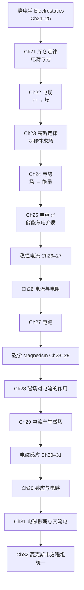
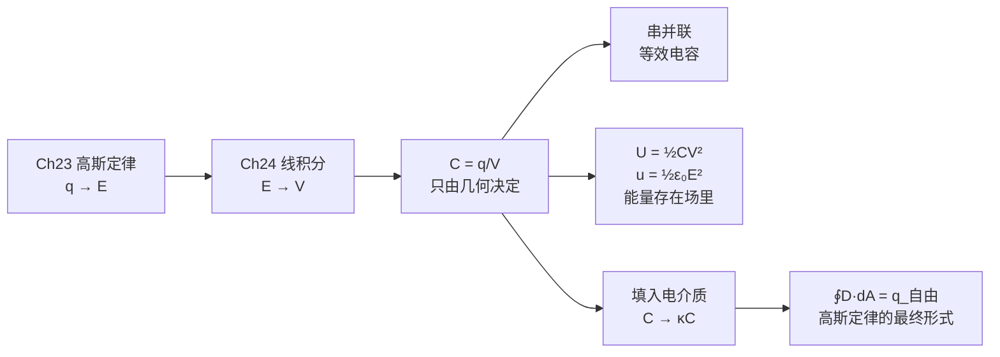

# 电磁学 MOC

本索引汇总由 `courseware/` 下的 PPTX 课件整理而成的笔记。每篇按**课件自身的分节**拆分，目标是**看完笔记即可替代听课**：课件上一行结论的地方，笔记展开成完整推导 + 易错点 + 前后联系。

## 全册脉络

## 笔记索引

> [!info] 体例说明（2026-09 起）
> 第 23、24、25 章采用**讲义体**：具体情景开场 → 由问题逼出概念 → 中途「停一下 / 课堂追问」→ 三句话小结 → 折叠答案的自测区。目标是**看完笔记就不必再听这节课**。
> 第 21、22 章仍是早期的**整理体**（学习目标 / 核心关系 / 课件原文 板块式），内容完整但叙述方式不同。若要统一，可回头按同样方式改写。
> 各篇的自测答案默认**折叠**（`> [!success]-`），点开才显示，方便自测。
>
> 讲义体三章连起来可以读成一条线：**Ch23 用对称性绕开积分求出 $\vec E$ → Ch24 把矢量 $\vec E$ 换成标量 $V$ → Ch25 用 $V$ 和高斯定律算电容与能量**。每篇篇末的「下一讲预告」就是这条线的接缝。

| 章 | 节 | 笔记 | 核心内容 | 状态 |
|---|---|---|---|---|
| 21 | 0 | [[C21.0 开篇回顾 热学遗留]] | 第19章 Q27 讲评、热学知识点清单 | ✅ |
| 21 | 1 | [[C21.1 电荷]] | 正负电荷、元电荷与量子化、电荷守恒、摩擦起电 | ✅ |
| 21 | 2 | [[C21.2 导体与绝缘体]] | 导体/绝缘体/半导体/超导体、传导电子、静电感应 | ✅ |
| 21 | 3 | [[C21.3 库仑定律]] | 库仑定律、$\varepsilon_0$ 与 $\mu_0$、叠加原理、壳层定理完整推导 | ✅ |
| 22 | 1 | [[C22.1 电场]] | 场的观点、$\vec E=\vec F/q_0$、电场线三规则 | ✅ |
| 22 | 2 | [[C22.2 点电荷的电场]] | 点电荷场、矢量叠加、例题1三电荷 | ✅ |
| 22 | 3 | [[C22.3 电偶极子的电场]] | 偶极矩、轴线与中垂线远场、$1/r^3$ 与多极展开 | ✅ |
| 22 | 4 | [[C22.4 线电荷的电场]] | 电荷密度、连续分布六步法、圆环与圆弧 | ✅ |
| 22 | 5 | [[C22.5 带电圆盘的电场]] | 圆盘轴线场、无限大平面 $\sigma/2\varepsilon_0$ | ✅ |
| 22 | 6 | [[C22.6 电场中的点电荷]] | $\vec F=q\vec E$、密立根油滴、喷墨打印 | ✅ |
| 22 | 7 | [[C22.7 电场中的电偶极子]] | 力矩 $\vec\tau=\vec p\times\vec E$、势能 $U=-\vec p\cdot\vec E$ | ✅ |
| 23 | 0 | [[C23.0 开篇回顾 统计物理遗留]] | 第20章 Q47 多重度、第22章知识点清单 | ✅ |
| 23 | 1 | [[C23.1 电通量]] | 面矢量、$\Phi=\oint\vec E\cdot d\vec A$、点电荷通量 | ✅ |
| 23 | 2 | [[C23.2 高斯定律]] | $\oint\vec E\cdot d\vec A=q_{enc}/\varepsilon_0$、面外电荷不贡献通量 | ✅ |
| 23 | 3 | [[C23.3 带电导体的电场]] | 静电平衡、空腔感应电荷、$\sigma/\varepsilon_0$、导体平板 | ✅ |
| 23 | 4 | [[C23.4 对称带电绝缘体的电场]] | 球/柱/面三种对称性与高斯面匹配、公式汇总 | ✅ |
| 24 | 0 | [[C24.0 开篇回顾 第21章遗留习题]] | 第21章 Q21/Q23、第23章知识点清单 | ✅ |
| 24 | 1 | [[C24.1 电势与电势能]] | 保守力、环路定理、$V=U/q$、等势面、电子伏特 | ✅ |
| 24 | 2 | [[C24.2 点电荷的电势]] | $V=q/4\pi\varepsilon_0r$、标量叠加、多电荷系统势能 | ✅ |
| 24 | 3 | [[C24.3 从电场算电势]] | $\Delta V=-\int\vec E\cdot d\vec s$、导体球、零势点选择 | ✅ |
| 24 | 4 | [[C24.4 叠加原理算电势]] | 连续分布积分、偶极子电势、带电棒与圆盘 | ✅ |
| 24 | 5 | [[C24.5 从电势算电场]] | $\vec E=-\nabla V$、半无限长棒 45°、泰勒展开四极项 | ✅ |
| 25 | 1 | [[C25.1 电容器与电容的计算]] | $C=q/V$、四步法、平行板/柱形/球形/孤立球 | ✅ |
| 25 | 2 | [[C25.2 电容器的串并联]] | 并联等压求电荷、串联等电荷求电压、混联倒推 | ✅ |
| 25 | 3 | [[C25.3 电场的能量]] | $U=q^2/2C=\frac12CV^2$、能量密度 $u=\frac12\varepsilon_0E^2$ | ✅ |
| 25 | 4 | [[C25.4 电介质与电介质中的高斯定律]] | $\kappa$、极化与感应电荷、$\vec D$、$\oint\vec D\cdot d\vec A=q_{自由}$ | ✅ |
| 26–32 | — | Ch26 电流与电阻 … Ch32 麦克斯韦方程组 | 课件在 `courseware/` 下，尚未整理 | ⏳ |

## 第 21 章速查

**作业题**：Problems 21，23，32，42

**必背公式**

| 公式 | 内容 |
|---|---|
| $q=ne$ | 电荷量子化，$e=1.602\ 176\ 487\times10^{-19}\ \mathrm{C}$ |
| $F=k\dfrac{\|q_1\|\|q_2\|}{r^2}$ | 库仑定律（大小） |
| $\vec F_{12}=\dfrac{1}{4\pi\varepsilon_0}\dfrac{q_1q_2}{r^2}\hat r$ | 矢量形式，$\hat r$ 由 2 指向 1 |
| $k=\dfrac{1}{4\pi\varepsilon_0}=8.99\times10^9$ | $\varepsilon_0=8.854\times10^{-12}$ |
| $\vec F_{1,net}=\sum_i \vec F_{1i}$ | 叠加原理（矢量和） |
| $c_0=\dfrac{1}{\sqrt{\varepsilon_0\mu_0}}$ | 通向 Ch32 电磁波 |

**三条最容易失分的地方**

1. 库仑定律标量式带绝对值，**方向必须另判**；矢量式下标顺序与 $\hat r$ 定义不能反。
2. 多电荷求合力必须**分解成分量再求和**，$\arctan$ 要检查象限。
3. 「导体 vs 绝缘体」的电荷分布完全不同：导体只在外表面，绝缘体可以内部任意分布。

## 原始课件位置

`courseware/Chapter 21 Coulomb Law.pptx` … `Chapter 32 Maxwell's equations.pptx`（共 12 章）

---
相关已有笔记：[[电磁学]]、[[大学物理提纲]]

## Ch22–24 速查

**作业题**：Ch22 — 18, 21, 26, 32, 37, 58 ｜ Ch23 — 16, 21, 32, 40, 43, 48, 53, 55 ｜ Ch24 — 11, 18, 28, 32, 37, 40, 61, 67

**四章的方法主线**

**静电场公式总表**

| 电荷分布 | $E$ | $V$（$V(\infty)=0$，无限大分布除外） |
|---|---|---|
| 点电荷 $q$ | $\dfrac{q}{4\pi\varepsilon_0r^2}$ | $\dfrac{q}{4\pi\varepsilon_0r}$ |
| 电偶极子（轴线，$z\gg d$） | $\dfrac{p}{2\pi\varepsilon_0z^3}$ | $\dfrac{p\cos\theta}{4\pi\varepsilon_0r^2}$ |
| 电偶极子（中垂线，$x\gg d$） | $-\dfrac{p}{4\pi\varepsilon_0x^3}$ | $0$ |
| 圆环（轴线） | $\dfrac{qz}{4\pi\varepsilon_0(R^2+z^2)^{3/2}}$ | — |
| 圆盘（轴线） | $\dfrac{\sigma}{2\varepsilon_0}\left[1-\dfrac{z}{\sqrt{z^2+R^2}}\right]$ | $\dfrac{\sigma}{2\varepsilon_0}\left(\sqrt{z^2+R^2}-z\right)$ |
| 球壳 $r>R$ / $r<R$ | $\dfrac{q}{4\pi\varepsilon_0r^2}$ / $0$ | $\dfrac{q}{4\pi\varepsilon_0r}$ / $\dfrac{q}{4\pi\varepsilon_0R}$ |
| 绝缘实心球 $r<R$ | $\dfrac{qr}{4\pi\varepsilon_0R^3}$ | — |
| 无限长线 $\lambda$ | $\dfrac{\lambda}{2\pi\varepsilon_0r}$ | $\propto\ln r$（零点不能取 $\infty$）|
| 无限大绝缘板 $\sigma$ | $\dfrac{\sigma}{2\varepsilon_0}$ | $\propto r$（零点不能取 $\infty$）|
| 导体表面外侧 $\sigma$ | $\dfrac{\sigma}{\varepsilon_0}$ | 导体是等势体 |

**跨章最容易混的五组**

1. **导体 vs 绝缘体**：导体电荷全在表面、内部 $E=0$；绝缘体电荷可任意分布、内部 $E\propto r$。
2. **$\sigma/\varepsilon_0$ vs $\sigma/2\varepsilon_0$**：药盒有 1 个还是 2 个底面在出通量。
3. **$q_{enc}=0$ vs $\vec E=0$**：前者只保证通量为零，面上仍可有场（面外电荷贡献）。
4. **$\vec E=0$ vs $V=0$**：$\vec E=-\nabla V$ 取的是变化率，$V$ 为常数即可让 $E=0$。
5. **$\Delta U$ vs $\Delta V$ 的符号**：$\Delta V=\Delta U/q$，负电荷会把符号翻过来。

**转成 PDF 的课件**：`courseware/_pdf/Chapter 22 Electric Fields.pdf`（原 pptx 过大，转换后便于快速翻阅；原文件未改动）

## 第 25 章速查

**作业题**：Ch25 — 14, 20, 26, 35, 39, 50

**本章主线**

**电容公式总表**

| 结构 | 真空中的 $C$ | 填满介质（介电常数 $\kappa$） |
|---|---|---|
| 平行板（面积 $A$，间距 $d$） | $\dfrac{\varepsilon_0A}{d}$ | $\dfrac{\kappa\varepsilon_0A}{d}$ |
| 柱形（内 $a$，外 $b$，长 $L$） | $\dfrac{2\pi\varepsilon_0L}{\ln(b/a)}$ | $\times\kappa$ |
| 球形（内 $a$，外 $b$） | $4\pi\varepsilon_0\dfrac{ab}{b-a}$ | $\times\kappa$ |
| 孤立导体球（半径 $a$） | $4\pi\varepsilon_0a$ | $\times\kappa$ |

**必背公式**

| 公式 | 内容 |
|---|---|
| $C=\dfrac{q}{V}$ | 电容定义，$q$ 是**单板**电荷 |
| $C_{eq}=\sum C_i$ ｜ $\dfrac1{C_{eq}}=\sum\dfrac1{C_i}$ | 并联 ｜ 串联（两个串联：$\dfrac{C_1C_2}{C_1+C_2}$） |
| $U=\dfrac{q^2}{2C}=\dfrac12qV=\dfrac12CV^2$ | 电容器储能；$V$ 固定用第三式，$q$ 固定用第一式 |
| $u=\dfrac12\varepsilon_0E^2$ | 电场能量密度（**能量存在场中**） |
| $C=\kappa C_0$，$E=E_0/\kappa$ | 插入电介质 |
| $q'=\dfrac{\kappa-1}{\kappa}q$，$P=\dfrac{\kappa-1}{\kappa}E_0$ | 感应电荷与退极化场（课件口径，$P$ 量纲为电场） |
| $\vec D=\kappa\varepsilon_0\vec E$，$\oint\vec D\cdot d\vec A=q_{自由}$ | 介质中的高斯定律 |

**第 25 章最容易失分的五处**

1. **做题第一句话：电源还连着吗？** 连着 → $V$ 固定；断开 → $q$ 固定。两种情形下 $V$、$E$、$U$ 的变化方向全都相反。
2. **串联要取倒数**，而且等效电容**比最小的那个还小**；别和电阻的规律搞反。
3. **介质只填一部分时不能整体替换 $\varepsilon_0\to\kappa\varepsilon_0$**，要分段积分，或看成串联。
4. **$\oint\vec D\cdot d\vec A=q$ 右边只装自由电荷**，且右边没有 $\varepsilon_0$。
5. **课件的 $P$ 不是教材的极化强度**：课件 $P=q'/\varepsilon_0A$（量纲为电场），教材 $P=q'/A$（C/m²），相差 $\varepsilon_0$ 倍。

**课件数值勘误（已独立复算）**

| 位置 | 课件写的 | 正确值 |
|---|---|---|
| Ch25 例题 5(a) | $U=8.21\times10^{-8}\ \mathrm J$ | $U=1.03\times10^{-7}\ \mathrm J$（(b) 的 $2.54\times10^{-5}$ 正确） |
| Ch25 例题 6(1) | $C_1=1.8\times10^{-7}\ \mathrm F$ | $C_1=1.77\times10^{-8}\ \mathrm F$（指数多一位） |
| Ch25 例题 6(1) | $C_2=5.4\times10^{-7}\ \mathrm F$ | $C_2=5.31\times10^{-8}\ \mathrm F$ |
| Ch25 例题 6(3) | $Q=5.4\times10^{-4}\ \mathrm C$ | $Q=5.31\times10^{-5}\ \mathrm C$ |
| Ch25 例题 6 推导 | $C_2=C_2\dfrac{V_1}{V_2}$ | 应为 $C_2=C_1\dfrac{V_1}{V_2}$ |

（$\kappa=3.0$ 这一问不受影响——它是比值，公共因子约掉了。）

**转成 PDF 的课件**：`courseware/_pdf/Chapter 24 Electric Potential.pdf`、`courseware/_pdf/Chapter 25 Capacitance.pdf`（原 pptx 未改动）
