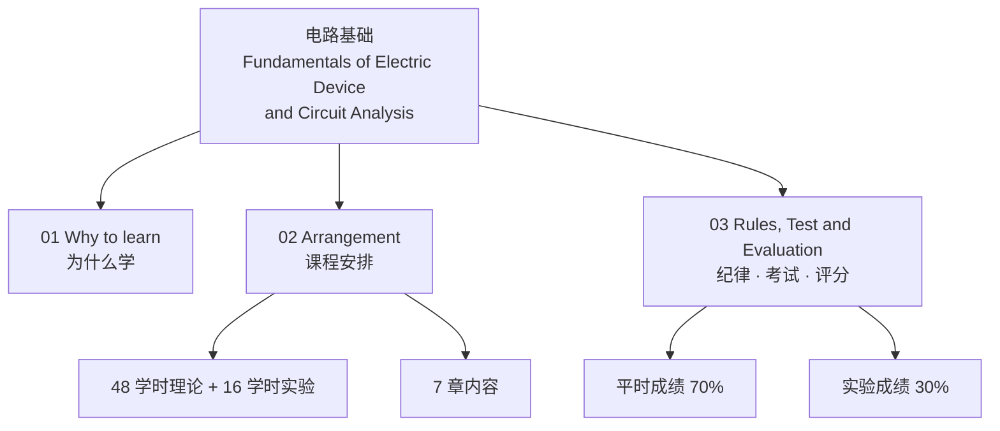
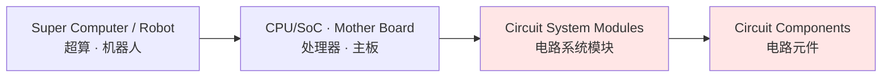

# C0 课程基本介绍 Introduction to the Course

> [!info] 一句话
> 这门课叫 **Fundamentals of Electric Device and Circuit Analysis（电子器件与电路分析基础）**，48 学时理论 + 16 学时实验，考核 = 平时 70%（考勤 20 + 作业 30 + 期末 50 + 奖励）+ 实验 30%。

---

## 1. 授课信息 Course Information

| 项目 | 内容 |
|---|---|
| 课程英文名 | Fundamentals of Electric Device and Circuit Analysis |
| 任课教师 | Jun-Hui Ou（区俊辉）、Jiali Deng（邓佳丽，负责实验） |
| 开课单位 | School of Future Technology（未来技术学院），华南理工大学 |
| 沟通群 | QQ 群「26年未院电路课沟通群」，群号 **1085683119** |

> [!note] 老师会补充：为什么由未来技术学院开这门课
> 未来技术学院偏 AI / 智能方向，学生大多把注意力放在算法层。课程第 4 页那张「超算 → CPU/主板 → 电路系统模块 → 电路元件」的递进图，就是老师用来回答"我学 AI 为什么要学电路"的：**你写的算法最终是跑在电路上的**，模型推理的延迟、功耗、能不能做到端侧，最后都落在电路层面。

---

## 2. 为什么要学这门课 Why Learn This Course

课件给的三条理由（第 4 页，红字部分）：

1. **When the algorithm you design is executing, it is all kind of circuits that support the execution.**
   你设计的算法在执行时，支撑它执行的是各种各样的电路。
2. **It helps you know better how an electronics circuit works.**
   帮助你更好地理解电子电路是怎么工作的。
3. **It's a necessary subject in the test for pursuing Master Degree.**
   考研必考科目。

### 我们会学到什么 (第 5 页)

- Some basic rules of an electronic circuit —— 电子电路的基本**规则/定律**（KCL、KVL、特勒根定理）
- Analysis tools for evaluating a circuit's working condition and performance —— 评估电路**工作状态与性能**的分析工具（支路法、节点法、相量法、三要素法……）
- Some basic components: **diodes（二极管）, transistors（晶体管）**…
- Some basic modules in an electronic system: **amplifier（放大器）, power source（电源）**…
- **Practical experiments** —— 实践实验

> [!warning] 老师原话
> **Not easy, needs hard work and focus.**（不容易，需要下功夫、需要专注。）
> 这句话配合第 9 页的"Juiceful knowledge, hard to understand at the first glance"（知识密度高，第一眼看不懂），是老师在打预防针：这门课不是靠考前背公式能过的课。

### 知识的层次结构（第 4 页图的文字复现）

> [!important] 图的读法
> 红色虚线框住的是 **Circuit System Modules + Circuit Components** —— 这两层才是本课程的范围。左边两层（整机、芯片/主板）是这门课的**动机**，不是这门课的**内容**。

---

## 3. 课程安排 Course Arrangements

- **Schedule**：Lectures for **48 class hours**（理论 48 学时），experiments for **16 class hours**（实验 16 学时）。
- **Location**：课件上留空，以实际通知为准。

### 内容安排（第 7 页表格原样抄录）

| Chapter No. | Chapter Name | 中文 | 讲授范围 |
|---|---|---|---|
| 1 | Basic concept and laws of Circuit | 电路的基本概念与基本定律 | ALL（全讲） |
| 2 | Basic circuit models for electronic devices | 电子器件的基本电路模型 | ALL（全讲） |
| 3 | Basic methods for circuit analysis | 电路分析的基本方法 | ALL（全讲） |
| 4 | AC steady state circuit analysis | 交流稳态电路分析 | 4.1–4.3, 4.4–4.5 **或** 4.6–4.7 |
| 5 | Transient analysis of linear dynamic circuit | 线性动态电路的暂态分析 | 5.1–5.4 |
| 6 | Discrete element amplifier circuit foundation | 分立元件放大电路基础 | 6.1–6.3, 6.5–6.6 |
| 7 | Integrated amplifier and its applications | 集成放大器及其应用 | 2.1, 2.2, 2.3, part of 2.4 |

> [!note] 表格的读法（老师会顺带说的）
> - 第 7 章那一列写的是「2.1, 2.2, 2.3, part of 2.4」而不是「7.x」，说明**第 7 章用的是另一本教材/另一套编号**（集成运放部分通常来自模电教材），别以为是印错了。
> - 第 4 章给了「4.4-4.5 **or** 4.6-4.7」两个选项，说明这部分**会按进度二选一**——期末复习前一定要确认到底讲了哪一半。
> - 前三章标 ALL，说明**第 1–3 章是绝对重点**，是后面所有章节的地基。

---

## 4. 纪律、考试与评分 Rules, Test and Evaluation

### 4.1 学习方式建议（第 9 页）

- Juiceful knowledge, hard to understand at the first glance. —— 知识密度大，第一眼很难懂。
- **Needs hardwork on listening in class rather than study only after class.** —— 要靠上课认真听，而不是只靠课后自学。
- **Learn with understanding is way better than learn by rote（死记硬背）.** —— 理解式学习远好于死记硬背。
- **Only one test in Week 18. Closed-book exam.** —— 只有一次考试，第 18 周，**闭卷**。

### 4.2 成绩构成（第 10 页）

$$
\text{总评} = \underbrace{70\%}_{\text{Methetical Evaluation}} + \underbrace{30\%}_{\text{Experiment Evaluation}}
$$

**平时（理论）70% 内部构成：**

$$
\text{Attendance }20\% + \text{Exercises }30\% + \text{Exam }50\% + \text{Reward}
$$

> [!warning] 这里极易算错
> 这个 20/30/50 是**理论那 70 分内部的百分比**，不是总评的百分比。换算到 100 分总评：
> - 考勤 $70\% \times 20\% = 14$ 分
> - 作业 $70\% \times 30\% = 21$ 分
> - 期末考试 $70\% \times 50\% = 35$ 分
> - 实验 $30$ 分
> 也就是说，**期末闭卷考试只占总评 35 分**，考勤 + 作业 + 实验合计 65 分。这门课平时分的权重远大于直觉。

**实验 30%**：Reports and final experiment（实验报告 + 期末实验），由 Miss Deng（邓佳丽老师）决定并公布细则。

### 4.3 作业与考勤的"清零"规则

| 项目 | 次数 | 计分方式 | 清零条件 |
|---|---|---|---|
| Exercise（作业） | 6–8 次 | 取**平均分** average | **无故缺交 3 次 → 该部分全部清零（lose all points）** |
| Attendance（考勤） | 随机 **6 次** | 每次随机点 **6 人** | 无故**全缺勤或迟到**；缺勤达 **3 次 → 该部分全部清零** |

> [!warning] 最危险的两条规则
> "If the absense reaches **3 times** (with no reason), **lose all points** for this part."
> 这不是扣 3 次的分，是**整个 30%（作业）或 20%（考勤）归零**。折算成总评就是直接丢 21 分或 14 分——一次都不能大意。
> 考勤是**随机 6 次、每次随机点 6 人**，所以"没被点到"不等于安全，被点到那次没人才算缺勤。

### 4.4 实验课与理论课的关系

> The progress is almost independent, while part of the content is coincided. Since the experiment class takes fewer weeks the ends earlier, some of the content in that class may be **superior to**（超前于）this class.

进度基本独立，内容部分重合；实验课周数少、结束早，所以**实验课可能会讲到理论课还没讲的内容**——遇到没学过的概念是正常的，别慌，回头对照理论课笔记补。

### 4.5 奖励分 Reward（第 11 页）

| 途径 | 单次 | 上限 |
|---|---|---|
| (1) Answer the questions during class（课堂答题） | 1 point | 5 points |
| (2) Providing active advises or pointing out problems about class（提出有效建议或指出课程问题） | 1 point（若 2 人几乎同时提出且都有效，**每人 0.5 分**） | 5 points |
| **合计** | — | **8 points（总上限）** |

细则：
- 建议的范围包括课程、教学、老师本人；**不包括 PPT 里的错别字**（但课上说过，指出来同样会被感谢）。
- 有效性由老师判定："I will take every advise into consideration. Once an advice is considered valid…"
- **The total reward won't exceed 8 points! This reward points will be added to the excersize part!**
  奖励分加在**作业（Exercises）**那一项上，且加完后**总分不超过 100**。

> [!note] 策略提示（老师没明说，但规则暗示了）
> 奖励分加在作业项（占理论 30%），而两条途径各自上限 5 分、合计上限 8 分。也就是说光靠课堂答题最多拿 5 分，**要吃满 8 分必须两条路都走**。对作业分不理想的人，课堂举手回答问题是性价比最高的补救方式。

---

## 5. 本节自测 Self-Test

> [!question] Q1：期末考试在总评里到底占多少分？
> **A**：35 分。理论部分占总评 70%，考试占理论部分的 50%，$70\% \times 50\% = 35\%$。

> [!question] Q2：作业交了 5 次、无故没交 3 次，作业分怎么算？
> **A**：0 分。不是按 5 次取平均，"absense reaches 3 times (with no reason) → lose all points for this part"，整个作业项（理论分的 30%，即总评 21 分）清零。

> [!question] Q3：某次考勤没被点到名，算不算缺勤？
> **A**：不算。考勤是随机 6 次、每次随机抽 6 人，只有被抽到时人不在（或迟到）才记缺勤。

> [!question] Q4：奖励分能不能把总评刷到 105 分？
> **A**：不能。"The final score won't exceed 100 after the sum."，且奖励总上限 8 分，加在作业项上。

> [!question] Q5：第 4 章为什么写「4.4-4.5 or 4.6-4.7」？
> **A**：这部分内容会按实际进度二选一讲授，复习时必须确认本学期实际讲了哪一组，不要两组都背或都不背。

> [!question] Q6：实验课讲到了理论课没学的内容，说明什么？
> **A**：正常现象。两条线进度独立，实验课周数少结束早，内容会超前（superior to）理论课。

---

## 6. 延伸与关联

- 本课的 7 章中，**第 1–3 章标注 ALL 且是全部后续内容的基础**，第 1 章从下一篇 [[C1.1 电路分析的演化]] 开始。
- 课程涉及的元件（二极管、晶体管）在 [[C2.2 单端口器件的电路模型]] 与 [[C2.3 双端口器件的电路模型]] 中建立模型，第 6、7 章的放大器就建立在这些模型之上。

---

**下一节 →** [[C1.1 电路分析的演化]]
**课程索引 →** [[电路基础 MOC]]
