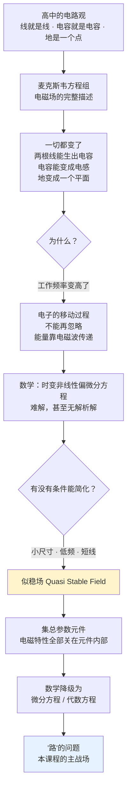

# C1.1 电路分析的演化 The "Evolution" of Circuit Analysis

> [!abstract] 这一讲的任务
> 你在高中已经会解电路了：滑动变阻器、电压表、电流表、电池、开关——一根导线就是一根导线，一个电容就是一个电容，**一切都很简单**。
> 这一讲要做一件不太友好的事：**把这份简单先拆掉，再重新造回来**。拆掉，是为了让你明白大学电路课到底在处理什么问题；造回来，是为了给出一张"什么时候可以继续用简单方法"的许可证。那张许可证的名字叫**似稳场**，而它发的证叫**集总参数元件**。
> 本讲不需要任何计算，但它是整门课的**地基**：后面每一章的每一个公式，都默认站在这张许可证上。

> [!info] 怎么读这份讲义
> 顺读即可。带 `> [!question]` 的地方请真的停一下再展开答案。
> 标有 **（拓展）** 或 **【拓展】** 的内容，是**课堂上没有讲到、由课件和教材延伸补充**的部分。复习时可先掌握未标注的主干内容，行有余力再看拓展部分。

---

## 0. 开场：一张你做过几十遍的电路图

黑板上是一张图：一个电池、一个开关 S、一个定值电阻 $R_1$、一个滑动变阻器 $R_2$（滑动端标着 a、P、b），外加一个电流表 A 和两个电压表 $V_1$、$V_2$。

这张图你在高考复习里做过几十遍。滑片往左移，$R_2$ 变大，电流变小，$V_1$ 读数……你闭着眼都能推。

现在把这张图上的每一样东西**逐一点名**：

- 滑动变阻器 → 一个可变电阻，仅此而已；
- 电压表 → 一个理想的"读数器"，接上去不影响电路；
- 开关 → 通或断，没有第三种状态；
- **一根导线 → 就是一根导线**（a line is a line）；
- **一个电容 → 就是一个电容**（a capacitance is a capacitance）；
- 地 → 一个电位为 0 的**点**。

**Everything is simple.** 一切都很简单——

**直到这个人出现。**

![[C1-麦克斯韦与方程组.png]]

**James Clerk Maxwell（1831–1879）**，电磁学的集大成者。他提出的方程组被公认为**世界上最优美的方程组之一**：它用四行讲清了电和磁的全部关系——**动磁生电，动电生磁**。

而对我们来说，坏消息是：**他出现之后，上面那份简单全崩了。**

---

## 1. 麦克斯韦方程组：四行改变了一切（课件 p.4）

课件 p.4 把四条方程的微分形式与积分形式并排列出，右边给出中文名与一句话物理含义：

| 微分形式 | 积分形式 | 名称 | 一句话 |
|---|---|---|---|
| $\nabla\times\boldsymbol E=-\dfrac{\partial \boldsymbol B}{\partial t}$ | $\oint \boldsymbol E\cdot\mathrm d\boldsymbol l=-\displaystyle\iint\dfrac{\partial \boldsymbol B}{\partial t}\cdot\mathrm d\boldsymbol S$ | 电磁感应定律 | **动磁生电** |
| $\nabla\times\boldsymbol H=\boldsymbol J+\dfrac{\partial \boldsymbol D}{\partial t}$ | $\oint \boldsymbol H\cdot\mathrm d\boldsymbol l=\displaystyle\iint \boldsymbol J\cdot\mathrm d\boldsymbol S+\iint\dfrac{\partial \boldsymbol D}{\partial t}\cdot\mathrm d\boldsymbol S$ | 安培环路定理 | **动电生磁** |
| $\nabla\cdot\boldsymbol D=\rho$ | $\oiint \boldsymbol D\cdot\mathrm d\boldsymbol S=\displaystyle\iiint\rho\,\mathrm dV$ | 电高斯定理 | **电力线起止于电荷**，电场为有源场 |
| $\nabla\cdot\boldsymbol B=0$ | $\oiint \boldsymbol B\cdot\mathrm d\boldsymbol S=0$ | 磁高斯定理 | **磁力线为闭合曲线**，磁场为无源场 |

> [!note] 这四条为什么会"毁掉"简单的电路分析
> 盯住前两条：**它们把电和磁绑成了一对互相激发的量**。
> - 第一条说：只要有**变化的磁场**，周围就会出现**电场**——哪怕那里什么元件都没有，只是一段空气。
> - 第二条说：只要有**变化的电场**，周围就会出现**磁场**——注意 $\partial\boldsymbol D/\partial t$ 这一项（位移电流），它意味着**即使没有导线连着，电流也能"接着走下去"**。
>
> 于是：两根平行导线之间的空气里有变化的电场 → 它储存电场能 → **这就是电容**。一根导线周围有变化的磁场 → 它储存磁场能 → **这就是电感**。
> **电容和电感不再是你"焊上去"的元件，而是电磁场自己长出来的。** 这就是下一页那三句怪话的全部来源。

---

## 2. 麦克斯韦之后：三句怪话（课件 p.5）

课件 p.5 用一个左右对照的虚线框，把变化写得很直白：

| Before（高中） | After（大学） |
|---|---|
| Two lines are two lines. 两根导线就是两根导线 | **Two lines can create capacitance.** 两根导线可以产生电容 |
| A capacitance is a capacitance. 一个电容就是一个电容 | **A capacitance can turn to an inductance.** 一个电容可以变成一个电感 |
| The ground is point with 0 V. 地是一个 0 电位的点 | **The ground can be a plane.** 地可以是一个平面 |

页面底下用红字问了一句：**Does anybody know why there is such a change?**

> [!question] 停一下，先自己想想
> 三句话里，第二句最反直觉：**一个电容怎么会变成电感？** 它明明是两块极板，和线圈八竿子打不着。
> 试着回答：要让"电容表现得像电感"，需要满足什么条件？

> [!success]- 想过了再看
> 关键在于**电容不是只有电容**。真实电容器有两根**引脚**（金属引线），引脚是导体，通交流电时会产生感应电动势——也就是**寄生电感 ESL**。
> 于是一个真实电容 = 理想电容 C **串联**一个寄生电感 L（还有引脚电阻 R）。
> 这个 LC 串联支路有一个**自谐振频率**：
> $$f_0=\frac{1}{2\pi\sqrt{L\cdot C}}$$
> - $f<f_0$：容抗 $1/\omega C$ 占主导 → 整体看起来像**电容**；
> - $f>f_0$：感抗 $\omega L$ 占主导 → 整体看起来像**电感**。
>
> **所以"电容变成电感"不是比喻，是一个可以算出频率点的事实。** 这个模型会在 [[C2.2 单端口器件的电路模型]] 正式给出，在 [[C4.2 元件相量模型与阻抗导纳]] 定量算出来。
> 第三句"地变成平面"同理：高频下地线本身有分布电感和阻抗，不同位置的"地"电位并不相等，只能当成一个**有分布的导体平面**来处理。

### 为什么会变？（课件 p.6 的 Answer）

课件 p.6 给了三行答案：

> [!important] Answer（课件 p.6 原文）
> - The circuits in high school operates in **very low frequency**.（高中的电路工作在很低的频率下。）
> - In **high frequency (usually beyond 1 MHz)**, the progress of **electron movement（电子移动）** should be considered. The transmission turns to the **variation of electromagnetic waves**.
> - Look at the equations on Page 4&5, we can find that the analysis of such kind of problem is really, really **complicated**.

第二条是整段的核心，把它翻译透：

**高中电路里，电流 = 电子移动。** 你只关心电子"有没有出发、有没有到达"，中间发生了什么一律不管。
**大学电路里（高频下），能量传递实际上是靠电磁波的变化完成的。** 电子在导线里怎么走、走多宽的路、拐了几个弯、遇到多大阻力——**这些过程本身开始决定结果**。

> [!note] 课堂上的一个数量级对比（课件没写，课上算过）
> - 高中见过的最高频率是什么？**交流电 50 Hz**（工频市电）。
> - 你现在用的 CPU 是多少？**通常几个 GHz，比如 4 GHz = $4\times10^9$ Hz**，超频还能更高。
>
> 两者相差 **八个数量级**。频率提高八个数量级，对应波长缩短八个数量级——这就是"同一套物理，两种世界"的原因。

> [!warning] "1 MHz"不是一条绝对的分界线
> 课件写的是 "usually beyond 1 MHz"，注意 **usually**。
> 真正的判据不是频率本身，而是**电路尺寸与波长的比值**（第 3 节的三个条件、以及 [[C2.1 元件互连与传输线模型]] 的"电长度"）。
> 一块 1 cm² 的芯片在 1 GHz 下可能仍算集总；一条 3000 km 的输电线在 50 Hz 下**反而必须**按分布参数处理（$\lambda = 3\times10^8/50 = 6000\ \mathrm{km}$，线长已是波长的一半）。
> **记判据，不要记数字。**

---

## 3. 把简单要回来：似稳场（课件 p.7–8）

课件 p.7 开头那句话写得很有生气：**"We want our simple circuit analysis back!"**（我们想把简单的电路分析要回来！）

然后给出条件：**Ok. In some conditions, the circuit analysis can be simplified.**

### 3.1 三个前提条件（课件 p.7）

> [!important] 可以简化的三个条件（课件 p.7 原文）
> - **Small size**（much smaller than the operation wavelength）——尺寸远小于工作波长
> - **Low frequency**（much smaller than the characteristic frequency）——频率远低于特征频率
> - **Short line**（much shorter than the operation wavelength）——导线远短于工作波长
>
> 满足这三条时，导线与元件的电磁特性**可以被集中在元件/导线内部**（concentrated inside the line/component），这样的元件就叫 **集总参数元件 Lumped component**。

> [!question] 课堂追问：波长和频率是什么关系？50 Hz 对应多长的波？
> 先自己算一遍再看答案。

> [!success]- 答案
> $$c=\lambda f\quad\Longrightarrow\quad \lambda=\frac{c}{f}=\frac{3\times10^8\ \mathrm{m/s}}{50\ \mathrm{Hz}}=6\times10^6\ \mathrm{m}=6000\ \mathrm{km}$$
> **六千公里**——几乎是从广州到乌鲁木齐再折返的距离。
> 所以在 50 Hz 下，你实验台上那根 30 cm 的导线，电长度是 $0.3/6\times10^6 = 5\times10^{-8}$ 个波长，**远远小于 1**，当然可以当理想导线。
> 反过来，4 GHz 下 $\lambda=7.5\ \mathrm{cm}$，主板上一条 3 cm 的走线就是 0.4 个波长——**必须按传输线处理**。这就是为什么高速 PCB 设计是一门独立的手艺。

### 3.2 似稳场下的四条约定（课件 p.8）

> [!important] 似稳场 Quasi stable field（课件 p.8 原文四条）
> - **Line**（导线）：Ideal, doesn't consume power, no coupling with others.
>   理想、**不消耗功率**、**与其他部分无耦合**。
> - **Capacitance**（电容）：Charge and electrical field only stage in the component.
>   **电荷与电场只存在于元件内部**。
> - **Inductance**（电感）：Magnetic field stays only in the inductance.
>   **磁场只停留在电感内部**。
> - **Resistance**（电阻）：The power conversion between electromagnetic power and other forms of power only happens here.
>   **电磁能与其他形式能量之间的转换只发生在电阻内部**。
>
> **总结（课件 p.8 加粗结论句）**：In all, in quasi stable field, we can simply consider the problem in a **"circuit（路的问题）"** instead of the **"field（场的问题）"**.

> [!note] 这四条的内在逻辑：一场彻底的"分工"
> 把四条连起来读，会发现它们在做同一件事——**给每种物理现象指定唯一的发生地点，并禁止它外溢**：
>
> | 物理现象 | 唯一发生地 | 被禁止的事 |
> |---|---|---|
> | 储存电场能 | 电容内部 | 电场跑到元件外面去 |
> | 储存磁场能 | 电感内部 | 磁场跑到元件外面去 |
> | 能量耗散（转热） | 电阻内部 | 导线上发热 |
> | （什么都不发生） | 导线 | 导线耗能、导线之间互相影响 |
>
> **一旦分工成立，"元件之间的空间"就变成了一片什么都不发生的真空**，于是你只需要知道"谁连着谁"（拓扑）和"每个元件是什么"（VCR）——这正是 [[C3.1 直流稳态与电路分析总览]] 说的"拓扑 + 元件"。
> **这就是"场的问题"变成"路的问题"的全部含义。**

> [!warning] 但现实里导线真的不耗能吗？
> 当然不。课上专门追问过这一点：导线有等效电阻，**即便是导电率最高的材料也依然会损耗**。
> 正因为如此，**超导才那么重要**——如果真的能实现常温超导，很多事情会发生根本性变化。
> 所以请记住：似稳场下的四条不是"事实"，是**近似**。它们成立的前提就是 3.1 节那三个条件。第 2 章整章要做的事，就是把这四条约定**一条条撕掉**，看看不近似时真实器件长什么样。→ [[C2.1 元件互连与传输线模型]]

---

## 4. 集总参数元件：这张许可证到底省了什么（课件 p.9）

> [!important] 集总参数元件 Lumped component（课件 p.9 原文）
> - The electromagnetic characteristic of each component can be **totally concentrated inside the component with negligible size**.
>   每个元件的电磁特性可以**完全集中在尺寸可忽略的元件内部**。
> - The circuit composed of these components can be called **lumped circuit（集总电路）**。
>
> 与之对应的另一个专有名词（课上补充）是 **distributed component（分布参数元件）**：必须考虑元件与导线**内部**电磁特性的那一类。→ [[C2.1 元件互连与传输线模型]]

### 为什么说集总"简化了"问题？课件用数学给了答案

> [!important] Why is the lumped component and circuit considered simplified?（课件 p.9）
> **Math: time dependent nonlinear partial differential equation（时变非线性偏微分方程）→ differential or algebraic equations（微分方程或代数方程）**

> [!question] 停一下，先自己想想
> 这两类方程的求解难度差多少？为什么"降级"这件事这么值钱？

> [!success]- 想过了再看
> 差得非常远，而且不只是"慢一点"的问题：
>
> | | 场的问题 | 路的问题 |
> |---|---|---|
> | 方程类型 | **时变非线性偏微分方程** | 微分方程 / **代数方程** |
> | 未知量 | $\boldsymbol E(x,y,z,t)$、$\boldsymbol H(x,y,z,t)$——**四维连续场** | $u_b(t)$、$i_b(t)$——**有限个数** |
> | 解析解 | **常常根本不存在**（超越方程未必解得出） | 线性电路**必定有唯一解** |
> | 工具 | 数值仿真、有限元 | 初中就学过的解方程 |
>
> 最关键的一条是**未知量的数量级从"连续无穷"降到"有限个"**：场问题要求你知道空间中每一点的场强；路问题只要求你知道**每条支路的一个电压和一个电流**。
> 这就是 [[C3.3 电阻网络的系统分析]] 里那句"共 $2B$ 个未知数"的来历——**$2B$ 是个有限数，这件事本身就是似稳场给的礼物。**
>
> 顺带一提：本课程只做"路"的问题，"场"的问题只会简要提及。真要展开，那是《电磁场与电磁波》的内容——而你们这个专业并不开这门课，可以放心。

> [!note] 一个伏笔：电阻不一定是正实数（拓展）
> 课件到这里就收尾了，但后面两处会打破你对电阻的认识，值得先记住：
> - **电阻可以是负的**：含受控源的二端网络，入端电阻 $R_{ab}=(1-\beta)R$ 在 $\beta>1$ 时为负，而且有明确物理意义（振荡器）。→ [[C3.2 电阻网络等效化简]]
> - **电阻可以是复数**：进入交流分析后，"电阻"被推广成**阻抗** $Z=R+\mathrm jX$，虚部正是本讲说的那些寄生电容、电感带来的。→ [[C4.2 元件相量模型与阻抗导纳]]
>
> 换句话说：这一讲拆掉的那份"简单"，会在第 2、4 章被**正式地、定量地**拆得更彻底。

---

## 这一讲的三句话

1. **高中电路之所以简单，是因为频率极低**。麦克斯韦方程组一旦生效（高频，通常 1 MHz 以上），两根线会生出电容、电容会变成电感、地会变成平面——**因为电容电感不是焊上去的，是电磁场自己长出来的**。
2. **似稳场是一张许可证**：尺寸远小于波长、频率足够低、导线足够短。拿到它，就可以约定"电场只在电容里、磁场只在电感里、耗能只在电阻里、导线什么都不干"——**"场的问题"于是降级为"路的问题"**。
3. **这张许可证在数学上值多少？** 把时变非线性偏微分方程降级成微分/代数方程，把连续场的无穷未知量降成 $2B$ 个有限未知量。**本课程 99% 的内容都建立在这一步之上。**

**速查表**

| 概念 | 要点 |
|---|---|
| 麦克斯韦四方程 | 电磁感应（动磁生电）、安培环路（动电生磁）、电高斯（有源场）、磁高斯（无源场） |
| 高频分界 | 通常 1 MHz 以上，**但真正判据是电长度**而非频率 |
| 波长公式 | $\lambda=c/f$；50 Hz → 6000 km；4 GHz → 7.5 cm |
| 似稳场三条件 | 小尺寸、低频、短线（均相对**工作波长**而言） |
| 似稳场四约定 | 导线理想不耗能不耦合；电场只在 C 内；磁场只在 L 内；能量转换只在 R 内 |
| 集总参数元件 | 电磁特性完全集中在元件内部，尺寸可忽略 |
| 分布参数元件 | 必须考虑元件/导线内部电磁特性者 |
| 数学意义 | 时变非线性偏微分方程 → 微分/代数方程 |

**下一讲预告**：许可证到手了，接下来该认识"路"这个世界里的居民。下一讲只有四个基本量——电流、电压、功率、电能——你在高中全学过。但其中会插进一个高中从来没有的概念：**参考方向**。它看起来只是"画个箭头"，却是这门课**最容易丢分的地方**，也是往后每一道题的第一步。→ [[C1.2 电路的基本概念]]

---

## 本节自测 Self-Test

> [!question] Q1：为什么高中的电路分析在高频下失效？

> [!success]- 答案
> 高中电路工作在极低频（最高不过 50 Hz 工频），电路尺寸远小于波长，**电子移动的过程可以忽略**，只需关心"出发/到达"。
> 高频下（通常 1 MHz 以上）波长缩短到与电路尺寸可比，电子移动的过程本身开始影响结果，能量传递变成**电磁波的变化**，必须回到麦克斯韦方程组，问题变成时变非线性偏微分方程。

> [!question] Q2：似稳场的三个前提条件是什么？三者是并列还是有主次？

> [!success]- 答案
> 小尺寸（$\ll$ 工作波长）、低频（$\ll$ 特征频率）、短线（$\ll$ 工作波长）。
> 三者**本质是同一件事的三个侧面**：都在说"电路的几何尺寸相对波长足够小"。频率决定波长，波长与尺寸比较，得到电长度。所以真正的单一判据是**电长度 $\ll 1$**（→ [[C2.1 元件互连与传输线模型]]）。

> [!question] Q3："一个电容可以变成一个电感"具体是什么意思？给出定量判据。

> [!success]- 答案
> 真实电容器 = 理想电容 $C$ 串联寄生电感 ESL（来自引脚）与寄生电阻 ESR。该串联支路的自谐振频率
> $$f_0=\frac{1}{2\pi\sqrt{\mathrm{ESL}\cdot C}}$$
> $f<f_0$ 时容抗主导，器件呈**容性**；$f>f_0$ 时感抗主导，器件呈**感性**。
> 所以"变成电感"是一个可以算出频率点的事实，不是比喻。→ [[C2.2 单端口器件的电路模型]]

> [!question] Q4：集总假设在数学上到底省掉了什么？

> [!success]- 答案
> 两件事：
> ① **方程类型降级**：时变非线性偏微分方程 → 微分方程或代数方程（后者初中就会解）。
> ② **未知量从连续无穷降到有限个**：场问题要知道空间每一点的 $\boldsymbol E,\boldsymbol H$；路问题只要知道每条支路的一个 $u_b$ 和一个 $i_b$，共 $2B$ 个。
> 并且线性集总电路**必有唯一解**，而场问题的解析解常常根本不存在。

> [!question] Q5：似稳场四条约定中，"导线不消耗功率、与其他部分无耦合"分别忽略了什么真实效应？

> [!success]- 答案
> "不消耗功率"忽略了导线的**电阻损耗**（高频下还因趋肤效应显著增大）；
> "无耦合"忽略了导线之间的**分布电容效应**（串扰）与**分布电感效应**（互感）。
> 这三样正是 [[C2.1 元件互连与传输线模型]] 要逐条补回来的内容，也是均匀传输线 RLGC 模型中 $R_0$、$C_0$、$L_0$、$G_0$ 四个参数的由来。

> [!question] Q6：麦克斯韦四条方程中，哪一条是 KVL 在低频下成立的根源？

> [!success]- 答案
> **第一条，电磁感应定律** $\oint\boldsymbol E\cdot\mathrm d\boldsymbol l=-\iint\frac{\partial\boldsymbol B}{\partial t}\cdot\mathrm d\boldsymbol S$。
> 当回路内磁通不随时间变化（或变化可忽略，即似稳条件）时，右端为零，得 $\oint\boldsymbol E\cdot\mathrm d\boldsymbol l=0$——沿闭合回路电压降之和为零，这就是 KVL。
> [[C1.5 电路分析的基本定律]] 会给出完整推导。

> [!question] Q7：一条 3000 km 的 50 Hz 输电线，能当集总电路处理吗？

> [!success]- 答案
> **不能**。$\lambda=c/f=6000\ \mathrm{km}$，线长 3000 km 恰为 $\lambda/2$，电长度 = 0.5，**远不满足 $\ll 1$**。
> 这说明判据是**电长度**而非频率本身：频率再低，只要线足够长，照样必须按分布参数（传输线）处理。超高压远距离输电的确要考虑行波、反射等分布效应。

> [!question] Q8：为什么说本课程研究的是"路"而不是"场"？这个选择的代价是什么？

> [!success]- 答案
> 因为似稳场条件下电磁特性被约定为"各归其位、互不外溢"，元件之间的空间不再发生任何物理过程，于是只需关心**连接关系（拓扑）+ 元件特性（VCR）**，即"路"。
> 代价是**牺牲了精度与适用范围**：所有高频寄生效应、耦合、辐射都被忽略。第 2 章会展示代价具体有多大，第 4 章会用阻抗把其中一部分定量补回来。

---

**上一节 ←** [[C0 课程基本介绍]]
**下一节 →** [[C1.2 电路的基本概念]]
**课程索引 →** [[电路基础 MOC]]
