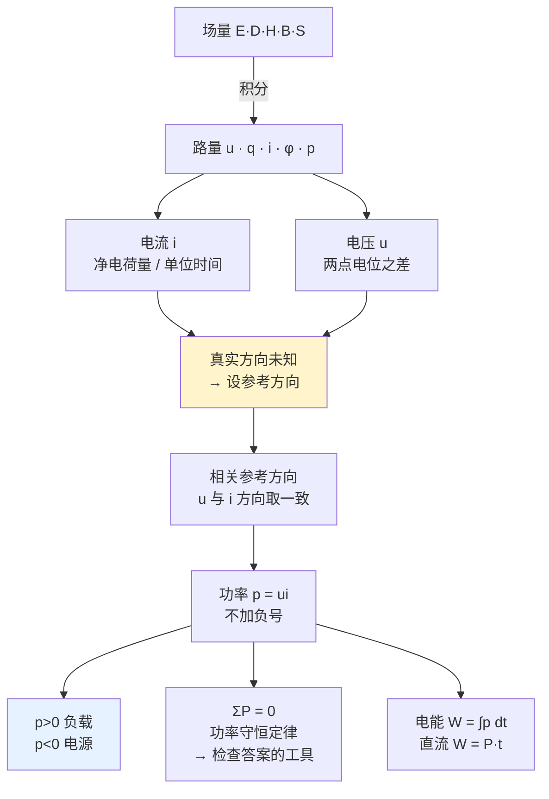

# C1.2 电路的基本概念 Basic Concepts of a Circuit

> [!abstract] 这一讲的任务
> [[C1.1 电路分析的演化]] 拿到了"用路的方法"的许可证。这一讲开始认识"路"里的居民：**电流、电压、功率、电能**——四个你高中全学过的量。
> 所以这一讲的真正主角**不是它们**，而是一个高中从未出现过的东西：**参考方向**。它看起来只是"随手画个箭头"，却是这门课**每一道题的第一步**，也是**最容易丢分的地方**。这一讲会把它讲到你再也设不错为止。
> 附带一个立刻能用的结论：**在相关参考方向下，功率为正是负载、为负是电源**——这个判别题在过去五年的考试里**出现过三次**。

> [!info] 怎么读这份讲义
> 建议顺读。带 `> [!question]` 处先自己想再展开。
> 标有 **（拓展）** 或 **【拓展】** 的内容，是**课堂上没有讲到、由课件和教材延伸补充**的部分。复习时可先掌握未标注的主干内容，行有余力再看拓展部分。

---

## 0. 开场：一道你答不上来的简单题

给你一条支路，两端标着 a、b，中间是个电阻。问：**这条支路里的电流往哪个方向流？**

你会说：那得看电路怎么接、电源在哪边。对——**可现在我还没告诉你**。而列方程这件事，必须**在你知道答案之前**就开始。

这就是大学电路和高中电路的第一个分水岭。高中题目里，电流方向几乎总是一眼可见（一个电池、一条回路）；大学的电路里，**六条支路里有五条你压根看不出方向**。

那怎么办？**不猜。** 随手画一个箭头，宣布"我就管这个方向叫正"，然后照常列方程。解出来如果是 $+3\ \mathrm{A}$，说明猜对了；解出来是 $-3\ \mathrm{A}$，说明实际方向和箭头相反——**但方程一个字都不用改**。

> [!question] 停一下，先自己想想
> 这个做法看起来像"耍赖"。凭什么随便画个箭头，算出来的结果就一定对？

> [!success]- 想过了再看
> 因为**电流只有两种可能：正向或负向，没有第三种**（课件 p.15 原文："The current is either positive or negative. Only **two options**."）。
> 你画的箭头不是在"预测"方向，而是在**定义一个正方向**——相当于给这条支路建了一个一维坐标系。真实电流是这个坐标系上的一个**带符号的实数**，箭头方向只影响这个数的正负号，不影响物理。
> 课件 p.15 说得很干脆：**"There is no true or false on setting the reference direction. It only affects the polarization（正负极性）in mathematical calculation."**
> **所以参考方向不是猜测，是记账用的符号约定。** 这一条想通了，这一讲就过了一半。

---

## 1. 场量与路量的对应（课件 p.11）（拓展）

> [!note] 授课进度说明
> 课件 p.11 这张表在课堂上一带而过（原话大意是"这些你们高中都学过，这里就不多说了"）。它不是考点，但**理解它能让你明白"路量"到底从哪来**。下面这一小节整体属于拓展内容。

| 场量 Field Quantity | 路量 Circuit Quantity | 关系 |
|---|---|---|
| 电场强度 $\boldsymbol E$ | 电压 $u$ | $u=\displaystyle\int \boldsymbol E\cdot\mathrm d\boldsymbol l$ |
| 电位移矢量 $\boldsymbol D$ | 电荷 $q$ | $q=\displaystyle\oiint \boldsymbol D\cdot\mathrm d\boldsymbol S$ |
| 磁场强度 $\boldsymbol H$ | 电流 $i$ | $i=\displaystyle\int \boldsymbol H\cdot\mathrm d\boldsymbol l$ |
| 磁感应强度 $\boldsymbol B$ | 磁通 $\phi$ | $\phi=\displaystyle\iint \boldsymbol B\cdot\mathrm d\boldsymbol S$ |
| 能流密度 $\boldsymbol S$（坡印廷矢量） | 电功率 $p$ | $p=\displaystyle\iint \boldsymbol S\cdot\mathrm d\boldsymbol S$ |

**【拓展】这张表的读法**：左列是**逐点定义的矢量场**（三维空间每一点一个矢量），右列是**一个数**。中间那一列全是**积分**——也就是说，**每一个路量都是对应场量在某条线/某个面上的积分**。
这解释了两件事：① 路量为什么是标量（积分把方向信息压掉了，只剩符号）；② 为什么必须先有似稳场假设（积分路径/曲面上场分布不确定时，这些积分没有确定值）。
最后一行尤其值得看：**功率本质上是坡印廷矢量的面积分**——能量是从**元件周围的空间**流进去的，不是"顺着导线流"的。这正是 [[C1.1 电路分析的演化]] 说的"能量传递由电磁场变化完成"。

---

## 2. 什么是电路（课件 p.12）

课件 p.12 铺了一整页实物图：手电筒（照明）、电力系统、消费电子（手机/平板/相机/电视）、机器人、超级计算、卫星遥感、军事国防。然后给出定义：

> [!important] 什么是电路（课件 p.12 原文）
> **A: Electronic device (load，负载) connected with the source and realize function.**
> 电路 = **负载**（消耗功率的电子设备）+ **电源**，连接起来实现某种功能。
> **Basic function**（基本功能）：**Power storage/conversion（电能的储存与转换）**，**Signal processing/transmission（信号的处理与传输）**。

> [!note] 两大功能的区分贯穿整门课
> 这条区分不是凑字数，它决定了你后面每一章在关心什么：
>
> | | 电能的储存/转换 | 信号的处理/传输 |
> |---|---|---|
> | 关心什么 | **功率大、效率高** | **波形对、失真小** |
> | 典型对象 | 电力系统、电源、充电器 | 放大器、滤波器、通信链路 |
> | 典型指标 | 效率 $\eta$、损耗 | 增益、带宽、信噪比 |
> | 本课对应 | 最大功率传输的"反例"（电力系统绝不匹配） | 最大功率传输的"正例"（弱信号要匹配） |
>
> [[C3.4 线性电路定理]] 里"最大功率 ≠ 最大效率"那个经典辨析，根子就在这两大功能的差别上。

举个身边的例子：讲台上的无线话筒。它内部的电路收集声音、把声波转成电信号（**信号处理**），发送到音箱；音箱里的放大器把信号放大（**信号处理**），同时整个过程都在消耗电池的能量（**电能转换**）。**一个小设备，两大功能同时在跑。**

---

## 3. 电流 Current（课件 p.14）

> [!important] 定义（课件 p.14 原文）
> **The net charge（净电荷量）volume that flows through a certain section（截面）in a time unit.**
> 单位时间内流过某个截面的**净电荷量**。
> $$I_{ab}\ (i_{ab})=\frac{\mathrm dq}{\mathrm dt}=\frac{q^{+}+|q^{-}|}{\Delta t}$$
> - **DC current $I$**：幅值是**不随时间变化的常数**；
> - **AC current $i(t)$**：幅值随时间变化。
> - **单位：安培 ampere (A)**
> - **（真实）方向**：规定为**正电荷流动的方向**。

> [!warning] 为什么公式里是 $q^{+}+|q^{-}|$ 而不是 $q^{+}-q^{-}$？
> 看课件 p.14 那张图：正电荷 $q^{+}$ 向**右**流，负电荷 $q^{-}$ 向**左**流。
> **两者对电流的贡献是同向的**——正电荷向右走 = 电流向右；负电荷向左走**也等于**电流向右。所以两者要**相加**，而不是相减。
> 取绝对值 $|q^-|$ 只是因为负电荷本身带负号，加绝对值后才能和 $q^+$ 直接相加。
> **这就是"净电荷量"里"净"字的含义**：不是"正减负"，而是"把所有电荷对同一方向的贡献加起来"。

### 3.1 电流的参考方向（课件 p.15–16）

> [!important] 为什么需要参考方向（课件 p.15 原文四条）
> - In circuit analysis, the true current direction is usually **unknown**.
> - The current is either positive or negative. Only **two options**.
> - For better **math analysis**, we can define a reference direction for the current. Use **arrow** to label the direction.
> - There is **no true or false** on setting the reference direction. It only affects the **polarization（正负极性）** in mathematical calculation.

课件 p.15 下方给了一张对照图：同一个电路，左边箭头向右标 $I = 3\ \mathrm A$，右边箭头向左标 $I = -3\ \mathrm A$——**两者描述的是完全相同的物理事实**。

> [!important] 真实方向 vs 参考方向（课件 p.16）
> | | 参考方向 Reference direction | 真实方向 True direction |
> |---|---|---|
> | 谁决定 | **我们自己定义**（defined by us） | **客观存在**（objectively exists） |
> | 唯一吗 | 不唯一，随便设 | 唯一 |
> | 作用 | 给数值定正负号 | 物理事实 |
>
> **判据**：参考方向与真实方向**一致 → 算出来为正**；**相反 → 算出来为负**。
> 反过来读：若最终算得电流为正，说明**参考方向就是真实方向**。

> [!warning] 初学者最容易犯的三个错
> 1. **想先猜对真实方向再列方程** —— 不必猜，也不该猜。随便设，让符号自己告诉你答案。设反了不扣分，**不设才扣分**。
> 2. **中途改方向** —— 一道题里同一个量的参考方向必须**从头到尾保持一致**。改了就必须把所有已列的方程一起改，这是最常见的自我坑害。
> 3. **算出负值就以为错了** —— 负号是**信息**，不是错误：它在告诉你实际方向与你设的相反。[[C3.2 电阻网络等效化简]]、[[C3.4 线性电路定理]] 的例题里到处是负值答案。

### 3.2 电流的测量（课件 p.17）

> [!important] 电流测量（课件 p.17）
> - 工具：**电流表 Current meter**
> - 用法：**串联（Series connecting）**，让电流流过表。
> - 参考方向由接线决定：**"+" 端指向 "−" 端**。
> - 图中标注：**断开通路，串接电流表**（Disconnect the circuit, Series connect the meter）。

---

## 4. 电位与电压 Potential and Voltage（课件 p.18–19）

> [!important] 电位 Potential（课件 p.18 原文）
> - Circuit is a special form of **electric (magnetic) field**（似稳的）。
> - **Electric field vs gravitational（重力）field**——电场和重力场很像，都需要先指定一个参考面。
> - **The potential** represents the power consumed by the external force to move the **unit positive charge（单位正电荷）** from the **reference point (0 potential)** to this point.
> - 单位：**volt (V) = 1 joule (J) / coulomb (C)**
> $$v_a=\frac{W_a}{q},\qquad v_b=\frac{W_b}{q}$$

> [!important] 电压 Voltage（课件 p.19 原文）
> **The potential difference between point a and point b is called voltage.**
> - 符号：$U$（时间无关）或 $u$（时变）；单位 **Volt (V)**
> - $u_{ab}$ 表示把一个单位正电荷**从 a 移到 b** 时损失的电位能，也叫**电压降 voltage drop**。
> $$\boxed{u_{ab}=v_a-v_b=\frac{W_a-W_b}{q}=\frac{\mathrm dW}{\mathrm dq}}$$

> [!question] 课堂追问（课件 p.19 红字）：Does the voltage always drop?（电压总是在下降吗？）
> 沿着电路走一圈，电位是不是只会越走越低？

> [!success]- 答案
> **不是。** 电位差既可以是正的，也可以是负的。
> - **电压下降**（$u_{ab}>0$）→ 有电能被转化成了**其他形式的能**（热、光、机械能……）——元件在**消耗**能量；
> - **电压上升**（$u_{ab}<0$）→ 有**其他形式的能被转化成了电能**——元件在**提供**能量。
>
> 这正是电源和负载的区别，也是下一节功率判别的物理基础。
> 用重力场类比：沿一条山路走，你大多数时候在下坡（放出势能），但也会遇到上坡（有人推你一把，给你势能）。**电源就是那个推你的人。**

### 4.1 电压的参考极性（课件 p.20–21）

> [!important] 要点（课件 p.20–21）
> - **The potential is meaningful only when the referenced zero potential point is defined.**
>   **电位只有在指定了参考零电位点之后才有意义。**
> - **Voltage is a relative value, irrelevant to the referenced point.**
>   **电压是相对值，与参考点的选择无关。**
> - 电压有真实方向：当电压**实际在降**（$u_{ab}>0$）时，那个方向就是**真实方向**。
> - 与电流相同：真实极性事先不确定，只有 **+ 和 −** 两种可能，所以可以**设参考极性**。
> - 两种等价画法：支路上画一个**箭头**标 $u$，或者在两端标 **+ / −**。

> [!warning] "电位需要参考点，电压不需要"——这是充分不必要的关系
> 课堂上专门追问过这一点，结论值得写清楚：
> - **知道两点电位 → 一定能求出电压**（$u_{ab}=v_a-v_b$）✓
> - **知道电压 → 不能确定任一点电位** ✗（只知道差值，不知道基准）
>
> 所以电路分析中**至少需要知道一个参考电位点**。这就是第 3 章结点电压法第一步"选参考结点"的根本原因。→ [[C3.3 电阻网络的系统分析]]

### 4.2 电压的测量与电表的影响（课件 p.22–23）

> [!important] 电压测量（课件 p.22）
> 工具：**电压表**；连接：**并联（Parallel）**；参考极性由接线决定，"+" 指向 "−"。

为什么电压表要并联？因为**并联支路的电压相等**，把表并上去读到的就是被测电压。

> [!important] 电表对电路的影响（课件 p.23 原文）
> **Basic requirement for the meters: the impact to the circuit is kept as small as possible. How?**
> - **接电流表 = 把两点短路**：内阻必须**可忽略（negligible）**，**< 1 mΩ**。
> - **接电压表 = 把两点断开**：内阻必须**极大（huge）**，**> 10 MΩ**。

> [!note] 一句话推理，不用背
> 测量的基本原则是：**用最小的代价拿到最准确的值**（as accurate as possible with minimum price）。
> - 电流表**串**在支路里，它的内阻会和原电路串联而**多分走电压**、改变电流 → 所以内阻越小越好，理想为 0（相当于一根导线）。
> - 电压表**并**在支路上，它会**分走电流**、改变原支路的电流 → 所以内阻越大越好，理想为 ∞（相当于开路）。
>
> 常见万用表的电压档内阻就设在 **10 MΩ** 量级，目的正是尽可能少分走原电路的电流。

> [!warning] 实验课高频事故
> **把电流表并联在电源两端** = 用一根导线把电源短路（电流表内阻 < 1 mΩ）。轻则烧保险丝，重则烧表、烧电源。
> 反过来把电压表串进支路，则相当于把支路断开，测不出电流但通常不会损坏器材。
> **接表之前先问一句："我要测的是流过它的量，还是加在它两端的量？"**

### 4.3 用电位简化分析（课件 p.24 例题）

> [!important] 为什么要用电位（课件 p.24）
> 用电位可以**简化电路分析与计算**：图中的直流电源可以**直接用各点标注的电位代替**，不用再画电源符号。

![[C1-电位法求解例题-电路图.png]]

**例**：一条支路上端标 $+5\ \mathrm V$，经 $20\ \mathrm{k\Omega}$ 到 A 点，再经 $30\ \mathrm{k\Omega}$ 到下端 $-5\ \mathrm V$。求 A 点电位。

$$I=\frac{5\ \mathrm V-(-5\ \mathrm V)}{20\ \mathrm{k\Omega}+30\ \mathrm{k\Omega}}=\frac{10}{50}\ \mathrm{mA}=0.2\ \mathrm{mA}$$

$$V_{\mathrm A}=30I-5=30\times 0.2-5=6-5=1\ \mathrm V$$

> [!example] 复算确认与两个细节
> $I=10\ \mathrm V/50\ \mathrm{k\Omega}=0.2\ \mathrm{mA}$ ✓；$V_A = 30\ \mathrm{k\Omega}\times 0.2\ \mathrm{mA}-5\ \mathrm V=6-5=1\ \mathrm V$ ✓
>
> **细节一：$V_A$ 的式子是从下往上算的。** 从 $-5\ \mathrm V$ 出发，沿电流反方向经过 $30\ \mathrm{k\Omega}$，电位升高 $30I$，得 $V_A=-5+30I=1\ \mathrm V$。
> **细节二：从上往下算必须得到同一答案。** $V_A = 5 - 20I = 5-4=1\ \mathrm V$ ✓
> **两条路径结果相同，这不是巧合**——它是 [[C1.5 电路分析的基本定律]] 里**广义 KVL**（两点间电压与路径无关）的一次预演。考试中这正是**自检**的好办法。

---

## 5. 相关参考方向：本讲的核心（课件 p.25）

> [!important] 相关参考方向 Related reference direction（课件 p.25 原文）
> - 在一个电路中，电压和电流**各有各的参考方向**，**两者一般是相互独立的**。
> - 但设两个独立方向会让事情变复杂。因此**为了分析方便**，在同一个元件或电路部分中，把**电流与电压的参考方向设成一致**，这就叫**相关参考方向**。

![[C1-相关参考方向与非相关参考方向.png]]

看课件 p.25 那两张图：
- **左图**：电流箭头 a→b，电压 "+" 在 a 端 "−" 在 b 端 → **两者同向** → **relevant referenced direction（相关参考方向）**
- **右图**：电流箭头 a→b，电压 "−" 在 a 端 "+" 在 b 端 → **两者反向** → **irrelevant referenced direction（非相关参考方向）**

> [!question] 停一下，先自己想想
> 相关与非相关只是"画法不同"，物理完全一样。那为什么要专门起个名字、还要推荐用相关的？

> [!success]- 想过了再看
> 因为它直接决定了**功率公式要不要带负号**：
> $$\text{相关参考方向：}\ p=u\cdot i \qquad\qquad \text{非相关参考方向：}\ p=-u\cdot i$$
> 就这一个负号，是本章最高频的失分点。
> **所以建议：做题时主动把电压电流的参考方向设成相关的**，这样后面所有功率公式都不用加负号，少一个出错的地方。

---

## 6. 功率 Electrical Power（课件 p.26）

> [!important] 定义（课件 p.26 原文）
> - **Concept**：单位时间内的能量消耗（The power consumption in a time unit）。
> - **Symbol**：$P$（时间无关）或 $p(t)$（时变）；$p\ (\text{或}\ P)=\dfrac{\mathrm dW}{\mathrm dt}$
> - **Unit**：**Watt (W) = joule (J) / second (s)**
> - **计算**：
> $$\text{相关参考方向：}\ p=\frac{\mathrm dW}{\mathrm dt}=\frac{\mathrm dW}{\mathrm dq}\cdot\frac{\mathrm dq}{\mathrm dt}=u\cdot i$$
> $$\text{非相关参考方向：}\ p=\frac{\mathrm dW}{\mathrm dt}=\frac{\mathrm dW}{\mathrm dq}\cdot\frac{\mathrm dq}{\mathrm dt}=-u\cdot i\quad\text{(课件旁批：Use add minus!)}$$

> [!note] 中间那一步才是公式的来源
> 很多人把 $p=ui$ 当作定义背下来，其实它是**推出来**的，关键在于那个**链式法则**：
> $$p=\frac{\mathrm dW}{\mathrm dt}=\underbrace{\frac{\mathrm dW}{\mathrm dq}}_{=\,u\ (\text{电压的定义})}\cdot\underbrace{\frac{\mathrm dq}{\mathrm dt}}_{=\,i\ (\text{电流的定义})}=u\,i$$
> **电压是"每单位电荷的能量"，电流是"每单位时间的电荷"，两者相乘自然就是"每单位时间的能量"**——量纲天然对得上。
> 这也解释了非相关方向的负号：此时 $i$ 的正方向与"电荷沿电压降方向移动"相反，$\mathrm dq/\mathrm dt$ 要取负。

---

## 7. 电源与负载的判别（课件 p.26–28）

> [!important] 判别准则（在**相关参考方向**下）（课件 p.26 原文）
> - **If the power of one component is positive**, it consumes power in the circuit and acts as a **load（负载）**。
> - **If the power of one component is negative**, it provides power to the circuit and acts as a **source（电源）**。
>
> 一句话：**相关参考方向下，正的是负载，负的是电源。**

### 例题：五元件电路（课件 p.27–28）

![[C1-五元件电路功率判别例题.png]]

已知（各量均取相关参考方向）：

$$U_1=30\ \mathrm V,\ U_2=20\ \mathrm V,\ U_3=60\ \mathrm V,\ U_4=30\ \mathrm V,\ U_5=80\ \mathrm V$$
$$I_1=3\ \mathrm A,\ I_2=1\ \mathrm A,\ I_3=-2\ \mathrm A,\ I_4=3\ \mathrm A,\ I_5=-1\ \mathrm A$$

逐个算（课件 p.28）：

| 元件 | 计算 | 结论 |
|---|---|---|
| Com1 | $P_1=30\times 3=90\ \mathrm W>0$ | **Load 负载** |
| Com2 | $P_2=20\times 1=20\ \mathrm W>0$ | **Load 负载** |
| Com3 | $P_3=60\times(-2)=-120\ \mathrm W<0$ | **Source 电源** |
| Com4 | $P_4=30\times 3=90\ \mathrm W>0$ | **Load 负载** |
| Com5 | $P_5=80\times(-1)=-80\ \mathrm W<0$ | **Source 电源** |

$$\text{Notice：}\ P_1+P_2+P_3+P_4+P_5=90+20-120+90-80=0$$

> [!warning] 别小看这道题——五年考了三次
> 这道题的难度就是考试里这个知识点的上限。它唯一的技术含量是：
> 1. 确认题目说了"**参考方向相关**"（若不相关，先加负号）；
> 2. 老实相乘，**带着电流的负号一起乘**；
> 3. 看符号下结论。
>
> 常见错误只有一个：看到 $I_3=-2\ \mathrm A$ 就下意识取绝对值。**不要动它**，负号就是题目给你的信息。

### 功率守恒定律（课件 p.29）

> [!important] 功率守恒定律 Power balance law（课件 p.29 原文）
> **The sum of power of all components is 0！**
> $$\boxed{\sum P=0}\qquad\text{或}\qquad \sum_{source}|P|=\sum_{load}|P|$$
> 它是**能量守恒（energy balance）**的体现：任一时刻，**电源提供的功率等于电路中所有负载消耗的功率**。
> 课件同时点明它最实用的身份：**usually used as the evaluation rule for calculation results**——**用来检验计算结果的规则**。

> [!note] 这是你最便宜的一个自检工具
> 考试中算完一堆电压电流后，如果不确定对不对，**把所有元件的功率加起来看是不是 0**。
> 不等于 0 → 一定有错，回头查；等于 0 → 虽然不能 100% 保证对（可能有互相抵消的错误），但绝大多数低级错误都会被它抓出来。
> **这个技巧在第 3 章每道综合题里都能用。**

> [!question] 课堂追问（课件 p.29 红字）：Is the load/source concept **referenced or true**?（电源/负载这个概念，是参考的还是真实的？）

> [!success]- 答案
> **是参考的（referenced）。**
> 因为判别依据是 $p=ui$ 的符号，而符号取决于你设的参考方向是否相关。**换一套参考方向，"正负"就可能翻转**，于是"电源/负载"的判定也随之翻转。
>
> 但这并不意味着它没有物理意义——它意味着**必须连同参考方向一起陈述**："在相关参考方向下，元件 3 是电源"。
>
> 更深一层：**同一个元件在系统中的身份本来就会变**。课上举的例子最直观——**电池充电时是负载**（把电能存起来），**放电时是电源**（提供电能）。所以要辩证地看：你看到一个"电压源"符号，它在这个电路里**未必**真的在发电。
> **唯一的例外是电阻**：理想电阻 $p_R=Ri^2\ge 0$ 恒成立，**它永远只能是负载**。→ [[C1.4 理想电路元件]]

---

## 8. 电能 Electrical Energy（课件 p.30）

> [!important] 定义（课件 p.30 原文）
> 电路在一段时间内消耗或提供的能量称为电能。设时间从 $t_0$ 到 $T$：
> $$W=\int_{t_0}^{T}p(t)\,\mathrm dt$$
> 对**直流电路**：
> $$W=P\times(T-t_0)$$
> 单位：**焦耳 joule (J)**。日常生活中我们按 **1 kWh（一度电）** 计费。

> [!note] 单位换算（课件没给，生活和考试都要用）
> $$1\ \mathrm{kWh}=1000\ \mathrm W\times 3600\ \mathrm s=3.6\times 10^6\ \mathrm J=3.6\ \mathrm{MJ}$$
> 所以**一度电 = 3.6 兆焦**。
> 顺带记一个感性的数：一台 100 W 的台灯连续开 10 小时，正好耗 1 度电。

---

## 9. 专业术语（课件 p.31）

| 词 | 中文 | 课件给的含义 |
|---|---|---|
| **Topology** | 拓扑 | 元件之间的**连接关系**（不考虑元件本身是什么） |
| **Port** | 端口 | 每个电路元件都有自己的端口，分输入端口与输出端口 |
| **Branch** | 支路 | 电路由一条、两条或若干条支路构成 |
| **Node** | 结点 | 各支路**共同连接的那个点** |
| **Loop** | 回路 | 由**两条或更多支路**组成的**闭合路径** |

> [!note] 课件给的定义偏口语，考试要用严格版
> - **支路 Branch**：流过**同一个电流**的一段电路（通常是一个或几个串联元件）。
> - **结点 Node**：**三条或三条以上**支路的连接点。（两条支路的连接点只是串联，不构成结点——不过在结点电压法里，为了机械化处理，有时也把两支路交点计入。）
> - **回路 Loop**：从某结点出发，沿支路走一圈回到出发点，且中间**不重复经过任何结点**的闭合路径。
> - **网孔 Mesh**：平面电路中**内部不含其他支路**的回路（回路的一个特例）。
>
> 课上提到拓扑与**图论 graph theory** 有关，并把具体内容留到第 3 章展开。这不是虚言：[[C3.3 电阻网络的系统分析]] 里"独立回路数 $=B-N+1$"正是图论结论。

> [!warning] 结点数与支路数：第 3 章的地基
> 对一个有 $B$ 条支路、$N$ 个结点的连通电路：
> - 独立 **KCL** 方程数 $= N-1$
> - 独立 **KVL** 方程数 $= B-N+1$
> - 两者之和 $=B$，正好等于支路数
>
> 现在记下这三行，第 3 章会天天用。→ [[C3.3 电阻网络的系统分析]]

---

## 10. 线性电路与非线性电路（课件 p.32）

> [!important] 定义（课件 p.32 原文）
> - 若**所有（all）** 元件的电压与电流之间都是**线性**关系，称为**线性电路 linear circuit**。
> - 只要**有一个（one）** 元件的电压与电流**不是线性**的，整个电路就是**非线性电路 nonlinear circuit**。
> - 对线性电路：若所有元件特性确定、拓扑确定，则电路的状态与性能**有且仅有一个解，且是确定的**。

课上在这里画了三条 $u$–$i$ 曲线：一条**直线**（线性），一条**折线**、一条**任意曲线**（都是非线性）。判据只有一句话：**$u$–$i$ 关系画出来是不是一条过原点的直线。**

> [!note] "唯一解"为什么值钱
> 这一条是后面所有方法的合法性依据：
> - **能列方程解出来** → [[C3.3 电阻网络的系统分析]] 的 $2B$ 个方程有唯一解；
> - **能叠加** → [[C3.4 线性电路定理]] 的叠加定理只对线性电路成立；
> - **能等效成一个电源** → 戴维南/诺顿定理同样只对线性电路成立。
>
> 而非线性电路"**难很多，不是难一点点**"：可能无解析解，可能多解，只能靠图解法或数值迭代。
> 本课程处理非线性的办法只有一个——**先线性化**，这正是下一讲的内容。

---

## 这一讲的三句话

1. **参考方向是记账用的符号约定，不是猜测。** 随手设、全程不改、算出负数就说明实际方向与设的相反。**不设参考方向，方程无从谈起。**
2. **相关参考方向下 $p=ui$（不加负号），$p>0$ 是负载、$p<0$ 是电源**；非相关时 $p=-ui$。这个判别题五年考过三次。
3. **$\sum P=0$（功率守恒）是能量守恒的体现，也是你最便宜的自检工具**——算完一道题把功率加起来看是不是 0。

**速查表**

| 概念 | 结论 |
|---|---|
| 电流 | $i=\mathrm dq/\mathrm dt$；真实方向 = 正电荷流动方向；单位 A |
| 电位 | $v_a=W_a/q$；**必须先指定参考零点** |
| 电压 | $u_{ab}=v_a-v_b=\mathrm dW/\mathrm dq$；**相对值，与参考点无关**；单位 V |
| 参考方向 | 自己定义；与真实一致算得正，相反算得负；**无对错** |
| 相关参考方向 | $u$ 与 $i$ 方向一致 → $p=ui$；不一致 → $p=-ui$ |
| 电源/负载判别 | 相关方向下 $p>0$ 负载、$p<0$ 电源；**是参考概念，会随方向翻转** |
| 电阻的特殊性 | $p_R=Ri^2\ge0$ 恒成立，**永远是负载** |
| 功率守恒 | $\sum P=0$；用作**答案自检** |
| 电能 | $W=\int p\,\mathrm dt$；直流 $W=P\cdot t$；$1\ \mathrm{kWh}=3.6\ \mathrm{MJ}$ |
| 电流表 / 电压表 | 串联 / 并联；内阻 $<1\ \mathrm{m\Omega}$ / $>10\ \mathrm{M\Omega}$ |
| 拓扑量 | $B$ 支路、$N$ 结点 → 独立 KCL $N-1$ 个、独立 KVL $B-N+1$ 个 |
| 线性电路 | **所有**元件 $u$–$i$ 线性；有唯一确定解 |

**下一讲预告**：这一讲最后一句话留了个问题——真实器件几乎全是**非线性**的，而我们只会解线性电路。怎么办？下一讲给出两把刀：**分段线性化**（把曲线剁成几段直线）和**微分线性化**（在一点附近用切线代替曲线）。这两把刀会在第 2 章被用来解剖二极管、三极管和场效应管，一把都不会闲着。→ [[C1.3 电路模型]]

---

## 本节自测 Self-Test

> [!question] Q1：为什么要引入参考方向？设反了怎么办？

> [!success]- 答案
> 因为实际电路中电流/电压的真实方向**通常事先未知**，而列方程必须在求解之前进行。参考方向给出一个"正方向"约定，把真实量变成一个带符号的实数。
> 设反了**没有任何后果**：算出来是负值，负号自动告诉你真实方向与所设相反。**唯一不能做的是中途改方向。**

> [!question] Q2：相关参考方向与非相关参考方向下，功率公式分别是什么？为什么差一个负号？

> [!success]- 答案
> 相关：$p=ui$；非相关：$p=-ui$。
> 差负号是因为 $p=\frac{\mathrm dW}{\mathrm dq}\cdot\frac{\mathrm dq}{\mathrm dt}$ 中，非相关方向下电流的正方向与"电荷沿电压降移动"的方向相反，$\mathrm dq/\mathrm dt$ 需取负。
> 实用建议：**主动把参考方向设成相关的**，从此不用管负号。

> [!question] Q3：某元件在相关参考方向下算得 $P=-50\ \mathrm W$，它是电源还是负载？

> [!success]- 答案
> **电源**（提供功率）。相关参考方向下，$P<0$ 表示该元件向电路**输出** 50 W。

> [!question] Q4：把 Q3 中该元件的电流参考方向反过来重算，结论会变吗？

> [!success]- 答案
> **计算式的符号会变，物理结论不变。**
> 反向后电流数值变号（$I\to -I$），同时参考方向变成非相关，功率公式改为 $p=-ui$，两次变号抵消，仍得 $P=-50\ \mathrm W$。
> **这说明"电源/负载"虽然是参考概念，但只要前后自洽，物理结论唯一。**

> [!question] Q5：为什么电流表内阻要极小、电压表内阻要极大？各是多少量级？

> [!success]- 答案
> 原则是"对原电路影响尽可能小"。
> 电流表**串联**接入，内阻会分走电压、改变电流，故要求 $R\to 0$，实际 **< 1 mΩ**。
> 电压表**并联**接入，内阻会分走电流，故要求 $R\to\infty$，实际 **> 10 MΩ**。

> [!question] Q6：课件 p.24 的例题里，$V_A$ 从上下两条路径算得同一结果，反映了什么定律？

> [!success]- 答案
> **广义 KVL**：两点之间的电压与计算所经路径无关。
> 从上：$V_A=5-20I=1\ \mathrm V$；从下：$V_A=-5+30I=1\ \mathrm V$ ✓
> 这一性质本质上是**能量守恒**的体现，在 [[C1.5 电路分析的基本定律]] 会正式给出，也是考试中最好用的**自检手段**。

> [!question] Q7：三条支路交于一点算结点吗？两条呢？

> [!success]- 答案
> **三条及以上算结点**（严格定义）。
> **两条支路的连接点只是串联**，不构成结点（那里没有电流分流）。
> 不过在结点电压法中，为流程机械化，有时把所有连接点都编号处理——结果一致，只是多列一个平凡方程。

> [!question] Q8：一个 5 结点、8 支路的连通电路，可列出多少个独立 KCL 和 KVL 方程？

> [!success]- 答案
> 独立 KCL：$N-1=5-1=4$ 个。
> 独立 KVL：$B-N+1=8-5+1=4$ 个。
> 合计 8 个 = 支路数 $B$ ✓（这正是支路电流法的方程数，→ [[C3.3 电阻网络的系统分析]]）。

> [!question] Q9：1 度电等于多少焦耳？一台 100 W 台灯开多久用掉 1 度电？

> [!success]- 答案
> $1\ \mathrm{kWh}=1000\times 3600=3.6\times 10^6\ \mathrm J=3.6\ \mathrm{MJ}$。
> $100\ \mathrm W$ 台灯：$1000\ \mathrm{Wh}/100\ \mathrm W=10$ 小时。

> [!question] Q10：为什么电阻永远是负载，而"电压源"未必是电源？

> [!success]- 答案
> 理想电阻在相关参考方向下 $p_R=ui=Ri^2\ge 0$ **恒成立**，只能消耗功率。
> 而电压源的电流由外电路决定，可正可负：电池**放电**时提供功率（电源），**充电**时吸收功率（负载）。
> 所以要看算出来的 $p$ 的符号，不能看元件符号。

> [!question] Q11：电流公式里为什么写 $q^{+}+|q^{-}|$ 而不是 $q^{+}-q^{-}$？

> [!success]- 答案
> 因为正电荷向右流与负电荷向左流**对电流的贡献同向**，必须相加。取绝对值只是为了消去负电荷自带的负号，使两项能直接相加。
> "净电荷量"的"净"指的是**各类电荷对同一方向贡献的总和**，不是"正减负"。

---

**上一节 ←** [[C1.1 电路分析的演化]]
**下一节 →** [[C1.3 电路模型]]
**课程索引 →** [[电路基础 MOC]]
