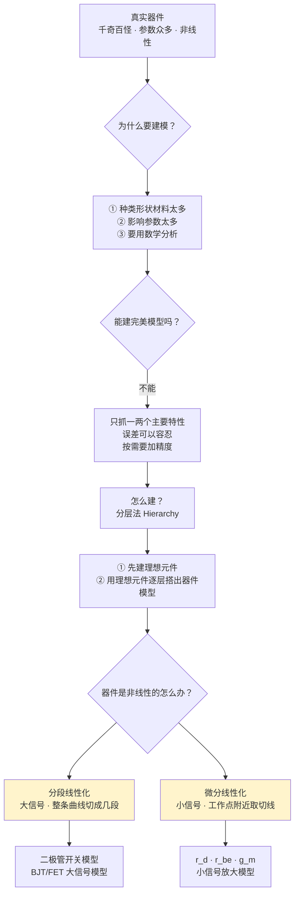

# C1.3 电路模型 Circuit Models

> [!abstract] 这一讲的任务
> [[C1.2 电路的基本概念]] 结尾留下一个难堪的事实：**我们只会解线性电路，而真实器件几乎全是非线性的**。
> 这一讲就是来处理这个矛盾的。它不教任何具体器件，只教**两把刀**——**分段线性化**（把曲线剁成几段直线）和**微分线性化**（在一点附近用切线替代曲线）。
> 别把这一讲当成"过渡章节"。第 2 章的二极管、三极管、场效应管，第 6 章的放大电路，**全部是这两把刀的产物**。看懂了这一讲，第 2 章那堆吓人的模型图会瞬间变得有章可循。

> [!info] 怎么读这份讲义
> 顺读。带 `> [!question]` 处先自己想再展开。
> 标有 **（拓展）** 或 **【拓展】** 的内容，是**课堂上没有讲到、由课件和教材延伸补充**的部分。

---

## 0. 开场：一个 100 Ω 的电阻，到底是多少欧？

抽屉里拿出一个标着 **100 Ω** 的电阻。请回答：它的阻值是多少？

"100 欧啊。" 好，追问几句：

- 它是**碳膜**的、**金属膜**的还是**绕线**的？三种材料的温度系数完全不同。
- 现在室温 25 °C。如果放进 80 °C 的机箱里呢？**阻值会变。**
- 它标称精度是 ±1% 还是 ±5%？**"100" 本来就是个区间。**
- 你打算在 1 kHz 用它还是 100 MHz 用它？**高频下它根本不是电阻**（[[C1.1 电路分析的演化]] 已经剧透过）。

于是"这个电阻是多少欧"这个问题，**根本没有一个绝对准确的答案**。

> [!question] 停一下，先自己想想
> 既然连一个最简单的电阻都无法被完全精确地描述，我们凭什么还能做电路分析？
> 换句话说：**"建模"到底是在放弃什么，换取什么？**

> [!success]- 想过了再看
> 放弃的是**绝对精确**，换来的是**可计算**。
> 课件 p.34 把这件事写得很直接：
> - 能不能建一个完美精确的模型？**Hard.**（课上把话说得更狠：**根本不可能**。）
> - 但是——**在一定条件下，我们可以只关注一两个特性，并只对它们建模**（we can only focus on one or two characteristic and model it/them）。
> - 而且——**误差是可以容忍的**（Error can be tolerated）。**有时我们只关心电路功能是否实现**。
>
> 所以建模的本质是一句工程哲学：**"我不需要知道它的一切，我只需要知道足以回答我的问题的那一部分。"**
> 你以后做 AI 也一样——一个神经网络不是在复现真实世界，它是在**抓住足以完成任务的那部分统计规律**。这是同一种思维。

---

## 1. 为什么必须建模（课件 p.34）

> [!important] Q: Why is modeling a circuit necessary?（课件 p.34 原文）
> - **So many types/shapes/material of components!** Hard to analysis without a model!
> - **So many parameters that affects a component!** Hard to analysis without a model!
> - **A math model enables us to carry out math analysis.**

> [!important] Q: Can we build an accurate model for a component?（课件 p.34 原文）
> - **Hard.** But in certain conditions, we can only focus on **one or two characteristic** and model it/them.
> - **Error can be tolerated.** Sometimes we only care about whether the circuit functions.
> - A **more complicated and precise** model can be built **based on the need**.

> [!note] "误差可以容忍"这句话的分量：一个类比
> 课上举了个很妙的例子：**黄金的纯度**。
> 首饰用的金、工业用的金、实验室用的金，对纯度的要求完全不同——没有哪个场景需要"100% 纯金"，因为那既做不到也没必要。**建模的精度同样是按应用场景定的。**
>
> 这句话在本课程里有三处具体兑现：
> 1. **理想导线不耗能**（[[C1.1 电路分析的演化]]）——误差容忍；
> 2. **硅二极管压降恒取 0.7 V**（[[C2.2 单端口器件的电路模型]]）——误差容忍；
> 3. **小信号模型把曲线当直线**（本讲第 5 节）——误差容忍。
>
> 第三条还告诉你：**模型的精度不是固定的，是可以按需要升级的**（a more complicated and precise model can be built based on the need）。这就是为什么同一个三极管在第 2 章有**三套**模型：大信号、低频小信号、高频小信号。

---

## 2. 建什么样的模型（课件 p.35）

> [!important] Build what kind of model?（课件 p.35 原文）
> - **Ultimate goal**（终极目标）: for easier to use **math tool** to analyze or design the circuit.
> - The model focuses on the **main characteristic** of a circuit component. It can be presented by **equations**.
> - For easier analysis, we always try to use **a linear model** to describe a component.
> - **However**, most of the practical component is **nonlinear**. So a linear model can **only describe a component precisely in a dynamic range**（只能在一定动态范围内精确描述）。
> - If we want the model to perform **more accurately**, it's usually **more complicated**.

> [!important] 建模的三角权衡
> 把上面五条压成一张图，你会看到三个互相拉扯的目标：
>
> $$\textbf{精确} \quad\longleftrightarrow\quad \textbf{简单} \quad\longleftrightarrow\quad \textbf{适用范围广}$$
>
> **三者不可兼得**，任何一个模型都是在这个三角里选了一个点：
> - 理想电阻 $u=Ri$：极简单、适用范围窄（只在低频、常温、小功率下准）；
> - 二极管的肖克利方程 $i_D=I_{SS}(e^{u_D/V_T}-1)$：精确、适用范围广、但**非线性，没法直接列方程解**；
> - 分段线性模型：不那么精确，但**线性**、够用。
>
> **本课程绝大多数时候选择"简单 + 线性"，因为它让方程可解。** 这个取舍贯穿全书。

---

## 3. 怎么建：分层法（课件 p.36）

> [!important] How to build a circuit model?（课件 p.36 原文）
> - Under certain condition, **a complex electromagnetic phenomenon can be approximately simulated by a combination of several simple electromagnetic phenomena**. That is, **a complex circuit can be composed of a series of simple circuit models.**
> - Modeling method：**Hierarchy method（分层法）**
>   - （1）**built ideal component**（先建立理想元件）
>   - （2）**use ideal components to build the circuit model level by level**（用理想元件逐层搭建电路模型）
> - **How to build an ideal linear model?**（怎样建立理想的线性模型？——引出第 4、5 节）

> [!note] 分层法为什么有效：搭积木
> 分层法的逻辑是"**先造一套标准积木，再用积木拼任何东西**"：
>
> **第一层（理想元件）**：$R$、$L$、$C$、$M$、独立源、受控源、理想二极管、理想变压器——一共十来种，就是 [[C1.4 理想电路元件]] 那一讲的全部内容。
> **第二层（实际器件）**：
> - 实际电阻器 = 理想 $R$ + 串联 $L$ + 并联 $C$（[[C2.2 单端口器件的电路模型]]）
> - 实际二极管 = 理想二极管 + $U_{on}$ 电压源 + $r_D$ 电阻（两条支路并联）
> - BJT 小信号模型 = $r_{be}$ + 受控电流源 $\beta i_b$ + $r_{ce}$（[[C2.3 双端口器件的电路模型]]）
> **第三层（功能电路）**：放大器、滤波器、振荡器（第 6、7 章）
>
> **每一层都只用下一层的东西搭成**，这就是"level by level"。
> 这套思路你并不陌生：它就是**软件工程里的模块化/封装**。造 CPU 的人不需要每次都回到晶体管，正如你写 PyTorch 不需要每次都回到矩阵乘法的汇编实现。

---

## 4. 方法一：分段线性化（课件 p.37）

> [!important] Piecewise linearization 分段线性化（课件 p.37 原文）
> - **Divide device characteristics into several sections**（把器件特性分成若干段）
> - **Each characteristic is approximated by a straight line**（每一段用一条直线近似）
> - **E.G. Model of a diode（二极管）**

![[C1-二极管分段线性化特性曲线.png]]

课件用二极管举例：黑色细线是真实的指数型伏安特性，红色粗线是分段线性近似。课上把它分成三段（第 2 章会细化成四段）：

| 段 | 电压范围 | 近似 | 等效 |
|---|---|---|---|
| ① 反向击穿 | $u_D<U_{BR}$ | 一条近乎垂直的线 | 击穿后的小电阻 |
| ② 截止 | $U_{BR}<u_D<U_{on}$ | 一条近乎水平的线（$i_D\approx 0$） | **开路** |
| ③ 导通 | $u_D>U_{on}$ | 一条陡峭的斜线 | **电压源 $U_{on}$ 串小电阻 $r_D$** |

图上两个关键标注：
- **$U_{on}$**：正向**导通电压 / 死区电压**——正向电压必须先克服 PN 结内建电场才能导通（硅管约 0.7 V，锗管约 0.3 V）；
- **$U_{BR}$**：反向**击穿电压**——反向电压超过它，二极管被击穿，反向电流突然增大。

> [!question] 停一下，先自己想想
> 理想二极管的规则是"$u>0$ 就导通"。可实际二极管要等到 $u_D>U_{on}$ 才导通。**这个 $U_{on}$ 是从哪来的？**

> [!success]- 想过了再看
> 来自 PN 结内部的**内建电场**（耗尽层/势垒）。
> P 区和 N 区接触时，N 区的自由电子会向 P 区扩散、填充空穴，在交界面两侧留下带电的离子层——这一层叫**耗尽层**，它自带一个方向与外加正向电压**相反**的内建电场。
> 外加正向电压必须**先把这个内建电场抵消掉**，载流子才能穿过去形成电流。这个"门槛"就是 $U_{on}$。
> 不同材料的内建电场强度不同，所以**不同材质的二极管导通电压不同**（硅 ≈0.7 V，锗 ≈0.3 V，发光二极管 1.8–3.4 V）。
> 同理，$U_{BR}$ 是**外加反向电压强到足以克服内建电场、把结击穿**的那个值。→ [[C2.2 单端口器件的电路模型]]

> [!important] 分段线性化的适用场合：大信号
> 当输入信号的**幅度很大**、会让器件**跨越多个工作区**时，必须用分段线性化。
> 典型应用：**整流电路**（二极管在正负半周之间来回切换，横跨截止区和导通区）、**开关电路**（三极管在截止区与饱和区之间切换）、**数字电路**。
> 所以它又叫 **大信号模型 large-signal model**。

---

## 5. 方法二：微分线性化（课件 p.38）

> [!important] Differential linearization 微分线性化（课件 p.38 原文）
> - **Determine the static operating point of the device**（确定器件的静态工作点）
> - **In a small range at the static working point, the tangent is used to replace the curve**（在静态工作点附近的一个小范围内，用切线代替曲线）
> - **E.G: Diode small signal model**
> $$i_{\mathrm D}=f(u_{\mathrm D})\approx f(U_{\mathrm D})+f'(U_{\mathrm D})\times \mathrm du_{\mathrm D}$$
> $$i_{\mathrm D}=I_{\mathrm D}+i_{\mathrm d}=f(U_{\mathrm D})+\frac{1}{r_{\mathrm d}}\times u_{\mathrm d}$$

![[C1-二极管微分线性化小信号模型.png]]

课件图上标出了工作点 $(U_D, I_D)$，以及围绕它的一小片蓝色/红色虚线方框——那就是"小范围"。

> [!note] 这两行公式的完整来源（课件跳过了，这是本讲最该补的推导）（拓展）
> 起点是**泰勒展开**。把非线性函数 $i_D=f(u_D)$ 在工作点 $U_D$ 处展开：
> $$f(u_{\mathrm D})=f(U_{\mathrm D})+f'(U_{\mathrm D})(u_{\mathrm D}-U_{\mathrm D})+\frac{f''(U_{\mathrm D})}{2!}(u_{\mathrm D}-U_{\mathrm D})^2+\cdots$$
>
> 现在做**关键的一步**：假设外加的信号很小，记 $u_{\mathrm d}=u_{\mathrm D}-U_{\mathrm D}$ 为一个**小量**。那么：
> - $u_{\mathrm d}$ 是一阶小量；
> - $u_{\mathrm d}^2$ 是二阶小量，$u_{\mathrm d}^3$ 是三阶小量……**小量的平方远小于小量本身**（$0.01^2=0.0001$）。
>
> 于是**忽略二次及以上的所有项**：
> $$f(u_{\mathrm D})\approx f(U_{\mathrm D})+f'(U_{\mathrm D})\,u_{\mathrm d}$$
>
> 左边 $i_D$ 拆成直流分量 + 交流分量：$i_{\mathrm D}=I_{\mathrm D}+i_{\mathrm d}$，而 $f(U_{\mathrm D})=I_{\mathrm D}$（工作点的定义），两边消去 $I_D$：
> $$\boxed{i_{\mathrm d}=f'(U_{\mathrm D})\cdot u_{\mathrm d}=\frac{1}{r_{\mathrm d}}u_{\mathrm d}}\qquad\text{其中}\ \frac{1}{r_{\mathrm d}}\triangleq f'(U_{\mathrm D})=\left.\frac{\mathrm di_{\mathrm D}}{\mathrm du_{\mathrm D}}\right|_{Q}$$
>
> **读法**：$r_d$ 就是**伏安特性曲线在工作点 $Q$ 处切线斜率的倒数**，量纲是电阻，称为**动态电阻/微分电阻**。
> **一句话总结整个方法：在工作点附近，非线性器件对小信号表现得像一个线性电阻。**

> [!important] 微分线性化的三个关键认识
> 1. **必须先有静态工作点。** 没有 $Q$ 点就没有切线，也就没有 $r_d$。这就是为什么第 6 章分析放大器**永远是"先算静态、再算动态"两步走**。
> 2. **$r_d$ 不是常数，它随工作点变。** 工作点挪了，切线斜率就变了。二极管的 $r_d=V_T/I_D$ 正体现这一点：电流越大，动态电阻越小。
> 3. **"小信号"里的"小"是相对的。** 判据是：信号摆动范围内，曲线与切线的偏差小到可以忽略。器件曲率越大，允许的"小"就越小。

> [!important] 微分线性化的适用场合：小信号
> 当输入信号**幅度很小、变化很慢**，器件**始终待在同一个工作区**时，用微分线性化。
> 典型应用：**放大电路**（信号叠加在静态偏置上做小幅摆动）、**传感器前端**、**模拟信号处理**。
> 所以它又叫 **小信号模型 small-signal model**。

> [!note] 二极管的 $r_d$ 有解析表达式（第 2 章给出，这里先埋伏笔）（拓展）
> 把肖克利方程 $i_D=I_{SS}\left(e^{u_D/V_T}-1\right)$ 求导：
> $$\frac{\mathrm di_{\mathrm D}}{\mathrm du_{\mathrm D}}=\frac{I_{SS}}{V_T}e^{u_{\mathrm D}/V_T}\approx\frac{i_{\mathrm D}}{V_T}\quad\Longrightarrow\quad \boxed{r_{\mathrm d}=\frac{V_T}{I_{\mathrm D}}}$$
> 其中 $V_T$ 是**温度电压当量**，室温下约 **26 mV**。
> 于是有一个极好记的工程数：**$I_D=1\ \mathrm{mA}$ 时 $r_d=26\ \Omega$**。→ [[C2.2 单端口器件的电路模型]]

---

## 6. 两种方法的对比

| | **分段线性化** Piecewise | **微分线性化** Differential |
|---|---|---|
| 别名 | **大信号模型** | **小信号模型** |
| 做法 | 把整条曲线**切成几段**，每段用直线近似 | 在**一个工作点**处用**切线**代替曲线 |
| 数学基础 | 分段函数逼近 | **泰勒展开，取到一阶** |
| 适用信号 | 幅度**大**，跨越多个工作区 | 幅度**小**，始终在同一区 |
| 是否需要工作点 | **不需要** | **必须先求静态工作点 $Q$** |
| 覆盖范围 | 整条特性曲线 | 仅 $Q$ 点邻域 |
| 精度 | 段内粗，段间跳变 | $Q$ 点附近很准，远离迅速失准 |
| 典型产物 | 二极管开关模型、BJT/FET 大信号模型 | $r_d$、$r_{be}$、$g_m$、小信号放大模型 |
| 典型应用 | 整流、开关、数字电路 | 放大器、模拟信号处理 |

> [!warning] 考试易错点：三种下标写法
> 第 2、6 章会同时出现三种符号，混淆它们几乎必错：
>
> | 写法 | 读作 | 含义 |
> |---|---|---|
> | $i_{\mathrm D}$（**大写下标 + 小写主体**） | 总量 | 直流 + 交流，**瞬时总值** |
> | $I_{\mathrm D}$（**全大写**） | 直流量 | **静态工作点**的值 |
> | $i_{\mathrm d}$（**全小写**） | 交流量 | **小信号**分量 |
>
> 关系：$\boxed{i_{\mathrm D}=I_{\mathrm D}+i_{\mathrm d}}$
> 同理 $u_{BE}=U_{BE}+u_{be}$、$i_C=I_C+i_c$。**看到下标，先判断它属于哪一类。**

---

## 这一讲的三句话

1. **建模 = 放弃绝对精确，换取可计算。** 只抓主要特性、容忍误差、按需升级精度——这是一句贯穿全课程的工程哲学。
2. **分层法**：先造一套理想元件（第 1.4 节），再用它们逐层搭出实际器件（第 2 章）、功能电路（第 6 章）。
3. **两把线性化的刀**：**分段线性化**对付大信号（切成几段直线，不需要工作点）；**微分线性化**对付小信号（泰勒展开取一阶，**必须先有静态工作点**）。第 2 章的每一个器件模型，都是这两把刀之一削出来的。

**速查表**

| 概念 | 要点 |
|---|---|
| 为什么建模 | 器件种类/参数太多；数学分析需要方程 |
| 能否完美建模 | 不能；只抓一两个主要特性，误差可容忍，精度按需升级 |
| 三角权衡 | 精确 ↔ 简单 ↔ 适用范围广，三者不可兼得 |
| 分层法 | ① 建理想元件 ② 用理想元件逐层搭模型 |
| 分段线性化 | 曲线切成几段直线；大信号；不需工作点；整流/开关 |
| 微分线性化 | 工作点处取切线；小信号；必须先求 $Q$；放大器 |
| 数学基础 | 泰勒展开取一阶，忽略 $u_d^2$ 及以上 |
| 动态电阻 | $\dfrac{1}{r_d}=\left.\dfrac{\mathrm di}{\mathrm du}\right|_Q$；二极管 $r_d=V_T/I_D$，$V_T\approx26\ \mathrm{mV}$ |
| 二极管两个门槛 | $U_{on}$ 导通（死区）电压；$U_{BR}$ 反向击穿电压 |
| 三种下标 | $i_D$ 总量 / $I_D$ 直流 / $i_d$ 交流；$i_D=I_D+i_d$ |

**下一讲预告**：分层法说"先造理想元件"。下一讲就是那套积木的**清单**：电阻、忆阻、电容、电感、电压源、电流源、理想二极管、四种受控源、理想变压器。每一个都只有一条伏安关系要记，但其中有一个是 1971 年才被提出来的，而且**正在被用来做人工智能的神经网络突触**。→ [[C1.4 理想电路元件]]

---

## 本节自测 Self-Test

> [!question] Q1：为什么不直接用器件的精确非线性方程做电路分析？

> [!success]- 答案
> 因为非线性方程组通常**没有解析解**（超越方程未必解得出），只能数值迭代；而且器件种类、形状、材料、温度等参数太多，逐一精确描述工作量不可接受。
> 线性化后方程可解、可叠加、可用戴维南等一整套工具，代价是牺牲精度和适用范围——这个交换在工程上是划算的。

> [!question] Q2：分层法的两个步骤是什么？举一个三层的例子。

> [!success]- 答案
> ① 先建立**理想元件**；② 用理想元件**逐层**搭出电路模型。
> 例：理想元件（$R$、受控源）→ BJT 小信号模型（$r_{be}$ + $\beta i_b$ + $r_{ce}$）→ 共射放大电路 → 多级放大器。

> [!question] Q3：微分线性化的数学基础是什么？写出完整推导。

> [!success]- 答案
> 泰勒展开取一阶。设 $i_D=f(u_D)$，在工作点 $U_D$ 展开：
> $$f(u_D)=f(U_D)+f'(U_D)u_d+\frac{f''(U_D)}{2!}u_d^2+\cdots$$
> 小信号条件下 $u_d$ 很小，$u_d^2$ 及以上为高阶小量，忽略之：
> $$i_D\approx f(U_D)+f'(U_D)u_d \Rightarrow I_D+i_d = I_D + f'(U_D)u_d \Rightarrow i_d=\frac{1}{r_d}u_d$$
> 其中 $1/r_d=f'(U_D)=\left.\mathrm di_D/\mathrm du_D\right|_Q$ 为工作点处切线斜率。

> [!question] Q4：$i_D$、$I_D$、$i_d$ 三个符号分别代表什么？它们的关系？

> [!success]- 答案
> $i_D$（大写下标）：**瞬时总量**，直流 + 交流；
> $I_D$（全大写）：**直流分量**，即静态工作点的值；
> $i_d$（全小写）：**交流小信号分量**。
> 关系：$i_D=I_D+i_d$。

> [!question] Q5：为什么小信号模型必须先求静态工作点？

> [!success]- 答案
> 因为小信号参数就是**该工作点处的切线斜率**：$1/r_d=\left.\mathrm di/\mathrm du\right|_Q$。工作点不同，切线斜率不同，模型参数就不同。
> 没有 $Q$ 点，$r_d$、$r_{be}$、$g_m$ 全都无从算起。这就是第 6 章"先静态后动态"两步走的原因。

> [!question] Q6：整流电路应该用哪种线性化？为什么？

> [!success]- 答案
> **分段线性化（大信号模型）**。
> 整流时二极管在正半周导通、负半周截止，**跨越了两个工作区**，信号幅度远超"小信号"范围，切线近似在区外完全失效。必须把曲线分段，每段用不同的等效电路。

> [!question] Q7：小信号模型下放大器为什么仍会失真？

> [!success]- 答案
> 因为小信号模型忽略了泰勒展开的**二次及以上项**。当输入幅度增大，$u_d^2$ 不再可忽略，这些高次项就表现为**非线性失真**（产生谐波）。
> 信号再大到跨出当前工作区（进入截止或饱和），则出现**削波失真**——此时连"同一工作区"的前提都破了。

> [!question] Q8：$U_{on}$ 和 $U_{BR}$ 在二极管特性曲线上分别在哪、各代表什么物理机制？

> [!success]- 答案
> $U_{on}$ 在**第一象限靠近原点处**，是正向**导通/死区电压**：外加正向电压必须先抵消 PN 结内建电场，载流子才能通过。硅 ≈0.7 V，锗 ≈0.3 V。
> $U_{BR}$ 在**第三象限**（横轴负方向较远处），是反向**击穿电压**：反向电压强到足以克服内建电场使结击穿，反向电流突然增大。
> 稳压二极管就是**专门工作在 $U_{BR}$ 附近**的器件。

> [!question] Q9："误差可以容忍"在本课程中有哪些具体兑现？

> [!success]- 答案
> 至少三处：① 似稳场下认为导线不耗能、不耦合（[[C1.1 电路分析的演化]]）；② 硅二极管压降一律取 0.7 V（[[C2.2 单端口器件的电路模型]]）；③ 小信号模型把曲线当直线（本讲）。
> 并且课件强调：**需要更高精度时可以建更复杂的模型**——同一个 BJT 在第 2 章就有大信号、低频小信号、高频小信号三套模型。

---

**上一节 ←** [[C1.2 电路的基本概念]]
**下一节 →** [[C1.4 理想电路元件]]
**课程索引 →** [[电路基础 MOC]]
