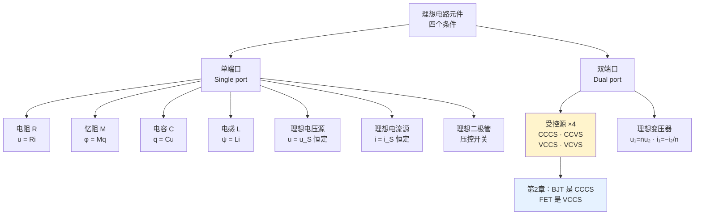

# C1.4 理想电路元件 Ideal Circuit Components

> [!abstract] 这一讲的任务
> [[C1.3 电路模型]] 的分层法说："先造理想元件，再用它们逐层搭出一切。" 这一讲就是**那套积木的完整清单**。
> 十来个元件，每个只有**一条伏安关系**要掌握。它们是整门课的**字母表**——后面每一章、每一道题，都只是这些字母的不同排列。
> 其中有两个值得特别期待：**忆阻**（1971 年才被提出，如今正被用来做神经网络突触）和**受控源**（它是三极管、场效应管、运放的共同数学内核，也是第 2、6 章的绝对主角）。

> [!info] 怎么读这份讲义
> 元件很多但套路完全一样：**符号 → 伏安关系 → 特性曲线 → 功率/储能 → 使用禁忌**。建议按这个五段式逐个过。
> 带 `> [!question]` 处先自己想再展开。标有 **（拓展）** 或 **【拓展】** 的内容，是**课堂上没有讲到、由课件和教材延伸补充**的部分。

---

## 0. 开场：四个基本量，能连出几条线？

电路世界里有四个基本量：**电压 $u$、电流 $i$、电荷 $q$、磁通 $\varphi$**。

它们之间有两条**定义性**的关系，不算元件：

$$i=\frac{\mathrm dq}{\mathrm dt}\qquad\qquad u=\frac{\mathrm d\varphi}{\mathrm dt}$$

剩下的，是两两之间的**构性关系**——每一条关系定义一种元件：

| 连接 | 关系式 | 元件 |
|---|---|---|
| $u \leftrightarrow i$ | $u=Ri$ | **电阻 R** |
| $q \leftrightarrow u$ | $q=Cu$ | **电容 C** |
| $\varphi \leftrightarrow i$ | $\varphi=Li$ | **电感 L** |
| $\varphi \leftrightarrow q$ | **？** | **？** |

> [!question] 停一下，先自己想想
> 四个量两两配对共有 6 种组合，扣掉两条定义关系，还剩 4 条。前三条对应电阻、电容、电感——**第四条对应什么元件？**
> 1971 年之前，这一格是**空白的**。

> [!success]- 想过了再看
> 第四条是 $\varphi=Mq$，对应的元件叫 **忆阻 Memristor（Memory + Resistor）**。
>
> 提出者是 **蔡少棠（Leon Chua）**，美国加州大学伯克利分校教授，**华裔**，1971 年。他的思路正是上面这张表：**对称性要求这一格不能空着**，所以一定存在这样一种元件。
> 这是物理学史上很经典的一类推理——**先由对称性预言，再去找实物**（就像门捷列夫预言未发现的元素）。
>
> 更妙的是它的用途：课件写着 **Application: Artificial neural network synapse（人工神经网络突触）**——这一格空白，四十年后填到了你的专业上。第 2.2 节详细讲。

---

## 1. 什么才算"理想电路元件"（课件 p.40）

> [!important] 理想电路元件的四个条件（课件 p.40 原文）
> - **Connectable（可连接性）**：have certain ports —— 有确定的端口，能和别的元件连起来。
> - **Can be described in math**：voltage / current / charge / flux —— 可以用数学描述（这四个量）。
> - **Basic completeness（基本完备性）**：the feature can be presented by **basic functions with input/output factors** —— 其特性可以用输入/输出量的基本函数表示。
> - **Reducibility（可还原性）**：Every ideal circuit component must **relate to an actual component**. Its feature is **distracted from** the actual component, and the ideal component **can be reduced to** the actual one.
>   每个理想元件都必须**对应一个真实器件**：它的特性是从真实器件中**抽象出来**的，并且能**还原回**真实器件。

> [!note] "可还原性"最容易被忽略，但它是全章的哲学基础
> 课件 p.41 还补了一句：**Prototype-based. not come from nothing.**（基于原型，不是凭空而来。）
>
> 这条在说：**理想元件不是数学游戏，它们每一个都有实物原型**：
>
> | 理想元件 | 实物原型 |
> |---|---|
> | 电阻 R | 碳膜电阻、绕线电阻、滑动变阻器 |
> | 电容 C | 薄膜电容、电解电容、陶瓷电容 |
> | 电感 L | 贴片电感、环形线圈、变压器绕组 |
> | 独立电压源 | 干电池、纽扣电池、直流稳压源 |
> | 独立电流源 | （**现实中不存在**，见 2.6 节） |
> | 受控源 | **三极管、场效应管、运放** |
> | 理想变压器 | 线圈绕制的变压器 |
>
> **"可还原"这个方向正是第 2 章要走的路**：把理想元件加上寄生参数，还原成真实器件的模型。→ [[C2.2 单端口器件的电路模型]]
> 而"抽象"这个方向，正是忆阻被预言出来的方式——先有数学上的对称性，**再去找实物**。

### 元件的分类（课件 p.41）

![[C1-单端口与双端口元件示意.png]]

课件把理想元件分成两大类：**单端口（Single input/output port）** 和 **双端口（Dual input/output port）**。

**单端口**（课件 p.42 清单）：电阻 Resistance、忆阻 Memristor、电容 Capacitance、电感 Inductance、理想电压源、理想电流源、理想二极管（压控开关）。
**双端口**（课件 p.55 清单）：受控电源 Controlled source、理想变压器 Ideal voltage transformer。

---

## 2. 单端口理想元件

### 2.1 电阻 Resistance（课件 p.43–44）

![[C1-电阻符号与伏安特性曲线.png]]

> [!important] 基本特性——欧姆定律 Ohm's law（课件 p.43）
> $$R=\frac{u}{i},\qquad u=Ri,\qquad i=\frac{u}{R}$$
> - 符号：**R**
> - 含义：**特性曲线的斜率（Slope）**
> - 单位：**欧姆 Ohm (Ω)**，$1\ \Omega=\dfrac{1\ \mathrm V}{1\ \mathrm A}$

> [!important] 课件红框结论（课件 p.44）
> 相关参考方向下：
> $$p_R=u\cdot i=R\cdot i^2=\frac{u^2}{R}$$
> **The electrical power of a resistance is always positive. Thus, a resistance is a pure power-consuming component. It can only act as a load.**
> **电阻的功率恒为正，是纯耗能元件，只能作负载。**

> [!note] "恒为正"的一行证明
> $p_R=Ri^2$。因为 $R>0$ 且 $i^2\ge 0$，所以 $p_R\ge 0$ **恒成立**，与 $i$ 的方向无关。
> **换句话说：你把电流方向反过来，电阻照样发热。** 这和电源完全不同——电源的功率符号会随电流方向翻转（[[C1.2 电路的基本概念]] 第 7 节）。
> 电阻就是那个**唯一身份永远不变**的元件。

> [!warning] 注意课件这张伏安特性图的坐标轴
> 课件 p.43 右下角那张图，**横轴是 $i$、纵轴是 $u$**（不是常见的 $u$ 横轴）。因此**直线的斜率就是 $R$ 本身**，而不是 $1/R$。
> 后面 [[C2.2 单端口器件的电路模型]] 的二极管伏安特性图则是**横轴 $u$、纵轴 $i$**，斜率是电导。
> **每次读伏安特性图，先看坐标轴。** 这是初学者最容易栽的地方之一。

### 2.2 忆阻 Memristor（课件 p.45）

![[C1-忆阻的磁通电荷特性曲线.png]]

> [!important] 忆阻（课件 p.45 原文）
> - **History**：First proposed by **Prof. Leon Chua（蔡少棠，华裔）** from University of California-Berkeley in **1971 年**。
> - **Function**：**The larger the charge flow through the memristor, the larger its resistance will be.**（流过的电荷越多，阻值越大。）**Memorize the current flow, time dependent.**（记忆电流的流动，与时间相关。）
> - **Symbol: M，Unit: Ohm.**
> - **Application: Artificial neural network synapse（人工神经网络突触）**
> $$\varphi=Mq\qquad\Longrightarrow\qquad u=\frac{\mathrm d\varphi}{\mathrm dt}=M\frac{\mathrm dq}{\mathrm dt}=Mi$$
> **课件红框**：When the circuit is **independent to time**, memristor has just the same feature with resistance.
> **在时不变（直流稳态）情况下，忆阻与电阻表现完全相同。**

> [!question] 停一下，先自己想想
> 普通电阻为什么"没有记忆"？忆阻的"记忆"又体现在哪？

> [!success]- 想过了再看
> **普通电阻没有记忆**：它的阻值是个常数，$u$ 和 $i$ 之间是**即时**的倍数关系。上一秒电压是 10 V、这一秒突变成 1 V，电流立刻跟着变——**它完全不知道上一秒发生过什么**。
>
> **忆阻有记忆**：它的阻值 $M$ 会随**流过的总电荷量**变化。而总电荷量 $q=\int i\,\mathrm dt$ 是电流的**历史积分**。
> 于是：电流流过得越多 → 阻值越大 → 同样的电压产生的电流就越小。**器件"记住"了自己过去被怎样使用过。**
>
> **为什么这对 AI 重要**：生物神经突触的核心特性正是"用得越多，连接越强/越弱"——这就是**权重**。
> 传统数字电路要用一堆晶体管 + 存储单元才能模拟一个权重；忆阻器**用单个器件**就同时完成了"存储权重"和"执行乘法"两件事，还是非易失的。
> 这就是**存算一体 / 类脑计算**的硬件基础。课上提到过有师兄拿着相关论文来问能不能做这个方向——如果你对 AI 硬件感兴趣，这是一个真实的入口。

### 2.3 电容 Capacitance（课件 p.46–48）

![[C1-电容库伏特性曲线.png]]

> [!important] 基本特性（课件 p.46）
> $$q=C\cdot u$$
> - 符号：**C**；单位：**法拉 Fala (F)**，$1\ \mathrm F=\dfrac{1\ \mathrm C}{1\ \mathrm V}$
> - 含义：**储存电荷的能力**；$C$ 是 **$q$–$u$ 特性曲线（库伏特性曲线）的斜率**
> - **1 法拉是一个非常巨大的量**。实际设计中常用 **μF（$10^{-6}$ F）** 和 **pF（$10^{-12}$ F）**。

> [!important] 伏安关系 V-I relationship（课件 p.47）
> $$q(t)=C\,u(t)\ \Longrightarrow\ \boxed{i(t)=\frac{\mathrm dq(t)}{\mathrm dt}=C\frac{\mathrm du(t)}{\mathrm dt}}$$
> $$u(t)=\frac1C\int_{-\infty}^{t}i\,\mathrm dt=\frac1C\int_{-\infty}^{0}i\,\mathrm dt+\frac1C\int_{0}^{t}i\,\mathrm dt=\boxed{u(0)+\frac1C\int_0^t i(t)\,\mathrm dt}$$
> **课件红字结论**：The voltage across the capacitor is related **not only to the current in the observation time, but also to the initial voltage**.
> 电容电压不仅取决于观察期间的电流，**还取决于初始电压**。旁批点明：**Memorable component（有记忆的元件）**。

> [!note] 课件右边那两个问号 "AC? DC?" 在问什么
> 在问你：**把这条伏安关系分别用在交流和直流上，会得到什么？**
> - **直流稳态**：$u$ 不随时间变化 → $\dfrac{\mathrm du}{\mathrm dt}=0$ → $i=0$ → **电容等效开路**。
> - **交流**：$u$ 时刻在变 → $i\ne 0$，且**变化越快（频率越高）电流越大** → 电容对高频"更容易导通"。
>
> 第一条正是 [[C3.1 直流稳态与电路分析总览]] 那条"电容开路"的来源——**不用背，从 VCR 直接推**。
> 第二条是第 4 章容抗 $X_C=1/(\omega C)$ 的物理直觉：频率越高，容抗越小。
>
> 另外注意"**有记忆**"这个说法：电容的记忆和忆阻的记忆**不是一回事**。电容记住的是**初始电压**（一个状态量），忆阻记住的是**流过的总电荷**（改变了器件本身的参数）。

> [!important] 功率与储能（课件 p.48）
> $$p_C(t)=u(t)i(t)=C\,u(t)\frac{\mathrm du(t)}{\mathrm dt}$$
> 其功率**有时为正（吸收能量），有时为负（提供能量）**。**However, an ideal capacitance doesn't consume power.**（理想电容不消耗功率。）
> $$W_C=\int p_C(t)\,\mathrm dt=\int C\,u\,\mathrm du=\boxed{\frac12Cu^2(t)}\qquad\text{（irrelevant to current，与电流无关）}$$
> 旁批：**stored by electrical field（以电场形式储存）**、**Energy-storing component（储能元件）**。

> [!note] 这条公式的日常用途
> $W_C=\frac12Cu^2$ 只和**电压**有关，和电流无关。
> 这正是**手机电量显示的原理**：直接测电池两端电压，就能推算出剩余电量。课上顺带指出：电容量 $C$ 越大，同样电压下能储存的能量越多——所以"大电容 = 大电池"。

### 2.4 电感 Inductance（课件 p.49–51）

![[C1-电感的韦安特性曲线.png]]

> [!important] 基本特性（课件 p.49）
> $$\psi=L\cdot i\qquad(\psi:\text{磁通 Flux},\ L:\text{电感量})$$
> - 符号：**L**；单位：**亨利 Henry (H)**，$1\ \mathrm H=\dfrac{1\ \mathrm{Wb}}{1\ \mathrm A}$
> - **Meaning of L: The ability to impede the current from varying.**（**阻碍电流变化**的能力。）
> - $L$ 是 **$\psi$–$i$ 特性曲线（韦安特性曲线）的斜率**
> - **1 H 在实际中是很大的量**，电路设计常用 **mH（$10^{-3}$ H）** 或 **μH（$10^{-6}$ H）**。

> [!note] "阻碍电流变化"是什么意思
> 给电感通一个变化的电流，它会产生**感应电动势**，而感应电动势的使命就是**阻碍原电流的变化**（楞次定律）。
> 所以电感在电路里的角色是**"稳流器"**：防止电流突变。对偶地，电容是**"稳压器"**：防止电压突变。
> 这一对性质是第 5 章**换路定则**的物理根据：$u_C(0_+)=u_C(0_-)$、$i_L(0_+)=i_L(0_-)$。→ [[C5.1 动态电路与换路定则]]

> [!important] 伏安关系与储能（课件 p.50–51）
> $$\psi(t)=L\,i(t)\ \Longrightarrow\ \boxed{u(t)=\frac{\mathrm d\psi(t)}{\mathrm dt}=L\frac{\mathrm di(t)}{\mathrm dt}}$$
> $$i(t)=\boxed{i(0)+\frac1L\int_0^t u(t)\,\mathrm dt}$$
> **课件红字**：The current flows through the inductance is related **not only to the voltage in the observation time, but also to the initial current**.
> $$p_L(t)=u\,i=L\,i(t)\frac{\mathrm di(t)}{\mathrm dt},\qquad W_L=\int p_L\,\mathrm dt=\int L\,i\,\mathrm di=\boxed{\frac12Li^2(t)}$$
> 旁批：**Store by Magnetic field（以磁场形式储存）**、**irrelevant to voltage（与电压无关）**、**Energy storing component**。

> [!important] 电容与电感的完美对偶（Duality）——这张表值得背下来
> | | **电容 C** | **电感 L** |
> |---|---|---|
> | 基本关系 | $q=Cu$ | $\psi=Li$ |
> | 特性曲线 | **库伏特性** $q$–$u$ | **韦安特性** $\psi$–$i$ |
> | 伏安关系 | $i=C\dfrac{\mathrm du}{\mathrm dt}$ | $u=L\dfrac{\mathrm di}{\mathrm dt}$ |
> | 积分形式 | $u=u(0)+\dfrac1C\displaystyle\int_0^t i\,\mathrm dt$ | $i=i(0)+\dfrac1L\displaystyle\int_0^t u\,\mathrm dt$ |
> | 储能 | $W_C=\frac12Cu^2$（**与 $i$ 无关**） | $W_L=\frac12Li^2$（**与 $u$ 无关**） |
> | 储存形式 | **电场** | **磁场** |
> | 不能突变的量 | **电压** $u_C$ | **电流** $i_L$ |
> | 直流稳态等效 | **开路** | **短路** |
> | 常用量级 | μF、pF | mH、μH |
>
> **把 $u\leftrightarrow i$、$C\leftrightarrow L$、$q\leftrightarrow\psi$ 互换，两列完全对称。** 记住一列，另一列自动推出——这能省掉一半记忆量。

### 2.5 理想（独立）电压源（课件 p.52）

![[C1-理想电压源符号与伏安特性.png]]

> [!important] 特性（课件 p.52 原文）
> **The voltage output is independent of its output current.** The voltage is kept constant (or certain variation trend).
> **输出电压与输出电流无关**，保持恒定（或按确定规律变化）。
> - 符号：$U_s$ 或 $u_s(t)$；$u=u_S(t)$ 或 $u=U_S$
> - 伏安特性曲线：一条**水平线**（$u$ 与 $i$ 无关）
> - 电路符号：**一个圆圈，里面有一条线穿过去**
> - **Note：The voltage source must not be shortened! Why?**

> [!warning] 为什么电压源不能短路？
> 短路意味着接到电压源上的电阻 $R=0$。而理想电压源**没有内阻**，于是回路电流
> $$i=\frac{u_S}{0}\to\infty$$
> **一个非零值除以零，得到无穷大电流**——现实中不存在，模型自相矛盾。
> 实际后果：课上特意叮嘱过，**千万不要用导线直接短接纽扣电池或燃料电池**，可能产生无法预料的后果（"可能会换个发型"）。真实电池有内阻，短路电流虽不至于无穷，但足以剧烈发热甚至爆炸。

### 2.6 理想（独立）电流源（课件 p.53）

![[C1-理想电流源符号与伏安特性.png]]

> [!important] 特性（课件 p.53 原文）
> **The current output is independent to its output voltage.** The current is kept constant (or certain variation trend).
> - 符号：$I_s$ 或 $i_s(t)$；$i=i_S(t)$ 或 $i=I_S$
> - 伏安特性曲线：一条**垂直线**（$i$ 与 $u$ 无关）
> - 电路符号：**一个圆圈，线在圈外断开、不穿过圆圈**
> - **Note：The current source must not be open! Why?**
> - **Ideal current source doesn't exist in real world. Why?**

> [!note] 两个符号怎么区分（考试必考的基本功）
> - **电压源**：线**穿过**圆圈 → 象征内部是**导通**的（内阻为 0）；
> - **电流源**：线**不穿过**圆圈 → 象征内部是**断开**的（内阻为 ∞）。
>
> 这个记法有物理含义，不是死记：理想电压源内阻 $R=0$，理想电流源内阻 $R=\infty$。

> [!question] 课堂追问：为什么现实中不存在理想电流源？
> 提示：想想它的内阻要求。

> [!success]- 答案
> 理想电流源要求**内阻无穷大**，这样才能"无论外面接什么，电流都不变"。
> 但**所有真实电源的内阻都是有限的**（Every current source has a limited internal resistor）。内阻有限 → 外接电阻变化时，分流比例就会变 → 输出电流不可能绝对恒定。
> 所以现实中的"恒流源"都是**用反馈电路模拟出来的**：实时监测输出电流，动态调节电压来维持电流恒定。它在一定范围内像理想电流源，超出范围就不像了。
>
> **为什么不能开路**：开路意味着 $R=\infty$，而电流被钉死为 $i_S$，则端电压 $u=i_S\cdot\infty\to\infty$——同样是模型自相矛盾。

> [!note] 记忆口诀
> **电压源怕短路，电流源怕开路。**
> 各自怕的都是"把自己坚持的那个量强行变成矛盾"的那种连接：电压源坚持 $u$，短路强行令 $u=0$；电流源坚持 $i$，开路强行令 $i=0$。
> 这条口诀在 [[C3.2 电阻网络等效化简]] 的"不同值电压源禁止并联、不同值电流源禁止串联"和 [[C3.4 线性电路定理]] 的"电压源置零用短路、电流源置零用开路"处会反复用到。

### 2.7 理想二极管 Ideal Diode（课件 p.54）

![[C1-理想二极管符号与伏安特性.png]]

> [!important] 特性（课件 p.54 原文）
> 符号：**D**
> $$i=0\ \ \text{if}\ \ u<0\qquad\qquad u=0\ \ \text{if}\ \ i>0$$
> **Ideal diode is a voltage-control switch.**（理想二极管是一个**压控开关**。）
> **But unlike switches, ideal diodes conduct in one direction.**（但与开关不同，二极管**只单向导通**。）

**读法**：
- 加反向电压（$u<0$）→ **电流为零** → 相当于**断开的开关（开路）**；
- 有正向电流（$i>0$）→ **两端电压为零** → 相当于**闭合的开关（短路）**。

> [!note] 伏安特性曲线的形状
> 课件那条红线由两段构成：**负 $u$ 轴上的一段水平线**（$i=0$）+ **正 $i$ 轴上的一段垂直线**（$u=0$）——合起来是一个**直角折线**。
> 这就是"理想"的含义：**导通时压降为零、截止时电流为零，切换瞬间完成**。
> 实际二极管的四个偏离（死区电压 $U_{on}$、导通电阻 $r_D$、反向漏电流、反向击穿 $U_{BR}$）会在 [[C2.2 单端口器件的电路模型]] 逐条补上。

---

## 3. 双端口理想元件

### 3.1 受控源 Controlled Source（课件 p.56）

![[C1-四种受控源符号汇总.png]]

> [!important] 定义（课件 p.56 原文）
> **When the output voltage of the voltage source or the output current of the current source is not a given function, but is controlled by the voltage (or current) of some other branch of the circuit**, such an element with power supply characteristics is called a **controlled source（受控电源）**.
> 当电压源的输出电压、或电流源的输出电流**不是给定的函数，而是受电路中其他支路的电压（或电流）控制**时，这种具有电源特性的元件称为受控源。
>
> **符号**：不再是圆圈，而是**菱形（diamond）**。
> - 线**穿过**菱形 → **受控电压源**
> - 线**不穿过**菱形 → **受控电流源**

### 3.2 四种受控源（课件 p.57–59）

两两组合，得到四种：

| 类型 | 全称 | 输出关系 | 输入端条件 | 系数含义 |
|---|---|---|---|---|
| **CCCS** | Current Controlled Current Source | $i_2=\beta i_1$ | $u_1=0$ | $\beta$：**电流放大倍数** current amplification times |
| **CCVS** | Current Controlled Voltage Source | $u_2=r\,i_1$ | $u_1=0$ | $r$：**转移电阻** transfer resistance |
| **VCCS** | Voltage Controlled Current Source | $i_2=g\,u_1$ | $i_1=0$ | $g$：**转移电导/导纳** transfer admittance |
| **VCVS** | Voltage Controlled Voltage Source | $u_2=\mu\,u_1$ | $i_1=0$ | $\mu$：**电压放大倍数** voltage amplification times |

> [!important] 课件红字（课件 p.59）
> **$\mu$、$g$、$\beta$、$r$ is constant, the parameters that controls and be controlled is linearly related, and the source is called a linear controlled source.**
> 这四个系数都是**常数**，控制量与被控量**线性相关**，这样的受控源称为**线性受控源**。

> [!note] 命名与量纲：不用背，两步推出来
> 课上给了一个很实用的方法，**四种系数的量纲可以自己推**：
>
> **第一步：看符号，确定输出是什么。** 线穿过菱形 → 输出电压；不穿过 → 输出电流。
> **第二步：系数 = 输出 ÷ 输入**，量纲自动出来：
>
> | 输出 ÷ 输入 | 量纲 | 名称 |
> |---|---|---|
> | 电流 ÷ 电流 | 无量纲 | **放大倍数** $\beta$ |
> | 电压 ÷ 电压 | 无量纲 | **放大倍数** $\mu$ |
> | 电压 ÷ 电流 | **欧姆** | **转移电阻** $r$ |
> | 电流 ÷ 电压 | **西门子** | **转移电导/导纳** $g$ |
>
> **同一物理量相除 = 放大（或缩小）能力；不同物理量相除 = 电阻或电导。** 没有花里胡哨的东西。
> 课上明确说过：考试**只会考其中一种**，不会四种都考，但**必须能分辨出图上画的是哪一种**。

> [!warning] 输入端那两个条件 $u_1=0$ / $i_1=0$ 是怎么来的？
> 看课件 p.57–58 的图：
> - **电流控制型**（CCCS/CCVS）：输入端画成一根**短路的导线**（控制量是流过它的电流 $i_1$），既然是理想导线，其两端电压 $u_1=0$。
> - **电压控制型**（VCCS/VCVS）：输入端画成**开路**（控制量是它两端的电压 $u_1$），既然开路，流过的电流 $i_1=0$。
>
> **这两条不是额外规定，是画法的直接后果。** 它们还有一个重要推论：**受控源的输入端口不消耗任何功率**（$p_1=u_1i_1=0$，两种情况下都有一个因子为零）。

### 3.3 受控源是有源器件（课件 p.60）

> [!important] 课件的证明（p.60）
> 以 VCVS 带负载 $R$ 为例：
> $$P=u_1i_1+u_2i_2=u_1\times 0+u_2\times\left(-\frac{u_2}{R}\right)=-\frac{u_2^2}{R}<0$$
> **结论（课件原文）**：Controlled source is an ideal element used to describe the operation of **active devices (such as semiconductor devices)**. It is the **simplest active element**, and the **DC power supply supporting its operation is usually not shown**.
> 受控源是用来描述**有源器件（如半导体器件）**工作情况的理想元件，是**最简单的有源元件**；**支撑其工作的直流电源通常不画出来**。

> [!note] 这个负号是本节最有信息量的一处
> $P<0$ 意味着受控源在**对外提供功率**（[[C1.2 电路的基本概念]] 的判别准则）。可是——**能量从哪来？**
>
> 答案在课件最后那半句：**"支撑其工作的直流电源通常不画出来"**。
> 受控源**不是能量的凭空来源，而是能量的"搬运工 / 阀门"**：它用一个微小的输入信号，去**调制**一个（画外的）直流电源送出的大能量。
>
> 讲台上的扬声器就是最好的例子：它能把话筒里微弱的声音放大到全场都听得见——**能量显然不是来自话筒**，而是来自插座。受控源模型描述的正是"用小信号控制大能量"这件事本身。
> 这条认识有两个直接推论：
> 1. **$u_1=0$ 时输出必然为 0**（阀门关死，没有信号可调制）——所以受控源不能独立供能；
> 2. **叠加定理中受控源不能置零**（它不是激励，是电路结构的一部分）。→ [[C3.4 线性电路定理]]

### 3.4 受控源的画法（课件 p.61）

> [!important] 画法（课件 p.61 原文）
> - 由于理想受控源的输入端口被设为**开路（电压控制）或短路（电流控制）**，所以这个端口**可以省略不画**（be saved from drawing）。
> - 只需要在电路中**标出控制量**（label the controlling parameter）。
> - 因此**只画受控源的输出端口**即可（draw the output port of controlled source）。

> [!warning] 读图必备
> 在实际电路图上，你**看到的往往只有一个菱形 + 一个表达式**（比如 $0.5u_4$、$\beta i_b$、$gu_2$），而控制量 $u_4$ / $i_b$ / $u_2$ **标在电路的别处**。
> **做题第一步：把控制量在图上找到，用红笔圈出来。** 找不到控制量，方程一定列错。
> 这条在 [[C3.3 电阻网络的系统分析]] 第 7 节（含受控源的结点方程）处是决定成败的一步。

### 3.5 受控源 vs 独立源（课件 p.62）

> [!important] 共同点与区别（课件 p.62 原文）
> **共同点**：They are all **sources**, that can provide energy.（都是电源，都能提供能量。）
> **区别**：
> - 受控源的输出 **decided by voltage/current in other branches**（由其他支路的电压/电流决定）；
> - 独立源的输出 **decided only by itself**（只由自己决定）。
> - 因此：**独立源可以不依赖任何帮助就给电路供能**（can power the circuit without any help），而**受控源不行**（while the controlled source can't）。

> [!warning] 这条区别在后续章节反复出现
> | 场合 | 独立源 | 受控源 |
> |---|---|---|
> | 叠加定理"置零" | **要置零**（压源短路、流源开路） | **保留** |
> | 求入端等效电阻 | **置零** | **保留** |
> | 求戴维南内阻 $R_0$ | **置零** | **保留** |
> | 结点方程的对称性 | 保持 $G_{jk}=G_{kj}$ | **破坏对称性** |
>
> 一句话记：**"无源"指的是无独立源；受控源永远留在电路里。** → [[C3.2 电阻网络等效化简]]、[[C3.4 线性电路定理]]

### 3.6 理想变压器 Ideal Voltage Transformer（课件 p.63–64）

![[C1-理想变压器符号与变比关系.png]]

> [!important] 三个理想化条件（课件 p.63 原文）
> **Prototype：Transformer made by coil**（原型：线圈绕制的变压器）
> （1）**fully coupled（全耦合）** （2）**no power loss（无损耗）** （3）**infinite self coupling（自感无穷大）**
> $$L_1\to\infty,\quad L_2\to\infty,\quad k=1,\quad M\to\infty$$
> **参数：变比 voltage ratio, $n$**
> $$\boxed{u_1=n\,u_2},\qquad \boxed{i_1=-\frac1n i_2},\qquad n=\sqrt{\frac{L_1}{L_2}}=\frac{N_1}{N_2}$$

三个条件的含义（课上逐条解释过）：
- **全耦合**：输入线圈的能量**100% 传到**输出线圈，一点不漏；
- **无损耗**：线圈本身不发热（真实线圈是导线绕的，工作时一定发热，即有损耗）；
- **自感无穷大**：线圈内部每一匝之间的耦合也是无穷强，**能量全部被压缩在线圈内部**，不泄漏到外界影响别人。

> [!important] 理想变压器不损耗能量（课件 p.64）
> $$p_1=u_1i_1=n\,u_2\left(-\frac{i_2}{n}\right)=-u_2i_2=-p_2$$
> **课件红框结论**：An ideal transformer is a **passive** component, which **neither stores energy nor consumes energy**. At any time, the power input from the primary side is **immediately output** at the secondary side, and only plays the role of **transmitting signals and energy**: （1）**voltage**（2）**current**（3）**impedance**, transforming.

> [!question] 停一下，先自己想想
> 为什么电流的变比恰好是电压变比的**倒数**？

> [!success]- 想过了再看
> **能量守恒。**
> 变压器只是电能的**搬运工**——"从输入端搬到输出端，不收取任何费用，没有中间商赚差价"。
> 既然 $p_1 = -p_2$（输入多少、输出多少），而 $p=ui$，那么电压放大 $n$ 倍，电流就**必须**缩小 $n$ 倍，乘积才能守恒。
> 注意 $i_1=-i_2/n$ 里的负号：它来自参考方向的设定（图中 $i_1$ 流入、$i_2$ 也标为流入），并不代表能量倒流。

> [!note] 第三种变换"阻抗变换"课件只提了名字（拓展）
> 课件红框列了"电压、电流、阻抗"三种变换，但只给了前两个公式。第三个是：
> $$R_{in}=\frac{u_1}{i_1}=\frac{n u_2}{-i_2/n}=n^2\cdot\frac{u_2}{-i_2}=\boxed{n^2R_L}$$
> **副边接 $R_L$，原边"看"到的是 $n^2R_L$。**
> 这是变压器最重要的工程用途之一：**阻抗匹配**。功放输出阻抗 8 Ω、音箱阻抗 4 Ω 时，接一个 $n=\sqrt{2}$ 的变压器即可匹配，从而实现最大功率传输（→ [[C3.4 线性电路定理]]）。
> 真空管功放里那个大铁疙瘩输出变压器，干的就是这件事。

> [!question] 课堂追问（课件 p.64）：为什么理想变压器不能用于直流电路？
> 提示：想想"某个姓法的科学家"提出的定律。

> [!success]- 答案
> **法拉第电磁感应定律**：$e=-\dfrac{\mathrm d\Phi}{\mathrm dt}$。
> 变压器的本质是**通过磁场耦合**实现能量传输：原边电流产生磁通，磁通**变化**才能在副边感应出电动势。
> 直流电流恒定 → $\mathrm d\Phi/\mathrm dt=0$ → 副边感应电动势为零 → **没有任何输出**。
> 所以变压器只能用于**时变（交流）** 电压电流。
> 顺带一提：手机充电器把 220 V 市电变成 5 V 直流，内部顺序是**先用变压器降压（交流）→ 再整流成直流**，绝不是直接对直流变压。

---

## 4. 全部理想元件速查表

| 元件 | 符号特征 | 伏安关系 / 定义式 | 功率与储能 | 使用禁忌 |
|---|---|---|---|---|
| **电阻 R** | 矩形 | $u=Ri$ | $p_R=Ri^2\ge0$，**纯耗能** | — |
| **忆阻 M** | 带方框的元件符号 | $\varphi=Mq$，$u=Mi$ | 时不变时同电阻 | — |
| **电容 C** | 两条平行短线 | $i=C\dfrac{\mathrm du}{\mathrm dt}$；$u=u(0)+\frac1C\int i\,\mathrm dt$ | $W_C=\frac12Cu^2$，**电场储能** | 电压不能突变 |
| **电感 L** | 螺线 | $u=L\dfrac{\mathrm di}{\mathrm dt}$；$i=i(0)+\frac1L\int u\,\mathrm dt$ | $W_L=\frac12Li^2$，**磁场储能** | 电流不能突变 |
| **理想电压源** | 圆圈 + **线穿过** | $u=U_S$（与 $i$ 无关） | 可正可负 | **不能短路** |
| **理想电流源** | 圆圈 + **线不穿过** | $i=I_S$（与 $u$ 无关） | 可正可负 | **不能开路**；现实中不存在 |
| **理想二极管** | 三角 + 横线 | $u<0\Rightarrow i=0$；$i>0\Rightarrow u=0$ | — | **压控开关，单向导通** |
| **CCCS** | 菱形 + 线不穿过 | $i_2=\beta i_1$，$u_1=0$ | $P<0$，**有源** | 控制量须在图上找到 |
| **CCVS** | 菱形 + 线穿过 | $u_2=r\,i_1$，$u_1=0$ | $P<0$，**有源** | 同上 |
| **VCCS** | 菱形 + 线不穿过 | $i_2=g\,u_1$，$i_1=0$ | $P<0$，**有源** | 同上 |
| **VCVS** | 菱形 + 线穿过 | $u_2=\mu u_1$，$i_1=0$ | $P<0$，**有源** | 同上 |
| **理想变压器** | 两组线圈 + 同名端 * | $u_1=nu_2$，$i_1=-i_2/n$，$R_{in}=n^2R_L$ | **不储不耗**，纯搬运 | **不能用于直流** |

---

## 这一讲的三句话

1. **理想元件是从真实器件抽象出来、并且能还原回去的数学模型**（可连接、可数学描述、基本完备、**可还原**）。它们是整门课的字母表。
2. **电容与电感完全对偶**：$q=Cu \leftrightarrow \psi=Li$、$i=C\frac{\mathrm du}{\mathrm dt}\leftrightarrow u=L\frac{\mathrm di}{\mathrm dt}$、$\frac12Cu^2\leftrightarrow\frac12Li^2$、电压不突变 ↔ 电流不突变、直流开路 ↔ 直流短路。**记一列，推另一列。**
3. **受控源是最简单的有源元件**，四种类型只需"看符号定输出、输出除输入定量纲"两步分辨。它是三极管和场效应管的共同数学内核，也是"独立源置零、受控源保留"这条全课程通用规则的来源。

**下一讲预告**：元件齐了，但它们各自孤立——一个电阻的 $u=Ri$ 只管它自己。要把它们连成电路，还缺最后一样东西：**约束它们如何互相配合的规则**。下一讲的两条铁律（KCL、KVL）就是这个规则，它们**不关心你接的是什么元件，只关心你怎么接**。整门课从第 1 章到第 7 章，没有一章能绕开它们。→ [[C1.5 电路分析的基本定律]]

---

## 本节自测 Self-Test

> [!question] Q1：理想电路元件的四个条件是什么？其中"可还原性"意味着什么？

> [!success]- 答案
> 可连接性（有确定端口）、可数学描述（用 $u/i/q/\varphi$）、基本完备性（特性可用输入输出量的基本函数表示）、**可还原性**。
> 可还原性 = **每个理想元件都必须对应一个真实器件原型**，其特性是从真实器件抽象出来的，也能还原回去（Prototype-based, not come from nothing）。这正是第 2 章"理想元件 + 寄生参数 → 真实器件模型"的依据。

> [!question] Q2：忆阻在四个基本量的框架中填补了哪个空缺？为什么它对 AI 重要？

> [!success]- 答案
> 填补 **$\varphi$ 与 $q$** 之间的关系：$\varphi=Mq$。（$u$–$i$ 是电阻，$q$–$u$ 是电容，$\varphi$–$i$ 是电感。）
> 对 AI 重要是因为它的阻值随**流过的总电荷**变化，即"记住"了自己的使用历史——这正是神经突触**权重**的行为。单个器件同时完成存储与计算，是**存算一体 / 类脑计算**的硬件基础。

> [!question] Q3：为什么理想电阻只能作负载，而电压源可以既是电源又是负载？

> [!success]- 答案
> 电阻：$p_R=Ri^2\ge 0$ **恒成立**，与电流方向无关，只能消耗功率。
> 电压源：电流由外电路决定，$p=ui$ 的符号可正可负（电池放电时 $p<0$ 为电源，充电时 $p>0$ 为负载）。

> [!question] Q4：为什么电容电压不能突变？用 VCR 解释。

> [!success]- 答案
> $i=C\dfrac{\mathrm du}{\mathrm dt}$。若 $u$ 发生突变，则 $\mathrm du/\mathrm dt\to\infty$，需要**无穷大的电流**，物理上不可能。
> 对偶地，电感电流不能突变：$u=L\dfrac{\mathrm di}{\mathrm dt}$，$i$ 突变需要无穷大电压。
> 这两条是第 5 章换路定则的根据。

> [!question] Q5：电容和电感在直流稳态下分别等效为什么？请从 VCR 推，不要背。

> [!success]- 答案
> 直流稳态下所有量不随时间变化。
> 电容：$i=C\,\mathrm du/\mathrm dt=0$ → 有电压无电流 → **开路**。
> 电感：$u=L\,\mathrm di/\mathrm dt=0$ → 有电流无电压 → **短路**。
> → [[C3.1 直流稳态与电路分析总览]]

> [!question] Q6：CCVS 的控制系数量纲是什么？怎么两步推出来？

> [!success]- 答案
> 第一步看符号：线穿过菱形 → 输出是**电压**。第二步：系数 = 输出 ÷ 输入 = 电压 ÷ 电流 = **欧姆 Ω**。
> 所以叫**转移电阻 transfer resistance**，记作 $r$，$u_2=r\,i_1$。

> [!question] Q7：受控源功率为负说明它在发电，能量守恒怎么解释？

> [!success]- 答案
> 受控源是能量的**搬运工/阀门**，不是能量源头。它用小信号去调制一个**在模型中未画出的直流电源**（课件原文："支撑其工作的直流电源通常不画出来"）送出的能量。
> 类比：扬声器把微弱声音放大，能量来自插座而非话筒。
> 推论：$u_1=0$（或 $i_1=0$）时输出必为 0，所以受控源**不能独立供能**。

> [!question] Q8：叠加定理中为什么受控源不能置零？

> [!success]- 答案
> 因为受控源**不是激励，而是电路结构的一部分**——它的值由电路内部其他量决定。置零它等于改变了电路本身，方程不再描述原电路。
> 只有**独立源**才是激励，才需要逐个置零（压源短路、流源开路）。同一规则也用于求入端电阻和戴维南内阻。

> [!question] Q9：理想变压器的阻抗变换关系是什么？推导一下。

> [!success]- 答案
> $$R_{in}=\frac{u_1}{i_1}=\frac{n u_2}{-i_2/n}=n^2\cdot\frac{u_2}{-i_2}=n^2R_L$$
> 即**副边接 $R_L$，原边看到 $n^2R_L$**。用途是**阻抗匹配**，配合最大功率传输定理使用。

> [!question] Q10：为什么变压器不能用于直流？

> [!success]- 答案
> 变压器靠**磁场耦合**传能，依据是法拉第电磁感应定律 $e=-\mathrm d\Phi/\mathrm dt$。直流时磁通恒定，$\mathrm d\Phi/\mathrm dt=0$，副边无感应电动势，无输出。
> 只能用于**时变（交流）** 电压电流。

> [!question] Q11：电压源和电流源分别"怕"什么？为什么？两者的符号怎么区分？

> [!success]- 答案
> **电压源怕短路**：$R=0$ 时 $i=u_S/0\to\infty$。**电流源怕开路**：$R=\infty$ 时 $u=i_S\cdot\infty\to\infty$。
> 各自怕的都是"把自己坚持的那个量强行归零"的连接方式。
> 符号：电压源的线**穿过**圆圈（内阻 0，内部导通）；电流源的线**不穿过**圆圈（内阻 ∞，内部断开）。

> [!question] Q12：受控源画在电路图上时，为什么常常只看到输出端口？读图时要特别注意什么？

> [!success]- 答案
> 因为受控源的输入端口被设为开路（电压控制）或短路（电流控制），这个端口**可以省略不画**，只需在电路中**标出控制量**。
> 读图时必须**先在图上找到控制量**（$u_4$、$i_b$、$u_2$ 等标在别处），找不到控制量就一定列错方程。

---

**上一节 ←** [[C1.3 电路模型]]
**下一节 →** [[C1.5 电路分析的基本定律]]
**课程索引 →** [[电路基础 MOC]]
