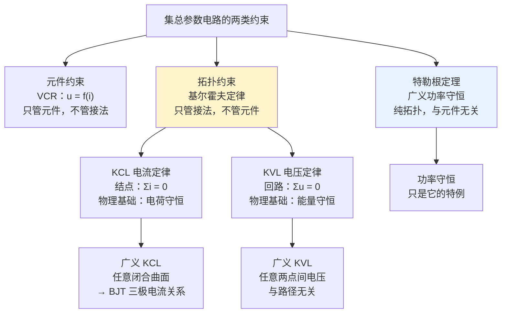

# C1.5 电路分析的基本定律 Basic Laws of Circuit Analysis

> [!abstract] 这一讲的任务
> 到目前为止，我们有了一整套理想元件，但它们**各自孤立**：$u=Ri$ 只管电阻自己，$i=C\,\mathrm du/\mathrm dt$ 只管电容自己。把它们焊在一起之后，**谁来规定它们必须如何互相配合？**
> 这一讲给出答案，也是整个第 1 章的收束点：**两类约束**——
> - **元件约束**（VCR）：每个元件自己的伏安关系，**只管元件，不管接法**；
> - **拓扑约束**（KCL / KVL）：**只管接法，不管元件**。
>
> 课堂上对这两条铁律的原话是：**"KCL、KVL 会贯穿整门课，第 1 章到第 7 章都可能用到。"** 这不是夸张——后面每一个方法、每一个定理，剥到底都是这两条。
> 最后还有一个"很扯"的定理：**特勒根定理**——两个电路里面的元件可以**完全不一样**，只要拓扑相同，把左边的电压乘右边的电流再加起来，**居然等于零**。

> [!info] 怎么读这份讲义
> KCL/KVL 两节请务必跟着例题走一遍符号判定。带 `> [!question]` 处先自己想再展开。
> 标有 **（拓展）** 或 **【拓展】** 的内容，是**课堂上没有讲到、由课件和教材延伸补充**的部分。本讲有两处场论推导属于此类（课堂明确说过"留给同学们自己回去钻研"）。

---

## 0. 开场：一个元件说了算，还是所有元件一起说了算？

拿一个 $10\ \Omega$ 的电阻。它的规则很清楚：$u=10i$。

现在把它焊进一个电路。问：**它两端的电压是多少？**

"不知道，得看电流。" 那电流是多少？"不知道，得看别的支路。" 别的支路呢？"……得看这个电阻。"

**转了一圈回到原点。**

这说明一件事：$u=Ri$ 这条规则，**只规定了 $u$ 和 $i$ 的比例，没有规定它们的数值**。数值由谁决定？由**整个电路的连接方式**决定。

> [!question] 停一下，先自己想想
> 那么"连接方式"要用什么语言来表达？它应该长什么样？
> 提示：它必须**与元件是什么无关**——不管你接的是电阻、电容还是三极管，这条规则都得成立。

> [!success]- 想过了再看
> 只能是**关于电流和电压本身的方程**，而且里面**不允许出现任何元件参数**（$R$、$C$、$L$ 一个都不能有）。
> 满足这个要求的，只有两句话：
> - 在**一个结点**上：流进来的电流总量 = 流出去的电流总量 → $\sum i=0$（**KCL**）
> - 沿**一个回路**走一圈：电位升的总量 = 电位降的总量 → $\sum u=0$（**KVL**）
>
> 这就是**拓扑约束**。课件 p.66 把两类约束并列写出：
> - **Component property constraints —— V-I relationship**（元件特性约束）
> - **Circuit topology constraints —— Kirchhoff's law（基尔霍夫定律）**
>
> 加上第三件事——**Tellegen's theorem（特勒根定理）**，就是本讲的全部内容。
> **而"两类约束加起来恰好够用"这件事，正是 [[C3.3 电阻网络的系统分析]] 那句"$2B$ 个方程解 $2B$ 个未知数"的全部来源。**

---

## 1. 基尔霍夫电流定律 KCL（课件 p.67–71）

### 1.1 物理背景（课件 p.67）

> [!important] 背景（课件 p.67 原文）
> **The law of conservation of charge（电荷守恒）and current continuity（电流连续性）are applied to any node of lumped parameter circuits.**
> $$\sum_{k=1}^{m}i_k=\oiint \vec J\cdot\mathrm d\vec S=-\frac{\partial}{\partial t}\iiint_V\rho\,\mathrm dV=0$$
> **假设（Assumption）**：被封闭曲面包围的区域**限于电路中的结点**（体积为 0，总电荷为 0）。流出曲面的电流分布满足：
> （1）**穿过曲面的每一支路承载一定量电流**（Each branch passing through the surface carries a certain amount of current）；
> （2）**其他空间没有电流分布**（No current distributes in other spaces）。

> [!note] 这条推导的关键在中间那一步
> 整条式子从左到右读：
> 1. $\sum i_k$：结点上各支路电流的代数和；
> 2. $=\oiint\vec J\cdot\mathrm d\vec S$：把它写成电流密度在包围结点的闭合曲面上的**面积分**（这就是"电流"的场论定义）；
> 3. $=-\frac{\partial}{\partial t}\iiint_V\rho\,\mathrm dV$：**电流连续性方程**——流出曲面的净电流 = 内部电荷的减少速率（这就是**电荷守恒**）；
> 4. $=0$：**关键在这里**——因为结点是一个**几何点，体积 $V=0$，因此内部总电荷恒为 0**，其时间导数自然为 0。
>
> **换句话说：KCL 之所以成立，是因为结点"装不下电荷"。**
> 这也说明了 KCL 的适用边界：如果某处能积累电荷（比如电容极板），就不能把它当结点。而集总假设恰好保证了电荷只存在于电容内部，导线和结点上不积累电荷——**KCL 是集总假设的直接产物**。

### 1.2 KCL 的表述（课件 p.68）

> [!important] KCL（Kirchhoff's Current Law，基尔霍夫电流定律）（课件 p.68 原文）
> **In any lumped parameter circuit, the algebraic sum of all branch currents flowing into any node at any time is always zero.**
> 在任何集总参数电路中，**任一时刻**流入**任一结点**的所有支路电流的**代数和恒等于零**。
> $$\boxed{\sum_{k=1}^{N}i_{kn}=0\qquad \text{Any node }n}$$
> **Note（课件红字）**：支路 $k$ 的电流参考方向**指向（points to）** 结点 $n$ 时取 **"+"**；**背离（points away from）** 结点 $n$ 时取 **"−"**。

![[C1-KCL例题节点图.png]]

注意两个词：
- **algebraic sum（代数和）**——**不是绝对值之和**，必须带符号；
- **any time（任一时刻）**——直流、交流、暂态**全都成立**，KCL 不挑工作状态。

### 1.3 KCL 例题（课件 p.69）

![[C1-KCL节点支路电流图.png]]

结点 $n$ 上连有 5 条支路，参考方向如图。课件用彩色气泡标出了每条的 In / Out：

$$i_1-i_2-i_3+i_4-i_5=0$$

| 支路 | 方向 | 符号 |
|---|---|---|
| $i_1$ | **In**（流入） | $+$ |
| $i_2$ | Out（流出） | $-$ |
| $i_3$ | Out（流出） | $-$ |
| $i_4$ | **In**（流入） | $+$ |
| $i_5$ | Out（流出） | $-$ |

> [!warning] 课件红框强调
> **Important: KCL can only be applied after the current referenced directions are confirmed.**
> **必须先确定电流参考方向，才能应用 KCL。**
>
> 课堂上把这句话展开成了**三步走**，做题时照做即可：
> **① 定义**（给每条支路设参考方向、并声明"流入为正"还是"流出为正"）→ **② 辨认**（逐条判断正负号）→ **③ 列式**（把带符号的项加起来 = 0）。
> 最常见的错误是**前后不一致**：定义了流入为正，却把某条流出的也写成正。**定义一旦作出，全程不许改。**

> [!note] 一个等价但更好用的写法
> $$\sum i_{\text{流入}}=\sum i_{\text{流出}}$$
> 把上面的例子改写：$i_1+i_4=i_2+i_3+i_5$。
> **好处**：两边全是正数，不容易搞错符号，而且物理意义一眼可见——"流进结点的总量 = 流出结点的总量"。
> 建议：**列方程时用代数和形式**（便于统一处理），**检查时用这个形式**。

### 1.4 广义 KCL（课件 p.70–71）

> [!important] 广义 KCL Extended KCL（课件 p.70 原文）
> **In any circuit, the algebraic sum of all branch currents flowing into any closed surface (not limited to a node) at any time is always 0.**
> 在任意电路中，任一时刻流入**任意闭合曲面**（**不限于一个结点**）的所有支路电流的代数和恒为零。
> $$\boxed{\sum_{k=1}^{N}i_{kS}=0\qquad\text{Any closed surface }S}$$
> 符号规则同前：**流入曲面取 "+"，流出取 "−"**。

![[C1-广义KCL闭合面与BJT三极电流.png]]

**例 1（课件 p.71 左）**：三个电阻首尾相连成三角形，三条引线从外部接入。画一个红色虚线圆圈把整个三角形包进去，构成闭合曲面 $S$。穿过 $S$ 的只有三条支路：

$$i_{\mathrm A}+i_{\mathrm B}+i_{\mathrm C}=0$$

**里面三个电阻怎么接、阻值多少，完全不需要知道。**

**例 2（课件 p.71 右）**：**BJT 双极型三极管**（课件原注：**下半学期主角之一**）。三个电极 B（基极）、E（发射极）、C（集电极）。用闭合曲面把整个管子包起来：

$$\boxed{i_{\mathrm E}=i_{\mathrm B}+i_{\mathrm C}}$$

> [!important] 广义 KCL 的威力：黑箱思维
> 例 2 的意义远超"多一个公式"。
> 三极管内部是极其复杂的半导体结构——两个 PN 结、三个掺杂区、载流子的扩散与漂移……**这些我们一概不需要知道**。
> 只要把它**当成一个黑箱包起来**，广义 KCL 立刻给出三个电极电流的精确关系。
>
> 课上用了一个很贴切的说法：**"又是 AI 的黑箱思维——我不管你里面半导体怎么走，我直接把它定义成一个封闭曲面。"**
> 这条关系是第 2 章和第 6 章反复使用的基础式：配合 $i_C=\beta i_B$，立刻得到 $i_E=(1+\beta)i_B$。→ [[C2.3 双端口器件的电路模型]]
>
> **实战用法**：做题时若某个区域内部结构复杂、或者含有你不关心的元件，**果断画一个闭合曲面把它整个圈起来**，只关心穿过边界的电流。这能省掉大量中间未知量。

---

## 2. 基尔霍夫电压定律 KVL（课件 p.72–77）

### 2.1 KVL 的表述（课件 p.72）

> [!important] KVL（Kirchhoff's Voltage Law，基尔霍夫电压定律）（课件 p.72 原文）
> **In any lumped parameter circuit, the algebraic sum of all branch voltages of any circuit at any time is always zero.**
> $$\boxed{\sum_{L}u_k=0\qquad\text{along any loop }L}$$
> **Note（课件红字）**：若支路 $k$ 的电压参考方向与回路的**绕行方向相同（kept the same as the bypass direction）**，取 **"+"**；**相反（opposite）** 则取 **"−"**。

绕行方向只有两种选择：**顺时针（clockwise）** 或 **逆时针（anti-clockwise）**，没有第三种。选哪个都行，但**选定后全程不变**。

### 2.2 KVL 的场论推导（课件 p.73–74）（拓展）

> [!note] 授课进度说明
> 课堂上明确说过这段推导"**大家回去自己钻研，我们不需要在这里推这个事情，只需要知道怎么用就行**"，并补充说这是微电子学院会细讲的内容。
> 因此**下面整段属于拓展**，考试不作要求，但理解它能让你明白 KVL 的边界在哪。

**【拓展】推导链条**（课件 p.73–74）：

**第一步：法拉第电磁感应定律**
$$\oint_L\vec E\cdot\mathrm d\vec l=-\iint_S\frac{\partial\vec B}{\partial t}\cdot\mathrm d\vec S=-\iint_S\frac{\partial}{\partial t}(\nabla\times\vec A)\cdot\mathrm d\vec S=-\oint_L\frac{\partial\vec A}{\partial t}\cdot\mathrm d\vec l$$

**第二步：由磁通连续性，存在矢量磁位 $\vec A$**，满足 $\vec B=\nabla\times\vec A$。

**第三步：应用斯托克斯公式**，把上式并到一起：
$$\oint_L\left(\vec E+\frac{\partial\vec A}{\partial t}\right)\cdot\mathrm d\vec l=0\qquad\Longrightarrow\qquad \vec E+\frac{\partial\vec A}{\partial t}=-\nabla\varphi$$

**第四步（关键，课件 p.74 中文原文）**：
> **环路上，电场和磁场只存在于回路中的集总元件内部；导线上没有场量，而在集总元件内部分别存在不同的场量，将环路积分分段积分，得到**
$$\oint_L\left(\vec E+\frac{\partial\vec A}{\partial t}\right)\cdot\mathrm d\vec l=\sum_{k=1}^{N}\int_{\text{元件}k}\left(\vec E+\frac{\partial\vec A}{\partial t}\right)\cdot\mathrm d\vec l=\sum_{k=1}^{N}u_k=0$$

> [!important] 【拓展】这个推导告诉我们三件课件没明说的事
> 1. **KVL 的物理基础是能量守恒**，而它在场论中的具体形态是"**电场沿闭合路径的环流为零**"。
> 2. **"分段积分"这一步用掉了集总假设**：正因为"导线上没有场量、场只在元件内部"（[[C1.1 电路分析的演化]] 的似稳场四约定），整条环路积分才能拆成"逐个元件积分"之和。**集总假设一破，KVL 就不再成立**——这就是课件小结第 ④ 条"KCL、KVL 只能用于集总电路"的由来。
> 3. **回路面积越大，被忽略的 $\partial\vec B/\partial t$ 项影响越大。** 这条有极强的工程含义：**PCB 设计要求信号回路面积尽可能小**，正是为了让这一项真的可以忽略，否则回路会像天线一样接收/辐射干扰。这是电磁兼容（EMC）设计的第一原则。

### 2.3 KVL 例题（课件 p.75）

![[C1-KVL例题回路L图.png]]

回路 $L$ 由 6 条支路组成，绕行方向与各支路电压参考方向如图。课件用"同向/反向"气泡逐条标注：

$$u_1-u_2+u_3-u_4-u_5+u_6=0$$

| 支路 | 与绕行方向 | 符号 |
|---|---|---|
| $u_1$ | 同向 | $+$ |
| $u_2$ | **反向** | $-$ |
| $u_3$ | 同向 | $+$ |
| $u_4$ | **反向** | $-$ |
| $u_5$ | **反向** | $-$ |
| $u_6$ | 同向 | $+$ |

> [!warning] 课件红框强调
> **Important: KVL can only be applied after the current referenced directions and the bypass direction of the loop are confirmed.**
> **必须先确定各支路电压参考方向 *和* 回路绕行方向，才能应用 KVL。**
>
> 同样是**三步走**：**① 定义**（设各支路电压参考方向 + 选定回路绕行方向）→ **② 辨认**（逐条判断同向/反向）→ **③ 列式**。
> KVL 比 KCL 更容易出错，因为"流入/流出"很直观，而"同向/反向"需要你沿着回路**走一圈**逐条比对。**建议用笔沿回路画一圈箭头，边走边标符号。**

> [!question] 停一下，先自己想想
> KCL 和 KVL 都要求"先定义参考方向，再判符号"。但两者在实际操作时，**哪一个更容易出错？为什么？**

> [!success]- 想过了再看
> **KVL 更容易出错。**
> KCL 判断的是"流入还是流出"——箭头指着结点就是流入，背着就是流出，**一眼可见**。
> KVL 判断的是"与绕行方向同向还是反向"——你必须**沿着回路走一圈**，在每条支路上把"回路的走向"和"该支路电压的参考极性"**逐条比对**。这是一个需要在脑子里转方向的过程，而且回路一长就容易漏、容易乱。
>
> **实用对策**：拿笔沿着回路**真的画一圈箭头**，边走边在每条支路旁标 + 或 −，标完再写式子。
> 这个笨办法能消掉绝大部分 KVL 符号错误，考场上多花十秒，比事后检查划算得多。

### 2.4 广义 KVL（课件 p.76）

> [!important] 广义 KVL（课件 p.76 原文）
> **In any circuit, the voltage between any two nodes can be calculated through any path connecting the two nodes, and the result is independent of the path taken in the calculation.**
> 在任意电路中，任意两结点之间的电压可以沿**任意一条连接这两点的路径**计算，**结果与所选路径无关**。

![[C1-广义KVL两点间电压多路径图.png]]

**例（课件 p.76）**：求 $u_{ad}$。图中 a、d 之间有三条通路（课件还反问了一句 "which three?"）：

$$u_{\mathrm{ad}}=u_7=u_2+u_3-u_4=-u_1-u_6+u_5$$

> [!important] 课件红框（这是最实用的解题技巧）
> **If it is difficult to calculate the voltage through one path, we can try another path, and the result remains unchanged.**
> **如果沿一条路径算起来困难，就换另一条路径，结果不变。**

> [!note] 实战价值与对偶关系
> **实战价值**：考试中常出现"某条路径上有未知量"的情况。比如 $u_2$、$u_3$ 未知，但 $u_1$、$u_5$、$u_6$ 已知——**直接换一条路径算**，立刻绕开未知量。这是白送的分。
>
> **对偶关系**：
> | | 广义 KCL | 广义 KVL |
> |---|---|---|
> | 推广对象 | 结点 → **任意闭合曲面** | 回路 → **任意两点间路径** |
> | 核心思想 | 把复杂结构**包起来**当黑箱 | 绕开难算的路径，**换一条走** |
> | 典型用途 | BJT 三极电流关系 | 求任意两点电压 |
> | 守恒本质 | 电荷守恒 | 能量守恒（电压与路径无关） |

### 2.5 综合例题（课件 p.77）

![[C1-例1-5-3含受控源电路.png]]

> [!example] 例 1-5-3：$u_S=10\ \mathrm V$，$R_1=R_2=R_3=5\ \mathrm{k\Omega}$，$\alpha=0.8$，求 $i$
> 电路中含一个**受控电压源 $\alpha u_1$**（CCVS 形式的 VCVS：由 $R_2$ 两端电压 $u_1$ 控制）。
>
> **解（课件 p.77，设顺时针为正）**：
>
> 左回路 KVL：
> $$iR_1+u_1=u_S \tag{1}$$
> 外围大回路 KVL：
> $$iR_1+\alpha u_1+i_3R_3=u_S \tag{2}$$
> 中间结点 KCL：
> $$i-i_3=\frac{u_1}{R_2} \tag{3}$$
>
> $$\boxed{i=1.09\ \mathrm{mA}}$$

> [!example] 完整代数步骤（课件直接给了答案，这里补全——考试必须写过程）
> 由 (1)：$u_1=u_S-iR_1=10-5000i$
> 由 (3)：$i_3=i-\dfrac{u_1}{R_2}=i-\dfrac{10-5000i}{5000}$
> 代入 (2)：
> $$5000i+0.8(10-5000i)+5000\left[i-\frac{10-5000i}{5000}\right]=10$$
> $$5000i+8-4000i+5000i-(10-5000i)=10$$
> $$11000i-2=10\quad\Longrightarrow\quad i=\frac{12}{11000}=1.0909\times10^{-3}\ \mathrm A$$
> $$\boxed{i=1.09\ \mathrm{mA}}\ ✓$$
>
> **复算确认**：$u_1=10-5000(1.0909\times10^{-3})=4.545\ \mathrm V$；$i_3=1.0909-4.545/5=1.0909-0.909=0.182\ \mathrm{mA}$；
> 代回 (2)：$5.455+0.8(4.545)+5(0.182)=5.455+3.636+0.909=10.0$ ✓

> [!note] 这道题演示的解题套路（课上由同学上台讲了思路）
> 关键只有一句：**找到合适的 KVL 和 KCL 方程**。
> 具体地：
> 1. 受控源 $\alpha u_1$ **先当成一个已知电压源**来列 KVL——这就是 [[C3.3 电阻网络的系统分析]] 里"先当独立源列，再补控制方程"的雏形；
> 2. 控制量 $u_1$ 在 **$R_2$ 两端**，不在受控源自己的支路上——这正是 [[C1.4 理想电路元件]] 说的"只画输出端口，控制量标在别处"；
> 3. 未知量有 $i$、$u_1$、$i_3$ 共 3 个，就必须列**足够数量**（3 条）独立方程。
>
> 课上还给了两句实用的话：**"考试考这个知识点，难度基本上就是这个上限"**；以及**"这门课很讲究过程分，千万不要交白卷——不会写就把题目和条件抄一遍，说不定也能拿一两分"**。

### 2.6 基尔霍夫定律小结（课件 p.78）

> [!important] Summary for Kirchhoff's Law（课件 p.78 原文四条）
> ① **KCL is the linear constraint on branch current, while KVL is for loop voltage.**
>   KCL 是对**支路电流**的线性约束，KVL 是对**回路电压**的线性约束。
> ② **KCL、KVL have nothing to do with the parameters of the components in the branch.**
>   KCL、KVL **与支路中元件的参数毫无关系**。
> ③ **KCL shows that the charge is conserved（守恒）at each node; KVL is the concrete embodiment of energy conservation（voltage is irrelevant to path）.**
>   KCL 体现**电荷守恒**；KVL 是**能量守恒**的具体体现（电压与路径无关）。
> ④ **KCL、KVL can only be applied to lumped circuits.**
>   KCL、KVL **只能用于集总电路**。

> [!important] 第 ② 条是最重要、也最容易被低估的一条
> "与元件参数无关"意味着什么？意味着 **KCL/KVL 是你在完全不知道电路里有什么的情况下就能写下的方程**。
> 电阻、电容、电感、二极管、三极管、还是一个你没见过的新器件——**统统不影响**。
>
> 这正是它们能"贯穿第 1 章到第 7 章"的原因：
> - 第 3 章直流电阻电路：KCL/KVL 直接用；
> - 第 4 章交流相量域：KCL/KVL **形式完全不变**，只是量变成复数（$\sum\dot I=0$、$\sum\dot U=0$）；
> - 第 5 章暂态：KCL/KVL 仍成立，只是列出来变成微分方程；
> - 第 6、7 章放大电路：分析每一个放大器的第一步仍是 KCL/KVL。
>
> **换句话说：这门课你可能会忘记很多公式，但这两条必须刻进肌肉记忆。**

---

## 3. 特勒根定理 Tellegen's Theorem（课件 p.79–87）

### 3.1 背景（课件 p.79）

> [!important] 特勒根定理（课件 p.79 原文）
> - **Proposed by Bernard D. H. Tellegen in 1952.**
> - Also be called as **generalized power conserved theorem（广义功率守恒定理）**.
> - Is **one of the most important tools** for circuit network analysis.
> - **Majority energy distribution theorems and extreme value theorems in circuit network theory can be deduced from Tellegen's theorem.**
>   电路网络理论中**大多数能量分配定理和极值定理，都可以由特勒根定理推出**。

课堂上对它的评价很直白：**"这是一个非常神奇的定理"**、**"这个定理非常厉害"**，同时也交了底：**"因为太神奇了，在考试中考得并不是很多，但大家要知道它是怎么一回事、怎么用。"**

### 3.2 前置概念：什么是"拓扑相同"（课件 p.80）

![[C1-特勒根定理同拓扑网络与图.png]]

课件 p.80 画了两个电路 $N$ 和 $\hat N$：**左边有 5 个电阻 1 个电源，右边有 4 个电阻 2 个电源**——**里面的元件完全不同**。但它们下方的两个"图"（graph）**一模一样**：同样 4 个结点、同样 6 条支路、同样的连接方式。

> [!important] 拓扑相同的判据（课件 p.80 标题）
> **The circuits that have the same topology.**
> 判断两个电路拓扑是否相同，**只看连接方式**：结点数、支路数、以及谁连谁。**完全不关心支路里装的是什么元件。**

> [!note] 课堂上的一个追问值得记
> 有同学问：图 (b) 里有一条支路是**断开的**（接的是电流源），怎么能说和左边拓扑相同？
> 答案是：**电流源支路在拓扑上仍然是一条支路**（它连接着两个结点），只是其电流被钉死。同理，一段"5 V 电压源"也可以看作一条支路。
> **拓扑只问"这两个结点之间有没有一条支路"，不问那条支路是什么。**

### 3.3 定理的表述（课件 p.83）

![[C1-特勒根定理支路编号有向图.png]]

> [!important] 特勒根定理（课件 p.83 原文）
> Network $N$ and $\hat N$ have the **same topology**. If set:
> 1. **all the relevant branches to have the same referenced directions**（所有对应支路取相同的参考方向）
> 2. **Each branch's referenced directions are related**（每条支路自身的电压电流取**相关参考方向**）
>
> 则：
> $$\boxed{\sum_{k=1}^{b}u_k\hat i_k=0}\qquad\text{and}\qquad\boxed{\sum_{k=1}^{b}\hat u_k i_k=0}$$
>
> **左边网络所有支路的电压，乘以右边网络对应支路的电流，全部加起来 = 0**；反过来也等于 0。

> [!important] 功率守恒只是它的特例
> 课堂上专门追问过："功率守恒为什么是特勒根定理的特例？"
> **答案**：当两个网络**完全相同**（拓扑相同 + 元件也相同）时，$\hat u_k=u_k$、$\hat i_k=i_k$，于是
> $$\sum_{k=1}^{b}u_k\hat i_k=\sum_{k=1}^{b}u_ki_k=\sum_k p_k=0$$
> 这正是 [[C1.2 电路的基本概念]] 的**功率守恒定律** $\sum P=0$。
> 所以特勒根定理被称为**广义功率守恒定理**——它比功率守恒强得多，因为**两个电路可以毫不相干**。

### 3.4 定理的证明（课件 p.84）（拓展）

> [!note] 授课进度说明
> 课堂上说这段推导"**留待同学们自己回去玩，有兴趣的可以玩一下**"，属于**拓展**内容。但它很短，而且结论极有启发性，建议看一遍。

**【拓展】证明**（课件 p.84 中文原文的思路）：

**第一步：把每条支路电压表示为结点电位之差**
$$u_k=u_\alpha-u_\beta$$
（支路 $k$ 连接结点 $\alpha$ 和 $\beta$。）

**第二步：支路电流从一个结点流出并流入另一结点**
$$\hat i_k=\hat i_{\alpha\beta}=-\hat i_{\beta\alpha}$$

**第三步：代入并重新分组**
$$u_k\hat i_k=(u_\alpha-u_\beta)\hat i_{\alpha\beta}=u_\alpha \hat i_{\alpha\beta}-u_\beta \hat i_{\alpha\beta}=u_\alpha\hat i_{\alpha\beta}+u_\beta\hat i_{\beta\alpha}$$

也就是说，每一项被拆成"**从 $\alpha$ 流出**"和"**从 $\beta$ 流出**"两部分。

**第四步：对所有支路求和，按结点合并同类项**
$$\sum_{k=1}^{B}u_k\hat i_k=u_\alpha\sum_j \hat i_{\alpha j}+u_\beta\sum_j\hat i_{\beta j}+\cdots\qquad(N\ \text{个结点，共}\ N\ \text{项})$$

**第五步：对每个结点用一次 KCL**
每一个括号 $\sum_j\hat i_{\alpha j}$ 都是"从结点 $\alpha$ 流出的所有支路电流之和"，由 **KCL 恒等于 0**。

$$\Longrightarrow\quad \sum_{k=1}^{B}u_k\hat i_k\equiv 0\qquad\blacksquare$$

同理可证 $\sum_{k=1}^{B}\hat u_k i_k=0$。

> [!important] 【拓展】这个证明说明了特勒根定理的本质
> 整个证明**只用到了两件事**：
> 1. **KVL**（把支路电压写成结点电位差——这一步隐含了 KVL）；
> 2. **KCL**（每个结点流出电流之和为零）。
>
> **从头到尾没有用到任何元件的伏安关系。**
> 所以特勒根定理是一条**纯拓扑定理**：它的正确性只依赖于"怎么连"，与"连的是什么"完全无关——**线性、非线性、时变、时不变，一律成立**。
> 课件 p.87 最后一条正是这句话：**The correctness of the theorem has nothing to do with the properties of the elements.**

### 3.5 例题 1（课件 p.85）

![[C1-特勒根定理例题1电路.png]]

> [!example] 求电流 $i_x$
> 网络 $N$：左端 10 V 电压源（上正下负），中间是黑箱 $R$（内含 $n$ 条电阻支路），右端 1 A 电流源。
> 网络 $\hat N$：**同样的黑箱 $R$**，左端待求电流 $i_x$，右端 5 V 电压源（上负下正）。
>
> **单看右边的条件，$i_x$ 是解不出来的**——黑箱里有什么我们不知道。但两个网络**拓扑相同**，于是可以用特勒根定理。
>
> 设左支路电流为 $i_1$、右支路电流为 $i_2$（方向如图）。
>
> **第一式**（左边电压 × 右边电流）：
> $$10\times(-i_x)+0\times i_2+\sum_{3}^{B}u_k\hat i_k=0$$
> **第二式**（左边电流 × 右边电压）：
> $$0\times(-i_1)+(-5)\times 1+\sum_{3}^{B}\hat u_ki_k=0$$
>
> **黑箱内部**（纯电阻，$u_k=i_kR_k$）：
> $$u_k\hat i_k=i_kR_k\hat i_k=i_k\hat u_k$$
> **两式的求和项完全相等**，相减即可消去：
> $$-10i_x=-5\quad\Longrightarrow\quad\boxed{i_x=0.5\ \mathrm A}$$

> [!note] 这道题的三个要害
> **① 为什么内部那一大堆未知项能消掉？**
> 因为黑箱里是**纯电阻**：$u_k\hat i_k=(i_kR_k)\hat i_k$ 而 $\hat u_ki_k=(\hat i_kR_k)i_k$——**两者是同一个式子**（乘法可交换）。所以两个求和项恒等，一减就没了。
> **这正是特勒根定理的使用精髓：用两条式子把"不可知的内部"消掉。**
>
> **② 参考方向的坑（课堂反复强调）。**
> 注意第一式里的 $-i_x$ 和第二式里的 $-5$——这两个负号都来自**参考方向不相关**。
> 课堂上把这一点说得很重：**"这里不是说一个网络内部某条支路的电压电流要相关，而是要让 $i_1$ 和 $i_x$（两个网络的对应支路）方向相关。如果不相关，用定理时记得加负号。"**
> **判断顺序**：先看两个网络对应支路的参考方向是否一致 → 不一致就给那一项加负号。
>
> **③ 考试识别信号（课上明说的应试提示）。**
> **"有时候考试中会给出两个拓扑结构一样的图，大家应该就要反应过来——这可能是要考特勒根定理了。"**
> 看到"两个结构相同、参数不同的电路图"，第一反应就该是它。

### 3.6 例题 2（课件 p.86）

![[C1-例1-5-5双网络电路.png]]

> [!example] 例 1-5-5（中文原题）
> 在图示电路中，$N_0$ 为**线性无源电阻网络**。若图 (a) 中，输入 10 V 电压时，输入端电流为 2 A，输出端电压为 5 V；试求图 (b) 中流过 $10\ \Omega$ 电阻的电流（方向如图所示）。
>
> **解**：设 $N_0$ 内部各支路电压电流分别为 $u_k$、$i_k$。图 (a) 与图 (b) 拓扑结构相同，据特勒根定理：
> $$10i+\sum i_{ka}R_ki_{kb}+5\times 2=0$$
> $$10i\times(-2)+\sum R_ki_{kb}i_{ka}=0$$
> 两式中的求和项相同，消去后解得：
> $$\boxed{i=0.33\ \mathrm A}$$

> [!example] 代数细节（课件跳过了）
> 记 $S=\sum R_k i_{ka}i_{kb}$。
> 第一式：$10i+S+10=0\ \Rightarrow\ S=-10i-10$
> 第二式：$-20i+S=0\ \Rightarrow\ S=20i$
> 联立：$20i=-10i-10\ \Rightarrow\ 30i=-10\ \Rightarrow\ i=-1/3$
>
> 课件取 $i=0.33\ \mathrm A$，即按图中标注的参考方向给出数值（负号已由方向吸收）。**答题时务必写明所取的参考方向**，否则正负号说不清。
>
> 另外注意图 (b) 右侧那条支路：课堂上专门问过"断开的支路电流是多少" —— **是 0**。所以该项 $u\times 0=0$，**即使不知道那个电流源的端电压也没关系**。这是特勒根定理题目里常见的送分点。

### 3.7 使用注意事项（课件 p.87）

> [!warning] Important when applying Tellegen's Theorem（课件 p.87 原文四条）
> ① The branch **voltage** in the circuit must meet **KVL**。（支路电压必须满足 KVL。）
> ② The branch **current** in the circuit must meet **KCL**。（支路电流必须满足 KCL。）
> ③ The branch voltage and current in the circuit must **meet the relevant reference direction**（or **take "−" in the equation**）。（必须取相关参考方向，否则式中要加负号。）
> ④ The correctness of the theorem **has nothing to do with the properties of the elements**。（定理的正确性与元件性质无关。）
>
> **注**：课件 p.87 原文把①②的措辞写成 "The branch voltage ... must meet KVL / The branch current ... must meet KCL"，课堂上口头更正过一次表述顺序，最终以"**电压对应 KVL、电流对应 KCL**"为准（与上表一致）。

---

## 4. 作业要求（课件 p.88）

> [!important] Homework（课件 p.88 + 课堂说明）
> - **DDL：A week from the homework announcement**（作业发布后一周）。
>   **本次例外**：因为**第 2 章没有作业**，第 1 章作业延长到**两周**后交。
> - **Important: If you only write the final answer without providing sensible solving process, 0 point will be received.**
>   **只写最终答案、不给出合理解题过程，得 0 分。**
> - 课件给出了标准答案的范例（即例 1-5-3 的完整过程）。
> - **交纸质版**，不要交电子版（老师要批改后发还，方便复习）。

> [!note] 为什么死抠"过程分"
> 课堂上解释过：**作业最重要的是锻炼分析逻辑**，而不是得到那个数。
> 这条和 [[C0 课程基本介绍]] 里"这门课主要靠逻辑，背公式会非常痛苦"是同一件事。
> 实用推论：**考试务必写过程**——即使算错，过程对了仍有分；即使不会做，抄题目和条件也可能拿一两分。**千万不要交白卷。**

---

## 这一讲的三句话

1. **集总电路只受两类约束**：元件约束（VCR，只管元件不管接法）+ 拓扑约束（KCL/KVL，只管接法不管元件）。这两类加起来**恰好完备**，这是第 3 章全电路方程的全部来源。
2. **KCL 源于电荷守恒（结点装不下电荷），KVL 源于能量守恒（电压与路径无关）**；两者都可推广——**广义 KCL 用于任意闭合曲面**（把复杂结构当黑箱包起来，BJT 的 $i_E=i_B+i_C$ 就这么来的），**广义 KVL 用于任意两点间路径**（一条路难算就换一条）。
3. **特勒根定理是纯拓扑定理**：证明只用了 KCL 和 KVL，**完全没用元件伏安关系**，所以线性非线性通吃。功率守恒只是它"两个网络完全相同"的特例。应试识别信号：**题目给出两个拓扑相同的电路图**。

**速查表**

| 定律 | 公式 | 适用对象 | 物理基础 | 符号规则 |
|---|---|---|---|---|
| **KCL** | $\sum_k i_{kn}=0$ | 任一**结点** | **电荷守恒** | 流入取 +，流出取 − |
| **广义 KCL** | $\sum_k i_{kS}=0$ | 任一**闭合曲面** | 同上 | 流入取 +，流出取 − |
| **KVL** | $\sum_L u_k=0$ | 任一**回路** | **能量守恒** | 与绕行方向同向取 +，反向取 − |
| **广义 KVL** | $u_{ab}$ 与路径无关 | 任意**两点间** | 同上 | 按所选路径逐段判定 |
| **特勒根定理** | $\sum_k u_k\hat i_k=0$；$\sum_k\hat u_k i_k=0$ | **两个同拓扑网络** | **纯拓扑**（KCL+KVL） | 对应支路方向须一致，否则加负号 |
| **功率守恒** | $\sum_k u_ki_k=0$ | 单个电路 | 特勒根的**特例** | 相关参考方向 |

**三步走口诀（KCL/KVL 通用）**：**① 定义参考方向 → ② 逐条辨认符号 → ③ 列式求解。** 定义一旦作出，全程不许改。

**下一讲预告**：第 1 章到此结束——你现在手上有一整套理想元件，和两条管着它们怎么配合的铁律。
但第 1 章从头到尾都在一个假设下工作：**似稳场**。下一章要做的事情是**把这个假设撕掉**：一根导线不再是一根导线，一个电阻在高频下会变成电容、再变成电感，一个电容会爆炸（这不是比喻，课上讲过一次亲历）。
好消息是：**第 2 章没有作业，考试也只考选择题和填空题，不考计算题和分析题**——只要理解概念即可。→ [[C2.1 元件互连与传输线模型]]

---

## 本节自测 Self-Test

> [!question] Q1：KCL 的物理基础是什么？为什么"结点处电荷守恒"能推出 $\sum i=0$？

> [!success]- 答案
> 物理基础是**电荷守恒 + 电流连续性**。
> 由电流连续性方程，流出闭合曲面的净电流 = 内部电荷的减少率：$\oiint\vec J\cdot\mathrm d\vec S=-\frac{\partial}{\partial t}\iiint\rho\,\mathrm dV$。
> **关键**：结点是一个几何点，**体积为 0，内部总电荷恒为 0**，故右端为 0，得 $\sum i_k=0$。
> 一句话：**KCL 成立是因为结点"装不下电荷"。**

> [!question] Q2：KVL 推导中"分段积分"这一步用到了什么假设？破坏这个假设会怎样？

> [!success]- 答案
> 用到了**集总假设（似稳场）**：**导线上没有场量，场只存在于集总元件内部**。正因如此，整条环路积分才能拆成"逐个元件积分"之和，每一段积分即该元件的电压 $u_k$。
> 若假设被破坏（高频、大回路），$\partial\vec B/\partial t$ 项不可忽略，KVL 不再严格成立——这正是课件小结第 ④ 条"只能用于集总电路"的由来。

> [!question] Q3：为什么 PCB 设计要求信号回路面积尽量小？用本节知识解释。

> [!success]- 答案
> KVL 严格形式为 $\oint\vec E\cdot\mathrm d\vec l=-\iint_S\frac{\partial\vec B}{\partial t}\cdot\mathrm d\vec S$。右端与**回路所围面积 $S$ 成正比**。
> 回路面积越大，穿过它的变化磁通越多，感应电动势越大——回路会像天线一样**接收外界干扰**（也会向外辐射）。
> 缩小回路面积让右端趋于 0，既保证 KVL 近似成立，也是**电磁兼容（EMC）设计的第一原则**。

> [!question] Q4：某结点连有 4 条支路，$i_1$、$i_2$ 流入，$i_3$、$i_4$ 流出。写出 KCL 方程（两种形式）。

> [!success]- 答案
> 代数和形式（定义流入为正）：$i_1+i_2-i_3-i_4=0$。
> 等价形式：$i_1+i_2=i_3+i_4$（流入总量 = 流出总量）。
> 列式用前者，检查用后者。

> [!question] Q5：广义 KCL 相比普通 KCL 多了什么能力？举一个本课程中的关键应用。

> [!success]- 答案
> 把适用对象从"一个结点"推广到"**任意闭合曲面**"，于是可以把一整块复杂结构**当黑箱包起来**，只关心穿过边界的电流，完全不必知道内部构造。
> 关键应用：**BJT 三极管** $i_E=i_B+i_C$——内部两个 PN 结、三个掺杂区的复杂机制全部不需要了解。→ [[C2.3 双端口器件的电路模型]]

> [!question] Q6：广义 KVL 的"路径无关"本质上是什么守恒？实战中怎么用？

> [!success]- 答案
> 本质是**能量守恒**：把单位正电荷从 a 移到 b，所做的功只取决于两点的电位差，与走哪条路无关（与重力场中的势能完全类比）。
> 实战：某条路径上有未知量时，**换一条已知量齐全的路径算**，结果不变。也可用作**答案自检**（两条路径算同一电压，结果必须相同）。

> [!question] Q7：特勒根定理的证明只用到了哪两条？这说明什么？

> [!success]- 答案
> 只用到 **KCL** 和 **KVL**（把支路电压写成结点电位差），**完全没用元件的伏安关系**。
> 这说明它是一条**纯拓扑定理**：正确性只依赖"怎么连"，与"连的是什么"无关——线性、非线性、时变、时不变**一律成立**。这也是课件第 ④ 条注意事项的含义。

> [!question] Q8：$\sum u_k\hat i_k$ 有物理意义吗？

> [!success]- 答案
> **一般没有**——它把网络 $N$ 的电压和网络 $\hat N$ 的电流相乘，两者属于**不同的电路**，乘积不是任何真实功率。
> 它是一个**纯数学构造**。只有当两个网络完全相同时，它才退化为真实功率之和，即功率守恒 $\sum p_k=0$。
> 这也正是"广义功率守恒定理"这个名字的含义：**形式像功率，但不要求是同一个电路**。

> [!question] Q9：例题 1 中，黑箱内部那一大堆未知项为什么能消掉？

> [!success]- 答案
> 因为黑箱内是**纯电阻**：$u_k=i_kR_k$，于是
> $$u_k\hat i_k=(i_kR_k)\hat i_k \qquad \hat u_ki_k=(\hat i_kR_k)i_k$$
> 两者是同一个乘积（乘法可交换），故 $\sum u_k\hat i_k=\sum \hat u_ki_k$。两式相减，内部项全部抵消，只剩端口项。
> **这就是特勒根定理解题的核心机制：用两条式子消掉不可知的内部。**

> [!question] Q10：使用特勒根定理的四条注意事项是什么？其中哪一条最容易出错？

> [!success]- 答案
> ① 支路电压须满足 KVL；② 支路电流须满足 KCL；③ 支路电压电流须取**相关参考方向**（否则式中加负号）；④ 定理的正确性与元件性质无关。
> **最容易出错的是第 ③ 条**，而且课堂特别澄清过它的确切含义：要求的是**两个网络对应支路的参考方向一致**，而不仅是同一网络内部电压电流相关。方向不一致就必须在该项前加负号。

> [!question] Q11：本课程的作业有哪两条硬规定？

> [!success]- 答案
> ① **只写答案不写过程 = 0 分**（作业的目的是锻炼分析逻辑，不是得到数字）；
> ② **交纸质版**，不交电子版（老师批改后发还，便于复习）。
> 推论：考试也务必写过程，本课程**讲究过程分**，不会做也不要交白卷。

---

**上一节 ←** [[C1.4 理想电路元件]]
**下一节 →** [[C2.1 元件互连与传输线模型]]
**课程索引 →** [[电路基础 MOC]]
