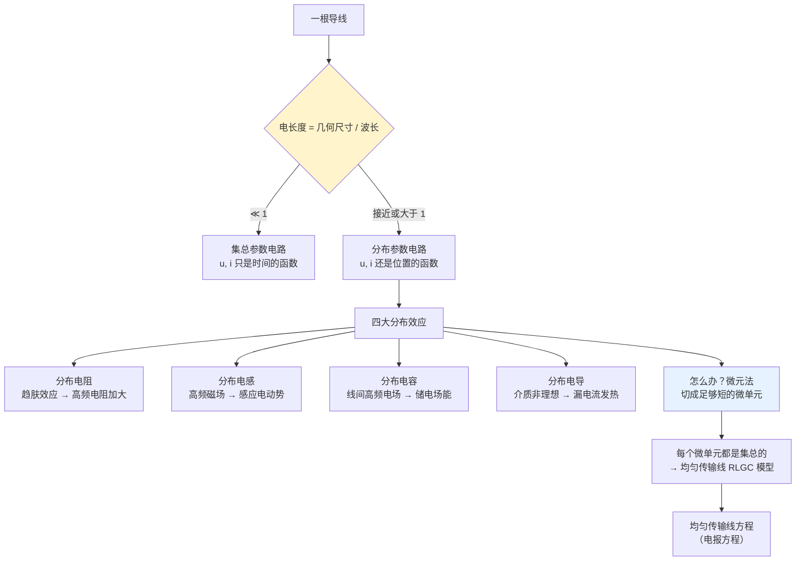

# C2.1 元器件的互连及其电路模型

> [!abstract] 这一讲的任务
> 第 1 章从头到尾站在**似稳场**这张许可证上：导线理想、不耗能、互不耦合。这一讲开始**撕掉这张许可证**，看看真实世界里会发生什么。
> 主角是一个你从来没正眼看过的东西——**导线**。在高中题目里它什么都不是，在这里它会长出**电阻、电感、电容、电导**四种效应，最后变成一个需要解**偏微分方程**的家伙。
> 好消息先给：**第 2 章没有作业**，考试**只考选择题和填空题**（概念题），**不会出计算题和分析题**。所以这一讲要的是**理解**，不是刷题。

> [!info] 怎么读这份讲义
> 建议顺读，重点抓三个概念：**电长度**（判据）、**四大效应**（现象）、**微元法**（方法论）。
> 带 `> [!question]` 处先自己想再展开。标有 **（拓展）** 或 **【拓展】** 的内容，是**课堂上没有讲到、由课件和教材延伸补充**的部分。

---

## 0. 开场：一部电影里的两种时间

课上先放了一段电影片段（《X 战警》里快银的经典场面）。画面里有两种人：

- **普通人**：他们只看到**结果**——一瞬间，所有人倒下了，子弹全都没打中。**中间发生了什么，他们毫不知情。**
- **快人（快银）**：在同一段时间里，他从容地走来走去，还顺手蘸了口汤喝，把飞行中的子弹一颗颗拨开。**他看得见全过程。**

> [!question] 停一下，先自己想想
> 造成这两种视角差异的**根本原因**是什么？

> [!success]- 想过了再看
> **观察的时间尺度不一样。**
>
> 现在把这个类比接到电路上：
> - **导线** = 快银奔跑的那条走廊；
> - **电子** = 快银本人。
>
> **高中的电路（集总）**：我们只看得到电子的**出发和到达**。中间它走了多宽的路、拐了几个弯、遇到多大阻力——**一概不管**。
> **高频下的电路（分布）**：工作频率提高 → 波长变短 → 相当于我们的**观察时间尺度被拉长**了。于是电子在导线中移动**不再是一个瞬间完成的过程**，我们必须考虑它一路上碰到的各种效应：路变宽了阻力变小、路变窄了阻力变大、宽窄交界处阻力突变……
>
> **结论**：当一根线足够长、或工作频率足够高时，**导线上各点的电压电流就不只是时间的函数了，它还和位置有关**——呈现**空间分布特性**。
> 这就是"分布参数电路"这个名字的全部含义。

---

## 1. 电长度与分布参数理论（课件 p.2）

> [!important] 集总 vs 分布 的分界（课件 p.2 原文）
> - **工作频率较低时**，互连导线的几何尺寸**远小于信号波长**，电压或者电流都**仅仅是时间函数，与空间分布无关**。——**集总参数电路**
> - **工作频率高时**，互连导线的几何尺寸与信号波长**相当甚至大于信号波长**，导线上各点电压和电流**不仅是时间函数，还将呈现空间分布特性**。——**分布参数电路**
> - 互连导线的几何尺寸**对信号波长的比值**称为其**电长度**，**电长度远小于 1 的电路才是集总参数电路**。
> - 分布参数电路中**互连导线称为传输线**，传输线的电路分析采用**微分方法**。

> [!important] 电长度 Electrical Length
> $$\boxed{\text{电长度}=\frac{l}{\lambda}}\qquad\qquad \lambda=\frac{c}{f}\ \ (\text{真空/空气中})$$
> **判据**：
> - 电长度 $\ll 1$ → **集总参数电路**，可用本课程第 1、3、4、5 章的全部方法；
> - 电长度接近或大于 1 → **分布参数电路**，必须按传输线处理。

> [!note] 一条实用的工程门槛（课上给出）
> 课堂上给了一个更具体的数字：**一般来讲，如果一根线长度大于 $0.01\lambda$（百分之一波长），就必须考虑分布参数了**；远小于这个值时仍可当成理想集总导线。
> 不同教材/行业的门槛略有差别（$\lambda/20$、$\lambda/10$ 都有人用），但数量级一致。**记住"看比值不看长度"这件事本身，比记具体数字重要。**
>
> 注意一个容易忽略的细节：**波长要用信号在该介质中的波长**，不是真空波长。
> $$\lambda=\frac{c}{f\sqrt{\varepsilon_r}}$$
> FR4 电路板 $\varepsilon_r\approx4.3$，波长比真空中短约一半——**同样长度的走线，在 PCB 上"电更长"。**

> [!example] 手算三个例子
> | 场景 | 频率 | 波长 | 线长 | 电长度 | 结论 |
> |---|---|---|---|---|---|
> | 实验台导线 | 50 Hz | 6000 km | 0.3 m | $5\times10^{-8}$ | **集总** ✓ |
> | PCB 走线（FR4） | 500 MHz | $\approx 29\ \mathrm{cm}$ | 5 cm | $\approx 0.17$ | **分布**（远超 0.01）|
> | 远距离输电线 | 50 Hz | 6000 km | 3000 km | 0.5 | **分布** |
>
> 第三行最能说明问题：**频率再低，只要线足够长，照样是分布参数。** 判据永远是比值。

---

## 2. 分布参数电路的四大效应（课件 p.3）

> [!important] 分布参数电路的特点（课件 p.3 原文四条）
> - 导线中流过的高频电流会产生**趋肤效应**，使导线的**有效面积减小，高频电阻加大**，而且沿线各处都存在损耗，电路产生 **分布电阻** 效应；
> - 流过高频电流的导线周围存在**高频磁场**，电路产生 **分布电感** 效应；
> - 相互靠近的导线间有电压，存在**高频电场**，电路产生 **分布电容** 效应；
> - 相互靠近的导线间的介质并非理想介质而**存在漏电流**，相当于线间并联一个电导，这就是 **分布电导** 效应。
>
> **课件红字结论**：工程上，为了简化分析，在一定条件下常常用**路的方法**来分析分布参数电路，其**核心思想就是把原本尺寸与波长相当的连线和器件微分成足够小的微单元，每个微单元都是集总参数的**。

### 2.1 趋肤效应 Skin Effect

![[C2-趋肤效应导线截面电流分布.png]]

课上先让大家猜：两张导线横截面的电流分布图，**哪张是直流、哪张是交流？**

**答案**：电流**均匀分布**的那张是直流；电流**集中在外缘**的那张是交流。

课件配的视频把机理讲得很清楚（课堂原话整理）：

1. 直流信号在导体中传输时，导体内部的电流是**均匀分布**的；
2. 交流信号传输时，**越靠近导体表面电流密度越大，导体内部电流密度较小**；
3. 于是**大部分电荷在导体中移动时电阻增加，损耗也会增加**——这就是趋肤效应；
4. **原因**：交流信号在传输过程中会产生**变化的磁场**，变化的磁场产生电场，从而产生**感应电流**；**导线中心的感应电流最大，且方向与导线中流过的电流方向相反**，所以迫使电流靠近导线表面；
5. **频率越高，趋肤效应越明显**。

> [!note] 换个角度理解：电流走"阻力最小的路"
> 高中物理讲过：电流总是沿最容易通过的支路流动（有短路支路时，电流全走短路支路）。
> 这里是同一个道理——**导线中心因为反向感应电流的存在，等效阻力最大**，于是电荷"选择"了阻力相对小的截面：**导体的外缘（皮肤）**。
> "趋肤"二字就是这么来的：**趋向导体的皮肤（外表面）**。

> [!note] 趋肤深度的定量描述（拓展）
> 课件只讲现象，这里补一个工程上天天用的量——**趋肤深度 $\delta$**（电流密度衰减到表面值 $1/e\approx37\%$ 的深度）：
> $$\delta=\sqrt{\frac{2}{\omega\mu\sigma}}=\frac{1}{\sqrt{\pi f\mu\sigma}}$$
> 铜的典型值：
> | 频率 | 趋肤深度 |
> |---|---|
> | 50 Hz | ≈ 9.3 mm |
> | 1 MHz | ≈ 66 μm |
> | 1 GHz | ≈ 2.1 μm |
>
> **后果**：有效导电截面积从 $\pi r^2$ 缩小到约 $2\pi r\delta$（一层薄壳），交流电阻 $R_{AC}\propto\sqrt f$ 上升。
> **工程对策**：① **利兹线**（多股细线绞合，各股都很细，整体表面积大）；② **镀银**（高频电流只走表面，所以只需在表面镀一层高导电率金属）；③ **空心导体**（中心本来就没电流，干脆掏空省材料）。
> 这也解释了为什么高频电路里的导线常常看起来"很奢侈"。

### 2.2 分布电感效应

![[C2-分布电感效应示意.png]]

课堂上的推理链是这样走的：

1. 一根导线通**交流电流**时，实际上**在导体内部变化的是电磁波**；
2. 电荷移动时，某时刻正电荷移到某处，后面就会感应出负电荷；
3. 这些电荷聚集在导体外表面，**产生感应电磁场**；
4. **感应电动势会随电流大小变化而变化**；
5. **提问：一个感应电动势，可以用什么基础元件来建模？**

> [!question] 停一下，先自己想想
> 感应电动势的出现，应该用哪个理想元件来建模？

> [!success]- 想过了再看
> **电感**。
> 因为电感的定义就是"**阻碍电流变化的能力**"，而它阻碍的手段正是产生感应电动势（[[C1.4 理想电路元件]] 第 2.4 节）。
> 所以：**导线通高频电流 → 产生感应电动势 → 等效为一个电感接在传输线模型里**。这就叫**分布电感效应 distributed inductance effect**。

> [!important] 课件红字（本章的哲学高点）
> **在高频下，功率传输实际上是由电磁场的变化完成的**（the power transfer is actually done by the electromagnetic field variation）。
>
> 这句话彻底颠覆了高中的直觉。你以为能量是"顺着导线流过去的"——**不是**。
> 能量沿着**导线周围的空间**（电磁场）传播，导线的作用更像是**引导波的边界**，而不是"能量的管道"。
> 这和 [[C1.2 电路的基本概念]] 那张场量-路量表的最后一行是同一件事：**功率 = 坡印廷矢量的面积分**，$p=\iint\vec S\cdot\mathrm d\vec S$——能量是从元件周围的空间流进去的。

### 2.3 分布电容效应

![[C2-分布电容效应示意.png]]

同样的推理，换一个对象：

> [!question] 停一下，先自己想想
> 分布电感来自"导线内部变化的电磁场产生感应电动势"。那么**分布电容**是怎么来的？
> 提示：想象一个电容的两个极板长什么样。

> [!success]- 想过了再看
> **两根靠得很近、通着交流电的平行导线，就像电容的两块平行极板。**
> 一根导线上某一时刻的正电荷，会与另一根导线上的负电荷之间**产生电场，并储存一定的电场能**。
> 这个"两块平行极板 + 中间储存电场能"的物理现象，**正是电容的定义**。所以用一个电容 $C_{12}$ 来建模。

课上紧接着追问了一个举一反三的问题：图上除了 $C_{12}$，还有 $C_{1G}$ 和 $C_{2G}$，它们是什么？

**答案**：**导线与地平面之间**也会形成电压差、储存电场能，所以每根导线**对地**也有一个分布电容。
这正好呼应 [[C1.1 电路分析的演化]] 那句"**地可以是一个平面**"——地不再是一个理想的零电位点，它是一个参与电磁耦合的**导体平面**。

> [!note] 这张图画的就是"串扰 crosstalk"
> $C_{12}$ 的存在意味着：**导线 1 上的信号会通过电容耦合到导线 2 上去**。
> 在高速数字电路里这叫**串扰（crosstalk）**，是 PCB 设计的头号敌人之一：
> - 两根走线并排走得越长、靠得越近，$C_{12}$ 越大，串扰越严重；
> - 对策：**拉开间距**（经验法则：间距 ≥ 3 倍线宽）、**中间加地线隔离**、**换层走线**。
>
> 顺带说明为什么"**信号线下方的地平面不能随意开槽**"：地平面被开槽后，返回电流被迫绕道，回路面积骤增 → 分布电感变大、串扰与辐射同时恶化（这正好接上 [[C1.5 电路分析的基本定律]] 里"回路面积要小"那条）。

### 2.4 分布电导效应

课堂上的讲法：两根导线之间的介质**并非理想绝缘体**。

即便是**空气**，在足够强的电场下也会被击穿产生电流；一般情况下也总会有非常轻微的**漏电流**。而这个漏电流会**产生热量**，是一种损耗。

> [!important] 用什么建模？
> 用**电导 $G$**（conductance / admittance）。
> 注意这里**必须用电导而不是电阻**：因为它是**并联**在两根线之间的（漏电流从一根线横穿到另一根线），而并联支路天然用电导描述（[[C3.2 电阻网络等效化简]] 第 4.3 节）。

至此，四种效应集齐：**R（趋肤损耗）、L（感应电动势）、C（线间电场）、G（介质漏电）**。

---

## 3. 微元法：本章最重要的方法论

问题来了：四种效应**沿线处处存在、且连续分布**，这比集总电路复杂太多。怎么办？

> [!question] 课堂追问：有没有办法把分布式的情形重新变回集总的？
> 提示：造成麻烦的根本原因是"线变长了"。

> [!success]- 答案（课上有同学秒答）
> **把它切短。**
> 既然根本原因是"线相对波长太长"，那解决办法就是**重新把它变得足够短**——用 **微元法（differential method / 微分法）**。
>
> 课件 p.3 红字说的正是这件事：**"把原本尺寸与波长相当的连线和器件微分成足够小的微单元，每个微单元都是集总参数的。"**
>
> 这就是高等数学里微分思想的直接应用。课堂上还把它和积分并列总结过：
> - **微分**：把东西分得更细，考虑更微观；
> - **积分**：把数值或物理过程累积起来，看它一段时间之内的效应。
>
> **这两个手段是我们分析整个物理世界最基础的手段。**

> [!question] 再追问一个更细的问题：微元之后为什么可以把导线当成"均匀"的？
> 明明真实导线粗细不一、形状不规则。

> [!success]- 答案
> **因为"不均匀"是在宏观尺度上发现的。**
> 当你把它微分得足够细——特别是长度细到一定程度——**形状的变化在这一小段内就可以近似成不变**。
> **微分得足够细，所有的线最终都会变成一根根短短的均匀传输线。**
> 这就是下一节"均匀传输线 UTL"这个名字的合法性来源，也是 $R_0$、$L_0$、$G_0$、$C_0$ 四个参数**能被当成常数**的原因。

---

## 4. 均匀传输线的分布参数模型（课件 p.4）

![[C2-均匀传输线RLGC分布参数模型.png]]

> [!important] 均匀传输线 UTL 的四个基本参数（课件 p.4 原文）
> **均匀传输线的基本参数有四个：（单位长度）分布电阻 $R_0$、分布电导 $G_0$、分布电感 $L_0$ 和分布电容 $C_0$。**
> 该模型称为**均匀传输线模型（RLGC）**。
>
> 注意"**单位长度**"四个字：这四个量的量纲分别是 Ω/m、S/m、H/m、F/m——它们是**密度**，不是总量。一段长 $\Delta x$ 的微元，其集总参数为 $R_0\Delta x$、$L_0\Delta x$、$G_0\Delta x$、$C_0\Delta x$。

**模型的结构**（课件图）：一小段 $\Delta x$ 内，
- 串联支路：$R$ 与 $L$ 串联（代表沿线损耗 + 感应电动势）；
- 并联支路：$G$ 与 $C$ 并联（代表线间漏电 + 线间储能）。

> [!important] 均匀传输线方程（电报方程）（课件 p.4）
> $$\boxed{\begin{cases}-\dfrac{\partial u}{\partial x}=R_0\,i+L_0\dfrac{\partial i}{\partial t}\\[2mm] -\dfrac{\partial i}{\partial x}=G_0\,u+C_0\dfrac{\partial u}{\partial t}\end{cases}}$$
> **课件红字**：**导线间的电压连续变化；导线中的电流沿线连续变化。**

> [!note] 这两个方程是怎么来的（课件只给结果，这里补推导——理解了就不用背）（拓展）
> 取一小段 $\Delta x$，对它用第 1 章的两条铁律即可。
>
> **第一式：对这一小段的串联支路用 KVL。**
> 进入这段的电压是 $u(x,t)$，离开时是 $u(x+\Delta x,t)$。中间跨过了 $R_0\Delta x$ 和 $L_0\Delta x$：
> $$u(x,t)-u(x+\Delta x,t)=(R_0\Delta x)\,i+(L_0\Delta x)\frac{\partial i}{\partial t}$$
> 两边除以 $\Delta x$ 并令 $\Delta x\to0$：
> $$-\frac{\partial u}{\partial x}=R_0 i+L_0\frac{\partial i}{\partial t}\qquad ✓$$
>
> **第二式：对这一小段的并联支路用 KCL。**
> 流进的电流 $i(x,t)$ 减去流出的 $i(x+\Delta x,t)$，差额全部从并联的 $G_0\Delta x$ 和 $C_0\Delta x$ 漏掉：
> $$i(x,t)-i(x+\Delta x,t)=(G_0\Delta x)\,u+(C_0\Delta x)\frac{\partial u}{\partial t}$$
> 同样取极限：
> $$-\frac{\partial i}{\partial x}=G_0 u+C_0\frac{\partial u}{\partial t}\qquad ✓$$
>
> **结论：电报方程 = 对一个微元用 KCL + KVL。**
> 这正好印证 [[C1.5 电路分析的基本定律]] 的地位——**即使进入分布参数世界，基尔霍夫定律仍然是出发点**，只是作用在微元上，结果从代数方程变成了偏微分方程。

> [!note] 无损耗传输线的两个常用结论（拓展）
> 令 $R_0=G_0=0$（理想无损耗），电报方程化为标准**波动方程**，可得两个在射频/高速设计中天天用的量：
> $$\text{特性阻抗}\quad Z_0=\sqrt{\frac{L_0}{C_0}}\qquad\qquad \text{传播速度}\quad v=\frac{1}{\sqrt{L_0C_0}}$$
> **特性阻抗**只由**几何结构和介质**决定，与线长无关。常见值：同轴电缆 **50 Ω**（射频）/ **75 Ω**（视频），双绞线 **100 Ω**（以太网），PCB 差分对 **90/100 Ω**（USB、HDMI）。
> 这也是为什么天线、射频模块的接口全是 50 Ω——**阻抗匹配**，配合 [[C3.4 线性电路定理]] 的最大功率传输定理使用。

---

## 5. 互连导线的电路模型（课件 p.5–6，标注"了解"）

课件这两页标着**"（了解）"**，课堂上也讲得很快。要点是：**同一根导线，有集总和分布两套模型**。

### 5.1 单导线互联线（课件 p.5）

![[C2-单线传输线集总与分布模型.png]]

- **集总参数电路模型**：只在**电子出发的一瞬间和到达的一瞬间**各建一个模型——起点一个 $R$、一组 $G$ 和 $C$ 对地；终点一个 $L$、一组 $G$ 和 $C$ 对地。**中间过程不建模。**
- **分布参数电路模型**：把长导线**切成一根根短导线**，每一根都用 $R$–$L$–$G$–$C$ 建模，然后**一节一节串起来**（图中画了多级级联 + 省略号）。

### 5.2 双导线互联线（课件 p.6）

![[C2-双线传输线集总与分布模型.png]]

- **集总参数模型**：两根线各有一个 $R$ 和一个 $L$，中间并联一组 $G$ 和 $C$（代表线间的漏电与储能）。
- **分布参数模型**：同样是把上述结构**多级级联**，每一级的 $R$、$L$、$G$、$C$ 都是稳定的（因为微元后每段都是均匀的）。

> [!note] 单线模型 vs 双线模型怎么选
> - **单线模型**：适用于有**统一参考地平面**的场合（PCB 单端走线、同轴电缆的芯线对屏蔽层）。此时"回路"由信号线 + 地平面构成，所以电容画到地。
> - **双线模型**：适用于**双绞线、差分对**等两根线地位对等的场合。此时电容画在两线之间。
>
> 现代高速接口（USB、HDMI、以太网、PCIe）几乎全用**差分对**，因为差分传输对共模干扰有天然抑制能力——所以双线模型在工程上更常见。

---

## 6. 集总与分布的对照总表

| | **集总参数电路** | **分布参数电路** |
|---|---|---|
| 判据 | 电长度 $l/\lambda\ll 1$ | 电长度接近或大于 1（工程上 $>0.01\lambda$ 就要考虑） |
| $u$、$i$ 是什么的函数 | **只是时间** $u(t),i(t)$ | **时间和位置** $u(x,t),i(x,t)$ |
| 导线的地位 | 理想连接，无电阻、无耦合 | **传输线**，有 $R_0,L_0,G_0,C_0$ |
| 数学形式 | 代数方程 / 常微分方程 | **偏微分方程**（电报方程） |
| 分析工具 | KCL、KVL、等效、结点法、各类定理 | 微元法 + 波动分析 |
| 本课程地位 | **主战场（99%）** | 本章**仅作概念了解**，不考计算 |
| 后续课程 | 第 3、4、5、6、7 章 | 《电磁场与电磁波》《微波技术》 |

---

## 这一讲的三句话

1. **判据是电长度 $l/\lambda$，不是频率也不是长度。** 电长度 $\ll1$ 是集总，否则是分布。3000 km 的 50 Hz 输电线是分布，1 cm 的 1 GHz 芯片可能还是集总。
2. **撕掉似稳场后，一根导线长出四种效应**：分布电阻（趋肤效应 → 高频电阻加大）、分布电感（感应电动势）、分布电容（线间电场 → 串扰）、分布电导（介质漏电）。合起来就是 **RLGC 均匀传输线模型**。
3. **应对办法只有一个字：切。** 微元法把"尺寸与波长相当的长线"切成足够短的微单元，**每个微单元都是集总的**；对微元用 KCL + KVL，就得到电报方程。**基尔霍夫定律在分布参数世界里依然是出发点。**

**速查表**

| 概念 | 要点 |
|---|---|
| 电长度 | $l/\lambda$；$\ll1$ 为集总；工程门槛约 $0.01\lambda$ |
| 介质中波长 | $\lambda=c/(f\sqrt{\varepsilon_r})$；FR4 $\varepsilon_r\approx4.3$ |
| 趋肤效应 | 高频电流趋向导体表面；有效面积↓、$R_{AC}\propto\sqrt f$↑；对策：利兹线/镀银/空心 |
| 分布电感 | 高频磁场 → 感应电动势 → 用 $L$ 建模 |
| 分布电容 | 线间（及线对地）高频电场 → 储电场能 → 用 $C$ 建模 → **串扰** |
| 分布电导 | 介质非理想、有漏电流发热 → 用 $G$ 建模（并联，故用电导） |
| 微元法 | 切成足够短的微单元，每个都是集总的；细到形状变化可忽略 → "均匀" |
| UTL 四参数 | $R_0$ (Ω/m)、$L_0$ (H/m)、$G_0$ (S/m)、$C_0$ (F/m)，均为**单位长度**量 |
| 电报方程 | $-\partial u/\partial x=R_0i+L_0\partial i/\partial t$；$-\partial i/\partial x=G_0u+C_0\partial u/\partial t$；由微元的 KVL/KCL 推出 |
| 无损耗线（拓展） | $Z_0=\sqrt{L_0/C_0}$，$v=1/\sqrt{L_0C_0}$；50/75/100 Ω |
| 本章考法 | **无作业；只考选择题与填空题（概念），不考计算与分析** |

**下一讲预告**：导线这个"最不起眼的东西"都复杂成这样，那么真正的元件呢？下一讲把电阻器、电容器、电感器、电源、二极管一个个拆开看——你会发现**一个电阻在不同频段会依次表现为电阻、电容、电感**，而**一个电解电容如果接反了，会像小型炸弹一样爆炸**（这是课上讲过的亲身经历，天花板上留了个洞）。→ [[C2.2 单端口器件的电路模型]]

---

## 本节自测 Self-Test

> [!question] Q1：什么是电长度？判据是什么？为什么不能直接用频率判断？

> [!success]- 答案
> 电长度 = **互连导线的几何尺寸与信号波长的比值** $l/\lambda$。
> 判据：$\ll 1$ → 集总参数电路；接近或大于 1 → 分布参数电路（工程上 $>0.01\lambda$ 就要考虑）。
> 不能只看频率，因为波长 $\lambda=c/f$ 只是把频率换算成长度，**真正决定的是"尺寸相对波长"**：3000 km 的 50 Hz 输电线电长度 0.5（分布），而 1 cm 的 1 GHz 芯片电长度仅 0.03 量级。

> [!question] Q2：FR4 板材（$\varepsilon_r\approx4.3$）上一条 5 cm 走线，信号 500 MHz，能当集总处理吗？

> [!success]- 答案
> $\lambda=\dfrac{3\times10^8}{500\times10^6\times\sqrt{4.3}}\approx\dfrac{0.6}{2.07}\approx 0.29\ \mathrm m=29\ \mathrm{cm}$。
> 电长度 $=5/29\approx0.17$，**远大于 0.01** → **必须按分布参数（传输线）处理**，要做阻抗控制。

> [!question] Q3：趋肤效应为什么会使有效电阻增大？$R_{AC}$ 随频率怎么变？机理是什么？

> [!success]- 答案
> 高频交流在导体内产生变化磁场 → 感应电场 → **感应电流在导线中心最大且方向与主电流相反**，迫使电流挤向表面。有效导电截面从 $\pi r^2$ 缩小为约 $2\pi r\delta$ 的薄壳，电阻因而增大。
> 由 $\delta=1/\sqrt{\pi f\mu\sigma}$ 得 $\delta\propto f^{-1/2}$，故 $R_{AC}\propto\sqrt f$。
> 对策：利兹线、镀银、空心导体。

> [!question] Q4："功率传输实际上由电磁场变化完成"意味着什么？

> [!success]- 答案
> 意味着**能量不是"顺着导线流过去"的，而是沿导线周围的空间（电磁场）传播**，导线更像是引导波的边界。
> 这与 [[C1.2 电路的基本概念]] 中"功率 = 坡印廷矢量的面积分"$p=\iint\vec S\cdot\mathrm d\vec S$ 是同一件事。
> 工程含义：屏蔽、走线路径、回路面积都会直接影响能量传输质量——因为它们改变的是"场"，不只是"线"。

> [!question] Q5：分布电容效应会导致什么工程问题？怎么缓解？

> [!success]- 答案
> 导致**串扰 crosstalk**：一根走线上的信号通过线间电容 $C_{12}$ 耦合到相邻走线。并排走得越长、靠得越近，$C_{12}$ 越大，串扰越严重。
> 缓解：拉开间距（经验：间距 ≥ 3 倍线宽）、中间加地线隔离、换层走线、缩短并行长度。

> [!question] Q6：UTL 的四个分布参数是什么？各自建模什么物理现象？"均匀"指什么？

> [!success]- 答案
> $R_0$（分布电阻，单位长度）——**趋肤效应带来的沿线损耗**；
> $L_0$（分布电感）——**高频磁场/感应电动势**；
> $C_0$（分布电容）——**线间（及对地）电场储能**；
> $G_0$（分布电导）——**介质非理想的漏电流损耗**。
> **"均匀"** 指微元后每一小段的这四个参数**相同且稳定**——这是因为微分得足够细后，导线形状的变化在段内可忽略。

> [!question] Q7：电报方程的两条式子分别来自哪条定律？

> [!success]- 答案
> 第一式 $-\partial u/\partial x=R_0i+L_0\partial i/\partial t$ 来自对微元**串联支路用 KVL**；
> 第二式 $-\partial i/\partial x=G_0u+C_0\partial u/\partial t$ 来自对微元**并联支路用 KCL**。
> **即使进入分布参数世界，出发点仍是基尔霍夫定律**，只是作用在微元上，代数方程变成偏微分方程。

> [!question] Q8：微分法（微元法）的核心思想是什么？为什么它能把分布问题变回集总问题？

> [!success]- 答案
> 核心思想：**把尺寸与波长相当的连线和器件微分成足够小的微单元，每个微单元都是集总参数的**。
> 能成立是因为造成分布效应的根本原因是"尺寸相对波长太大"；把长度切到足够小，每段的电长度重新 $\ll1$，集总假设就恢复成立。
> 代价是段数变多，方程从代数变成偏微分——用复杂度换取了正确性。

> [!question] Q9：为什么信号线下方的地平面不能随意开槽？

> [!success]- 答案
> 高频下信号的**返回电流会紧贴信号线正下方的地平面流动**（阻抗最低路径）。地平面开槽会迫使返回电流绕道，**回路面积骤增**：
> ① 分布电感变大 → 信号完整性恶化；
> ② 回路面积大 → 按 [[C1.5 电路分析的基本定律]] 的 KVL 场论形式，$\partial\vec B/\partial t$ 项影响增大 → 易受干扰、也易辐射干扰。

> [!question] Q10：本章（第 2 章）的考试形式是什么？复习重点应该放在哪？

> [!success]- 答案
> **没有作业；考试只考选择题和填空题（概念题），不出计算题和分析题。**
> 复习重点是**概念**：什么是集总/分布、电长度判据、四大效应各自建模什么、实际器件模型里每个元件代表什么物理现象、二极管/三极管/场效应管的基本结构与工作状态。
> 具体计算（偏微分方程、分布参数求解）**不考**。

---

**上一节 ←** [[C1.5 电路分析的基本定律]]
**下一节 →** [[C2.2 单端口器件的电路模型]]
**课程索引 →** [[电路基础 MOC]]
