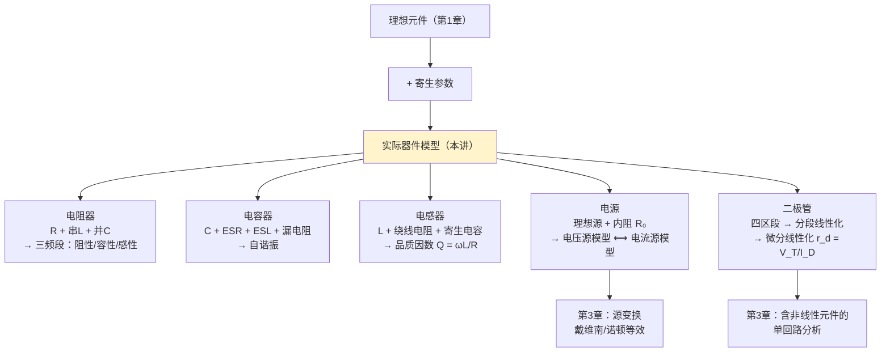

# C2.2 单端口器件的电路模型

> [!abstract] 这一讲的任务
> [[C2.1 元件互连与传输线模型]] 拆掉了"导线是理想的"这条约定。这一讲继续往下拆：**电阻器不只是电阻、电容器不只是电容、电感器不只是电感、电源不是理想源、二极管不是理想开关**。
> 全讲只有**一个固定套路**，五个器件都照着走：
> $$\textbf{实物长什么样}\ \to\ \textbf{需要考虑哪些非理想因素}\ \to\ \textbf{用理想元件搭出集总模型}\ \to\ \textbf{这个模型能解释什么现象}$$
> 这正是 [[C1.3 电路模型]] **分层法**的第二层落地。**理解这个套路，比记住每一张模型图重要得多**——而这一章考试只考概念题。

> [!info] 怎么读这份讲义
> 按五个器件顺读即可，每个都用同一个五段式。带 `> [!question]` 处先自己想再展开。
> 标有 **（拓展）** 或 **【拓展】** 的内容，是**课堂上没有讲到、由课件和教材延伸补充**的部分。

---

## 0. 开场：一个差点要了老师命的电容

课上讲到电解电容时，讲了一段亲身经历：

大三做电子设计，电路搭好了，通电——**电源没反应**。于是他做了一个"很神奇的举动"：**把脸凑近，低头去看那个电容。**

**"忽然间听到嘣的一声，然后我的那个东西就冒烟了。我不知道咋回事，然后我就看到正上方这个天花板破了一个洞。"**

**"我想想，如果我的头再往前移一点，可能今天站在这给你们讲课的就不是欧老师了。"**

> [!question] 停一下，先自己想想
> 一个电容为什么会爆炸？而且——**为什么偏偏是往上喷？**

> [!success]- 想过了再看
> **为什么会炸**：电解电容内部是**液态电解液**，它是储存电场能的容器。如果**极性接反**（长脚必须接正、短脚必须接负），反向电压会导致电解液剧烈电解、气化，内部压力骤增 → **爆炸**。
>
> **为什么往上喷**：这是**厂商刻意设计**的。
> 最早的电解电容外壳**四周都是坚硬的**，一炸就四面八方喷射沸腾的电解液——"相当于一个小型炸弹"。被投诉、赔了一大笔钱之后，厂商改进了设计：**在电容顶部刻一个十字凹槽**，那里金属最薄。
> 这样一旦内压过高，**只会从顶部这个薄弱点定向喷出**，不会四散伤人——"让他往上喷就行了，伤只要伤一个就可以了"。
>
> **实用结论**（课上的原话）：使用这类电容时要非常小心，**尤其不要把头或身体任何部位放在它的正上方**。
> 这个十字凹槽下次你在主机箱里看到电解电容时可以留意一下——**它是一个用赔偿金换来的安全设计。**

好，从这个故事回到正题：**为什么一个电容会有"极性"？为什么它会漏电、会发热？** 答案都在它的**电路模型**里。

---

## 1. 电阻器的电路模型（课件 p.7–8）

### 1.1 实物

课件 p.7 是一整页实际电阻元件的照片。课堂上点名了其中几种，值得认一认：
- **色环电阻**（最常见的那种小圆柱，两端带引线）；
- **功率电阻 / 水泥电阻**（带散热外壳）；
- **保险丝式电阻**；
- **滑动变阻器 / 电位器**——课上特别提到，"你们用过蓝牙音箱吧？有个长长圆圆的可以滑来滑去的旋钮"，实际系统里用的是**微型电位器**：上面有个**小旋钮（button）**，**旋转它就能改变两个引脚之间的电阻**。

### 1.2 需要考虑的因素（课件 p.8）

> [!important] 需要考虑的因素（课件 p.8 原文）
> - **电感效应**
> - **电容效应**

### 1.3 集总参数电路模型

![[C2-电阻器集总电路模型.png]]

**模型结构**（课件 p.8 图）：一个电感 $L$ **串联**，再与"$R$ 与 $C$ 并联"的组合相连。

> [!question] 停一下，先自己想想
> $L$ 和 $C$ 分别是从哪来的？为什么是"$L$ 串联、$C$ 并联"？

> [!success]- 想过了再看
> 沿用 [[C2.1 元件互连与传输线模型]] 的推理：
> - **$L$ 从哪来**：电阻器有**两根引脚**，引脚是导体。交流电流流过时会产生感应电动势 → **寄生电感**。电流必须**依次**流过引脚和电阻体，所以 $L$ 是**串联**的。
> - **$C$ 从哪来**：两根**平行的引脚**之间（以及电阻体内部绕线的匝间）存在电场 → **寄生电容**。它是**跨接在两端**的，所以 $C$ 与 $R$ **并联**。
> - **$R$ 本身**：建模的是电阻器**自身的发热效应**（把电能转成热能）。
>
> 三个元件各自对应一种物理现象，这就是[[C1.3 电路模型]]分层法的标准操作。

### 1.4 实际阻抗随频率的变化：三个频段

![[C2-电阻器实际阻抗随频率变化.png]]

课件 p.8 右上角那张图是本节最重要的一张：横轴频率，纵轴阻抗幅值，被两个频率点 $f_1$、$f_2$ 分成三段，并分别标注**阻性、容性、感性**。

> [!question] 课堂追问：为什么一个电阻的阻抗会随频率变化？根本原因是什么？
> 课上有同学答对了，你先想想。

> [!success]- 答案
> **根本原因是频率的变化，以及三个元件在不同频率下"谁是大王"。**
>
> | 频段 | 主导元件 | 表现 | 图上特征 |
> |---|---|---|---|
> | $f<f_1$ | $R$ | **阻性** | 水平线，就是标称阻值 |
> | $f_1<f<f_2$ | **并联的 $C$** | **容性** | 阻抗**下降**（容抗 $1/\omega C$ 随 $f$ 减小，把 $R$ 旁路掉） |
> | $f>f_2$ | **串联的 $L$** | **感性** | 阻抗**上升**（感抗 $\omega L$ 随 $f$ 增大，串在路上挡住电流） |
>
> 课堂原话：**"在某些频率，我们的电容效应比电感强，整个模型就体现成一个电容；而当频率更高之后，电感就反客为主了，整体就呈现出感性。"**
>
> 这正是 [[C1.1 电路分析的演化]] 开篇那句"**一个电容可以变成一个电感**"的电阻版本——**在高频下，你焊上去的那个"电阻"已经不是你认识的那个电阻了**。课上把它形容为"变异了，像丧尸一样，变得不可理喻"。

> [!important] 一句话结论
> **实际电阻器只在低频段才是电阻。** 中频段呈容性，高频段呈感性。
> 更定量的分析（把阻抗写成复数 $Z=R+\mathrm jX$）要等到第 4 章——课上明确预告过：**"到时候你们会发现电阻会从原来的实数变成一个复数，而它虚数的部分就是由这些电容电感带来的。"** → [[C4.2 元件相量模型与阻抗导纳]]

课件还给了一个工程实例：**动车组常用的 MR-139 型接地电阻**，右下角是它的实测曲线（接地电阻 $|Z|$ 随频率从 $10^1$ 到 $10^7$ Hz 的变化）——低频段平坦在 1 Ω 以下，$10^4$ Hz 以后迅速上升到几十甚至几百欧。**理论曲线和实测完全吻合。**

---

## 2. 电容器的电路模型（课件 p.9–10）

### 2.1 实物

课件 p.9 一整页实际电容元件。课上提到，装台式机时在主机箱里会看到很多**电解电容**（里面有电解液），还有**钽电容**、陶瓷电容、薄膜电容等等。

### 2.2 需要考虑的因素（课件 p.10）

> [!important] 需要考虑的因素（课件 p.10 原文）
> - **漏电损耗**
> - **导线损耗**
> - **导体电感效应**

三条对应三个寄生元件，逐一对应：
- **漏电损耗** → 电容两极板之间的介质不是理想绝缘体，有微弱漏电流 → 用一个**并联电阻 $R_2$** 建模；
- **导线损耗** → 引脚本身有电阻、通电发热 → 用一个**串联电阻 $R_1$** 建模；
- **导体电感效应** → 引脚通交流产生感应电动势 → 用一个**串联电感 $L$** 建模。

### 2.3 薄膜电容器模型

![[C2-薄膜电容器集总电路模型.png]]

**模型结构**（课件 p.10 左图）：$R_1$ 串 $L$，再接"$R_2$ 与 $C$ 并联"的组合。

### 2.4 电解电容器模型

![[C2-电解电容器电路模型.png]]

**模型结构**（课件 p.10 右图）：比薄膜电容更复杂，出现了一个**二极管 D**，以及 $R_1$、$C_1$、$R_3$、$R_2$、$C_2$、ESL；右侧还给出了工程上最常用的**简化形式**：**ESR – C – ESL 串联**。

> [!important] ESR 与 ESL 是电容器数据手册上最重要的两个参数
> - **ESR（Equivalent Series Resistance，等效串联电阻）**：来自引脚与电解液的电阻。它是电容**发热的主要原因**——开关电源里电容鼓包、爆浆，罪魁祸首通常就是 ESR 过大。
> - **ESL（Equivalent Series Inductance，等效串联电感）**：来自引脚与内部结构的寄生电感。它决定了电容的**自谐振频率**：
> $$f_0=\frac{1}{2\pi\sqrt{\mathrm{ESL}\cdot C}}$$
> $f<f_0$ 电容呈**容性**（正常工作），$f>f_0$ 呈**感性**（不再是电容）。
>
> **工程推论（去耦电容的选法）**：大电容（如 100 μF 电解）ESL 大、$f_0$ 低，只能滤低频；小电容（如 0.1 μF 陶瓷）ESL 小、$f_0$ 高，能滤高频。所以电源去耦**必须大小电容并联使用**，各管一段频率。你在任何一块主板上都能看到这种"大电容旁边挤一堆小电容"的布局。

> [!note] 电解电容模型里为什么会有一个二极管 D
> 因为**电解电容是有极性的**——课件图上 D 的存在，正是对"**反向导通/击穿**"这一行为的建模。
> 课上讲的那个细节对上了：这类电容**有长脚和短脚**，**长脚必须接正极、短脚必须接负极**。接反了，那个二极管就会反向导通，电解液剧烈反应，于是——顶部十字凹槽的用武之地到了。
>
> 所以"**为什么电解电容有正负极**"这个问题的答案就写在它的电路模型里：**因为它的模型里有一个二极管。**

---

## 3. 电感器的电路模型（课件 p.11–12）

### 3.1 实物

课件 p.11 展示了六类实际电感元件，名称值得记（考选择题可能会给图认物）：
**贴片型功率电感、贴片型空心线圈、可调式电感、贴片电感、环形线圈、立式功率型电感**。
课上补充：**变压器也可以看作一种电感**。

### 3.2 需要考虑的因素（课件 p.12）

> [!important] 需要考虑的因素（课件 p.12 原文）
> - **导线损耗**
> - **寄生电容效应**

### 3.3 集总参数电路模型

![[C2-电感器集总电路模型.png]]

**模型结构**（课件 p.12 图）：$L$ 与 $R$ **串联**，两者的组合再与一个电容 $C$ **并联**。

来源同样清晰：
- **$R$（串联）**：线圈是导线绕的，**通电发热** → 导线损耗；
- **$C$（并联）**：线圈**匝与匝之间**是两根靠得很近的平行导体，之间存在电场 → **寄生电容**（也叫匝间电容）。

### 3.4 品质因数 Q（课件 p.12 右侧）

> [!important] 品质因数 Quality Factor（课件 p.12 原文）
> **线圈损耗是个重要参数，为了衡量线圈质量，定义线圈的品质因数。Q 越大，表示该线圈的行为越接近理想电感。**
> $$\boxed{Q=\frac{\omega L}{R}}
> $$

> [!important] 课件右下那段话是本页最难懂的一句，必须拆开讲（课件 p.12 原文）
> **"一定频率范围内，随着频率增高，由于趋肤效应导致损耗电阻 $R$ 相应增大，$Q$ 值基本不变；但当频率升高到一定值后，趋肤效应严重，导致 $R$ 迅速增加，$Q$ 值下降。"**
>
> 拆成两个阶段读：
>
> **阶段一（低频到中频）：$Q$ 基本不变。**
> $Q=\omega L/R$ 的分子 $\omega L$ 随频率**线性增大**。同时趋肤效应让分母 $R$ 也增大（$R_{AC}\propto\sqrt f$）。
> 分子涨得快（$\propto f$）、分母涨得慢（$\propto\sqrt f$），比值 $Q\propto\sqrt f$ 缓慢上升——在一段范围内看起来"基本不变"。
>
> **阶段二（高频）：$Q$ 下降。**
> 频率再升高，趋肤效应变得**严重**（趋肤深度已远小于导线半径，有效截面急剧缩小），$R$ **迅速增加**，涨幅超过了分子的线性增长，于是 $Q$ 掉头向下。
>
> **一句话**：$Q$ 是一条**先升后降的曲线**，每个电感都有一个"最佳工作频段"。选电感时要看它在**你的工作频率**上的 $Q$，而不是看标称值。

> [!note] $Q$ 的物理含义：一个更通用的定义（拓展）
> $Q=\omega L/R$ 只是针对电感的写法。更一般的定义是：
> $$Q=2\pi\times\frac{\text{每周期储存的最大能量}}{\text{每周期损耗的能量}}$$
> 这个定义解释了"$Q$ 越大越接近理想"：**理想电感只储能不耗能**，损耗为 0 → $Q\to\infty$。
> 同一个 $Q$ 会在第 4 章以另一副面孔出现——**谐振电路的品质因数**，那里它决定**带宽**：$BW=f_0/Q$。$Q$ 越大，选择性越好、频带越窄。→ [[C4.6 网络函数与谐振]]
> 所以 $Q$ 不是电感专有的参数，它是"**储能与耗能之比**"这个通用概念在不同场合的化身。

---

## 4. 电源的电路模型（课件 p.13–20）

### 4.1 各类实际电源（课件 p.13–19）

课件用七页篇幅逐一介绍，课堂上也逐个点评。这些数值都是**填空题的好素材**：

| 电源 | 类型 | 电动势 | 关键特性（课件原文要点） |
|---|---|---|---|
| **干电池** | 化学 | **1.5 V** | 仅取决于（糊状）化学材料，其大小决定储存的能量；**化学反应不可逆** |
| **钮扣电池** | 化学 | **1.35 V** | 用**固体**化学材料制成；**化学反应不可逆** |
| **燃料电池** | 化学 | **1.23 V** | 以**氢、氧**作燃料；约 **40%~45%** 化学能转为电能；**加燃料可继续工作** |
| **太阳能电池** | 光能 | **0.6 V**（单片） | 太阳光照射 **PN 结**，形成从 N 区流向 P 区的电流；约 **11%** 光能转为电能；常组合成电池板。一个 **50 cm² 电池：0.6 V，0.1 A** |
| **蓄电池** | 化学 | **2 V** | 放电到电解液浓度低于一定值时电动势低于 2 V，需充电；**化学反应可逆** |
| **直流稳压源** | 设备 | 可调 | 实验室常用；红接正、黑接地；内部有多个模块保证输出稳定 |
| **交流发电机组** | 机械→电 | — | 课件 p.18 图 |
| **风力发电** | 机械→电 | — | 课件 p.19 工业现场图 |

> [!note] 课堂上补充的几个点（考试不会考，但值得知道）
> - **水力发电**：课上放了原理视频——水流冲击水轮机，把水的**位能变成机械能**，带动同轴发电机转动，发电机加入励磁后产生电压。水轮机的旋转力矩与电机转子上的电磁阻力矩达到平衡时，以**恒定转速**稳定发电。水电是"**唯一一个既稳定又环保**"的主力来源。
> - **风力发电**：海上风电一根叶片可长达 **86.5 m**（约三十层楼高）。广东湛江外海就有风电场。
> - **核电**：广东的核电站在**大亚湾**。
> - **光伏**：课上提到我国光伏近期已成为第一大能源（并注明消息未经核实）。学院有教授（**蒋怀光老师**）做绿色能源规划与设备，曾计划在图书馆楼顶铺满太阳能板，后因安全原因未获批准。
> - **蓄电池安全**：电动车用的就是蓄电池，**千万不要放到室内充电**。

> [!note] 太阳能电池的 0.6 V 与 PN 结（提前关联下一节）
> 课件明确写了"太阳光照射到 **PN 结**上"——太阳能电池**本质上就是一个大面积的 PN 结**（也就是一个二极管），只不过反过来用：**二极管是通电发光（LED），太阳能电池是受光发电**。
> 这解释了为什么单片电压恰好是 **0.6 V** 量级——它和硅二极管的导通电压 $U_{on}\approx0.7\ \mathrm V$ 是同一个物理量级，都由硅 PN 结的势垒高度决定。

### 4.2 电源的电路模型（课件 p.20）

![[C2-实际电源伏安特性曲线.png]]

> [!important] 需要考虑的因素（课件 p.20 原文）
> - **连接电阻**
> - **转换效率**

课件 p.20 右上角给出了**实际电池的伏安特性曲线**：端电压 $V_{ab}$ 随端电流 $I$ 增大而**缓慢线性下降**，直到接近 $I_{max}$ 时**急剧跌落**。

> [!important] 实际电源的电路模型（课件 p.20 原文）
> **处于正常工作区的化学电池，端口电压随着端电流的增大而缓慢线性减小，此时，可以用理想电压源或者理想电流源与线性电阻的组合建模。**

![[C2-实际电压源与电流源模型.png]]

**两种等价模型**（课件 p.20 下图）：
- **电压源模型**：理想电压源 $u_S$ **串联**内阻 $R_0$，对外接负载 $R_L$；
- **电流源模型**：理想电流源 $i_S$ **并联**内阻 $R_0$，对外接负载 $R_L$。

> [!question] 停一下，先自己想想
> 曲线在大电流处为什么会**急剧跌落**？线性模型为什么还敢用？

> [!success]- 想过了再看
> **跌落的原因**：大电流时电池内部的化学反应速率跟不上（离子扩散有极限），加上内阻随温度上升而变化，端电压迅速塌陷。这一段**不是线性的**。
>
> **为什么还敢用线性模型**：因为课件写了四个字——"**正常工作区**"。
> 这正是 [[C1.3 电路模型]] 说的"**线性模型只能在一定动态范围内精确描述器件**"。我们承认模型在大电流区失效，但只要**保证工作在正常区**，线性模型就够用。
> 这也是为什么所有电源都标注**最大输出电流 $I_{max}$**——那是模型（和器件）的有效边界。

> [!important] 两种模型的等效互换（第 3 章必用）
> $$\boxed{u_S=R_0\,i_S\qquad\Longleftrightarrow\qquad i_S=\frac{u_S}{R_0}}$$
> 内阻 $R_0$ **数值不变**，只是从"串联"换到"并联"。
> 这就是 [[C3.2 电阻网络等效化简]] 第 7 节的**源变换**。注意它的两个限制：
> - **电阻随源搬家，方向必须对应**（电流源箭头指向电压源正极）；
> - **无伴源不能变换**（$R_0=0$ 或 $R_0=\infty$ 时公式发散）。
>
> 并且再次提醒：**等效只对外**——两种模型带同一负载时负载上的量完全相同，但**电源内部的功率账目完全不同**。

---

## 5. 半导体二极管的电路模型（课件 p.21–23）

### 5.1 实物与四个问题

课件 p.21 展示了四类二极管：**小功率二极管、大功率二极管、稳压二极管、发光二极管**，并在页面底部抛出四个问题：

**半导体？二极管？PN 结？ 正偏？反偏？**

课上对**发光二极管（LED）**特别展开了一段：
> **"不要小看发光二极管。现在我们用的所有灯都是发光二极管，或者发光二极管阵列组成的。这个技术是非常厉害的、划时代的变革性技术。"**
> **蓝光二极管拿过诺贝尔奖**（由日本科学家获得）。LED 的发光效率、功耗、发热量是上一代日光灯的"很多很多分之一"，寿命又长得多，属于**革新式器件**。

> [!note] 那四个问题的答案（课上在第 4 节课用视频讲透了，这里先给结论）
> - **半导体**：导电能力介于导体与绝缘体之间的材料，典型是**硅**。纯硅最外层 4 个电子两两形成共价键，结构稳定，**不导电**。
> - **掺杂**：掺入**五价元素（如磷）**→ 多出自由电子（带负电）→ **N 型**；掺入**三价元素（如硼）**→ 形成空穴（带正电）→ **P 型**。
> - **PN 结**：P 型与 N 型接触，N 区自由电子向 P 区扩散填充空穴，交界两侧形成带电的离子层 → **耗尽层（PN 结）**，它自带内建电场，**不导电**。
> - **正偏**：电源负极接 N 区、正极接 P 区。只要电压**大于约 0.7 V**（克服耗尽层的内建电场），自由电子就能穿过 → **导通**。
> - **反偏**：电源反接，正极吸引自由电子离开，**耗尽层增大**，新的电荷无法穿过 → **截止**。
> - **击穿**：反向电压太大时，电子仍然克服了内建电场穿过去 → **击穿**，反向电流突然增大。
>
> → 完整的视频讲解与图示在 [[C2.3 双端口器件的电路模型]] 第 1 节（那里要用同样的机理解释三极管）。

### 5.2 二极管的特性与分段线性化模型（课件 p.22）

![[C2-二极管伏安特性四区段.png]]

> [!important] 二极管的四个区段（课件 p.22 原文，逐条抄录）
> - **$0<u_D<U_{on}$（死区电压）时**，二极管**截止**，二极管电流几乎为零；
> - **$u_D>U_{on}$**，二极管**导通**，且当 $u_D>U_D$（导通电压）后，二极管电压的微小增大都将使电流迅速增大，**伏安特性曲线几乎垂直**；
> - **$U_{BR}<u_D<0$ 时**，二极管处于**截止**状态，**反向电流很小**；
> - **$U_{BR}>u_D$**，二极管被**击穿**，反向电流会突然增大。
>
> **精确描述（肖克利方程）**：
> $$\boxed{i_{\mathrm D}=I_{\mathrm{SS}}\left(e^{\frac{u_{\mathrm D}}{V_{\mathrm T}}}-1\right)}$$

> [!question] 课堂追问：实际二极管的伏安特性，和第 1 章的理想二极管有哪些细微差别？
> 课上让大家逐条找，你也试试。

> [!success]- 答案（课上逐条对出来的四点）
> 对照 [[C1.4 理想电路元件]] 的理想二极管（$u<0\Rightarrow i=0$；$i>0\Rightarrow u=0$，一个直角折线）：
> 1. **区段①：有死区电压 $U_{on}$。** 理想二极管 $u_D>0$ 就导通；实际的必须**先克服 PN 结内建电场**，所以要 $u_D>U_{on}$ 才导通。不同材质的二极管 $U_{on}$ 不同（硅 ≈0.7 V，锗 ≈0.3 V）。
> 2. **区段②：有导通电阻。** 课上问得很妙——"这根线是怎么体现出它有电阻的呢？"**答案：它的斜率不是 90°**（不与纵轴平行），说明导通后电流不是瞬间变大，**电压和电流之间有斜率，就意味着有电阻**。
> 3. **区段③：有反向漏电流。** 关断时"基本没有电流"——课上抓住了"基本"这个词：实际二极管关断时**仍有很小的漏电流（leakage current）**。
> 4. **区段④：会被击穿。** 反向电压超过 $U_{BR}$ 时并非永远不导通，而是**被击穿**，反向电流突然增大。

![[C2-二极管分段线性模型.png]]

> [!important] 分段线性化模型（课件 p.22 右图）
> 两条支路**并联**：
> - **左支路**（正向）：一个理想二极管 + 电压源 $U_{on}$（正向）+ 电阻 $r_{\mathrm D}$ —— 模拟区段①②；
> - **右支路**（反向）：一个理想二极管（反向）+ 电压源 $U_{BR}$ + 电阻 $r_{\mathrm{DR}}$ —— 模拟区段③④。

> [!note] 这张模型图怎么读（课堂上带着推了一遍）
> 设端口电压参考方向为**上正下负**。
> - 加**正**电压时：**左支路的理想二极管导通**（右支路的反向截止）。但要真正导通，正电位必须**大于 $U_{on}$** 才能推动那个电压源——这就模拟了**死区电压**。导通后串联的 $r_D$ 模拟**导通电阻**，即区段②的斜率。
> - 加**反**电压时：左支路截止，**右支路**起作用。同样地，反向电压必须**超过 $U_{BR}$** 才能推动那个电压源导通——这就模拟了**击穿**。击穿后 $r_{DR}$ 就是**击穿后的等效电阻**。
>
> **一句话**：用两条"电压源 + 理想二极管 + 电阻"的支路反向并联，就把一条指数曲线变成了四段直线。
> **好处**：从此**不用再考虑那个指数型的效应**，电路里的二极管变成了纯线性元件（在每个区段内）。

> [!important] 动态电阻 $r_D$ 的公式（课件 p.22 右下）
> $$r_{\mathrm D}\approx\left.\frac{\mathrm du_D}{\mathrm di_D}\right|_{U_D}=\frac{V_{\mathrm T}}{I_{\mathrm{SS}}}e^{\frac{-U_D}{V_{\mathrm T}}}$$
> **其中 $V_T$ 为温度电压当量，常温下为 26 mV。**

> [!note] 更常用的工程形式（课件给了式子但没化简）
> 把肖克利方程求导（正向导通时 $e^{u_D/V_T}\gg1$）：
> $$\frac{\mathrm di_D}{\mathrm du_D}=\frac{I_{SS}}{V_T}e^{u_D/V_T}\approx\frac{i_D}{V_T}\qquad\Longrightarrow\qquad \boxed{r_{\mathrm d}=\frac{V_{\mathrm T}}{I_{\mathrm D}}\approx\frac{26\ \mathrm{mV}}{I_{\mathrm D}}}$$
> **这才是考试和实际设计中真正使用的形式。** 记一个基准值就够：
> $$I_D=1\ \mathrm{mA}\ \Rightarrow\ r_d=26\ \Omega;\qquad I_D=2\ \mathrm{mA}\ \Rightarrow\ r_d=13\ \Omega$$
> 注意 $r_d$ **反比于工作电流**：电流越大，动态电阻越小——这与 [[C1.3 电路模型]] "小信号参数随工作点变化"完全一致。

> [!note] $V_T$ 为什么是 26 mV（拓展）
> $$V_T=\frac{kT}{q}$$
> $k$ 为玻尔兹曼常数（$1.38\times10^{-23}$ J/K），$q$ 为电子电荷（$1.6\times10^{-19}$ C），$T$ 为**绝对温度**。
> 室温 $T=300\ \mathrm K$ 时：$V_T=\frac{1.38\times10^{-23}\times300}{1.6\times10^{-19}}\approx 0.0259\ \mathrm V\approx 26\ \mathrm{mV}$ ✓
> 注意它**正比于绝对温度**——这就是半导体器件参数**随温度漂移**的根源，也是电路设计中要做温度补偿的原因。这个 $V_T$ 会在 [[C2.3 双端口器件的电路模型]] 的 $r_{be}$ 公式里再次出现。

> [!warning] 区段②"$U_D$ 导通电压"这个说法容易混淆
> 课件在区段②里写了两个电压：$U_{on}$（死区电压）和 $U_D$（导通电压）。
> 读法是：$u_D$ 超过 **$U_{on}$** 二极管开始导通；继续升到 **$U_D$** 之后，**曲线几乎垂直**——意味着电压基本被钳在 $U_D$ 附近不再明显上升，电流却急剧增大。
> **这就是"硅二极管压降恒为 0.7 V"这个万能近似的由来**：在正常工作电流范围内，$u_D$ 的变化远小于电路中其他电压，可以当常数处理。这是 [[C1.3 电路模型]]"误差可以容忍"的又一次兑现。

### 5.3 二极管的微分线性化模型（课件 p.23）

![[C2-二极管微分线性模型与工作条件.png]]

> [!important] 工作条件与小信号模型（课件 p.23）
> **工作条件**：直流偏置 $U_D$ 上叠加一个小信号 $u_d$，即输入为 $U_D+u_d$，响应为 $I_D+i_d$。
> **微分线性化模型**：
> - 大信号（直流）看：电压源 $U_D$ 串电阻 $r_d$；
> - **小信号（交流）看：就是一个电阻 $r_d$**，满足
> $$\boxed{u_{\mathrm d}=r_{\mathrm d}\cdot i_{\mathrm d}}$$

> [!important] 大信号模型 vs 小信号模型（对照 [[C1.3 电路模型]]）
> | | **分段线性化（大信号）** | **微分线性化（小信号）** |
> |---|---|---|
> | 处理对象 | 整条伏安曲线（四个区段） | **工作点 $Q$ 附近的一小片** |
> | 结果 | 两条支路并联（$U_{on}+r_D$ / $U_{BR}+r_{DR}$） | **一个电阻 $r_d$** |
> | 需要 $Q$ 点吗 | 不需要 | **必须先求 $Q$ 点** |
> | 典型用途 | 整流、开关、限幅 | 小信号放大、检波 |
>
> 课件 p.23 中间那个方框图（$U_D+u_d$ 的电源 + 二极管 D）画的正是"**直流偏置 + 交流小信号**"这个工作条件——**这是第 6 章所有放大电路的标准起手式**。

---

## 6. 各器件模型速查表

| 器件 | 需要考虑的因素 | 集总模型结构 | 关键结论 |
|---|---|---|---|
| **电阻器** | 电感效应、电容效应 | $L$ 串（$R$ 并 $C$） | 三频段：**阻性 → 容性 → 感性** |
| **电容器（薄膜）** | 漏电损耗、导线损耗、导体电感效应 | $R_1$ 串 $L$ 串（$R_2$ 并 $C$） | **ESR** 决定发热，**ESL** 决定自谐振 $f_0=\frac{1}{2\pi\sqrt{\mathrm{ESL}\cdot C}}$ |
| **电容器（电解）** | 同上 + **极性** | 模型中含**二极管 D** | 长脚接正、短脚接负；**接反会爆炸**，顶部十字凹槽为定向泄压设计 |
| **电感器** | 导线损耗、寄生电容效应 | （$L$ 串 $R$）并 $C$ | $Q=\dfrac{\omega L}{R}$，**先升后降**；$Q$ 越大越接近理想 |
| **电源** | 连接电阻、转换效率 | 理想源 + 内阻 $R_0$ | 两种模型互换 $u_S=R_0i_S$；线性只在**正常工作区**成立 |
| **二极管** | 死区、导通电阻、漏电流、击穿 | 两支路并联（$U_{on}+r_D$ / $U_{BR}+r_{DR}$） | $i_D=I_{SS}(e^{u_D/V_T}-1)$；$r_d=V_T/I_D$，$V_T\approx26\ \mathrm{mV}$ |

**各类电源电动势速查**（填空题素材）：干电池 **1.5 V** / 钮扣电池 **1.35 V** / 燃料电池 **1.23 V**（效率 40%~45%）/ 太阳能电池 **0.6 V**（效率约 11%，50 cm² 时 0.1 A）/ 蓄电池 **2 V**（可逆）。

---

## 这一讲的三句话

1. **五个器件，一个套路**：实物 → 需要考虑的非理想因素 → 用理想元件搭出集总模型 → 解释现象。这是 [[C1.3 电路模型]] 分层法的第二层，**套路比图重要**。
2. **每个寄生元件都对应一个具体的物理现象**：串联 $L$ = 引脚的感应电动势；并联 $C$ = 引脚/匝间的电场；串联 $R$ = 导线发热；并联 $R$ = 介质漏电。**看到模型图，先问每个元件在建模什么。**
3. **实际器件都有"有效频段"和"有效区间"**：电阻器只在低频是电阻，电容器只在 $f<f_0$ 是电容，电感器的 $Q$ 先升后降，电源的线性模型只在正常工作区成立。**超出边界，模型失效。**

**下一讲预告**：单端口器件讲完了，接下来是这一章真正的主角——**双端口器件**：三极管 BJT 和场效应管 FET。
下一讲会从**半导体掺杂**讲起，用两段视频把"为什么一个小电流能控制一个大电流"从头讲透；你还会知道**为什么 CPU 里用的是 MOSFET 而不是结型场效应管**（答案只有一个词：**绝缘层**）。
另外会讲一段芯片产业史——**仙童半导体的"八叛逆"**如何缔造了整个硅谷。→ [[C2.3 双端口器件的电路模型]]

---

## 本节自测 Self-Test

> [!question] Q1：实际电阻器为什么在高频下不再是电阻？三个频段分别由什么主导？

> [!success]- 答案
> 因为它的模型是 **$L$ 串（$R$ 并 $C$）**：$L$ 来自引脚的感应电动势，$C$ 来自引脚间/匝间的电场。
> 三个频段：$f<f_1$ 由 **$R$** 主导，呈**阻性**（水平段）；$f_1<f<f_2$ 由**并联 $C$** 主导，呈**容性**（阻抗下降）；$f>f_2$ 由**串联 $L$** 主导，呈**感性**（阻抗上升）。
> 根本原因是**频率变化导致三个元件的主导地位轮换**。

> [!question] Q2：ESR 和 ESL 分别是什么？各自导致什么工程问题？

> [!success]- 答案
> **ESR（等效串联电阻）**：来自引脚与电解液的电阻，是电容**发热**的主要原因；ESR 过大会导致电容鼓包、爆浆（开关电源常见故障）。
> **ESL（等效串联电感）**：来自引脚与内部结构的寄生电感，决定**自谐振频率** $f_0=\frac{1}{2\pi\sqrt{\mathrm{ESL}\cdot C}}$；$f>f_0$ 后电容呈感性，失去滤波能力。

> [!question] Q3：电源去耦为什么要大电容并联小电容？

> [!success]- 答案
> 因为自谐振频率 $f_0=\frac{1}{2\pi\sqrt{\mathrm{ESL}\cdot C}}$ 与 $C$ 和 ESL 有关：
> 大电容（如 100 μF 电解）容量大但 ESL 也大，$f_0$ 低，**只能滤低频**；
> 小电容（如 0.1 μF 陶瓷）ESL 小，$f_0$ 高，**能滤高频**。
> 两者并联，各管一段频率，才能覆盖宽频段。这就是主板上"大电容旁挤一堆小电容"的原因。

> [!question] Q4：品质因数 $Q$ 的定义式是什么？为什么它随频率先基本不变、后下降？

> [!success]- 答案
> $Q=\dfrac{\omega L}{R}$（$Q$ 越大越接近理想电感）。
> **中低频**：分子 $\omega L\propto f$ 线性增长，分母 $R$ 因趋肤效应按 $\sqrt f$ 增长，分子涨得快，$Q$ 缓慢上升，看起来"基本不变"。
> **高频**：趋肤效应严重（趋肤深度远小于导线半径），$R$ **迅速增加**，超过分子增长，$Q$ **下降**。
> 更通用的定义：$Q=2\pi\times$（每周期储能 / 每周期耗能）。

> [!question] Q5：实际电压源与实际电流源怎么等效互换？有什么限制？

> [!success]- 答案
> $u_S=R_0i_S$，内阻 $R_0$ 数值不变，只是从串联换成并联。
> 限制：① **方向必须对应**（电流源箭头指向电压源正极）；② **无伴源不能变换**（$R_0=0$ 或 $\infty$ 时公式发散）；③ **等效只对外**——负载侧完全相同，但电源内部功率账目完全不同。
> → [[C3.2 电阻网络等效化简]]

> [!question] Q6：电池伏安特性曲线在大电流处急剧跌落是为什么？线性模型为什么还能用？

> [!success]- 答案
> 大电流时化学反应速率跟不上（离子扩散有极限），加上内阻随温度变化，端电压迅速塌陷，**这一段不是线性的**。
> 线性模型仍可用，是因为课件限定了"**处于正常工作区**"——这正是 [[C1.3 电路模型]] 说的"线性模型只能在一定动态范围内精确描述器件"。所有电源都标注 $I_{max}$，那就是模型的有效边界。

> [!question] Q7：写出肖克利方程，说明 $V_T$ 的值与物理来源。

> [!success]- 答案
> $$i_D=I_{SS}\left(e^{u_D/V_T}-1\right)$$
> $V_T$ 为**温度电压当量**，$V_T=kT/q$（$k$ 玻尔兹曼常数，$q$ 电子电荷，$T$ 绝对温度）。
> 室温 300 K 时 $V_T\approx26\ \mathrm{mV}$。它**正比于绝对温度**，是半导体器件参数随温度漂移的根源。

> [!question] Q8：二极管小信号动态电阻的工程公式是什么？$I_D=2\ \mathrm{mA}$ 时是多少？

> [!success]- 答案
> $$r_d=\frac{V_T}{I_D}\approx\frac{26\ \mathrm{mV}}{I_D}$$
> $I_D=2\ \mathrm{mA}$ → $r_d=26/2=13\ \Omega$。
> 注意 $r_d$ **反比于工作电流**，体现了"小信号参数随工作点变化"。

> [!question] Q9：为什么"硅二极管压降恒为 0.7 V"是个好近似？

> [!success]- 答案
> 因为在区段② 中，$u_D$ 超过 $U_D$ 后伏安特性曲线**几乎垂直**：电流可以变化几个数量级，而电压只变化零点几伏。
> 在整个正常工作电流范围内，$u_D$ 的变化远小于电路中其他电压，把它当常数带来的误差可以忽略——这是[[C1.3 电路模型]]"误差可以容忍"的典型兑现。

> [!question] Q10：实际二极管与理想二极管有哪四点差别？

> [!success]- 答案
> ① **死区电压 $U_{on}$**：正向要超过它才导通（需克服 PN 结内建电场，硅 ≈0.7 V）；
> ② **导通电阻 $r_D$**：导通段斜率不是 90°，说明有电阻；
> ③ **反向漏电流**：截止时并非完全无电流，有微小漏电流；
> ④ **反向击穿 $U_{BR}$**：反向电压过大时被击穿，反向电流突然增大。

> [!question] Q11：电解电容的模型里为什么有一个二极管？这和"它有正负极"有什么关系？

> [!success]- 答案
> 那个二极管建模的正是电解电容的**极性/反向行为**。
> 因为模型中存在二极管，所以器件本身**有方向**：**长脚接正、短脚接负**。接反了，二极管反向导通，电解液剧烈反应、气化，内压骤增导致**爆炸**。
> 厂商在顶部刻十字凹槽，就是为了让它**定向往上泄压**而不是四散喷射。

> [!question] Q12：太阳能电池单片电压 0.6 V 与二极管有什么关系？

> [!success]- 答案
> 太阳能电池**本质上就是一个大面积的 PN 结**（课件原文："太阳光照射到 PN 结上，形成一个从 N 区流向 P 区的电流"）。
> 它与硅二极管是同一种结构的两种用法：二极管**通电发光**（LED），太阳能电池**受光发电**。
> 单片 0.6 V 与硅二极管导通电压 ≈0.7 V 同一量级，都由硅 PN 结的势垒高度决定。

---

**上一节 ←** [[C2.1 元件互连与传输线模型]]
**下一节 →** [[C2.3 双端口器件的电路模型]]
**课程索引 →** [[电路基础 MOC]]
