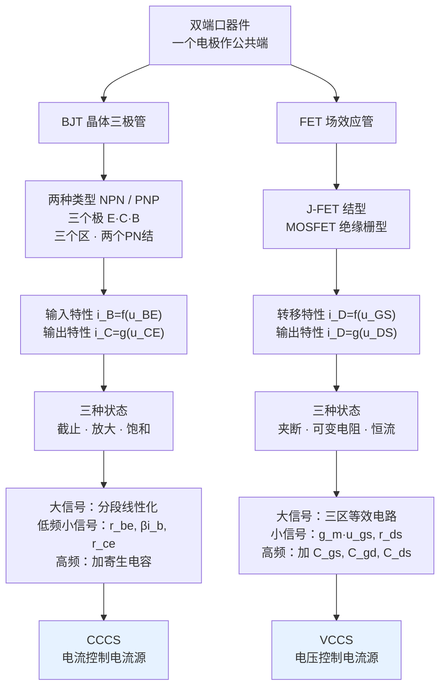

# C2.3 双端口器件的电路模型

> [!abstract] 这一讲的任务
> 这是第 2 章的主角，也是**整个下半学期的主角**：**晶体三极管 BJT** 和 **场效应管 FET**。
> 它们的共同身份，[[C1.4 理想电路元件]] 已经预告过——**受控源**。BJT 是 **CCCS**（电流控制电流源），FET 是 **VCCS**（电压控制电流源）。这一讲要回答的是：**这个"受控"的能力，物理上是从哪来的？**
> 三件事贯穿全讲：**两种类型、三个极、三个区、两个 PN 结**（BJT），**三种工作状态**（FET），以及**为什么 CPU 里用的是 MOSFET 而不是 JFET**。
> 再次提醒考试口径：**本章没有作业，只考选择题和填空题（概念题）**，具体计算留到下册。

> [!info] 怎么读这份讲义
> BJT 与 FET 结构完全平行，建议**对照着读**（第 3 节有完整对照表）。
> 带 `> [!question]` 处先自己想再展开。标有 **（拓展）** 或 **【拓展】** 的内容，是**课堂上没有讲到、由课件和教材延伸补充**的部分。

---

## 0. 开场：八个年轻人和一个叫"硅谷"的地方（拓展）

> [!note] 授课进度说明
> 这一节是课堂上放的一段芯片产业史视频的整理。它不在课件里、也不是考点，**整节属于拓展**——但它能让你明白"你正在学的这个器件，撑起了怎样一个产业"。赶时间可以直接跳到第 1 节。

**【拓展】故事从 1957 年开始。**

八个年轻人集体从肖克利的实验室辞职。愤怒的肖克利痛斥他们是"**八叛逆**"。这八个人拿到一笔 150 万美元的投资，创立了 **仙童半导体（Fairchild Semiconductor）**——**几乎所有美国半导体公司的源头**。

1958 年，仙童在与德州仪器的竞争中胜出，拿下 IBM 订单。同年，赫尔尼把**台面工艺改进为平面工艺**——这是晶体管制造的一次巨大进步，**体积剖面变小**，使硅晶体管的**批量生产**成为可能。三年时间，仙童收入超过 2000 万美元。

然后母公司强制收购了八人的全部股份。**于是八人开始了新的叛逆之路**：

| 年份 | 人物 | 创立的公司 |
|---|---|---|
| 1961 | 赫尔尼、罗伯茨、布拉斯特 | 阿内克尔（后来的**泰瑞达**） |
| 1962 | 克莱纳 | 艾迪克斯 |
| **1968** | **诺伊斯、摩尔（+ 格鲁夫）** | **英特尔 Intel** |
| — | 仙童总经理查尔斯 | **美国国家半导体 NSC** |
| — | 销售部主任杰里 | **AMD** |

**"仙童虽然早已不在江湖，但江湖仍有仙童蒲公英的传说"**——硅谷半数以上的芯片企业都与它有千丝万缕的联系。

后面的故事同样值得一读：
- **英特尔**：1971 年推出 **4004**，人类第一款 CPU；1993 年微处理器市占率超 **85%**；
- **日本的崛起与陨落**：1976–1979 年日本组建 VLSI 联合研发体（日立、三菱、东芝、日本电气等五大公司，投资 720 亿日元），策略极其简单有效——**定价永远比对手低 10%**。到 1986 年，日本 DRAM 市占率接近 **80%**。但随后遭遇美国打压（广场协议等）与金融泡沫破裂，**"消失的三十年"**开始；
- **韩国的接棒**：三星起步晚 4 年，靠**反周期定律**（价格低迷时扩张产能，挤垮对手，再靠垄断抬价）后来居上，1998 年韩国取代日本成为全球存储芯片第一大国，2017 年三星反超英特尔成为全球半导体第一；
- **台积电**：张忠谋看到**设计与制造分离**的趋势，首创**代工（foundry）模式**——因为 IDM 模式（设计、制造、封测一体）"**资金密集、知识密集、场地密集**"，门槛过高。第一笔订单来自高通。1998 年以 0.18 μm 制程追平德州仪器、摩托罗拉，从低端代工走向高端；2009 年 28 nm 奠定霸主地位。
- **中国大陆**：张汝京创建**中芯国际**（上海），课上评价它是"**目前唯一能拿得出手的芯片加工制造商**"，是上海花了二三十年、不求回报投入培养起来的。

课上的总结值得记下来：
> **"芯片还是人类历史上一个最大规模、涉及领域最广的综合性工程。"**
> **"我们和世界头部的一些技术还有一定差距，必须承认；但我相信我们国家还是能克服万难。"**

**为什么在电路课上讲这个**：因为你跑的每一个 token，底层都是各种各样的计算芯片在支撑。而 AI 反过来也在帮 IC 设计做多目标优化、自动布局布线。**AI 与 IC，现在是互相驱动的关系。**

---

## 1. 晶体三极管 BJT（课件 p.24–33）

### 1.1 基本认识（课件 p.25）

![[C2-BJT共射接法与输入输出特性.png]]

> [!important] 课件用一行中文总结（务必记住）（课件 p.25 原文）
> **双极型结型晶体三极管（Bipolar Junction Transistor, BJT）** 简称晶体管，是**最重要、最基本**的半导体器件，对外有**三个电极（发射极 E、集电极 C、基极 B）**，其**放大**作用和**开关**作用是电子技术的根本。
> 按照结构不同，BJT 分为 **NPN 型**和 **PNP 型**两类。
>
> **课件红字口诀**：**两种类型、三个极、三个区、两个 PN 结**

> [!note] "双极型"三个字的含义
> **Bipolar = 双极**，指的是**两种载流子**（电子和空穴）**都参与导电**。
> 与之相对的是 FET——它只有一种载流子参与导电，所以叫**单极型**器件。
> 这个区别不是文字游戏：正因为 BJT 有两种载流子参与，它的**跨导更大、增益更高**；也正因如此，它的**输入端要吃电流**（见 2.5 节 MOSFET 胜出的原因）。

> [!note] 三个电极的命名逻辑
> 课堂上顺着视频讲清了三个极的物理角色：
> - **发射极 E（Emitter）**：**发射**载流子的一端（NPN 中是高浓度 N 型掺杂，自由电子多）；
> - **基极 B（Base）**：**中间极薄**的一层，控制端（NPN 中是 P 型掺杂）；
> - **集电极 C（Collector）**：**收集**载流子的一端（NPN 中是普通浓度 N 型掺杂）。
>
> 名字直接说明了功能：**发射 → 控制 → 收集**。

**符号的区别**（课件 p.25 图）：NPN 与 PNP 的符号差别只在**箭头方向**。

> [!question] 课堂追问：这两个符号有什么不同？箭头代表什么？

> [!success]- 答案
> **箭头画在发射极上，指的是发射极电流的方向**。
> - **NPN**：箭头**向外指**（从管子指出去）→ 工作时需要**正**的供电电压；
> - **PNP**：箭头**向内指** → 工作时需要**负**的供电电压。
>
> 掺杂类型不同，载流子在结中流动的方向就相反，所以**两者的工作电压极性相反、输出电流方向也相反**。
> 图中那条竖线代表**管子的结/体（junction/body）**，三条引出线是**三个电极**。

### 1.2 放大的物理机理（课堂视频整理）

课上放了一段视频，把"为什么小电流能控制大电流"讲透了。这段机理是理解 BJT 的关键，整理如下：

**第一步：掺杂**
纯硅最外层 4 个电子两两形成共价键，结构稳定**不导电**。
- 掺入**五价元素（磷）**：多出 1 个**自由电子**（带负电）→ **N 型**；
- 掺入**三价元素（硼）**：形成 1 个**空穴**（带正电）→ **P 型**。

**第二步：PN 结**
P 型与 N 型接触，N 区的自由电子向 P 区扩散填充空穴，交界两侧留下带电的离子层 → **耗尽层（PN 结）**，**不导电**。
- **正偏**（负极接 N、正极接 P）：电压 **> 0.7 V** 即可克服耗尽层，自由电子穿过 → **导通**；
- **反偏**：耗尽层增大，电荷无法穿过 → **截止**。

**第三步：三层结构**
- **左边较小的区域**：**高浓度** N 型掺杂 → 发射极 E；
- **中间极小的区域**：P 型掺杂 → 基极 B；
- **右边较宽的区域**：**普通浓度** N 型掺杂 → 集电极 C。
- PN 相连处形成**两个耗尽层**。

**第四步：放大的发生**
1. 给 B–E 之间通电（正偏），P 区每被吸引出一个电子，就出现一个**空穴**等着被填充；
2. 给 C–E 之间通电（C 接正极），会吸引电子离开、**耗尽层增大**；
3. 左侧 N 区因为是**高浓度掺杂**、且接了两个电源负极，**含有大量自由电子**；
4. 于是，B 极电源每吸引走一个电子形成一个空穴，左侧就会**涌入大量电子抢占这个空穴**——但**只有一个**能进去；
5. **多出来的电子挤在这一块区域**。右侧是普通浓度掺杂，耗尽层富集区**同性相斥的力远低于这些电子向右的力**；
6. 于是这些多出来的电子**产生漂移运动，突破耗尽层进入右侧 N 区**，被集电极电源正极吸引走。

> [!question] 停一下，先自己想想
> 上面第 4–6 步里，"**填一个空穴，就有 $\beta$ 个电子往右走**"——**这个 $\beta$ 的根本来源是什么？**
> 提示：课堂上说这是"一个非常细微、一闪而过的关键词"。

> [!success]- 想过了再看
> **掺杂浓度的差异。**
>
> 发射区是**高浓度** N 型掺杂，集电区是**普通浓度** N 型掺杂。**掺杂浓度的巨大差距，导致发射区可移动的自由电子数量是另一边的约 $\beta$ 倍。**
> 所以：基极每制造出 1 个空穴，就有约 $\beta$ 个电子涌过来抢；**只有 1 个进入空穴（成为 $i_B$），剩下的 $\beta$ 个全部漂移到集电极（成为 $i_C$）**。
>
> 这就是 $\boxed{i_C=\beta i_B}$ 的物理根源，也是"**放大**"二字的全部含义：
> - 加大 $u_{BE}$ → 吸引更多电子形成更多空穴 → 更多电子漂移过去 → $i_C$ 按 $\beta$ 倍放大。
>
> 最后，由**广义 KCL**（[[C1.5 电路分析的基本定律]]）把三个电极包起来：
> $$\boxed{i_{\mathrm E}=i_{\mathrm B}+i_{\mathrm C}=(1+\beta)i_{\mathrm B}}$$
>
> **注意这解释了一个常见疑问**：为什么 E、C 两极不能互换？因为**两者掺杂浓度完全不同**（一个高浓度、一个普通浓度）——结构本身就不对称，反接会失去放大能力。

### 1.3 为什么把三极管看作双端口器件（课件 p.26）

> [!important] 共公端接法（课件 p.26 原文）
> 在构成实际应用电路时，常将晶体管的**一个电极作公共端（共 E、共 C 或共 B）**，扩展为**二端口器件**（输入端口和输出端口）。
> 晶体管外特性可以利用其**输入特性**
> $$i_{\mathrm B}=f(u_{\mathrm{BE}})\Big|_{u_{\mathrm{CE}}=\text{Const}}$$
> 和**输出特性**
> $$i_{\mathrm C}=g(u_{\mathrm{CE}})\Big|_{i_{\mathrm B}=\text{Const}}$$
> 表述。

> [!question] 停一下：二端口网络有 4 个端子，晶体管只有 3 个电极，少一个怎么办？

> [!success]- 答案
> **共用一个。**
> 以**共射（共 E）接法**为例：输入端口是 B–E，输出端口是 C–E，**E 被两个端口共用**——输入端的负极和输出端的负极都接在 E 上。
> 这种连接方式就叫**共公端接法（common port connection）**。三种选择：**共 E、共 C、共 B**，其中**共射最常用**。

**两条特性曲线**（课件 p.26 右侧）：

| | **输入特性** $i_B$–$u_{BE}$ | **输出特性** $i_C$–$u_{CE}$ |
|---|---|---|
| 长相 | **像二极管的伏安特性**：到一定电压才导通 | **一族近乎水平的曲线**（像一把梳子） |
| 参变量 | $u_{CE}$ 固定（图中标 $u_{CE}>1\ \mathrm V$） | **$i_B$ 固定**（图中标 0、20、40、60、80 μA） |
| 关键点 | $U_{BE}$ 即导通电压 | 每条曲线对应一个特定的输入电流 |

> [!important] 输出特性曲线是本节最重要的一张图，三个区要能一眼认出
> 课件 p.26 右图已经标注了三个区域：
> - **饱和区**：最左侧那条陡峭上升的窄带（$u_{CE}$ 很小时）；
> - **放大区**：中间那一大片近乎水平的区域（曲线间距均匀，由 $i_B$ 决定高度）；
> - **截止区**：最下方贴近横轴那条（$i_B=0$）。
>
> 课堂上点破了这一族曲线的含义：**每一条线都对应一个特定的输入电流 $i_B$**。因为 BJT 是**受控源**——**它的输出能力完全由输入决定**。

> [!note] 输出特性在放大区为什么略微上翘（拓展）
> 理想情况下放大区应该是完全水平的（$i_C$ 只由 $i_B$ 决定，与 $u_{CE}$ 无关）。但实际有轻微上翘，原因是 **基区宽度调制效应（Early 效应）**：$u_{CE}$ 增大 → 集电结耗尽层变宽 → 有效基区变窄 → 载流子复合减少 → $\beta$ 略增 → $i_C$ 略增。
> 这个斜率的倒数就是小信号模型里的 **$r_{ce}$**（输出电阻），一般为几十至几百 kΩ。**上翘越平，$r_{ce}$ 越大，器件越接近理想电流源。**

### 1.4 三种工作状态（课件 p.27 表格原样抄录）

> [!important] 晶体管的主要工作状态有放大、截止和饱和三种，**由外部偏置决定**（课件 p.27）
>
> | 工作状态 | NPN-BJT 偏置条件 | 特点 |
> |---|---|---|
> | **截止** | $u_{\mathrm{BE}}<U_{\mathrm{on}}$ 且 $u_{\mathrm{CE}}>u_{\mathrm{BE}}$ （发射结电压小于死区电压且集电结反偏） | $i_{\mathrm B}=0$，$i_{\mathrm C}\approx0$（$i_{\mathrm C}\le I_{\mathrm{CEO}}$） |
> | **放大** | $u_{\mathrm{BE}}>U_{\mathrm{on}}$ 且 $u_{\mathrm{CE}}>u_{\mathrm{BE}}$ （发射结**正向**偏置且集电结**反向**偏置） | $i_{\mathrm C}=\beta i_{\mathrm B}$（$i_{\mathrm C}$ 基本由 $I_{\mathrm B}$ 决定） |
> | **饱和** | $u_{\mathrm{BE}}>U_{\mathrm{on}}$ 且 $u_{\mathrm{CE}}<u_{\mathrm{BE}}$ （发射结和集电结**均正向**偏置） | $i_{\mathrm C}\ne\beta i_{\mathrm B}$（$i_{\mathrm C}$ 随 $u_{\mathrm{CE}}$ 的增大而增大） |
> | **临界饱和** | $u_{\mathrm{CE}}=u_{\mathrm{BE}}$ 即 $u_{\mathrm{CB}}=0$ | $i_{\mathrm{CS}}=\beta i_{\mathrm{BS}}$ |

> [!note] 这张表怎么记：只看两个结的偏置
> 不必死背偏置条件，**看两个 PN 结的状态**就行：
>
> | 状态 | 发射结 | 集电结 | 直觉 |
> |---|---|---|---|
> | **截止** | 反偏（或未导通） | 反偏 | **两个门都关着** → 没电流 |
> | **放大** | **正偏** | **反偏** | **前门开、后门关** → 载流子被"抽"过去，可控 |
> | **饱和** | **正偏** | **正偏** | **两个门都开着** → 已经通到底，控制不动了 |
>
> **放大区之所以能放大，正是因为"一正一反"这个不对称的偏置**：发射结正偏负责"发射"载流子，集电结反偏负责"收集"（反偏的强电场把载流子抽过去）。

> [!important] 饱和状态的直观理解（课堂讲法）
> 课上给了一个特别好懂的说法：
> $u_{BE}>u_{CE}$ 意味着**输入电压比输出电压还大**。
> **那它还有放大的功效吗？没有了。** 放大意味着输出比输入大，现在输出电压都没比输入电压大了，**它就相当于失去了放大能力，进入了饱和**。
> 此时**输出电流达到了它的天花板**，不能再大了，$i_C$ 与 $i_B$ 的线性关系被破坏。
>
> **临界饱和**（$u_{CE}=u_{BE}$，即 $u_{CB}=0$）课上说明它"**只存在于数学中，方便我们做一些分析**"；考试中的计算题**一定是截止或饱和之一，不会停在临界点上**。

> [!important] 两种用法对应两个区
> - **放大**（模拟电路）：工作在**放大区**，$i_C=\beta i_B$ 线性成立；
> - **开关**（数字电路）：在**截止区**（断开）与**饱和区**（闭合）之间切换，**绝不停留在放大区**——因为放大区 $u_{CE}$ 和 $i_C$ 都不小，功耗 $p=u_{CE}i_C$ 最大，会严重发热。
>
> 这就是数字电路追求"快速翻转"的原因：**过渡区停留时间越短，功耗越低**。

> [!warning] $I_{CEO}$ 是什么
> 截止区表格里写的是 $i_C\approx 0$（$i_C\le I_{CEO}$），不是严格为零。
> **$I_{CEO}$ 是穿透电流**：基极开路时从 C 流到 E 的漏电流，由少数载流子引起。它**随温度急剧上升**（大约每升高 10 °C 翻一倍），是三极管**温度稳定性问题的主要来源之一**。

### 1.5 大信号模型：分段线性化（课件 p.28–29）

![[C2-BJT大信号分段线性化模型.png]]

> [!important] 大信号模型（课件 p.29）
> 对输入、输出两条特性曲线分别做**分段线性化**（图中黑色细线是真实曲线，红色粗线是分段直线逼近），得到等效电路：
> - **输入回路**：$r_{BE}$ 串联一个理想二极管 $D_1$ 与电压源 $U_{BE}$ —— 模拟"到 $U_{BE}$ 才导通"的门槛；
> - **输出回路**：理想二极管 $D_2$ 与电压源 $U_{CES}$（模拟饱和压降）、受控电流源 $\bar\beta i_B$、输出电阻 $r_{CE}$ 并联。

> [!important] 这里正式出现了 [[C1.4 理想电路元件]] 的受控源
> 模型中央那个菱形 **$\bar\beta i_B$**，就是一个 **CCCS（电流控制电流源）**：
> - 输出是**电流**（菱形符号中线不穿过）；
> - 控制量是**输入电流 $i_B$**；
> - 系数 $\bar\beta$ 无量纲，是**电流放大倍数**。
>
> **至此，第 1 章那个看起来很抽象的"受控源"落地了**：它就是三极管。
> 课上说过"所有的受控源模型都来自于实际器件的建模"——这就是最重要的一个例证。

> [!note] 两个常用工程数值
> - **$U_{BE}$（硅管发射结导通电压）≈ 0.7 V**
> - **$U_{CES}$（饱和压降）≈ 0.3 V**
>
> 这两个数在第 6 章的每一道题里都会用到，值得现在就记住。

### 1.6 低频小信号模型：微分线性化（课件 p.30–32）

> [!important] 建模条件（课件 p.30 原文）
> **晶体管是非线性器件，当输入信号幅度很小，变化很慢（频率很低）时，通过微分近似，可以对工作在小信号放大状态的晶体管进行建模。**
> **在其静态工作点（静态偏置）的一个邻域内，对晶体管的输入输出特性曲线进行级数展开，忽略二次以上高次项**，可得：
> $$\begin{cases} u_{\mathrm{be}}=r_{\mathrm{be}}\,i_{\mathrm b}+\mu\,u_{\mathrm{ce}}\\[1mm] i_{\mathrm c}=\beta\,i_{\mathrm b}+\dfrac{1}{r_{\mathrm{ce}}}u_{\mathrm{ce}}\end{cases}$$
> 其中：
> - **$r_{be}$** 是输入端口 b–e 之间特性曲线**在工作点处的斜率**；
> - **$\mu$** 是**内部反馈系数**（通常很小）；
> - **$\beta$** 是**电流放大系数**；
> - **$r_{ce}$** 是输出端口 c–e 之间特性曲线**在工作点处的斜率**。

![[C2-BJT低频小信号模型电路.png]]

> [!important] "看方程的形式就知道电路怎么画"——这是本节最漂亮的一处（课件 p.31 原文）
> **第一式是输入特性曲线的微分形式，具有 KVL 方程形式，等效为一个串联回路；**
> **第二式是输出特性曲线的微分形式，具有 KCL 方程形式，等效为两个并联支路。**
> **于是可得晶体三极管的小信号放大模型如图所示。**
>
> 拆开来读：
> - $u_{be}=r_{be}i_b+\mu u_{ce}$ —— 左边一个电压 = 右边两个电压之和，**这是 KVL** → 画成**串联回路**：$r_{be}$ 串一个受控电压源 $\mu u_{ce}$；
> - $i_c=\beta i_b+\frac{1}{r_{ce}}u_{ce}$ —— 左边一个电流 = 右边两个电流之和，**这是 KCL** → 画成**并联支路**：受控电流源 $\beta i_b$ 并上电阻 $r_{ce}$。
>
> **这个"由方程形式反推电路结构"的技巧，是电路建模最优雅的一招。** FET 的小信号模型（第 2.6 节）用的是完全同一招。

> [!important] $r_{be}$ 的计算公式（课件 p.31）
> $$\boxed{r_{\mathrm{be}}=r_{\mathrm{bb}'}+r_{\mathrm{b'e}}=r_{\mathrm{bb}'}+\frac{V_{\mathrm T}}{I_{\mathrm{BQ}}}}$$
> - **$r_{bb'}$**：基区体电阻；
> - **$V_T$**：温度电压当量（= 26 mV，见 [[C2.2 单端口器件的电路模型]]）；
> - **$I_{BQ}$**：晶体管**静态工作点**的基极电流。

> [!note] 课堂上关于这个公式的重要提示
> 课堂上对这个公式给过一个非常明确的口径，值得逐字记住：
>
> **"这个公式如果考试考的时候会给到大家。"**
> **"You don't have to memorize all the equations in this book, I can guarantee you. But you should know how to use this equation to solve your problem."**
> **"我给你这个公式，但是你要知道怎么用它，也就是说你要掌握整个分析流程。"**
>
> 具体来说：**你必须知道要先求出 $I_{BQ}$ 才能用这个公式**，而求 $I_{BQ}$ 有一套固定流程（第 6 章的"静态分析"）。这正是 [[C1.3 电路模型]] 强调的"**小信号模型必须先求静态工作点**"。

> [!note] 更常用的形式（第 6 章天天用）（拓展）
> 工程上更常写成用发射极静态电流表示：
> $$r_{\mathrm{be}}\approx r_{\mathrm{bb}'}+(1+\beta)\frac{V_{\mathrm T}}{I_{\mathrm{EQ}}}$$
> （因为 $I_{EQ}=(1+\beta)I_{BQ}$。）典型值 $r_{bb'}\approx100\text{–}300\ \Omega$。
> **例**：$\beta=100$，$I_{EQ}=2\ \mathrm{mA}$，$r_{bb'}=200\ \Omega$：
> $$r_{be}=200+101\times\frac{26\ \mathrm{mV}}{2\ \mathrm{mA}}=200+101\times13=200+1313=1513\ \Omega\approx1.5\ \mathrm{k\Omega}$$

![[C2-BJT小信号模型简化形式.png]]

> [!note] 简化模型（课件 p.32 右下角）
> 实际使用时，由于 $\mu$ 很小、$r_{ce}$ 很大，常常把这两项略去，得到**只有三个元件**的简化模型：
> **$r_{be}$（输入电阻）+ 受控电流源 $\beta i_b$ + $r_{ce}$（输出电阻）**。
> 课上原话："**可以简化成三个元件**"。这是第 6 章分析放大电路时最常用的形式。

### 1.7 高频小信号模型（课件 p.33）

![[C2-BJT高频小信号模型.png]]

> [!important] 高频模型（课件 p.33 原文）
> **随着工作频率的提高，晶体管的寄生电容效应越来越明显，在电路模型建立时必须将内部寄生电容考虑在内**，根据晶体管物理结构特征，可得晶体管高频小信号放大模型。
> $$C_{\mathrm{b'e}}\approx\frac{\beta}{2\pi r_{\mathrm{b'e}}f_{\mathrm T}}\qquad f_{\mathrm T}:\ \textbf{晶体管特征频率}$$

**模型结构**：在低频模型的基础上，加入两个电容：
- **$C_{b'e}$**：基极–发射极之间（并在 $r_{b'e}$ 上）；
- **$C_{b'c}$**：基极–集电极之间（跨接在输入输出之间）。

课上把这件事讲得很轻松：**"非常简单，因为三个极之间两两会形成一个电容，所以我们只要在不同的极之间加一个电容就 OK 了。"**

> [!note] $f_T$ 是什么，为什么重要（拓展）
> **特征频率 $f_T$**：电流放大倍数 $\beta$ 下降到 **1** 时的频率——超过它，三极管**彻底失去电流放大能力**。
> 它是晶体管**最重要的高频指标**：普通小信号管 $f_T\approx100\ \mathrm{MHz}$，射频管可达几十 GHz。
>
> 另外，$C_{b'c}$ 这个**跨接在输入与输出之间**的电容特别讨厌：由于**密勒效应（Miller effect）**，它在输入端的等效值会被放大 $(1+|A_v|)$ 倍：
> $$C_{\text{等效}}=(1+|A_v|)C_{b'c}$$
> 增益越大，等效输入电容越大，**高频响应越差**。这是"**增益 × 带宽 ≈ 常数**"这条铁律的物理来源之一。

---

## 2. 场效应管 FET（课件 p.34–40）

### 2.1 基本认识（课件 p.34）

![[C2-场效应管符号汇总.png]]

> [!important] 定义与分类（课件 p.34 原文）
> **场效应管（FET）是利用输入回路的电场效应来控制输出回路电流的一种半导体器件**，其对外也有三个端子，分别是**栅极（Gate）、源极（Source）和漏极（Drain）**。
> - 按**结构**不同分为：**结型场效应管（J-FET）** 和 **绝缘栅型场效应管（MOSFET）** 两大类；
> - 按**导电载流子（沟道）类型**分为：**N 沟道**和 **P 沟道**；
> - 绝缘栅型中根据**导电沟道的形成条件**又有：**增强型**和**耗尽型**。

"**场效应**"这个名字直接说明了原理：**用电压（电场）来控制通断**，而不是用电流。

### 2.2 结型场效应管 J-FET（课堂视频整理）

课上放了视频讲 JFET 的工作原理，整理如下：

**结构**：中间一大块 **N 型半导体**，上面引出**漏极 D**，下面引出**源极 S**；N 型半导体两边是 **P 型半导体**，构成**栅极 G**（两个栅极连在一起）。

**控制方法**：
- 给栅极 **0 V**：**沟道打开** → 导通（N 型半导体里有很多自由电子，给 D–S 施加电压后电子就能通过沟道流动）；
- 给栅极 **−5 V**（反向偏压）：**耗尽层把沟道完全关闭** → 截止（即使给 D–S 施加电压，自由电子也无法通过）。

**为什么反向偏压能关闭沟道**：
N 型与 P 型接触形成**耗尽层**（不导电，可看作绝缘体）。加**反向偏压会使耗尽层加宽**——绝缘区域变多，沟道被挤窄直至完全关闭。撤去反向电压，耗尽层变薄，沟道重新打开。

> [!question] 课堂追问：如果用一个受控源来模拟 FET，控制变量应该是什么？

> [!success]- 答案
> **电压。**
> 因为刚才的现象是"给 0 V 就导通、给 −5 V 就截止"——**控制手段是电压，不是电流**。
> 所以 FET 对应的是 **VCCS（电压控制电流源）**，而 BJT 对应 **CCCS（电流控制电流源）**。这是两者最根本的区别。

**名字的由来**（课上点破）：
- **场效应**：用电压差形成的**电场**来控制通断；
- **结型**：这个电压差是用来**控制 PN 结（耗尽层）** 的。

### 2.3 MOSFET：真正的主角（课堂视频整理）

**结构**：
1. 一块 **P 型材料**做衬底（掺三价元素如硼，多数载流子是空穴）；
2. 在里面放两块 **N 型材料**，一个叫**源极 S**，一个叫**漏极 D**；
3. 上面放一层**绝缘板**，再放一个**金属板**，叫**栅极 G**。

**工作过程**：
1. 给漏极加电压、源极接地，两者之间的电势差**想要产生电流**；
2. 但源极和漏极的多数载流子都是**负电荷**，中间的 P 型材料却是**正电荷多**——这里**相当于两个 PN 结**，负电荷很难通过；
3. **这时金属板派上用场了**：给栅极加 **+5 V**，下面的 P 型材料接地，产生电势差；
4. 这个电势差会**把 P 型材料中少量的负电荷吸引过来**，在绝缘层下方形成一条**布满负电荷的沟道**；
5. 由于中间有**绝缘层**，这些负电荷**穿不过去**，只能聚集在绝缘体的下表面——**相当于在 source 和 drain 之间架了一座桥**；
6. 电子沿着这座桥流动 → **导通**。

课上补了一句很重要的话：
> **"这个动画里好像是负电荷自己从一端到另一端，其实是源极的电子给到沟道左边，沟道右边再给漏极一个。"**

以及 gate 这个名字的由来：
> **"栅极的英文名叫 gate（大门），意思是：你们漏极和源极想见面，得看我栅极的心情。我加个电压把门开了，你们再导通；我撤掉电压把门关上，你们就各玩各的。"**

### 2.4 为什么 CPU 用 MOSFET 而不是 JFET

> [!question] 停一下，先自己想想
> 对比 JFET 和 MOSFET 的结构：JFET 的控制端**直接连**到半导体区域上；MOSFET 的控制端与半导体之间**隔着一层绝缘材料**。
> 这一层绝缘材料带来了什么决定性的优势？

> [!success]- 想过了再看
> **控制回路几乎没有电流。**
>
> 因为有绝缘层阻挡，施加控制电压时**电子并没有穿过绝缘层**，只是被"吸引过来"聚集在下表面。所以 **栅极电流极小**。
>
> 小到什么程度？课上给了数量级对比：
> - **JFET** 的控制电流约 **1 μA（微安）**；
> - **MOSFET** 的控制电流可以低到 **pA（皮安）** 级——**再低两三个数量级**。
>
> **为什么这是决定性的**：课上顺着问了一句——**一个 CPU 里有多少个晶体管？**
> **上百亿个。** 如果每个晶体管的控制电流都是 1 μA，总电流将是**上万安培**级别，发热完全无法承受。
> 而 pA 级的控制电流让**功耗被很好地控制住，发热导致的性能不稳定问题也被解决了**。
>
> **所以 MOSFET 打败 JFET，成为 CPU 的基本单元。** 一层绝缘层，改变了整个计算产业。

> [!note] 顺带解释 CMOS 静态功耗为什么几乎为零（拓展）
> CMOS = Complementary MOS，由一个 PMOS 和一个 NMOS 互补组成。
> 稳态时（输出为高或为低），**PMOS 和 NMOS 必有一个处于夹断（截止）状态**，因此**没有从电源直通到地的电流通路**，静态功耗几乎为零。
> 功耗只发生在**翻转瞬间**（给负载电容充放电）：$P\propto CV^2f$。
> 这解释了为什么 CPU 的功耗随**频率**和**电压平方**增长——也解释了为什么现代处理器拼命降低工作电压。

### 2.5 为什么也是双端口（课件 p.35）

![[C2-NEMOS转移特性与输出特性曲线.png]]

> [!important] 课件 p.35 原文
> 在构成实际应用电路时，常将场效应管的**一个电极作公共端（共 S、共 D）**，扩展为**二端口器件**。
> **场效应管的栅极开路**，其工作原理是**栅源电压 $u_{GS}$ 控制漏极电流 $i_D$**。其外特性可用**转移特性曲线**
> $$i_{\mathrm D}=f(u_{\mathrm{GS}})\Big|_{u_{\mathrm{DS}}=\text{Const}}$$
> 和**输出特性**
> $$i_{\mathrm D}=g(u_{\mathrm{DS}})\Big|_{u_{\mathrm{GS}}=\text{Const}}$$
> 表述。

> [!important] 与 BJT 的一个关键差别
> BJT 画的是**输入特性** $i_B$–$u_{BE}$；FET 画的是**转移特性** $i_D$–$u_{GS}$。
>
> **为什么不同？** 因为 **FET 的栅极是开路的，$i_G=0$**——画 $i_G$ 对 $u_{GS}$ 的关系毫无意义（恒为零）。
> 所以只能画**输入电压如何"转移"成输出电流**的关系，这就叫**转移特性 transfer characteristic**。
>
> 课堂上比较两者的输出特性时也点破了根本区别：**BJT 的输出曲线族由 $i_B$ 标定，FET 的由 $u_{GS}$ 标定**——一个是电流控制，一个是电压控制。

**课件 p.35 的两张曲线**（以 ENMOS 为例）：
- **转移特性**：$u_{GS}<U_{GS(th)}$ 时 $i_D=0$（标注"**无沟道**"）；超过阈值后 $i_D$ 迅速上升（标注"**有沟道**"）；$u_{GS}=2U_{GS(th)}$ 时 $i_D=I_{DO}$。
- **输出特性**：一族曲线，由 $U_{GS}=U_{GS(th)}$、$U_{GS1}$、$U_{GS2}$、$U_{GS3}=2U_{GS(th)}$ 标定，并标出了**夹断区、可变电阻区、恒流区**与**预夹断轨迹**（虚线）。

> [!note] 增强型 NMOS 的电流方程（课件只画曲线，这里补公式）（拓展）
> 恒流区：
> $$i_{\mathrm D}=I_{\mathrm{DO}}\left(\frac{u_{\mathrm{GS}}}{U_{\mathrm{GS(th)}}}-1\right)^2$$
> 注意是**平方关系**（不是线性）——这正是转移特性曲线上翘的原因，也是 FET 跨导 $g_m$ 与静态电流呈**平方根**关系的来源（见 2.7 节）。
> 课件 p.37 的恒流区等效电路里，受控电流源标的正是这个式子。

### 2.6 三种工作状态（课件 p.36 表格原样抄录）

> [!important] 场效应管的工作状态与其偏置条件有关，可分为**夹断、恒流区和可变电阻**三种状态（课件 p.36）
>
> | 工作状态 | N 沟道 ENMOS FET 偏置条件 | 特点 |
> |---|---|---|
> | **夹断** | $u_{\mathrm{GS}}<U_{\mathrm{GS(th)}}$ | $i_{\mathrm D}=0$ |
> | **可变电阻** | $u_{\mathrm{GS}}>U_{\mathrm{GS(th)}}$，$u_{\mathrm{GD}}<U_{\mathrm{GS(off)}}$ | 对于不同的 $u_{\mathrm{GS}}$，漏源之间等效成**不同阻值的电阻**，$i_{\mathrm D}$ 随 $u_{\mathrm{DS}}$ 的增加**线性增加** |
> | **恒流** | $u_{\mathrm{GS}}>U_{\mathrm{GS(th)}}$，$u_{\mathrm{GD}}>U_{\mathrm{GS(off)}}$ | $i_{\mathrm D}$ 几乎**只决定于 $u_{\mathrm{GS}}$**，而与 $u_{\mathrm{DS}}$ 无关，可以把 $i_{\mathrm D}$ 近似看成 $u_{\mathrm{GS}}$ 控制的电流源 $i_{\mathrm D}=g\,u_{\mathrm{GS}}$ |
> | **预夹断点** | $u_{\mathrm{GS}}>U_{\mathrm{GS(th)}}$，$u_{\mathrm{GD}}=U_{\mathrm{GS(off)}}$ | $i_{\mathrm D}=g\,u_{\mathrm{GS}}$ |

> [!warning] BJT 的"饱和区"和 FET 的"饱和区"含义**完全相反**——本章最经典的术语陷阱
> | | BJT | FET |
> |---|---|---|
> | **放大用的区** | **放大区** | **恒流区**（英文文献称 **saturation region**） |
> | **开关闭合用的区** | **饱和区**（$u_{CE}$ 很小） | **可变电阻区**（英文称 **triode / linear region**） |
>
> 也就是说：**英文文献里 FET 的 "saturation region" 是放大区，而 BJT 的 "saturation" 是开关导通区。** 两者字面相同、含义相反。
> 课上明确指出了这个对应关系：**"FET 的夹断对应 BJT 的截止；FET 的可变电阻区类似于 BJT 的饱和区；FET 的恒流区类似于 BJT 的放大区。"**
> **看中文教材时注意"恒流区"这个词，看英文资料时注意上下文。**

> [!note] "夹断"和"预夹断"的物理图像（课件只给条件，这段是理解的关键）
> 沟道不是均匀的：靠近源极处电位低、沟道厚；靠近漏极处电位高、沟道薄。
> - **$u_{DS}$ 较小**（可变电阻区）：整条沟道畅通，像一个**受 $u_{GS}$ 控制的可变电阻**，$i_D$ 随 $u_{DS}$ 线性增加；
> - **$u_{DS}$ 增大到某个值**（**预夹断点**）：漏端沟道恰好被夹断（厚度为零）；
> - **$u_{DS}$ 继续增大**（恒流区）：夹断点向源极移动，但**沟道两端的有效电压不再增加**，所以 $i_D$ **保持不变**——这就是恒流区曲线平坦的原因。
>
> 课件 p.35 输出特性图上那条**虚线"预夹断轨迹"**，画的正是各条曲线的预夹断点连成的线，它是可变电阻区与恒流区的**分界线**。

### 2.7 大信号模型与小信号模型（课件 p.37–39）

![[C2-FET大信号分段线性化模型.png]]

> [!important] 大信号模型——分段线性化（课件 p.37）
> 三个区各有一个等效电路：
> - **夹断区等效电路**：G、S 之间开路，D、S 之间**开路**（$i_D=0$）；
> - **可变电阻区等效电路**：D、S 之间是一个**可变电阻 $R_{DS}$**；
> - **恒流区等效电路**：D、S 之间是一个**受控电流源** $I_{DO}\left(\dfrac{u_{GS}}{U_{GS(th)}}-1\right)^2$。

> [!important] 这三个等效电路就是 CMOS 数字电路的全部
> 数字电路只用**夹断区**（=开关断开）和**可变电阻区**（=开关闭合，$R_{DS}$ 很小）。
> 中间的恒流区在数字电路里**只在翻转瞬间短暂经过**——而那正是功耗产生的地方。
> 所以数字设计追求"**翻转越快越好**"，本质上就是"**在恒流区停留的时间越短越好**"。

![[C2-FET低频小信号模型.png]]

> [!important] 低频小信号模型——微分线性化（课件 p.38）
> 在静态工作点邻域内对输出特性曲线级数展开、忽略高次项，可得：
> $$\begin{cases}i_{\mathrm g}=0\\[1mm] i_{\mathrm d}=g_{\mathrm m}u_{\mathrm{gs}}+\dfrac{1}{r_{\mathrm{ds}}}u_{\mathrm{ds}}\end{cases}\qquad\qquad g_{\mathrm m}=\frac{2\sqrt{I_{\mathrm{DQ}}I_{\mathrm{DO}}}}{U_{\mathrm{GS(th)}}}$$
> 其中 **$g_m$ 是场效应管的低频跨导**，**$r_{ds}$ 是输出端口输出动态电阻，一般达到数百千欧**。
>
> **课件 p.38 原文的电路解读**：
> **第一式是场效应管栅极开路、输入电流为零，等效为一个开路端口；第二式是输出特性曲线的微分形式，具有 KCL 方程形式，等效为两个并联支路。**

> [!important] 又是"看方程形式画电路"
> 和 BJT 完全同一招（1.6 节）：
> - $i_g=0$ → **输入端口画成开路**（这就是 FET 高输入阻抗的来源）；
> - $i_d=g_mu_{gs}+\frac{1}{r_{ds}}u_{ds}$ → 一个电流 = 两个电流之和，**KCL 形式** → **两条并联支路**：受控电流源 $g_mu_{gs}$ 并上电阻 $r_{ds}$。
>
> 对比 BJT 的小信号模型，差别一目了然：
> | | BJT | FET |
> |---|---|---|
> | 输入端 | $r_{be}$（**有限电阻，要吃电流**） | **开路**（$i_g=0$，不吃电流） |
> | 受控源 | $\beta i_{\mathrm b}$（**CCCS**） | $g_{\mathrm m}u_{\mathrm{gs}}$（**VCCS**） |
> | 输出电阻 | $r_{ce}$ | $r_{ds}$（数百 kΩ） |

> [!note] $g_m$ 公式怎么来的（课件直接给了结果）（拓展）
> 对恒流区电流方程求导：
> $$g_m=\left.\frac{\partial i_D}{\partial u_{GS}}\right|_Q=\frac{2I_{DO}}{U_{GS(th)}}\left(\frac{u_{GS}}{U_{GS(th)}}-1\right)$$
> 结合 $I_{DQ}=I_{DO}\left(\frac{u_{GS}}{U_{GS(th)}}-1\right)^2$（即 $\frac{u_{GS}}{U_{GS(th)}}-1=\sqrt{I_{DQ}/I_{DO}}$）代入：
> $$g_m=\frac{2I_{DO}}{U_{GS(th)}}\sqrt{\frac{I_{DQ}}{I_{DO}}}=\boxed{\frac{2\sqrt{I_{DQ}I_{DO}}}{U_{GS(th)}}}\qquad ✓$$
> **关键结论：$g_m\propto\sqrt{I_{DQ}}$（平方根关系）**，而 BJT 的 $g_m=I_{CQ}/V_T\propto I_{CQ}$（**线性关系**）。
> 这意味着**同样的静态电流下，BJT 的跨导远大于 FET**——所以**高增益、低噪声的前置放大级常用 BJT**，而 FET 的优势在于**高输入阻抗、低功耗**。

课上对这些公式给了明确的复习口径：**"大家不用去记这些，只要理解 BJT 跟 FET 的原理、它的基本工作状态以及它的条件就可以了，我们在下册的时候会更详细地学习。"**

### 2.8 高频小信号模型（课件 p.40）

![[C2-FET高频小信号模型.png]]

> [!important] 高频模型（课件 p.40 原文）
> **随着工作频率的提高，场效应管的寄生电容效应越来越明显**，在电路模型建立时必须将内部寄生电容考虑在内，根据其物理结构特征，可得 **N 沟道 ENMOS 场效应管高频小信号放大模型**。

**模型结构**：在低频模型基础上加入**三个寄生电容**——**$C_{gs}$**（栅–源）、**$C_{gd}$**（栅–漏）、**$C_{ds}$**（漏–源）。也就是课上说的"**两两引脚之间分别加一个电容**"。

> [!note] 高频下 FET 的"高输入阻抗"优势会消失（拓展）
> 低频时 $i_g=0$，输入阻抗无穷大。但高频时，信号可以通过 $C_{gs}$ 和 $C_{gd}$ **流入栅极**——输入阻抗急剧下降。
> 更麻烦的是，$C_{gd}$ 跨接输入输出，同样存在**密勒效应**，等效输入电容被放大 $(1+|A_v|)$ 倍。
> **工程后果**：MOSFET 用作**开关**时，虽然静态不吃电流，但每次翻转都要给栅电容充放电，需要**瞬时大电流**。所以功率 MOSFET 必须配专门的**栅极驱动电路**。
> 一句话：**"MOS 栅极不吃电流"只在直流/低频下成立。**

---

## 3. BJT 与 FET 全面对照表

| 对比项 | **BJT 晶体三极管** | **FET 场效应管** |
|---|---|---|
| 全称 | Bipolar Junction Transistor | Field Effect Transistor |
| **载流子** | **两种**（电子 + 空穴）→ **双极型** | **一种** → **单极型** |
| 三个电极 | 发射极 E、基极 B、集电极 C | 源极 S、栅极 G、漏极 D |
| 结构分类 | NPN / PNP | J-FET / MOSFET；N 沟道 / P 沟道；增强型 / 耗尽型 |
| **控制方式** | **输入电流 $i_B$** 控制 | **输入电压 $u_{GS}$** 控制 |
| **等效受控源** | **CCCS**（$\beta i_b$） | **VCCS**（$g_m u_{gs}$） |
| 输入特性曲线 | **输入特性** $i_B$–$u_{BE}$（像二极管） | **转移特性** $i_D$–$u_{GS}$（因 $i_G=0$） |
| 输出曲线族由谁标定 | $i_B$ | $u_{GS}$ |
| 三种工作状态 | 截止 / **放大** / 饱和 | 夹断 / **恒流** / 可变电阻 |
| 放大用哪个区 | **放大区** | **恒流区** |
| 开关闭合用哪个区 | **饱和区** | **可变电阻区** |
| 输入电阻 | $r_{be}$（**有限，吃电流**） | **开路**（$i_g=0$，几乎不吃电流） |
| 控制电流量级 | μA 级 | JFET ≈ μA；**MOSFET ≈ pA** |
| 跨导与静态电流 | $g_m=I_{CQ}/V_T\propto I_{CQ}$（**线性**） | $g_m=\dfrac{2\sqrt{I_{DQ}I_{DO}}}{U_{GS(th)}}\propto\sqrt{I_{DQ}}$（**平方根**） |
| 小信号关键参数 | $r_{be}=r_{bb'}+V_T/I_{BQ}$、$\beta$、$r_{ce}$ | $g_m$、$r_{ds}$（数百 kΩ） |
| 高频寄生电容 | $C_{b'e}$、$C_{b'c}$；$f_T$ 为特征频率 | $C_{gs}$、$C_{gd}$、$C_{ds}$ |
| **典型应用** | **信号放大**（音频功放、射频前端） | **CPU/数字电路**（CMOS）、功率开关 |
| 三极电流关系 | $i_E=i_B+i_C=(1+\beta)i_B$（广义 KCL） | $i_S=i_D$（因 $i_G=0$） |

---

## 这一讲的三句话

1. **BJT 和 FET 的本质都是受控源**：BJT 是 **CCCS**（$\beta i_b$，因为**掺杂浓度差异**导致一个空穴引来 $\beta$ 个电子），FET 是 **VCCS**（$g_mu_{gs}$，因为**栅极电场**控制沟道）。第 1 章那个抽象的菱形符号，到这里落地成了真实器件。
2. **三个区、两种用法**：BJT 的截止/放大/饱和，对应 FET 的夹断/恒流/可变电阻。**做放大就待在放大区（恒流区），做开关就在两端切换、绝不停留在中间**（中间功耗最大）。注意 **BJT 与 FET 的"饱和"含义相反**，这是本章最经典的术语陷阱。
3. **建模三层次，全部来自 [[C1.3 电路模型]] 的两把刀**：大信号（分段线性化）、低频小信号（微分线性化）、高频（再加寄生电容）。而小信号电路图的画法有一个优雅技巧：**方程是 KVL 形式就画串联，是 KCL 形式就画并联。**

**速查表**

| 项目 | BJT | FET |
|---|---|---|
| 口诀 | **两种类型、三个极、三个区、两个 PN 结** | 结型/绝缘栅；N/P 沟道；增强/耗尽型 |
| 放大条件 | 发射结**正偏**、集电结**反偏** | $u_{GS}>U_{GS(th)}$ 且 $u_{GD}>U_{GS(off)}$ |
| 核心关系 | $i_C=\beta i_B$；$i_E=(1+\beta)i_B$ | $i_D=g\,u_{GS}$；$i_G=0$ |
| 工程数值 | $U_{BE}\approx0.7\ \mathrm V$；$U_{CES}\approx0.3\ \mathrm V$ | MOSFET 控制电流 ≈ pA |
| 小信号输入电阻 | $r_{be}=r_{bb'}+V_T/I_{BQ}$（$V_T=26$ mV） | 开路 |
| MOSFET 胜出原因 | — | **绝缘层 → 控制电流 pA 级 → 百亿晶体管才能集成** |

**下一讲预告**：第 2 章到此结束。这一章我们一直在**往复杂里走**——导线变成传输线，电阻变成 RLC 网络，二极管变成四段折线。
第 3 章会掉头往回走：**假设一切都是理想的、直流的、纯电阻的**，然后专心解决一个问题——**怎么把电路算出来，而且算得快**。你会重新遇到本章的两个老朋友：**实际电源模型**（变成"源变换"）和**受控源**（变成结点方程里的麻烦制造者）。→ [[C3.1 直流稳态与电路分析总览]]

---

## 本节自测 Self-Test

> [!question] Q1："双极型"三个字是什么意思？FET 为什么叫"单极型"？

> [!success]- 答案
> **双极 = 两种载流子（电子和空穴）都参与导电**。BJT 的工作依赖电子在 N 区流动、空穴在 P 区被填充，两者缺一不可。
> FET 只有**一种载流子**（N 沟道用电子，P 沟道用空穴）参与导电，故称**单极型**。
> 后果：BJT 跨导大、增益高，但**输入端要吃电流**；FET 输入几乎不吃电流。

> [!question] Q2：$i_C=\beta i_B$ 中的 $\beta$，物理上是从哪来的？

> [!success]- 答案
> 来自**发射区与集电区掺杂浓度的巨大差异**。
> 发射区是**高浓度** N 型掺杂，自由电子数量约是集电区的 $\beta$ 倍。基极每制造出 1 个空穴，就有约 $\beta$ 个电子涌来抢占，**只有 1 个能进去（成为 $i_B$），剩下的 $\beta$ 个漂移到集电极（成为 $i_C$）**。
> 这就是"放大"的物理根源。

> [!question] Q3：为什么 BJT 的 E、C 两极不能互换？

> [!success]- 答案
> 因为两者**掺杂浓度完全不同**：发射区是高浓度 N 型（为了发射大量载流子），集电区是普通浓度 N 型（为了收集）。
> 结构本身不对称，反接会使 $\beta$ 大幅下降甚至失去放大能力。

> [!question] Q4：BJT 三种工作状态的偏置条件是什么？用两个结的偏置来记。

> [!success]- 答案
> | 状态 | 发射结 | 集电结 | 条件 |
> |---|---|---|---|
> | 截止 | 反偏/未导通 | 反偏 | $u_{BE}<U_{on}$ 且 $u_{CE}>u_{BE}$ |
> | **放大** | **正偏** | **反偏** | $u_{BE}>U_{on}$ 且 $u_{CE}>u_{BE}$ |
> | 饱和 | 正偏 | 正偏 | $u_{BE}>U_{on}$ 且 $u_{CE}<u_{BE}$ |
>
> 直觉：**两门全关 = 截止；前开后关 = 放大；两门全开 = 饱和（通到底，控制不动了）**。

> [!question] Q5：做开关用的 BJT 为什么不能停在放大区？

> [!success]- 答案
> 因为放大区里 $u_{CE}$ 和 $i_C$ **都不小**，功耗 $p=u_{CE}i_C$ 达到最大，会严重发热。
> 截止区 $i_C\approx0$、饱和区 $u_{CE}\approx0.3\ \mathrm V$，两者功耗都很小。所以开关电路要求**快速穿过放大区**，停留时间越短越好。

> [!question] Q6：BJT 小信号模型的第一式为什么对应串联电路、第二式对应并联电路？

> [!success]- 答案
> $u_{be}=r_{be}i_b+\mu u_{ce}$：一个电压 = 两个电压之和，是 **KVL 形式** → 画成**串联回路**（$r_{be}$ 串受控电压源 $\mu u_{ce}$）。
> $i_c=\beta i_b+\frac{1}{r_{ce}}u_{ce}$：一个电流 = 两个电流之和，是 **KCL 形式** → 画成**两条并联支路**（受控电流源 $\beta i_b$ 并 $r_{ce}$）。
> 这个"由方程形式反推电路结构"的技巧，FET 小信号模型用的是同一招。

> [!question] Q7：$\beta=100$、$I_{EQ}=2\ \mathrm{mA}$、$r_{bb'}=200\ \Omega$，求 $r_{be}$。

> [!success]- 答案
> $$r_{be}=r_{bb'}+(1+\beta)\frac{V_T}{I_{EQ}}=200+101\times\frac{26\ \mathrm{mV}}{2\ \mathrm{mA}}=200+101\times13=1513\ \Omega\approx1.5\ \mathrm{k\Omega}$$
> 注意：使用这个公式前**必须先求出静态工作点电流**——这正是"小信号模型必须先求 $Q$ 点"的体现。考试会给公式，但要求你知道怎么用。

> [!question] Q8：FET 为什么画"转移特性"而不是"输入特性"？

> [!success]- 答案
> 因为**栅极开路，$i_G=0$**——画 $i_G$ 对 $u_{GS}$ 的关系毫无意义（恒为零）。
> 只能画**输入电压如何"转移"成输出电流**的关系，即 $i_D=f(u_{GS})$，称为**转移特性**。
> 这也是 BJT（电流控制）与 FET（电压控制）最直观的差别。

> [!question] Q9：FET 恒流区的曲线为什么是平坦的？用预夹断解释。

> [!success]- 答案
> $u_{DS}$ 增大到使漏端沟道**预夹断**后，继续增大 $u_{DS}$ 只会让**夹断点向源极移动**，而**沟道两端的有效电压不再增加**，故 $i_D$ 保持不变，曲线平坦。
> 课件输出特性图上那条虚线"**预夹断轨迹**"就是可变电阻区与恒流区的分界。

> [!question] Q10：BJT 的"饱和区"和 FET 的"饱和区"含义有什么区别？

> [!success]- 答案
> **完全相反。**
> BJT 的饱和区是 $u_{CE}$ 很小、开关闭合的区域（对应 FET 的**可变电阻区**）；
> FET 的"饱和区"（中文教材称**恒流区**）是电流饱和、用作**放大**的正常工作区（对应 BJT 的**放大区**）。
> 英文文献里 FET 的 "saturation region" = 放大区，BJT 的 "saturation" = 开关导通区。**这是模电最经典的术语陷阱。**

> [!question] Q11：为什么 MOSFET 而不是 JFET 成为 CPU 的基本单元？

> [!success]- 答案
> 因为 MOSFET 栅极与半导体之间有一层**绝缘层**，控制回路几乎没有电流：
> - JFET 控制电流约 **1 μA**；
> - MOSFET 可低至 **pA** 级（低两三个数量级）。
>
> 一个 CPU 有**上百亿个晶体管**。若每个吃 1 μA，总电流达上万安培，发热无法承受。pA 级控制电流使功耗与发热得到控制，这才让大规模集成成为可能。

> [!question] Q12：$g_m$ 与静态电流的关系，BJT 和 FET 有何不同？工程含义是什么？

> [!success]- 答案
> BJT：$g_m=I_{CQ}/V_T\propto I_{CQ}$（**线性**）；
> FET：$g_m=\dfrac{2\sqrt{I_{DQ}I_{DO}}}{U_{GS(th)}}\propto\sqrt{I_{DQ}}$（**平方根**）。
> 含义：**同样静态电流下 BJT 跨导远大于 FET**，故高增益、低噪声前置放大常用 BJT；FET 的优势在高输入阻抗与低功耗。

> [!question] Q13：CMOS 电路静态功耗为什么几乎为零？

> [!success]- 答案
> CMOS 由 PMOS 与 NMOS 互补构成。稳态时两者**必有一个处于夹断（截止）**，没有从电源直通到地的电流通路，故静态功耗几乎为零。
> 功耗只发生在**翻转瞬间**（给负载电容充放电），$P\propto CV^2f$——这解释了处理器功耗随频率和电压平方增长。

> [!question] Q14：MOSFET 栅极"不吃电流"这句话有什么前提？

> [!success]- 答案
> 前提是**直流/低频**。
> 高频下电流可通过寄生电容 $C_{gs}$、$C_{gd}$ 流入栅极，输入阻抗急剧下降；$C_{gd}$ 还因**密勒效应**被放大 $(1+|A_v|)$ 倍。
> 开关应用中，每次翻转都要给栅电容充放电，需**瞬时大电流**，因此功率 MOSFET 必须配专门的栅极驱动电路。

> [!question] Q15：BJT 和 FET 的等效受控源分别是哪一种？用 [[C1.4 理想电路元件]] 的分类回答。

> [!success]- 答案
> **BJT 是 CCCS**（Current Controlled Current Source，电流控制电流源），输出 $\beta i_b$，$\beta$ 为无量纲的电流放大倍数。
> **FET 是 VCCS**（Voltage Controlled Current Source，电压控制电流源），输出 $g_m u_{gs}$，$g_m$ 量纲为西门子（转移电导/跨导）。

> [!question] Q16：第 2 章的考试范围与形式是什么？

> [!success]- 答案
> **没有作业；考试只考选择题和填空题，不出计算题与分析题。**
> 重点是**概念**：什么是二极管、二极管里有几个 PN 结、三极管工作时有哪几种状态、实际电阻器的阻抗为什么随频率变化（何时呈容性、何时呈感性）、各器件模型里每个元件在建模什么物理现象、看到符号能分辨是哪一种器件。
> BJT 与 FET 的**计算题会出现在下册**（第 6 章放大电路），到时再深入。

---

**上一节 ←** [[C2.2 单端口器件的电路模型]]
**下一节 →** [[C3.1 直流稳态与电路分析总览]]
**课程索引 →** [[电路基础 MOC]]
