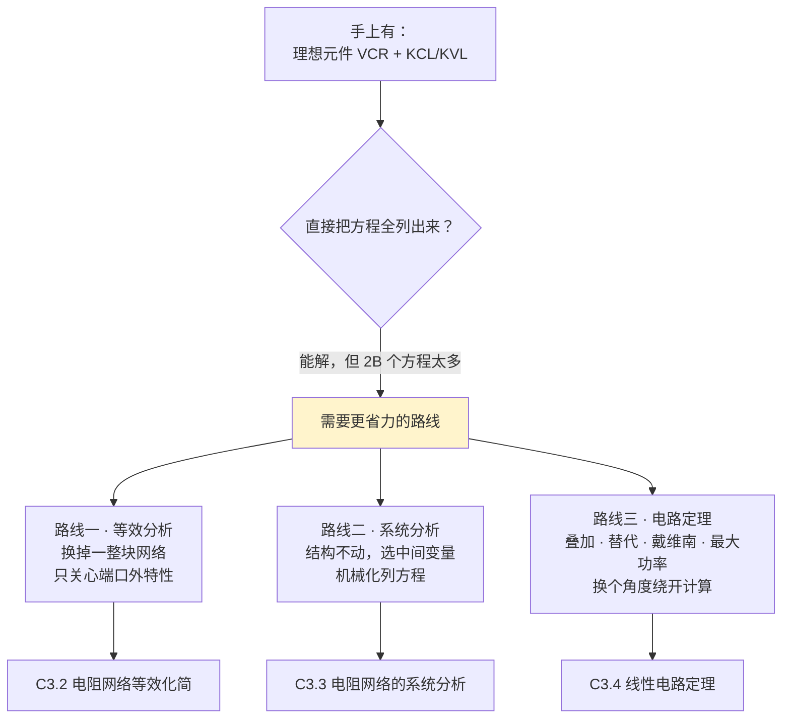

# C3.1 直流稳态与电路分析总览

> [!abstract] 这一讲的任务
> 前两章我们攒齐了两样东西：一套**理想元件**（每种元件有自己的伏安关系 VCR）和两条**铁律**（KCL、KVL）。理论上，任何电路都能靠这两样列方程解出来。
> 但"理论上能解"和"考场上半小时解得完"完全是两回事。这一讲不教新的物理，只回答两个问题：**① 电路分析到底在算什么？② 面对一张具体的电路图，你该从哪里下手？** 顺带把整章反复出现的前提——"直流稳态"——一次说透。

> [!info] 怎么读这份讲义
> 正文按"提出问题 → 朴素做法撞墙 → 引出办法"的顺序推进，建议从头顺读。带 `> [!question]` 的地方请真的停下来想一想再展开答案。这一讲是第 3 章的**地图**，后面三节（[[C3.2 电阻网络等效化简]]、[[C3.3 电阻网络的系统分析]]、[[C3.4 线性电路定理]]）分别对应三条路线；读完本讲，你至少能知道"这道题该翻哪一篇"。

> [!warning] 授课进度说明（截至第 4 次课）
> 已有的课堂语音转写稿覆盖到**第 4 次课**，内容为第 1 章全部 + 第 2 章全部；**第 3 章尚未讲授**。
> 因此本篇内容全部来自**课件与教材**，未经课堂讲解校正。等课上讲到本章后，本篇会按课堂实况做一次合并，并补上「拓展」标注（标出哪些是课堂没讲、仅由课件/教材补充的内容）。

---

## 0. 开场：一道你已经会做、但会做到手软的题

桌上摆着一张电路图：六条支路、四个结点、一个 5 V 电压源、一个 1 A 电流源、四个电阻。题目只问一件事——**$R_4$ 里流过多大电流？**

你已经完全具备解它的工具。每个电阻你知道 $u=Ri$，每个结点你能写 KCL，每个回路你能写 KVL。于是你老老实实地做：给六条支路各标一个电流、一个电压，一共 12 个未知数；写 6 个 VCR、3 个独立 KCL、3 个独立 KVL，一共 12 个方程。联立、消元、回代。

十五分钟后你得到了答案。**但题目只问一个电流，你却把整个电路的 12 个量都算了一遍。**

> [!question] 停一下，先自己想想
> 这 15 分钟里，哪些工作是"必需的"，哪些是"顺手多做的"？如果只想要 $R_4$ 的电流，理论上最少需要多少信息？

> [!success]- 想过了再看
> 多做的部分是：另外五条支路的电压和电流，你一个都没被问到。
> 但你没得选——**KCL、KVL 是"整体约束"**，一条支路的电流被所有其他支路牵着，不解开整张网，就拿不到其中一根线。
> 想少算，只有两条出路：**要么把网络本身变小**（等效），**要么换一套更少的中间变量**（系统法），**要么找到某个能绕开整体求解的结构性性质**（定理）。这三条出路，就是第 3 章的三节内容。整章的动机，就藏在你刚才那 15 分钟里。

---

## 1. 电路分析到底在干什么（课件 p.4）

课件用三行给电路分析下了定义：

> [!important] 电路分析的三要素（课件 p.4 原文）
> - **电路的组成 Circuit composing**：**拓扑 Topology + 元件 Component**
> - **依据 Based on**：电路定律（KCL/KVL 等）+ 数学工具 + 分析方法
> - **输出 Output**：电压、电流、功率……（即**性能评估** performance evaluation）

这三行看着像套话，其实每一行都在划定这门课的边界：

- **"拓扑 + 元件"**：一个电路只由两件事决定——谁连谁（拓扑），以及每个"谁"是什么（元件的 VCR）。这正好对应 [[C1.5 电路分析的基本定律]] 的**拓扑约束**（KCL/KVL，只管连接方式，不管元件是什么）和 [[C1.4 理想电路元件]] 的**元件约束**（只管元件本身，不管它接在哪）。这两类约束"正交"，且合起来完备——第 3 章第 3 节的"全电路方程"会把这句话变成一个可数的方程数。
- **"输出是电压、电流、功率"**：注意功率不是独立的第四个量，$p=ui$ 由前两个导出。所以**电路分析的最小完备目标 = 求出每条支路的 $u_b$ 和 $i_b$**。
- **"性能评估"**：提醒你分析是为设计服务的。第 3 章的最大功率传输定理，就是一个典型的"评估"结论：这个电源最多能给负载送多少功率。

### 1.1 三条路线（课件 p.4 的三个方框）

课件 p.4 用三个并排方框把整章的方法一次列全了：

| 方框 | 课件列出的方法 | 本讲义对应 |
|---|---|---|
| **Equivalent Analysis 等效分析** | 电阻串联、电阻并联、电源变换、Y-Δ 变换 | [[C3.2 电阻网络等效化简]] |
| **Systematic Analysis 系统分析** | 支路电流法、网孔电流法、结点电压法 | [[C3.3 电阻网络的系统分析]] |
| **Circuit Theorems 电路定理** | 替代、叠加、等效电源、最大功率传输 | [[C3.4 线性电路定理]] |

> [!warning] 课件 p.4 中间那栏的 "Node current" 是笔误
> 中间栏列的是 Branch current / **Node current** / Node voltage。系统方法的标准三件套是**支路电流法、网孔（Mesh）电流法、结点电压法**——p.37 的目录页写得很清楚：Branch current analysis（支路分析法）、**Mesh current analysis（网孔电流分析法）**、Nodal voltage analysis。所以 p.4 的 "Node current" 应为 **"Mesh current"**。别把它记成第四种方法。

> [!note] 网孔电流法与回路电流法：本课程不细讲，但要知道它们的位置（补充）
> 课件 p.50 和 p.67 都提到了它们，却没有展开例题，因为它们和结点电压法是"对偶"的：
> - **网孔电流法**：以网孔电流为中间变量，只列 KVL，方程数 $B-N+1$。缺点：**只适用于平面电路**（能画在纸上不交叉），有局限性（课件 p.50 原文）。
> - **回路电流法**：网孔法的推广，普遍适用，但"选取独立回路的灵活性也带来不确定性"（课件 p.50）；要系统化就得先取树、用基本回路——**基于图论的回路法**。
>
> 结点电压法之所以成为主力，正是因为它**没有这两个毛病**：参考结点随便挑，方程数唯一确定为 $N-1$，任何电路（平面与否）都能用。

---

## 2. "直流稳态"：为什么本章要先声明它（课件 p.5–6）

### 2.1 一个电路的两种工作状态

> [!important] 定义：稳态与暂态（课件 p.5–6）
> 对一个**元件与拓扑都确定**的电路，只有两种基本工作状态：
> - **稳态 steady-state**：电路工作**足够长时间**后，各处电流电压达到**某个稳定值**（或稳定的周期变化）。若电路中只有**直流**电源，且已工作很久，则各结点的电压电流不再随时间变化——这种电路叫 **直流稳态电路 DC steady-state circuit**。
> - **暂态 transient**：**工作条件突然改变**（开关动作、电源跳变）时，电路要从一个稳态"漂移"到另一个稳态，这段过程叫暂态。暂态期间电路性能**既不稳定、也不周期重复**。

请注意"稳态"的两个前提是并列的：**电源是直流** + **已经工作足够久**。少一个都不算直流稳态。这是本章所有方法的适用前提。

> [!question] 课堂追问（课件 p.5 最后一行红字）：What is an AC steady-state circuit？
> 既然"直流稳态"是直流源作用足够久之后的稳定状态，那"交流稳态"该怎么定义？各处电压电流还是常数吗？

> [!success]- 答案
> **交流稳态**：电路中只有**同频率的正弦**电源，且已工作足够久，则各处电压电流都变成**与激励同频率的正弦量**，其**幅值和初相不再随时间改变**。
> 关键在于把"稳定"理解对：不是"数值不变"，而是**波形形态不再变化**——幅值、频率、相位都定下来了。直流稳态是它的特例（频率为 0）。
> 这正是第 4 章的主题：一旦幅值和相位固定，就可以用一个复数（相量）代表整个正弦量，于是**第 3 章所有方法原封不动地搬到相量域**。→ [[C4.1 正弦量与相量]]

### 2.2 直流稳态下电路会退化成什么

> [!important] 两条关键简化（课件 p.6）
> 直流稳态下：**电容视为开路（open）**，**电感视为短路（shorted）**。
> 因此直流稳态电路里**只有电阻在工作**，它也被称为 **直流电阻电路 DC resistor circuit**。
> 但在暂态中，这些**随时间变化的元件仍然影响电路**（课件 p.6 原文）。

> [!note] 这两条不是新规定，是 [[C1.4 理想电路元件]] 的直接推论
> 电容的 VCR：$i_C = C\dfrac{\mathrm{d}u_C}{\mathrm{d}t}$。直流稳态下电压不再随时间变化，$\dfrac{\mathrm{d}u_C}{\mathrm{d}t}=0$，所以 $i_C = 0$——**有电压、没电流，这就是开路的定义**。
> 电感的 VCR：$u_L = L\dfrac{\mathrm{d}i_L}{\mathrm{d}t}$。同理 $\dfrac{\mathrm{d}i_L}{\mathrm{d}t}=0$，所以 $u_L = 0$——**有电流、没电压，这就是短路的定义**。
>
> 所以你**不需要背这两句口诀**：把 VCR 写出来，让时间导数为零，结论自己会掉出来。考试如果问"为什么"，就答这两行。

> [!warning] 最容易被滥用的一条规则
> "电容开路、电感短路"**只在直流稳态成立**。
> 换路瞬间（$t=0_+$）、暂态过程中（$0_+ < t < \infty$）都不成立——那时电容电压和电感电流恰恰是电路的主角（第 5 章的"换路定则"就是讲它们怎么变）。
> 典型错误：题目说"开关闭合瞬间，求电容两端电压"，有人一律把电容当开路——**错**。此刻要用的是 $u_C(0_+)=u_C(0_-)$。→ [[C5.1 动态电路与换路定则]]

### 2.3 本章的适用范围

综合起来，第 3 章研究的对象是：

$$\boxed{\text{线性 · 集总 · 直流稳态 · 纯电阻网络（可含独立源与受控源）}}$$

四个限定词各有出处：
- **集总**：来自 [[C1.1 电路分析的演化]] 的似稳条件，是"能用路的方法"的前提；
- **线性**：元件的 VCR 是线性的（$u=Ri$、$U_S$ 常数），这是**叠加定理和等效电源定理成立的关键**（替代定理是例外，线性非线性都能用）；
- **直流稳态**：本节刚讲，让 C、L 退场；
- **纯电阻**：上一条的结果。

> [!note] 那第 4、5 章为什么还要"重学"一遍分析方法？（补充）
> 其实不是重学，是**换域套用**：
> - **第 4 章**：正弦稳态，把 $R$ 换成阻抗 $Z$（复数），把 $u,i$ 换成相量 $\dot U,\dot I$，KCL/KVL 形式不变——于是结点电压法、戴维南定理**一字不改**地成立，只是算术从实数变成复数。
> - **第 5 章**：暂态，C、L 回到台面，代数方程变成微分方程；但求初值和终值时电路又回到直流稳态，**本章的方法在那两个时刻仍然是主力工具**。
>
> 所以第 3 章不是一章"直流专题"，它是**后面两章的方法母本**。这一章不扎实，第 4、5 章会一路吃力。

---

## 3. 面对一个电路，先回答"题目要什么"

三条路线不是并列的"你随便选一个"，它们各有明确的适用场景。这张表是本章的**选路手册**，做题时先查它：

| 题目问的是 | 首选路线 | 为什么 |
|---|---|---|
| 某个端口的等效电阻 / 只问一两个量，且电路是串并联结构 | **等效化简** → [[C3.2 电阻网络等效化简]] | 换掉内部，题目直接变小 |
| 桥式结构、串并联卡住了 | **Y-Δ 变换** → [[C3.2 电阻网络等效化简]] | 解开"既不串也不并"的死结 |
| 要求出全部支路量 / 电路结构复杂换不动 | **结点电压法** → [[C3.3 电阻网络的系统分析]] | 方程数最少（$N-1$），流程机械化 |
| 多个独立源，只问某一个响应 | **叠加定理** → [[C3.4 线性电路定理]] | 一个源一个源地算，每次的电路都很简单 |
| 只问某一条支路（尤其负载可变、含非线性元件） | **戴维南 / 诺顿** → [[C3.4 线性电路定理]] | 其余部分压缩成一个电源 + 一个电阻 |
| 负载取多大时功率最大 | **最大功率传输** → [[C3.4 线性电路定理]] | 先求戴维南等效，再套 $R_L=R_0$ |
| 已知某支路的 $u_0$、$i_0$，反求别的量 | **替代定理** → [[C3.4 线性电路定理]] | 把该支路换成同值电源，电路立刻简化 |

> [!question] 停一下，我们刚才干了什么
> 我们没有学任何新公式。我们做的是三件事：
> 1. 把"电路分析"的目标**收缩**成一句具体的话——求出每条支路的 $u_b$ 与 $i_b$；
> 2. 把"直流稳态"这个前提**说清楚**，从而把研究对象缩小成纯电阻网络（并且知道了这个前提**什么时候会失效**）；
> 3. 把整章的三条路线**排成一张选路表**。
>
> 接下来三讲，就是把表里的每一行做实。

---

## 这一讲的三句话

1. **电路分析 = 用元件约束（VCR）+ 拓扑约束（KCL/KVL），求出全部支路电压和电流**；功率是导出量，不是第三类未知数。
2. **直流稳态 = 只有直流源 + 已工作足够久**；此时 $\mathrm{d}/\mathrm{d}t=0$，由 VCR 直接推出**电容开路、电感短路**，电路退化为纯电阻网络。这条推论**只在稳态成立**，暂态中失效。
3. **三条路线各司其职**：等效（换网络）、系统法（列方程）、定理（换角度）。做题前先问"题目到底要什么"，再选路。

**速查表**

| 概念 | 结论 |
|---|---|
| 分析的最小完备目标 | 每条支路的 $u_b$、$i_b$，共 $2B$ 个量 |
| 稳态 vs 暂态 | 稳态：波形形态不再变；暂态：条件突变后的过渡过程 |
| 直流稳态下 C | $i_C=C\,\mathrm{d}u/\mathrm{d}t = 0$ → **开路** |
| 直流稳态下 L | $u_L=L\,\mathrm{d}i/\mathrm{d}t = 0$ → **短路** |
| 交流稳态 | 同频正弦源作用足够久，各量为**同频正弦**、幅值相位恒定 |
| 本章适用范围 | 线性 · 集总 · 直流稳态 · 纯电阻（可含受控源） |

**下一讲预告**：如果连"3 Ω 串 5 Ω 等于 8 Ω"这句初中结论都能被严格证明，那么串联、并联、分压、分流、源变换、Y-Δ——**这六件事其实是同一个定义的六个推论**。下一讲我们只用一句话（"端口外特性相同"）把它们全部推出来，一条都不用背。→ [[C3.2 电阻网络等效化简]]

---

## 本节自测 Self-Test

> [!question] Q1：一个电路有 8 条支路、5 个结点。直接列全电路方程，需要多少未知数、多少方程？各类各几个？

> [!success]- 答案
> 未知数 $2B = 16$ 个（8 个支路电压 + 8 个支路电流）。
> 方程也是 16 个：VCR $B=8$ 个；独立 KCL $N-1 = 4$ 个；独立 KVL $B-N+1 = 8-5+1 = 4$ 个。$8+4+4=16$ ✓。

> [!question] Q2：为什么直流稳态下电容等效开路？请从伏安关系推，不要背口诀。

> [!success]- 答案
> 电容 VCR：$i_C = C\dfrac{\mathrm{d}u_C}{\mathrm{d}t}$。直流稳态下所有量不随时间变化，$\dfrac{\mathrm{d}u_C}{\mathrm{d}t}=0$，故 $i_C=0$。端口有电压而无电流，正是开路的外特性。

> [!question] Q3：题目说"开关闭合瞬间，求电容两端电压"，能不能把电容当开路？

> [!success]- 答案
> **不能**。此刻电路处于暂态，$\mathrm{d}u_C/\mathrm{d}t \ne 0$。该用的是换路定则 $u_C(0_+)=u_C(0_-)$（第 5 章）。"电容开路"只在直流**稳态**成立。

> [!question] Q4：一个电路只有交流源（50 Hz 正弦），已工作很久。它算不算"稳态"？本章方法能直接用吗？

> [!success]- 答案
> **算稳态**，但不是**直流**稳态，是交流稳态：各量是同频正弦，幅值和相位恒定。
> 本章方法不能直接用在时域瞬时值上（C、L 不再退化），但**换到相量域后可以原封不动地用**——$R\to Z$、$u,i\to\dot U,\dot I$，KCL/KVL 形式不变。这正是第 4 章要做的事。

> [!question] Q5：课件 p.4 中间那栏写的 "Node current" 应该是什么？

> [!success]- 答案
> 应为 **Mesh current（网孔电流法）**。对照 p.37 目录页：Branch current / Mesh current / Nodal voltage。系统方法没有"结点电流法"这一说——结点上写的是 KCL，用的变量是**结点电压**。

> [!question] Q6：结点电压法为什么比网孔电流法、回路电流法更通用？

> [!success]- 答案
> 三条：① 网孔法**只适用于平面电路**；② 回路法虽普遍适用，但独立回路的选取有随意性，无一般化流程（要系统化就得取树、用基本回路，涉及图论）；③ 结点法的参考结点任选、方程数唯一确定为 $N-1$、流程完全机械化，且平面非平面通吃。

> [!question] Q7：本章为什么默认只研究"纯电阻网络"？电容电感去哪了？

> [!success]- 答案
> 因为限定了直流稳态：C 开路、L 短路，从电路中"消失"了（更准确地说：退化成了平凡的开路/短路，不再参与方程）。它们会在第 5 章暂态分析中回来。

> [!question] Q8：为什么说功率不是第三类未知数？

> [!success]- 答案
> 因为 $p = ui$（相关参考方向下）是由支路电压和电流**导出**的。只要 $2B$ 个 $u_b, i_b$ 全部求出，任何支路的功率都能直接算。所以电路分析的完备目标就是这 $2B$ 个量。→ [[C1.2 电路的基本概念]]

---

**上一节 ←** [[C2.3 双端口器件的电路模型]]
**下一节 →** [[C3.2 电阻网络等效化简]]
**课程索引 →** [[电路基础 MOC]]
