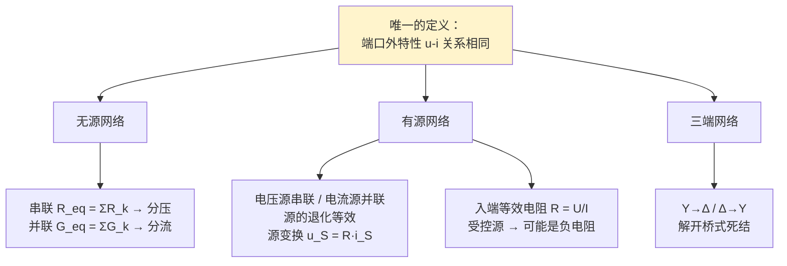

# C3.2 电阻网络等效化简

> [!abstract] 这一讲的任务
> [[C3.1 直流稳态与电路分析总览]] 把本章拆成三条路线，这一讲走第一条：**等效分析**。核心思路只有一句话——**站在端口外面看网络，把内部换成更简单、但外特性完全相同的东西**。
> 我们从"两个电阻串联为什么等于相加"这个初中结论出发，一路推到源变换、入端电阻、负电阻和 Y-Δ 变换。你会发现：这一整套公式背后**只有一个定义**，没有一条需要死记。

> [!info] 怎么读这份讲义
> 每引入一个新变换，都问同一个问题：**"端口外面看到的东西变了吗？"** 只要没变，这个变换就合法。建议顺读；带 `> [!question]` 处先自己推一遍再展开。公式后标注了课件页码，方便对照复习。

> [!warning] 授课进度说明（截至第 4 次课）
> 已有的课堂语音转写稿覆盖到**第 4 次课**，内容为第 1 章全部 + 第 2 章全部；**第 3 章尚未讲授**。
> 因此本篇内容全部来自**课件与教材**，未经课堂讲解校正。等课上讲到本章后，本篇会按课堂实况做一次合并，并补上「拓展」标注（标出哪些是课堂没讲、仅由课件/教材补充的内容）。

---

## 0. 开场：把黑箱整个换掉

你在实验台上接了一个盒子：两根引线伸出来，里面是什么你不知道。你拿可调电源接上去，扫一遍电压，记录电流，画出一条 $u$–$i$ 曲线：一条过原点的直线，斜率 $1/8\ \mathrm{S}$。

现在有人打开盒子，拿走里面的东西，换上一个 8 Ω 的电阻，再盖上。**你能用外部测量把这件事查出来吗？**

不能。无论你在外面接什么——接电阻、接电源、接一整个复杂网络——所有测得的电压、电流都和换之前**一模一样**。

**这就是"等效"。** 它不是"差不多"，是**外部完全测不出差别**。

![[C3-等效概念-串联电阻与等效电阻.png]]

课件用的正是这个例子：3 Ω 串 5 Ω，和一个 8 Ω，对外完全等效。你在初中就会算它，但这一讲要把它变成一件**可以证明、可以推广**的事。

---

## 1. 等效的定义：外特性相同（课件 p.8）

> [!important] 定义：电路的等效 circuit equalizing（课件 p.8 原文）
> 两个电路有**相同的输入/输出端口**（内部可以完全不同）。当它们与**任意其他元件、以任意拓扑**连接时，两个电路**表现相同**，就称这两个电路互为等效。
>
> - **电路的外特性 External characteristics**：一个元件（或网络）的**伏安关系 V-I relationship**，通常写成数学式。
> - **数学上的等效判据**：**两个电路的外特性相同，则二者等效。**

这个定义有三个要点，每一个都会在后面反复被用到：

1. **等效是对"端口"说的**。没有指定端口，"等效"这个词没有意义。**先画端口，再化简**——这是做等效题的第一步。
2. **等效只保证"对外"，不保证"对内"**。8 Ω 电阻内部没有 3 Ω 和 5 Ω 之分，换掉之后原来 3 Ω 上的那个电压**不再存在**。
3. **判据是"外特性相同"，不是"结构相似"**。所以电压源可以等效成电流源——结构天差地别，但 $u$–$i$ 曲线是同一条。

---

## 2. 等效方法的四条守则（课件 p.9）

> [!important] Tips for the equivalent method（课件 p.9 原文四条）
> 1. **替换成等效电路后，电路的（外部）性能保持不变。**
> 2. **等效只对外部有效，对内部无效**（The equivalence only works for external, not internal）。
> 3. 通常用简单电路等效复杂电路，从而化简整个电路；有时找不到更简单的形式，也可以**换一种拓扑**来等效（例如用电流源等效电压源）。
> 4. 恰当地使用等效电路，可以**显著降低电路分析的工作量**。

> [!warning] 第 2 条必须理解到位，它是本章最高频的失分点
> "等效只对外" 具体意味着什么？举个立刻能用的例子：
> 一个 12 V 电压源串 2 Ω，与一个 6 A 电流源并 2 Ω 互为等效（第 7 节会证）。带 4 Ω 负载时，两者的**负载电流都是 2 A、负载电压都是 8 V**——对外完全一致。
> 但**内部功率完全不同**：
> - 电压源模型：电源发出 $12\times 2 = 24\ \mathrm{W}$，内阻耗 $2^2\times 2 = 8\ \mathrm{W}$；
> - 电流源模型：电流源端电压 8 V，发出 $8\times 6 = 48\ \mathrm{W}$，内阻（并联的 2 Ω，两端 8 V）耗 $8^2/2 = 32\ \mathrm{W}$。
>
> 负载都拿到 16 W ✓，但内部账目**对不上**。
> **所以：等效变换之后，绝不能再用等效电路去算被换掉部分的内部电压、电流、功率。** 要算内部量，必须退回原电路。这一条第 7 节会再兑现一次。

---

## 3. 串联等效与分压（课件 p.10–12）

### 3.1 先把"串联"定义清楚

> [!important] 串联的判据（课件 p.10）
> 一个元件的输出端接到另一个元件的输入端，**且连接点上没有其他并联支路**，因而**同一个电流流过它们**。

注意判据的落脚点是"**同一个电流**"，而不是"画在一条直线上"。图上画成一条线只是常见画法；判断串联要看**中间结点有没有第三条支路引出去**——只要有，电流就会分流，串联关系立刻破裂。这是读图时最常见的翻车点。

### 3.2 推导：串联为什么能相加

![[C3-串联电阻与分压推导电路.png]]

设外部端口 a、b，端口电压 $u$、端口电流 $i$。三步（课件 p.10 原文的三行）：

1. **欧姆定律**（同一个 $i$ 流过两个电阻）：$u_1 = R_1 i$，$u_2 = R_2 i$
2. **KVL**（沿回路）：$u = u_1 + u_2$
3. **合并**：$u = (R_1+R_2)\, i$

而单个电阻的外特性是 $u = R\,i$（课件 p.11）。两式**形式相同**，只要

$$\boxed{R = R_1 + R_2}$$

外部就**永远**分不出区别。

> [!note] 这就是"逼出来"的公式
> 我们没有背"串联电阻相加"。我们只做了一件事：**把两种电路的外特性都写成 $u = (\ \cdot\ )\,i$ 的形式，然后让括号里的东西相等**。
> 记住这个套路——本讲后面每一个等效公式（并联、源变换、Y-Δ）都是同一个套路的重复，只是式子越来越长。

### 3.3 推广到 N 个电阻与分压公式

![[C3-N个电阻串联等效与分压.png]]

同样的推导对 $N$ 个电阻成立（课件 p.11–12）：

$$R_{\mathrm{eq}} = \sum_{k=1}^{N} R_k$$

既然 $i$ 是公共的，把 $i = u / R_{\mathrm{eq}}$ 代回 $u_k = R_k i$：

$$\boxed{u_k = \frac{R_k}{R_{\mathrm{eq}}}\,u = \frac{R_k}{R_1+R_2+\cdots+R_N}\,u},\qquad k=1,2,\cdots,N$$

这就是**分压公式 voltage division**。它其实不是新公式，只是"$i$ 公共"这句话的另一种写法：**串联时各电阻分到的电压与自身阻值成正比**。

> [!example] 手算检查
> $R_1 = 3\ \Omega$、$R_2 = 5\ \Omega$ 串联，端口加 $u = 16\ \mathrm{V}$：
> $R_{\mathrm{eq}} = 8\ \Omega$，$i = 16/8 = 2\ \mathrm{A}$；
> $u_1 = 3\times 2 = 6\ \mathrm{V}$，用分压：$\frac{3}{8}\times 16 = 6\ \mathrm{V}$ ✓
> $u_2 = 5\times 2 = 10\ \mathrm{V}$，用分压：$\frac{5}{8}\times 16 = 10\ \mathrm{V}$ ✓，且 $6+10=16$ ✓（KVL 自洽）。

---

## 4. 并联等效与分流（课件 p.13–15）

### 4.1 并联的判据

> [!important] 并联的判据（课件 p.13 原文）
> 两个元件接在**同样的两个结点之间**，因而**承受同一个电压**，称为并联。

和串联对偶：串联的共同点是**电流**，并联的共同点是**电压**。

### 4.2 推导

![[C3-两电阻并联电路.png]]

三步（课件 p.13）：

1. **欧姆定律**（同一个 $u$ 加在两个电阻上）：$i_1 = u/R_1$，$i_2 = u/R_2$
2. **KCL**（在结点 a）：$i = i_1 + i_2$
3. **合并**：$i = \left(\dfrac{1}{R_1}+\dfrac{1}{R_2}\right) u = \dfrac{1}{R}\,u$

于是

$$\frac{1}{R} = \frac{1}{R_1}+\frac{1}{R_2}\quad\Longleftrightarrow\quad \boxed{R = \frac{R_1 R_2}{R_1+R_2}}$$

注意这个"两电阻乘积除以和"的形式**只对两个电阻成立**，三个以上必须回到倒数和。

### 4.3 引入电导 G：为什么并联要换个量来写

> [!important] 电导 Conductance（课件 p.14）
> $$G = \frac{1}{R},\qquad \text{单位：西门子 Siemens (S)}$$
> 端口外特性写成 $i = (G_1+G_2)\,u = G\,u$，于是**并联等效条件**是
> $$\boxed{G_{\mathrm{eq}} = \sum_{k=1}^{N} G_k}\qquad\text{即}\qquad \frac{1}{R_{\mathrm{eq}}} = \sum_{k=1}^{N}\frac{1}{R_k}$$

![[C3-N个电阻并联等效与分流.png]]

课件 p.15 特意问了一句 **"Why we need the conductance?"**，答案就写在那一页最下面：**In some cases, calculation with G is much simpler than R.**

> [!note] 说透一点：为什么用 G 更简单（补充）
> 对比一下两个公式的"对称性"：
> - 串联用 $R$：$R_{\mathrm{eq}} = \sum R_k$，分压 $u_k = \dfrac{R_k}{\sum R}u$；
> - 并联用 $G$：$G_{\mathrm{eq}} = \sum G_k$，分流 $i_k = \dfrac{G_k}{\sum G}i$。
>
> **换成电导之后，并联的公式和串联的公式长得一模一样**——都是"求和"和"占比"。如果坚持用 $R$ 写并联分流，就会写成 $i_k = \dfrac{1/R_k}{\sum 1/R_j}\,i$，套着三层倒数，极易出错。
> 更重要的是：**结点电压法的方程天生是用电导写的**（$\sum G_{jk}U_k = I_{jS}$），因为在结点上写的是 KCL，而"电压 → 电流"这一步用的就是 $i = Gu$。所以电导不是一个记号癖好，它是[[C3.3 电阻网络的系统分析]]的自然语言。

### 4.4 分流公式

$$\boxed{i_k = \frac{G_k}{G_{\mathrm{eq}}}\,i = \frac{G_k}{G_1+G_2+\cdots+G_N}\,i}$$

两电阻并联的常用特例（考试高频，值得记熟）：

$$i_1 = \frac{R_2}{R_1+R_2}\,i,\qquad i_2 = \frac{R_1}{R_1+R_2}\,i$$

> [!warning] 两电阻分流最容易记反
> 分压是"**自己**的电阻占比"，分流是"**对面**的电阻占比"。
> 直觉检查：$R_1$ 很大时，电流当然更愿意走 $R_2$，所以 $i_1$ 应该小——公式里 $i_1 = \frac{R_2}{R_1+R_2}i$，$R_1$ 大则分母大、$i_1$ 小 ✓。**每次用之前拿极端情形验一遍，比背口诀可靠。**

> [!example] 手算检查
> $R_1 = 3\ \Omega$、$R_2 = 6\ \Omega$ 并联，总电流 $i = 3\ \mathrm{A}$：
> $R = \frac{3\times 6}{3+6} = 2\ \Omega$，$u = 3\times 2 = 6\ \mathrm{V}$；
> $i_1 = 6/3 = 2\ \mathrm{A}$，用分流：$\frac{6}{3+6}\times 3 = 2\ \mathrm{A}$ ✓
> $i_2 = 6/6 = 1\ \mathrm{A}$，用分流：$\frac{3}{3+6}\times 3 = 1\ \mathrm{A}$ ✓，$2+1=3$ ✓。

---

## 5. 理想电源的合并（课件 p.16–17）

前面处理的是无源网络（3.2.2 节）。从这里开始进入**有源网络的等效**（课件 3.2.3 节）。套路完全一样：写外特性，比对。

### 5.1 电压源串联

![[C3-电压源串联等效.png]]

外特性由 **KVL** 给出（课件 p.16）：

$$u = u_{s1}+u_{s2}+\cdots+u_{sN} = u_s$$

端口电压与端口电流**无关**——这正是电压源的特性。所以：

> [!important] 结论（课件 p.16 红框原文）
> 若干个理想电压源**串联**，可以等效为**一个**理想电压源，其值为各串联电压源之值的**叠加**（superposition of the values）。

> [!warning] "叠加"要带符号
> 课件在图旁边专门标了一句 **"polarization is related to referenced direction"**（极性与参考方向有关）。
> 求和时以**等效源的参考正极**为准：与之同向的取 "+"，反向的取 "−"。$5\ \mathrm{V}$ 与反接的 $3\ \mathrm{V}$ 串联，等效为 $2\ \mathrm{V}$，不是 8 V。

### 5.2 电流源并联

![[C3-电流源并联等效.png]]

对偶地，外特性由 **KCL** 给出（课件 p.17）：

$$i = i_{s1}+i_{s2}+\cdots+i_{sN} = i_s$$

> [!important] 结论（课件 p.17 红框原文）
> 若干个理想电流源**并联**，可以等效为**一个**理想电流源，其值为各并联电流源之值的**叠加**。同样要按参考方向定符号。

> [!warning] 两条禁止规则（课件 p.18、p.19 的红字）
> - **输出不同的电压源禁止并联**（Voltage source with different output is forbidden to parallel）。
> - **输出不同的电流源禁止串联**（Current source with different output is forbidden to series）。
>
> 为什么？把 5 V 和 3 V 并联，KVL 要求同一对结点间的电压既是 5 V 又是 3 V——**矛盾，电路无解**。电流源串联同理：KCL 要求同一条支路的电流既是 2 A 又是 1 A。
> 物理上：这不是"不好"，是**模型自相矛盾**。真实器件这么接会烧掉，因为真实电源有内阻，环流会非常大。→ [[C1.4 理想电路元件]]

---

## 6. 源与元件的"退化"等效（课件 p.18–19）

这两条初学时最反直觉，但它们是后面很多化简步骤的关键（例 2 就直接用到）。

### 6.1 电压源并联任意非电压源元件

![[C3-电压源与其他元件并联等效.png]]

> [!important] 结论（课件 p.18 原文）
> 电压源与**任意非电压源元件**（including current source）并联，**等效为一个同值的电压源**。

**为什么？** 由 KVL，端口电压 $u$ 恒等于 $u_s$，与并在旁边的 N 是什么、通过多大电流**完全无关**。而端口电流可以取任意值（多余的部分由 N 承担）。这个 $u$–$i$ 外特性正是"理想电压源"的定义。

> [!question] 停一下，先自己想想
> 那并联的那个 N 上还有电流吗？如果有，等效之后它去哪了？

> [!success]- 想过了再看
> **有，而且一点没变。** N 两端仍然是 $u_s$，仍然流着它该流的电流。
> 但站在端口外面，你**分不出**这股电流是流进 N 的还是流出电源的——你只能看到端口总电流。
> 所以等效之后 N 上的电流"不见了"，正是"**等效只对外**"的又一次体现：要算 N 上的电流，回原电路。

### 6.2 电流源串联任意非电流源元件

![[C3-电流源与其他元件串联等效.png]]

> [!important] 结论（课件 p.19 原文）
> 电流源与**任意非电流源元件**（including voltage source）串联，**等效为一个同值的电流源**。

由 KCL，端口电流恒为 $i_s$，与串在里面的 N 无关；端口电压可取任意值（差额落在 N 上）。这正是理想电流源的外特性。

> [!note] "退化"两个字的含义
> 电压源并上一个电阻，那个电阻在**对外**意义上被"吃掉"了；电流源串上一个电阻，那个电阻同样被"吃掉"了。
> 记忆抓手：**电压源"横着吃"（并联方向），电流源"竖着吃"（串联方向）**。
> 用途：见到 "$5\ \mathrm{A}$ 电流源串 $10\ \Omega$"，直接划掉 10 Ω；见到 "$30\ \mathrm{V}$ 电压源并 $6\ \Omega$"，直接划掉 6 Ω。第 8 节的例 2 一上来就是这两刀。

---

## 7. 源变换：电压源 ⇄ 电流源（课件 p.20）

前面两条讲的是**理想**源。真实电源有内阻（[[C2.2 单端口器件的电路模型]]），于是有两种模型：**电压源串电阻**、**电流源并电阻**。它们能互换吗？

![[C3-实际电压源与电流源的等效变换.png]]

**电压源模型的外特性**（课件 p.20 左上，KVL + 欧姆定律）：

$$u = u_s + u_R = u_s + R\,i \quad\Longrightarrow\quad i = \frac{u}{R}-\frac{u_s}{R}$$

**电流源模型的外特性**（KCL + 欧姆定律）：

$$i = i_R - i_s = \frac{u}{R} - i_s \quad\Longrightarrow\quad u = R\,i_s + R\,i$$

把两组式子并排放，只差一个对应关系：

$$\boxed{u_s = R\cdot i_s \qquad\Longleftrightarrow\qquad i_s = \frac{u_s}{R}}$$

> [!important] 源变换的三条要点
> 1. **电阻值不变，跟着电源"搬家"**：串在电压源上 ↔ 并在电流源上。
> 2. **方向必须对得上**：电流源的箭头指向，要和电压源的 "+" 极一致（电流从电压源正极流出）。课件 p.20 红框专门写了 **"Note: Must consider the reference direction when transforming."**
> 3. **无伴电源不能变换**：没有串联电阻的电压源（$R=0$）、没有并联电阻的电流源（$R=\infty$）都变不了——公式里会出现除零或乘无穷。这个"无伴"的概念在 [[C3.3 电阻网络的系统分析]] 第 6 节会成为专门的难点。

> [!warning] 再次兑现："内部功率作废"
> 第 2 节算过的账在这里正式落地：源变换前后，**负载侧的一切都相同，电源内部的功率账目完全不同**。
> 考试常见的坑：先做源变换，再问"原电压源发出多少功率"。**必须退回原电路算**。

---

## 8. 例题：把"看着乱"的电路一路换干净（课件 p.21–22）

### 8.1 例 1：多电源电路，求 $I_5$ 与各点电位（课件 p.21）

![[C3-例1-多电源电路求I5与各点电位.png]]

题目：(1) 求 $I_5$；(2) 把 C 点接地，求 A、B、D 各点电位。

**化简过程**（图中三个红圈就是三刀）：
- 左边：$6\ \mathrm{V}$ 电压源串 $1\ \Omega$ → 源变换为 $6\ \mathrm{A}$ 电流源并 $1\ \Omega$；
- 中上：$1\ \mathrm{A}$ 电流源与 $4\ \Omega$、$2\ \mathrm{A}$ 源等合并归拢；
- 右边：$2\ \mathrm{A}$ 电流源串 $2\ \Omega$ → 按 6.2 节，$2\ \Omega$ 被吃掉；
- 归拢后再逐段做源变换，得到最右下那个单回路。

**结果**（课件给出）：

$$I_5 = \frac{4+4-4}{4+2+1.5+0.5}\ \mathrm{A} = \frac{4}{8}\ \mathrm{A} = 0.5\ \mathrm{A}$$

$$U_{\mathrm B} = 4-2I_5 = 3\ \mathrm{V},\qquad U_{\mathrm D} = 1.5 I_5 = 0.75\ \mathrm{V},\qquad U_{\mathrm A} = 4+0.5I_5+U_{\mathrm D} = 5\ \mathrm{V}$$

> [!example] 复算确认
> $I_5 = 4/8 = 0.5$ ✓；$U_B = 4-2(0.5)=3$ ✓；$U_D = 1.5(0.5)=0.75$ ✓；$U_A = 4+0.25+0.75 = 5$ ✓。

> [!note] 这题的示范意义
> 第 (2) 问悄悄用了 [[C1.2 电路的基本概念]] 的电位法：先指定 C 为参考点（电位零点），再沿路径累加电压降。**注意 A、B、D 是原电路里的点**，所以求电位时用的是**化简后的单回路电流 $I_5$ 代回原路径**——这是"等效只对外"的合法用法：$I_5$ 所在的那条支路自始至终没被换掉。

### 8.2 例 2：逐步等效，求 16 Ω 上的电流（课件 p.22）

![[C3-例2-逐步等效化简求16欧电流.png]]

四步（图中的三个圈 + 一次并联）：
1. **$5\ \mathrm{A}$ 电流源串 $10\ \Omega$** → 10 Ω 被吃掉（6.2 节）；
2. **$30\ \mathrm{V}$ 电压源串 $6\ \Omega$** → 源变换为 $30/6 = 5\ \mathrm{A}$ 电流源并 $6\ \Omega$（图中黑虚线圈）；
3. **两个 $5\ \mathrm{A}$ 电流源并联** → 合并为 $10\ \mathrm{A}$；**$3\ \Omega \parallel 6\ \Omega = 2\ \Omega$**；
4. 剩下 $10\ \mathrm{A}$ 电流源并 $2\ \Omega$，再与 $16\ \Omega$ 并联，用**分流**：

$$I = \frac{2}{2+16}\times 10\ \mathrm{A} = \frac{2}{18}\times 10\ \mathrm{A} = 1.111\ \mathrm{A}$$

> [!warning] 课件此处的数值取整偏松（数值核对）
> 课件写 $I = \frac{2}{18}\times 10 = 1.1\ \mathrm{A}$。精确值是 $10/9 = 1.1111\ldots\ \mathrm{A}$。
> 按课件 p.48 自己立的规矩——"工程上要求最后结果必须给出一定精度数值，不允许只给出分数结果，一般保留 **3~4 位有效数字**"——这里应写 **1.111 A**。
> **答题时统一按 3~4 位有效数字写。** 分数形式（$10/9$ A）在这门课里不算完整答案。

---

## 9. 单端口等效小结与入端等效电阻（课件 p.23–24）

### 9.1 小结（课件 p.23）

| # | 结论 | 公式 |
|---|---|---|
| 1 | N 个电阻串联 | $R_{eq}=\sum R_k$ |
| 2 | N 个电阻并联（用电导） | $G_{eq}=\sum G_k$ |
| 3 | 电压源串联 | $U_{Seq}=\sum U_{sk}$ |
| 4 | 电流源并联 | $I_{Seq}=\sum I_{sk}$ |
| 5 | 电压源并**非电压源**元件 | 等效为同值电压源 |
| 6 | 电流源串**非电流源**元件 | 等效为同值电流源 |
| 7 | 电压源带内阻 ⇄ 电流源带内阻 | $U_S = R\,I_S$ |

> [!warning] 课件 p.23 第 5、6 条文字重复（课件笔误）
> 课件把第 5、6 条写成了完全相同的一句话（都是 "Parallel connecting voltage source to non-voltage source…"）。对照 p.19 可知，**第 6 条应为"电流源与非电流源元件串联，等效为同值电流源"**。上表已按 p.19 更正。

### 9.2 二端无源网络的入端等效电阻（课件 p.24）

![[C3-二端无源网络的入端等效电阻.png]]

> [!important] 定义（课件 p.24 原文）
> 任何复杂网络，引出两个端钮称为**二端网络**；内部**没有独立源**的二端网络，称为**二端无源网络**。
> 任何一个无源二端网络（**可以包含受控电源**）都能等效为一个电阻，称为**入端等效电阻（输入电阻）**：
> $$\boxed{R_{\text{等效}} = \frac{U}{I}}$$

> [!warning] "无源"= 无**独立**源，不是"没有源"
> 这是本章最经典的辨析之一。受控源可以留在网络里，因为它**不能自行提供能量**——控制量归零时它就归零。所以含受控源的网络仍算"无源二端网络"，仍可等效成一个电阻。
> 但它带来一个新现象：**这个电阻可能是负的**（下一节）。
> 这条规则在 [[C3.4 线性电路定理]] 求戴维南内阻 $R_0$ 时会原样再用一次：**独立源置零，受控源保留**。

---

## 10. 串并联综合例题与负电阻（课件 p.25–27）

### 10.1 例：纯串并联化简（课件 p.25）

![[C3-例题-电阻网络的串并联化简.png]]

**例 1**：$R = 4\,\|\,\big(2+(3\,\|\,6)\big) = 4\,\|\,(2+2) = 4\,\|\,4 = 2\ \Omega$ ✓

**例 2**：先把交叉画法**理顺**（图中蓝色箭头那一步），看清哪些结点其实是同一个点，再算：
$$R = (40\,\|\,40) + (30\,\|\,30\,\|\,30) = 20 + 10 = 30\ \Omega\ ✓$$

> [!note] 读图的顺序：从远端往端口"收"
> 串并联化简的通用手法是**从离端口最远的地方开始合并，一层层往端口收**。例 1 里 $3\|6$ 最远，先算它；然后串上 2 Ω；最后并 4 Ω。
> 遇到画得很乱的图（例 2 那种交叉线），**先标结点**：把所有用理想导线连在一起的点标成同一个字母，再重画成规整形式。**理想导线两端是同一个结点**——这是[[C1.2 电路的基本概念]]里的基本功，在这里救命。

### 10.2 例：梯形网络的分压分流（课件 p.26）

![[C3-例题-梯形电阻网络分流分压.png]]

12 V 电压源接一串梯形网络（全部由 $R$ 和 $2R$ 组成），求 $I_1$、$I_4$、$U_4$。课件给了两种解法，都值得会：

**① 分流法**（从左往右推）：

$$I_1 = \frac{12}{R},\qquad I_4 = -\frac{1}{2}I_3 = -\frac{1}{4}I_2 = -\frac{1}{8}I_1 = -\frac{1}{8}\cdot\frac{12}{R} = -\frac{3}{2R}$$

$$U_4 = -I_4\times 2R = 3\ \mathrm{V}$$

**② 分压法**（从右往左推）：

$$U_4 = \frac{U_2}{2} = \frac14 U_1 = 3\ \mathrm{V},\qquad I_4 = -\frac{3}{2R},\qquad I_1 = \frac{12}{R}$$

> [!note] 为什么这个网络每一级都恰好"减半"（补充）
> 这是 **R-2R 梯形网络**的经典性质：从右往左看，每一节的等效电阻都恰好是 $R$，于是每经过一级，电压折半、电流折半。
> 课件没点破，但这正是它选这个例子的原因：**这个结构是数模转换器（DAC）里的 R-2R 电阻网络**，靠的就是"每一级权重恰好差 2 倍"这个二进制性质。你以后在 AI 硬件、传感器接口里遇到 R-2R DAC，就是这张图。
> 顺带解释 $I_4$ 的负号：它只是说明 $I_4$ 的**参考方向与实际方向相反**（图上 $I_4$ 箭头朝左），不代表算错。→ [[C1.2 电路的基本概念]]

### 10.3 负电阻：受控源能"造"出负阻（课件 p.27）

![[C3-含受控源的入端电阻与负电阻.png]]

端口 a-b 内部：一个 CCCS $\beta I$ 与电阻 $R$ 并联，控制量就是端口电流 $I$。求入端电阻：

流过 $R$ 的电流是 $I - \beta I$，所以

$$U = (I-\beta I)R \quad\Longrightarrow\quad R_{ab} = \frac{U}{I} = \frac{(1-\beta)IR}{I} = (1-\beta)R$$

> [!important] 结论（课件 p.27）
> - 当 $\beta < 1$：$R_{ab} > 0$，**正电阻**
> - 当 $\beta > 1$：$R_{ab} < 0$，**负电阻，整个等效电路相当于电源**
>
> ($\beta = 1$ 时 $R_{ab}=0$，端口相当于短路。)

> [!question] 停一下，先自己想想
> "负电阻"在 $u$–$i$ 平面上是一条**过原点、斜率为负**的直线。$u>0$ 时 $i<0$，于是 $p = ui < 0$——**它在发出功率**。
> 可我们刚说过"网络内没有独立源"，功率从哪来？

> [!success]- 想过了再看
> 从**控制受控源的那个外部电路**来。受控源不是能量的凭空来源，它是能量的"**搬运工**"：真实器件（三极管、运放）里的受控源模型，其能量来自电路的**直流偏置电源**——那个电源在小信号模型里被置零、看不见了，但它一直在供电。
> 所以"负电阻"是一个**在小信号意义下成立**的等效概念：它描述的是"这个端口向外送能量"，而能量的真正源头在模型之外。
> **工程意义**：负电阻能抵消回路中的正电阻损耗，让振荡不衰减——这正是 LC 振荡器、隧道二极管振荡器的工作原理。**如果没有负阻，任何 LC 回路的振荡都会因电阻耗能而衰减到零**（第 5 章会看到这个衰减过程）。→ [[C1.4 理想电路元件]]

---

## 11. 三端网络：Y-Δ 变换（课件 p.28–36）

### 11.1 为什么需要它：桥式网络把串并联卡死了

到目前为止，所有化简都靠"串联"或"并联"。但看一眼**桥式电路**（第 11.5 节的桥 T 电路就是）：中间那个"桥臂"电阻，两端各接在两个不同的结点上，**和谁都不串、和谁都不并**。

串并联法在这里彻底失效。**必须换一种更强的等效手段——把三个端子看成一个整体来换。**

> [!important] 三端无源网络（课件 p.28）
> 向外引出**三个端**、且**内部没有独立源**的网络。
> 最重要的两种接法：**星形联接 Y**（三个电阻各接一端、共一个中心点）与**三角形联接 Δ**（三个电阻首尾相接成环，三个顶点引出）。

![[C3-Y型与三角形网络及πT型.png]]

> [!note] 别被四个名字吓到：Y = T，Δ = π（课件 p.29 下半页）
> 同一个东西换个画法就换个名字：
> - **Y 型**画成"两个横的加一个竖的下垂"，就成了 **T 型**；
> - **Δ 型**画成"一个横的加两个竖的下垂"，就成了 **π 型**。
>
> 电路上完全一样。滤波器、衰减器文献里常说"π 型网络""T 型衰减器"，指的就是它们。

### 11.2 等效条件（课件 p.30）

![[C3-YΔ变换的等效条件.png]]

三端网络的等效条件，就是把"外特性相同"写成三端子版本：

> [!important] Y-Δ 等效条件（课件 p.30 原文）
> $$i_{1\Delta}=i_{1\mathrm Y},\quad i_{2\Delta}=i_{2\mathrm Y},\quad i_{3\Delta}=i_{3\mathrm Y}$$
> $$u_{12\Delta}=u_{12\mathrm Y},\quad u_{23\Delta}=u_{23\mathrm Y},\quad u_{31\Delta}=u_{31\mathrm Y}$$
>
> 即：**对应端子的电流相同、对应端子间的电压相同。**

> [!note] 独立变量只有两组两个（补充）
> 六个式子里其实只有 4 个独立：由 KCL，$i_1+i_2+i_3=0$；由 KVL，$u_{12}+u_{23}+u_{31}=0$。
> 所以三端网络的外特性由 **2 个独立电流 + 2 个独立电压**决定，需要 **3 个参数**来描述——这正好对应 Y 有 3 个电阻、Δ 有 3 个电阻。**参数个数对得上，变换才可能存在**。这个"数一数自由度"的思路，在 11.6 节判断四端网络时会立刻派上用场。

### 11.3 推导 Y → Δ（课件 p.31–33）：把两组方程"对系数"

![[C3-YΔ变换的方程组.png]]

**Δ 接：用电压表示电流**（课件 p.31 的式 (1)）——每个端子电流是流入的两条边电流之差：

$$i_{1\Delta}=\frac{u_{12\Delta}}{R_{12}}-\frac{u_{31\Delta}}{R_{31}},\quad i_{2\Delta}=\frac{u_{23\Delta}}{R_{23}}-\frac{u_{12\Delta}}{R_{12}},\quad i_{3\Delta}=\frac{u_{31\Delta}}{R_{31}}-\frac{u_{23\Delta}}{R_{23}}$$

**Y 接：用电流表示电压**（式 (2)）——每个端子对间的电压是两条臂电压之差：

$$u_{12\mathrm Y}=R_1 i_{1\mathrm Y}-R_2 i_{2\mathrm Y},\quad u_{23\mathrm Y}=R_2 i_{2\mathrm Y}-R_3 i_{3\mathrm Y},\quad u_{31\mathrm Y}=R_3 i_{3\mathrm Y}-R_1 i_{1\mathrm Y}$$

配上 $i_{1\mathrm Y}+i_{2\mathrm Y}+i_{3\mathrm Y}=0$，把式 (2) **反解**成"用电压表示电流"（课件 p.32 的式 (3)）：

$$i_{1\mathrm Y}=\frac{u_{12\mathrm Y}R_3-u_{31\mathrm Y}R_2}{R_1R_2+R_2R_3+R_3R_1},\quad i_{2\mathrm Y}=\frac{u_{23\mathrm Y}R_1-u_{12\mathrm Y}R_3}{R_1R_2+R_2R_3+R_3R_1},\quad i_{3\mathrm Y}=\frac{u_{31\mathrm Y}R_2-u_{23\mathrm Y}R_1}{R_1R_2+R_2R_3+R_3R_1}$$

现在式 (1) 和式 (3) **都是"电压 → 电流"的形式**。等效条件要求两者对任意电压都相等，于是**对应项系数必须逐项相等**（课件 p.32："比较式 (3) 与式 (1) 中对应项的系数"）。例如比较 $u_{12}$ 前的系数：

$$\frac{1}{R_{12}} = \frac{R_3}{R_1R_2+R_2R_3+R_3R_1}$$

$$\boxed{R_{12}=\frac{R_1R_2+R_2R_3+R_3R_1}{R_3}=R_1+R_2+\frac{R_1R_2}{R_3}}$$

同理：

$$R_{23}=R_2+R_3+\frac{R_2R_3}{R_1},\qquad R_{31}=R_3+R_1+\frac{R_3R_1}{R_2}$$

![[C3-Y转Δ的电阻与电导关系.png]]

> [!important] 用电导写，形式漂亮得多（课件 p.33）
> $$G_{12}=\frac{G_1G_2}{G_1+G_2+G_3},\quad G_{23}=\frac{G_2G_3}{G_1+G_2+G_3},\quad G_{31}=\frac{G_3G_1}{G_1+G_2+G_3}$$
> 一句话记忆（课件原文）：
> $$\boxed{G_\Delta = \frac{\text{Y 相邻电导乘积}}{\sum G_{\mathrm Y}}}$$

> [!question] 停一下，先自己想想
> "相邻"是什么意思？为什么 $G_{12}$ 对应的是 $G_1$ 和 $G_2$ 的乘积？

> [!success]- 想过了再看
> 因为 Δ 的边 $R_{12}$ 连接的是端子 1 和端子 2，而 Y 里**接到端子 1、端子 2 的那两条臂**就是 $R_1$、$R_2$——它们就是这条边的"相邻臂"。
> **索引对得上，就不用背**：Δ 的边 $12$ ↔ Y 的臂 $1$ 和 $2$，剩下的那个 $R_3$ 出现在分母。这个"看下标"的方法比背公式可靠得多，也不会在考场上把 $R_3$ 和 $R_1$ 写反。

### 11.4 推导 Δ → Y（课件 p.34）：反解回去

![[C3-Δ转Y的电阻关系.png]]

从 Y→Δ 反解，得（课件 p.34）：

$$R_1=\frac{R_{12}R_{31}}{R_{12}+R_{23}+R_{31}},\qquad R_2=\frac{R_{23}R_{12}}{R_{12}+R_{23}+R_{31}},\qquad R_3=\frac{R_{31}R_{23}}{R_{12}+R_{23}+R_{31}}$$

一句话记忆（课件原文）：

$$\boxed{R_{\mathrm Y}=\frac{\Delta\ \text{相邻电阻乘积}}{\sum R_\Delta}}$$

同样看下标：Y 的臂 $R_1$ 接在端子 1 上，而 Δ 里**接到端子 1 的两条边**是 $R_{12}$ 和 $R_{31}$——就是它俩相乘。

> [!important] 对称特例（必须能秒答）（课件 p.34）
> 若三个电阻相等：
> $$\boxed{R_\Delta = 3R_{\mathrm Y}}$$
> 即三个 $1\ \mathrm{k}\Omega$ 的 Y，等效成三个 $3\ \mathrm{k}\Omega$ 的 Δ；反过来三个 $1\ \mathrm{k}\Omega$ 的 Δ，等效成三个 $\frac13\ \mathrm{k}\Omega$ 的 Y。
> 验证：$R_\Delta = R+R+\frac{R\cdot R}{R} = 3R$ ✓。这个特例在考试里出现的频率远高于一般公式。

### 11.5 例题：桥 T 电路（课件 p.35）

![[C3-例题-桥T电路的YΔ变换.png]]

一个由五个 $1\ \mathrm{k}\Omega$ 组成的桥 T 电路，串并联法卡死。课件给了**两条都能走通**的路：

**上半图：Δ → Y**。把上方那个由三个 $1\ \mathrm{k}\Omega$ 组成的三角形（红圈）换成 Y，每臂 $\frac13\ \mathrm{k}\Omega$（对称特例）。换完之后，$\frac13\ \mathrm{k}\Omega$ 与下面的 $1\ \mathrm{k}\Omega$ 变成了**串联**，死结打开。

**下半图：Y → Δ**。把中间那个由三个 $1\ \mathrm{k}\Omega$ 组成的星形（蓝圈）换成 Δ，每边 $3\ \mathrm{k}\Omega$。换完之后，$3\ \mathrm{k}\Omega$ 与原来的 $1\ \mathrm{k}\Omega$ 变成**并联**，死结同样打开。

> [!note] 该用哪一种？看你想让哪个结点消失
> - **Δ→Y**：Δ 变 Y 会**增加一个新结点**（Y 的中心），但常常让原来的桥臂变成串联；
> - **Y→Δ**：Y 变 Δ 会**消灭一个结点**（Y 的中心点没了），常常让电阻变成并联。
>
> 实战判据：**盯住那个让你算不下去的结点**。如果它是某个 Y 的中心，就用 Y→Δ 把它消掉；如果障碍是一个三角形挡路，就用 Δ→Y 把它拆开。两条路殊途同归，结果必然一致——这题正好演示了这一点。

### 11.6 为什么四端网络不做等效（课件 p.36）

![[C3-四端无源网络.png]]

课件 p.36 用四端网络给整节收了个尾：

> [!important] 结论（课件 p.36 原文）
> 四端网络**存在 3 个独立的电压和 3 个独立的电流变量**！需要多少个方程才能描述其外特性？
> **多端网络一般不再寻求等效变换来简化电路！**

用 11.2 节数自由度的方法就明白了：三端网络要 3 个参数（Y 和 Δ 恰好各有 3 个电阻，所以能互换）；四端网络要 $3\times 3 = 9$ 个参数（一个 $3\times 3$ 的电阻矩阵），已经没有哪种"标准接法"能用简单的三五个电阻装下它。

**等效法到此为止。** 网络再复杂，就得换路线——不再试图"换掉"网络，而是**保留结构、机械化地列方程**。那就是下一讲。

---

## 这一讲的三句话

1. **整节只有一个定义：两个电路的端口外特性（$u$–$i$ 关系）相同，则等效。** 串联、并联、源合并、源变换、Y-Δ，全部是把两边的外特性写出来、比对系数的结果，**没有一条需要背**。
2. **等效只对外，不对内。** 被换掉的部分内部的电压、电流、功率一律作废；要算它们必须退回原电路。这是本章最高频的失分点。
3. **串并联解决不了的，交给 Y-Δ；Y-Δ 也解决不了的（四端及以上），换系统方法。**

**速查表**

| 变换 | 条件 / 公式 | 关键提醒 |
|---|---|---|
| 串联 | $R_{eq}=\sum R_k$；分压 $u_k=\frac{R_k}{\sum R}u$ | 判据是"同一电流"，中间结点不能有分支 |
| 并联 | $G_{eq}=\sum G_k$；分流 $i_k=\frac{G_k}{\sum G}i$ | 两电阻分流用**对面**电阻占比 |
| 两电阻并联 | $R=\frac{R_1R_2}{R_1+R_2}$ | 只对两个成立 |
| 电压源串联 | $u_s=\sum u_{sk}$（带符号） | 不同值电压源**禁止并联** |
| 电流源并联 | $i_s=\sum i_{sk}$（带符号） | 不同值电流源**禁止串联** |
| 电压源并非电压源元件 | ≡ 同值电压源 | 并联的元件对外被"吃掉" |
| 电流源串非电流源元件 | ≡ 同值电流源 | 串联的元件对外被"吃掉" |
| 源变换 | $u_S=R\,i_S$ | 电阻随源搬家；**无伴源不能变换** |
| 入端等效电阻 | $R = U/I$ | 无**独立**源；受控源保留；可能为负 |
| 受控源造负阻 | $R_{ab}=(1-\beta)R$ | $\beta>1$ 时为负电阻 → 振荡器 |
| Y→Δ | $G_\Delta = \frac{\text{Y 相邻电导乘积}}{\sum G_Y}$ | 消灭一个结点 |
| Δ→Y | $R_Y = \frac{\Delta\ \text{相邻电阻乘积}}{\sum R_\Delta}$ | 增加一个结点 |
| 对称特例 | $R_\Delta = 3R_Y$ | 考试高频 |

**下一讲预告**：等效法有个天花板——电路结构太复杂时，你会发现"换来换去就是换不动"。那时只剩一条路：**认命，把方程列出来**。但要列得聪明：同一个电路，有的列法要解 8 个方程，有的只要解 3 个。差别在于**选什么当中间变量**。→ [[C3.3 电阻网络的系统分析]]

---

## 本节自测 Self-Test

> [!question] Q1：什么叫"两个电路等效"？判据是什么？

> [!success]- 答案
> 两个电路有相同的端口，与**任意**外部电路、以**任意**方式连接时，外部表现完全相同。数学判据：**端口外特性（$u$–$i$ 关系）相同**。

> [!question] Q2："等效只对外不对内"会导致什么典型错误？举一个具体例子。

> [!success]- 答案
> 典型错误：做完源变换后，用等效电路去算原电源发出的功率。
> 例：12 V 串 2 Ω ⇄ 6 A 并 2 Ω，带 4 Ω 负载。负载都得 16 W（相同 ✓）；但电压源模型电源发 24 W，电流源模型电源发 48 W（完全不同 ✗）。要算电源内部功率，**必须退回原电路**。

> [!question] Q3：为什么并联要引入电导 $G$？只用 $R$ 不行吗？

> [!success]- 答案
> 行，但难写难记。用 $G$ 之后，并联公式（$G_{eq}=\sum G_k$、分流按 $G$ 占比）与串联公式（$R_{eq}=\sum R_k$、分压按 $R$ 占比）**形式完全对称**。更重要的是结点电压法的方程天生用电导写成（结点上列 KCL，$i=Gu$），所以电导是下一讲的自然语言。

> [!question] Q4：两个不同值的理想电压源为什么不能并联？

> [!success]- 答案
> KVL 要求同一对结点之间只有一个确定的电压值，而两个源要求它同时等于两个不同的值——**方程矛盾，电路无解**。物理上真实电源这么接会因内阻很小而产生极大环流烧毁。电流源串联同理（KCL 矛盾）。

> [!question] Q5：一个 5 A 电流源串一个 100 Ω 电阻，对外等效于什么？100 Ω 上还有电压吗？

> [!success]- 答案
> 对外等效于一个 **5 A 电流源**，100 Ω 被"吃掉"。
> 但 100 Ω 上仍然有 $5\times 100 = 500\ \mathrm{V}$ 的电压——它真实存在，只是**从端口外面看不出来**（端口电流恒为 5 A 与它无关）。又一次"等效只对外"。

> [!question] Q6：求入端等效电阻时，网络里的受控源要不要置零？为什么？

> [!success]- 答案
> **不置零，必须保留**。"无源"指的是无**独立**源。受控源不能自行提供能量（控制量为零它就为零），所以含受控源的网络仍是无源二端网络，仍可等效为一个电阻——但这个电阻可能是**负的**。
> 同一条规则在求戴维南内阻 $R_0$ 时原样成立。

> [!question] Q7：课件 p.27 的电路中 $\beta = 2$、$R = 10\ \Omega$，求 $R_{ab}$。它意味着什么？

> [!success]- 答案
> $R_{ab}=(1-\beta)R = (1-2)\times 10 = -10\ \Omega$，**负电阻**。
> 意味着该端口在 $u>0$ 时 $i<0$，$p=ui<0$，**对外发出功率**（能量实际来自控制受控源的外部偏置电源）。工程上用来抵消回路损耗、维持振荡。

> [!question] Q8：三个 $6\ \Omega$ 电阻接成 Y，等效的 Δ 各边是多少？如果接成 Δ 呢？

> [!success]- 答案
> Y（每臂 6 Ω）→ Δ：每边 $R_\Delta = 3\times 6 = 18\ \Omega$。
> Δ（每边 6 Ω）→ Y：每臂 $R_Y = 6/3 = 2\ \Omega$。
> 通用式验证：$R_{12}=6+6+\frac{6\times 6}{6}=18$ ✓；$R_1=\frac{6\times 6}{6+6+6}=2$ ✓。

> [!question] Q9：桥式网络卡住时，选 Y→Δ 还是 Δ→Y？判断依据是什么？

> [!success]- 答案
> 盯住那个让你算不下去的结点：如果它是某个 Y 的**中心点**，用 **Y→Δ** 把它消掉（消结点，常出现并联）；如果障碍是一个三角形挡路，用 **Δ→Y** 拆开（增结点，常出现串联）。两条路都能通，结果必然一致（课件 p.35 桥 T 例题两种解法并列演示）。

> [!question] Q10：为什么四端及以上的网络一般不再做等效变换？

> [!success]- 答案
> 自由度对不上。三端网络的外特性由 3 个参数决定，Y 和 Δ 恰好各有 3 个电阻，故能互换。四端网络有 3 个独立电压、3 个独立电流，需要 $3\times3=9$ 个参数（一个电阻矩阵），没有简洁的标准接法能装下，等效变换失去意义。此时改用系统方法。

---

**上一节 ←** [[C3.1 直流稳态与电路分析总览]]
**下一节 →** [[C3.3 电阻网络的系统分析]]
**课程索引 →** [[电路基础 MOC]]
