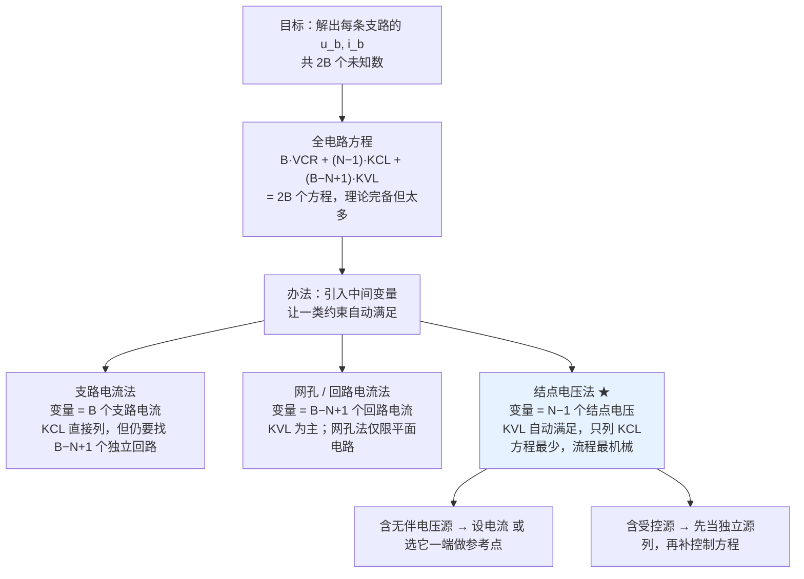

# C3.3 电阻网络的系统分析

> [!abstract] 这一讲的任务
> [[C3.2 电阻网络等效化简]] 的等效法很漂亮，但有天花板：结构复杂、含多个受控源的网络，**怎么换都换不简单**。这一讲走第二条路线——**系统分析 systematic method**：不动网络结构，而是**选好中间变量，机械化地把方程列出来**，列完就是解方程组。
> 主线只有两个方法：**支路电流法**（用来看清"为什么 $2B$ 个方程太多"）和**结点电压法**（本章最实用的方法，方程数 = 结点数 − 1，考试主力）。

> [!info] 怎么读这份讲义
> 建议先读第 1 节（全电路方程）把"方程从哪来、有几个"搞清楚，这是所有系统法的地基；再跟着支路电流法的例题**手算一遍**（它会主动暴露自己的痛点）；然后进入结点电压法，从推导、找规律，到四类例题（普通电路 / 求电源功率 / 无伴电压源 / 受控源）逐层加难度。带 `> [!question]` 处先自己列一遍再展开。

> [!warning] 授课进度说明（截至第 4 次课）
> 已有的课堂语音转写稿覆盖到**第 4 次课**，内容为第 1 章全部 + 第 2 章全部；**第 3 章尚未讲授**。
> 因此本篇内容全部来自**课件与教材**，未经课堂讲解校正。等课上讲到本章后，本篇会按课堂实况做一次合并，并补上「拓展」标注（标出哪些是课堂没讲、仅由课件/教材补充的内容）。

---

## 0. 开场：什么时候"换"解决不了问题

上一讲你练熟了一套手艺：见到串联就相加，见到并联就算电导，见到源就变换，见到桥就 Y-Δ。

现在给你这张图（课件 p.57 的例题）：**5 个结点、8 条支路**，中间横着一个 $2\ \Omega$，上面架着一个 $10\ \Omega$ 跨过整排，还塞了一个 $0.5\ \mathrm{A}$ 电流源横在两个结点之间。

你试着找串联——没有，每个中间结点都挂着第三条支路。你试着找并联——也没有，两两之间总隔着别的结点。你试着做源变换——那个 $0.5\ \mathrm{A}$ 源两端都不是"孤立"的。

**换不动了。**

这时候只剩一条路：**认命，列方程。** 但"列方程"这件事本身还有巧拙之分——课件 p.57 那句话说得很直白："如果用支路电流法求解要解 **8 个联立方程**"；而用结点电压法，同一个电路只要 **4 个**。

**同一张电路图，同一个答案，工作量差一倍。** 差别只在一件事：**你选什么当中间变量。** 这一讲就是在讲这个选择。

---

## 1. 全电路方程：$2B$ 个未知数，$2B$ 个方程（课件 p.38–42）

在挑"巧"的方法之前，得先有一个"笨但一定对"的方法当基准。它叫**全电路方程**。

课件 p.38 先给了动机：等效法"可以有效地将分析对象电路从复杂转化为简单"，"**但是，仅仅使用等效并不能完全解决电路的分析问题**"，"这时必须采用更加系统的方法"。而**系统方法的定义**是（课件 p.38 红字）：

> **通过将电路的拓扑关系和元器件的特性用数学式子表达出来，通过解方程组获得电路的工作状态。**

### 1.1 变量：$2B$ 个

> [!important] 变量数（课件 p.39）
> 设电路有 **$B$ 条支路、$N$ 个结点**，每条支路是一个具有确定 VCR 的元件。
> 分析这个电路，就是求出**每条支路的电压和电流**——其他物理量（功率、电位等）都能从它们导出。
> 因此待定变量共 **$2B$ 个**（$B$ 个支路电压 + $B$ 个支路电流）。

要定 $2B$ 个变量，就需要 **$2B$ 个独立的线性方程**（对线性电路）。它们分两类来。

### 1.2 第一类：元件特性约束（VCR），$B$ 个

每条支路对应一个元件，都有自己的外特性方程（课件 p.40）：

$$f(u_b, i_b)=0,\qquad b=1,2,\cdots,B$$

课件给了三个具体形式：

| 支路类型 | VCR |
|---|---|
| 电阻支路 | $u = Ri$ |
| 电压源支路 | $u = U_S$ |
| 电流源支路 | $i = I_S$ |

注意后两条的"退化"形态：电压源支路的方程里**根本没有 $i$**（电流由外部决定）；电流源支路的方程里**没有 $u$**。这个观察在第 8.2 节的"通用支路方程"里会被统一处理。

### 1.3 第二类：电路拓扑约束（KCL + KVL），$N-1$ 个 + $B-N+1$ 个

**KCL 部分**（课件 p.41）：电路的 $N$ 个结点都受 KCL 约束，但其中**只有 $N-1$ 个是独立的**：

$$\sum_{\text{结点}n} i_k = 0,\qquad n=1,2,\cdots,N-1$$

> [!note] 为什么少一个？（补充）
> 把全部 $N$ 个结点的 KCL 方程相加，每条支路的电流都会出现两次——一次流出它的起点结点（+），一次流入它的终点结点（−）——**全部抵消，得到 $0=0$**。
> 也就是说，第 $N$ 个方程可以由前 $N-1$ 个相加得到，它**不提供新信息**。这就是"只有 $N-1$ 个独立"的原因。
> 这也解释了为什么参考结点（地）**任意选**：被丢掉的那个方程无论是哪一个，剩下的 $N-1$ 个都是独立且完备的。

**KVL 部分**（课件 p.41）：图论指出，具有 $B$ 条支路 $N$ 个结点的电路，**存在且仅存在 $B-N+1$ 个独立回路**，每个独立回路给出一个独立的 KVL 方程：

$$\sum_{\text{回路}l} u_k = 0,\qquad l=1,2,\cdots,B-N+1$$

> [!note] $B-N+1$ 从哪来（补充：图论的一句话）
> 取电路图的一棵**树**（连通、含全部 $N$ 个结点、不含回路的子图）。树恰好有 $N-1$ 条支路，称**树支**；剩下的 $B-(N-1) = B-N+1$ 条叫**连支**。
> 每加入一条连支，就恰好形成**一个**新回路（称**基本回路**），且这个回路里含有该连支——因此它一定与其他基本回路线性无关。于是独立回路数 = 连支数 = $B-N+1$。
> 这个数在电路课里也叫电路的**基本回路数**。你不需要会做图论证明，但要能**数出来**。

### 1.4 合起来：数目正好对上

> [!important] 全电路方程（课件 p.42）
> $$\underbrace{f(u_b,i_b)=0,\ b=1,\cdots,B}_{\text{元件特性约束，}B\ \text{个}}$$
> $$\underbrace{\sum_{\text{结点}n}i_k=0,\ n=1,\cdots,N-1 \qquad \sum_{\text{回路}l}u_k=0,\ l=1,\cdots,B-N+1}_{\text{电路拓扑约束，共 }B\ \text{个}}$$
> 二者又称**电路理论的两类基本约束**。当特性约束为线性（线性电路）时，**电路有唯一解**。

方程总数：$B + (N-1) + (B-N+1) = 2B$ ✓ **恰好等于未知数个数**。

这就是"电路可解"的完整理论保证。你在 [[C3.1 直流稳态与电路分析总览]] 开场那道题里花掉的 15 分钟，就是在解这 $2B$ 个方程。

> [!warning] 但直接解 $2B$ 个方程完全不现实
> 一个只有 6 条支路的小电路就有 12 个未知数。真实电路动辄几十上百条支路。
> 所以全电路方程的价值**不在于"用来解题"，而在于"证明可解，并给出方程数的基准"**。接下来所有方法，都是在**同一套约束下换一组更少的中间变量**——不是绕开约束，而是让某一类约束**自动被满足**，从而不用显式地写出来。

---

## 2. 支路电流法（课件 p.43–49）

### 2.1 思路：把电压先"藏"起来

> [!important] 支路电流法（课件 p.43）
> - 全电路方程直接求解，方程数目太多，需要设法降低。
> - 办法：**采用中间变量，分步求解**。
> - **支路电流法以支路电流为中间变量。**
> - 通过两类约束列写关于**支路电流**的代数方程组；
> - 求解得到支路电流后，再通过元件特性确定各支路电压。

关键动作在第一步：**用 VCR 把支路电压消掉**（课件 p.44）。

$$U_b = R_b I_b + U_{Sb},\qquad b=1,2,\cdots,B$$

这一行做完，$B$ 个支路电压就不再是独立未知数了——它们全被写成了支路电流的函数。**未知数从 $2B$ 个降到 $B$ 个。**

于是只剩两组方程（课件 p.44）：

1. **结点 KCL**（$N-1$ 个）：$\displaystyle\sum_{\text{结点}n} I_{kn}=0$
2. **回路 KVL**（$B-N+1$ 个），且把 $U$ 换成电流表达式：
$$\sum_{\text{回路}l} U_{kl} = \sum_{\text{回路}l}\left(R_b I_b + U_{Sb}\right) = 0$$

方程总数：$(N-1)+(B-N+1) = B$ ✓ 与未知数相同。

### 2.2 电源支路怎么处理（课件 p.45）

> [!important] 电源支路的处理（课件 p.45 原文）
> 1. **电压源支路**：其支路电压为**已知数值**，列写回路方程时**直接使用该电压数值**，不必再表示为支路电流。
> 2. **电流源支路**：需**设定其端电压**，并把端电压作为列方程时的**一个变量**；由于其支路电流为已知数值，列写方程时**直接使用该电流数值**，不再作为变量。

第 2 条要小心：电流源支路会**多引入一个电压变量**（例题里的 $U_A$）。所以严格来说"未知数 = $B$ 个电流"只在无电流源时成立；有电流源时，是用一个已知电流换来一个未知电压，**总数不变**。

### 2.3 受控源支路怎么处理（课件 p.46）

> [!important] 受控源支路的处理（课件 p.46 原文）
> 1. 受控源的支路电压（或电流）是**另一个电压或电流（控制量）的函数**，列写方程时引入了多余的变量，**必须补充方程**。
> 2. 首先把受控源支路**当作独立电源一样**，列写支路电流方程（KCL、KVL 及 VCR）。
> 3. 然后，对每个受控源，**补充一个将其控制量表示为支路电流变量（基本变量）的方程——称为控制方程**。

这个"**先当独立源列，再补控制方程**"的两步法是本章处理受控源的**通用套路**，在结点电压法（第 7 节）里会原样重复一遍。记住这句话，两个方法都能用。

### 2.4 例题：求 $R_4$ 中的电流（课件 p.47–48）

![[C3-支路电流法例题电路.png]]

已知 $R_1=4\ \Omega$，$R_2=20\ \Omega$，$R_3=3\ \Omega$，$R_4=3\ \Omega$，电压源 5 V，电流源 1 A。求 $I_4$。

**数一数**：电路含 **4 个结点**（a、b、c、d）、**6 条支路** → 独立 KCL 有 $4-1=3$ 个，独立 KVL 有 $6-4+1=3$ 个。

**第一步：结点 KCL**（课件 p.47，按图中参考方向）

$$\text{结点 }a:\ I_1+I_3+I_E=0,\qquad \text{结点 }b:\ I_1-I_2-1=0,\qquad \text{结点 }c:\ I_2+I_4+I_E=0$$

把第一式与第三式联立消去 $I_E$，得到课件给的化简结果：

$$I_1-I_2-1=0,\qquad I_1-I_2+I_3-I_4=0$$

> [!note] 为什么要消 $I_E$
> $I_E$ 是流过**理想电压源**那条支路的电流。理想电压源的 VCR 是 $u=U_S$，**根本约束不了自己的电流**，所以 $I_E$ 是个"自由变量"，只能由外部电路决定。既然我们只想要 $I_4$，就用两个方程把它消掉，省一个未知数。
> 这也是理想电压源在所有分析方法里的共同特点：**它给出电压，但它的电流要等其他一切都解完才知道**。

**第二步：回路 KVL**（课件 p.48，三个回路）

$$\text{回路 }abca:\ R_1I_1+R_2I_2-5=0$$
$$\text{回路 }adba:\ R_3I_3-U_A-R_1I_1=0$$
$$\text{回路 }bdcb:\ U_A+R_4I_4-R_2I_2=0$$

注意 $U_A$ 就是 2.2 节说的"电流源端电压"这个新变量。把后两式**相加**即可消掉它（课件的化简）：

$$R_1I_1+R_2I_2-5=0,\qquad R_3I_3-R_1I_1+R_4I_4-R_2I_2=0$$

**第三步：联立求解**。四个方程、四个未知数（$I_1,I_2,I_3,I_4$）：

$$\begin{cases} I_1-I_2 = 1\\ I_1-I_2+I_3-I_4 = 0\\ 4I_1+20I_2 = 5\\ -4I_1-20I_2+3I_3+3I_4 = 0\end{cases}$$

$$\boxed{I_4 = \frac{4}{3}\ \mathrm{A} = 1.333\ \mathrm{A}}$$

> [!example] 复算确认（数值双向验证）
> 解得 $I_1 = 1.0417\ \mathrm{A}$，$I_2 = 0.0417\ \mathrm{A}$，$I_3 = 0.3333\ \mathrm{A}$，$I_4 = 1.3333\ \mathrm{A}$。
> 逐条回代：$I_1-I_2 = 1.0417-0.0417 = 1$ ✓；$4(1.0417)+20(0.0417) = 4.167+0.833 = 5$ ✓；$I_3-I_4 = 0.3333-1.3333 = -1 = -(I_1-I_2)$ ✓。
> 与课件 $I_4 = 4/3 = 1.333\ \mathrm{A}$ 一致 ✓。

> [!warning] 工程精度（课件 p.48 红框，本课程的答题规矩）
> **"工程上要求最后结果必须给出一定精度数值，不允许只给出分数结果。一般计算中保留 3~4 位有效数字。"**
> 所以标准答案是 **$I_4 = 1.333\ \mathrm{A}$**，不是 $4/3$ A。这一条整章通用，[[C3.2 电阻网络等效化简]] 例 2 也适用。

> [!note] 前后呼应
> 这道题在 [[C3.4 线性电路定理]] 会**用叠加定理再算一次**（课件 p.74），三行就出结果。到时候回来对照，你会非常直观地感受到"换角度"能省多少事。

### 2.5 支路电流法的两个痛点（课件 p.49）

> [!warning] 为什么还要继续找更好的方法（课件 p.49 原文）
> 1. **方程数还是太多**：对一个"并不很复杂"的电路，支路电流法列出的方程数**也是相当多，解方程组的工作量太大**。
> 2. **找独立回路没有一般方法**：可以方便地列出独立的结点 KCL 方程，但**要找出 $B-N+1$ 个独立回路来列写独立的 KVL 方程却相对困难**——"使用支路电流法的关键在于寻找出 $B-N+1$ 个独立的回路，**目前尚无特别有效的方法**"。

第 2 条才是致命的。KCL 那边你**照着结点数**就能机械地写；KVL 这边你得**用眼睛在图上找回路**，还得担心找到的三个是不是线性相关。这一步无法自动化，也无法教给计算机。

**结论**：要找一个"KVL 那一半不用手工找"的方法。这就是结点电压法。

---

## 3. 结点电压法（课件 p.50–56）

### 3.1 思路：从电压那一侧下手

先看课件 p.50 对其他候选方法的评价（这段说明了为什么最后选中结点法）：

- 支路电流法：方程多，独立回路难找；
- **网孔电流法：只适用于平面电路（网络），有一定局限性**；
- **回路电流法：普遍适用，但选取独立回路的灵活性也带来不确定性**；解决办法是采用**基本回路**，但那需要先确定树的结构——基于图论的回路法。

三个候选都卡在同一个地方：**回路不好选**。于是课件 p.51 换了个方向：

> [!important] 结点电压法的思路（课件 p.51 原文）
> - 其实也可以**从电压变量的角度**来考虑。
> - 每个元件的 VCR 将支路电压和电流联系起来，因此**可以用支路电压来表示支路电流**。
> - 电路中，每条支路都接在**两个结点之间**，因此**任一支路电压都可以表示为结点电位的差**。
> - 将**结点电压**作为基本变量——**结点电压法**。
>
> 流程：**选参考结点 → 结点电压 → 支路电压 → 支路电流**。

### 3.2 关键：为什么 KVL 自动满足

这是结点电压法真正的魔法所在，也是课件没有明说、但必须理解的一句话：

> [!important] KVL 自动满足（补充：这是全章最值得想明白的一点）
> 一旦选定参考结点、给每个结点赋一个**电位** $U_n$，任何支路电压都写成 $u_{jk} = U_j - U_k$。
> 那么沿任意回路一圈：
> $$(U_a-U_b)+(U_b-U_c)+(U_c-U_a) = 0$$
> **恒等于零，与具体数值无关。**
> 也就是说：**KVL 已经被"电位"这个概念自动编码进去了，永远不可能违反**，所以一个 KVL 方程都不用列。
>
> 于是 $2B$ 个方程里，$B$ 个 VCR（用来把电流写成电压）+ $(B-N+1)$ 个 KVL（自动满足）全部消化掉，**只剩 $N-1$ 个 KCL 要列**。
>
> 顺带解释了为什么"电位"这个概念如此有用——它把"回路电压和为零"这个全局约束，变成了"每个点有一个数"这件局部的事。→ [[C1.2 电路的基本概念]]

方程数对比（这就是选路的全部理由）：

| 方法 | 中间变量 | 方程数 | 需要手工找回路吗 |
|---|---|---|---|
| 全电路方程 | 无 | $2B$ | 要 |
| 支路电流法 | $B$ 个支路电流 | $B$ | **要** |
| 网孔电流法 | $B-N+1$ 个网孔电流 | $B-N+1$ | 不用（但**限平面电路**） |
| 回路电流法 | $B-N+1$ 个回路电流 | $B-N+1$ | 要（选取有随意性） |
| **结点电压法** | **$N-1$ 个结点电压** | **$N-1$** | **不用** |

### 3.3 推导：跟一个具体电路走一遍（课件 p.52–53）

![[C3-结点电压法推导用电路.png]]

电路有 4 个结点 a、b、c、d，取 **d 为参考结点**。

**第一步：列 3 个独立结点的 KCL**（课件 p.52）

$$\text{a}:\ I_{ad}+I_{ab}+I_{ac}=0,\qquad \text{b}:\ I_{db}+I_{ab}-I_{bc}=0,\qquad \text{c}:\ I_{ac}+I_{bc}+I_{dc}=0$$

**第二步：用支路特性 + KVL 把每个电流写成结点电压**（课件 p.52）

$$I_{ad}=\frac{U_a-U_{S1}}{R_1},\qquad I_{ab}=\frac{U_a-U_b}{R_6},\qquad I_{ac}=\frac{U_a-U_c-U_{S2}}{R_2}$$
$$I_{db}=\frac{-U_b-U_{S3}}{R_3},\qquad I_{bc}=\frac{U_b-U_c}{R_4},\qquad I_{dc}=\frac{-U_c-U_{S5}}{R_5}$$

读法：每个电流 = （**起点电位 − 终点电位 − 途中电源升**）/ 该支路电阻。

**第三步：代入、整理**（课件 p.53）

$$\left(\frac1{R_1}+\frac1{R_2}+\frac1{R_6}\right)U_a-\frac1{R_6}U_b-\frac1{R_2}U_c=\frac{U_{S1}}{R_1}+\frac{U_{S2}}{R_2}$$
$$-\frac1{R_6}U_a+\left(\frac1{R_3}+\frac1{R_4}+\frac1{R_6}\right)U_b-\frac1{R_4}U_c=-\frac{U_{S3}}{R_3}$$
$$-\frac1{R_2}U_a-\frac1{R_4}U_b+\left(\frac1{R_2}+\frac1{R_4}+\frac1{R_5}\right)U_c=-\frac{U_{S2}}{R_2}-\frac{U_{S5}}{R_5}$$

> [!question] 停一下，先自己找规律
> 盯着这三个方程看 30 秒，回答三个问题：
> ① 每个方程里，**自己那个结点电压**的系数有什么共同点？
> ② **别人的**结点电压的系数，符号是什么？大小是什么？
> ③ **等号右边**是什么东西？

> [!success]- 想过了再看
> ① 自己的系数 = **接到该结点的所有支路电导之和**，且**恒为正**。
> ② 别人的系数 = **连接这两个结点之间的支路电导之和，取负**。而且明显**对称**：$U_a$ 方程里 $U_b$ 的系数，与 $U_b$ 方程里 $U_a$ 的系数相同（都是 $-1/R_6$）。
> ③ 右边是**流入该结点的电源电流之和**：$U_{S1}/R_1$ 就是那个电压源经源变换后变成的电流源大小。
>
> 你刚刚**自己推出了结点电压方程的通用形式**。下一小节只是给这三条规律起名字。

### 3.4 统一结构：自电导、互电导、电源电流（课件 p.54–55）

$$\boxed{G_{j1}U_1+G_{j2}U_2+\cdots+G_{jj}U_j+\cdots+G_{jN-1}U_{N-1}=I_{jS}}$$

> [!important] 三条规律（课件 p.55 原文）
> 1. **$G_{jj}$ 称为结点 $j$ 的自电导**，它是**所有连接到该结点 $j$ 的支路电导之和**（恒为正）。
> 2. **$G_{jn}$（$n\ne j$）称为结点 $j$ 与结点 $n$ 之间的互电导**，它是**连接在结点 $j$–$n$ 间的支路电导之负值**。如果两个非参考结点之间**没有支路相联，或只有纯电源（理想、受控）支路相连，则互电导为 0**。一般情况有 $G_{jk}=G_{kj}$。
> 3. **$I_{jS}$ 为电路中流进结点 $j$ 的电源支路电流（包括受控电源）之和**。对于电压源形式的电源模型，**应转变为电流源形式**，以便于列写结点电压方程。

> [!warning] 第 2 条里有两个高频考点
> **(a) 互电导为 0 的两种情形**：两结点间没有支路；或者两结点间**只有纯电源支路**（理想电压源、理想受控源，没有串电阻）。为什么？因为互电导是"电导"，纯电源支路的电导没有定义（$R=0$ → $G=\infty$；$R=\infty$ → $G=0$）——这类支路要走第 6、7 节的特殊处理。
> **(b) "一般情况有 $G_{jk}=G_{kj}$"里的"一般"**：这个对称性**只在无受控源时成立**。含受控源时会被破坏（第 7.2 节课件 p.64 有专门的红字强调）。看到"一般"两个字，就要警觉后面有例外。

### 3.5 分析步骤（课件 p.56）

> [!important] 结点电压法分析过程（课件 p.56 原文四步）
> 1. **选取参考结点**；其他结点标号 $1\sim N-1$；将含源支路转化为**电流源与电导并联**的形式（**熟练后可不转化**）。
> 2. 对参考结点以外的各个结点列写结点电压方程：
> $$G_{j1}U_1+G_{j2}U_2+\cdots+G_{jj}U_j+\cdots+G_{jN-1}U_{N-1}=I_{js},\quad j=1,2,\cdots,N-1$$
> 3. **联立求解**这 $N-1$ 个方程，得到结点电压 $U_1,\cdots,U_{N-1}$。
> 4. 根据各支路的连接位置，**用结点电压求出所需支路电压；再根据支路特性确定支路电流**。

> [!note] 参考结点怎么选（补充，能省很多事）
> 理论上任选，但有三条实用偏好：
> 1. **选连接支路最多的结点**——它会让最多的项变成"自电导"，方程往往最整齐；
> 2. **选电路图上已画了接地符号的那个点**——课件的例题都这样；
> 3. **优先选无伴电压源的一端**（第 6 节）——这样另一端的结点电压直接变成已知数，白送一个方程。

---

## 4. 例题 1：五结点电路，求电源功率（课件 p.57–58）

![[C3-结点电压法例题-五结点电路.png]]

题目：电路含 **5 个结点、8 条支路**。若用支路电流法要解 **8 个联立方程**；用结点法求解电源功率。

参考结点已在图中标出（下方接地符号），其余四个结点编号 1–4。

**列方程**（课件 p.58；注意所有电阻先化成电导：$10\ \Omega\to 0.1$，$1\ \Omega\to 1$，$2\ \Omega\to 0.5$，$4\ \Omega\to 0.25$）：

$$\begin{aligned}
\text{结点 1}&: & (1+0.1+0.1)U_1-U_2-0.1U_4 &= 1\\
\text{结点 2}&: & -U_1+(1+1+0.5)U_2-0.5U_3 &= -0.5\\
\text{结点 3}&: & -0.5U_2+(0.5+0.5+0.25)U_3-0.25U_4 &= 0.5\\
\text{结点 4}&: & -0.1U_1-0.25U_3+(0.1+0.25+0.25)U_4 &= 0
\end{aligned}$$

逐项对照第 3.4 节的三条规律：
- 结点 1 的自电导 $1+0.1+0.1$ = 接到结点 1 的三条支路电导（$1\ \Omega$、$10\ \Omega$、$10\ \Omega$）之和 ✓
- 结点 1 与结点 3 之间**没有直接支路** → 方程里没有 $U_3$ 项（互电导为 0）✓
- 右端：结点 1 有 $1\ \mathrm{A}$ 电流源**流入** → $+1$；结点 2 被 $0.5\ \mathrm{A}$ 电流源**流出** → $-0.5$；结点 3 被它**流入** → $+0.5$；结点 4 无电源 → $0$ ✓

**解得**（课件 p.58）：

$$U_1=1.2267\ \mathrm{V},\quad U_2=0.4239\ \mathrm{V},\quad U_3=0.6659\ \mathrm{V},\quad U_4=0.4819\ \mathrm{V}$$

**求电源功率**：

$$P_{1\mathrm A}=-1\times U_1=-1.2267\ \mathrm{W},\qquad P_{0.5\mathrm A}=0.5\times(U_2-U_3)=-0.121\ \mathrm{W}$$

> [!example] 复算确认（数值双向验证）
> 独立解线性方程组，得 $U_1=1.22673$、$U_2=0.42388$、$U_3=0.66594$、$U_4=0.48193\ \mathrm{V}$——与课件四位有效数字**完全一致** ✓
> $P_{1A} = -1\times 1.22673 = -1.2267\ \mathrm{W}$ ✓；$P_{0.5A} = 0.5\times(0.42388-0.66594) = 0.5\times(-0.24206) = -0.12103\ \mathrm{W}$ ✓（课件写 −0.121 W）。

> [!warning] 功率的负号在说什么
> 两个电源的功率都是**负值**。按课件用的是"**发出功率**"的口径（$P = u\cdot i_S$，参考方向相关），负值意味着**这两个电流源实际上在吸收功率**——它们被电路的其余部分"倒灌"了。
> 这在含多个电源的电路里非常常见，**不是算错**。判断有没有算错的方法是查功率守恒：所有元件功率之和为零。→ [[C1.2 电路的基本概念]]

---

## 5. 例题 2：结点法求 $R_3$ 的功率（课件 p.59）

![[C3-结点法求R3功率电路.png]]

已知 $R_1=R_2=R_3=R_4=3\ \Omega$，$U_S=30\ \mathrm{V}$，$I_{S1}=10\ \mathrm{A}$，$I_{S2}=5\ \mathrm{A}$。求 $R_3$ 的功率。

**第一步**：设定参考结点（图中下方接地），非参考结点标为 ①②。

**第二步：列方程**（课件 p.59）

注意 $U_S$ 与 $R_4$ **串联**（有伴电压源），可视为流入结点 1 的电流源 $U_S/R_4$：

$$\text{结点 1}:\ \left(\frac1{R_1}+\frac1{R_3}+\frac1{R_4}\right)U_1-\left(\frac1{R_3}+\frac1{R_4}\right)U_2=I_{S1}+\frac{U_S}{R_4}$$
$$\text{结点 2}:\ -\left(\frac1{R_3}+\frac1{R_4}\right)U_1+\left(\frac1{R_2}+\frac1{R_3}+\frac1{R_4}\right)U_2=-I_{S2}-\frac{U_S}{R_4}$$

代入数值（$1/3$ 为每个电导）：

$$U_1-\frac23U_2=10+10 \quad\Longrightarrow\quad \boxed{3U_1-2U_2=60}$$
$$-\frac23U_1+U_2=-5-10 \quad\Longrightarrow\quad \boxed{-2U_1+3U_2=-45}$$

**第三步：解方程**

$$U_1=18\ \mathrm{V},\qquad U_2=-3\ \mathrm{V}$$

**第四步：求功率**

$$P_{R_3}=\frac{(U_1-U_2)^2}{R_3}=\frac{(18-(-3))^2}{3}=\frac{441}{3}=147\ \mathrm{W}$$

> [!example] 复算确认
> 解 $3U_1-2U_2=60$、$-2U_1+3U_2=-45$：行列式 $9-4=5$，$U_1=(60\cdot3-(-2)(-45))/5=(180-90)/5=18$ ✓，$U_2=(3(-45)-(-2)(60))/5=(-135+120)/5=-3$ ✓。
> $P_{R_3}=(21)^2/3=147\ \mathrm{W}$ ✓。

> [!note] $U_2=-3\ \mathrm{V}$ 的负号说明什么
> 说明结点 ② 的电位**低于参考结点**。这完全正常——结点电压是相对量，参考点定在哪，正负就跟着变。
> 更要注意的是：$R_3$ 两端的电压是 $U_1-U_2 = 21\ \mathrm{V}$，比任何单个结点电压都大。**求元件上的量一定要用差值，不能直接拿某个结点电压去代。**

> [!warning] 这里演示了"有伴电压源"的标准处理
> $U_S$ 串 $R_4$ 是**有伴电压源**：直接按 [[C3.2 电阻网络等效化简]] 第 7 节做源变换，变成 $U_S/R_4 = 10\ \mathrm{A}$ 的电流源并 $R_4$。于是 $1/R_4$ 进自电导和互电导，$U_S/R_4$ 进右端项。
> 熟练之后（课件 p.56 第 1 步说的"熟练后可不转化"），可以**不画变换、直接写**：见到"电压源串电阻"，就往右端加一项 $U_S/R$，并把 $1/R$ 计入电导。
> 那**没有串电阻**的电压源怎么办？下一节。

---

## 6. 无伴电压源怎么处理（课件 p.60–61）

### 6.1 问题在哪

> [!important] 有伴 vs 无伴（课件 p.60 原文）
> 结点电压法列写方程时，**电源的合适形式是电流源**。
> - **有伴电压源**（含串联电阻）：可先等效变换为电流源与电阻并联，再列结点方程。
> - **无伴电压源**（不含串联电阻）：两种办法——
>   1. 先将电压源**视为电流源（假设其流过电流 $i$）**，建立结点方程。由于增加了电流变量，需**补充电压源电压与结点电压关系的方程——电压源方程**。
>   2. 也可**选择参考结点为电压源的一端**，使无伴电压源另一端的结点电压成为**已知**，从而无需再列写该结点的方程求解。

根本原因：结点法的每一项都是"电导 × 电压"，而无伴电压源的电导是 $1/0=\infty$——**写不进方程**。所以要么绕过它（办法 2），要么给它单独设一个电流变量（办法 1）。

### 6.2 例题 3：三个无伴电压源（课件 p.61）

![[C3-无伴电压源的结点法例题.png]]

用结点法求电压 $U$ 和电流 $I$。电路里有 90 V、100 V、110 V 三个电压源，都没有串联电阻。

**关键动作**：参考结点选在**三个电压源共同接的那一端**（图中右下角）。于是（课件 p.61）：

$$u_{n1}=110\ \mathrm{V}\quad(\text{直接由 110 V 源给定})$$
$$u_{n2}=-100\ \mathrm{V}\quad(\text{直接由 100 V 源给定，注意极性})$$

**两个结点电压白送**，一个方程都不用列！只剩结点 3 需要列方程（那里有 $20\ \mathrm{A}$ 电流源和两个 $2\ \Omega$）：

$$-0.5u_{n1}+(0.5+0.5)u_{n3}=20$$

$$u_{n3}=\frac{20+0.5\times 110}{1}=20+55=75\ \mathrm{V}$$

**回代求所问的量**：

$$U=u_{n3}-u_{n2}+1\times 20=75-(-100)+20=195\ \mathrm{V}$$
$$I=\frac{u_{n2}-u_{n1}+90}{1}=\frac{-100-110+90}{1}=-120\ \mathrm{A}$$

> [!example] 复算确认
> $u_{n3}=20+0.5(110)=75$ ✓；$U=75+100+20=195\ \mathrm{V}$ ✓；$I=(-100-110+90)/1=-120\ \mathrm{A}$ ✓。

> [!warning] 这题的三个要点
> 1. **参考结点选对，题目直接崩溃了一半**。三个无伴电压源共用一端 → 选那一端做参考，三个结点电压里有两个立刻已知。这就是 6.1 节的办法 2，能用就用。
> 2. **$u_{n2}=-100\ \mathrm{V}$ 的负号来自电源极性**。图中 100 V 源的 "−" 端接结点 2、"+" 端接参考点，所以结点 2 的电位比参考点低 100 V。**列这类式子时务必按图看极性，不要凭感觉写正号。**
> 3. **回代时不要漏掉支路上的电源升**。$U$ 的表达式里那个 "$+1\times 20$" 是 $20\ \mathrm{A}$ 电流源流过 $1\ \Omega$ 造成的电压降；$I$ 的表达式里的 "$+90$" 是 90 V 电源的升。**结点电压给的是"两点间总电压"，具体支路上的量还要按该支路的元件构成算。**

---

## 7. 含受控源的结点方程（课件 p.62–66）

### 7.1 规则：还是那两步

> [!important] 含受控源电路的结点方程（课件 p.62 原文）
> 与建立网孔方程相似，列写含受控源电路的结点方程时：
> 1. 先将受控源**当作独立电源处理**，列写结点方程组，列写的方程中含有受控电源的**控制变量**；
> 2. **补充**将受控源的控制变量**用结点电压表示**的**控制方程**。
>
> 红字强调：**等效变换过程中必须保证控制变量不丢失！**

那句红字很重要：如果你在化简时把控制量所在的那条支路"等效掉"了，受控源的控制量就没有依托了，方程再也写不对。**含受控源的电路做等效变换时，控制量所在的支路必须保留。**

### 7.2 例题 4：受控电流源，互电导为什么不再对称（课件 p.63–64）

![[C3-含受控电流源的结点方程电路.png]]

列出图示电路的结点方程。电路有电流源 $i_S$、电导 $G_1$、$G_2$、$G_3$，以及一个受控电流源 $gu_3$（$u_3$ 是 $G_3$ 两端的电压）。

**第一步：把 $gu_3$ 当独立电流源，照常列**（课件 p.63）

$$(G_1+G_3)u_1-G_3u_2=i_S$$
$$-G_3u_1+(G_2+G_3)u_2=-gu_3$$

**第二步：补充控制方程**——把控制量 $u_3$ 用结点电压表示：

$$u_3=u_1-u_2$$

**第三步：代入合并**（课件 p.64）

$$(G_1+G_3)u_1-G_3u_2=i_S$$
$$-G_3u_1+(G_2+G_3)u_2=-g(u_1-u_2)$$

整理右边的受控项到左边：

$$\boxed{(g-G_3)u_1+(G_2+G_3-g)u_2=0}$$

> [!warning] 受控源破坏了对称性（课件 p.64 原文，必考辨析）
> **"由于受控源的影响，互电导 $G_{21}=(g-G_3)$ 与互电导 $G_{12}=-G_3$ 不再相等。自电导 $G_{22}=(G_2+G_3-g)$ 不再是结点 ② 全部电导之和。"**
>
> 这条打破了第 3.4 节的两条"规律"：
> - $G_{jk}=G_{kj}$（对称性）——**失效**；
> - 自电导 = 该结点全部电导之和且恒正——**失效**（$G_2+G_3-g$ 甚至可能是负的）。
>
> **实践含义**：含受控源时，**不能用"看图直接填系数"的速写法**，必须老实走"当独立源列 → 补控制方程 → 代入整理"三步。速写法只对纯电阻 + 独立源的电路成立。
> 这也从数学上呼应了 [[C3.2 电阻网络等效化简]] 的负电阻：受控源能让"电导"变负，因为它能向电路注入能量。

### 7.3 例题 5：综合题，受控电压源 + 受控电流源（课件 p.65–66）

![[C3-含受控源结点方程综合例题电路.png]]

已知 $g=2\ \mathrm{S}$，求结点电压和受控电流源发出的功率。电路里有：$6\ \mathrm{A}$ 独立电流源、四个 $1\ \Omega$、一个**受控电压源 $0.5u_4$**（跨接在结点 ① 和 ③ 之间，无伴）、一个**受控电流源 $gu_2$**。

**第一步：把两个受控源都当独立源列方程**（课件 p.65）

注意 $0.5u_4$ 是**无伴受控电压源**，按第 6 节的办法 1：设它流过的电流为 $i$，作为一个新变量出现在方程里。

$$\begin{aligned}
\text{结点 ①}&: & (2\,\mathrm S)u_1-(1\,\mathrm S)u_2 &= 6\,\mathrm A-i\\
\text{结点 ②}&: & -(1\,\mathrm S)u_1+(3\,\mathrm S)u_2-(1\,\mathrm S)u_3 &= 0\\
\text{结点 ③}&: & -(1\,\mathrm S)u_2+(2\,\mathrm S)u_3 &= gu_2+i
\end{aligned}$$

**第二步：补充控制方程**（课件 p.65）

无伴受控电压源两端的电位差 = 它的电压：

$$u_1-u_3=0.5u_4=0.5(u_2-u_3)$$

> [!question] 课堂追问（课件 p.65 右下角红字）：为什么受控电流源不需要补充控制方程？
> 电路里有两个受控源，为什么只给受控**电压源**补了一个方程，受控**电流源** $gu_2$ 却什么都不用补？

> [!success]- 答案
> 因为它的控制量 **$u_2$ 本身就是一个结点电压**——它已经是方程组的基本变量了，不需要再"翻译"。
> 而受控电压源的控制量 $u_4$ 是 $1\ \Omega$ 两端的**支路电压**，不是基本变量，所以必须补一句 $u_4=u_2-u_3$ 把它翻译成结点电压。
> **判据一句话：控制量若已是结点电压（或其差已直接出现），无需补方程；否则必须补。**
> 顺带一提，无伴受控**电压源**还额外引入了电流变量 $i$，所以这道题实际是"4 个方程解 4 个未知数（$u_1,u_2,u_3,i$）"。

**第三步：代入 $g=2\ \mathrm S$，消去 $i$，整理**（课件 p.66）

把结点 ① 和 ③ 的方程**相加**即可消去 $i$：

$$\begin{cases}2u_1-4u_2+2u_3=6\ \mathrm V\\ -u_1+3u_2-u_3=0\\ u_1-0.5u_2-0.5u_3=0\end{cases}$$

$$\boxed{u_1=4\ \mathrm V,\quad u_2=3\ \mathrm V,\quad u_3=5\ \mathrm V}$$

**第四步：求受控电流源发出的功率**

$$p=u_3\,(g u_2)=5\times 2\times 3=30\ \mathrm{W}$$

> [!example] 复算确认
> 代回：$2(4)-4(3)+2(5)=8-12+10=6$ ✓；$-4+9-5=0$ ✓；$4-1.5-2.5=0$ ✓。
> 控制方程校验：$u_1-u_3=4-5=-1$；$0.5(u_2-u_3)=0.5(3-5)=-1$ ✓。
> 功率：$gu_2=2\times3=6\ \mathrm A$，$p=5\times6=30\ \mathrm W$ ✓。

---

## 8. 系统方法总览与通用支路方程（课件 p.67–68）

### 8.1 五种方法的横向对比（课件 p.67 原表）

| 分析方法 | 中间变量 | 核心方程 | 过渡方程 | 需要处理的问题 |
|---|---|---|---|---|
| 全电路方程 | 无 | VCR、KCL、KVL | 无 | 独立回路选择、受控电源 |
| 支路电流法 | $B$ 个支路电流 | KCL: $\sum i_b=0$；KVL: $\sum(u_{Sb}+R_bi_b)=0$ | 无 | 独立回路选择、电流源、受控电源 |
| 网孔电流法 | $B-N+1$ 个网孔电流 | KVL: $\sum_{k}R_{jk}i_{mk}=u_{jS}$ | $i_b=i_{mj}-i_{mk}$ | 电流源、受控电源 |
| 回路电流法 | $B-N+1$ 个回路电流 | KVL: $\sum_k R_{jk}i_{lk}=u_{jS}$ | $i_b=\sum i_{lk}$ | 独立回路选择、电流源、受控电源 |
| **结点电压法** | **$N-1$ 个结点电压** | **KCL: $\sum_k G_{jk}u_{nk}=i_{jS}$** | $u_b=u_{nj}-u_{nk}$ | **电压源、受控电源** |

> [!important] 怎么选（本表的实战读法）
> - 三列信息各有用处：**中间变量**决定方程数；**核心方程**告诉你在哪列（结点上列 KCL，回路上列 KVL）；**需要处理的问题**告诉你这个方法的"过敏源"。
> - **结点法怕电压源，回路/网孔法怕电流源**——这是一对完美的对偶。所以实战判据：
>   - 电路里**电流源多、结点少** → 结点电压法；
>   - 电路里**电压源多、网孔少**，且是平面电路 → 网孔电流法。
> - **受控源是所有方法的共同麻烦**（表格最后一列每一行都有它），处理办法也一样：当独立源列 + 补控制方程。
> - 本课程重点掌握**结点电压法**：适用范围最广（不限平面）、方程数最少、流程最机械化。

### 8.2 通用支路方程：一个式子概括所有支路（课件 p.68）

![[C3-通用支路方程模型.png]]

课件最后给了一个"万能支路"模型：一个电阻 $R$ 串一个电压源 $u_S$，再并上一个电流源 $i_S$。它的外特性是：

$$\boxed{u=u_S+R\,(i-i_S)}$$

调节三个参数，就能退化出所有常见支路类型（课件 p.68 右侧列表）：

| 参数取值 | 退化为 |
|---|---|
| $u_S=0$ 且 $i_S=0$ | **电阻支路**（$u=Ri$） |
| $R=0$ | **无伴电压源支路**（$u=u_S$） |
| $R=\infty$ | **无伴电流源支路**（$i=i_S$） |
| $u_S=0$ | **有伴电流源支路**（电流源并电阻） |
| $i_S=0$ | **有伴电压源支路**（电压源串电阻） |

> [!note] 为什么要一个通用式子（补充）
> 三个用途，一个比一个重要：
> 1. **理论上**：它证明了前面所有"特殊情形"其实是同一个模型的参数退化，不是五种独立的规则。
> 2. **教学上**：它把源变换（$u_S=Ri_S$）、无伴/有伴的区别，统一在一个式子里——你只要盯住 $R=0$ 还是 $R=\infty$。
> 3. **工程上**：这正是 **SPICE 等电路仿真软件**的做法。计算机不会"看图找串并联"，它把每条支路都装进这个统一模板，于是整个电路的方程可以写成矩阵形式 $\mathbf{G}\mathbf{U}=\mathbf{I}_S$，一次 LU 分解解完。
> 你以后跑 LTspice、做器件建模，或者在 PyTorch 里搭一个可微分电路仿真器，用的都是这一个式子加上第 3.4 节的自电导/互电导规则。这就是"**改进结点分析法 MNA**"的起点。

> [!question] 停一下，试一下这个式子
> 用 $u=u_S+R(i-i_S)$ 退化出"无伴电流源支路"，需要令什么？退化后的方程长什么样？

> [!success]- 想过了再看
> 令 $R\to\infty$。此时若 $i\ne i_S$，$u$ 会趋于无穷——物理上不可能，所以必然 $i=i_S$，而 $u$ 由外电路任意决定。
> 这正是理想电流源的外特性：**电流被钉死，电压自由**。同理 $R=0$ 时得 $u=u_S$，电压被钉死、电流自由——理想电压源。
> 顺带看出**为什么无伴源在结点法/回路法里都是麻烦**：它们对应的是 $R$ 取了极端值（$0$ 或 $\infty$），而方程里要用的是 $G=1/R$ 或 $R$ 本身——总有一个会发散。

---

## 这一讲的三句话

1. **任何电路都由 $2B$ 个方程唯一确定**（$B$ 个 VCR + $N-1$ 个 KCL + $B-N+1$ 个 KVL）。所有"聪明方法"都不是绕开这些约束，而是**换一组中间变量，让某一类约束自动满足**。
2. **结点电压法是本章主力**：以结点电压为变量，**KVL 自动满足**（因为电位差沿回路必然抵消），只需列 $N-1$ 个 KCL。系数有固定规律：**自电导取正（该结点全部电导之和），互电导取负（两结点间电导），右端是流入该结点的电源电流**。
3. **两类特殊情形要单独处理**：**无伴电压源**（选它一端做参考点，或设电流变量 + 补电压源方程）；**受控源**（先当独立源列，再补控制方程；且**对称性和"自电导为正"都会失效**）。

**速查表**

| 项目 | 结论 |
|---|---|
| 独立 KCL 数 | $N-1$（第 $N$ 个是前面的和，不独立） |
| 独立 KVL 数 | $B-N+1$（= 连支数 = 基本回路数） |
| 全电路方程数 | $2B$ |
| 支路电流法方程数 | $B$ |
| 网孔/回路电流法方程数 | $B-N+1$ |
| **结点电压法方程数** | **$N-1$** |
| 自电导 $G_{jj}$ | 接到结点 $j$ 的全部支路电导之和，**正** |
| 互电导 $G_{jn}$ | 结点 $j$–$n$ 间支路电导之**负值**；无支路或纯电源支路则为 0 |
| 右端项 $I_{jS}$ | **流入**结点 $j$ 的电源支路电流之和（含受控源） |
| 有伴电压源 | 源变换：右端 $+U_S/R$，且 $1/R$ 计入电导 |
| 无伴电压源 | ①选其一端为参考点 ②设电流 $i$ + 补电压源方程 |
| 受控源 | 当独立源列 + 补控制方程；**$G_{jk}\ne G_{kj}$，自电导可能为负** |
| 通用支路方程 | $u=u_S+R(i-i_S)$；$R=0$ 无伴压源，$R=\infty$ 无伴流源 |
| 答题精度 | 保留 **3~4 位有效数字**，不写分数（课件 p.48） |

**下一讲预告**：到目前为止，我们要么换网络，要么列方程——**都是在"解整个电路"**。但如果题目只问一条支路呢？如果只问"负载取多大时功率最大"呢？下一讲的四个定理，每一个都在回答同一个问题：**能不能不解整个电路，就拿到我要的那个量？** 答案是能，而且往往三行就够。→ [[C3.4 线性电路定理]]

---

## 本节自测 Self-Test

> [!question] Q1：一个电路有 $B=12$ 条支路、$N=7$ 个结点。全电路方程、支路电流法、结点电压法各要列多少个方程？

> [!success]- 答案
> 全电路方程：$2B=24$ 个（VCR 12 + KCL 6 + KVL 6）。
> 支路电流法：$B=12$ 个（KCL 6 + KVL 6）。
> 结点电压法：$N-1=6$ 个。
> （网孔/回路电流法：$B-N+1=6$ 个。）

> [!question] Q2：为什么 $N$ 个结点只有 $N-1$ 个独立的 KCL 方程？

> [!success]- 答案
> 把全部 $N$ 个结点的 KCL 相加，每条支路电流在其两端结点各出现一次、符号相反，全部抵消，得到恒等式 $0=0$。故第 $N$ 个方程可由前 $N-1$ 个导出，不独立。这也解释了参考结点可以任选。

> [!question] Q3：结点电压法为什么完全不需要列 KVL 方程？

> [!success]- 答案
> 因为一旦用结点电位表示支路电压（$u_{jk}=U_j-U_k$），沿任意回路求和必然恒等于零：$(U_a-U_b)+(U_b-U_c)+(U_c-U_a)=0$，与数值无关。**KVL 已被"电位"这个概念自动编码**，不可能违反。

> [!question] Q4：互电导为什么带负号？什么情况下互电导为 0？

> [!success]- 答案
> 负号来自 KCL 的推导：结点 $j$ 流向结点 $n$ 的电流是 $(U_j-U_n)G$，展开后 $U_n$ 前面自然带负号。
> 互电导为 0 的两种情形（课件 p.55）：① 两个非参考结点之间**没有支路相联**；② 两者之间**只有纯电源支路**（理想电压源或理想受控源，无串联电阻）。

> [!question] Q5：无伴电压源为什么不能像有伴电压源那样直接做源变换？两种处理办法是什么？

> [!success]- 答案
> 源变换要求 $i_S=u_S/R$，无伴电压源的 $R=0$，会**除零发散**。
> 两种办法（课件 p.60）：① **选电压源的一端作参考结点**，另一端的结点电压直接成为已知值（首选，最省事）；② 把它**视为电流源、假设流过电流 $i$**，多一个变量，再**补充一个"电压源电压 = 两端结点电压之差"的电压源方程**。

> [!question] Q6：含受控源时，为什么互电导可能不对称（$G_{12}\ne G_{21}$）？还有哪条规律同时失效？

> [!success]- 答案
> 因为把控制方程代入后，受控源项会**只加到某一个结点方程**的某一侧，破坏了原本由"同一条支路两端对称出现"造成的对称性。
> 同时失效的还有"**自电导 = 该结点全部电导之和且为正**"——课件 p.64 的例子里 $G_{22}=G_2+G_3-g$，可能变负。
> 后果：**含受控源时不能用看图速写系数的方法**，必须走"当独立源列 + 补控制方程 + 整理"三步。

> [!question] Q7：什么时候受控源需要补控制方程，什么时候不需要？

> [!success]- 答案
> 判据：**控制量是不是已经是基本变量**。
> 在结点电压法中，若控制量本身就是某个结点电压（或直接就是两个结点电压之差且已在方程中出现），则不需要补；若控制量是某条支路的电压/电流（不是基本变量），就必须补一个把它翻译成结点电压的控制方程。课件 p.65 的例子：$gu_2$ 中 $u_2$ 是结点电压 → 不补；$0.5u_4$ 中 $u_4$ 是支路电压 → 必须补 $u_4=u_2-u_3$。

> [!question] Q8：支路电流法最致命的缺点是什么？为什么结点电压法没有这个毛病？

> [!success]- 答案
> 致命缺点：**找 $B-N+1$ 个独立回路来列 KVL 没有一般方法**（课件 p.49 原文："目前尚无特别有效的方法"），无法机械化、无法自动化。
> 结点电压法根本不需要找回路：参考结点任选，其余结点逐个列 KCL，方程数唯一确定为 $N-1$，流程完全机械。

> [!question] Q9：网孔电流法的局限是什么？回路电流法呢？

> [!success]- 答案
> 网孔电流法：**只适用于平面电路**（能画成无交叉的图），非平面电路无"网孔"可言（课件 p.50）。
> 回路电流法：普遍适用，但**独立回路的选取有随意性**，带来不确定性；要系统化必须先取树、用基本回路（基于图论的回路法）。

> [!question] Q10：通用支路方程 $u=u_S+R(i-i_S)$ 怎么退化出"有伴电流源支路"？

> [!success]- 答案
> 令 $u_S=0$，得 $u=R(i-i_S)$，即"电流源 $i_S$ 与电阻 $R$ 并联"的外特性。
> 对照：$i_S=0$ 得 $u=u_S+Ri$，是"电压源串电阻"（有伴电压源）；两者通过 $u_S=Ri_S$ 互相转换——**源变换在这个统一式子里只是参数换算**。

---

**上一节 ←** [[C3.2 电阻网络等效化简]]
**下一节 →** [[C3.4 线性电路定理]]
**课程索引 →** [[电路基础 MOC]]
