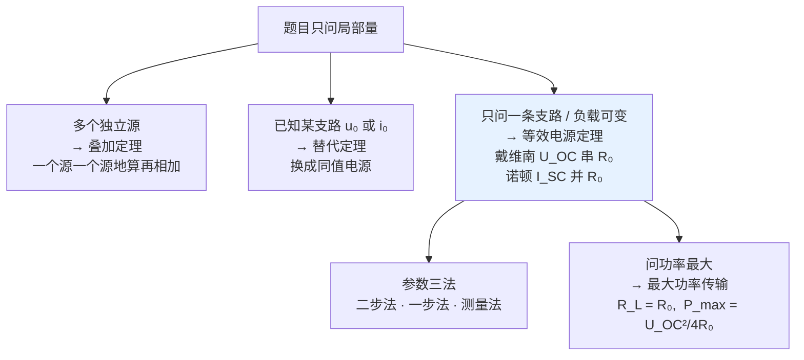

# C3.4 线性电路定理

> [!abstract] 这一讲的任务
> [[C3.2 电阻网络等效化简]] 换网络，[[C3.3 电阻网络的系统分析]] 列方程——两条路都能把电路解出来，但**都是在解"整个电路"**。
> 如果题目只问**一条支路**呢？只问"**负载多大时功率最大**"呢？这一讲走第三条路线：**电路定理 theorem of circuit system**——叠加、替代、等效电源（戴维南/诺顿）、最大功率传输。它们既不把网络换完，也不把方程列完，而是**换一个角度看问题**，常常两三步就出结果。
> 这一讲也是本章**考试权重最大**的一节。

> [!info] 怎么读这份讲义
> 四个定理都按"**引入 → 表述 → 例题**"推进，建议逐个吃透再往下。戴维南/诺顿是绝对重点，其参数求取的**三种方法**（二步法、一步法、测量法）必须都会。最后两个综合例题演示"多个定理组合出拳"，是期末大题的典型形态。带 `> [!question]` 处先自己想再展开。

> [!warning] 授课进度说明（截至第 4 次课）
> 已有的课堂语音转写稿覆盖到**第 4 次课**，内容为第 1 章全部 + 第 2 章全部；**第 3 章尚未讲授**。
> 因此本篇内容全部来自**课件与教材**，未经课堂讲解校正。等课上讲到本章后，本篇会按课堂实况做一次合并，并补上「拓展」标注（标出哪些是课堂没讲、仅由课件/教材补充的内容）。

---

## 0. 开场：一道你已经做过两遍的题

课件 p.74 的题目和 [[C3.3 电阻网络的系统分析]] 第 2.4 节那道**一模一样**：$E_1=5\ \mathrm V$、$I_S=1\ \mathrm A$、$R_1=4\ \Omega$、$R_2=20\ \Omega$、$R_3=R_4=3\ \Omega$，求 $R_4$ 中的电流。

上一讲你是这样做的：4 个结点、6 条支路，列 3 个 KCL、3 个 KVL，消掉 $I_E$ 和 $U_A$，联立四元一次方程组，解出 $I_4=1.333\ \mathrm A$。**十来分钟。**

这一讲你会这样做：

$$I'=\frac{E_1}{R_3+R_4}=\frac56\ \mathrm A,\qquad I''=\frac{R_3}{R_3+R_4}I_S=\frac12\ \mathrm A,\qquad I=I'+I''=\frac86=1.333\ \mathrm A$$

**三行。**

> [!question] 停一下，先自己想想
> 这三行凭什么成立？为什么可以"一个电源一个电源地算，然后把结果加起来"？
> 更要命的是——如果这条规则成立，那**功率**能不能也这么加？$P = P' + P''$？

> [!success]- 想过了再看
> 它成立的唯一理由是**线性**：解电路的方程组是线性方程组，解对激励必然是线性的。这一节第 1 节会把这句话写成公式。
> 而功率**绝对不能**这么加。原因也在于线性：$I=I'+I''$ 是线性的，但 $P=I^2R=(I'+I'')^2R = I'^2R + I''^2R + 2I'I''R$——**多出一个交叉项**。第 5.1 节有一道课件专门设计的例题来演示这件事，那也是这一讲最经典的陷阱。
> 记住这个判据：**能叠加的是"与激励成线性关系"的量（电压、电流），不是它们的乘积或平方。**

---

## 1. 叠加定理 Superposition（课件 p.70–74）

### 1.1 引入：先用等效法算一遍，再拆开看（课件 p.70–71）

![[C3-叠加定理引入电路.png]]

电路：$U_S$ 串 $R_1$，一个 $I_S$，$R_2$ 与 $R_L$ 并联，要求响应电压 $U$。

**先用等效法**（课件 p.70）：把三个电阻并联，两个源合并成流入的净电流，得

$$U=(R_1\|R_2\|R_L)\left(\frac{U_S}{R_1}-I_S\right)=\underbrace{\frac{R_2\|R_L}{R_1+R_2\|R_L}\cdot U_S}_{\text{只与 }U_S\text{ 有关}}-\underbrace{(R_1\|R_2\|R_L)\cdot I_S}_{\text{只与 }I_S\text{ 有关}}$$

**看这个结果**：它**天然地裂成了两项**，一项只含 $U_S$，一项只含 $I_S$，而且各自与对应的电源**成正比**。课件 p.70 最后一句就是这个观察：**"响应包括两个部分，分别与电路中的两个理想电源成正比。"**

**再验证一遍**（课件 p.71）：

![[C3-叠加定理单电源保留电路.png]]

$$\text{只保留 }U_S\ (\text{令 }I_S=0,\text{ 即开路}):\quad U_1=\frac{R_2\|R_L}{R_1+R_2\|R_L}\cdot U_S$$
$$\text{只保留 }I_S\ (\text{令 }U_S=0,\text{ 即短路}):\quad U_2=-(R_1\|R_2\|R_L)\cdot I_S$$

$$\boxed{U=U_1+U_2}\quad\checkmark$$

两条路殊途同归。**不是巧合。**

> [!important] 置零怎么"零"（这一条必须秒答）
> - **独立电压源置零 → 用短路代替**（$u=0$，正是短路的定义）
> - **独立电流源置零 → 用开路代替**（$i=0$，正是开路的定义）
> - **受控源保留在每个分电路中**（课件 p.73 原文："受控源保留在各分电路中"）
>
> 为什么受控源不能置零？因为它**不是激励**，是电路的一部分（一个由其他量决定的元件）。置零它等于把电路结构改了。同样的道理，[[C3.2 电阻网络等效化简]] 求入端电阻时受控源也保留。

### 1.2 一般形式：线性决定一切（课件 p.72）

> [!important] 为什么必然能叠加（课件 p.72 原文）
> 线性含源电路中若含多个理想电源 $U_{S1},\cdots,U_{SN}$；$I_{S1},\cdots,I_{SM}$，则电路的响应是**所有理想电源共同作用的结果**。
> **由于电路的线性，求解电路响应的方程组必为线性方程组**，因此求解结果具有下面形式：
> $$\boxed{U=\sum_{n=1}^{N}a_n U_{Sn}+\sum_{m=1}^{M}r_m I_{Sm}}$$
> 其中的**每一项恰为电路只保留一个理想电源（其他理想电源置零）时的响应**。

这一段是整个叠加定理的**证明**，只有一句话：线性方程组的解，一定是各个"自由项"（也就是电源）的**线性组合**。系数 $a_n$（无量纲）、$r_m$（量纲是电阻）只由电路的电阻和拓扑决定，与电源大小无关。

### 1.3 定理表述（课件 p.73）

> [!important] 叠加定理（课件 p.73 红框原文）
> **在任何线性电路中，当有多个理想电源共同激励时，电路的总响应可以分解成各个理想电源单独激励电路时产生的响应之和（叠加）。**
>
> 应用要点（课件 p.73）：
> - 分别求解每个独立电源单独激励的响应，然后叠加起来；
> - **叠加时注意方向，即各分量的 "+" "−" 号**；
> - 求解每个独立电源单独激励的响应时，**其他独立电源必须置零**——独立电压源用**短路**代替、独立电流源用**开路**代替，只保留激励独立电源一个；
> - **受控源保留在各分电路中**。

> [!note] 叠加定理更深的贡献（课件 p.73 红字）
> 课件专门用红字写了一句："**叠加定理对电路理论的贡献还在于，不同信号源作用于电路时，电路响应中的不同成分可以分开分析。这是电路频率分析的理论基础。**"
>
> 这句话的分量比它看起来重得多，它是后面两章的地基：
> - **第 4 章**：一个非正弦周期信号可以用傅里叶级数拆成许多不同频率的正弦分量。凭什么能"逐个频率算完再加起来"？**凭叠加定理**。→ [[C4.5 非正弦周期电路的谐波分析]]
> - **信号与系统 / 你的 AI 专业**：线性时不变（LTI）系统的全部理论——冲激响应、卷积、频率响应——都建立在"叠加"这一条性质上。你以后学卷积神经网络时会看到，卷积层之所以是"线性层"，用的正是同一个性质。→ [[C5.5 阶跃冲激与卷积积分]]

### 1.4 例题：叠加定理求 $R_4$ 的电流（课件 p.74）

![[C3-叠加定理例题电路.png]]

已知 $E_1=5\ \mathrm V$、$I_S=1\ \mathrm A$、$R_1=4\ \Omega$、$R_2=20\ \Omega$、$R_3=3\ \Omega$、$R_4=3\ \Omega$，求 $R_4$ 中的电流。

**分电路 ①：电压源单独激励**（$I_S$ 开路）

$I_S$ 开路后，$R_1$、$R_2$ 那条支路悬空不成回路，电流只在 $E_1$–$R_3$–$R_4$ 的回路里走：

$$I'=\frac{E_1}{R_3+R_4}=\frac{5}{3+3}=\frac56\ \mathrm A$$

**分电路 ②：电流源单独激励**（$E_1$ 短路）

$E_1$ 短路后，$I_S$ 面对的是 $R_3$ 与 $R_4$，用**分流公式**（注意是"对面电阻占比"）：

$$I''=\frac{R_3}{R_3+R_4}I_S=\frac{3}{3+3}\times 1=\frac12\ \mathrm A$$

**叠加**：

$$I=I'+I''=\frac56+\frac12=\frac{8}{6}\ \mathrm A=1.333\ \mathrm A$$

> [!example] 与上一讲对照
> 支路电流法的结果是 $I_4=4/3=1.333\ \mathrm A$（[[C3.3 电阻网络的系统分析]] 第 2.4 节，四元一次方程组）。**完全一致** ✓
> 工作量对比：四元方程组 vs. 两个单回路的除法。**这就是"换角度"的价值。**

> [!warning] 叠加时最容易错的地方：符号
> 两个分量必须**投影到同一个参考方向**上再相加。本题两个分量恰好同向，所以是加号。
> 如果 $I_S$ 的方向反过来，第二项就是 $-1/2$，总电流变成 $1/3\ \mathrm A$。
> **做法**：在原图上先画好待求量的参考方向，每个分电路都对照这个方向判正负，最后代数相加。**不要"算完两个正数就相加"。**

---

## 2. 替代定理 Substitution（课件 p.75–79）

### 2.1 引入：工作点 Q（课件 p.75）

![[C3-替代定理的N与N1及工作点Q.png]]

> [!important] 场景（课件 p.75 原文）
> 替代定理是**存在唯一解的集总参数电路（线性和非线性）普遍适用**的基本定理，在电子技术领域应用十分广泛。
> 电路中的一个二端网络 $N_1$（可以是一条简单支路，也可以是一个电路部分）与电路 $N$ 构成了具有唯一解的集总参数电路。
> 已经知道端口电压、电流为 $u_0$ 和 $i_0$，说明 **$N$ 和 $N_1$ 的端口电压电流关系曲线相交于工作点 $Q(u_0,i_0)$**。

这张 $u$–$i$ 平面的图是理解替代定理的钥匙：**两个网络各自有一条外特性曲线，电路的实际工作状态就是这两条曲线的交点 $Q$。**

> [!note] 这张图你见过（补充：与第 1、2 章的呼应）
> "两条外特性曲线求交点"正是 [[C1.3 电路模型]] 和 [[C2.2 单端口器件的电路模型]] 里求二极管静态工作点的**图解法**：一条是二极管的指数曲线，一条是电源支路的负载线，交点就是 $Q$。
> 替代定理说的其实是：**只要交点不动，把其中一条曲线换成任何别的、只要仍然过这一点的曲线，另一边什么都不会变。**

### 2.2 定理表述（课件 p.76–77）

![[C3-替代定理的N1替代示意.png]]

推理链条（课件 p.76）：

> 二端网络的端口电压、电流之间受到本身特性约束，**相互不独立**：只要 $N$ 保持不变，工作点上电压和电流就不能任意变化，**一旦电压确定，电流也就随之确定，反之亦然**。
> 如果用另一个二端电路结构 $N'_1$ 替代 $N_1$，能保证替代后的 $N'_1$ **电压电流关系特性曲线过 $Q$ 点**，则 $N$ 的内部工作就不会改变。

而最简单的"过 Q 点"的结构是什么？**一个电源**：

> [!important] 替代定理（课件 p.77 红字原文）
> **如果 $N_1$ 的端口电压、电流 $u_0$ 和 $i_0$ 已知，则用（1）数值为 $u_0$ 的电压源，或（2）数值为 $i_0$ 的电流源替代 $N_1$，电路其余部分 $N$ 的各处工作状态不会改变。**

> [!warning] 替代定理 ≠ 等效电路（课件 p.77，必考辨析）
> 课件专门用两条对比来讲这个区别：
> - **替代定理**是在**电路固定的前提下**，替代一个**已知端口电压电流**的分支，对其他部分进行分析；
> - **等效电路**方法**并不要求**被替换部分的端口电压电流已知，两者的等效可以适用于**各种电路结构**，并不局限于固定的电路。
>
> 用一句话记：
> - **等效**：换掉的东西对**任何**外电路都表现一致 → **一条曲线换成同一条曲线**；
> - **替代**：换掉的东西只在**这一个**电路里表现一致 → **一条曲线换成另一条只在 Q 点相交的曲线**。
>
> 后果：换了外电路，等效仍然成立，**替代立刻失效**（工作点变了，$u_0$、$i_0$ 也变了）。
> 另一个关键差别：**替代定理对非线性电路也成立**（课件 p.75 明说"线性和非线性"），因为它只用到"唯一解"这个前提，不用线性；而叠加定理、戴维南定理**只对线性电路成立**。

### 2.3 例题：已知支路电流，反求电阻（课件 p.78）

![[C3-替代定理例题-用电流源替代电阻.png]]

已知电流 $I=0.2\ \mathrm A$（流过待求电阻 $R$），求 $R$ 的阻值。

**难点在哪**：$R$ 是未知的，所有常规方法（结点法、等效法）都需要 $R$ 的数值才能列式——**这是一个"鸡生蛋"的死循环**。

**破局**：$R$ 这条支路的**电流已知**（$0.2\ \mathrm A$）。按替代定理，用一个 $0.2\ \mathrm A$ 的电流源把它换掉。换完之后，电路里**再也没有未知元件**了。

然后用**叠加定理**求这个端口的电压 $U$（三个源：9 V、6 A、0.2 A）：

$$U=-9\times\frac{3+2}{3+2+5}+6\times\frac{5\times 3}{5+2+3}-0.2\times\frac{5\times(3+2)}{5+3+2}=-4.5+9-0.5=4\ \mathrm V$$

最后回到欧姆定律：

$$R=\frac{U}{I}=\frac{4}{0.2}=20\ \Omega$$

> [!example] 复算确认（逐项）
> 第一项：$-9\times 5/10=-4.5$；第二项：$6\times 15/10=+9$；第三项：$-0.2\times 25/10=-0.5$。合计 $-4.5+9-0.5=4\ \mathrm V$ ✓
> $R=4/0.2=20\ \Omega$ ✓（课件："结果与原电路一致，电阻 $R=U/I=20\ \Omega$"）。

> [!note] 这类题的识别特征
> **"已知某条支路的电流（或电压），求该支路的元件参数"**——见到这个句式，第一反应就是替代定理。
> 它把一个**非线性的反问题**（未知元件 → 未知方程系数）变成了一个**线性的正问题**（已知电源 → 求响应）。这也是替代定理"在电子技术领域应用十分广泛"的原因。

### 2.4 应用：电子系统故障排查（课件 p.79）

> [!important] 工程应用（课件 p.79 原文）
> 替代定理在电子技术中的一个典型应用是：在一些**关键的电路测试点标注出正常工作时的电压电流值**，直接在测试点**注入信号（即用电源替代）**的方法，逐级排查电子系统中的故障位置。
> - （1）由末级向第一级逐级检查——**前向查错法**
> - （2）由第一级向末级逐级检查——**后向查错法**

原理正是替代定理：**如果某一级工作正常，那么在它的输入端注入正常工作时该点应有的电压/电流，它的输出就应该正常**。若注入后输出仍不对，故障就在这一级之后；若输出正常，故障在这一级之前。**二分查找定位故障。**

---

## 3. 等效电源定理：戴维南与诺顿（课件 p.80–87）

**这是本章分量最重的一节。**

### 3.1 动机（课件 p.80）

> [!important] 场景（课件 p.80 原文）
> 在复杂电路中，如果我们**只需要计算某一条支路**的电压或电流时，常常使用等效电源的方法（**戴维宁定理和诺顿定理合称等效电源定理**）来分析电路，而不需要对整个电路进行全面求解。
> 分析时将**待求支路从电路中分离出来**，其余的部分电路（二端网络）可视为待分析支路的**等效电源**。
> 等效电源定理还是分析电路**暂态过程**和含**非线性元件**电路的重要工具。

最后那句话点出了它在整个课程中的位置：第 5 章求一阶电路的三要素时，第一步几乎总是"先把电容/电感以外的部分做戴维南等效"——那个等效内阻 $R_0$ 就是时间常数 $\tau=R_0C$ 里的 $R$。→ [[C5.3 三要素法与微积分电路]]

### 3.2 戴维南定理 Thevenin（课件 p.81）

![[C3-戴维南定理.png]]

> [!important] 戴维南定理（课件 p.81 原文）
> **任意线性含源二端电阻网络，其端电压与端电流之间满足线性代数关系，等效为一个理想电压源与一个电阻的串联组合。**
> 其中：
> - **$U_{OC}$** 为端口**开路**时的端电压，称为**开路电压**；
> - **$R_0$** 为网络内部**理想电源全部置 0** 后的等效电阻，称为**内阻**。

外特性写出来就是一条直线：

$$u = U_{OC} - R_0\,i \qquad(\text{$i$ 从 a 端流出的参考方向})$$

> [!note] 为什么"一定是一条直线"（补充：它其实是叠加定理的推论）
> 把外部接的东西看成一个电流源 $i$，那么端口电压 $u$ 是**网络内部各独立源 + 这个外部电流源**共同作用的结果。由叠加定理（第 1.2 节的一般形式）：
> $$u = \underbrace{(\text{内部各源单独作用})}_{\text{外部开路，即 } U_{OC}} + \underbrace{(\text{外部 } i \text{ 单独作用})}_{\text{内部源置零，即 } -R_0 i}$$
> 第一项就是开路电压（因为"外部电流源置零"= 开路）；第二项里"内部源置零"后网络退化成一个纯电阻网络，其入端电阻正是 $R_0$（[[C3.2 电阻网络等效化简]] 第 9.2 节）。
> **所以戴维南定理不是一条独立的新公理，它是叠加定理 + 入端等效电阻的组合结果。** 这也解释了为什么它**只对线性电路成立**——它继承了叠加定理的前提。

### 3.3 诺顿定理 Norton（课件 p.82）：戴维南的对偶

![[C3-诺顿定理与等效的传递性.png]]

> [!important] 诺顿定理（课件 p.82 原文）
> **诺顿定理是戴维南定理的对偶形式**：任意线性含源二端电阻网络，可等效为一个**理想电流源 $I_{SC}$ 与电阻 $R_0$ 的并联**组合。$I_{SC}$ 是端口**短路**时的短路电流。

课件 p.82 这张图画得很讲究，它标出了**等效的传递性**：

$$\text{任意线性含源二端网络}\ \xrightarrow{\ \text{戴维南}\ }\ U_{OC}\text{ 串 } R_0\ \xleftrightarrow{\ \text{源变换}\ }\ I_{SC}\text{ 并 } R_0\ \xleftarrow{\ \text{诺顿}\ }\ \text{原网络}$$

中间那一步就是 [[C3.2 电阻网络等效化简]] 第 7 节的源变换。于是立刻得到一条极其有用的关系：

$$\boxed{U_{OC}=R_0\,I_{SC}\qquad\Longleftrightarrow\qquad R_0=\frac{U_{OC}}{I_{SC}}}$$

**三个参数中知道任意两个，第三个自动得到。** 这就是下一节"二步法"的第二条路。

> [!question] 停一下，先自己想想
> 戴维南等效把一个可能有几十个元件的网络压缩成了**两个数**（$U_{OC}$ 和 $R_0$）。这中间显然丢掉了大量信息。
> 那么：**丢掉的是什么？什么问题用等效电路能答，什么问题必须回原电路？**

> [!success]- 想过了再看
> 丢掉的是**内部的一切**：每个元件上的电压、电流、功率，全都不再可见——这正是 [[C3.2 电阻网络等效化简]] 第 2 节那条"等效只对外"在这里的重演。
> **能答的**：端口上的任何问题——负载电流、负载电压、负载功率、负载取多大时功率最大。
> **必须回原电路的**：网络内部某个电阻消耗多少功率、某个电源发出多少功率、内部某条支路的电流是多少。
> 典型陷阱题：先让你求戴维南等效并算出负载功率，再问"原电路中那个 $9\ \mathrm A$ 电流源发出多少功率"——**后一问必须退回原电路**，用等效电路里那个 $R_0$ 去算是错的（$R_0$ 只是个等效数字，原电路里并不存在这个电阻）。

### 3.4 适用范围（课件 p.83）

> [!important] 应用（课件 p.83 原文）
> - **等效电源定理只适用于线性电路。**
> - 主要用在两个方面：
>   - 将**负载（响应端）以外**的其他线性电路部分用等效电路替代，使分析简化；
>   - 如果电路中**只有一个非线性元件**，将除非线性元件以外的电路部分用等效电路替代，使电路成为一个**单回路简单电路**，便于分析。
> - **获得等效电路是定理应用的前提，等效电路参数的求取是一个重点内容。**

第二条的价值很大：一个含二极管的复杂网络，做完戴维南等效后就变成"一个电压源 + 一个电阻 + 一个二极管"的单回路，可以直接用图解法或分段线性模型求解。→ [[C2.2 单端口器件的电路模型]]

### 3.5 参数求取方法一：二步法（课件 p.84–85）

> [!important] 二步法（开路、短路法）（课件 p.84 原文）
> **第 1 步：计算开路电压 $U_{OC}$ 或短路电流 $I_{SC}$。** 将需要确定参数的二端网络开路或短路，并视为一完整电路，分析其在端口处的电压（开路时）或电流（短路时）。
> **第 2 步：确定等效电源内阻 $R_0$。** 首先将网络内的**所有独立电源置零**——**电压源用短路代替，电流源用开路代替**——对剩余的电阻网络作等效变换，确定等效内阻数值。
> 如果电路结构复杂、等效变换比较困难，可以**分别求出开路电压和短路电流**，等效内阻：
> $$R_0=\frac{U_{OC}}{I_{SC}}$$

> [!warning] 置零的是"独立源"，受控源必须保留
> 与 [[C3.2 电阻网络等效化简]] 第 9.2 节完全一致：受控源不是激励，是电路的一部分。
> **含受控源时，$R_0$ 通常算不了"串并联"**（因为受控源会参与分压分流），这时要么用 $R_0=U_{OC}/I_{SC}$，要么用下一节的一步法。**这是含受控源题目的标准分水岭。**

**例题（课件 p.85）**：求图中的 $I$。

![[C3-二步法例题-求UOC与R0.png]]

**(1) 求开路电压 $U_{OC}$**：把待求支路（$2\ \Omega$ 串 $10\ \mathrm V$）拿掉，剩下的网络里 $9\ \mathrm A$ 电流源在两条支路间分流：

$$I_1=\frac{4}{5+4}\times 9=4\ \mathrm A,\qquad I_2=\frac{5}{5+4}\times 9=5\ \mathrm A$$

$$U_{OC}=2I_2-4I_1=(2\times 5-4\times 4)\ \mathrm V=-6\ \mathrm V$$

**(2) 求 $R_0$**：$9\ \mathrm A$ 电流源置零（开路），剩下纯电阻网络：

$$R_0=(1+2)\,\|\,(4+2)=\frac{3\times 6}{3+6}=2\ \Omega$$

**(3) 接回待求支路，单回路求解**：

![[C3-二步法例题-戴维南等效后求I.png]]

$$I=\frac{U_{OC}-10}{R_0+2}=\frac{-6-10}{2+2}=-4\ \mathrm A$$

> [!example] 复算确认
> $I_1=(4/9)\times 9=4$ ✓，$I_2=(5/9)\times 9=5$ ✓；$U_{OC}=10-16=-6\ \mathrm V$ ✓；$R_0=3\|6=2\ \Omega$ ✓；$I=(-16)/4=-4\ \mathrm A$ ✓。
> $U_{OC}$ 和 $I$ 都是负值，说明它们的**实际方向与图中参考方向相反**——不是算错。

### 3.6 参数求取方法二：一步法（外加激励法）（课件 p.86）

![[C3-一步法外加激励求等效参数.png]]

> [!important] 一步法（课件 p.86 原文）
> 在网络 N 的外接端**施加一个任意电压源 $U$**，然后求出电流响应 $I$，由
> $$U=U_{OC}+R_0 I$$
> 直接读出两个参数；**或**外加电流源 $I$ 求电压 $U$，由
> $$I=\frac{U}{R_0}-I_{SC}$$
> 读出参数。具体求解方法可选择**网孔电流法或结点电压法**。

"读出参数"的意思是：把求得的关系式整理成 $U = (\text{常数}) + (\text{常数})\times I$ 的形式，**常数项就是 $U_{OC}$，$I$ 的系数就是 $R_0$**。

> [!note] 一步法的真正用武之地：含受控源
> 二步法的第 2 步要求把剩余网络"串并联化简"。**受控源在场时这一步经常做不了**——受控源两端的电压电流互相牵扯，不是简单的串并联。
> 一步法不需要化简，只需要**列一次方程**（结点法/网孔法都行），一次就把 $U_{OC}$ 和 $R_0$ 全拿到。
> 特例：**当网络内没有独立源时**（$U_{OC}=0$），一步法退化成"外加激励求入端电阻"$R_0=U/I$——正是 [[C3.2 电阻网络等效化简]] 第 9.2 节那个式子。第 5.2 节的放大器例题会用这个特例。

### 3.7 参数求取方法三：测量法（课件 p.87）

![[C3-测量法确定等效电源参数.png]]

> [!important] 测量法（课件 p.87 原文）
> 对端口电压或电流作**不同负载**（在网络 N 允许的工作范围内）的测量，得到网络外特性曲线的**两个点**。调节外接电阻值 $R$，测得两组结果 $(R_1,U_1,I_1)$ 和 $(R_2,U_2,I_2)$。
> 二端网络外特性为 $U=U_{OC}-R_0 I$，则由两次测量：
> $$U_1=U_{OC}-R_0I_1,\qquad U_2=U_{OC}-R_0I_2$$
> 解得
> $$\boxed{R_0=\frac{U_1-U_2}{I_2-I_1}},\qquad \boxed{U_{OC}=U_1-\frac{U_1-U_2}{I_2-I_1}\cdot I_1}$$

> [!note] 为什么工程上要用这个方法（补充）
> 前两种方法都要求你**知道网络内部长什么样**。但现实中经常不知道——一块买来的电源模块、一个封装好的传感器输出口、一段电池的等效模型，你只能从外面测。
> 测量法的本质是：**外特性是一条直线，两点确定一条直线。** 截距是 $U_{OC}$，斜率的负值是 $R_0$。
> **为什么不直接测开路和短路？** 因为那两个都是危险或失真的极端工况：短路可能烧毁器件（尤其是电池、电源模块），开路对某些电源也不安全。**所以取两个正常负载点、用直线外推**——这才是实验室和产线上真正的做法。课件专门写了"在网络 N 允许的工作范围内"，说的就是这个。

---

## 4. 最大功率传输定理（课件 p.88–92）

### 4.1 问题（课件 p.88）

![[C3-最大功率传输-戴维南与诺顿等效.png]]

> [!important] 问题提出（课件 p.88 原文）
> 对于一个线性有源二端网络，接在它两端的负载电阻不同时，从二端网络**传递给负载的功率也不同**。那么在什么条件下，负载能得到的功率为最大呢？
> 把线性有源二端网络用**戴维南或诺顿等效电路**代替：
> $$U=\frac{R_L}{R_0+R_L}U_S,\qquad I=\frac{U_S}{R_0+R_L}$$

注意这一节完全建立在上一节之上：**没有戴维南等效，就没有这一节。** 考试题的标准形态就是"先求戴维南等效，再套最大功率"。

### 4.2 推导：对 $R_L$ 求极值（课件 p.89）

负载吸收的功率：

$$P=UI=\frac{R_L}{(R_0+R_L)^2}\,U_S^2$$

当等效电源参数确定时，$P$ 只是 $R_L$ 的函数。求极值，令 $\dfrac{\mathrm dP}{\mathrm dR_L}=0$（课件 p.89 原式）：

$$\frac{\mathrm dP}{\mathrm dR_L}=U_S^2\left[\frac{(R_0+R_L)^2-2(R_0+R_L)R_L}{(R_0+R_L)^4}\right]=U_S^2\,\frac{R_0-R_L}{(R_0+R_L)^3}=0$$

$$\Longrightarrow\quad R_L=R_0$$

课件还验证了它确实是**极大**而非极小（这一步不能省）：

$$\left.\frac{\mathrm d^2P}{\mathrm dR_L^2}\right|_{R_L=R_0}=-\frac{U_S^2}{8R_0^3}<0\quad\checkmark$$

### 4.3 定理表述（课件 p.90）

> [!important] 最大功率传输定理（课件 p.90 红框原文）
> **若（等效）电源参数确定（$U_S$ 和 $R_0$），当且仅当负载电阻 $R_L=R_0$ 时，负载从电源获得最大功率：**
> $$\boxed{P_{\max}=\frac14\cdot\frac{U_S^2}{R_0}}$$
> （用戴维南参数写就是 $P_{\max}=\dfrac{U_{OC}^2}{4R_0}$。）

![[C3-最大功率与效率随负载变化曲线.png]]

左图是 $P_L$ 随 $R_L$ 的变化：一条**先升后降、在 $R_L=R_0$ 处取峰值**的曲线。注意它在峰值附近很**平缓**——这意味着工程上匹配不必做到分毫不差，差个 20%~30% 功率也只掉几个百分点。

> [!warning] "最大功率" ≠ "最大效率"（必考辨析）
> 右图是效率曲线：
> $$\eta=\frac{P_L}{P_{\text{总}}}=\frac{I^2R_L}{I^2(R_0+R_L)}=\frac{R_L}{R_0+R_L}$$
> 匹配时（$R_L=R_0$）$\eta=50\%$——**另一半功率全烧在电源内阻上了**。
>
> 所以：
> - **弱信号场合（通信、射频、音频、传感器）追求最大功率传输**：信号本来就微弱，能多收一点是一点，效率无所谓。天线要匹配 50 Ω，就是这个道理。→ [[C2.1 元件互连与传输线模型]]
> - **电力系统绝对不能匹配**：50% 的效率意味着发电厂发的电一半烧在输电线上。电力系统的做法恰恰相反——**让 $R_L \gg R_0$**（内阻和线阻尽可能小），此时效率趋近 100%，虽然单个负载拿到的功率远小于 $P_{\max}$，但总能量利用率高。
>
> 一句话记：**要"多"用匹配，要"省"用 $R_L\gg R_0$。**

### 4.4 例题：可变电阻 $R$ 取多大（课件 p.91–92）

![[C3-最大功率传输例题原电路.png]]

题目：若电阻 $R$ 可变，问 $R$ 等于多大时能从电路中吸取最大功率？并求此最大功率。

**思路**（课件 p.91）：利用电源等效变换获得 a-b 左侧的等效电源参数（戴维南等效电路）。

![[C3-最大功率传输例题逐步等效.png]]

课件给了一条完整的化简链（图中四步，每一步一个红圈）：
1. $15\ \mathrm V$ 串 $20\ \Omega$ → 源变换；与旁边的 $20\ \Omega$ 归并；
2. 合并后的电流源再变回电压源 $10\ \mathrm V$ 串 $10\ \Omega$；
3. 与 $2\ \mathrm A$ 源、$10\ \Omega$ 继续归并 → $2.5\ \mathrm A$ 并 $20\ \Omega$；
4. 再与 $5\ \Omega$、$85\ \mathrm V$ 一路等效，最终得到：

$$U_{OC}=80\ \mathrm V,\qquad R_0=\frac{30}{7}\ \Omega$$

**套定理**：

$$R=R_0=\frac{30}{7}\ \Omega=4.286\ \Omega$$

$$P_{R\max}=\frac{U_{OC}^2}{4R_0}=\frac{80^2}{4\times\frac{30}{7}}=\frac{6400\times 7}{120}=373.3\ \mathrm W$$

> [!example] 复算确认
> $30/7=4.2857$ ✓（课件写 4.286，四位有效数字）。
> $P=6400/(120/7)=6400\times 7/120=44800/120=373.33\ \mathrm W$。课件写 **373 W**，是三位有效数字的写法，在 p.48 立的"3~4 位"规矩内 ✓。答题写 **373.3 W** 或 **373 W** 都可以。

---

## 5. 综合举例：定理组合拳（课件 p.93–98）

期末大题很少只考一个定理。这两道就是标准形态。

### 5.1 例：叠加 + 功率——功率不满足叠加定理（课件 p.93–95）

![[C3-双电流源线性电阻网络例题.png]]

> **题目**（课件 p.93）：已知电路如图（一个线性电阻网络，左右两端各接一个电流源）。
> - 当 **3 A 电流源移去**时，2 A 电流源产生的功率为 **28 W**，且 $U_3=8\ \mathrm V$；
> - 当 **2 A 电流源移去**时，3 A 电流源产生的功率为 **54 W**，且 $U_2=12\ \mathrm V$。
>
> 求两个电流源**共同作用**时各自产生的功率。

**第一步：从功率反推电压**（课件 p.94–95）

移去 3 A，只有 2 A 单独激励：

$$U'_3=8\ \mathrm V,\qquad U'_2\times 2\ \mathrm A=28\ \mathrm W\ \Longrightarrow\ U'_2=14\ \mathrm V$$

移去 2 A，只有 3 A 单独激励：

$$U''_2=12\ \mathrm V,\qquad U''_3\times 3\ \mathrm A=54\ \mathrm W\ \Longrightarrow\ U''_3=18\ \mathrm V$$

**第二步：对电压用叠加**（电压是线性响应，可以叠加）

$$U_2=U'_2+U''_2=14+12=26\ \mathrm V,\qquad U_3=U'_3+U''_3=8+18=26\ \mathrm V$$

**第三步：算共同作用时的功率**

$$P_{2\mathrm A}=U_2\times 2\ \mathrm A=52\ \mathrm W,\qquad P_{3\mathrm A}=U_3\times 3\ \mathrm A=78\ \mathrm W$$

> [!warning] 功率不满足叠加定理（课件 p.95 红框）
> 课件在这里画了个红框：
> $$P_{2\mathrm A}+P_{3\mathrm A}\ >\ 28+54$$
> 实际：$52+78=130\ \mathrm{W}$，而 $28+54=82\ \mathrm{W}$，**多出 48 W**。
>
> **多出来的是什么？** 逐项拆开看 2 A 源那一侧：
> $$P_{2\mathrm A}=U_2\times 2=(U'_2+U''_2)\times 2=\underbrace{U'_2\times 2}_{28\ \mathrm W\ (\text{它自己})}+\underbrace{U''_2\times 2}_{24\ \mathrm W\ (\text{3 A 源"送"的})}$$
> 也就是说，2 A 源共同工作时多发的 24 W，来自**另一个源在它端口上顶起来的那部分电压** $U''_2=12\ \mathrm V$。3 A 源那侧同理多出 $U'_3\times 3=24\ \mathrm W$。两边合计 48 W ✓
>
> **一般性的原因**：功率是**二次量**。以电阻为例，
> $$P=I^2R=(I'+I'')^2R=\underbrace{I'^2R}_{P'}+\underbrace{I''^2R}_{P''}+\underbrace{2I'I''R}_{\textbf{交叉项，叠加法算不出}}$$
> 只要有两个源同时作用，交叉项就存在，它可正可负——所以 $P$ 既可能大于也可能小于两个分功率之和。
>
> **一句话结论：可以叠加的只有电压和电流（一次量）；功率必须先叠加出总电压/总电流，再相乘。**

> [!example] 复算确认
> $U'_2=28/2=14$ ✓；$U''_3=54/3=18$ ✓；$U_2=26$，$U_3=26$ ✓；$P_{2A}=52\ \mathrm W$，$P_{3A}=78\ \mathrm W$ ✓；$130 > 82$ ✓。

### 5.2 例：放大器 + 戴维南 + 最大功率（课件 p.96–98）

![[C3-共射极晶体管放大器电路模型.png]]

> **题目**（课件 p.96）：下图是**共射极晶体管放大器**的电路模型。(1) 求放大器的戴维南等效电路；(2) 接上负载 $R_L$ 后，求最大输出功率及相应输出电压 $u_L$。

电路参数：输入 $10\ \mathrm{mV}$ 电压源，$99\ \Omega$ 与 $1\ \Omega$ 分压，受控电流源 $100i_1$（CCCS，$\beta=100$），输出侧 $1\ \mathrm k\Omega$。

> [!note] 这是第 2 章的模型在第 3 章"上岗"
> 这个 CCCS $100i_1$ 就是 BJT 的低频小信号模型（$\beta i_b$），$99\ \Omega$ 是 $r_{bb'}$ 一类的基极电阻，$1\ \Omega$ 是 $r_{b'e}$ 的示意值。→ [[C2.3 双端口器件的电路模型]]
> **整个第 2、3 章在这道题上会师了**：用第 2 章的器件模型建立电路，用第 3 章的定理求解它的输出能力。

![[C3-放大器例题-求开路电压.png]]

**(1a) 求开路电压 $u_{OC}$**（课件 p.97）

输入回路（输出开路，不影响输入侧）：

$$i'_1=\frac{10\times 10^{-3}}{99+1}=0.1\ \mathrm{mA},\qquad u_2=i'_1\times 1\ \Omega=0.1\ \mathrm{mV}$$

输出侧：受控源电流 $100 i'_1$ 全部流过 $1\ \mathrm k\Omega$（开路时无处可去）：

$$u_{1\mathrm k\Omega}=-100\times i'_1\times 1\ \mathrm k\Omega=-100\times 0.1\ \mathrm{mA}\times 1000\ \Omega=-10\ \mathrm V$$

$$u_{OC}=u_{1\mathrm k\Omega}+u_2=-10\ \mathrm V+0.1\ \mathrm{mV}\approx -10\ \mathrm V$$

![[C3-放大器例题-外加1A求内阻.png]]

**(1b) 求内阻 $R_{TH}$：用一步法（外加激励）**（课件 p.97）

**为什么必须用一步法？** 因为电路里有受控源。把独立源（10 mV）置零后，受控源仍在，$99\ \Omega$、$1\ \Omega$、$1\ \mathrm k\Omega$ 之间的关系被它搅乱，**不是简单串并联**。所以外加 $1\ \mathrm A$ 电流源，求端电压：

$$u=2\times 1000+1\times 0.99\approx 2000\ \mathrm V$$

$$R_{TH}=\frac{u}{1\ \mathrm A}=2\ \mathrm k\Omega$$

![[C3-放大器的戴维南等效电路.png]]

**(2) 套最大功率传输定理**（课件 p.98）

$$R_L=R_{TH}=2\ \mathrm k\Omega$$

$$P_L=\frac{U_{OC}^2}{4R_{TH}}=\frac{(-10)^2}{4\times 2000}=\frac{100}{8000}=12.5\ \mathrm{mW}$$

$$U_L=\frac{U_{OC}}{2}=-5\ \mathrm V$$

> [!example] 复算确认
> $i'_1=0.01/100=1\times10^{-4}\ \mathrm A=0.1\ \mathrm{mA}$ ✓；$u_{1k}=-100\times10^{-4}\times1000=-10\ \mathrm V$ ✓（$u_2=0.1\ \mathrm{mV}$ 相比 10 V 可忽略，故 $u_{OC}\approx-10\ \mathrm V$）。
> $R_{TH}$：课件写 $u=2\times1000+1\times0.99\approx 2000\ \mathrm V$，即 $2000.99\ \Omega\approx 2\ \mathrm k\Omega$ ✓。
> $P_L=100/8000=0.0125\ \mathrm W=12.5\ \mathrm{mW}$ ✓；$U_L=-10/2=-5\ \mathrm V$ ✓。

> [!note] 为什么这道题重要
> 三个理由：
> 1. **它是"最大输出功率"这个放大器指标的来源**。你在音响功放的规格书上看到"最大输出功率 50 W @ 8 Ω"，背后就是这个计算；"输出阻抗"就是这里的 $R_{TH}$。
> 2. **它演示了含受控源时求 $R_0$ 的标准套路**：一步法（外加激励），而不是二步法的串并联化简。**期末考到含受控源的戴维南题，几乎一定走这条路。**
> 3. **$U_L=U_{OC}/2$ 这个关系值得记**：匹配时负载电压恰好是开路电压的一半（因为 $R_L=R_0$，两者均分）。这是检查答案的快速自检。

---

## 这一讲的三句话

1. **叠加定理是线性的直接产物**：响应 $=\sum a_nU_{Sn}+\sum r_mI_{Sm}$。置零时**电压源短路、电流源开路，受控源保留**。**功率是二次量，永远不能叠加。**
2. **戴维南/诺顿定理把"其余整个网络"压缩成两个参数**（$U_{OC}$ 与 $R_0$，或 $I_{SC}$ 与 $R_0$，三者由 $U_{OC}=R_0I_{SC}$ 相连）。参数三法：**二步法**（无受控源时最快）、**一步法**（含受控源时的标准做法）、**测量法**（内部未知时的工程做法）。
3. **最大功率传输：$R_L=R_0$ 时 $P_{\max}=U_{OC}^2/4R_0$，此时效率只有 50%。** 弱信号追求匹配，电力传输绝不匹配。

**速查表**

| 定理 | 核心式 | 适用范围 | 关键提醒 |
|---|---|---|---|
| 叠加定理 | $U=\sum a_nU_{Sn}+\sum r_mI_{Sm}$ | **仅线性** | 压源短路、流源开路、**受控源保留**；**功率不可叠加**；注意分量符号 |
| 替代定理 | 已知 $u_0,i_0$ → 换成同值电压源或电流源 | **线性 + 非线性** | 与等效电路不同：只在**这个**电路里成立；换外电路即失效 |
| 戴维南定理 | $u=U_{OC}-R_0i$ | **仅线性** | $R_0$ = 独立源置零后的入端电阻（受控源保留） |
| 诺顿定理 | $i=I_{SC}-u/R_0$ | **仅线性** | 与戴维南由源变换相连：$U_{OC}=R_0I_{SC}$ |
| 二步法 | ① 求 $U_{OC}$ 或 $I_{SC}$ ② 独立源置零求 $R_0$ | 无受控源时最快 | 化简困难时改用 $R_0=U_{OC}/I_{SC}$ |
| 一步法 | 外加 $U$ 求 $I$：$U=U_{OC}+R_0I$ | **含受控源首选** | 从系数直接读出两个参数 |
| 测量法 | $R_0=\dfrac{U_1-U_2}{I_2-I_1}$，$U_{OC}=U_1-R_0I_1$ | 内部未知（工程） | 取两个正常负载点外推，不做开路/短路 |
| 最大功率传输 | $R_L=R_0$，$P_{\max}=\dfrac{U_{OC}^2}{4R_0}$ | **仅线性** | $\eta=50\%$；匹配时 $U_L=U_{OC}/2$（自检用） |

**下一讲预告**：第 3 章到此结束——你现在有了一整套解直流电阻电路的工具。第 4 章会做一件看起来很大胆的事：**把电阻换成复数、把电压电流换成复数，然后宣布"第 3 章所有方法原封不动地继续用"**。结点电压法、戴维南定理、最大功率传输，一个都不用重学，只是算术从实数变成复数。能这么做的理由，正是本章反复强调的那三个字——**线性**。→ [[C4.1 正弦量与相量]]

---

## 本节自测 Self-Test

> [!question] Q1：叠加定理中，独立电压源和独立电流源"置零"分别怎么处理？受控源呢？为什么不一样？

> [!success]- 答案
> 独立**电压源置零 → 短路**（$u=0$ 就是短路的定义）；独立**电流源置零 → 开路**（$i=0$ 就是开路的定义）。
> **受控源保留在每个分电路中**，因为它不是激励，而是电路结构的一部分（它的值由其他量决定）。置零受控源等于改变了电路本身。

> [!question] Q2：为什么功率不满足叠加定理？用课件 p.93 那道题的数字说明。

> [!success]- 答案
> 因为功率是电压与电流的**乘积**（二次量），而叠加只对**与激励成线性关系**的量成立。
> 数字：2 A 源单独作用发 28 W，3 A 源单独作用发 54 W，合计 82 W；但共同作用时 $P_{2A}=52$、$P_{3A}=78$，合计 **130 W**，多出 48 W。多出来的正是"另一个源在本源端口上感应出的那部分电压"贡献的功率。
> **正确做法**：先叠加出总电压/总电流，再相乘求功率。

> [!question] Q3：替代定理与等效电路的根本区别是什么？哪一个对非线性电路也成立？

> [!success]- 答案
> **等效**：换掉的部分对**任意**外电路都表现相同（两条 $u$–$i$ 曲线完全重合），换外电路仍成立。
> **替代**：换掉的部分只保证在**当前这个电路**里、在工作点 $Q(u_0,i_0)$ 上一致（两条曲线只在 Q 点相交），**换了外电路立刻失效**，因为 $u_0$、$i_0$ 变了。
> **替代定理对线性和非线性电路都成立**（只需"存在唯一解"）；叠加、戴维南、最大功率**只对线性电路成立**。

> [!question] Q4：求戴维南等效电阻 $R_0$ 时，受控源要置零吗？含受控源时该用哪种方法求 $R_0$？

> [!success]- 答案
> **不置零，必须保留**——只置零**独立**源。
> 含受控源时通常不能用二步法的"串并联化简"（受控源会参与分压分流），应改用：① **一步法**（外加激励，求 $U/I$ 关系）；或 ② 分别求 $U_{OC}$ 和 $I_{SC}$，用 $R_0=U_{OC}/I_{SC}$。课件 p.97 的放大器例题走的是一步法。

> [!question] Q5：$R_L=R_0$ 时负载功率最大，为什么电力系统绝不采用这个条件？

> [!success]- 答案
> 因为匹配时效率只有 $\eta=R_L/(R_0+R_L)=50\%$——另一半功率全部消耗在电源内阻和线路上。发电厂若这样运行，一半的电烧在路上。
> 电力系统的做法相反：让 $R_L\gg R_0$（内阻和线阻尽量小），效率趋近 100%。
> 最大功率匹配只用在**弱信号**场合（射频、通信、音频、传感器），那里信号本身微弱，能量效率不是主要矛盾。

> [!question] Q6：一步法外加激励后测得 $U=20+5I$（单位 V、A），$U_{OC}$ 和 $R_0$ 各是多少？

> [!success]- 答案
> 对照 $U=U_{OC}+R_0I$：常数项就是 $U_{OC}=20\ \mathrm V$，$I$ 的系数就是 $R_0=5\ \Omega$。
> （注意课件 p.86 用的参考方向是电流**流入**网络，所以是 $+R_0I$；若按戴维南外特性 $u=U_{OC}-R_0i$ 的方向，符号相应改变。**做题时以图上标注的参考方向为准。**）

> [!question] Q7：某网络戴维南等效为 $U_{OC}=12\ \mathrm V$、$R_0=4\ \Omega$。接 $R_L=4\ \Omega$ 时，负载电压、负载功率、效率各是多少？

> [!success]- 答案
> $U_L=U_{OC}/2=6\ \mathrm V$（匹配时恰好一半，可用作自检）；
> $P_L=U_{OC}^2/(4R_0)=144/16=9\ \mathrm W$；
> $\eta=50\%$（内阻上也消耗 9 W，电源总发出 18 W）。

> [!question] Q8：诺顿等效的 $I_{SC}$ 与戴维南等效的 $U_{OC}$ 有什么关系？为什么？

> [!success]- 答案
> $$U_{OC}=R_0\,I_{SC}\quad\Longleftrightarrow\quad R_0=\frac{U_{OC}}{I_{SC}}$$
> 因为两个等效电路由**源变换**互相转换（[[C3.2 电阻网络等效化简]] 第 7 节的 $u_S=Ri_S$），而 $R_0$ 在两者中是同一个值。这也给出了求 $R_0$ 的第三条路：分别求 $U_{OC}$ 与 $I_{SC}$ 相除。

> [!question] Q9：为什么测量法要取两个"正常负载点"，而不是直接测开路电压和短路电流？

> [!success]- 答案
> 因为开路和短路都是极端工况：**短路可能烧毁被测网络**（电池、电源模块尤其危险），开路对某些电源也不安全或不真实。课件 p.87 明写"在网络 N 允许的工作范围内"。
> 而外特性是一条直线，**两点即可确定**：斜率的负值给出 $R_0$，截距给出 $U_{OC}$，无需真的走到端点。

> [!question] Q10：戴维南定理为什么只对线性电路成立？（提示：想想它是怎么被推出来的）

> [!success]- 答案
> 因为它本质上是**叠加定理 + 入端等效电阻**的组合结果：把外部看成电流源 $i$，端口电压 $u$ = （内部源单独作用，即 $U_{OC}$）+（外部 $i$ 单独作用，即 $-R_0i$）。这一步用了叠加，而叠加**只对线性成立**。
> 非线性网络的外特性不是直线，无法用"一个源 + 一个电阻"两个参数概括。

---

**上一节 ←** [[C3.3 电阻网络的系统分析]]
**下一节 →** [[C4.1 正弦量与相量]]
**课程索引 →** [[电路基础 MOC]]
