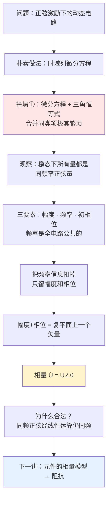

# C4.1 正弦量与相量 Sinusoids and Phasors

> [!abstract] 这一讲的任务
> 到 [[C1.5 电路分析的基本定律]] 和第 3 章为止，我们解的都是**直流电阻电路**：一堆实系数线性方程，高斯消元就完事。可一旦电源换成 220 V 市电这样的正弦量，电容电感的伏安关系里带着 $\mathrm{d}/\mathrm{d}t$，方程立刻变成**微分方程**，还要一路用三角恒等式合并同类项——手算几乎不可行。
> 这一讲要造一把新工具：把正弦量换成一个**复数**（相量），让微分方程退化回代数方程。造完之后，你会发现第 3 章学的所有方法一个字都不用改，直接搬过来用。

> [!info] 怎么读这份讲义
> 从第 0 节的"三角恒等式地狱"开始，跟着一步步走；第 1–2 节是打地基（三要素、有效值、相位差），第 3 节是本讲的高潮（相量是怎么被逼出来的），第 4 节告诉你它为什么合法。数学基础不牢的话，第 3.1 小节的复数补课不要跳。

---

## 0. 开场：一个让你算到怀疑人生的小电路

来看一个小得不能再小的电路：一个 $5\,\Omega$ 电阻串一个 $5\,\text{mH}$ 电感，接在 $u_S(t)=10\sin(1000t)$ V 的电源上。求电流 $i(t)$。

按你目前会的东西，只能这么做：先写 KVL，

$$
5\,i(t) + 0.005\,\frac{\mathrm{d}i(t)}{\mathrm{d}t} = 10\sin(1000t)
$$

这是一阶常系数非齐次微分方程。稳态解一定也是同频正弦（第 4 节会证明这一点），所以设 $i(t)=I_m\sin(1000t+\theta)$，代进去：

$$
5I_m\sin(1000t+\theta) + 5 I_m\cos(1000t+\theta) = 10\sin(1000t)
$$

现在你被迫把 $\sin(1000t+\theta)$ 和 $\cos(1000t+\theta)$ 都用和角公式拆成 $\sin1000t$、$\cos1000t$ 的组合，再让两边 $\sin$ 项系数相等、$\cos$ 项系数相等，解一个含 $I_m$ 和 $\theta$ 的方程组。

> [!question] 停一下，先自己想想
> 这才**一个电阻加一个电感**。如果电路里有 6 个结点、10 条支路，其中 3 个电容 2 个电感，你打算怎么办？
>
> …想过了再往下看。

答案是：**没法办**。你会得到一个高阶常系数微分方程组，每解一次都要拆一遍三角恒等式。这就是**撞墙①**：时域直接解正弦稳态电路，在代数上是灾难。

但是注意上面那一步里透露出来的一件事：**从头到尾，$1000t$ 这个东西一直原封不动地跟着**。所有项的频率都是 $1000\ \text{rad/s}$，一个没变。真正需要求的只有两个数：幅度 $I_m$ 和相位 $\theta$。

**那我们能不能干脆把"频率"这个所有人都一样的信息先扣掉，只带着"幅度 + 相位"两个数去做运算？** 这一讲剩下的全部内容，就是把这个念头做成一个严密的工具。

---

## 1. 先把研究对象说清楚：什么叫"交流稳态"

课件从这里正式开讲（第 5–6 页）。

> [!important] 交流稳态电路（AC steady-state circuit）
> **概念**：当电路中电压和电流随时间呈**周期性**变化时，电路工作在交流稳态。处于交流稳态的电路称为交流稳态电路，简称**交流电路**。
>
> **特点**：
> - 激励和响应都是随时间变化的周期函数；
> - **电路中的动态元件不能简单地开路或短路处理**；
> - 由于动态元件的伏安特性具有时间微分方程的形式，交流电路的电路方程也是时间的微分方程，分析较复杂。

> [!warning] 第一个易错点：这里的"稳态"不是"不变"
> 直流电路里说"稳态"，意思是所有量都是常数。交流电路里说的**稳态，是指电压和电流的函数规律稳定不变**——波形形状、幅度、相位都不再随时间漂移了，但瞬时值仍然每时每刻都在变。
>
> 与之相对的是**暂态**（换路后波形规律还在变化的那一段），那是 [[C5.1 动态电路与换路定则]] 的内容。这一章我们默认暂态已经结束了。

> [!note] 为什么"动态元件不能简单开路/短路"（课件只给了结论）
> 你在直流分析里养成过一个习惯：稳态时**电容视为开路、电感视为短路**。那是因为直流稳态下 $\mathrm{d}u/\mathrm{d}t=0 \Rightarrow i_C = C\,\mathrm{d}u/\mathrm{d}t = 0$（开路），$\mathrm{d}i/\mathrm{d}t=0\Rightarrow u_L=0$（短路）。
> 交流稳态下 $\mathrm{d}u/\mathrm{d}t\neq0$，这两条推理的前提直接没了。电容电感在交流下是**实实在在参与分流分压**的元件，这也正是本章一切复杂性的来源。

课件第 6 页把这一章的方法论提前交了底：

> **利用正弦稳态电路中所有电压、电流均为同频率正弦量的特点，采用复数工具表达正弦量，将电路分析的问题转换到相量域中进行，从而将时间域中需要微分方程描述的正弦稳态电路转换到相量域中用复代数方程描述。这就是相量法的思想。**

这句话你现在只能"读懂字面"，读完第 3 节才会真正明白。先记着。

**本章讨论的最基本情形（第 7 页）**：
1. 电路处于**单一频率**正弦电源（信号）的激励下；
2. 电路已经处于**稳定状态**，作为**线性**电路，电路中各处电压电流都表现为与激励电源**同频率**的正弦量。

---

## 2. 正弦量的三要素

### 2.1 三要素是哪三个

一个正弦电流写成

$$
i(t) = I_m\sin(\omega t + \theta)
$$

课件把 $I_m$、$\omega$、$\theta$ 三个位置圈了红圈，称为**正弦信号的三要素**：

> [!important] 正弦信号的三要素
> 1. **振幅** $I_m$
> 2. **频率** $f$、**周期** $T$、**角频率** $\omega$（三者是一回事的三种说法）
> 3. **初相位** $\theta$

![[C4-正弦量三要素示意.png]]

> [!note] 图怎么读
> 横轴是时间 $t$（课件画的是 $\omega t$，量纲是弧度，两者只差一个常数因子 $\omega$）。
> - **振幅**：波峰到零线的高度，图中虚线标的 $I_m$。
> - **周期**：相邻两个同相点（比如相邻两个上升过零点）之间的距离。
> - **初相位**：波形相对于原点"提前"了多少。图上量到的是时间 $\theta/\omega$，换算成角度就是 $\theta$。**初相位为正 ⇒ 波形整体左移**（提前到达峰值）。

### 2.2 频率、周期、角频率（第 9 页）

$$
f=\frac1T,\qquad \omega = 2\pi f = \frac{2\pi}{T}
$$

- **周期 $T$**：波形变化一周所需的时间，单位秒 (s)、毫秒 (ms)、微秒 (μs)。
- **频率 $f$**：每秒波形变化的次数，单位赫兹 (Hz)、千赫 (kHz)、兆赫 (MHz)。
- **角频率 $\omega$**：每秒函数相位角变化的**弧度数**，单位 rad/s。

课件给了一张很值得背下来的**工程数值表**：

| 场合 | 频率 |
|---|---|
| 电网频率（工频）：中国、欧洲 | **50 Hz** |
| 电网频率：美国、日本 | **60 Hz** |
| 有线通信频率 | 300 ~ 5000 Hz |
| 无线通信频率 | 30 kHz ~ 30 GHz |
| 声波频率 | 20 ~ 20 kHz |

> [!example] 手算：工频的 $\omega$ 是多少？
> $\omega = 2\pi f = 2\pi\times50 = 314.159\ \text{rad/s}$。
> 工程上就直接写 **314 rad/s**——本章后面所有 50 Hz 的例题（日光灯、三表法、线圈参数）都会看到这个 314，看到它就知道是工频。
> 60 Hz 对应 $\omega=377\ \text{rad/s}$。

> [!note] 接到你的专业：采样定理的另一半
> 这张表在 DSP 里天天用。声音带宽 20 kHz ⇒ 奈奎斯特率 40 kHz ⇒ 所以 CD 采样率定成 44.1 kHz（留了一点过渡带给抗混叠滤波器）。本章末尾的谐振电路，正是那个抗混叠滤波器最原始的形态。

### 2.3 振幅与有效值：为什么工程上不用峰值

课件第 8 页给了定义和结果，但**没有讲那个 $\sqrt2$ 是怎么积出来的**，我们补上。

先问一个问题：一个 220 V 的交流电压，"220 V"指的是波形的什么？峰值吗？

不是。它是**有效值**。

> [!important] 有效值（RMS，Root Mean Square，方均根值）
> **有效值表示与该交流电压/电流平均热效应相当的直流值。** 数学上定义为方均根：
> $$U = \sqrt{\frac{1}{T}\int_{t_0}^{T+t_0}u^2(t)\,\mathrm{d}t},\qquad I = \sqrt{\frac{1}{T}\int_{t_0}^{T+t_0}i^2(t)\,\mathrm{d}t}$$

> [!note] 这个定义为什么长这样（课件没讲的动机）
> 我们想给交流量找一个"等效直流值"。等效的判据选**发热**：让同一个电阻 $R$ 分别通交流 $i(t)$ 和直流 $I$，一个周期内产生的**热量相同**。
> - 交流一周期发热：$W_{ac}=\int_0^T i^2(t)R\,\mathrm{d}t$
> - 直流一周期发热：$W_{dc}=I^2RT$
>
> 令两者相等：$I^2RT = R\int_0^T i^2\mathrm{d}t \Rightarrow I=\sqrt{\dfrac1T\int_0^T i^2\mathrm{d}t}$。
> 三步：先**平方**（Square，因为发热正比于 $i^2$，也顺手消掉了正负号）、再**取平均**（Mean，一个周期内平均）、最后**开根号**（Root，把量纲变回安培）。倒着念就是 Root-Mean-Square。

> [!example] 手算：正弦量的 $U = U_m/\sqrt2$ 是怎么积出来的
> 取 $u(t)=U_m\sin(\omega t+\theta_u)$，$T=2\pi/\omega$。
>
> **第一步，平方**。用降幂公式 $\sin^2 x = \dfrac{1-\cos 2x}{2}$：
> $$u^2(t) = U_m^2\sin^2(\omega t+\theta_u) = \frac{U_m^2}{2}\Big[1-\cos\big(2\omega t+2\theta_u\big)\Big]$$
>
> **第二步，一周期取平均**。$\cos(2\omega t + 2\theta_u)$ 的角频率是 $2\omega$，在长度为 $T$ 的区间上**整整走了两个完整周期**，积分为 0：
> $$\frac1T\int_0^T u^2\mathrm{d}t = \frac{U_m^2}{2}\cdot 1 - \frac{U_m^2}{2}\cdot 0 = \frac{U_m^2}{2}$$
>
> **第三步，开根号**：
> $$\boxed{\;U = \sqrt{\frac{U_m^2}{2}} = \frac{U_m}{\sqrt2}\approx 0.707\,U_m\;}\qquad\text{即}\quad U_m=\sqrt2\,U$$
>
> **数值验证**：家用市电 $U=220$ V $\Rightarrow U_m = 220\sqrt2 = 311.1$ V。所以插座两端电压的峰值其实高达 311 V——这就是为什么电器耐压要按 400 V 设计而不是 250 V。

> [!warning] 三个要记牢的约定
> 1. **平常所说的交流电压或电流的大小，若无特别说明，均是指有效值。** 一般交流电压表和电流表的读数也是指有效值。
> 2. 因子 $\sqrt2$ **只对正弦波成立**。方波的有效值 $=U_m$，三角波的有效值 $=U_m/\sqrt3$。见 [[C4.5 非正弦周期电路的谐波分析]]。
> 3. 本章后面凡是写成 $u=\sqrt2\,U\sin(\omega t+\theta)$ 的，$U$ 就是**有效值**；写成 $u=U_m\sin(\omega t+\theta)$ 的，$U_m$ 是**峰值**。看到 $\sqrt2$ 就该条件反射地意识到"这里的大写字母是有效值"。

### 2.4 初相位与相位差（第 10 页）

对于 $i(t)=I_m\sin(\omega t+\theta)$：

- $(\omega t+\theta)$ 称为正弦波在时刻 $t$ 的**相位角或相位**，以 $2\pi$ 为周期。
- $\theta$ 为 $t=0$ 时的相位，称为**初相位**或**初相角**，规定 $-\pi<\theta<\pi$。

> [!important] 相位差（第 10 页）
> **两个同频率的正弦量可以比较相位。** 设
> $$u_1=U_{1m}\sin(\omega t+\theta_1),\quad u_2=U_{2m}\sin(\omega t+\theta_2)$$
> 相位差
> $$\varphi_{12}=(\omega t+\theta_1)-(\omega t+\theta_2)=\theta_1-\theta_2,\qquad -\pi<\varphi_{12}<\pi$$
>
> | 相位差 | 关系 |
> |---|---|
> | $\varphi_{12}=0$（$\theta_1=\theta_2$） | $u_1$、$u_2$ **同相位** |
> | $\varphi_{12}>0$（$\theta_1>\theta_2$） | $u_1$ **超前** $u_2$ |
> | $\varphi_{12}<0$（$\theta_1<\theta_2$） | $u_1$ **滞后** $u_2$ |
> | $\varphi_{12}=\pm90^\circ$ | $u_1$、$u_2$ **正交** |
> | $\varphi_{12}=\pm180^\circ$ | $u_1$、$u_2$ **反相** |

> [!note] 为什么"只有同频率才能比相位"（这是本章最重要的前提之一）
> 看那个减法：$(\omega_1 t+\theta_1)-(\omega_2 t+\theta_2) = (\omega_1-\omega_2)t + (\theta_1-\theta_2)$。
> **只有当 $\omega_1=\omega_2$ 时，$t$ 才会消掉**，相位差才是一个**不随时间变化的常数**，"谁超前谁"才是一个有意义的说法。
> 如果频率不同，相位差每时每刻都在变，一会儿超前一会儿滞后，说"$u_1$ 超前 $u_2$ 30°"毫无意义。
>
> 这条限制会在第 3 节变成"**只有同频率的正弦量才能画在同一张相量图上**"，在 [[C4.5 非正弦周期电路的谐波分析]] 变成"不同次谐波之间不能相加相量"。

### 2.5 例 4-2-4：比相位前必须先"三统一"（第 11–12 页）

> [!example] 例 4-2-4（课件原题）
> 已知两个同频率正弦电压的表达式为
> $$u_1 = 200\sin(314t+45^\circ)\ \text{V},\qquad u_2 = -100\cos(314t+30^\circ)\ \text{V}$$
> 求这两个正弦电压的相位差。

课件在这里插了一段红字警告，几乎每年都考：

> [!warning] 在比较两个正弦量的相位时，应注意（课件原文）
> **A. 同频率**——只有同频率的正弦量才有不随时间变化的相位差；
> **B. 同函数**——不同函数表示的正弦量应先采用三角恒等式转换成同函数后再计算相位差，因为正弦函数和余弦函数相位上相差 90 度；
> **C. 同符号**——不同符号（正或负）的两个正弦量应先采用三角恒等式转换成同符号后再计算相位差，因为符号不同，则相位相差 180 度。

课件给出的**常用三角恒等式**（这四条建议直接背下来，本章要反复用）：

$$
\sin\theta=\cos(\theta-90^\circ),\quad \cos\theta=\sin(\theta+90^\circ),\quad -\sin\theta=\sin(\theta\pm180^\circ),\quad -\cos\theta=\cos(\theta\pm180^\circ)
$$

> [!example] 【解】完整步骤
> **第 1 步：检查三统一。** $u_1$ 是 $+\sin$，$u_2$ 是 $-\cos$——函数不同、符号也不同，两条都不满足，必须先化。频率都是 314 rad/s，同频，可以比。
>
> **第 2 步：把 $u_2$ 化成 $+\sin$ 形式。**
> $$u_2=-100\cos(314t+30^\circ)$$
> 先处理负号：$-\cos\theta = \cos(\theta-180^\circ)$，得 $u_2 = 100\cos(314t+30^\circ-180^\circ)=100\cos(314t-150^\circ)$。
> 再把 cos 换成 sin：$\cos\theta=\sin(\theta+90^\circ)$，得
> $$u_2 = 100\sin(314t-150^\circ+90^\circ)=\boxed{100\sin(314t-60^\circ)\ \text{V}}$$
> （课件直接写出了这一行结果。）
>
> **第 3 步：作差。**
> $$\varphi_{12}=45^\circ-(-60^\circ)=\boxed{105^\circ}$$
>
> **结论**：电压 $u_1$ 比 $u_2$ **超前 105°**，或者说 $u_2$ 比 $u_1$ 滞后 105°。
>
> **数值校验**：$105^\circ$ 落在 $(-180^\circ,180^\circ)$ 内，不需要再加减 360°。若算出的结果超出这个范围（比如 $250^\circ$），必须折算成 $250^\circ-360^\circ=-110^\circ$ 才是标准答案。

> [!question] 课堂追问
> 如果 $u_2$ 我这样化：$-100\cos(314t+30^\circ) = 100\cos(314t+30^\circ+180^\circ)=100\cos(314t+210^\circ)=100\sin(314t+300^\circ)$，那相位差不就成了 $45-300=-255^\circ$ 吗？错在哪？
>
> 隔一段再答。先看下一节。

---

## 3. 相量：把"频率"扣掉

### 3.1 前置补课：复数的三种表示与欧拉公式

课件默认你会复数，但下面全靠它，先花两分钟对齐语言。

一个复数 $A$ 有三副面孔，它们说的是同一件事：

| 表示 | 写法 | 什么时候用它 |
|---|---|---|
| **代数式（直角坐标）** | $A = a + jb$ | **加减**最方便：实部加实部、虚部加虚部 |
| **三角式** | $A = \lvert A\rvert(\cos\theta + j\sin\theta)$ | 两者之间的桥梁 |
| **指数式 / 极坐标式** | $A = \lvert A\rvert e^{j\theta} = \lvert A\rvert\angle\theta$ | **乘除**最方便：模相乘、角相加 |

![[C4-复数的三种表示与欧拉公式.png]]

换算关系：

$$
\lvert A\rvert=\sqrt{a^2+b^2},\qquad \theta=\arctan\frac{b}{a}\ (\textbf{注意象限}),\qquad a=\lvert A\rvert\cos\theta,\quad b=\lvert A\rvert\sin\theta
$$

把三角式和指数式连起来的，就是**欧拉公式**：

$$
\boxed{\;e^{j\theta}=\cos\theta + j\sin\theta\;}
$$

由它立刻得到本章最常用的两条提取公式：

$$
\cos\theta = \operatorname{Re}\big[e^{j\theta}\big],\qquad \sin\theta=\operatorname{Im}\big[e^{j\theta}\big]
$$

> [!warning] 电路里写 $j$ 不写 $i$
> 数学上虚数单位是 $i$，但电路里 $i$ 已经被电流占用了，所以工程上一律用 **$j$**。$j^2=-1$，$1/j=-j$。后面会天天用到 $1/j = -j$ 这一条。

> [!warning] $\arctan$ 的象限陷阱（课件第 17 页专门用一整块讲这件事）
> 计算器上的 $\arctan$ 只会给出 $(-90^\circ,90^\circ)$ 的结果。若实部为负，必须手动 $\pm180^\circ$。课件给的四个例子：
>
> | 复数 | 正确相角 | 象限 |
> |---|---|---|
> | $\dot U=3+j4$ | $+53.1^\circ$ | 第一象限 $0<\theta<90^\circ$ |
> | $\dot U=3-j4$ | $-53.1^\circ$ | 第四象限 $-90^\circ<\theta<0$ |
> | $\dot U=-3+j4$ | $+126.9^\circ$ | 第二象限 $90^\circ<\theta<180^\circ$ |
> | $\dot U=-3-j4$ | $-126.9^\circ$ | 第三象限 $-180^\circ<\theta<-90^\circ$ |
>
> 四个复数的 $\lvert b/a\rvert$ 完全一样，计算器都会吐出 $53.1^\circ$，但真实相角分布在四个象限。**判断方法：先看实部虚部的正负确定象限，再修正。**
> 数值校验：$\sqrt{3^2+4^2}=5$，写成时域即 $u=5\sqrt2\sin(\omega t+53.1^\circ)$ ——注意这里的 5 是**有效值**，所以时域峰值是 $5\sqrt2$。

### 3.2 朴素尝试：旋转矢量

回到第 0 节的困境。我们想把"幅度 + 相位"打包成一个东西。

课件第 14 页给出的想法是：**一个正弦量的瞬时值可以用一个旋转的有向线段在纵轴上的投影值来表示。**

![[C4-旋转矢量与正弦波投影.png]]

> [!note] 这张图怎么读（左右两个坐标系不一样，初学者最容易在这里卡住）
> - **左图是复平面**：横轴 $+1$（实轴），纵轴 $+j$（虚轴）。红色箭头是一根长度固定、绕原点**逆时针匀速旋转**的矢量。
> - **右图是时间波形图**：横轴 $\omega t$，纵轴电压瞬时值。
> - 两图之间那两条水平虚线是**投影**：把左图矢量末端的**纵坐标**（虚部）搬到右图，就得到了右图那一时刻的 $u$ 值。矢量转一圈，投影正好画出一个完整正弦周期。
>
> 三条对应关系（课件原文）：
> - **矢量长度 = 振幅**
> - **矢量与横轴夹角 = 初相位**
> - **矢量以角速度 $\omega$ 按逆时针方向旋转**
>
> 在复平面上，这根旋转矢量写成 $U_m e^{j\theta}\cdot e^{j\omega t}$，其中 $e^{j\omega t}$ 被课件称为**旋转因子**。

### 3.3 撞墙②与破墙：旋转因子可以扔掉

旋转矢量确实描述了正弦量，但它还是带着时间 $t$，看上去没省事。

**关键观察（课件第 15 页）**：

> 由于同频率的正弦量（正弦稳态电路中的所有电压、电流具有相同频率）**旋转速度相同**，因此只需要确定它们的**初始矢量**。

想象整个电路里所有电压电流的旋转矢量画在同一张复平面上：它们像一个刚体一样**整体同步旋转**，彼此的相对位置（长度比、夹角）永远不变。既然如此，那个公共的 $e^{j\omega t}$ 就是一个**冗余信息**——它对每个量的作用完全相同，运算时会自动约掉。

**扔掉它。** 剩下的初始矢量就叫**相量**。

> [!important] 相量（Phasor）的定义
> $$\textbf{振幅相量：}\quad \dot U_m = U_m e^{j\theta}=U_m\angle\theta$$
> $$\textbf{有效值相量：}\quad \dot U = U e^{j\theta}=U\angle\theta$$
> 字母上加一点 $\dot{\ }$ 是**相量**的标志，用来和普通复数、和有效值 $U$ 区分。

![[C4-相量图矢量叠加.png]]

> [!question] 停一下：为什么工程上普遍用**有效值相量**而不是振幅相量？
> 两者只差一个常数 $\sqrt2$，电路方程用哪个都能解。为什么要多此一举？
>
> **因为功率。** 下一讲会看到 $P=UI\cos\varphi$——用有效值写，公式里没有任何多余系数；如果用峰值写，就得写成 $P=\frac12 U_mI_m\cos\varphi$，处处拖着一个 $\frac12$。而且所有交流电表读的都是有效值，用有效值相量算出来的模，可以直接跟仪表读数对照，不用再换算。
> 所以本课程**默认使用有效值相量**。看到 $\dot U=100\angle0^\circ$ V，意思是有效值 100 V，峰值 $141.4$ V。

### 3.4 相量与正弦量的映射关系（第 18 页"说明"）

> [!important] 三条说明（课件原文，逐条要理解）
> **（1）相量和正弦量之间是一种映射关系，相量只是表示正弦量，但并不等于正弦量。**
> $$i(t)=I_m\sin(\omega t+\theta)=\operatorname{Im}\!\left[I_me^{j\theta}\cdot e^{j\omega t}\right]$$
> $$i(t)=I_m\cos(\omega t+\theta)=\operatorname{Re}\!\left[I_me^{j\theta}\cdot e^{j\omega t}\right]$$
> **（2）** 正弦量的函数表达有 sin 和 cos 两种，实际应用中可以根据便利性原则选择 cos 或 sin 进行相量映射。
> **（3）只有同频率的正弦量可以在同一张相量图上**表示它们之间的相互关系，因同频正弦量对应的旋转矢量角速度相等，彼此相对静止，其振幅和相位关系仅取决于初始位置。而不同频率的正弦量对应的旋转矢量相对位置是随时间变化的。

> [!warning] 本讲头号易错点：$\dot U \neq u(t)$
> 相量是一个**复常数**，时域量是一个**实函数**。它们之间是"**映射**"（一一对应），不是"等于"。写 $\dot U = u(t)$ 是错的，写 $\dot U = 100\angle30^\circ$ 才对。
> 记号上也要注意：**相量必须加点**（$\dot U$、$\dot I$），不加点的 $U$、$I$ 表示有效值（正实数），$Z$ 这类复数不加点（下一讲会讲为什么阻抗不加点：**它不对应任何正弦量**）。

> [!note] 用哪个映射（sin 还是 cos）要全局统一
> 课件说"按便利性原则选"，但有一条铁律：**同一道题里必须从头到尾用同一种**。
> 本课件的例题两种都出现过：第 36 页用的是 $\dot U \Leftrightarrow \sqrt2 U\sin(\omega t+\theta)$，第 37 页明确写了"取相量映射关系：$\dot U\Leftrightarrow \sqrt2 U\cos(10^3t)$"。做题时第一步就把映射方式写在草稿纸上，最后回时域时按同一条换回去。
> 顺带回答第 2 节末尾那个**课堂追问**：$100\sin(314t+300^\circ)$ 的相角 $300^\circ$ **超出了 $(-180^\circ,180^\circ)$ 的规定范围**，必须折算成 $300^\circ-360^\circ=-60^\circ$。折算后 $\varphi_{12}=45^\circ-(-60^\circ)=105^\circ$，和课件一致。所以那个做法本身没错，错在**没有把相角归化到主值区间**。

### 3.5 相量图与矢量叠加（第 16 页）

> [!important] 相量图
> 把相量作为矢量画在复平面上，称为**相量图**。利用相量图的**矢量叠加**方法，可以方便地进行同频率正弦量的加、减运算。

课件第 16 页把"相量为什么好用"演示得非常清楚。设

$$
u_1(t)=\sqrt2U_1\sin(\omega t+\theta_1),\qquad u_2(t)=\sqrt2U_2\sin(\omega t+\theta_2)
$$

**时域做法**：$u_1+u_2=\sqrt2U_1\sin(\omega t+\theta_1)+\sqrt2U_2\sin(\omega t+\theta_2)= ?$ ——要用和角公式展开、按 $\sin\omega t$ 与 $\cos\omega t$ 归并、再反合成，一顿操作才知道结果是 $\sqrt2 U\sin(\omega t+\theta)$。课件在这里画了个红框打问号。

**相量做法**：直接加，而且是复数加法：

$$
\begin{aligned}
\dot U &= \dot U_1+\dot U_2 = U_1\angle\theta_1 + U_2\angle\theta_2\\
&=\big(U_1\cos\theta_1+U_2\cos\theta_2\big) + j\big(U_1\sin\theta_1+U_2\sin\theta_2\big)= U\angle\theta
\end{aligned}
$$

$$
U=\sqrt{(U_1\cos\theta_1+U_2\cos\theta_2)^2+(U_1\sin\theta_1+U_2\sin\theta_2)^2},\qquad \theta=\arctan\frac{U_1\sin\theta_1+U_2\sin\theta_2}{U_1\cos\theta_1+U_2\cos\theta_2}
$$

在相量图上，这就是初中就会的**平行四边形法则**。

> [!example] 手算验证：两个电压叠加
> 设 $u_1=100\sqrt2\sin(\omega t+0^\circ)$ V，$u_2=100\sqrt2\sin(\omega t+90^\circ)$ V。
> $$\dot U_1 = 100\angle0^\circ = 100,\qquad \dot U_2=100\angle90^\circ=j100$$
> $$\dot U = 100+j100 = 141.42\angle45^\circ\ \text{V}$$
> 回时域：$u=141.42\sqrt2\sin(\omega t+45^\circ)$ V。
>
> **注意这个数**：两个 100 V 加起来是 **141.4 V，不是 200 V**。因为它们相位差 90°。这就是下一讲会反复强调的"**分电压模之和一般不等于总电压模**"。

### 3.6 停一下，我们刚才干了什么

回头梳理一遍这条链子：

1. 时域解正弦稳态电路 → 微分方程 + 三角恒等式 → **撞墙**；
2. 观察到稳态下**所有量同频**，频率是冗余信息；
3. 用**旋转矢量**表示正弦量，把幅度和相位画成复平面上的一根箭头；
4. 同频 ⇒ 所有箭头同步旋转 ⇒ 把公共的旋转因子 $e^{j\omega t}$ **扔掉**；
5. 剩下的初始矢量 = **相量**，一个复数就装下了"幅度 + 相位"两件事；
6. 于是**正弦量的加减 = 复数的加减**，微分方程里最烦的合并同类项这一步没了。

**正弦波的四种表示法（课件第 17 页小结）**：波形图、函数式、相量、相量图。四者一一对应，考试时要能自由互换。

$$
u=\sqrt2 U\sin(\omega t+\theta) \quad\Longleftrightarrow\quad \dot U = U e^{j\theta}=U\angle\theta
$$

但还剩最后一个问题：**凭什么可以这么干？** 万一电路里某个运算把频率改了，整套方法就崩了。

---

## 4. 相量法为什么合法（第 19 页）

课件第 19 页三句话给出了全部理由，这三句是本章的**理论地基**：

> [!important] 单一频率正弦电源激励下的线性电路（课件原文）
> - **线性电路满足叠加定理**，电路的稳态响应是电路电源激励的**线性组合**；
> - **同频率正弦函数经过线性运算（包括加减法、振幅缩放、微分、积分运算）后所得结果仍旧是同频率的正弦函数**；
> - 在单一频率正弦电源激励下，线性电路的响应（电压和电流）**均为与激励同频率的正弦量**。

> [!note] 第二条要自己验一遍，不然只是背结论
> 设 $x(t)=A\sin(\omega t+\theta)$，逐个检查四种线性运算：
>
> | 运算 | 结果 | 频率变了吗 |
> |---|---|---|
> | 缩放 $kx$ | $kA\sin(\omega t+\theta)$ | 没变 |
> | 加法 $x_1+x_2$ | 由第 3.5 节，$=A\sin(\omega t+\theta)$ | 没变 |
> | 微分 $\mathrm{d}x/\mathrm{d}t$ | $\omega A\cos(\omega t+\theta)=\omega A\sin(\omega t+\theta+90^\circ)$ | **没变**，只是幅度 $\times\omega$、相位 $+90°$ |
> | 积分 $\int x\,\mathrm{d}t$ | $-\frac{A}{\omega}\cos(\omega t+\theta)=\frac{A}{\omega}\sin(\omega t+\theta-90^\circ)$ | **没变**，幅度 $\div\omega$、相位 $-90°$ |
>
> **这就是整套相量法能成立的全部秘密。** 而集总电路里出现的运算只有这四种：KCL/KVL 是加减，电阻是缩放，电感是微分，电容是积分。所以无论电路多复杂，**只要它是线性的、只有一个频率的激励，所有响应就一定和激励同频**——频率这个信息全电路只需要记一次，扣掉它是安全的。
>
> 更妙的是最后两行：微分变成"幅度乘 $\omega$、相位转 $+90°$"，而"模乘 $\omega$、角加 $90°$"在复数里正好就是**乘以 $j\omega$**！这就是下一讲 $\dot U_L=j\omega L\dot I$ 的来源。**微分方程会变成乘法，就是因为这一步。**

> [!warning] 相量法的适用边界（越界就失效，考试爱考）
> 1. **必须线性**。非线性元件（二极管、饱和的铁芯）会产生新频率成分，第二条就崩了 —— 见 [[C4.5 非正弦周期电路的谐波分析]] 第 0 节。
> 2. **必须单一频率**。多个频率时要一个频率一个频率地算，再在**时域**叠加（不能在相量域叠加，因为不同频的相量不能相加）。
> 3. **必须是稳态**。暂态过程中还有衰减指数项，不是纯正弦，属于 [[C5.1 动态电路与换路定则]]。

> [!note] 接到你的专业：这就是 AI 里天天用的那个"变换域思想"
> 相量法的套路是"**换个域，把难运算变成易运算，算完换回来**"：
> - 时域微分方程 →（相量变换）→ 相量域代数方程 → 解 →（反变换）→ 时域解。
>
> 完全同一个套路的还有：拉普拉斯变换（微分 → 乘 $s$）、傅里叶变换（卷积 → 乘法）、CNN 里用 FFT 加速大卷积核、对数变换（乘法 → 加法）。相量法其实就是**傅里叶变换在"只有单一频率"这个特例下的极简版**。你在《信号与系统》里会看到，$e^{j\omega t}$ 是所有 LTI 系统的**特征函数**——系统对它的响应只是乘一个复数（特征值），而这个复数就是下一讲的**阻抗**。

---

## 这一讲的三句话

1. **正弦稳态电路里，所有电压电流同频，所以"频率"是全电路共享的冗余信息**——扣掉它，只留幅度和相位，就是相量。
2. **相量把正弦量的加减变成复数的加减、把微分变成乘 $j\omega$**，微分方程因此退化成复代数方程。
3. **相量不等于正弦量，只是与它一一映射**；比相位前必须"同频率、同函数、同符号"三统一。

### 速查表

| 量 | 公式 | 备注 |
|---|---|---|
| 角频率 | $\omega=2\pi f=2\pi/T$ | 工频 50 Hz → 314 rad/s |
| 有效值（正弦） | $U=U_m/\sqrt2\approx0.707U_m$ | 由 $\frac1T\int u^2\mathrm{d}t$ 积出 |
| 有效值（一般周期量） | $U=\sqrt{\frac1T\int_0^T u^2\mathrm{d}t}$ | 方均根 RMS |
| 相位差 | $\varphi_{12}=\theta_1-\theta_2$ | 仅同频有意义 |
| 欧拉公式 | $e^{j\theta}=\cos\theta+j\sin\theta$ | 复数三种表示的桥梁 |
| 有效值相量 | $\dot U=U\angle\theta \Leftrightarrow u=\sqrt2U\sin(\omega t+\theta)$ | 默认用有效值 |
| 三角恒等式 | $\sin\theta=\cos(\theta-90^\circ)$，$-\cos\theta=\cos(\theta\pm180^\circ)$ | 三统一必备 |

### 下一讲预告

我们造好了相量这把锤子，但还不知道往哪儿钉。第 4 节最后那一行提示已经泄了底：**电感的微分对应"乘 $j\omega$"**。如果把 $\dot U/\dot I$ 这个比值算出来，会得到什么？它对电阻是 $R$，对电感是 $j\omega L$——一个**复数**。为什么欧姆定律的"电阻"到了交流里非得是复数不可？下一讲就来回答这件事。

---

## 本节自测 Self-Test

> [!question] Q1：为什么不能直接在时域解正弦稳态电路？用一句话说清楚"墙"在哪。
> [!success]- 参考答案
> 因为动态元件的伏安关系含 $\mathrm{d}/\mathrm{d}t$，KVL/KCL 列出来是微分方程；求解时要设 $I_m\sin(\omega t+\theta)$ 代入，再靠和角公式把所有项拆成 $\sin\omega t$ 与 $\cos\omega t$ 的组合并令系数相等。元件一多，这个三角恒等式合并过程在代数上就无法手工完成了。

> [!question] Q2：推导正弦量的有效值 $U=U_m/\sqrt2$，写出每一步。
> [!success]- 参考答案
> 设 $u=U_m\sin(\omega t+\theta)$。
> ① 平方并降幂：$u^2=\dfrac{U_m^2}{2}\left[1-\cos(2\omega t+2\theta)\right]$。
> ② 在一个周期 $T=2\pi/\omega$ 上取平均：$\cos(2\omega t+2\theta)$ 在该区间上走了两个整周期，积分为 0，故平均值 $=\dfrac{U_m^2}{2}$。
> ③ 开方：$U=\dfrac{U_m}{\sqrt2}\approx0.707U_m$。
> 校验：$U=220$ V $\Rightarrow U_m=311.1$ V。

> [!question] Q3：某方波电压峰值 $U_m=10$ V（在 $\pm U_m$ 之间跳变，占空比 50%），它的有效值是多少？为什么不是 $10/\sqrt2$？
> [!success]- 参考答案
> $u^2(t)\equiv U_m^2=100$（无论 $u$ 取 $+10$ 还是 $-10$），所以 $\frac1T\int u^2\mathrm{d}t=100$，$U=\sqrt{100}=\boxed{10\ \text{V}}$。
> $\sqrt2$ 这个因子来源于 $\sin^2$ 的平均值等于 $1/2$，**只对正弦波成立**。方波的"平方"是常数，平均值就是它本身，所以有效值等于峰值。

> [!question] Q4：$u_1=200\sin(314t+45^\circ)$ V，$u_2=-100\cos(314t+30^\circ)$ V，求 $\varphi_{12}$，写出完整化简过程。
> [!success]- 参考答案
> ① 三统一检查：同频（都是 314），但函数不同（sin vs cos）、符号不同，需化简。
> ② $-100\cos(314t+30^\circ)\xrightarrow{-\cos\theta=\cos(\theta-180^\circ)}100\cos(314t-150^\circ)\xrightarrow{\cos\theta=\sin(\theta+90^\circ)}100\sin(314t-60^\circ)$。
> ③ $\varphi_{12}=45^\circ-(-60^\circ)=\boxed{105^\circ}$，$u_1$ 超前 $u_2$ 105°。

> [!question] Q5：$\dot U=-3+j4$（有效值相量），写出对应的时域表达式。
> [!success]- 参考答案
> 模：$\sqrt{9+16}=5$。相角：实部为负、虚部为正 ⇒ **第二象限**。$\arctan(4/-3)$ 计算器给 $-53.1^\circ$，需 $+180^\circ$ 修正为 $126.9^\circ$。
> 故 $\dot U=5\angle126.9^\circ$ V，$u(t)=5\sqrt2\sin(\omega t+126.9^\circ)$ V。
> **注意**：5 是有效值，写回时域必须乘 $\sqrt2$ 才是峰值。

> [!question] Q6：为什么只有同频率的正弦量才能画在同一张相量图上？
> [!success]- 参考答案
> 相量是"旋转矢量在 $t=0$ 时刻的位置"。同频 ⇒ 所有旋转矢量角速度相同 ⇒ 彼此**相对静止**，它们的长度比和夹角永远等于初始时刻的值，一张静态图就能完整表达关系。频率不同 ⇒ 相对位置随时间变化 ⇒ 静态图只在某一瞬间成立，没有意义。

> [!question] Q7：两个有效值都是 100 V、相位差 120° 的正弦电压串联，总电压有效值是多少？
> [!success]- 参考答案
> 取 $\dot U_1=100\angle0^\circ$，$\dot U_2=100\angle120^\circ=-50+j86.60$。
> $\dot U=\dot U_1+\dot U_2=50+j86.60=100\angle60^\circ$ V。
> 总电压有效值 $=\boxed{100\ \text{V}}$——和每一个分量一样大。
> 这正是"分电压模之和 ≠ 总电压模"的极端例子（$100+100\neq100$），也是三相电中线电流为零的原理。

> [!question] Q8：相量法成立依赖哪三个条件？各举一个破坏它的例子。
> [!success]- 参考答案
> ① **线性**——二极管整流电路会产生输入中没有的谐波，破坏"同频"；
> ② **单一频率**——含直流偏置 + 基波 + 三次谐波的信号，必须逐频计算再在时域叠加；
> ③ **稳态**——开关刚闭合的瞬间存在按 $e^{-t/\tau}$ 衰减的暂态分量，不是纯正弦。

> [!question] Q9：为什么微分运算在相量域变成"乘 $j\omega$"？
> [!success]- 参考答案
> 对 $x=A\sin(\omega t+\theta)$ 求导得 $\omega A\sin(\omega t+\theta+90^\circ)$：**幅度乘 $\omega$、相位加 $90°$**。在复数运算里，"模乘 $\omega$、辐角加 $90°$"恰好就是乘以 $\omega e^{j90^\circ}=j\omega$。
> 同理积分对应除以 $j\omega$（幅度除 $\omega$、相位减 $90°$）。

> [!question] Q10：为什么本课程用有效值相量而不是振幅相量？
> [!success]- 参考答案
> ① 功率公式最简：$P=UI\cos\varphi$，用峰值则要写 $\frac12U_mI_m\cos\varphi$；
> ② 交流电压表/电流表读的就是有效值，算出来的模可直接与仪表读数对照；
> ③ 电气铭牌（220 V、380 V）标的都是有效值。

---

**上一节 ←** [[C3.4 线性电路定理]]
**下一节 →** [[C4.2 元件相量模型与阻抗导纳]]
**课程索引 →** [[电路基础 MOC]]
