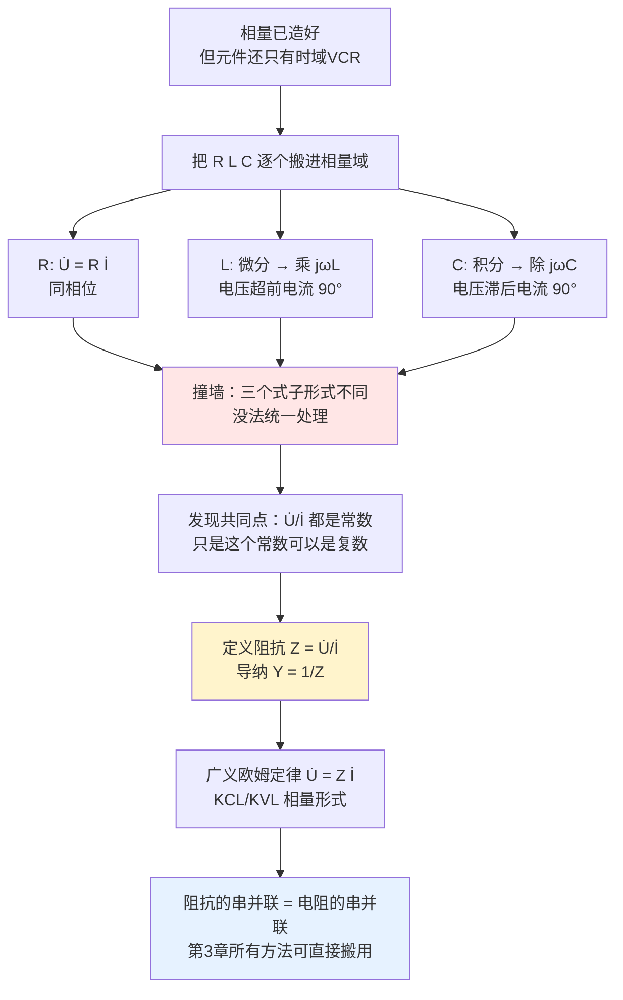

# C4.2 元件相量模型与阻抗导纳 Phasor Models, Impedance and Admittance

> [!abstract] 这一讲的任务
> [[C4.1 正弦量与相量]] 造出了相量这把锤子，但还没往任何地方钉。这一讲把 R、L、C 三个元件**逐个搬进相量域**，看看它们的伏安关系变成什么样子；然后会发现三者可以用**同一个公式** $\dot U=Z\dot I$ 统一起来——代价是这个"电阻" $Z$ 必须是**复数**。
> 讲完这一讲，你手上就有了一整套"交流版元件库"，第 3 章学的所有解法可以原样搬过来。

> [!info] 怎么读这份讲义
> 第 1 节三个元件按同一个模板走三遍（时域 → 正弦稳态 → 相量域），看第一遍时慢一点，后两个会很快。第 2 节是本讲核心：阻抗为什么非得是复数。第 3 节的串并联等效和第 4 节的例题是做题的落点。

---

## 0. 开场：一个"电阻"读数会随频率变化的元件

你手上有一个未知元件，两个引脚。给它加 1 V 有效值的正弦电压，测流过的电流有效值：

| 电源频率 | 电流有效值 |
|---|---|
| 50 Hz | 0.031 A |
| 500 Hz | 0.314 A |
| 5000 Hz | 3.14 A |

如果它是电阻，$U/I$ 应该是个固定值。可这里 $U/I$ 分别是 $32\,\Omega$、$3.2\,\Omega$、$0.32\,\Omega$——**频率涨十倍，"电阻"就掉十倍**。

再拿示波器同时看电压和电流波形，还会发现更怪的事：**电流波形比电压波形整整晚了四分之一个周期**。

> [!question] 停一下，先自己想想
> 这是个什么元件？那个"随频率反比变化的电阻"该记成什么？还有那"晚四分之一周期"这件事，你打算用哪个数把它记下来？
>
> 你会发现：**一个实数不够用了。** 你至少需要两个数才能把这个元件描述清楚——一个管"电压电流幅度之比"，一个管"电压电流的相位差"。
>
> 而"用一个东西同时装下模和角"——这正是复数的看家本领。这一讲要做的，就是把这个念头做成定义。
>
> （谜底：这是一个 $C=100\,\mu\text{F}$ 的电容。$1/(2\pi\times50\times100\mu)=31.8\,\Omega$。）

---

## 1. 三个元件搬进相量域

课件用同一个四步模板处理三个元件：**① 电路符号 → ② 时域特性 → ③ 正弦稳态下的电压电流 → ④ 相量域模型**。我们跟着走。

### 1.1 电阻元件（第 20 页）

**② 时域特性**：$u(t)=R\cdot i(t)$

**③ 正弦稳态下**：设 $i(t)=\sqrt2\,I\sin(\omega t+\theta_i)$，则

$$
u(t)=R\,i(t)=\sqrt2\,RI\sin(\omega t+\theta_i)=\sqrt2\,U\sin(\omega t+\theta_u)
$$

对比两边可得三条结论（课件原文）：**（1）同频率　（2）同相位：$\theta_u=\theta_i$　（3）$U=RI$**

**④ 相量域模型**：

$$
\boxed{\dot U = R\cdot\dot I}\qquad
Z\equiv\frac{\dot U}{\dot I}=R,\qquad Y\equiv\frac{\dot I}{\dot U}=\frac1Z=\frac1R=G
$$

电阻最没悬念：**它在相量域和在直流里长得一模一样**。

> [!note] 为什么电阻最简单
> 因为它的 VCR 是**纯缩放**——四种线性运算里唯一不改变相位的那一种（回顾 [[C4.1 正弦量与相量]] 第 4 节的表）。缩放只动幅度，不动相位，所以 $Z$ 是纯实数。

### 1.2 电容元件（第 21 页）

**① 基本特性**：$q=Cu$（库伏特性是过原点直线）

**② 时域特性**：$i(t)=\dfrac{\mathrm{d}q}{\mathrm{d}t}=C\dfrac{\mathrm{d}u(t)}{\mathrm{d}t}$

**③ 正弦稳态下**：这次反过来设电压 $u(t)=\sqrt2\,U\sin(\omega t+\theta_u)$，求电流：

$$
i(t)=C\frac{\mathrm{d}u}{\mathrm{d}t}=\sqrt2\,\omega CU\cos(\omega t+\theta_u)=\sqrt2\,\omega CU\sin(\omega t+\theta_u+90^\circ)=\sqrt2\,I\sin(\omega t+\theta_i)
$$

对比可得（课件原文）：**（1）同频率　（2）电压滞后电流：$\theta_u=\theta_i-90^\circ$　（3）$I=\omega CU$**

**④ 相量域模型**：

$$
\boxed{\dot I = j\omega C\cdot\dot U},\qquad \dot U=\frac{\dot I}{j\omega C}
$$
$$
Z\equiv\frac{\dot U}{\dot I}=\frac{1}{j\omega C}=-j\frac{1}{\omega C},\qquad Y\equiv\frac{\dot I}{\dot U}=j\omega C
$$

> [!note] 那一步 $\cos \to \sin$ 的换算，就是相位的 $+90°$ 从哪来的
> $\dfrac{\mathrm{d}}{\mathrm{d}t}\sin(\omega t+\theta)=\omega\cos(\omega t+\theta)=\omega\sin(\omega t+\theta+90^\circ)$。
> **微分 = 幅度乘 $\omega$ + 相位转 $90°$**。在复数里，"模乘 $\omega$、辐角加 $90°$"就是**乘以 $j\omega$**。这正是 [[C4.1 正弦量与相量]] 第 4 节留下的伏笔，现在回收了。

> [!warning] "电压滞后电流 90°"和第 0 节的观测对上了
> 第 0 节示波器看到"电流波形比电压早四分之一周期"——四分之一周期 = 90°。**电容上电流超前电压 90°**，等价说法就是电压滞后电流 90°。
> 记忆口诀：**容超感滞**（电容电流超前，电感电流滞后），或者英文的 "**CIVIL**"：**C**apacitor 中 **I** 在 **V** 前，**V** 在 **L**(电感) 中的 **I** 前。

### 1.3 电感元件（第 22 页）

**① 基本特性**：$\psi = Li$（韦安特性是过原点直线）

**② 时域特性**：$u(t)=\dfrac{\mathrm{d}\psi}{\mathrm{d}t}=L\dfrac{\mathrm{d}i(t)}{\mathrm{d}t}$

**③ 正弦稳态下**：设 $i(t)=\sqrt2\,I\sin(\omega t+\theta_i)$：

$$
u(t)=L\frac{\mathrm{d}i}{\mathrm{d}t}=\sqrt2\,\omega LI\cos(\omega t+\theta_i)=\sqrt2\,\omega LI\sin(\omega t+\theta_i+90^\circ)=\sqrt2\,U\sin(\omega t+\theta_u)
$$

结论（课件原文）：**（1）同频率　（2）电压超前电流：$\theta_u=\theta_i+90^\circ$　（3）$U=\omega LI$**

**④ 相量域模型**：

$$
\boxed{\dot U = j\omega L\cdot\dot I},\qquad \dot I=\frac{\dot U}{j\omega L}
$$
$$
Z\equiv\frac{\dot U}{\dot I}=j\omega L,\qquad Y\equiv\frac{\dot I}{\dot U}=\frac{1}{j\omega L}
$$

### 1.4 三个元件的相量图与感抗/容抗（第 23 页）

![[C4-RLC元件相量图.png]]

> [!note] 这张相量图怎么读
> 三张小图都以**电流相量 $\dot I$** 为参考（画在水平方向），看电压相量相对它的方位：
> - **电阻**：$\dot U=R\dot I$ 与 $\dot I$ **同方向**（同相）。
> - **电感**：$\dot U=j\omega L\dot I$ **逆时针转了 90°**（垂直向上）——电压超前电流 90°。
> - **电容**：$\dot U=\dfrac{\dot I}{j\omega C}=-j\dfrac{1}{\omega C}\dot I$ **顺时针转了 90°**（垂直向下）——电压滞后电流 90°。
>
> 课件在右上角用方框强调了这条**核心记忆**：
> > **虚数因子 j 为一个 90° 旋转因子；相量乘以 j 将逆时针旋转 90°；相量乘以 −j 将顺时针旋转 90°。**

> [!important] 感抗与容抗（第 23 页）
> $$X_L = \omega L\quad\text{称为电感的\textbf{感抗}}\qquad X_C=\frac{1}{\omega C}\quad\text{称为电容的\textbf{容抗}}$$
> 单位都是欧姆 $\Omega$。

> [!note] 感抗容抗的物理直觉（课件只给了公式）
> - **感抗 $\omega L$ 随频率上升**：电感"反抗电流变化"，频率越高电流变化越快，反抗越强 ⇒ 直流时 $\omega=0$，$X_L=0$，电感**短路**；高频时 $X_L\to\infty$，电感**开路**。这正好回收了直流分析里"电感视为短路"的旧结论——那是 $\omega=0$ 的特例。
> - **容抗 $1/\omega C$ 随频率下降**：电容"反抗电压变化"，频率越高越容易充放电 ⇒ 直流时 $X_C\to\infty$，电容**开路**；高频时 $X_C\to0$，电容**短路**。同样回收了直流的旧结论。
>
> **这一正一反是整章后半部分的种子**：串联时 $X_L$ 上升、$X_C$ 下降，两条曲线必然在某个频率交叉，交叉点上它们抵消——那就是 [[C4.6 网络函数与谐振]] 的**谐振**。
>
> **数值感受**：$L=10$ mH 在 50 Hz 时 $X_L=3.14\,\Omega$，在 1 MHz 时 $X_L=62.8\ \text{k}\Omega$。同一个电感，工频下几乎是导线，高频下几乎是开路——这就是为什么 [[C2.2 单端口器件的电路模型]] 里那些寄生电感在高频下会要命。

### 1.5 停一下，我们刚才干了什么

三个元件的时域 VCR 形式完全不同（一个是乘法、一个是微分、一个是积分），但搬进相量域之后：

| 元件 | 时域 VCR | 相量 VCR | $Z$ | $Y$ | 相位关系 |
|---|---|---|---|---|---|
| R | $u=Ri$ | $\dot U=R\dot I$ | $R$ | $G=1/R$ | 同相 |
| L | $u=L\,\mathrm{d}i/\mathrm{d}t$ | $\dot U=j\omega L\,\dot I$ | $j\omega L$ | $1/(j\omega L)$ | $u$ 超前 $i$ 90° |
| C | $i=C\,\mathrm{d}u/\mathrm{d}t$ | $\dot I=j\omega C\,\dot U$ | $1/(j\omega C)$ | $j\omega C$ | $u$ 滞后 $i$ 90° |

**三个式子现在都长成 $\dot U = (\text{某个复常数})\times\dot I$ 的样子了。** 但它们仍然是三个不同的公式——我们还想再进一步：能不能只用**一个**公式？

---

## 2. 阻抗与导纳：为什么它必须是复数

### 2.1 定义（第 26 页）

> [!important] 阻抗与导纳
> **正弦稳态电路中，无源二端网络（元件）的电压相量与电流相量之比称为该二端网络的阻抗，记作 $Z$**，阻抗具有电阻的量纲，单位欧姆 $(\Omega)$：
> $$Z = \frac{\dot U}{\dot I}=\frac{1}{Y}$$
> **电流相量与电压相量之比称为该二端网络的导纳，记作 $Y$**，导纳具有电导的量纲，单位西门子 (S)：
> $$Y=\frac{\dot I}{\dot U}=\frac{1}{Z}$$
> **阻抗与导纳互为倒数，一般都是复数。**

> [!warning] 阻抗不加点！
> $\dot U$、$\dot I$ 头上有点，因为它们**对应真实的正弦量**。$Z$ 头上**没有点**，因为它是两个相量的比值，**不对应任何正弦量**——它不是"一个正弦的阻抗波形"，它就是一个描述元件性质的复常数。
> 同理，下一讲的复功率 $\tilde S$ 头上戴的是波浪号不是点，理由一样。

### 2.2 撞墙与破墙：一个实数为什么不够用

回到第 0 节那个问题。要完整描述"一个二端网络对正弦激励的响应"，你必须回答两个独立的问题：

1. **幅度上**：$U$ 是 $I$ 的多少倍？（一个正实数 $U/I$）
2. **相位上**：$\dot U$ 比 $\dot I$ 超前多少角度？（一个角度 $\theta_u-\theta_i$）

一个实数只能装下第一个。**要用一个符号同时装下"一个正数 + 一个角度"，那就必须是复数**——因为复数天生就是"模 + 辐角"的载体。

$$
Z=\frac{\dot U}{\dot I}=\frac{U\angle\theta_u}{I\angle\theta_i}=\frac UI\angle(\theta_u-\theta_i)=\lvert Z\rvert\angle\varphi_z
$$

一眼就能看出：

$$
\boxed{\;\lvert Z\rvert = \frac UI\ \text{（幅度比）},\qquad \varphi_z=\theta_u-\theta_i\ \text{（相位差）}\;}
$$

**这就是"阻抗为什么是复数"的全部理由**：它的模负责编码幅度比，它的辐角负责编码相位差，一个复数刚好装两条信息，一条不多一条不少。

### 2.3 实部虚部：电阻部分与电抗部分（第 27 页）

> [!important] 阻抗与导纳的直角坐标表示（课件原文）
> 一般情况下，阻抗 $Z$ 和导纳 $Y$ 是复数，且**都是频率的函数**：
> $$Z(j\omega)=R(j\omega)+jX(j\omega)\qquad R(j\omega)\text{：电阻部分；}\ X(j\omega)\text{：\textbf{电抗}部分}$$
> $$Y(j\omega)=G(j\omega)+jB(j\omega)\qquad G(j\omega)\text{：电导部分；}\ B(j\omega)\text{：\textbf{电纳}部分}$$
> **电阻（导）部分是有损耗的，而电抗（纳）部分则无损耗。**
>
> 极坐标表示：
> $$Z(j\omega)=\lvert Z\rvert\angle\varphi_z,\qquad \lvert Z(j\omega)\rvert=\frac UI,\quad \varphi_z(j\omega)=\theta_u-\theta_i$$
> $$Y(j\omega)=\lvert Y\rvert\angle\varphi_y,\qquad \lvert Y(j\omega)\rvert=\frac IU,\quad \varphi_y(j\omega)=\theta_i-\theta_u=-\varphi_z(j\omega)$$

![[C4-阻抗三角形与导纳三角形.png]]

> [!note] 阻抗三角形怎么读
> 这是一个**直角三角形**：底边是 $R$，直角边是 $X$，斜边是 $\lvert Z\rvert$，底角是 $\varphi_z$。于是
> $$\lvert Z\rvert = \sqrt{R^2+X^2},\qquad \varphi_z=\arctan\frac XR,\qquad R=\lvert Z\rvert\cos\varphi_z,\quad X=\lvert Z\rvert\sin\varphi_z$$
> 下一讲你会看到同一个三角形以"电压三角形"和"功率三角形"的形式再出现两次——三者**完全相似**，因为后两个就是把这一个分别乘以 $I$ 和 $I^2$ 得来的。

> [!note] "电阻有损耗、电抗无损耗"这句话背后是什么（课件只给结论）
> 实部 $R$ 对应元件把电能**不可逆地变成热**；虚部 $X$ 对应元件把电能**暂时存起来再还回去**（电场能或磁场能），一个周期内净消耗为零。
> 下一讲会把这句定性的话变成定量的：$P=I^2R$（有功，真正耗掉）、$Q=I^2X$（无功，来回搬运）。所以**看到阻抗的实部就知道会发热，看到虚部就知道在跟电源来回倒腾能量**。

**三个基本元件的阻抗角**（课件第 27 页底部）：

| 元件 | 阻抗 | 性质 | 阻抗角 |
|---|---|---|---|
| 电阻 | $Z=R$（实数） | 纯阻元件 | $0^\circ$ |
| 电感 | $Z=jX_L=j\omega L$（正虚数） | 纯电抗元件，感抗 $X_L=\omega L$ | $+90^\circ$ |
| 电容 | $Z=-jX_C=-j\dfrac{1}{\omega C}$（负虚数） | 纯电抗元件，容抗 $X_C=\dfrac1{\omega C}$ | $-90^\circ$ |

> [!warning] $X$ 与 $X_C$ 的符号别搞混
> 课件把**容抗**定义为**正数** $X_C=1/\omega C$，但电容阻抗的**电抗部分**是 $X=-X_C<0$。写 $Z=R+jX$ 时代入的是**带符号的 $X$**。
> 一个 RC 串联电路：$Z=R-j\frac{1}{\omega C}$，此时 $X=-\frac{1}{\omega C}$，而 $X_C=+\frac{1}{\omega C}$。考试里符号错一次整题就废了。

### 2.4 感性、容性、电阻性（第 28 页）

> [!important] 按阻抗角分类（课件原文）
> - 当元件（网络）的阻抗角 **$\varphi_z>0$** 时，称该元件（网络）为**感性**的；
> - 当元件（网络）的阻抗角 **$\varphi_z<0$** 时，称该元件（网络）为**容性**的；
> - 当元件（网络）的阻抗角 **$\varphi_z=0$** 时，称该元件（网络）为**电阻性**的。

![[C4-感性容性等效电路.png]]

> [!note] 这张图的实用价值：任何无源二端网络都能等效成两个元件
> 图上说的是：一个**内部结构任意复杂**的无源二端网络，在**某一个给定频率下**，只可能表现成三种性质之一，而且总可以等效成
> - 感性 ⇔ $R_S(\omega)$ 串 $L_S(\omega)$，**或者** $R_P(\omega)$ 并 $L_P(\omega)$；
> - 容性 ⇔ $R_S(\omega)$ 串 $C_S(\omega)$，**或者** $R_P(\omega)$ 并 $C_P(\omega)$。
>
> **注意每个元件参数后面都跟着 $(\omega)$**：这个等效**只在那一个频率上成立**，换个频率要重算。这是初学者最容易忽略的一点，也是 [[C2.2 单端口器件的电路模型]] 里"实际电阻器在不同频段有不同模型"的严格版本。
>
> **速判窍门**：把网络总阻抗算出来，看虚部符号——**虚部为正就是感性，为负就是容性，为零就是电阻性（此时电路发生谐振）**。最后这一条就是 [[C4.6 网络函数与谐振]] 的定义式。

> [!question] 课堂追问
> 一个电感和一个电容**串联**，$\omega L=10\,\Omega$，$1/\omega C=6\,\Omega$。这个二端网络是感性还是容性？如果把频率降到原来的一半呢？
>
> 往下看两段再答。

### 2.5 电路定律的相量形式（第 25 页）

有了阻抗，第 1 章那两条铁律可以原封不动地搬到相量域。

> [!important] 基尔霍夫定律的相量形式
> **时间域：**
> $$\text{KCL}: \sum_{\text{任意结点}} i_k(t)=\sum I_{mk}\sin(\omega t+\theta_{ik})=0$$
> $$\text{KVL}: \sum_{\text{任意回路}} u_k(t)=\sum U_{mk}\sin(\omega t+\theta_{uk})=0$$
> **相量域：**
> $$\boxed{\text{KCL}:\ \sum_{\text{任意结点}}\dot I_k = 0\quad\text{或}\quad \sum \dot I_{mk}=0}$$
> $$\boxed{\text{KVL}:\ \sum_{\text{任意回路}}\dot U_k = 0\quad\text{或}\quad \sum\dot U_{mk}=0}$$

> [!important] 广义欧姆定律（Generalized Ohm's Law）
> $$\boxed{\dot U = Z\cdot\dot I}\qquad R:\ Z=R\qquad L:\ Z=j\omega L\qquad C:\ Z=\frac{1}{j\omega C}$$

> [!note] 为什么 KCL/KVL 能直接搬（课件没解释这一步）
> KCL 说的是 $\sum i_k(t)=0$ **在任意时刻成立**。所有 $i_k$ 同频，所以它们的旋转矢量同步转；一组同步旋转的矢量之和恒为零，当且仅当它们在 $t=0$ 时刻的初始矢量之和为零。而初始矢量就是相量，于是 $\sum \dot I_k=0$。
> 更代数化的说法：$\sum \operatorname{Im}[\dot I_ke^{j\omega t}]=\operatorname{Im}[(\sum\dot I_k)e^{j\omega t}]\equiv0$ 对一切 $t$ 成立 $\Rightarrow \sum\dot I_k=0$。
> 关键前提仍然是"**同频**"——这也解释了为什么 [[C4.5 非正弦周期电路的谐波分析]] 里不同次谐波的相量绝对不能相加。

**现在回答刚才的课堂追问**：$Z=j10-j6=+j4\,\Omega$，虚部为正 ⇒ **感性**。频率减半后 $\omega L$ 减半变 $5\,\Omega$、$1/\omega C$ 加倍变 $12\,\Omega$，$Z=j5-j12=-j7\,\Omega$ ⇒ **变成容性**了。
**同一个电路，换个频率性质就翻转**——这就是为什么阻抗必须写成 $Z(j\omega)$，频率是它的自变量。

### 2.6 电路的相量模型（第 24 页）

> [!important] 画相量模型的三步（课件原文）
> 1. 所有**电源**电压和电流转换为相量；
> 2. 所有**支路**电压和电流变量用其相量表示；
> 3. 无源元件 **R、L 和 C 分别用其相量模型表示**（即 $R$、$j\omega L$、$1/j\omega C$）。
>
> 即可得到正弦稳态电路的**相量模型**。

![[C4-RLC串联电路相量模型.png]]

> [!note] 左右两张图的区别（这是本讲最该看懂的一张对照）
> - **左图 (a)** 是时域电路：标的是 $u$、$i$、$u_R$、$u_L$、$u_C$ 和元件值 $R$、$L$、$C$。它对应一组**微分方程**。
> - **右图 (b)** 是相量模型：标的是 $\dot U$、$\dot I$、$\dot U_R$、$\dot U_L$、$\dot U_C$ 和 $R$、$j\omega L$、$\frac{1}{j\omega C}$。它对应一组**复代数方程**。
>
> **两张图的拓扑结构一模一样**——这是相量法最大的红利：你不需要重画电路，只要把每个标签换掉。而结构不变就意味着，第 3 章为直流电阻电路开发的**所有**方法（网孔法、结点法、叠加、戴维南、电源变换）**一条都不用改**，直接搬到右图上用。

---

## 3. 阻抗的串联与并联

### 3.1 串联与分压（第 29 页）

$$
\dot U=\dot U_1+\dot U_2=Z_1\dot I+Z_2\dot I=(Z_1+Z_2)\dot I=Z\dot I\quad\Longrightarrow\quad \boxed{Z=Z_1+Z_2}
$$

**分压公式**：

$$
\dot U_1=Z_1\dot I=\frac{Z_1}{Z}\dot U=\frac{Z_1}{Z_1+Z_2}\dot U,\qquad \dot U_2=\frac{Z_2}{Z_1+Z_2}\dot U
$$

> [!warning] 课件红字强调（考试必考的反直觉结论）
> **由于存在相位差，分压计算在复数域进行。分电压的模之和一般不等于总电压模，分电压模甚至可能比总电压还大。**

> [!example] 手算：一个"分电压比总电压还大"的例子
> $Z_1=j100\,\Omega$（电感），$Z_2=-j99\,\Omega$（电容），$\dot U=10\angle0^\circ$ V。
> $$Z=j100-j99=j1\,\Omega,\qquad \dot I=\frac{10\angle0^\circ}{j1}=10\angle-90^\circ\ \text{A}$$
> $$\dot U_1=j100\times(-j10)=1000\ \text{V},\qquad \dot U_2=-j99\times(-j10)=-990\ \text{V}$$
> **每个元件上分到 1000 V 和 990 V，而总电压只有 10 V！**
> 这不是算错了——$\dot U_1+\dot U_2=1000-990=10$ V，KVL 严格成立。两个分电压**相位差 180°**，绝大部分互相抵消了。
> 这个现象在 [[C4.6 网络函数与谐振]] 里有个正式名字：**串联谐振（电压谐振）**，电感和电容上会出现 $Q$ 倍于电源电压的高压——这是真的会击穿元件的工程风险，也是收音机选台的原理。

### 3.2 并联与分流（第 30 页）

$$
\dot I=\dot I_1+\dot I_2=\frac{\dot U}{Z_1}+\frac{\dot U}{Z_2}=\Big(\frac1{Z_1}+\frac1{Z_2}\Big)\dot U=\frac{\dot U}{Z}\quad\Longrightarrow\quad \boxed{Z=\frac{Z_1Z_2}{Z_1+Z_2}},\quad Y=Y_1+Y_2
$$

**分流公式**（两种等价写法）：

$$
\dot I_1=\frac{Z_2}{Z_1+Z_2}\dot I=\frac{Y_1}{Y_1+Y_2}\dot I,\qquad \dot I_2=\frac{Z_1}{Z_1+Z_2}\dot I=\frac{Y_2}{Y_1+Y_2}\dot I
$$

> [!warning] 同样的陷阱
> **分电流的模之和一般不等于总电流模，分电流模甚至可能比总电流还大**（第 4 节的例题马上会给一个活生生的例子）。

> [!important] 课件红框里的实用建议
> **串联时用阻抗方便，并联时用导纳方便。**
> 理由很直白：串联是 $Z$ 相加，并联是 $Y$ 相加，都是加法，不用做倒数。碰到三个以上元件并联，用 $Y_1+Y_2+Y_3$ 比套两次 $\frac{Z_1Z_2}{Z_1+Z_2}$ 省事得多。

### 3.3 例题：串并联等效（第 31 页）

> [!example] 课件原题
> 图示电路中 $Z_1=2-j3\,\Omega$，$Z_2=5\angle30^\circ\,\Omega$，$Z_3=5\angle-90^\circ\,\Omega$，$\dot U=100\angle0^\circ$ V。求 $\dot I$。

**【解】完整步骤：**

**第 1 步：把极坐标化成直角坐标（并联要做加减，直角坐标方便）。**

$$
Z_2=5\angle30^\circ=5(\cos30^\circ+j\sin30^\circ)=\frac52(\sqrt3+j)=4.330+j2.5\ \Omega
$$
$$
Z_3=5\angle-90^\circ=-j5\ \Omega
$$

**第 2 步：$Z_2$、$Z_3$ 并联。**

$$
Z_4=Z_2\parallel Z_3=\frac{Z_2Z_3}{Z_2+Z_3}=\frac{(5\angle30^\circ)(5\angle-90^\circ)}{4.330+j2.5-j5}=\frac{25\angle-60^\circ}{4.330-j2.5}=\frac{25\angle-60^\circ}{5\angle-30^\circ}=5\angle-30^\circ
$$

即 $Z_4=\dfrac52(\sqrt3-j)=4.330-j2.5\ \Omega$。（与课件一致）

**第 3 步：$Z_1$、$Z_4$ 串联。**

$$
Z=Z_1+Z_4=(2-j3)+(4.330-j2.5)=6.330-j5.5\ \Omega
$$
$$
\lvert Z\rvert=\sqrt{6.330^2+5.5^2}=\sqrt{40.07+30.25}=8.386\ \Omega,\qquad \varphi_z=\arctan\frac{-5.5}{6.330}=-40.99^\circ
$$

即 $Z=8.39\angle-41^\circ\,\Omega$（与课件一致）。虚部为负 ⇒ **容性**。

**第 4 步：求电流。**

$$
\dot I=\frac{\dot U}{Z}=\frac{100\angle0^\circ}{8.39\angle-41^\circ}=\boxed{11.92\angle41^\circ\ \text{A}}
$$

课件答案：$I=11.92$ A。**独立复算结果 $11.925\angle40.99^\circ$ A，完全吻合。**

> [!note] 解题节奏：什么时候用极坐标、什么时候用直角坐标
> **加减 → 直角坐标；乘除 → 极坐标。** 上面第 2 步里，分子用极坐标做乘法（模相乘 $5\times5=25$、角相加 $30-90=-60$），分母用直角坐标做加法，然后再化回极坐标做除法。这个来回切换的习惯要养成，否则复数运算会变成体力活。

---

## 4. 综合例题：电表读数与相量图（第 32–34 页）

> [!example] 课件原题（第 32 页）
> 已知：$I_1=10$ A，$U_{AB}=100$ V，求电流表 A 和电压表 $U_O$ 的读数。
> 电路：电容 $C_1$（$-j10\,\Omega$）串联在总干路上，A 表读总电流 $I$；A、B 之间是两条并联支路——上支路是电容 $C_2$（流 $\dot I_1$），下支路是 $5\,\Omega$ 电阻串 $j5\,\Omega$ 电感（流 $\dot I_2$）；$U_O$ 表跨接在整个电路两端。

![[C4-例题分流电路A表与Uo.png]]

**【解】完整步骤（第 33 页）：**

**第 1 步：选参考相量。** 题目只给了有效值没给相位，说明相位可以任选一个作基准。因为 $U_{AB}$ 是两条并联支路的**公共电压**，选它最省事：

$$
\dot U_{AB}=100\angle0^\circ\ \text{V}
$$

> [!note] "选参考相量"是交流题的第一步基本功
> 相量图只关心**相对**关系，把任何一个量放在实轴上都不影响答案（相当于整体旋转坐标系）。
> **选法窍门**：**串联电路选电流作参考**（电流是公共量），**并联电路选电压作参考**（电压是公共量）。这里 A、B 之间是并联，所以选 $\dot U_{AB}$。

**第 2 步：求上支路电流 $\dot I_1$。**
$C_2$ 是纯电容，电流**超前**电压 90°。已知 $I_1=10$ A，所以

$$
\dot I_1=10\angle90^\circ\ \text{A}=j10\ \text{A}
$$

**第 3 步：求下支路电流 $\dot I_2$。**

$$
\dot I_2=\frac{\dot U_{AB}}{5+j5}=\frac{100\angle0^\circ}{7.071\angle45^\circ}=14.14\angle-45^\circ\ \text{A}
$$

（复算：$\sqrt{5^2+5^2}=7.0711$，$100/7.0711=14.142$ ✓）

**第 4 步：KCL 求总电流。**

$$
\dot I=\dot I_1+\dot I_2=j10+(10-j10)=\boxed{10\angle0^\circ\ \text{A}}
$$

**所以 A 表的读数是 10 安培。**

> [!warning] 这里就是"分流模之和 ≠ 总电流模"的活例子
> $I_1=10$ A，$I_2=14.14$ A，两者相加是 24.14 A，可总电流**只有 10 A**！
> 因为 $\dot I_1$ 的虚部 $+j10$ 和 $\dot I_2$ 的虚部 $-j10$ **完全抵消**了。电容支路"吐出来"的无功电流，正好被电感支路"吸进去"——这正是下一讲**功率因数补偿**的原理雏形。

**第 5 步：求 $U_O$。** $U_O$ 表跨在整个电路两端，即 $C_1$ 上的电压加上 $U_{AB}$：

$$
\dot U_O=\dot I\cdot(-jX_{C1})+\dot U_{AB}=10\times(-j10)+100=100-j100=\boxed{141.4\angle-45^\circ\ \text{V}}
$$

**所以 $U_O$ 表的读数是 141.4 伏特。**（复算：$\sqrt{100^2+100^2}=141.42$ ✓）

> [!warning] 又一个"分压模之和 ≠ 总电压模"
> $U_{C1}=100$ V，$U_{AB}=100$ V，总电压却是 141.4 V 而不是 200 V。因为两者相位差 90°，按**勾股定理**合成。

### 4.1 相量图（第 34 页）

![[C4-例题分流电路相量图.png]]

> [!note] 这张相量图是怎么一步步画出来的（课件只给了结果）
> 1. **先画参考相量**：$\dot U_{AB}=100\angle0^\circ$，水平向右。
> 2. **画 $\dot I_1$**：超前 $\dot U_{AB}$ 90°，**垂直向上**，长度对应 10 A。
> 3. **画 $\dot I_2$**：滞后 $\dot U_{AB}$ 45°（因为 $5+j5$ 的阻抗角是 $+45°$，电压超前电流 45°），**指向右下方 45°**，长度对应 14.14 A。
> 4. **画 $\dot I$**：$\dot I_1$ 与 $\dot I_2$ 的**平行四边形合成**，结果水平向右、长度 10 A——图上用虚线画出了这个平行四边形。
> 5. **画 $\dot U_{C1}$**：电容电压滞后其电流 90°，而它的电流就是 $\dot I$（水平向右），所以 $\dot U_{C1}$ **垂直向下**，长度 100 V。
> 6. **画 $\dot U_O$**：$\dot U_{C1}+\dot U_{AB}$ 的平行四边形合成，指向右下 45°，长度 141.4 V。
>
> **相量图的两个用处**：① 定性校验——如果你算出的 $\dot U_O$ 指向左上方，一眼就知道算错了；② 有些题（下一讲的"已知三个电压有效值求线圈参数"）用相量图 + 余弦定理比列方程快得多。

---

## 这一讲的三句话

1. **R、L、C 在相量域全部退化成"乘一个复常数"**：$R$、$j\omega L$、$\frac{1}{j\omega C}$——微分和积分被 $j\omega$ 和 $\frac1{j\omega}$ 吃掉了。
2. **阻抗必须是复数，因为它要同时编码两件事**：模 $\lvert Z\rvert=U/I$ 管幅度比，辐角 $\varphi_z=\theta_u-\theta_i$ 管相位差；虚部为正是感性、为负是容性、为零是电阻性（谐振）。
3. **阻抗的串并联规则与电阻完全一样**，只是运算在复数域进行——于是"分电压/分电流的模之和不等于总量的模"，甚至可能更大。

### 速查表

| 量 | 公式 |
|---|---|
| 元件阻抗 | $Z_R=R$，$Z_L=j\omega L$，$Z_C=\dfrac{1}{j\omega C}=-\dfrac{j}{\omega C}$ |
| 元件导纳 | $Y_R=G$，$Y_L=\dfrac1{j\omega L}$，$Y_C=j\omega C$ |
| 感抗 / 容抗 | $X_L=\omega L$，$X_C=\dfrac1{\omega C}$（都取正值） |
| 阻抗直角/极坐标 | $Z=R+jX=\lvert Z\rvert\angle\varphi_z$，$\lvert Z\rvert=\sqrt{R^2+X^2}$，$\varphi_z=\arctan\frac XR$ |
| 性质判据 | $X>0$ 感性；$X<0$ 容性；$X=0$ 电阻性（谐振） |
| 广义欧姆定律 | $\dot U=Z\dot I$ |
| KCL / KVL | $\sum\dot I_k=0$，$\sum\dot U_k=0$ |
| 串联 / 并联 | $Z=\sum Z_k$；$Y=\sum Y_k$ |
| 分压 / 分流 | $\dot U_1=\frac{Z_1}{Z_1+Z_2}\dot U$；$\dot I_1=\frac{Z_2}{Z_1+Z_2}\dot I=\frac{Y_1}{Y_1+Y_2}\dot I$ |
| j 的几何意义 | 乘 $j$ = 逆时针转 90°；乘 $-j$ = 顺时针转 90° |

### 下一讲预告

相量模型画好了，元件库也齐了，电路的拓扑结构和直流时一模一样。那么问题来了：**第 3 章那些方法——网孔法、结点法、叠加定理、戴维南定理——到底能不能原封不动地搬过来？** 下一讲用五道不同风格的例题把这件事验证到底，顺便教你两招课件里藏得很深的技巧：**参考相量法**和**用相量图直接解题**。

---

## 本节自测 Self-Test

> [!question] Q1：为什么电感的阻抗是 $j\omega L$ 而不是 $\omega L$？那个 $j$ 是从哪一步冒出来的？
> [!success]- 参考答案
> 从**微分**这一步。$\frac{\mathrm{d}}{\mathrm{d}t}\sin(\omega t+\theta)=\omega\sin(\omega t+\theta+90^\circ)$，即"幅度乘 $\omega$、相位加 $90°$"。复数里"模乘 $\omega$、辐角加 $90°$"就是乘以 $\omega e^{j90^\circ}=j\omega$。所以 $u=L\,\mathrm{d}i/\mathrm{d}t$ 变成 $\dot U=j\omega L\dot I$。
> 那个 $j$ 装的正是"电压超前电流 90°"这条信息，$\omega L$ 只装了幅度比。

> [!question] Q2：某无源二端网络在 $\omega=1000$ rad/s 时测得 $\dot U=100\angle30^\circ$ V，$\dot I=5\angle-20^\circ$ A。求 $Z$、$Y$，判断性质，并给出串联等效电路的元件值。
> [!success]- 参考答案
> $Z=\dfrac{100\angle30^\circ}{5\angle-20^\circ}=20\angle50^\circ\ \Omega$。
> 直角形式：$R=20\cos50^\circ=12.856\,\Omega$，$X=20\sin50^\circ=15.321\,\Omega$。
> $\varphi_z=+50^\circ>0\Rightarrow$ **感性**。
> 串联等效：$R_S=12.86\,\Omega$ 串 $L_S$，其中 $\omega L_S=15.321\Rightarrow L_S=15.32\ \text{mH}$。
> 导纳：$Y=1/Z=0.05\angle-50^\circ$ S $=0.03214-j0.03830$ S。

> [!question] Q3：$L=20$ mH 的电感，分别在 50 Hz 和 100 kHz 下的感抗是多少？这说明了什么？
> [!success]- 参考答案
> 50 Hz：$X_L=2\pi\times50\times0.02=6.283\,\Omega$。
> 100 kHz：$X_L=2\pi\times10^5\times0.02=12566\,\Omega\approx12.57\ \text{k}\Omega$。
> 说明**同一个元件在不同频率下的行为天差地别**：工频下它几乎是根导线，高频下几乎是开路。这就是扼流圈（choke）能"通直流、阻交流"的原理，也是开关电源里用电感做输出滤波的原理。

> [!question] Q4：$R=10\,\Omega$ 与 $C=100\,\mu$F 串联，$\omega=1000$ rad/s，$\dot U=100\angle0^\circ$ V。求 $\dot I$、$\dot U_R$、$\dot U_C$，并验证 $U_R+U_C\neq U$。
> [!success]- 参考答案
> $X_C=\dfrac{1}{1000\times100\times10^{-6}}=10\,\Omega$，$Z=10-j10=14.142\angle-45^\circ\,\Omega$。
> $\dot I=\dfrac{100\angle0^\circ}{14.142\angle-45^\circ}=7.071\angle45^\circ$ A。
> $\dot U_R=10\dot I=70.71\angle45^\circ$ V；$\dot U_C=-j10\cdot\dot I=70.71\angle-45^\circ$ V。
> $U_R+U_C=70.71+70.71=141.42$ V $\neq U=100$ V。
> 但相量相加：$70.71\angle45^\circ+70.71\angle-45^\circ=(50+j50)+(50-j50)=100\angle0^\circ$ ✓ KVL 成立。原因是两者相位差 90°，按勾股定理合成：$\sqrt{70.71^2+70.71^2}=100$。

> [!question] Q5：$Z_1=2-j3\,\Omega$、$Z_2=5\angle30^\circ\,\Omega$、$Z_3=5\angle-90^\circ\,\Omega$，$Z_2\parallel Z_3$ 后与 $Z_1$ 串联，加 $100\angle0^\circ$ V。求总阻抗与电流，并判断电路性质。
> [!success]- 参考答案
> $Z_2\parallel Z_3=\dfrac{25\angle-60^\circ}{4.330+j2.5-j5}=\dfrac{25\angle-60^\circ}{5\angle-30^\circ}=5\angle-30^\circ=4.330-j2.5\,\Omega$。
> $Z=(2-j3)+(4.330-j2.5)=6.330-j5.500=8.386\angle-40.99^\circ\,\Omega$。
> $\dot I=\dfrac{100\angle0^\circ}{8.386\angle-40.99^\circ}=11.93\angle40.99^\circ$ A。
> $X<0\Rightarrow$ **容性**，电流超前电压 41°。

> [!question] Q6：电容支路的电流 10 A、电感支路的电流 14.14 A 并联在一起，总电流却只有 10 A。这违反 KCL 吗？
> [!success]- 参考答案
> 不违反。KCL 在相量域是**复数**求和：$\dot I_1+\dot I_2=j10+(10-j10)=10$ A，严格成立。
> 有效值 10、14.14 是两个相量的**模**，模不满足加法（$\lvert a+b\rvert\neq\lvert a\rvert+\lvert b\rvert$）。
> 物理上：电容支路的电流虚部 $+j10$ 与电感支路的虚部 $-j10$ 反相抵消，二者之间在"互相倒腾无功能量"，这部分电流根本没流到电源那边去。

> [!question] Q7：什么情况下阻抗是纯实数？此时电路处于什么状态？
> [!success]- 参考答案
> 当 $X(\omega)=0$，即感抗与容抗恰好抵消时。此时 $\varphi_z=0$，电压与电流**同相**，网络对外表现为纯电阻，称为**谐振**。串联 RLC 的谐振条件是 $\omega L=1/\omega C$，即 $\omega_0=1/\sqrt{LC}$。详见 [[C4.6 网络函数与谐振]]。

> [!question] Q8：为什么"感性网络的串联等效元件值 $R_S(\omega)$、$L_S(\omega)$"后面要带 $(\omega)$？
> [!success]- 参考答案
> 因为等效只在**那一个频率**上成立。一个复杂网络的 $Z(j\omega)$ 是频率的函数，你在 1 kHz 算出 $R_S$ 串 $L_S$，换到 10 kHz 时真实阻抗未必还等于 $R_S+j\omega L_S$。所以这种等效是**逐频率**的，不能当作元件的固有属性。

> [!question] Q9：串联时为什么用阻抗方便、并联时为什么用导纳方便？
> [!success]- 参考答案
> 串联 $Z=\sum Z_k$、并联 $Y=\sum Y_k$，都是**直接相加**，不必做倒数。若并联时坚持用阻抗，三个元件就要写 $\frac{1}{1/Z_1+1/Z_2+1/Z_3}$，白白多做三次复数除法，出错概率大增。

> [!question] Q10：写出把时域电路改画成相量模型的三个步骤。
> [!success]- 参考答案
> ① 所有电源电压/电流转换为相量（注意 sin/cos 映射方式全局统一，且默认用有效值相量）；
> ② 所有支路电压和电流变量改用相量符号（$u\to\dot U$，$i\to\dot I$）；
> ③ 无源元件 R、L、C 换成 $R$、$j\omega L$、$\frac{1}{j\omega C}$。
> 拓扑结构完全不变，只换标签。

---

**上一节 ←** [[C4.1 正弦量与相量]]
**下一节 →** [[C4.3 正弦稳态电路的一般分析]]
**课程索引 →** [[电路基础 MOC]]
