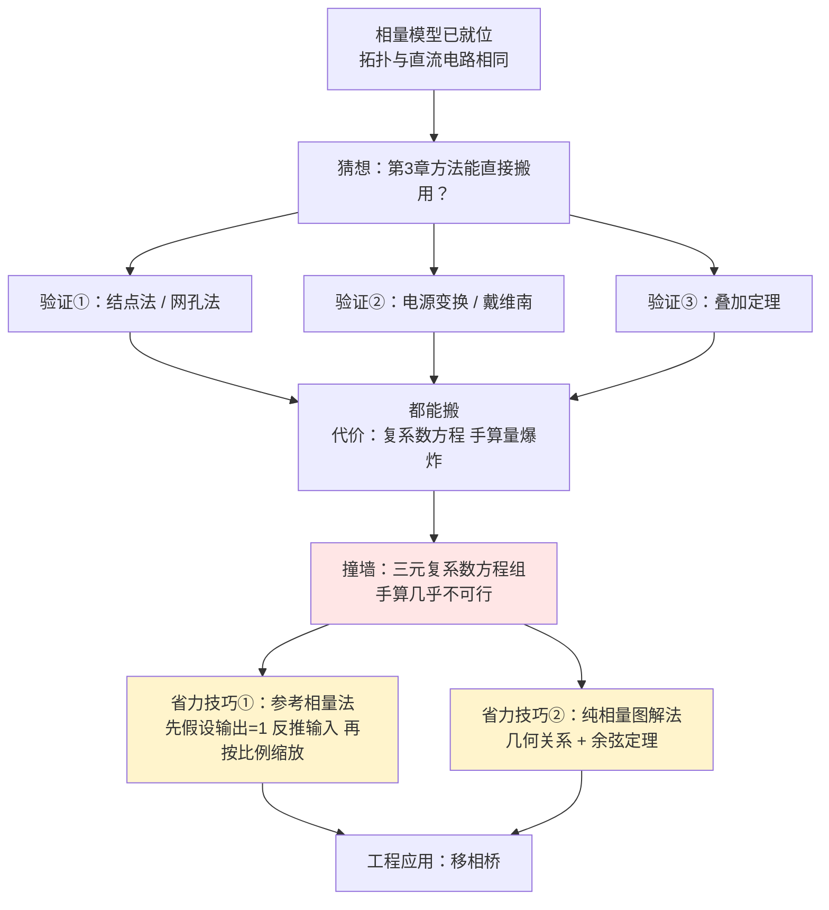

# C4.3 正弦稳态电路的一般分析 General Analysis of Sinusoidal Steady-State Circuits

> [!abstract] 这一讲的任务
> [[C4.2 元件相量模型与阻抗导纳]] 结束时留了个悬念：相量模型和时域电路**拓扑一模一样**，那第 3 章那一整套解法（网孔法、结点法、叠加、电源变换、戴维南/诺顿）能不能直接搬过来？
> 这一讲的答案是：**能，一个字都不用改**——但你要为此付出一个代价（方程从实系数变成复系数，手算量翻几倍）。所以这一讲还要教你两招课件里藏得很深、但考试和工程里都极好用的省力技巧：**参考相量法**和**纯相量图解法**。

> [!info] 怎么读这份讲义
> 第 1 节是方法论总纲（三步走），必须先读。第 2–4 节是五道例题，每道对应一种方法，可以按需跳读，但**例 2（受控源）和例 5（相量图解法）建议不要跳**——前者是最容易翻车的地方，后者是很多同学从没见过的解法。第 5 节的移相桥是一个漂亮的工程应用。

---

## 0. 开场：把上一讲的锤子递给你，你打算怎么挥

先看一个具体任务。课件第 36 页给了这样一道题：

> 电路：一个 $\pi$ 形网络，左边一条支路是 $5\,\Omega$ 串 $5\,\text{mH}$ 电感、接电源 $10\sin1000t$ V；右边一条支路是 $5\,\Omega$ 串 $200\,\mu\text{F}$ 电容、接电源 $u_S=10\sin(1000t+\pi/6)$ V；中间挂一个 $200\,\mu\text{F}$ 电容，流过它的电流是 $i$。求 $i$。

**两个电源、三条支路、一个独立结点。** 如果按 [[C4.1 正弦量与相量]] 第 0 节的老办法，你要列一个含二阶导数的微分方程组，然后拆一堆三角恒等式。

但你现在有相量了。先把元件换成阻抗：

$$
Z_L=j\omega L=j\cdot1000\cdot5\times10^{-3}=j5\ \Omega
$$
$$
Z_C=\frac{1}{j\omega C}=\frac{1}{j\cdot1000\cdot200\times10^{-6}}=\frac{1}{j0.2}=-j5\ \Omega
$$

一瞬间，电路变成了三条支路挂在一个结点上：$(5+j5)$、$(5-j5)$、$(-j5)$。

> [!question] 停一下，先自己想想
> 这个电路你在第 3 章见过一模一样的结构——一个独立结点、三条支路、两个电压源。当时你会用哪个方法？现在还能不能用？
>
> 答案是**结点法**，而且形式一个字都不变，只是把 $R$ 换成 $Z$、$G$ 换成 $Y$。往下看，我们一步步验证。

---

## 1. 相量分析法总纲（第 35 页）

> [!important] 正弦稳态电路的相量分析法（课件原文，三步）
> 1. **时域电路转化为相量模型**；
> 2. 按照**直流电路的分析方法**对相量模型进行分析，求响应的相量；
> 3. 对照时间函数与相量的关系，将响应相量转化为时间函数。
>
> **注（课件红字）**：在直流电阻电路中，电路方程为**实系数**线性方程组；而正弦稳态电路相量分析中，电路方程则是**复系数**线性方程组。

> [!note] 这三步为什么成立，用一句话说清楚
> 第 3 章的所有方法（结点法、网孔法、叠加、戴维南）在推导时**只用到了两样东西**：KCL/KVL，以及元件的线性 VCR。
> - KCL/KVL 在相量域形式不变（[[C4.2 元件相量模型与阻抗导纳]] 第 2.5 节已证）；
> - 元件 VCR 在相量域仍是线性的（$\dot U=Z\dot I$）。
>
> 推导所依赖的前提全部保留 ⇒ **结论全部保留**。这就是"一个字都不用改"的严格理由，不是类比，是证明。

> [!warning] 唯一改变的是"数域"，但这个改变的代价很大
> 实系数三元方程组用行列式手算大约 5 分钟；**复系数**三元方程组每一次乘除都要做复数运算，手算 30 分钟起步且极易出错。
> 所以做交流题的策略和直流题不同：**先花 30 秒挑方法**（哪种未知量最少），比闷头列方程重要得多。选择顺序建议：
> 1. 能用**串并联 + 分压分流**直接推的，绝不列方程组；
> 2. 只有一两个独立结点 → **结点法**；网孔少 → **网孔法**；
> 3. 只求某一条支路的量 → **戴维南** 或 **电源变换**；
> 4. 多个不同性质的电源 → **叠加**（但注意：只有当各电源同频时才能在相量域叠加）。

### 1.1 例 0 的完整解答（第 36 页）

**第 1 步：作电路的相量模型。**

$$
Z_L=j5\ \Omega,\quad Z_C=-j5\ \Omega,\quad \dot U_{S1}=\frac{10}{\sqrt2}\angle0^\circ\ \text{V},\quad \dot U_{S}=\frac{10}{\sqrt2}\angle30^\circ\ \text{V}
$$

（注意：$10\sin1000t$ 的峰值是 10，所以有效值是 $10/\sqrt2$。本题用 sin 映射。）

**第 2 步：列结点方程。** 取下面那条公共线为参考结点，中间结点电位为 $\dot U_1$：

$$
\left(\frac{1}{5+j5}+\frac{1}{5-j5}+\frac{1}{-j5}\right)\dot U_1=\frac{1}{5+j5}\cdot\frac{10}{\sqrt2}\angle0^\circ+\frac{1}{5-j5}\cdot\frac{10}{\sqrt2}\angle30^\circ
$$

**第 3 步：解出结点电压与响应相量。**

$$
\dot U_1=3.5355\angle-30^\circ\ \text{V}
$$
$$
\dot I=\frac{\dot U_1}{-j5}=\frac{3.5355\angle-30^\circ}{5\angle-90^\circ}=0.7071\angle60^\circ\ \text{A}
$$

**独立复算结果：$\dot U_1=3.5355\angle-30.000^\circ$ V，$\dot I=0.7071\angle60.000^\circ$ A，与课件完全一致。**

**第 4 步：将响应转化为时间函数。**

$$
i(t)=\sqrt2\times0.7071\sin(1000t+60^\circ)=\boxed{\sin(1000t+60^\circ)\ \text{A}}
$$

> [!note] 第 4 步的 $\sqrt2$ 千万别丢
> 相量的模是**有效值**，回时域必须乘 $\sqrt2$ 才是峰值。这里 $0.7071\times\sqrt2=1.000$，所以时域幅度恰好是 1 A，写出来看不见 $\sqrt2$——**这是个巧合，不是规律**。下一道例题里 $0.338$ 就必须写成 $0.338\sqrt2$。

---

## 2. 例题一：网孔法与结点法（第 37–39 页）

> [!example] 课件原题（第 37 页）
> 图示电路中，$R_1=10\,\Omega$，$R_2=20\,\Omega$，$R_3=15\,\Omega$，$R_4=30\,\Omega$，$L=10$ mH，$C=10\,\mu$F。
> $$u_S(t)=\sqrt2\cdot24\cdot\sin(10^3t)\ \text{V},\qquad i_S(t)=\sqrt2\cdot\cos(10^3t)\ \text{mA}$$
> 试求电路中 $R_4$ 两端电压。
> **取相量映射关系**：$\dot U\Leftrightarrow\sqrt2\,U\cos(10^3t)$，$\dot I\Leftrightarrow\sqrt2\,I\cos(10^3t)$。

![[C4-例题四电阻LC电路.png]]

**第 1 步：作相量模型，注意映射方式。**

题目**指定用 cos 映射**，但 $u_S$ 是 sin 形式，必须先换：

$$
\sqrt2\cdot24\sin(10^3t)=\sqrt2\cdot24\cos(10^3t-90^\circ)\ \Longrightarrow\ \dot U_S=24\angle-90^\circ=-j24\ \text{V}
$$
$$
i_S=\sqrt2\cos(10^3t)\ \text{mA}\ \Longrightarrow\ \dot I_S=1\angle0^\circ\ \text{mA}=1\ \text{mA}
$$

阻抗：

$$
Z_L=j\omega L=j\cdot10^3\cdot10\times10^{-3}=j10\ \Omega,\qquad Z_C=\frac{1}{j\omega C}=\frac{1}{j\cdot10^3\cdot10\times10^{-6}}=-j100\ \Omega
$$

> [!warning] 映射方式不统一 = 整题报废
> 题目一个电源写 sin、一个写 cos，就是在**故意**考这一点。如果你把 $\dot U_S$ 按 sin 映射成 $24\angle0^\circ$、$\dot I_S$ 按 cos 映射成 $1\angle0^\circ$，两者之间就凭空多了 90° 的相位差，答案必错。
> **做题第一动作**：在草稿纸最上面写一行"本题用 cos 映射"，然后把所有电源都化成 cos 再取相量。

**第 2 步（解法一，第 38 页）：网孔法。**

课件给出的三个网孔方程（网孔电流 $\dot I_1$、$\dot I_2$、$\dot I_3$）：

$$
\begin{cases}
(30+j10)\dot I_1-(10+j10)\dot I_2-20\dot I_3=\dot U_S=-j24\\
-(10+j10)\dot I_1+(55+j10)\dot I_2-15\dot I_3=0\\
-20\dot I_1-15\dot I_2+(35-j100)\dot I_3=j100\,\dot I_S=j100
\end{cases}
$$

课件给出的解：$\dot I_2=0.338\angle147^\circ$ A，于是

$$
i_2=0.338\sqrt2\cos(10^3t+147^\circ)\ \text{A},\qquad u_{R_4}=R_4i_2=10.147\sqrt2\cos(10^3t+147^\circ)\ \text{V}
$$

> [!warning] 数值复核：相角符号与课件不符
> 我把课件印出来的这三个方程原样交给数值求解，得到
> $$\dot I_1=1.0134\angle-141.10^\circ,\quad \dot I_2=0.3382\angle\mathbf{-146.97}^\circ,\quad \dot I_3=0.8197\angle174.04^\circ\ \text{A}$$
> **模 0.338 与课件完全一致，但相角是 $-147^\circ$ 而不是 $+147^\circ$。**
> 第 39 页的结点法（另一组完全独立的方程）我也复算了：$\dot U_3=10.1469\angle\mathbf{-146.97}^\circ$ V，**同样是负角**，模 10.147 与课件一致。
> 两种方法各自独立地给出 $-147^\circ$，说明课件印的方程本身没问题，是**最终答案的负号在两页上都被漏掉了**。
> 正确结果应为：
> $$u_{R_4}=10.147\sqrt2\cos(10^3t-147^\circ)\ \text{V}$$
> 做作业时按 $-147^\circ$ 写；若老师按课件判分，可在旁边注明复算过程。

**第 3 步（解法二，第 39 页）：结点法。**

取 0 号结点为参考。$\dot U_1$ 由电压源直接确定：$\dot U_1=-j24$ V。另两个结点方程：

$$
-\frac1{20}\dot U_1+\left(\frac1{20}+\frac1{15}+\frac1{10+j10}\right)\dot U_2-\frac1{15}\dot U_3=0
$$
$$
-\frac{1}{-j100}\dot U_1-\frac1{15}\dot U_2+\left(\frac1{30}+\frac1{15}+\frac1{-j100}\right)\dot U_3=-1
$$

解得 $\dot U_3=10.147\angle-147^\circ$ V，而 $R_4$ 两端电压就是 $\dot U_3$：

$$
u_{R_4}=u_3=10.147\sqrt2\cos(10^3t-147^\circ)\ \text{V}
$$

> [!note] 两种方法怎么选（课件把两种解法并排放，用意就在这里）
> - **网孔法**：未知量 = 网孔数 = 3（本题）。含**电流源**时麻烦（要引入超网孔或把它当已知网孔电流）。
> - **结点法**：未知量 = 独立结点数 = 3，但其中 $\dot U_1$ 被电压源**直接钉死**，实际只需解 2 个方程。含**电压源**时反而变简单。
>
> **本题结点法明显更省力**。速判窍门：**电压源多用结点法，电流源多用网孔法**；本题两种源都有，就数一数哪种方法能被"钉死"更多未知量。

---

## 3. 例题二：含受控源（第 40–41 页）

> [!example] 课件原题
> 已知 $u_S=10\sqrt2\sin10^3t$ V，电路含一个 **CCCS 受控电流源 $2\dot I_1$**（受 $\dot I_1$ 控制）。求 $i_1$、$i_2$。
> 元件：$3\,\Omega$ 电阻、$4$ mH 电感、$500\,\mu$F 电容。

![[C4-受控源例题电路与相量模型.png]]

**第 1 步：相量模型。**

$$
Z_L=j\omega L=j\cdot10^3\cdot4\times10^{-3}=j4\ \Omega
$$
$$
Z_C=-j\frac{1}{500\times10^{-6}\times10^3}=-j2\ \Omega
$$
$$
\dot U_S=10\angle0^\circ\ \text{V}
$$

**第 2 步：回路法（课件解法一）。**

$$
\begin{cases}
(3+j4)\dot I_1-j4\dot I_2=10\\
-j4\dot I_1+(j4-j2)\dot I_2=-2\dot I_1
\end{cases}
\ \Longrightarrow\
\begin{cases}
(3+j4)\dot I_1-j4\dot I_2=10\\
(2-j4)\dot I_1+j2\dot I_2=0
\end{cases}
$$

解得：

$$
\dot I_1=1.24\angle29.7^\circ\ \text{A},\qquad \dot I_2=2.77\angle56.3^\circ\ \text{A}
$$

**独立复算：$\dot I_1=1.2403\angle29.745^\circ$ A，$\dot I_2=2.7735\angle56.310^\circ$ A ——与课件一致。**

回时域（本题用 sin 映射）：

$$
i_1=1.24\sqrt2\sin(10^3t+29.7^\circ)\ \text{A},\qquad i_2=2.77\sqrt2\sin(10^3t+56.3^\circ)\ \text{A}
$$

**第 3 步：结点法（课件解法二）。**

$$
\begin{cases}
\left(\dfrac13+\dfrac1{j4}+\dfrac1{-j2}\right)\dot U_1=\dfrac{10}{3}+\dfrac{2\dot I_1}{-j2}\\[4pt]
\dot I_1=\dfrac{10-\dot U_1}{3}
\end{cases}
$$

> [!warning] 含受控源的两条铁律（这是本讲最容易翻车的地方）
> 1. **受控源在列方程时当独立源处理，但它的控制量必须最终用未知量表达。** 上面结点法里，$2\dot I_1$ 先当成一个已知电流源写进方程右边，然后**必须补一条"控制量方程"** $\dot I_1=(10-\dot U_1)/3$，把它换成 $\dot U_1$ 的函数。少写这一条，方程数就不够。
> 2. **求戴维南等效电阻时，受控源绝不能置零**（详见第 4 节）。

> [!note] 注意 $\dot I_2$ 比 $\dot I_1$ 还大
> $2.77>1.24$——受控源"凭空"给右半边注入了电流。这在含受控源电路里很常见，因为受控源本质上是一个**能量放大的模型**（背后是三极管的电源在供电，见 [[C2.3 双端口器件的电路模型]]）。看到这种结果不要以为算错了。

---

## 4. 例题三：电源变换、戴维南、叠加——同一道题三种解法（第 42–45 页）

### 4.1 题目与解法 1：电源变换（第 42 页）

> [!example] 课件原题
> 已知 $\dot I_S=4\angle90^\circ$ A，$Z_1=Z_2=-j30\,\Omega$，$Z_3=30\,\Omega$，$Z=45\,\Omega$。求流过 $Z$ 的 $\dot I$。
> 结构：电流源 $\dot I_S$ 与 $Z_1$、$Z_3$ 并联，再经 $Z_2$ 串到 $Z$。

![[C4-阻抗网络例题电路.png]]

**【解法 1】电源变换**

**第 1 步：把 $Z_1\parallel Z_3$ 合并。**

$$
Z_1\parallel Z_3=\frac{(-j30)(30)}{-j30+30}=\frac{-j900}{30-j30}=\frac{900\angle-90^\circ}{42.426\angle-45^\circ}=21.213\angle-45^\circ=15-j15\ \Omega
$$

**第 2 步：把"电流源并阻抗"变换成"电压源串阻抗"**（诺顿 → 戴维南，[[C3.4 线性电路定理]] 的老工具）：

$$
\dot U_{eq}=\dot I_S(Z_1\parallel Z_3)=4\angle90^\circ\times21.213\angle-45^\circ=84.85\angle45^\circ\ \text{V}
$$

**第 3 步：现在是一个单回路串联电路，直接用欧姆定律。**

$$
\dot I=\frac{\dot I_S(Z_1\parallel Z_3)}{Z_1\parallel Z_3+Z_2+Z}=\frac{j4(15-j15)}{15-j15-j30+45}=\frac{60+j60}{60-j45}=\frac{84.85\angle45^\circ}{75\angle-36.87^\circ}
$$

$$
\dot I=\boxed{1.13\angle81.9^\circ\ \text{A}}
$$

**独立复算：$1.1314\angle81.87^\circ$ A ✓ 与课件一致。**

> [!note] 课件在这一步写的是 $\dfrac{5.657\angle45^\circ}{5\angle-36.9^\circ}$
> 那是把分子分母都除以 15 之后的写法（$84.85/15=5.657$，$75/15=5$），结果相同。这种"约掉公因子"的小技巧在手算复数除法时能省不少事。

### 4.2 解法 2：戴维南等效变换（第 43 页）

**第 1 步：把 $Z$ 摘掉，求 a–b 端的开路电压。**

$Z$ 摘掉后没有电流流过 $Z_2$，所以 $Z_2$ 上没有压降，开路电压就等于 $Z_1\parallel Z_3$ 上的电压：

$$
\dot U_0=\dot I_S(Z_1\parallel Z_3)=4\angle90^\circ\times21.213\angle-45^\circ=84.85\angle45^\circ\ \text{V}
$$

**第 2 步：求等效内阻抗**（电流源**开路**）：

$$
Z_0=Z_1\parallel Z_3+Z_2=(15-j15)+(-j30)=15-j45\ \Omega
$$

**第 3 步：接回负载。**

$$
\dot I=\frac{\dot U_0}{Z_0+Z}=\frac{84.85\angle45^\circ}{(15-j45)+45}=\frac{84.85\angle45^\circ}{60-j45}=1.13\angle81.9^\circ\ \text{A}
$$

**与解法 1 完全一致 ✓**

> [!important] 等效电源定理的相量域形式（第 52 页）
> ![[C4-戴维南诺顿定理相量域形式.png]]
> **戴维南定理**：任何线性正弦稳态含源二端网络，对外可等效为一个**电压源 $\dot U_{OC}$ 串联阻抗 $Z_0$**。
> **诺顿定理**：也可等效为一个**电流源 $\dot I_{SC}$ 并联阻抗 $Z_0$**。
> 两者的换算：$\boxed{\dot U_{OC}=Z_0\cdot\dot I_{SC}}$

> [!warning] 求 $Z_0$ 的三条注意（课件没展开，但第 3 章讲过，交流里同样适用）
> 1. **独立源置零**：电压源短路、电流源开路。
> 2. **受控源绝不置零**！含受控源时必须用"外加电源法"（加 $\dot U$ 测 $\dot I$，$Z_0=\dot U/\dot I$）或"开路电压除短路电流法"（$Z_0=\dot U_{OC}/\dot I_{SC}$）。
> 3. **$Z_0$ 一般是复数**，而且是**频率的函数**。同一个网络换个频率，$Z_0$ 完全不同。

### 4.3 解法 3：叠加定理（第 44–45 页）

> [!example] 课件原题（第 44 页）
> 用叠加定理计算电流 $\dot I_2$。已知 $\dot U_S=100\angle45^\circ$ V，$\dot I_S=4\angle0^\circ$ A。

> [!warning] 课件第 44 页的元件参数印错了
> 课件原文写的是"$Z_1=Z_3=50\angle30^\circ\,\Omega$, $Z_3=50\angle30^\circ\,\Omega$"——**$Z_3$ 出现了两次，$Z_2$ 从未定义**，显然是笔误。
> 从第 45 页的计算过程可以**反推**出真实参数：
> - 由 $\dot I_2'=\dot I_S\dfrac{Z_3}{Z_2+Z_3}=\dfrac{200\angle30^\circ}{50\sqrt3}$ 得 $\dot I_SZ_3=200\angle30^\circ$，而 $\dot I_S=4\angle0^\circ$，故 $\boxed{Z_3=50\angle30^\circ\,\Omega}$；
> - 由分母 $Z_2+Z_3=50\sqrt3=86.60\angle0^\circ$，减去 $Z_3=43.30+j25$，得 $\boxed{Z_2=43.30-j25=50\angle-30^\circ\,\Omega}$。
>
> 所以那一行应为：**$Z_1=Z_2=50\angle-30^\circ\,\Omega$，$Z_3=50\angle30^\circ\,\Omega$**。

**第 1 步：$\dot I_S$ 单独作用（$\dot U_S$ 短路）。**

此时 $Z_1$ 被电流源直接顶着（串在电流源支路上，不影响分流），电流 $\dot I_S$ 在 $Z_3$ 与 $Z_2$ 之间分流。**注意分流公式的分子取的是"另一条支路"的阻抗**：

$$
\dot I_2'=\dot I_S\frac{Z_3}{Z_2+Z_3}=\frac{4\angle0^\circ\times50\angle30^\circ}{50\sqrt3}=\frac{200\angle30^\circ}{86.60}=2.31\angle30^\circ\ \text{A}
$$

**第 2 步：$\dot U_S$ 单独作用（$\dot I_S$ 开路）。**

电流源开路后，$Z_1$ 悬空不起作用，剩下 $\dot U_S$ 驱动 $Z_2$ 与 $Z_3$ 串联回路：

$$
\dot I_2''=-\frac{\dot U_S}{Z_2+Z_3}=-\frac{100\angle45^\circ}{86.60}=-1.1547\angle45^\circ=1.155\angle-135^\circ\ \text{A}
$$

（负号来自 $\dot U_S$ 的极性与 $\dot I_2$ 参考方向相反；负号等价于相位 $+180°$。）

**第 3 步：叠加。**

$$
\dot I_2=\dot I_2'+\dot I_2''=2.31\angle30^\circ+1.155\angle-135^\circ
$$

拆成直角坐标：

$$
2.31\angle30^\circ=2.0007+j1.1547,\qquad 1.155\angle-135^\circ=-0.8165-j0.8165
$$
$$
\dot I_2=1.1842+j0.3382=\boxed{1.23\angle+15.9^\circ\ \text{A}}
$$

> [!warning] 数值复核：课件的相角符号写反了
> 课件第 45 页红框里写的是 $\dot I_2=1.23\angle\mathbf{-15.9}^\circ$ A。
> **独立复算结果为 $1.2309\angle+15.948^\circ$ A**——模完全一致，但**相角应为正**。
> 验证很直观：$\dot I_2'=2.31\angle30^\circ$ 的虚部 $+1.155$ 比 $\dot I_2''$ 的虚部 $-0.817$ 大，合成后虚部必为正，相角必然在第一象限。所以这是课件的一处**符号笔误**。

> [!warning] 叠加定理在交流里的两条限制（考试常考）
> 1. **只有各电源同频时，才能在相量域直接相加。** 频率不同必须分别求出时域函数后**在时域叠加**（这正是 [[C4.5 非正弦周期电路的谐波分析]] 的核心）。
> 2. **功率不满足叠加定理！** $P\neq P'+P''$，因为功率是电流的**二次**函数。这一条下一讲会详细讲。

### 4.4 例题四：受控源求特定相位差（第 46 页）

> [!example] 课件原题
> 已知 $Z=10+j50\,\Omega$，$Z_1=400+j1000\,\Omega$，电路含受控电流源 $\beta\dot I_1$。问：$\beta$ 等于多少时，$\dot U_S$ 和 $\dot I_1$ 的相位差为 $90^\circ$？

**解题思路**：相位差 90° $\Leftrightarrow$ $\dfrac{\dot U_S}{\dot I_1}$ 是**纯虚数** $\Leftrightarrow$ **实部为 0**。这是一个非常典型的"用复数条件翻译几何条件"的题型。

**第 1 步：由 KCL，总电流 $\dot I=\dot I_1+\beta\dot I_1=(1+\beta)\dot I_1$。**

**第 2 步：由 KVL 写 $\dot U_S$。**

$$
\dot U_S=Z\dot I+Z_1\dot I_1=Z(1+\beta)\dot I_1+Z_1\dot I_1
$$

**第 3 步：求比值并分离实虚部。**

$$
\frac{\dot U_S}{\dot I_1}=(1+\beta)Z+Z_1=(1+\beta)(10+j50)+(400+j1000)
$$
$$
=\underbrace{(410+10\beta)}_{\text{实部}}+j\underbrace{(50+50\beta+1000)}_{\text{虚部}}
$$

**第 4 步：令实部为零。**

$$
410+10\beta=0\ \Longrightarrow\ \boxed{\beta=-41}
$$

**第 5 步：验证。** 此时虚部 $=50+50(-41)+1000=50-2050+1000=-1000$，所以

$$
\frac{\dot U_S}{\dot I_1}=-j1000,\qquad \varphi=-90^\circ
$$

**电流超前电压 90°。**（独立复算：$(1-41)(10+j50)+(400+j1000)=-400-j2000+400+j1000=-j1000$ ✓）

> [!note] $\beta$ 为负数是什么意思
> 受控电流源的方向与图上标注的参考方向**相反**。这在数学上完全合法；工程上意味着这个受控源实际是在"吸"电流而不是"吐"电流。做题时不必因为负号而怀疑自己算错。

---

## 5. 两招省力技巧：相量图解法（第 47–51 页）

前面四道题都是"列方程 → 解复系数方程组"。但有一类题，用**相量图 + 几何关系**能快到离谱。

### 5.1 技巧一：参考相量法（第 47 页）

> [!example] 课件原题
> 电路：$\dot U_S$ 串 $R_1$、$j\omega L$ 后，接一个电容 $\frac{1}{j\omega C}$ 与电阻 $R_2$ 的并联。求 $\dot U_2$（$R_2$ 两端电压）。

![[C4-参考相量法电路与相量图.png]]

**思路**：如果从 $\dot U_S$ 正推，要先求总阻抗、再分压，复数运算一大堆。**倒过来做**：

**第 1 步：假设输出**。令 $\dot U_2'=1\angle0^\circ$（一个"假的"输出，作为参考相量）。

**第 2 步：由输出逐级倒推回输入**（全是乘法，没有除法，特别顺）：

$$
\dot I_2=\frac{\dot U_2'}{R_2},\qquad \dot I_1=j\omega C\dot U_2',\qquad \dot I=\dot I_1+\dot I_2
$$
$$
\dot U_R=R_1\dot I,\qquad \dot U_L=j\omega L\dot I,\qquad \dot U_1=\dot U_R+\dot U_L
$$
$$
\dot U_S'=\dot U_1+\dot U_2'
$$

**第 3 步：按比例缩放回真实值**。因为电路是**线性**的，所有响应都与激励成正比，所以

$$
\boxed{\dot U_2=\frac{\dot U_S}{\dot U_S'}\cdot\dot U_2'}
$$

> [!note] 为什么这招合法，以及它为什么快
> **合法性**来自线性电路的**齐次性**（homogeneity）：激励乘 $k$，响应也乘 $k$。所以"用假输入算出假输出，再按真假输入之比缩放"必然正确。
> **快**的原因：从输出往输入推，每一步都是"已知电压求电流（除以阻抗）"或"已知电流求电压（乘阻抗）"这种**单向**运算，永远不需要解方程组。而从输入往输出推，一开始就得先把整个网络的等效阻抗算出来。
> **适用条件**：**梯形（阶梯）网络**——即可以从末端一级一级往回推的结构。含桥式结构或多回路耦合时不适用。
> **接到你的专业**：这就是数字滤波器设计里的"**梯形网络综合**"和 SPICE 里的 ladder analysis；也是 [[C2.1 元件互连与传输线模型]] 里分析级联传输线的标准套路。

### 5.2 技巧二：纯相量图解法（第 48–49 页）

> [!example] 课件原题
> 已知 $U=115$ V，$U_1=55.4$ V，$U_2=80$ V，$R_1=32\,\Omega$，$f=50$ Hz。求线圈的电阻 $R_2$ 和电感 $L_2$。
> 电路：$R_1$ 与"线圈（$R_2$ 串 $L_2$）"串联，接在 $U$ 上。$U_1$ 是 $R_1$ 上的电压，$U_2$ 是线圈两端的电压。

![[C4-线圈参数测量电路与相量图.png]]

> [!question] 停一下，先自己想想
> 题目给了三个**电压有效值**，一个电阻，一个频率。注意 $55.4+80=135.4\neq115$——三个电压不满足代数加法（因为有相位差）。
> 你能只用"有效值"这三个数，把线圈的 $R_2$ 和 $L_2$ 反解出来吗？

**【解一】用相量图分析（第 48 页）**

**第 1 步：选参考相量。** 串联电路选**电流** $\dot I$ 作参考（它是公共量），放在实轴上。

**第 2 步：画相量图。**
- $\dot U_1=R_1\dot I$ 与 $\dot I$ **同相**，沿实轴；
- $\dot U_2$（线圈，感性）**超前** $\dot I$ 一个角度 $\theta_2$，斜向上；
- $\dot U=\dot U_1+\dot U_2$，是这两个矢量的**首尾相接**。

于是 $\dot U_1$、$\dot U_2$、$\dot U$ 构成一个**三角形**，三条边长分别是 55.4、80、115。

**第 3 步：求电流。**

$$
I=\frac{U_1}{R_1}=\frac{55.4}{32}=1.73\ \text{A}
$$

**第 4 步：对三角形用余弦定理求 $\theta_2$。**

$\dot U_1$ 与 $\dot U_2$ 之间的夹角是 $\theta_2$，但三角形内部与 $U$ 相对的那个角是 $(180^\circ-\theta_2)$，所以

$$
U^2=U_1^2+U_2^2-2U_1U_2\cos(180^\circ-\theta_2)=U_1^2+U_2^2+2U_1U_2\cos\theta_2
$$

代入数值：

$$
115^2=55.4^2+80^2+2\times55.4\times80\cos\theta_2
$$
$$
13225=3069.16+6400+8864\cos\theta_2\ \Longrightarrow\ \cos\theta_2=\frac{3755.84}{8864}=0.4237
$$
$$
\theta_2=\boxed{64.93^\circ}
$$

（课件写 $64.9^\circ$ ✓）

**第 5 步：把 $\dot U_2$ 分解成电阻分量和电感分量。**

$$
U_L=U_2\sin\theta_2=80\times0.9058=72.46\ \text{V}
$$
$$
U_{R_2}=U_2\cos\theta_2=80\times0.4237=33.90\ \text{V}
$$

**第 6 步：求参数。**

$$
X_L=\frac{U_L}{I}=\frac{72.46}{1.73}=41.88\ \Omega\ \Longrightarrow\ L_2=\frac{X_L}{2\pi f}=\frac{41.88}{314.16}=0.1333\ \text{H}
$$
$$
R_2=\frac{U_{R_2}}{I}=\frac{33.90}{1.73}=19.60\ \Omega
$$

**【解二】纯代数解法（第 49 页）**

不画图，直接列三个方程：

$$
I=\frac{U_1}{R_1}=\frac{55.4}{32}=1.73\ \text{A}
$$
$$
I=\frac{115}{\sqrt{(32+R_2)^2+(\omega L_2)^2}}=1.73\qquad\text{（总回路）}
$$
$$
I=\frac{80}{\sqrt{R_2^2+(\omega L_2)^2}}=1.73\qquad\text{（线圈支路）}
$$

两个方程两个未知数，解得

$$
R_2=19.58\ \Omega,\qquad \omega L_2=41.86\ \Omega\ \Longrightarrow\ L_2=\frac{41.86}{2\pi\times50}=0.133\ \text{H}
$$

**独立复算（用精确值 $I=55.4/32=1.73125$ A）：$\theta_2=64.930^\circ$，$U_L=72.464$ V，$X_L=41.856\,\Omega$，$L_2=0.13323$ H，$R_2=19.580\,\Omega$。**
两种解法一致，与课件也一致（课件解一写 19.6、解二写 19.58，只是四舍五入位数不同）。

> [!note] 两种解法的取舍
> - **解一（相量图）**：几何直观，中间量（$\theta_2$、$U_L$、$U_{R_2}$）都有明确物理含义，便于校验；但需要能正确画出相量图。
> - **解二（代数）**：不用画图，套公式即可；但要解一个含平方根的二元方程组，代数量大且中间过程没有物理意义，算错了不容易发现。
>
> **考试建议：用解一算，用解二验。** 这类"已知若干有效值反求元件参数"的题在期末里出现率很高。

### 5.3 工程应用：移相桥电路（第 50–51 页）

> [!example] 课件原题
> **移相桥电路**。当 $R_2$ 由 $0\to\infty$ 时，$\dot U_{ab}$ **大小不变**，相位从 $180^\circ\to0$。说明其工作原理。
> 电路：电源 $\dot U$ 两端接两条并联支路——左支路是两个相等的 $R_1$ 串联（中点 a），右支路是可变电阻 $R_2$ 串电容 $C$（中点 b）。输出取 a、b 两点之间。

![[C4-移相桥电路与相量图.png]]

**【解】课件给的五步分析：**

**1) 选 $\dot U$ 为参考相量**（画在水平方向）。

**2) $\dot U_1$、$\dot U_2$ 与 $\dot U$ 同相。** 左支路是两个相等的纯电阻分压，所以 $\dot U_1=\dot U_2=\dfrac12\dot U$，都与 $\dot U$ 同相，且 a 点恰好在 $\dot U$ 矢量的**中点**。

**3) $\dot I_C$ 超前 $\dot U$ 一个角度 $\theta$。** 右支路是 $R_2$ 串 $C$，呈容性，电流超前电压。

**4) $\dot U_{ab}=-\dot U_1+\dot I_CR_2$。**

**5) 改变 $R_2$。**

> [!important] 关键的几何洞察：b 点轨迹是一个半圆
> 右支路里 $\dot U=\dot I_CR_2+\dot U_C$，而 $\dot I_CR_2$（电阻电压，与 $\dot I_C$ 同相）与 $\dot U_C$（电容电压，滞后 $\dot I_C$ 90°）**互相垂直**。
> 两个互相垂直的矢量首尾相接、合成为**固定长度**的 $\dot U$——由初中几何的"**直径所对的圆周角是直角**"，b 点必然落在**以 $\dot U$ 为直径的圆**上！课件相量图里那条虚线半圆画的就是这个轨迹。
>
> 于是：**$\lvert\dot U_{ab}\rvert$ = 从圆心 a 到圆上一点 b 的距离 = 半径 = $\dfrac12\lvert\dot U\rvert$，恒定不变**；而 b 在圆上滑动时，$\dot U_{ab}$ 的**方向**在变——这就是"幅度不变、相位可调"的全部秘密。

**极限情况分析（第 51 页）**：

| $R_2$ | $\theta$（移相角） | 物理解释 |
|---|---|---|
| $R_2\to0$ | $\theta\to180^\circ$ | 右支路只剩电容，b 点跑到 $\dot U$ 的起点 |
| $R_2\to\infty$ | $\theta\to0^\circ$ | 右支路几乎纯电阻，b 点跑到 $\dot U$ 的终点 |
| 中间值 | 连续可调 | b 沿半圆滑动 |

**且 $R_2\uparrow$，$\lvert\theta\rvert\downarrow$。$\theta$ 为移相角，移相范围 $180^\circ\sim0^\circ$。**

> [!note] 接到你的专业：这是模拟移相器的原型
> "幅度不变、相位可调"正是**全通滤波器（all-pass filter）** 的定义。它在信号处理里的用途：
> - **群延迟均衡**：修正其他滤波器带来的相位失真，而不改变幅频响应；
> - **相控阵天线/波束成形**：给每个阵元不同的相位延迟来控制波束指向；
> - **正交调制**：产生相差 90° 的两路信号（I/Q 支路）；
> - **可控硅调光/调速**：改变触发角来控制导通时间。
>
> 数字域的对应物是全通节 $H(z)=\dfrac{z^{-1}-a^*}{1-az^{-1}}$，其零极点关于单位圆互为倒数——和上面那个"b 点在圆上滑动"的几何是同一个故事。

---

## 6. 例题五：戴维南定理求解（第 53 页）

> [!example] 课件原题
> 用戴维南定理求图示电路中的 $\dot I_3$。
> 已知 $\dot U_{S1}=100\angle0^\circ$ V，$\dot U_{S2}=100\angle90^\circ$ V，$R=5\,\Omega$，$X_L=5\,\Omega$，$X_C=2\,\Omega$。

![[C4-戴维南定理例题电路.png]]

**第 1 步：断开 $R$ 支路，求 a–b 间开路电压 $\dot U_{OC}$。**

断开后，$\dot U_{S1}$、$-jX_C$、$jX_L$、$\dot U_{S2}$ 构成一个单回路，回路电流

$$
\dot I_{\text{loop}}=\frac{\dot U_{S1}-\dot U_{S2}}{-jX_C+jX_L}
$$

开路电压等于从 b 点经 $jX_L$ 和 $\dot U_{S2}$ 走到 a 点：

$$
\dot U_{OC}=\frac{\dot U_{S1}-\dot U_{S2}}{-jX_C+jX_L}\cdot jX_L+\dot U_{S2}=\frac{100\angle0^\circ-100\angle90^\circ}{-j2+j5}\times j5+100\angle90^\circ
$$

分步算：

$$
\frac{100-j100}{j3}=\frac{141.42\angle-45^\circ}{3\angle90^\circ}=47.14\angle-135^\circ
$$
$$
47.14\angle-135^\circ\times5\angle90^\circ=235.7\angle-45^\circ=166.67-j166.67
$$
$$
\dot U_{OC}=166.67-j166.67+j100=166.7-j66.7=\boxed{179.5\angle-21.8^\circ\ \text{V}}
$$

**独立复算：$179.5055\angle-21.801^\circ$ V ✓ 与课件一致。**

**第 2 步：求等效内阻抗 $Z_0$**（两个独立电压源均短路）：

$$
Z_0=(-jX_C)\parallel(jX_L)=\frac{(-j2)(j5)}{-j2+j5}=\frac{10}{j3}=-j3.33\ \Omega
$$

**第 3 步：接回 $R$，求 $\dot I_3$。**

$$
\dot I_3=\frac{\dot U_{OC}}{Z_0+R}=\frac{179.5\angle-21.8^\circ}{5-j3.33}=\frac{179.5\angle-21.8^\circ}{6.005\angle-33.69^\circ}=\boxed{29.9\angle11.9^\circ\ \text{A}}
$$

**独立复算：$29.87\angle11.89^\circ$ A ✓ 与课件一致。**

> [!note] 注意 $Z_0$ 是纯虚数，而且是**容性**的
> $-j2$ 与 $j5$ 并联得到 $-j3.33$——两个纯电抗并联，结果仍是纯电抗，但符号可能翻转。
> 更有意思的是：如果 $X_C$ 恰好等于 $X_L$，分母 $-jX_C+jX_L=0$，$Z_0\to\infty$——**并联谐振**！那时这个二端网络对外相当于开路。这正是 [[C4.6 网络函数与谐振]] 要讲的现象，在这里已经埋下伏笔。

---

## 这一讲的三句话

1. **相量模型建好之后，第 3 章的方法一条都不用改**——因为那些方法的推导只依赖 KCL/KVL 和线性 VCR，两者在相量域都保持不变；唯一的改变是方程从实系数变成复系数。
2. **交流题的胜负手在"选方法"，不在"会解方程"**：电压源多用结点法、电流源多用网孔法、只求一支路用戴维南、梯形网络用参考相量法。
3. **含受控源时要格外小心两件事**：列方程必须补控制量方程；求 $Z_0$ 时受控源绝不能置零。

### 速查表

| 方法 | 适用场景 | 交流特有注意点 |
|---|---|---|
| 串并联 + 分压分流 | 单回路 / 简单网络 | 分量模之和 ≠ 总量模 |
| 结点法 | 电压源多、独立结点少 | 电压源直接钉死一个结点电位 |
| 网孔法 | 电流源多、网孔少 | 电流源支路直接给出网孔电流 |
| 电源变换 | 串并联链式结构 | $\dot U_{eq}=\dot I_SZ$ |
| 戴维南 / 诺顿 | 只求某一条支路 | $\dot U_{OC}=Z_0\dot I_{SC}$；含受控源不可置零 |
| 叠加定理 | 多电源 | **同频才能相量叠加；功率不能叠加** |
| 参考相量法 | 梯形（阶梯）网络 | 假设输出 = 1，倒推后按比例缩放 |
| 相量图解法 | 只给有效值、反求参数 | 串联选 $\dot I$ 参考、并联选 $\dot U$ 参考；用余弦定理 |

### 下一讲预告

到现在为止我们只关心"电压电流是多少"。但用电的人真正付钱买的是**功率**。既然 $\dot U$ 和 $\dot I$ 都是相量，那功率是不是就等于 $\dot U\cdot\dot I$？
——**不是。** 而且差得很远。下一讲会先让你亲眼看到这个乘法为什么失效，然后引出**有功、无功、视在、复功率**这一整套概念，最后回答一个每个数据中心都在花钱解决的问题：**为什么电费单上会有"功率因数罚款"这一项？**

---

## 本节自测 Self-Test

> [!question] Q1：为什么第 3 章的所有分析方法可以原封不动地搬到相量域？请给出严格理由（不要说"因为长得像"）。
> [!success]- 参考答案
> 因为那些方法的**推导过程只用了两样东西**：① KCL/KVL；② 元件的线性伏安关系。
> 而在相量域：① KCL/KVL 保持 $\sum\dot I_k=0$、$\sum\dot U_k=0$ 的形式（前提是所有量同频）；② 元件 VCR 变成 $\dot U=Z\dot I$，仍然线性。
> 推导所依赖的前提全部成立 ⇒ 结论全部成立。这是证明，不是类比。

> [!question] Q2：题目给出 $u_S=\sqrt2\cdot24\sin(10^3t)$ V 和 $i_S=\sqrt2\cos(10^3t)$ mA，要求用 cos 映射。写出两个电源的相量。
> [!success]- 参考答案
> $i_S$ 已是 cos 形式：$\dot I_S=1\angle0^\circ$ mA。
> $u_S$ 是 sin 形式，需换：$\sin x=\cos(x-90^\circ)$，故 $u_S=\sqrt2\cdot24\cos(10^3t-90^\circ)$，$\dot U_S=24\angle-90^\circ=-j24$ V。
> **关键**：全题必须统一映射，否则两个电源之间会凭空多出 90° 相位差。

> [!question] Q3：$L=10$ mH、$C=10\,\mu$F，$\omega=10^3$ rad/s。求二者的阻抗。
> [!success]- 参考答案
> $Z_L=j\omega L=j\times10^3\times10^{-2}=j10\,\Omega$。
> $Z_C=\dfrac{1}{j\omega C}=\dfrac{1}{j\times10^3\times10^{-5}}=\dfrac{1}{j0.01}=-j100\,\Omega$。

> [!question] Q4：含受控源的电路，用结点法时容易漏掉哪一步？用戴维南定理时又容易犯什么错？
> [!success]- 参考答案
> 结点法：把受控源当独立源写进方程后，**漏写"控制量方程"**（把控制量用结点电压表示），导致方程数少于未知数。
> 戴维南：求 $Z_0$ 时**把受控源也置零了**。受控源不是独立源，不能置零；必须用外加电源法（$Z_0=\dot U/\dot I$）或 $Z_0=\dot U_{OC}/\dot I_{SC}$。

> [!question] Q5：$\dot I_S=4\angle90^\circ$ A、$Z_1=Z_2=-j30\,\Omega$、$Z_3=30\,\Omega$、$Z=45\,\Omega$，求流过 $Z$ 的电流（用戴维南法）。
> [!success]- 参考答案
> $Z_1\parallel Z_3=\dfrac{(-j30)(30)}{30-j30}=21.213\angle-45^\circ=15-j15\,\Omega$。
> $\dot U_{OC}=\dot I_S(Z_1\parallel Z_3)=4\angle90^\circ\times21.213\angle-45^\circ=84.85\angle45^\circ$ V。
> $Z_0=(15-j15)+(-j30)=15-j45\,\Omega$。
> $\dot I=\dfrac{84.85\angle45^\circ}{(15-j45)+45}=\dfrac{84.85\angle45^\circ}{60-j45}=\dfrac{84.85\angle45^\circ}{75\angle-36.87^\circ}=\boxed{1.13\angle81.9^\circ\ \text{A}}$。

> [!question] Q6：叠加定理在正弦稳态电路里有哪两条限制？
> [!success]- 参考答案
> ① **同频才能在相量域叠加**。若各电源频率不同，必须分别求出各自的时域响应，再**在时域**相加（相量法只对单一频率有效）。
> ② **功率不能叠加**。$P\neq P'+P''$，因为 $P=I^2R$ 是电流的二次函数，而叠加定理只对线性（一次）关系成立。

> [!question] Q7：已知 $U=115$ V、$U_1=55.4$ V（$R_1=32\,\Omega$ 上）、$U_2=80$ V（线圈上）、$f=50$ Hz，求线圈的 $R_2$ 和 $L_2$，写出完整步骤。
> [!success]- 参考答案
> ① $I=U_1/R_1=55.4/32=1.731$ A。
> ② 余弦定理：$U^2=U_1^2+U_2^2+2U_1U_2\cos\theta_2$
> $13225=3069.16+6400+8864\cos\theta_2\Rightarrow\cos\theta_2=0.4237\Rightarrow\theta_2=64.93^\circ$。
> ③ $U_L=U_2\sin\theta_2=80\times0.9058=72.46$ V；$U_{R_2}=U_2\cos\theta_2=33.90$ V。
> ④ $X_L=72.46/1.731=41.86\,\Omega\Rightarrow L_2=41.86/(2\pi\times50)=\boxed{0.133\ \text{H}}$。
> ⑤ $R_2=33.90/1.731=\boxed{19.58\ \Omega}$。

> [!question] Q8：移相桥中，为什么 $\dot U_{ab}$ 的大小恒等于 $\frac12U$，与 $R_2$ 无关？
> [!success]- 参考答案
> 右支路中 $\dot I_CR_2$（与 $\dot I_C$ 同相）与 $\dot U_C$（滞后 $\dot I_C$ 90°）互相垂直，二者矢量和恒等于 $\dot U$。由"直径所对圆周角为直角"，b 点必落在**以 $\dot U$ 为直径的圆**上。
> 左支路是两个相等电阻分压，a 点恰在 $\dot U$ 的中点，即该圆的**圆心**。
> 所以 $\lvert\dot U_{ab}\rvert=$ 圆心到圆上一点的距离 $=$ 半径 $=\frac12U$，恒定。$R_2$ 变化只让 b 沿圆滑动，改变 $\dot U_{ab}$ 的方向（相位）。

> [!question] Q9：参考相量法为什么成立？它对什么样的电路结构适用？
> [!success]- 参考答案
> 成立依据是线性电路的**齐次性**：激励乘 $k$，响应也乘 $k$。所以先假设输出为 $1\angle0^\circ$、逐级倒推出对应的"假输入" $\dot U_S'$，再用 $\dot U_2=\dfrac{\dot U_S}{\dot U_S'}\dot U_2'$ 缩放，结果必然正确。
> 适用于**梯形（阶梯）网络**——能从末端一级一级往回推的结构。含桥式或多回路互耦的网络不适用。

> [!question] Q10：$Z=10+j50\,\Omega$、$Z_1=400+j1000\,\Omega$，含受控源 $\beta\dot I_1$。求使 $\dot U_S$ 与 $\dot I_1$ 相位差为 90° 的 $\beta$。
> [!success]- 参考答案
> 相位差 90° $\Leftrightarrow \dot U_S/\dot I_1$ 为纯虚数 $\Leftrightarrow$ 实部为 0。
> $\dfrac{\dot U_S}{\dot I_1}=(1+\beta)Z+Z_1=(410+10\beta)+j(1050+50\beta)$。
> 令 $410+10\beta=0\Rightarrow\boxed{\beta=-41}$。
> 此时虚部 $=1050+50\times(-41)=-1000$，即 $\dot U_S/\dot I_1=-j1000$，$\varphi=-90^\circ$，**电流超前电压 90°**。

---

**上一节 ←** [[C4.2 元件相量模型与阻抗导纳]]
**下一节 →** [[C4.4 正弦稳态功率与功率因数]]
**课程索引 →** [[电路基础 MOC]]
