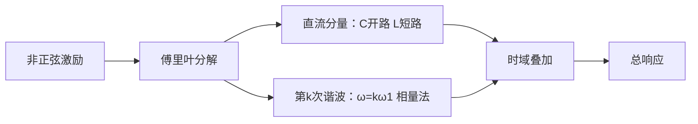

# C4.5 非正弦周期电路的谐波分析

> [!abstract] 这一讲的任务
> 方波、整流波和失真波都不是一个相量能代表的。线性电路的关键优势是：可以把它们拆成直流和许多正弦谐波，分别求解后再相加。

## 0. 开场：示波器上的方波，为什么频谱是一串线？

方波的边沿很陡，并不是“另一种基本波形”；在数学上它等于基波、三次、五次……正弦波叠出来的结果。电路对每个频率的反应不同，所以必须逐次谐波计算。

## 1. 傅里叶分解

满足狄里赫利条件的周期函数可写成
$$f(t)=A_0+\sum_{k=1}^{\infty}A_{km}\sin(k\omega_1t+\varphi_k).$$
$A_0$ 是直流分量，$k=1$ 是基波，$k\ge2$ 是谐波；频率为 $k f_1$。课件的对称方波只有奇次谐波：
$$u(t)=\frac{4U_m}{\pi}\sum_{n=1}^{\infty}\frac1{2n-1}\sin[(2n-1)\omega_1t].$$

> [!warning] 吉布斯现象
> 只取有限项时，跳变边沿旁会有过冲；增加项数会让过冲区域更窄，却不会完全消失。这不是电路算错，而是有限谐波逼近不连续点的固有现象。

## 2. 有效值、功率与分析流程

各频率彼此正交，因此
$$U=\sqrt{U_0^2+\sum_{k=1}^{\infty}U_k^2},\qquad
P=U_0I_0+\sum_{k=1}^{\infty}U_kI_k\cos\varphi_k.$$
不同频率之间的平均功率交叉项为零，不能把不同频率的相量直接相加。

![[C4-方波傅里叶级数逼近.png]]

> [!note] 图怎么读
> 灰色虚线是目标方波，红线是有限个奇次谐波的合成结果。项数增加使平顶更平、边沿更陡；边沿附近仍存在的波纹就是吉布斯现象。

![[C4-谐波分析方法流程图.png]]

## 这一讲的三句话

1. 非正弦周期量可拆成直流加各次同频正弦谐波。
2. 线性电路对每个谐波独立求解，最后只在时域相加。
3. RMS 和平均功率按各频率分量的平方/功率相加，不能混频相量相加。

**上一节：** [[C4.4 正弦稳态功率与功率因数]]　|　**下一节：** [[C4.6 网络函数与谐振]]　|　[[电路基础 MOC]]
