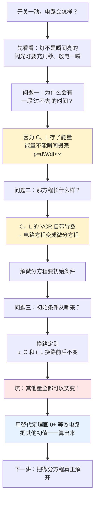
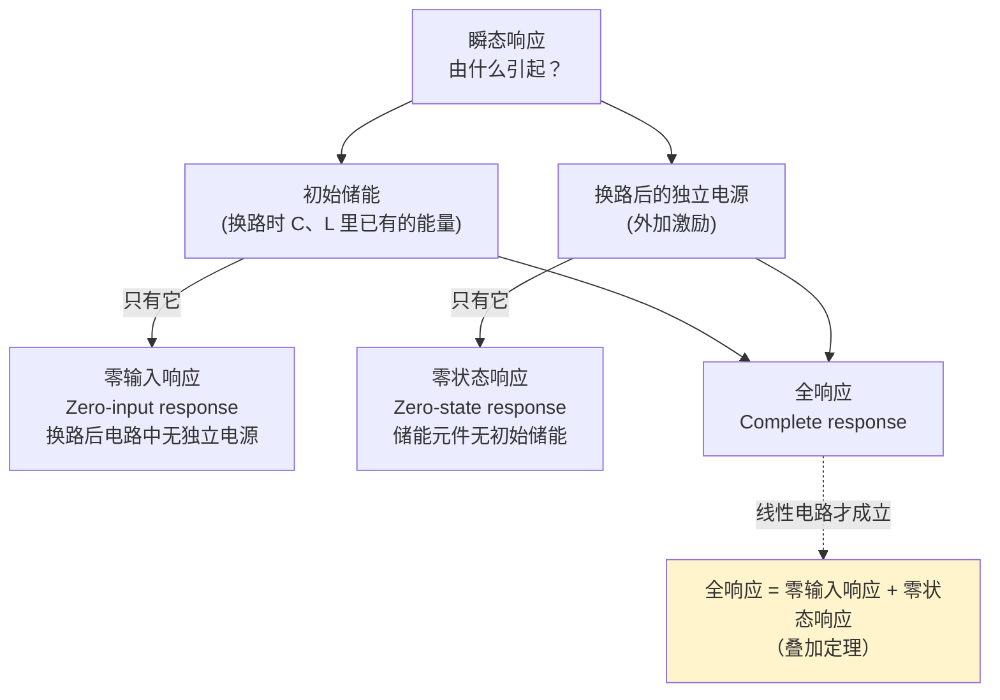
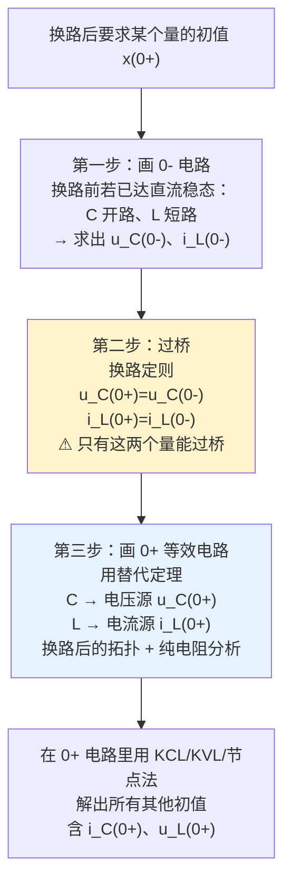

# C5.1 动态电路与换路定则

> [!abstract] 这一讲的任务
> 前面四章我们做的所有事情，本质上都是**解代数方程**：KCL、KVL 是代数方程，欧姆定律是代数方程，就连第 4 章的相量法也只是把微分方程"藏"进了复数运算里，最后落地的还是代数方程。这一讲我们要撞上第一堵墙：**只要电路里有电容或电感，而且开关刚刚动过，代数方程就不够用了**。
> 这一讲解决两件事：（1）说清楚这个"不够用"到底出在哪；（2）在正式解微分方程之前，先把解方程必需的那个东西——**初始条件**——完整地求出来。求初值本身不需要解微分方程，这是本讲最实用的收获。

> [!info] 怎么读这份讲义
> 从第 0 节的场景开始顺着读，不要跳。第 2 节和第 4 节是本讲的两个"撞墙点"，读到那里请先合上讲义自己想三十秒。第 5 节的三个例题请务必自己动笔算一遍再看答案——本讲最大的坑（"换路定则只管 $u_C$ 和 $i_L$"）就藏在那三道题里。
>
> **本讲授课教师**：Professor Rui-Xiang Yin（尹瑞祥），etrxyin@scut.edu.cn。这是本课程第一次换教师，前四章由区俊辉（Jun-Hui Ou）主讲。第 5 章课件封面页仍是旧模板、署名 Jun-Hui Ou，但每一页页眉写的都是尹老师，符号习惯（如用 $\varepsilon(t)$ 而非 $u(t)$ 表示阶跃）也随之改变，看课件时留意。

---

## 0. 开场：闪光灯为什么"充几秒、闪一下"

拿起手机拍夜景，你按下快门，闪光灯"啪"地亮了一下，然后手机背面会有一小段时间不能再闪——需要"回气"。如果用的是老式相机的氙气闪光灯，你甚至能听见一阵越来越尖的"咦——"声，那是升压电路在给电容充电。

把这件事拆开看，是两个完全不同的时间尺度：

- **充电**：电池经过一个限流电阻给一个几百微法的电容充电，要**几秒**。
- **放电**：电容对着氙灯管几乎零电阻地放电，**几十微秒**就完事了，能量全变成光。

同一个电容，同一堆能量，充要几秒、放只要几十微秒。**是谁决定了这个时间？** 不是电容自己，也不是电源自己——你把电容换大一倍，时间翻倍；你把限流电阻换大一倍，时间也翻倍。这里显然有个由**电路参数决定的固有时间**在起作用。

再来一个你天天遇到的：**按下开关的那一瞬间，灯为什么不是立刻亮到最亮**？白炽灯是灯丝升温需要时间；但即使换成纯电阻负载、纯电感负载，只要电路里有 $L$，电流也不会立刻跳到终值。

> [!question] 停一下，先自己想想
> 用你到目前为止学过的所有东西（KCL、KVL、欧姆定律、戴维南定理、相量法），能不能算出"从按下开关到电容充到 63%，需要多久"？
>
> 试试看。你会发现：**你连这个问题都写不出方程**。因为你手上所有的方程里都没有"时间"这个变量。$U = IR$ 里没有 $t$，$\dot{U} = \dot{I}Z$ 里的 $t$ 被相量法藏起来了（而且相量法只对"已经稳定的正弦"成立）。
>
> 这就是这一整章存在的理由。

---

## 1. 第一步：把"电阻电路"和"动态电路"分开（课件 p2）

先做一件很朴素的事——分类。

**电阻电路（resistive circuit）**：电路中只有电阻元件和电源元件。

- KCL 方程：代数方程 $\sum i = 0$
- KVL 方程：代数方程 $\sum u = 0$
- 元件特性：代数方程 $u = Ri$

三类方程全是代数方程，联立起来还是代数方程。所以：

> [!important] 电阻电路 = 即时电路（instantaneous circuit）
> **此刻的响应只由此刻的激励决定**。你把电源在 $t=3\,\mathrm{s}$ 时刻的值告诉我，我立刻能算出 $t=3\,\mathrm{s}$ 时刻每条支路的电流，完全不需要知道 $t=3\,\mathrm{s}$ 之前发生过什么。电路没有"记忆"。

**动态电路（dynamic circuit）**：电路中含有储能元件 $L$（或互感 $M$）、$C$。

- KCL、KVL 仍然是代数方程（拓扑约束跟元件是什么无关，见 [[C1.5 电路分析的基本定律]]）
- **但元件特性方程含微分或积分**：
$$i_C = C\frac{\mathrm{d}u_C}{\mathrm{d}t}, \qquad u_L = L\frac{\mathrm{d}i_L}{\mathrm{d}t}$$

联立之后，整个电路的方程就变成了**微分方程**。

> [!important] 动态电路 = 记忆电路（memory circuit）
> 把电容的 VCR 反过来写就看得一清二楚：
> $$u_C(t) = \frac{1}{C}\int_{-\infty}^{t} i(\xi)\,\mathrm{d}\xi$$
> 此刻的 $u_C$ 是**从宇宙开端到现在所有电流的累积**。电容"记得"你以前给它灌过多少电荷。这就是"记忆"两个字的字面含义。

> [!question] 课堂追问：为什么方程变成微分方程是必然的，而不是"碰巧"？
> 因为微分方程这件事**根本不是从 KCL/KVL 来的，而是从元件定义来的**。回到 [[C1.4 理想电路元件]]：电容被定义为"电荷与电压成正比的元件" $q = Cu$。电流的定义是 $i = \mathrm{d}q/\mathrm{d}t$。两句话一合并，$i = C\,\mathrm{d}u/\mathrm{d}t$ 里的那个导数就**赖不掉**了。
>
> 所以你没有任何办法把它绕过去：只要一个元件的"能量状态"和"端口变量"之间隔着一个时间导数，含它的电路方程就必然是微分方程。这不是数学技巧问题，是物理事实。

**停一下，我们刚才干了什么**：我们把电路分成了两类，并且指出这个分类的分界线不在"元件叫什么名字"，而在**"元件的伏安关系里有没有 $\mathrm{d}/\mathrm{d}t$"**。有导数 → 微分方程 → 有过渡过程 → 有"时间"这件事可谈。

---

## 2. 过渡过程：两个稳态之间的那段路（课件 p3–5）

### 2.1 一个最简单的观察

![[C5-换路前后稳态与过渡示意.png]]

看左边：开关 S 打开，$U_S$ 接不到 $RC$ 上。这是一个**稳态**：
$$i = 0,\qquad u_C = 0$$

看右边：开关 S 合上，等足够久之后，电容充满不再流电流，这是**另一个稳态**：
$$i = 0,\qquad u_C = U_S$$

两个稳态的 $i$ 都等于零，但 $u_C$ 从 $0$ 变成了 $U_S$。问题来了：**它是怎么变过去的？**

> [!important] 过渡过程（transient process，也叫瞬态过程）
> 电路由一个稳态过渡到另一个稳态所必须经历的过程。

![[C5-uC过渡过程三阶段曲线.png]]

课件这张图把时间轴切成三段，请记住这三个词，后面反复要用：

| 区间 | 名称 | $u_C$ |
|---|---|---|
| $t<0$ | 起始状态（旧稳态） | $0$ |
| $0<t<t_1$ | 过渡状态（动态） | 从 $0$ 单调爬向 $U_S$ |
| $t>t_1$ | 新稳态 | $U_S$ |

### 2.2 过渡过程为什么会存在？（课件 p4）

课件给了两条原因，一条内因、一条外因。这两条**缺一不可**。

**内因：电路中含有储能元件。**

这条的逻辑链条课件只写了一行 $p = \dfrac{\mathrm{d}w}{\mathrm{d}t} < \infty$，我们把它补完：

1. 电容储能 $W_C = \frac12 C u_C^2$，电感储能 $W_L = \frac12 L i_L^2$（见 [[C1.4 理想电路元件]]）。
2. 功率是能量的变化率：$p = \dfrac{\mathrm{d}W}{\mathrm{d}t}$。
3. **现实世界里功率必须是有限值**——没有任何电源能提供无穷大功率。
4. 若 $p$ 有限，则 $W$ 关于 $t$ 的导数有限，故 **$W$ 必须是连续函数，不能跳变**。
5. $W_C$ 连续 $\Rightarrow$ $u_C$ 连续；$W_L$ 连续 $\Rightarrow$ $i_L$ 连续。
6. 而新旧两个稳态的 $u_C$（或 $i_L$）一般是不同的两个数。**要从一个数连续地走到另一个数，就必须花时间。**

这就是过渡过程存在的全部理由。**"过渡过程"三个字的物理内核，就是"能量搬运需要时间"。**

**外因：电路结构或参数发生变化，即"换路"。**

> [!important] 换路（switching）
> - 支路的接入、断开；开路、短路等**结构变化**
> - 元件**参数变化**（例如电位器被拧动）

![[C5-换路的两种情形电路.png]]

**两条原因合在一起才充分必要**（课件 p5 明确写了"充分必要条件"）：

> [!important] 换路后电路产生瞬态过程的充分必要条件
> 电路中含有储能元件，**且换路前后电路储能平衡发生变化**。

"且"字很关键。反例：一个已经充到 $U_S$ 的电容，你再并上一个电压也是 $U_S$ 的电源——有储能元件，也换了路，但储能不需要变，于是**没有过渡过程**。

![[C5-瞬态过程仿真波形iR_iL_iC.png]]

这张仿真图是课件 p5 的实测对照，值得看仔细：同一个电源、同样在 10 ms/20 ms/30 ms/40 ms 依次投入更多支路，三条曲线的行为完全不同——

- $i_R$（纯电阻）：每次换路后**直上直下**，是台阶，没有过渡过程。
- $i_L$（含电感）：每次换路后**从旧值指数地爬向新值**，连续、不跳变。
- $i_C$（含电容）：换路瞬间**猛地跳起一个尖峰**然后迅速衰减回去。

> [!question] 停一下，先自己想想
> $i_L$ 不跳变，我们已经解释过了（能量不能突变）。但 $i_C$ **跳得很凶**，它在 10 ms 处从 0 直接冲到接近 2.5 mA。
>
> 这跟"能量不能突变"矛盾吗？
>
> **不矛盾。** 电容储的能量是 $\frac12 Cu_C^2$，跟 $u_C$ 有关，跟 $i_C$ **一点关系都没有**。$i_C$ 想怎么跳就怎么跳，它跳并不搬运任何"已存的"能量，它只是在描述能量正在以多快的速率被搬进去。
>
> 记住这一条，它是本讲最大的坑，第 4 节会专门再讲一次。

### 2.3 瞬态响应的三种分类（课件 p6）

> [!important] 瞬态响应（transient response）
> 处于瞬态过程中的支路电压、电流的**时间函数**。注意：响应是"函数"，不是"数"。

按"激励"和"初始储能"这两个来源，分成三类：

| 名称 | 初始储能 | 换路后的独立源 |
|---|---|---|
| 零状态响应 | **无**（$u_C(0_-)=0$、$i_L(0_-)=0$） | 有 |
| 零输入响应 | 有 | **无** |
| 全响应 | 有 | 有 |

> [!important] 如果电路是线性的，则总的电压或电流响应可以应用叠加定理分析
> $$\boxed{\text{全响应} = \text{零输入响应} + \text{零状态响应}}$$
> 这条**只对线性电路成立**，因为它的本质就是 [[C3.4 线性电路定理]] 里的叠加定理——把"初始储能"和"外加电源"当成两组独立的激励源分别作用，再相加。C5.2 会把这件事讲透。

---

## 3. $0_-$、$0$、$0_+$：三个时刻，别混（课件 p7）

![[C5-初值例题RC电路与0加等效电路.png]]

设换路发生在 $t=0$（如果发生在 $t_0$，把下面所有的 0 换成 $t_0$ 即可）。

> [!important] 三个时刻
> | 记号 | 含义 | 数学定义 |
> |---|---|---|
> | $t = 0_-$ | 换路**前**的最后一瞬间 | $f(0_-) = \lim\limits_{t\to 0,\;t<0} f(t)$ |
> | $t = 0$ | 换路**瞬间**（开关正在动） | —— |
> | $t = 0_+$ | 换路**后**的第一瞬间 | $f(0_+) = \lim\limits_{t\to 0,\;t>0} f(t)$ |

三个时刻在时间轴上"挨在一起"，间隔是零，但**函数值可以完全不同**。这不是玩弄数学，这是物理：开关合上的那一刹那，电路的拓扑结构变了，方程变了，解也就变了。

**为什么非要区分？** 因为一个 $RLC$ 串联电路换路后的方程是
$$LC\frac{\mathrm{d}^2u_C}{\mathrm{d}t^2} + RC\frac{\mathrm{d}u_C}{\mathrm{d}t} + u_C = U_S \qquad (t>0)$$
这个方程**只在 $t>0$ 成立**（因为开关合上之后拓扑才是这样）。要给这个方程定解，需要的初始条件是 **$t = 0_+$ 时刻**的 $u$、$i$ 及其各阶导数的值——不是 $0_-$ 的，也不是 $0$ 的。

而我们唯一有把握直接算出来的，恰恰是 **$0_-$ 时刻**的东西（因为换路前电路通常已经稳定了，用第 1–3 章的方法就能解）。

> [!important] 于是问题变成
> **已知 $0_-$，怎么跨过 $t=0$ 这道坎，求出 $0_+$？**
>
> 答案就是下一节的**换路定则**。它是这一整章唯一一座连接"换路前"和"换路后"的桥。

---

## 4. 换路定则：那座桥（课件 p8–10）

### 4.1 先自己猜一猜

朴素的想法是："换路瞬间时间间隔为零，所以什么都来不及变，$0_+$ 时刻所有量都等于 $0_-$ 时刻的值。"

**这个猜想是错的**，而且错得很典型。但它错在哪里，需要推导才说得清。下面就推。

### 4.2 电容：电荷守恒（课件 p8）

从电容电流的定义出发，$i = \dfrac{\mathrm{d}q_C}{\mathrm{d}t}$，反解得

$$q_C(t) = \int_{-\infty}^{t} i(\xi)\,\mathrm{d}\xi
= \underbrace{\int_{-\infty}^{0_-} i(\xi)\,\mathrm{d}\xi}_{q_C(0_-)} + \int_{0_-}^{t} i(\xi)\,\mathrm{d}\xi$$

取 $t = 0_+$：

$$q_C(0_+) = q_C(0_-) + \int_{0_-}^{0_+} i(\xi)\,\mathrm{d}\xi$$

关键就在最后那一项。**积分区间的长度是零**。一个宽度为零的区间上的积分等于零——**只要被积函数 $i(t)$ 是有限值**。

$$\text{当 } i(t) \text{ 为有限值时，}\quad \int_{0_-}^{0_+} i(\xi)\,\mathrm{d}\xi = 0$$

于是

$$\boxed{q_C(0_+) = q_C(0_-)\quad(\text{电荷守恒}) \qquad u_C(0_+) = u_C(0_-)\quad(\text{能量守恒})}$$

> [!note] 若电容电流有限，则电容电压（电荷）换路前后保持不变。

### 4.3 电感：磁链守恒（课件 p9）

完全对偶的推导。从 $u = \dfrac{\mathrm{d}\varPsi_L}{\mathrm{d}t}$ 出发：

$$\varPsi_L(0_+) = \varPsi_L(0_-) + \int_{0_-}^{0_+} u(\xi)\,\mathrm{d}\xi$$

当 $u(t)$ 为有限值时后一项为零，于是

$$\boxed{\varPsi_L(0_+) = \varPsi_L(0_-)\quad(\text{磁链守恒}) \qquad i_L(0_+) = i_L(0_-)\quad(\text{能量守恒})}$$

### 4.4 正式表述与那个被忽略的前提（课件 p10）

> [!important] 换路定则（switching law / 开闭定则）
> 一般情况下电容电流、电感电压均为有限值，此时
> $$\begin{cases} q_C(0_+) = q_C(0_-)\\ u_C(0_+) = u_C(0_-)\end{cases}
> \qquad
> \begin{cases} \varPsi_L(0_+) = \varPsi_L(0_-)\\ i_L(0_+) = i_L(0_-)\end{cases}$$
> 换路定则建立在**物质（电荷、磁链）和能量不能突变**的基础上：
> $$q_C = Cu_C,\quad W_C = \tfrac12 Cu_C^2; \qquad \varPsi_L = Li_L,\quad W_L = \tfrac12 Li_L^2$$

请注意那句"**一般情况下**"。它不是客套话，它是一个**前提条件**：

> [!warning] 换路定则会失效——当电流/电压不是有限值的时候
> 推导里唯一用到的假设就是 $\int_{0_-}^{0_+}i\,\mathrm{d}\xi = 0$。如果电容电流里含有**冲激**（$\delta$ 函数），这个积分就等于冲激的强度，不再为零，$u_C$ **就会跳变**。
>
> 这不是杜撰出来的病态情形——[[C5.5 阶跃冲激与卷积积分]] 里"用冲激电流源激励 RC 电路"就是这种情况，那时 $u_C(0_+) = 1/C \neq u_C(0_-) = 0$。所以本讲学的换路定则，严格说法应该叫"**在没有冲激激励时**，$u_C$ 与 $i_L$ 连续"。
>
> 现实中的对应物：把一个充满电的电容直接并到一个空电容上（两个电容形成纯电容回路），理论上会出现无穷大的瞬时电流，$u_C$ 真的会跳变。这类电路叫"**病态电路**"，本章不展开，但知道它存在很重要。

### 4.5 撞墙：**换路定则只管 $u_C$ 和 $i_L$**

这是本讲最容易出错、几乎每个初学者都要栽一次的地方，所以单独立一节。

> [!warning] 换路定则约束的**只有** $u_C$ 和 $i_L$ 这两个量
> 电路里其他所有量——$i_C$（电容电流）、$u_L$（电感电压）、电阻上的电压和电流、电源的输出电流——**全部允许在换路瞬间跳变**，而且经常真的跳。

为什么？回到推导本身：我们从头到尾**只对电容和电感这两个元件做了积分**。我们得到的结论是关于**元件储能状态**的，而 $i_C$、$u_L$、电阻上的量根本不代表任何储能状态。

用能量再确认一遍：

- $u_C$ 跳变 $\Rightarrow$ $\frac12 Cu_C^2$ 跳变 $\Rightarrow$ 需要无穷大功率。**禁止。**
- $i_C$ 跳变 $\Rightarrow$ 电容储能 $\frac12 Cu_C^2$ 一点没变（因为 $u_C$ 没变）。**没有任何东西被违反，随便跳。**
- $i_L$ 跳变 $\Rightarrow$ $\frac12 Li_L^2$ 跳变 $\Rightarrow$ 需要无穷大功率。**禁止。**
- $u_L$ 跳变 $\Rightarrow$ 电感储能一点没变。**随便跳。**

> [!question] 课堂追问
> 那"电阻上的电压能不能跳变"呢？
>
> 能，而且必须能。电阻**不储能**，它是纯耗散元件，$p = i^2R$，任何时刻的功率完全由此刻的电流决定，没有"能量存量"这回事。所以电阻上的量跳变不违反任何守恒律。
>
> 顺带说一句：这也解释了为什么第 1–3 章的纯电阻电路里根本不需要"换路定则"——那里所有的量都能跳，压根没有需要架桥的地方。

**停一下，我们刚才干了什么**：我们证明了唯一能"跨过 $t=0$"的两个量是 $u_C$ 和 $i_L$，其余全部断裂。这意味着：**求 $0_+$ 时刻的其他量，必须另想办法。** 那个办法就是下一节。

---

## 5. 求初始值：三步法与 $0_+$ 等效电路（课件 p11–17）

### 5.1 为什么不能"直接代公式"

已经知道 $u_C(0_+) = 8\,\mathrm{V}$，想求 $i_C(0_+)$，能不能直接用 $i_C = C\,\mathrm{d}u_C/\mathrm{d}t$？

不能。你**还不知道** $\mathrm{d}u_C/\mathrm{d}t$ 是多少——那正是我们要解微分方程才能得到的东西。这是一个循环依赖。

出路是：**换个视角，不去看电容的元件方程，而去看电容在 $0_+$ 这一瞬间"长得像什么"。**

在 $t = 0_+$ 这个**单一时刻**，电容两端的电压是一个**已知的确定数值** $u_C(0_+)$。而"两端电压是一个已知确定值的二端元件"，在这一瞬间跟一个**电压值为 $u_C(0_+)$ 的电压源**完全无法区分。

这正是 [[C3.4 线性电路定理]] 中**替代定理（substitution theorem）**的用法：网络中任一支路，若其电压（或电流）已知，则可用一个等值的电压源（或电流源）替代，网络中其余部分的所有电压电流保持不变。

> [!important] $0_+$ 等效电路（课件 p13）
> 在 $t_0^+$ 时刻，把
> - **电容**用电压为 $u_C(t_0^+)$ 的**电压源**替代；
> - **电感**用电流为 $i_L(t_0^+)$ 的**电流源**替代。
>
> 替代后得到一个**纯电阻电路**——里面只有电阻和电源。于是第 1–3 章的全套方法（KCL、KVL、节点法、网孔法、叠加、戴维南）立刻全部可用，把其余所有初始值一口气算出来。

![[C5-替代定理电容换电压源电感换电流源.png]]

> [!question] 停一下，先自己想想
> 这个替代为什么**只在 $t_0^+$ 这一个时刻成立**，不能推广到整个过渡过程？
>
> 因为过了这一瞬间，$u_C$ 就开始变了，而电压源的输出是恒定的。替代定理换来的电压源，其值只在被替代的那一刻是对的。$0_+$ 等效电路是一张**快照**，不是一部电影。

### 5.2 换路前的 $0_-$ 怎么求（课件 p12）

第一步是求 $u_C(0_-)$ 和 $i_L(0_-)$。课件分了两种情形：

**（1）若换路前电路已经进入直流稳态**——这是绝大多数题目的情形。直流稳态意味着所有量都不再变化：
$$\frac{\mathrm{d}u_C}{\mathrm{d}t}=0 \;\Rightarrow\; i_C = 0 \;\Rightarrow\; \textbf{电容 = 开路}$$
$$\frac{\mathrm{d}i_L}{\mathrm{d}t}=0 \;\Rightarrow\; u_L = 0 \;\Rightarrow\; \textbf{电感 = 短路}$$
在这个"直流稳态等效电路"里，求那条开路支路的电压就是 $u_C(0_-)$，求那条短路支路的电流就是 $i_L(0_-)$。

**（2）若换路前电路尚处于另一瞬态过程或交流稳态**：先写出 $u_C(t)$、$i_L(t)$ 的完整表达式，再把换路时刻 $t_0$ 代进去。（"二次换路"题型就是这样，见 [[C5.5 阶跃冲激与卷积积分]] 中的矩形脉冲例题。）

### 5.3 三步法（课件 p17，把课件的四条合并成便于记忆的三步）

课件 p17 的原话（务必背下来）：

> [!important] 确定初始值的一般方法
> 1. 由**换路前**电路求 $u_C(0_-)$ 和 $i_L(0_-)$；
> 2. 由**换路定则**，确定 $u_C(0_+)$ 和 $i_L(0_+)$；
> 3. 应用**替代定理**作 $0_+$ 等效电路：电容用 $u_C(0_+)$ 的电压源替代，电感用 $i_L(0_+)$ 的电流源替代；
> 4. 由 $0_+$ 电路求所需的 $u(0_+)$、$i(0_+)$。

---

## 6. 三个例题：把坑一个一个踩一遍

### 6.1 例 5-1（课件 p14）：电容电流会跳变

![[C5-初值例题RC电路与0加等效电路.png]]

> **题目**：图示电路中，$10\,\mathrm{V}$ 电压源经 $10\,\mathrm{k}\Omega$ 接到 $40\,\mathrm{k}\Omega$ 与电容 $C$ 的并联组合，$40\,\mathrm{k}\Omega$ 支路中串有开关 S（换路前 S 闭合）。$t=0$ 时**断开**开关 S。求 $u_C(0_+)$ 和 $i_C(0_+)$。

**第一步：$0_-$ 电路。** 换路前电路已达直流稳态，电容开路。此时 $10\,\mathrm{k}\Omega$ 与 $40\,\mathrm{k}\Omega$ 串联分压：

$$u_C(0_-) = \frac{10 \times 40}{10 + 40} = \frac{400}{50} = 8\ \mathrm{V}$$

$$i_C(0_-) = 0\ \mathrm{A}\qquad(\text{稳态下电容不流电流})$$

**第二步：过桥。** 由换路定则
$$u_C(0_+) = u_C(0_-) = 8\ \mathrm{V}$$

**第三步：$0_+$ 等效电路。** S 已断开，$40\,\mathrm{k}\Omega$ 支路被切除；电容用 $8\,\mathrm{V}$ 电压源替代。剩下的是：$10\,\mathrm{V}$ 源 — $10\,\mathrm{k}\Omega$ — $8\,\mathrm{V}$ 源，一个单回路。KVL 加欧姆定律：

$$i_C(0_+) = \frac{10 - 8}{10\ \mathrm{k}\Omega} = \frac{2}{10}\ \mathrm{mA} = 0.2\ \mathrm{mA}$$

**结论（课件用红叉特别强调）**：
$$i_C(0_+) = 0.2\ \mathrm{mA} \;\neq\; i_C(0_-) = 0$$

**电容电流实实在在地跳变了**，从 0 直接跳到 0.2 mA。如果你当初以为"换路瞬间什么都不变"，这里就错了。

### 6.2 例 5-2（课件 p15）：电感电压会跳变

![[C5-初值例题RL电路与0加等效电路.png]]

> **题目**：$10\,\mathrm{V}$ 电压源串 $1\,\Omega$ 后接到节点，节点经开关 S 接地，同时经 $4\,\Omega$ 接电感 $L$。$t=0$ 时**闭合**开关 S。求 $u_L(0_+)$。

**第一步：$0_-$ 电路。** S 未闭合，电路是 $10\,\mathrm{V}$ — $1\,\Omega$ — $4\,\Omega$ — $L$ 单回路；稳态下电感短路：

$$i_L(0_-) = \frac{10}{1 + 4} = 2\ \mathrm{A},\qquad u_L(0_-) = 0\ \mathrm{V}$$

**第二步：过桥。**
$$i_L(0_+) = i_L(0_-) = 2\ \mathrm{A}$$

**第三步：$0_+$ 等效电路。** S 闭合把中间节点接地了；电感用 $2\,\mathrm{A}$ 电流源替代。现在 $4\,\Omega$ 与那个 $2\,\mathrm{A}$ 电流源串成一支，从接地节点流向电感支路。按图中参考方向（$u_L$ 上正下负，$i_L$ 向下）：

$$u_L(0_+) = -\,i_L(0_+)\times 4 = -2\times 4 = -8\ \mathrm{V}$$

**结论（课件同样打了红叉）**：
$$u_L(0_-) = 0 \quad \nRightarrow \quad u_L(0_+) = 0 \qquad \textbf{（错误推理）}$$

真实答案是 $-8\,\mathrm{V}$，跳了 8 V。

> [!note] 物理直觉
> S 一闭合，电源被短路，$10\,\mathrm{V}$ 不再驱动电感支路；但电感的 2 A 电流"不肯停"，它必须继续流，只能流过 $4\,\Omega$。电流方向不变而驱动力没了，于是电感自己变成了源，在两端"顶"出一个 $-8\,\mathrm{V}$ 的电压。这就是电感的"惯性"。

### 6.3 例 5-3（课件 p16）：$L$ 和 $C$ 同时在场

![[C5-初值例题LC电路与0加等效电路.png]]

> **题目**：电流源 $I_S$ 与开关 S（换路前闭合，把 $L$ 支路短接）、电感 $L$、电阻 $R$、电容 $C$ 按图连接。$t=0$ 时**断开** S。求 $i_C(0_+)$ 和 $u_L(0_+)$。

**第一步 + 第二步。** 换路前稳态：$L$ 短路、$C$ 开路，$I_S$ 全部流过 $L$ 再流过 $R$：

$$i_L(0_+) = i_L(0_-) = I_S$$
$$u_C(0_+) = u_C(0_-) = R\,I_S$$

**第三步：$0_+$ 电路。** $L\to$ 电流源 $I_S$，$C\to$ 电压源 $RI_S$。

对 $u_L$，沿包含 $L$ 支路和 $C$ 支路的回路写 KVL（按课件参考方向）：
$$u_L(0_+) = -\,u_C(0_+) = -R I_S$$

对 $i_C$，在 $C$ 所接的节点写 KCL。流入该节点的是 $i_L(0_+)$，流出的是流过 $R$ 的电流 $u_C(0_+)/R$ 和 $i_C(0_+)$：
$$i_C(0_+) = i_L(0_+) - \frac{u_C(0_+)}{R} = I_S - \frac{RI_S}{R} = I_S - I_S = \boxed{0}$$

> [!question] 课堂追问：$i_C(0_+) = 0$ 是不是说明电容"没在充电"？
> 是，**但只在这一瞬间**。$i_C(0_+) = 0$ 只说明 $\left.\dfrac{\mathrm{d}u_C}{\mathrm{d}t}\right|_{0_+} = 0$，即 $u_C$ 曲线在 $t=0$ 处的**斜率为零**。下一瞬间 $i_L$ 开始衰减，KCL 就不再平衡，$i_C$ 立刻不为零了。
>
> 顺便：这道题也提醒我们，"$i_C(0_+)$ 可以跳变"不等于"$i_C(0_+)$ 一定跳变"。这里 $i_C(0_-)=0$、$i_C(0_+)=0$，恰好没跳。**允许跳 ≠ 必然跳**，一切以 $0_+$ 电路的计算结果为准。

---

## 7. 一点专业关联：为什么 AI 硬件工程师要在乎这一节

你是做 AI 方向的，这一节看起来离你很远，其实非常近：

- **数字电路的"建立时间"和 RC 延迟**：芯片里每一根走线都有寄生电容（见 [[C2.1 元件互连与传输线模型]]），每一个驱动门都有等效输出电阻。一个逻辑门把下一级从 0 拉到 1，本质上就是本讲的"零状态充电"。信号什么时候才算"到了 1"，取决于 $u_C(t)$ 什么时候越过阈值电压——这直接决定了芯片能跑多高的频率。**GPU 主频上不去，物理根源之一就是这个 RC 过渡过程。**
- **上电时序（power-on sequencing）**：一块 GPU 板卡上有十几路电源，谁先上、谁后上有严格顺序，靠的就是不同 RC 时间常数的延时电路。搞错顺序会烧芯片。
- **换路定则本身的工程含义**：电感电流不能突变 → **拔掉感性负载时开关触点会打火**（因为电流硬要维持，只能击穿空气继续流）。这在电源设计里对应"续流二极管"，[[C5.2 一阶电路的三种响应]] 会给出一个电压表被 875 kV 击穿的真实案例。

---

## 这一讲的三句话

1. **只要电路里有 $C$ 或 $L$，电路方程就必然是微分方程**——因为它们的伏安关系自带 $\mathrm{d}/\mathrm{d}t$；有微分方程就有"过渡过程"，就有"时间"这件事可谈。
2. **换路定则只保证 $u_C$ 和 $i_L$ 连续**，其物理根源是"能量不能突变、功率不能无穷大"；其余所有量（$i_C$、$u_L$、电阻上的电压电流）**全部允许跳变**，而且经常真的跳。
3. **求其他量的初值靠 $0_+$ 等效电路**：用替代定理把 $C$ 换成电压源 $u_C(0_+)$、$L$ 换成电流源 $i_L(0_+)$，问题就退化成一个纯电阻电路，第 1–3 章的全套方法立刻可用。

### 速查表

| 场合 | 电容 $C$ | 电感 $L$ |
|---|---|---|
| **换路前直流稳态**（求 $0_-$） | 开路 | 短路 |
| **换路瞬间**（换路定则） | $u_C(0_+)=u_C(0_-)$ | $i_L(0_+)=i_L(0_-)$ |
| **$0_+$ 等效电路**（求其他初值） | 电压源 $u_C(0_+)$ | 电流源 $i_L(0_+)$ |
| **换路后新的直流稳态**（求 $\infty$，见 C5.3） | 开路 | 短路 |
| 可以跳变吗 | $u_C$ 不可，$i_C$ **可以** | $i_L$ 不可，$u_L$ **可以** |
| 储能 | $W_C=\frac12 Cu_C^2$ | $W_L=\frac12 Li_L^2$ |

### 下一讲预告

初始条件已经到手了，但我们还没有真正解开哪怕一个微分方程。[[C5.2 一阶电路的三种响应]] 会做三件事：先定义"电路的阶数"；然后把最简单的一阶方程 $RC\dfrac{\mathrm{d}u_C}{\mathrm{d}t}+u_C=0$ **从头到尾分离变量解一遍**（不跳步），得到那个著名的 $\mathrm{e}^{-t/\tau}$；最后把零输入、零状态、全响应三种情形逐个走完，并解释"全响应为什么有两种完全不同的拆法"。

---

## 本节自测 Self-Test

> [!question] Q1
> 一个电路里只有电阻和电源，开关在 $t=0$ 动作。这个电路有没有过渡过程？为什么？

> [!success]- 答案
> 没有。产生过渡过程需要**两个**条件同时满足：含储能元件（内因）+ 换路使储能平衡改变（外因）。纯电阻电路没有储能元件，能量没有"存量"需要搬运，因此换路后所有量在 $t=0$ 瞬间直接跳到新值，$0_-$ 与 $0_+$ 之间没有任何需要"过渡"的东西。课件 p5 的仿真图里 $i_R$ 的方波形状就是证据。

> [!question] Q2
> 为什么说 $u_C$ 不能突变，但 $i_C$ 可以突变？请从能量角度给出完整论证。

> [!success]- 答案
> 电容储能 $W_C = \frac12 Cu_C^2$，只是 $u_C$ 的函数。
> - 若 $u_C$ 在零时间内跳变 $\Delta u$，则 $W_C$ 也在零时间内跳变，所需功率 $p = \mathrm{d}W/\mathrm{d}t \to \infty$。现实中不存在无穷大功率源，**故禁止**。
> - $i_C$ 跳变时 $u_C$ 并未改变，$W_C$ 一点没变，不需要任何额外能量，**没有违反任何守恒律**。$i_C$ 只描述"能量正在以多快速率被搬运"，它本身不是能量存量。
>
> 严格来说，"$u_C$ 不能突变"的数学前提是 $i_C$ 有限：$u_C(0_+)-u_C(0_-)=\frac1C\int_{0_-}^{0_+}i\,\mathrm{d}\xi$，只有 $i$ 有限时右端才为零。若 $i$ 含冲激，$u_C$ 就会跳（见 C5.5）。

> [!question] Q3
> $10\,\mathrm{V}$ 电源经 $2\,\mathrm{k}\Omega$ 接到一个电容上，电容初始未充电，$t=0$ 合闸。求 $u_C(0_+)$、$i(0_+)$，以及 $i(0_-)$。

> [!success]- 答案
> $0_-$：开关未合，电路断开，$i(0_-)=0$；电容未充电，$u_C(0_-)=0$。
> 换路定则：$u_C(0_+)=u_C(0_-)=0\ \mathrm{V}$。
> $0_+$ 电路：电容用 $0\,\mathrm{V}$ 电压源替代，也就是**短路**。于是
> $$i(0_+) = \frac{10 - 0}{2\ \mathrm{k}\Omega} = 5\ \mathrm{mA}$$
> $i$ 从 0 跳到 5 mA。这就是"**零初始电压的电容在 $0_+$ 时刻等效于短路**"这条常用速记的来历——它不是新规则，就是替代定理的特例。

> [!question] Q4
> 对偶地：一个初始电流为零的电感，在 $0_+$ 时刻等效于什么？初始电流为 $I_0$ 的电感呢？

> [!success]- 答案
> $i_L(0_+)=0$ 的电感，等效于电流为 0 的电流源，也就是**开路**。
> $i_L(0_+)=I_0$ 的电感，等效于一个 $I_0$ 的**电流源**。
> （注意区别：$0_+$ 时刻和 $t\to\infty$ 时刻的等效是不同的两回事。$t\to\infty$ 直流稳态时电感才是短路。初学者最常见的错误就是把"电感=短路"这条无差别地套到 $0_+$ 时刻。）

> [!question] Q5
> 课件例 5-2（p15）中，若把结论"$u_L(0_-)=0 \Rightarrow u_L(0_+)=0$"当作正确的，会得到什么荒谬结果？

> [!success]- 答案
> 若 $u_L(0_+)=0$，则 $4\,\Omega$ 上的电压为 0，因此流过 $4\,\Omega$ 的电流为 0，即 $i_L(0_+)=0$。但换路定则要求 $i_L(0_+)=i_L(0_-)=2\,\mathrm{A}\ne 0$，**自相矛盾**。
> 矛盾的根源：$u_L$ 不是受换路定则保护的量，把它当作连续量来用就会跟真正受保护的 $i_L$ 打架。正确做法是先钉死 $i_L(0_+)=2\,\mathrm{A}$，再由 $0_+$ 电路反推 $u_L(0_+)=-8\,\mathrm{V}$。

> [!question] Q6
> 为什么求 $0_+$ 时刻的其他量必须画 $0_+$ 等效电路，而不能直接用 $i_C=C\,\mathrm{d}u_C/\mathrm{d}t$ 代公式？

> [!success]- 答案
> 因为 $\mathrm{d}u_C/\mathrm{d}t$ 在 $0_+$ 时刻的值是**未知的**——它正是解微分方程才能得到的结果，形成循环依赖。
> $0_+$ 等效电路绕开了这个循环：它不问"电容此刻变化多快"，只问"电容此刻端电压是多少"，而后者由换路定则直接给出。凭替代定理把它换成同值电压源，电路退化为纯电阻电路，用 KCL/KVL 就能把 $i_C(0_+)$ 解出来。**反过来讲，$0_+$ 电路解出的 $i_C(0_+)$，正好就把 $\mathrm{d}u_C/\mathrm{d}t\big|_{0_+}$ 也算出来了**（$=i_C(0_+)/C$），这在二阶电路里是必需的第二个初始条件，见 [[C5.4 二阶电路与状态变量法]]。

> [!question] Q7
> 例 5-3（p16）中 $i_C(0_+)=0$。这是否意味着换路对电容"没有影响"？

> [!success]- 答案
> 不是。$i_C(0_+)=0$ 只说明 $u_C(t)$ 曲线在 $t=0$ 处的**切线是水平的**，是一个关于"起点斜率"的信息，不是关于"以后会不会变"的信息。
> 换路后 $i_L$ 会指数衰减，KCL $i_C = i_L - u_C/R$ 立刻失去平衡，$i_C$ 随即变为非零，$u_C$ 开始下降。所以电容当然受影响，只是它的下降是"从零斜率起步"的——这正是二阶电路里 $\mathrm{d}u_C/\mathrm{d}t\big|_{0_+}=0$ 这个常见初始条件的来源。

> [!question] Q8
> 换路定则在什么情况下失效？举一个具体电路。

> [!success]- 答案
> 当电容电流或电感电压**不是有限值**（含冲激）时失效，因为 $\int_{0_-}^{0_+}$ 不再为零。
> 具体电路：
> 1. **冲激电流源直接激励电容**（C5.5 的冲激响应）：$u_C(0_+) = \frac1C\int_{0_-}^{0_+}\delta(t)\mathrm{d}t = \frac1C \neq u_C(0_-)=0$。
> 2. **纯电容回路**：把充到 $U_0$ 的 $C_1$ 直接并到未充电的 $C_2$ 上（回路里没有电阻）。KVL 要求两者电压相等，只能靠一个冲激电流在瞬间搬运电荷，两个电容的电压都会跳变。此时守恒的是**总电荷**而不是各自的电压。
> 3. 对偶地，**纯电感割集**：两个电流不等的电感被强行串联。

> [!question] Q9
> 换路前电路"已达直流稳态"时 C 开路、L 短路。这条规则的依据是什么？为什么它同样适用于换路后的 $t\to\infty$？

> [!success]- 答案
> 依据是元件的 VCR 加上"稳态即不再变化"：
> $$i_C = C\frac{\mathrm{d}u_C}{\mathrm{d}t}\bigg|_{\text{稳态}} = 0 \Rightarrow \text{电流为零} \Rightarrow \text{开路}$$
> $$u_L = L\frac{\mathrm{d}i_L}{\mathrm{d}t}\bigg|_{\text{稳态}} = 0 \Rightarrow \text{电压为零} \Rightarrow \text{短路}$$
> 推导里唯一用到的是"导数为零"，跟这个稳态发生在换路前还是换路后毫无关系。所以求 $t\to\infty$ 的稳态值时同样适用（[[C5.3 三要素法与微积分电路]] 的第二个要素就靠它）。
> 注意前提是**直流**稳态。交流稳态下导数不为零，这条规则完全不适用，那时要用第 4 章的相量法。

> [!question] Q10
> 若换路发生在 $t=t_0$ 而不是 $t=0$，本讲的所有结论要怎么改？

> [!success]- 答案
> 把所有的 $0_-$ 换成 $t_0^-$、$0_+$ 换成 $t_0^+$，其余一字不改：
> $$u_C(t_0^+) = u_C(t_0^-),\qquad i_L(t_0^+) = i_L(t_0^-)$$
> 因为整个推导只用到了"积分区间长度为零"，跟这个零长度区间落在时间轴的哪个位置无关。这背后其实是**时不变性**：电路的行为不依赖于你把时钟的零点定在哪里。这条性质在 [[C5.5 阶跃冲激与卷积积分]] 中会被提升为"时不变特性"，成为卷积积分成立的两大支柱之一（另一个是线性）。

---

**上一节 ←** [[C4.6 网络函数与谐振]]
**下一节 →** [[C5.2 一阶电路的三种响应]]
**课程索引 →** [[电路基础 MOC]]
