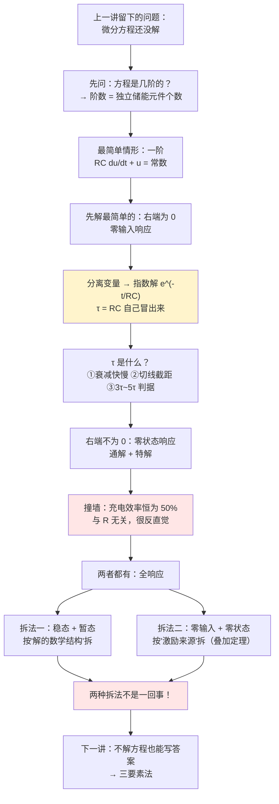
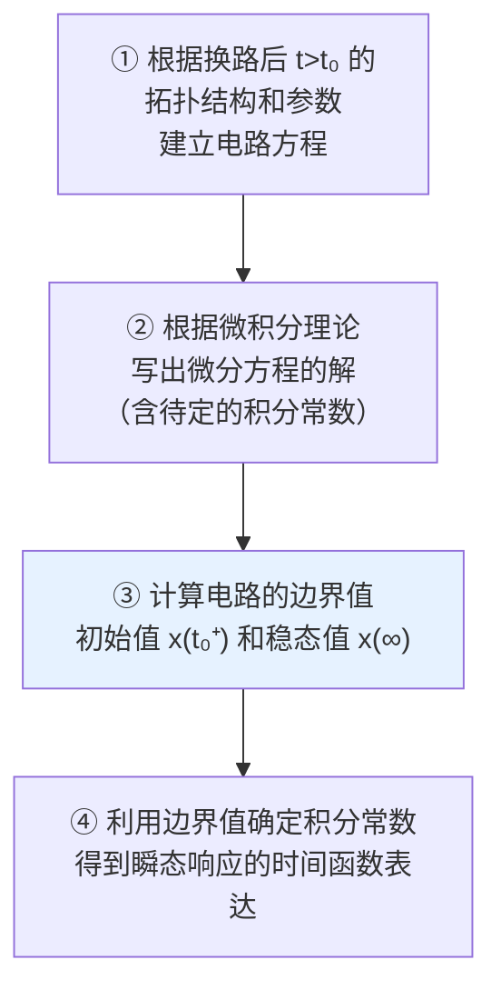

# C5.2 一阶电路的三种响应

> [!abstract] 这一讲的任务
> 上一讲我们把初始条件全部备齐了，但一个微分方程都还没解开。这一讲就把最简单的那类方程——**一阶常系数线性微分方程**——从头到尾解一遍，不跳任何一步。解完之后，那个统治整章的常数 $\tau$ 会自己冒出来，而且我们会当场看清它到底是什么。
> 然后按"激励从哪来"把响应分成三种：**零输入**（只有初始储能）、**零状态**（只有外加电源）、**全响应**（两者都有）。最后回答一个容易含糊的问题：全响应有两种拆法，它们是同一种拆法吗？（不是。）

> [!info] 怎么读这份讲义
> 第 2 节的微分方程求解是本讲的地基，请拿笔跟着推一遍，那半页纸决定了后面三讲你是"会算"还是"会懂"。第 3 节的 $\tau$ 有三个互不相同的解释角度，三个都要拿到。第 6 节的"两种分解"是考试高频陷阱。
>
> **本讲授课教师**：Professor Rui-Xiang Yin（尹瑞祥），etrxyin@scut.edu.cn。

---

## 0. 开场：示波器上那条爬坡的边

实验室里，你把信号发生器调成 1 kHz 方波，用示波器看它。屏幕上是漂亮的直上直下的方波。

现在你在探头和信号源之间随手串一个 $10\,\mathrm{k}\Omega$ 电阻——因为你想"限流保护一下"。屏幕上的方波**上升沿立刻变斜了**，变成一条圆润的爬坡曲线。你把电阻换成 $100\,\mathrm{k}\Omega$，爬坡更慢，方波开始变成三角形。你把电阻换成 $100\,\Omega$，方波又变回直角。

你并没有加电容啊——但示波器探头有 $\sim$15 pF 的输入电容，同轴线还有几十 pF。**电阻加上这些"看不见的电容"，就构成了一个一阶 RC 电路**，而爬坡的快慢完全由 $RC$ 这个乘积决定。

> [!question] 停一下，先自己想想
> 那条爬坡曲线，长得像什么函数？直线？抛物线？
>
> 拿一把尺子在爬坡曲线的起点画切线，看看这条切线什么时候撞到最终的水平线。再在曲线爬到一半的地方画切线，看看这条切线什么时候撞到水平线。
>
> 你会发现：**两次的"还要多久"是同一个数**。任何时刻剩下的路程，除以此刻的速度，永远等于同一个常数。
>
> 满足"变化率 $\propto$ 剩余量"这条性质的函数只有一个：**指数函数**。而那个常数，就是我们这一讲要请出来的 $\tau$。

---

## 1. 先分级：电路的"阶数"（课件 p19）

在解方程之前，我们得知道要解的是几阶方程。

![[C5-动态电路三大分析方法对照.png]]

一个 $RLC$ 串联电路，换路后的方程是
$$LC\frac{\mathrm{d}^2u_C}{\mathrm{d}t^2} + RC\frac{\mathrm{d}u_C}{\mathrm{d}t} + u_C = U_S \qquad (t>0)$$
二阶方程。为什么是二阶？因为里面有**两个**储能元件，每个引入一次微分。

> [!important] 动态电路的阶数（order）
> 电路中**独立**动态元件的个数。每个独立动态元件引入一阶微分。
> - **一阶电路**：由一阶微分方程描述的电路
> - **二阶电路**：由二阶微分方程描述的电路
> - **高阶电路**：由高阶微分方程描述的电路

注意"**独立**"两个字。两个并联的电容其实只算一个独立储能元件（它们的电压被 KVL 绑死了，只有一个自由度）；三个电容围成一个纯电容回路，也只有两个独立。这一点在 [[C5.4 二阶电路与状态变量法]] 讲状态变量个数时还会用到。

**本讲只做一阶电路**：电路里只有一个（独立的）$C$ 或一个（独立的）$L$，其余全是电阻和电源。

### 经典法的四个步骤（课件 p20）

> [!important] 经典法（classical method）
> 通过建立并求解**时域微分方程**来分析电路瞬态响应的方法。

第 ③ 步就是 [[C5.1 动态电路与换路定则]] 讲的全部内容。第 ②④ 步是本讲的主体。

---

## 2. 零输入响应：把方程真正解开（课件 p21–22）

> [!important] 零输入响应（zero-input response）
> 电路的**激励（电源）为零**，仅仅由初始储能引起的响应。

### 2.1 列方程

![[C5-RC零输入响应电路.png]]

电容 $C$ 已充电到 $u_C(0_-)=U_0$，$t=0$ 开关合上，$C$ 对 $R$ 放电。注意 $i$ 的参考方向是**流出**电容正极，所以

$$i = -C\frac{\mathrm{d}u_C}{\mathrm{d}t}$$

（负号来自 $i$ 与 $u_C$ 取的是非关联参考方向，见 [[C1.2 电路的基本概念]]。这个负号是初学者最常丢的东西。）

对回路写 KVL：$u_C = u_R = iR$，代入得

$$u_C = -RC\frac{\mathrm{d}u_C}{\mathrm{d}t} \quad\Longrightarrow\quad \boxed{RC\frac{\mathrm{d}u_C}{\mathrm{d}t} + u_C = 0}$$

一阶**齐次**（右端为零）常系数线性微分方程。

### 2.2 完整求解：分离变量法

课件到这里直接说"根据微分方程理论，解的形式 $u_C = A\mathrm{e}^{pt}$"。这是对的，但那是**结论**不是**来路**。我们把来路补上——分离变量法，高数上册的东西：

**第一步，把含 $u_C$ 的和含 $t$ 的分到等号两边：**
$$RC\,\mathrm{d}u_C = -u_C\,\mathrm{d}t \quad\Longrightarrow\quad \frac{\mathrm{d}u_C}{u_C} = -\frac{1}{RC}\,\mathrm{d}t$$

**第二步，两边同时积分：**
$$\int \frac{\mathrm{d}u_C}{u_C} = \int -\frac{1}{RC}\,\mathrm{d}t
\quad\Longrightarrow\quad \ln|u_C| = -\frac{t}{RC} + k$$

**第三步，两边取指数：**
$$|u_C| = \mathrm{e}^{k}\cdot\mathrm{e}^{-t/RC}
\quad\Longrightarrow\quad u_C = A\,\mathrm{e}^{-t/RC},\qquad A = \pm\mathrm{e}^{k}\ \text{是待定常数}$$

**这就是解的形式的全部来历。** 指数函数不是"猜"出来的，它是"变化率正比于自身"这条微分方程的唯一解。

**第四步，用初始条件定 $A$：**
$$u_C(0_+) = u_C(0_-) = U_0 \quad\Longrightarrow\quad U_0 = A\,\mathrm{e}^{0} = A$$

$$\boxed{u_C(t) = U_0\,\mathrm{e}^{-t/RC} \qquad (t \geq 0)}$$

### 2.3 特征方程：同一件事的另一种写法

课件走的是"特征方程"路线，两条路殊途同归，值得对照一次：

设试探解 $u_C = A\mathrm{e}^{pt}$，代入齐次方程 $RC\,\dot u_C + u_C = 0$：
$$RC\cdot Ap\,\mathrm{e}^{pt} + A\mathrm{e}^{pt} = 0
\;\Longrightarrow\; A\mathrm{e}^{pt}(RCp + 1) = 0$$
$A\mathrm{e}^{pt}$ 恒不为零，故必须
$$\underbrace{RCp + 1 = 0}_{\text{特征方程}} \;\Longrightarrow\; p = -\frac{1}{RC}$$

> [!note] 为什么"特征方程"就是把 $\mathrm{d}/\mathrm{d}t$ 换成 $p$
> 因为 $\mathrm{e}^{pt}$ 求一次导等于自己乘 $p$。所以对指数函数而言，"求导"这个算子退化成"乘 $p$"这个乘法。原方程的 $RC\,\mathrm{d}/\mathrm{d}t + 1$ 就变成了 $RCp+1$。这个技巧在二阶电路里同样管用，只是特征方程变成二次的（[[C5.4 二阶电路与状态变量法]]）。

由 $u_C$ 反求电流：
$$i_C = -C\frac{\mathrm{d}u_C}{\mathrm{d}t} = -C\cdot U_0\cdot\left(-\frac{1}{RC}\right)\mathrm{e}^{-t/RC} = \frac{U_0}{R}\mathrm{e}^{-t/RC} = I_0\,\mathrm{e}^{-t/RC}$$

![[C5-RC零输入uC与iC波形.png]]

注意波形图里的一个重要事实：**$u_C$ 从 $U_0$ 连续下降（不跳变），$i_C$ 却在 $t=0$ 从 0 直接跳到 $I_0 = U_0/R$**。又一次印证了 [[C5.1 动态电路与换路定则]] 的核心结论。

---

## 3. 时间常数 $\tau$：三个角度看同一个数（课件 p22–23）

$$\boxed{\tau = RC}$$

### 角度一：量纲——它真的是"时间"

$$[\,\Omega\,]\times[\,\mathrm{F}\,] = \Omega\cdot\frac{\mathrm{C}}{\mathrm{V}} = \frac{\mathrm{V}}{\mathrm{A}}\cdot\frac{\mathrm{A}\cdot\mathrm{s}}{\mathrm{V}} = \mathrm{s}$$

（课件 p22 的原文写法："欧×法 = 欧×库/伏 = 欧×安×秒/伏 = 秒"。）

同时注意课件给的另一层关系：
$$\tau = -\frac{1}{p}$$
$\tau$ 是特征根的负倒数。特征根 $p$ 有量纲 $[1/\text{时间}]$，所以它常被叫作电路的"**固有频率**"（natural frequency）。

### 角度二：几何——切线在横轴上的截距

对 $u_C = U_0\mathrm{e}^{-t/\tau}$ 在 $t=0$ 处求斜率：
$$\left.\frac{\mathrm{d}u_C}{\mathrm{d}t}\right|_{t=0} = -\frac{U_0}{\tau}$$

若从 $U_0$ 出发，**以这个初始速率匀速下降**，撞到横轴需要的时间是
$$\frac{U_0}{U_0/\tau} = \tau$$

![[C5-零输入放电曲线与tau切线.png]]

> [!important] $\tau$ 的几何意义
> $u_C$ 曲线在 $t=0$ 处的**切线，与横轴的交点就是 $t=\tau$**。
>
> 更一般地：曲线在**任意**一点处的切线，与稳态值水平线的交点，都在该点后方 $\tau$ 处。这就是开场那个"剩余量除以速度永远是同一个数"的严格版本：
> $$\frac{u_C(t)}{-\mathrm{d}u_C/\mathrm{d}t} = \frac{U_0\mathrm{e}^{-t/\tau}}{(U_0/\tau)\mathrm{e}^{-t/\tau}} = \tau \quad\text{对任意 } t \text{ 成立}$$
> **实验测 $\tau$ 就靠这一条**：在示波器上画切线量截距，或者更简单，量出降到 36.8% 所需的时间。

### 角度三：工程——$3\tau\sim5\tau$ 判据的来源

课件 p23 给了一张表。**我用 Python 独立复算了每一格：**

| $t$ | $0$ | $\tau$ | $2\tau$ | $3\tau$ | $4\tau$ | $5\tau$ |
|---|---|---|---|---|---|---|
| $\mathrm{e}^{-t/\tau}$ 精确值 | $1$ | $0.36788$ | $0.13534$ | $0.049787$ | $0.018316$ | $0.0067379$ |
| 课件所印 | $U_0$ | $0.368U_0$ | $0.135U_0$ | $0.05U_0$ | $0.02U_0$ | $0.007U_0$ |
| 剩余百分比 | 100% | 36.8% | 13.5% | **5.0%** | 1.8% | **0.67%** |

> [!note] 复算结论：课件所有数值均为精确值的正确四舍五入，无误。
> 唯一值得留意的是 $4\tau$ 一格：精确值 0.0183，课件写 0.02，是两位有效数字的进位，不是笔误。

> [!important] 为什么工程上取 $3\tau\sim5\tau$
> - $\mathrm{e}^{-3}\approx 4.98\% \approx 5\%$ —— 剩余不到 5%，多数场合已可视为"到位"。
> - $\mathrm{e}^{-5}\approx 0.674\% < 1\%$ —— 剩余不到 1%，精密场合的判据。
>
> **理论上 $t\to\infty$ 才真正达到稳态**（指数函数永远不等于零），$3\tau$、$5\tau$ 是**工程约定**，不是数学结论。选 3 还是 5，取决于你的精度要求：ADC 采样前的建立时间通常要求 $\ge 7\tau$（$\mathrm{e}^{-7}\approx 0.09\%$，对应约 10 位精度），这就是数据手册里"settling time"的算法。

### 3.1 能量核算：电容存的能量全部被电阻吃掉（课件 p23）

$$W_R = \int_0^{\infty} i^2R\,\mathrm{d}t
= \int_0^{\infty}\left(\frac{U_0}{R}\mathrm{e}^{-t/RC}\right)^2 R\,\mathrm{d}t
= \frac{U_0^2}{R}\int_0^{\infty}\mathrm{e}^{-2t/RC}\,\mathrm{d}t$$

$$= \frac{U_0^2}{R}\cdot\frac{RC}{2} = \boxed{\frac{1}{2}CU_0^2}$$

正是电容的初始储能。**能量守恒得到验证**：电容存的每一焦耳最后都变成了电阻上的热。（我用符号积分独立验证过这一步，结果为 $CU^2/2$，与课件一致。）

> [!question] 课堂追问：$R$ 大一点，电阻会不会少发点热？
> 不会。上式的结果 $\frac12 CU_0^2$ 里**根本没有 $R$**。$R$ 大 → 电流小 → 单位时间发热少，但 $\tau=RC$ 大 → 放电时间长，两个效应**精确抵消**。
> 这不是巧合：电容里就存了那么多能量，电路里除了 $R$ 没有别的地方可去，那它就必须全部去 $R$，跟 $R$ 多大无关。$R$ 只决定"多快烧完"，不决定"烧掉多少"。
> 记住这个思路，第 5 节还有一个更反直觉的版本。

---

## 4. RL 电路的零输入响应（课件 p24–27）

### 4.1 对偶推导

![[C5-RL零输入响应电路.png]]

换路前 $L$ 已经流过稳定电流：
$$i_L(0_+) = i_L(0_-) = \frac{U_S}{R_1 + R} = I_0$$

$t=0$ 开关合上，$L$ 与 $R$ 组成回路，$U_S$ 被隔开。KVL：
$$L\frac{\mathrm{d}i_L}{\mathrm{d}t} + Ri_L = 0
\quad\Longrightarrow\quad \frac{\mathrm{d}i_L}{\mathrm{d}t} + \frac{R}{L}i_L = 0 \qquad (t>0)$$

特征方程 $Lp + R = 0 \Rightarrow p = -R/L$，故 $i_L = A\mathrm{e}^{-(R/L)t}$；由 $i_L(0_+)=I_0$ 得 $A = I_0$：

$$\boxed{i_L(t) = I_0\,\mathrm{e}^{-\frac{R}{L}t} \qquad (t\ge 0)}$$
$$u_L(t) = L\frac{\mathrm{d}i_L}{\mathrm{d}t} = -RI_0\,\mathrm{e}^{-\frac{R}{L}t} \qquad (t\ge 0)$$

![[C5-RL零输入iL与uL波形.png]]

$$\boxed{\tau = \frac{L}{R}}$$

量纲核对（课件 p25）：亨/欧 = 韦/(安·欧) = 韦/伏 = 伏·秒/伏 = 秒。✓

> [!note] 一个容易被忽略的观察
> $i_L$ 是连续的（从 $I_0$ 平滑下降），而 $u_L$ 在 $t=0$ **从 0 跳到 $-RI_0$**。跟 RC 电路里 $u_C$ 连续、$i_C$ 跳变完全对偶。这是 [[C1.4 理想电路元件]] 里 $C$ 与 $L$ 对偶性的又一次体现。

### 4.2 一个真实的事故：电压表被 875 kV 击穿（课件 p26）

![[C5-电压表被感应高压击穿例题电路.png]]

> **题目**：$35\,\mathrm{V}$ 电源经开关 S 接一个继电器线圈（$R = 0.2\,\Omega$，$L = 0.4\,\mathrm{H}$），线圈两端并联一只内阻 $R_V = 5\,\mathrm{k}\Omega$ 的电压表。电路已达稳态后，$t=0$ 断开 S。求 $u_V(0_+)$ 与 $u_V(t)$。

**求初值。** 稳态时电感短路，$R_V$（5 kΩ）与 $R$（0.2 Ω）并联，电流几乎全走线圈：
$$i_L(0_+) = i_L(0_-) = \frac{35}{0.2} = 175\ \mathrm{A} = I_0$$

**求 $\tau$。** S 断开后，电源被切除，回路变成 $L$–$R$–$R_V$ 串联：
$$\tau = \frac{L}{R + R_V} = \frac{0.4}{0.2 + 5000} \approx \frac{0.4}{5000} = 8\times10^{-5}\ \mathrm{s} = 80\ \mu\mathrm{s}$$

**写响应。**
$$i_L(t) = 175\,\mathrm{e}^{-t/\tau}\ \mathrm{A} \qquad (t\ge 0)$$
$$u_V(t) = -R_V\,i_L(t) = -5000\times175\times\mathrm{e}^{-t/\tau} = -875\,\mathrm{e}^{-t/\tau}\ \mathrm{kV}$$

$$\boxed{u_V(0_+) = -875\ \mathrm{kV}}$$

**（我复算过：$5000\times175 = 875\,000\,\mathrm{V} = 875\,\mathrm{kV}$，课件数值正确。）**

**结果：电压表毁坏。**

> [!question] 停一下，先自己想想
> 一个 35 V 的电源，怎么可能在电路里产生 875 kV？能量从哪来的？
>
> 能量来自电感储能 $W_L = \frac12 Li_L^2 = \frac12\times0.4\times175^2 = 6125\ \mathrm{J}$——这是实打实的能量，跟电源电压没有直接关系。
>
> 电压之所以这么高，是因为**电感强行维持 175 A 的电流**，而这个电流现在被迫流过 5 kΩ 的电压表。$175\times5000 = 875\,\mathrm{kV}$，纯粹是欧姆定律。电感在这一刻扮演的是**电流源**，而电流源接上大电阻就会顶出大电压。
>
> 这正是 [[C5.1 动态电路与换路定则]] 里说的"$u_L$ 允许突变"的极端后果。断开感性负载时开关触点会打火、继电器会烧坏、MOSFET 会被击穿——全是这一条。

**工程对策**（课件 p27）：

![[C5-感性负载续流二极管泄放通路.png]]

> [!important] 设置泄放通路
> 在感性负载两端反并联一个**续流二极管**（freewheeling diode，图中的 D）。开关断开后，电感电流立刻从二极管这条低阻通路续流，$u_L$ 被钳位在一个二极管压降（约 0.7 V）以内。
>
> 这是每一块继电器驱动板、每一个电机驱动电路、每一个 GPU 供电模块上都能找到的元件。学到这里，你已经能解释它为什么必须存在了。

### 4.3 零输入响应小结（课件 p27）

> [!important] 四条
> 1. 一阶电路的零输入响应是由**储能元件的初值**引起的响应，都是一个**指数衰减函数**。
> 2. 衰减快慢取决于时间常数 $\tau$：$RC$ 电路 $\tau = RC$；$RL$ 电路 $\tau = L/R$。
> 3. **同一电路中所有响应具有相同的时间常数**（因为它们来自同一个特征根）。
> 4. 一阶电路的零输入响应**与初值成正比**（齐性原理：初值翻倍，全部响应翻倍）。

---

## 5. 零状态响应：非齐次方程（课件 p28–34）

> [!important] 零状态响应（zero-state response）
> 储能元件**无初始能量**，仅仅由激励（电源）作用产生的过渡过程。

### 5.1 RC 电路：完整五步

$t=0$ 开关合上，$U_S$ 经 $R$ 给未充电的 $C$ 充电，$u_C(0_-) = 0$。KVL：

$$\boxed{RC\frac{\mathrm{d}u_C}{\mathrm{d}t} + u_C = U_S}$$

这回右端不为零，是**非齐次线性常微分方程**。

> [!important] 前置知识补课：非齐次线性 ODE 的解结构
> 对方程 $a\dot y + by = f(t)$，其**通解 = 齐次方程的通解 + 非齐次方程的任一特解**：
> $$y = \underbrace{y''}_{\text{齐次通解}} + \underbrace{y'}_{\text{特解}}$$
> 这条定理的证明只有一行：若 $y_1, y_2$ 都是原方程的解，则 $y_1 - y_2$ 满足齐次方程。所以任意两个解之差都在齐次解的集合里，于是"任一特解 + 全体齐次解"就穷尽了全体解。
>
> 电路里给这两项各起了名字（课件 p28–29）：
> - **特解 $u_C'$ = 强制分量 = 稳态分量**（forced / steady-state component）：由激励强加的，激励是什么形式它就是什么形式。
> - **齐次通解 $u_C''$ = 自由分量 = 暂态分量**（natural / transient component）：电路自己的固有行为，与激励形式无关，只跟电路参数有关。

![[C5-RC零状态充电uC分量与i波形.png]]

**（1）列方程**：$RC\dot u_C + u_C = U_S$。

**（2）定特解（强制分量）。** 激励是直流常数，猜特解也是常数 $u_C' = K$。代入：$0 + K = U_S$，故
$$u_C' = U_S$$

**（3）定齐次通解（自由分量）。** 解 $RC\dot u_C'' + u_C'' = 0$，由第 2 节的结果：
$$u_C'' = A\,\mathrm{e}^{-t/RC}$$

**（4）全解。**
$$u_C = u_C' + u_C'' = U_S + A\,\mathrm{e}^{-t/RC}$$

**（5）定常数。** 由 $u_C(0_+) = u_C(0_-) = 0$：
$$0 = U_S + A \quad\Longrightarrow\quad A = -U_S$$

$$\boxed{u_C(t) = U_S - U_S\mathrm{e}^{-t/RC} = U_S\left(1 - \mathrm{e}^{-t/RC}\right) \qquad (t>0)}$$

$$i = C\frac{\mathrm{d}u_C}{\mathrm{d}t} = C\cdot U_S\cdot\frac{1}{RC}\mathrm{e}^{-t/RC} = \frac{U_S}{R}\,\mathrm{e}^{-t/RC}$$

![[C5-零状态充电uC与i波形.png]]

注意 $i$ 在 $t=0$ 从 0 跳到 $U_S/R$：**在 $0_+$ 时刻，一个未充电的电容看起来就是短路**（因为它的等效电压源是 0 V），所以电流由 $R$ 单独限定。

### 5.2 撞墙：充电效率恒为 50%，与 $R$ 无关（课件 p30）

现在算电源在整个充电过程中做的功、电阻吃掉的、电容存下的。

**电阻消耗的能量：**
$$W_R = \int_0^{\infty} i^2R\,\mathrm{d}t = \int_0^{\infty}\left(\frac{U_S}{R}\mathrm{e}^{-t/\tau}\right)^2 R\,\mathrm{d}t
= \frac{U_S^2}{R}\left(-\frac{\tau}{2}\right)\mathrm{e}^{-2t/\tau}\bigg|_0^{\infty}
= \frac{U_S^2}{R}\cdot\frac{\tau}{2}$$

代入 $\tau = RC$：
$$W_R = \frac{U_S^2}{R}\cdot\frac{RC}{2} = \boxed{\frac{1}{2}CU_S^2}$$

**电容最终储存的能量：**
$$W_C = \frac{1}{2}Cu_C(\infty)^2 = \frac{1}{2}CU_S^2$$

**电源提供的总能量：**
$$W_S = \int_0^{\infty} U_S\,i\,\mathrm{d}t = U_S\cdot\frac{U_S}{R}\cdot\tau = \frac{U_S^2}{R}\cdot RC = CU_S^2$$

$$\boxed{W_S = CU_S^2,\qquad W_R = W_C = \frac{1}{2}CU_S^2,\qquad \eta = \frac{W_C}{W_S} = 50\%}$$

> [!question] 停一下，先自己想想
> 你直觉上会觉得：把 $R$ 换小一点，损耗应该变小、效率应该变高。对不对？
>
> **不对。** 上面三个能量表达式里**一个 $R$ 都没有**。$R$ 换成 $1\,\mathrm{m}\Omega$ 还是 $1\,\mathrm{M}\Omega$，电阻上永远精确消耗掉一半，电容永远只拿到一半。
>
> 为什么？$R$ 变小 → 峰值电流 $U_S/R$ 变大（$\propto 1/R$）→ 瞬时损耗 $i^2R \propto 1/R$；但同时 $\tau=RC$ 变小 → 持续时间 $\propto R$。$\frac{1}{R}\times R = 1$，**精确抵消**。
>
> 这就是本讲最反直觉的结论，也是电力电子里一条铁律：**用电阻给电容充电，效率上限就是 50%，没有任何办法优化。**

> [!important] 工程后果（这条比公式本身重要）
> 想突破 50%，必须换拓扑——不能再用"电压源串电阻"给电容充电，而要用**电感做中间储能**（开关电源、Buck/Boost 变换器）或**恒流源充电**。这就是为什么手机快充电路里全是电感和 MOSFET，而不是一个大电阻。
>
> 同一条结论在数字电路里的版本：CMOS 每翻转一次逻辑电平，$\frac12 CV^2$ 存进负载电容、另外 $\frac12 CV^2$ 变成热。一个芯片的动态功耗
> $$P = \alpha\, C\, V_{DD}^2\, f$$
> 里的那个 $CV^2$ 就是这么来的。**GPU 功耗墙的物理源头，就是本节这个 50%。** 降压（$V^2$ 关系）比降频收益大得多——这也是为什么先进制程拼命降低 $V_{DD}$。

### 5.3 例题：含受控源的零状态响应，两种解法（课件 p31–32）

![[C5-零状态响应含受控源电路.png]]

> **题目**：$t=0$ 时闭合开关 S。求 $u_C$、$i_1$ 的零状态响应。电路参数：$2\,\mathrm{V}$ 电压源串 $1\,\Omega$ 到节点 $u$；节点 $u$ 经 $1\,\Omega$ 串一个 CCVS（$2i_1$）到地；节点 $u$ 经开关 S 和 $1\,\Omega$ 接到 $0.8\,\mathrm{F}$ 电容。

#### 解法 1：直接列微分方程（课件 p31）

在节点 $u$ 写 KCL。流入：$i_1$（经 $1\,\Omega$ 从 2 V 源来）和中间支路的电流 $\dfrac{2i_1 - u}{1}$；流出：$i_C$。

$$i_1 + \frac{2i_1 - u}{1} = i_C = C\frac{\mathrm{d}u_C}{\mathrm{d}t}$$

补两个约束：
$$i_1 = \frac{2-u}{1},\qquad u = 1\cdot i_C + u_C$$

消元整理（我用符号计算独立复算过这一步）：

$$4\frac{\mathrm{d}u_C}{\mathrm{d}t} + 4u_C = 6$$

**特征方程**：$4p + 4 = 0 \Rightarrow p = -1$，故 $u_C'' = A\mathrm{e}^{-t}$。
**特解**：$u_C' = 6/4 = 1.5\ \mathrm{V}$。
**全解**：$u_C = 1.5 + A\mathrm{e}^{-t}$。
**定常数**：$u_C(0_+) = u_C(0_-) = 0 \Rightarrow A = -1.5$。

$$\boxed{u_C = 1.5 - 1.5\,\mathrm{e}^{-t}\ \mathrm{V} \qquad (t>0)}$$

再回代求 $i_1$：
$$i_C = C\frac{\mathrm{d}u_C}{\mathrm{d}t} = 0.8\times1.5\,\mathrm{e}^{-t} = 1.2\,\mathrm{e}^{-t}\ \mathrm{A}$$
$$u = i_C + u_C = 1.2\mathrm{e}^{-t} + 1.5 - 1.5\mathrm{e}^{-t} = 1.5 - 0.3\,\mathrm{e}^{-t}\ \mathrm{V}$$
$$i_1 = 2 - u = \boxed{0.5 + 0.3\,\mathrm{e}^{-t}\ \mathrm{A} \qquad (t>0)}$$

**（我用符号计算逐步验证了 $i_C$、$u$、$i_1$ 三个表达式，与课件完全一致。）**

注意课件特意标注的：
$$i_1(0_+) = 0.5 + 0.3 = 0.8\ \mathrm{A} \;\neq\; i_1(0_-) = 0$$
**又一次**：电阻支路电流在换路瞬间跳变。

![[C5-零状态响应例题uC波形.png]]

#### 解法 2：先做戴维南等效（课件 p32）

![[C5-零状态例题戴维南等效化简.png]]

把电容左边的那一整块（含受控源）用戴维南等效电路代替（方法见 [[C3.4 线性电路定理]]；含受控源时开路电压／短路电流法或外加电源法）。课件给出的结果是

$$U_{oc} = 1.5\ \mathrm{V},\qquad R_{eq} = 0.25\ \Omega$$

于是从电容看进去的总电阻是 $R_{eq}$ 再串上那个 $1\,\Omega$：

$$\tau = RC = (1 + 0.25)\times 0.8 = 1.25\times0.8 = 1\ \mathrm{s}$$
$$u_C' = u_C(\infty) = 1.5\ \mathrm{V}\quad(\text{稳态时电容开路，无电流，全部电压落在电容上})$$
$$\boxed{u_C = 1.5 - 1.5\,\mathrm{e}^{-t}\ \mathrm{V}}$$

**两种解法结果完全一致**，但解法 2 只用了三个数（$\tau$、$u_C(\infty)$、$u_C(0_+)$），根本没有列微分方程。

> [!question] 课堂追问
> 解法 2 凭什么可以不列方程？它用到的三个数是从哪来的？
>
> 因为**一阶电路的解的形状已经被数学锁死了**：必然是"常数 + 指数"。形状已知，只剩三个自由参数（终值、初值、时间常数），量出这三个数就等于知道了全部。
>
> 这正是下一讲 **[[C5.3 三要素法与微积分电路]]** 的全部思想。解法 2 其实已经是三要素法了，只是还没起名字。

### 5.4 RL 电路的零状态响应（课件 p33）

完全对偶，不再重复推导：
$$L\frac{\mathrm{d}i_L}{\mathrm{d}t} + Ri_L = U_S,\qquad i_L(0_+)=i_L(0_-)=0$$
$$\boxed{i_L = \frac{U_S}{R}\left(1 - \mathrm{e}^{-\frac{R}{L}t}\right),\qquad u_L = L\frac{\mathrm{d}i_L}{\mathrm{d}t} = U_S\,\mathrm{e}^{-\frac{R}{L}t}}\qquad (t\ge0)$$

$u_L$ 在 $t=0$ 从 0 跳到 $U_S$：**在 $0_+$ 时刻，一个初始电流为零的电感看起来就是开路**（等效电流源为 0 A），所以全部电源电压都落在它两端。

### 5.5 零状态响应小结（课件 p34）

> [!important] 五条
> 1. 零状态响应含有**强制分量**和**自由分量**：$u_C = u_C' + u_C''$。
> 2. **强制分量与激励形式相关**：激励为直流，强制分量也为直流；激励为正弦，强制分量也为正弦（那就回到第 4 章的相量法了）。
> 3. **自由分量的形式与零输入响应相同**，具有指数特征。
> 4. **时间常数与激励源无关**，只与无源元件参数相关。
> 5. **线性一阶网络的零状态响应与激励成正比**（齐性原理）。

第 4 条尤其重要：$\tau$ 是电路的"体质"，不是"外界给的"。你把 $U_S$ 从 10 V 换成 100 V，波形形状一模一样，只是纵轴刻度放大 10 倍，时间轴分毫不动。

---

## 6. 全响应：同一个答案，两种拆法（课件 p35–38）

> [!important] 全响应（complete response）
> **非零初始状态**的电路受到激励时电路中产生的响应。

$$RC\frac{\mathrm{d}u_C}{\mathrm{d}t} + u_C = U_S,\qquad u_C(0_-)=U_0 \neq 0$$

按第 5 节的路子：$u_C' = U_S$，$u_C'' = A\mathrm{e}^{-t/\tau}$，$u_C = U_S + A\mathrm{e}^{-t/\tau}$。由 $u_C(0_+)=U_0$：
$$U_0 = A + U_S \;\Longrightarrow\; A = U_0 - U_S$$

$$\boxed{u_C(t) = U_S + (U_0 - U_S)\,\mathrm{e}^{-t/\tau} \qquad (t>0)}$$

### 6.1 拆法一：强制分量 + 自由分量（稳态 + 暂态）

$$u_C = \underbrace{U_S}_{\text{强制分量（稳态解）}} + \underbrace{(U_0-U_S)\mathrm{e}^{-t/\tau}}_{\text{自由分量（暂态解）}}$$

![[C5-全响应等于稳态加暂态叠加图.png]]

**这是按"解的数学结构"拆的**：非齐次特解 + 齐次通解。分界线是"**这一项是激励强加的，还是电路自己的固有行为**"。

### 6.2 拆法二：零状态响应 + 零输入响应

![[C5-全响应分解为零状态加零输入电路.png]]

把原问题拆成两个子问题：
- 子问题 1：**保留电源，去掉初始储能**（$u_{C1}(0_-) = 0$）→ 零状态响应 $U_S(1-\mathrm{e}^{-t/\tau})$
- 子问题 2：**去掉电源，保留初始储能**（$u_{C2}(0_-) = U_0$）→ 零输入响应 $U_0\mathrm{e}^{-t/\tau}$

$$u_C = \underbrace{U_S\left(1-\mathrm{e}^{-t/\tau}\right)}_{\text{零状态分量}} + \underbrace{U_0\,\mathrm{e}^{-t/\tau}}_{\text{零输入分量}}$$

展开验证：$U_S - U_S\mathrm{e}^{-t/\tau} + U_0\mathrm{e}^{-t/\tau} = U_S + (U_0-U_S)\mathrm{e}^{-t/\tau}$ ✓ 与拆法一相等。

![[C5-全响应等于零输入加零状态叠加图.png]]
![[C5-全响应零状态零输入三曲线.png]]

**这是按"激励从哪来"拆的**，本质就是 [[C3.4 线性电路定理]] 的**叠加定理**：把"初始储能"当作一组独立源、把"外加电源"当作另一组独立源，分别作用再相加。

### 6.3 撞墙：两种拆法不是同一种拆法

> [!warning] 这是本讲最常见的考试陷阱
> 很多人以为"稳态分量 = 零状态分量"、"暂态分量 = 零输入分量"。**完全错误。**
>
> 对照一下就清楚了：
>
> | | 拆法一（稳态 + 暂态） | 拆法二（零状态 + 零输入） |
> |---|---|---|
> | 第一项 | $U_S$ | $U_S(1-\mathrm{e}^{-t/\tau})$ |
> | 第二项 | $(U_0-U_S)\mathrm{e}^{-t/\tau}$ | $U_0\mathrm{e}^{-t/\tau}$ |
> | 拆分依据 | 解的**数学结构**（特解 vs 齐次通解） | 激励的**物理来源**（外加源 vs 初始储能） |
> | 第一项含不含指数 | **不含**，是常数 | **含**指数 |
> | 依赖线性吗 | 不依赖（对非线性方程也有类似结构） | **依赖**，只对线性电路成立 |
>
> 注意关键差别：**零状态分量里也含有 $\mathrm{e}^{-t/\tau}$**（那个 $-U_S\mathrm{e}^{-t/\tau}$），它绝不是"稳态"。而暂态分量里含有 $U_S$（在 $-U_S\mathrm{e}^{-t/\tau}$ 里），它也不纯粹来自初始储能。**两把刀切的方向不同。**

### 6.4 全响应小结（课件 p38）

> [!important] 三条
> 1. 全响应的不同分解方法只是**便于更好地理解过渡过程的本质**——同一个答案，两种看法。
> 2. 零输入响应与零状态响应的分解方法，其本质是**叠加**，因此**只适用于线性电路**。
> 3. **零输入响应与零状态响应均满足齐性原理，但全响应不满足。**

第 3 条值得展开：
- 零输入响应 $U_0\mathrm{e}^{-t/\tau}$：$U_0$ 翻倍，响应翻倍 ✓
- 零状态响应 $U_S(1-\mathrm{e}^{-t/\tau})$：$U_S$ 翻倍，响应翻倍 ✓
- 全响应 $U_S + (U_0-U_S)\mathrm{e}^{-t/\tau}$：把 $U_0$ 和 $U_S$ **同时**翻倍，响应确实翻倍；但只把其中一个翻倍，响应就不成比例。所以"全响应满足齐性"这句话在只改一个激励时是**假的**。

---

## 这一讲的三句话

1. **一阶电路的解只有一种形状：常数 + 指数**。指数不是猜的，它是"变化率正比于自身"这个微分方程的唯一解；分离变量法半页纸就能推出来。
2. **$\tau$ 是电路的体质，与激励无关**：$\tau = RC$ 或 $L/R$；几何上它是初始切线在稳态线上的截距，工程上 $3\tau$ 剩 5%、$5\tau$ 剩 0.67%。
3. **全响应有两种拆法，它们切的方向不同**：拆法一按数学结构（稳态 + 暂态），拆法二按物理来源（零状态 + 零输入）。零状态分量里也含指数，别把它当成稳态。

### 速查表

| 项目 | RC 电路 | RL 电路 |
|---|---|---|
| 齐次方程 | $RC\dot u_C + u_C = 0$ | $L\dot i_L + Ri_L = 0$ |
| 时间常数 | $\tau = RC$ | $\tau = L/R$ |
| 零输入响应 | $u_C = U_0\mathrm{e}^{-t/\tau}$ | $i_L = I_0\mathrm{e}^{-t/\tau}$ |
| 零输入的伴生量 | $i_C = \dfrac{U_0}{R}\mathrm{e}^{-t/\tau}$（跳变） | $u_L = -RI_0\mathrm{e}^{-t/\tau}$（跳变） |
| 零状态响应 | $u_C = U_S(1-\mathrm{e}^{-t/\tau})$ | $i_L = \dfrac{U_S}{R}(1-\mathrm{e}^{-t/\tau})$ |
| 零状态的伴生量 | $i = \dfrac{U_S}{R}\mathrm{e}^{-t/\tau}$ | $u_L = U_S\mathrm{e}^{-t/\tau}$ |
| 全响应 | $u_C = U_S + (U_0-U_S)\mathrm{e}^{-t/\tau}$ | $i_L = \dfrac{U_S}{R} + \left(I_0-\dfrac{U_S}{R}\right)\mathrm{e}^{-t/\tau}$ |
| $0_+$ 时刻等效（零初值） | 短路 | 开路 |
| 充电效率 | $\eta = 50\%$，与 $R$ 无关 | 同理 |

### 下一讲预告

上面每道题我们都老老实实列了微分方程。但第 5.3 节的解法 2 已经透露：**一阶电路根本不需要列方程**——只要拿到三个数（初值、终值、$\tau$），答案就能直接写出来。[[C5.3 三要素法与微积分电路]] 会把这件事讲成定理，说清"凭什么三个数就够"，并给出 $\tau$ 中那个 $R$ 的正确求法（从储能元件两端看进去的戴维南等效电阻）。之后我们会用同一个 RC 电路做出三种完全不同的功能：微分电路、积分电路、耦合电路。

---

## 本节自测 Self-Test

> [!question] Q1
> 一个电路有三个电容，但其中两个是并联的。这个电路是几阶的？

> [!success]- 答案
> **二阶**。阶数等于**独立**储能元件个数。两个并联电容的电压被 KVL 绑死（必须相等），它们合起来只贡献一个独立的状态变量，等效成一个 $C_1+C_2$ 的电容。
> 类似地：三个电容围成一个纯电容回路时，KVL 给出一个约束，独立个数是 $3-1=2$；几个电感构成一个纯电感割集时，KCL 给出约束，同样要扣。这个"独立性"的判据在 [[C5.4 二阶电路与状态变量法]] 讲状态变量个数时是核心。

> [!question] Q2
> 不查笔记，用分离变量法解 $\dfrac{\mathrm{d}i}{\mathrm{d}t} + 5i = 0$，$i(0)=2\,\mathrm{A}$。

> [!success]- 答案
> $$\frac{\mathrm{d}i}{i} = -5\,\mathrm{d}t \;\Rightarrow\; \ln|i| = -5t + k \;\Rightarrow\; i = A\mathrm{e}^{-5t}$$
> 由 $i(0)=2$ 得 $A=2$：$i(t) = 2\mathrm{e}^{-5t}\ \mathrm{A}$。
> 时间常数 $\tau = 1/5 = 0.2\ \mathrm{s}$（特征根 $p=-5$，$\tau = -1/p$）。约 $3\tau = 0.6\ \mathrm{s}$ 后衰减到 5% 以下。

> [!question] Q3
> $R = 2\,\mathrm{k}\Omega$、$C = 5\,\mu\mathrm{F}$ 的电路，电容初始电压 $10\,\mathrm{V}$，零输入放电。求 $\tau$、$u_C(10\,\mathrm{ms})$，以及降到 1 V 需要多久。

> [!success]- 答案
> $$\tau = RC = 2\times10^3\times5\times10^{-6} = 10^{-2}\ \mathrm{s} = 10\ \mathrm{ms}$$
> $$u_C(10\ \mathrm{ms}) = 10\,\mathrm{e}^{-1} = 10\times0.36788 = 3.679\ \mathrm{V}$$
> 降到 1 V：$10\mathrm{e}^{-t/\tau} = 1 \Rightarrow \mathrm{e}^{-t/\tau} = 0.1 \Rightarrow t = \tau\ln 10 = 10\times2.3026 = 23.03\ \mathrm{ms}$。
> （对照：$2\tau = 20\,\mathrm{ms}$ 时剩 13.5%，$3\tau=30\,\mathrm{ms}$ 时剩 5.0%，1 V 即 10% 恰在两者之间，合理。）

> [!question] Q4
> "$3\tau$ 后过渡过程结束"这句话严格吗？如果一个 12 位 ADC 要求建立到 $\frac12$ LSB 精度，需要几个 $\tau$？

> [!success]- 答案
> 不严格。$\mathrm{e}^{-t/\tau}$ 永远大于零，理论上 $t\to\infty$ 才到稳态；$3\tau$（剩 4.98%）和 $5\tau$（剩 0.674%）都是**工程约定**。
> 12 位 ADC 的 $\frac12$ LSB 相对误差是 $\dfrac{1}{2\times2^{12}} = \dfrac{1}{8192} = 1.22\times10^{-4}$。需要
> $$\mathrm{e}^{-n} \le 1.22\times10^{-4} \;\Rightarrow\; n \ge \ln(8192) = 9.01$$
> 即需要约 **9 个时间常数**。这就是数据手册里"acquisition time"往往远大于你直觉估计的原因。

> [!question] Q5
> 用电压源经电阻给电容充电，效率恒为 50%。为什么把 $R$ 减小到 1 mΩ 也救不了？给出定量论证。

> [!success]- 答案
> $$W_R = \int_0^\infty i^2R\,\mathrm{d}t = \frac{U_S^2}{R}\cdot\frac{\tau}{2} = \frac{U_S^2}{R}\cdot\frac{RC}{2} = \frac12 CU_S^2$$
> 表达式里 $R$ 被完全约掉。物理上：$R$ 减小 $k$ 倍 → 峰值电流增大 $k$ 倍 → 瞬时功率 $i^2R$ 变为 $k^2\cdot\frac{1}{k}=k$ 倍；同时 $\tau$ 减小 $k$ 倍 → 时间变为 $1/k$。乘积不变。
> 突破 50% 的唯一办法是换拓扑：用电感做无损中间储能（开关电源），或用恒流源充电（此时电阻上的损耗可以做到任意小，代价是需要有源电路）。

> [!question] Q6
> $u_C(0_-)=0$ 的电容在 $0_+$ 时刻等效于短路。这跟"直流稳态时电容开路"矛盾吗？

> [!success]- 答案
> 不矛盾，这是两个不同时刻的两件事。
> - **$0_+$ 时刻**：用替代定理，电容 = 电压源 $u_C(0_+)$。若 $u_C(0_+)=0$，这个电压源就是 0 V，即短路。
> - **$t\to\infty$ 直流稳态**：$\mathrm{d}u_C/\mathrm{d}t=0 \Rightarrow i_C=0$，电流为零即开路。
>
> 两条规则的依据完全不同（一个是替代定理，一个是 VCR + 稳态条件），适用时刻也不同。混用是初学者的高频错误。注意"$0_+$ 短路"只在**初值为零**时成立；初值不为零时它是一个非零电压源，既不是短路也不是开路。

> [!question] Q7
> 课件 p26 的例子里，为什么电压表的内阻 $R_V$ 越大，反而越危险？

> [!success]- 答案
> $u_V(0_+) = -R_V I_0$，与 $R_V$ **成正比**。$R_V$ 越大，同样的电感电流顶出的电压越高。
> 这与"电压表内阻越大越理想"的直觉正好相反——在稳态测量中大内阻是优点（少分流），在感性电路断电瞬间它却成了灾难，因为电感此刻是**电流源**，而电流源最怕接大电阻。
> 这也说明了续流二极管的作用机理：它在电感两端并了一条**极低阻抗**的通路，把 $R$ 拉到接近零，$u_L$ 也就被钳位了。

> [!question] Q8
> 全响应 $u_C = U_S + (U_0-U_S)\mathrm{e}^{-t/\tau}$。若 $U_0 = U_S$，会发生什么？若 $U_0 > U_S$ 呢？

> [!success]- 答案
> - $U_0 = U_S$：指数项系数为零，$u_C \equiv U_S$，**完全没有过渡过程**。这正是 [[C5.1 动态电路与换路定则]] 说的"含储能元件但储能平衡没变"的情形——换路了，但电容不需要重新充放电。
> - $U_0 > U_S$：系数为正，$u_C$ 从 $U_0$ **单调下降**到 $U_S$（电容在放电）。
> - $U_0 < U_S$：系数为负，$u_C$ 从 $U_0$ **单调上升**到 $U_S$（电容在充电）。
>
> 三种情形用的是同一个公式，只是系数符号不同。这正是三要素法威力的预告：不管充还是放，一个式子全包。

> [!question] Q9
> 判断对错：**"全响应的稳态分量就是零状态响应，暂态分量就是零输入响应。"**

> [!success]- 答案
> **错。** 反例直接看式子：
> - 稳态分量 $= U_S$（常数，不含指数）；零状态响应 $= U_S(1-\mathrm{e}^{-t/\tau})$（含指数）。**不等。**
> - 暂态分量 $= (U_0-U_S)\mathrm{e}^{-t/\tau}$；零输入响应 $= U_0\mathrm{e}^{-t/\tau}$。**不等**（除非 $U_S=0$）。
>
> 两种分解是**沿不同方向切同一块蛋糕**：拆法一按"数学上是特解还是齐次解"切，拆法二按"物理上是外加源还是初始储能"切。只有在 $U_S=0$（纯零输入）或 $U_0=0$（纯零状态）这两个退化情形下，两把刀才切在同一处。

> [!question] Q10
> 课件 p31 的例题中 $i_1(0_+)=0.8\,\mathrm{A}$，$i_1(\infty)=0.5\,\mathrm{A}$，$\tau=1\,\mathrm{s}$。不用列微分方程，直接写出 $i_1(t)$，并与课件答案核对。

> [!success]- 答案
> 按第 5.3 节解法 2 的思路（也就是下一讲的三要素法）：
> $$i_1(t) = i_1(\infty) + \big[i_1(0_+) - i_1(\infty)\big]\mathrm{e}^{-t/\tau} = 0.5 + (0.8-0.5)\mathrm{e}^{-t} = 0.5 + 0.3\,\mathrm{e}^{-t}\ \mathrm{A}$$
> 与课件解法 1 辛辛苦苦列方程消元得到的结果**完全一致**。
> 这就是下一讲要正式建立的方法：一阶电路里，**列方程是不必要的劳动**。

---

**上一节 ←** [[C5.1 动态电路与换路定则]]
**下一节 →** [[C5.3 三要素法与微积分电路]]
**课程索引 →** [[电路基础 MOC]]
