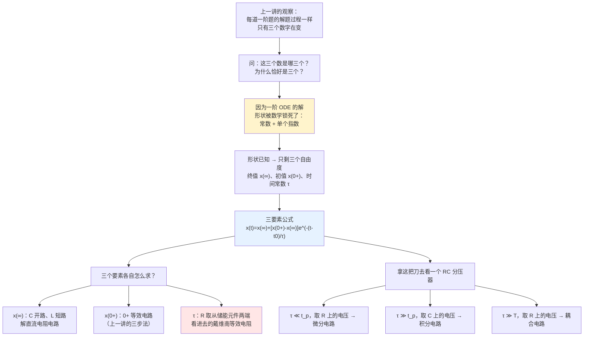
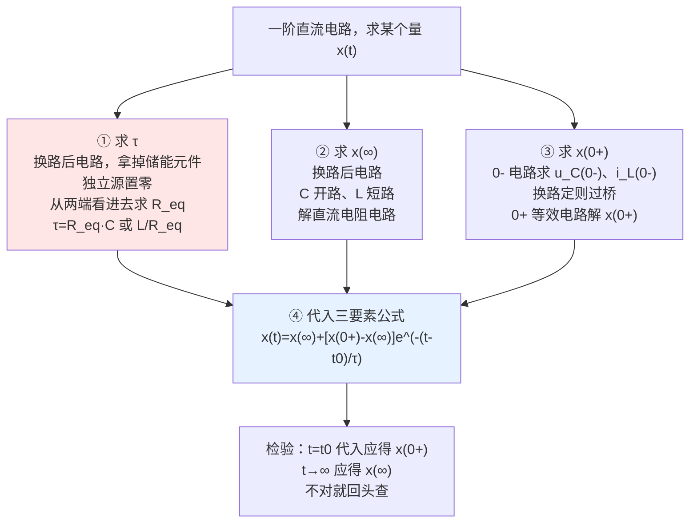

# C5.3 三要素法与微积分电路

> [!abstract] 这一讲的任务
> 上一讲我们把一阶方程从头解到尾，每道题都老老实实分离变量、定常数。但解到第三题的时候你大概已经察觉：**每次的过程都长得一模一样**，变的只是三个数字。这一讲要把这个观察变成定理——**三要素法**：不列方程、不解方程，只要拿到三个数就能把答案写出来。
> 拿到这把快刀之后，我们用它做一件有意思的事：**同一个 RC 电路，只改 $\tau$ 的大小、只换输出端口，就能变成三种功能完全不同的电路**——微分电路、积分电路、耦合电路。这三个电路你以后天天会用到。

> [!info] 怎么读这份讲义
> 第 1 节的"凭什么三个数就够"是本讲的理论核心，别跳。第 2 节的 $\tau$ 求法（那个 $R$ 到底是谁）是最容易出错的一步，必须理解到能自己解释为什么是"戴维南等效电阻"。第 4 节的三个电路请对照波形图看，重点是搞清"$\tau$ 和脉冲宽度 $t_p$ 谁大谁小"这个唯一的分界线。
>
> **本讲授课教师**：Professor Rui-Xiang Yin（尹瑞祥），etrxyin@scut.edu.cn。

---

## 0. 开场：同一块面包板上的三个电路

你在面包板上插了一个电阻和一个电容，串起来接在信号发生器上，信号是 1 kHz 方波（周期 $T=1\,\mathrm{ms}$，脉冲宽度 $t_p=0.5\,\mathrm{ms}$）。

你的示波器探头有两个地方可以夹：夹在**电阻两端**，或者夹在**电容两端**。

现在你做四次实验：

| 实验 | $R$ | $C$ | $\tau=RC$ | 探头位置 | 屏幕上看到什么 |
|---|---|---|---|---|---|
| 1 | 1 kΩ | 100 pF | 0.1 μs | 电阻 | **一串又高又窄的尖脉冲**，方波每次翻转就"扎"一下 |
| 2 | 100 kΩ | 100 nF | 10 ms | 电容 | **一串斜坡**，方波变成了近似三角波 |
| 3 | 100 kΩ | 100 nF | 10 ms | 电阻 | **方波原样通过**，只是不再有直流分量了 |
| 4 | 1 kΩ | 100 pF | 0.1 μs | 电容 | 方波原样通过 |

**同样两个元件、同样一个接法**，只因为 $\tau$ 相对 $t_p$ 的大小不同、探头夹的位置不同，就得到四种截然不同的行为。实验 1 叫**微分电路**，实验 2 叫**积分电路**，实验 3 叫**耦合电路**。

> [!question] 停一下，先自己想想
> 电阻和电容串联在一起，任何时刻都有 $u_1 = u_R + u_C$（KVL，一条铁律）。既然两个电压加起来永远等于输入，那为什么一个看起来像"输入的导数"，另一个看起来像"输入的积分"？
>
> 提示：如果 $u_C$ 几乎等于 $u_1$（也就是 $u_R$ 极小），那么 $u_R = R\,i = RC\dfrac{\mathrm{d}u_C}{\mathrm{d}t} \approx RC\dfrac{\mathrm{d}u_1}{\mathrm{d}t}$……
>
> 这一讲的第 4 节会把这条思路走完。但在此之前，我们得先有一把能快速判断"$u_C$ 到底跟不跟得上 $u_1$"的刀。那把刀就是三要素法。

---

## 1. 三要素法：凭什么三个数就够（课件 p39–40）

### 1.1 从上一讲的结果里把共性抽出来

回头看 C5.2 得到的所有答案：

$$u_C = U_0\mathrm{e}^{-t/\tau} \qquad\text{（零输入）}$$
$$u_C = U_S(1-\mathrm{e}^{-t/\tau}) = U_S - U_S\mathrm{e}^{-t/\tau} \qquad\text{（零状态）}$$
$$u_C = U_S + (U_0-U_S)\mathrm{e}^{-t/\tau} \qquad\text{（全响应）}$$

**三个式子都是同一个模板**：
$$x(t) = \underbrace{(\text{某个常数})}_{\text{就是 }x(\infty)} + \underbrace{(\text{另一个常数})}_{\text{系数}}\cdot\mathrm{e}^{-t/\tau}$$

再看第一个常数：零输入时它是 0（终值确实是 0），零状态和全响应时它是 $U_S$（终值确实是 $U_S$）。所以**第一个常数永远就是 $t\to\infty$ 的终值 $x(\infty)$**。

再看指数项系数：把 $t=0$ 代进模板，$x(0_+) = x(\infty) + \text{系数}$，所以
$$\text{系数} = x(0_+) - x(\infty)$$

于是模板变成：

$$\boxed{x(t) = x(\infty) + \big[x(0_+) - x(\infty)\big]\,\mathrm{e}^{-t/\tau}}$$

一个式子把三种响应全包了。

### 1.2 凭什么？——数学上的严格理由

课件 p39 给出了这个方法的立足点。**线性直流或无源一阶电路的方程，不管是哪个支路的哪个量，都能整理成同一个形式**：

$$u(t) + \tau\frac{\mathrm{d}u(t)}{\mathrm{d}t} = u(\infty) \qquad\text{或}\qquad i(t) + \tau\frac{\mathrm{d}i(t)}{\mathrm{d}t} = i(\infty)$$

![[C5-稳态值求解的替代定理框图.png]]

> [!important] 为什么三个数就够——三句话说清
> 1. 这是一个**一阶**线性常系数 ODE。一阶 ODE 的通解里恰好有**一个**待定常数（积分一次产生一个常数）。
> 2. 它的**齐次通解只有一项** $A\mathrm{e}^{-t/\tau}$（特征方程 $\tau p + 1 = 0$ 只有一个根 $p=-1/\tau$），**特解在直流激励下是常数** $x(\infty)$。所以解的形状是"常数 + 单个指数"，**没有第三种形状可能出现**。
> 3. 形状固定后，整条曲线只剩三个自由参数：**指数的时间尺度 $\tau$**、**曲线的终点 $x(\infty)$**、**曲线的起点 $x(0_+)$**。三个数确定，曲线唯一确定。
>
> **换句话说，三要素法之所以成立，是因为一阶线性电路的解空间只有三维。** 不是"经验公式"，是数学事实。

> [!question] 课堂追问：那二阶电路需要几个"要素"？
> 二阶 ODE 的通解有**两个**待定常数，齐次通解是两项（两个特征根），加上一个特解常数——粗略地说需要"五个数"，而且当特征根是复数时形状还会变成"衰减正弦"，根本不是同一种形状。所以**二阶电路没有"三要素法"**，必须老老实实走经典法。这是 [[C5.4 二阶电路与状态变量法]] 一开头就会强调的事。
>
> 同样地，**激励不是直流时也不能用三要素法**（因为特解不再是常数）。这是三要素法的两条硬边界。

### 1.3 一般形式（课件 p40、p46）

若换路发生在 $t_0$：

> [!important] 三要素法公式
> $$\boxed{u(t) = u(\infty) + \big[u(t_0^+) - u(\infty)\big]\cdot\mathrm{e}^{-\frac{t-t_0}{\tau}}\qquad t\ge t_0}$$
> $$\boxed{i(t) = i(\infty) + \big[i(t_0^+) - i(\infty)\big]\cdot\mathrm{e}^{-\frac{t-t_0}{\tau}}\qquad t\ge t_0}$$
>
> 三个要素：
> 1. **时间常数 $\tau$**
> 2. **稳态解 $u(\infty)$、$i(\infty)$**
> 3. **初始值 $u(t_0^+)$、$i(t_0^+)$**

> [!warning] 适用条件（课件反复强调"直流（或无源）线性一阶电路"）
> - 电路必须是**线性**的
> - 必须是**一阶**电路
> - 激励必须是**直流**（或无源，即零输入）
>
> 三条缺一不可。正弦激励下的一阶电路虽然也有解析解，但特解是正弦而不是常数，三要素公式的形式要改写。

> [!important] 三要素法威力最大的地方
> 公式里的 $u(t)$ **可以是电路里的任何一个量**——不一定是 $u_C$ 或 $i_L$。电阻上的电压、电源输出的电流、受控源的控制量……全部适用，因为它们都满足同一个一阶方程（只是右端不同）。
>
> **同一个电路里所有量共用同一个 $\tau$**（C5.2 小结第 3 条），所以 $\tau$ 只需算一次，剩下的就是逐个量填初值和终值。

---

## 2. 三个要素分别怎么求

### 2.1 要素一：时间常数 $\tau$——那个 $R$ 到底是谁（课件 p42）

这是全讲最容易错的一步。

![[C5-时间常数中R取戴维南等效电阻.png]]

> [!important] 求 $\tau$ 的正确方法（课件 p39、p42）
> **从换路后的电路中，把动态元件"分割"出来**，剩下的线性直流电阻网络 N 用它的**戴维南等效电路**替代，得到的那个等效电阻 $R$ 就是要用的 $R$：
> $$\tau_{RC} = R_{eq}C,\qquad \tau_{RL} = \frac{L}{R_{eq}}$$
> $R_{eq}$ = **从储能元件两端看进去的戴维南等效电阻**（求法见 [[C3.4 线性电路定理]]：独立电压源短路、独立电流源开路；含受控源时用外加电源法）。

> [!question] 停一下，先自己想想
> 为什么是"从储能元件两端看进去"的电阻，而不是"电路里随便哪个电阻"？
>
> 想想 $\tau$ 的物理含义：它描述**电容放/充电有多快**。电容放电的速度取决于"电荷能从多宽的通路跑出去"。电容根本不关心外面的电路长什么样、有几个电源、有几个电阻——它只能"感觉到"从自己两端看出去的**等效阻抗**。
>
> 换个说法：把整个外部网络用戴维南等效（$U_{oc}$ 串 $R_{eq}$）替代之后，电路就退化成最简单的"电压源–电阻–电容"单回路，而在那个电路里 $\tau=R_{eq}C$ 是我们第 2 讲已经证明过的。**戴维南等效不改变电容支路的任何电压电流**（[[C3.4 线性电路定理]]），所以 $\tau$ 也不变。
>
> 特别注意：**电压源要短路、电流源要开路**。求 $R_{eq}$ 时不看电源大小——这也印证了 C5.2 小结的"时间常数与激励源无关"。

> [!warning] 三个高频错误
> 1. **忘了用"换路后"的电路**。开关动过之后拓扑变了，$R_{eq}$ 通常也变了。C5.2 那个电压表例题里，换路前 $R_V$ 是并联的，换路后变成串联，$\tau$ 完全不同。
> 2. **把电源当成电阻的一部分**。求 $R_{eq}$ 一定要先把独立源置零。
> 3. **电路里有多个电阻时随手挑一个**。必须做等效计算。例如课件 p47 的例题里，$\tau$ 用的 $R$ 是 $[(5+5)\parallel 10]\,\mathrm{k}\Omega = 5\,\mathrm{k}\Omega$，三个电阻都参与了。

### 2.2 要素二：稳态解 $x(\infty)$（课件 p41、p43）

> [!important] 直流稳态时电容等效为开路、电感等效为短路
> 依据（课件 p43）：
> $$i_C(\infty) = C\left.\frac{\mathrm{d}u_C}{\mathrm{d}t}\right|_{t=\infty} = 0 \;\Rightarrow\; \text{开路}$$
> $$u_L(\infty) = L\left.\frac{\mathrm{d}i_L}{\mathrm{d}t}\right|_{t=\infty} = 0 \;\Rightarrow\; \text{短路}$$

把 $C$ 换成开路、$L$ 换成短路，得到一个**纯电阻直流电路**，用第 1–3 章的任意方法解出你要的那个量，就是 $x(\infty)$。

注意课件 p41 的说法是"应用替代定理"：把 $C$ 替代成电压为 $u_C(\infty)$ 的电压源、$L$ 替代成电流为 $i_L(\infty)$ 的电流源。这和"开路/短路"是同一件事的两种说法——"开路"就是"电流为零的电流源"。

### 2.3 要素三：初始值 $x(0_+)$（课件 p44–45）

![[C5-换路后瞬间0加等效框图.png]]

这就是 [[C5.1 动态电路与换路定则]] 的全部内容，一字不改：

1. 由换路**前**的电路求 $u_C(t_0^-)$、$i_L(t_0^-)$（若已达直流稳态：$C$ 开路、$L$ 短路）
2. 由**换路定则** $u_C(t_0^+)=u_C(t_0^-)$、$i_L(t_0^+)=i_L(t_0^-)$
3. 用**替代定理**作 $0_+$ 等效电路：$C\to$ 电压源 $u_C(t_0^+)$，$L\to$ 电流源 $i_L(t_0^+)$
4. 在这个纯电阻电路里解出你要的那个量的初值

> [!warning] $C$ 和 $L$ 在四个不同场合的等效，千万别串台
> | 场合 | 电容 | 电感 |
> |---|---|---|
> | 换路前直流稳态（求 $0_-$） | 开路 | 短路 |
> | $0_+$ 等效电路（求初值） | 电压源 $u_C(0_+)$ | 电流源 $i_L(0_+)$ |
> | 换路后直流稳态（求 $\infty$） | 开路 | 短路 |
> | 求 $\tau$ 的 $R_{eq}$ | **拿掉**，从空出的两端看进去 | **拿掉**，从空出的两端看进去 |

### 2.4 四步流程图

**停一下，我们刚才干了什么**：我们把"解微分方程"这件事彻底外包给了**三个电阻电路的计算**。这三个电路（$0_-$ 电路、$0_+$ 电路、$\infty$ 电路）你在第 1–3 章已经练了整整两章。一阶动态电路的分析，至此变成了纯粹的老本行。

---

## 3. 三要素法例题

### 3.1 例 5-4（课件 p47）：完整走一遍四步

![[C5-三要素法例题电路与换路后电路.png]]

> **题目**：$12\,\mathrm{V}$ 电压源经 $5\,\mathrm{k}\Omega$ 接到 A 点；A 点经开关 S 接地；A 点经 $10\,\mathrm{k}\Omega$（与 $10\,\mu\mathrm{F}$ 电容并联）接到 B 点；B 点经 $5\,\mathrm{k}\Omega$ 接地，输出 $u_O(t)$ 取自 B 点对地电压。$t=0$ 时**断开**开关 S（图中 S 原本闭合，把电源短路掉）。求 $u_O(t)$。

**① 求 $\tau$。** 拿掉电容，从它原来的两端（即 $10\,\mathrm{k}\Omega$ 的两端）看进去。把 $12\,\mathrm{V}$ 电压源短路，则从电容两端看到的是：$10\,\mathrm{k}\Omega$ 与（$5\,\mathrm{k}\Omega + 5\,\mathrm{k}\Omega$）并联

$$R_{eq} = (5+5)\parallel 10 = \frac{10\times10}{10+10} = 5\ \mathrm{k}\Omega$$

$$\tau = R_{eq}C = 5\times10^3 \times 10\times10^{-6} = 0.05\ \mathrm{s} = 50\ \mathrm{ms}$$

**（我复算过：$(5+5)\parallel 10 = 5\,\mathrm{k}\Omega$，$5\text{k}\times10\mu = 0.05\,\mathrm{s}$，与课件一致。）**

**② 求初值 $u_O(0_+)$。** 换路前 S 闭合把电源短路，电路无源，故 $u_C(0_-)=0$。由换路定则

$$u_C(0_+) = u_C(0_-) = 0\ \mathrm{V}$$

作 $0_+$ 等效电路：电容 = 0 V 电压源 = **短路**，即把 $10\,\mathrm{k}\Omega$ 短接掉。剩下 $12\,\mathrm{V}$ — $5\,\mathrm{k}\Omega$ — $5\,\mathrm{k}\Omega$ 分压：

$$u_O(0_+) = \frac{5}{5+5}\times 12 = 6\ \mathrm{V}$$

**③ 求终值 $u_O(\infty)$。** 电容开路，剩下 $12\,\mathrm{V}$ — $5\,\mathrm{k}\Omega$ — $10\,\mathrm{k}\Omega$ — $5\,\mathrm{k}\Omega$ 串联分压：

$$u_O(\infty) = \frac{5}{5+10+5}\times 12 = \frac{5}{20}\times 12 = 3\ \mathrm{V}$$

**④ 代公式。** $1/\tau = 1/0.05 = 20\ \mathrm{s}^{-1}$：

$$u_O(t) = 3 + (6-3)\,\mathrm{e}^{-20t} = 3 + 3\mathrm{e}^{-20t} = \boxed{3\left(1 + \mathrm{e}^{-20t}\right)\ \mathrm{V}\qquad (t>0)}$$

**检验**：$t=0$ 时 $3\times2=6$ ✓；$t\to\infty$ 时 $3$ ✓。**全部数值我已独立复算，与课件一致。**

> [!question] 课堂追问：注意到这道题里 $u_O$ 是**下降**的
> 换路（S 断开）把电源接进来了，你可能直觉以为电压会上升。但 $u_O$ 从 6 V 降到 3 V。
>
> 为什么？因为电容一开始是空的、相当于短路，把 $10\,\mathrm{k}\Omega$ 旁路掉了，所以初始分压比大（$5:5$）；随着电容充电，它逐渐"退出"，$10\,\mathrm{k}\Omega$ 逐渐生效，分压比变差（$5:15$）。
>
> 这是一个**微型的 RC 补偿分压器**，示波器探头里的"探头补偿"电容干的就是这件事——只不过探头会把电容调到恰好使两个时刻的分压比相等，那样方波才不会变形。你现在应该能理解探头上那个小螺丝在调什么了。

### 3.2 例 5-5（课件 p48–49）：从答案反推，再做 C↔L 对偶变换

![[C5-三要素法例题无源网络N.png]]

> **题目**：无源线性电阻网络 N 与一个 $2\,\mathrm{F}$ 无初始储能的电容构成一阶电路，开关合上后测得
> $$u_O = \frac{1}{2} + \frac{1}{8}\mathrm{e}^{-t/4} = 0.5 + 0.125\,\mathrm{e}^{-0.25t}\ \mathrm{V}$$
> 若将电容换成 $2\,\mathrm{H}$ 无初始储能的电感，求新的 $u_O(t)$。

**第一步：从给定表达式里读出三个要素。**

对照三要素公式 $u_O = u_O(\infty) + [u_O(0_+) - u_O(\infty)]\mathrm{e}^{-t/\tau}$：

$$u_O(\infty) = \frac12 = 0.5\ \mathrm{V},\qquad u_O(0_+) = \frac12 + \frac18 = \frac58 = 0.625\ \mathrm{V},\qquad \tau_1 = 4\ \mathrm{s}$$

课件 p48 把式子改写成三要素形式就是在做这一步：
$$u_O = \frac12 + \left[\frac58 - \frac12\right]\mathrm{e}^{-t/4}$$

**第二步：由 $\tau_1$ 反推网络 N 的等效电阻。**

$$\tau_1 = R C = R\times 2 = 4\ \mathrm{s} \;\Longrightarrow\; \boxed{R = 2\ \Omega}$$

**第三步：换成电感后的新时间常数。**

网络 N 没变，所以从元件两端看进去的 $R$ 还是 $2\,\Omega$：
$$\tau_2 = \frac{L}{R} = \frac{2}{2} = 1\ \mathrm{s}$$

**第四步（本题的精妙之处）：初值和终值互换。**

这是课件 p49 用一个大箭头强调的关键：

| | 接电容时 | 接电感时 |
|---|---|---|
| $t=0_+$（无初始储能） | 电容 = **短路** | 电感 = **开路** |
| $t\to\infty$（直流稳态） | 电容 = **开路** | 电感 = **短路** |

于是：
- **电感电路的初值** = "动态元件开路"时的 $u_O$ = **电容电路的终值** $= \dfrac12$ V
- **电感电路的终值** = "动态元件短路"时的 $u_O$ = **电容电路的初值** $= \dfrac58$ V

$$u_O(0_+) = \frac12\ \mathrm{V},\qquad u_O(\infty) = \frac58\ \mathrm{V},\qquad \tau_2 = 1\ \mathrm{s}$$

**第五步：代公式。**

$$u_O(t) = \frac58 + \left(\frac12 - \frac58\right)\mathrm{e}^{-t} = \frac58 - \frac18\mathrm{e}^{-t} = \boxed{0.625 - 0.125\,\mathrm{e}^{-t}\ \mathrm{V}}$$

**（我复算过：$5/8=0.625$，$1/2-5/8=-1/8=-0.125$，$\tau_2=2/2=1$，与课件一致。）**

> [!question] 停一下，先自己想想
> 这道题最漂亮的地方是：**我们从头到尾不知道网络 N 里面长什么样**。既没有电路图，也不知道有几个电阻、几个电源。
>
> 为什么还能算？因为一阶电路的行为**只被三个数完全决定**，而这三个数可以从一条实测曲线上直接读出来。N 内部的具体结构，对外界而言是不可见的、也是不需要知道的。
>
> 这是一个非常"系统论"的视角：**一个一阶线性系统就是一个三参数的黑盒**。这个思想在 [[C5.5 阶跃冲激与卷积积分]] 里会被推到极致——那时我们会说，一个任意阶的 LTI 系统，就是一条冲激响应曲线 $h(t)$，别的什么都不用知道。

---

## 4. 微分、积分、耦合：一个 RC，三种功能（课件 p50–54）

现在把三要素法这把刀用起来。

### 4.1 一个统一的框架

考虑最基本的 RC 串联分压器：输入 $u_1$，输出 $u_2$ 取自其中一个元件。任何时刻 KVL 都成立：

$$u_1 = u_R + u_C$$

三种电路的差别只有两点：**（a）$\tau$ 相对输入脉冲的宽度 $t_p$（或周期 $T$）是大还是小；（b）输出从哪个元件取。**

| 电路 | $\tau$ vs $t_p$ | 输出取自 | 近似关系 | 效果 |
|---|---|---|---|---|
| **微分电路** | $\tau \ll t_p$ | $R$ | $u_C \gg u_2$ | 方波 → 尖脉冲 |
| **积分电路** | $\tau \gg t_p$ | $C$ | $u_2 \ll u_R$ | 方波 → 三角波 |
| **耦合电路** | $\tau \gg T$ | $R$ | $u_2 \gg u_C$ | 方波原样通过，隔掉直流 |

### 4.2 微分电路（课件 p50–51）

![[C5-RC微分电路与尖脉冲输出波形.png]]

**电路**：输入 $u_1$ 加在 $C$ 与 $R$ 的串联上，输出 $u_2$ **取自电阻 $R$**。

**条件**：$\tau$ 很小 → 过渡过程很短 → 电容几乎瞬间就充满 → **$u_C \gg u_2$**。

**推导**（课件 p50 的两行，我们把逻辑补上）：

第一步，由 KVL 和 $u_C \gg u_2$：
$$u_1 = u_C + u_2 \approx u_C$$

第二步，输出电压就是电阻上的电压，而电阻电流就是电容电流：
$$u_2 = R\cdot i_C = R\cdot C\frac{\mathrm{d}u_C}{\mathrm{d}t} = RC\frac{\mathrm{d}u_C}{\mathrm{d}t}$$

第三步，把第一步的 $u_C \approx u_1$ 代进去：
$$\boxed{u_2 \approx RC\frac{\mathrm{d}u_1}{\mathrm{d}t}}$$

**输出正比于输入的微分。**

> [!important] 参数条件（课件 p51）
> "时间常数很小"的准确含义是：**远小于输入脉冲的宽度**
> $$\boxed{\tau \ll t_p}$$
> 这也是构成微分电路的**参数条件**。
> **微分电路将矩形脉冲转变成尖脉冲，用作定时触发信号。**

**RL 版本**（课件 p50 下半）：

![[C5-RL微分电路.png]]

输入加在 $R$ 与 $L$ 串联上，输出取自 **$L$**。条件 $u_R \gg u_2$（即 $\tau=L/R$ 很小）：
$$u_1 = u_R + u_2 \approx u_R$$
$$u_2 = L\frac{\mathrm{d}i_L}{\mathrm{d}t} = \frac{L}{R}\cdot\frac{\mathrm{d}(Ri_L)}{\mathrm{d}t} = \frac{L}{R}\frac{\mathrm{d}u_R}{\mathrm{d}t} \approx \frac{L}{R}\frac{\mathrm{d}u_1}{\mathrm{d}t}$$

### 4.3 积分电路（课件 p52–53）

![[C5-RC积分电路与三角波输出波形.png]]

**电路**：输入 $u_1$ 加在 $R$ 与 $C$ 的串联上，输出 $u_2$ **取自电容 $C$**。

**条件**：$\tau$ 很大 → 过渡过程很长 → 电容还没充多少输入就翻转了 → **$u_2 \ll u_R$**。

**推导**：
$$u_1 = u_R + u_2 \approx u_R$$
$$u_2 = \frac{1}{C}\int i_C\,\mathrm{d}t = \frac{1}{C}\int \frac{u_R}{R}\,\mathrm{d}t = \frac{1}{RC}\int u_R\,\mathrm{d}t \approx \frac{1}{RC}\int u_1\,\mathrm{d}t$$

$$\boxed{u_2 \approx \frac{1}{RC}\int u_1\,\mathrm{d}t}$$

> [!important] 参数条件（课件 p53）
> $$\boxed{\tau \gg t_p}$$
> **积分电路将矩形脉冲转变成三角波。**

**RL 版本**（课件 p52 下半）：

![[C5-RL积分电路.png]]

输入加在 $L$ 与 $R$ 串联上，输出取自 **$R$**。条件 $u_L \gg u_2$：
$$u_2 = R i_R = R\cdot\frac1L\int u_L\,\mathrm{d}t \approx \frac{R}{L}\int u_1\,\mathrm{d}t$$

### 4.4 撞墙：凭什么同一个 RC 又微分又积分？

> [!question] 停一下，先自己想想
> 微分电路和积分电路的电路图，元件完全一样（一个 R、一个 C 串联），接法也一样（输入加在串联组合两端）。**唯一的差别是探头夹在哪个元件上，加上 $\tau$ 的大小。** 为什么效果能完全相反？

这里有两层原因，都要讲清楚：

**第一层：微分和积分本来就是互逆运算，而 KVL 把两者绑在一起。**

任何时刻 $u_1 = u_R + u_C$。而 $u_R$ 和 $u_C$ 之间恰好差一个导数关系：
$$u_R = Ri = RC\frac{\mathrm{d}u_C}{\mathrm{d}t}$$

所以只要你能让**其中一个**近似等于输入，另一个就自动近似成输入的导数（或积分）：
- 若 $u_C \approx u_1$，则 $u_R = RC\dfrac{\mathrm{d}u_C}{\mathrm{d}t} \approx RC\dfrac{\mathrm{d}u_1}{\mathrm{d}t}$ → **取 $u_R$ 得微分**
- 若 $u_R \approx u_1$，则 $u_C = \dfrac{1}{RC}\int u_R\,\mathrm{d}t \approx \dfrac{1}{RC}\int u_1\,\mathrm{d}t$ → **取 $u_C$ 得积分**

**第二层：$\tau$ 决定谁能"约等于输入"。**

- $\tau \ll t_p$：电容跟得飞快，输入一跳它立刻跟上，于是 $u_C \approx u_1$，剩给电阻的只是那一瞬间的"跟不上的部分"，即导数。
- $\tau \gg t_p$：电容跟得极慢，几乎不动（$u_C$ 很小），于是几乎全部输入落在电阻上，$u_R \approx u_1$；而电容电压是电流的累积，就成了积分。

> [!important] 一句话
> **$\tau$ 决定"电容跟不跟得上"，跟得上就取电阻端得到微分，跟不上就取电容端得到积分。** 微分和积分是同一个 KVL 方程的两个端口，$\tau$ 只是那个决定"重量分配"的旋钮。

![[C5-方波经RC微分与积分输出对比.png]]

上图是我用 Python 数值仿真的对照（同一个 $t_p=1\,\mathrm{s}$ 的方波）：上为输入，中为 $\tau=0.05\,\mathrm{s}\ll t_p$ 时取 $u_R$（尖脉冲），下为 $\tau=8\,\mathrm{s}\gg t_p$ 时取 $u_C$（近似三角波，实际是一段段指数曲线的开头部分，因为指数曲线在 $t\ll\tau$ 时近似为直线）。

> [!note] 为什么积分电路输出的"三角波"其实不是严格的三角波
> 严格解是 $u_C = U(1-\mathrm{e}^{-t/\tau})$。用泰勒展开：
> $$1 - \mathrm{e}^{-t/\tau} = \frac{t}{\tau} - \frac{1}{2}\left(\frac{t}{\tau}\right)^2 + \cdots \approx \frac{t}{\tau}\quad\text{当 } t\ll\tau$$
> 当 $\tau\gg t_p$ 时，我们只用到指数曲线**最开头那一小段**，而那一小段近似是直线。$\tau$ 越大，越接近理想的直线。所以"$\tau$ 越大积分越准，但输出幅度越小"——这是积分电路无法回避的取舍。

### 4.5 耦合电路（课件 p54）

![[C5-RC耦合电路.png]]

**电路**：与微分电路**完全相同**（输出取自 $R$），但条件不同。

**条件**：$\tau$ **很大**，$u_2 \gg u_C$：
$$u_1 = u_C + u_2 \approx u_2$$

**输入信号直接耦合至输出端**——波形原样通过，不做任何变换。

> [!important] 参数条件（课件 p54）
> "时间常数很大"在这里的准确含义是：**远大于输入脉冲的周期**
> $$\boxed{\tau \gg T}$$
> **耦合电路将信号的变化部分传输到输出，而将输入信号的直流成分隔离。**

**RL 版本**：输入加在 $R$ 与 $L$ 串联上，输出取自 $L$，条件 $u_2 \gg u_R$。

![[C5-RL耦合电路.png]]

> [!question] 课堂追问：耦合电路和微分电路电路图一样，为什么行为完全不同？
> 分界线是 $\tau$ 跟谁比：
> - 微分：$\tau \ll t_p$（跟**脉冲宽度**比，而且是"远小于"）
> - 耦合：$\tau \gg T$（跟**信号周期**比，而且是"远大于"）
>
> 两者是同一条数轴的两端。$\tau$ 极小 → 电容几乎瞬间充满 → 电阻上只剩下跳变瞬间的尖峰 → 微分。$\tau$ 极大 → 电容几乎不充电、电压恒定 → 电阻上是输入减去一个常数 → 原样通过但没了直流。
>
> 从频域看（[[C4.6 网络函数与谐振]]）：这个电路是一个**高通滤波器**，截止频率 $f_c = 1/(2\pi RC)$。$f_c$ 远高于信号频率 → 只有最陡的边沿能过 → 微分；$f_c$ 远低于信号频率 → 除了直流全能过 → 耦合。**这就是音响里"隔直电容"、放大器级间"耦合电容"的全部原理。**

---

## 5. 专业关联：这三个电路在你的领域里叫什么

> [!important] 给 AI 方向的读者
>
> **积分电路 = 一阶低通滤波器 = 指数移动平均（EMA）**
> 离散化 $RC\dfrac{\mathrm{d}u_C}{\mathrm{d}t}+u_C = u_1$，用前向欧拉、步长 $\Delta t$：
> $$u_C[n] = u_C[n-1] + \frac{\Delta t}{\tau}\big(u_1[n-1] - u_C[n-1]\big) = (1-\alpha)u_C[n-1] + \alpha\,u_1[n-1],\quad \alpha = \frac{\Delta t}{\tau}$$
> 这**逐字**就是深度学习里的指数移动平均：Adam 优化器的一阶/二阶矩估计（$\beta_1=0.9$、$\beta_2=0.999$）、BatchNorm 的 running mean/var、目标网络的软更新（Polyak averaging）——全都是这个式子。
> $\beta = 1-\alpha$ 与 $\tau$ 的换算：$\tau/\Delta t = 1/(1-\beta)$。$\beta_1 = 0.9$ 对应"记忆 10 步"，$\beta_2 = 0.999$ 对应"记忆 1000 步"。**你调 Adam 的 $\beta$，调的就是一个 RC 电路的时间常数。**
>
> **微分电路 = 边沿检测**
> 只在信号跳变的瞬间输出，稳态时输出为零——这正是图像处理里 Sobel/Laplacian 算子做的事（空域的微分），也是脉冲神经网络（SNN）里"事件相机"的工作原理：DVS 相机的每个像素只在亮度**变化**时输出事件，硬件上就是一个模拟微分器。
>
> **耦合电路 = 去直流 / 中心化**
> 隔掉直流、保留交流。等价于数据预处理里的减均值（zero-centering）。ADC 前端的 AC 耦合就是这么做的。
>
> **RC 时间常数 = 数字电路的传播延迟**
> 一级 CMOS 反相器驱动下一级，负载是栅电容 $C_L$，驱动是导通电阻 $R_{on}$，延迟 $t_{pd}\approx 0.69\,R_{on}C_L$（$0.69=\ln 2$，即充到一半所需时间 $\tau\ln2$）。**一条关键路径上所有门的 $t_{pd}$ 之和，必须小于一个时钟周期**——这就是"建立时间约束"。EDA 工具做静态时序分析，算的就是一大堆本讲的 $\tau$。

---

## 这一讲的三句话

1. **一阶直流线性电路不需要列微分方程**：解的形状被数学锁死为"常数 + 单个指数"，只剩三个自由度，量出 $x(0_+)$、$x(\infty)$、$\tau$ 就写得出答案。
2. **$\tau$ 里的 $R$ 是"从储能元件两端看进去的戴维南等效电阻"**（换路后的电路，独立源置零）；$\tau$ 只跟无源元件有关，跟激励毫无关系，且同一电路所有量共用一个 $\tau$。
3. **微分/积分/耦合是同一个 RC 的三种用法**：KVL 把 $u_R$ 和 $u_C$ 绑成"互差一个导数"的一对，$\tau$ 相对 $t_p$（或 $T$）的大小决定谁能"约等于输入"，输出取另一个端就得到导数或积分。

### 速查表

| 三要素 | 怎么求 | 电路中 C 怎么处理 | 电路中 L 怎么处理 |
|---|---|---|---|
| $\tau$ | 换路后电路，独立源置零，从元件两端看进去 | 拿掉 | 拿掉 |
| $x(\infty)$ | 换路后电路，直流稳态 | 开路 | 短路 |
| $x(0_+)$ | $0_-$ 求储能 → 换路定则 → $0_+$ 电路 | 电压源 $u_C(0_+)$ | 电流源 $i_L(0_+)$ |

$$x(t) = x(\infty) + \big[x(0_+) - x(\infty)\big]\mathrm{e}^{-\frac{t-t_0}{\tau}},\qquad t\ge t_0$$

| 电路 | 输出取自 | 条件 | 功能 | 频域名称 |
|---|---|---|---|---|
| 微分 | $R$（RC）／$L$（RL） | $\tau \ll t_p$ | 方波→尖脉冲，定时触发 | 高通（$f_c$ 远高于信号） |
| 积分 | $C$（RC）／$R$（RL） | $\tau \gg t_p$ | 方波→三角波，平滑 | 低通 |
| 耦合 | $R$（RC）／$L$（RL） | $\tau \gg T$ | 原样通过，隔直流 | 高通（$f_c$ 远低于信号） |

### 下一讲预告

三要素法只对**一阶**电路有效。一旦电路里有两个独立储能元件（比如一个 $L$ 和一个 $C$），方程变成二阶，解的形状不再唯一——它可能是两个指数的和，可能是"$(A_1+A_2t)\mathrm{e}^{pt}$"，也可能是**衰减的正弦振荡**。[[C5.4 二阶电路与状态变量法]] 会回答：电路为什么会自己振荡起来？那个临界值 $R = 2\sqrt{L/C}$ 是从哪里冒出来的？然后我们会学一种能处理任意阶电路的通用武器——**状态变量法**。

---

## 本节自测 Self-Test

> [!question] Q1
> 三要素法的三个适用条件是什么？各举一个不满足的例子。

> [!success]- 答案
> 1. **线性**。反例：含二极管的电路，$\mathrm{e}^{-t/\tau}$ 的形状会被非线性 VCR 破坏。
> 2. **一阶**。反例：$RLC$ 串联电路（二阶），解可能是衰减正弦，不是"常数 + 单个指数"。
> 3. **直流激励（或无源）**。反例：正弦电源激励的 RC 电路，特解是同频正弦而不是常数，三要素公式的形式要改写。
>
> 三条的共同根源：只有同时满足这三条，方程才化为 $\tau\dot x + x = x(\infty)$，解才被锁定成三参数形式。

> [!question] Q2
> 求 $\tau$ 时为什么要把独立电压源短路、独立电流源开路？

> [!success]- 答案
> 因为 $\tau$ 由**戴维南等效电阻** $R_{eq}$ 决定，而 $R_{eq}$ 按定义就是"把网络内部所有独立源置零后，从端口看进去的电阻"（[[C3.4 线性电路定理]]）。电压源置零 = 端电压恒为 0 = 短路；电流源置零 = 电流恒为 0 = 开路。
> 物理上：$\tau$ 描述的是电路的**固有衰减速率**，是齐次方程的性质，而齐次方程正是"把激励项去掉"得到的。所以求 $\tau$ 时电源必须缺席。
> **注意受控源不能置零**——它不是独立源，必须用外加电源法求 $R_{eq}$。

> [!question] Q3
> 电路：$24\,\mathrm{V}$ 电压源串 $4\,\mathrm{k}\Omega$，接一个 $2\,\mathrm{k}\Omega$ 与 $5\,\mu\mathrm{F}$ 电容的并联组合。电容初始未充电，$t=0$ 合闸。求 $u_C(t)$ 和 $t=10\,\mathrm{ms}$ 时的值。

> [!success]- 答案
> **$\tau$**：从电容两端看进去，电压源短路，$4\,\mathrm{k}\Omega\parallel2\,\mathrm{k}\Omega = 8/6 = 1.333\,\mathrm{k}\Omega$。
> $$\tau = 1.333\times10^3\times5\times10^{-6} = 6.667\times10^{-3}\ \mathrm{s} = 6.667\ \mathrm{ms}$$
> **$u_C(0_+)$**：$= u_C(0_-) = 0$。
> **$u_C(\infty)$**：电容开路，$24\,\mathrm{V}$ 在 $4\,\mathrm{k}$ 和 $2\,\mathrm{k}$ 上分压：$24\times\dfrac{2}{4+2} = 8\ \mathrm{V}$。
> $$u_C(t) = 8 + (0-8)\mathrm{e}^{-t/6.667\text{ms}} = 8\left(1 - \mathrm{e}^{-150t}\right)\ \mathrm{V}$$
> （$1/\tau = 1/0.006667 = 150\ \mathrm{s}^{-1}$）
> $$u_C(10\ \mathrm{ms}) = 8(1-\mathrm{e}^{-1.5}) = 8(1-0.22313) = 6.215\ \mathrm{V}$$

> [!question] Q4
> 承上题，求流过 $4\,\mathrm{k}\Omega$ 的电流 $i(t)$。要求不重新列方程。

> [!success]- 答案
> 三要素法对**任何量**都适用，且 $\tau$ 共用。
> $i(0_+)$：电容初值为 0，$0_+$ 时等效短路，$2\,\mathrm{k}\Omega$ 被旁路，$i(0_+) = 24/4\mathrm{k} = 6\ \mathrm{mA}$。
> $i(\infty)$：电容开路，$i(\infty) = 24/(4+2)\mathrm{k} = 4\ \mathrm{mA}$。
> $$i(t) = 4 + (6-4)\mathrm{e}^{-150t} = 4 + 2\mathrm{e}^{-150t}\ \mathrm{mA}$$
> 交叉验证：$t\to\infty$ 时 $u_C=8\,\mathrm{V}$，$i = (24-8)/4\mathrm{k} = 4\ \mathrm{mA}$ ✓；$t=0_+$ 时 $u_C=0$，$i = 24/4\mathrm{k}=6\ \mathrm{mA}$ ✓。

> [!question] Q5
> 课件 p49 的换元件题里，为什么"接电感时的初值"等于"接电容时的终值"？

> [!success]- 答案
> 因为网络 N 完全没变，变的只是端口上挂的元件在两个特殊时刻**呈现出的等效**：
> - 无初始储能的**电容**：$0_+$ 时短路，$\infty$ 时开路
> - 无初始储能的**电感**：$0_+$ 时开路，$\infty$ 时短路
>
> 也就是说，两种元件在两个时刻呈现的等效恰好**互换**。既然 $u_O$ 只取决于"端口上是短路还是开路"，那么"电感的初值"必然等于"电容的终值"（都对应开路），"电感的终值"必然等于"电容的初值"（都对应短路）。
> 这本质上是 $C$ 与 $L$ 的对偶性（[[C1.4 理想电路元件]]）在时域上的一次直接体现。

> [!question] Q6
> 一个 RC 电路，输入 1 kHz 方波（$T=1\,\mathrm{ms}$，$t_p=0.5\,\mathrm{ms}$）。若 $R=10\,\mathrm{k}\Omega$，$C$ 要取多大才能做成（a）微分电路（b）积分电路？

> [!success]- 答案
> 工程上"$\ll$"和"$\gg$"通常按**一个数量级以上**掌握，取 10 倍算保守、100 倍算稳妥。
> **（a）微分**：要 $\tau \ll t_p = 0.5\,\mathrm{ms}$。取 $\tau \le t_p/10 = 50\,\mu\mathrm{s}$：
> $$C \le \frac{50\times10^{-6}}{10\times10^3} = 5\times10^{-9}\ \mathrm{F} = 5\ \mathrm{nF}$$
> 实际常取 $C = 470\,\mathrm{pF}$（$\tau = 4.7\,\mu\mathrm{s} \approx t_p/100$），尖脉冲更尖。
> **（b）积分**：要 $\tau \gg t_p$。取 $\tau \ge 10 t_p = 5\,\mathrm{ms}$：
> $$C \ge \frac{5\times10^{-3}}{10\times10^3} = 0.5\times10^{-6}\ \mathrm{F} = 0.5\ \mu\mathrm{F}$$
> 常取 $C = 1\,\mu\mathrm{F}$（$\tau = 10\,\mathrm{ms} = 20t_p$）。注意 $\tau$ 越大线性度越好，但输出幅度越小（$\propto t_p/\tau$），这是必须权衡的。

> [!question] Q7
> 微分电路和耦合电路的电路图完全相同。给你一个已经搭好的板子和一台示波器，怎么判断它是哪一种？

> [!success]- 答案
> 用同一个方波扫频、或者比较 $\tau$ 与信号时间尺度：
> 1. **看输出波形**：输出是一串尖脉冲（幅度衰减很快、脉冲平顶消失）→ 微分；输出保持方波形状（只是基线移到零附近）→ 耦合。
> 2. **量 $\tau$**：断开信号，用阶跃激励，量输出衰减到 36.8% 的时间得到 $\tau$；再与信号周期 $T$ 比。$\tau\ll t_p$ → 微分，$\tau\gg T$ → 耦合。
> 3. **频域判断**：这是同一个高通滤波器，$f_c = 1/(2\pi RC)$。$f_c \gg f_{\text{信号}}$ → 微分；$f_c \ll f_{\text{信号}}$ → 耦合。
>
> **所以"微分电路"和"耦合电路"根本不是两种电路，而是同一个高通滤波器在两个不同频段的工作状态。** 元件值没变，是信号变了。

> [!question] Q8
> 为什么积分电路的输出幅度总是很小？能不能既保证积分精度又保证幅度？

> [!success]- 答案
> $u_C(t) = U(1-\mathrm{e}^{-t/\tau}) \approx U\dfrac{t}{\tau}$（当 $t\ll\tau$）。在 $t = t_p$ 时输出幅度约 $U\dfrac{t_p}{\tau}$。
> 要积分精确就要 $\tau\gg t_p$，而这直接把幅度压到 $U t_p/\tau \ll U$。**这个矛盾是无源积分电路的本质缺陷，无法在无源框架内解决。**
> 工程解法：用**运放积分器**——把电容接在运放的反相输入和输出之间，虚地强制 $u_-=0$，于是流过 $R$ 的电流严格等于 $u_1/R$（不再需要 $u_2\ll u_R$ 这个近似），输出 $u_2 = -\dfrac{1}{RC}\int u_1\mathrm{d}t$ 是**精确**的积分，而且幅度可以通过 $RC$ 自由设定。这是模拟计算机和有源滤波器的基础，属于后续《模拟电子技术》的内容。

> [!question] Q9
> 用三要素法的思路解释：为什么 Adam 优化器的 $\beta_2=0.999$ 比 $\beta_1=0.9$ "记得更久"？

> [!success]- 答案
> EMA 递推 $m[n] = \beta m[n-1] + (1-\beta)g[n]$ 就是 RC 积分电路的离散化，其中 $\alpha = 1-\beta = \Delta t/\tau$，故
> $$\frac{\tau}{\Delta t} = \frac{1}{1-\beta}$$
> - $\beta_1 = 0.9 \Rightarrow \tau = 10$ 步
> - $\beta_2 = 0.999 \Rightarrow \tau = 1000$ 步
>
> 用 $3\tau$ 判据：一阶矩大约"忘掉"30 步以前的梯度，二阶矩大约要 3000 步才忘掉。二阶矩记得久，是因为它估计的是梯度的方差尺度，这个量本身变化慢、需要更多样本才能估准；一阶矩要跟上梯度方向的快速变化，所以时间常数必须短。
> **调 $\beta$ 就是在调这个 RC 电路"跟不跟得上"，跟本讲第 4.4 节的道理完全一样。**

> [!question] Q10
> 某一阶电路的响应实测为 $i(t) = 3 - 2\mathrm{e}^{-500t}\ \mathrm{mA}$。读出三个要素，并说明电路中的储能元件在换路瞬间是"充电"还是"放电"。

> [!success]- 答案
> 对照 $i(t) = i(\infty) + [i(0_+)-i(\infty)]\mathrm{e}^{-t/\tau}$：
> - $i(\infty) = 3\ \mathrm{mA}$
> - $i(0_+) - i(\infty) = -2 \Rightarrow i(0_+) = 1\ \mathrm{mA}$
> - $1/\tau = 500 \Rightarrow \tau = 2\ \mathrm{ms}$
>
> 电流从 1 mA **上升**到 3 mA。若这是 $i_L$，则电感电流在增大，磁场储能 $\frac12Li_L^2$ 在增加，**电感在充电（储能）**。
> 用 $3\tau=6\,\mathrm{ms}$、$5\tau=10\,\mathrm{ms}$ 判据：约 6 ms 后已到 $3-2\times0.0498=2.90\ \mathrm{mA}$（距终值 3.3%），10 ms 后到 $2.987\ \mathrm{mA}$（距终值 0.4%）。

---

**上一节 ←** [[C5.2 一阶电路的三种响应]]
**下一节 →** [[C5.4 二阶电路与状态变量法]]
**课程索引 →** [[电路基础 MOC]]
