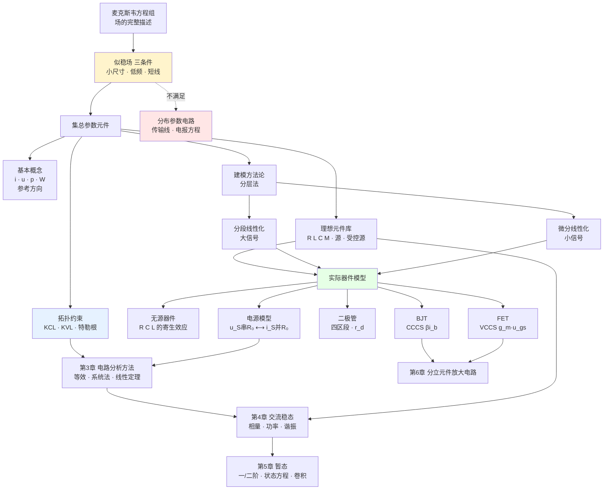

# 电路基础 MOC · 课程索引

> [!info] 课程信息
> **Fundamentals of Electric Device and Circuit Analysis** · 华南理工大学未来技术学院
> 授课：区俊辉（Jun-Hui Ou）、邓佳丽（Jiali Deng，实验）
> 48 学时理论 + 16 学时实验 · 第 18 周闭卷考试
> 成绩：平时 70%（考勤 20 + 作业 30 + 期末 50 + 奖励）+ 实验 30%

---

## 笔记目录

| 笔记 | 内容 | 核心概念 | 课件页 |
|---|---|---|---|
| [[C0 课程基本介绍]] | 课程安排、考核规则 | 成绩构成、清零规则、奖励分 | 第0章 全 |
| [[C1.1 电路分析的演化]] | 从场到路 | 麦克斯韦方程组、**似稳场**、**集总参数元件**、电长度伏笔 | C1 p3–9 |
| [[C1.2 电路的基本概念]] | 四个基本量 | 电流/电压/功率/电能、**参考方向**、**相关参考方向**、功率守恒、拓扑术语 | C1 p10–31 |
| [[C1.3 电路模型]] | 建模方法论 | **分层法**、**分段线性化**、**微分线性化** | C1 p32–38 |
| [[C1.4 理想电路元件]] | 元件"字母表" | R/M/C/L、电压源/电流源/理想二极管、**四种受控源**、理想变压器 | C1 p39–63 |
| [[C1.5 电路分析的基本定律]] | 拓扑约束 | **KCL**、**KVL**（含场论推导）、广义形式、**特勒根定理** | C1 p64–88 |
| [[C2.1 元件互连与传输线模型]] | 导线也是器件 | **电长度**、趋肤效应、分布电容/电感/电纳、**UTL 的 RLGC 模型**、电报方程 | C2 p2–12 |
| [[C2.2 单端口器件的电路模型]] | 实际器件建模（一） | 电阻器三频段、**ESR/ESL**、**品质因数 Q**、实际电源模型、**二极管四区段**、$r_d=V_T/I_D$ | C2 p13–32 |
| [[C2.3 双端口器件的电路模型]] | 实际器件建模（二） | **BJT** 三区三极、**FET** 三区三极、大信号/低频小信号/高频小信号模型、$\beta$、$g_m$ | C2 p33–53 |
| [[C3.1 直流稳态与电路分析总览]] | 分析路线 | 电路分析定义、直流稳态（C 开路 L 短路）、三条路线（等效/系统/定理） | C3 p3–7 |
| [[C3.2 电阻网络等效化简]] | 端口等效 | 串并联、分压分流、源变换、入端等效电阻、负电阻、Y–Δ | C3 p8–36 |
| [[C3.3 电阻网络的系统分析]] | 全网求解 | 全电路方程、支路电流法、结点电压法、无伴电压源、受控源、通用支路方程 | C3 p37–68 |
| [[C3.4 线性电路定理]] | 线性网络快工具 | 叠加、替代、等效电源（戴维南/诺顿）、参数三法、最大功率传输 | C3 p69–98 |
| [[C4.1 正弦量与相量]] ～ [[C4.3 正弦稳态电路的一般分析]] | 相量法 | 正弦量、阻抗导纳、相量域系统分析 | C4 p3–53 |
| [[C4.4 正弦稳态功率与功率因数]] | 功率 | $P,Q,S$、复功率、功率因数补偿 | C4 p54–69 |
| [[C4.5 非正弦周期电路的谐波分析]] | 谐波 | 傅里叶级数、RMS、谐波叠加 | C4 p78–100 |
| [[C4.6 网络函数与谐振]] | 频率选择 | 网络函数、串并联谐振、$Q$、带宽 | C4 p101–142 |
| [[C5.1 动态电路与换路定则]] ～ [[C5.3 三要素法与微积分电路]] | 一阶动态电路 | 初始值、零输入/零状态/全响应、三要素法 | C5 p2–54 |
| [[C5.4 二阶电路与状态变量法]] | 二阶与状态空间 | 阻尼类型、特征根、状态方程、输出方程 | C5 p55–100 |
| [[C5.5 阶跃冲激与卷积积分]] | 任意激励 | 阶跃、冲激、阶跃/冲激响应、卷积 | C5 p101–139 |

---

## 全课程知识地图

---

## 课程整体章节安排（第0章第7页）

| 章 | 名称 | 讲授范围 | 笔记状态 |
|---|---|---|---|
| 1 | 电路的基本概念与基本定律 | ALL | ✅ 已整理 |
| 2 | 电子器件的基本电路模型 | ALL | ✅ 已整理 |
| 3 | 电路分析的基本方法 | ALL | ✅ 已整理 |
| 4 | 交流稳态电路分析 | 4.1–4.3、功率、4.6–4.7 | ✅ 已整理 |
| 5 | 线性动态电路的暂态分析 | 5.1–5.5 | ✅ 已整理 |
| 6 | 分立元件放大电路基础 | 6.1–6.3, 6.5–6.6 | ⏳ 待课件 |
| 7 | 集成放大器及其应用 | 2.1, 2.2, 2.3, part of 2.4 | ⏳ 待课件 |

### 授课进度与「拓展」标注约定

> [!important] 截至第 4 次课
> **课堂语音转写稿已覆盖第 1–4 次课**，内容为 **第 1 章全部 + 第 2 章全部**。
> - **C1.1 – C2.3**：已按转写稿合并，课堂讲过的内容为主干；**课堂未讲、仅由课件/教材补充**的部分标注 **（拓展）** 或 **【拓展】**，篇首附有标注图例。
> - **C3.1 – C5.5**：**尚未讲授**，内容全部来自课件与教材，篇首附有「授课进度说明」。等课上讲到后会按课堂实况合并并补标注。
>
> **标注含义**：标有 **（拓展）/【拓展】** 的内容是**课堂上没有讲到**的延伸部分。复习时先掌握未标注的主干，行有余力再看拓展。

### 课堂给出的考试与作业口径（务必记住）

| 事项 | 口径 |
|---|---|
| **第 2 章** | **没有作业**；考试**只考选择题和填空题（概念题）**，不出计算题与分析题 |
| 第 1 章作业 | 因第 2 章无作业，DDL 由一周**延长到两周** |
| 作业形式 | **交纸质版**，不交电子版（批改后发还，便于复习） |
| 评分铁律 | **只写答案不写过程 = 0 分**；考试同样讲究过程分，**不会做也不要交白卷** |
| 计算精度 | 最终结果保留 **3~4 位有效数字**，**不允许只给分数**（第 3 章 p.48 明确要求） |
| 特勒根定理 | 考得不多，但**看到两个拓扑相同的电路图**就要想到它 |
| 电源/负载判别 | 相关参考方向下 $P>0$ 负载、$P<0$ 电源——**五年考过三次** |
| BJT/FET 公式 | $r_{be}$、$g_m$ 等公式**考试会给**，但必须知道**怎么用**（先求静态工作点）|

---

## 关键公式索引

### 基本量
| 公式 | 出处 |
|---|---|
| $i = \dfrac{\mathrm{d}q}{\mathrm{d}t}$，$u_{ab}=v_a-v_b=\dfrac{\mathrm{d}W}{\mathrm{d}q}$ | [[C1.2 电路的基本概念]] |
| $p = ui$（相关参考方向）/ $p=-ui$（非相关） | [[C1.2 电路的基本概念]] |
| $\sum P = 0$（功率守恒） | [[C1.2 电路的基本概念]] |

### 理想元件伏安关系
| 元件 | 公式 | 储能 |
|---|---|---|
| 电阻 | $u = Ri$，$p_R = Ri^2 \ge 0$ | — |
| 电容 | $i = C\dfrac{\mathrm{d}u}{\mathrm{d}t}$，$u=u(0)+\dfrac1C\int_0^t i\,\mathrm{d}t$ | $W_C=\frac12Cu^2$ |
| 电感 | $u = L\dfrac{\mathrm{d}i}{\mathrm{d}t}$，$i=i(0)+\dfrac1L\int_0^t u\,\mathrm{d}t$ | $W_L=\frac12Li^2$ |
| 忆阻 | $\varphi = Mq$，$u = Mi$ | — |
| 理想变压器 | $u_1=nu_2$，$i_1=-i_2/n$，$R_{in}=n^2R_L$ | 不储不耗 |
→ [[C1.4 理想电路元件]]

### 基本定律
| 定律 | 公式 | 物理基础 |
|---|---|---|
| KCL | $\sum_{k} i_{kn}=0$（任一结点 / 任一闭合面） | 电荷守恒 |
| KVL | $\sum_L u_k = 0$（任一回路 / 任一路径） | 能量守恒 |
| 特勒根 | $\sum_k u_k\hat i_k = 0$，$\sum_k \hat u_k i_k=0$ | **纯拓扑** |
→ [[C1.5 电路分析的基本定律]]

### 电路分析方法（第3章）
| 方法/定理 | 公式 | 要点 |
|---|---|---|
| 直流稳态 | C 视为开路、L 视为短路 | 仅稳态成立；暂态失效（第5章） |
| 串联/并联 | $R_{eq}=\sum R_k$；$G_{eq}=\sum G_k$ | 分压用 R、分流用 G |
| 源变换 | $u_S = R\, i_S$ | 电阻随源搬家；**等效只对外** |
| 入端等效电阻 | $R_{eq}=U/I$ | 无**独立**源（受控源保留，可为负） |
| 一步法求等效电源参数 | 外加 $U$ 求 $I$：$U=U_{OC}+R_0I$ | **含受控源时首选** |
| 测量法 | $R_0=\dfrac{U_1-U_2}{I_2-I_1}$ | 内部未知时的工程做法 |
| 通用支路方程 | $u=u_S+R(i-i_S)$ | $R=0$ 无伴压源；$R=\infty$ 无伴流源 |
| Y→Δ / Δ→Y | $R_\Delta=3R_Y$（对称）；$G_\Delta=\dfrac{Y\text{相邻乘积}}{\sum G_Y}$ | 桥式网络解桥 |
| 全电路方程 | B·VCR + (N−1)·KCL + (B−N+1)·KVL | 2B 个方程，理论完备 |
| 结点电压法 | $G_{jj}U_j+\sum_{n\ne j}G_{jn}U_n=I_{jS}$ | 自电导正、互电导负、右端流入电流 |
| 叠加定理 | $U=\sum a_nU_{Sn}+\sum r_mI_{Sm}$ | **功率不满足叠加** |
| 替代定理 | 已知 $u_0,i_0$ → 同值电压源/电流源 | 线/非线性均可 |
| 戴维南/诺顿 | $u=U_{OC}-R_0i$；$U_{OC}=R_0I_{SC}$ | 参数三法：二步/一步/测量 |
| 最大功率传输 | $R_L=R_0$，$P_{max}=\dfrac{U_{OC}^2}{4R_0}$ | 效率仅 50%；匹配时 $U_L=U_{OC}/2$（自检） |
→ [[C3.2 电阻网络等效化简]]、[[C3.3 电阻网络的系统分析]]、[[C3.4 线性电路定理]]

### 第 1、2 章补充要点

| 项目 | 结论 |
|---|---|
| 似稳场三条件 | 小尺寸、低频、短线（均相对**工作波长**） |
| 波长 | $\lambda=c/f$；介质中 $\lambda=c/(f\sqrt{\varepsilon_r})$；50 Hz → 6000 km |
| 电长度判据 | $l/\lambda\ll1$ 为集总；工程门槛约 **0.01λ** |
| 电容/电感对偶 | $q=Cu\leftrightarrow\psi=Li$；$W_C=\frac12Cu^2\leftrightarrow W_L=\frac12Li^2$；C 压不突变 / L 流不突变 |
| 受控源四型 | CCCS $\beta$（放大倍数）、CCVS $r$（Ω）、VCCS $g$（S）、VCVS $\mu$（放大倍数）；**系数 = 输出÷输入** |
| 理想变压器 | $u_1=nu_2$、$i_1=-i_2/n$、$R_{in}=n^2R_L$；**不能用于直流** |
| 各类电源电动势 | 干电池 1.5 V / 钮扣 1.35 V / 燃料 1.23 V / 太阳能 0.6 V / 蓄电池 2 V |
| 二极管工程值 | $r_d=V_T/I_D$，$V_T\approx26$ mV；硅 $U_{on}\approx0.7$ V |
| BJT 工程值 | $U_{BE}\approx0.7$ V；$U_{CES}\approx0.3$ V；$i_E=(1+\beta)i_B$ |
| BJT vs FET | BJT = **CCCS**（$\beta i_b$）；FET = **VCCS**（$g_mu_{gs}$） |
| MOSFET 胜出 | **绝缘层** → 控制电流 pA 级 → 百亿晶体管才能集成 |
| 术语陷阱 | **BJT 饱和区 ≠ FET 饱和区（恒流区）**，含义相反 |
→ [[C1.1 电路分析的演化]] ～ [[C2.3 双端口器件的电路模型]]

### 器件参数
| 参数 | 公式 | 典型值 |
|---|---|---|
| 电长度判据 | $l/\lambda \ll 1$（工程取 $l<\lambda/20$） | — |
| 特性阻抗 | $Z_0=\sqrt{L_0/C_0}$，$v=1/\sqrt{L_0C_0}$ | 50 Ω / 100 Ω |
| 品质因数 | $Q = \omega L/R$ | 越大越理想 |
| 电容自谐振 | $f_0 = 1/(2\pi\sqrt{ESL\cdot C})$ | — |
| 电源等效互换 | $u_S = i_S R_0$ | — |
| 温度电压当量 | $V_T = kT/q$ | **26 mV**（室温） |
| 二极管动态电阻 | $r_d = V_T/I_D$ | 1 mA → 26 Ω |
| BJT 输入电阻 | $r_{be}=r_{bb'}+(1+\beta)V_T/I_{EQ}$ | 几百 Ω–几 kΩ |
| BJT 高频电容 | $C_{b'e}=\beta/(2\pi r_{b'e}f_T)$ | pF |
| FET 跨导 | $g_m = 2\sqrt{I_{DQ}I_{DO}}/U_{GS(th)}$ | $\propto\sqrt{I_{DQ}}$ |
| 硅管 $U_{BE}$ / $U_{CES}$ | — | 0.7 V / 0.3 V |
→ [[C2.1 元件互连与传输线模型]]、[[C2.2 单端口器件的电路模型]]、[[C2.3 双端口器件的电路模型]]

---

## 复习路线建议

**第一遍（理解主线）**：C1.1 → C1.2 → C1.5
把"为什么可以用路的方法"和"路的两条铁律"打通，这是全课程的骨架。

**第二遍（建立工具箱）**：C1.4 → C1.3
先熟悉理想元件的伏安关系，再理解两种线性化方法。

**第三遍（器件建模）**：C2.1 → C2.2 → C2.3
按"实物 → 非理想因素 → 集总模型"的固定套路对照着看，三节结构完全平行。

**第四遍（电路分析方法）**：C3.1 → C3.2 → C3.3 → C3.4
C3.1 是地图；C3.2（等效）适合"只问一条支路"；C3.3（结点电压法）是系统解法主力；C3.4（叠加/替代/戴维南/最大功率）是考试高频。第 4 章会把整套方法搬到相量域，第 3 章务必扎实。

**易混淆点清单：**
- 参考方向 vs 真实方向；相关 vs 非相关参考方向 → [[C1.2 电路的基本概念]]
- 分段线性化（大信号）vs 微分线性化（小信号）→ [[C1.3 电路模型]]
- 独立源 vs 受控源（叠加定理中只置零独立源）→ [[C1.4 理想电路元件]]
- 电压源怕短路 vs 电流源怕开路 → [[C1.4 理想电路元件]]
- 集总 vs 分布（判据是电长度）→ [[C2.1 元件互连与传输线模型]]
- **BJT 饱和区 vs FET 饱和区（含义相反！）** → [[C2.3 双端口器件的电路模型]]
- **等效 vs 替代**（等效对任意外电路成立；替代只在当前电路的工作点成立）→ [[C3.4 线性电路定理]]
- **电压/电流可叠加，功率不可叠加**（二次量有交叉项）→ [[C3.4 线性电路定理]]
- 有伴 vs 无伴电压源（结点法处理方式完全不同）→ [[C3.3 电阻网络的系统分析]]
- $i_D$（总量）/ $I_D$（直流）/ $i_d$（交流）三种下标写法 → [[C1.3 电路模型]]

---

## 素材

- 课件 PDF 存于 `pdfs/`
- 裁切插图存于 `attachments/`，命名前缀 `C1-` / `C2-` / `C3-` 对应章节（前缀只到章，不带小节号）
- 课堂语音转写稿存于 `transscript/`（第一节 ～ 第四节）
