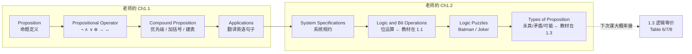
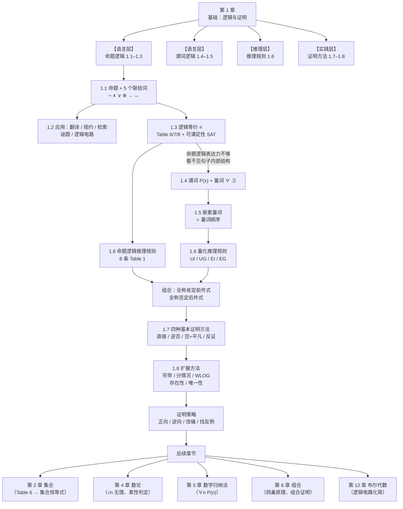
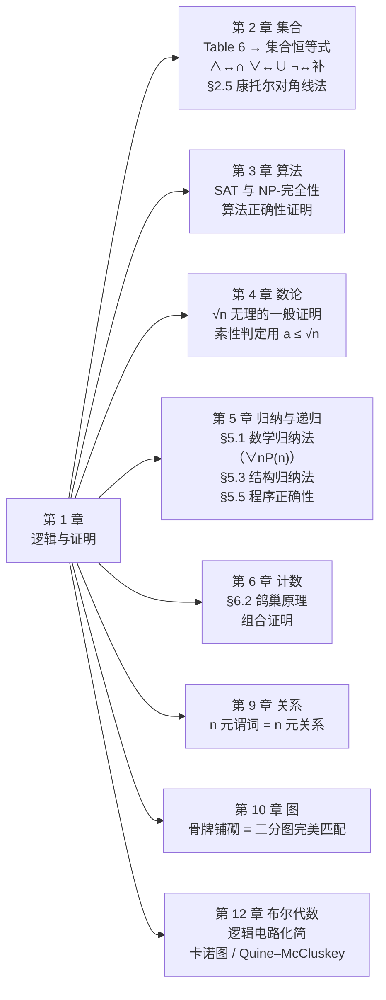

# C1 基础：逻辑与证明 MOC

> [!abstract] 本章总纲（课本章首语）
> **逻辑规则赋予数学陈述精确的含义。** 例如，这些规则帮助我们理解并推理诸如"存在一个不是两个平方数之和的整数"和"对每个正整数 $n$，不超过 $n$ 的正整数之和是 $n(n+1)/2$"这样的陈述。
> **逻辑是一切数学推理的基础，也是一切自动推理的基础。** 它在计算机器的设计、系统规约、人工智能、计算机编程、程序设计语言，以及计算机科学与许多其他研究领域中都有实际应用。
>
> **要理解数学，必须理解什么构成一个正确的数学论证，即证明。** 一旦证明了一个数学陈述为真，就称它为**定理**。关于某一主题的一组定理组织起我们关于该主题的知识。**要学好一个数学主题，必须主动构造关于该主题的数学论证，而不只是阅读讲解。** 而且，知道一个定理的证明往往使我们能够修改结果以适应新的情形。
>
> **人人都知道证明在数学中很重要，但许多人惊讶于证明在计算机科学中同样重要。** 事实上，证明被用来：验证计算机程序对所有可能的输入值都产生正确的输出、说明算法总是产生正确的结果、确立系统的安全性、以及创造人工智能。此外，人们已经创造出**自动推理系统**，让计算机能够构造自己的证明。
>
> **本章将解释什么构成一个正确的数学论证，并介绍构造这些论证的工具。** 我们会发展一套不同的证明方法的武器库，使我们能够证明许多不同类型的结果；在介绍完各种证明方法后，还会介绍若干构造证明的策略。我们将引入**猜想**的概念，并解释通过研究猜想来发展数学的过程。

---

## 章节导航

| 节 | 笔记 | 核心内容 | 必背要点 |
|---|---|---|---|
| 1.1 | [[C1.1 命题逻辑 Propositional Logic]] | 命题、五个联结词、真值表、条件语句的各种表述、逆/否/逆否、优先级、位运算 | $p\to q$ 只在"前真后假"时为假；"$p$ only if $q$" = $p \to q$；只有逆否等价 |
| 1.2 | [[C1.2 命题逻辑的应用 Applications of Propositional Logic]] | 英语翻译、系统规约与一致性、布尔检索、逻辑谜题、逻辑电路 | 一致 = 存在使全部为真的赋值；三种基本门；表达式 ↔ 电路 |
| 1.3 | [[C1.3 命题等价 Propositional Equivalences]] | 永真式/矛盾式/可能式、逻辑等价、Table 6/7/8、德摩根律、可满足性、数独编码 | $p\to q \equiv \neg p \vee q$；$\neg(p\to q) \equiv p \wedge \neg q$；德摩根律 |
| 1.4 | [[C1.4 谓词与量词 Predicates and Quantifiers]] | 谓词、命题函数、$\forall$/$\exists$/$\exists!$、论域、受限量词、约束变元、量词德摩根律、翻译、Prolog | **$\forall$ 配 $\to$，$\exists$ 配 $\wedge$**；$\neg\forall \equiv \exists\neg$，$\neg\exists \equiv \forall\neg$ |
| 1.5 | [[C1.5 嵌套量词 Nested Quantifiers]] | 嵌套量词、**量词顺序**、Table 1、数学陈述翻译、极限定义、嵌套量词的否定 | **$\forall x\exists y \ne \exists y\forall x$**；$\exists\forall \Rightarrow \forall\exists$（单向） |
| 1.6 | [[C1.6 推理规则 Rules of Inference]] | 有效论证、Table 1（8 条）、归结、谬误、Table 2（UI/UG/EI/EG）、全称肯定前件式 | 有效 ≠ 可靠；肯定后件/否定前件是谬误；EI 先于 UI |
| 1.7 | [[C1.7 证明导论 Introduction to Proofs]] | 术语、直接证明、逆否证明、空/平凡证明、反证法、$\sqrt2$ 无理、等价性证明、反例、证明中的错误 | 逆否 $\equiv$ 原命题；反证法证 $p\to q$ 是假设 $p \wedge \neg q$；循环论证 |
| 1.8 | [[C1.8 证明方法与策略 Proof Methods and Strategy]] | 穷举/分情况证明、WLOG、存在性证明（构造性/非构造性）、唯一性证明、正向/逆向推理、棋盘铺砌与染色论证、开放问题 | 情形必须完备；染色的颜色数 = 拼块覆盖格数；逆向推理找 $p \to q$ |

---

## 📚 课堂进度与课件对照（Dr. 欧士琪 SCUT 2026 Fall）

> [!info] 已收到的课件
> | 课件文件 | 日期 | 覆盖内容 | 已并入笔记 |
> |---|---|---|---|
> | `Ch1.1_Part1.pdf`（23 slides） | 2026-09-02 | Warm Up 四题、Wason 随堂测四题、命题定义、$\neg\ \wedge\ \vee\ \oplus$、两道 Small Exercise | [[C1.1 命题逻辑 Propositional Logic]] 课件补充 L0–L3 |
> | `Ch1.1_Part2.pdf`（20 slides） | 2026-09-02 | 真值表、条件语句、必要/充分条件、双条件、运算符总表 | [[C1.1 命题逻辑 Propositional Logic]] 课件补充 L4 |
> | `Ch1.1_Part3.pdf`（18 slides） | 2026-09-03 | 复合命题、**运算优先级**、加括号五步、逐列建表、翻译四步算法 | [[C1.1 命题逻辑 Propositional Logic]] 课件补充 L5–L6 |
> | `Ch1.2.pdf`（12 slides） | 2026-09-03 | 系统规约（真值表解法）、位运算、Batman/Joker 谜题、**命题类型** | [[C1.2 命题逻辑的应用 Applications of Propositional Logic]] 课件补充 L1–L4 |

### 讲课顺序 ≠ 教材顺序（**复习时按课件顺序走**）



| 教材位置 | 老师放在 | 备注 |
|---|---|---|
| §1.1 位运算 | **§1.2** | 推迟 |
| §1.2 翻译英语句子 | **§1.1 Part 3** | 提前 |
| §1.2 布尔检索 | **暂未讲** | |
| §1.2 泥孩子问题 | **暂未讲** | |
| §1.2 逻辑电路 | **暂未讲** | 可能并入第 12 章 |
| §1.3 命题类型（永真/矛盾/可能） | **§1.2** | 提前 |

### ⚠️ 课件与教材的**实质性差异**（考试以课件为准）

> [!warning] 只有一处，但很关键
> **运算符优先级**：教材 Table 8 只列 5 个运算符（不含 $\oplus$）；**老师的表把 $\vee$ 和 $\oplus$ 并列为第 3 级**：
>
> | 优先级 | 运算符 |
> |:-:|:-:|
> | 1 | $\neg$ |
> | 2 | $\wedge$ |
> | 3 | **$\vee$、$\oplus$** |
> | 4 | $\to$ |
> | 5 | $\leftrightarrow$ |
>
> 详见 [[C1.1 命题逻辑 Propositional Logic]] 课件补充 L5.1。

### 老师独有、教材没有的知识点（**这些最容易被漏掉**）

| 内容 | 位置 | 为什么重要 |
|---|---|---|
| **Warm Up 四个错误推理** | [[C1.1 命题逻辑 Propositional Logic]] L0 | 全章四大陷阱的预告 |
| **Wason 选择任务四题** | [[C1.1 命题逻辑 Propositional Logic]] L1 | ⭐ 检验 $p \to q$ 只需查"$p$ 真"和"$q$ 假"两项 |
| **$\wedge$ 像 A、$\vee$ 像 v 的助记** | [[C1.1 命题逻辑 Propositional Logic]] L2.2 | 专治符号记反 |
| **否定不能提供额外信息** | [[C1.1 命题逻辑 Propositional Logic]] L3 | ⭐ "Today is Monday" 不是 "Today is Friday" 的否定 |
| **必要/充分条件的真值表定义** | [[C1.1 命题逻辑 Propositional Logic]] L4.4 | ⭐ 一秒定箭头方向 |
| **必要/充分四种组合总表** | [[C1.1 命题逻辑 Propositional Logic]] L4.9 | 概念辨析题 |
| **加括号五步 + 逐列建表六步** | [[C1.1 命题逻辑 Propositional Logic]] L5.2–L5.3 | ⭐ 答题的标准格式 |
| **翻译英语句子四步算法** | [[C1.1 命题逻辑 Propositional Logic]] L6 | ⭐ 翻译大题的步骤分 |
| **系统规约的真值表解法** | [[C1.2 命题逻辑的应用 Applications of Propositional Logic]] L1.3 | 与教材推理法互补 |
| **Batman/Joker 的穷举表解法** | [[C1.2 命题逻辑的应用 Applications of Propositional Logic]] L3 | 谜题题的通法 |

---

## 全章知识地图



---

## 三张必背的表

### TABLE A｜命题逻辑真值表汇总（§1.1）

| $p$ | $q$ | $\neg p$ | $p \wedge q$ | $p \vee q$ | $p \oplus q$ | $p \to q$ | $p \leftrightarrow q$ |
|:-:|:-:|:-:|:-:|:-:|:-:|:-:|:-:|
| T | T | F | **T** | T | F | T | **T** |
| T | F | F | F | T | T | **F** | F |
| F | T | T | F | T | T | T | F |
| F | F | T | F | **F** | F | T | **T** |

**优先级**：$\neg$ (1) > $\wedge$ (2) > $\vee$、$\oplus$ (3) > $\to$ (4) > $\leftrightarrow$ (5)；**量词 $\forall,\exists$ 高于一切联结词**。
（⚠️ $\oplus$ 与 $\vee$ 同级是**老师课件的规定**，教材 Table 8 未列 $\oplus$——考试按课件。）

### TABLE B｜最常用的逻辑等价（§1.3）

| 等价式 | 名称 |
|---|---|
| $p \to q \equiv \neg p \vee q$ | ⭐ 条件的析取形式（**消箭头**） |
| $\neg(p \to q) \equiv p \wedge \neg q$ | ⭐ **条件的否定 = 反例** |
| $p \to q \equiv \neg q \to \neg p$ | ⭐ 逆否等价 |
| $\neg(p \wedge q) \equiv \neg p \vee \neg q$ | ⭐ 德摩根律 |
| $\neg(p \vee q) \equiv \neg p \wedge \neg q$ | ⭐ 德摩根律 |
| $p \leftrightarrow q \equiv (p\to q)\wedge(q\to p)$ | 双条件的定义式 |
| $(p \to r)\wedge(q\to r) \equiv (p\vee q)\to r$ | 分情况证明的依据 |
| $p \to (q \to r) \equiv (p \wedge q) \to r$ | 输出律 exportation |
| $\neg\forall x P(x) \equiv \exists x \neg P(x)$ | ⭐ 量词德摩根律 |
| $\neg\exists x P(x) \equiv \forall x \neg P(x)$ | ⭐ 量词德摩根律 |
| $\neg\forall x(P(x)\to Q(x)) \equiv \exists x(P(x)\wedge\neg Q(x))$ | ⭐ **反例的形式化** |

### TABLE C｜推理规则（§1.6）

| 规则 | 形式 | 名称 |
|---|---|---|
| 1 | $p,\ p\to q \therefore q$ | Modus ponens 肯定前件式 |
| 2 | $\neg q,\ p\to q \therefore \neg p$ | Modus tollens 否定后件式 |
| 3 | $p\to q,\ q\to r \therefore p\to r$ | Hypothetical syllogism 假言三段论 |
| 4 | $p\vee q,\ \neg p \therefore q$ | Disjunctive syllogism 析取三段论 |
| 5 | $p \therefore p\vee q$ | Addition 附加律 |
| 6 | $p\wedge q \therefore p$ | Simplification 化简律 |
| 7 | $p,\ q \therefore p\wedge q$ | Conjunction 合取律 |
| 8 | $p\vee q,\ \neg p\vee r \therefore q\vee r$ | Resolution 归结 |
| 9 | $\forall xP(x) \therefore P(c)$ | Universal instantiation 全称实例化 |
| 10 | $P(c)$（任意 $c$）$\therefore \forall xP(x)$ | Universal generalization 全称推广 |
| 11 | $\exists xP(x) \therefore P(c)$（某个 $c$） | Existential instantiation 存在实例化 |
| 12 | $P(c)$（某个 $c$）$\therefore \exists xP(x)$ | Existential generalization 存在推广 |

**❌ 两个谬误（形似规则但无效）**：
- **肯定后件谬误**：$p\to q,\ q \therefore p$
- **否定前件谬误**：$p\to q,\ \neg p \therefore \neg q$

---

## 关键术语表 Key Terms（**课本原文术语，附中文对照**）

> [!note] 使用说明
> 这是课本章末 "Key Terms and Results" 的完整翻译对照，**一个都没省略**。名词解释题直接从这里出。

### §1.1–1.2 命题逻辑

| 英文术语 | 中文 | 定义 |
|---|---|---|
| **proposition** | 命题 | 一个非真即假的陈述 |
| **propositional variable** | 命题变元 | 表示一个命题的变量 |
| **truth value** | 真值 | 真或假 |
| **$\neg p$ (negation of $p$)** | $p$ 的否定 | 真值与 $p$ 相反的命题 |
| **logical operators** | 逻辑运算符 | 用来组合命题的运算符 |
| **compound proposition** | 复合命题 | 用逻辑运算符组合若干命题构造出的命题 |
| **truth table** | 真值表 | 显示命题所有可能真值的表 |
| **$p \vee q$ (disjunction)** | $p$ 与 $q$ 的析取 | 命题"$p$ 或 $q$"，当且仅当 $p,q$ 中至少一个为真时为真 |
| **$p \wedge q$ (conjunction)** | $p$ 与 $q$ 的合取 | 命题"$p$ 且 $q$"，当且仅当 $p,q$ 都为真时为真 |
| **$p \oplus q$ (exclusive or)** | $p$ 与 $q$ 的异或 | 命题"$p$ XOR $q$"，当 $p,q$ 中恰好一个为真时为真 |
| **$p \to q$ ($p$ implies $q$)** | $p$ 蕴涵 $q$ | 命题"若 $p$ 则 $q$"，当且仅当 $p$ 真且 $q$ 假时为假 |
| **converse of $p \to q$** | $p\to q$ 的逆命题 | 条件语句 $q \to p$ |
| **contrapositive of $p \to q$** | $p\to q$ 的逆否命题 | 条件语句 $\neg q \to \neg p$ |
| **inverse of $p \to q$** | $p\to q$ 的否命题 | 条件语句 $\neg p \to \neg q$ |
| **$p \leftrightarrow q$ (biconditional)** | 双条件 | 命题"$p$ 当且仅当 $q$"，当且仅当 $p,q$ 真值相同时为真 |
| **bit** | 位 | 0 或 1 |
| **Boolean variable** | 布尔变量 | 取值为 0 或 1 的变量 |
| **bit operation** | 位运算 | 对一个或多个位的运算 |
| **bit string** | 位串 | 位的序列 |
| **bitwise operations** | 按位运算 | 对位串的运算，对一个串中每一位与另一串中对应位进行操作 |
| **logic gate** | 逻辑门 | 对一个或多个位执行逻辑运算并产生一个输出位的逻辑元件 |
| **logic circuit** | 逻辑电路 | 由逻辑门构成、产生一个或多个输出位的开关电路 |

### §1.3 命题等价

| 英文术语 | 中文 | 定义 |
|---|---|---|
| **tautology** | 永真式 / 重言式 | 永远为真的复合命题 |
| **contradiction** | 矛盾式 | 永远为假的复合命题 |
| **contingency** | 可能式 | 有时为真有时为假的复合命题 |
| **consistent compound propositions** | 一致的复合命题 | 存在一组变量真值赋值使这些命题全部为真 |
| **satisfiable compound proposition** | 可满足的复合命题 | 存在一组变量真值赋值使其为真 |
| **logically equivalent compound propositions** | 逻辑等价的复合命题 | 真值永远相同的复合命题 |

### §1.4–1.5 谓词逻辑

| 英文术语 | 中文 | 定义 |
|---|---|---|
| **predicate** | 谓词 | 句子中给主语赋予某种性质的那一部分 |
| **propositional function** | 命题函数 | 含一个或多个变量的陈述，当每个变量被赋值或被量词约束时成为命题 |
| **domain (universe) of discourse** | 论域（讨论域） | 命题函数中变量可以取的值 |
| **$\exists x P(x)$** | $P(x)$ 的存在量化 | 当且仅当论域中存在 $x$ 使 $P(x)$ 为真时该命题为真 |
| **$\forall x P(x)$** | $P(x)$ 的全称量化 | 当且仅当论域中每个 $x$ 都使 $P(x)$ 为真时该命题为真 |
| **logically equivalent expressions** | 逻辑等价的表达式 | 无论代入什么命题函数、使用什么论域，真值都相同的表达式 |
| **free variable** | 自由变元 | 命题函数中未被约束的变量 |
| **bound variable** | 约束变元 | 被量化的变量 |
| **scope of a quantifier** | 量词的作用域 | 陈述中量词约束其变量的那一部分 |

### §1.6 推理规则

| 英文术语 | 中文 | 定义 |
|---|---|---|
| **argument** | 论证 | 一个陈述序列 |
| **argument form** | 论证形式 | 一个由命题变元构成的复合命题序列 |
| **premise** | 前提 | 论证或论证形式中除最后一个之外的陈述 |
| **conclusion** | 结论 | 论证或论证形式中的最后一个陈述 |
| **valid argument form** | 有效的论证形式 | 所有前提的真蕴涵结论为真的复合命题序列 |
| **valid argument** | 有效论证 | 具有有效论证形式的论证 |
| **rule of inference** | 推理规则 | 可用于证明论证有效的有效论证形式 |
| **fallacy** | 谬误 | 常被错误地当作推理规则使用的无效论证形式（更一般地，指不正确的论证） |
| **circular reasoning / begging the question** | 循环论证 / 窃取论题 | 一个或多个步骤基于待证陈述本身为真的推理 |

### §1.7–1.8 证明

| 英文术语 | 中文 | 定义 |
|---|---|---|
| **theorem** | 定理 | 可以被证明为真的数学断言 |
| **conjecture** | 猜想 | 被提出为真但尚未被证明的数学断言 |
| **proof** | 证明 | 定理为真的论证 |
| **axiom** | 公理 | 被假定为真、可作为证明定理基础的陈述 |
| **lemma** | 引理 | 用来证明其他定理的定理 |
| **corollary** | 推论 | 可作为刚证明的定理的推论而被证明的命题 |
| **vacuous proof** | 空证明 | 基于 $p$ 为假来证明 $p\to q$ 为真的证明 |
| **trivial proof** | 平凡证明 | 基于 $q$ 为真来证明 $p\to q$ 为真的证明 |
| **direct proof** | 直接证明 | 通过说明 $p$ 真时 $q$ 必真来证明 $p\to q$ 为真 |
| **proof by contraposition** | 逆否证明 | 通过说明 $q$ 假时 $p$ 必假来证明 $p\to q$ 为真 |
| **proof by contradiction** | 反证法 | 基于条件语句 $\neg p \to q$ 为真（其中 $q$ 是矛盾式）来证明 $p$ 为真 |
| **exhaustive proof** | 穷举证明 | 通过检查所有可能情形的清单来确立结果的证明 |
| **proof by cases** | 分情况证明 | 分成若干情形的证明，这些情形覆盖所有可能性 |
| **without loss of generality (WLOG)** | 不失一般性 | 证明中的一种假设，使得可以通过减少需考虑的情形数来证明定理 |
| **counterexample** | 反例 | 使 $P(x)$ 为假的元素 $x$ |
| **constructive existence proof** | 构造性存在性证明 | 明确找出具有指定性质的元素的存在性证明 |
| **nonconstructive existence proof** | 非构造性存在性证明 | 不明确找出该元素的存在性证明 |
| **rational number** | 有理数 | 可以表示为两个整数 $p, q$ 之比（$q \ne 0$）的数 |
| **uniqueness proof** | 唯一性证明 | 证明恰好有一个元素满足指定性质 |

### 关键结果 RESULTS（课本原文）

1. **§1.3 Table 6、7、8 中给出的逻辑等价。**
2. **量词的德摩根律 (De Morgan's laws for quantifiers)。**
3. **命题演算的推理规则 (Rules of inference for propositional calculus)。**
4. **量化语句的推理规则 (Rules of inference for quantified statements)。**

---

## 章末复习题速答 Review Questions

> [!question] 1. 定义命题的否定。"This is a boring course" 的否定是什么？
> **答**：$\neg p$ 是真值与 $p$ 相反的命题，读作"并非 $p$"。
> 否定："**This is not a boring course.**"

> [!question] 2. 用真值表定义析取、合取、异或、条件、双条件。
> **答**：见上文 TABLE A。
> 以 $p$ = "I'll go to the movies tonight"，$q$ = "I'll finish my discrete mathematics homework" 为例：
> - 析取：I'll go to the movies tonight **or** I'll finish my homework.
> - 合取：I'll go to the movies tonight **and** I'll finish my homework.
> - 异或：I'll go to the movies tonight **or** I'll finish my homework, **but not both**.
> - 条件：**If** I go to the movies tonight, **then** I'll finish my homework.
> - 双条件：I'll go to the movies tonight **if and only if** I finish my homework.

> [!question] 3. 至少五种用英语写 $p \to q$ 的方式；定义逆命题和逆否命题。
> **答**：if $p$ then $q$；$p$ implies $q$；$p$ only if $q$；$q$ whenever $p$；$q$ if $p$；$p$ is sufficient for $q$；$q$ is necessary for $p$；$q$ unless $\neg p$；$q$ follows from $p$。
> 逆命题 $q \to p$；逆否命题 $\neg q \to \neg p$。
> 对 "If it is sunny tomorrow, then I will go for a walk in the woods."：
> - **逆命题**：If I go for a walk in the woods tomorrow, then it will be sunny.
> - **逆否命题**：If I do not go for a walk in the woods tomorrow, then it will not be sunny.

> [!question] 4. 什么叫两个命题逻辑等价？有哪些方法证明？
> **答**：$p \leftrightarrow q$ 是永真式。方法：① 真值表逐行比对；② 用已知等价律做链式变形。
> 证 $\neg p \vee (r \to \neg q) \equiv \neg p \vee \neg q \vee \neg r$：
> **方法一（等价变形）**：$r \to \neg q \equiv \neg r \vee \neg q$，故左边 $\equiv \neg p \vee \neg r \vee \neg q \equiv \neg p \vee \neg q \vee \neg r$（交换律）。✓
> **方法二（真值表）**：列 8 行逐一比对（略）。

> [!question] 5. 如何用析取范式由真值表构造命题？为什么这说明 $\{\wedge,\vee,\neg\}$ 功能完备？有单个运算符就完备的吗？
> **答**：对每一个使命题为真的赋值写一个合取项（变元为真写变元、为假写其否定），再把所有合取项析取起来。因为任何真值表都能这样实现，所以 $\{\wedge,\vee,\neg\}$ 功能完备。
> **有**：NAND（$\mid$，Sheffer 竖线）和 NOR（$\downarrow$，Peirce 箭头）各自单独就是功能完备的。

> [!question] 6. 谓词 $P(x)$ 的全称量化和存在量化是什么？它们的否定是什么？
> **答**：$\forall xP(x)$（对论域中每个 $x$，$P(x)$ 为真）；$\exists xP(x)$（论域中存在 $x$ 使 $P(x)$ 为真）。
> 否定：$\neg\forall xP(x) \equiv \exists x\neg P(x)$；$\neg\exists xP(x) \equiv \forall x\neg P(x)$。

> [!question] 7. $\exists x\forall y P(x,y)$ 与 $\forall y \exists x P(x,y)$ 有何区别？举一个真值不同的例子。
> **答**：前者要求存在一个**固定的** $x$ 对所有 $y$ 都成立；后者允许 $x$ 依赖于 $y$。前者更强：$\exists x\forall y P \Rightarrow \forall y\exists x P$，反之不成立。
> **例**：论域为实数，$P(x,y)$ 为 "$x + y = 0$"。
> $\forall y\exists x P(x,y)$ **真**（取 $x = -y$）；$\exists x\forall y P(x,y)$ **假**（没有一个 $x$ 对所有 $y$ 都行）。

> [!question] 8. 什么叫命题逻辑中的有效论证？证明"地球是平的"那个论证有效。
> **答**：有效 = 所有前提的真蕴涵结论为真，等价于 $(p_1\wedge\cdots\wedge p_n)\to q$ 是永真式。
> 设 $p$ = "The earth is flat"，$q$ = "You can sail off the edge of the earth"。
> 前提：$p \to q$ 和 $\neg q$；结论：$\neg p$。
> 这正是 **modus tollens**，是有效的论证形式。✓
> （**注意**：论证有效，但要断定"地球不是平的"为真，还需要前提为真——这里两个前提确实都为真，故论证**可靠**。）

> [!question] 9. 用推理规则证明：由"所有斑马都有条纹"和"Mark 是斑马"推出"Mark 有条纹"。
> **答**：设 $Z(x)$ = "$x$ 是斑马"，$S(x)$ = "$x$ 有条纹"。
> | Step | Reason |
> |---|---|
> | 1. $\forall x(Z(x) \to S(x))$ | Premise |
> | 2. $Z(\text{Mark}) \to S(\text{Mark})$ | Universal instantiation from (1) |
> | 3. $Z(\text{Mark})$ | Premise |
> | 4. $S(\text{Mark})$ | Modus ponens from (2) and (3) |
>
> （即**全称肯定前件式 universal modus ponens**。）

> [!question] 10. 描述直接证明、逆否证明、反证法；对"若 $n$ 是偶数，则 $n+4$ 是偶数"各给一个证明。
> **答**：
> **直接证明**：设 $n$ 偶，$n = 2k$。则 $n + 4 = 2k + 4 = 2(k+2)$ 是偶数。∎
> **逆否证明**：设 $n+4$ 不是偶数，即 $n + 4 = 2k+1$。则 $n = 2k - 3 = 2(k-2) + 1$ 是奇数，即 $n$ 不是偶数。∎
> **反证法**：假设 $n$ 是偶数**且** $n+4$ 不是偶数。由 $n = 2k$ 得 $n+4 = 2(k+2)$ 是偶数，与假设矛盾。∎

> [!question] 11. 如何证明双条件 $p \leftrightarrow q$？证明"$3n+2$ 是奇数当且仅当 $9n+5$ 是偶数"。
> **答**：分别证 $p \to q$ 与 $q \to p$。
> **（⇒）** 设 $3n+2$ 是奇数，则 $3n+2 = 2k+1$，故 $3n = 2k - 1$。于是
> $$9n + 5 = 3(3n) + 5 = 3(2k-1) + 5 = 6k + 2 = 2(3k+1)$$
> 是偶数。✓
> **（⇐）** 用逆否：设 $3n+2$ 是偶数，则 $3n+2 = 2k$，故 $3n = 2k-2$。于是
> $$9n+5 = 3(2k-2)+5 = 6k - 1 = 2(3k-1)+1$$
> 是奇数，即 $9n+5$ 不是偶数。✓ ∎

> [!question] 12. 要证 $p_1,p_2,p_3,p_4$ 等价，证明 $p_4\to p_2$、$p_3\to p_1$、$p_1\to p_2$ 够吗？
> **答**：**不够。** 这三条形成的有向图是 $p_4 \to p_2$，$p_3 \to p_1 \to p_2$——**无法从 $p_2$ 走回任何其他命题**（$p_2$ 没有出边），所以不能建立完整的等价环。
> **一组够用的条件语句**：$p_1 \to p_2$，$p_2 \to p_3$，$p_3 \to p_4$，$p_4 \to p_1$（**循环蕴涵**，任意两点之间都能沿环到达）。

> [!question] 13. 若 $\forall xP(x)$ 为假，如何证明？说明"对每个正整数 $n$，$n^2 \ge 2^n$"为假。
> **答**：**找反例**。
> 取 $n = 3$：$3^2 = 9$，$2^3 = 8$——这个不构成反例（$9 \ge 8$ 成立）。
> 取 $n = 5$：$5^2 = 25$，$2^5 = 32$，$25 < 32$ ⇒ **$n = 5$ 是反例**，该陈述为假。∎
> （$n = 1$：$1 \ge 2$? 否 ⇒ **$n = 1$ 也是反例**，而且更简单。）

> [!question] 14. 构造性与非构造性存在性证明的区别？各举一例。
> **答**：构造性明确给出具有该性质的元素；非构造性证明存在但不给出具体元素。
> **构造性例**：存在一个能以两种方式写成立方和的正整数——$1729 = 10^3+9^3 = 12^3+1^3$。
> **非构造性例**：存在无理数 $x,y$ 使 $x^y$ 有理——由 $\sqrt2^{\sqrt2}$ 有理或无理分两种情形，但不知道是哪种。

> [!question] 15. "存在唯一的 $x$ 使 $P(x)$"的证明包含哪些要素？
> **答**：**存在性**（找到一个 $x$ 使 $P(x)$ 为真）+ **唯一性**（说明若 $y \ne x$ 则 $\neg P(y)$，或等价地：$P(x) \wedge P(y) \Rightarrow x = y$）。

> [!question] 16. 如何用分情况证明关于绝对值的结果，如 $|xy| = |x||y|$？
> **答**：按 $x$ 与 $y$ 的符号分四种情形（都非负 / $x$ 非负 $y$ 负 / $x$ 负 $y$ 非负 / 都负），每种情形中用 $|a| = a$（$a \ge 0$）或 $|a| = -a$（$a < 0$）去掉绝对值号后直接验证。四种情形穷尽所有可能。（详见 [[C1.8 证明方法与策略 Proof Methods and Strategy]] 例 4。）

---

## 补充习题精选 Supplementary Exercises

> [!example] 补充习题 1｜命题符号化（综合复习 §1.1）
> $p$ = "I will do every exercise in this book"，$q$ = "I will get an 'A' in this course"。
> a) **I will get an "A" in this course only if I do every exercise in this book.**
> ⇒ "$q$ only if $p$" = $\boxed{q \to p}$
> b) **I will get an "A" in this course and I will do every exercise in this book.**
> ⇒ $\boxed{q \wedge p}$
> c) **Either I will not get an "A" in this course or I will not do every exercise in this book.**
> ⇒ $\boxed{\neg q \vee \neg p}$（等价于 $\neg(p \wedge q)$，德摩根律）
> d) **For me to get an "A" in this course it is necessary and sufficient that I do every exercise in this book.**
> ⇒ "充要条件" ⇒ $\boxed{q \leftrightarrow p}$
>
> **要点**：a) 的 "only if" 方向和 d) 的"充要条件"是本章翻译题的两大高频考点。

> [!example] 补充习题 33｜改编例 4 到三个因子
> 改编 §1.7 例 4 的证明，证明：若 $n = abc$，其中 $a,b,c$ 是正整数，则 $a \le \sqrt[3]{n}$ 或 $b \le \sqrt[3]{n}$ 或 $c \le \sqrt[3]{n}$。
>
> **解（逆否证明）**：假设结论为假。由**德摩根律**，$a > \sqrt[3]{n}$ **且** $b > \sqrt[3]{n}$ **且** $c > \sqrt[3]{n}$（三个都成立）。
> 三式相乘（都是正数，可以相乘）：
> $$abc > \sqrt[3]{n} \cdot \sqrt[3]{n} \cdot \sqrt[3]{n} = n$$
> 即 $abc \ne n$，与 $n = abc$ 矛盾。
> 由逆否命题，原命题成立。∎
>
> **要点**：与 §1.7 例 4 完全同构（两个因子 → $\sqrt n$，三个因子 → $\sqrt[3]{n}$），是"**改编已有证明**"策略（§1.8）的最佳练习。
> **一般化**：$n = a_1a_2\cdots a_k$ ⇒ 至少有一个 $a_i \le \sqrt[k]{n}$。

> [!example] 补充习题 34｜$\sqrt[3]{2}$ 是无理数
> **证明（反证）**：假设 $\sqrt[3]{2} = a/b$，$a, b$ 是整数，$b \ne 0$，且 $a/b$ 是**最简分数**。
> 两边立方：$2 = a^3/b^3$，即
> $$2b^3 = a^3$$
> 故 $a^3$ 是偶数 ⇒ **$a$ 是偶数**（若 $a$ 奇则 $a^3$ 奇）。设 $a = 2c$：
> $$2b^3 = 8c^3 \implies b^3 = 4c^3 = 2(2c^3)$$
> 故 $b^3$ 是偶数 ⇒ **$b$ 是偶数**。
> 于是 $a, b$ 都有因子 2，与"最简分数"矛盾。∎
>
> **要点**：与 §1.7 例 10（$\sqrt2$ 无理）几乎逐字对应，只是把平方换成立方——**"改编已有证明"的又一个例子**。

> [!example] 补充习题 35｜两个有理数之间必有无理数
> 证明：任何两个有理数之间都存在一个无理数。
>
> **证明（构造性）**：设 $r < s$ 是两个有理数。考虑
> $$x = r + \frac{s - r}{\sqrt2}$$
> **① $x$ 落在 $r$ 与 $s$ 之间**：因为 $1 < \sqrt2 < 2$，有 $0 < \dfrac{s-r}{\sqrt2} < s - r$，故 $r < x < s$。✓
> **② $x$ 是无理数**：假设 $x$ 有理。则
> $$\sqrt2 = \frac{s-r}{x - r}$$
> 是两个有理数之商（$x \ne r$），因而是有理数——与 $\sqrt2$ 无理矛盾。故 $x$ 无理。✓ ∎
>
> **要点**：**"把已知的无理数缩放平移到指定区间"是构造无理数的通用手法。**
> 这个结论说明**无理数在实数中稠密 (dense)**；同理有理数也稠密。这是第 2 章讨论实数集势时的预备知识。

> [!example] 补充习题 39 & 40｜验证 $3x+1$ 猜想
> **39a) $x = 6$**：$6 \to 3 \to 10 \to 5 \to 16 \to 8 \to 4 \to 2 \to \boxed{1}$（8 步）
> **39b) $x = 7$**：$7 \to 22 \to 11 \to 34 \to 17 \to 52 \to 26 \to 13 \to 40 \to 20 \to 10 \to 5 \to 16 \to 8 \to 4 \to 2 \to \boxed{1}$（16 步）
> **39c) $x = 17$**：$17 \to 52 \to 26 \to 13 \to 40 \to 20 \to 10 \to 5 \to 16 \to 8 \to 4 \to 2 \to \boxed{1}$（12 步）
> **39d) $x = 21$**：$21 \to 64 \to 32 \to 16 \to 8 \to 4 \to 2 \to \boxed{1}$（7 步）
> **40a) $x = 16$**：$16 \to 8 \to 4 \to 2 \to \boxed{1}$（4 步，因为 $16 = 2^4$）
> **40b) $x = 11$**：$11 \to 34 \to 17 \to \cdots \to \boxed{1}$（接 39c 的轨迹，共 14 步）
>
> **要点**：注意 **$2^k$ 形式的数最快**（一路除 2）；一旦轨迹碰到某个已验证过的数，就可以直接接上——**这是记忆化 (memoization) 的思想**，实际验证程序都这么做。

> [!example] 补充习题 41 & 42 & 43 & 44｜铺砌问题综合（染色论证练习）
> **41. 去掉两个"相邻"角（不是对角）的标准棋盘能否铺砌？**
> **解**：**能。** 相邻的两个角**颜色不同**（一黑一白），去掉后剩 31 黑 31 白，共 62 格，颜色平衡，**不违反染色论证**。
> 构造：去掉左上和右上两角后，第一行剩 6 格，可用 3 块横放的骨牌覆盖；其余 7 行各 8 格，每行用 4 块横放的骨牌。总计 $3 + 28 = 31$ 块。✓ ∎
>
> **42. 去掉全部四个角的标准棋盘能否铺砌？**
> **解**：**能。** 四个角中两黑两白，去掉后剩 30 黑 30 白，共 60 格，平衡。
> 构造：第一行和第八行各剩 6 格（各用 3 块横骨牌），中间 6 行各 8 格（各用 4 块）。总计 $3+3+24 = 30$ 块。✓ ∎
>
> **43. 证明：方格数为偶数的矩形棋盘总可以用骨牌铺砌。**
> **证明**：设棋盘为 $m \times n$，$mn$ 为偶数 ⇒ **$m$ 或 $n$ 至少有一个是偶数**。
> 不失一般性设 $n$ 是偶数（否则把棋盘旋转 90°）。则每一行有偶数个格子，**每行用 $n/2$ 块横放的骨牌**即可铺满。总共 $mn/2$ 块。∎
>
> **44. 去掉三个角的 $5\times5$ 棋盘能否铺砌？**
> **解**：**不能。** $5 \times 5 = 25$ 格，去掉 3 格剩 **22** 格，是偶数，奇偶性不排除。用染色：$5\times5$ 棋盘四角同色（设为黑），黑格 13 个、白格 12 个。去掉 3 个角（都是黑格）后剩 **10 黑 12 白**。
> 铺砌需 $22/2 = 11$ 块骨牌，覆盖 11 黑 11 白，与 10 黑 12 白矛盾。**不能铺砌。** ∎
>
> **要点（本组题的总结）**：
> | 去掉的格子 | 颜色 | 是否平衡 | 能否铺砌 |
> |---|---|---|---|
> | 1 个角（例 19） | — | 格数为奇 | ❌ |
> | 对角 2 个角（例 20） | 同色 | 32:30 ❌ | ❌ |
> | 相邻 2 个角（41） | 异色 | 31:31 ✓ | ✅ |
> | 4 个角（42） | 两黑两白 | 30:30 ✓ | ✅ |
> | $5\times5$ 去 3 角（44） | 同色 | 10:12 ❌ | ❌ |
>
> **判据：格数为偶 且 黑白格数相等 是必要条件**（对标准棋盘的这些情形也充分，但一般不一定——见习题 47）。

> [!example] 补充习题 46 & 47｜必要条件不是充分条件
> **46. 从 $8\times8$ 棋盘去掉一个白格和一个黑格，剩下的总能用骨牌铺砌。**（∗ 难题）
> **思路（课本提示）**：说明在插入适当的"隔板"后，剩余格子被划分成的每一部分都能被骨牌覆盖。
> **标准做法（Gomory 定理）**：在棋盘上画一条**蛇形闭回路 (Hamiltonian cycle)**，依次穿过全部 64 格（每格恰好一次，首尾相接）。因为回路上黑白格交替，去掉一黑一白两格后，回路被断成**两段（或一段）路径**，每段路径上的格子数都是**偶数**（因为两端颜色相反），于是每段都可以从一端开始两两配对，用骨牌铺满。∎
>
> **47. 从 $8\times8$ 棋盘去掉两个白格和两个黑格，可以使剩余部分无法铺砌。**
> **解（构造反例）**：去掉与**某个角相邻**的三个格子加上那个角自己，把某一格**孤立**出来。
> 具体地：设左上角为 $(1,1)$。去掉 $(1,2)$、$(2,1)$、以及另外两格使黑白各去两个——例如去掉 $(1,2)$、$(2,1)$（这两格与 $(1,1)$ 异色）、$(1,1)$ 本身、以及任意一个与 $(1,1)$ 同色的格。
> 更简洁的构造：**去掉 $(1,2)$、$(2,1)$、$(2,2)$ 与另一个适当颜色的格**，则 $(1,1)$ 成为**孤立格**——它的两个邻居 $(1,2)$ 和 $(2,1)$ 都被去掉了，没有骨牌能覆盖它。
> 只要调整第四个去掉的格子的颜色使黑白各去两个即可。**因此黑白平衡不是充分条件。** ∎
>
> **要点**：**46 与 47 合起来说明：黑白平衡是必要条件；对"随机去掉一黑一白"是充分的，但对"去掉两黑两白"就不充分了。**
> **一般理论**：骨牌铺砌 ⟺ 棋盘图存在**完美匹配**；由 **Hall 定理 / König 定理**（第 10 章）刻画，比"数颜色"精细得多。

> [!example] 补充习题 49｜五种四格骨牌 Tetrominoes
> a) 画出五种不同的**四格骨牌 (tetromino)**（由四个方格组成的多联骨牌）。
> b) 对每一种，判断能否用它铺砌标准棋盘。
>
> **解 a)（用文本示意，即俄罗斯方块的五种基本块）**：
> ```
> I 形:  ████         O 形:  ██        T 形:  ███
>                            ██               ·█·
>
> L 形:  █··         S/Z 形: ·██
>        ███                 ██·
> ```
> 五种：**I（直线）、O（正方形）、T、L（含其镜像 J）、S（含其镜像 Z）**。
> （注：多联骨牌允许旋转和翻转视为相同，故 L 与 J 算同一种，S 与 Z 算同一种，共 **5** 种。）
>
> **解 b)**：$8\times8 = 64$ 格，每块覆盖 4 格，需 16 块。
> - **I 形**：✅ 能。每行放 2 块横向的 I（$4+4 = 8$），8 行共 16 块。
> - **O 形**：✅ 能。把棋盘划分成 $16$ 个 $2\times2$ 区块，每块放一个 O。
> - **L 形**：✅ 能。两个 L 可以拼成一个 $2\times4$ 矩形，用 8 个这样的矩形铺满。
> - **S/Z 形**：❌ **不能**。（考虑最左上角的格子：任何 S/Z 块覆盖它时都会伸出棋盘或留下无法填补的缺口；严格证明可用**列染色**——把第 1、3、5、7 列染色，每块 S/Z 覆盖这些列中**奇数个**格子……详细论证较长。）
> - **T 形**：✅ **能**。（四个 T 可以拼成一个 $4\times4$ 正方形，用 4 个这样的正方形铺满 $8\times8$。）
>
> **要点**：这题综合了**构造性存在性证明**（能铺的给出构造）与**染色论证**（不能铺的找不变量），是 §1.8 全部技巧的期末大练习。

---

## 全章自测 Chapter Self-Test（30 题快速过关）

> [!question] 命题逻辑（1.1–1.3）
> 1. $p \to q$ 何时为假？ → **仅"前真后假"**
> 2. "$p$ only if $q$" 是什么？ → $p \to q$
> 3. "A unless B" 是什么？ → $\neg B \to A$
> 4. 哪个与 $p\to q$ 等价？ → **逆否命题** $\neg q \to \neg p$
> 5. 充分条件在箭头哪端？ → **箭尾**（必要条件在箭头）
> 6. $n$ 个变元的真值表几行？ → $2^n$
> 7. 运算符优先级？ → $\neg > \wedge > \vee > \to > \leftrightarrow$
> 8. 写出两条德摩根律。 → $\neg(p\wedge q)\equiv\neg p\vee\neg q$；$\neg(p\vee q)\equiv\neg p\wedge\neg q$
> 9. $p \to q$ 的析取形式？ → $\neg p \vee q$
> 10. $\neg(p \to q)$ 等于？ → $p \wedge \neg q$
> 11. 永真式 / 矛盾式 / 可能式的定义？ → 恒真 / 恒假 / 都不是
> 12. "可满足"与"永真"的关系？ → $A$ 不可满足 ⟺ $\neg A$ 永真

> [!question] 谓词逻辑（1.4–1.5）
> 13. 受限论域下 $\forall$ 配什么？$\exists$ 配什么？ → **$\forall$ 配 $\to$，$\exists$ 配 $\wedge$**
> 14. $\neg\forall xP(x)$ 等于？ → $\exists x\neg P(x)$
> 15. $\neg\forall x(P(x)\to Q(x))$ 等于？ → $\exists x(P(x)\wedge\neg Q(x))$（**反例**）
> 16. 哪些量词分配律成立？ → **$\forall$ 对 $\wedge$、$\exists$ 对 $\vee$**（另两个不成立）
> 17. 空论域下 $\forall$ 和 $\exists$ 的真值？ → $\forall$ 恒真，$\exists$ 恒假
> 18. $\forall x\exists y$ 与 $\exists y\forall x$ 谁强？ → **$\exists y\forall x$ 强**，单向蕴涵 $\exists\forall \Rightarrow \forall\exists$
> 19. 写出极限的量词定义。 → $\forall\varepsilon>0\ \exists\delta>0\ \forall x(0<|x-a|<\delta \to |f(x)-L|<\varepsilon)$
> 20. $\exists!xP(x)$ 展开？ → $\exists x(P(x) \wedge \forall y(P(y) \to y = x))$

> [!question] 推理与证明（1.6–1.8）
> 21. 有效 (valid) 与可靠 (sound) 的区别？ → 有效只保证形式；可靠 = 有效 + 前提全真
> 22. 两个谬误是什么？ → **肯定后件**（$p\to q, q \therefore p$）、**否定前件**（$p\to q,\neg p\therefore\neg q$）
> 23. UG 对 $c$ 有什么要求？ → 必须是**任意**元素，不能用它的特殊性质
> 24. 一个证明中 EI 和 UI 谁先用？ → **EI 先**
> 25. 空证明与平凡证明的依据？ → 前提为假 / 结论为真
> 26. 反证法证 $p\to q$ 假设什么？ → **$p$ 且 $\neg q$**
> 27. 证 $n$ 个命题等价最省力的方法？ → **循环蕴涵**，$n$ 个条件语句而非 $n^2-n$ 个
> 28. 逆向推理的正确方向？ → 找可证的 $p$ 使 $p \to q$（**反了就是窃取论题**）
> 29. 染色论证用几种颜色？ → **等于每块拼图覆盖的格子数**
> 30. 课本最后一句话说了什么？ → **不存在能证明所有数学定理的程序**（哥德尔 / 丘奇—图灵）

---

## 与后续章节的连接



| 本章内容 | 在哪里继续 |
|---|---|
| Table 6 逻辑等价 | 第 2 章**集合恒等式**、第 12 章**布尔代数恒等式**（一一对应） |
| 可满足性 SAT | 第 3 章**算法复杂度**（NP-完全性） |
| 推广的德摩根律 $\neg\bigvee p_j \equiv \bigwedge \neg p_j$ | §5.1 **数学归纳法**证明 |
| 逻辑电路 | 第 12 章**布尔代数与电路设计** |
| 前置/后置条件 | §5.5 **程序正确性** |
| $n$ 元谓词 | 第 9 章**关系**、数据库理论 |
| $\sqrt2$、$\sqrt3$ 无理 | 第 4 章**数论**（一般的 $\sqrt n$） |
| $a \le \sqrt n$（§1.7 例 4） | 第 4 章**素性判定**（只需试除到 $\sqrt n$） |
| 鸽巢原理（§1.7 例 9） | §6.2 **鸽巢原理** |
| 棋盘铺砌与染色 | 第 6 章**组合**、第 10 章**图论匹配**、§5.1 **直角三格骨牌的归纳证明** |
| Chomp 必胜策略 | §5.2 **强归纳法**（正方形网格与两行网格的显式策略） |
| 停机问题 | 后续章节（§3 章及以后） |

---

## 复习路线建议

> [!important] 按考试权重排序的复习顺序
> **第一梯队（必须滚瓜烂熟，占分最多）**
> 1. **§1.1 条件语句的各种英文表述 + 逆/否/逆否** —— 翻译题的全部基础
> 2. **§1.3 Table 6/7/8** —— 化简题、否定题的工具箱
> 3. **§1.4 "$\forall$ 配 $\to$，$\exists$ 配 $\wedge$" + 量词德摩根律** —— 谓词翻译与求否定
> 4. **§1.5 量词顺序** —— 概念辨析题的常客
> 5. **§1.6 Table 1 与 Table 2 + 两个谬误** —— 推理题
>
> **第二梯队（要会做，但套路固定）**
> 6. **§1.7 四种证明方法 + $\sqrt2$ 无理** —— 证明大题
> 7. **§1.8 分情况证明 + 染色论证** —— 证明大题
>
> **第三梯队（理解即可，偶尔考概念）**
> 8. §1.2 逻辑电路、布尔检索、逻辑谜题
> 9. §1.3 数独编码、§1.8 开放问题

> [!question] 一句话概括整章
> **第 1 章教会你两件事：① 如何把含糊的自然语言变成精确的符号（1.1–1.5）；② 如何用这些符号进行不会出错的推理并写出别人认可的证明（1.6–1.8）。**
> 这两件事是后面所有章节、以及你今后所有数学与理论计算机课程的**共同底座**。

---

## 附：本章所有插图索引

| 图 | 出处 | 内容 | 笔记位置 |
|---|---|---|---|
| ![[C1-图1-基本逻辑门-Inverter-OR-AND.png\|60]] | §1.2 FIGURE 1 | 三种基本逻辑门 | [[C1.2 命题逻辑的应用 Applications of Propositional Logic]] |
| ![[C1-图2-组合电路示例.png\|60]] | §1.2 FIGURE 2 | 组合电路 $(p\wedge\neg q)\vee\neg r$ | [[C1.2 命题逻辑的应用 Applications of Propositional Logic]] |
| ![[C1-图3-电路实现-p或非r-与-非p或-q或非r.png\|60]] | §1.2 FIGURE 3 | 由表达式构造的电路 | [[C1.2 命题逻辑的应用 Applications of Propositional Logic]] |
| ![[C1-图4-9x9数独谜题.png\|60]] | §1.3 FIGURE 1 | $9\times9$ 数独谜题 | [[C1.3 命题等价 Propositional Equivalences]] |
| ![[C1-图5-Chomp游戏与三种走法.png\|60]] | §1.8 FIGURE 1 | Chomp 游戏与三种走法 | [[C1.8 证明方法与策略 Proof Methods and Strategy]] |
| ![[C1-图6-标准棋盘.png\|60]] | §1.8 FIGURE 2 | 标准棋盘 | [[C1.8 证明方法与策略 Proof Methods and Strategy]] |
| ![[C1-图7-两块多米诺骨牌.png\|60]] | §1.8 FIGURE 3 | 两块多米诺骨牌 | [[C1.8 证明方法与策略 Proof Methods and Strategy]] |
| ![[C1-图8-用多米诺骨牌覆盖标准棋盘.png\|60]] | §1.8 FIGURE 4 | 骨牌铺砌标准棋盘 | [[C1.8 证明方法与策略 Proof Methods and Strategy]] |
| ![[C1-图9-去掉左上和右下角的棋盘.png\|60]] | §1.8 FIGURE 5 | 去掉对角两角的棋盘 | [[C1.8 证明方法与策略 Proof Methods and Strategy]] |
| ![[C1-图10-直角三格骨牌与直线三格骨牌.png\|60]] | §1.8 FIGURE 6 | 两种三格骨牌 | [[C1.8 证明方法与策略 Proof Methods and Strategy]] |
| ![[C1-图11-用三种颜色染色的标准棋盘.png\|60]] | §1.8 FIGURE 7 | 三色染色的棋盘 | [[C1.8 证明方法与策略 Proof Methods and Strategy]] |
| ![[C1-课件-Wason选择任务Q1-饮酒年龄.png\|60]] | 课件 Ch1.1 Part1 s8 | Wason 随堂测 Q1：饮酒年龄 | [[C1.1 命题逻辑 Propositional Logic]] |
| ![[C1-课件-Wason选择任务Q2-上网时长.png\|60]] | 课件 Ch1.1 Part1 s9 | Wason 随堂测 Q2：上网时长 | [[C1.1 命题逻辑 Propositional Logic]] |
| ![[C1-课件-Wason选择任务Q3-字母数字卡.png\|60]] | 课件 Ch1.1 Part1 s10 | Wason 随堂测 Q3：字母—数字卡 | [[C1.1 命题逻辑 Propositional Logic]] |
| ![[C1-课件-Wason选择任务Q4-形状颜色卡.png\|60]] | 课件 Ch1.1 Part1 s11 | Wason 随堂测 Q4：形状—颜色卡 | [[C1.1 命题逻辑 Propositional Logic]] |
| ![[C1-课件-Wason选择任务-答案.png\|60]] | 课件 Ch1.1 Part1 s12 | Wason 随堂测答案 | [[C1.1 命题逻辑 Propositional Logic]] |
| ![[C1-课件-数轴示意-x大于50与x小于100.png\|60]] | 课件 Ch1.1 Part1 s22 | 数轴：$x>50$ 与 $x<100$ 的四种运算 | [[C1.1 命题逻辑 Propositional Logic]] |

---

**下一章** → [[C2 基本结构：集合、函数、序列、求和与矩阵 MOC]]
