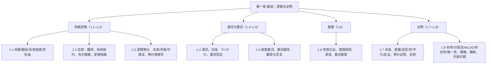

# C1 复习提纲 Review Outline（完整版·不漏知识点）

> [!abstract] 使用说明
> 本提纲由第一章全部笔记（[[C1 基础：逻辑与证明 MOC]] + C1.1–C1.8）整理而成，**覆盖全部知识点**，按“考试极简版 → 知识地图 → 分节详解 → 三张必背表 → 术语表”组织。
> - 标注 **⭐** = 老师明示的考点或往年真题；
> - 标注 **（拓展）** = 课堂上未讲、教材补充内容，期中前按主干掌握即可。
> - 考试情报与答题规范详见 [[C1 基础：逻辑与证明 MOC]]，本提纲开篇摘要。

---

## 0. 考试极简版（考前 3 分钟）

第一章期中考试（**2026-09-24 周四，闭卷，只考第一章**）的题**大部分来自 Rosen 教材课后练习题，改动十分有限**；老师点名的方向是：**tautology 的定义**（去年期末）、**把 $\forall x\exists y\,P(x,y)$ 在 $\{1,2,3\}$ 上展开**（某年期末）、**用直接证明证“$n$ 奇 ⇒ $n^2$ 奇”**（上学期期末）、**自然语言 ↔ 量词表达式翻译**（本次期中预告）、**等价律推导**（本次期中预告“一定有推导题”）。答题三条铁律：① 每一步表达式右侧写规则名或公式（记不住名字写公式也给分）；② 结论是复合表达式时必须推出**整个表达式**为真；③ $\mathbf T$ / $\mathbf F$ 不能当变量用（用 $S,R$ 或 $A,B$ 代换），$\equiv$ 与 $\Leftrightarrow$ 全卷统一。必须背下来的硬货：**六个联结词真值表**（$\neg,\wedge,\vee,\oplus,\to,\leftrightarrow$）、**老师版优先级** $\neg(1)>\wedge(2)>\vee,\oplus(3)>\to(4)>\leftrightarrow(5)$（同级从左到右）、**§1.3 常用逻辑等价律**（重点是德摩根、分配、吸收、蕴涵改写 $p\to q\equiv\neg p\vee q$）、**§1.6 九条命题推理规则 + 四条量词规则**（MP、MT、假言三段论、析取三段论、附加、化简、合取、消解；US、UG、ES、EG）、**四种基本证明方法**（直接、逆否、空/平凡、反证——考试可能**指定**方法）、**反例与证伪**、**证明中的错误**（除以零、肯定后件、否定前件、循环论证）。复习顺序建议：先刷 MOC 复习题速答与全章自测，再刷各节精选习题，最后回到本提纲查漏。

---

## 1. 全章知识地图

---

## 2. §1.1 命题逻辑 Propositional Logic（[[C1.1 命题逻辑 Propositional Logic]]）

### 2.1 核心概念
- **命题 (proposition)**：陈述句，具有**唯一真值**（真 T / 假 F）。疑问句、感叹句、祈使句、悖论不是命题。
- **命题变量 (propositional variable)**：用小写字母 $p,q,r,s,\dots$ 表示命题。
- **原子命题 (atomic proposition)**：不能再分解的命题；**复合命题 (compound proposition)**：由原子命题经逻辑运算符连接而成。
- **真值表 (truth table)**：$n$ 个变元的复合命题有 **$2^n$ 行**；列变元时按“折半交替”填 T/F（第一个变元前一半 T 后一半 F，逐列减半），中间列**按优先级由内向外**逐列添加，最后一列为整个复合命题真值。

### 2.2 六个逻辑联结词（必背真值表）
| 联结词 | 名称 | 读法 | 真值要点 |
|---|---|---|---|
| $\neg p$ | 否定 negation | 非 p | 取反 |
| $p \wedge q$ | 合取 conjunction | p 且 q | 仅两者皆真为真 |
| $p \vee q$ | 析取 disjunction（**含或**） | p 或 q | 两者皆假才假（相容或） |
| $p \oplus q$ | 异或 exclusive or | p 异或 q | 恰一真为真（不相容或） |
| $p \to q$ | 蕴涵 implication | 若 p 则 q | 仅 p 真 q 假时为假；**假前提蕴涵任何结论为真**（空真） |
| $p \leftrightarrow q$ | 双条件 biconditional | p 当且仅当 q | 同真同假为真 |

- **蕴涵术语**：$p$ 是**前提/前件 (hypothesis/premise/antecedent)**，$q$ 是**结论/后件 (conclusion/consequence)**。
  - **逆命题 (converse)** $q \to p$；**逆否命题 (contrapositive)** $\neg q \to \neg p$；**反命题 (inverse)** $\neg p \to \neg q$。
  - **$p \to q$ 与它的逆否命题逻辑等价**（§1.3 会系统化）。
- **双条件**的常用说法：“p 当且仅当 q”、“p 是 q 的充要条件”。
- **位运算**：T=1、F=0，按位 AND/OR/XOR 与 $\wedge/\vee/\oplus$ 对应。

### 2.3 运算符优先级（⭐ 老师版，考试以此为准）
$$\boxed{\neg\ (1)\ >\ \wedge\ (2)\ >\ \vee,\ \oplus\ (3)\ >\ \to\ (4)\ >\ \leftrightarrow\ (5)}$$
- 教材 Table 8 **没有列 $\oplus$**；老师课件把 **$\oplus$ 与 $\vee$ 并列为第 3 级**——**以课件为准**。
- 同级运算符**从左到右**结合；加括号的通用算法：**按优先级 1→5 逐级扫描，每级把该级运算连同操作数括起来**，最外层（$\leftrightarrow$）不加。
- 例：$p \vee q \wedge r$ = $p \vee (q \wedge r)$；$\neg s \wedge f$ = $(\neg s)\wedge f$；$A \leftrightarrow f \to b$ = $A \leftrightarrow (f \to b)$。
- 类比编程：$\neg \leftrightarrow \text{取反}$，$\wedge \leftrightarrow \times$，$\vee \leftrightarrow +$（先取反、再乘、再加）。
- ⭐ 课堂原话：“优先级这种东西太容易出成考题了”，闭卷必须背下。

### 2.4 构建复合命题真值表的实操要点（课件强调）
1. 数变元 $n$ → $2^n$ 行；2. 变元列折半交替填；3. **中间列按优先级顺序添加，不跳步，每列只算一个运算符**；4. 算某列时只看它依赖的两列；5. 最后一列是整个复合命题。

---

## 3. §1.2 命题逻辑的应用 Applications（[[C1.2 命题逻辑的应用 Applications of Propositional Logic]]）

### 3.1 翻译自然语言句子
- 把自然语言句翻译成命题逻辑表达式：识别原子命题、选择联结词（注意“但/然而”=∧，“除非”=→ 等）、处理“或”的歧义（含或 vs 异或）。
- 例：微积分/计算机选课、“成龙：歌手 **or** 演员（$\vee$）；男 **or** 女（$\oplus$）”。

### 3.2 系统规约与一致性
- **系统规约 (system specifications)**：用命题表达系统应满足的规则；一个规约是**一致的 (consistent)**，如果**存在一组真值赋值使所有规约命题同时为真**。
- 判断一致性：列出所有命题 → 真值表/推理找满足赋值；不一致即无解。

### 3.3 布尔搜索
- 网页搜索用布尔运算符 $\wedge$（AND）、$\vee$（OR）、$\neg$（NOT）组合关键词，如 "AI AND (ML OR DL) AND NOT (1950)"。

### 3.4 逻辑电路
- **逻辑门**：反相器（NOT）、与门（AND）、或门（OR）；异或门（XOR）、与非/或非等。
- **组合电路 (combinational circuit)**：输入经门网络得到输出；电路输出与命题表达式对应，**等价电路 = 逻辑等价的表达式**（衔接 §1.3）。

---

## 4. §1.3 命题等价 Propositional Equivalences（[[C1.3 命题等价 Propositional Equivalences]]）

### 4.1 三个基本概念（⭐ 必背定义）
- **永真式 (tautology)**：**所有真值赋值下都为真**的复合命题（去年期末考过“什么是 tautology”）。
- **矛盾式 (contradiction)**：所有真值赋值下都为假。
- **可满足式 (satisfiable)**：**存在**一种真值赋值使其为真；可满足当且仅当**不是矛盾式**。
- **SAT 问题**：判定命题公式是否可满足，是 **NP-完全**问题（课件/教材提，了解即可）。

### 4.2 逻辑等价
- **定义**：$p$ 与 $q$ 逻辑等价（记 $p \equiv q$ 或 $p \Leftrightarrow q$），当且仅当对**所有真值赋值**，$p$ 与 $q$ 真值相同；等价于 $p \leftrightarrow q$ 是**永真式**。
- 证明方法：① **真值表法**（两列逐行相同）；② **等价推导法**（从一边用已知等价律推到另一边）。

### 4.3 ⭐ 常用逻辑等价律（必背，推导题直接使用）
**同一律**：$p\wedge \mathbf T \equiv p$，$p\vee \mathbf F \equiv p$
**支配律**：$p\vee \mathbf T \equiv \mathbf T$，$p\wedge \mathbf F \equiv \mathbf F$
**幂等律**：$p\vee p \equiv p$，$p\wedge p \equiv p$
**双重否定律**：$\neg(\neg p) \equiv p$
**交换律**：$p\vee q \equiv q\vee p$，$p\wedge q \equiv q\wedge p$
**结合律**：$(p\vee q)\vee r \equiv p\vee(q\vee r)$，$(p\wedge q)\wedge r \equiv p\wedge(q\wedge r)$
**分配律**：$p\vee(q\wedge r) \equiv (p\vee q)\wedge(p\vee r)$，$p\wedge(q\vee r) \equiv (p\wedge q)\vee(p\wedge r)$
**德摩根律**：$\neg(p\wedge q) \equiv \neg p\vee \neg q$，$\neg(p\vee q) \equiv \neg p\wedge \neg q$
**吸收律**：$p\vee(p\wedge q) \equiv p$，$p\wedge(p\vee q) \equiv p$
**否定律**：$p\vee\neg p \equiv \mathbf T$，$p\wedge\neg p \equiv \mathbf F$

**含蕴涵的等价**：$p\to q \equiv \neg p\vee q$；$p\to q \equiv \neg q\to\neg p$；$p\vee q \equiv \neg p\to q$；$p\wedge q \equiv \neg(p\to\neg q)$；$\neg(p\to q) \equiv p\wedge\neg q$；$(p\to q)\wedge(p\to r) \equiv p\to(q\wedge r)$；$(p\to r)\wedge(q\to r) \equiv (p\vee q)\to r$；$(p\to q)\vee(p\to r) \equiv p\to(q\vee r)$；$(p\to r)\vee(q\to r) \equiv (p\wedge q)\to r$

**含双条件的等价**：$p\leftrightarrow q \equiv (p\to q)\wedge(q\to p)$；$p\leftrightarrow q \equiv \neg p\leftrightarrow \neg q$；$p\leftrightarrow q \equiv (p\wedge q)\vee(\neg p\wedge\neg q)$；$\neg(p\leftrightarrow q) \equiv p\leftrightarrow \neg q$

### 4.4 推导题答题规范（⭐ 老师三次强调）
- **每一步表达式 | 右侧写规则名或该规则公式**（记不住名字写公式同样给分）。
- **结论是复合表达式时，必须推出整个表达式为真**，不是推出各分量再口头组合。
- **$\mathbf T$ / $\mathbf F$ 不能当变量用**，代换用 $S,R$ 或 $A,B$；$\equiv$ 与 $\Leftrightarrow$ 一份答卷统一。

---

## 5. §1.4 谓词与量词 Predicates and Quantifiers（[[C1.4 谓词与量词 Predicates and Quantifiers]]）

### 5.1 谓词
- **谓词 (predicate)**：含变量的陈述，如 $P(x)$；变量取定值后成为命题。
- **论域 (domain of discourse / universe of discourse)**：变量取值的集合（**必须非空**）。
- 谓词的真值取决于变量取值；**自由变量 (free)** 与**约束变量 (bound)**：被量词约束的变量是约束变量。

### 5.2 三个量词（⭐ 必背）
| 量词 | 读法 | 为真的条件 | 记法 |
|---|---|---|---|
| $\forall x\,P(x)$ | 全称量词，对所有 x | $P(x)$ 对**论域中所有** x 为真 | ∀ |
| $\exists x\,P(x)$ | 存在量词，存在 x | 论域中**至少一个** x 使 $P(x)$ 为真 | ∃ |
| $\exists! x\,P(x)$ | 唯一量词 | **恰好一个** x 使 $P(x)$ 为真 | ∃! |

- 注意 $\forall$ 与 $\exists$ **不可互换**；真值判断要看论域（空论域上 $\forall$ 真、$\exists$ 假）。
- **受限论域**：$\forall x<0\,(x^2>0)$ 意为“对所有**满足 $x<0$** 的 $x$”；$\exists z>0\,(z^2=2)$ 同理。其否定要**保留限制条件**：$\neg\forall x<0 P(x) \equiv \exists x<0\neg P(x)$。

### 5.3 量词优先级
- **量词（$\forall,\exists$）的优先级高于所有逻辑运算符**：$\forall x P(x)\vee Q(x)$ = $(\forall x P(x))\vee Q(x)$，不是 $\forall x(P(x)\vee Q(x))$。

### 5.4 量词的否定（⭐ 必背，量词的德摩根律）
$$\neg\forall x P(x) \equiv \exists x \neg P(x),\qquad \neg\exists x P(x) \equiv \forall x \neg P(x)$$
- 直观：全称不成立 = 存在反例；存在不成立 = 全都不是。
- **连续否定多个量词时，量词逐个翻转**（衔接 §1.5）：$\neg\forall x\exists y P(x,y) \equiv \exists x\forall y \neg P(x,y)$。

### 5.5 翻译自然语言（⭐ 期中预告考点）
- 典型对应：“所有人/每个” → ∀；“有些/至少一个/存在” → ∃；“没有人” → $\neg\exists$ 或 $\forall\neg$；“并非所有” → $\neg\forall$。
- **量词顺序反映语义**（见 §1.5）。

---

## 6. §1.5 嵌套量词 Nested Quantifiers（[[C1.5 嵌套量词 Nested Quantifiers]]）

### 6.1 定义与顺序
- **嵌套量词**：一个量词出现在另一个量词的作用域内，如 $\forall x\exists y(x+y=0)$。
- ⭐ **量词顺序非常重要，不能随意交换**：
  - $\forall x\forall y P(x,y) \equiv \forall y\forall x P(x,y)$（同型可换）；
  - $\exists x\exists y P(x,y) \equiv \exists y\exists x P(x,y)$（同型可换）；
  - **混合量词不可交换**：$\forall x\exists y$（每个 x 都有个 y，**y 可依赖 x**）与 $\exists y\forall x$（存在一个 y 对所有 x 成立，**y 不依赖 x**）语义不同。
- 例：$\forall x\exists y(x+y=0)$ 在整数论域真（对每个 x 取 y=-x）；$\exists y\forall x(x+y=0)$ 假（不存在对所有 x 都成立的常数 y）。
- **阅读理解**：从**左往右**读量词，内层量词依赖外层变量。

### 6.2 翻译与真值
- **展开求值**（⭐ 某年期末题）：把 $\forall x\exists y\,P(x,y)$ 在有限论域 $\{1,2,3\}$ 上展开为合取/析取嵌套：
  $\forall x\exists y P(x,y) \equiv [\exists yP(1,y)]\wedge[\exists yP(2,y)]\wedge[\exists yP(3,y)] \equiv \big(P(1,1)\vee P(1,2)\vee P(1,3)\big)\wedge\cdots$
- 数学语句翻译：极限 $\forall\varepsilon>0\,\exists\delta>0\,\forall x\,(0<|x-a|<\delta \to |f(x)-L|<\varepsilon)$ 是典型例子。

### 6.3 嵌套量词的否定
- **规则：从左到右，量词逐个翻转（∀↔∃），否定移到最内层谓词上**。
  - $\neg\forall x\exists y\forall z P(x,y,z) \equiv \exists x\forall y\exists z \neg P(x,y,z)$。
- 用于证明“某性质不存在”或翻译否定句（“不是所有人都有朋友”等）。

### 6.4 一阶逻辑中的逻辑等价（了解）
- 量词对合取/析取的分配：$\forall x(P(x)\wedge Q(x)) \equiv \forall xP(x)\wedge\forall xQ(x)$；$\exists x(P(x)\vee Q(x)) \equiv \exists xP(x)\vee\exists xQ(x)$。
- 量词对析取/合取**不**分配：$\forall x(P(x)\vee Q(x)) \not\equiv \forall xP(x)\vee\forall xQ(x)$（除非条件成立）。

---

## 7. §1.6 推理规则 Rules of Inference（[[C1.6 推理规则 Rules of Inference]]）

### 7.1 有效论证
- **论证 (argument)**：一串命题，最后一个为**结论 (conclusion)**，其余为**前提 (premises)**。
- **有效论证 (valid argument)**：**只要前提全真，结论必真**（即 $(p_1\wedge\cdots\wedge p_n)\to q$ 是永真式）。
- **论证形式 (argument form)**：把命题换成变量的结构；论证有效性由形式决定。

### 7.2 ⭐ 九条命题推理规则（必背：名字 + 形式）
| 规则 | 名称 | 形式 |
|---|---|---|
| 假言推理 modus ponens (MP) | $p,\ p\to q \Rightarrow q$ |
| 取拒式 modus tollens (MT) | $\neg q,\ p\to q \Rightarrow \neg p$ |
| 假言三段论 hypothetical syllogism | $p\to q,\ q\to r \Rightarrow p\to r$ |
| 析取三段论 disjunctive syllogism | $p\vee q,\ \neg p \Rightarrow q$ |
| 附加 addition | $p \Rightarrow p\vee q$ |
| 化简 simplification | $p\wedge q \Rightarrow p$ |
| 合取 conjunction | $p,\ q \Rightarrow p\wedge q$ |
| 消解 resolution | $p\vee q,\ \neg p\vee r \Rightarrow q\vee r$ |
| （消解特例） | $p\vee q,\ \neg p \vee q \Rightarrow q$ |

### 7.3 ⭐ 四条量词推理规则
| 规则 | 名称 | 形式 | 说明 |
|---|---|---|---|
| 全称实例化 US | $\forall xP(x) \Rightarrow P(c)$ | 由全体到个别 |
| 全称推广 UG | $P(c)\ (\text{任意 }c) \Rightarrow \forall xP(x)$ | 由任意的个别到全体，**c 必须任意** |
| 存在实例化 ES | $\exists xP(x) \Rightarrow P(c)$（c 为新变量） | 取一个**特定的** c |
| 存在推广 EG | $P(c) \Rightarrow \exists xP(x)$ | 由个别到存在 |

### 7.4 谬误（必会识别，常考判断题）
- **肯定后件谬误 (affirming the conclusion)**：从 $q$ 和 $p\to q$ 推出 $p$（错）。
- **否定前件谬误 (denying the hypothesis)**：从 $\neg p$ 和 $p\to q$ 推出 $\neg q$（错）。
- 其他常见错误：**循环论证**、**由反例不当归纳**（见 §1.7/§1.8）。

### 7.5 用推理规则构造论证
- 方法：把自然语言论证翻译成命题/谓词 → 每步用一条规则，右侧标注规则名（答题规范）。
- 结合命题规则与量词规则（US/ES 引入个体 → 命题规则 → UG/EG 收尾）。

---

## 8. §1.7 证明导论 Introduction to Proofs（[[C1.7 证明导论 Introduction to Proofs]]）

### 8.1 术语（拓展，名词解释可能考）
| 术语 | 英文 | 定义 |
|---|---|---|
| 定理 | theorem | 可被证明为真且**有一定重要性**的陈述 |
| 命题 | proposition | 不太重要的定理（注意与 §1.1 的命题不同用法） |
| 事实/结果 | fact/result | 定理的其他称呼 |
| 证明 | proof | 确立定理为真的**有效论证** |
| 公理/公设 | axiom/postulate | 假定为真、不加证明的陈述 |
| 引理 | lemma | 帮助证明其他结果的次要定理 |
| 推论 | corollary | 可从已证定理**直接得到**的定理 |
| 猜想 | conjecture | 提出但尚未证明的陈述；被证明后成为定理 |

### 8.2 形式证明 vs 非形式证明
- **形式证明**：每一步都用推理规则补齐（§1.6）；**非形式证明**：人可以跳步、一步用多条规则、公理和规则不显式写出——**人类实际写的是非形式证明**。
- 定理陈述常**省略全称量词**（如 "if $x>y$ …" 实为“对所有正实数”）；证明时第一步取**任意**元素，最后用 UG（通常不写出）。

### 8.3 ⭐ 四种基本证明方法（考试可能指定方法！）
**目标**：证明 $\forall x(P(x)\to Q(x))$，即证 $P(c)\to Q(c)$ 对任意 $c$ 成立。

1. **直接证明 (direct proof)**：假设 $p$ 真 → 用公理/定义/已证定理/推理规则推出 $q$ 真。
   - ⭐ **必背例**：$n$ 奇 ⇒ $n^2$ 奇（上学期期末题）：$n=2k+1$ ⇒ $n^2=2(2k^2+2k)+1$，指出括号内是整数。
   - 完全平方数：$a=b^2$（例：$m,n$ 为完全平方数 ⇒ $mn$ 为完全平方数）。
   - 有理数定义：$r=p/q$（$p,q$ 整数，$q\ne0$）；**两个有理数之和是有理数**（注意验证 $qu\ne0$）。
2. **逆否证明 (proof by contraposition)**：证 $\neg q \to \neg p$（依据 $p\to q \equiv \neg q\to\neg p$）。
   - ⭐ 必背例：$3n+2$ 奇 ⇒ $n$ 奇（直接证明走死胡同，逆否成功：$n=2k$ ⇒ $3n+2=2(3k+1)$ 偶）。
   - $n^2$ 奇 ⇒ $n$ 奇；$n=ab$ 正整数 ⇒ $a\le\sqrt n$ 或 $b\le\sqrt n$（否定析取用德摩根）。
   - 多前提时**只需证伪其中一个前提**（恒真的前提打不动，挑含结论变量的那个）。
3. **空证明 (vacuous proof)**：前提 $p$ 为假 ⇒ $p\to q$ 自动真（只看前件）。例：$P(0)$：“若 $0>1$ 则 $0^2>0$”。
   **平凡证明 (trivial proof)**：结论 $q$ 为真 ⇒ $p\to q$ 真（只看后件）。例：$a\ge b \Rightarrow a^0\ge b^0$（$1\ge1$）。
4. **反证法 (proof by contradiction)**：证 $p$：假设 $\neg p$，推出矛盾 $r\wedge\neg r$；证 $p\to q$：假设 $p\wedge\neg q$ 推出矛盾（依据 $p\to q \equiv (p\wedge\neg q)\to\mathbf F$）。
   - ⭐ **必背例：$\sqrt2$ 无理**。骨架：反设 $\sqrt2=a/b$ 最简分数 ⇒ $2b^2=a^2$ ⇒ $a$ 偶 ⇒ $a=2c$ ⇒ $b$ 偶 ⇒ $a,b$ 有公因子 2 与“最简”矛盾。
   - 例：22 天中至少 4 天落在一周同一天（**鸽巢原理**应用）；无理数+有理数=无理数；$r^3+r+1=0$ 无有理根（最简分数+奇偶性）。
   - **逆否 vs 反证**：逆否可改写为反证（加“前提也真”），计算常完全相同，能用逆否尽量用逆否；否定性结论（不存在/无理）用反证更自然。

### 8.4 等价性证明（拓展）
- 证 $p\leftrightarrow q$：**分别证 $p\to q$ 和 $q\to p$**（两方向都要写，可用不同方法）。
- ⭐ **多命题等价用循环蕴涵**：证 $p_1\to p_2\to\cdots\to p_n\to p_1$ 只需 $n$ 个条件语句，而两两互证要 $n^2-n$ 个。链可任意选择（选最容易证的）。
- 例：$n$ 偶、$n-1$ 奇、$n^2$ 偶三者等价。

### 8.5 反例 Counterexamples（拓展）
- 证伪 $\forall xP(x)$：**只需一个反例**，且必须**严格验证**它使命题为假（不能只写“取 $n=3$”不给验证）。
- 例：并非每个正整数都是两个整数的平方和（反例 3）。

### 8.6 证明中的错误（拓展）
1. **代数/算术错误**：典型**除以零**（"$1=2$"假证明第 5 步除 $a-b=0$）；开平方、平方引入增根、乘负数要翻不等号。
2. **肯定后件谬误**、**否定前件谬误**（§1.6 详述）。
3. **循环论证 / 窃取论题 (begging the question)**：用待证结论本身（或等价说法）当证明步骤，如“设 $n=2l$”直接假设 $n$ 偶。

### 8.7 一点证明策略
- 面对 $\forall x(P(x)\to Q(x))$：① 先试**直接证明**；② 展开前提定义（奇数/有理数/完全平方数）；③ 推不动就试**逆否**；④ 再不行试**反证**。

---

## 9. §1.8 证明方法与策略 Proof Methods and Strategy（[[C1.8 证明方法与策略 Proof Methods and Strategy]]）

### 9.1 穷举证明 Exhaustive Proof
- 检查**相对少量**的有限个例子（分情况证明的特例）。例：$n\le4$ 时 $(n+1)^3\ge3^n$。
- ⚠️ 穷举只证明有限范围；例子再多也不能证明“对所有正整数成立”。

### 9.2 分情况证明 Proof by Cases
- 依据永真式：$[(p_1\vee\cdots\vee p_n)\to q] \leftrightarrow [(p_1\to q)\wedge\cdots\wedge(p_n\to q)]$。
- **必须覆盖所有可能情形**（⚠️ 常见错误：漏情形，如“正/负”漏掉 0；实数要三分：正/负/零）。
- 例：$n$ 整数 ⇒ $n^2\ge n$（分 $n=0$、$n\ge1$、$n\le-1$）；$|xy|=|x||y|$（四情形）。

### 9.3 不失一般性 WLOG
- 断言“其他情形可由本情形的论证经显然改动得到”——**必须能说出那个具体变换**（如交换 $x,y$ 的角色）。说不出的 WLOG 是错误根源。
- 例：$xy$ 与 $x+y$ 偶 ⇒ $x,y$ 偶（逆否 + WLOG + 分情况）。

### 9.4 存在性证明 Existence Proofs
- 证 $\exists xP(x)$：
  - **构造性 (constructive)**：给出**见证 (witness)** $a$ 使 $P(a)$ 真。例：$1729=10^3+9^3=12^3+1^3$（**出租车数**）。
  - **非构造性 (nonconstructive)**：不给出具体元素，常用反证法。例：存在无理数 $x,y$ 使 $x^y$ 有理（$\sqrt2^{\sqrt2}$ 分两情形，**用排中律**，不知道是哪一对）；**Chomp 游戏先手必胜**（策略窃取论证）。

### 9.5 唯一性证明 Uniqueness Proofs
- 两部分：**① 存在性**（存在满足性质的 $x$）；**② 唯一性**（若 $y$ 也满足则 $y=x$，或若 $y\ne x$ 则 $y$ 不满足）。
- 形式化：$\exists x(P(x)\wedge\forall y(P(y)\to y=x))$。
- 例：$a\ne0$ 时 $ar+b=0$ 有唯一解 $r=-b/a$（存在性给出构造，唯一性设两解相等推导，除以 $a$ 需说明 $a\ne0$）。

### 9.6 证明策略 Proof Strategies
- **总策略**：替换定义 → 分析前提结论含义 → 条件语句先直接、再逆否、再反证。
- **正向推理 (forward reasoning)**：前提出发推结论；**逆向推理 (backward reasoning)**：从结论找可证的 $p$ 使 $p\to q$（⚠️ 方向绝不能反：找 $q\to r$ 且 $r$ 可证是**窃取论题/肯定后件**谬误）。
  - 例：AM–GM 不等式 $(x+y)/2>\sqrt{xy}$（$x\ne y$ 正实数）：逆向构造等价链到 $(x-y)^2>0$，**写证明时倒成正向**，取平方根那步注明两边为正。
  - 取石子博弈（Nim）：必败位置 $n\equiv0\pmod{4}$，策略“每轮总取 $m+1$ 颗”。
- **改编已有证明**：把 $\sqrt2$ 无理改编为 $\sqrt3$ 无理（用 $3\mid d^2\Rightarrow 3\mid d$，需数论弹药——**欧几里得引理**；注意对合数不成立）。
- **寻找反例**：先试最小/最简单的例子（0、1、2、负数、边界）；找不到反例再回头证。

### 9.7 铺砌与染色论证 Tilings（⭐ 高光技巧）
- 术语：棋盘、**多米诺骨牌**（1×2）、**多联骨牌 polyominoes**、三格骨牌（直线型/直角 L 型）。
- **染色论证 (coloring argument)**（组合数学核心技巧）：
  1. 给格子染色使**每块拼图无论怎么放覆盖的各色格数固定**（骨牌 2 格用 2 色 → 一白一黑；直线三格骨牌 3 格用 3 色）；
  2. 计算目标板各色格数；
  3. 与“块数 × 每块覆盖数”不符 ⇒ 不可能铺砌。
  - 例 20：标准棋盘去掉对角两角（同色）剩 30:32 或 32:30，与 31 白 31 黑矛盾 ⇒ 不能铺砌。
  - 例 22：三色染色 20:21:22 vs 21:21:21 ⇒ 直线三格骨牌不能铺去掉一角的棋盘。
- 图论视角：棋盘二分图，多米诺铺砌 = 完美匹配。

### 9.8 开放问题 Open Problems
- **费马大定理**：$x^n+y^n=z^n$（$n>2$）无 $xyz\ne0$ 整数解；费马提出，**Andrew Wiles 1990 年代**用椭圆曲线理论证明（数百页）。
- **$3x+1$ 猜想（Collatz）**：偶数送 $x/2$、奇数送 $3x+1$，反复施加最终到 1；至今未证，已验证到 $5.6\times10^{13}$。别名：Hasse 算法、Ulam 问题、Syracuse 问题、角谷问题。
- 结论性注记：**不存在证明定理的通用程序**——哥德尔不完备性定理与丘奇–图灵不可判定性。

---

## 10. 三张必背的表（综合）

### TABLE A｜命题逻辑真值表汇总（§1.1）
| $p$ | $q$ | $\neg p$ | $p\wedge q$ | $p\vee q$ | $p\oplus q$ | $p\to q$ | $p\leftrightarrow q$ |
|:-:|:-:|:-:|:-:|:-:|:-:|:-:|:-:|
| T | T | F | T | T | F | T | T |
| T | F | F | F | T | T | F | F |
| F | T | T | F | T | T | T | F |
| F | F | T | F | F | F | T | T |

### TABLE B｜最常用逻辑等价（§1.3）
（完整列表见第 4.3 节：同一/支配/幂等/双重否定/交换/结合/分配/德摩根/吸收/否定 + 蕴涵与双条件等价。）

### TABLE C｜推理规则（§1.6）
（完整列表见第 7.2–7.3 节：九条命题规则 + 四条量词规则。）

---

## 11. 关键术语表 Key Terms（速查）

**§1.1–1.2**：命题 proposition、真值 truth value、命题变量、复合命题、否定/合取/析取/异或/蕴涵/双条件、逆命题/逆否命题/反命题、原子命题、真值表、优先级、位运算、系统规约、一致性、布尔搜索、逻辑门/组合电路。

**§1.3**：永真式 tautology、矛盾式 contradiction、可满足式 satisfiable、逻辑等价 logically equivalent、逻辑等价律、SAT。

**§1.4–1.5**：谓词 predicate、论域 domain of discourse、全称量词 ∀、存在量词 ∃、唯一量词 ∃!、自由/约束变量、量词否定（量词的德摩根律）、嵌套量词、受限论域。

**§1.6**：论证 argument、前提 premises、结论 conclusion、有效论证 valid argument、论证形式、推理规则（MP/MT/假言三段论/析取三段论/附加/化简/合取/消解）、US/UG/ES/EG、谬误（肯定后件、否定前件）。

**§1.7–1.8**：定理/命题/事实/结果/证明/公理/公设/引理/推论/猜想、形式/非形式证明、直接/逆否/空/平凡/反证、等价性证明、循环蕴涵、反例、奇偶性 parity、有理数/无理数、完全平方数、穷举/分情况证明、WLOG、存在性证明（构造/非构造、见证 witness）、唯一性证明、正向/逆向推理、染色论证、铺砌、多米诺/多联骨牌/三格骨牌、费马大定理、$3x+1$ 猜想、哥德尔不完备性、丘奇–图灵定理。

---

## 12. 关键结果 RESULTS（课本原文，证明方法范例）

- “若 $n$ 是奇整数，则 $n^2$ 是奇整数”（**直接证明**，⭐期末真题）。
- “若 $n$ 是整数且 $3n+2$ 是奇数，则 $n$ 是奇数”（**直接走不通 → 逆否**）。
- “若 $n=ab$（$a,b$ 正整数），则 $a\le\sqrt n$ 或 $b\le\sqrt n$”（**逆否 + 德摩根**；试除到 $\sqrt n$ 判素数）。
- “两个有理数之和是有理数”（**直接**；验证分母非零）。
- “$n$ 是奇数 ⟺ $n^2$ 是奇数”（**等价性证明**：例 1 + 例 8 两个方向）。
- “$\sqrt2$ 是无理数”（**反证法 + 最简分数**，⭐ 必默写）。
- “$n$ 偶 ⟺ $n-1$ 奇 ⟺ $n^2$ 偶”（**循环蕴涵**）。
- “每个正整数是四个整数的平方和”（拉格朗日四平方和定理；两个不够-反例 3、三个不够-反例 7）。
- "$|xy|=|x||y|$"（**分情况**）；“$x^2+x$ 末位数字 ∈ {0,1,4,5,6,9}”（**发现→猜想→分情况证明**）。
- “$x^2+3y^2=8$ 无整数解”（**估界 + 穷举**）。
- “AM–GM：$(x+y)/2>\sqrt{xy}$（$x\ne y$ 正实数）”（**逆向推理**）；"HM ≤ GM ≤ AM ≤ QM"。
- “$1729$ 是能以两种方式写成两个立方和的最小正整数”（**构造性存在性**）。
- “$x^y$ 有理（$x,y$ 无理）存在”（**非构造性**）；“Chomp 先手必胜”（**策略窃取**）。
- “去掉对角两角的棋盘不能铺砌”（**染色论证**）；“去掉一角的棋盘不能铺砌”（**奇偶性**）。

---

## 13. 复习路线建议（摘自 MOC）

1. **先**：过一遍本提纲，标记不会的点；
2. **再**：[[C1 基础：逻辑与证明 MOC]] 的“章末复习题速答” + “全章自测 30 题”快速过关；
3. **然后**：刷各节笔记“精选习题”（重点：C1.7 例 1/3/10、C1.8 例 20/22、C1.1 优先级、C1.3 等价推导、C1.4 翻译）；
4. **对照 syllabus** 圈出讲过的部分，刷 **Rosen 教材课后练习**（考题大部分来自这里，改动有限），用教材末页答案自查；
5. **考前**：默写三张表 + 四种证明方法模板 + $\sqrt2$ 无理骨架 + 量词否定规则。

---

## 关联
- 章索引：[[C1 基础：逻辑与证明 MOC]]
- 各节：[[C1.1 命题逻辑 Propositional Logic]] · [[C1.2 命题逻辑的应用 Applications of Propositional Logic]] · [[C1.3 命题等价 Propositional Equivalences]] · [[C1.4 谓词与量词 Predicates and Quantifiers]] · [[C1.5 嵌套量词 Nested Quantifiers]] · [[C1.6 推理规则 Rules of Inference]] · [[C1.7 证明导论 Introduction to Proofs]] · [[C1.8 证明方法与策略 Proof Methods and Strategy]]
