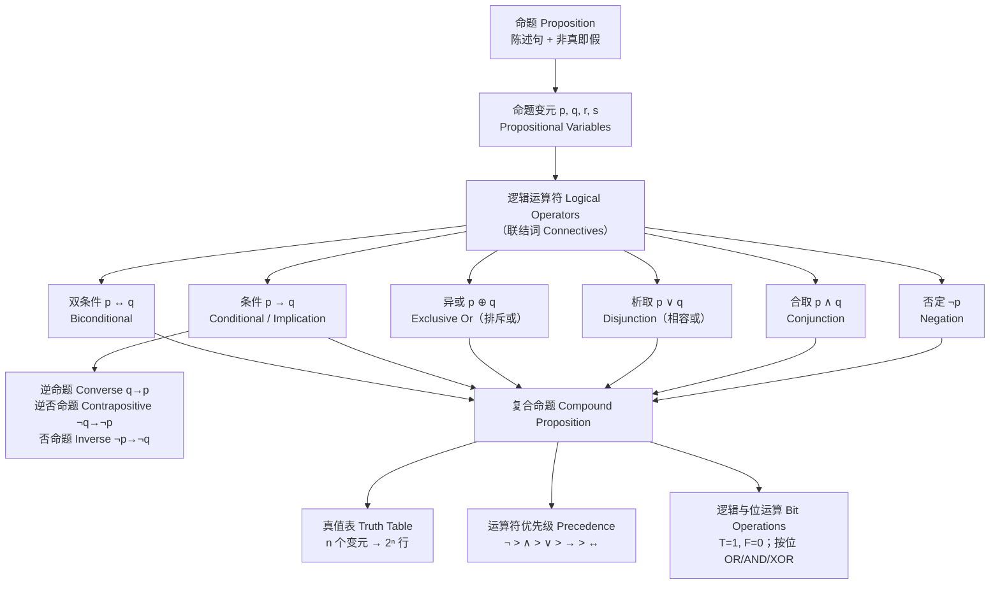
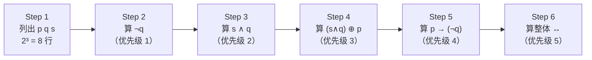

# C1.1 命题逻辑 Propositional Logic

> [!abstract] 本节地位
> 整个离散数学的第一块砖。后面所有章节（集合、关系、图、算法正确性）的每一句"当且仅当""若……则……"，都要靠这一节定义的符号来精确表达。这一节本身不难，难的是**把中文/英文自然语言翻译成符号时不出错**——期中期末失分几乎全在翻译，而不在真值表。

## 本节结构总览



---

## 1. 命题 Proposition

> [!important] 定义（命题 Proposition）
> **命题 (proposition)** 是一个**陈述句 (declarative sentence)**，即陈述某个事实的句子，它**要么真要么假，但不能既真又假**。

拆开看，一个句子要成为命题必须同时满足两条：

1. 它是**陈述句**（不是疑问句、祈使句、感叹句）；
2. 它有**确定的真值**（真或假二者必居其一，且不能同时成立）。

> [!note] 老师会强调的三点
> **第一，"是不是命题"和"我知不知道它真假"是两回事。**
> "哥德巴赫猜想成立"是命题——它客观上要么真要么假，只是人类目前还不知道是哪一个。**未知 ≠ 无真值。**
>
> **第二，"非真即假"这条叫二值原则 (principle of bivalence)。**
> 它是**经典逻辑 (classical logic)** 的基本假设。后面习题里的**模糊逻辑 (fuzzy logic)** 就是故意放弃这条假设的非经典逻辑——真值取 $[0,1]$ 的实数。人工智能里的概率推理、不确定推理，本质上都是在放松这一条。
>
> **第三，自指句 (self-referential sentence) 会破坏二值原则。**
> "这句话是假的"（说谎者悖论 Liar Paradox）：假设它真，则按它自己所说它是假的，矛盾；假设它假，则它所说不成立，即它是真的，矛盾。所以它**既不能为真也不能为假**，因此**不是命题**。这就是本节最后一道带 ∗ 的习题 48。

### 例 1（是命题）

以下陈述句都是命题：

1. Washington, D.C., is the capital of the United States of America.（华盛顿特区是美国首都）→ **真 T**
2. Toronto is the capital of Canada.（多伦多是加拿大首都）→ **假 F**（加拿大首都是渥太华 Ottawa）
3. $1 + 1 = 2$ → **真 T**
4. $2 + 2 = 3$ → **假 F**

### 例 2（不是命题）

1. **What time is it?**（几点了？）→ 疑问句 (interrogative)，不是陈述句 ⇒ 不是命题
2. **Read this carefully.**（仔细读这个）→ 祈使句 (imperative)，不是陈述句 ⇒ 不是命题
3. $x + 1 = 2$ → 是陈述句，但**真值取决于 $x$**，没有确定真值 ⇒ 不是命题
4. $x + y = z$ → 同上 ⇒ 不是命题

> [!note] 补充：3、4 为什么重要
> 句子 3、4 一旦**给变量赋值**就变成命题（$x=1$ 时为真，$x=3$ 时为假）。这类"含变量、赋值后才有真值"的句子，正是 **§1.4 谓词 (predicate)** 的研究对象。所以这里埋了一颗种子：命题逻辑处理不了带变量的句子，必须升级到**谓词逻辑 (predicate logic)**。
>
> 记住这条主线：**命题逻辑（1.1–1.3）→ 谓词逻辑（1.4–1.5）→ 推理规则（1.6）→ 证明方法（1.7–1.8）**。

### 命题变元与真值

- 用字母表示**命题变元 (propositional variable)**，也叫**语句变元 (statement variable)**，习惯用 $p, q, r, s, \dots$
- **真值 (truth value)**：真记作 **T** (true)，假记作 **F** (false)。
- 研究命题的这一分支叫**命题演算 (propositional calculus)** 或**命题逻辑 (propositional logic)**，由古希腊哲学家**亚里士多德 Aristotle（前384–前322）**在 2300 多年前首次系统化。
- 用已有命题构造新命题的方法，由英国数学家**乔治·布尔 George Boole（1815–1864）**在 1854 年的著作 *The Laws of Thought*（《思维规律》）中系统给出。由此得到的新命题叫**复合命题 (compound proposition)**。

> [!note] 人物背景（课件的 Links 栏，考试不考但老师会念）
> - **Aristotle（前384–前322）**：生于希腊北部 Stagirus，父亲是马其顿国王的御医。17 岁入柏拉图学园 (Plato's Academy) 学习 20 年。柏拉图去世后未被选为继任者，转而教导亚历山大大帝五年。后返回雅典创办自己的学校 **Lyceum（吕克昂）**，讲学 13 年。其追随者称"逍遥学派 (peripatetics)"，因亚里士多德常边走边讨论哲学问题。亚历山大死后雅典出现反马其顿风潮，他被诬告不敬神，逃往 Chalcis，次年因胃病去世。他的系统性著作被学生保存、藏于地窖，约 200 年后被一位藏书家发现并带到罗马。
> - **George Boole（1815–1864）**：鞋匠之子，生于英国林肯 (Lincoln)。家境困难，主要靠自学。曾自办学校，因不满当时的教材而直接研读拉格朗日 (Lagrange) 的论文，在变分法上做出发现。1848 年发表 *The Mathematical Analysis of Logic*，1849 年任爱尔兰科克 Queen's College 数学教授，1854 年出版 *The Laws of Thought*，其中提出了今天以他命名的**布尔代数 (Boolean algebra)**。1864 年因冒雨赴讲座、浑身湿透后患肺炎去世。

---

## 2. 逻辑运算符 Logical Operators

### 2.1 否定 Negation ¬

> [!important] 定义 1（否定 Negation）
> 设 $p$ 是命题。$p$ 的**否定 (negation)** 记作 $\neg p$（也记作 $\overline{p}$），是命题
> $$\text{"It is not the case that } p\text{."}\quad(\text{"并非 } p\text{"})$$
> 读作 "not $p$"。$\neg p$ 的真值与 $p$ **相反**。

**TABLE 1 否定的真值表**

| $p$ | $\neg p$ |
|:---:|:---:|
| T | F |
| F | T |

- $\neg$ 是一个**一元运算符 (unary operator)**，也叫**否定运算符 (negation operator)**：从一个已有命题造出一个新命题。
- 其余联结词都是**二元运算符 (binary operator)**，统称**联结词 (connectives)**。

**例 3**：命题"Michael's PC runs Linux"的否定是"It is not the case that Michael's PC runs Linux"，更自然的说法是"**Michael's PC does not run Linux**"。

**例 4**：命题"Vandana's smartphone has at least 32GB of memory"的否定是"It is not the case that Vandana's smartphone has at least 32GB of memory"，即"does not have at least 32GB"，更简洁地说："**Vandana's smartphone has less than 32GB of memory**"。

> [!warning] 高频易错点：否定量词化的形容词
> "at least 32GB"（至少 32GB，即 $\ge 32$）的否定是 "**less than 32GB**"（$< 32$），**不是** "at most 32GB"（$\le 32$），也**不是** "more than 32GB"。
> 通用规律：
> $$\neg(x \ge a) \equiv (x < a),\qquad \neg(x > a) \equiv (x \le a)$$
> 期末最爱考的一类翻译题就是这个。写否定时**先翻译成不等式，再取补**，比凭语感靠谱得多。

### 2.2 合取 Conjunction ∧

> [!important] 定义 2（合取 Conjunction）
> 设 $p, q$ 是命题。$p$ 与 $q$ 的**合取 (conjunction)** 记作 $p \wedge q$，是命题 "$p$ **and** $q$"。当且仅当 $p$ 和 $q$ **都为真**时 $p \wedge q$ 为真，否则为假。

**TABLE 2 合取真值表**

| $p$ | $q$ | $p \wedge q$ |
|:---:|:---:|:---:|
| T | T | **T** |
| T | F | F |
| F | T | F |
| F | F | F |

> [!note] 关于四行的排列顺序
> 两个变元有 $2 \times 2 = 4$ 种真值组合：TT、TF、FT、FF。**约定：每一对中第一个真值是 $p$ 的，第二个是 $q$ 的**，且按"T 在前 F 在后"的字典序排列。这个顺序不是随意的——它就是二进制计数 $11, 10, 01, 00$（T=1, F=0）**从大到小**。多变元时同理：$n$ 个变元列 $2^n$ 行，第一列前 $2^{n-1}$ 行全 T、后 $2^{n-1}$ 行全 F，第二列以 $2^{n-2}$ 为周期交替，依此类推。按这个规律写，绝不会漏行重行。

> [!warning] "but" 也是合取
> 逻辑中 **"but"（但是）在真值上等同于 "and"**。
> "The sun is shining, **but** it is raining" 与 "The sun is shining **and** it is raining" 的真值完全一样，都是 $p \wedge q$。
> 自然语言中 but 带有"转折/意外"的语用色彩，但**逻辑只管真值，不管情感色彩**。同类的还有：yet, however, nevertheless, although, while, moreover —— 全部翻译为 $\wedge$。

**例 5**：$p$ = "Rebecca's PC has more than 16 GB free hard disk space"，$q$ = "The processor in Rebecca's PC runs faster than 1 GHz"。则 $p \wedge q$ = "Rebecca's PC has more than 16 GB free hard disk space, **and** its processor runs faster than 1 GHz."（两个条件都成立才为真；只要有一个不成立就为假。）

### 2.3 析取 Disjunction ∨（相容或）

> [!important] 定义 3（析取 Disjunction）
> 设 $p, q$ 是命题。$p$ 与 $q$ 的**析取 (disjunction)** 记作 $p \vee q$，是命题 "$p$ **or** $q$"。当且仅当 $p, q$ **都为假**时 $p \vee q$ 为假，否则为真。

**TABLE 3 析取真值表**

| $p$ | $q$ | $p \vee q$ |
|:---:|:---:|:---:|
| T | T | **T** |
| T | F | T |
| F | T | T |
| F | F | **F** |

> [!important] 关键：$\vee$ 是**相容或 (inclusive or)**
> 英语中 "or" 有两种用法：
> - **相容或 (inclusive or)**：至少一个为真即可，**允许两个都真**。这就是 $\vee$。
>   > "Students who have taken calculus **or** computer science can take this class."
>   > 学过微积分的、学过计算机的、**两门都学过的**，都能选这门课。
> - **排斥或 (exclusive or)**：**恰好一个**为真，两个都真时为假。这是 $\oplus$。
>   > "Students who have taken calculus or computer science, **but not both**, can enroll in this class."
>   > 两门都学过的**不能**选。

**日常例子**：菜单上写 "Soup **or** salad comes with an entrée"（正餐配汤或沙拉），餐厅几乎总是指**排斥或**——不会两样都给你。

**例 6**：仍取例 5 的 $p, q$。$p \vee q$ = "Rebecca's PC has at least 16 GB free hard disk space, **or** the processor in Rebecca's PC runs faster than 1 GHz." 当磁盘够、或处理器够快、或两者都满足时为真；只有两个条件都不满足时才为假。

> [!warning] 翻译时怎么判断是 ∨ 还是 ⊕？
> 看有没有**排他性的语境线索**：
> - 出现 "but not both"、"either…or…(but not both)"、"exactly one" ⇒ $\oplus$
> - 出现 "at least one"、"or both"、"and/or" ⇒ $\vee$
> - **没有线索时，数学与计算机领域的默认约定是相容或 $\vee$**。
> - 现实语义判断：如果两个都发生是**合理且被允许**的，就是 $\vee$（如"密码要么至少 3 个数字，要么至少 8 个字符"——两条都满足当然也行）；如果两个都发生**互斥或不被允许**，就是 $\oplus$（如"用美元或欧元支付"通常只能选一种）。

### 2.4 异或 Exclusive Or ⊕

> [!important] 定义 4（异或 Exclusive Or）
> 设 $p, q$ 是命题。$p$ 与 $q$ 的**异或 (exclusive or)** 记作 $p \oplus q$，是命题：当 $p, q$ 中**恰好一个**为真时该命题为真，否则为假。

**TABLE 4 异或真值表**

| $p$ | $q$ | $p \oplus q$ |
|:---:|:---:|:---:|
| T | T | **F** |
| T | F | T |
| F | T | T |
| F | F | **F** |

> [!note] 老师一定会补的三个性质（后面 §1.3 和计算机课都要用）
> 1. $p \oplus q$ 为真 $\iff$ $p$ 与 $q$ **真值不同**。所以 $p \oplus q \equiv \neg(p \leftrightarrow q)$——异或就是"双条件的否定"。
> 2. $p \oplus q \equiv (p \vee q) \wedge \neg(p \wedge q)$，即"至少一个真"且"不是都真"。这正是把中文"或，但不能都"直译成符号。
> 3. 位运算意义下 $\oplus$ 就是**模 2 加法 (addition modulo 2)**：$1 \oplus 1 = 0$。密码学中的一次一密 (one-time pad)、CRC 校验、RAID 奇偶校验、神经网络里经典的 XOR 不可线性可分问题，全都建立在这一个符号上。

---

## 3. 条件语句 Conditional Statements

### 3.1 定义与真值表

> [!important] 定义 5（条件语句 Conditional Statement）
> 设 $p, q$ 是命题。**条件语句 (conditional statement)** $p \to q$ 是命题 "**if $p$, then $q$**"。
> $p \to q$ **当且仅当 $p$ 真而 $q$ 假时为假**，其余情况均为真。
> 其中 $p$ 称为**前件 / 假设 (hypothesis)**（也叫 **antecedent** 前项 或 **premise** 前提），$q$ 称为**后件 / 结论 (conclusion)**（也叫 **consequence** 后项）。
> 条件语句也叫**蕴涵 (implication)**。

**TABLE 5 条件语句真值表**

| $p$ | $q$ | $p \to q$ |
|:---:|:---:|:---:|
| T | T | T |
| T | F | **F** ← 唯一为假的一行 |
| F | T | T |
| F | F | T |

> [!important] 只记一句话
> **$p \to q$ 只有"前真后假"这一种情况为假。** 背这一句，比背四行表快得多，也不会记错。

### 3.2 为什么 $p$ 假时 $p \to q$ 恒为真？（空真 Vacuous Truth）

> [!note] 这是本节最难理解、也最常被考的一点，老师必然会花时间讲
> **合同/承诺解释**：把 $p \to q$ 理解成一个**承诺**。
>
> 政客竞选时承诺："**If I am elected, then I will lower taxes.**"（如果我当选，我就减税。）
> 什么时候我们可以说他"**违背了承诺**"？
> - 当选了 (p=T)，且减税了 (q=T) ⇒ 守约 ⇒ **真**
> - 当选了 (p=T)，但没减税 (q=F) ⇒ **违约** ⇒ **假** ✅ 唯一为假
> - 没当选 (p=F)，减税了 (q=T) ⇒ 他没上台，承诺没被触发，谈不上违约（也许他用影响力促成了减税）⇒ **真**
> - 没当选 (p=F)，也没减税 (q=F) ⇒ 承诺没被触发 ⇒ **真**
>
> 教授版本："**If you get 100% on the final, then you will get an A.**"
> 你考了 100 分却没拿 A ⇒ 你有理由觉得被骗了 ⇒ 承诺为假。
> 你没考 100 分 ⇒ 不管你最后拿没拿 A，教授都没有违背承诺 ⇒ 承诺为真。
>
> 这种"前件为假因而整个条件句自动为真"的情形，术语叫**空真 (vacuously true)** 或**空洞地真**。

> [!important] 数学中的条件语句比英语中的更宽松
> 数学里的 $p \to q$ **不要求 $p$ 与 $q$ 之间有任何因果或语义关联**，只看真值表。所以：
> - "If Juan has a smartphone, then $2 + 3 = 5$" —— **真**（因为结论为真，前件真假无所谓）
> - "If Juan has a smartphone, then $2 + 3 = 6$" —— 若 Juan **没有**智能手机则为**真**（前件为假），即使结论 $2+3=6$ 是假的
>
> 日常英语绝不会这么说（除非讽刺），因为前后件毫无关系。但**命题逻辑是一门人工语言 (artificial language)**，我们只是借用英语的说法便于记忆，其定义完全由真值表给出，**与英语用法无关**。
>
> 为什么要这么定义？因为这样定义后 $p \to q \equiv \neg p \vee q$（见 §1.3），整套代数运算才成立；而且数学定理形如"对所有 $x$，若 $P(x)$ 则 $Q(x)$"时，我们希望那些不满足 $P$ 的 $x$ **不构成反例**——空真恰好保证了这一点。

### 3.3 条件语句的各种英文表达（**必背**）

课本列出的 $p \to q$ 的 11 种说法：

| 英文表述 | 中文 | 备注 |
|---|---|---|
| "if $p$, then $q$" | 如果 $p$，那么 $q$ | 标准形 |
| "if $p$, $q$" | 如果 $p$，$q$ | 省略 then |
| "$p$ is sufficient for $q$" | $p$ 是 $q$ 的**充分条件** | ⚠️ 充分条件在**箭头尾** |
| "$q$ if $p$" | 若 $p$ 则 $q$ | if 后面的是前件 |
| "$q$ when $p$" | 当 $p$ 时 $q$ | |
| "a necessary condition for $p$ is $q$" | $q$ 是 $p$ 的**必要条件** | ⚠️ 必要条件在**箭头头** |
| "$q$ unless $\neg p$" | 除非 $\neg p$，否则 $q$ | ⚠️ 最绕，见下 |
| "$p$ implies $q$" | $p$ 蕴涵 $q$ | |
| "$p$ only if $q$" | $p$ 仅当 $q$ | ⚠️ **只有 $q$ 才可能 $p$** |
| "a sufficient condition for $q$ is $p$" | $p$ 是 $q$ 的充分条件 | |
| "$q$ whenever $p$" | 每当 $p$ 就 $q$ | |
| "$q$ is necessary for $p$" | $q$ 是 $p$ 的必要条件 | |
| "$q$ follows from $p$" | $q$ 由 $p$ 推出 | |

> [!warning] 两个最容易出错的表述——课本原文专门辟出一段
>
> **① "$p$ only if $q$" 为什么是 $p \to q$ 而不是 $q \to p$？**
> "$p$ only if $q$"（只有 $q$ 成立时 $p$ 才成立）说的是：**$q$ 不真时 $p$ 一定不真**，即 $\neg q \to \neg p$，也就是 $p \to q$（逆否等价，见下节）。
> 换个角度：这句话只在"$p$ 真而 $q$ 假"时为假——和 $p \to q$ 的假值行完全一致。而 $p$ 为假时，$q$ 真假都行，这句话什么也没断言。
> **千万别写成 "$q$ only if $p$"** —— 当 $p,q$ 真值不同时，"$q$ only if $p$" 与 $p \to q$ 的真值就不一样了。
>
> **② "$q$ unless $\neg p$" 为什么是 $p \to q$？**
> "unless" 意为"除非/若非"。"$q$ unless $\neg p$" 的意思是：**如果 $\neg p$ 不成立（即 $p$ 成立），那么 $q$ 必须为真**。
> 于是它只在 "$p$ 真且 $q$ 假" 时为假，其余为真 —— 与 $p \to q$ 逐行一致。
> **实用口诀："A unless B" $\equiv \neg B \to A$（也等价于 $B \vee A$）。**
> 例：*"Jan will go swimming **unless** the water is too cold."* = 若水不太冷，Jan 就会去游泳 = $\neg(\text{too cold}) \to \text{swim}$。

> [!note] 充分 / 必要的口诀（考试送分）
> $$p \to q$$
> - **箭尾是充分条件 (sufficient)**：有 $p$ 就够了。
> - **箭头是必要条件 (necessary)**：没有 $q$ 就一定没有 $p$。
> - 记忆法：**"充分在前，必要在后"**，或者 **"前推后：前充后必"**。
> - 反过来读也对：$q$ 是 $p$ 的必要条件 $\iff$ $p$ 是 $q$ 的充分条件 $\iff$ $p \to q$。

**例 7**：$p$ = "Maria learns discrete mathematics"，$q$ = "Maria will find a good job"。$p \to q$ 可表达为：
- "If Maria learns discrete mathematics, then she will find a good job."
- "Maria will find a good job **when** she learns discrete mathematics."
- "For Maria to get a good job, it is **sufficient** for her to learn discrete mathematics."
- "Maria will find a good job **unless** she does **not** learn discrete mathematics."（注意 unless 后面要接 $\neg p$）

### 3.4 程序设计中的 if-then

**例 8**：若执行前 $x = 0$，语句
$$\textbf{if } 2 + 2 = 4 \textbf{ then } x := x + 1$$
执行后 $x$ 的值是多少？（$:=$ 表示**赋值 (assignment)**。）

**解**：因为 $2+2=4$ 为真，赋值语句被执行，故 $x = 0 + 1 = \boxed{1}$。

> [!note] 逻辑的 → 与程序的 if-then 不是一回事
> 程序里的 `if p then S`：$p$ 真则执行 $S$，$p$ 假则跳过 $S$。这里 $S$ 是**程序段 (program segment)**，不是命题，整个结构也**没有真值**——它是一个**动作**。
> 逻辑里的 $p \to q$：$p, q$ 都是命题，整体**有真值**。
> 两者形似而神不同，但程序的语义确实"平行于"空真：$p$ 假时什么也不发生、也不算错。

### 3.5 逆命题、逆否命题、否命题 Converse, Contrapositive, Inverse

> [!important] 三个派生命题（**必背，必考**）
> 由 $p \to q$ 可以造出三个相关的条件语句：
>
> | 名称 | 英文 | 符号 | 与 $p \to q$ 等价？ |
> |---|---|---|---|
> | 逆命题 | **converse** | $q \to p$ | ❌ 不等价 |
> | 逆否命题 | **contrapositive** | $\neg q \to \neg p$ | ✅ **等价** |
> | 否命题 | **inverse** | $\neg p \to \neg q$ | ❌ 不等价 |
>
> **只有逆否命题与原命题永远同真同假。**

**为什么逆否命题等价？**（课本给的口头证明，要会复述）
$\neg q \to \neg p$ 为假 $\iff$ 前件 $\neg q$ 真且后件 $\neg p$ 假 $\iff$ $q$ 假且 $p$ 真。
而 $p \to q$ 为假 $\iff$ $p$ 真且 $q$ 假。
两者**为假的条件完全相同**，因此两者恒同真值 ⇒ 等价。∎

**为什么逆命题和否命题不等价？**
取 $p = $ T，$q = $ F：
- $p \to q$ = T→F = **F**
- 逆命题 $q \to p$ = F→T = **T**
- 否命题 $\neg p \to \neg q$ = F→T = **T**

原命题假而逆、否命题真 ⇒ 都不等价。

> [!note] 顺带一个结论
> **逆命题与否命题彼此等价**（$q \to p$ 的逆否就是 $\neg p \to \neg q$）。所以这四个命题分成两组：$\{$原, 逆否$\}$ 与 $\{$逆, 否$\}$，组内等价，组间不等价。

> [!warning] 最常见的逻辑错误
> **把逆命题或否命题当作与原命题等价**。
> "如果下雨，地就湿" ⇏ "如果地湿，就下过雨"（洒水车也能弄湿地面）。
> 这个错误在生活推理、法律论证、医学诊断（假阳性）里天天发生。后面 §1.6 会把它命名为**肯定后件谬误 (fallacy of affirming the conclusion)** 和**否定前件谬误 (fallacy of denying the hypothesis)**。

**例 9**：求 "The home team wins **whenever** it is raining." 的逆、逆否、否命题。

**解**：先化成标准形。"$q$ whenever $p$" 就是 $p \to q$，所以
- $p$ = "it is raining"，$q$ = "the home team wins"
- 原命题："**If it is raining, then the home team wins.**"

于是：
- **逆否命题 contrapositive**：$\neg q \to \neg p$ = "If the home team does **not** win, then it is **not** raining."
- **逆命题 converse**：$q \to p$ = "If the home team wins, then it is raining."
- **否命题 inverse**：$\neg p \to \neg q$ = "If it is **not** raining, then the home team does **not** win."

只有逆否命题与原命题等价。

> [!warning] 解题步骤别跳
> 遇到 whenever / only if / unless / necessary / sufficient 这些词时，**第一步永远是先还原成 "if $p$, then $q$" 的标准形**，确定谁是 $p$ 谁是 $q$，再套公式。直接凭语感取反几乎必错。

---

## 4. 双条件语句 Biconditional Statements

> [!important] 定义 6（双条件 Biconditional）
> 设 $p, q$ 是命题。**双条件语句 (biconditional statement)** $p \leftrightarrow q$ 是命题 "$p$ **if and only if** $q$"。
> 当 $p$ 与 $q$ **真值相同**时 $p \leftrightarrow q$ 为真，否则为假。
> 双条件语句也叫**双蕴涵 (bi-implication)**。

**TABLE 6 双条件真值表**

| $p$ | $q$ | $p \leftrightarrow q$ |
|:---:|:---:|:---:|
| T | T | **T** |
| T | F | F |
| F | T | F |
| F | F | **T** |

**关键恒等式**：
$$p \leftrightarrow q \;\equiv\; (p \to q) \wedge (q \to p)$$
这解释了为什么符号 $\leftrightarrow$ 是把 $\to$ 和 $\leftarrow$ 合起来写，也解释了为什么叫"当且仅当"：
- "**if**"（若）给出 $q \to p$；
- "**only if**"（仅当）给出 $p \to q$；
- 两者合起来就是"if and only if"。

**$p \leftrightarrow q$ 的其他常见表述**：
- "$p$ is **necessary and sufficient** for $q$"（$p$ 是 $q$ 的充要条件）
- "if $p$ then $q$, and **conversely**"
- "$p$ **iff** $q$"（iff 是 "if and only if" 的标准缩写）

**例 10**：$p$ = "You can take the flight"，$q$ = "You buy a ticket"。则 $p \leftrightarrow q$ = "**You can take the flight if and only if you buy a ticket.**"
真：买票且能登机；不买票且不能登机。
假：不买票却能登机（比如中了免费旅行）；买了票却不能登机（比如被超售挤掉 bumped）。

### 双条件的隐含使用 Implicit Use of Biconditionals

> [!warning] 自然语言的陷阱
> 日常英语很少显式说 "if and only if"，而是用 "if, then" 或 "only if" 单说一半，**另一半靠听者自行脑补**。
>
> 例："**If you finish your meal, then you can have dessert.**"
> 家长的真实意思其实是 "You can have dessert **if and only if** you finish your meal"——不吃完就没有甜点。逆命题被**默认包含**了，但没说出口。
>
> **数学中绝不允许这种含糊**：我们**永远严格区分 $p \to q$ 与 $p \leftrightarrow q$**。看到定义 (definition) 里写 "if"，在数学中通常实际是 "iff"（这是数学写作的一条历史惯例）；但看到定理里写 "if"，就只是单向。

---

## 5. 复合命题的真值表 Truth Tables of Compound Propositions

**构造方法**（老师会在黑板上一步步做）：
1. 数出命题变元个数 $n$，列 $2^n$ 行。
2. 前 $n$ 列写变元，按"折半交替"填 T/F（见 §2.2 的注）。
3. **按运算符优先级由内向外**，为每个中间子表达式各开一列。
4. 最后一列是整个复合命题的真值。

**例 11**：构造 $(p \vee \neg q) \to (p \wedge q)$ 的真值表。

**解**：两个变元 ⇒ $2^2 = 4$ 行。中间列依次是 $\neg q$、$p \vee \neg q$、$p \wedge q$。

**TABLE 7**

| $p$ | $q$ | $\neg q$ | $p \vee \neg q$ | $p \wedge q$ | $(p \vee \neg q) \to (p \wedge q)$ |
|:---:|:---:|:---:|:---:|:---:|:---:|
| T | T | F | T | T | **T** |
| T | F | T | T | F | **F** |
| F | T | F | F | F | **T** |
| F | F | T | T | F | **F** |

> [!note] 逐行核对（自己动手时的检查方式）
> - 第 3 行 $p=F, q=T$：$\neg q = F$，$p \vee \neg q = F \vee F = F$，前件为假 ⇒ 整个条件句**空真** ⇒ T。
> - 第 4 行 $p=F, q=F$：$\neg q = T$，$p \vee \neg q = F \vee T = T$，$p \wedge q = F$，前真后假 ⇒ **F**。
>
> **真值表规模警告**：$n$ 个变元要 $2^n$ 行。$n=10$ 就是 1024 行，$n=20$ 超过一百万行。这就是为什么后面 §1.3 要学**逻辑等价变形**来代替暴力枚举，也是**可满足性问题 (SAT) 是 NP-完全**的直观来源。

---

## 6. 逻辑运算符的优先级 Precedence of Logical Operators

**TABLE 8 优先级表**

| 运算符 Operator | 优先级 Precedence |
|:---:|:---:|
| $\neg$ | 1（最高，最先算） |
| $\wedge$ | 2 |
| $\vee$ | 3 |
| $\to$ | 4 |
| $\leftrightarrow$ | 5（最低，最后算） |

> [!warning] ⚠️ 老师课件的优先级表**多了一个 $\oplus$**（考试以课件为准）
> 教材 Table 8 **没有列 $\oplus$**；老师的课件把 **$\oplus$ 与 $\vee$ 并列为第 3 级**：
> $$\neg\ (1) \ >\ \wedge\ (2)\ >\ \vee,\ \oplus\ (3)\ >\ \to\ (4)\ >\ \leftrightarrow\ (5)$$
> 同级运算符**从左到右**结合。详见本笔记「📚 课件补充 L5.1」。

**由此得到的省括号规则**：
- $\neg p \wedge q$ 表示 $(\neg p) \wedge q$，**不是** $\neg(p \wedge q)$。
- $p \wedge q \vee r$ 表示 $(p \wedge q) \vee r$，**不是** $p \wedge (q \vee r)$。
- $p \vee q \to r$ 表示 $(p \vee q) \to r$。
- $\to$ 的优先级高于 $\leftrightarrow$。

> [!note] 课本自己的建议
> 课本坦承：$\wedge$ 高于 $\vee$ 这条规则"可能不太好记"，因此**书中仍会继续写括号**以保证清晰。
> **考试写答案时也建议多写括号**——多写括号不扣分，少写括号被判歧义就亏了。唯一必须记牢的是 **$\neg$ 只作用于紧跟它的那一项**。

> [!note] 与编程语言的类比（AI/CS 方向必知）
> 这个优先级顺序和 C/C++/Java/Python 中 `!` > `&&` > `||` 完全一致，也和布尔代数中"$\wedge$ 类比乘法、$\vee$ 类比加法、先乘后加"一致。所以另一个记法是：
> $$\neg \leftrightarrow \text{取反},\quad \wedge \leftrightarrow \times,\quad \vee \leftrightarrow +$$
> 先算取反，再算乘，再算加。

---

## 7. 逻辑与位运算 Logic and Bit Operations

- 计算机用**位 (bit)** 表示信息。**bit** 是 **b**inary dig**it**（二进制数字）的缩写，只有 0 和 1 两个值。这个术语由统计学家 **John Wilder Tukey（1915–2000）** 在 1946 年提出。
- 约定 **1 表示 T，0 表示 F**。
- 取值为真或假的变量叫**布尔变量 (Boolean variable)**，可以用一个位表示。
- 与联结词对应的计算机运算叫**位运算 (bit operations)**。

**Truth Value ↔ Bit 对照**

| Truth Value | Bit |
|:---:|:---:|
| T | 1 |
| F | 0 |

**TABLE 9 位运算 OR, AND, XOR**

| $x$ | $y$ | $x \vee y$ (OR) | $x \wedge y$ (AND) | $x \oplus y$ (XOR) |
|:---:|:---:|:---:|:---:|:---:|
| 0 | 0 | 0 | 0 | 0 |
| 0 | 1 | 1 | 0 | 1 |
| 1 | 0 | 1 | 0 | 1 |
| 1 | 1 | 1 | 1 | 0 |

> [!important] 定义 7（位串 Bit String）
> **位串 (bit string)** 是零个或多个位组成的序列。位串的**长度 (length)** 是其中位的个数。

**例 12**：`101010011` 是一个长度为 **9** 的位串。

**按位运算 (bitwise operations)**：对**等长**的两个位串，逐位做 OR / AND / XOR，得到**按位或 (bitwise OR)**、**按位与 (bitwise AND)**、**按位异或 (bitwise XOR)**，仍用符号 $\vee, \wedge, \oplus$ 表示。

**例 13**：求 `01 1011 0110` 与 `11 0001 1101` 的按位 OR、AND、XOR。（本书约定位串每 4 位分组书写以便阅读。）

```
      01 1011 0110
      11 0001 1101
    ----------------
      11 1011 1111    bitwise OR
      01 0001 0100    bitwise AND
      10 1010 1011    bitwise XOR
```

**逐位验算**（老师会带着念一遍，自己也要能对）：

| 位置 | 1 | 2 | 3 | 4 | 5 | 6 | 7 | 8 | 9 | 10 |
|---|---|---|---|---|---|---|---|---|---|---|
| $x$ | 0 | 1 | 1 | 0 | 1 | 1 | 0 | 1 | 1 | 0 |
| $y$ | 1 | 1 | 0 | 0 | 0 | 1 | 1 | 1 | 0 | 1 |
| OR | 1 | 1 | 1 | 0 | 1 | 1 | 1 | 1 | 1 | 1 |
| AND | 0 | 1 | 0 | 0 | 0 | 1 | 0 | 1 | 0 | 0 |
| XOR | 1 | 0 | 1 | 0 | 1 | 0 | 1 | 0 | 1 | 1 |

> [!note] 与你的 AI / 计算机方向的联系
> - **掩码 (mask)**：`x & mask` 取出指定位（AND 清零），`x | mask` 置位（OR 置一），`x ^ mask` 翻转指定位（XOR 取反）。图像处理中的通道提取、权限位、特征位图全靠这三招。
> - **XOR 的自反性**：$a \oplus b \oplus b = a$。一次一密加密、找数组中"只出现一次的数"的经典面试题、RAID-5 的校验盘恢复，都是它。
> - **位并行 (bit-parallel)**：一条 64 位 AND 指令等于同时做 64 次逻辑与。稀疏集合的位图表示、Bloom filter、二值神经网络 (BNN) 的 popcount 加速，都建立在"逻辑运算 = 位运算"这个等价上。
> - **Tukey**：他还与 J. W. Cooley 共同发明了**快速傅里叶变换 (FFT)**，并创造了 "software" 这个词。历史注记提到，当年 binary digit 的候选缩写还有 *binit* 和 *bigit*，都没流行起来。

---

# 📚 课件补充 Lecture Slides（Dr. 欧士琪 Ch1.1 Part 1–3）

> [!info] 课件信息
> **Discrete Mathematics · Chapter 1: Logic and Proof · 1.1 Propositional Logic (Part 1/2/3)**
> 主讲：**Dr Shiqi (Shawn) Ou, 欧士琪**，South China University of Technology
> 授课日期：2026 年 9 月 2 日（Part 1、2）、9 月 3 日（Part 3）
>
> **课件 Agenda（Ch1.1 的四条主线）**
> 1. **Proposition**（命题）
> 2. **Propositional Operator**（命题运算符）
> 3. **Compound Proposition**（复合命题）
> 4. **Applications**（应用）
>
> 下面把课件相对教材**额外补充或呈现方式不同**的内容全部整理出来。**凡与教材重复的不再赘述，只标出差异与老师的独家例子。**

---

## L0. Warm Up：四个"看起来对但错了"的推理

> [!important] 老师开场用四个日常推理引入全章
> 课件把这四条都打了 **❌**。**它们错在哪，正是本章后面要回答的问题**——这是整章的动机。

**① John is a cop. John knows first aid. Therefore, all cops know first aid.**
（John 是警察。John 懂急救。所以所有警察都懂急救。）
- **错因**：从**一个特例**推出**全称命题**。形式上是 $P(a) \wedge Q(a) \Rightarrow \forall x(P(x) \to Q(x))$ —— 这**不是**有效的推理规则。
- **正确的规则**是 [[C1.6 推理规则 Rules of Inference]] 的**存在推广 EG**：$P(a) \wedge Q(a) \Rightarrow \exists x(P(x) \wedge Q(x))$（只能推出"**有的**警察懂急救"）。
- **全称推广 UG** 要求 $a$ 是**任意**元素；这里 John 是**特定**的人，所以不能用 UG。

**② Human walks by two legs. Human is mammal. Therefore, mammal walks by two legs.**
（人用两条腿走路。人是哺乳动物。所以哺乳动物用两条腿走路。）
- **错因**：把 $\forall x(H(x) \to T(x))$ 与 $\forall x(H(x) \to M(x))$ 拼成了 $\forall x(M(x) \to T(x))$。
- **真正能推出的**只有 $\exists x(M(x) \wedge T(x))$（存在用两条腿走的哺乳动物）。
- **课件配图**：猫和大猩猩——都是哺乳动物但不（主要）用两条腿走路，即**反例**。（[[C1.7 证明导论 Introduction to Proofs]] 的反例法）
- 传统逻辑学中这叫**中项不周延 (undistributed middle)**。

**③ The clock alarm of my iPhone does not work today. The clock alarm of iPhone does not work on Aug 31, 2026. So, today is Aug 31, 2026.**
（我的 iPhone 闹钟今天不工作。iPhone 闹钟在 2026-08-31 不工作。所以今天是 2026-08-31。）
- **错因**：⭐ **肯定后件谬误 (fallacy of affirming the conclusion)**。
  已知 $p \to q$（若今天是 8/31，则闹钟坏）和 $q$（闹钟坏），推出 $p$（今天是 8/31）。
- **反例**：闹钟坏的原因多得是（没电、设错时间、系统 bug）。
- 详见 [[C1.6 推理规则 Rules of Inference]] §5。

**④ Some students work hard to study. Some students fail in examination. So, some work-hard students fail in examination.**
（有些学生努力学习。有些学生考试不及格。所以有些努力学习的学生考试不及格。）
- **错因**：⭐ **两个特称前提推不出任何结论**。
  形式：$\exists x\,W(x)$ 与 $\exists x\,F(x)$，**推不出** $\exists x(W(x) \wedge F(x))$。
- 这正是 [[C1.4 谓词与量词 Predicates and Quantifiers]] 中的 **"$\exists$ 对 $\wedge$ 不分配"**：
  $$\exists x\,W(x) \wedge \exists x\,F(x) \;\not\Rightarrow\; \exists x\big(W(x) \wedge F(x)\big)$$
  两个 $\exists$ 各自挑各自的见证人，**不保证是同一个人**。
- 反例：努力的学生全部及格，不及格的全是不努力的。

> [!note] 四道 Warm Up 的价值
> **它们把全章的四个核心陷阱一次性摆出来了**：
> 
> | 题号 | 错误 | 对应章节 |
> |:-:|---|---|
> | ① | 从特例推全称（误用 UG） | [[C1.6 推理规则 Rules of Inference]] |
> | ② | 中项不周延 / 需要反例 | [[C1.6 推理规则 Rules of Inference]]、[[C1.7 证明导论 Introduction to Proofs]] |
> | ③ | **肯定后件谬误** | [[C1.6 推理规则 Rules of Inference]] |
> | ④ | **$\exists$ 对 $\wedge$ 不分配** | [[C1.4 谓词与量词 Predicates and Quantifiers]] |
>
> **学完全章之后回头看这四题，应该能立刻说出每一条错在哪。**

---

## L1. Small Quiz：四道选择题（**Wason 选择任务**）

> [!important] 课件的四道随堂测（老师要求写在纸上、不讨论、不许改答案）
> 这四道题**本质上是同一道题**，只是包装不同。它们检验的是同一件事：
> $$\textbf{要验证 } p \to q\textbf{，必须检查哪些情况？}$$

### Q1：饮酒年龄

![[C1-课件-Wason选择任务Q1-饮酒年龄.png]]

> 根据美国法律，**只有年满 21 岁的人才能喝含酒精饮料**。
> 你是警察，需要检查哪些人？
> 四个人：**Drink Tea（喝茶）、Drink Beer（喝啤酒）、23-year-old（23 岁）、19-year-old（19 岁）**

### Q2：公司上网政策

![[C1-课件-Wason选择任务Q2-上网时长.png]]

> 根据公司政策，**如果某人上网超过 2 小时，他/她必须挣到 300k 以上**。
> 你是老板，需要检查哪些员工？
> 四人：**1h Surfing、3h Surfing、Earned 200k、Earned 400k**

### Q3：字母—数字卡片（**抽象版**）

![[C1-课件-Wason选择任务Q3-字母数字卡.png]]

> 每张卡片一面是字符、另一面是数字。
> **如果卡片的一面是元音，则另一面应该是偶数。**
> 你是质检员，需要翻开哪些卡片？
> 四张卡：**E、T、4、7**

### Q4：形状—颜色卡片（**抽象版**）

![[C1-课件-Wason选择任务Q4-形状颜色卡.png]]

> 每张卡片一面是形状、另一面是颜色。
> **如果卡片的一面是圆形，则另一面应该是黄色。**
> 你是质检员，需要翻开哪些卡片？
> 四张卡：**■（方形）、●（圆形）、黄色、红色**

### 课件给出的答案

![[C1-课件-Wason选择任务-答案.png]]

| 题 | 规则 $p \to q$ | 需要检查的两项（课件用红色标出） | 理由 |
|:-:|---|---|---|
| **Q1** | 喝酒 $\to$ 年满 21 | **Drink Beer** 和 **19-year-old** | 喝酒的要查年龄（$p$ 真）；未满 21 的要查在喝什么（$q$ 假） |
| **Q2** | 上网 > 2h $\to$ 收入 > 300k | **3h Surfing** 和 **Earned 200k** | 上网 3h 的要查收入（$p$ 真）；只挣 200k 的要查上网时长（$q$ 假） |
| **Q3** | 元音 $\to$ 偶数 | **E** 和 **7** | E 是元音要翻（$p$ 真）；7 是奇数要翻（$q$ 假） |
| **Q4** | 圆形 $\to$ 黄色 | **●（圆形）** 和 **红色** | 圆形要翻（$p$ 真）；红色（非黄）要翻（$q$ 假） |

> [!important] ⭐ 统一原理：检验 $p \to q$ 只需查两类
> 回顾 [[C1.1 命题逻辑 Propositional Logic]]：**$p \to q$ 唯一为假的情形是"$p$ 真且 $q$ 假"**。
> 所以要**证伪**这条规则，只需寻找"$p$ 真而 $q$ 假"的实例。因此：
>
> $$\boxed{\textbf{必须检查：} p \textbf{ 为真的那一项} \ \text{和} \ q \textbf{ 为假的那一项}}$$
> $$\boxed{\textbf{不必检查：} p \textbf{ 为假的（空真）} \ \text{和} \ q \textbf{ 为真的（无论 } p \text{ 如何都不违规）}}$$
>
> 对照四种情形：
> 
> | 待查项 | 它属于 | 翻开可能发现违规吗？ |
> |---|---|---|
> | $p$ 真（喝啤酒 / 3h / E / ●） | 前件为真 | ✅ **可能**（若 $q$ 假就违规）⇒ **必须查** |
> | $q$ 假（19 岁 / 200k / 7 / 红色） | 后件为假 | ✅ **可能**（若 $p$ 真就违规）⇒ **必须查** |
> | $p$ 假（喝茶 / 1h / T / ■） | 前件为假 | ❌ **不可能**（**空真**，规则未被触发） |
> | $q$ 真（23 岁 / 400k / 4 / 黄色） | 后件为真 | ❌ **不可能**（后件已满足，无论前件如何都不违规） |
>
> **换个说法**：查 $p$ 真的那项是**直接验证**；查 $q$ 假的那项是**验证逆否命题 $\neg q \to \neg p$**（[[C1.1 命题逻辑 Propositional Logic]] §3.5）。两者合起来才完备。

> [!note] 这四道题为什么值得单独讲——认知科学的经典发现
> 这是心理学家 **Peter Wason（1966）** 提出的**沃森选择任务 (Wason selection task)**，是认知科学史上最著名的实验之一。
>
> **实验结果**：
> - 做**抽象版**（Q3、Q4 的字母卡、形状卡）时，**只有约 10% 的人答对**——大多数人选了 "E 和 4"（错误地去检查 $q$ 为真的那张）。
> - 做**具体社会情境版**（Q1、Q2 的饮酒、公司政策）时，**答对率高达 75% 以上**。
>
> **同一个逻辑结构，包装不同，正确率差 7 倍。** 这说明：
> 1. **人类不是天生的逻辑推理机器**——我们的直觉推理依赖于内容和情境（进化心理学解释为"人类擅长检测社会契约中的作弊者"）。
> 2. **这正是我们需要形式逻辑的原因**：把问题符号化之后，$p \to q$ 就是 $p \to q$，不管它说的是啤酒还是元音字母，**判断规则永远一样**。
>
> **老师把这四题放在讲命题逻辑之前，用意就是让你亲身体验一次"直觉靠不住"。** 这也解释了为什么整个第 1 章都在做同一件事：**把含糊的自然语言换成不会骗人的符号**。
>
> **AI 关联**：Wason 任务至今是评测大语言模型逻辑能力的常用基准之一——模型同样表现出"具体情境比抽象符号做得好"的人类式偏差。

---

## L2. 命题与运算符：课件的定义与例子

### L2.1 Proposition（课件 slide 14–15）

> [!important] 课件定义（与教材一致，措辞略有不同）
> **Proposition**（也称 **statement**）是一个**陈述句 (declarative sentence)**（陈述一个事实），它**要么真要么假，但不能两者都是**。
> **Truth value**（真值）是 True 或 False（**T/F**），用来标示其正确性。

**课件的四个例子**：

| 句子 | 判定 | 课件理由 |
|---|:-:|---|
| Keep quiet（保持安静） | ❌ 不是命题 | **Not declarative**（不是陈述句——祈使句） |
| 1 hour has 50 minutes | ✅ 是命题，**False** | |
| $1 + 1 = 3$ | ✅ 是命题，**False** | |
| $x + 2 = 4$ | ❌ 不是命题 | **Can be either true or false**；**Can be turned into proposition when $x$ is defined**（当 $x$ 被确定后就变成命题） |

> [!note] 课件的补充说法
> - **命题变元 (Proposition Variable)** 是表示命题的字母，惯用 $p, q, r, s, \dots, P, Q, \dots$。例：$r$: Peter is a boy。
> - **命题逻辑 (Proposition Logic)** 是逻辑中**处理命题**的分支。
> - **课件列出的逻辑运算符 (Logic Operators)**：**NOT、AND、OR、XOR、If…then（Conditional Statement）、If and Only If（Biconditional Statement）** —— 共 **6** 个。
>   （教材 §1.1 也是这 6 个，但把 XOR 单列为 Definition 4。）

### L2.2 五个运算符：课件的例子

| 运算符 | 课件记号说明 | 课件例子 |
|---|---|---|
| **Negation (NOT)** $\neg p$ | 记号 $\neg p$、$\sim p$、$\bar p$，读作 "not $p$" | $p$: you are a student；$\neg p$: You are **not** a student |
| **Conjunction (AND)** $p \wedge q$ | **"$\wedge$ 尖头朝上像字母 A，代表 A**ND**"** | $p$: Peter likes to play；$q$: Peter likes to read；$p \wedge q$: Peter likes to play **and** Peter likes to read |
| **Disjunction (OR)** $p \vee q$ | **"$\vee$ 尖头朝上像字母 V，代表 O**v**"** | $p \vee q$: Peter likes to play **or** Peter likes to read |
| **Exclusive OR (XOR)** $p \oplus q$ | 记号 $p \oplus q$、$p \ne q$、$p + q$ | $p$: You can have a tea；$q$: You can have a coffee；$p \oplus q$: You can have a tea **or** a coffee, **but not both** |

> [!important] ⭐ 课件独有的记号助记（非常好用，教材没有）
> - **$\wedge$ 尖头朝上，像大写字母 "A"** ⇒ **A**ND ⇒ **合取**
> - **$\vee$ 尖头朝上（V 形），像 "v"** ⇒ **O**r ⇒ **析取**
>
> 中文助记也可以：**"人字头是且，V 字口是或"**。
> **这条助记专治 $\wedge$ / $\vee$ 记反**——本章最低级也最常见的失分点。

> [!note] XOR 的三种记号
> 课件列出 $p \oplus q$、$p \ne q$、$p + q$：
> - $p \ne q$：因为 $p \oplus q$ 为真 $\iff$ $p$ 与 $q$ 真值**不同**（呼应 [[C1.1 命题逻辑 Propositional Logic]] 的 $p \oplus q \equiv \neg(p \leftrightarrow q)$）。
> - $p + q$：因为在 $\{0,1\}$ 上 $\oplus$ 就是**模 2 加法**（呼应位运算一节）。

### L2.3 OR 的歧义：成龙的例子（课件 slide 19）

> [!important] 课件独家例子
> **英语中 OR 有不止一种含义 (more than one meanings)：**
>
> | 句子 | 类型 | 说明 |
> |---|---|---|
> | **Jackie Chan is a singer OR Jackie Chan is an actor**（成龙是歌手**或**演员） | **相容或 inclusive** | Either one **or both** ⇒ **Disjunction operation ($\vee$)** |
> | **Jackie Chan is a man OR Jackie Chan is a woman**（成龙是男人**或**女人） | **排斥或 exclusive** | Either one **but no both** ⇒ **Exclusive-OR operation ($\oplus$)** |
>
> **判断诀窍（老师这两个例子选得极妙）**：
> 成龙**确实既是歌手又是演员** ⇒ 两者可以同时为真 ⇒ **$\vee$**。
> 一个人**不可能既是男人又是女人** ⇒ 两者互斥 ⇒ **$\oplus$**。
>
> 即：**看"两个都真"这件事在现实中是否可能/被允许。**（与 [[C1.1 命题逻辑 Propositional Logic]] §2.3 的判断法一致。）

### L2.4 Remarks：本课程的默认约定（课件 slide 17，Part 2）

> [!warning] ⭐ 老师明确宣布的两条约定（**考试按这个来**）
> - 日常口语中，"**or**" 和 "**if-then**" 可能有多种含义。
> - **在本课程（technical subject）中，我们假定：**
>   - **"or" 意为相容或 (inclusive or)，即 $\vee$**
>   - **"if-then" 意为蕴涵 (implication)，即 $\to$**
>
> **也就是说：题目里出现 "or" 而没有 "but not both" 之类的排他线索时，一律写 $\vee$。**

---

## L3. Small Exercise：两道课堂练习（课件 slide 21–22，Part 1）

### 练习 1：Today is Friday（⭐ 关于否定的重要辨析）

给定 $p$: "Today is Friday"，$q$: "It is raining today"。

| 式子 | 答案 |
|---|---|
| $\neg p$ | **Today is not Friday** |
| $p \wedge q$ | Today is Friday **and** it is raining today |
| $p \vee q$ | Today is Friday **or** it is raining today |
| $p \oplus q$ | **Either** today is Friday **or** it is raining today **but not both** |

**接着老师问：以下哪个是 $\neg p$？为什么？**

| 候选 | 判定 |
|---|:-:|
| Tomorrow is Wednesday（明天是星期三） | ❌ |
| Yesterday is Friday（昨天是星期五） | ❌ |
| Today is Monday（今天是星期一） | ❌ |

**课件给的理由（原文）**：
> **"They provide more information than '$\neg p$'."**
> （它们提供了比 $\neg p$ **更多的信息**。）

> [!important] ⭐ 这个知识点教材完全没有，但极其重要
> **否定 $\neg p$ 的真值表只有两行：$p$ 真时 $\neg p$ 假，$p$ 假时 $\neg p$ 真。它不多说一个字。**
>
> - "Today is Monday" ⇒ 蕴涵今天不是周五 ✓，**但还额外断言了具体是星期一**。
>   逻辑上：$\text{Monday} \Rightarrow \neg\text{Friday}$，但 $\neg\text{Friday} \not\Rightarrow \text{Monday}$（还可能是周二、周三……）。
>   所以 "Today is Monday" **严格强于** $\neg p$，**不等价**。
> - "Tomorrow is Wednesday" ⇒ 今天是周二 ⇒ 也强于 $\neg p$。
> - "Yesterday is Friday" ⇒ 今天是周六 ⇒ 同样强于 $\neg p$。
>
> **一般原则：$\neg p$ 必须恰好是 $p$ 的补集，不多不少。**
> $$\neg p \text{ 为真的情形} \;=\; \text{全部情形} \setminus (p \text{ 为真的情形})$$
> 写否定时**若你的答案比"并非 $p$"信息更多，就一定错了**。
>
> **对照 [[C1.1 命题逻辑 Propositional Logic]] 的例 4**：
> "at least 32GB" 的否定是 "less than 32GB"，**不是** "has 16GB"——后者信息过多，是同一个错误。

### 练习 2：$p$: "$x > 50$"，$q$: "$x < 100$"（⭐ 数轴表示）

![[C1-课件-数轴示意-x大于50与x小于100.png]]

| 式子 | 答案 | 说明 |
|---|---|---|
| $\neg p$ | $\boxed{x \le 50}$ | ⚠️ 是 $\le$ 不是 $<$！$\neg(x > 50) \equiv (x \le 50)$ |
| $p \wedge q$ | $\boxed{50 < x < 100}$ | 两个区间的**交集** |
| $p \vee q$ | $\boxed{x \text{ can be any number}}$（**任意实数**） | 两个区间的**并集**覆盖了整条数轴 |
| $p \oplus q$ | $\boxed{x \ge 100 \ \text{or}\ x \le 50}$ | **恰好一个成立**的部分 |

**用数轴理解**（复现课件的两条数轴）：

```
p 为真：       50 ────────────────────→  （x > 50，向右）
q 为真：  ←──────────────── 100          （x < 100，向左）

         ────┬──────────────┬────
             50            100
    [只有 q 真]  [p、q 都真]  [只有 p 真]
     x ≤ 50    50 < x < 100    x ≥ 100
```

- **$p \vee q$**：三段全部覆盖 ⇒ 任意实数都满足至少一个 ⇒ **恒真**。
  （因为 $50 < 100$，两个半直线**有重叠**，并起来就是整条数轴。）
- **$p \wedge q$**：只有中间重叠段 ⇒ $50 < x < 100$。
- **$p \oplus q$**：把 $p \vee q$（全体）挖掉 $p \wedge q$（中间段）⇒ **两侧** $x \le 50$ 或 $x \ge 100$。
  这正好印证恒等式 $p \oplus q \equiv (p \vee q) \wedge \neg(p \wedge q)$。

> [!warning] 这道题的三个易错点
> 1. **$\neg(x>50)$ 是 $x \le 50$，含等号！** 漏等号是最常见的错。
> 2. **$p \vee q$ 恒真**这个结论容易漏——很多人写成"$x < 100$ 或 $x > 50$"就停了，没意识到它覆盖了全体实数。
> 3. **$p \oplus q$ 的边界**：$x = 50$ 时 $p$ 假 $q$ 真 ⇒ 恰好一个真 ⇒ 属于 $\oplus$；$x = 100$ 时 $p$ 真 $q$ 假 ⇒ 也属于。所以两端都是**闭的**（$\le 50$、$\ge 100$）。
>
> **把逻辑运算翻译成集合运算是这道题的精髓**：$\neg \leftrightarrow$ 补集，$\wedge \leftrightarrow$ 交集，$\vee \leftrightarrow$ 并集，$\oplus \leftrightarrow$ 对称差。**第 2 章会正式建立这个对应。**

---

## L4. 条件语句：课件的深入讲解（Part 2）

### L4.1 定义与真值表（课件 slide 5）

课件的定义与教材一致。**课件的例子**：
- $p$: you work hard；$q$: you will pass this subject
- $p \to q$: **If you work hard, then you will pass this subject**

### L4.2 老师的关键例子：二十美元与最好的朋友（课件 slide 6）

> [!important] ⭐ 这个例子直击**否定前件谬误**
> - $p$: "You give me twenty dollars"（你给我二十美元）
> - $q$: "We are the best friends"（我们是最好的朋友）
> - $p \to q$: **If you give me twenty dollars, then we are the best friends.**
>
> **老师的提问**：假设 $p \to q$ 为真，那么"**你没有给我二十美元**"（$\neg p$）意味着什么？
> 它是否意味着 "$\neg p \to \neg q$"（**我们不是最好的朋友**）？
>
> **课件答案：❌ 不是！**
> 原文注释：**"It might be true in some situation when you are not real 'friend'."**
> （在你并不是真朋友的某些情形下，它可能仍然为真。）
>
> **逻辑解释**：$p \to q$ 为真时，$p$ 为假的两行（FT 和 FF）**都使 $p\to q$ 为真**，所以 $q$ 可真可假——**从 $\neg p$ 推不出 $\neg q$**。
> 这就是 [[C1.6 推理规则 Rules of Inference]] 的 **否定前件谬误 (fallacy of denying the hypothesis)**。

### L4.3 三种变形的对照（课件 slide 7）⭐

给定 $p \to q$："**If it rains, the floor is wet**"（如果下雨，地就湿）。

| 情形 | 符号 | 英文 | 名称 | 是否等价 |
|:-:|---|---|---|:-:|
| **Situation 1** | $\neg p \to \neg q$ | If it does **not** rain, the floor is **not** wet | **Inverse 否命题** | ❌ |
| **Situation 2** | $q \to p$ | If the floor **is** wet, it rains | **Converse 逆命题** | ❌ |
| **Situation 3** | $\neg q \to \neg p$ | If the floor is **not** wet, it does **not** rain | **Contrapositive 逆否命题** | ✅ |

**课件用红框强调的两条结论**：
> - **Converse and Inverse are equivalent.**（逆命题与否命题彼此等价。）
> - **$p \to q$ and its Contrapositive are equivalent.**（原命题与逆否命题等价。）

> [!note] 为什么"下雨/地湿"是最好的例子
> - **原命题**：下雨 ⇒ 地湿。✓ 真
> - **逆命题**：地湿 ⇒ 下雨。✗ 假（**洒水车、水管爆裂、有人泼水**都能让地湿）
> - **否命题**：不下雨 ⇒ 地不湿。✗ 假（同上）
> - **逆否命题**：地不湿 ⇒ 没下雨。✓ 真（如果下过雨地必然湿，地不湿说明没下雨）
>
> **一句话记住：湿的原因不止下雨一个，但下雨必然导致湿。**

### L4.4 必要条件与充分条件：老师的真值表刻画（课件 slide 8–10）⭐

> [!important] 课件的例子（比教材更直观）
>
> **必要条件 Necessary Condition —— "To say that $p$ is a necessary condition for $q$"**
> - ✅ **Breathing is necessary condition for human life.**（呼吸是人活着的必要条件。）
>   理由：**You cannot find a non-breathing human who is alive.**（找不到不呼吸还活着的人。）
> - ❌ **Taking a flight is not necessary condition to go to Beijing.**（坐飞机不是去北京的必要条件。）
>   理由：**You can go to Beijing by train, bus…**（可以坐火车、大巴去。）
>
> **充分条件 Sufficient Condition —— "To say that $p$ is a sufficient condition for $q$"**
> - ✅ **Being divisible by 4 is sufficient for being an even number.**（能被 4 整除是"是偶数"的充分条件。）
> - ❌ **Working hard is not sufficient for having a good examination result.**（努力学习不是取得好成绩的充分条件。）

> [!important] ⭐ 课件用真值表定义必要/充分（这是老师独有的呈现，极其清晰）
>
> **"$P$ is a necessary condition of $Q$" 的真值表**（即 $Q \to P$）：
>
> | $P$ | $Q$ | $P$ is necessary condition of $Q$ |
> |:-:|:-:|:-:|
> | T | T | **T** |
> | T | F | **T** |
> | F | T | **F** ← 唯一为假：**$Q$ 成立却没有 $P$** |
> | F | F | **T** |
>
> **读法**：$P$ 是 $Q$ 的必要条件 $\iff$ **不可能有 $Q$ 而无 $P$** $\iff$ $Q \to P$。
>
> **"$P$ is a sufficient condition of $Q$" 的真值表**（即 $P \to Q$）：
>
> | $P$ | $Q$ | $P$ is sufficient condition of $Q$ |
> |:-:|:-:|:-:|
> | T | T | **T** |
> | T | F | **F** ← 唯一为假：**有 $P$ 却没有 $Q$** |
> | F | T | **T** |
> | F | F | **T** |
>
> **读法**：$P$ 是 $Q$ 的充分条件 $\iff$ **有 $P$ 就一定有 $Q$** $\iff$ $P \to Q$。
>
> **课件红框结论**：
> $$\boxed{p \to q \ \textbf{等价于：} \ p \textbf{ 是 } q \textbf{ 的充分条件；} \ q \textbf{ 是 } p \textbf{ 的必要条件}}$$

> [!note] 这个真值表定义法为什么好
> 教材是用语言定义充分/必要，然后告诉你对应哪个箭头，**容易记反**。
> 老师直接给出真值表：**看哪一行为假**——
> - 必要条件的表在 **(F, T)** 行为假 ⇒ "有 $Q$ 无 $P$" 违规 ⇒ $Q \to P$
> - 充分条件的表在 **(T, F)** 行为假 ⇒ "有 $P$ 无 $Q$" 违规 ⇒ $P \to Q$
>
> **记不住时就画那一行为假的表，一秒钟定方向。**

### L4.5 $P \to Q$ 的其他等价表述（课件 slide 11）

> [!important] 课件列出的清单
> - $P$ is a **sufficient condition** for $Q$
> - $Q$ is a **necessary condition** for $P$
> - $P$ **implies** $Q$
> - **If** $P$, **then** $Q$
> - **If** $P$, $Q$
> - $Q$ **if** $P$
> - $Q$ **whenever** $P$
> - ⭐ **$P$ only if $Q$**（课件用红框单独框出，并加注）
>   - **"$P$ cannot be true when $Q$ is not true"**（$Q$ 不真时 $P$ 不可能真）
>   - **"$Q$ is necessary condition for $P$"**
>
> **老师对 "only if" 的解释是全课件最值得抄的一句**：
> $$P \text{ only if } Q \iff \text{"}Q \text{ 不真时 } P \text{ 不可能真"} \iff \neg Q \to \neg P \iff P \to Q$$
> **通过"不可能"这个说法绕开了方向记忆问题**——比死记"only if 后面是后件"可靠得多。

### L4.6 No Causality：没有因果关系（课件 slide 12）⭐

> [!warning] 课件 Remark（原文）
> **"No causality is implied in $P \to Q$ —— $P$ may not cause $Q$."**
> （$P \to Q$ **不蕴涵任何因果关系**——$P$ 不一定导致 $Q$。）
>
> **老师的例子**：
> > **"If I have more money than Bill Gates, then a rabbit lives on the moon."**
> > （如果我比比尔·盖茨还有钱，那么月球上住着一只兔子。）
>
> 这句话**为真**——因为前件"我比盖茨有钱"为假，条件语句**空真** (vacuously true)。
> 前件和后件之间**毫无因果、毫无关联**，但这不影响它的真值。
>
> **对照 [[C1.1 命题逻辑 Propositional Logic]] 的 "If Juan has a smartphone, then $2+3=5$"** —— 完全同一个道理。
>
> **⭐ 结论：命题逻辑中的 $\to$ 是"实质蕴涵 (material implication)"，只由真值表定义，与因果、相关性、语义关联无关。**
> 这是初学者最难接受的一点，也是期末选择题最爱考的一点。

### L4.7 母亲与冰淇淋：日常语言隐含双条件（课件 slide 13）⭐

> [!important] 课件的完整分析
> 一位母亲对孩子说：**"If you finish your homework, then you can eat the ice-cream."**
> （如果你写完作业，你就可以吃冰淇淋。）
>
> **这句话到底是什么意思？**
>
> **Case 1（严格按 $p \to q$ 理解）**：
> - Homework is **finished** ⇒ you **can** eat the ice-cream
> - Homework is **not finished** ⇒ you **can/cannot** eat the ice-cream（**两种都不违背这句话**）
>
> **Case 2（课件用红框标出，即日常语言的真实含义 $p \leftrightarrow q$）**：
> - Homework is **finished** ⇒ you **can** eat the ice-cream
> - Homework is **not finished** ⇒ you **cannot** eat the ice-cream
>
> **⭐ 关键洞察**：妈妈心里想的是 **Case 2（双条件）**，但嘴上说的是 **Case 1（单条件）**。
> **日常英语/汉语中的 "if...then" 常常隐含了 "if and only if"。**
>
> 这与教材 [[C1.1 命题逻辑 Propositional Logic]] §4 的 "If you finish your meal, then you can have dessert" 是同一个例子，但**老师用 Case 1 / Case 2 的对照把差别摆得更清楚**。
>
> **数学中的纪律**：我们**永远严格区分 $\to$ 与 $\leftrightarrow$**，绝不脑补逆命题。

### L4.8 双条件语句（课件 slide 14–15）

课件定义与教材一致：
- $p \leftrightarrow q$ 读作 "$p$ **if and only if** $q$"（**iff**）
- 记号：$p \leftrightarrow q$、$p = q$、$p \equiv q$
- 也叫 **bi-implications**、**equivalence**
- 等价于 $(p \to q) \wedge (q \to p)$
- 真值：**$p$ 与 $q$ 真值相同**时为真

**课件例子**：$p$: "You take the flight"；$q$: "You buy a ticket"
$p \leftrightarrow q$: **You take the flight if and only if you buy a ticket.**
课件给的两句通俗解读：
- **No ticket, no flight.**（没票就不能登机 —— 即 $\neg q \to \neg p$）
- **No flight, no ticket.**（不登机就不用买票 —— 即 $\neg p \to \neg q$）

> [!note] 这两句话合起来正好是双条件
> $\neg q \to \neg p$ 等价于 $p \to q$；$\neg p \to \neg q$ 等价于 $q \to p$。两者合取即 $p \leftrightarrow q$。✓
> **"No A, no B" 是中英文里表达蕴涵的最简形式**，做翻译题时看到这种句式要立刻反应过来。

### L4.9 必要/充分条件的四种组合（课件 slide 16）⭐⭐

> [!important] 课件的总结表（**极其重要，直接对应期末的概念辨析题**）
>
> | 中文描述 | 英文 | 符号表达 |
> |---|---|---|
> | $p$ 是 $q$ 的**必要不充分**条件 | $p$ is **necessary but not sufficient** for $q$ | $\boxed{q \to p}$ |
> | $p$ 是 $q$ 的**充分不必要**条件 | $p$ is **sufficient but not necessary** for $q$ | $\boxed{p \to q}$ |
> | $p$ 是 $q$ 的**充分必要**条件 | $p$ is **both necessary and sufficient** for $q$ | $\boxed{(p \to q) \wedge (q \to p)}$ 或 $\boxed{p \leftrightarrow q}$ |
> | $q$ 也是 $p$ 的**充分必要**条件 | $q$ is also **both necessary and sufficient** for $p$ | $\boxed{p \leftrightarrow q}$ |
>
> **要点**：
> 1. **充要条件是对称的**——$p$ 是 $q$ 的充要条件 $\iff$ $q$ 是 $p$ 的充要条件。这就是为什么第三行和第四行的符号一样。
> 2. 严格说，"必要**不**充分"应写成 $\big(q \to p\big) \wedge \neg\big(p \to q\big)$（[[C1.1 命题逻辑 Propositional Logic]] 习题 15e 的写法）。课件只写主要部分 $q \to p$ 是**简化表述**——**如果题目明确要求写出"不充分"，必须补上后半段**。

### L4.10 运算符总表（课件 slide 18）

| Formal Name 正式名称 | Nickname 昵称 | Symbol 符号 |
|---|---|:-:|
| Negation Operator 否定运算符 | **NOT** | $\neg$ |
| Conjunction Operator 合取运算符 | **AND** | $\wedge$ |
| Disjunction Operator 析取运算符 | **OR** | $\vee$ |
| Exclusive-OR Operator 异或运算符 | **XOR** | $\oplus$ |
| Conditional Statement 条件语句 | **Imply** 蕴涵 | $\to$ |
| Biconditional Statement 双条件语句 | **Equivalent** 等价 | $\leftrightarrow$ |

**课件的完整真值表总结（slide 19）**：

| $p$ | $q$ | $\neg p$ | $p \wedge q$ | $p \vee q$ | $p \oplus q$ | $p \to q$ | $p \leftrightarrow q$ |
|:-:|:-:|:-:|:-:|:-:|:-:|:-:|:-:|
| T | T | F | **T** | T | F | T | **T** |
| T | F | F | F | T | T | **F** | F |
| F | T | T | F | T | T | T | F |
| F | F | T | F | **F** | F | T | **T** |

（与本笔记正文的表完全一致。）

---

## L5. 复合命题：老师的运算优先级与逐列构建法（Part 3）⭐

### L5.1 ⚠️ 老师版优先级表（**与教材有差异，考试以此为准**）

> [!warning] ⭐⭐ 重要差异！
> **教材 Table 8 只列了 5 个运算符，没有 $\oplus$：**
> $$\neg\ (1) \ >\ \wedge\ (2) \ >\ \vee\ (3) \ >\ \to\ (4) \ >\ \leftrightarrow\ (5)$$
>
> **老师的课件把 $\vee$ 和 $\oplus$ 放在同一优先级（第 3 级）：**
>
> | Precedence 优先级 | Operator 运算符 | 说明 |
> |:-:|:-:|---|
> | **1** | $\neg$ | NOT |
> | **2** | $\wedge$ | AND |
> | **3** | $\vee$、$\oplus$ | **OR、XOR（同级！）** |
> | **4** | $\to$ | Imply |
> | **5** | $\leftrightarrow$ | Equivalent |
>
> **必须按老师的表做题。** 同级运算符按**从左到右**结合。
>
> **好消息**：这个安排是合理的——$\oplus$ 与 $\vee$ 都是"或"类运算，放同级符合直觉，也与多数编程语言中 `|` 和 `^` 的相近优先级一致。

**课件的三个热身例子（slide 4）**：

| 原式 | 加括号后 | 判定 |
|---|---|:-:|
| $p \vee q \wedge r$ | $p \vee (q \wedge r)$ | ✅（$\wedge$ 优先级 2 高于 $\vee$ 的 3） |
| | $(p \vee q) \wedge r$ | ❌ |
| $\neg s \wedge f$ | $(\neg s) \wedge f$ | ✅（$\neg$ 优先级 1 最高） |
| | $\neg(s \wedge f)$ | ❌ |
| $A \leftrightarrow f \to b$ | $(A \leftrightarrow f) \to b$ | ❌ |
| | $A \leftrightarrow (f \to b)$ | ✅（$\to$ 的 4 高于 $\leftrightarrow$ 的 5） |

### L5.2 ⭐ 逐步加括号：完整示范（课件 slide 5）

**原式**：
$$p \to \neg q \leftrightarrow s \wedge q \oplus p$$

**老师的五步加括号过程**（**答题时照这个格式写**）：

| 步骤 | 表达式 | 这一步处理的运算符 |
|:-:|---|---|
| 1 | $p \to \neg q \leftrightarrow s \wedge q \oplus p$ | 原式 |
| 2 | $p \to (\neg q) \leftrightarrow s \wedge q \oplus p$ | **优先级 1：$\neg$** |
| 3 | $p \to (\neg q) \leftrightarrow (s \wedge q) \oplus p$ | **优先级 2：$\wedge$** |
| 4 | $p \to (\neg q) \leftrightarrow ((s \wedge q) \oplus p)$ | **优先级 3：$\oplus$** |
| 5 | $(p \to (\neg q)) \leftrightarrow ((s \wedge q) \oplus p)$ | **优先级 4：$\to$** |

**因此**：
$$p \to \neg q \leftrightarrow s \wedge q \oplus p \quad\textbf{等价于}\quad \boxed{\big(p \to (\neg q)\big) \leftrightarrow \big((s \wedge q) \oplus p\big)}$$

> [!important] 加括号的通用算法（老师版）
> **按优先级从 1 到 5 依次扫描，每扫到一级就把该级的所有运算连同其操作数括起来。**
> 最后一级（$\leftrightarrow$）是最外层，不用再加括号。
> **优点**：机械、不会错、有过程分可拿。**千万不要凭感觉一步到位。**

### L5.3 ⭐ 真值表构建算法（课件 slide 6）

> [!important] 课件给的两步算法（原文）
> **Truth tables can be used to determine the truth values of the complicated compound propositions.**
> **Algorithm:**
> 1. **Write down all the combinations of the compositional variables.**
>    （写出所有命题变元的真值组合。）
> 2. **Find the truth value of each compound expression that occurs in the compound proposition according to the operator precedence.**
>    （**按运算符优先级**，逐个求出复合命题中出现的每个子表达式的真值。）

**完整示范：$(p \to (\neg q)) \leftrightarrow ((s \wedge q) \oplus p)$**（课件 slide 7–13，一列一列地建）

课件的建表顺序（每一步对应一个圈出的子表达式）：



**最终真值表**（8 行，完整复现课件 slide 13）：

| $p$ | $q$ | $s$ | $\neg q$ | $s \wedge q$ | $(s \wedge q) \oplus p$ | $p \to (\neg q)$ | $\big(p \to \neg q\big) \leftrightarrow \big((s\wedge q)\oplus p\big)$ |
|:-:|:-:|:-:|:-:|:-:|:-:|:-:|:-:|
| T | T | T | F | T | F | F | **T** |
| T | T | F | F | F | T | F | **F** |
| T | F | T | T | F | T | T | **T** |
| T | F | F | T | F | T | T | **T** |
| F | T | T | F | T | T | T | **T** |
| F | T | F | F | F | F | T | **F** |
| F | F | T | T | F | F | T | **F** |
| F | F | F | T | F | F | T | **F** |

> [!note] 逐行核验两处最容易算错的地方
> - **第 1 行**（$p{=}q{=}s{=}$T）：$s\wedge q = $ T，$(s\wedge q)\oplus p = $ T$\oplus$T $=$ **F**（异或"同为假"！）；$p \to \neg q = $ T$\to$F $=$ **F**；F $\leftrightarrow$ F $=$ **T**。
> - **第 5 行**（$p{=}$F, $q{=}$T, $s{=}$T）：$(s\wedge q)\oplus p = $ T$\oplus$F $=$ **T**；$p\to\neg q = $ F$\to$F $=$ **T**（前件假 ⇒ 空真）；T$\leftrightarrow$T $=$ **T**。
>
> **两个高频错误**：① $\oplus$ 在两者都真时是 **F**；② $\to$ 在前件为假时是 **T**。

> [!important] ⭐ 建表的实操要点（老师反复强调的）
> 1. **变元列的写法**：$n$ 个变元 $2^n$ 行。课件用 $p,q,s$ 的顺序，行序为 TTT / TTF / TFT / TFF / FTT / FTF / FFT / FFF —— **第一列前 4 行 T 后 4 行 F，第二列 2 个一换，第三列 1 个一换**。
> 2. **中间列按优先级顺序添加**——不要跳步，每列只算一个运算符。
> 3. **算某一列时，只看它依赖的那两列**（课件用红框圈出所依赖的列）。这样即使表很宽也不会看错。

### L5.4 Small Exercise：$p \vee r \wedge q \leftrightarrow p \oplus \neg r$（课件 slide 14–15）

**第一步：加括号。**

| 步骤 | 结果 | 处理的运算符 |
|:-:|---|---|
| 1 | $p \vee r \wedge q \leftrightarrow p \oplus \neg r$ | 原式 |
| 2 | $p \vee r \wedge q \leftrightarrow p \oplus (\neg r)$ | $\neg$（优先级 1） |
| 3 | $p \vee (r \wedge q) \leftrightarrow p \oplus (\neg r)$ | $\wedge$（优先级 2） |
| 4 | $\big(p \vee (r \wedge q)\big) \leftrightarrow \big(p \oplus (\neg r)\big)$ | $\vee$、$\oplus$（同为优先级 3） |

$$\boxed{\big(p \vee (r \wedge q)\big) \leftrightarrow \big(p \oplus (\neg r)\big)}$$

**第二步：建表**（完整复现课件 slide 15）：

| $p$ | $q$ | $r$ | $\neg r$ | $r \wedge q$ | $p \vee (r \wedge q)$ | $p \oplus (\neg r)$ | 结果 |
|:-:|:-:|:-:|:-:|:-:|:-:|:-:|:-:|
| T | T | T | F | T | T | T | **T** |
| T | T | F | T | F | T | F | **F** |
| T | F | T | F | F | T | T | **T** |
| T | F | F | T | F | T | F | **F** |
| F | T | T | F | T | T | F | **F** |
| F | T | F | T | F | F | T | **F** |
| F | F | T | F | F | F | F | **T** |
| F | F | F | T | F | F | T | **F** |

**结果列**：T, F, T, F, F, F, T, F —— **有真有假 ⇒ 这是一个可能式 (contingency)**（见下面 Ch1.2 的 Types of Proposition）。

---

## L6. 翻译英语句子：老师的四步算法（课件 slide 16–17，Part 3）⭐

> [!important] 课件的动机
> - **Human language is often ambiguous.**（人类语言常常含糊。）
> - **Translating human language into compound propositions (logical expression) removes the ambiguity.**（把自然语言翻译成复合命题可以消除歧义。）

> [!important] ⭐ 课件给出的四步算法（**答题时按这四步写，步骤分稳拿**）
> 1. **Remove the connective operators**（先把联结词圈出/去掉）
> 2. **Let a variable for each complete concept**（给每个**完整概念**设一个变元）
> 3. **Use the operators to connect the variables**（用运算符把变元连起来）
> 4. **Adding brackets in suitable positions will be helpful**（在合适位置加括号会很有帮助）

**课件的例子**：

> **"You can access the Internet from campus only if you are a computer science major or you are not a freshman."**

**第 1 步：识别联结词** ⇒ **only if**、**or**、**not**

**第 2 步：设变元（每个完整概念一个）**
- $p$: "You can access the Internet from campus"
- $q$: "You are a computer science major"
- $s$: "You are a freshman"

**第 3 步 + 第 4 步：连接并加括号**
- "only if" ⇒ $\to$，且 **only if 前面的是前件**
- "or" ⇒ $\vee$
- "not a freshman" ⇒ $\neg s$

$$\boxed{p \to (q \vee \neg s)}$$

> [!note] 与教材 §1.2 例 1 的对照
> 教材用的变元名是 $a, c, f$，答案是 $a \to (c \vee \neg f)$；老师用 $p, q, s$，答案是 $p \to (q \vee \neg s)$。**完全是同一道题，只是字母不同。**
> 见 [[C1.2 命题逻辑的应用 Applications of Propositional Logic]] §1 例 1。
>
> **第 2 步"给每个完整概念设一个变元"是全算法的关键**：
> - "You are **not** a freshman" **不能**整个设成一个变元 $t$！必须设 $s$ = "You are a freshman"，再写 $\neg s$。
> - 否则你就丢掉了 $\neg$ 这个结构，后面无法做推理。
> - **原则：变元里不要含否定词、不要含联结词。**

---

---

# 🎤 课堂补充 Lecture Transcript（课堂录音转写稿）

> [!info] 来源
> 本节内容来自课堂录音转写稿 `transcript/1-8节课.txt`（第 1、2 节课）。
> 下面只收录**课件上没有、课堂上口头讲的**内容：答题规范、考试提示、比喻与口诀、课件勘误、以及师生问答。

---

## T1. 老师给这门课的定位（第 1 节课）

> [!important] 三句话说清"为什么要学离散数学"
> 1. **"Discrete mathematics is the bedrock of computer science."**（离散数学是计算机科学的**基石**。）
> 2. **它是自然语言与编程语言之间的桥梁**：把真实世界翻译成 0 和 1。老师的原话——
>    **"我们把真实世界发生的各种人事物，用离散数学的知识 translate into 0 和 1。"**
> 3. **大模型时代为什么还要学**：课件之外老师专门讲了这一段——
>    "2020 年之后，coding language 本身已经不像以前那么必要了，因为大模型能听懂自然语言直接帮你写代码。
>    **但逻辑关系不能替你想。**" 所以真正稀缺的是**把含糊的现实抽象成精确逻辑**的能力。

> [!important] 课堂强调的三项核心能力
> | 能力 | 老师的说法 | 具体含义 |
> |---|---|---|
> | **逻辑推理 Logical reasoning** | "data structure 里你要判断用 for 还是 if，这就是逻辑" | 把因果、条件、顺序写成可验证的链条 |
> | **认知与精确定义 Cognition** | "法律可以各打五十大板、三七开，**但我们必须先定义什么是 30%、什么是 70%**" | 现实是灰色的，但落到代码上必须有明确的判定 |
> | **抽象 Abstraction** | "世界太复杂，只抽出模型要解决的问题：**主体是谁、做了什么、结果是什么**" | 与模型无关的修饰词一律略去 |

> [!warning] ⭐ 全章最该记住的一句课堂提醒
> 讲完 Warm Up 的四个错误推理后，老师专门停下来强调：
>
> **"我们不能根据 real world 去判断，要根据你的 premise（前提）。逻辑关系来自上下文，而不是自然世界。"**
>
> 对应 Warm Up 第四题："有同学学习很努力，有同学考试挂科了" ⇒ "努力的同学会挂科"？
> **现实中确实可能发生**，但**逻辑上不成立**——因为两个"some"指的可以是**不同的人**。
> **判断有效性时，把生活经验关在门外。** 这条在 [[C1.6 推理规则 Rules of Inference]] 会再次成为核心考点。

---

## T2. 记号的读法（课堂顺带教的，课件上没有）

> [!note] $\neg p$ 怎么念
> 老师在美国读书/工作十余年，介绍了英语世界里的习惯读法：
> - $\neg p$：读 **"negation p"** 或 **"not p"**；
> - 写成 $\sim p$ 时读 **"tilde p"**（**波浪符**）；
> - 写成 $\bar p$ 时读 **"p bar"**。
>
> $\wedge$、$\vee$ 没有专门的名字，**直接读 "and"、"or"**（因为它们既不是英文字母也不是希腊字母，是纯数学符号）。
>
> **中文名**：$\wedge$ 合取算符、$\vee$ 析取算符、$\neg$ 否定算符，统称**逻辑算符 logical operators**。

---

## T3. 关于运算优先级的考试提示（第 2 节课）

> [!warning] ⭐ 闭卷考试，优先级必须背下来
> 老师原话：**"既然是闭卷考试，这种东西你要是记不住，那就别提后面的多运算符推导了。"**
> 而且他明说：**"优先级这种东西太容易出成考题了。"**

> [!note] 真值表的行数不必害怕
> 另一条让人安心的提示：
> **"一般来讲在考试里，就算变量多、有 16 行，你还是可以在草稿纸上把 16 行都画出来做推导。我不是为了用数量挑战你。"**
> 也就是说：**忘了等价律时，真值表永远是可用的后备方案**，只是慢。

## 📋 课件 vs 教材：对照速查

| 主题 | 教材（Rosen §1.1） | 课件（Dr. 欧） | 差异 |
|---|---|---|---|
| 运算符个数 | 6（含 $\oplus$） | 6（含 $\oplus$） | 一致 |
| **优先级表** | 5 个（无 $\oplus$） | **6 个，$\vee$ 与 $\oplus$ 同为第 3 级** | ⚠️ **以课件为准** |
| $\wedge$/$\vee$ 助记 | 无 | **$\wedge$ 像 A(ND)，$\vee$ 像 O(v)** | 课件独有 |
| OR 的歧义例子 | 微积分/计算机选课 | **成龙：歌手 or 演员（$\vee$）；男 or 女（$\oplus$）** | 课件更好记 |
| 否定的辨析 | "at least 32GB" 的否定 | **"Today is Friday" 的否定不能是 "Today is Monday"（信息过多）** | ⭐ 课件独有 |
| 必要/充分 | 文字定义 | **两张真值表直接定义** | ⭐ 课件更清晰 |
| "only if" 解释 | "$p$ 只在 $q$ 时为真" | **"$Q$ 不真时 $P$ 不可能真"** | 课件说法更好懂 |
| 无因果性 | Juan 的智能手机 | **"我比盖茨有钱 ⇒ 月球上住着兔子"** | 课件更夸张易记 |
| 隐含双条件 | 吃完饭才有甜点 | **写完作业才能吃冰淇淋（Case 1 / Case 2 对照）** | 课件结构更清楚 |
| 建真值表 | 直接给结果 | **6 步逐列构建 + 红框标注依赖列** | ⭐ 课件有完整过程 |
| 加括号 | 说明规则 | **5 步逐级加括号的完整示范** | ⭐ 课件有完整过程 |
| 翻译算法 | 无明确算法 | **四步算法** | ⭐ 课件独有 |
| Warm Up / Wason 测试 | 无 | **4 + 4 道** | ⭐ 课件独有 |

---
---

## 精选习题与详解 Selected Exercises with Solutions

> [!example] 习题 1｜判断是否为命题并求真值
> Which of these sentences are propositions? What are the truth values of those that are propositions?
> a) Boston is the capital of Massachusetts. b) Miami is the capital of Florida. c) $2+3=5$. d) $5+7=10$. e) $x+2=11$. f) Answer this question.
>
> **解**：
> - a) 是命题，**真**（波士顿确为马萨诸塞州首府）。
> - b) 是命题，**假**（佛罗里达州首府是 Tallahassee，不是迈阿密）。
> - c) 是命题，**真**。
> - d) 是命题，**假**（$5+7=12$）。
> - e) **不是命题**——含自由变量 $x$，真值不确定。
> - f) **不是命题**——祈使句。
>
> **要点**：判断的两把尺子——① 是不是陈述句；② 真值是否唯一确定。

> [!example] 习题 5｜写否定
> What is the negation of each of these propositions?
> a) Steve has **more than** 100 GB free disk space on his laptop.
> b) Zach blocks e-mails **and** texts from Jennifer.
> c) $7 \cdot 11 \cdot 13 = 999$.
> d) Diane rode her bicycle 100 miles on Sunday.
>
> **解**：
> - a) "Steve does **not** have more than 100 GB free disk space"，即 "Steve has **at most** 100 GB free disk space"（$\le 100$）。
>   ⚠️ 不是 "less than 100 GB"——等于 100 GB 也在否定的范围内。
> - b) "Zach does **not** block e-mails **or** does not block texts from Jennifer."
>   ⚠️ 这里用了**德摩根律 (De Morgan's law)**：$\neg(p \wedge q) \equiv \neg p \vee \neg q$。否定一个"并且"得到"或者"，**不是**"既不 A 也不 B"。§1.3 会正式证明。
> - c) "$7 \cdot 11 \cdot 13 \ne 999$."（顺带一提 $7 \cdot 11 \cdot 13 = 1001$，所以原命题为假、否定为真。）
> - d) "Diane did **not** ride her bicycle 100 miles on Sunday."

> [!example] 习题 6｜复合命题求真值（含条件与双条件）
> Smartphone A：256 MB RAM，32 GB ROM，8 MP 摄像头
> Smartphone B：288 MB RAM，64 GB ROM，4 MP 摄像头
> Smartphone C：128 MB RAM，32 GB ROM，5 MP 摄像头
>
> a) B 的 RAM 在三者中最大。
> b) C 的 ROM 比 B 大 **或** C 的摄像头分辨率比 B 高。
> c) B 的 RAM、ROM、摄像头分辨率**都**比 A 大。
> d) **如果** B 的 RAM 和 ROM 都比 C 大，**那么** B 的摄像头分辨率也更高。
> e) A 的 RAM 比 B 大 **当且仅当** B 的 RAM 比 A 大。
>
> **解**：
> - a) RAM：A=256, B=288, C=128 ⇒ B 最大 ⇒ **真 T**。
> - b) ROM：C=32 < B=64 ⇒ 前一支为假；摄像头：C=5 MP > B=4 MP ⇒ 后一支为真。相容或只要一支真即真 ⇒ **真 T**。
> - c) RAM：288 > 256 ✓；ROM：64 > 32 ✓；摄像头：4 MP **<** 8 MP ✗。合取要求全真 ⇒ **假 F**。
> - d) 前件："B 的 RAM(288) > C(128) ✓ 且 ROM(64) > C(32) ✓" ⇒ 前件**真**。后件："B(4 MP) > C(5 MP)" ⇒ **假**。前真后假 ⇒ **假 F**。
> - e) 左边 "256 > 288" 为**假**；右边 "288 > 256" 为**真**。真值不同 ⇒ **假 F**。
>
> **要点**：这类题的做法是**先把每个原子命题的真值算出来，再按真值表逐层合成**，切忌凭语感直接下结论——d) 尤其容易因为"感觉 B 比 C 好"而误判为真。

> [!example] 习题 13｜英语 → 符号（含 sufficient / whenever）
> $p$: You drive over 65 miles per hour. $q$: You get a speeding ticket.
> a) You do not drive over 65 mph.
> b) You drive over 65 mph, **but** you do not get a speeding ticket.
> c) You will get a speeding ticket **if** you drive over 65 mph.
> d) **If** you do not drive over 65 mph, **then** you will not get a speeding ticket.
> e) Driving over 65 mph is **sufficient** for getting a speeding ticket.
> f) You get a speeding ticket, **but** you do not drive over 65 mph.
> g) **Whenever** you get a speeding ticket, you are driving over 65 mph.
>
> **解**：
> - a) $\neg p$
> - b) $p \wedge \neg q$（**but = and**）
> - c) "$q$ **if** $p$" ⇒ $p \to q$（if 后面的是前件！）
> - d) $\neg p \to \neg q$（这是 c) 的**否命题**，与 c) **不等价**）
> - e) "$p$ is sufficient for $q$" ⇒ $p \to q$（充分条件在箭尾）
> - f) $q \wedge \neg p$（注意与 b) 的 $p,q$ 位置正好相反）
> - g) "$p'$ whenever $q'$" 形式：这里"每当你收到罚单，你就在超速"，所以前件是"收到罚单" ⇒ $q \to p$
>
> **要点**：c) 和 g) 互为逆命题；c) 和 d) 互为否命题。三个都不等价，这就是本节的核心考点。

> [!example] 习题 15e｜"necessary but not sufficient"（难点）
> $p$: Grizzly bears have been seen in the area. $q$: Hiking is safe on the trail. $r$: Berries are ripe along the trail.
> e) "For hiking on the trail to be safe, it is **necessary but not sufficient** that berries not be ripe along the trail and for grizzly bears not to have been seen in the area."
>
> **解**：记 $A = \neg r \wedge \neg p$（浆果没熟且没见到熊）。
> - "$A$ 是 $q$ 的**必要**条件" ⇒ $q \to A$，即 $q \to (\neg r \wedge \neg p)$
> - "但**不充分**" ⇒ $A \to q$ **不成立** ⇒ $\neg\big((\neg r \wedge \neg p) \to q\big)$
>
> 合起来：
> $$\big(q \to (\neg r \wedge \neg p)\big) \;\wedge\; \neg\big((\neg r \wedge \neg p) \to q\big)$$
>
> **要点**："necessary but not sufficient" 一定是**两个**合取项：一个正向蕴涵 + 一个反向蕴涵的否定。只写一半是最常见的失分点。

> [!example] 习题 17 & 18｜空真的直接考查
> 17. a) If $1+1=2$, then $2+2=5$. b) If $1+1=3$, then $2+2=4$. c) If $1+1=3$, then $2+2=5$. d) If monkeys can fly, then $1+1=3$.
> 18. a) If $1+1=3$, then unicorns exist. b) If $1+1=3$, then dogs can fly. c) If $1+1=2$, then dogs can fly. d) If $2+2=4$, then $1+2=3$.
>
> **解**（只需看"前真后假"这一条）：
> - 17a) T→F ⇒ **假 F**
> - 17b) F→T ⇒ **真 T**（空真）
> - 17c) F→F ⇒ **真 T**（空真）
> - 17d) 猴子不会飞 F → F ⇒ **真 T**（空真）
> - 18a) F→F ⇒ **真 T**
> - 18b) F→F ⇒ **真 T**
> - 18c) T→F ⇒ **假 F**
> - 18d) T→T ⇒ **真 T**
>
> **要点**：**前件为假，整句必真**，不管后件多荒谬。这就是空真。

> [!example] 习题 19 & 21｜相容或 vs 排斥或
> 19. a) Coffee or tea comes with dinner. b) A password must have at least three digits **or** be at least eight characters long. c) The prerequisite for the course is a course in number theory **or** a course in cryptography. d) You can pay using U.S. dollars **or** euros.
>
> **解**：
> - a) **排斥或 ⊕**：餐厅通常只送一种饮料，不会咖啡和茶都给。
> - b) **相容或 ∨**：密码同时满足两条当然更好、也被允许。
> - c) **相容或 ∨**：两门先修课都修过的学生显然更有资格选课。
> - d) **排斥或 ⊕**（通常）：一般一笔付款只用一种货币。但若允许混合支付则为 ∨——这题答案取决于合理的语境假设，**答题时必须写出理由**。
>
> 21b) "When you buy a new car from Acme Motor Company, you get \$2000 back in cash **or** a 2% car loan."
> - 相容或解释：现金和低息贷款可以**同时**拿到。
> - 排斥或解释：**二选一**优惠。
> - **实际意图：排斥或** —— 商家不会两种优惠叠加。
>
> **要点**：这类题**答案本身不是重点，理由才是**。给分点在于有没有指出"两者同时为真是否合理/被允许"。

> [!example] 习题 22–24｜改写成 "if p, then q"
> 22a) "It is **necessary** to wash the boss's car to get promoted."
> ⇒ 洗车是升职的必要条件 ⇒ 必要条件在箭头 ⇒ "**If you get promoted, then you have washed the boss's car.**"
>
> 22e) "You can access the website **only if** you pay a subscription fee."
> ⇒ "$p$ only if $q$" = $p \to q$ ⇒ "**If you access the website, then you pay a subscription fee.**"
>
> 22d) "Willy gets caught **whenever** he cheats."
> ⇒ "$q$ whenever $p$" = $p \to q$ ⇒ "**If Willy cheats, then he gets caught.**"
>
> 23h) "Jan will go swimming **unless** the water is too cold."
> ⇒ "A unless B" = $\neg B \to A$ ⇒ "**If the water is not too cold, then Jan will go swimming.**"
>
> 24b) "To be a citizen of this country, it is **sufficient** that you were born in the United States."
> ⇒ 充分条件在箭尾 ⇒ "**If you were born in the United States, then you are a citizen of this country.**"
>
> **要点**：全靠 §3.3 那张表。做题时先圈出关键词（necessary / sufficient / only if / whenever / unless / implies / follows from），再定箭头方向。

> [!example] 习题 27a｜逆、逆否、否命题
> "If it snows today, I will ski tomorrow."
>
> **解**：$p$ = "it snows today"，$q$ = "I will ski tomorrow"。
> - **逆命题 converse** $q \to p$："If I ski tomorrow, then it snowed today."
> - **逆否命题 contrapositive** $\neg q \to \neg p$："If I do not ski tomorrow, then it did not snow today."
> - **否命题 inverse** $\neg p \to \neg q$："If it does not snow today, then I will not ski tomorrow."
>
> 27b) "I come to class **whenever** there is going to be a quiz."
> 先还原：$p$ = "there is going to be a quiz"，$q$ = "I come to class"，原命题 $p \to q$。
> - 逆：If I come to class, then there will be a quiz.
> - 逆否：If I do not come to class, then there will not be a quiz.
> - 否：If there is not going to be a quiz, then I don't come to class.
>
> **要点**：27b 的坑就在 whenever——**不先还原成标准形，三个命题全会写反**。

> [!example] 习题 29｜真值表行数
> a) $p \to \neg p$　b) $(p \vee \neg r) \wedge (q \vee \neg s)$　c) $q \vee p \vee \neg s \vee \neg r \vee \neg t \vee u$　d) $(p \wedge r \wedge t) \leftrightarrow (q \wedge t)$
>
> **解**：行数 $= 2^{\text{不同变元个数}}$（注意是**不同**变元，重复出现只算一次）。
> - a) 变元 $\{p\}$ ⇒ $2^1 = \mathbf{2}$ 行
> - b) 变元 $\{p,q,r,s\}$ ⇒ $2^4 = \mathbf{16}$ 行
> - c) 变元 $\{p,q,r,s,t,u\}$ ⇒ $2^6 = \mathbf{64}$ 行
> - d) 变元 $\{p,q,r,t\}$ ⇒ $2^4 = \mathbf{16}$ 行（$t$ 出现两次只算一个）
>
> **要点**：d) 的陷阱就是 $t$ 重复出现。

> [!example] 习题 31c, 31f, 33c｜构造真值表
> **31c) $(p \vee \neg q) \to q$**
>
> | $p$ | $q$ | $\neg q$ | $p \vee \neg q$ | $(p \vee \neg q) \to q$ |
> |:-:|:-:|:-:|:-:|:-:|
> | T | T | F | T | **T** |
> | T | F | T | T | **F** |
> | F | T | F | F | **T** |
> | F | F | T | T | **F** |
>
> 观察：结果列恰好等于 $q$ 那一列 ⇒ $(p \vee \neg q) \to q \equiv q$。
>
> **31f) $(p \to q) \to (q \to p)$**
>
> | $p$ | $q$ | $p \to q$ | $q \to p$ | $(p\to q)\to(q\to p)$ |
> |:-:|:-:|:-:|:-:|:-:|
> | T | T | T | T | **T** |
> | T | F | F | T | **T** |
> | F | T | T | F | **F** |
> | F | F | T | T | **T** |
>
> 观察：第 3 行为假 ⇒ **原命题不能推出其逆命题**，这正是"逆命题不等价"的真值表证据。
>
> **33c) $(p \vee q) \oplus (p \wedge q)$**
>
> | $p$ | $q$ | $p \vee q$ | $p \wedge q$ | $(p\vee q)\oplus(p\wedge q)$ |
> |:-:|:-:|:-:|:-:|:-:|
> | T | T | T | T | **F** |
> | T | F | T | F | **T** |
> | F | T | T | F | **T** |
> | F | F | F | F | **F** |
>
> 观察：结果列与 $p \oplus q$ 完全相同 ⇒ $(p \vee q) \oplus (p \wedge q) \equiv p \oplus q$。
> 这就是前面提到的恒等式 $p \oplus q \equiv (p \vee q) \wedge \neg(p \wedge q)$ 的另一种写法。

> [!example] 习题 40｜不用真值表说明理由（重要的思维训练）
> Explain, **without using a truth table**, why $(p \vee \neg q) \wedge (q \vee \neg r) \wedge (r \vee \neg p)$ is true when $p, q, r$ have the same truth value and false otherwise.
>
> **解**：
> 注意到 $x \vee \neg y \equiv y \to x$（因为 §1.3 的 $y \to x \equiv \neg y \vee x$）。于是整个式子等价于
> $$(q \to p) \wedge (r \to q) \wedge (p \to r)$$
> 这是一个**蕴涵环 (cycle of implications)**：$p \to r \to q \to p$。
>
> - **若 $p,q,r$ 真值相同**：三个蕴涵的前后件真值都相同，每个都不是"前真后假"，故都为真，合取为**真**。
> - **若不全相同**：则至少有一个为真、一个为假。沿着环 $p \to r \to q \to p$ 走一圈，必然在某一步从"真"跨到"假"（因为环上有真有假，绕一圈必有一个真的紧接着一个假的），那一步的蕴涵就是"前真后假"= 假，合取为**假**。
>
> **要点**：这就是"三个命题等价"的标准证法——**循环蕴涵法 (circular chain of implications)**。§1.7 证明多命题等价时会正式用到：要证 $p_1 \leftrightarrow p_2 \leftrightarrow p_3$，只需证 $p_1 \to p_2 \to p_3 \to p_1$，比两两互证省一半工作量。

> [!example] 习题 43｜按位运算
> a) `101 1110`, `010 0001`　b) `1111 0000`, `1010 1010`
>
> **解**：
> a)
> ```
>   101 1110
>   010 0001
>   --------
>   111 1111   OR
>   000 0000   AND
>   111 1111   XOR
> ```
> （两串没有任何一位同时为 1，所以 AND 全 0，且 XOR = OR。）
>
> b)
> ```
>   1111 0000
>   1010 1010
>   ---------
>   1111 1010   OR
>   1010 0000   AND
>   0101 1010   XOR
> ```
>
> **验算技巧**：恒有 $\text{OR} = \text{AND} \oplus \text{XOR}$（逐位可验），可以用来自查。

> [!example] 习题 45–47｜模糊逻辑 Fuzzy Logic（与 AI 直接相关）
> 模糊逻辑中命题的真值是 $[0,1]$ 中的实数：0 为假，1 为真，中间值表示"部分为真"。
> 设 "Fred is happy" 真值 = **0.8**，"John is happy" 真值 = **0.4**。
> 规则：$\neg P$ 的真值 $= 1 - P$；$P \wedge Q$ 的真值 $= \min(P,Q)$；$P \vee Q$ 的真值 $= \max(P,Q)$。
>
> **45.** "Fred is not happy" $= 1 - 0.8 = \mathbf{0.2}$；"John is not happy" $= 1 - 0.4 = \mathbf{0.6}$。
> **46.** "Fred and John are happy" $= \min(0.8, 0.4) = \mathbf{0.4}$；
> 　　 "Neither Fred nor John is happy" $= \min(1-0.8,\ 1-0.4) = \min(0.2, 0.6) = \mathbf{0.2}$。
> **47.** "Fred is happy, or John is happy" $= \max(0.8, 0.4) = \mathbf{0.8}$；
> 　　 "Fred is not happy, or John is not happy" $= \max(0.2, 0.6) = \mathbf{0.6}$。
>
> > [!note] 为什么 AI 关心这个
> > 经典逻辑的二值性无法表达"有点热""相当可能"。模糊逻辑用 $\min/\max$ 推广 $\wedge/\vee$，是**模糊控制 (fuzzy control)**（空调、洗衣机、地铁调速）的数学基础。
> > 值得注意：$\min/\max$ 恰好在真值取 $\{0,1\}$ 时退化成经典的 $\wedge/\vee$——**推广必须保持向下兼容**，这是设计任何广义逻辑的基本要求。
> > 同时也要看到它的代价：模糊逻辑中 $P \wedge \neg P = \min(0.8, 0.2) = 0.2 \ne 0$，**矛盾律不再成立**。这是放弃二值原则必须付出的代价。

> [!example] 习题 48 & 50｜两个悖论（∗ 号难题）
> **48.** "This statement is false"（这句话是假的）是命题吗？
> **解**：**不是**。设其真值为 $x$：若 $x = T$，则按其内容它是假的，即 $x = F$，矛盾；若 $x = F$，则"它是假的"这个断言不成立，即它是真的，$x = T$，矛盾。既不能为真也不能为假 ⇒ 违反二值原则 ⇒ 不是命题。这就是**说谎者悖论 (Liar Paradox)**。根源是**自指 (self-reference)**。
>
> **50.**（理发师悖论 Barber Paradox）某镇的理发师"给且仅给所有不给自己刮胡子的人刮胡子"。这样的理发师存在吗？
> **解**：**不存在**。考察理发师自己：
> - 若他给自己刮胡子 ⇒ 按规则他属于"给自己刮胡子的人" ⇒ 理发师不给他刮 ⇒ 他没给自己刮，矛盾。
> - 若他不给自己刮胡子 ⇒ 他属于"不给自己刮胡子的人" ⇒ 理发师必须给他刮 ⇒ 他给自己刮了，矛盾。
>
> 两种情况都矛盾 ⇒ 这样的理发师不可能存在。
>
> > [!note] 这不是文字游戏
> > 理发师悖论是**罗素悖论 (Russell's Paradox)** 的通俗版：设 $R = \{x \mid x \notin x\}$，问 $R \in R$？两边都矛盾。罗素 1901 年用它摧毁了朴素集合论 (naive set theory)，直接催生了**公理化集合论 (ZFC)**。
> > 在计算机科学里，同一个自指结构给出了**停机问题 (Halting Problem) 不可判定**的对角化证明。所以这道"闲聊题"其实是 20 世纪数学与计算理论最重要的一条线索的起点。

---

## 本节自测 Self-Test

> [!question] 1. $p \to q$ 在什么情况下为假？
> **答**：当且仅当 $p$ 为真且 $q$ 为假。其余三种情况全为真。

> [!question] 2. "$p$ only if $q$" 翻译成符号是什么？为什么不是 $q \to p$？
> **答**：$p \to q$。因为"只有 $q$ 才 $p$"意味着 $q$ 不成立时 $p$ 一定不成立，即 $\neg q \to \neg p$，其逆否即 $p \to q$。

> [!question] 3. "A unless B" 的等价形式是什么？
> **答**：$\neg B \to A$，也等价于 $B \vee A$。

> [!question] 4. 原命题、逆命题、逆否命题、否命题中哪些两两等价？
> **答**：原命题 $\equiv$ 逆否命题（$p\to q \equiv \neg q \to \neg p$）；逆命题 $\equiv$ 否命题（$q \to p \equiv \neg p \to \neg q$）。两组之间不等价。

> [!question] 5. 充分条件和必要条件分别在箭头的哪一端？
> **答**：$p \to q$ 中，$p$（箭尾）是充分条件，$q$（箭头）是必要条件。口诀"前充后必"。

> [!question] 6. 含 5 个不同命题变元的复合命题，真值表有多少行？
> **答**：$2^5 = 32$ 行。

> [!question] 7. 写出 $p \oplus q$ 用 $\vee, \wedge, \neg$ 表示的两种等价形式。
> **答**：$(p \vee q) \wedge \neg(p \wedge q)$；或 $(p \wedge \neg q) \vee (\neg p \wedge q)$。也等于 $\neg(p \leftrightarrow q)$。

> [!question] 8. "Vandana's smartphone has at least 32GB" 的否定是什么？
> **答**："has less than 32GB"（$< 32$）。不是 "at most 32GB"，也不是 "more than 32GB"。

> [!question] 9. 逻辑运算符的优先级顺序？
> **答**：$\neg$ (1) > $\wedge$ (2) > $\vee$ (3) > $\to$ (4) > $\leftrightarrow$ (5)。

> [!question] 10. "这句话是假的"是不是命题？为什么？
> **答**：不是。假设为真导出为假，假设为假导出为真，两边矛盾，没有确定真值，违反二值原则。

> [!question] 11. 为什么 $p$ 为假时 $p \to q$ 被规定为真？举一个生活化的解释。
> **答**：把 $p \to q$ 看成一个承诺"如果 $p$ 发生我就做 $q$"。$p$ 没发生时承诺根本没被触发，因此不能说承诺被违背，故规定为真（空真 vacuous truth）。

> [!question] 12. 按位求 `1100 ∧ (0101 ∨ 1011)`。
> **答**：先算括号 $0101 \vee 1011 = 1111$；再 $1100 \wedge 1111 = \mathbf{1100}$。

---

## 关联

- 下一节：[[C1.2 命题逻辑的应用 Applications of Propositional Logic]]
- 章索引：[[C1 基础：逻辑与证明 MOC]]
- 本节的 $\oplus$、逆否命题、优先级会在 [[C1.3 命题等价 Propositional Equivalences]] 中被系统化为等价律
- 本节最后的自指悖论，与 [[C1.8 证明方法与策略 Proof Methods and Strategy]] 中的对角化思想同源
