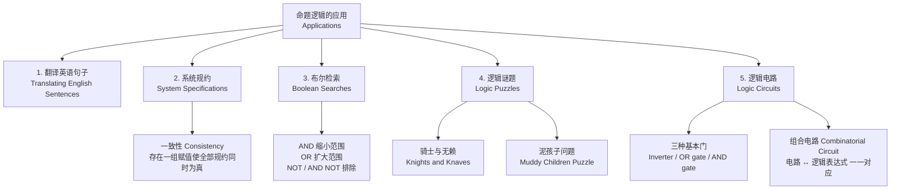
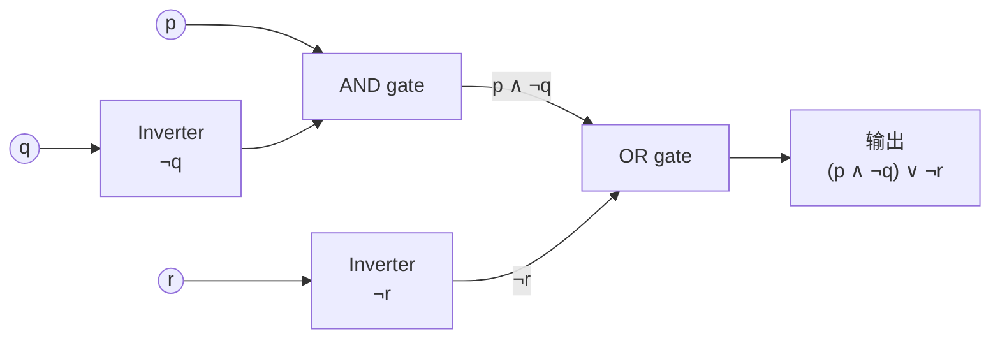
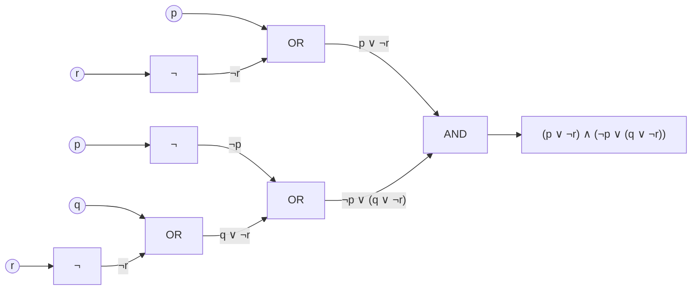

# C1.2 命题逻辑的应用 Applications of Propositional Logic

> [!abstract] 本节地位
> §1.1 建了工具箱，这一节是**工具的四个用武之地**：把英语翻译成逻辑式、检查系统规约的一致性、布尔检索、逻辑谜题，以及**逻辑电路**。
> 内容不难，但**"翻译"和"一致性"两块是期中最爱出的大题**，逻辑电路则是通往第 12 章布尔代数、以及数字电路课的接口。

## 本节结构总览



---

## 1. 把英语句子翻译成逻辑表达式 Translating English Sentences

> [!important] 为什么要翻译
> 英语（以及任何自然语言）**常常有歧义 (ambiguous)**。把句子翻译成复合命题可以：
> 1. **消除歧义**（把隐含的假设显式化）；
> 2. 之后可以**分析真值、做代数变形、用推理规则（§1.6）进行推理**。
>
> 课本明确提醒：翻译过程**往往需要基于句子的本意做出一组合理的假设 (reasonable assumptions)**。所以答案不唯一，但必须能说清你的假设。

> [!note] 老师会给的三步法（自己做题也照此执行）
> **第一步：切分原子命题。** 把句子拆成最小的、不含联结词的陈述，各配一个字母。
> **第二步：识别联结词关键词。** and / but / or / if / only if / unless / necessary / sufficient / whenever / implies…
> **第三步：确定作用范围（括号）。** 尤其注意 "not" 管到哪里、"or" 的两侧各是什么。
>
> 常见坑：**"cannot … unless …"** 和 **"only if"** 同时出现时，先处理 unless（转成 $\neg B \to A$），再处理 only if（$p \to q$）。

### 例 1

> "You can access the Internet from campus **only if** you are a computer science major **or** you are **not** a freshman."

**解**：设
- $a$ = "You can access the Internet from campus"
- $c$ = "You are a computer science major"
- $f$ = "You are a freshman"

**"only if" 是条件语句的一种表述（$p$ only if $q$ 即 $p \to q$），故**：
$$\boxed{a \to (c \vee \neg f)}$$

> [!warning] 这里的两个坑
> 1. **"only if" 的箭头方向**：是 $a \to (\dots)$，不是 $(\dots) \to a$。
> 2. **$\vee$ 的范围**：整个 "$c$ or not $f$" 是后件，必须加括号。若写成 $a \to c \vee \neg f$，虽然按优先级（$\vee$ 高于 $\to$）也对，但考试建议写括号。
>
> 另外，课本特意说明：虽然理论上可以用**一个**命题变元 $p$ 表示整句话，但那样**无法分析其含义、无法用它做推理**。所以要**尽可能细地拆分**。这是翻译题的第一原则。

### 例 2

> "You **cannot** ride the roller coaster **if** you are under 4 feet tall **unless** you are older than 16 years old."

**解**：设
- $q$ = "You can ride the roller coaster"
- $r$ = "You are under 4 feet tall"
- $s$ = "You are older than 16 years old"

拆解：
- "unless you are older than 16" ⇒ 除非 $s$，即在 $\neg s$ 的前提下……
- "you cannot ride if you are under 4 feet tall" ⇒ $r \to \neg q$

合起来：**当"身高不足 4 英尺"且"年龄不超过 16"时不能坐**：
$$\boxed{(r \wedge \neg s) \to \neg q}$$

> [!note] unless 的作用机制
> "A unless B" 的通用等价式是 $\neg B \to A$。这里 A 本身又是一个条件句 "if $r$ then $\neg q$"，于是变成 $\neg s \to (r \to \neg q)$。
> 而 $\neg s \to (r \to \neg q) \equiv (\neg s \wedge r) \to \neg q$（**输出律 / exportation law**，$p \to (q \to r) \equiv (p \wedge q) \to r$，§1.3 会列出）。两种写法都对，课本取后者。
> 课本也明确说："当然还有别的表示方法，但这个足够用了。"——**翻译答案不唯一，只要逻辑等价即可**。

---

## 2. 系统规约 System Specifications

> [!important] 定义（一致性 Consistency）
> 系统规约 (system specifications) 应当是**一致的 (consistent)**，即：它们**不包含相互冲突、可以推出矛盾的要求**。
> 等价的判定方式：**存在一组真值赋值，使所有规约同时为真**。若不存在，则规约**不一致 (inconsistent)**，此时**根本不可能开发出满足全部规约的系统**。

> [!note] 为什么工程上重要
> 软硬件工程师要把自然语言的需求 (requirements) 变成**精确无歧义的规约 (specifications)**，作为开发的依据。需求文档里的一句"这两条互相打架"，在逻辑上就是"不存在使全部为真的赋值"。
> 术语对照：一致 (consistent) $\equiv$ **可满足 (satisfiable)**（§1.3 会正式引入 satisfiability）。判定一组公式是否可满足，就是著名的 **SAT 问题**，它是第一个被证明为 **NP-完全 (NP-complete)** 的问题。现代的 **SAT solver** 每天被用来做芯片验证、软件模型检测、AI 规划。

### 例 3（把规约翻译成逻辑式）

> "The automated reply **cannot** be sent **when** the file system is full."

**解**：设 $p$ = "The automated reply **can** be sent"，$q$ = "The file system is full"。
则 $\neg p$ = "The automated reply cannot be sent"。"when" 引导前件，故：
$$\boxed{q \to \neg p}$$

### 例 4（判断一致性）

判断以下三条规约是否一致：
1. "The diagnostic message is stored in the buffer **or** it is retransmitted."
2. "The diagnostic message is **not** stored in the buffer."
3. "**If** the diagnostic message is stored in the buffer, **then** it is retransmitted."

**解**：设 $p$ = "存入缓冲区"，$q$ = "被重传"。三条规约为
$$p \vee q,\qquad \neg p,\qquad p \to q$$

**推理（课本用的"逼出赋值"法）**：
- 要使 $\neg p$ 为真 ⇒ **$p$ 必须为假**。
- 要使 $p \vee q$ 为真，而 $p$ 已为假 ⇒ **$q$ 必须为真**。
- 检查 $p \to q$：$p = F$ ⇒ 空真 ⇒ **为真**。✓

于是赋值 $p = F,\ q = T$ 使三条**同时为真** ⇒ **一致 (consistent)**。

> [!note] 两种解法都要会
> 课本提到也可以**列真值表**枚举 $p,q$ 的 4 种赋值。两种方法的取舍：
> - **推理法（逼出赋值）**：变元多时快，且能顺便找出**唯一**的可行赋值。规约里出现单个字面量（如 $\neg p$）时，从它入手最省力——这正是 SAT solver 里 **单元传播 (unit propagation)** 的思想。
> - **真值表法**：变元少（$\le 3$）时稳妥、不会漏。
>
> **答题格式**：判断一致性时，回答"一致"必须**给出一组具体赋值**；回答"不一致"必须**说明为什么任何赋值都不行**。只写结论不给证据要扣分。

### 例 5（加一条规约后变得不一致）

在例 4 的基础上再加一条："The diagnostic message is **not** retransmitted."

**解**：新规约是 $\neg q$。由例 4，前三条规约**只在** $p = F,\ q = T$ 时才全真。而此时 $\neg q = F$。
故不存在使四条同时为真的赋值 ⇒ **不一致 (inconsistent)**。

> [!warning] 注意逻辑
> 这里的关键论证是"前三条**只有**唯一一组解"。如果前三条有多组解，就必须逐一检查每组是否满足新规约，不能只看一组。

---

## 3. 布尔检索 Boolean Searches

在大规模信息（如网页索引）检索中大量使用联结词，这类检索称为**布尔检索 (Boolean searches)**。

| 联结词 | 作用 | 效果 |
|---|---|---|
| **AND** | 匹配**同时**包含两个检索词的记录 | 缩小范围 |
| **OR** | 匹配包含其中**一个或两个**检索词的记录 | 扩大范围 |
| **NOT**（有时写作 **AND NOT**） | **排除**某个检索词 | 缩小范围 |

### 例 6（网页检索）

**目标 1：找关于"新墨西哥州的大学"的网页。**
检索式：`NEW AND MEXICO AND UNIVERSITIES`
结果包含所有同时含 NEW、MEXICO、UNIVERSITIES 三个词的页面——包括目标页面，**也会混入**诸如"墨西哥的新大学 (new universities in Mexico)"这类无关页面。

> 注：Google 等引擎中 **AND 可以省略**（所有检索词默认都要满足）。它们还支持**引号搜索精确短语**，因此更有效的写法是 `"New Mexico" AND UNIVERSITIES`。

**目标 2：找"新墨西哥州或亚利桑那州的大学"。**
检索式：`(NEW AND MEXICO OR ARIZONA) AND UNIVERSITIES`

> [!warning] 注意这里的优先级
> 课本特别提示：**AND 的优先级高于 OR**（与 §1.1 的 $\wedge$ 高于 $\vee$ 一致）。所以 `NEW AND MEXICO OR ARIZONA` 解析为 `(NEW AND MEXICO) OR ARIZONA`。
> 结果包含所有含 UNIVERSITIES 且（同时含 NEW 和 MEXICO，或含 ARIZONA）的页面。
> Google 中的等价写法是 `NEW MEXICO OR ARIZONA`（省略 AND）。

**目标 3：找"墨西哥（而非新墨西哥州）的大学"。**
若直接搜 `MEXICO AND UNIVERSITIES`，结果会同时包含新墨西哥州的大学。更好的写法是：
$$\texttt{(MEXICO AND UNIVERSITIES) NOT NEW}$$
结果包含 MEXICO 和 UNIVERSITIES 但**不含** NEW 的页面。
> 注：Google 等引擎中 **NOT 用减号 `-` 表示**，故实际写作 `MEXICO UNIVERSITIES -NEW`。

> [!note] 这一小节隐藏的教训
> 布尔检索是**近似**的：`(MEXICO AND UNIVERSITIES) NOT NEW` 会误杀标题里恰好含 "new" 的墨西哥大学页面（比如 "Mexico's new universities"），这是**假阴性 (false negative)**；而 `NEW AND MEXICO AND UNIVERSITIES` 会引入**假阳性 (false positive)**。
> 信息检索 (Information Retrieval) 中的**查准率 (precision) / 查全率 (recall)** 权衡就从这里开始。现代搜索引擎之所以转向向量语义检索、再到 RAG，正是为了突破布尔检索"只看词是否出现、不看词的含义"的天花板。

---

## 4. 逻辑谜题 Logic Puzzles

> [!important] 定义
> 能用逻辑推理求解的谜题称为**逻辑谜题 (logic puzzles)**。做逻辑谜题既是练习逻辑规则的好方法，也是**自动推理程序 (automated reasoning programs)** 常用的能力展示基准。

课本讨论两个，§1.3 还会讨论极流行的**数独 (Sudoku)**。

### 4.1 骑士与无赖 Knights and Knaves（Smullyan 谜题）

**设定**：岛上有两种居民——
- **骑士 (knights)**：**永远说真话**；
- **无赖 (knaves)**：**永远说假话**。

**例 7**：遇到两个人 $A$ 和 $B$。$A$ 说"$B$ 是骑士"，$B$ 说"我们两个是不同类型的人"。问 $A$、$B$ 各是什么？

**解**：设 $p$ = "$A$ 是骑士"，$q$ = "$B$ 是骑士"。则 $\neg p$ = "$A$ 是无赖"，$\neg q$ = "$B$ 是无赖"。

**情形一：假设 $A$ 是骑士（$p$ 为真）。**
- 骑士说真话 ⇒ $A$ 的话"$B$ 是骑士"为真 ⇒ $q$ 为真 ⇒ $A$、$B$ **同类型**（都是骑士）。
- 但 $B$ 也是骑士 ⇒ $B$ 说真话 ⇒ $B$ 的话"我们是不同类型"，即 $(p \wedge \neg q) \vee (\neg p \wedge q)$，必须为真。
- 而 $A$、$B$ 都是骑士 ⇒ 该式为假。**矛盾。**
- ⇒ 假设不成立 ⇒ **$A$ 不是骑士，$p$ 为假。**

**情形二：$A$ 是无赖。**
- 无赖说假话 ⇒ $A$ 的话"$B$ 是骑士"（即 $q$）为**假** ⇒ $q$ 为假 ⇒ **$B$ 也是无赖**。
- 检验 $B$：$B$ 是无赖 ⇒ 他的话"我们是不同类型"必须为假。事实上两人都是无赖（同类型），所以这句话确实为假。✓ **自洽。**

**结论：$A$ 和 $B$ 都是无赖 (knaves)。**

> [!note] 这类题的标准解法（老师会总结）
> **穷举 + 自洽性检验**：$n$ 个人有 $2^n$ 种身份组合，逐一检验"每个人的身份与他说的话的真假是否一致"。
> 核心判据一句话：
> $$\textbf{"某人是骑士"} \;\leftrightarrow\; \textbf{"他说的话为真"}$$
> 即，若设 $k_i$ = "第 $i$ 人是骑士"，$S_i$ = 第 $i$ 人所说命题，则必有
> $$k_i \leftrightarrow S_i$$
> 把所有 $k_i \leftrightarrow S_i$ 合取起来求可满足赋值即可——**这就把谜题转化成了 SAT 问题**。
>
> 课本还预告：习题 19–23 是两类人（骑士/无赖）的谜题；习题 24–31 引入第三类人——**间谍 (spies)**，Smullyan 称为 **normals**，他们**既可能说真话也可能说假话**。间谍的存在使 $k_i \leftrightarrow S_i$ 不再对所有人成立，题目难度陡增。

> [!note] Raymond Smullyan（1919— ）
> 高中辍学，因为想学自己真正感兴趣的东西而不是标准课程。辗转多所大学后于 1955 年在芝加哥大学获数学学士学位，其间靠在派对和俱乐部**表演魔术**支付学费。1959 年在普林斯顿师从 **Alonzo Church**（λ 演算的提出者）获逻辑学博士。曾任教于达特茅斯、普林斯顿、Yeshiva 大学和纽约市立大学，1981 年加入印第安纳大学哲学系。
> 著有大量趣味逻辑著作：*Satan, Cantor, and Infinity*；*What Is the Name of This Book?*；*The Lady or the Tiger?*；*Alice in Puzzleland*；*To Mock a Mockingbird*；*Forever Undecided*；*The Riddle of Scheherazade*。被视为**当代的 Lewis Carroll**。他特别关注**自指 (self-reference)**，并致力于推广**哥德尔不完备性定理**的结论——不可能写出一个能解决所有数学问题的计算机程序。他还是出色的钢琴演奏者，妻子是音乐会级钢琴家；爱好包括制作望远镜、光学与立体摄影。他有句名言："我从来不觉得教学和研究有冲突——我教书的时候就是在做研究。"关于他的纪录短片名为 *This Film Needs No Title*。

### 4.2 泥孩子问题 Muddy Children Puzzle（知识推理）

**例 8**：父亲让一男一女两个孩子去后院玩，不许弄脏。但两人玩耍时**额头都沾了泥**。玩完后父亲说："**你们中至少有一个人额头上有泥。**"然后问："**你知道自己额头上有没有泥吗？**"要求回答"是"或"否"。父亲把这个问题问了**两遍**。假设每个孩子**能看见对方的额头但看不见自己的**，两人都诚实，且**同时**回答每个问题。问两次回答分别是什么？

**解**：设 $s$ = "儿子额头有泥"，$d$ = "女儿额头有泥"。父亲的话断言 $s \vee d$ 为真。

**第一轮**：
- 儿子看见女儿有泥 ⇒ 他知道 $d$ 为真，但**无法确定 $s$**（父亲的话已被 $d$ 满足）⇒ 回答"**否**"。
- 女儿同理，知道 $s$ 为真，但无法确定 $d$ ⇒ 回答"**否**"。

**第二轮**（关键：把对方的"否"当作新信息）：
- 女儿推理：**如果我（女儿）额头是干净的（$d$ 为假）**，那么儿子看到我干净，又知道 $s \vee d$ 为真，就能推出 $s$ 必为真，他第一轮就该回答"是"。
- 但儿子第一轮回答了"否" ⇒ **$d$ 为假的假设不成立** ⇒ **$d$ 为真** ⇒ 女儿回答"**是**"。
- 儿子做完全对称的推理 ⇒ 回答"**是**"。

**结论：第一轮两人都答"否"，第二轮两人都答"是"。**

> [!important] 这道题真正教的是什么
> **"没有回答"本身也是信息。** 儿子的"我不知道"排除了"女儿干净"这种可能性。
>
> 这属于**认知逻辑 / 知识逻辑 (epistemic logic)** 的范畴：命题不只是"$p$ 为真"，还有"**A 知道 $p$**"（记作 $K_A p$）。父亲那句"至少有一个人有泥"看似人人都已知道（两个孩子都看得见对方有泥），但它把这条信息变成了**公共知识 (common knowledge)**——"我知道你知道我知道……"，正是这一层才让推理链条启动。
>
> **一般化**：$n$ 个孩子都有泥时，前 $n-1$ 轮全答"否"，**第 $n$ 轮全答"是"**（可用数学归纳法证明，见 §1.7/第 5 章）。
> **CS 关联**：这是分布式系统中"共识 (consensus)"与"共同知识"的经典模型，也是多智能体系统 (multi-agent systems) 与博弈论中信息结构分析的入门例子。

---

## 5. 逻辑电路 Logic Circuits

> [!important] 定义（逻辑电路 Logic Circuit）
> **逻辑电路 (logic circuit)**（或**数字电路 digital circuit**）接收输入信号 $p_1, p_2, \dots, p_n$，每个是一个**位 (bit)**（0 = off，1 = on），产生输出信号 $s_1, s_2, \dots, s_n$，每个也是一个位。
> 本节只讨论**单输出**的逻辑电路；一般的数字电路可以有多个输出。

> [!note] 历史
> 用命题逻辑设计计算机硬件，最早由 **Claude Shannon（克劳德·香农）** 在 **1938 年**的 MIT 硕士论文中提出。这被广泛认为是史上最有影响力的硕士论文。**第 12 章**会在布尔代数的框架下深入讨论（并使用不同的记号：$+$ 代替 $\vee$，$\cdot$ 代替 $\wedge$，$\bar{x}$ 代替 $\neg x$）。

### 5.1 三种基本门 Basic Gates

复杂的数字电路由三种基本电路（称为**门 gates**）搭建：

![[C1-图1-基本逻辑门-Inverter-OR-AND.png]]

| 门 Gate | 别名 | 输入 | 输出 | 图形特征 |
|---|---|---|---|---|
| **反相器 Inverter** | **NOT gate** | 1 个位 $p$ | $\neg p$ | 三角形 + 输出端小圆圈（圆圈代表取反） |
| **或门 OR gate** | — | 2 个位 $p, q$ | $p \vee q$ | 盾牌形（输入端内凹的曲线） |
| **与门 AND gate** | — | 2 个位 $p, q$ | $p \wedge q$ | D 字形（输入端为直线） |

> [!note] 记忆技巧
> - **AND 门是平的 (flat back, D-shape)，OR 门是弯的 (curved back)**。
> - 反相器的**小圆圈 (bubble)** 才是"取反"的标志——把这个圆圈加到 AND 门输出端就是 **NAND**，加到 OR 门输出端就是 **NOR**（这两个门在 §1.3 习题里会以 $\uparrow$ 和 $\downarrow$ 出现，是**功能完备 functionally complete** 的单一门）。

### 5.2 组合电路 Combinatorial Circuit

**FIGURE 2 的电路**（对应表达式 $(p \wedge \neg q) \vee \neg r$）：

![[C1-图2-组合电路示例.png]]

用 mermaid 表示其数据流结构：



**例 9**：求 FIGURE 2 电路的输出。

**解**（**追踪法 tracing**，从输入往输出逐门标注）：
1. 输入 $q$ 经反相器 ⇒ $\neg q$。
2. AND 门输入为 $p$ 和 $\neg q$ ⇒ 输出 $p \wedge \neg q$。
3. 输入 $r$ 经反相器 ⇒ $\neg r$。
4. OR 门输入为 $p \wedge \neg q$ 和 $\neg r$ ⇒ 最终输出
$$\boxed{(p \wedge \neg q) \vee \neg r}$$

**例 10**：给定输入位 $p, q, r$，构造输出为 $(p \vee \neg r) \wedge (\neg p \vee (q \vee \neg r))$ 的数字电路。

**解**（**自顶向下拆解，再自底向上搭建**）：
1. 最外层是 $\wedge$ ⇒ 最后一个门是 **AND 门**，两个输入分别是 $p \vee \neg r$ 和 $\neg p \vee (q \vee \neg r)$。
2. 造 $p \vee \neg r$：用一个反相器从 $r$ 得到 $\neg r$，再用 **OR 门**把 $p$ 与 $\neg r$ 合并。
3. 造 $\neg p \vee (q \vee \neg r)$：
   - 先用反相器从 $r$ 得到 $\neg r$；
   - 用 **OR 门**把 $q$ 与 $\neg r$ 合并得 $q \vee \neg r$；
   - 再用一个反相器从 $p$ 得到 $\neg p$；
   - 用 **OR 门**把 $\neg p$ 与 $q \vee \neg r$ 合并。
4. 最后用 **AND 门**把 2、3 的结果合并。

得到的电路即 FIGURE 3：

![[C1-图3-电路实现-p或非r-与-非p或-q或非r.png]]

mermaid 结构图：



> [!important] 核心对应关系（本节最该记住的一句）
> $$\textbf{逻辑表达式} \;\longleftrightarrow\; \textbf{组合电路}$$
> - **表达式 → 电路**：由外向内拆解运算符，每个运算符配一个门。
> - **电路 → 表达式**：由输入向输出逐门标注（追踪法）。
> - 两个方向都是**机械的、可算法化的**，所以现代 EDA 工具能自动完成综合 (synthesis)。
> - **§1.3 的逻辑等价 = 电路简化**：等价的表达式给出功能相同但门数不同的电路，**用最少的门实现给定功能**正是数字电路设计的核心目标（第 12 章的卡诺图、Quine–McCluskey 算法）。

> [!note] 与 AI / 计算机方向的联系
> - $r$ 在 FIGURE 3 中用了**两个**反相器分别产生两份 $\neg r$。实际电路中会**共享**一个反相器把输出扇出 (fan-out) 到两处，这就是电路优化中的**公共子表达式消除 (common subexpression elimination)**——和编译器优化、计算图优化（PyTorch/TensorFlow 的图融合）是同一个思想。
> - 神经网络的计算图与组合电路结构同构：都是**有向无环图 (DAG)**，节点是算子，边是数据流。理解"表达式 ↔ 电路"的双向翻译，就理解了计算图的构建与求值。

---

# 📚 课件补充 Lecture Slides（Dr. 欧士琪 Ch1.2）

> [!info] 课件信息
> **Discrete Mathematics · Chapter 1: Logic and Proof · 1.2 Applications of Propositional Logic**
> 主讲：**Dr Shiqi (Shawn) Ou, 欧士琪**，South China University of Technology　授课日期：2026 年 9 月 3 日
>
> **课件 Agenda（Ch1.2 的四条主线）**
> 1. **System Specifications**（系统规约）
> 2. **Logic and Bit Operations**（逻辑与位运算）
> 3. **Logic Puzzles**（逻辑谜题）
> 4. **Types of Proposition**（命题的类型）

> [!warning] ⚠️ 课件与教材的章节归属差异（**必须注意**）
> 老师的 §1.2 与教材 §1.2 **范围不同**：
>
> | 主题 | 教材位置 | 课件位置 | 说明 |
> |---|---|---|---|
> | 翻译英语句子 | §1.2 | **§1.1 Part 3** | 老师提前到 1.1 讲了（见 [[C1.1 命题逻辑 Propositional Logic]] 课件补充 L6） |
> | 系统规约 System Specifications | §1.2 | **§1.2** ✓ | 一致 |
> | 逻辑与位运算 Bit Operations | **§1.1** | **§1.2** | 老师推迟到 1.2 讲 |
> | 逻辑谜题 Logic Puzzles | §1.2 | **§1.2** ✓ | 一致（但换成了蝙蝠侠版本） |
> | **命题的类型**（永真式/矛盾式/可能式） | **§1.3** | **§1.2** | ⭐ 老师**提前**到 1.2 讲了 |
> | 布尔检索 Boolean Searches | §1.2 | **暂未讲** | |
> | 逻辑电路 Logic Circuits | §1.2 | **暂未讲** | 可能与第 12 章合并讲 |
>
> **所以复习 §1.2 时，"命题类型"那一节要一起看**（本笔记 L4 节，或 [[C1.3 命题等价 Propositional Equivalences]] §1）。

---

## L1. 系统规约 System Specifications：**用真值表求解**（课件 slide 3–5）⭐

### L1.1 课件的定义

> [!important] 课件原文
> - **Specifications are an essential part of the system and software engineering.**
>   （规约是系统与软件工程中不可或缺的一部分。）
> - **Specifications should be consistent, otherwise, no way to develop a system that satisfies all specifications.**
>   （规约必须是**一致的**，否则**没有办法**开发出满足全部规约的系统。）
> - **Consistency means all specifications can be true.**
>   （**一致性意味着所有规约可以同时为真。**）

### L1.2 例题（与教材例 4 相同）

> 判断以下三条规约是否一致：
> 1. "The diagnostic message is stored in the buffer **or** it is retransmitted."
> 2. "The diagnostic message is **not** stored in the buffer."
> 3. "**If** the diagnostic message is stored in the buffer, **then** it is retransmitted."

**符号化**（课件把 [[C1.1 命题逻辑 Propositional Logic]] L6 的**四步翻译算法**直接搬过来用了，slide 5 右上角就贴着那四步）：
- $P$: The diagnostic message is stored in the buffer（消息存入缓冲区）
- $Q$: The diagnostic message is retransmitted（消息被重传）

| 规约 | 关键词 | 符号 |
|:-:|---|---|
| ① | **or** | $P \vee Q$ |
| ② | **is not** | $\neg P$ |
| ③ | **if … then** | $P \to Q$ |

**三条规约同时成立即**：
$$(P \vee Q) \wedge (\neg P) \wedge (P \to Q)$$

### L1.3 ⭐ 老师的解法：**列真值表**（与教材的推理法互补）

| $P$ | $Q$ | $P \vee Q$ | $\neg P$ | $P \to Q$ | $(P \vee Q) \wedge (\neg P) \wedge (P \to Q)$ |
|:-:|:-:|:-:|:-:|:-:|:-:|
| T | T | T | F | T | **F** |
| T | F | T | F | F | **F** |
| **F** | **T** | **T** | **T** | **T** | **✅ T** ← 课件用红框标出 |
| F | F | F | T | T | **F** |

**结论**：**存在一组赋值（$P = $ F, $Q = $ T）使三条规约同时为真** ⇒ **These specifications are consistent!**（课件红字原文）

**这组解的含义**：消息**没有**存入缓冲区，但**被重传了**——这是一个可实现的系统状态。

> [!important] 两种解法的比较（**都要会**）
> | 方法 | 教材（§1.2 例 4） | 课件 |
> |---|---|---|
> | 思路 | **推理法**：从 $\neg P$ 逼出 $P{=}$F，再由 $P \vee Q$ 逼出 $Q{=}$T，最后验证 $P \to Q$ | **真值表法**：列出全部 $2^n$ 行，找结果为 T 的行 |
> | 优点 | 变元多时快；能看出推理链条 | **机械、不会漏、一眼看出解的个数** |
> | 缺点 | 需要技巧 | $n$ 大时行数爆炸（$2^n$） |
>
> **答题建议**：变元 $\le 3$ 个时用**真值表法**（稳），$\ge 4$ 个时用**推理法**（快）。
> **无论哪种方法，回答"一致"都必须给出那组具体赋值作为证据。**

> [!note] 从真值表还能读出的额外信息
> 结果列只有**一行**为 T ⇒ **满足这三条规约的系统状态是唯一的**。
> 这在工程上意味着：这组规约**完全确定**了系统行为，没有留下任何自由度。
> 也正因为解唯一，教材例 5 中再加一条 $\neg Q$ 就立刻变成不一致（因为唯一解要求 $Q = $ T）。**参见本笔记正文 §2 例 5。**

---

## L2. 逻辑与位运算 Logic and Bit Operations（课件 slide 6–7）

> [!important] 课件原文要点
> - **Information stored in a computer is represented by bits.**
>   例：**A = 0100 0001**
> - **Bit = Binary Digit**，即 **0** 或 **1**（**0 = F**，**1 = T**）
> - **Logic connectives can be used as bit operations**（逻辑联结词可以用作位运算）：
>   - **Bitwise OR ($\vee$)**：the OR of the corresponding bits in the two strings
>   - **Bitwise AND ($\wedge$)**：the AND of the corresponding bits in the two strings
>   - **Bitwise XOR ($\oplus$)**：the XOR of the corresponding bits in the two strings

> [!note] ⭐ "A = 0100 0001" 这个例子的深意（老师随手一写，但很值得挖）
> $0100\,0001_2 = 65_{10}$，而 **65 正是大写字母 'A' 的 ASCII 码**！
> 所以这句话是在说：**计算机里连"字母 A"这样的东西，本质上也只是一串位**。
> - 小写 'a' = $0110\,0001_2 = 97$（比 'A' 大 32，即第 6 位从 0 变 1）
> - **由此得到一个经典位运算技巧**：大写转小写就是 `c | 0x20`（按位或 $0010\,0000$）；小写转大写是 `c & ~0x20`；大小写互换是 `c ^ 0x20`（按位异或）。
> - **这正是"逻辑运算 = 位运算"的直接应用**，也是 C 语言 `toupper`/`tolower` 的底层做法之一。

### 课件的例子（slide 7）

$$
\begin{array}{ll}
A & \texttt{1011 0110}\\
B & \texttt{0001 1101}\\[4pt]
\text{Bit-wise OR} & \texttt{1011 1111}\\
\text{Bit-wise AND} & \texttt{0001 0100}\\
\text{Bit-wise XOR} & \texttt{1010 1011}
\end{array}
$$

**逐位验算**：

| 位 | 1 | 2 | 3 | 4 | 5 | 6 | 7 | 8 |
|---|:-:|:-:|:-:|:-:|:-:|:-:|:-:|:-:|
| $A$ | 1 | 0 | 1 | 1 | 0 | 1 | 1 | 0 |
| $B$ | 0 | 0 | 0 | 1 | 1 | 1 | 0 | 1 |
| **OR** | 1 | 0 | 1 | 1 | 1 | 1 | 1 | 1 |
| **AND** | 0 | 0 | 0 | 1 | 0 | 1 | 0 | 0 |
| **XOR** | 1 | 0 | 1 | 0 | 1 | 0 | 1 | 1 |

✅ 与课件答案一致。

> [!note] 与教材例 13 的关系
> 教材 [[C1.1 命题逻辑 Propositional Logic]] §7 例 13 用的是 **10 位**串 `01 1011 0110` 与 `11 0001 1101`。
> **老师的 8 位串 `1011 0110` / `0001 1101` 恰好就是教材那两个串的后 8 位**——所以答案的后 8 位也完全对应（教材：OR `11 1011 1111`、AND `01 0001 0100`、XOR `10 1010 1011`）。✓
> **自查技巧**：恒有 $\text{OR} = \text{AND} \oplus \text{XOR}$（逐位可验），可以用来检查答案。
> 这里：$0001\,0100 \oplus 1010\,1011 = 1011\,1111$ ✓ = OR。

---

## L3. 逻辑谜题 Logic Puzzles：**蝙蝠侠与小丑版**（课件 slide 8–9）⭐

> [!important] 课件的设定（教材 knights/knaves 的超级英雄版）
> - **Puzzles that can be solved using logical reasoning are known as logic puzzles.**
> - **Can be solved by using the rules of logic.**
>
> **岛上有两种人：**
> - 🦇 **Batman（蝙蝠侠）：Always tell the truth**（永远说真话）
> - 🃏 **Joker（小丑）：Always lie**（永远说谎）
>
> 某天你遇到两个人 **A** 和 **B**：
> - **$P$**：A says, "**B is a Batman.**"（A 说：B 是蝙蝠侠。）
> - **$Q$**：B says, "**The two of us are opposite types.**"（B 说：我们两个是不同类型。）
>
> **问：A 和 B 分别是什么？**

### ⭐ 老师的解法：**穷举真值表**

设 $P$ 列 = "A 所说的话与 A 的身份**相符**"，$Q$ 列 = "B 所说的话与 B 的身份**相符**"。
（即 [[C1.2 命题逻辑的应用 Applications of Propositional Logic]] §4.1 的核心判据 $k_i \leftrightarrow S_i$：**"是说真话的人"当且仅当"他说的话为真"**。）

| A 的身份 | B 的身份 | A 的话"B 是 Batman"实际真假 | $P$（A 自洽？） | B 的话"我们不同类"实际真假 | $Q$（B 自洽？） | 结论 |
|:-:|:-:|:-:|:-:|:-:|:-:|:-:|
| 🦇 Batman | 🦇 Batman | **真**（B 确实是 Batman） | **T** ✓（说真话，符合 Batman） | **假**（两人同类） | **F** ✗（Batman 却说了假话） | ❌ 排除 |
| 🦇 Batman | 🃏 Joker | **假**（B 不是 Batman） | **F** ✗（Batman 却说了假话） | **真**（确实不同类） | **F** ✗（Joker 却说了真话） | ❌ 排除 |
| 🃏 Joker | 🦇 Batman | **真**（B 确实是 Batman） | **F** ✗（Joker 却说了真话） | **真**（确实不同类） | **T** ✓ | ❌ 排除 |
| 🃏 **Joker** | 🃏 **Joker** | **假**（B 不是 Batman） | **T** ✓（Joker 说假话，符合） | **假**（两人同类） | **T** ✓（Joker 说假话，符合） | ✅ **成立**（课件红框） |

$$\boxed{\textbf{A 和 B 都是 Joker（小丑）。}}$$

> [!important] ⭐ 这类题的通用解法（**背下来**）
> 1. **列出所有身份组合**（$n$ 个人 $\Rightarrow$ $2^n$ 行）。
> 2. 对每一行，**计算每个人所说的话在该行设定下的实际真假**。
> 3. **检查自洽性**：说真话的人（Batman/骑士）所说的话必须为**真**；说假话的人（Joker/无赖）所说的话必须为**假**。
> 4. **唯一自洽的那一行就是答案。**
>
> 形式化：设 $k_i$ = "第 $i$ 人是说真话的人"，$S_i$ = 第 $i$ 人所说的命题，则求解
> $$\bigwedge_{i} \big(k_i \leftrightarrow S_i\big)$$
> 的满足赋值 —— **这就把谜题转成了一个 SAT 问题**（[[C1.3 命题等价 Propositional Equivalences]] §6）。

> [!note] 与教材 knights/knaves 的对照
> 教材 [[C1.2 命题逻辑的应用 Applications of Propositional Logic]] §4.1 例 7 的设定完全相同（只是叫 knight/knave），结论也一样：**两人都是说谎者**。
> **差别在解法**：
> - **教材**用**分情形推理**（先假设 A 是骑士推出矛盾，再假设 A 是无赖验证自洽）；
> - **课件**用**真值表穷举**（4 行全列，一眼看出唯一自洽行）。
>
> **人多时（3 人及以上）真值表会到 8 行、16 行，此时推理法更省力**；**2 人时真值表最稳**。

> [!warning] 通用陷阱复习
> **没有人能说"我是 Joker（我是说谎者）"。**
> - Batman 说这句 = 说了假话（他不是 Joker）⇒ 违反 Batman 的设定；
> - Joker 说这句 = 说了真话 ⇒ 违反 Joker 的设定。
>
> 所以任何题目中出现"我是说谎者"的**直接自陈**，该情形直接排除。（见本笔记正文习题 21、23。）

---

## L4. ⭐ 命题的类型 Types of Proposition（课件 slide 10–11）

> [!warning] 这是教材 §1.3 的开头内容，老师在 §1.2 就讲了
> 完整的讨论见 [[C1.3 命题等价 Propositional Equivalences]] §1。这里按课件的呈现整理。

### L4.1 三个定义（课件原文）

> [!important] 定义
> - **Tautology（永真式 / 重言式）**：A compound proposition that is **always true**（永远为真的复合命题）
>   - **例：$P \vee \neg P$**
> - **Contradiction（矛盾式）**：A compound proposition that is **always false**（永远为假的复合命题）
>   - **例：$P \wedge \neg P$**
> - **Contingency（可能式）**：A compound proposition which is **neither a tautology nor a contradiction**（既不是永真式也不是矛盾式的复合命题）
>   - **例：$P \oplus (P \wedge \neg P)$**

**课件配的三张小真值表**：

**永真式 $P \vee \neg P$**

| $P$ | $\neg P$ | $P \vee \neg P$ |
|:-:|:-:|:-:|
| T | F | **T** |
| F | T | **T** |

**矛盾式 $P \wedge \neg P$**

| $P$ | $\neg P$ | $P \wedge \neg P$ |
|:-:|:-:|:-:|
| T | F | **F** |
| F | T | **F** |

**可能式 $P \oplus (P \wedge \neg P)$**

| $P$ | $P \wedge \neg P$ | $P \oplus (P \wedge \neg P)$ |
|:-:|:-:|:-:|
| T | F | **T** |
| F | F | **F** |

> [!note] 课件这个"可能式"例子选得很巧
> $P \wedge \neg P \equiv \mathbf{F}$（矛盾式），而 $P \oplus \mathbf{F} \equiv P$。
> 所以 $P \oplus (P \wedge \neg P) \equiv P$ —— **结果列恰好就是 $P$ 列**，有真有假 ⇒ 可能式。✓
> **这同时演示了 $\oplus$ 的一个恒等式：$A \oplus \mathbf{F} \equiv A$（$\mathbf{F}$ 是 $\oplus$ 的单位元）。**
> 顺带：$A \oplus \mathbf{T} \equiv \neg A$，$A \oplus A \equiv \mathbf{F}$。

### L4.2 课件例题：判断类型（slide 11）⭐

> **Are they Tautology, Contradiction, or Contingency?**

| 式子 | 课件答案 | 验证 |
|---|---|---|
| $P \to P$ | **Tautology** | $P$ 真时 T→T = T；$P$ 假时 F→F = T。恒真 ✓ |
| $P \oplus P$ | **Contradiction** | 异或要求"恰好一个真"，而两边是同一个 $P$，真值必相同 ⇒ 恒假 ✓ |
| $P \leftrightarrow P$ | **Tautology** | 真值必相同 ⇒ 恒真 ✓ |
| $P \to Q$ | **Contingency** | (T,F) 行为假，其余为真 ⇒ 有真有假 ✓ |
| $\neg P \vee Q$ | **Contingency** | $\equiv P \to Q$（[[C1.3 命题等价 Propositional Equivalences]] 例 3）⇒ 同上 ✓ |
| $\neg(P \to Q) \wedge Q$ | **Contradiction** | 见下面的详细推导 |

**最后一题的完整推导**（课件只给了答案，这里补全）：

$$
\begin{aligned}
\neg(P \to Q) \wedge Q
&\equiv \big(P \wedge \neg Q\big) \wedge Q && \text{条件语句的否定：} \neg(p \to q) \equiv p \wedge \neg q\\
&\equiv P \wedge \big(\neg Q \wedge Q\big) && \text{结合律}\\
&\equiv P \wedge \mathbf{F} && \text{否定律：} \neg Q \wedge Q \equiv \mathbf{F}\\
&\equiv \mathbf{F} && \text{支配律}
\end{aligned}
$$

⇒ **恒假 ⇒ Contradiction** ✓

**也可以用真值表验证**：

| $P$ | $Q$ | $P \to Q$ | $\neg(P \to Q)$ | $\neg(P\to Q) \wedge Q$ |
|:-:|:-:|:-:|:-:|:-:|
| T | T | T | F | **F** |
| T | F | F | T | **F**（$Q$ 为假） |
| F | T | T | F | **F** |
| F | F | T | F | **F** |

全列为 F ✓

> [!important] 判断类型的三条实用路线
> 1. **变元少（$\le 2$）** ⇒ **直接列真值表**，看最后一列全 T / 全 F / 混合。
> 2. **式子含 $\to$** ⇒ **先用 $p \to q \equiv \neg p \vee q$ 消箭头**，再化简（这是 [[C1.3 命题等价 Propositional Equivalences]] 的核心套路）。
> 3. **看到 $A$ 与 $\neg A$ 同时出现** ⇒ 立刻想 $A \wedge \neg A \equiv \mathbf{F}$、$A \vee \neg A \equiv \mathbf{T}$。
>
> 本题六小题里，前三题靠"两边是同一个 $P$"秒杀，第 6 题靠路线 2 + 路线 3 秒杀。**只有第 4、5 题需要真正验证。**

> [!note] 这三个概念在后面的作用（提前知道，学 §1.3 时会更顺）
> | 概念 | 在哪里用 |
> |---|---|
> | **Tautology** | **逻辑等价**的定义（$p \equiv q$ 即 $p \leftrightarrow q$ 是永真式）；**推理规则**的正确性（每条规则对应一个永真式） |
> | **Contradiction** | **反证法**的目标（推出矛盾）；**不可满足性**（矛盾式 = 不可满足） |
> | **Contingency** | 谬误的根源（[[C1.6 推理规则 Rules of Inference]]：谬误"基于可能式而非永真式"） |
>
> 详见 [[C1.3 命题等价 Propositional Equivalences]] §1 与 [[C1.6 推理规则 Rules of Inference]] §5。

---

## 📋 课件 vs 教材：Ch1.2 对照速查

| 主题 | 教材 §1.2 | 课件 Ch1.2 | 差异 |
|---|---|---|---|
| 翻译英语句子 | 例 1、例 2 | **移到 §1.1 Part 3** | 位置不同 |
| 系统规约 | **推理法**求解 | **真值表法**求解（4 行全列，红框标出唯一解行） | ⭐ 解法互补 |
| 布尔检索 | 例 6（New Mexico） | **未讲** | |
| 逻辑谜题 | knights & knaves | **Batman & Joker**，且用**真值表穷举** | ⭐ 解法不同 |
| 泥孩子问题 | 例 8 | **未讲** | |
| 逻辑电路 | 例 9、例 10 + 三张图 | **未讲** | 可能并入第 12 章 |
| 位运算 | 在 **§1.1** | **在 §1.2**，例子为 8 位串 | 位置不同 |
| 命题类型 | 在 **§1.3** | **在 §1.2** | ⭐ 提前讲了 |

---
---

## 精选习题与详解 Selected Exercises with Solutions

> [!example] 习题 1｜cannot … unless
> "You **cannot** edit a protected Wikipedia entry **unless** you are an administrator."
> $e$: "You can edit a protected Wikipedia entry"；$a$: "You are an administrator."
>
> **解**："A unless B" $\equiv \neg B \to A$。这里 A = $\neg e$，B = $a$：
> $$\boxed{\neg a \to \neg e}$$
> 等价写法：$e \to a$（逆否命题）——"能编辑 ⇒ 你是管理员"，读起来更顺。两个答案都对。
>
> **要点**：unless 题一定先套 $\neg B \to A$，再视需要取逆否化简。

> [!example] 习题 2｜only if + or
> "You can see the movie **only if** you are over 18 years old **or** you have the permission of a parent."
> $m$: 能看电影；$e$: 超过 18 岁；$p$: 有家长许可。
>
> **解**："$m$ only if (…)" ⇒
> $$\boxed{m \to (e \vee p)}$$

> [!example] 习题 3｜only if + 复合后件
> "You can graduate **only if** you have completed the requirements of your major **and** you do **not** owe money to the university **and** you do **not** have an overdue library book."
> $g$: 能毕业；$m$: 欠学校钱；$c$: 完成专业要求；$b$: 有逾期图书。
>
> **解**：
> $$\boxed{g \to (c \wedge \neg m \wedge \neg b)}$$
> **要点**：注意变元命名的陷阱——$m$ 表示"**欠**钱"，所以"不欠钱"要写 $\neg m$。**审题时务必看清每个字母代表的是肯定还是否定形式**，这是本题唯一的坑。

> [!example] 习题 4｜must … unless
> "To use the wireless network in the airport you **must** pay the daily fee **unless** you are a subscriber to the service."
> $w$: 能用机场无线网；$d$: 付日费；$s$: 是订阅用户。
>
> **解**：$\neg s \to (w \to d)$，等价地
> $$\boxed{(w \wedge \neg s) \to d}$$
> **要点**：与例 2 的结构完全相同（unless 套在一个条件句外面，用输出律合并）。

> [!example] 习题 5｜only if + 三项必要条件
> "You are eligible to be President of the U.S.A. **only if** you are at least 35 years old, were born in the U.S.A., **or** at the time of your birth both of your parents were citizens, **and** you have lived at least 14 years in the country."
> $e$: 有资格当总统；$a$: 至少 35 岁；$b$: 出生在美国；$p$: 出生时父母均为公民；$r$: 在美国住满 14 年。
>
> **解**：
> $$\boxed{e \to \big(a \wedge (b \vee p) \wedge r\big)}$$
> **要点**：三个条件用 $\wedge$ 串联，其中"出生在美国"与"父母均为公民"是**二选一**（相容或），必须加括号把 $b \vee p$ 包起来。若漏了括号，按优先级 $\wedge$ 高于 $\vee$，式子会被解析成 $(a \wedge b) \vee (p \wedge r)$，含义完全错误。**这是本节括号最关键的一题。**

> [!example] 习题 7｜规约翻译（whenever / but / necessary / when）
> $p$: "The message is scanned for viruses"；$q$: "The message was sent from an unknown system."
> a) "The message is scanned for viruses **whenever** the message was sent from an unknown system."
> b) "The message was sent from an unknown system **but** it was **not** scanned for viruses."
> c) "It is **necessary** to scan the message for viruses **whenever** it was sent from an unknown system."
> d) "**When** a message is **not** sent from an unknown system it is **not** scanned for viruses."
>
> **解**：
> - a) "$p$ whenever $q$" ⇒ $\boxed{q \to p}$
> - b) but = and ⇒ $\boxed{q \wedge \neg p}$
> - c) "扫描是必要的，每当来自未知系统" ⇒ 仍是 $\boxed{q \to p}$（与 a) 逻辑等价，只是措辞不同）
> - d) "when $\neg q$, $\neg p$" ⇒ $\boxed{\neg q \to \neg p}$
>
> **要点**：a) 与 c) 等价；d) 是 a) 的**否命题**，与 a) **不等价**。出题人就是要考这个区别。

> [!example] 习题 8｜规约翻译（denied / whenever）
> $p$: 用户输入了有效密码；$q$: 访问被授予；$r$: 用户已付订阅费。
> a) "The user has paid the subscription fee, **but** does not enter a valid password."
> b) "Access is granted **whenever** the user has paid the subscription fee **and** enters a valid password."
> c) "Access is **denied** if the user has **not** paid the subscription fee."
> d) "**If** the user has **not** entered a valid password **but** has paid the subscription fee, **then** access is granted."
>
> **解**：
> - a) $\boxed{r \wedge \neg p}$
> - b) $\boxed{(r \wedge p) \to q}$
> - c) "denied" = $\neg q$ ⇒ $\boxed{\neg r \to \neg q}$
> - d) $\boxed{(\neg p \wedge r) \to q}$
>
> **要点**：c) 中 "Access is denied" 要翻译成 $\neg q$ 而不是新设一个变元；d) 是一条**看起来不合理但语法上完全合法**的规约（没输密码却给访问）——这正是"规约一致性检查"要抓的问题。事实上 b) 与 d) 并不矛盾（它们可以同时为真），但 c) 与 d) 在 $r$ 为真时不冲突……做完 a–d 后不妨自己检查一下这组规约是否一致，这是很好的练习。

> [!example] 习题 9｜一致性判定（较难，四条规约）
> "The system is in multiuser state **if and only if** it is operating normally. If the system is operating normally, the kernel is functioning. The kernel is **not** functioning **or** the system is in interrupt mode. If the system is **not** in multiuser state, then it is in interrupt mode. The system is **not** in interrupt mode."
>
> **解**：设
> - $m$ = 处于多用户状态，$n$ = 正常运行，$k$ = 内核正常工作，$i$ = 处于中断模式。
>
> 五条规约：
> $$(1)\ m \leftrightarrow n \quad (2)\ n \to k \quad (3)\ \neg k \vee i \quad (4)\ \neg m \to i \quad (5)\ \neg i$$
>
> 从最强的单个字面量入手（单元传播）：
> - 由 (5)：$i = F$。
> - 由 (3) $\neg k \vee i$ 且 $i=F$ ⇒ $\neg k = T$ ⇒ **$k = F$**。
> - 由 (2) $n \to k$ 且 $k=F$ ⇒ 若 $n=T$ 则前真后假，故 **$n = F$**。
> - 由 (1) $m \leftrightarrow n$ ⇒ **$m = F$**。
> - 检验 (4) $\neg m \to i$：$\neg m = T$，$i = F$ ⇒ 前真后假 ⇒ **(4) 为假**。✗
>
> 不存在使五条同时为真的赋值 ⇒ **不一致 (inconsistent)**。
>
> **要点**：这类题的标准流程——**从确定的字面量开始，一路推导，最后检验剩下的规约**。若中途得到矛盾或最后有规约不满足，则不一致；若全部满足，则给出这组赋值作为一致性的证据。

> [!example] 习题 13｜布尔检索
> 想找"新泽西州的海滩 (beaches in New Jersey)"网页应该用什么布尔检索？如果想找"泽西岛（英吉利海峡）的海滩"呢？
>
> **解**：
> - 新泽西州：`BEACHES AND "NEW JERSEY"`，或 `BEACHES AND NEW AND JERSEY`。
> - 泽西岛：`(BEACHES AND JERSEY) NOT NEW`（Google 写法：`BEACHES JERSEY -NEW`）。
>
> **要点**：与例 6 的"墨西哥 vs 新墨西哥"完全同构——**用 NOT 排除掉那个使短语变成另一个地名的修饰词**。

> [!example] 习题 19–23｜骑士与无赖（含无解与多解情形）
> 用统一判据 $k_i \leftrightarrow S_i$（"是骑士 ⟺ 所说为真"）逐一处理。设 $p$ = "A 是骑士"，$q$ = "B 是骑士"。
>
> **19.** A 说"我们中至少有一个是无赖"（$S_A = \neg p \vee \neg q$），B 不说话。
> - 若 A 是无赖（$p = F$）：则 $S_A$ 必须为假，即 $\neg p \vee \neg q$ 为假 ⇒ $p$ 且 $q$ 都为真 ⇒ 与 $p=F$ 矛盾。✗
> - 若 A 是骑士（$p = T$）：$S_A$ 为真 ⇒ $\neg p \vee \neg q$ 为真；$\neg p = F$ ⇒ 必须 $\neg q = T$ ⇒ **B 是无赖**。✓
> - **结论：A 是骑士，B 是无赖。**
>
> **20.** A 说"我们两个都是骑士"（$S_A = p \wedge q$），B 说"A 是无赖"（$S_B = \neg p$）。
> - 若 $p = T$：$S_A$ 真 ⇒ $q = T$ ⇒ B 是骑士 ⇒ $S_B = \neg p = F$，但骑士必说真话。✗
> - 若 $p = F$：$S_A$ 必须为假 ⇒ $p \wedge q$ 为假 ✓（$p=F$ 已保证）。再看 B：$S_B = \neg p = T$。若 $q=T$（B 是骑士）⇒ 说真话 ✓ 自洽。若 $q=F$（B 是无赖）⇒ 应说假话，但 $S_B$ 为真 ✗。
> - **结论：A 是无赖，B 是骑士。**
>
> **21.** A 说"我是无赖**或** B 是骑士"（$S_A = \neg p \vee q$），B 不说话。
> - 若 $p = F$（A 是无赖）：$S_A$ 必须为假 ⇒ $\neg p \vee q$ 为假 ⇒ $\neg p = F$ ⇒ $p = T$，矛盾。✗
> - 若 $p = T$：$S_A$ 为真 ⇒ $\neg p \vee q$ 为真；$\neg p = F$ ⇒ $q = T$。
> - **结论：A 和 B 都是骑士。**
>
> **22.** A 和 B **都**说"我是骑士"（$S_A = p$，$S_B = q$）。
> - 判据 $p \leftrightarrow p$ 和 $q \leftrightarrow q$ 是**永真式**，对任何赋值都成立。
> - **结论：无法确定**。四种组合（骑士骑士、骑士无赖、无赖骑士、无赖无赖）都自洽。
> - **要点**：无赖说"我是骑士"是一句假话（他不是骑士），完全符合"无赖说假话"；骑士说"我是骑士"是真话。所以这句话**不提供任何信息**。
>
> **23.** A 说"我们两个都是无赖"（$S_A = \neg p \wedge \neg q$），B 不说话。
> - 若 $p = T$：$S_A$ 为真 ⇒ $\neg p = T$ ⇒ $p = F$，矛盾。✗
> - 若 $p = F$：$S_A$ 必须为假 ⇒ $\neg p \wedge \neg q$ 为假；$\neg p = T$ ⇒ 必须 $\neg q = F$ ⇒ $q = T$。
> - **结论：A 是无赖，B 是骑士。**
>
> > [!warning] 通用陷阱
> > **没有人能说"我是无赖"。** 骑士说这句是假话（不允许），无赖说这句是真话（也不允许）。所以任何题目里出现"我是无赖"的直接陈述，都直接导致该情形不可能。第 21、23 题都是这个陷阱的变体。

> [!example] 习题 32｜谋杀案（真值表推理）
> 警方有三名嫌疑人：Smith、Jones、Williams。三人都声称自己没杀 Cooper。
> - Smith 还说：Cooper 是 Jones 的朋友，且 Williams 讨厌他。
> - Jones 还说：他不认识 Cooper，且案发当天他不在城里。
> - Williams 还说：案发当天他看见 Smith 和 Jones 都和 Cooper 在一起，且凶手一定是 Smith 或 Jones。
>
> a) 若三人中恰有一人有罪，两个无罪者说的都是真话，而有罪者的话可真可假，凶手是谁？
>
> **解**：
> 假设 **Smith 有罪**：则 Jones 和 Williams 说真话。Jones 说"他不认识 Cooper 且不在城里"为真；但 Williams 说"我看见 Smith 和 Jones 都和 Cooper 在一起"也为真 ⇒ Jones 当天在城里且认识 Cooper。**两条真话互相矛盾。** ✗
>
> 假设 **Jones 有罪**：则 Smith 和 Williams 说真话。
> - Smith：他没杀人 ✓（Jones 才是凶手）；Cooper 是 Jones 的朋友 ✓；Williams 讨厌 Cooper ✓。
> - Williams：他没杀人 ✓；看见 Smith 和 Jones 与 Cooper 在一起 ✓；凶手是 Smith 或 Jones ✓（Jones 有罪，析取成立）。
> - Jones 有罪，他的话可真可假 —— 他说"不认识 Cooper、不在城里"是**谎话**，与 Smith/Williams 的真话不冲突。
> - **完全自洽。** ✓
>
> 假设 **Williams 有罪**：则 Smith 和 Jones 说真话。Jones 说"他不认识 Cooper 且案发当天不在城里"为真。但 Smith 说"Cooper 是 Jones 的朋友"也为真 ⇒ Jones 认识 Cooper。**矛盾。** ✗
>
> **结论：凶手是 Jones。**
>
> **要点**：三分支穷举 + 每支检查"所有应为真的陈述是否互相相容"。矛盾往往出现在**两个无罪者的陈述之间**，而不是在有罪者身上——因为有罪者的话本来就不受约束。

> [!example] 习题 37｜美女与老虎（The Lady or the Tiger）
> 两扇门上各有一块牌子。
> - 第一扇门："**这个房间里有美女，另一个房间里有老虎。**"
> - 第二扇门："**这两个房间里，有一个有美女，有一个有老虎。**"
> 已知**恰好一块牌子说真话，另一块说假话**。美女在哪扇门后？
>
> **解**：设 $L_1$ = "1 号房有美女"，$L_2$ = "2 号房有美女"。
> - 牌子 1 断言：$S_1 = L_1 \wedge \neg L_2$（1 号美女、2 号老虎）。
> - 牌子 2 断言：$S_2 = (L_1 \wedge \neg L_2) \vee (\neg L_1 \wedge L_2)$（两房一美女一老虎）。
>
> 注意到 $S_1 \to S_2$（若 1 号美女 2 号老虎，则确实一房一个）。所以 $S_1$ 真必导致 $S_2$ 真，即两块牌子同真——与"恰好一真一假"矛盾。
> 因此必然是 **$S_1$ 假、$S_2$ 真**。
> - $S_2$ 真 ⇒ 一房美女一房老虎。
> - $S_1$ 假 ⇒ 不是"1 号美女 2 号老虎" ⇒ 结合上一条 ⇒ **1 号房是老虎，2 号房是美女**。
>
> **结论：美女在第二扇门后。**
>
> **要点**：先找**蕴涵关系** $S_1 \to S_2$，立刻排除掉一半情形——比逐一枚举四种房间配置快得多。这是逻辑谜题的通用提速技巧。

> [!example] 习题 40a｜读电路求输出
> 电路：$p$ 经反相器得 $\neg p$；$q$ 经反相器得 $\neg q$；两者送入 OR 门。
>
> **解**：追踪法 ⇒ 输出 $\boxed{\neg p \vee \neg q}$。
> **补充观察**：由德摩根律（§1.3），$\neg p \vee \neg q \equiv \neg(p \wedge q)$，所以这个"双反相器 + OR"的电路**等价于一个 NAND 门**。这就是德摩根律在硬件上的直接体现——也是为什么实际芯片里大量使用 NAND 门。

> [!example] 习题 42｜由表达式造电路
> 用反相器、OR 门、AND 门构造输出为 $(p \wedge \neg r) \vee (\neg q \wedge r)$ 的电路。
>
> **解**（自顶向下拆）：
> 1. 最外层是 $\vee$ ⇒ 最后一个门是 OR 门。
> 2. 左支 $p \wedge \neg r$：$r$ 经反相器得 $\neg r$，与 $p$ 一起送入 AND 门。
> 3. 右支 $\neg q \wedge r$：$q$ 经反相器得 $\neg q$，与 $r$ 一起送入 AND 门。
> 4. 两个 AND 门的输出送入最终的 OR 门。
>
> **门数统计**：2 个反相器 + 2 个 AND 门 + 1 个 OR 门 = **5 个门**。
>
> ```mermaid
> graph LR
>     p((p)) --> A1["AND"]
>     r((r)) --> N1["¬"]
>     N1 -->|"¬r"| A1
>     q((q)) --> N2["¬"]
>     N2 -->|"¬q"| A2["AND"]
>     r --> A2
>     A1 -->|"p ∧ ¬r"| OR["OR"]
>     A2 -->|"¬q ∧ r"| OR
>     OR --> OUT["(p ∧ ¬r) ∨ (¬q ∧ r)"]
> ```
>
> **要点**：这种"若干个 AND 项用 OR 连起来"的形式叫**析取范式 (DNF, disjunctive normal form)** / **积之和 (sum of products)**，是电路综合的标准中间形式（§1.3 会正式定义）。任何布尔函数都能写成这种形式，因此**两级电路（AND 层 + OR 层）就足以实现任何逻辑功能**。

---

## 本节自测 Self-Test

> [!question] 1. "A unless B" 的逻辑表达式是什么？
> **答**：$\neg B \to A$（也等价于 $B \vee A$）。

> [!question] 2. 什么叫一组系统规约是"一致的"？如何证明一致 / 不一致？
> **答**：存在一组真值赋值使所有规约同时为真。证明一致：给出这样一组具体赋值；证明不一致：说明任何赋值都会使某条规约为假（通常用单元传播逼出唯一候选，再验证它使某条为假）。

> [!question] 3. 布尔检索中 AND、OR、NOT 分别起什么作用？
> **答**：AND 要求同时包含（缩小结果集）；OR 只要包含其一即可（扩大结果集）；NOT / AND NOT 排除含某词的页面（缩小结果集，Google 中写作 `-词`）。

> [!question] 4. 骑士—无赖谜题的核心判据是什么？
> **答**：$k_i \leftrightarrow S_i$，即"第 $i$ 人是骑士"当且仅当"他说的话为真"。把所有这样的双条件合取，求可满足赋值。

> [!question] 5. 为什么没人能说"我是无赖"？
> **答**：骑士说这句就是说假话（违反骑士定义）；无赖说这句就是说真话（违反无赖定义）。两边都不可能。

> [!question] 6. 泥孩子问题中，第二轮为什么两人都能确定自己脏了？
> **答**：因为对方第一轮答"否"这件事本身携带信息——如果自己是干净的，对方看到自己干净、又知道"至少一人脏"，第一轮就该答"是"。对方答"否"就排除了"自己干净"这一可能。

> [!question] 7. 三种基本逻辑门各是什么，输出分别是什么？
> **答**：反相器 (Inverter/NOT gate) 输出 $\neg p$；或门 (OR gate) 输出 $p \vee q$；与门 (AND gate) 输出 $p \wedge q$。

> [!question] 8. 由电路求表达式、由表达式造电路，各用什么方法？
> **答**：由电路求表达式用**追踪法**（从输入向输出逐门标注中间结果）；由表达式造电路用**自顶向下拆解**（外层运算符对应最后一个门，逐层向内展开）。

> [!question] 9. 逻辑电路设计与 §1.3 的逻辑等价是什么关系？
> **答**：等价的表达式对应功能相同但门数可能不同的电路；用等价变形化简表达式就是在减少门的数量、降低成本和延迟。

> [!question] 10. 用命题逻辑设计计算机硬件最早由谁在何时提出？
> **答**：Claude Shannon，1938 年 MIT 硕士论文。

---

## 关联

- 上一节：[[C1.1 命题逻辑 Propositional Logic]]
- 下一节：[[C1.3 命题等价 Propositional Equivalences]]（数独谜题、可满足性、电路化简的理论基础）
- 章索引：[[C1 基础：逻辑与证明 MOC]]
- 本节的一致性 = [[C1.3 命题等价 Propositional Equivalences]] 中的**可满足性 satisfiability**
- 本节的"翻译"技能在 [[C1.4 谓词与量词 Predicates and Quantifiers]] 中升级为带量词的翻译
