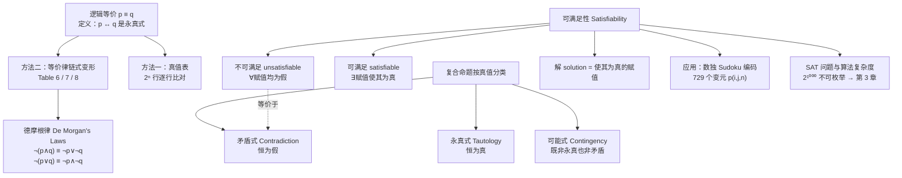

# C1.3 命题等价 Propositional Equivalences

> [!abstract] 本节地位
> 数学论证中最常见的一步就是**把一个陈述换成另一个真值相同的陈述**。这一节给出可以合法替换的全部规则（等价律表），并把"真值表暴力枚举"升级为"代数变形"。
> **本节是整章计算量最大、也最需要背的一节**：Table 6/7/8 三张表必须滚瓜烂熟，后面 §1.6 推理规则、§1.7 证明方法全建立在它们之上。

> [!warning] 📚 课堂进度提示
> **本节 §1 的"永真式 / 矛盾式 / 可能式"，老师已经在 Ch1.2 的课件里讲过了**（见 [[C1.2 命题逻辑的应用 Applications of Propositional Logic]] 的「课件补充 L4」）。
> 复习时可以把两处对照着看：那里有课件的三张小真值表和六道判断题，这里有更完整的理论展开（与可满足性、逻辑等价的关系）。
>
> **课件 Ch1.3（2026-09-08，29 张）已收到**，讲到了 §2–§5 的全部内容（等价定义、真值表法、Table 6/7/8 及其推导、德摩根律推广）。
> **§6 可满足性、§7 数独、§8 SAT 求解课堂上没有讲**，已标注为**（拓展）**。课件独有的推导方法见文末「📚 课件补充」。

> [!info] 标注说明
> 标有 **（拓展）** 或 **【拓展】** 的内容，是**课堂上没有讲到、由课件之外的教材内容延伸补充**的部分。
> 复习时可先掌握未标注的主干内容，行有余力再看拓展部分。


## 本节结构总览



---

## 1. 复合命题的三种分类 Tautology / Contradiction / Contingency

> [!important] 定义 1
> - **永真式 (tautology)**：无论其中命题变元取什么真值，都**永远为真**的复合命题。（中文教材也叫**重言式**）
> - **矛盾式 (contradiction)**：**永远为假**的复合命题。
> - **可能式 (contingency)**：既不是永真式也不是矛盾式的复合命题。（中文也叫**可满足式/偶然式**）

**例 1**：只用一个命题变元就能造出永真式和矛盾式。

**TABLE 1 永真式与矛盾式的例子**

| $p$ | $\neg p$ | $p \vee \neg p$ | $p \wedge \neg p$ |
|:---:|:---:|:---:|:---:|
| T | F | **T** | **F** |
| F | T | **T** | **F** |

- $p \vee \neg p$ 恒为真 ⇒ **永真式**（哲学上称**排中律 law of excluded middle**）
- $p \wedge \neg p$ 恒为假 ⇒ **矛盾式**（哲学上称**矛盾律 law of contradiction**）

> [!note] 三者的关系（老师会画的图）
> ```mermaid
> graph LR
>     ALL["所有复合命题"] --> T["永真式<br/>Tautology<br/>2ⁿ 行全 T"]
>     ALL --> C["可能式<br/>Contingency<br/>有 T 有 F"]
>     ALL --> F["矛盾式<br/>Contradiction<br/>2ⁿ 行全 F"]
> ```
> 三类**互斥且穷尽**。判断方法就是看真值表最后一列：全 T、全 F、还是混合。
>
> **重要关系（习题 60）**：
> - $A$ 是**永真式** $\iff$ $\neg A$ 是**矛盾式**（= 不可满足）
> - $A$ 是**不可满足** $\iff$ $\neg A$ 是**永真式**
> 这条关系是"证明永真"与"证明不可满足"两类问题互相转化的桥梁，SAT solver 就是靠它来做**定理证明**的：想证明 $A$ 是永真式，就让求解器去证 $\neg A$ 不可满足。

---

## 2. 逻辑等价 Logical Equivalence

> [!important] 定义 2
> **复合命题** $p$ 与 $q$ 称为**逻辑等价的 (logically equivalent)**，如果 $p \leftrightarrow q$ 是**永真式**。
> 记号：$p \equiv q$。

> [!warning] 课本明确给出的 Remark（考试爱考概念辨析）
> **$\equiv$ 不是逻辑联结词！**
> - $p \leftrightarrow q$ 是一个**复合命题**，有真值（可真可假）。
> - $p \equiv q$ **不是**复合命题，而是一个**关于**这两个命题的**断言**——断言"$p \leftrightarrow q$ 是永真式"。它是**元语言 (metalanguage)** 层面的陈述。
> - 有些书用 $\Leftrightarrow$ 代替 $\equiv$。
>
> 类比：$x + 0 = x$ 中的 "$=$" 和一个方程 $x + 1 = 3$ 中的 "$=$" 层次不同。前者是恒等式（对所有 $x$ 成立的断言），后者是条件等式。$\equiv$ 相当于前者。

**判定方法一：真值表。** $p \equiv q$ 当且仅当真值表中 $p$ 列与 $q$ 列**逐行完全一致**。

### 例 2：德摩根律之一

证明 $\neg(p \vee q) \equiv \neg p \wedge \neg q$。

**TABLE 3**

| $p$ | $q$ | $p \vee q$ | $\neg(p \vee q)$ | $\neg p$ | $\neg q$ | $\neg p \wedge \neg q$ |
| :-: | :-: | :--------: | :--------------: | :------: | :------: | :--------------------: |
|  T  |  T  |     T      |      **F**       |    F     |    F     |         **F**          |
|  T  |  F  |     T      |      **F**       |    F     |    T     |         **F**          |
|  F  |  T  |     T      |      **F**       |    T     |    F     |         **F**          |
|  F  |  F  |     F      |      **T**       |    T     |    T     |         **T**          |

第 4 列与第 7 列完全一致 ⇒ $\neg(p \vee q) \leftrightarrow (\neg p \wedge \neg q)$ 是永真式 ⇒ 两者逻辑等价。∎

**TABLE 2 德摩根律 De Morgan's Laws**
$$\neg(p \wedge q) \equiv \neg p \vee \neg q$$
$$\neg(p \vee q) \equiv \neg p \wedge \neg q$$

得名于 19 世纪中叶的英国数学家 **Augustus De Morgan（奥古斯都·德摩根）**。

> [!important] 德摩根律的口诀（**本章最常用的等价律**）
> **"取反进括号，与或要互换。"**
> 否定一个合取 ⇒ 变成两个否定的**析取**；否定一个析取 ⇒ 变成两个否定的**合取**。
> 课本页边特别提醒：**"When using De Morgan's laws, remember to change the logical connective after you negate."**（用德摩根律时，别忘了取反之后要**换联结词**。）
> 最常见的错误就是写成 $\neg(p \wedge q) \equiv \neg p \wedge \neg q$——**联结词没换**。
### 推广到 n 个命题

\($\neg\left(\bigwedge_{i=1}^n P_i\right) \iff \bigvee_{i=1}^n \neg P_i$\)

> 多个命题合取的否定 ⇔ 各个命题否定的析取

\($\neg\left(\bigvee_{i=1}^n P_i\right) \iff \bigwedge_{i=1}^n \neg P_i$\)

> 多个命题析取的否定 ⇔ 各个命题否定的合取

证明的话，只需一直用二元的德摩根定律展开就好了，一次拿出来一个。

### 例 3：条件语句的析取形式（**极其重要**）

==证明 $p \to q \equiv \neg p \vee q$==。

**TABLE 4**

| $p$ | $q$ | $\neg p$ | $\neg p \vee q$ | $p \to q$ |
|:-:|:-:|:-:|:-:|:-:|
| T | T | F | **T** | **T** |
| T | F | F | **F** | **F** |
| F | T | T | **T** | **T** |
| F | F | T | **T** | **T** |

两列一致 ⇒ 等价。∎

> [!important] 这一条是全章使用频率最高的等价式
> $$\boxed{p \to q \equiv \neg p \vee q}$$
> 它是**消灭箭头**的唯一入口。凡是遇到含 $\to$ 的化简题、求否定题、判可满足题，**第一步几乎总是用它把 $\to$ 换成 $\vee$**，之后就可以自由使用德摩根律、分配律等纯 $\wedge,\vee,\neg$ 的规则。
>
> **直接推论**：
> $$\neg(p \to q) \equiv \neg(\neg p \vee q) \equiv p \wedge \neg q$$
> **"条件语句的否定 = 前件真 且 后件假"**——正好对应真值表里唯一为假的那一行。**期末的"求否定"大题必考这一条。**

### 例 4：分配律

证明 $p \vee (q \wedge r) \equiv (p \vee q) \wedge (p \vee r)$（**析取对合取的分配律**）。

三个变元 ⇒ $2^3 = 8$ 行。

**TABLE 5**

| $p$ | $q$ | $r$ | $q \wedge r$ | $p \vee (q \wedge r)$ | $p \vee q$ | $p \vee r$ | $(p \vee q) \wedge (p \vee r)$ |
|:-:|:-:|:-:|:-:|:-:|:-:|:-:|:-:|
| T | T | T | T | **T** | T | T | **T** |
| T | T | F | F | **T** | T | T | **T** |
| T | F | T | F | **T** | T | T | **T** |
| T | F | F | F | **T** | T | T | **T** |
| F | T | T | T | **T** | T | T | **T** |
| F | T | F | F | **F** | T | F | **F** |
| F | F | T | F | **F** | F | T | **F** |
| F | F | F | F | **F** | F | F | **F** |

两列一致 ⇒ 等价。∎

> [!note] 三变元真值表的书写顺序（课本明确规定，务必照做）
> 八行依次为：**TTT, TTF, TFT, TFF, FTT, FTF, FFT, FFF**。
> 规律：$p$ 列前 4 行 T 后 4 行 F；$q$ 列以 2 为周期；$r$ 列以 1 为周期交替。
> 每增加一个变元行数翻倍：4 变元 16 行，$n$ 变元 $2^n$ 行。**照这个顺序写就不会漏行。**

> [!warning] 注意与算术的差别
> 算术中 $a \times (b + c) = ab + ac$ 成立，但 $a + (b \times c) \ne (a+b)(a+c)$。
> 逻辑中 **$\wedge$ 对 $\vee$、$\vee$ 对 $\wedge$ 两个方向的分配律都成立**：
> $$p \vee (q \wedge r) \equiv (p \vee q) \wedge (p \vee r)$$
> $$p \wedge (q \vee r) \equiv (p \wedge q) \vee (p \wedge r)$$
> 这是布尔代数比数域代数"更对称"的地方，也是**对偶性 (duality)**（见习题 34–39）的来源。

---

## 3. 三张等价律表（**必背**）

其中 $\mathbf{T}$ 表示恒真的复合命题，$\mathbf{F}$ 表示恒假的复合命题。

### TABLE 6 基本逻辑等价律 Logical Equivalences

| 等价式 Equivalence                                                                                                            | 名称 Name             | 中文                                       |
| -------------------------------------------------------------------------------------------------------------------------- | ------------------- | ---------------------------------------- |
| $p \wedge \mathbf{T} \equiv p$ <br> $p \vee \mathbf{F} \equiv p$                                                           | Identity laws       | **同一律**                                  |
| $p \vee \mathbf{T} \equiv \mathbf{T}$ <br> $p \wedge \mathbf{F} \equiv \mathbf{F}$                                         | Domination laws     | **支配律 / 零律**                             |
| $p \vee p \equiv p$ <br> $p \wedge p \equiv p$                                                                             | Idempotent laws     | **幂等律**                                  |
| $\neg(\neg p) \equiv p$                                                                                                    | Double negation law | **双重否定律**                                |
| $p \vee q \equiv q \vee p$ <br> $p \wedge q \equiv q \wedge p$                                                             | Commutative laws    | **交换律**                                  |
| $(p \vee q) \vee r \equiv p \vee (q \vee r)$ <br> $(p \wedge q) \wedge r \equiv p \wedge (q \wedge r)$                     | Associative laws    | **结合律**                                  |
| $p \vee (q \wedge r) \equiv (p \vee q) \wedge (p \vee r)$ <br> $p \wedge (q \vee r) \equiv (p \wedge q) \vee (p \wedge r)$ | Distributive laws   | **分配律**注意不能简单将and当成乘号！当括号内外的符号不同的时候，有分配律 |
| $\neg(p \wedge q) \equiv \neg p \vee \neg q$ <br> $\neg(p \vee q) \equiv \neg p \wedge \neg q$                             | De Morgan's laws    | **德摩根律**                                 |
| $p \vee (p \wedge q) \equiv p$ <br> $p \wedge (p \vee q) \equiv p$                                                         | Absorption laws     | **吸收律**                                  |
| $p \vee \neg p \equiv \mathbf{T}$ <br> $p \wedge \neg p \equiv \mathbf{F}$                                                 | Negation laws       | **否定律 / 互补律**                            |

> [!note] 课本页边注（值得记住的知识地图）
> Table 6 中的恒等式是**布尔代数恒等式**（§12.1 Table 5）的特例；同时它们与**集合恒等式**（§2.2 Table 1）一一对应：
> $$\wedge \leftrightarrow \cap,\qquad \vee \leftrightarrow \cup,\qquad \neg \leftrightarrow \overline{\phantom{A}},\qquad \mathbf{T} \leftrightarrow U,\qquad \mathbf{F} \leftrightarrow \varnothing$$
> **学一遍，用三次**：逻辑、集合、布尔代数其实是同一套代数结构的三种解释。第 2 章学集合恒等式时不必重新背，直接翻译过来即可。

### TABLE 7 含条件语句的等价律

| 等价式                                                    | 记忆要点                      |
| ------------------------------------------------------ | ------------------------- |
| $p \to q \equiv \neg p \vee q$                         | ⭐ **消箭头的核心公式**            |
| $p \to q \equiv \neg q \to \neg p$                     | ⭐ **逆否等价 contrapositive** |
| $p \vee q \equiv \neg p \to q$                         | 析取转条件                     |
| $p \wedge q \equiv \neg(p \to \neg q)$                 | 合取转条件                     |
| $\neg(p \to q) \equiv p \wedge \neg q$                 | ⭐ **条件语句的否定**             |
| $(p \to q) \wedge (p \to r) \equiv p \to (q \wedge r)$ | 同前件，后件合取                  |
| $(p \to r) \wedge (q \to r) \equiv (p \vee q) \to r$   | 同后件，前件**析取**（注意不是合取！）     |
| $(p \to q) \vee (p \to r) \equiv p \to (q \vee r)$     | 同前件，后件析取                  |
| $(p \to r) \vee (q \to r) \equiv (p \wedge q) \to r$   | 同后件，前件**合取**              |

> [!warning] 最后四条的记忆陷阱
> 注意后两组：**前件位置的连接词会翻转**。
> $$(p \to r) \wedge (q \to r) \equiv (p \vee q) \to r \quad \text{（∧ 变 ∨）}$$
> $$(p \to r) \vee (q \to r) \equiv (p \wedge q) \to r \quad \text{（∨ 变 ∧）}$$
> **为什么？** 用 $p \to r \equiv \neg p \vee r$ 展开第一条：
> $(\neg p \vee r) \wedge (\neg q \vee r) \equiv (\neg p \wedge \neg q) \vee r$（分配律）$\equiv \neg(p \vee q) \vee r$（德摩根）$\equiv (p \vee q) \to r$。∎
> **前件在箭头左边，相当于被否定了一次**，所以德摩根律在这里把 $\wedge$ 翻成了 $\vee$。理解了这一点就不用死记。

### TABLE 8 含双条件语句的等价律

| 等价式 | 说明 |
|---|---|
| $p \leftrightarrow q \equiv (p \to q) \wedge (q \to p)$ | ⭐ **双条件的定义式**，证"当且仅当"就是证两个方向 |
| $p \leftrightarrow q \equiv \neg p \leftrightarrow \neg q$ | 两边同时取反，等价关系不变 |
| $p \leftrightarrow q \equiv (p \wedge q) \vee (\neg p \wedge \neg q)$ | "同真或同假"——双条件的 DNF 形式 |
| $\neg(p \leftrightarrow q) \equiv p \leftrightarrow \neg q$ | 双条件的否定；也等于 $p \oplus q$ |

### 结合律的意义与德摩根律的推广

> [!note] 为什么要单独强调结合律
> **结合律保证了 $p \vee q \vee r$ 这种不加括号的写法是有定义的 (well defined)**——先算 $(p \vee q)$ 再与 $r$ 析取，和先算 $(q \vee r)$ 再与 $p$ 析取，结果一样。
> 推广后，$p_1 \vee p_2 \vee \cdots \vee p_n$ 和 $p_1 \wedge p_2 \wedge \cdots \wedge p_n$ 对任意 $n$ 都是良定义的。
> **反例警告**：并非所有联结词都满足结合律。$\to$ 就**不满足**（习题 31）；NAND 也**不满足**（习题 54）。所以 $p \to q \to r$ 这种写法是**有歧义的**，绝不能写。

**德摩根律的推广形式**：
$$\neg(p_1 \vee p_2 \vee \cdots \vee p_n) \equiv (\neg p_1 \wedge \neg p_2 \wedge \cdots \wedge \neg p_n)$$
$$\neg(p_1 \wedge p_2 \wedge \cdots \wedge p_n) \equiv (\neg p_1 \vee \neg p_2 \vee \cdots \vee \neg p_n)$$

**大算符记号 (big operator notation)**：
$$\bigvee_{j=1}^{n} p_j := p_1 \vee p_2 \vee \cdots \vee p_n,\qquad \bigwedge_{j=1}^{n} p_j := p_1 \wedge p_2 \wedge \cdots \wedge p_n$$

于是推广的德摩根律可简写为
$$\neg\left(\bigvee_{j=1}^{n} p_j\right) \equiv \bigwedge_{j=1}^{n} \neg p_j,\qquad \neg\left(\bigwedge_{j=1}^{n} p_j\right) \equiv \bigvee_{j=1}^{n} \neg p_j$$

> [!note] 这些恒等式怎么证？
> 课本说明：证明方法在 **§5.1 数学归纳法**给出。理由是它们对**任意 $n$** 成立，真值表方法（针对固定变元个数）根本用不了，必须对 $n$ 做归纳。这是本章埋下的又一颗种子。
> 记号上，$\bigvee$ 类比 $\sum$（求和），$\bigwedge$ 类比 $\prod$（求积）。这个类比在后面数独编码中会大量出现。


---
**注意！推导题要把一般的公式或定律名字写在一侧**
## 4. 使用德摩根律 Using De Morgan's Laws

**例 5**：用德摩根律写出下列陈述的否定。

**(a)** "Miguel has a cellphone **and** he has a laptop computer."
设 $p$ = "Miguel 有手机"，$q$ = "Miguel 有笔记本电脑"。原句为 $p \wedge q$。
$$\neg(p \wedge q) \equiv \neg p \vee \neg q$$
否定为："**Miguel does not have a cellphone or he does not have a laptop computer.**"（Miguel 没有手机，**或者**没有笔记本电脑。）

**(b)** "Heather will go to the concert **or** Steve will go to the concert."
设 $r$ = "Heather 去音乐会"，$s$ = "Steve 去音乐会"。原句为 $r \vee s$。
$$\neg(r \vee s) \equiv \neg r \wedge \neg s$$
否定为："**Heather will not go to the concert and Steve will not go to the concert.**"（两人都不去。）

> [!warning] 中文语感陷阱
> (a) 的否定绝不是"Miguel 手机和电脑都没有"——那是 $\neg p \wedge \neg q$，比真正的否定强得多。
> **"并非（A 且 B）"只意味着"至少有一个不成立"**，可能是 A 不成立、B 不成立、或两个都不成立。
> 生活中说"他们不是又高又壮"，逻辑上只是说"要么不高，要么不壮"。这个区分在写数学证明的反设时至关重要。

---

## 5. 构造新的逻辑等价 Constructing New Logical Equivalences

> [!important] 两条底层原理
> **① 替换原理 (substitution)**：复合命题中的**某个子命题**可以被与它**逻辑等价**的命题替换，而不改变整个复合命题的真值。
> **② 传递性 (transitivity)**：若 $p \equiv q$ 且 $q \equiv r$，则 $p \equiv r$（习题 56）。
>
> 有了这两条，就可以像做代数变形一样，**一步用一条等价律**，从起点连锁推到终点。
> **答题格式：每一步右侧必须注明用的是哪条律。** 不写理由的变形链会被扣分。

### 例 6

证明 $\neg(p \to q) \equiv p \wedge \neg q$。

$$
\begin{aligned}
\neg(p \to q) &\equiv \neg(\neg p \vee q) && \text{由例 3（}p \to q \equiv \neg p \vee q\text{）}\\
&\equiv \neg(\neg p) \wedge \neg q && \text{第二条德摩根律}\\
&\equiv p \wedge \neg q && \text{双重否定律}
\end{aligned}
$$
∎

> [!note] 为什么不用真值表
> 课本坦言这题用真值表也很容易。之所以演示等价链，是因为**当变元很多时真值表不可行**（$n$ 变元 $2^n$ 行），而等价变形的步数与变元个数无关。**方法比结论重要。**

### 例 7

证明 $\neg(p \vee (\neg p \wedge q)) \equiv \neg p \wedge \neg q$。

$$
\begin{aligned}
\neg\big(p \vee (\neg p \wedge q)\big)
&\equiv \neg p \wedge \neg(\neg p \wedge q) && \text{第二条德摩根律}\\
&\equiv \neg p \wedge \big[\neg(\neg p) \vee \neg q\big] && \text{第一条德摩根律}\\
&\equiv \neg p \wedge (p \vee \neg q) && \text{双重否定律}\\
&\equiv (\neg p \wedge p) \vee (\neg p \wedge \neg q) && \text{第二条分配律}\\
&\equiv \mathbf{F} \vee (\neg p \wedge \neg q) && \text{因为 } \neg p \wedge p \equiv \mathbf{F}\\
&\equiv (\neg p \wedge \neg q) \vee \mathbf{F} && \text{析取的交换律}\\
&\equiv \neg p \wedge \neg q && \mathbf{F} \text{ 的同一律}
\end{aligned}
$$
∎

> [!note] 这个七步链子里藏着的解题套路
> 1. **先把否定往里推**（连用德摩根律 + 双重否定），直到 $\neg$ 只作用在单个变元上——这个形式叫**否定范式 (NNF, negation normal form)**。
> 2. **再用分配律展开**，制造出 $p \wedge \neg p$ 这类可以塌缩成 $\mathbf{F}$ 的项。
> 3. **最后用同一律/支配律清理** $\mathbf{T}$、$\mathbf{F}$。
>
> **这三步顺序几乎能解掉所有化简题**，考试时按这个套路走。

### 例 8

证明 $(p \wedge q) \to (p \vee q)$ 是**永真式**。

**方法**：用等价变形证明它 $\equiv \mathbf{T}$。

$$
\begin{aligned}
(p \wedge q) \to (p \vee q)
&\equiv \neg(p \wedge q) \vee (p \vee q) && \text{由例 3}\\
&\equiv (\neg p \vee \neg q) \vee (p \vee q) && \text{第一条德摩根律}\\
&\equiv (\neg p \vee p) \vee (\neg q \vee q) && \text{析取的结合律与交换律}\\
&\equiv \mathbf{T} \vee \mathbf{T} && \text{由例 1 与交换律}\\
&\equiv \mathbf{T} && \text{支配律}
\end{aligned}
$$
∎

> [!important] 证明永真式的三条通用路线
> 1. **真值表**：最后一列全 T。（变元少时最稳）
> 2. **等价变形化到 $\mathbf{T}$**（本例）。
> 3. **反证/直接论证**：假设它为假，推出矛盾。对条件语句 $A \to B$ 尤其好用——**假设前件真、后件假，导出矛盾即可**（习题 11、12 就是要求用这个方法）。

---

## 6. 命题可满足性 Propositional Satisfiability（拓展）

> [!important] 定义（可满足 / 不可满足 / 解）
> - 一个复合命题是**可满足的 (satisfiable)**，如果**存在**一组变元真值赋值使它为真。
> - 若不存在这样的赋值（即对**所有**赋值都为假），则称它**不可满足 (unsatisfiable)**。
> - 使复合命题为真的那组特定赋值，称为该可满足性问题的一个**解 (solution)**。

> [!important] 三个概念的等价刻画（**必须能互相翻译**）
> | 说法 | 等价说法 |
> |---|---|
> | $A$ 可满足 | $\neg A$ **不是**永真式 |
> | $A$ 不可满足 | $A$ 是矛盾式 $\iff$ $\neg A$ 是**永真式** |
> | $A$ 是永真式 | $\neg A$ 不可满足 |
> | $A$ 是可能式 | $A$ 与 $\neg A$ **都**可满足 |

> [!warning] 证明的不对称性（课本明确指出）
> - **证明可满足很容易**：找到**一组**使其为真的赋值即可（给出证据）。
> - **证明不可满足很难**：必须说明**每一组**赋值都使它为假。
>
> 这种"验证容易、搜索难"的不对称，正是 **NP 类问题**的本质特征。

### 例 9（不用真值表判可满足性）

判断下列三个复合命题是否可满足：
1. $(p \vee \neg q) \wedge (q \vee \neg r) \wedge (r \vee \neg p)$
2. $(p \vee q \vee r) \wedge (\neg p \vee \neg q \vee \neg r)$
3. $(p \vee \neg q) \wedge (q \vee \neg r) \wedge (r \vee \neg p) \wedge (p \vee q \vee r) \wedge (\neg p \vee \neg q \vee \neg r)$

**解**（用 §1.1 习题 40、41 的结论）：

**① $(p \vee \neg q) \wedge (q \vee \neg r) \wedge (r \vee \neg p)$**
由 §1.1 习题 40：这个式子为真 $\iff$ **$p, q, r$ 三者真值相同**。
存在这样的赋值（如 $p=q=r=T$）⇒ **可满足 (satisfiable)**。

**② $(p \vee q \vee r) \wedge (\neg p \vee \neg q \vee \neg r)$**
由 §1.1 习题 41：为真 $\iff$ **$p,q,r$ 中至少一个为真且至少一个为假**。
存在（如 $p=T, q=F, r=F$）⇒ **可满足**。

**③ 两者的合取**
要使 ③ 为真，① 和 ② 必须**同时**为真：
- ① 要求三个变元**真值全相同**；
- ② 要求**至少一真且至少一假**（即真值**不全相同**）。

**两个条件互相矛盾** ⇒ 不存在使 ③ 为真的赋值 ⇒ **不可满足 (unsatisfiable)**。∎

> [!note] 这道题演示的技巧
> **不要一上来就列 8 行真值表**——先把每个合取块的"为真条件"**用自然语言刻画出来**，再看这些条件能否共存。合取式的可满足性 = 各块条件的**相容性**。
> 这正是 SAT solver 中**子句 (clause) 分析**的雏形：每个 $(\ldots \vee \ldots \vee \ldots)$ 叫一个**子句**，整个式子是子句的合取，这种形式叫**合取范式 (CNF, conjunctive normal form)**。所有现代 SAT 求解器的输入都是 CNF。

---

## 7. 可满足性的应用：数独 Sudoku（拓展）

> [!important] 数独规则
> **数独谜题 (Sudoku puzzle)** 用一个 $9 \times 9$ 网格表示，网格由九个 $3 \times 3$ 的**子网格（块 blocks）**组成。
> 81 个格子中的一部分被预先填上 $1,2,\dots,9$ 中的某个数，称为**给定值 (givens)**，其余为空。
> 解谜要求：给每个空格填一个数，使得**每一行、每一列、每一个 $3\times3$ 块都恰好包含 1 到 9 这九个数字各一次**。

![[C1-图4-9x9数独谜题.png]]

用文本重现 FIGURE 1 的谜题（`.` 表示空格，粗线表示 $3\times3$ 块的边界）：

| | 1 | 2 | 3 | ‖ | 4 | 5 | 6 | ‖ | 7 | 8 | 9 |
|---|---|---|---|---|---|---|---|---|---|---|---|
| **1** | . | 2 | 9 | ‖ | . | . | . | ‖ | 4 | . | . |
| **2** | . | . | . | ‖ | 5 | . | . | ‖ | 1 | . | . |
| **3** | . | 4 | . | ‖ | . | . | . | ‖ | . | . | . |
| ═ | ═ | ═ | ═ | | ═ | ═ | ═ | | ═ | ═ | ═ |
| **4** | . | . | . | ‖ | . | 4 | 2 | ‖ | . | . | . |
| **5** | 6 | . | . | ‖ | . | . | . | ‖ | . | 7 | . |
| **6** | 5 | . | . | ‖ | . | . | . | ‖ | . | . | . |
| ═ | ═ | ═ | ═ | | ═ | ═ | ═ | | ═ | ═ | ═ |
| **7** | 7 | . | . | ‖ | 3 | . | . | ‖ | . | . | 5 |
| **8** | . | 1 | . | ‖ | . | 9 | . | ‖ | . | . | . |
| **9** | . | . | . | ‖ | . | . | . | ‖ | . | 6 | . |

> [!note] 数独的历史（课本 Links 栏）
> - 数独在 **1980 年代**引入日本后开始流行，花了 20 年才走向世界，到 **2005 年**成为全球风潮。
> - "**数独**"是日语 *suuji wa dokushin ni kagiru* 的缩写，意为"**数字必须保持单身（唯一）**"。
> - 现代数独实际上是 **1970 年代后期由一位美国谜题设计师**设计的。更早的雏形可追溯到 **1890 年代法国报纸**上的类似（但不完全相同）的谜题。
> - **推广**：数独不必是 $9 \times 9$。对任意正整数 $n$，可以做 $n^2 \times n^2$ 的网格，由 $n^2$ 个 $n \times n$ 子网格组成。（习题 63 就是 $4 \times 4$ 的情形，$n = 2$。）

> [!note] 娱乐用数独的两个额外性质
> 1. **解唯一**（exactly one solution）；
> 2. **可以纯靠推理求解**，不需要枚举所有可能的填法。
>
> **课本给的推理示例**（老师一定会带着做一遍）：在 FIGURE 1 中，数字 **4 必须出现在第 2 行的某一格**。是哪一格？
> - 4 不能出现在第 2 行的**前三格**，因为它所在的左上块里已经有一个 4（第 3 行第 2 列）。
> - 4 不能出现在第 2 行的**后三格**，因为右上块里已经有一个 4（第 1 行第 7 列）。
> - 剩下中间三格（第 4、5、6 列）。4 不能在**第 5 列**，因为第 5 列在第 4 行已经有一个 4。
> - 第 4 列已被 5 占据。
> - ⇒ **4 必须出现在第 2 行第 6 格。**
>
> 这种推理叫**唯一候选法**，是数独求解的基本手段之一。

### 把数独编码成可满足性问题

> [!important] 编码方案
> 令 $p(i,j,n)$ 表示命题："**数字 $n$ 位于第 $i$ 行第 $j$ 列的格子中**"，其中 $i, j, n$ 都取 $1$ 到 $9$。
> 于是共有 $9 \times 9 \times 9 = \boxed{729}$ 个命题变元。
>
> 例：FIGURE 1 中第 5 行第 1 列的给定值是 6，故 $p(5,1,6)$ 为**真**，而 $p(5,1,j)$ 对 $j = 2,3,\dots,9$ 均为**假**。

需要断言的五组条件：

**① 给定值 (givens)**
对每个已填格子（第 $i$ 行第 $j$ 列的给定值为 $n$），断言 $p(i,j,n)$ 为真。

**② 每一行都包含每一个数字**
$$\bigwedge_{i=1}^{9} \bigwedge_{n=1}^{9} \bigvee_{j=1}^{9} p(i,j,n)$$

> [!note] 这个三重量词的构造过程（课本逐层解释，考试可能默写）
> - 最内层 $\bigvee_{j=1}^{9} p(i,j,n)$：断言"**第 $i$ 行的某一列含有数字 $n$**"（沿列遍历，只要有一处成立即可 ⇒ 用 $\vee$）。
> - 中间层 $\bigwedge_{n=1}^{9} \bigvee_{j=1}^{9} p(i,j,n)$：断言"**第 $i$ 行含有全部九个数字**"（对每个 $n$ 都要成立 ⇒ 用 $\wedge$）。
> - 最外层再对 $i$ 取合取：断言"**每一行都含有每一个数字**"。
>
> **口诀：存在用 $\bigvee$，全部用 $\bigwedge$。** 这也是 §1.4 中 $\exists$ 与 $\forall$ 的预演——事实上，$\bigvee$ 就是有限域上的 $\exists$，$\bigwedge$ 就是有限域上的 $\forall$。

**③ 每一列都包含每一个数字**
$$\bigwedge_{j=1}^{9} \bigwedge_{n=1}^{9} \bigvee_{i=1}^{9} p(i,j,n)$$
（与 ② 结构相同，只是把对 $i$ 和 $j$ 的角色对调。）

**④ 九个 $3\times3$ 块中每一个都包含每一个数字**
$$\bigwedge_{r=0}^{2} \bigwedge_{s=0}^{2} \bigwedge_{n=1}^{9} \bigvee_{i=1}^{3} \bigvee_{j=1}^{3} p(3r+i,\; 3s+j,\; n)$$

> [!warning] 课本页边特别提示
> "**It is tricky setting up the two inner indices so that all nine cells in each square block are examined.**"（把两个内层下标设置成能遍历每个方块内全部九个格子，是有技巧的。）
> **理解方法**：$r, s \in \{0,1,2\}$ 选定是哪一个块（左上块 $r=s=0$，右下块 $r=s=2$）；$i, j \in \{1,2,3\}$ 在块内定位。
> 于是 $3r + i$ 遍历 $\{1,2,3\}$（$r=0$）、$\{4,5,6\}$（$r=1$）、$\{7,8,9\}$（$r=2$）——正好是三个行区间。列同理。
> **验算**：$r=1, s=2, i=2, j=3$ ⇒ 第 $3\cdot1+2 = 5$ 行，第 $3\cdot2+3 = 9$ 列 ⇒ 中右块的中间行最右格。✓

**⑤ 每个格子最多含一个数字**
对所有 $n, n', i, j$（各自取 1 到 9）且 $n \ne n'$，取
$$p(i,j,n) \to \neg p(i,j,n')$$
的合取。

> [!note] 为什么 ⑤ 是必要的，为什么不需要"每格至少一个数字"
> - 没有 ⑤ 的话，求解器可能给同一个格子同时赋两个数字（$p(1,1,3)$ 和 $p(1,1,7)$ 都为真），这在编码上不违反 ②③④。
> - **"每格至少一个数字"其实是 ②③④ 的推论**：如果每行都含全部九个数字，而一行只有九个格子，那么每格必须恰好有一个数字（鸽巢原理，§6.2）。所以课本没有单独列出——但**习题 64 专门让你写出这条断言**，写法是 $\bigwedge_{i=1}^{9}\bigwedge_{j=1}^{9}\bigvee_{n=1}^{9} p(i,j,n)$。

**求解**：把 ①–⑤ 全部合取起来，寻找使这个巨大合取式为真的 729 个变元的赋值。这样一组赋值就对应数独的一个解。
课本指出：用这种方法，**特定的数独谜题可以在 10 毫秒以内被求解**。当然还有很多其他的计算机求解途径。

---

## 8. 求解可满足性问题 Solving Satisfiability Problems（拓展）

> [!important] 规模爆炸（本节最该有的直觉）
> - 真值表可以判定可满足性（或等价地，判定其否定是否为永真式）。
> - 但 **20 个变元**就有 $2^{20} = 1{,}048{,}576$ 行——手算不可能，必须用计算机。
> - **1000 个变元**就有 $2^{1000}$ 种组合（一个 300 多位的十进制数）——**即使用计算机，几万亿年也算不完**。
> - 而实际应用中经常出现**成百上千甚至上百万个变元**的可满足性问题。

> [!important] 课本给出的关键论断
> **"No procedure is known that a computer can follow to determine in a reasonable amount of time whether an arbitrary compound proposition in such a large number of variables is satisfiable."**
> （目前**不存在**已知的、能在合理时间内判定任意大规模复合命题是否可满足的计算机算法。）
>
> 但是——针对**实际应用中出现的特定类型**的复合命题（如数独），已经开发出了很有效的求解方法。已有许多实用的 SAT 求解程序。
> **§3 章讨论算法时会进一步说明命题可满足性问题在算法复杂度研究中的重要作用。**

> [!note] 展开：SAT 与 P vs NP（老师一定会提，也是你 AI 方向该知道的）
> - **SAT 问题**是历史上第一个被证明为 **NP-完全 (NP-complete)** 的问题（**Cook–Levin 定理**，1971）。
> - "NP-完全"意味着：如果 SAT 存在多项式时间算法，那么**所有** NP 问题都存在多项式时间算法，即 **P = NP**。这是**克雷数学研究所七大千禧年难题**之一，悬赏一百万美元。
> - 尽管理论上最坏情况指数级，**现代 SAT 求解器**（基于 DPLL 算法 + CDCL 冲突驱动子句学习）在实践中能处理**上百万变元**的工业实例。它们被用于：芯片形式化验证、软件模型检测、编译器优化、自动规划、密码分析。
> - **与 AI 的关系**：符号 AI 的"推理"很大程度上就是 SAT/SMT 求解；而神经网络的验证（证明一个网络对某类输入不会误分类）也被规约成 SMT 问题。理解 SAT，就理解了"可微分的学习"之外那条"离散的推理"路线。

---

# 📚 课件补充 Lecture Slides（Dr. 欧士琪 Ch1.3）

> [!info] 课件信息
> **Discrete Mathematics · Chapter 1: Logic and Proof · 1.3 Propositional Equivalences**
> 主讲：**Dr Shiqi (Shawn) Ou, 欧士琪**，South China University of Technology　授课日期：**2026 年 9 月 8 日**　共 **29 张**
>
> **课件 Agenda（三条主线）**
> 1. **Logical Equivalences**（逻辑等价）
> 2. **Using De Morgan's Laws**（使用德摩根律）
> 3. **Constructing New Logical Equivalences**（构造新的逻辑等价）

> [!warning] ⚠️ 课件与教材的范围差异
> | 主题 | 教材 §1.3 | 课件 Ch1.3 | 说明 |
> |---|---|---|---|
> | 永真式/矛盾式/可能式 | §1.3 开头 | **已在 Ch1.2 讲过** | 见 [[C1.2 命题逻辑的应用 Applications of Propositional Logic]] L4 |
> | 逻辑等价定义与真值表法 | ✓ | ✓ | 一致 |
> | Table 6 十组基本等价律 | 只列表 | **每一组都配了真值表逐列验证** | ⭐ 课件更细 |
> | 德摩根律的推广 | 一笔带过 | **完整推导了两遍** | ⭐ 课件更细 |
> | Table 7 条件语句等价律（9 条） | 只列表 | **全部给出推导过程** | ⭐ 课件独有 |
> | Table 8 双条件等价律（4 条） | 只列表 | **全部给出推导过程** | ⭐ 课件独有 |
> | 可满足性 Satisfiability | ✓ | **未讲** | 本笔记 §6（拓展） |
> | 数独 SAT 编码 | ✓ | **未讲** | 本笔记 §7（拓展） |
> | SAT 求解与复杂度 | ✓ | **未讲** | 本笔记 §8（拓展） |

---

## L1. 真值表为什么不够用：课件给的具体数字（slide 7）

课件在讲完真值表法之后，专门用一张幻灯片说明它的**代价**：

> [!important] 课件原文（Characteristic of Truth Table）
> **设 $n$ 为变元个数，真值表的行数为 $2^n$。**
> **例：20 个变元 $\Rightarrow$ $2^{20} = 1{,}048{,}576$ 行。**
> **结论：Not efficient（不高效）。**
> 因此"除了真值表之外，我们还要引入 **a series of logical equivalences**（一系列逻辑等价律）"。

> [!note] 这张幻灯片的作用
> 它是整节课的**动机**：等价律不是为了炫技，而是因为**真值表在变元一多时根本算不完**。
> 记住 $2^{20} \approx 10^6$ 这个数量级——**每多一个变元，工作量翻一倍**。这也是 §8（拓展）里 SAT 问题为什么难的同一个原因。

---

## L2. ⭐ 老师的核心方法：**只背两条，其余全部推出来**（slide 22、25）

这是本次课件**最有价值、教材上没有的**内容。课件在列出 Table 7 与 Table 8 时，用红字写了同一句话：

> **"You only need to memorize this."（你只需要记住这一条。）**

分别指的是：

$$\boxed{P \to Q \equiv \neg P \vee Q} \qquad\text{和}\qquad \boxed{P \leftrightarrow Q \equiv (P\to Q)\wedge(Q\to P) \equiv (\neg P \vee Q)\wedge(\neg Q\vee P)}$$

其余七条条件等价律、三条双条件等价律，课件**当堂逐条推导**给大家看。

### L2.1 课件用的两个推导技巧

> [!important] 技巧一：**代换 Substitution**
> 要证形如 $P \to Q \equiv \neg Q \to \neg P$ 的式子，**令 $P = \neg S$、$Q = \neg T$**，把式子变形成已知的形状，再把 $S,T$ 换回来。
>
> **技巧二：`**` 和 `##` 记号**
> 课件用 `**` 标记"这一步用了 $P\to Q \equiv \neg P\vee Q$"，用 `##` 标记"这一步用了 $P\leftrightarrow Q\equiv(\neg P\vee Q)\wedge(\neg Q\vee P)$"。
> **答题时照抄这个习惯**：把最常用的那一两条单独标出来，其余写律名，步骤会非常清楚。

### L2.2 课件的完整推导（slide 23–24，逐条复原）

> [!example] ① $P\to Q \equiv \neg Q\to\neg P$（逆否律）
> 令 $P = \neg S$，$Q = \neg T$，则要证的左边成为 $\neg S \to \neg T$：
> $$\begin{aligned}
> P\to Q &\equiv \neg P\vee Q && \texttt{**}\\
> &\equiv \neg(\neg S)\vee\neg T && \text{代换}\\
> &\equiv S\vee\neg T && \text{双重否定律}\\
> &\equiv \neg T\vee S && \text{交换律}\\
> &\equiv T\to S && \texttt{**（反向用）}\\
> &\equiv \neg Q\to\neg P && \text{代换回去}
> \end{aligned}$$

> [!example] ② $P\vee Q \equiv \neg P\to Q$
> 令 $P = \neg S$：
> $$P\vee Q \equiv \neg S\vee Q \equiv S\to Q \equiv \neg P\to Q$$
> （中间一步就是 `**` 反过来用。）

> [!example] ③ $\neg(P\to Q)\equiv P\wedge\neg Q$
> $$\neg(P\to Q)\equiv\neg(\neg P\vee Q)\ \texttt{**}\ \equiv P\wedge\neg Q\ \text{（德摩根律 + 双重否定）}$$

> [!example] ④ $P\wedge Q \equiv \neg(P\to\neg Q)$
> $$P\wedge Q \equiv \neg(\neg P\vee\neg Q)\ \text{（德摩根律）}\ \equiv \neg(P\to\neg Q)\ \texttt{**}$$

> [!example] ⑤ $(P\to Q)\wedge(P\to R)\equiv P\to(Q\wedge R)$
> $$\begin{aligned}
> (P\to Q)\wedge(P\to R) &\equiv (\neg P\vee Q)\wedge(\neg P\vee R) && \texttt{**}\\
> &\equiv \neg P\vee(Q\wedge R) && \text{分配律}\\
> &\equiv P\to(Q\wedge R) && \texttt{**}
> \end{aligned}$$

> [!example] ⑥ $(P\to R)\wedge(Q\to R)\equiv(P\vee Q)\to R$
> $$\begin{aligned}
> (P\to R)\wedge(Q\to R) &\equiv(\neg P\vee R)\wedge(\neg Q\vee R) && \texttt{**}\\
> &\equiv(\neg P\wedge\neg Q)\vee R && \text{分配律}\\
> &\equiv\neg(P\vee Q)\vee R && \text{德摩根律}\\
> &\equiv(P\vee Q)\to R && \texttt{**}
> \end{aligned}$$

> [!example] ⑦ $(P\to Q)\vee(P\to R)\equiv P\to(Q\vee R)$
> $$\begin{aligned}
> (P\to Q)\vee(P\to R) &\equiv(\neg P\vee Q)\vee(\neg P\vee R) && \texttt{**}\\
> &\equiv\neg P\vee\neg P\vee Q\vee R && \text{结合律 + 交换律}\\
> &\equiv\neg P\vee(Q\vee R) && \text{幂等律}\\
> &\equiv P\to(Q\vee R) && \texttt{**}
> \end{aligned}$$
> **课件在这一步特别标出用了幂等律 $\neg P\vee\neg P\equiv\neg P$**——这是最容易卡住的一步。

> [!example] ⑧ $(P\to R)\vee(Q\to R)\equiv(P\wedge Q)\to R$
> $$\begin{aligned}
> (P\to R)\vee(Q\to R) &\equiv(\neg P\vee R)\vee(\neg Q\vee R) && \texttt{**}\\
> &\equiv(\neg P\vee\neg Q)\vee R && \text{结合律 + 幂等律}\\
> &\equiv\neg(P\wedge Q)\vee R && \text{德摩根律}\\
> &\equiv(P\wedge Q)\to R && \texttt{**}
> \end{aligned}$$

> [!note] 停一下，看看这八条推导的共同结构
> **每一条都是同一个三步套路**：
> 1. **用 `**` 把所有箭头消成 $\vee$**；
> 2. **在纯 $\wedge\vee\neg$ 的世界里用分配律 / 德摩根律 / 幂等律整理**；
> 3. **再用 `**` 把结果装回箭头。**
>
> 所以 Table 7 **根本不用背**——考场上现推，每条不超过四行。
> 这也解释了课件那句"只需要记住 $P\to Q\equiv\neg P\vee Q$"的来由：**它是进出"箭头世界"的唯一那扇门**。

### L2.3 双条件的三条推导（slide 26–28）

> [!example] ⑨ $P\leftrightarrow Q\equiv(P\wedge Q)\vee(\neg P\wedge\neg Q)$
> $$\begin{aligned}
> P\leftrightarrow Q &\equiv(\neg P\vee Q)\wedge(\neg Q\vee P) && \texttt{\#\#}\\
> &\equiv\bigl((\neg P\vee Q)\wedge\neg Q\bigr)\vee\bigl((\neg P\vee Q)\wedge P\bigr) && \text{分配律}\\
> &\equiv\bigl((\neg P\wedge\neg Q)\vee(Q\wedge\neg Q)\bigr)\vee\bigl((\neg P\wedge P)\vee(Q\wedge P)\bigr) && \text{分配律}\\
> &\equiv\bigl((\neg P\wedge\neg Q)\vee\mathbf F\bigr)\vee\bigl(\mathbf F\vee(Q\wedge P)\bigr) && \text{否定律}\\
> &\equiv(\neg P\wedge\neg Q)\vee(Q\wedge P) && \text{同一律}
> \end{aligned}$$

> [!example] ⑩ $P\leftrightarrow Q\equiv\neg P\leftrightarrow\neg Q$
> 令 $P=\neg S$，$Q=\neg T$：
> $$P\leftrightarrow Q\equiv(\neg P\vee Q)\wedge(\neg Q\vee P)\ \texttt{\#\#}\ \equiv(S\vee\neg T)\wedge(T\vee\neg S)\equiv S\leftrightarrow T\ \texttt{\#\#}\ \equiv\neg P\leftrightarrow\neg Q$$

> [!example] ⑪ $\neg(P\leftrightarrow Q)\equiv P\leftrightarrow\neg Q$
> $$\begin{aligned}
> \neg(P\leftrightarrow Q) &\equiv\neg\bigl((\neg P\vee Q)\wedge(\neg Q\vee P)\bigr) && \texttt{\#\#}\\
> &\equiv\neg(\neg P\vee Q)\vee\neg(\neg Q\vee P) && \text{德摩根律}\\
> &\equiv(P\wedge\neg Q)\vee(Q\wedge\neg P) && \text{德摩根律}\\
> &\equiv\cdots\equiv P\leftrightarrow\neg Q && \text{（分配律 + 否定律 + 同一律，同 ⑨ 的套路）}
> \end{aligned}$$
> **注意**：$(P\wedge\neg Q)\vee(\neg P\wedge Q)$ 正是 $P\oplus Q$ 的 DNF 形式，所以这条也说明 $\neg(P\leftrightarrow Q)\equiv P\oplus Q$。

---

## L3. 课件的两道课堂例题

> [!example] 例题一（slide 8）：$(p\to q)\vee(p\to r)\equiv p\to(q\vee r)$
> 课件**同时给了两种做法**，这是很好的对照：
>
> **做法 A（等价变形，课件左半边）**
> $$\begin{aligned}
> (p\to q)\vee(p\to r) &\equiv(\neg p\vee q)\vee(\neg p\vee r)\\
> &\equiv(\neg p\vee\neg p)\vee(q\vee r)\\
> &\equiv\neg p\vee(q\vee r)\\
> &\equiv p\to(q\vee r)
> \end{aligned}$$
>
> **做法 B（真值表，课件右半边）**：列 8 行，比对 $(p\to q)\vee(p\to r)$ 与 $p\to(q\vee r)$ 两列，**完全相同**。
>
> **要点**：考试若没指定方法，**优先用做法 A**——三行搞定，而真值表要写 8 行 6 列。

> [!example] 例题二（slide 5–6）：课件用真值表验证的两条
> **① $\neg p\vee q\equiv p\to q$**（4 行真值表，两列相同）
> **② $p\vee(q\wedge r)\equiv(p\vee q)\wedge(p\vee r)$**（8 行真值表，两列相同）
> 这两条后来都进了 Table 6 / Table 7，课件是**先用真值表验证、再收进表里**的顺序。

---

## L4. 德摩根律推广：课件的完整推导（slide 18–20）

教材只给结论，课件把推导写了两遍。**考试若要求"证明推广形式"，照抄这个过程即可。**

> [!important] 课件的推导（以 $\neg(p_1\vee p_2\vee\cdots\vee p_n)$ 为例）
> **第一步**：令 $q = p_2\vee\cdots\vee p_n$，于是
> $$\neg(p_1\vee p_2\vee\cdots\vee p_n)=\neg(p_1\vee q)$$
> **第二步**：用两个命题的德摩根律
> $$\neg(p_1\vee q)\equiv\neg p_1\wedge\neg q=\neg p_1\wedge\neg(p_2\vee\cdots\vee p_n)$$
> **第三步**：再令 $s = p_3\vee\cdots\vee p_n$，对 $\neg(p_2\vee s)$ 重复同样的动作
> $$\equiv\neg p_1\wedge\neg p_2\wedge\neg(p_3\vee\cdots\vee p_n)$$
> **第四步**：如此反复 $\cdots$ 最终得到
> $$\boxed{\neg(p_1\vee p_2\vee\cdots\vee p_n)\equiv\neg p_1\wedge\neg p_2\wedge\cdots\wedge\neg p_n}$$
> **同理**
> $$\boxed{\neg(p_1\wedge p_2\wedge\cdots\wedge p_n)\equiv\neg p_1\vee\neg p_2\vee\cdots\vee\neg p_n}$$

> [!note] 这个推导的名字
> 它的结构是"**把 $n$ 的情形化归到 $n-1$ 的情形，再反复化归**"——这正是**数学归纳法**（第 5 章）的雏形。
> 课件用的是"$\cdots$"省略号的非正式写法；到第 5 章学了归纳法之后，可以把同一个论证写成完全严格的形式。

---

---

# 🎤 课堂补充 Lecture Transcript（课堂录音转写稿）

> [!info] 来源
> 本节内容来自课堂录音转写稿 `transcript/1-8节课.txt`（第 4 节课）。
> 下面只收录**课件上没有、课堂上口头讲的**内容：答题规范、考试提示、比喻与口诀、课件勘误、以及师生问答。

---

## T1. ⭐⭐ 推导题的答题规范（本节课强调得最重的一件事）

老师在讲完等价律、进入 training 环节之前，花了整整几分钟专门讲答题格式。**这是全课最明确的一次得分点提示。**

> [!important] 课堂原话（整理）
> - **"你在期中考试或期末考试的时候，一定有推导题，这个毋庸置疑——这个太好出试卷了。"**
> - **"推导的每一个步骤，你必须要写清楚你用的是什么定律。"**
> - **"如果你记不住那些名字（摩根肯定是人名，我都记不住），没问题——你可以把这个定律的公式写在旁边，这样我就知道你是什么意思了。"**
>
> **结论：每一步右边要么写律名（Identity Law / De Morgan's Laws …），要么写该律的等式。两者任选其一，但不能不写。**

> [!warning] 两个容易被忽略的细节
> **① 题目里的变量未必是 $p,q,r$。**
> 老师说往年考题用的是 $x,y,z$："你用 $p,q$ 也可以，$x,y,z$ 也可以，**但你总得写个公式在那儿**。"
> **② $\mathbf T$ 和 $\mathbf F$ 绝对不能当变量用。**
> 这一条老师在课堂上**自我更正了两次**——见下面的 T3。

---

## T2. 课堂上补充的几个理解角度

> [!important] $p\to q\equiv\neg p\vee q$ 是一座"桥"
> 老师反复用的比喻：
> **"这个等式是把箭头式的东西变成 or / and 形式的一座桥梁。"**
> **"有了它，所有 operator 之间的关系就完全打通了"**——无论是单箭头 $\to$ 还是双箭头 $\leftrightarrow$，都能先换成 $\vee,\wedge,\neg$ 再处理。
>
> 这解释了课件里那句 "You only need to memorize this" 的分量：**它是进出"箭头世界"的唯一入口。**

> [!note] 幂等律的中文直觉
> 老师顺带解释了"**幂**等律"这个名字：
> **"幂就是重复的意思，像 $2^2=2\times2$、$2^3=2\times2\times2$。"**
> 所以 $p\vee p\equiv p$、$p\wedge p\equiv p$ 说的就是"**同样的东西重复多少遍都一样**"。
> 实用价值：**把相同的变量凑到一起，就能约掉多余的那些**——这正是课件 L2.2 例 ⑦ 里那一步用到的。

> [!warning] ⭐ "$\wedge$ 像乘号"这个类比的边界
> 讲分配律时，老师用了"$\wedge$ 有点像乘号、$\vee$ 有点像加号"来帮助理解 $p\vee(q\wedge r)=(p\vee q)\wedge(p\vee r)$。
> **但他紧接着就纠正自己**：
> **"你不能想象 and 就等价于乘法。"**
> 因为 $\vee$ 对 $\wedge$ **也**有分配律（$p\vee(q\wedge r)\equiv(p\vee q)\wedge(p\vee r)$），而算术里加法对乘法**没有**分配律。
> **正确的记法是**：只看**括号外面**是哪个运算符；**括号内外运算符不同时**才用分配律。

---

## T3. 🔧 课件勘误（老师当堂更正）

> [!warning] ① Identity Laws 那一页的例子有笔误
> 讲 $p\wedge\mathbf T\equiv p$、$p\vee\mathbf F\equiv p$ 时，老师发现自己幻灯片上的小真值表写错了：
> **"这个是对的，我这里写错了，sorry。"** 随后当场重画。
> **以本笔记 §3 的 TABLE 6 为准**，等式本身没有问题，错的只是那一页的示例表。

> [!warning] ② 推导逆否律时用 $S,T$ 做代换是错误示范
> 课件 slide 23 用"令 $P=\neg S$、$Q=\neg T$"来推 $P\to Q\equiv\neg Q\to\neg P$。老师讲完之后立刻自我批评：
> **"但是我这里有个严重的错误——我用了 $T$。因为 $T$ 跟 $F$ 在离散数学里有特殊含义，如果我们在考试这么写，那可能就要扣分了。"**
>
> **所以：做代换时请用 $S$ 和 $R$、或 $A$ 和 $B$，避开 $T$、$F$。**
> 本笔记「📚 课件补充 L2.2」中的推导已按此规避（原推导保留 $S,T$ 以忠实于课件，但**你自己答题时务必换字母**）。

---

## T4. 作业提交规范（第 3、4 节课两次强调）

> [!important] 四条硬性要求
> 1. **必须手写**——不接受打字稿。**用 iPad 等电子设备手写是允许的**（有学生私下问过，老师公开回答"可以"）。
> 2. **提交电子版**：把手写稿扫描或拍照，提交 **PDF 或 JPG**。
> 3. **不必抄题**，直接写答案即可。
> 4. **通过 QQ 群里助教公布的链接提交**，提交后**务必确认成功**。
>
> ⚠️ **为什么要确认**：老师专门讲了一个真实案例——上学期有位同学说自己交了、但系统没收到，**直到期末成绩合分时才反映**。老师的态度很明确：
> **"助教会公布谁交了，你要自己核对；如果几个月都没看到分数，应该第一时间反馈。"**

## 📋 课件 vs 教材：Ch1.3 对照速查

| 主题 | 教材 §1.3 | 课件 Ch1.3 | 差异 |
|---|---|---|---|
| 逻辑等价的定义 | $p\leftrightarrow q$ 是永真式 | 同，记号写 $P\equiv Q$ 或 $P\Leftrightarrow Q$ | 一致 |
| 真值表法 | 例 2、例 4 | 例子相同，**另加 $2^{20}$ 的代价说明** | ⭐ 课件多了动机 |
| Table 6（十组） | 只列表 | **每组配真值表验证** | ⭐ 课件更细 |
| 德摩根律推广 | 一句话 | **完整推导两遍** | ⭐ 课件更细 |
| Table 7（9 条） | 只列表 | **逐条推导**，强调只背 $P\to Q\equiv\neg P\vee Q$ | ⭐⭐ 课件独有 |
| Table 8（4 条） | 只列表 | **逐条推导**，强调只背 $P\leftrightarrow Q\equiv(P\to Q)\wedge(Q\to P)$ | ⭐⭐ 课件独有 |
| 例 6、例 7、例 8（等价链） | ✓ | 例子不同但方法相同 | 一致 |
| 可满足性 / 数独 / SAT | ✓ | **未讲** | 本笔记 §6–§8 已标（拓展） |
| 对偶、功能完备性、NAND/NOR | 习题 | **未讲** | 习题区已标（拓展） |

> [!important] 一句话总结课件的重点
> **Table 6 靠真值表理解，Table 7/8 靠 $P\to Q\equiv\neg P\vee Q$ 现场推导。**
> 老师全程没有要求背 Table 7/8，但**要求会推**——所以考试更可能出"推导题"而不是"默写题"。

---

## 精选习题与详解 Selected Exercises with Solutions

> [!example] 习题 7 & 8｜用德摩根律求否定
> **7a)** "Jan is rich **and** happy." ⇒ $p \wedge q$ ⇒ 否定 $\neg p \vee \neg q$ ⇒ "**Jan is not rich or Jan is not happy.**"
> **7b)** "Carlos will bicycle **or** run tomorrow." ⇒ $p \vee q$ ⇒ 否定 $\neg p \wedge \neg q$ ⇒ "**Carlos will not bicycle and will not run tomorrow.**"
> **7c)** "Mei walks **or** takes the bus to class." ⇒ 否定："**Mei does not walk and does not take the bus to class.**"
> **7d)** "Ibrahim is smart **and** hard working." ⇒ 否定："**Ibrahim is not smart or he is not hard working.**"
> **8a)** "Kwame will take a job in industry **or** go to graduate school." ⇒ 否定："**Kwame will not take a job in industry and will not go to graduate school.**"
> **8b)** "Yoshiko knows Java **and** calculus." ⇒ 否定："**Yoshiko does not know Java or does not know calculus.**"
>
> **要点**：**and 的否定变 or，or 的否定变 and**。中文里"两个都不"对应的是 or 的否定，"至少有一个不"对应的是 and 的否定。

> [!example] 习题 9c, 9e｜证明是永真式（真值表法）
> **9c) $\neg p \to (p \to q)$**
>
> | $p$ | $q$ | $\neg p$ | $p \to q$ | $\neg p \to (p \to q)$ |
> |:-:|:-:|:-:|:-:|:-:|
> | T | T | F | T | **T** |
> | T | F | F | F | **T**（前件 $\neg p$ 为假，空真）|
> | F | T | T | T | **T** |
> | F | F | T | T | **T** |
>
> 全 T ⇒ 永真式。✓
> **不用真值表的证法（习题 11 要求）**：假设它为假 ⇒ 前件 $\neg p$ 真且后件 $p \to q$ 假。由 $\neg p$ 真得 $p$ 假；由 $p \to q$ 假得 $p$ 真。**矛盾** ⇒ 不可能为假 ⇒ 永真式。∎
>
> **9e) $\neg(p \to q) \to p$**
> $\neg(p \to q) \equiv p \wedge \neg q$，所以整式 $\equiv (p \wedge \neg q) \to p$。前件真时 $p$ 必真，故后件真 ⇒ 不可能"前真后假" ⇒ **永真式**。✓

> [!example] 习题 10b｜假言三段论是永真式
> $[(p \to q) \wedge (q \to r)] \to (p \to r)$
>
> **不用真值表的证法**：假设整式为假 ⇒ 前件真、后件假。
> - 后件 $p \to r$ 假 ⇒ $p = T$，$r = F$。
> - 前件真 ⇒ $p \to q$ 真且 $q \to r$ 真。
> - 由 $p = T$ 和 $p \to q$ 真 ⇒ $q = T$。
> - 由 $q = T$ 和 $q \to r$ 真 ⇒ $r = T$。
> - 但已推出 $r = F$。**矛盾。** ∎
>
> **要点**：这就是 §1.6 的**假言三段论 (hypothetical syllogism)** 推理规则。**所有推理规则的正确性，本质上都是"某个条件语句是永真式"。** 这题是本节通向 §1.6 的桥。

> [!example] 习题 14 & 15｜判断是否永真（易混淆的一对）
> **14. $(\neg p \wedge (p \to q)) \to \neg q$ 是永真式吗？**
>
> 取 $p = F,\ q = T$：
> - $\neg p = T$；$p \to q = F \to T = T$ ⇒ 前件 $= T \wedge T = T$。
> - 后件 $\neg q = F$。
> - 前真后假 ⇒ 整式为 **F** ⇒ **不是永真式。**
>
> 这就是著名的**否定前件谬误 (fallacy of denying the hypothesis)**：由"$p$ 不成立"和"$p \to q$"**不能**推出"$q$ 不成立"。
>
> **15. $(\neg q \wedge (p \to q)) \to \neg p$ 是永真式吗？**
>
> 假设为假 ⇒ 前件真、后件假 ⇒ $\neg p = F$ 即 $p = T$；$\neg q = T$ 即 $q = F$；$p \to q$ 真。
> 但 $p=T, q=F$ 使 $p \to q = F$。**矛盾** ⇒ **是永真式。** ✓
>
> 这就是 §1.6 的**否定后件式 (modus tollens)**。
>
> > [!warning] 14 与 15 只差一个字母，一个错一个对
> > $$\text{✅ } \neg q \wedge (p \to q) \Rightarrow \neg p \quad\text{（否定后件，正确）}$$
> > $$\text{❌ } \neg p \wedge (p \to q) \Rightarrow \neg q \quad\text{（否定前件，谬误）}$$
> > 记忆：**"否定要从箭头的头往回打"**。这一对是整章最高频的考点之一。

> [!example] 习题 16｜双条件的 DNF 展开
> 证明 $p \leftrightarrow q \equiv (p \wedge q) \vee (\neg p \wedge \neg q)$。
>
> **解**（真值表法，比较最后两列）：
>
> | $p$ | $q$ | $p \leftrightarrow q$ | $p \wedge q$ | $\neg p \wedge \neg q$ | $(p\wedge q)\vee(\neg p\wedge\neg q)$ |
> |:-:|:-:|:-:|:-:|:-:|:-:|
> | T | T | **T** | T | F | **T** |
> | T | F | **F** | F | F | **F** |
> | F | T | **F** | F | F | **F** |
> | F | F | **T** | F | T | **T** |
>
> 两列一致 ⇒ 等价。∎
>
> **含义**：$p \leftrightarrow q$ 为真当且仅当"**都真**"或"**都假**"——这正是右边两个合取项。这也是把任意真值表转成公式的**析取范式**做法（习题 42）。

> [!example] 习题 20｜异或与双条件
> 证明 $\neg(p \oplus q) \equiv p \leftrightarrow q$。
>
> **解**：$p \oplus q$ 为真 $\iff$ $p, q$ 真值**不同**；故 $\neg(p \oplus q)$ 为真 $\iff$ $p, q$ 真值**相同** $\iff$ $p \leftrightarrow q$ 为真。逐行一致 ⇒ 等价。∎
> **推论**：$p \oplus q \equiv \neg(p \leftrightarrow q)$。所以 §1.1 中提到的"异或 = 双条件的否定"在这里得到正式证明。

> [!example] 习题 23｜前件析取律（Table 7 的重要一条）
> 证明 $(p \to r) \wedge (q \to r) \equiv (p \vee q) \to r$。
>
> **解**（等价变形，比真值表更能说明道理）：
> $$
> \begin{aligned}
> (p \to r) \wedge (q \to r) &\equiv (\neg p \vee r) \wedge (\neg q \vee r) && \text{条件的析取形式}\\
> &\equiv (\neg p \wedge \neg q) \vee r && \text{分配律（}r\text{ 提取出来）}\\
> &\equiv \neg(p \vee q) \vee r && \text{德摩根律}\\
> &\equiv (p \vee q) \to r && \text{条件的析取形式（反向）}
> \end{aligned}
> $$
> ∎
> **含义**：要证"从 $p$ 能推出 $r$，从 $q$ 也能推出 $r$"，等价于证"从 $p$ 或 $q$ 都能推出 $r$"。这就是 §1.8 **分情况证明 (proof by cases)** 的逻辑依据。

> [!example] 习题 31｜条件运算符不满足结合律（重要反例）
> 证明 $(p \to q) \to r$ 与 $p \to (q \to r)$ **不**逻辑等价。
>
> **解**：取 $p = F,\ q = F,\ r = F$：
> - $(p \to q) \to r$：$p \to q = F \to F = T$；再 $T \to F = \mathbf{F}$。
> - $p \to (q \to r)$：$q \to r = F \to F = T$；再 $F \to T = \mathbf{T}$。
>
> 一个为假一个为真 ⇒ **不等价**。∎
>
> **要点**：这解释了为什么 $p \to q \to r$ **不能不加括号地书写**。对比 $\vee$ 和 $\wedge$ 满足结合律，可以随意省略括号——**结合律不是理所当然的**。
> **顺带**：$p \to (q \to r) \equiv (p \wedge q) \to r$（**输出律 exportation**），这条在 §1.2 例 2 中已用过。

> [!example] 习题 34–37｜对偶 Dual（拓展）
> **定义**：只含 $\vee, \wedge, \neg$ 的复合命题 $s$ 的**对偶 (dual)** $s^*$，是把每个 $\vee$ 换成 $\wedge$、每个 $\wedge$ 换成 $\vee$、每个 $\mathbf{T}$ 换成 $\mathbf{F}$、每个 $\mathbf{F}$ 换成 $\mathbf{T}$ 得到的命题。（**注意：$\neg$ 和变元本身不变。**）
>
> **34a)** $p \vee \neg q$ ⇒ 对偶 $\boxed{p \wedge \neg q}$
> **34b)** $p \wedge (q \vee (r \wedge \mathbf{T}))$ ⇒ 对偶 $\boxed{p \vee (q \wedge (r \vee \mathbf{F}))}$
> **34c)** $(p \wedge \neg q) \vee (q \wedge \mathbf{F})$ ⇒ 对偶 $\boxed{(p \vee \neg q) \wedge (q \vee \mathbf{T})}$
> **35a)** $p \wedge \neg q \wedge \neg r$ ⇒ $\boxed{p \vee \neg q \vee \neg r}$
> **35b)** $(p \wedge q \wedge r) \vee s$ ⇒ $\boxed{(p \vee q \vee r) \wedge s}$
> **35c)** $(p \vee \mathbf{F}) \wedge (q \vee \mathbf{T})$ ⇒ $\boxed{(p \wedge \mathbf{T}) \vee (q \wedge \mathbf{F})}$
>
> **36. 何时 $s^* = s$？**
> 当 $s$ **不含任何** $\vee, \wedge, \mathbf{T}, \mathbf{F}$ 时——即 $s$ 只由单个命题变元和若干 $\neg$ 构成（如 $p$、$\neg p$、$\neg\neg p$）。
>
> **37. 证明 $(s^*)^* = s$。**
> 对偶操作把 $\vee \leftrightarrow \wedge$、$\mathbf{T} \leftrightarrow \mathbf{F}$ 互换，做**两次**每个符号都换回原样 ⇒ 恢复为 $s$。∎（即对偶是一个**对合 involution**。）
>
> **38. Table 6 中的等价律（除双重否定律外）成对出现，每对互为对偶。**
> 例如：同一律的两条 $p \wedge \mathbf{T} \equiv p$ 与 $p \vee \mathbf{F} \equiv p$ 互为对偶；德摩根律的两条互为对偶；分配律的两条互为对偶……**双重否定律 $\neg(\neg p) \equiv p$ 不含 $\vee,\wedge,\mathbf{T},\mathbf{F}$，其对偶就是它自己，所以是例外。**
>
> **39.（∗∗ 难题）为什么两个等价命题的对偶也等价？**
> 关键观察：$s^*$ 与 $\neg s(\neg p_1, \dots, \neg p_n)$ 逻辑等价——即把 $s$ 中每个变元换成其否定再整体取反，正好得到对偶。（用德摩根律逐层验证。）
> 因此若 $s \equiv t$，则 $\neg s(\neg p_i) \equiv \neg t(\neg p_i)$，即 $s^* \equiv t^*$。∎
>
> > [!note] 对偶原理的价值
> > **背一半，得一双。** Table 6 的 20 条等价律实际上只需记 10 条，另 10 条由对偶原理自动得到。集合论的恒等式（$\cap$ 与 $\cup$ 对偶，$U$ 与 $\varnothing$ 对偶）、布尔代数、格论中都有完全相同的对偶原理。

> [!example] 习题 40 & 41｜由真值表构造公式（DNF 的核心技能）（拓展）
> **40. 构造一个含 $p,q,r$ 的复合命题，当 $p,q$ 为真且 $r$ 为假时为真，其余情况为假。**
> **解**：只有一行为真 ⇒ 一个合取项即可：
> $$\boxed{p \wedge q \wedge \neg r}$$
> **原理**：合取项 $\ell_1 \wedge \ell_2 \wedge \ell_3$（每个 $\ell$ 是变元或其否定）**恰好在一组赋值下为真**——把为真的变元写成自身，为假的写成否定。
>
> **41. 构造一个当 $p,q,r$ 中恰好两个为真时为真、其余为假的复合命题。**
> **解**：恰好两真有三种情况：$(T,T,F)$、$(T,F,T)$、$(F,T,T)$。每种写一个合取项，再用 $\vee$ 连起来：
> $$\boxed{(p \wedge q \wedge \neg r) \vee (p \wedge \neg q \wedge r) \vee (\neg p \wedge q \wedge r)}$$
>
> **42.（一般定理）** 给定 $n$ 个变元的任意真值表，都可以构造出实现它的复合命题：**对每一个使命题为真的赋值写一个合取项（变元为真则写变元，为假则写其否定），再把所有这些合取项析取起来**。所得形式称为**析取范式 (disjunctive normal form, DNF)**。
>
> > [!important] DNF 定理的意义（本节最重要的理论结论之一）
> > **任何布尔函数都能用 $\neg, \wedge, \vee$ 表示。** 这就是习题 43 的结论：$\{\neg, \wedge, \vee\}$ 是**功能完备 (functionally complete)** 的。
> > 工程含义：**任何逻辑功能都能用两级电路（先一层 AND，再一层 OR）实现**——这是可编程逻辑器件（PLA/FPGA 的查找表）的理论基础。
> > 代价：DNF 可能非常长（最坏情况 $2^n$ 个合取项），所以才需要**化简**（卡诺图、Quine–McCluskey，见第 12 章）。

> [!example] 习题 43–45｜功能完备性 Functional Completeness（拓展）
> **定义**：一组逻辑运算符称为**功能完备的 (functionally complete)**，如果**每一个**复合命题都逻辑等价于一个只用这些运算符的复合命题。
>
> **43. $\{\neg, \wedge, \vee\}$ 功能完备。**
> **证**：由习题 42，任何复合命题都等价于其 DNF，而 DNF 只用到 $\neg, \wedge, \vee$。∎
>
> **44. $\{\neg, \wedge\}$ 功能完备。**
> **证**：由德摩根律，$p \vee q \equiv \neg(\neg p \wedge \neg q)$。于是任何 DNF 中的 $\vee$ 都可以用 $\neg$ 和 $\wedge$ 消掉。结合习题 43 即得。∎
>
> **45. $\{\neg, \vee\}$ 功能完备。**
> **证**：对偶地，$p \wedge q \equiv \neg(\neg p \vee \neg q)$。同理可消掉所有 $\wedge$。∎
>
> **要点**：功能完备性的标准证法是**"归约"**——证明新的一组运算符能表达出已知完备的那一组中的每一个运算符。

> [!example] 习题 46–54｜NAND 与 NOR（Sheffer 竖线与 Peirce 箭头）（拓展）
> **定义**：
> - $p$ **NAND** $q$（记作 $p \mid q$，称 **Sheffer 竖线 Sheffer stroke**）：当 $p$ 或 $q$ 或两者为假时为真；仅当两者都为真时为假。
> - $p$ **NOR** $q$（记作 $p \downarrow q$，称 **Peirce 箭头 Peirce arrow**）：当 $p$ 和 $q$ 都为假时为真；否则为假。
>
> **46 & 48. 真值表**
>
> | $p$ | $q$ | $p \mid q$ (NAND) | $p \downarrow q$ (NOR) |
> |:-:|:-:|:-:|:-:|
> | T | T | **F** | **F** |
> | T | F | **T** | **F** |
> | F | T | **T** | **F** |
> | F | F | **T** | **T** |
>
> **47.** $p \mid q \equiv \neg(p \wedge q)$——逐行比对上表与 $p \wedge q$ 的真值表取反，完全一致。✓
> **49.** $p \downarrow q \equiv \neg(p \vee q)$——同理。✓
>
> **50. $\{\downarrow\}$ 单独就是功能完备的！**
> - **a)** $p \downarrow p \equiv \neg(p \vee p) \equiv \neg p$（用幂等律）。**⇒ 用 NOR 造出了 $\neg$。**
> - **b)** $(p \downarrow q) \downarrow (p \downarrow q) \equiv \neg(p \downarrow q)$（由 a，令其中的 $p$ 为 $p \downarrow q$）$\equiv \neg\neg(p \vee q) \equiv p \vee q$。**⇒ 造出了 $\vee$。**
> - **c)** 由 a、b 得到 $\neg$ 和 $\vee$；由习题 45，$\{\neg, \vee\}$ 功能完备 ⇒ $\{\downarrow\}$ 功能完备。∎
>
> **51. 用 $\downarrow$ 表示 $p \to q$。**
> $p \to q \equiv \neg p \vee q$。
> - $\neg p = p \downarrow p$
> - $A \vee B = (A \downarrow B) \downarrow (A \downarrow B)$
> 代入 $A = p \downarrow p$，$B = q$：
> $$p \to q \equiv \Big(\big((p \downarrow p) \downarrow q\big) \downarrow \big((p \downarrow p) \downarrow q\big)\Big)$$
>
> **52. $\{\mid\}$ 也功能完备。**
> $p \mid p \equiv \neg(p \wedge p) \equiv \neg p$；$(p \mid q) \mid (p \mid q) \equiv \neg(p \mid q) \equiv p \wedge q$。由习题 44，$\{\neg, \wedge\}$ 完备 ⇒ $\{\mid\}$ 完备。∎
>
> **53. $p \mid q \equiv q \mid p$**（NAND 满足**交换律**）：因为 $\neg(p \wedge q) \equiv \neg(q \wedge p)$。✓
>
> **54. NAND 不满足结合律**：证明 $p \mid (q \mid r) \not\equiv (p \mid q) \mid r$。
> 取 $p = F,\ q = T,\ r = T$：
> - $q \mid r = T \mid T = F$；$p \mid (q \mid r) = F \mid F = \mathbf{T}$。
> - $p \mid q = F \mid T = T$；$(p \mid q) \mid r = T \mid T = \mathbf{F}$。
> 不等 ⇒ 不结合。∎
>
> > [!note] 为什么工程上这么重要
> > **单一门类型即可实现任何电路。** 芯片制造中只用一种门（NAND 或 NOR）可以大幅简化工艺、提高良率和一致性——这就是为什么现实中的 CMOS 电路以 NAND/NOR 为基本单元，而不是 AND/OR。
> > 代价是门数增加：一个 $\neg$ 要 1 个 NAND，一个 $\wedge$ 要 2 个 NAND（先 NAND 再取反）。这是"通用性 vs 效率"的经典权衡。

> [!example] 习题 55｜有多少张不同的真值表？（组合计数）（拓展）
> 含两个命题变元 $p, q$ 的复合命题，其真值表有多少种不同的可能？
>
> **解**：真值表有 $2^2 = 4$ 行，每行的结果可以独立地取 T 或 F ⇒ 共
> $$2^{4} = 2^{2^2} = \boxed{16}$$
> 种不同的真值表。
>
> **推广**：$n$ 个变元 ⇒ $2^{2^n}$ 种。$n=3$ 时是 256，$n=4$ 时是 65536，$n=5$ 时已超过 40 亿。
> **含义**：可能的布尔函数数量是**双指数**增长的，而我们只给了 5 个联结词的名字（$\neg,\wedge,\vee,\to,\leftrightarrow$，加上 $\oplus$、NAND、NOR 共 8 个）。功能完备性定理保证：这些少数运算符**足以表达全部 $2^{2^n}$ 个函数**。

> [!example] 习题 57｜规约改写（工程实践题）
> 电话系统规约原文："**If the directory database is opened, then the monitor is put in a closed state, if the system is not in its initial state.**"
> 这句话含两个条件语句，难以理解。请给出一个只用析取和否定、不用条件语句的等价规约。
>
> **解**：设 $d$ = 目录数据库被打开，$m$ = 监视器处于关闭状态，$s$ = 系统处于初始状态。
> 句子结构是"（如果 $d$，则 $m$），如果 $\neg s$"，即
> $$\neg s \to (d \to m)$$
> 化简：
> $$
> \begin{aligned}
> \neg s \to (d \to m) &\equiv \neg(\neg s) \vee (d \to m) && \text{消箭头}\\
> &\equiv s \vee (\neg d \vee m) && \text{双重否定 + 消箭头}\\
> &\equiv \boxed{s \vee \neg d \vee m}
> \end{aligned}
> $$
> **自然语言表述**："**系统处于初始状态，或者目录数据库未被打开，或者监视器处于关闭状态。**"
>
> **要点**：把嵌套的条件语句化成一条**析取 (子句形式)**，可读性和可验证性都大大提高。这是需求工程中的标准做法，也是 CNF 转换在实际中的用途。

> [!example] 习题 60｜永真式与不可满足的对偶关系（拓展）
> 证明：不可满足命题的否定是永真式；永真式的否定是不可满足的。
>
> **证**：
> - 设 $A$ 不可满足 ⇒ 对**每一组**赋值 $A$ 为假 ⇒ 对每一组赋值 $\neg A$ 为真 ⇒ $\neg A$ 是永真式。∎
> - 设 $A$ 是永真式 ⇒ 对每一组赋值 $A$ 为真 ⇒ 对每一组赋值 $\neg A$ 为假 ⇒ $\neg A$ 不可满足。∎
>
> **应用**：想证明 $A$ 是永真式，可以交给 SAT 求解器去判定 $\neg A$ 是否可满足——若"不可满足"，则 $A$ 是永真式。**这是自动定理证明的基本工作方式。**

> [!example] 习题 61｜判断可满足性（拓展）
> **a) $(p \vee \neg q) \wedge (\neg p \vee q) \wedge (\neg p \vee \neg q)$**
> 逐块分析：
> - $(p \vee \neg q)$ 真 $\iff$ 不是 "$p$ 假且 $q$ 真"，即 $q \to p$。
> - $(\neg p \vee q)$ 真 $\iff$ $p \to q$。
> - 前两块合起来 ⇒ $p \leftrightarrow q$。
> - 第三块 $(\neg p \vee \neg q)$ 真 $\iff$ 不能两者都真。
> - 结合：$p, q$ 真值相同且不能都真 ⇒ **$p = q = F$**。
> - 验证 $p=F, q=F$：$(F \vee T) \wedge (T \vee F) \wedge (T \vee T) = T \wedge T \wedge T = T$ ✓
> ⇒ **可满足**，解为 $p = F,\ q = F$。
>
> **b) $(p \to q) \wedge (p \to \neg q) \wedge (\neg p \to q) \wedge (\neg p \to \neg q)$**
> - 若 $p = T$：由前两块得 $q = T$ 且 $q = F$，矛盾。
> - 若 $p = F$：由后两块得 $q = T$ 且 $q = F$，矛盾。
> ⇒ **不可满足**。
> （直观：前两块说"$p$ 真则 $q$ 既真又假"，后两块说"$p$ 假则 $q$ 既真又假"。无论如何都不行。）
>
> **c) $(p \leftrightarrow q) \wedge (\neg p \leftrightarrow q)$**
> - $p \leftrightarrow q$ 真 ⇒ $p$ 与 $q$ 真值**相同**。
> - $\neg p \leftrightarrow q$ 真 ⇒ $\neg p$ 与 $q$ 真值相同 ⇒ $p$ 与 $q$ 真值**相反**。
> - 两者矛盾 ⇒ **不可满足**。

> [!example] 习题 64｜数独：每格至少含一个数字（拓展）
> 构造一个复合命题，断言 $9 \times 9$ 数独的**每一个格子都至少含有一个数字**。
>
> **解**：
> $$\boxed{\bigwedge_{i=1}^{9} \bigwedge_{j=1}^{9} \bigvee_{n=1}^{9} p(i,j,n)}$$
> **读法**：对每一行 $i$（$\bigwedge_i$）、每一列 $j$（$\bigwedge_j$），存在某个数字 $n$（$\bigvee_n$）使得 $p(i,j,n)$ 为真。
>
> **要点**：与"每行含每个数字"$\bigwedge_i \bigwedge_n \bigvee_j p(i,j,n)$ 对比——**三个下标的 $\bigwedge/\bigvee$ 归属不同，含义就完全不同**。判断技巧：**被 $\bigvee$ 绑定的那个下标，就是"要找的那个东西"**；这里要找的是"数字"，所以 $n$ 用 $\bigvee$。

> [!example] 习题 63｜4×4 数独的 SAT 编码（拓展）
> **解**：$n = 2$，网格 $4 \times 4$，由四个 $2 \times 2$ 块组成，数字取 $1$–$4$。变元 $p(i,j,n)$，$i,j,n \in \{1,2,3,4\}$，共 $4^3 = 64$ 个。
> 断言：
> - 给定值：对每个给定格断言相应的 $p(i,j,n)$。
> - 每行含每数：$\bigwedge_{i=1}^{4}\bigwedge_{n=1}^{4}\bigvee_{j=1}^{4} p(i,j,n)$
> - 每列含每数：$\bigwedge_{j=1}^{4}\bigwedge_{n=1}^{4}\bigvee_{i=1}^{4} p(i,j,n)$
> - 每块含每数：$\bigwedge_{r=0}^{1}\bigwedge_{s=0}^{1}\bigwedge_{n=1}^{4}\bigvee_{i=1}^{2}\bigvee_{j=1}^{2} p(2r+i,\,2s+j,\,n)$
> - 每格至多一数：对所有 $i,j$ 和 $n \ne n'$ 取 $p(i,j,n) \to \neg p(i,j,n')$ 的合取。
>
> 求这个合取式的一个满足赋值，即得数独的解。
> **要点**：把 $9$ 换成 $n^2 = 4$、$3$ 换成 $n = 2$ 即可——**编码的结构与网格大小无关**，这正是好的形式化的标志。

---

## 本节自测 Self-Test

> [!question] 1. 永真式、矛盾式、可能式各是什么？
> **答**：恒为真的复合命题是永真式；恒为假的是矛盾式；两者都不是的是可能式。

> [!question] 2. $p \equiv q$ 的严格定义是什么？$\equiv$ 是不是联结词？
> **答**：$p \equiv q$ 表示 $p \leftrightarrow q$ 是永真式。$\equiv$ **不是**联结词，$p \equiv q$ 不是复合命题而是关于它们的断言。

> [!question] 3. 写出两条德摩根律，并说出使用时最容易犯的错误。
> **答**：$\neg(p \wedge q) \equiv \neg p \vee \neg q$，$\neg(p \vee q) \equiv \neg p \wedge \neg q$。最易犯的错是取反后**忘记交换联结词**。

> [!question] 4. 写出 $p \to q$ 的析取形式，以及 $\neg(p \to q)$ 的化简结果。
> **答**：$p \to q \equiv \neg p \vee q$；$\neg(p \to q) \equiv p \wedge \neg q$。

> [!question] 5. $(p \to r) \wedge (q \to r)$ 等价于什么？为什么前件的联结词会翻转？
> **答**：等价于 $(p \vee q) \to r$。因为展开成 $(\neg p \vee r) \wedge (\neg q \vee r) \equiv (\neg p \wedge \neg q) \vee r \equiv \neg(p \vee q) \vee r$，德摩根律把 $\wedge$ 翻成了 $\vee$。

> [!question] 6. 化简复合命题的通用三步套路是什么？
> **答**：① 用德摩根律和双重否定把 $\neg$ 推到最里层（否定范式）；② 用分配律展开，制造 $p \wedge \neg p$ 之类可塌缩的项；③ 用同一律、支配律清理 $\mathbf{T}$、$\mathbf{F}$。

> [!question] 7.（拓展）"可满足"与"永真"的关系？
> **答**：$A$ 不可满足 $\iff$ $\neg A$ 是永真式；$A$ 是永真式 $\iff$ $\neg A$ 不可满足。

> [!question] 8.（拓展）为什么证明"可满足"比证明"不可满足"容易？
> **答**：证可满足只需给出一组使其为真的赋值（一个证据）；证不可满足必须排除所有 $2^n$ 组赋值。

> [!question] 9.（拓展）数独编码用了多少个命题变元？$p(i,j,n)$ 的含义是什么？
> **答**：$9 \times 9 \times 9 = 729$ 个。$p(i,j,n)$ 表示"数字 $n$ 位于第 $i$ 行第 $j$ 列"。

> [!question] 10.（拓展）什么叫一组运算符"功能完备"？举出三个功能完备的集合。
> **答**：每个复合命题都等价于只用这些运算符写成的命题。例如 $\{\neg,\wedge,\vee\}$、$\{\neg,\wedge\}$、$\{\neg,\vee\}$、$\{\mid\}$（NAND）、$\{\downarrow\}$（NOR）。

> [!question] 11.（拓展）什么是对偶？对偶原理有什么用？
> **答**：把 $\vee \leftrightarrow \wedge$、$\mathbf{T} \leftrightarrow \mathbf{F}$ 互换（$\neg$ 和变元不变）。等价命题的对偶仍等价，因此等价律成对出现，背一半即可。

> [!question] 12.（拓展）含 $n$ 个命题变元的不同真值表有多少张？
> **答**：$2^{2^n}$ 张。

> [!question] 13. 为什么 $p \to q \to r$ 不能这样写？
> **答**：$\to$ 不满足结合律（$(p\to q)\to r \not\equiv p \to (q \to r)$，反例 $p=q=r=F$），所以不加括号的写法有歧义。

---

## 关联

- 上一节：[[C1.2 命题逻辑的应用 Applications of Propositional Logic]]
- 下一节：[[C1.4 谓词与量词 Predicates and Quantifiers]]
- 章索引：[[C1 基础：逻辑与证明 MOC]]
- 本节的等价律表在 [[C1.6 推理规则 Rules of Inference]] 中成为推理规则的正确性依据
- 本节的 $\bigvee$ / $\bigwedge$ 记号是 [[C1.4 谓词与量词 Predicates and Quantifiers]] 中 $\exists$ / $\forall$ 在有限论域上的特例
- 推广的德摩根律要用 §5.1 **数学归纳法**证明
- Table 6 与第 2 章**集合恒等式**、第 12 章**布尔代数恒等式**一一对应
