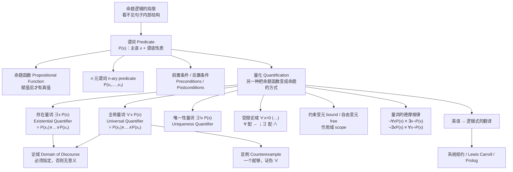

# C1.4 谓词与量词 Predicates and Quantifiers

> [!abstract] 本节地位
> **命题逻辑的能力边界在这里被突破。** §1.1–1.3 的命题逻辑无法表达“所有”“存在”这类断言——已知“校园网上每台计算机都正常工作”，命题逻辑**推不出**“MATH3 正常工作”，因为它看不见句子内部的结构。
> 这一节引入**谓词 (predicate)** 和**量词 (quantifier)**，得到表达力强得多的**谓词逻辑 (predicate logic)**。**这是全章最重要的一节，也是后面所有数学写作的语言基础**——任何一条定理的严格陈述都离不开 $\forall$ 和 $\exists$。

> [!info] 标注说明
> 标有 **（拓展）** 或 **【拓展】** 的内容，是**课堂上没有讲到、由课件之外的教材内容延伸补充**的部分。
> 复习时可先掌握未标注的主干内容，行有余力再看拓展部分。

> [!warning] 📚 课堂进度
> **课件 Ch1.4 Part1（2026-09-09，29 张）与 Part2（2026-09-10，29 张）已收到**，覆盖了本节 §0–§9 的绝大部分。
> **课堂未讲**：前置/后置条件、空论域约定、把量化看成循环、Lewis Carroll 例子、Prolog——已标注为**（拓展）**。
> 课件独有的内容（自由/约束变元对照表、量词分配律的反例表、含常量 $A$ 的等价式、受限论域的三种写法）已并入 §5、§6、§3 正文，标 📚。

## 本节结构总览



---

## 0. 为什么需要谓词逻辑（引言）

考虑一个我们都认可的推理：

> 已知：“**校园网上连接的每一台计算机都正常工作。**”
> MATH3 是校园网上的一台计算机。
> 想推出：“**MATH3 正常工作。**”

**命题逻辑做不到。** 因为在命题逻辑中，“每台计算机都正常工作”只能被记作一个原子命题 $p$，“MATH3 正常工作”是另一个原子命题 $q$，$p$ 和 $q$ 之间**没有任何形式上的联系**，没有任何规则允许从 $p$ 推出 $q$。

同样，从

> “**CS2 正在被入侵者攻击。**”

也**推不出**

> “**校园网上存在一台计算机正在被入侵者攻击。**”

> [!important] 结论
> 命题逻辑的粒度太粗——它把每个陈述句当作**不可分割的整体**。
> 谓词逻辑把句子拆成**主语 (subject)** + **谓语 (predicate)**，再用量词说明主语的取值范围，从而能表达“全部”“存在”，并支持上述推理。

---

> [!important] 📚 课件把“命题逻辑不够用”拆成了**两个**具体局限（Part1 slide 3、9–10）
> **Limitation 1：相似的命题只能各起一个名字。**
> $$p:\ \text{John is a SCUT student}\qquad q:\ \text{Peter is a SCUT student}\qquad r:\ \text{Mary is a SCUT student}$$
> 三句话**结构完全相同**，只有主语不同，但命题逻辑只能给它们三个互不相关的字母，**“是华工学生”这个共同部分被彻底丢掉了**。
>
> **Limitation 2：最基本的三段论都推不动。**
> 由“Every student in SCUT is clever”+“Peter is a SCUT student”推“Peter is clever”，
> 或由“Peter is a SCUT student”+“Peter cannot pass this subject”推“At least one student in SCUT cannot pass this subject”——**命题逻辑都无能为力**。
>
> 课件红字结论：**“Propositional Logic does not adequately express: Every, all, some, partial, at least one, one, etc.”**
>
> **两个局限分别通向本节的两个主角**：
> - **Limitation 1 → 谓词**：把“是华工学生”抽出来做成 $S(x)$，主语变成参数；
> - **Limitation 2 → 量词**：把“每一个”“至少一个”变成可以参与推理的符号 $\forall$、$\exists$。

> [!note] 🎤 课堂给的递进关系
> **“离散数学更像一座桥梁，连接人类的自然语言和计算机科学的编程语言。”** 学到 §1.4，这座桥要往前修一步：**不只看句子之间的关系，还要看句子内部的结构**。
> $$\underbrace{\text{命题}}_{\text{句子是真是假}}\ \longrightarrow\ \underbrace{\text{谓词}}_{\text{句子之间的共性}}\ \longrightarrow\ \underbrace{\text{量词}}_{\text{共性涉及多少个}}$$
> **“一层一层递进，才能把信息从自然语言里抽象出来。”**

> [!important] 📚 记号约定（课件用红框标出）
> - **小写字母表示对象 objects**：$x, y, a, b$；**大写字母表示谓词 predicates**：$P, Q, S$。
> - $P(x)$ 中 $P$ 是**谓词**，$x$ 是**变量**，$x$ **refer to**（指代）某个对象。
> - **“命题函数的真值只有在变量的值确定之后才能确定。”**

## 1. 谓词 Predicates

含变量的陈述，如
$$\text{"}x > 3\text{"},\quad \text{"}x = y + 3\text{"},\quad \text{"}x + y = z\text{"}$$
以及
$$\text{"computer } x \text{ is under attack by an intruder"},\quad \text{"computer } x \text{ is functioning properly"}$$
在数学断言、计算机程序、系统规约中大量出现。**当变量的值未指定时，它们既不真也不假**（回顾 §1.1 例 2：$x + 1 = 2$ 不是命题）。

> [!important] 定义（谓词与命题函数）
> 陈述 "$x$ is greater than 3" 分成两部分：
> - 第一部分：变量 $x$，是陈述的**主语 (subject)**；
> - 第二部分："is greater than 3"，称为**谓词 (predicate)**，指主语可能具有的一个**性质**。
>
> 记 $P(x)$ 表示 "$x$ is greater than 3"，其中 $P$ 表示谓词“大于 3”，$x$ 是变量。
> $P(x)$ 也称为**命题函数 (propositional function) $P$ 在 $x$ 处的值**。
> **一旦给变量赋值，$P(x)$ 就成为一个命题，具有真值。**
> 
> 通常，**小写变量表示对象；大写变量表示谓词**。比如x和P

**例 1**：设 $P(x)$ 表示 "$x > 3$"。求 $P(4)$ 与 $P(2)$ 的真值。
**解**：$P(4)$ 是 "$4 > 3$"，**真**；$P(2)$ 是 "$2 > 3$"，**假**。

**例 2**：设 $A(x)$ 表示 "Computer $x$ is under attack by an intruder"。已知校园里只有 CS2 和 MATH1 正在被攻击。求 $A(\text{CS1})$、$A(\text{CS2})$、$A(\text{MATH1})$ 的真值。
**解**：CS1 不在受攻击列表中 ⇒ $A(\text{CS1})$ **假**；CS2 与 MATH1 在列表中 ⇒ $A(\text{CS2})$、$A(\text{MATH1})$ **真**。

### 多元谓词 n-ary Predicates

**例 3**：设 $Q(x,y)$ 表示 "$x = y + 3$"。求 $Q(1,2)$ 与 $Q(3,0)$ 的真值。
**解**：$Q(1,2)$ 是 "$1 = 2 + 3$"，**假**；$Q(3,0)$ 是 "$3 = 0 + 3$"，**真**。

**例 4**：设 $A(c,n)$ 表示 "Computer $c$ is connected to network $n$"。已知 MATH1 连接到 CAMPUS2 但未连接到 CAMPUS1。
**解**：$A(\text{MATH1},\text{CAMPUS1})$ **假**；$A(\text{MATH1},\text{CAMPUS2})$ **真**。

**例 5**：设 $R(x,y,z)$ 表示 "$x + y = z$"。求 $R(1,2,3)$ 与 $R(0,0,1)$ 的真值。
**解**：$R(1,2,3)$ 是 "$1+2=3$"，**真**；$R(0,0,1)$ 是 "$0+0=1$"，**假**。

> [!important] 一般定义
> 涉及 $n$ 个变量 $x_1, x_2, \dots, x_n$ 的陈述记作
> $$P(x_1, x_2, \dots, x_n)$$
> 形如 $P(x_1,\dots,x_n)$ 的陈述是**命题函数 $P$ 在 $n$ 元组 $(x_1,\dots,x_n)$ 处的值**；$P$ 称为 **$n$ 元谓词 ($n$-place predicate 或 $n$-ary predicate)**。

> [!note] 术语记忆
> - 1 元谓词 (unary) $P(x)$：描述**性质** property——“$x$ 是偶数”。
> - 2 元谓词 (binary) $P(x,y)$：描述**关系** relation——“$x$ 整除 $y$”、“$x$ 是 $y$ 的朋友”。
> - $n$ 元谓词：$n$ 元关系。**这正是第 9 章“关系 (Relations)”和数据库理论中“$n$ 元关系表”的来源**——一张数据库表就是一个 $n$ 元谓词的外延（使它为真的所有元组的集合）。

### 命题函数在程序中的应用

**例 6**：考虑程序语句
$$\textbf{if } x > 0 \textbf{ then } x := x + 1$$
执行到这条语句时，把 $x$ 的当前值代入 $P(x)$（即 "$x > 0$"）。若 $P(x)$ 为真，赋值语句执行，$x$ 加 1；若为假，赋值不执行，$x$ 不变。

### 前置条件与后置条件 Preconditions and Postconditions（拓展）

> [!important] 定义
> 谓词还用于**建立计算机程序的正确性**，即证明程序在给定合法输入时总能产生期望的输出。
> - 描述**合法输入**的陈述称为**前置条件 (preconditions)**；
> - 描述**程序运行后输出应满足的条件**称为**后置条件 (postconditions)**。
>
> （课本注：**除非程序的正确性被证明，否则任何测试都无法说明它对所有输入都产生正确输出，除非把每一个输入值都测过。**这个论断在 §5.5 会详细展开。）

**例 7**：验证以下交换两个变量值的程序：
```
temp := x
x    := y
y    := temp
```
**解**：
- **前置条件** $P(x,y)$：$x = a$ **且** $y = b$（$a, b$ 是运行前 $x, y$ 的值）。
- **后置条件** $Q(x,y)$：$x = b$ **且** $y = a$。

**验证过程**（逐行推进状态，这是**霍尔逻辑 Hoare Logic** 的雏形）：

| 执行到 | $x$ | $y$ | $temp$ |
|---|---|---|---|
| 开始（前置条件成立） | $a$ | $b$ | — |
| 执行 `temp := x` 后 | $a$ | $b$ | $a$ |
| 执行 `x := y` 后 | $b$ | $b$ | $a$ |
| 执行 `y := temp` 后 | $b$ | $a$ | $a$ |

结束时 $x = b$ 且 $y = a$，即后置条件 $Q(x,y)$ 成立。∎

> [!note] 与你 AI / 软件方向的联系
> 这就是**形式化验证 (formal verification)** 的最小例子。工业界的 Dafny、Frama-C、Coq、Isabelle 等工具都基于“前置条件 → 程序 → 后置条件”这个三元组（**霍尔三元组 Hoare triple**，记作 $\{P\}\ S\ \{Q\}$）。
> **课本那句话值得抄下来**：“测试只能证明 bug 的存在，不能证明 bug 的不存在”（Dijkstra 语）——课本表述为“除非把每个输入都测过，否则测试无法建立正确性”。

---

## 2. 量词 Quantifiers

> [!important] 定义（量化 Quantification）
> 除了“给变量赋值”之外，还有一种把命题函数变成命题的重要方式，称为**量化 (quantification)**。
> 量化表达**谓词在一定范围的元素上为真的程度**。英语中用 *all*（所有）、*some*（一些）、*many*（许多）、*none*（没有）、*few*（少数）等词进行量化。
> 本节聚焦两类：
> - **全称量化 (universal quantification)**：谓词对所考虑的**每一个**元素都为真；
> - **存在量化 (existential quantification)**：**存在一个或多个**元素使谓词为真。
>
> 研究谓词与量词的逻辑分支称为**谓词演算 (predicate calculus)**。

> [!important] ⭐ 📚 课件的“量化四要素”就是翻译题的答题格式（Part1 slide 12）
> 每写一个量化表达式，都要能说清这四样：**① Quantifier 量词　② Variable 变量　③ Predicate 谓词　④ Domain 论域**。
> 课件里每一道 Small Exercise 都是这么排版的：**先写“量词 / 变量 / 论域 / 命题函数”四行，最后写 Answer**——**照抄这个格式，步骤分不会丢**。

> [!note] 🎤 课堂讲论域用的例子（课件上只有插图）
> $P(x)$: “$x$ breathes oxygen”。
> - 论域 = **人类** ⇒ $\forall x\,P(x)$ **真**；
> - 论域 = **生物 creatures** ⇒ **假**——**高中生物学过，有些细菌不需要氧气**；
> - 论域 = **包括外星人** ⇒ 更假（课堂拿《挽救计划 / Project Hail Mary》里那个**需要氨气而不是氧气**的岩石外星人 Rocky 举例）。
>
> **要点：同一个谓词，换论域就换真值。** 写量化命题前**先问自己论域是什么**。

> [!important] ⭐⭐ 📚 判真判假的**四格表**（Part1 slide 22）——本节最实用的一张
> | Statement | When true? | When false? |
> |---|---|---|
> | $\forall x\,P(x)$ | $P(x)$ is true for **every** $x$ | There is an $x$ for which $P(x)$ is **false** |
> | $\exists x\,P(x)$ | There is an $x$ for which $P(x)$ is **true** | $P(x)$ is false for **every** $x$ |
>
> 课件用两个色块标出**工作量的差别**：
> - **Finding one is ok（找到一个就行）**：证 $\exists$ 为真、证 $\forall$ 为假——后者就叫 **counterexample 反例**；
> - **Need to consider ALL（必须考虑全部）**：证 $\forall$ 为真、证 $\exists$ 为假。
>
> **对角线关系**：$\forall$ 的“假”和 $\exists$ 的“真”都只要**一个例子**；$\forall$ 的“真”和 $\exists$ 的“假”都要**全部检查**。
> 考试时先判断题目问的是哪一格，**方向选错整道题就废了**。
>
> 配套例子（slide 21）：$P(x)$: $x^2<10$，论域是不超过 4 的正整数。
> $$\forall x\,P(x)\equiv P(1)\wedge P(2)\wedge P(3)\wedge P(4)\equiv\mathbf F\quad(4\text{ 就是反例})\qquad \exists x\,P(x)\equiv P(1)\vee\cdots\vee P(4)\equiv\mathbf T$$

### 2.1 全称量词 The Universal Quantifier ∀

> [!important] 定义 1（全称量化）
> $P(x)$ 的**全称量化 (universal quantification)** 是陈述
> $$\text{"}P(x)\text{ for all values of } x \text{ in the domain."}$$
> 记号 $\forall x\, P(x)$，其中 $\forall$ 称为**全称量词 (universal quantifier)**。
> 读作 "**for all** $x\, P(x)$" 或 "**for every** $x\, P(x)$"。
> 使 $P(x)$ 为**假**的元素称为 $\forall x P(x)$ 的一个**反例 (counterexample)**。


> [!warning] 论域必须指定！（本节最重要的注意事项）
> 变量的取值范围称为**论域 (domain of discourse)**，也叫**讨论域 (universe of discourse)**，常简称**域 (domain)**。
> **论域指定了 $x$ 的可能取值。改变论域，$\forall x P(x)$ 的含义就改变。使用量词时论域必须始终被指定；没有论域，量化陈述没有定义。**
>
> 课本页边两次提醒："**Remember that the truth value of $\forall x P(x)$ depends on the domain!**"

**TABLE 1 量词**

| 陈述 Statement | 何时为真 When True? | 何时为假 When False? |
|---|---|---|
| $\forall x\, P(x)$ | $P(x)$ 对**每一个** $x$ 都为真 | **存在**一个 $x$ 使 $P(x)$ 为假 |
| $\exists x\, P(x)$ | **存在**一个 $x$ 使 $P(x)$ 为真 | $P(x)$ 对**每一个** $x$ 都为假 |

**例 8**：设 $P(x)$ 为 "$x + 1 > x$"，论域为**全体实数**，求 $\forall x P(x)$ 的真值。
**解**：对任意实数 $x$ 都有 $x + 1 > x$ ⇒ $\forall x P(x)$ **为真**。

> [!note] Remark（课本原文）：空论域的约定（拓展）
> 一般**隐含假设量词的论域非空 (nonempty)**。
> 注意：**若论域为空，则对任何命题函数 $P(x)$，$\forall x P(x)$ 都为真**——因为论域中不存在使 $P(x)$ 为假的元素。
> 这叫**空真 (vacuous truth)**，是 §1.1 空真概念在量词层面的体现。
>
> **典型的“废话真”例子**：论域为“所有独角兽”时，“所有独角兽都会飞”为真，“所有独角兽都不会飞”也为真——因为一个独角兽都没有。**这是期末最爱设的陷阱之一。**

**$\forall$ 的其他英文表述**："all of"、"for each"、"given any"、"for arbitrary"、"for every"、"for any"。

> [!warning] Remark（课本原文）：避免使用 "for any $x$"（拓展）
> **"for any" 最好不用**，因为 "any" 到底是 "every"（每一个）还是 "some"（某一个）常常**有歧义**。
> 某些情况下 "any" 不含糊，比如用在否定句中："there is not **any** reason to avoid studying."

### 用反例证伪全称命题

> [!important] 核心方法
> $\forall x P(x)$ 为假 $\iff$ $P(x)$ 并非对论域中每个 $x$ 都为真。
> 证明它为假的方式：**找一个反例 (counterexample)**，即找到论域中一个使 $P(x)$ 为假的元素。
> **一个反例就足以确立 $\forall x P(x)$ 为假。**

**例 9**：$Q(x)$ 为 "$x < 2$"，论域为全体实数，求 $\forall x Q(x)$。
**解**：$Q(3)$ 为假（$3 < 2$ 不成立）⇒ $x = 3$ 是反例 ⇒ $\forall x Q(x)$ **为假**。

**例 10**：$P(x)$ 为 "$x^2 > 0$"，论域为全体整数。
**解**：$x = 0$ 是反例，因为 $0^2 = 0$，不大于 0 ⇒ $\forall x P(x)$ **为假**。

> [!note] 课本的强调
> "**Looking for counterexamples to universally quantified statements is an important activity in the study of mathematics.**"（寻找全称命题的反例是数学研究中的重要活动。）
> §1.8 会专门讨论“寻找反例”作为一种证明策略。

### $\forall$ 与合取的关系（有限论域元素可被一一列举且离散）

> [!important] 当论域元素可以一一列出（$x_1, x_2, \dots, x_n$）时
> $$\forall x\, P(x) \;\equiv\; P(x_1) \wedge P(x_2) \wedge \cdots \wedge P(x_n)$$
> 因为这个合取为真当且仅当 $P(x_1), \dots, P(x_n)$ **全部为真**。

**例 11**：$P(x)$ 为 "$x^2 < 10$"，论域为**不超过 4 的正整数**，求 $\forall x P(x)$。
**解**：论域为 $\{1,2,3,4\}$，故
$$\forall x P(x) \equiv P(1) \wedge P(2) \wedge P(3) \wedge P(4)$$
其中 $P(4)$ 是 "$4^2 < 10$" 即 "$16 < 10$"，**为假** ⇒ 合取为假 ⇒ $\forall x P(x)$ **为假**。

**例 12**：$N(x)$ 为 "Computer $x$ is connected to the network"，论域为校园里所有计算机。$\forall x N(x)$ 是什么意思？
**解**：意为“对校园里每一台计算机 $x$，$x$ 都连接到网络”，英语表述为"**Every computer on campus is connected to the network.**"

**例 13**：$\forall x (x^2 \ge x)$ 在论域为全体**实数**时真值如何？论域为全体**整数**时呢？

**解**：
- **实数论域**：取 $x = \frac{1}{2}$，则 $\left(\frac12\right)^2 = \frac14 \not\ge \frac12$ ⇒ **假**。
  更系统地：$x^2 \ge x \iff x^2 - x = x(x-1) \ge 0 \iff x \le 0$ **或** $x \ge 1$。
  所以在 $0 < x < 1$ 上不等式不成立 ⇒ 实数论域下 $\forall x(x^2 \ge x)$ **为假**。
- **整数论域**：不存在满足 $0 < x < 1$ 的整数 ⇒ 所有整数都满足 $x \le 0$ 或 $x \ge 1$ ⇒ **为真**。

> [!warning] 这道题是“论域决定真值”的最佳例证
> **同一个公式，论域从 $\mathbb{R}$ 换成 $\mathbb{Z}$，真值从假变成真。** 做题时第一件事永远是**看清论域**。
> 顺带学到一个技巧：把 $x^2 \ge x$ 化成 $x(x-1) \ge 0$ 再讨论符号，比逐个试数可靠得多。

### 2.2 存在量词 The Existential Quantifier ∃

> [!important] 定义 2（存在量化）
> $P(x)$ 的**存在量化 (existential quantification)** 是命题
> $$\text{"There exists an element } x \text{ in the domain such that } P(x)\text{."}$$
> 记号 $\exists x\, P(x)$，其中 $\exists$ 称为**存在量词 (existential quantifier)**。

**$\exists x P(x)$ 的读法**：
- "There is an $x$ such that $P(x)$"
- "There is at least one $x$ such that $P(x)$"
- "For some $x\, P(x)$"

其他表述："for some"、"for at least one"、"there is"。

> [!warning] 论域同样必须指定
> 使用 $\exists x P(x)$ 时论域必须始终指定；论域改变则含义改变；**不指定论域，$\exists x P(x)$ 没有意义**。

**例 14**：$P(x)$ 为 "$x > 3$"，论域为全体实数，求 $\exists x P(x)$。
**解**："$x>3$" 有时为真（如 $x = 4$）⇒ $\exists x P(x)$ **为真**。

> [!important] $\exists x P(x)$ 何时为假
> $\exists x P(x)$ 为假 $\iff$ 论域中**不存在**使 $P(x)$ 为真的元素 $\iff$ $P(x)$ 对论域中**每一个**元素都为假。

**例 15**：$Q(x)$ 为 "$x = x + 1$"，论域为全体实数，求 $\exists x Q(x)$。
**解**：对每个实数 $x$，$Q(x)$ 都为假 ⇒ $\exists x Q(x)$ **为假**。

> [!note] Remark：空论域下的 $\exists$
> 若论域为空，则对任何命题函数 $Q(x)$，$\exists x Q(x)$ 都**为假**——因为空论域中不存在任何元素。
> **对照记忆**：空论域下 $\forall$ 恒真，$\exists$ 恒假。

### $\exists$ 与析取的关系（有限论域）

$$\exists x\, P(x) \;\equiv\; P(x_1) \vee P(x_2) \vee \cdots \vee P(x_n)$$
因为析取为真当且仅当 $P(x_1), \dots, P(x_n)$ **至少有一个**为真。

**例 16**：$P(x)$ 为 "$x^2 > 10$"，论域为不超过 4 的正整数，求 $\exists x P(x)$。
**解**：论域为 $\{1,2,3,4\}$，
$$\exists x P(x) \equiv P(1) \vee P(2) \vee P(3) \vee P(4)$$
$P(4)$ 是 "$4^2 > 10$" 即 "$16 > 10$"，**为真** ⇒ 析取为真 ⇒ $\exists x P(x)$ **为真**。

### 循环与搜索的直觉（课本明确给出的思维方式）（拓展）

> [!important] 把量词当成循环
> 设论域中有 $n$ 个对象。
> - 判定 $\forall x P(x)$：**遍历**全部 $n$ 个 $x$，看 $P(x)$ 是否始终为真。**一旦遇到一个 $P(x)$ 为假，立刻可断定 $\forall x P(x)$ 为假**；若全部通过，则为真。
> - 判定 $\exists x P(x)$：**搜索**全部 $n$ 个 $x$，找使 $P(x)$ 为真的值。**一旦找到，立刻可断定 $\exists x P(x)$ 为真**；若始终没找到，则为假。
>
> **注意**：论域**无限**时这个搜索过程不适用（无法穷举），但它仍然是理解量词真值的有用思维方式。

用伪代码写出来（老师常写在黑板上，也直接对应编程直觉）：
```python
# ∀x P(x)
for x in domain:
    if not P(x):
        return False     # 找到反例，立刻为假
return True              # 全部通过

# ∃x P(x)
for x in domain:
    if P(x):
        return True      # 找到见证，立刻为真
return False             # 全部失败
```

> [!note] 对应到编程与 AI
> - Python 的内置函数 `all()` 就是 $\forall$，`any()` 就是 $\exists$；两者都有**短路 (short-circuit)** 行为，正好对应上面的“立刻返回”。
> - $\forall$ 的**证伪**只需一个反例（cheap），**证实**需要遍历全部（expensive）；$\exists$ 反之。这种不对称在算法复杂度里表现为 **co-NP vs NP**。
> - 无限论域下量词无法用循环判定——这正是**一阶逻辑不可判定 (undecidable)** 的直观来源（丘奇—图灵，1936）。

### 2.3 唯一性量词 The Uniqueness Quantifier ∃!

> [!important] 定义
> 除了 $\forall$ 和 $\exists$，还可以定义各种量词，如“恰好有两个”“不超过三个”“至少有 100 个”等。其中最常见的是**唯一性量词 (uniqueness quantifier)**，记作 $\exists!$ 或 $\exists_1$。
> $$\exists!x\, P(x) \quad(\text{或 } \exists_1 x\, P(x))$$
> 表示“**存在唯一的 $x$ 使 $P(x)$ 为真**”。其他说法："there is exactly one"、"there is one and only one"。

**例**：$\exists! x\,(x - 1 = 0)$，论域为实数集。这是**真**命题，因为 $x = 1$ 是使 $x - 1 = 0$ 的唯一实数。

> [!note] 课本的重要提示
> **唯一性量词可以用 $\exists$、$\forall$ 和命题逻辑表达出来，因此是可以避免的**（见 §1.5 习题 52）。标准写法是：
> $$\exists!x\,P(x) \;\equiv\; \exists x\Big(P(x) \wedge \forall y\big(P(y) \to y = x\big)\Big)$$
> 读法：**存在一个 $x$ 使 $P(x)$ 成立，并且任何使 $P$ 成立的 $y$ 都必须等于这个 $x$**（存在性 + 唯一性）。
>
> 课本建议：**一般还是坚持只用 $\exists$ 和 $\forall$，这样 §1.6 的推理规则才能用上。**
>
> **数学写作中的“存在唯一”证明模板**：分两步——① 存在性（构造或论证出一个 $x$）；② 唯一性（设 $x_1, x_2$ 都满足，证 $x_1 = x_2$）。这个模板在整个高等数学中反复使用。

---

## 3. 受限论域的量词 Quantifiers with Restricted Domains

> [!important] 简写记法
> 常用一种缩写记法**限制量词的论域**：在量词后面直接写出变量必须满足的条件。

**例 17**：以下三个陈述（论域均为实数）是什么意思？
$$\forall x < 0\,(x^2 > 0),\qquad \forall y \ne 0\,(y^3 \ne 0),\qquad \exists z > 0\,(z^2 = 2)$$

**解**：
1. $\forall x < 0\,(x^2 > 0)$：对每个满足 $x < 0$ 的实数 $x$，都有 $x^2 > 0$。即“**负实数的平方是正的**”。
   等价于 $$\forall x\,(x < 0 \to x^2 > 0)$$
2. $\forall y \ne 0\,(y^3 \ne 0)$：对每个满足 $y \ne 0$ 的实数 $y$，都有 $y^3 \ne 0$。即“**每个非零实数的立方非零**”。
   等价于 $$\forall y\,(y \ne 0 \to y^3 \ne 0)$$
3. $\exists z > 0\,(z^2 = 2)$：存在满足 $z > 0$ 的实数 $z$ 使 $z^2 = 2$。即“**2 有一个正的平方根**”。
   等价于 $$\exists z\,(z > 0 \wedge z^2 = 2)$$

> [!important] 📚 课件给的**三种写法**（Part2 slide 24）——考试三种都可能要求
> 例：**“The square of every real number greater than 10 is greater than 100.”**
> 
> | 写法 | 表达式 | 论域 |
> |---|---|---|
> | **Using Domain**（限制写进论域） | $\forall x\,(x^2>100)$ | **大于 10 的实数** |
> | **Using Predicate**（限制写成谓词） | $\forall x\,(x>10\to x^2>100)$ | **全体实数** |
> | **Using Abbreviated Notation**（简写记法） | $\forall x>10\,(x^2>100)$ | **全体实数** |
>
> 三者**完全等价**，只是把“大于 10”这个限制放在了不同的位置。

> [!important] ⭐ 本节最重要的记忆点：$\forall$ 配 $\to$，$\exists$ 配 $\wedge$
> $$\boxed{\forall x\,\big(\text{限制条件} \to \text{断言}\big)}\qquad\qquad \boxed{\exists x\,\big(\text{限制条件} \wedge \text{断言}\big)}$$
> - **全称量化的限制**等价于**条件语句的全称量化**；
> - **存在量化的限制**等价于**合取的存在量化**。
>
> **为什么？**
> - $\forall x (A(x) \to B(x))$：对不满足 $A$ 的 $x$，条件句空真，**自动不构成反例**——正好实现了“只对满足 $A$ 的 $x$ 提要求”。
>   若错写成 $\forall x (A(x) \wedge B(x))$，就变成断言“**所有东西都满足 $A$ 且满足 $B$**”，含义强得离谱。
> - $\exists x (A(x) \wedge B(x))$：要求真的**找到一个既满足 $A$ 又满足 $B$ 的东西**。
>   若错写成 $\exists x (A(x) \to B(x))$，则只要论域中存在**任何一个不满足 $A$ 的东西**，条件句就空真，整个存在命题就为真——**几乎恒真，毫无信息量**。
>
> **这是本章最高频的失分点，没有之一。课本用两个 ⚠️ 图标专门标出。**

---

## 4. 量词的优先级 Precedence of Quantifiers

> [!important] 规则
> **量词 $\forall$ 和 $\exists$ 的优先级高于命题演算中所有的逻辑运算符。**

**例**：$\forall x P(x) \vee Q(x)$ 表示 $\big(\forall x P(x)\big) \vee Q(x)$，**而不是** $\forall x\big(P(x) \vee Q(x)\big)$。

> [!warning] 实用建议
> 这条规则容易出事——第一个式子里的 $Q(x)$ 中的 $x$ 是**自由变元**，整个式子甚至不是一个命题！
> **写量词表达式时，务必给量词的作用范围加括号**：想表达“对所有 $x$，$P(x)$ 或 $Q(x)$”，就老老实实写 $\forall x\big(P(x) \vee Q(x)\big)$。
> 课本页边也提醒："**Remember the rules of precedence for quantifiers and logical connectives!**"

> [!example] 📚 课件的加括号练习（Part1 slide 24、27）
> 原式：$\forall x\,(P(x)\wedge\exists z\,Q(x,z)\to\exists y\,R(x,y))\vee Q(x,y)$，逐层补括号后：
> - $\exists z$ 的作用域：$Q(x,z)$　|　$\exists y$ 的作用域：$R(x,y)$
> - $\forall x$ 的作用域：$P(x)\wedge\exists z\,Q(x,z)\to\exists y\,R(x,y)$
> - **自由变元**：最外面 $Q(x,y)$ 里的 $x$、$y$　|　**约束变元**：第一部分里的 $x,y,z$
>
> **要点：量词抓得很紧（优先级最高），但抓得很短**——它只管紧跟其后的那一块，最外层的 $\vee Q(x,y)$ 完全在作用域之外。

> [!example] 📚 课件的三道辨析题（Part1 slide 28）
> | 表达式 | 判定 |
> |---|---|
> | $\forall x\,(\exists x\,P(x))$ | $x$ 在 $\exists xP(x)$ 里已经不是自由变元，外层 $\forall x$ 绑定不到任何东西，**这个绑定是多余的** |
> | $(\forall x\,P(x))\wedge Q(x)$ | 第一个 $x$ **约束**，第二个 $x$ **自由**（在作用域之外） |
> | $(\forall x\,P(x))\wedge(\exists x\,Q(x))$ | **合法**，这是**两个不同的 $x$**，各自被各自的量词绑定 |

---

## 5. 约束变元 Binding Variables

> [!important] 定义
> - 当量词作用于变量 $x$ 时，称该处的 $x$ 是**约束的 (bound)**。
> - 未被任何量词约束、也未被赋特定值的变量出现，称为**自由的 (free)**。
> - 量词所作用的那部分逻辑表达式称为该量词的**作用域 (scope)**。因此，一个变量是自由的，当且仅当它**位于所有约束该变量的量词的作用域之外**。
>
> **命题函数中出现的所有变量都必须被约束或被赋特定值，才能把它变成命题。**

**例 18**：
1. 在 $\exists x\,(x + y = 1)$ 中：$x$ 被 $\exists x$ **约束**；$y$ 是**自由的**（没有量词约束它，也没赋值）。所以这**不是**一个命题。
2. 在 $\exists x\big(P(x) \wedge Q(x)\big) \vee \forall x\, R(x)$ 中：**所有变量都被约束**。
   - 第一个量词 $\exists x$ 的作用域是 $P(x) \wedge Q(x)$（$\exists x$ **只**作用于它，不作用于式子的其余部分）；
   - 第二个量词 $\forall x$ 的作用域是 $R(x)$。
   - 即：$\exists$ 约束了 $P(x) \wedge Q(x)$ 中的 $x$，$\forall$ 约束了 $R(x)$ 中的 $x$。
   - **因为两个量词的作用域不重叠**，也可以用两个不同的变量写成
     $$\exists x\big(P(x) \wedge Q(x)\big) \vee \forall y\, R(y)$$
     两者含义完全相同。
   - 课本提醒：**日常书写中，人们常用同一个字母表示被不同量词（作用域不重叠）约束的变量。**

> [!note] 与编程的类比（这个类比非常好用）
> **量词就是变量声明，作用域就是变量的可见范围。**
> ```python
> def f():
>     for x in domain:      # ∃x 或 ∀x：x 在此处被"声明"
>         ...P(x)...        # x 是局部的（bound）
>     for x in domain:      # 另一个循环，另一个作用域
>         ...R(x)...
>     # 两个 x 互不相干，可以随意重命名
> ```
> 逻辑学中把“重命名约束变元不改变含义”称为 **α-等价 (alpha-equivalence)**——这个概念在 λ 演算、编译器、类型系统里是核心。
> **自由变元 = 未定义的全局变量**：表达式里有自由变元，就像程序里引用了未定义的名字，无法求值（无法确定真值）。


> [!important] ⭐⭐ 📚 自由变元 vs 约束变元：课件的**七行对照表**（Part2 slide 2）——教材完全没有
> 🎤 这张表是**为了回应学生提问专门加的**：第 6 节课开场原话——**“有些同学对 free variable 和 bound variable 还有困惑，所以我做了一张表来总结这两个新定义的区别。”** 属于**高概率考点**。
>
> | 特征 | Free Variable 自由变元 | Bound Variable 约束变元 |
> |---|---|---|
> | **定义** | 不被任何量词约束 | 被量词（$\forall$、$\exists$）约束 |
> | **类比** | 一个**没有明确先行词的代词**（像 “he”） | 一个**有明确指代对象的代词**（像 “every student”） |
> | **含义** | 不确定，**依赖上下文** | 由管辖它的量词决定 |
> | **式子的状态** | 构成**命题函数**，而非命题 | 促成一个**命题**的形成 |
> | **真值** | **没有内在真值**，取决于变量赋值 | 该命题有**确定的真值** |
> | **改名** | **不能**随意改名（会改变含义） | **可以**改名（只要保持一致） |
> | **例子** | $x>5$ 中的 $x$ | $\forall x\,(x>5)$ 中的 $x$ |
>
> **最该记住的一行是“改名”**：$\forall x\,(x>5)$ 与 $\forall y\,(y>5)$ **是同一个命题**；但 $x>5$ 与 $y>5$ 在同一段上下文里**不是同一回事**。

> [!example] ⭐ 🎤 课堂重点讲的那个例子
> $$\forall x\,P(x,y)$$
> - **$x$ 是约束变元**（被 $\forall x$ 绑定）；
> - **$y$ 是自由变元**——课堂原话：**“请注意只有 $x$ 是约束变元，$y$ 是自由的，因为 $y$ 只出现在函数内部，而不是整个命题函数里。”**
> - 所以**整个式子仍然不是命题**。
>
> **判断口诀：一个式子里只要还剩一个自由变元，它就还不是命题。**

---

## 6. 含量词的逻辑等价 Logical Equivalences Involving Quantifiers

> [!important] 定义 3
> 含谓词和量词的陈述称为**逻辑等价的 (logically equivalent)**，当且仅当**无论把什么谓词代入其中、无论使用什么论域**，它们都有相同的真值。
> 记号：$S \equiv T$。

> [!note] 与 §1.3 定义的区别
> 命题逻辑的等价只需比较**有限张真值表**；谓词逻辑的等价要求**对所有可能的谓词和所有论域**成立——无法枚举，只能**论证**。所以这里的证明是“双向蕴涵的语义论证”，不是查表。

### 例 19（分配律：$\forall$ 对 $\wedge$）

证明 $\forall x\big(P(x) \wedge Q(x)\big) \equiv \forall x P(x) \wedge \forall x Q(x)$（同一论域）。

**证**（分两个方向）：

**方向一：$\forall x(P(x) \wedge Q(x))$ 真 ⇒ $\forall x P(x) \wedge \forall x Q(x)$ 真。**
设 $\forall x(P(x)\wedge Q(x))$ 为真。这意味着：若 $a$ 在论域中，则 $P(a) \wedge Q(a)$ 为真，因此 $P(a)$ 真且 $Q(a)$ 真。由于这对论域中**每个**元素都成立，可断定 $\forall x P(x)$ 与 $\forall x Q(x)$ 都为真，即 $\forall x P(x) \wedge \forall x Q(x)$ 为真。

> [!important] ⭐⭐ 📚 四条量词分配律：哪两条成立、哪两条只成立一个方向（Part2 slide 5–9）
> **全称量词**
> $$\boxed{\forall x\,(P(x)\wedge Q(x))\equiv\forall x\,P(x)\wedge\forall x\,Q(x)}\quad\text{（双向成立）}$$
> $$\forall x\,P(x)\vee\forall x\,Q(x)\ \color{red}{\longrightarrow}\ \forall x\,(P(x)\vee Q(x))\quad\text{（只成立一个方向）}$$
> **存在量词**
> $$\exists x\,(P(x)\wedge Q(x))\ \color{red}{\longrightarrow}\ \exists x\,P(x)\wedge\exists x\,Q(x)\quad\text{（只成立一个方向）}$$
> $$\boxed{\exists x\,(P(x)\vee Q(x))\equiv\exists x\,P(x)\vee\exists x\,Q(x)}\quad\text{（双向成立）}$$

> [!example] 📚 课件的四人反例表（$P(x)$: $x$ is lazy，$Q(x)$: $x$ likes beer）
> **反例一：$\forall x(P(x)\vee Q(x))\ \nrightarrow\ \forall xP(x)\vee\forall xQ(x)$**
> 
> | | Peter | John | Mary | Jessica |
> |---|:-:|:-:|:-:|:-:|
> | $P(x)$: 懒 | ✗ | ✗ | ✗ | ✓ |
> | $Q(x)$: 喜欢啤酒 | ✓ | ✓ | ✓ | ✗ |
>
> 每个人**至少满足一条** ⇒ 左边真；但“所有人都懒”假、“所有人都喜欢啤酒”也假 ⇒ 右边假。✗
>
> **反例二：$\exists xP(x)\wedge\exists xQ(x)\ \nrightarrow\ \exists x(P(x)\wedge Q(x))$**
> 
> | | Peter | John | Mary | Jessica |
> |---|:-:|:-:|:-:|:-:|
> | $P(x)$: 懒 | ✓ | ✗ | ✗ | ✗ |
> | $Q(x)$: 喜欢啤酒 | ✗ | ✓ | ✗ | ✗ |
>
> “有人懒”真（Peter）、“有人喜欢啤酒”真（John），但**没有任何一个人同时满足两条**。✗

> [!important] ⭐ 🎤 学生晚上提问、第二天专门回答的一条：**为什么这两个 $x$ 是不同的**
> **“这四个人里面很懒惰的那个人，和这四个人里面很喜欢喝啤酒的那个人，未必是同一个人。但右边要求的是：存在这么一个人，他既喜欢喝啤酒、同时又很懒惰。”**
>
> **一句话：$\exists$ 各写各的时，两个 $x$ 可以是两个人；写在一个 $\exists$ 里，就必须是同一个人。**
> **速记：$\forall$ 配 $\wedge$、$\exists$ 配 $\vee$ 才能自由出入括号**——这和受限论域里“$\forall$ 配 $\to$、$\exists$ 配 $\wedge$”是两条不同的规则，别混。

> [!important] ⭐ 📚 含“常量 $A$”的八条等价式（Part2 slide 10）——教材没单列，但化简时天天用
> **前提：$A$ 中不含自由变元 $x$。**
>
> | 等价式 | 等价式 |
> |---|---|
> | $\forall x\,(A\wedge P(x))\equiv A\wedge\forall x\,P(x)$ | ⭐ $\forall x\,P(x)\to A\equiv\exists x\,(P(x)\to A)$ |
> | $\forall x\,(A\vee P(x))\equiv A\vee\forall x\,P(x)$ | ⭐ $A\to\forall x\,P(x)\equiv\forall x\,(A\to P(x))$ |
> | $\exists x\,(A\wedge P(x))\equiv A\wedge\exists x\,P(x)$ | ⭐ $\exists x\,P(x)\to A\equiv\forall x\,(P(x)\to A)$ |
> | $\exists x\,(A\vee P(x))\equiv A\vee\exists x\,P(x)$ | ⭐ $A\to\exists x\,P(x)\equiv\exists x\,(A\to P(x))$ |
>
> **课件给的两条推导**：
> $$\begin{aligned}
> \forall x\,P(x)\to A &\equiv\neg(\forall x\,P(x))\vee A && \text{消箭头}\\
> &\equiv\exists x\,(\neg P(x))\vee A && \text{量词德摩根律}\\
> &\equiv\exists x\,(\neg P(x)\vee A) && A\text{ 不含 }x\text{，可移进去}\\
> &\equiv\exists x\,(P(x)\to A) && \text{装回箭头}
> \end{aligned}$$
> $$A\to\forall x\,P(x)\equiv\neg A\vee\forall x\,P(x)\equiv\forall x\,(\neg A\vee P(x))\equiv\forall x\,(A\to P(x))$$
>
> > [!warning] ⭐ 最容易记反的一条
> > $$\exists x\,P(x)\to A\equiv\forall x\,(P(x)\to A)\qquad(\exists\text{ 进入箭头左边会变成 }\forall)$$
> > **原因**：箭头左边相当于被否定了一次，而否定会把 $\exists$ 翻成 $\forall$。这和 [[C1.3 命题等价 Propositional Equivalences]] 里 $(p\to r)\wedge(q\to r)\equiv(p\vee q)\to r$ 的“前件联结词翻转”**是同一个机制**。
> > 中文直觉见 [[C1.5 嵌套量词 Nested Quantifiers]] §7.9 的“努力工作 / 中国强大”那组对照。

**方向二：$\forall x P(x) \wedge \forall x Q(x)$ 真 ⇒ $\forall x(P(x) \wedge Q(x))$ 真。**
设 $\forall x P(x) \wedge \forall x Q(x)$ 为真，则 $\forall x P(x)$ 真且 $\forall x Q(x)$ 真。于是若 $a$ 在论域中，$P(a)$ 真且 $Q(a)$ 真（**因为 $P$ 和 $Q$ 对所有元素都为真，这里用同一个 $a$ 不会有冲突**），故 $P(a) \wedge Q(a)$ 真。因此对所有 $a$，$P(a) \wedge Q(a)$ 为真，即 $\forall x(P(x) \wedge Q(x))$ 为真。

综上：
$$\boxed{\forall x\big(P(x) \wedge Q(x)\big) \equiv \forall x P(x) \wedge \forall x Q(x)}$$
∎

> [!important] ⚠️ 量词分配律的四种情形——两真两假（**必考**）
> | 式子 | 是否成立 |
> |---|---|
> | $\forall x(P(x) \wedge Q(x)) \equiv \forall x P(x) \wedge \forall x Q(x)$ | ✅ **成立**（$\forall$ 可以分配到 $\wedge$ 上） |
> | $\exists x(P(x) \vee Q(x)) \equiv \exists x P(x) \vee \exists x Q(x)$ | ✅ **成立**（$\exists$ 可以分配到 $\vee$ 上） |
> | $\forall x(P(x) \vee Q(x)) \equiv \forall x P(x) \vee \forall x Q(x)$ | ❌ **不成立**（习题 50） |
> | $\exists x(P(x) \wedge Q(x)) \equiv \exists x P(x) \wedge \exists x Q(x)$ | ❌ **不成立**（习题 51） |
>
> **记忆口诀：$\forall$ 配 $\wedge$，$\exists$ 配 $\vee$（同类相配才能分配）。**
>
> **反例（自己一定要能举出来）**：
> - **$\forall$ 对 $\vee$ 不分配**：论域 $\mathbb{Z}$，$P(x)$ = “$x$ 是偶数”，$Q(x)$ = “$x$ 是奇数”。
>   左边 $\forall x(P(x) \vee Q(x))$：每个整数非奇即偶 ⇒ **真**。
>   右边 $\forall x P(x) \vee \forall x Q(x)$：既不是所有整数都是偶数，也不是所有整数都是奇数 ⇒ **假**。
>   只有 $\forall x P(x) \vee \forall x Q(x) \Rightarrow \forall x(P(x) \vee Q(x))$ 这一个方向成立。
> - **$\exists$ 对 $\wedge$ 不分配**：同样的 $P, Q$。
>   右边 $\exists x P(x) \wedge \exists x Q(x)$：存在偶数（如 2），也存在奇数（如 3）⇒ **真**。
>   左边 $\exists x(P(x) \wedge Q(x))$：存在一个数既奇又偶 ⇒ **假**。
>   只有 $\exists x(P(x) \wedge Q(x)) \Rightarrow \exists x P(x) \wedge \exists x Q(x)$ 这一个方向成立。
>
> **深层原因**：右边的两个量词各自**独立地**选取见证元素，左边要求**同一个** $x$ 同时满足。$\exists$ 的这种“必须是同一个”的要求，正是不分配的根源。

---

## 7. 量化表达式的否定 Negating Quantified Expressions

> [!important] TABLE 2 量词的德摩根律 De Morgan's Laws for Quantifiers
>
> | 否定 Negation | 等价陈述 Equivalent Statement | 否定何时为真 | 何时为假 |
> |---|---|---|---|
> | $\neg \exists x\, P(x)$ | $\forall x\, \neg P(x)$ | 对每个 $x$，$P(x)$ 都为假 | 存在 $x$ 使 $P(x)$ 为真 |
> | $\neg \forall x\, P(x)$ | $\exists x\, \neg P(x)$ | 存在 $x$ 使 $P(x)$ 为假 | $P(x)$ 对每个 $x$ 都为真 |
>
> $$\boxed{\neg \forall x\, P(x) \equiv \exists x\, \neg P(x)} \qquad \boxed{\neg \exists x\, P(x) \equiv \forall x\, \neg P(x)}$$

**推导（课本给的例子与论证）**：

考虑 "**Every student in your class has taken a course in calculus.**" 这是全称量化 $\forall x P(x)$，其中 $P(x)$ = “$x$ 学过微积分”，论域是你班上的学生。
它的否定是“并非你班上的每个学生都学过微积分”，等价于“**存在你班上的一个学生没学过微积分**”，即 $\exists x \neg P(x)$。

**严格论证**（课本原文的逻辑链，答题时可以照搬这个格式）：
$\neg \forall x P(x)$ 为真
$\iff$ $\forall x P(x)$ 为假
$\iff$ 论域中存在元素 $x$ 使 $P(x)$ 为假
$\iff$ 论域中存在元素 $x$ 使 $\neg P(x)$ 为真
$\iff$ $\exists x \neg P(x)$ 为真。
故两者逻辑等价。∎

同理，考虑 "**There is a student in this class who has taken a course in calculus.**" 即 $\exists x Q(x)$。
其否定是“并非存在这样的学生”，等价于“**这个班上每个学生都没学过微积分**”，即 $\forall x \neg Q(x)$。

> [!note] Remark：为什么叫“量词的德摩根律”（课本给出的解释）
> 当 $P(x)$ 的论域含 $n$ 个元素 $x_1, \dots, x_n$（$n > 1$）时，量化陈述的否定规则**恰好就是 §1.3 的德摩根律**：
> $$\neg\forall x P(x) \equiv \neg\big(P(x_1) \wedge P(x_2) \wedge \cdots \wedge P(x_n)\big) \equiv \neg P(x_1) \vee \neg P(x_2) \vee \cdots \vee \neg P(x_n) \equiv \exists x \neg P(x)$$
> $$\neg\exists x P(x) \equiv \neg\big(P(x_1) \vee P(x_2) \vee \cdots \vee P(x_n)\big) \equiv \neg P(x_1) \wedge \neg P(x_2) \wedge \cdots \wedge \neg P(x_n) \equiv \forall x \neg P(x)$$
> **所以量词的德摩根律就是命题德摩根律在（可能无限的）论域上的推广。这两个名字不是巧合。**

> [!important] ⭐ 求否定的通用算法（**每次考试都用得上**）
> **把 $\neg$ 从最外层一路“推”到最里层**，每穿过一个量词就翻转它：
> 1. $\neg \forall \leadsto \exists \neg$；$\neg \exists \leadsto \forall \neg$；
> 2. 穿过 $\wedge / \vee$ 用命题德摩根律翻转；
> 3. 穿过 $\to$ 用 $\neg(A \to B) \equiv A \wedge \neg B$；
> 4. 最后把 $\neg$ 作用到原子谓词上，**并尽量化成不含 $\neg$ 的自然形式**（如 $\neg(x > 3)$ 写成 $x \le 3$）。
>
> 最终结果应满足题目常见的要求："**no negation is to the left of a quantifier**"（任何否定号都不在量词左边）。

**例 20**：求下列陈述的否定。
**(a)** "There is an honest politician."
设 $H(x)$ = "$x$ is honest"，论域为所有政客。原句为 $\exists x H(x)$。
$$\neg \exists x H(x) \equiv \forall x \neg H(x)$$
中文/英文表述：**"Every politician is dishonest."**（每个政客都不诚实。）

> [!warning] 课本专门给出的 Note（英语歧义陷阱）
> 英语中 "**All politicians are not honest**" 是**有歧义**的。日常用法里它常常表示 "**Not all politicians are honest**"（不是所有政客都诚实），也就是 $\neg\forall x H(x)$，而不是 $\forall x \neg H(x)$。
> **因此不能用这句话表达该否定。** 必须写成 "Every politician is dishonest."
> **教训**：自然语言的量词与否定的相对顺序常常含糊，**符号表达才是唯一可靠的**。这也正是数学要用符号语言的原因。

**(b)** "All Americans eat cheeseburgers."
设 $C(x)$ = "$x$ eats cheeseburgers"，论域为所有美国人。原句为 $\forall x C(x)$。
$$\neg \forall x C(x) \equiv \exists x \neg C(x)$$
表述：**"Some American does not eat cheeseburgers."** 或 **"There is an American who does not eat cheeseburgers."**

**例 21**：求 $\forall x(x^2 > x)$ 与 $\exists x(x^2 = 2)$ 的否定。
**解**：
- $\neg\forall x(x^2 > x) \equiv \exists x\,\neg(x^2 > x) \equiv \boxed{\exists x\,(x^2 \le x)}$
- $\neg\exists x(x^2 = 2) \equiv \forall x\,\neg(x^2 = 2) \equiv \boxed{\forall x\,(x^2 \ne 2)}$

这些陈述的真值**取决于论域**。

**例 22**：证明 $\neg\forall x\big(P(x) \to Q(x)\big) \equiv \exists x\big(P(x) \wedge \neg Q(x)\big)$。

**证**：
$$
\begin{aligned}
\neg\forall x\big(P(x) \to Q(x)\big)
&\equiv \exists x\,\neg\big(P(x) \to Q(x)\big) && \text{量词的德摩根律（}\forall\text{）}\\
&\equiv \exists x\big(P(x) \wedge \neg Q(x)\big) && \text{Table 7 第五条：}\neg(p \to q) \equiv p \wedge \neg q
\end{aligned}
$$
（这里用到了“逻辑等价的表达式可以互相替换”这一原理。）∎

> [!important] 这条等价式的重要性
> $$\boxed{\neg\forall x\big(P(x) \to Q(x)\big) \equiv \exists x\big(P(x) \wedge \neg Q(x)\big)}$$
> **含义**：“并非所有满足 $P$ 的东西都满足 $Q$” $\iff$ “**存在一个满足 $P$ 但不满足 $Q$ 的东西**”——**这就是“反例”的形式化定义**。
> 数学中每次说“这个命题不成立，因为有反例”，用的就是这条式子。**证伪一条形如 $\forall x(P(x) \to Q(x))$ 的定理，等价于构造一个满足前提但违反结论的对象。**

---

## 8. 把英语翻译成逻辑表达式 Translating from English into Logical Expressions

> [!important] 课本的定位
> 把英语（或其他自然语言）翻译成逻辑表达式，是**数学、逻辑程序设计、人工智能、软件工程**等诸多学科的关键任务。
> §1.1 已开始学，但当时刻意避开了需要谓词和量词的句子。**引入量词后翻译更复杂，而且同一句话往往有多种翻译方式，因此没有可以逐步照搬的“菜谱 (cookbook)”。**
> 目标是产生**简单而有用**的逻辑表达式。本节只处理**单个量词**的句子；§1.5 处理需要多个量词的复杂句子。

> [!important] ⭐⭐ 📚 课件反复用红框强调的两句话
> **“The universal quantifier connects with an implication.”（全称量词配蕴涵 $\to$）**
> **“The existential quantifier connects with a conjunction.”（存在量词配合取 $\wedge$）**

> [!important] ⭐ 🎤 课堂讲透了**为什么**是 $\to$ 而不是 $\wedge$
> - $\forall x\,(Q(x)\to P(x))$：**“对每个人，如果他在这个班里，他就很懒。”**
> - $\forall x\,(Q(x)\wedge P(x))$：**“每个人都既在这个班里、又很懒。”**——把全世界的人都拉进本班了。
>
> 课堂给的关键词是**“递进关系”**：
> **“蕴涵符号 $\to$ 体现的是不同层次——第一步你要先在这个课堂里，第二步才轮到说你懒不懒。而 $\wedge$ 把两个谓词放在了同一个地位。”**
> **一句话：$\to$ 先划范围、再下判断；$\wedge$ 是并排陈述。**
>
> 对应地，**存在量词写成 $\exists x\,(Q(x)\to P(x))$ 是错的**：只要存在一个**不在本班**的人，$Q(x)$ 为假就让整个蕴涵为真，**命题被平凡地满足了**（课件原话：including the case which contains no person in this class）。
>
> 🎤 课堂顺带澄清的一点：**“我没说一个自然语言句子只能有一个谓词，它可以包含好几个谓词。”**——“本班每个学生都很懒”在“任何人”论域下就需要 $Q(x)$ 和 $P(x)$ 两个。

> [!example] 📚 课件 Small Exercise：IBM 员工（Part2 slide 20–23）
> **“Every staff in IBM company has visited Mexico.”**
> 
> | 解法 | 论域 | 表达式 |
> |---|---|---|
> | Solution 1 | **IBM 员工** | $\forall x\,P(x)$ |
> | Solution 2 | **任何人** | $\forall x\,(Q(x)\to P(x))$，$Q(x)$: $x$ 是 IBM 员工 |
>
> **“Some staff in IBM company has visited Canada or Mexico.”**
> 
> | 解法 | 论域 | 表达式 |
> |---|---|---|
> | Solution 1 | **IBM 员工** | $\exists x\,(P(x)\vee Q(x))$ |
> | Solution 2 | **任何人** | $\exists x\,\bigl(S(x)\wedge(P(x)\vee Q(x))\bigr)$ |
> | **Better Solution**（课件推荐） | **任何人** | $\exists x\,\bigl(S(x)\wedge(P(x,\text{Canada})\vee P(x,\text{Mexico}))\bigr)$ |
>
> **“Better Solution” 好在哪**：把“去过某地”做成**二元谓词** $P(x,loc)$，而不是给每个国家单开一个一元谓词。
> **建模通用原则——能参数化的就不要枚举**，和写代码时“用参数而不是复制粘贴函数”完全一致。

### 例 23：论域的选择如何改变写法

把 "**Every student in this class has studied calculus**" 用谓词和量词表示。

**解**：
**第一步：改写句子，使量词显式化。**
> "For every student in this class, that student has studied calculus."

**第二步：引入变量 $x$。**
> "For every student $x$ in this class, $x$ has studied calculus."

**第三步（写法 A）：把论域取为“这个班上的学生”。**
引入 $C(x)$ = "$x$ has studied calculus"，则
$$\forall x\, C(x)$$

**写法 B：把论域取为“所有人”。**
此时需要把“是这个班上的学生”这一限制显式写出：
> "For every person $x$, if person $x$ is a student in this class then $x$ has studied calculus."

设 $S(x)$ = "$x$ is a student in this class"，则
$$\forall x\big(S(x) \to C(x)\big)$$

> [!warning] ⚠️ Caution
> **绝不能写成 $\forall x\big(S(x) \wedge C(x)\big)$！**
> 因为这句话断言的是“**所有人都是这个班上的学生并且都学过微积分**”——把全世界的人都算进这个班了，含义完全错误。
>
> 这就是 §3 中“$\forall$ 配 $\to$”规则的直接应用。**这是全书标注的头号翻译陷阱。**

**写法 C：用二元谓词。**
若还关心其他学科，可用 $Q(x,y)$ = "student $x$ has studied subject $y$"，把 $C(x)$ 换成 $Q(x, \text{calculus})$：
$$\forall x\, Q(x, \text{calculus}) \qquad\text{或}\qquad \forall x\big(S(x) \to Q(x, \text{calculus})\big)$$

> [!note] 选择原则
> "**We should always adopt the simplest approach that is adequate for use in subsequent reasoning.**"
> （应当采用**对后续推理够用的最简单**的方案。）
> 也就是说：如果只讨论这个班，就把论域设为这个班（写法 A 最简）；如果后面要和班外的人比较，就用写法 B；如果要涉及很多学科，才上二元谓词。**别为了炫技把式子写复杂。**

### 例 24：$\exists$ 的翻译陷阱

**(a)** "**Some student in this class has visited Mexico.**"

改写："There is a student in this class with the property that the student has visited Mexico."
引入 $x$："There is a student $x$ in this class having the property that $x$ has visited Mexico."

**写法 A（论域 = 班上学生）**：设 $M(x)$ = "$x$ has visited Mexico"：
$$\exists x\, M(x)$$

**写法 B（论域 = 所有人）**：改写为"There is a person $x$ having the properties that $x$ is a student in this class **and** $x$ has visited Mexico."
设 $S(x)$ = "$x$ is a student in this class"：
$$\exists x\big(S(x) \wedge M(x)\big)$$

> [!warning] ⚠️ Caution（课本再次专门警告）
> **绝不能写成 $\exists x\big(S(x) \to M(x)\big)$！**
> 因为只要论域中存在**任何一个不是本班学生的人**，对这个人 $S(x) \to M(x)$ 就变成 $\mathbf{F} \to \mathbf{T}$ 或 $\mathbf{F} \to \mathbf{F}$，**两者都为真**，于是整个存在命题为真——**它几乎恒为真，什么信息也没提供。**

**(b)** "**Every student in this class has visited either Canada or Mexico.**"

（注：这里假设是**相容或 inclusive or**，去过两个国家的学生也算。）

设 $C(x)$ = "$x$ has visited Canada"。
**写法 A（论域 = 班上学生）**：
$$\forall x\big(C(x) \vee M(x)\big)$$
**写法 B（论域 = 所有人）**：
> "For every person $x$, if $x$ is a student in this class, then $x$ has visited Mexico or $x$ has visited Canada."
$$\forall x\Big(S(x) \to \big(C(x) \vee M(x)\big)\Big)$$

**写法 C（用二元谓词）**：用 $V(x,y)$ = "$x$ has visited country $y$"，则 $V(x, \text{Mexico})$ 和 $V(x, \text{Canada})$ 分别与 $M(x)$、$C(x)$ 同义，可以替换。
课本建议：**若要处理很多人访问很多国家的陈述，用二元谓词更方便；否则为简单起见还是用一元谓词。**

> [!important] 翻译规则总表（**背下来直接套**）
> | 中文/英文模式 | 逻辑表达式（论域受限时） |
> |---|---|
> | 所有 A 都是 B / All A are B | $\forall x\,(A(x) \to B(x))$ |
> | 有的 A 是 B / Some A are B | $\exists x\,(A(x) \wedge B(x))$ |
> | 没有 A 是 B / No A is B | $\forall x\,(A(x) \to \neg B(x))$，等价于 $\neg\exists x\,(A(x) \wedge B(x))$ |
> | 有的 A 不是 B / Some A are not B | $\exists x\,(A(x) \wedge \neg B(x))$ |
>
> 这四行就是传统逻辑学中的 **A、I、E、O 四种直言命题**（源自亚里士多德三段论）。
> **核心只有一句：$\forall$ 后面跟 $\to$，$\exists$ 后面跟 $\wedge$。**

---

## 9. 在系统规约中使用量词 Using Quantifiers in System Specifications

**例 25**：用谓词和量词表示以下系统规约。

**(a)** "**Every mail message larger than one megabyte will be compressed.**"
设 $S(m,y)$ = "Mail message $m$ is larger than $y$ megabytes"（$m$ 的论域是所有邮件消息，$y$ 的论域是正实数），$C(m)$ = "Mail message $m$ will be compressed"。则
$$\boxed{\forall m\big(S(m,1) \to C(m)\big)}$$

**(b)** "**If a user is active, at least one network link will be available.**"
设 $A(u)$ = "User $u$ is active"（$u$ 的论域是所有用户），$S(n,x)$ = "Network link $n$ is in state $x$"（$n$ 的论域是所有网络链路，$x$ 的论域是链路的所有可能状态）。则
$$\boxed{\exists u\, A(u) \;\to\; \exists n\, S(n, \text{available})}$$

> [!warning] 注意 (b) 的量词位置
> 箭头**左右各有一个独立的存在量词**，量词的作用域**不跨越箭头**（因为量词优先级高于 $\to$）。
> 含义：“**如果存在某个活跃用户，那么存在某条可用链路。**”
> 这与 $\exists u\big(A(u) \to \exists n S(n,\text{available})\big)$ **完全不同**（后者几乎恒真）。
> 课本页边提醒："**Remember the rules of precedence for quantifiers and logical connectives!**"

---

## 10. Lewis Carroll 的例子 Examples from Lewis Carroll（拓展）

> [!note] Lewis Carroll 是谁
> Lewis Carroll 是 **C. L. Dodgson（查尔斯·路特维奇·道奇森，1832–1898）** 的笔名，《爱丽丝漫游奇境 *Alice in Wonderland*》的作者，同时也写过多部**符号逻辑**著作。他的书里有大量用量词做推理的例子。例 26、27 出自他的 *Symbolic Logic*，本节习题里还有更多。
>
> **生平**（课本 Links 栏）：Dodgson 是牧师的儿子，11 个孩子中的第三个，全家都口吃。他在成人面前不自在，据说只有对小女孩说话时不结巴。他与 Liddell 院长的三个小女儿的友谊，直接促成了《爱丽丝漫游奇境》的写作，也给他带来了财富和名声。1854 年毕业于牛津，1857 年获文学硕士，1855 年起任牛津基督教堂学院数学讲师。1861 年被按立为英国国教会牧师，但从未从事牧职。**以真名发表的著作**是几何、行列式、锦标赛与选举数学方面的论文和专著；**以 Lewis Carroll 之名**发表的则是大量趣味逻辑作品。

### 例 26（三段论式论证）

以下三句，前两句称为**前提 (premises)**，第三句称为**结论 (conclusion)**；整个集合称为一个**论证 (argument)**：
> "All lions are fierce."（所有狮子都凶猛。）
> "Some lions do not drink coffee."（有些狮子不喝咖啡。）
> "Some fierce creatures do not drink coffee."（有些凶猛的生物不喝咖啡。）

设 $P(x)$ = "$x$ is a lion"，$Q(x)$ = "$x$ is fierce"，$R(x)$ = "$x$ drinks coffee"，论域为所有生物。

**解**：
$$\forall x\big(P(x) \to Q(x)\big)$$
$$\exists x\big(P(x) \wedge \neg R(x)\big)$$
$$\exists x\big(Q(x) \wedge \neg R(x)\big)$$

> [!warning] 课本的关键说明（本例的教学重点）
> **第二句不能写成 $\exists x\big(P(x) \to \neg R(x)\big)$。**
> 理由：只要 $x$ 不是狮子，$P(x) \to \neg R(x)$ 就为真；因此只要世界上**存在任何一个非狮子的生物**，$\exists x(P(x) \to \neg R(x))$ 就为真——**即使每一只狮子都喝咖啡**。这显然不是原意。
> 同理，第三句也不能写成 $\exists x\big(Q(x) \to \neg R(x)\big)$。
>
> （§1.6 会讨论如何判定结论是否是前提的**有效推论 (valid consequence)**。本例中它确实是。）

### 例 27（四句话的论证）

前三句是前提，第四句是**有效结论**：
> "All hummingbirds are richly colored."（所有蜂鸟都色彩鲜艳。）
> "No large birds live on honey."（没有大鸟以蜂蜜为食。）
> "Birds that do not live on honey are dull in color."（不以蜂蜜为食的鸟颜色暗淡。）
> "Hummingbirds are small."（蜂鸟很小。）

设 $P(x)$ = "$x$ is a hummingbird"，$Q(x)$ = "$x$ is large"，$R(x)$ = "$x$ lives on honey"，$S(x)$ = "$x$ is richly colored"，论域为所有鸟。

**解**：
$$\forall x\big(P(x) \to S(x)\big)$$
$$\neg \exists x\big(Q(x) \wedge R(x)\big)$$
$$\forall x\big(\neg R(x) \to \neg S(x)\big)$$
$$\forall x\big(P(x) \to \neg Q(x)\big)$$

> [!note] 课本明确说明的两个约定
> 这里假设 "**small**" 等同于 "**not large**"（$\neg Q(x)$），"**dull in color**" 等同于 "**not richly colored**"（$\neg S(x)$）。
> **翻译题中把反义词统一成“某性质的否定”是标准做法**，否则会引入多余的谓词导致推理断链。
>
> 要证明第四句是前三句的**有效结论**，需要用 §1.6 的推理规则。
> **提前给出推理思路**（这就是 §1.6 会做的事）：
> 设 $x$ 是蜂鸟 ⇒ 由前提 1，$S(x)$（色彩鲜艳）⇒ 由前提 3 的逆否 $S(x) \to R(x)$，得 $R(x)$（以蜂蜜为食）⇒ 由前提 2 的等价形式 $\forall x(Q(x) \to \neg R(x))$ 的逆否 $R(x) \to \neg Q(x)$，得 $\neg Q(x)$（不大，即小）。∎
> 注意第二句 $\neg\exists x(Q(x) \wedge R(x))$ 用量词德摩根律可化成 $\forall x\,\neg(Q(x) \wedge R(x)) \equiv \forall x\,(\neg Q(x) \vee \neg R(x)) \equiv \forall x\,(Q(x) \to \neg R(x))$——**这个变形是本例的关键一步**。

---

## 11. 逻辑程序设计 Logic Programming（Prolog）（拓展）

> [!important] 定义
> 有一类重要的程序设计语言，专门设计成**用谓词逻辑的规则进行推理**。**Prolog**（**Pro**gramming in **Log**ic）就是这样的语言，由从事人工智能研究的计算机科学家在 **1970 年代**开发。
> Prolog 程序包含两类声明：
> - **Prolog 事实 (Prolog facts)**：通过指明满足谓词的元素来**定义谓词**；
> - **Prolog 规则 (Prolog rules)**：用已由事实定义的谓词来**定义新的谓词**。

**例 28**：一个记录了每门课的授课教师、以及学生选课情况的 Prolog 程序。
用谓词 $instructor(p, c)$ 表示“教授 $p$ 是课程 $c$ 的授课教师”，$enrolled(s, c)$ 表示“学生 $s$ 选修了课程 $c$”。

**Prolog 事实**：
```prolog
instructor(chan,math273)
instructor(patel,ee222)
instructor(grossman,cs301)
enrolled(kevin,math273)
enrolled(juana,ee222)
enrolled(juana,cs301)
enrolled(kiko,math273)
enrolled(kiko,cs301)
```

> [!note] 大小写约定
> 这里条目都用**小写字母**，因为 **Prolog 把以大写字母开头的名字视为变量**。

**Prolog 规则**（定义新谓词 $teaches(p,s)$ = “教授 $p$ 教学生 $s$”）：
```prolog
teaches(P,S) :- instructor(P,C), enrolled(S,C)
```
含义：$teaches(p,s)$ 为真，**当且仅当存在某门课 $c$，使得教授 $p$ 是 $c$ 的授课教师并且学生 $s$ 选修了 $c$**。
用逻辑符号写就是：
$$teaches(p,s) \;\longleftarrow\; \exists c\,\big(instructor(p,c) \wedge enrolled(s,c)\big)$$

> [!note] Prolog 记号
> - **逗号 `,` 表示谓词的合取（AND）**；
> - **分号 `;` 表示谓词的析取（OR）**；
> - `:-` 读作 "if"（规则头 $\leftarrow$ 规则体）；
> - 规则体中只出现在体里、不出现在头里的变量（这里的 `C`）**被隐式存在量化**。

**查询 (queries)**：Prolog 用给定的事实和规则回答查询。

| 查询 | 响应 | 原因 |
|---|---|---|
| `?enrolled(kevin,math273)` | `yes` | 事实 $enrolled(\text{kevin},\text{math273})$ 已作为输入给出 |
| `?enrolled(X,math273)` | `kevin`<br>`kiko` | Prolog 找出所有使 $enrolled(X, \text{math273})$ 成为已知事实的 $X$ |
| `?teaches(X,juana)` | `patel`<br>`grossman` | juana 选了 ee222（patel 教）和 cs301（grossman 教） |

**验算 `?teaches(X,juana)`**：
- juana 选修 `ee222` 和 `cs301`（两条 enrolled 事实）；
- `ee222` 的教师是 `patel`，`cs301` 的教师是 `grossman`；
- 代入规则 `teaches(P,S) :- instructor(P,C), enrolled(S,C)` 得 $P \in \{\text{patel}, \text{grossman}\}$。✓

> [!note] 与 AI 方向的联系
> - Prolog 是**声明式编程 (declarative programming)** 的代表：你描述**是什么 (what)**，而不是**怎么做 (how)**；求解引擎（基于**归结 resolution** 和**合一 unification**）负责搜索。
> - 这是符号 AI（**GOFAI**，Good Old-Fashioned AI）的主力语言，专家系统、自然语言语法分析都曾大量使用。
> - 现代对应物：**Datalog**（数据库查询与程序分析）、**Answer Set Programming (ASP)**、**知识图谱推理**、以及 **SQL 本身**（关系代数就是一阶逻辑的片段——`SELECT ... WHERE` 就是谓词筛选，`JOIN` 就是合取，`EXISTS` 就是 $\exists$）。
> - **神经-符号 (neuro-symbolic) AI** 正试图把这条路线与深度学习结合：让神经网络提取谓词，让逻辑引擎做推理。**理解这一节，就理解了 AI 的另外半壁江山。**

---

## 📋 课堂覆盖对照速查（课件 / 课堂录音 vs 教材）

> [!info] 课件与转写稿的内容已**逐条并入上面各节正文**（📚 = 课件独有，🎤 = 课堂口头补充）。
> 本表只用来快速确认**哪些教材内容课堂上没讲**——凡标「未讲」的，正文里都带（拓展）。
> 来源：课件 `Ch1.4` Part 1（2026-09-09，29 张）＋ Part 2（2026-09-10，29 张）＋ 课堂录音转写稿第 5、6 节课。

| 主题 | 教材 §1.4 | 课件 Ch1.4 | 差异 |
|---|---|---|---|
| 命题逻辑的局限 | 一段引言 | **两个具体 Limitation + 三段论例子** | ⭐ 课件更有动机 |
| 谓词、命题函数 | ✓ | ✓，另加**大小写约定**与分解图 | 一致 |
| $n$ 元谓词 | ✓ | ✓ | 一致 |
| **前置/后置条件** | 例 5、例 6 | **未讲** | 本笔记已标（拓展） |
| 论域 U.D.s | ✓ | ✓，配“外星人不需要氧气”的例子 | 一致 |
| 三类量化 | $\forall,\exists,\exists!$ | ✓ 三类都列，$\exists!$ 留到 Ch1.5 详讲 | 一致 |
| 量词展开为 $\wedge$/$\vee$ | ✓ | ✓，配三个同学的插图 | 一致 |
| **判真判假的四格表** | 文字描述 | **一张表 + “找一个 vs 查全部”色块** | ⭐ 课件更好用 |
| 量词优先级 | 一句话 | **优先级表 + 加括号练习 + 三道辨析题** | ⭐ 课件更细 |
| **自由/约束变元** | 一段文字 | **七行对照表** | ⭐⭐ 课件独有 |
| 量词分配律 | 文字 + 习题 | **每条配四人反例表** | ⭐⭐ 课件更好懂 |
| **含常量 $A$ 的等价式** | 未列 | **八条 + 两条推导** | ⭐⭐ 课件独有 |
| 量词德摩根律 | ✓ | ✓，配“好学生/坏学生”漫画 | 一致 |
| 受限论域 | 简写记法 | **三种写法并列** | ⭐ 课件更全 |
| 翻译（论域的选择） | 例 23、例 24 | ✓，另加 **IBM 员工**两题 | 一致 + 加料 |
| 系统规约 | 例 25 | ✓ 同题 | 一致 |
| **Lewis Carroll** | 例 26、27 | **未讲** | 本笔记已标（拓展） |
| **Prolog** | 例 28、29 | **未讲** | 本笔记已标（拓展） |

---

---

## 精选习题与详解 Selected Exercises with Solutions

> [!example] 习题 1 & 3｜谓词求值
> **1.** $P(x)$ 表示 "$x \le 4$"。a) $P(0)$ b) $P(4)$ c) $P(6)$
>
> > [!success]- 参考答案
> > **解**：a) $0 \le 4$ ⇒ **真**；b) $4 \le 4$ ⇒ **真**（注意 $\le$ 含等号！）；c) $6 \le 4$ ⇒ **假**。
> >
> > **3.** $Q(x,y)$ 表示 "$x$ is the capital of $y$"。
> > - a) $Q(\text{Denver}, \text{Colorado})$ ⇒ **真**（丹佛是科罗拉多州首府）
> > - b) $Q(\text{Detroit}, \text{Michigan})$ ⇒ **假**（密歇根州首府是 Lansing）
> > - c) $Q(\text{Massachusetts}, \text{Boston})$ ⇒ **假**（**参数顺序反了**！马萨诸塞州不是波士顿的首府）
> > - d) $Q(\text{New York}, \text{New York})$ ⇒ **假**（纽约州首府是 Albany，不是纽约市）
> >
> > **要点**：c) 提醒**二元谓词的参数顺序有意义**——$Q(x,y)$ 与 $Q(y,x)$ 是不同的命题。这就是“关系不一定对称”的最早例子（第 9 章会正式讨论对称性）。

> [!example] 习题 7｜量词表达式翻译成英语（四个式子的关键对比）
> $C(x)$ = "$x$ is a comedian"，$F(x)$ = "$x$ is funny"，论域为所有人。
> a) $\forall x(C(x) \to F(x))$　b) $\forall x(C(x) \wedge F(x))$　c) $\exists x(C(x) \to F(x))$　d) $\exists x(C(x) \wedge F(x))$
>
> > [!success]- 参考答案
> > **解**：
> > - a) "**Every comedian is funny.**"（每个喜剧演员都好笑。）← **正确的“所有 A 都是 B”写法**
> > - b) "**Every person is a comedian and is funny.**"（每个人都是喜剧演员并且都好笑。）← 荒谬，但式子合法
> > - c) "**There exists a person such that if he or she is a comedian, then he or she is funny.**"（存在一个人，如果他是喜剧演员那么他好笑。）← **几乎恒真**：只要世界上有一个非喜剧演员，这句就为真
> > - d) "**Some comedian is funny.**"（有些喜剧演员是好笑的。）← **正确的“有的 A 是 B”写法**
> >
> > **要点**：这道题就是“$\forall$ 配 $\to$、$\exists$ 配 $\wedge$”的活体解剖。a) 和 d) 是我们想要的，b) 和 c) 是两种典型的写错方式。**把这四句话背下来。**

> [!example] 习题 9｜英语 → 量词表达式
> $P(x)$ = "$x$ can speak Russian"，$Q(x)$ = "$x$ knows C++"，论域为你学校的所有学生。
> a) 有一个学生会说俄语并且懂 C++。
> b) 有一个学生会说俄语但**不**懂 C++。
> c) 每个学生要么会说俄语要么懂 C++。
> d) **没有**学生会说俄语或懂 C++。
>
> > [!success]- 参考答案
> > **解**：
> > - a) $\exists x\big(P(x) \wedge Q(x)\big)$
> > - b) $\exists x\big(P(x) \wedge \neg Q(x)\big)$（but = and）
> > - c) $\forall x\big(P(x) \vee Q(x)\big)$
> > - d) $\neg\exists x\big(P(x) \vee Q(x)\big)$，等价于 $\forall x\big(\neg P(x) \wedge \neg Q(x)\big)$
> >
> > **要点**：d) 的"No student ... or ..."要理解成“**没有任何学生满足（会俄语 或 懂 C++）**”，然后用量词德摩根律 + 命题德摩根律化成“每个学生既不会俄语也不懂 C++”。

> [!example] 习题 10｜多谓词组合（含难度较高的 e）
> $C(x)$ = 有猫，$D(x)$ = 有狗，$F(x)$ = 有雪貂，论域为你班上所有学生。
> a) 班上有个学生同时养猫、狗和雪貂。
> b) 班上所有学生都养猫、狗或雪貂（三者至少一种）。
> c) 班上有个学生养猫和雪貂，但不养狗。
> d) 班上**没有**学生同时养猫、狗和雪貂。
> e) 对猫、狗、雪貂**三种动物中的每一种**，班上都有一个学生养这种动物。
>
> > [!success]- 参考答案
> > **解**：
> > - a) $\exists x\big(C(x) \wedge D(x) \wedge F(x)\big)$
> > - b) $\forall x\big(C(x) \vee D(x) \vee F(x)\big)$
> > - c) $\exists x\big(C(x) \wedge F(x) \wedge \neg D(x)\big)$
> > - d) $\neg\exists x\big(C(x) \wedge D(x) \wedge F(x)\big)$，等价于 $\forall x\big(\neg C(x) \vee \neg D(x) \vee \neg F(x)\big)$
> > - e) $\boxed{\exists x\,C(x) \;\wedge\; \exists x\,D(x) \;\wedge\; \exists x\,F(x)}$
> >
> > **要点**：**e) 是本题的考点**。它**不是** $\exists x\big(C(x) \wedge D(x) \wedge F(x)\big)$（那是 a）！
> > - a) 要求**同一个学生**同时养三种；
> > - e) 只要求**每种动物各有某个学生**养——三个学生可以互不相同。
> >
> > **三个独立的 $\exists x$ 各自绑定自己的 $x$**，这正是 §5 讲的“作用域不重叠可以重命名”：也可以写成 $\exists x C(x) \wedge \exists y D(y) \wedge \exists z F(z)$，含义完全一样，而且更清楚。
> > 这个 a) vs e) 的对比，就是 §6 中“$\exists$ 对 $\wedge$ 不分配”的具体化。

> [!example] 习题 11 & 12｜含量词的真值判定
> **题目**：论域为全体整数。
> 11. 设 $P(x)$ 为“$x = x^2$”，求 a) $P(0)$　b) $P(1)$　c) $P(2)$　d) $P(-1)$　e) $\exists x P(x)$　f) $\forall x P(x)$ 的真值。
> 12. 设 $Q(x)$ 为“$x + 1 > 2x$”，求 a) $Q(0)$　b) $Q(-1)$　c) $Q(1)$　d) $\exists x Q(x)$　e) $\forall x Q(x)$　f) $\exists x \neg Q(x)$　g) $\forall x \neg Q(x)$ 的真值。
>
> > [!success]- 参考答案
> > **11.** $P(x)$ = "$x = x^2$"，论域为整数。
> > - a) $P(0)$：$0 = 0^2$ ⇒ **真**
> > - b) $P(1)$：$1 = 1^2$ ⇒ **真**
> > - c) $P(2)$：$2 = 4$ ⇒ **假**
> > - d) $P(-1)$：$-1 = 1$ ⇒ **假**
> > - e) $\exists x P(x)$：$x=0$ 即可 ⇒ **真**
> > - f) $\forall x P(x)$：$x=2$ 是反例 ⇒ **假**
> >
> > **12.** $Q(x)$ = "$x + 1 > 2x$"（等价于 $1 > x$，即 $x < 1$），论域为整数。
> > - a) $Q(0)$：$0 < 1$ ⇒ **真**
> > - b) $Q(-1)$：$-1 < 1$ ⇒ **真**
> > - c) $Q(1)$：$1 < 1$ ⇒ **假**
> > - d) $\exists x Q(x)$ ⇒ **真**（$x=0$）
> > - e) $\forall x Q(x)$ ⇒ **假**（$x=1$ 是反例）
> > - f) $\exists x \neg Q(x)$ ⇒ **真**（$x=1$）
> > - g) $\forall x \neg Q(x)$ ⇒ **假**（$x=0$ 使 $Q$ 真，故 $\neg Q$ 假）
> >
> > **要点**：先把谓词**化简成最简形式**（这里 $x+1 > 2x \iff x < 1$），后面全部题目一眼可判。**不要每题重新代入原式硬算。**

> [!example] 习题 13 & 15｜论域为整数的真值判定
> **题目**：论域为全体整数，判断下列命题的真值。
> 13. a) $\forall n\,(n+1>n)$　b) $\exists n\,(2n=3n)$　c) $\exists n\,(n=-n)$　d) $\forall n\,(3n\le 4n)$
> 15. a) $\forall n\,(n^2\ge 0)$　b) $\exists n\,(n^2=2)$　c) $\forall n\,(n^2\ge n)$　d) $\exists n\,(n^2<0)$
>
> > [!success]- 参考答案
> > **13.**
> > - a) $\forall n\,(n + 1 > n)$ ⇒ **真**（对任意整数都成立）
> > - b) $\exists n\,(2n = 3n)$ ⇒ **真**（$n = 0$）
> > - c) $\exists n\,(n = -n)$ ⇒ **真**（$n = 0$）
> > - d) $\forall n\,(3n \le 4n)$ ⇒ **假**（$n = -1$ 时 $-3 \le -4$ 不成立；**负数会翻转不等号，这是经典陷阱**）
> >
> > **15.**
> > - a) $\forall n\,(n^2 \ge 0)$ ⇒ **真**
> > - b) $\exists n\,(n^2 = 2)$ ⇒ **假**（$\sqrt2$ 不是整数）
> > - c) $\forall n\,(n^2 \ge n)$ ⇒ **真**（整数中不存在 $0 < n < 1$；参见例 13）
> > - d) $\exists n\,(n^2 < 0)$ ⇒ **假**
> >
> > **要点**：13d) 是最容易错的——**一定要试负数和 0**。判定 $\forall$ 时的常规试探顺序：$0$、$1$、$-1$、大正数、大负数、分数（若论域含实数）。

> [!example] 习题 17｜有限论域上量词展开成合取/析取
> 论域为整数 $0,1,2,3,4$。
>
> **题目**：把下列各式展开成不含量词的合取式 / 析取式。
> a) $\exists x P(x)$　b) $\forall x P(x)$　c) $\exists x \neg P(x)$　d) $\forall x \neg P(x)$　e) $\neg\exists x P(x)$　f) $\neg\forall x P(x)$
>
> > [!success]- 参考答案
> > - a) $\exists x P(x) \equiv P(0) \vee P(1) \vee P(2) \vee P(3) \vee P(4)$
> > - b) $\forall x P(x) \equiv P(0) \wedge P(1) \wedge P(2) \wedge P(3) \wedge P(4)$
> > - c) $\exists x \neg P(x) \equiv \neg P(0) \vee \neg P(1) \vee \neg P(2) \vee \neg P(3) \vee \neg P(4)$
> > - d) $\forall x \neg P(x) \equiv \neg P(0) \wedge \neg P(1) \wedge \neg P(2) \wedge \neg P(3) \wedge \neg P(4)$
> > - e) $\neg\exists x P(x) \equiv \neg\big(P(0) \vee \cdots \vee P(4)\big) \equiv \neg P(0) \wedge \cdots \wedge \neg P(4)$（**与 d) 相同** ✓ 印证了 $\neg\exists \equiv \forall\neg$）
> > - f) $\neg\forall x P(x) \equiv \neg\big(P(0) \wedge \cdots \wedge P(4)\big) \equiv \neg P(0) \vee \cdots \vee \neg P(4)$（**与 c) 相同** ✓ 印证了 $\neg\forall \equiv \exists\neg$）
> >
> > **要点**：c)=f) 和 d)=e) 这两组相等，正是量词德摩根律在有限论域上的**直接验证**。做完这题，量词德摩根律就不用死记了。

> [!example] 习题 21｜找使命题为真/为假的论域
> 对每个陈述，找一个使它为真的论域和一个使它为假的论域。
> a) Everyone is studying discrete mathematics.
> b) Everyone is older than 21 years.
> c) Every two people have the same mother.
> d) No two different people have the same grandmother.
>
> > [!success]- 参考答案
> > **解**（答案不唯一，只要合理并说明理由）：
> > - a) **真**：论域 = 这门离散数学课上的所有学生。**假**：论域 = 全世界所有人。
> > - b) **真**：论域 = 某公司全体正式员工（假设都超过 21 岁）。**假**：论域 = 某小学全体学生。
> > - c) **真**：论域 = 某一对同母兄弟姐妹（如“张三和他的亲妹妹”两个人）。**假**：论域 = 全世界所有人。
> > - d) **真**：论域 = 一个人（只有一个人，不存在“两个不同的人”，**空真**）。**假**：论域 = 两个亲兄弟（他们有相同的祖母）。
> >
> > **要点**：d) 演示了**利用空真构造真论域**的技巧——让“两个不同的 $x, y$”这个前提永远不成立即可。这类“边界论域”是量词题的常规解法。

> [!example] 习题 25｜含 "no one"、"not everyone" 的翻译（高频考点）
> 设 $P(x)$ = "$x$ is perfect"，$F(x)$ = "$x$ is your friend"，论域为所有人。
>
> **题目**：用量词与谓词表示下列各句。
> a) No one is perfect.　b) Not everyone is perfect.　c) All your friends are perfect.
> d) At least one of your friends is perfect.　e) Everyone is your friend and is perfect.
> f) Not everybody is your friend or someone is not perfect.
>
> > [!success]- 参考答案
> > a) **No one is perfect.** ⇒ $\boxed{\neg\exists x\,P(x)}$ 或等价的 $\forall x\,\neg P(x)$
> > b) **Not everyone is perfect.** ⇒ $\boxed{\neg\forall x\,P(x)}$ 或等价的 $\exists x\,\neg P(x)$
> > c) **All your friends are perfect.** ⇒ $\boxed{\forall x\,(F(x) \to P(x))}$
> > d) **At least one of your friends is perfect.** ⇒ $\boxed{\exists x\,(F(x) \wedge P(x))}$
> > e) **Everyone is your friend and is perfect.** ⇒ $\boxed{\forall x\,(F(x) \wedge P(x))}$
> > f) **Not everybody is your friend or someone is not perfect.** ⇒ $\boxed{\neg\forall x\,F(x) \;\vee\; \exists x\,\neg P(x)}$
> >
> > **要点**：**a) 与 b) 的区别是本题灵魂。**
> > - "No one is perfect"（没有人完美）= $\forall x \neg P(x)$，**每个人都不完美**——很强的断言。
> > - "Not everyone is perfect"（不是所有人都完美）= $\exists x \neg P(x)$，**至少有一个人不完美**——很弱的断言。
> >
> > 中文里“人无完人”是 a)，“不是每个人都完美”是 b)。**$\neg$ 和量词的相对位置决定一切。**
> > 另外注意 c) 与 e) 的对比：**c) 只对朋友提要求（$\to$），e) 断言所有人都是你的朋友（$\wedge$）**——又一次的“$\forall$ 配 $\to$”。

> [!example] 习题 32｜写出否定并用自然语言表述（**期末标准题型**）
> 要求：用量词表示原句 → 写出否定，使**任何否定号都不在量词左边** → 用简单英语表述否定（不许说 "It is not the case that"）。
>
> **题目**：
> a) All dogs have fleas.　b) There is a horse that can add.　c) Every koala can climb.
> d) No monkey can speak French.　e) There exists a pig that can swim and catch fish.
>
> > [!success]- 参考答案
> > **a) All dogs have fleas.**（所有狗都有跳蚤。）
> > - 原句：$\forall x\big(D(x) \to F(x)\big)$，其中 $D$ = 是狗，$F$ = 有跳蚤（论域为所有动物）。若论域取所有狗，则简写为 $\forall x F(x)$。
> > - 否定：$\neg\forall x F(x) \equiv \boxed{\exists x\,\neg F(x)}$；一般论域下为 $\exists x\big(D(x) \wedge \neg F(x)\big)$。
> > - 英语：**"There is a dog that does not have fleas."**（有一只狗没有跳蚤。）
> >
> > **b) There is a horse that can add.**（有一匹会做加法的马。）
> > - 原句：$\exists x\, A(x)$（论域为所有马，$A$ = 会加法）。
> > - 否定：$\boxed{\forall x\,\neg A(x)}$
> > - 英语：**"Every horse cannot add."** / **"No horse can add."**（没有马会做加法。）
> >
> > **c) Every koala can climb.**（每只考拉都会爬树。）
> > - 原句：$\forall x\, C(x)$。否定：$\boxed{\exists x\,\neg C(x)}$
> > - 英语：**"There is a koala that cannot climb."**
> >
> > **d) No monkey can speak French.**（没有猴子会说法语。）
> > - 原句：$\neg\exists x\, F(x)$，等价于 $\forall x\,\neg F(x)$。
> > - 否定：$\neg\forall x \neg F(x) \equiv \exists x\,\neg\neg F(x) \equiv \boxed{\exists x\, F(x)}$
> > - 英语：**"There is a monkey that can speak French."**（有一只猴子会说法语。）
> >
> > **e) There exists a pig that can swim and catch fish.**（存在一头会游泳且会抓鱼的猪。）
> > - 原句：$\exists x\big(S(x) \wedge C(x)\big)$。
> > - 否定：$\neg\exists x(S(x) \wedge C(x)) \equiv \forall x\,\neg(S(x) \wedge C(x)) \equiv \boxed{\forall x\big(\neg S(x) \vee \neg C(x)\big)}$
> > - 英语：**"Every pig either cannot swim or cannot catch fish."**（每头猪要么不会游泳，要么不会抓鱼。）
> >
> > **要点**：d) 的“双重否定”最容易出错——**原句本身已含一个否定（No）**，再取否定就抵消了。e) 的否定要**同时**穿过量词（$\exists \to \forall$）和联结词（$\wedge \to \vee$），两步都不能漏。

> [!example] 习题 34｜否定含 "some"、"no"、"there is someone" 的句子
> **题目**：写出下列各句的否定，并用简单英语表述。
> a) Some drivers do not obey the speed limit.　b) All Swedish movies are serious.
> c) No one can keep a secret.　d) There is someone in this class who does not have a good attitude.
>
> > [!success]- 参考答案
> > a) **Some drivers do not obey the speed limit.**
> > - 原句：$\exists x\big(D(x) \wedge \neg O(x)\big)$（$D$ = 是司机，$O$ = 遵守限速）
> > - 否定：$\forall x\big(\neg D(x) \vee O(x)\big) \equiv \boxed{\forall x\big(D(x) \to O(x)\big)}$
> > - 英语：**"All drivers obey the speed limit."**
> >
> > b) **All Swedish movies are serious.**
> > - 原句：$\forall x\big(S(x) \to R(x)\big)$
> > - 否定：$\boxed{\exists x\big(S(x) \wedge \neg R(x)\big)}$
> > - 英语：**"There is a Swedish movie that is not serious."**
> >
> > c) **No one can keep a secret.**
> > - 原句：$\forall x\,\neg K(x)$（或 $\neg\exists x K(x)$）
> > - 否定：$\boxed{\exists x\, K(x)}$
> > - 英语：**"Someone can keep a secret."**
> >
> > d) **There is someone in this class who does not have a good attitude.**
> > - 原句：$\exists x\,\neg A(x)$
> > - 否定：$\boxed{\forall x\, A(x)}$
> > - 英语：**"Everyone in this class has a good attitude."**
> >
> > **要点**：b) 的否定形式 $\exists x(S(x) \wedge \neg R(x))$ 正是 §7 例 22 的公式——**“全称条件句的否定 = 反例的存在”**。这是本节最该内化的一条。

> [!example] 习题 50 & 51｜量词分配律的反例（**必须会举**）
> **50. 证明 $\forall x\big(P(x) \vee Q(x)\big)$ 与 $\forall x P(x) \vee \forall x Q(x)$ 不等价。**
>
> > [!success]- 参考答案
> > **解**：论域取整数集 $\mathbb{Z}$，$P(x)$ = “$x$ 是偶数”，$Q(x)$ = “$x$ 是奇数”。
> > - 左边：每个整数非奇即偶 ⇒ **真**。
> > - 右边：$\forall x P(x)$ 假（3 不是偶数），$\forall x Q(x)$ 假（2 不是奇数），析取 ⇒ **假**。
> > 一真一假 ⇒ 不等价。∎
> > （单向蕴涵 $\forall x P(x) \vee \forall x Q(x) \Rightarrow \forall x(P(x) \vee Q(x))$ 是成立的。）
> >
> > **51. 证明 $\exists x\big(P(x) \wedge Q(x)\big)$ 与 $\exists x P(x) \wedge \exists x Q(x)$ 不等价。**
> > **解**：同一论域与谓词。
> > - 左边：不存在既奇又偶的整数 ⇒ **假**。
> > - 右边：存在偶数（2），存在奇数（3）⇒ **真**。
> > 一假一真 ⇒ 不等价。∎
> > （单向蕴涵 $\exists x(P(x) \wedge Q(x)) \Rightarrow \exists x P(x) \wedge \exists x Q(x)$ 是成立的。）
> >
> > **要点**：这一组反例只需“奇数/偶数”就能全部搞定，**背这一个反例可以应付所有这类题**。

> [!example] 习题 29｜用量词表达关于命题本身的陈述（元层面）（拓展）
> a) Some propositions are tautologies.
> b) The negation of a contradiction is a tautology.
> c) The disjunction of two contingencies can be a tautology.
> d) The conjunction of two tautologies is a tautology.
>
> > [!success]- 参考答案
> > **解**：设论域为所有复合命题，$T(p)$ = “$p$ 是永真式”，$C(p)$ = “$p$ 是矛盾式”，$G(p)$ = “$p$ 是可能式”。
> > - a) $\boxed{\exists p\, T(p)}$
> > - b) $\boxed{\forall p\big(C(p) \to T(\neg p)\big)}$
> > - c) $\boxed{\exists p\,\exists q\big(G(p) \wedge G(q) \wedge T(p \vee q)\big)}$
> > - d) $\boxed{\forall p\,\forall q\big((T(p) \wedge T(q)) \to T(p \wedge q)\big)}$
> >
> > **要点**："can be"（可以是）要翻译成 $\exists$，"is"（就是）要翻译成 $\forall$。c) 的一个具体见证：$p = r$，$q = \neg r$，两者都是可能式，但 $p \vee q = r \vee \neg r$ 是永真式。✓
> > 这道题也演示了**谓词逻辑可以用来谈论逻辑本身**——这就是**元数学 (metamathematics)** 的入口，也是哥德尔定理的技术前提。

---

## 本节自测 Self-Test

> [!question] 1. 为什么命题逻辑不够用，必须引入谓词逻辑？
> > [!success]- 答案
> > **答**：命题逻辑把每个句子当作不可分割的原子，看不见句子内部的主语—谓语结构，因此无法从“所有计算机都正常”推出“MATH3 正常”。谓词逻辑把句子拆成谓词加变量，并用量词描述变量的取值范围。

> [!question] 2. 什么是命题函数？它和命题有什么区别？
> > [!success]- 答案
> > **答**：命题函数 $P(x)$ 含自由变量，本身没有真值；给变量赋值或用量词约束后才变成有真值的命题。

> [!question] 3. 使用量词时为什么必须指定论域？举一个论域改变真值的例子。
> > [!success]- 答案
> > **答**：论域决定变量的取值范围，改变论域就改变含义。例：$\forall x(x^2 \ge x)$ 在整数论域为真，在实数论域为假（$x = 1/2$ 是反例）。

> [!question] 4.（拓展）论域为空时，$\forall x P(x)$ 与 $\exists x P(x)$ 的真值分别是什么？
> > [!success]- 答案
> > **答**：$\forall x P(x)$ **恒真**（空真，没有反例）；$\exists x P(x)$ **恒假**（找不到见证）。

> [!question] 5. 怎样证明 $\forall x P(x)$ 为假？
> > [!success]- 答案
> > **答**：找一个**反例 (counterexample)**——论域中一个使 $P(x)$ 为假的元素。一个就够。

> [!question] 6. ⭐ 受限论域下，$\forall$ 和 $\exists$ 分别配哪个联结词？为什么？
> > [!success]- 答案
> > **答**：$\forall x(A(x) \to B(x))$，$\exists x(A(x) \wedge B(x))$。
> > 用 $\forall$ 配 $\wedge$ 会断言“所有东西都满足 $A$”；用 $\exists$ 配 $\to$ 会因为空真而几乎恒真、毫无信息。

> [!question] 7. 写出量词的两条德摩根律。
> > [!success]- 答案
> > **答**：$\neg\forall x P(x) \equiv \exists x \neg P(x)$；$\neg\exists x P(x) \equiv \forall x \neg P(x)$。

> [!question] 8. $\neg\forall x(P(x) \to Q(x))$ 等于什么？它的数学含义是什么？
> > [!success]- 答案
> > **答**：$\exists x(P(x) \wedge \neg Q(x))$。含义就是“**存在一个反例**”——满足前提但违反结论的对象。

> [!question] 9. 哪些量词分配律成立、哪些不成立？各举一个反例。
> > [!success]- 答案
> > **答**：成立：$\forall$ 对 $\wedge$、$\exists$ 对 $\vee$。不成立：$\forall$ 对 $\vee$、$\exists$ 对 $\wedge$。
> > 反例（论域 $\mathbb{Z}$，$P$ = 偶数，$Q$ = 奇数）：$\forall x(P\vee Q)$ 真但 $\forall xP \vee \forall xQ$ 假；$\exists xP \wedge \exists xQ$ 真但 $\exists x(P \wedge Q)$ 假。

> [!question] 10. 什么是约束变元、自由变元、作用域？
> > [!success]- 答案
> > **答**：被量词绑定的变量出现叫约束的；不被任何量词绑定也未赋值的叫自由的；量词所作用的那部分表达式叫它的作用域。含自由变元的表达式不是命题。

> [!question] 11. 量词与逻辑联结词的优先级关系？
> > [!success]- 答案
> > **答**：量词优先级**高于**所有逻辑运算符。$\forall x P(x) \vee Q(x)$ 表示 $(\forall x P(x)) \vee Q(x)$。写表达式时务必加括号。

> [!question] 12. $\exists!x P(x)$ 怎样用 $\exists$、$\forall$ 表示？
> > [!success]- 答案
> > **答**：$\exists x\big(P(x) \wedge \forall y(P(y) \to y = x)\big)$。

> [!question] 13. "No one is perfect" 与 "Not everyone is perfect" 的符号表达有何不同？
> > [!success]- 答案
> > **答**：前者是 $\forall x \neg P(x)$（每个人都不完美，强）；后者是 $\exists x \neg P(x)$（至少一人不完美，弱）。

> [!question] 14. 为什么"Some lions do not drink coffee"不能写成 $\exists x(P(x) \to \neg R(x))$？
> > [!success]- 答案
> > **答**：只要论域中存在一个非狮子的生物，条件句就空真，整个存在命题为真——即使所有狮子都喝咖啡。必须写 $\exists x(P(x) \wedge \neg R(x))$。

> [!question] 15.（拓展）Prolog 中的 `,` 和 `:-` 分别是什么意思？规则体中独有的变量被什么量词约束？
> > [!success]- 答案
> > **答**：`,` 是谓词的合取（AND），`:-` 是"if"（规则头 ← 规则体）。只出现在规则体中的变量被**隐式存在量化**。

---

## 关联

- 上一节：[[C1.3 命题等价 Propositional Equivalences]]
- 下一节：[[C1.5 嵌套量词 Nested Quantifiers]]（多个量词的顺序、含义与否定）
- 章索引：[[C1 基础：逻辑与证明 MOC]]
- 本节的量词是 [[C1.3 命题等价 Propositional Equivalences]] 中 $\bigwedge$ / $\bigvee$ 在任意（含无限）论域上的推广
- Lewis Carroll 的两个论证要用 [[C1.6 推理规则 Rules of Inference]] 中的量化推理规则（UI、UG、EI、EG）来验证
- “反例”概念在 [[C1.7 证明导论 Introduction to Proofs]] 与 [[C1.8 证明方法与策略 Proof Methods and Strategy]] 中成为核心证明策略
- 前置条件 / 后置条件在 §5.5 **程序正确性**中展开
- $n$ 元谓词是第 9 章**关系 (Relations)** 与数据库理论的直接来源
