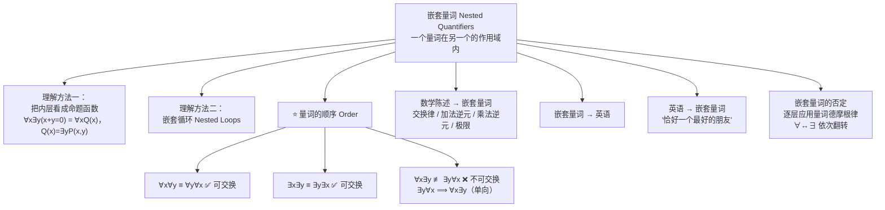

# C1.5 嵌套量词 Nested Quantifiers

> [!abstract] 本节地位
> §1.4 只处理**单个量词**。这一节处理**一个量词在另一个量词作用域内**的情形，如 $\forall x \exists y (x + y = 0)$。
> **核心考点只有一个：量词的顺序 (order of quantifiers)。** $\forall x \exists y$ 与 $\exists y \forall x$ 含义完全不同，混淆它们是数学写作中最严重、最常见的错误——**极限的 $\varepsilon$-$\delta$ 定义、一致连续 vs 逐点连续、算法复杂度的界，全部取决于量词顺序**。

> [!info] 标注说明
> 标有 **（拓展）** 或 **【拓展】** 的内容，是**课堂上没有讲到、由课件之外的教材内容延伸补充**的部分。
> 复习时可先掌握未标注的主干内容，行有余力再看拓展部分。

> [!warning] 📚 课堂进度
> **课件 Ch1.5 Part1（2026-09-10，13 张）与 Part2（2026-09-15，22 张）已收到**，覆盖了本节的主干：嵌套量词的解读、量词顺序、翻译、否定。
> **课堂未讲**：把量化看成嵌套循环、极限的 $\varepsilon$-$\delta$ 定义与“极限不存在”、“乘遍每家航空公司”的例子、Lewis Carroll 习题——已标注为**（拓展）**。
> 课件独有的**「恰好一个 Exactly One」四种情形**（整整 15 张幻灯片）已并入 §7.9，这是本节课堂上花时间最多的部分。

## 本节结构总览



---

## 1. 什么是嵌套量词

> [!important] 定义
> **嵌套量词 (nested quantifiers)** 指**一个量词出现在另一个量词的作用域之内**，例如
> $$\forall x\,\exists y\,(x + y = 0)$$

**理解的关键（把内层打包成一个命题函数）**：

> 一个量词作用域内的**全部内容都可以看作一个命题函数**。

例如
$$\forall x\,\exists y\,(x + y = 0)$$
与
$$\forall x\, Q(x),\quad \text{其中 } Q(x) = \exists y\, P(x,y),\quad P(x,y) = (x + y = 0)$$
**完全相同**。

> [!note] 这个“分层剥壳”的技巧是本节的通用解题法
> 遇到复杂的多层量词式子，**从最外层开始，一层层把内部当成黑箱**：
> $$\forall x\underbrace{\Big[\exists y \underbrace{\big[\forall z\, R(x,y,z)\big]}_{\text{记作 } S(x,y)}\Big]}_{\text{记作 } T(x)}$$
> 然后从**最内层往外**依次翻译成自然语言。**千万不要一眼从头读到尾**——那样必错。

嵌套量词在数学与计算机科学中**极为常见**。本节将学会：
- 用嵌套量词表达数学陈述（如“两个正整数之和总是正的”）；
- 用嵌套量词翻译英语句子（如“每个人恰好有一个最好的朋友”）；
- 处理含嵌套量词陈述的**否定**。

---

## 2. 理解含嵌套量词的陈述

**例 1**（论域均为实数）：

| 式子 | 含义 | 数学名称 |
|---|---|---|
| $\forall x \forall y\,(x + y = y + x)$ | 对所有实数 $x, y$ 都有 $x+y = y+x$ | **实数加法交换律** commutative law |
| $\forall x \exists y\,(x + y = 0)$ | 对每个实数 $x$，都存在一个实数 $y$ 使 $x + y = 0$ | **每个实数都有加法逆元** additive inverse |
| $\forall x \forall y \forall z\,\big(x + (y+z) = (x+y) + z\big)$ | 对所有实数 $x,y,z$ 成立 | **实数加法结合律** associative law |

**例 2**：把下式翻译成英语（论域为全体实数）：
$$\forall x \forall y\,\big((x > 0) \wedge (y < 0) \to (xy < 0)\big)$$


```
我的解：
先固定x：对于所有的y，如果x是正数，y是复数，那么xy的乘积为负。
加入x：对于所有的x和y，如果x是正数，y是复数，那么xy的乘积为负。
整理：一正一负两个实数的乘积为负（The product of two real numbers that have different signs is negative.）

评价：不合适，擅自扩大了范围——正在前负在后，而不是任意两个符号不同的。
```


**解**：这句话说：对每个实数 $x$ 和每个实数 $y$，如果 $x > 0$ 且 $y < 0$，则 $xy < 0$。
即：对实数 $x, y$，若 $x$ 为正、$y$ 为负，则 $xy$ 为负。更简洁地说：
> "**The product of a positive real number and a negative real number is always a negative real number.**"
> （**一个正实数与一个负实数之积总是负实数。**）

> [!note] 翻译的三步法（课本示范的过程）
> 1. **逐字直译**：把量词和谓词的字面意思写出来（“对每个 $x$、每个 $y$，如果……那么……”）。
> 2. **换成数学习惯说法**（“若 $x$ 为正、$y$ 为负”）。
> 3. **提炼成一句简洁的数学陈述**（“正数乘负数为负”）。
> **考试要求写到第 3 步。** 只写第 1 步会被认为没有真正理解。

---

## 3. 把量化看成嵌套循环 Thinking of Quantification as Loops（拓展）

> [!important] 课本明确给出的思维工具
> 处理多变量量化时，把它想成**嵌套循环 (nested loops)** 很有帮助。
> （当然，如果某个变量的论域有无穷多元素，实际上无法遍历所有值。尽管如此，这种思维方式仍有助于理解嵌套量词。）
> 
> 具体来说，最先出现的变量是外层循环，后出现的变量是内层循环。因为在每次检查y的时候，x都被固定。很直观。

**四种两变量量化的判定过程**：

| 式子 | 判定过程 | 何时为真 / 为假 |
|---|---|---|
| $\forall x \forall y\, P(x,y)$ | 遍历所有 $x$；对每个 $x$ 再遍历所有 $y$ | 若所有 $(x,y)$ 对 $P$ 都真，则真；**一旦碰到某个 $x$ 和某个 $y$ 使 $P(x,y)$ 假，则假** |
| $\forall x \exists y\, P(x,y)$ | 遍历所有 $x$；对每个 $x$，搜索 $y$ 直到找到使 $P(x,y)$ 真的 | 若**每个** $x$ 都能找到这样的 $y$，则真；**只要有某个 $x$ 找不到，则假** |
| $\exists x \forall y\, P(x,y)$ | 遍历 $x$，直到找到一个 $x$ 使得**对所有** $y$ 都有 $P(x,y)$ 真 | 一旦找到这样的 $x$ 则真；**若始终找不到则假** |
| $\exists x \exists y\, P(x,y)$ | 遍历 $x$；对每个 $x$ 遍历 $y$，直到碰到某个 $(x,y)$ 使 $P$ 真 | 只有**从未**碰到这样的 $(x,y)$ 时才为假 |

写成伪代码（自己动手实现一遍，理解会牢固得多）：

```python
# ∀x ∀y P(x,y)
for x in D:
    for y in D:
        if not P(x, y): return False
return True

# ∀x ∃y P(x,y)   ← y 可以依赖 x
for x in D:
    found = False
    for y in D:                # 每换一个 x，重新搜索 y
        if P(x, y): found = True; break
    if not found: return False
return True

# ∃x ∀y P(x,y)   ← 需要一个"万能"的 x
for x in D:
    ok = True
    for y in D:
        if not P(x, y): ok = False; break
    if ok: return True         # 找到一个通吃所有 y 的 x
return False

# ∃x ∃y P(x,y)
for x in D:
    for y in D:
        if P(x, y): return True
return False
```

> [!important] 从代码看出的核心差别（**本节最重要的洞察**）
> - 在 `∀x ∃y` 中，**$y$ 的搜索在 $x$ 的循环内部**，所以 **$y$ 可以依赖于 $x$**（每个 $x$ 可以配不同的 $y$）。
> - 在 `∃x ∀y` 中，**$x$ 必须在进入 $y$ 的循环之前就固定**，所以这个 $x$ 必须**对所有 $y$ 通吃**。
>
> **一句话：内层的变量可以依赖外层的变量，反之不行。**

---

## 4. ⭐ 量词的顺序 The Order of Quantifiers

> [!important] 核心规则
> 许多数学陈述涉及对多个变量的多重量化。**量词的顺序是重要的**，**除非**所有量词都是全称量词，或者所有量词都是存在量词。
>
> $$\boxed{\forall x \forall y\, P(x,y) \;\equiv\; \forall y \forall x\, P(x,y)} \qquad \boxed{\exists x \exists y\, P(x,y) \;\equiv\; \exists y \exists x\, P(x,y)}$$
> $$\boxed{\forall x \exists y\, P(x,y) \;\not\equiv\; \exists y \forall x\, P(x,y)}$$

课本页边警示："**Be careful with the order of existential and universal quantifiers!**"

> [!important] 📚 课件的判读口诀（Part1 slide 3）——本节唯一需要的技巧
> - **同类量词，顺序无所谓**（If quantifiers are the same type, the order is not a matter）。
> - **异类量词，从左往右读**（If quantifiers are different types, read from left to right）。
>
> 课件把它固化成一个句式，**逐个量词按顺序念出来，念完自然就知道意思**——不要试图整体“意会”：
> $$\forall x\,\exists y\,P(x,y)\ \longrightarrow\ \text{“For all }x\text{, there is at least one }y\text{, to make }P(x,y)\text{ happens.”}$$
> $$\exists y\,\forall x\,P(x,y)\ \longrightarrow\ \text{“At least one }y\text{, for all }x\text{, to make }P(x,y)\text{ happens.”}$$

> [!example] 📚 课件课堂测验（Part1 slide 7）：论域为实数，$P(x,y)$ 为 “$xy=0$”，下列哪些为真？
> | 选项 | 表达式 | 判定 | 理由 |
> |:-:|---|:-:|---|
> | A | $\forall x\forall y\,P(x,y)$ | ✗ | 取 $x=y=1$ 即不成立 |
> | B | $\exists x\exists y\,P(x,y)$ | ✓ | 取 $x=y=0$ |
> | C | $\forall x\exists y\,P(x,y)$ | ✓ | **对每个 $x$ 取 $y=0$** |
> | D | $\exists x\forall y\,P(x,y)$ | ✓ | **取 $x=0$，对一切 $y$ 都有 $0\cdot y=0$** |
>
> **这道题值得反复看**：C 和 D 都真，是因为 $0$ **同时**扮演了“对每个 $x$ 都能配上的 $y$”和“对所有 $y$ 都管用的万能 $x$”。
> 一般情况下 $\exists\forall$ 比 $\forall\exists$ 强得多，**这里两者都成立是特例，不是通例**。

### 例 3（同类量词可交换）

$P(x,y)$ 为 "$x + y = y + x$"，论域为全体实数。求 $\forall x \forall y P(x,y)$ 与 $\forall y \forall x P(x,y)$ 的真值。

**解**：
$\forall x \forall y P(x,y)$ 表示 "For all real numbers $x$, for all real numbers $y$, $x + y = y + x$."
因为加法交换律对所有实数成立（这是实数的公理，见附录 1），故该命题**为真**。
$\forall y \forall x P(x,y)$ 表示 "For all real numbers $y$, for all real numbers $x$, $x + y = y + x$."，含义相同，也**为真**。

> [!important] 结论
> **同类量词（全都是 $\forall$、或全都是 $\exists$）的顺序可以任意交换而不改变含义。**
> 所以可以放心地把 $\forall x \forall y$ 简写成 $\forall x, y$ 或 $\forall_{x,y}$。

### 例 4（不同类量词不可交换 —— **本节的核心例子**）

$Q(x,y)$ 为 "$x + y = 0$"，论域为全体实数。求 $\exists y \forall x\, Q(x,y)$ 与 $\forall x \exists y\, Q(x,y)$ 的真值。

**解**：

**① $\exists y \forall x\, Q(x,y)$**
含义：“**存在一个实数 $y$，使得对每一个实数 $x$，都有 $Q(x,y)$。**”
无论选哪个 $y$，**只有唯一一个 $x$** 使 $x + y = 0$（即 $x = -y$）。因此**不存在**一个 $y$ 能对所有 $x$ 都满足 $x + y = 0$。
⇒ $\exists y \forall x\, Q(x,y)$ **为假**。

**② $\forall x \exists y\, Q(x,y)$**
含义：“**对每一个实数 $x$，都存在一个实数 $y$，使得 $Q(x,y)$。**”
给定实数 $x$，**取 $y = -x$** 即可满足 $x + y = 0$。
⇒ $\forall x \exists y\, Q(x,y)$ **为真**。

**一真一假 ⇒ 两者不等价。** ∎

> [!important] 课本对这个差别的解释（值得逐字理解）
> - $\exists y \forall x\, P(x,y)$ 为真 $\iff$ **存在一个 $y$ 使 $P(x,y)$ 对每一个 $x$ 都真**。要它为真，必须有一个**特定的 $y$ 值**，使得 $P(x,y)$ **无论 $x$ 怎么选**都为真。
> - $\forall x \exists y\, P(x,y)$ 为真 $\iff$ **对每一个 $x$ 都存在一个 $y$ 使 $P(x,y)$ 真**。要它为真，无论你选哪个 $x$，都必须有一个 $y$（**这个 $y$ 可以依赖于你选的 $x$**）使 $P(x,y)$ 真。
>
> **换句话说：在后者中 $y$ 可以依赖 $x$；在前者中 $y$ 是与 $x$ 无关的常数。**

> [!important] ⭐ 单向蕴涵关系（**必记**）
> $$\boxed{\exists y \forall x\, P(x,y) \;\Longrightarrow\; \forall x \exists y\, P(x,y)}$$
> 但反过来**不成立**：$\forall x \exists y P(x,y)$ 为真时，$\exists y \forall x P(x,y)$ **不一定**为真。
> （见章末补充习题 30、31。）
>
> **口诀：$\exists\forall$ 强，$\forall\exists$ 弱；强的能推出弱的，弱的推不出强的。**
>
> **为什么？** 若存在一个“万能” $y_0$ 对所有 $x$ 都行，那当然对每个 $x$ 都能找到一个 $y$（就取 $y_0$）。反之，每个 $x$ 各配各的 $y$，不保证能找到一个通吃的。

> [!note] 生活化记忆（老师最爱举的例子）
> 设 $L(x,y)$ = “$x$ 爱 $y$”，论域为所有人。
> - $\forall x \exists y\, L(x,y)$：**每个人都爱某个人**（各爱各的，李四爱王五，张三爱赵六）。
> - $\exists y \forall x\, L(x,y)$：**存在某个人被所有人爱**（有一个万人迷）。
>
> 显然后者强得多。“人人有所爱” ⇏ “有个人被所有人爱”；但“有个人被所有人爱” ⇒ “人人有所爱”。✓
>
> 另一个版本：$\forall$ 学生 $\exists$ 老师（每个学生都有老师）vs $\exists$ 老师 $\forall$ 学生（有一个老师教所有学生）。

**TABLE 1 两个变量的量化**

| 陈述 | 何时为真 When True? | 何时为假 When False? |
|---|---|---|
| $\forall x \forall y\, P(x,y)$<br>$\forall y \forall x\, P(x,y)$ | $P(x,y)$ 对**每一对** $x,y$ 都真 | 存在一对 $x,y$ 使 $P(x,y)$ 假 |
| $\forall x \exists y\, P(x,y)$ | 对每个 $x$ 都存在一个 $y$ 使 $P(x,y)$ 真 | 存在一个 $x$，使 $P(x,y)$ 对**每一个** $y$ 都假 |
| $\exists x \forall y\, P(x,y)$ | 存在一个 $x$，使 $P(x,y)$ 对**每一个** $y$ 都真 | 对每个 $x$，都存在一个 $y$ 使 $P(x,y)$ 假 |
| $\exists x \exists y\, P(x,y)$<br>$\exists y \exists x\, P(x,y)$ | 存在一对 $x,y$ 使 $P(x,y)$ 真 | $P(x,y)$ 对**每一对** $x,y$ 都假 |

> [!note] 观察这张表的对称美
> **每一行的“何时为假”列，恰好是把该行的量词全部翻转、谓词取否定后的“何时为真”。**
> 例如 $\forall x \exists y P$ 为假 $\iff$ $\exists x \forall y \neg P$ 为真。这正是 §7 的否定规则。**先理解这张表，否定规则就不用背了。**

### 例 5（三个变量的量化）

$Q(x,y,z)$ 为 "$x + y = z$"，论域为全体实数。求 $\forall x \forall y \exists z\, Q(x,y,z)$ 与 $\exists z \forall x \forall y\, Q(x,y,z)$ 的真值。

**解**：

**① $\forall x \forall y \exists z\, Q(x,y,z)$**
含义：“对所有实数 $x$ 和所有实数 $y$，都存在一个实数 $z$ 使 $x + y = z$。”
设 $x, y$ 已被赋值，则取 $z = x + y$ 即可。⇒ **为真**。

**② $\exists z \forall x \forall y\, Q(x,y,z)$**
含义：“存在一个实数 $z$，使得对所有实数 $x$ 和所有实数 $y$ 都有 $x + y = z$。”
不存在这样的 $z$——因为不同的 $(x,y)$ 给出不同的和。⇒ **为假**。

**量词顺序在这里同样至关重要。** ∎

---

> [!example] ⭐⭐ 📚🎤 把 $\forall x\,\exists y\,P(x,y)$ 在有限论域上展开——**这道题当过期末考题**
> 课堂原话：**“这道题好像有一年被我拿来做期末考试的题了，今年我把它拿来做例题。”**
> 而且明确了答案要写到什么程度：**“如果题目没给出 $P$ 的具体含义，那这个展开式就是我期末想看到的最终答案。”**
>
> 论域 = 不超过 3 的正整数：
> $$\begin{aligned}
> \forall x\,\exists y\,P(x,y)&\equiv\exists y\,P(1,y)\wedge\exists y\,P(2,y)\wedge\exists y\,P(3,y)\\
> &\equiv\bigl[P(1,1)\vee P(1,2)\vee P(1,3)\bigr]\wedge\bigl[P(2,1)\vee P(2,2)\vee P(2,3)\bigr]\wedge\bigl[P(3,1)\vee P(3,2)\vee P(3,3)\bigr]
> \end{aligned}$$
> **步骤要写两层**：先把外层 $\forall x$ 展成三个合取项（板书记作 $Q(1)\wedge Q(2)\wedge Q(3)$），再把每个 $Q(i)=\exists y\,P(i,y)$ 展成三项析取。
>
> **展开后的形状一眼看出量词顺序的含义**：
> - $\forall x\exists y$ 是“**合取套析取**”——每一行只要有一个真就行；
> - $\exists y\forall x$ 是“**析取套合取**”——必须有一整列全真。
>
> 这是理解量词顺序最直观的角度，比抽象地想“依赖关系”容易得多。

---

## 5. 把数学陈述翻译成嵌套量词表达式

### 例 6：两个正整数之和总是正的

"**The sum of two positive integers is always positive.**"

**解**：
**第一步：把隐含的量词和论域显式化。**
> "For every two integers, if these integers are both positive, then the sum of these integers is positive."

**第二步：引入变量。**
> "For all positive integers $x$ and $y$, $x + y$ is positive."

**写法 A（论域为全体整数）**：
$$\boxed{\forall x \forall y\,\big((x > 0) \wedge (y > 0) \to (x + y > 0)\big)}$$

**写法 B（论域为全体正整数）**：
$$\boxed{\forall x \forall y\,(x + y > 0)}$$

> [!important] 再次印证 §1.4 的规则
> 写法 A 中把“正整数”作为**限制条件**，必须用 $\to$（$\forall$ 配 $\to$）。
> 写法 B 把限制放进论域，式子就干净了。**两种写法都对，看后续推理需要选哪种。**

### 例 7：每个非零实数都有乘法逆元

"**Every real number except zero has a multiplicative inverse.**"
（实数 $x$ 的**乘法逆元 (multiplicative inverse)** 是满足 $xy = 1$ 的实数 $y$。）

**解**：
改写为：“对每个实数 $x$，若 $x \ne 0$，则存在实数 $y$ 使 $xy = 1$。”
$$\boxed{\forall x\Big((x \ne 0) \to \exists y\,(xy = 1)\Big)}$$

### 例 8（需要微积分）：极限的定义 ⭐（拓展）

用量词表达实值函数 $f(x)$ 在点 $a$ 处极限的定义。

**回顾定义**：$\displaystyle\lim_{x \to a} f(x) = L$ 意为：
> 对每个实数 $\varepsilon > 0$，都存在实数 $\delta > 0$，使得只要 $0 < |x - a| < \delta$，就有 $|f(x) - L| < \varepsilon$。

**用量词表达**：
$$\boxed{\forall \varepsilon\, \exists \delta\, \forall x\,\Big(0 < |x - a| < \delta \;\to\; |f(x) - L| < \varepsilon\Big)}$$
其中 $\delta$ 与 $\varepsilon$ 的论域为**全体正实数**，$x$ 的论域为全体实数。

也可以写成**受限量词**形式（此时 $\varepsilon, \delta$ 的论域为全体实数）：
$$\forall \varepsilon > 0\;\exists \delta > 0\;\forall x\,\Big(0 < |x-a| < \delta \to |f(x) - L| < \varepsilon\Big)$$

> [!important] 这是全书最重要的量词式子，没有之一
> **量词顺序 $\forall\varepsilon\,\exists\delta\,\forall x$ 一个都不能动**：
> - $\varepsilon$ 在最外层：精度要求由“对手”任意给定，我们必须应付**所有**精度要求。
> - $\delta$ 在中间：**$\delta$ 可以依赖 $\varepsilon$**（$\varepsilon$ 越小 $\delta$ 通常越小）。这正是 $\forall\varepsilon\exists\delta$ 的含义。
> - $x$ 在最内层：$\delta$ 定好之后，**所有**落在去心邻域里的 $x$ 都要满足结论。
>
> **如果把顺序改成 $\exists\delta\,\forall\varepsilon$，就变成“存在一个万能的 $\delta$ 对所有 $\varepsilon$ 都管用”** ——这几乎不可能成立（除非 $f$ 恒等于 $L$）。
>
> **进一步（数分课上会遇到，值得现在就知道）**：
> - **逐点连续 (pointwise continuity)**：$\forall a\,\forall\varepsilon\,\exists\delta\,\forall x(\dots)$ —— $\delta$ 可以依赖 $a$ 和 $\varepsilon$。
> - **一致连续 (uniform continuity)**：$\forall\varepsilon\,\exists\delta\,\forall a\,\forall x(\dots)$ —— $\delta$ **只**依赖 $\varepsilon$，对所有点通用。
>
> **两者的差别仅仅是把 $\forall a$ 从 $\exists\delta$ 前面挪到了后面。** 整个数学分析里最微妙的一对概念，差别就在量词顺序上。这就是为什么这一节必须学扎实。
>
> 同样的道理：机器学习理论里的**一致收敛 (uniform convergence)** 与逐点收敛、$\text{PAC}$ 可学习性的定义（$\forall\varepsilon\forall\delta\exists m\forall D$），全都是量词顺序在起作用。

---

## 6. 把嵌套量词式子翻译成英语

> [!note] 课本给的方法
> 第一步：**写出量词和谓词的含义**（逐字直译）。
> 第二步：**用一个更简单的句子表达这个含义**（提炼）。

### 例 9

把下式翻译成英语：
$$\forall x\Big(C(x) \vee \exists y\big(C(y) \wedge F(x,y)\big)\Big)$$
其中 $C(x)$ = "$x$ has a computer"，$F(x,y)$ = "$x$ and $y$ are friends"，$x, y$ 的论域为你学校的所有学生。

**解**：
**逐字**：对你学校的每个学生 $x$，$x$ 有一台计算机，**或者**存在一个学生 $y$，使得 $y$ 有计算机并且 $x$ 与 $y$ 是朋友。
**提炼**：
> "**Every student in your school has a computer or has a friend who has a computer.**"
> （你学校的每个学生要么自己有电脑，要么有一个有电脑的朋友。）

### 例 10

把下式翻译成英语：
$$\exists x \forall y \forall z\Big(\big(F(x,y) \wedge F(x,z) \wedge (y \ne z)\big) \to \neg F(y,z)\Big)$$
其中 $F(a,b)$ 表示 “$a$ 与 $b$ 是朋友”，$x, y, z$ 的论域为你学校的所有学生。

**解**：
**先看括号内的表达式** $\big(F(x,y) \wedge F(x,z) \wedge (y \ne z)\big) \to \neg F(y,z)$：
它说：如果学生 $x$ 与 $y$ 是朋友、$x$ 与 $z$ 是朋友，且 $y$ 与 $z$ 不是同一个学生，那么 $y$ 与 $z$ **不是**朋友。

**加上三重量词**：存在一个学生 $x$，使得对所有学生 $y$ 和所有不同于 $y$ 的学生 $z$，若 $x$ 与 $y$ 是朋友、$x$ 与 $z$ 是朋友，则 $y$ 与 $z$ 不是朋友。

**提炼**：
> "**There is a student none of whose friends are also friends with each other.**"
> （存在一个学生，他的朋友们彼此之间都不是朋友。）

> [!note] 图论视角（第 10 章会正式讲）
> 把学生看作图的顶点、朋友关系看作边，这句话是说：“**存在一个顶点，它的邻域 (neighborhood) 中没有任何边**”，即该顶点的邻域是一个**独立集 (independent set)**，也就是说该顶点**不属于任何三角形**。
> 社交网络分析中这叫**聚类系数 (clustering coefficient) 为 0** 的节点。**嵌套量词是描述图性质的标准语言。**

---

## 7. 把英语句子翻译成嵌套量词表达式

### 例 11

"**If a person is female and is a parent, then this person is someone's mother.**"（论域为所有人。）

**解**：
改写为：“对每个人 $x$，如果 $x$ 是女性且 $x$ 是家长，那么存在一个人 $y$ 使 $x$ 是 $y$ 的母亲。”
引入 $F(x)$ = “$x$ 是女性”，$P(x)$ = “$x$ 是家长”，$M(x,y)$ = “$x$ 是 $y$ 的母亲”：
$$\forall x\Big(\big(F(x) \wedge P(x)\big) \to \exists y\, M(x,y)\Big)$$

**进一步**：利用 §1.4 习题 47(b) 的**空量化规则 (null quantification rule)**，因为 $y$ **不出现在** $F(x) \wedge P(x)$ 中，可以把 $\exists y$ 移到左边紧跟 $\forall x$ 之后，得到逻辑等价式：
$$\boxed{\forall x \exists y\Big(\big(F(x) \wedge P(x)\big) \to M(x,y)\Big)}$$

> [!note] 空量化规则是什么
> 若变量 $y$ **不在** $A$ 中自由出现，则
> $$A \to \exists y\, B(y) \;\equiv\; \exists y\,\big(A \to B(y)\big),\qquad A \to \forall y\, B(y) \equiv \forall y\,\big(A \to B(y)\big)$$
> **注意**：把 $\exists y$ 从 $\to$ 的**后件**里提到最外面时，$\exists$ **不变**；但若从**前件**里提出来，$\exists$ 要变成 $\forall$（因为前件相当于被否定了一次）：
> $$\exists y\, B(y) \to A \;\equiv\; \forall y\,\big(B(y) \to A\big)$$
> **这条容易错，考试可能考。** 记忆：**前件提取要翻转量词，后件提取不变**——与 §1.3 Table 7 中“前件的 $\wedge$ 会变 $\vee$”是同一个道理。

### 例 12：每个人恰好有一个最好的朋友 ⭐

"**Everyone has exactly one best friend.**"（论域为所有人。）

**解**：
改写：“对每个人 $x$，$x$ 恰好有一个最好的朋友。”即 $\forall x\,(\text{person } x \text{ has exactly one best friend})$。

**“$x$ 恰好有一个最好的朋友”意味着**：
存在一个人 $y$ 是 $x$ 的最好的朋友，**并且**对每个人 $z$，如果 $z$ 不是 $y$，那么 $z$ 不是 $x$ 的最好的朋友。

引入 $B(x,y)$ = “$y$ 是 $x$ 的最好的朋友”：
$$\exists y\Big(B(x,y) \wedge \forall z\big((z \ne y) \to \neg B(x,z)\big)\Big)$$

因此原句为
$$\boxed{\forall x \exists y\Big(B(x,y) \wedge \forall z\big((z \ne y) \to \neg B(x,z)\big)\Big)}$$

**用唯一性量词简写**（§1.4）：
$$\forall x\, \exists! y\, B(x,y)$$

> [!important] “恰好一个”的标准模板（**极其常用**）
> $$\exists! y\, P(y) \;\equiv\; \exists y\Big(P(y) \wedge \forall z\big(z \ne y \to \neg P(z)\big)\Big) \;\equiv\; \exists y\Big(P(y) \wedge \forall z\big(P(z) \to z = y\big)\Big)$$
> 两种写法等价（第二个是第一个内层条件句的逆否）。
> **推广**：
> - “**至少两个**”：$\exists y \exists z\big(y \ne z \wedge P(y) \wedge P(z)\big)$
> - “**恰好两个**”：$\exists y \exists z\Big(y \ne z \wedge P(y) \wedge P(z) \wedge \forall w\big(P(w) \to (w = y \vee w = z)\big)\Big)$
> - “**至多一个**”：$\forall y \forall z\big((P(y) \wedge P(z)) \to y = z\big)$
>
> **规律：存在性用 $\exists$ 列举出来，唯一性/上界用 $\forall$ 把其余的都排除掉。** 这个模板在整个高等数学中反复使用。

### 例 13：存在一个女人乘坐过世界上每家航空公司的航班（拓展）

"**There is a woman who has taken a flight on every airline in the world.**"

**解**：设 $P(w,f)$ = "$w$ has taken flight $f$"，$Q(f,a)$ = "$f$ is a flight on airline $a$"。
$$\boxed{\exists w\, \forall a\, \exists f\,\big(P(w,f) \wedge Q(f,a)\big)}$$
其中 $w$ 的论域为世界上所有女性，$f$ 为所有航班，$a$ 为所有航空公司。

**另一种写法**：设 $R(w,f,a)$ = "$w$ has taken $f$ on $a$"，则
$$\exists w\, \forall a\, \exists f\, R(w,f,a)$$

> [!note] 课本的评价（写作品味）
> 第二种写法虽然更紧凑，但**在一定程度上掩盖了变量之间的关系**（把“航班属于航空公司”这层结构藏进了三元谓词里）。因此**通常第一种解法更可取**。
> **原则：谓词的分解程度要足以支撑后续推理。** 与 §1.4 例 23 的“采用够用的最简方案”是一枚硬币的两面。

> [!important] 分析这个式子的量词顺序
> $\exists w\,\forall a\,\exists f$：
> - $w$ 在最外层 ⇒ **一个固定的女人**（不能每家航司换一个人）；
> - $a$ 在中间 ⇒ 对**每家**航司都要满足；
> - $f$ 在最内层 ⇒ **航班可以依赖航司**（每家航司配一个不同的航班，这是合理的）。
>
> 如果写成 $\exists f\,\exists w\,\forall a$，就变成“存在一个航班同时属于所有航司”，荒谬。**读多层量词式子时，一定要问：哪个变量能依赖哪个变量。**

---

### ⭐⭐ 7.9 “恰好一个 Exactly One”的四种情形（📚 课件 Part2 用了 15 张幻灯片讲这一件事）

> [!warning] 🎤 课堂：**这里就是期中翻译题最可能的出处**
> 讲完四种情形后，课堂原话：**“这种自然语言的翻译工作，肯定会是你们期中考试的题目。”**
> 教材只给了 $\exists!x\,P(x)$ 这个记号，**没有系统展开**；课件专门补上，因为 $\exists!$ 不是基本量词，推理规则也不直接支持它。
> 以下全部设 $L(x,y)$ 表示 “**$x$ loves $y$**”，**第一个参数是施动者**。

> [!important] ⭐ 通用模板：把“恰好一个”拆成两句话
> $$\underbrace{\exists x\,\bigl(\ \text{性质}(x)}_{\textbf{① 至少有一个}}\ \wedge\ \underbrace{\forall z\,\bigl(\text{性质}(z)\to z=x\bigr)}_{\textbf{② 至多有一个}}\ \bigr)$$
> **第一部分说“找得到”，第二部分说“找到的都是同一个”**（课件的说法：If anyone …, it must be $x$）。

> [!important] 情形一 **Mary loves exactly one person** 的两个写法，以及考试该写哪个
> **Version 1（不等则不爱）**：$\exists x\,\bigl(L(\text{Mary},x)\wedge\forall z\,(z\ne x\to\neg L(\text{Mary},z))\bigr)$
> **Version 2（爱则相等）**：$\exists x\,\bigl(L(\text{Mary},x)\wedge\forall z\,(L(\text{Mary},z)\to z=x)\bigr)$
>
> 🎤 课堂点明了两者等价的原因：
> $$\underbrace{z\ne x\to\neg L(\text{Mary},z)}_{\neg p\,\to\,\neg q}\qquad\text{与}\qquad\underbrace{L(\text{Mary},z)\to z=x}_{q\,\to\,p}$$
> **互为逆否命题**（[[C1.3 命题等价 Propositional Equivalences]] 的 $p\to q\equiv\neg q\to\neg p$）。
>
> **考试写 Version 2**：① 与教材 $\exists!$ 的展开式一致；② 一个否定号都不用，不易写错；③ 后面三种情形课件全用这个形状。

> [!important] ⭐ 四种情形对照表（**建议背下这张表的结构，而不是四个答案**）
> | 情形 | 中文 | 表达式 |
> |:-:|---|---|
> | **Case 1** | Mary 恰好爱一个人 | $\exists x\,\bigl(L(\text{Mary},x)\wedge\forall z\,(L(\text{Mary},z)\to z=x)\bigr)$ |
> | **Case 2** | 恰好一个人爱 Mary | $\exists x\,\bigl(L(x,\text{Mary})\wedge\forall z\,(L(z,\text{Mary})\to z=x)\bigr)$ |
> | **Case 3** | 每个人都恰好爱一个人 | $\forall y\,\exists x\,\bigl(L(y,x)\wedge\forall z\,(L(y,z)\to z=x)\bigr)$ |
> | **Case 4** | 恰好一个人爱所有人 | $\exists x\,\forall y\,\bigl(L(x,y)\wedge\forall z\,(\forall w\,L(z,w)\to z=x)\bigr)$ |
>
> **Case 1 与 Case 2 只差 $L$ 两个参数谁在前**；**Case 3 是 Case 1 外面套一个 $\forall y$**；**Case 4 最难**。
>
> > [!warning] 🔧 课件勘误（学生指出、当堂确认）
> > Case 4 的早期版本把参数写反成了 $L(y,x)$，正确是 $L(x,y)$，另有一处同样的 typo。
> > **参数顺序写反，题意就反了**——写 Case 2 是 $L(x,\text{Mary})$，写 Case 1 是 $L(\text{Mary},x)$。

> [!warning] Case 4 陷阱一：唯一性条件里必须写 $\forall w\,L(z,w)$，不能只写 $L(z,y)$
> **正确**：$\exists x\,\forall y\,\bigl(L(x,y)\wedge\forall z\,(\ \boxed{\forall w\,L(z,w)}\ \to z=x)\bigr)$
> **错误**：$\exists x\,\forall y\,\bigl(L(x,y)\wedge\forall z\,(\ \boxed{L(z,y)}\ \to z=x)\bigr)$
>
> - 写 $\forall w\,L(z,w)$ 是“**如果 $z$ 爱所有人，那么 $z$ 就是 $x$**”——这才是“爱所有人的那个人唯一”。
> - 写 $L(z,y)$ 是“只要 $z$ 爱任何一个 $y$，$z$ 就是 $x$”——等于说**全世界只有 $x$ 一个人会爱人**，太强。
>
> **口诀：唯一性条件里的“性质”，必须和存在性部分的“性质”完全一样。**

> [!example] 🎤 Case 4 陷阱二：$\forall y$ 为什么能消掉，而 $\forall w$ 不能
> 这是课堂上花时间最长的一处推导，也是**自由/约束变元第一次真正派上用场**。
> $$\begin{aligned}
> &\exists x\,\forall y\,\bigl(L(x,y)\wedge\forall z\,(\forall w\,L(z,w)\to z=x)\bigr)\\
> \Leftrightarrow\ &\exists x\,\bigl(\forall y\,L(x,y)\wedge\forall y\,\forall z\,(\cdots)\bigr) && \forall x(P\wedge Q)\equiv\forall xP\wedge\forall xQ\\
> \Leftrightarrow\ &\exists x\,\bigl(\forall y\,L(x,y)\wedge\forall z\,(\forall w\,L(z,w)\to z=x)\bigr) && \text{后半不含 }y\text{，}\forall y\text{ 可删}
> \end{aligned}$$
> **能消的那个**：第二个合取项里根本没出现 $y$ ⇒ 加不加 $\forall y$ 都不影响 ⇒ 可以消。课堂原话：**“因为对于所有的 $y$，加不加我都不影响这个部分的推导。”**
> **不能消的那个**：$w$ 确确实实出现在 $L(z,w)$ 里 ⇒ 参与了推导 ⇒ 不能消。
> **判据一句话：量词能不能移动/删除，只看它管的那个变量在里面出没出现。**

> [!important] ⭐ 顺带学到的一条重要等价——**本节最容易记反的一条**
> $$\boxed{\forall x\,(P(x)\to A)\equiv\exists x\,P(x)\to A}\qquad(A\text{ 中不含 }x)$$
> 🎤 课堂给的中文直觉（$P(x)$: “$x$ 努力工作”，$A$: “中国会强大”）：
> 
> | 式子 | 中文读法 | 强弱 |
> |---|---|:-:|
> | $\forall x\,(P(x)\to A)$ | **“对每个人来说，只要他努力，中国就会强大”**——允许有人不努力 | 弱 |
> | $\forall x\,P(x)\to A$ | **“如果所有人都努力，中国才会强大”**——一个人不努力就不行 | 强 |
>
> **前件里的 $\forall$ 要翻成 $\exists$。**
>
> > [!warning] 🎤 两条书写规范（课堂特别提醒，往年期末真的有人栽在第一条）
> > **① $\equiv$ 的优先级最低。** 上式应读作 $\bigl(\forall x P(x)\to A\bigr)\equiv\bigl(\exists x(P(x)\to A)\bigr)$。
> > 课堂原话：**“过去几年有些同学在期末比较紧张，看差了，就问‘怎么先要证明 $A$ 跟什么等价啊’。”**
> > **② $\equiv$ 与 $\Leftrightarrow$ 等效，但一份答卷里要统一**——“不能一下突然跳个 double arrow，然后下一行又变成三条杠”。

> [!example] 📚 课件练习一：**There is exactly one person whom everybody loves.**
> ① 存在性：$\exists x\,\forall y\,L(y,x)$　② 唯一性：$\forall z\,(\forall w\,L(w,z)\to z=x)$
> $$\exists x\,\bigl(\forall y\,L(y,x)\wedge\forall z\,(\forall w\,L(w,z)\to z=x)\bigr)$$
> **注意**：唯一性里写的是 $\forall w\,L(w,z)$（被**所有人**爱），不是 $L(y,z)$。

> [!example] 📚 课件练习二：⭐ **Exactly two people love Mary.**
> **拆三句**：① 至少两人爱 Mary；② 这两人不同；③ 任何爱 Mary 的人要么是 $x$ 要么是 $y$。
> $$\exists x\,\exists y\,\Bigl(L(x,\text{Mary})\wedge L(y,\text{Mary})\wedge x\ne y\wedge\forall z\,\bigl(L(z,\text{Mary})\to(z=x\vee z=y)\bigr)\Bigr)$$
> **$x\ne y$ 这一项不能漏**——漏了就变成“至少一个”。
> **推广到“恰好 $n$ 个”**：$n$ 个存在量词 + $\binom n2$ 个两两不等 + 一个“任何满足者必属于这 $n$ 个之一”。

---

## 8. 嵌套量词的否定 Negating Nested Quantifiers

> [!important] 方法
> 含嵌套量词的陈述，可以通过**逐次应用单量词的否定规则**（§1.4 Table 2 的量词德摩根律）来求否定：
> $$\neg \forall x \leadsto \exists x \neg,\qquad \neg \exists x \leadsto \forall x \neg$$
> 把 $\neg$ **一层一层往里推**，每穿过一个量词就翻转一次，最后用命题逻辑的德摩根律处理联结词。

> [!example] 📚 课件例题（Part2 slide 20–21）：求 $\forall x\,\exists y\,(xy=1)$ 的否定
> $$\begin{aligned}
> \neg\forall x\,\exists y\,(xy=1)&=\exists x\,\neg\bigl(\exists y\,(xy=1)\bigr)=\exists x\,\forall y\,\neg(xy=1)=\exists x\,\forall y\,(xy\ne1)
> \end{aligned}$$
> - 原式：**“对每个 $x$，都有某个 $y$ 能让 $xy=1$”**
> - 否定：**“存在某个 $x$，对所有 $y$ 都无法让 $xy=1$”**（这个 $x$ 就是 $0$）
>
> **要点：量词顺序不变，只是类型逐个翻转，否定最后落到谓词上。**

### 例 14

求 $\forall x \exists y\,(xy = 1)$ 的否定，使**没有否定号在量词前面**。

**解**：
$$
\begin{aligned}
\neg \forall x \exists y\,(xy = 1)
&\equiv \exists x\, \neg \exists y\,(xy = 1) && \text{量词德摩根律}\\
&\equiv \exists x\, \forall y\, \neg(xy = 1) && \text{量词德摩根律}\\
&\equiv \boxed{\exists x\, \forall y\,(xy \ne 1)}
\end{aligned}
$$

> [!important] 观察结果
> 原式 $\forall x \exists y$，否定后变成 $\exists x \forall y$——**量词全部翻转，顺序不变，最内层的谓词取否定**。
> **这就是嵌套量词否定的通用规律：$\forall \leftrightarrow \exists$ 逐个对调，谓词最后取反。**

### 例 15

用量词表达"**There does not exist a woman who has taken a flight on every airline in the world.**"

**解**：这是例 13 的否定：
$$
\begin{aligned}
\neg \exists w \forall a \exists f\,\big(P(w,f) \wedge Q(f,a)\big)
&\equiv \forall w\, \neg \forall a\, \exists f\,\big(P(w,f) \wedge Q(f,a)\big)\\
&\equiv \forall w\, \exists a\, \neg \exists f\,\big(P(w,f) \wedge Q(f,a)\big)\\
&\equiv \forall w\, \exists a\, \forall f\, \neg\big(P(w,f) \wedge Q(f,a)\big)\\
&\equiv \boxed{\forall w\, \exists a\, \forall f\,\big(\neg P(w,f) \vee \neg Q(f,a)\big)}
\end{aligned}
$$
（最后一步用了命题的德摩根律。）

**英语表述**：
> "**For every woman there is an airline such that for all flights, this woman has not taken that flight or that flight is not on this airline.**"
> （对每个女人，都存在一家航空公司，使得对所有航班，这个女人没有乘坐过该航班，或者该航班不属于这家航空公司。）

> [!note] 更自然的等价说法
> $\neg P \vee \neg Q \equiv P \to \neg Q$，所以最后一行也可写成
> $$\forall w\,\exists a\,\forall f\,\big(Q(f,a) \to \neg P(w,f)\big)$$
> 读作：“**对每个女人，都存在一家航司，她没有坐过这家航司的任何航班。**” —— 这个说法明显更接近人话，也更容易看出它就是原句的否定。
> **答题技巧：化完之后再用 $\neg A \vee B \equiv A \to B$ 把式子调整成最自然的形式。**

### 例 16（需要微积分）：极限不存在 ⭐（拓展）

用量词和谓词表达“$\displaystyle\lim_{x \to a} f(x)$ **不存在**”。

**解**：
“$\lim_{x\to a} f(x)$ 不存在”意味着：**对所有实数 $L$，$\lim_{x\to a} f(x) \ne L$**。

先求 "$\lim_{x\to a} f(x) \ne L$"，即例 8 中定义的否定：
$$\neg\Big(\forall \varepsilon > 0\;\exists \delta > 0\;\forall x\big(0 < |x-a| < \delta \to |f(x) - L| < \varepsilon\big)\Big)$$

逐层推入：
$$
\begin{aligned}
&\neg \forall \varepsilon > 0\;\exists\delta > 0\;\forall x\big(0<|x-a|<\delta \to |f(x)-L|<\varepsilon\big)\\
&\equiv \exists\varepsilon>0\;\neg\exists\delta>0\;\forall x\big(0<|x-a|<\delta \to |f(x)-L|<\varepsilon\big)\\
&\equiv \exists\varepsilon>0\;\forall\delta>0\;\neg\forall x\big(0<|x-a|<\delta \to |f(x)-L|<\varepsilon\big)\\
&\equiv \exists\varepsilon>0\;\forall\delta>0\;\exists x\;\neg\big(0<|x-a|<\delta \to |f(x)-L|<\varepsilon\big)\\
&\equiv \exists\varepsilon>0\;\forall\delta>0\;\exists x\big(0<|x-a|<\delta \;\wedge\; |f(x)-L| \ge \varepsilon\big)
\end{aligned}
$$
最后一步用了 §1.3 Table 7 的第五条 $\neg(p \to q) \equiv p \wedge \neg q$。

因为“极限不存在”意味着对**所有**实数 $L$ 都有 $\lim \ne L$，故
$$\boxed{\forall L\;\exists \varepsilon > 0\;\forall \delta > 0\;\exists x\Big(0 < |x - a| < \delta \;\wedge\; |f(x) - L| \ge \varepsilon\Big)}$$

**读法**：对每个实数 $L$，都存在一个 $\varepsilon > 0$，使得对每个 $\delta > 0$，都存在一个 $x$ 满足 $0 < |x-a| < \delta$ 且 $|f(x) - L| \ge \varepsilon$。

> [!important] 这道题是本节的集大成
> 它同时用到了：**量词德摩根律的逐层应用**、**条件语句否定 $\neg(p\to q) \equiv p \wedge \neg q$**、**受限量词**、**“对所有 $L$”的外层包裹**。
> **数学分析中的每一个“××不成立”的证明（不连续、不收敛、不一致连续、不可微），第一步都是这样把定义取否定。** 学会这一步，后面的分析课会轻松很多。

---

## 📋 课堂覆盖对照速查（课件 / 课堂录音 vs 教材）

> [!info] 课件与转写稿的内容已**逐条并入上面各节正文**（📚 = 课件独有，🎤 = 课堂口头补充，🔧 = 课件勘误）。
> 本表只用来快速确认**哪些教材内容课堂上没讲**——凡标「未讲」的，正文里都带（拓展）。
> 来源：课件 `Ch1.5` Part 1（2026-09-10，13 张）＋ Part 2（2026-09-15，22 张）＋ 课堂录音转写稿第 6、7 节课。

| 主题 | 教材 §1.5 | 课件 Ch1.5 | 差异 |
|---|---|---|---|
| 嵌套量词的定义与判读 | ✓ | ✓，口诀“同类无所谓，异类从左往右” | 一致 |
| 量词顺序（$\forall\exists$ vs $\exists\forall$） | 例 3、例 4 + Table 1 | ✓，用"loves"和 $x+y=0$ 两组例子 | 一致 |
| **把量化看成嵌套循环** | ✓ | **未讲** | 本笔记 §3（拓展） |
| 数学陈述的翻译 | 例 6–8 | ✓（正整数之和、$Q(x,y,z)$） | 一致 |
| **极限的 $\varepsilon$-$\delta$ 定义** | 例 8 | **未讲** | 本笔记已标（拓展） |
| 英语 ↔ 逻辑式互译 | 例 9–13 | ✓（computer/friend、mother、friends） | 一致 |
| **“乘遍每家航空公司”** | 例 13 | **未讲** | 本笔记已标（拓展） |
| **恰好一个 Exactly One** | 仅 $\exists!$ 记号 + 例 12 | **15 张幻灯片，四种情形 + 两道练习** | ⭐⭐ 课件独有，重点 |
| $\forall x(P(x)\to A)\equiv\exists xP(x)\to A$ | 未列 | **专门讲了一张，配中文直觉** | ⭐ 课件独有 |
| 有限论域展开 | 在 §1.4 | **在 §1.5 用 $3\times3$ 重讲一遍** | ⭐ 课件更直观 |
| 嵌套量词的否定 | 例 14–16 | ✓（$\forall x\exists y(xy=1)$） | 一致 |
| **“极限不存在”的否定** | 例 16 | **未讲** | 本笔记已标（拓展） |

> [!important] 一句话总结课件的重点
> **这节课的时间几乎全花在“恰好一个”上。**
> 考试出翻译大题时，“恰好一个 / 恰好两个”是最可能的考点——**记住 L2.1 的两段式模板和 L2.4 的两个陷阱**，比记住四个具体答案更有用。

---

---

## 精选习题与详解 Selected Exercises with Solutions

> [!example] 习题 1｜嵌套量词式子 → 英语（论域为实数）
> a) $\forall x \exists y\,(x < y)$
> b) $\forall x \forall y\,\big(((x \ge 0) \wedge (y \ge 0)) \to (xy \ge 0)\big)$
> c) $\forall x \forall y \exists z\,(xy = z)$
>
> > [!success]- 参考答案
> > **解**：
> > - a) "**For every real number $x$ there is a real number $y$ such that $x < y$.**" 提炼：**“对每个实数都存在一个比它大的实数”**，即**实数没有最大元**。（真，取 $y = x+1$。）
> > - b) "**The product of two nonnegative real numbers is nonnegative.**"（两个非负实数之积非负。）（真。）
> > - c) "**For all real numbers $x$ and $y$, their product is a real number.**"（任意两个实数的乘积仍是实数——即**实数对乘法封闭**。）（真，取 $z = xy$。）
> >
> > **要点**：a) 中 $y$ 依赖 $x$，所以只能是 $\forall x \exists y$。若写成 $\exists y \forall x (x < y)$ 就成了“存在一个比所有实数都大的实数”——**假**。

> [!example] 习题 2｜量词顺序反过来的对照
> a) $\exists x \forall y\,(xy = y)$
> b) $\forall x \forall y\,\big(((x \ge 0) \wedge (y < 0)) \to (x - y > 0)\big)$
> c) $\forall x \forall y \exists z\,(x = y + z)$
>
> > [!success]- 参考答案
> > **解**：
> > - a) "**There is a real number $x$ such that $xy = y$ for every real number $y$.**"（存在一个实数 $x$ 使得对所有实数 $y$ 都有 $xy = y$。）
> >   **真**——取 $x = 1$，即**实数乘法有单位元**。
> >   ⚠️ **这是少数 $\exists\forall$ 为真的例子**：$x=1$ 确实“通吃”所有 $y$。对比例 4 的 $\exists y\forall x(x+y=0)$ 为假——差别在于加法的“逆元”依赖于 $x$，而乘法的“单位元”不依赖于 $y$。
> > - b) "**A nonnegative real number minus a negative real number is positive.**"（非负数减负数为正。）**真**。
> > - c) "**For all real numbers $x$ and $y$, there is a real number $z$ such that $x = y + z$.**"（**实数减法总可以进行**，取 $z = x - y$。）**真**。
> > - 
> "从内向外读黑箱"这个说法容易让人误以为要**完全孤立地**看内层，但其实正确顺序是**从外向内逐层"钉死"变量**——外层的 ∀x\forall x ∀x / ∃x\exists x ∃x 先把 xx x 想象成一个具体、已知的东西，带着这个"已知量"再往内读，内层立刻就不再是黑箱了。等到整个式子读完，再把最外层的"假想值"替换回"对任意/存在这样一个 xx x"，就是完整的自然语言翻译。

> [!example] 习题 3｜“发过邮件”关系的六种量化（**经典对照题**）
> $Q(x,y)$ = "$x$ has sent an e-mail message to $y$"，论域为你班上的所有学生。
> a) $\exists x \exists y\, Q(x,y)$　b) $\exists x \forall y\, Q(x,y)$　c) $\forall x \exists y\, Q(x,y)$
> d) $\exists y \forall x\, Q(x,y)$　e) $\forall y \exists x\, Q(x,y)$　f) $\forall x \forall y\, Q(x,y)$
>
> > [!success]- 参考答案
> > **解**：
> > - a) "**Some student in your class has sent a message to some student in your class.**"（班上有人给班上某人发过邮件。）
> > - b) "**There is a student in your class who has sent a message to everyone in your class.**"（班上**有个人给所有人**都发过邮件——“群发狂”。）
> > - c) "**Every student in your class has sent a message to at least one student in your class.**"（**每个人都至少给某人**发过邮件。）
> > - d) "**There is a student in your class who has been sent a message by everyone in your class.**"（班上**有个人收到了所有人**的邮件——“万人迷”。）
> > - e) "**Every student in your class has been sent a message by at least one student in your class.**"（**每个人都至少收到过某人**的邮件。）
> > - f) "**Every student in your class has sent a message to every student in your class.**"（每个人给每个人都发过。）
> >
> > **要点（画个矩阵就全懂了）**：把 $Q$ 想象成一个 $n \times n$ 的 0/1 矩阵，行是发件人 $x$，列是收件人 $y$：
> > | 式子 | 矩阵含义 |
> > |---|---|
> > | a) $\exists x\exists y$ | 矩阵中**至少有一个 1** |
> > | f) $\forall x\forall y$ | 矩阵**全是 1** |
> > | b) $\exists x\forall y$ | **存在一整行全是 1** |
> > | c) $\forall x\exists y$ | **每一行至少有一个 1** |
> > | d) $\exists y\forall x$ | **存在一整列全是 1** |
> > | e) $\forall y\exists x$ | **每一列至少有一个 1** |
> >
> > 强弱关系：$f \Rightarrow b \Rightarrow c \Rightarrow a$，$f \Rightarrow d \Rightarrow e \Rightarrow a$。
> > **“存在一整行全是 1”（b）比“每行至少一个 1”（c）强得多**——这就是 $\exists\forall$ 强于 $\forall\exists$ 的矩阵图像。**把这张表画在笔记本上，考试时秒答。**

> [!example] 习题 9｜“爱”的十种表达（**本节最经典的翻译题**）
> $L(x,y)$ = "$x$ loves $y$"，论域为世界上所有人。
>
> > [!success]- 参考答案
> > **解**：
> > - a) **Everybody loves Jerry.** ⇒ $\boxed{\forall x\, L(x, \text{Jerry})}$
> > - b) **Everybody loves somebody.** ⇒ $\boxed{\forall x \exists y\, L(x,y)}$（各爱各的）
> > - c) **There is somebody whom everybody loves.** ⇒ $\boxed{\exists y \forall x\, L(x,y)}$（万人迷）
> > - d) **Nobody loves everybody.** ⇒ $\boxed{\neg \exists x \forall y\, L(x,y)}$，等价于 $\forall x \exists y\, \neg L(x,y)$
> > - e) **There is somebody whom Lydia does not love.** ⇒ $\boxed{\exists y\, \neg L(\text{Lydia}, y)}$
> > - f) **There is somebody whom no one loves.** ⇒ $\boxed{\exists y \forall x\, \neg L(x,y)}$
> > - g) **There is exactly one person whom everybody loves.** ⇒
> >   $$\boxed{\exists y\Big(\forall x\, L(x,y) \;\wedge\; \forall z\big(\forall x\, L(x,z) \to z = y\big)\Big)}$$
> > - h) **There are exactly two people whom Lynn loves.** ⇒
> >   $$\boxed{\exists y \exists z\Big(y \ne z \wedge L(\text{Lynn},y) \wedge L(\text{Lynn},z) \wedge \forall w\big(L(\text{Lynn},w) \to (w=y \vee w=z)\big)\Big)}$$
> > - i) **Everyone loves himself or herself.** ⇒ $\boxed{\forall x\, L(x,x)}$
> > - j) **There is someone who loves no one besides himself or herself.** ⇒
> >   $$\boxed{\exists x \forall y\big(L(x,y) \to y = x\big)}$$
> >
> > **要点**：
> > 1. **b) 与 c) 的区别就是本节的全部**：$\forall\exists$ vs $\exists\forall$。
> > 2. **g)、h) 用“恰好 $n$ 个”模板**：存在部分列出来，唯一性部分用 $\forall$ 把其余排除。
> > 3. **j) 的 $L(x,y) \to y = x$ 是“只爱自己”的标准写法**——注意它**不排除**“$x$ 不爱任何人”的情形；若要求必须爱自己，还需加 $\wedge\, L(x,x)$。
> > 4. i) 中 $L(x,x)$ 两个位置用同一变量，这在关系论里叫**自反性 (reflexivity)**（第 9 章）。

> [!example] 习题 10｜“能骗到”关系（与习题 9 结构相同，可对照练习）
> $F(x,y)$ = "$x$ can fool $y$"，论域为世界上所有人。
>
> **题目**：用量词与 $F$ 表示下列各句。
> a) Everybody can fool Fred.　b) Evelyn can fool everybody.　c) Everybody can fool somebody.
> d) There is no one who can fool everybody.　e) Everyone can be fooled by somebody.
> f) No one can fool both Fred and Jerry.　g) Nancy can fool exactly two people.
> h) There is exactly one person whom everybody can fool.　i) No one can fool himself or herself.
> j) There is someone who can fool exactly one person besides himself or herself.
>
> > [!success]- 参考答案
> > - a) **Everybody can fool Fred.** ⇒ $\forall x\, F(x,\text{Fred})$
> > - b) **Evelyn can fool everybody.** ⇒ $\forall y\, F(\text{Evelyn}, y)$
> > - c) **Everybody can fool somebody.** ⇒ $\forall x \exists y\, F(x,y)$
> > - d) **There is no one who can fool everybody.** ⇒ $\neg\exists x \forall y\, F(x,y) \equiv \forall x \exists y\, \neg F(x,y)$
> > - e) **Everyone can be fooled by somebody.** ⇒ $\forall y \exists x\, F(x,y)$
> > - f) **No one can fool both Fred and Jerry.** ⇒ $\neg\exists x\big(F(x,\text{Fred}) \wedge F(x,\text{Jerry})\big) \equiv \forall x\big(\neg F(x,\text{Fred}) \vee \neg F(x,\text{Jerry})\big)$
> > - g) **Nancy can fool exactly two people.** ⇒ 用“恰好两个”模板（同习题 9h，把 $L(\text{Lynn},\cdot)$ 换成 $F(\text{Nancy},\cdot)$）
> > - h) **There is exactly one person whom everybody can fool.** ⇒ 同习题 9g 的结构
> > - i) **No one can fool himself or herself.** ⇒ $\forall x\, \neg F(x,x)$
> > - j) **There is someone who can fool exactly one person besides himself or herself.** ⇒
> >   $$\exists x \exists y\Big(y \ne x \wedge F(x,y) \wedge \forall z\big((z \ne x \wedge F(x,z)) \to z = y\big)\Big)$$
> >
> > **要点**：**c) 与 e) 的对照**——“每个人都能骗到某人”（每行至少一个 1）vs “每个人都能被某人骗”（每列至少一个 1）。**主动/被动语态在逻辑上表现为量词绑定的是行还是列。** 这是英语翻译题的高频陷阱。

> [!example] 习题 11｜学生—教师提问关系（含 "any"、"every other" 的处理）
> $S(x)$ = “$x$ 是学生”，$F(x)$ = “$x$ 是教师”，$A(x,y)$ = “$x$ 向 $y$ 提过问题”，论域为学校相关的所有人。
>
> **题目**：用量词与上述谓词表示下列各句。
> a) Lois has asked Professor Michaels a question.
> b) Every student has asked Professor Gross a question.
> c) Every faculty member has either asked Professor Miller a question or been asked a question by Professor Miller.
> d) Some student has not asked any faculty member a question.
> e) There is a faculty member who has never been asked a question by a student.
> f) Some student has asked every faculty member a question.
> g) There is a faculty member who has asked every other faculty member a question.
> h) Some student has never been asked a question by a faculty member.
>
> > [!success]- 参考答案
> > - a) **Lois has asked Professor Michaels a question.** ⇒ $A(\text{Lois}, \text{Professor Michaels})$
> > - b) **Every student has asked Professor Gross a question.** ⇒ $\forall x\big(S(x) \to A(x, \text{Professor Gross})\big)$
> > - c) **Every faculty member has either asked Professor Miller a question or been asked a question by Professor Miller.** ⇒
> >   $$\forall x\Big(F(x) \to \big(A(x,\text{Prof. Miller}) \vee A(\text{Prof. Miller}, x)\big)\Big)$$
> > - d) **Some student has not asked any faculty member a question.** ⇒
> >   $$\exists x\Big(S(x) \wedge \forall y\big(F(y) \to \neg A(x,y)\big)\Big)$$
> > - e) **There is a faculty member who has never been asked a question by a student.** ⇒
> >   $$\exists x\Big(F(x) \wedge \forall y\big(S(y) \to \neg A(y,x)\big)\Big)$$
> > - f) **Some student has asked every faculty member a question.** ⇒
> >   $$\exists x\Big(S(x) \wedge \forall y\big(F(y) \to A(x,y)\big)\Big)$$
> > - g) **There is a faculty member who has asked every other faculty member a question.** ⇒
> >   $$\exists x\Big(F(x) \wedge \forall y\big((F(y) \wedge y \ne x) \to A(x,y)\big)\Big)$$
> > - h) **Some student has never been asked a question by a faculty member.** ⇒
> >   $$\exists x\Big(S(x) \wedge \forall y\big(F(y) \to \neg A(y,x)\big)\Big)$$
> >
> > **要点**：
> > 1. **d) 中的 "not asked **any**"** = “没有向**任何**教师提问” = $\forall y(F(y) \to \neg A(x,y))$，**不是** $\neg\forall y(\dots)$。英语的 "not ... any" 在逻辑上是 $\forall\neg$。
> > 2. **g) 中的 "every **other**"** 必须加上 $y \ne x$ 这个条件，否则会要求他向自己提问。**看到 other、else、besides 就要加不等号。**
> > 3. 每一层都是 **$\exists$ 配 $\wedge$、$\forall$ 配 $\to$**（§1.4 的规则在嵌套情形下逐层适用）。

> [!example] 习题 12h, 12i, 12l｜“恰好一个”与“除一个之外”（难点集中）
> $I(x)$ = “$x$ 有网络连接”，$C(x,y)$ = “$x$ 与 $y$ 在网上聊过天”，论域为你班上所有学生。
>
> **题目**：用量词表示下列各句。
> e) Sanjay has chatted with everyone except Joseph.
> h) Exactly one student in your class has an Internet connection.
> i) Everyone except one student in your class has an Internet connection.
> l) There are two students in your class who have not chatted with each other over the Internet.
>
> > [!success]- 参考答案
> > **h) Exactly one student in your class has an Internet connection.**
> > $$\boxed{\exists x\Big(I(x) \wedge \forall y\big(y \ne x \to \neg I(y)\big)\Big)}$$
> >
> > **i) Everyone except one student in your class has an Internet connection.**
> > $$\boxed{\exists x\Big(\neg I(x) \wedge \forall y\big(y \ne x \to I(y)\big)\Big)}$$
> >
> > **l) There are two students in your class who have not chatted with each other over the Internet.**
> > $$\boxed{\exists x \exists y\Big(x \ne y \wedge \neg C(x,y) \wedge \neg C(y,x)\Big)}$$
> >
> > **e) Sanjay has chatted with everyone except Joseph.**
> > $$\boxed{\forall y\Big(\big(y \ne \text{Sanjay} \wedge y \ne \text{Joseph}\big) \to C(\text{Sanjay}, y)\Big) \;\wedge\; \neg C(\text{Sanjay}, \text{Joseph})}$$
> >
> > **要点**：
> > - h) 与 i) 是**镜像结构**：h) 是“恰好一个有”，i) 是“恰好一个没有”。**把 $I$ 与 $\neg I$ 对调即可。**
> > - e) 中的 "everyone except Joseph" 要写成**两部分的合取**：① 除 Joseph 外都聊过；② **和 Joseph 没聊过**。只写①是不完整的——"except" 蕴含了“这一个确实是例外”。
> > - l) 中“聊天”通常是对称关系，若题目默认 $C(x,y) \leftrightarrow C(y,x)$，则只需 $\neg C(x,y)$；但**严谨起见两个方向都写上更安全**。

> [!example] 习题 16｜带具体人数的量化真值判定
> 一个离散数学班包含：数学专业大一 1 人、数学专业大二 12 人、计算机专业大二 15 人、数学专业大三 2 人、计算机专业大三 2 人、计算机专业大四 1 人。**共 33 人**。
>
> 设 $M(x)$ = “$x$ 是数学专业”，$C(x)$ = “$x$ 是计算机专业”，$F(x), S(x), J(x), R(x)$ 分别表示大一、大二、大三、大四。论域为班上所有学生。
>
> | 汇总表 | 大一 | 大二 | 大三 | 大四 | 合计 |
> |---|---|---|---|---|---|
> | 数学 Math | 1 | 12 | 2 | 0 | 15 |
> | 计算机 CS | 0 | 15 | 2 | 1 | 18 |
> | 合计 | 1 | 27 | 4 | 1 | **33** |
>
> **题目**：判断下列命题的真值。
> a) There is a student in the class who is a junior.
> b) Every student in the class is a computer science major.
> c) There is a student in the class who is neither a mathematics major nor a junior.
> d) Every student in the class is either a sophomore or a computer science major.
> e) There is a major such that there is a student in the class in every year of study with that major.
>
> > [!success]- 参考答案
> > **a) There is a student in the class who is a junior.**
> > $\exists x\, J(x)$ ⇒ 大三有 $2 + 2 = 4$ 人 ⇒ **真**
> >
> > **b) Every student in the class is a computer science major.**
> > $\forall x\, C(x)$ ⇒ 有 15 个数学专业的学生 ⇒ **假**
> >
> > **c) There is a student in the class who is neither a mathematics major nor a junior.**
> > $\exists x\,\big(\neg M(x) \wedge \neg J(x)\big)$ ⇒ 需要一个既非数学专业又非大三的人 ⇒ 计算机专业大二的 15 人符合 ⇒ **真**
> >
> > **d) Every student in the class is either a sophomore or a computer science major.**
> > $\forall x\,\big(S(x) \vee C(x)\big)$ ⇒ 检查每一类：
> > - 数学大一 1 人：不是大二 ✗，不是 CS ✗ ⇒ **反例！**
> > ⇒ **假**
> >
> > **e) There is a major such that there is a student in the class in every year of study with that major.**
> > $\exists m\,\forall y\,\exists x\,\big(\text{major}(x) = m \wedge \text{year}(x) = y\big)$ ⇒ 需要某个专业在**四个年级都有人**：
> > - 数学：大一 1、大二 12、大三 2、**大四 0** ✗
> > - 计算机：**大一 0** ✗、大二 15、大三 2、大四 1
> > ⇒ 两个专业都不满足 ⇒ **假**
> >
> > **要点**：这类题**先画汇总表**，再逐条对照，比在脑子里数快得多也准得多。**d) 的反例（数学大一那 1 个人）最容易被漏掉——检查 $\forall$ 时要遍历表格的每一个非零格子。**

> [!example] 习题 17｜系统规约（含 "exactly one"、"only if"）
> **题目**：用量词与谓词表示下列系统规约。
> a) Every user has access to exactly one mailbox.
> b) There is a process that continues to run during all error conditions only if the kernel is working correctly.
> c) All users on the campus network can access all websites whose url has a .edu extension.
> d) There are exactly two systems that monitor every remote server.
>
> > [!success]- 参考答案
> > **a) Every user has access to exactly one mailbox.**
> > 设 $A(u, m)$ = “用户 $u$ 能访问邮箱 $m$”：
> > $$\boxed{\forall u\, \exists m\Big(A(u,m) \wedge \forall n\big(n \ne m \to \neg A(u,n)\big)\Big)}$$
> > 也可写作 $\forall u\, \exists! m\, A(u,m)$。
> >
> > **b) There is a process that continues to run during all error conditions only if the kernel is working correctly.**
> > 设 $R(p,e)$ = “进程 $p$ 在错误状况 $e$ 期间继续运行”，$K$ = “内核正常工作”。"$A$ only if $B$" = $A \to B$：
> > $$\boxed{\exists p\,\forall e\, R(p,e) \;\to\; K}$$
> >
> > **c) All users on the campus network can access all websites whose url has a .edu extension.**
> > 设 $U(x)$ = “$x$ 是校园网用户”，$E(w)$ = “网站 $w$ 的 url 以 .edu 结尾”，$A(x,w)$ = “$x$ 能访问 $w$”：
> > $$\boxed{\forall x\, \forall w\Big(\big(U(x) \wedge E(w)\big) \to A(x,w)\Big)}$$
> >
> > **d)（∗ 难）There are exactly two systems that monitor every remote server.**
> > 设 $M(s,r)$ = “系统 $s$ 监控远程服务器 $r$”。记 $\Phi(s) := \forall r\, M(s,r)$（“$s$ 监控所有远程服务器”），则要求恰好有两个 $s$ 满足 $\Phi$：
> > $$\boxed{\exists s_1 \exists s_2\Big(s_1 \ne s_2 \wedge \Phi(s_1) \wedge \Phi(s_2) \wedge \forall s\big(\Phi(s) \to (s = s_1 \vee s = s_2)\big)\Big)}$$
> > 展开就是把每个 $\Phi(\cdot)$ 换成 $\forall r\, M(\cdot, r)$。
> >
> > **要点**：d) 演示了**先给复杂条件起个名字 $\Phi(s)$，套完“恰好两个”模板再展开**的做法。直接硬写四层量词极易出错。**这个“先命名再套模板”的技巧应该成为习惯。**

> [!example] 习题 19｜数学陈述的量词表达（注意 "not necessarily"）
> 论域为全体整数。
>
> **题目**：用量词表示下列陈述。
> a) The sum of two negative integers is negative.
> b) The difference of two positive integers is not necessarily positive.
>
> > [!success]- 参考答案
> > **a) The sum of two negative integers is negative.**
> > $$\forall x \forall y\Big(\big((x < 0) \wedge (y < 0)\big) \to (x + y < 0)\Big)$$
> >
> > **b) The difference of two positive integers is not necessarily positive.**
> > “不一定为正” = “**存在**两个正整数其差不为正”：
> > $$\boxed{\exists x \exists y\Big((x > 0) \wedge (y > 0) \wedge (x - y \le 0)\Big)}$$
> >
> > **要点**：**"is not necessarily"（不一定）翻译成 $\exists$ + 否定**，而不是 $\forall$ + 否定。
> > 中文“两个正整数之差不一定是正的”= “并非所有正整数之差都为正”= $\neg\forall(\dots) \equiv \exists(\dots \wedge \neg\dots)$。
> > b) 的一个见证：$x = 1, y = 2$，$x - y = -1 \le 0$。✓

> [!example] 习题 62（§1.4 末尾的 Lewis Carroll 题）｜鸭子与军官（拓展）
> $P(x)$ = “$x$ 是鸭子”，$Q(x)$ = “$x$ 是我的家禽”，$R(x)$ = “$x$ 是军官”，$S(x)$ = “$x$ 愿意跳华尔兹”。
> a) **No ducks are willing to waltz.** ⇒ $\forall x\big(P(x) \to \neg S(x)\big)$，等价于 $\neg\exists x\big(P(x) \wedge S(x)\big)$
> b) **No officers ever decline to waltz.** ⇒ $\forall x\big(R(x) \to S(x)\big)$（“从不拒绝跳” = “都愿意跳”）
> c) **All my poultry are ducks.** ⇒ $\forall x\big(Q(x) \to P(x)\big)$
> d) **My poultry are not officers.** ⇒ $\forall x\big(Q(x) \to \neg R(x)\big)$
> e) **d) 能从 a)、b)、c) 推出吗？**
>
> > [!success]- 参考答案
> > **解 e)**：**能。** 推理如下（这是 §1.6 的内容，提前演示）：
> > 设 $x$ 是我的家禽，即 $Q(x)$。
> > - 由 c)：$Q(x) \to P(x)$ ⇒ $x$ 是鸭子。
> > - 由 a)：$P(x) \to \neg S(x)$ ⇒ $x$ 不愿意跳华尔兹。
> > - 由 b) 的**逆否命题** $\neg S(x) \to \neg R(x)$ ⇒ $x$ 不是军官。
> > 因此 $\forall x(Q(x) \to \neg R(x))$，即 d)。∎
> >
> > **要点**：Lewis Carroll 这类题的解法是**把所有前提化成 $\forall x(A(x) \to B(x))$ 的统一形式，然后把它们串成一条蕴涵链**，必要时用逆否命题调转方向。
> > 链条：$Q \to P \to \neg S \to \neg R$。
> > **这就是所谓的“苏格拉底式三段论”的一般化，§1.6 会用“全称实例化 + 假言三段论 + 全称推广”来形式化它。**

---

## 本节自测 Self-Test

> [!question] 1. 什么是嵌套量词？理解它的通用方法是什么？
> > [!success]- 答案
> > **答**：一个量词出现在另一个量词的作用域内。理解方法是把内层量词的整个作用域看成一个命题函数，从最外层往里逐层剥壳，再从最内层往外翻译。

> [!question] 2. ⭐ 哪些量词顺序可以交换，哪些不可以？
> > [!success]- 答案
> > **答**：$\forall x\forall y \equiv \forall y\forall x$，$\exists x\exists y \equiv \exists y\exists x$（同类可交换）；$\forall x\exists y \not\equiv \exists y\forall x$（异类不可交换）。

> [!question] 3. $\forall x\exists y P(x,y)$ 与 $\exists y \forall x P(x,y)$ 的实质区别是什么？哪个更强？
> > [!success]- 答案
> > **答**：前者中 $y$ **可以依赖** $x$（每个 $x$ 配不同的 $y$）；后者要求存在一个**与 $x$ 无关的固定** $y$ 通吃所有 $x$。后者更强：$\exists y\forall x P \Rightarrow \forall x\exists y P$，反之不成立。

> [!question] 4. 举一个 $\forall x \exists y$ 真而 $\exists y \forall x$ 假的例子。
> > [!success]- 答案
> > **答**：$P(x,y)$ = "$x + y = 0$"，论域为实数。$\forall x\exists y$ 真（取 $y = -x$）；$\exists y\forall x$ 假（没有一个 $y$ 能让所有 $x$ 都满足）。

> [!question] 5. 举一个 $\exists x \forall y$ 为真的例子。
> > [!success]- 答案
> > **答**：$\exists x \forall y\,(xy = y)$，取 $x = 1$（乘法单位元），论域为实数。**关键在于这个 $x$ 不依赖 $y$。**

> [!question] 6. 用嵌套循环解释 $\forall x \exists y P(x,y)$ 的判定过程。
> > [!success]- 答案
> > **答**：外层遍历所有 $x$；对每个 $x$，内层重新搜索 $y$ 直到找到使 $P(x,y)$ 为真的；若某个 $x$ 搜完都找不到，则为假；所有 $x$ 都能找到则为真。

> [!question] 7.（拓展）写出极限 $\lim_{x\to a} f(x) = L$ 的量词定义，并说明为什么量词顺序不能改。
> > [!success]- 答案
> > **答**：$\forall\varepsilon>0\,\exists\delta>0\,\forall x\,(0<|x-a|<\delta \to |f(x)-L|<\varepsilon)$。
> > $\varepsilon$ 在外表示要应付任意精度要求；$\delta$ 在中表示 $\delta$ 可以依赖 $\varepsilon$；若改成 $\exists\delta\forall\varepsilon$ 就要求一个万能的 $\delta$，几乎不可能成立。

> [!question] 8.（拓展）逐点连续与一致连续的量词表达差在哪里？
> > [!success]- 答案
> > **答**：逐点连续 $\forall a\forall\varepsilon\exists\delta\forall x$（$\delta$ 可依赖 $a$）；一致连续 $\forall\varepsilon\exists\delta\forall a\forall x$（$\delta$ 只依赖 $\varepsilon$）。差别只在 $\forall a$ 相对 $\exists\delta$ 的位置。

> [!question] 9. 嵌套量词的否定怎么做？
> > [!success]- 答案
> > **答**：把 $\neg$ 逐层往里推，每穿过一个量词就翻转（$\forall \to \exists$，$\exists \to \forall$），顺序不变；最后用命题德摩根律和 $\neg(p\to q)\equiv p\wedge\neg q$ 处理内层联结词。

> [!question] 10. 求 $\forall x \exists y \forall z\, P(x,y,z)$ 的否定。
> > [!success]- 答案
> > **答**：$\exists x \forall y \exists z\, \neg P(x,y,z)$。

> [!question] 11. “恰好有一个 $y$ 满足 $P(y)$”怎么写？
> > [!success]- 答案
> > **答**：$\exists y\big(P(y) \wedge \forall z(P(z) \to z = y)\big)$，即 $\exists! y\, P(y)$。

> [!question] 12. “$x$ 向每个**其他**教师提过问”中的 "other" 在符号上如何体现？
> > [!success]- 答案
> > **答**：加不等号条件，写成 $\forall y\big((F(y) \wedge y \ne x) \to A(x,y)\big)$。看到 other / else / besides 就要加 $\ne$。

> [!question] 13. "The difference of two positive integers is not necessarily positive" 为什么用 $\exists$ 而不是 $\forall$？
> > [!success]- 答案
> > **答**：“不一定”是对全称命题的否定，即 $\neg\forall(\dots \to \dots) \equiv \exists(\dots \wedge \neg\dots)$，所以是存在量化。

> [!question] 14. 把 $\exists y\, B(y) \to A$ 中的量词提到最外面，量词要不要变？
> > [!success]- 答案
> > **答**：**要变**，$\exists y B(y) \to A \equiv \forall y\big(B(y) \to A\big)$。前件位置相当于被否定一次，所以量词翻转。而从后件提取时量词不变：$A \to \exists y B(y) \equiv \exists y(A \to B(y))$（$y$ 不在 $A$ 中自由出现时）。

---

## 关联

- 上一节：[[C1.4 谓词与量词 Predicates and Quantifiers]]
- 下一节：[[C1.6 推理规则 Rules of Inference]]（终于要用这些式子做推理了）
- 章索引：[[C1 基础：逻辑与证明 MOC]]
- 本节的量词德摩根律来自 [[C1.4 谓词与量词 Predicates and Quantifiers]]，$\neg(p\to q) \equiv p \wedge \neg q$ 来自 [[C1.3 命题等价 Propositional Equivalences]]
- Lewis Carroll 的论证（§1.4 例 26、27 与习题 62）要用 [[C1.6 推理规则 Rules of Inference]] 的量化推理规则来严格验证
- 极限定义的量词形式是数学分析、以及机器学习理论中“一致收敛”“PAC 可学习”的直接祖先
