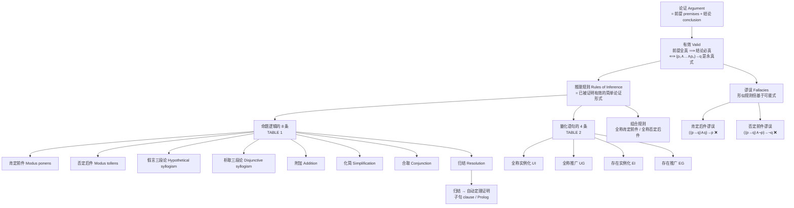

# C1.6 推理规则 Rules of Inference

> [!abstract] 本节地位
> 前五节建立了**语言**（命题、联结词、谓词、量词）与**等价变形**；这一节建立**推理**——从已知的真陈述**合法地**推出新的真陈述。
> **数学证明就是有效论证。** §1.7、§1.8 讲的各种证明方法，骨架全是本节的推理规则。Table 1（命题逻辑 8 条）和 Table 2（量化 4 条）**必须背下来并能默写**。

> [!info] 标注说明
> 标有 **（拓展）** 或 **【拓展】** 的内容，是**课堂上没有讲到、由课件之外的教材内容延伸补充**的部分。
> 复习时可先掌握未标注的主干内容，行有余力再看拓展部分。

> [!warning] 📚 课堂进度
> **课件 Ch1.6 Part1（2026-09-15，8 张）与 Part2（2026-09-16，33 张）已收到**，本节的主干**全部讲过**：
> 论证与有效性、Table 1 的八条规则（含归结）、用推理规则构造论证、两个谬误、四条量化推理规则、全称肯定前件式/否定后件式。
> **课堂未讲**：归结的**子句与 CNF** 理论——已标注为**（拓展）**。
> 课件独有的内容（**推理 vs 等价的对照表**、**⇒ 链式书写法**）见文末「📚 课件补充」。

## 本节结构总览



---

## 1. 论证与有效性 Arguments and Validity

> [!important] 基本术语
> - **论证 (argument)**：一串以**结论**结尾的陈述序列。
> - **前提 (premises)**：论证中除最后一句之外的全部陈述。
> - **结论 (conclusion)**：论证的最后一句、最终陈述。
> - **有效的 (valid)**：结论**必须**从前面陈述（前提）的真值中推出。
>   等价说法：**论证有效 $\iff$ 不可能出现"所有前提都真而结论为假"的情形。**
>
> **数学中的证明 (proof) 就是确立数学陈述真实性的有效论证。**
> **推理规则 (rules of inference)** 是构造有效论证的**模板**，是确立陈述真实性的基本工具。

### 一个例子

考虑这个论证：
> "If you have a current password, then you can log onto the network."（如果你有当前密码，那么你能登录网络。）
> "You have a current password."（你有当前密码。）
> 因此，
> "You can log onto the network."（你能登录网络。）

设 $p$ = "You have a current password"，$q$ = "You can log onto the network"，则论证形式为
$$
\begin{array}{c}
p \to q \\
p \\
\hline
\therefore\ q
\end{array}
$$
其中 **$\therefore$ 是"因此 (therefore)"的符号**。

**为什么它有效？** 因为 $\big((p \to q) \wedge p\big) \to q$ 是**永真式**（§1.3 习题 10c）。也就是说，只要 $p \to q$ 与 $p$ 都真，$q$ 就必然真。

### 有效 ≠ 结论为真！（**极其重要的区分**）

> [!warning] 课本反复强调的核心概念
> **论证有效，只保证"若前提全真则结论真"；如果某个前提为假，结论完全可以是假的。**

**课本的例子**：设 $p$ 代表 "You have access to the network"，$q$ 代表 "You can change your grade"，且 $p$ 为真但 $p \to q$ 为假。代入同一个论证形式得到：
> "If you have access to the network, then you can change your grade."
> "You have access to the network."
> ∴ "You can change your grade."

**这个论证是有效的**（形式正确），但因为**第一个前提是假的**，我们**不能**据此断定结论为真（而且这个结论很可能是假的）。

> [!important] ⭐ 记住这一句
> $$\textbf{有效 (valid)} \ne \textbf{可靠 (sound)}$$
> - **有效**：形式正确，前提真则结论真。（**逻辑学关心的**）
> - **可靠 (sound)**：有效 **且** 所有前提都实际为真。（**这才保证结论真**）
>
> 日常辩论中的"逻辑没问题但前提错了"，说的就是有效而不可靠。

> [!important] 定义 1
> 命题逻辑中的**论证 (argument)** 是一个命题序列。除最后一个之外的所有命题称为**前提 (premises)**，最后一个称为**结论 (conclusion)**。论证是**有效的 (valid)**，如果所有前提的真蕴涵结论为真。
>
> 命题逻辑中的**论证形式 (argument form)** 是一个由命题变元构成的复合命题序列。论证形式是**有效的**，如果无论用什么具体命题代入其中的命题变元，只要前提全真，结论就为真。

> [!important] 有效性的判定准则
> 前提为 $p_1, p_2, \dots, p_n$、结论为 $q$ 的论证形式是有效的，**当且仅当**
> $$\boxed{(p_1 \wedge p_2 \wedge \cdots \wedge p_n) \to q \ \text{是永真式}}$$
>
> **证明命题逻辑中一个论证有效的关键，就是证明它的论证形式有效。**

---

## 2. 命题逻辑的推理规则 Rules of Inference for Propositional Logic

> [!note] 为什么不用真值表
> 原则上总可以用真值表判定论证形式是否有效——检查每一行前提全真时结论是否也真。但这**太笨重**：
> **一个含 10 个不同命题变元的论证形式，真值表需要 $2^{10} = 1024$ 行。**
> 所以我们先确立一批**相对简单的论证形式的有效性**（称为**推理规则**），再把它们当作**积木**拼装出复杂的有效论证。

### 2.1 肯定前件式 Modus Ponens

基于永真式 $\big(p \wedge (p \to q)\big) \to q$，得到推理规则
$$
\begin{array}{c}
p \\
p \to q \\
\hline
\therefore\ q
\end{array}
$$
称为 **modus ponens（肯定前件式）**，或 **分离律 (law of detachment)**。

> [!note] 名字的来历
> **Modus ponens** 是拉丁文 *mode that affirms*（肯定的方式）的意思。
> 记号约定：**假设写成一列，下面画一条横线，横线下以 $\therefore$ 开头写结论。**（考试答题就用这个格式。）
>
> 含义一句话：**如果一个条件语句和它的前件都为真，那么它的结论也必然为真。**

**例 1**：若条件语句 "If it snows today, then we will go skiing" 及其前件 "It is snowing today" 都为真，则由 modus ponens 可知结论 "We will go skiing" 为真。

**例 2**（**有效但结论为假的经典例子**）：判断以下论证是否有效，其结论是否因论证有效而必然为真。
> "If $\sqrt{2} > \frac{3}{2}$, then $(\sqrt2)^2 > \left(\frac32\right)^2$. We know that $\sqrt2 > \frac32$. Consequently, $(\sqrt2)^2 = 2 > \left(\frac32\right)^2 = \frac94$."

**解**：设 $p$ = "$\sqrt2 > \frac32$"，$q$ = "$2 > \left(\frac32\right)^2$"。前提是 $p \to q$ 和 $p$，结论是 $q$。
论证由 modus ponens 构造 ⇒ **有效**。
但前提 $p$（即 $\sqrt2 > \frac32$）**为假**（$\sqrt2 \approx 1.414 < 1.5$）⇒ **不能**断定结论为真。
事实上结论**为假**，因为 $2 < \frac94 = 2.25$。∎

> [!warning] 这道例题必须掌握
> 它同时演示了：**有效 ≠ 结论真**、**有效论证 + 假前提 = 假结论完全可能**。
> 考试问"这个论证有效吗？结论一定为真吗？"时，**要分两问分别回答**。

### 2.2 TABLE 1 推理规则（**8 条，必背**）

| 推理规则 Rule of Inference                                                               | 对应永真式 Tautology                                              | 名称 Name                    | 中文          |
| ------------------------------------------------------------------------------------ | ------------------------------------------------------------ | -------------------------- | ----------- |
| $\dfrac{\begin{array}{c}p \\ p \to q\end{array}}{\therefore\ q}$                     | $\big(p \wedge (p \to q)\big) \to q$                         | **Modus ponens**           | 肯定前件式 / 分离律 |
| $\dfrac{\begin{array}{c}\neg q \\ p \to q\end{array}}{\therefore\ \neg p}$           | $\big(\neg q \wedge (p \to q)\big) \to \neg p$               | **Modus tollens**          | 否定后件式       |
| $\dfrac{\begin{array}{c}p \to q \\ q \to r\end{array}}{\therefore\ p \to r}$         | $\big((p\to q) \wedge (q \to r)\big) \to (p \to r)$          | **Hypothetical syllogism** | 假言三段论       |
| $\dfrac{\begin{array}{c}p \vee q \\ \neg p\end{array}}{\therefore\ q}$               | $\big((p \vee q) \wedge \neg p\big) \to q$                   | **Disjunctive syllogism**  | 析取三段论       |
| $\dfrac{p}{\therefore\ p \vee q}$                                                    | $p \to (p \vee q)$                                           | **Addition**               | 附加律         |
| $\dfrac{p \wedge q}{\therefore\ p}$                                                  | $(p \wedge q) \to p$                                         | **Simplification**         | 化简律         |
| $\dfrac{\begin{array}{c}p \\ q\end{array}}{\therefore\ p \wedge q}$                  | $\big((p) \wedge (q)\big) \to (p \wedge q)$                  | **Conjunction**            | 合取律         |
| $\dfrac{\begin{array}{c}p \vee q \\ \neg p \vee r\end{array}}{\therefore\ q \vee r}$ | $\big((p \vee q) \wedge (\neg p \vee r)\big) \to (q \vee r)$ | **Resolution**             | 归结          |

（这些规则的有效性验证见 §1.3 习题 9、10、15、30。）

> [!important] 八条规则的记忆图谱
> ```mermaid
> graph TD
>     A["8 条推理规则"] --> B["处理条件语句 →"]
>     A --> C["处理析取 ∨"]
>     A --> D["拆装合取 ∧"]
>     B --> B1["Modus ponens: 有 p，得 q（顺推）"]
>     B --> B2["Modus tollens: 无 q，得无 p（逆推）"]
>     B --> B3["Hypothetical syllogism: 链式传递 p→q→r"]
>     C --> C1["Disjunctive syllogism: 二选一排除法"]
>     C --> C2["Addition: 结论变弱（加一个 ∨）"]
>     C --> C3["Resolution: 消去互补文字 p 与 ¬p"]
>     D --> D1["Simplification: 拆开 ∧ 取一半"]
>     D --> D2["Conjunction: 把两个真命题合起来"]
> ```
>
> **两条"改变强度"的规则要特别注意方向**：
> - **Addition（附加）**：$p \Rightarrow p \vee q$ —— 结论**变弱**（析取比单项弱）。**反过来不成立！**
> - **Simplification（化简）**：$p \wedge q \Rightarrow p$ —— 结论**变弱**（合取的一半比整体弱）。**反过来不成立！**
> - **Conjunction（合取）**：$p, q \Rightarrow p \wedge q$ —— 把两个已知的真合并。
>
> **口诀：$\vee$ 只进不出（Addition 能加不能减），$\wedge$ 只出不进（Simplification 能减，进要靠 Conjunction 两个都有）。**

> [!info] 命题符号与真值的关系
> - 小写字母 $p, q, r$ 表示**命题变元**，代表一个完整的陈述句（如"今天下雨"），本身**不携带真值**
> - **真值（T/F）** 是命题在具体情境下才有的属性，符号本身只是占位符，类似代数中的变量 $x$

> [!info] 推理规则在做什么
> - 推理规则关心的是**形式**，不关心**内容**
> - 每条推理规则对应一个**永真式（tautology）**，无论 $p,q,r$ 代入什么命题，该蕴含式恒为真
> - 应用推理规则 = **模式匹配**：把手头前提的形式与规则模板对比，形式相符就可以直接套用规则得出结论，无需每次重新验证真值表
> - 这是"一次性证明模板永远有效，之后反复套用"的思路，是形式化证明（如 direct proof）的基础

> [!warning] 关于"前提是否为真"——两种不同语境
> **① 抽象地陈述一条推理规则本身**
> - 只是在说"**如果**前提为真，**那么**结论必然为真"这一形式结构永远成立
> - $p,q$ 是否代表真实命题、内容是什么，完全不重要
>
> **② 用推理规则做具体证明题**
> - 前提可能是题目**直接给定**的已知条件 → 在该题范围内被当作真的处理，无需验证其现实真假
> - 前提也可能是**为论证临时假设**的（如反证法）→ 往往故意假设一个怀疑为假的命题，目的是推出矛盾从而证明其为假
>
> **结论**：逻辑推理不负责判断前提在现实中是否为真，只负责保证——**一旦前提为真，结论必然为真**。前提本身的真假，取决于其来源（已知条件 / 已证定理 / 临时假设），不属于推理规则本身要回答的问题。

**例 3**：判断下列论证用的是哪条规则。
> "It is below freezing now. Therefore, it is either below freezing or raining now."

**解**：设 $p$ = "It is below freezing now"，$q$ = "It is raining now"。论证形式为
$$\frac{p}{\therefore\ p \vee q}$$
这是 **附加律 (addition rule)**。

**例 4**：
> "It is below freezing and raining now. Therefore, it is below freezing now."

**解**：形式为
$$\frac{p \wedge q}{\therefore\ p}$$
这是 **化简律 (simplification rule)**。

**例 5**：
> "If it rains today, then we will not have a barbecue today. If we do not have a barbecue today, then we will have a barbecue tomorrow. Therefore, if it rains today, then we will have a barbecue tomorrow."

**解**：设 $p$ = "It is raining today"，$q$ = "We will not have a barbecue today"，$r$ = "We will have a barbecue tomorrow"。论证形式为
$$
\begin{array}{c}
p \to q \\
q \to r \\
\hline
\therefore\ p \to r
\end{array}
$$
这是 **假言三段论 (hypothetical syllogism)**。

---

## 3. 用推理规则构造论证 Using Rules of Inference to Build Arguments

> [!important] 标准答题格式（**考试必须这样写**）
> 当前提较多时，往往需要**多条推理规则**才能证明论证有效。
> 把论证的每一步**单独列一行**，并**明确写出每一步的理由**：
>
> | Step 步骤 | Reason 理由 |
> |---|---|
> | 1. …… | Premise（前提） |
> | 2. …… | Simplification using (1)（由 (1) 用化简律） |
> | 3. …… | …… |
>
> **每一行必须写清楚：用了哪条规则 + 用到了前面的哪几行。** 只写结果不写理由要扣分。

### 例 6（**范例，务必完整掌握**）

证明前提
> "It is not sunny this afternoon and it is colder than yesterday."（今天下午不晴且比昨天冷。）
> "We will go swimming only if it is sunny."（只有天晴我们才会去游泳。）
> "If we do not go swimming, then we will take a canoe trip."（如果我们不去游泳，就去划独木舟。）
> "If we take a canoe trip, then we will be home by sunset."（如果我们去划独木舟，就会在日落前到家。）

导出结论
> "We will be home by sunset."（我们会在日落前到家。）

**解**：设
- $p$ = "It is sunny this afternoon"
- $q$ = "It is colder than yesterday"
- $r$ = "We will go swimming"
- $s$ = "We will take a canoe trip"
- $t$ = "We will be home by sunset"

**前提符号化**：
- "不晴且比昨天冷" ⇒ $\neg p \wedge q$
- "只有天晴才游泳"（$r$ only if $p$）⇒ $r \to p$
- "不游泳则划船" ⇒ $\neg r \to s$
- "划船则日落前到家" ⇒ $s \to t$

**结论**：$t$。

**论证**：

| Step 步骤 | Reason 理由 |
|---|---|
| 1. $\neg p \wedge q$ | Premise（前提） |
| 2. $\neg p$ | **Simplification** using (1)（由 (1) 化简） |
| 3. $r \to p$ | Premise |
| 4. $\neg r$ | **Modus tollens** using (2) and (3)（由 (2)(3) 否定后件） |
| 5. $\neg r \to s$ | Premise |
| 6. $s$ | **Modus ponens** using (4) and (5) |
| 7. $s \to t$ | Premise |
| 8. $t$ | **Modus ponens** using (6) and (7) |

∎

> [!note] 课本的备注
> 也可以用真值表验证：只要四条假设全真，结论就真。但这里有**五个命题变元** $p,q,r,s,t$，真值表要 **32 行**。用推理规则只要 **8 步**。

> [!warning] 本例中最容易翻车的一步
> **"We will go swimming only if it is sunny" 要写成 $r \to p$，不是 $p \to r$。**（§1.1："$p$ only if $q$" $\equiv p \to q$，only if 后面的是后件。）
> 如果写反了，第 4 步的 modus tollens 就用不了，整个证明会卡死。**符号化错一步，后面全废。**

### 例 7（**要用逆否命题的技巧**）

证明前提
> "If you send me an e-mail message, then I will finish writing the program."
> "If you do not send me an e-mail message, then I will go to sleep early."
> "If I go to sleep early, then I will wake up feeling refreshed."

导出结论
> "If I do not finish writing the program, then I will wake up feeling refreshed."

**解**：设
- $p$ = "You send me an e-mail message"
- $q$ = "I will finish writing the program"
- $r$ = "I will go to sleep early"
- $s$ = "I will wake up feeling refreshed"

前提为 $p \to q$，$\neg p \to r$，$r \to s$；结论为 $\neg q \to s$。

| Step 步骤 | Reason 理由 |
|---|---|
| 1. $p \to q$ | Premise |
| 2. $\neg q \to \neg p$ | **Contrapositive** of (1)（(1) 的逆否命题） |
| 3. $\neg p \to r$ | Premise |
| 4. $\neg q \to r$ | **Hypothetical syllogism** using (2) and (3) |
| 5. $r \to s$ | Premise |
| 6. $\neg q \to s$ | **Hypothetical syllogism** using (4) and (5) |

∎

> [!important] 本例的解题思路（值得总结成方法）
> 结论是 $\neg q \to s$，所以要**造出一条从 $\neg q$ 到 $s$ 的蕴涵链**。
> 手里有 $p \to q$、$\neg p \to r$、$r \to s$。
> - 链的终点 $s$ 由 $r \to s$ 提供；
> - $r$ 由 $\neg p \to r$ 提供；
> - 还差从 $\neg q$ 到 $\neg p$ ——**这正是 $p \to q$ 的逆否命题！**
>
> **策略：先看结论的前件和后件，再倒着找链条；缺环节时首先想"取逆否"。**
> **注意**："取逆否"严格说不是 Table 1 里的推理规则，而是 §1.3 的**逻辑等价**（$p \to q \equiv \neg q \to \neg p$）。等价变形在论证中随时可用——这就是 §1.3 的"替换原理"。

---

## 4. 归结 Resolution

> [!important] 定义
> 计算机程序已被开发出来**自动化推理和定理证明**任务。其中许多程序使用一条称为**归结 (resolution)** 的推理规则。这条规则基于永真式
> $$\big((p \vee q) \wedge (\neg p \vee r)\big) \to (q \vee r)$$
> （其为永真式的验证见 §1.3 习题 30。）
> 归结规则中最后那个析取式 $q \vee r$ 称为**归结式 (resolvent)**。

> [!note] 归结包含了其他规则作为特例（课本明确给出）
> - **令 $q = r$**：得到 $(p \vee q) \wedge (\neg p \vee q) \to q$。
> - **令 $r = \mathbf{F}$**：得到 $(p \vee q) \wedge (\neg p) \to q$（因为 $q \vee \mathbf{F} \equiv q$）——**这正是析取三段论所依据的永真式**。
>
> **所以归结是"更强"的规则：只用它一条就够了。** 这是它在自动定理证明中被选中的原因。

> [!important] 归结的直观理解
> $$\frac{\begin{array}{c} p \vee q \\ \neg p \vee r \end{array}}{\therefore\ q \vee r}$$
> **$p$ 与 $\neg p$ 这一对互补文字被"消掉"了，剩下的部分合并。**
> 道理：$p$ 要么真要么假。若 $p$ 真，则由第二式得 $r$；若 $p$ 假，则由第一式得 $q$。无论哪种情况，$q \vee r$ 都成立。∎

**例 8**：用归结证明假设 "Jasmine is skiing or it is not snowing" 和 "It is snowing or Bart is playing hockey" 蕴涵 "Jasmine is skiing or Bart is playing hockey"。

**解**：设 $p$ = "It is snowing"，$q$ = "Jasmine is skiing"，$r$ = "Bart is playing hockey"。
- 假设 1："Jasmine is skiing or it is not snowing" ⇒ $\neg p \vee q$
- 假设 2："It is snowing or Bart is playing hockey" ⇒ $p \vee r$

对 $p$ 归结（$p$ 与 $\neg p$ 抵消）：
$$\frac{\begin{array}{c} p \vee r \\ \neg p \vee q \end{array}}{\therefore\ r \vee q}$$
即 $q \vee r$ = " is skiing or Bart is playing hockey"。∎

### 子句与 CNF Clauses（拓展）

> [!important] 定义
> 归结在基于逻辑规则的编程语言（如 **Prolog**，其中对量化语句也应用归结规则）中扮演重要角色，也可用来构建**自动定理证明系统 (automatic theorem proving systems)**。
> 若要**只用归结这一条规则**在命题逻辑中构造证明，则假设和结论必须表示成**子句 (clauses)**。
> **子句 (clause)** = **变元或其否定的析取**。

**把任意命题化成子句合取的三条变换**（课本给出）：
1. $p \vee (q \wedge r) \equiv (p \vee q) \wedge (p \vee r)$（分配律）——把 $p \vee (q \wedge r)$ 换成**两个子句** $p \vee q$ 和 $p \vee r$。
2. $\neg(p \vee q) \equiv \neg p \wedge \neg q$（德摩根律）——把 $\neg(p \vee q)$ 换成**两个子句** $\neg p$ 和 $\neg q$。
3. $p \to q \equiv \neg p \vee q$——把条件语句换成一个子句。

> [!note] 术语补充（老师会讲，教材第 12 章和算法课会正式用）
> 全部由子句合取而成的公式称为**合取范式 (CNF, conjunctive normal form)**。
> **任何命题公式都能化成 CNF**（用上面三条变换反复施行）。这就是为什么 SAT 求解器统一以 CNF 作为输入格式（DIMACS 格式）。
> **归结证明的完备性定理**：若一组子句不可满足，则一定能通过反复归结推出**空子句** $\square$（矛盾）。这是**归结反演 (resolution refutation)** 的理论保证，是 Prolog 和现代 SAT/SMT 求解器的算法基础。

**例 9**：证明前提 $(p \wedge q) \vee r$ 和 $r \to s$ 蕴涵结论 $p \vee s$。

**解**：
**第一步：化成子句。**
- $(p \wedge q) \vee r \equiv (p \vee r) \wedge (q \vee r)$ ⇒ 得到**两个子句**：$p \vee r$ 和 $q \vee r$。
- $r \to s \equiv \neg r \vee s$ ⇒ 一个子句。

**第二步：归结。** 用子句 $p \vee r$ 与 $\neg r \vee s$（对 $r$ 归结）：
$$\frac{\begin{array}{c} p \vee r \\ \neg r \vee s \end{array}}{\therefore\ p \vee s}$$
得到结论 $p \vee s$。∎

> [!note] 注意
> 这里**没用到** $q \vee r$ 这个子句。归结证明中并非所有子句都必须用上——**多余的前提不影响有效性**。

---

## 5. 谬误 Fallacies

> [!important] 定义
> **谬误 (fallacies)** 是错误论证中出现的若干常见形式。它们**外表酷似推理规则，但依据的是"可能式 (contingency)"而不是永真式**。

### 5.1 肯定后件谬误 Fallacy of Affirming the Conclusion

命题 $\big((p \to q) \wedge q\big) \to p$ **不是永真式**——当 $p$ 为假、$q$ 为真时它为假。
把带前提 $p \to q$ 和 $q$、结论 $p$ 的论证当作有效论证形式，就犯了**肯定后件谬误**。

**例 10**：以下论证有效吗？
> "If you do every problem in this book, then you will learn discrete mathematics. You learned discrete mathematics.
> Therefore, you did every problem in this book."

**解**：设 $p$ = "You did every problem in this book"，$q$ = "You learned discrete mathematics"。论证形式为：由 $p \to q$ 和 $q$ 推出 $p$ ⇒ **肯定后件谬误，无效**。
事实上，你完全可能通过**别的方式**学会离散数学（读书、听课、做一部分而非全部习题等等）。∎

### 5.2 否定前件谬误 Fallacy of Denying the Hypothesis

命题 $\big((p \to q) \wedge \neg p\big) \to \neg q$ **不是永真式**——当 $p$ 为假、$q$ 为真时它为假。
把它当作推理规则使用，就犯了**否定前件谬误**。

**例 11**：设 $p, q$ 同例 10。若 $p \to q$ 为真，$\neg p$ 为真，能否断定 $\neg q$ 为真？
（即：假设"做完书上所有题就能学会离散数学"，那么"你没做完所有题"是否意味着"你没学会离散数学"？）

**解**：**不能**。你完全可能在没做完所有题的情况下学会了离散数学。这个错误论证的形式是由 $p \to q$ 和 $\neg p$ 推出 $\neg q$，属于**否定前件谬误**。∎

> [!warning] ⭐ 四个形式的对照表（**必背，年年考**）
> | 前提 | 结论 | 名称 | 有效？ |
> |---|---|---|---|
> | $p \to q$，$p$ | $q$ | Modus ponens 肯定前件式 | ✅ **有效** |
> | $p \to q$，$\neg q$ | $\neg p$ | Modus tollens 否定后件式 | ✅ **有效** |
> | $p \to q$，$q$ | $p$ | 肯定后件**谬误** | ❌ **无效** |
> | $p \to q$，$\neg p$ | $\neg q$ | 否定前件**谬误** | ❌ **无效** |
>
> **记忆口诀：**
> $$\textbf{顺着箭头肯定（前件），逆着箭头否定（后件）——这两个对；反过来都错。}$$
> 图示：
> ```mermaid
> graph LR
>     P["p (前件)"] -->|"p → q"| Q["q (后件)"]
>     A["✅ 肯定 p ⟹ 得 q<br/>（顺箭头方向）"]
>     B["✅ 否定 q ⟹ 得 ¬p<br/>（逆箭头方向）"]
>     C["❌ 肯定 q ⟹ 得 p<br/>（逆着箭头肯定）"]
>     D["❌ 否定 p ⟹ 得 ¬q<br/>（顺着箭头否定）"]
> ```
>
> **现实中的例子**：
> - "得了流感就会发烧。他发烧了 ⇒ 他得了流感"——**肯定后件谬误**（可能是别的病）。这就是医学诊断中的**假阳性**问题。
> - "得了流感就会发烧。他没得流感 ⇒ 他不会发烧"——**否定前件谬误**。
> - 正确的是："他没发烧 ⇒ 他没得流感"（modus tollens）。这就是**用阴性结果排除疾病**的逻辑。

---

## 6. 量化语句的推理规则 Rules of Inference for Quantified Statements

> [!important] TABLE 2 量化语句的推理规则（**4 条，必背**）
>
> | 推理规则 | 名称 Name | 中文 |
> |---|---|---|
> | $\dfrac{\forall x\, P(x)}{\therefore\ P(c)}$ | **Universal instantiation** | **全称实例化 (UI)** |
> | $\dfrac{P(c)\ \text{for an arbitrary } c}{\therefore\ \forall x\, P(x)}$ | **Universal generalization** | **全称推广 (UG)** |
> | $\dfrac{\exists x\, P(x)}{\therefore\ P(c)\ \text{for some element } c}$ | **Existential instantiation** | **存在实例化 (EI)** |
> | $\dfrac{P(c)\ \text{for some element } c}{\therefore\ \exists x\, P(x)}$ | **Existential generalization** | **存在推广 (EG)** |
>
> 这些规则在数学论证中**被大量使用，而且常常不被显式提及**。

### 逐条解释（课本原文的要点）

**① 全称实例化 Universal Instantiation (UI)**
> 从前提 $\forall x P(x)$ 出发，断定 $P(c)$ 为真，其中 $c$ 是论域中一个**特定的**成员。
>
> 例：从"All women are wise"（所有女人都聪慧）推出"Lisa is wise"（Lisa 是聪慧的），其中 Lisa 是"所有女人"这个论域中的成员。

**② 全称推广 Universal Generalization (UG)**
> 给定前提"$P(c)$ 对论域中**所有**元素 $c$ 都为真"，断定 $\forall x P(x)$ 为真。
>
> **用法**：要证明 $\forall x P(x)$ 为真，**从论域中取一个任意 (arbitrary) 元素 $c$，证明 $P(c)$ 为真**。
>
> ⚠️ **所选的 $c$ 必须是论域中一个任意的、而非特定的元素。** 也就是说，当我们从论域中断言存在一个元素 $c$ 时，**我们对 $c$ 没有任何控制权，除了"它来自论域"之外不能对它做任何其他假设**。
>
> 课本强调：**全称推广在许多数学证明中被隐含地使用，很少被显式提及。然而，在使用全称推广时对这个任意元素 $c$ 添加不该有的假设，是错误推理中极常见的一种。**

**③ 存在实例化 Existential Instantiation (EI)**
> 已知 $\exists x P(x)$ 为真，允许我们断定论域中存在一个元素 $c$ 使 $P(c)$ 为真。
>
> ⚠️ **我们不能在这里挑选一个任意的 $c$ 值，它必须是一个使 $P(c)$ 为真的 $c$。** 通常我们**不知道 $c$ 到底是什么，只知道它存在**。因为它存在，我们可以**给它起个名字（记作 $c$）**，然后继续论证。

**④ 存在推广 Existential Generalization (EG)**
> 若已知论域中某个**特定**元素 $c$ 使 $P(c)$ 为真，则可断定 $\exists x P(x)$ 为真。

> [!warning] ⭐ UG 与 EI 的两个"任意性"陷阱（**最重要的注意事项**）
> | 规则 | $c$ 的性质 | 常见错误 |
> |---|---|---|
> | **UG**（推出 $\forall$） | $c$ 必须是**任意的 (arbitrary)** | 对 $c$ 加了额外假设（如"设 $c$ 是偶数"），然后声称对所有 $x$ 成立 |
> | **EI**（从 $\exists$ 得到） | $c$ 是**某个特定的、我们不知道是谁**的元素 | 把这个 $c$ 当成任意元素，或与另一个 $\exists$ 得到的 $c$ 混为同一个 |
>
> **EI 的关键纪律：每次用 EI 都必须引入一个全新的名字。**
> 由 $\exists x P(x)$ 得到 $P(c)$，再由 $\exists x Q(x)$ 得到 $Q(d)$——**必须用不同的字母 $c$ 和 $d$**，因为使 $P$ 为真的元素和使 $Q$ 为真的元素**不一定是同一个**。
> 若都写成 $c$，就等于偷偷证明了 $\exists x(P(x) \wedge Q(x))$——这正是 §1.4 中"$\exists$ 对 $\wedge$ 不分配"的错误！
>
> **UG 的关键纪律：证明过程中不能用到 $c$ 的任何特殊性质。** 写证明时习惯说 "Let $c$ be an arbitrary element of the domain"，然后全程只使用论域的普遍性质。

### 例 12（UI + Modus ponens）

证明前提"Everyone in this discrete mathematics class has taken a course in computer science"和"Marla is a student in this class"蕴涵结论"Marla has taken a course in computer science"。

**解**：设 $D(x)$ = "$x$ is in this discrete mathematics class"，$C(x)$ = "$x$ has taken a course in computer science"。
前提为 $\forall x\big(D(x) \to C(x)\big)$ 与 $D(\text{Marla})$；结论为 $C(\text{Marla})$。

| Step | Reason |
|---|---|
| 1. $\forall x\big(D(x) \to C(x)\big)$ | Premise |
| 2. $D(\text{Marla}) \to C(\text{Marla})$ | **Universal instantiation** from (1) |
| 3. $D(\text{Marla})$ | Premise |
| 4. $C(\text{Marla})$ | **Modus ponens** from (2) and (3) |

∎

### 例 13（**四条量化规则综合使用的范例**）

证明前提"A student in this class has not read the book"和"Everyone in this class passed the first exam"蕴涵结论"Someone who passed the first exam has not read the book"。

**解**：设 $C(x)$ = "$x$ is in this class"，$B(x)$ = "$x$ has read the book"，$P(x)$ = "$x$ passed the first exam"。
前提：$\exists x\big(C(x) \wedge \neg B(x)\big)$ 与 $\forall x\big(C(x) \to P(x)\big)$；结论：$\exists x\big(P(x) \wedge \neg B(x)\big)$。

| Step | Reason |
|---|---|
| 1. $\exists x\big(C(x) \wedge \neg B(x)\big)$ | Premise |
| 2. $C(a) \wedge \neg B(a)$ | **Existential instantiation** from (1) |
| 3. $C(a)$ | **Simplification** from (2) |
| 4. $\forall x\big(C(x) \to P(x)\big)$ | Premise |
| 5. $C(a) \to P(a)$ | **Universal instantiation** from (4) |
| 6. $P(a)$ | **Modus ponens** from (3) and (5) |
| 7. $\neg B(a)$ | **Simplification** from (2) |
| 8. $P(a) \wedge \neg B(a)$ | **Conjunction** from (6) and (7) |
| 9. $\exists x\big(P(x) \wedge \neg B(x)\big)$ | **Existential generalization** from (8) |

∎

> [!important] 这个九步证明是本节的集大成，必须能默写
> **它演示了标准的"存在性论证"套路：**
> 1. **先用 EI 把存在量词剥掉**，给那个神秘元素起名 $a$（**必须先做 EI 再做 UI**，因为 $a$ 一旦被 EI 引入，后面的 UI 就可以用这个 $a$ 实例化）；
> 2. 中间用命题逻辑的规则（Simplification、Modus ponens、Conjunction）在**无量词**层面推理；
> 3. **最后用 EG 把存在量词装回去**。
>
> **⚠️ 顺序不能颠倒**：如果先对 $\forall x(C(x) \to P(x))$ 做 UI 挑一个 $b$，再对 $\exists$ 做 EI 得到另一个 $a$，两者是不同的元素，就接不上了。
> **纪律：EI 优先于 UI。** 因为 EI 引入的名字是"被迫接受"的（我们无权选择），而 UI 可以实例化到**任何**我们想要的元素（包括刚才 EI 给出的那个 $a$）。

---

## 7. 组合命题逻辑与量化语句的推理规则

> [!important] 全称肯定前件式 Universal Modus Ponens
> 由于**全称实例化**与**肯定前件式**经常一起使用，这个组合被称为 **universal modus ponens（全称肯定前件式）**：
> $$
> \begin{array}{c}
> \forall x\big(P(x) \to Q(x)\big) \\
> P(a),\ \text{where } a \text{ is a particular element in the domain} \\
> \hline
> \therefore\ Q(a)
> \end{array}
> $$
> **理由**：由全称实例化得 $P(a) \to Q(a)$ 为真；再由肯定前件式得 $Q(a)$ 为真。∎
> 这条规则在数学论证中**被广泛使用**。

**例 14**：假设"对所有正整数 $n$，若 $n$ 大于 4，则 $n^2$ 小于 $2^n$"为真。用全称肯定前件式证明 $100^2 < 2^{100}$。

**解**：设 $P(n)$ = "$n > 4$"，$Q(n)$ = "$n^2 < 2^n$"，论域为全体正整数。
已知 $\forall n\big(P(n) \to Q(n)\big)$ 为真。
注意到 $P(100)$ 为真，因为 $100 > 4$。
由全称肯定前件式，$Q(100)$ 为真，即 $\boxed{100^2 < 2^{100}}$。∎

> [!note] 顺带感受一下这个不等式
> $100^2 = 10{,}000$，而 $2^{100} \approx 1.27 \times 10^{30}$——**指数增长碾压多项式增长**。
> 这个结论会在**第 3 章算法复杂度**中反复出现（$O(n^2)$ 与 $O(2^n)$ 的差距），并在**第 5 章用数学归纳法**严格证明。

> [!important] 全称否定后件式 Universal Modus Tollens
> $$
> \begin{array}{c}
> \forall x\big(P(x) \to Q(x)\big) \\
> \neg Q(a),\ \text{where } a \text{ is a particular element in the domain} \\
> \hline
> \therefore\ \neg P(a)
> \end{array}
> $$
> （其验证留作习题 25；习题 26–29 还发展了命题逻辑与量化语句推理规则的其他组合。）

> [!note] 这两条组合规则的实际意义
> 数学证明中，"由定理 X（一条 $\forall$ 陈述）和具体对象 $a$ 满足条件，得出 $a$ 具有性质 Y"这个动作，几乎每一步都在用 **universal modus ponens**——只是没人会写出"这里用了全称实例化和肯定前件式"。
> **本节的价值不在于以后写证明时要标注规则名，而在于让你知道每一步在形式上是合法的，从而在推理卡住或出错时能定位问题。**

---

# 📚 课件补充 Lecture Slides（Dr. 欧士琪 Ch1.6 Part 1 & 2）

> [!info] 课件信息
> **Discrete Mathematics · Chapter 1: Logic and Proof · 1.6 Rules of Inference**
> 主讲：**Dr Shiqi (Shawn) Ou, 欧士琪**，South China University of Technology
> **Part 1**：2026 年 9 月 15 日，8 张　|　**Part 2**：2026 年 9 月 16 日，33 张
>
> **课件 Agenda**：1. Rules of Inference　2. Rules of Inference for Quantifiers

---

## L1. 课件的开场：两个"看起来对但其实错"的论证（Part1 slide 3–4）

课件在讲定义之前，先摆了两个**错误论证**让大家感受问题：

> [!example] 反例一（Part1 slide 3，打了红叉）
> > Cai Xukun is a singer.
> > Cai Xukun knows playing basketball.
> > **Therefore, all singers know playing basketball.** ✗
>
> **错在哪**：从**一个**个体的性质推到**全体**——这是把 $P(a)\wedge Q(a)$ 当成了 $\forall x(P(x)\to Q(x))$。
> 正确的推理只能得到 $\exists x\,(P(x)\wedge Q(x))$（**存在推广 EG**，见本笔记 §6）。

> [!example] 反例二（Part1 slide 4，打了红叉）
> > Some students work hard to study.
> > Some students fail in examinations.
> > **So, some work hard students fail in examinations.** ✗
>
> **错在哪**：这正是 [[C1.4 谓词与量词 Predicates and Quantifiers]] 课件补充 L6 里的那条**不成立的分配律**：
> $$\exists x\,P(x)\wedge\exists x\,Q(x)\ \nrightarrow\ \exists x\,(P(x)\wedge Q(x))$$
> 用功的学生和挂科的学生**可以是两拨人**。

> [!note] 这两个反例的教学作用
> 它们分别预告了本节的两个部分：**反例一**指向量化推理规则（§6），**反例二**指向"哪些推理形式是有效的"这个核心问题。
> **考试里的"判断下列推理是否正确"，十有八九就是这两类错误之一。**

---

## L2. 课件对"有效"的操作化解释（Part1 slide 6）⭐

教材给的是 $(p_1\wedge\cdots\wedge p_n)\to q$ 是永真式。课件把它翻译成了**一句可操作的话**：

> [!important] 课件原文
> - **When all premises are true, the conclusion should be true.**（前提全真时，结论必须真。）
> - **When not all premises are true, the conclusion can be either true or false.**（前提不全真时，结论真假都行。）
>
> 课件在旁边配了 $p\to q$ 的四行真值表，**用红框只圈出第二行**（$p=\mathbf T,\ q=\mathbf F$），批注：
> **"Focus on this case — check if it happens."（只盯这一行，看它会不会发生。）**

> [!important] ⭐ 这是判定有效性最省力的方法
> **不用列完整的真值表**：只需要问一句——
> $$\textbf{"有没有可能所有前提都真、而结论假？"}$$
> - **没有可能** ⇒ 论证**有效**；
> - **举得出这样一组赋值** ⇒ 论证**无效**，而且这组赋值就是**反例**。
>
> 这和 [[C1.1 命题逻辑 Propositional Logic]] 里 Wason 选择任务的结论完全一致：**检验 $p\to q$ 只需要查"前真后假"这一种情况。**

---

## L3. ⭐⭐ 课件独有：**推理 vs 等价**对照表（Part2 slide 10）

这张表教材上没有，但它回答了一个很多人学到这里会犯迷糊的问题：**$\to$ 和 $\leftrightarrow$ 到底差在哪、什么时候能用哪个。**

> [!important] 课件原表
> | | **Inference 推理（$p\to q$）** | **Equivalence 等价（$p\leftrightarrow q$）** |
> |---|---|---|
> | **Meaning 含义** | If $p$, then $q$（若 $p$ 则 $q$） | $p$ is equal to $q$（$p$ 等于 $q$） |
> | **反向** | $p\to q$ **does not** mean $q\to p$ | $p\leftrightarrow q$ **means** $q\leftrightarrow p$ |
> | **可用的规则** | **推理规则和等价规则都能用** | **只能用等价规则** |
> | **相互关系** | $p\to q$ 只蕴涵单向 | $p\leftrightarrow q$ 要靠证 $p\to q$ **和** $q\to p$ |
> | **证明中的符号** | 用 $\Rightarrow$ | 用 $\Leftrightarrow$ |
>
> **课件的结论（红字）**：
> **"Equivalence ($\leftrightarrow$) is a more restrictive relation than Inference ($\to$)."**
> （等价是比推理**更严格**的关系。）

> [!important] ⭐ 这张表的实战含义
> **在写证明链的时候**：
> - 用 $\Leftrightarrow$ 的每一步都**可逆**，所以任何时候都能倒着走回去；
> - 用 $\Rightarrow$ 的步骤**不可逆**，一旦用了就回不去了。
>
> **所以：能用 $\Leftrightarrow$ 就别用 $\Rightarrow$**（保留信息）；而当你只需要"推出结论"时，$\Rightarrow$ 就够了，**不必强行找等价**。
> 这条经验在 [[C1.7 证明导论 Introduction to Proofs]] 的等价性证明（要证两个方向）里会直接用上。

---

## L4. ⭐ 课件的第二种书写法：**⇒ 链式写法**（Part2 slide 14、18、24、28）

课件对**每一道例题**都给了两种写法。教材只有第一种。

> [!important] 写法一：**分步表格**（教材的写法，本笔记 §3 用的也是这种）
> | Step | Reason |
> |---|---|
> | 1. $\neg p\wedge q$ | Premise |
> | 2. $\neg p$ | Simplification using (1) |
> | 3. $r\to p$ | Premise |
> | 4. $\neg r$ | Modus tollens using (2) and (3) |
> | … | … |

> [!important] 写法二：**⇒ 链式**（课件的 "another presentation method"）
> 把**全部前提合取起来**写成一行，然后每一步用 $\Rightarrow$ 往下推，**在右边注明用的规则**：
> $$\begin{aligned}
> &(\neg p\wedge q)\wedge(r\to p)\wedge(\neg r\to s)\wedge(s\to t)\\
> \Rightarrow\ &\neg p\wedge(r\to p)\wedge(\neg r\to s)\wedge(s\to t) && \text{By Simplification}\\
> \Rightarrow\ &\neg r\wedge(\neg r\to s)\wedge(s\to t) && \text{By Modus Tollens}\\
> \Rightarrow\ &s\wedge(s\to t) && \text{By Modus Ponens}\\
> \Rightarrow\ &t && \text{By Modus Ponens}
> \end{aligned}$$
>
> **课件在每一步都用红框圈出"这一步要消掉的那两项"**，消完就从下一行的合取式里去掉。

> [!important] 两种写法怎么选
> | | 分步表格 | ⇒ 链式 |
> |---|---|---|
> | **优点** | 每步依据清楚，**不容易漏前提** | 紧凑，一眼看出"还剩哪些前提没用" |
> | **缺点** | 占地方 | 行会很长，容易抄错 |
> | **适合** | 前提多、步骤多的题 | 步骤少（3–5 步）的题 |
>
> **考试建议：写分步表格。** 它是教材和绝大多数参考答案的标准格式，**每一步都有独立的得分点**；链式写法一旦中间抄错，后面全跟着错。
> 但**⇒ 链式适合打草稿**——它能让你随时看到"哪些前提还没用上"，而**没用上的前提往往就是下一步的线索**。

---

## L5. 课件的四道例题（与教材的对应关系）

> [!important] 对照表
> | 课件例题 | 内容 | 本笔记位置 |
> |---|---|---|
> | Part2 slide 11–14 | 天气/游泳/独木舟/日落（结论：We will be home by sunset） | §3 例 6 |
> | Part2 slide 15–18 | 邮件/写程序/早睡/精神好（结论：$\neg q\to s$） | §3 例 7 |
> | Part2 slide 21–24 | 离散数学课/Marla（UI + MP） | §6 例 12 |
> | Part2 slide 25–28 | 没读书的学生/通过考试（EI+US+MP+EG 四规则综合） | §6 例 13 |
>
> **四道题与教材完全一致**，只是课件对每道都补了一个 ⇒ 链式版本。

> [!example] 课件在第四题上加的一句重要提醒（Part2 slide 26）
> 题目："A student in this class has not read the book" + "Everyone in this class passed the first exam"
> ⇒ "Someone who passed the first exam has not read the book"
>
> 课件用蓝字批注：
> **"We cannot define the domain as student in this class since the conclusion means anyone."**
> （**不能把论域设成"本班学生"，因为结论说的是"某个人"。**）
>
> **所以论域必须取"任何人"**，再用 $C(x)$: "$x$ 在本班" 把限制写成谓词：
> $$\exists x\,(C(x)\wedge\neg RB(x)),\quad \forall x\,(C(x)\to PE(x))\ \vdash\ \exists x\,(PE(x)\wedge\neg RB(x))$$
> **要点：论域的选择由结论决定，不是由前提决定。** 这是 [[C1.4 谓词与量词 Predicates and Quantifiers]] 课件补充 L9 那条原则在推理题里的应用。

---

## L6. 课件对 UG 的强调（Part2 slide 20）

> [!warning] 课件用红框标出的一句话
> **"Be noted that $b$ that we select must be an arbitrary, and not a specific."**
> （用 **Universal Generalization 全称推广**时，选的那个 $b$ 必须是**任意的**，不能是**特定的**。）
>
> 这与本笔记 §6 的说明一致，但课件把它单独框出来，说明是**考点**。
> **口诀：EI 给你的 $c$ 是"某个特定的"，不能拿去做 UG；UG 要的 $b$ 必须是"随便哪个都行"的。**
> 所以一个证明里**EI 必须先于 UI 使用**（本笔记自测第 9 题）。

---

## L7. 课件的收尾：什么是"形式证明"（Part2 slide 32）

> [!important] 课件 Summary 原文
> 前面几讲学的东西——**Proposition、Operator、Predicates、Quantifier、Truth Table、Rules of Equivalence、Rules of Inference**——合起来是为了**"Show if an argument is valid"（判定论证是否有效）**。
> 这一整套东西叫做 **formal proof（形式证明）**：
> - **very clear and precise**（非常清晰、精确）
> - **extremely long and hard to follow**（极其冗长、难以阅读）

> [!note] 这句话是下一节的引子
> 正因为形式证明"长得没法读"，所以 §1.7 要转向**非形式证明 (informal proof)**——数学书上写的那种证明。
> 课件的 Ch1.6 Part3 其实讲的就是教材 §1.7 的内容，见 [[C1.7 证明导论 Introduction to Proofs]]。

---

---

# 🎤 课堂补充 Lecture Transcript（课堂录音转写稿）

> [!info] 来源
> 本节内容来自课堂录音转写稿 `transcript/1-8节课.txt`（第 7、8 节课）。
> 下面只收录**课件上没有、课堂上口头讲的**内容：答题规范、考试提示、比喻与口诀、课件勘误、以及师生问答。

---

## T1. ⭐⭐ 一个学生的提问，问出了本节最关键的答题规范

第 8 节课中场休息时有同学提问，老师回来后专门用了几分钟回答。**这一段直接决定推理大题能不能拿满分。**

> [!important] 问题
> 那道练习的结论是 $\neg q\to s$。学生问：
> **"我推出了 $\neg q$ 为真、$s$ 为真，然后把它们组合成 $\neg q\to s$，这样可以吗？"**

> [!warning] ⭐ 老师的回答（原话整理）
> **"我最后要的不是 $\neg q$ 为真或 $s$ 为真，我要的是整个 expression 为真。"**
> **"大家一定要记住，是整个表达式要为真，而不是 $\neg q$ 真、$s$ 真。"**
>
> 他还解释了为什么容易混：
> **"上一道题它的结论只有一个 $t$，那个 $t$ 恰好就是一个完整的表达式，所以刚好对应上了。"**
>
> **结论**：
> - 结论是 $t$ 这种**单个命题**时，推出 $t$ 就完事；
> - 结论是 $\neg q\to s$ 这种**复合表达式**时，**必须把整个表达式推出来**（本题的正确路线是
>   $p\to q$ 取逆否得 $\neg q\to\neg p$，再与 $\neg p\to r$、$r\to s$ 连续用**假言三段论**串成 $\neg q\to s$）。
> - **"我不 care 你到底怎么推导的，但你必须写出你用的是哪条规则。"**

---

## T2. 答题规范：这是老师第三次强调同一件事

> [!important] 三次强调，说明它一定是评分点
> | 时间 | 场合 | 原话 |
> |---|---|---|
> | 第 1 节课 | 讲"怎么学好这门课" | "你必须明确告诉我用的是什么 theory……记不住名字就写公式" |
> | 第 4 节课 | 讲 §1.3 推导题 | "推导的每一个步骤，你必须写清楚用的是什么定律" |
> | **第 8 节课** | 讲 §1.6 推理题 | **"我强调一遍，请大家务必记住——这会影响你是否能拿到完整的分数。"** |
>
> **格式**：`步骤内容　|　规则名 或 规则的表达式`。
> 老师也说明了为什么可以写表达式代替名字："**因为那些规则本身都相对简单，你把公式写在旁边，我就看得懂你用的是哪条。**"

---

## T3. 课堂上的几处讲解（课件没有）

> [!warning] ⭐ $\neg p\wedge q\ \vdash\ \neg p$ 用的是**化简律**，不是否定后件式
> 讲例 6 第 2 步时，老师预判了一个常见误解：
> **"你可能问，化简律的标准形式里没有这个 not 啊？——加上 not 一样可以推导。
> $\neg p\wedge q$ 推出 $\neg p$，这只是肯定前件/化简律的一个变通，**不要把它当作否定后件式**。"**
>
> **判据：看结构，不看有没有否定号。** $A\wedge B\vdash A$ 永远是 **Simplification**，$A$ 本身长什么样无所谓。

> [!note] Resolution 的中文与直觉
> 老师从英文词义讲起：**"resolution 有 dissolve（溶解）的意思——可以理解为某些符号在推导里被**消解**掉了。"**
> 所以中文叫**归结 / 消解**。
> $$\frac{p\vee q\quad \neg p\vee r}{\therefore\ q\vee r}$$
> **被消解掉的就是 $p$**（它在两个前提里一正一反）。
> 老师用的例子是：**"我去游泳或我打网球" + "我不去游泳或我踢足球" ⇒ "我打网球或我踢足球"**——
> **"游泳这件事对结论已经没有影响了，被消掉了。"**

> [!important] 两种书写法：为什么很多学生更喜欢 ⇒ 链式
> 讲完两种写法后老师评论：
> **"⇒ 链式这种形式更多学生喜欢，因为它显得更干净，像做计算题一样一步一步推。"**
> **但请注意**：他同时要求，**无论用哪种写法，每一步右边的规则名/公式都不能省**。

> [!warning] 关于 $\mathbf T$ / $\mathbf F$ 的再次提醒
> 讲 Resolution 的真值分析时老师又强调了一次：
> **"$\mathbf T$ 和 $\mathbf F$ 有非常特殊的含义，禁止用来代表变量。"**
> 这已经是第二次（第一次在 §1.3）。

---

## T4. ⭐ 往年考题指认：tautology 的定义

> [!warning] 去年期末考过"什么是 tautology"
> 讲"论证有效 $\iff$ $(p_1\wedge\cdots\wedge p_n)\to q$ 是永真式"时，老师说：
> **"我在去年的期末考试里就直接问了什么是 tautology——非常简单的一个概念，但有一小部分人没答上来。"**
> 他给出的理由很直接：
> **"如果你连 tautology 都不知道，那你在做这种推理题时就没有任何理论基础了。"**
>
> **所以务必能默写**：**永真式 tautology = 无论命题变元取什么真值都恒为真的复合命题。**
> 相关定义见 [[C1.3 命题等价 Propositional Equivalences]] §1 与 [[C1.2 命题逻辑的应用 Applications of Propositional Logic]] 课件补充 L4。

---

## T5. 完整解题链条（老师的总结）

> [!important] 从一段自然语言到结论，课堂总结的五步
> 1. **判断哪些句子是 statement / proposition**；
> 2. **给每个命题指派字母** $p,q,r,\ldots$（老师建议先列一张对照表）；
> 3. **用联结词把它们连成表达式**，前提和结论都写成符号；
> 4. **用推理规则和等价律逐步推导**，每步注明依据；
> 5. **看结论（整个表达式）是否被推出**。
>
> 老师原话：**"这个就是我们完整的一个做证明题的链条。"**

## 📋 课件 vs 教材：Ch1.6 对照速查

| 主题 | 教材 §1.6 | 课件 Ch1.6 | 差异 |
|---|---|---|---|
| 论证、前提、结论、论证形式 | ✓ | ✓，配"下雨/地湿"的图解 | 一致 |
| 有效性的定义 | 永真式判据 | ✓，另加**"只盯前真后假那一行"** | ⭐ 课件更可操作 |
| Table 1 八条规则 | ✓ | ✓ 八条齐全（归结用绿色标出） | 一致 |
| 归结的例子 | 例 11 | **游泳/网球/足球**（例子不同） | 一致 |
| **子句与 CNF** | ✓ | **未讲** | 本笔记已标（拓展） |
| **推理 vs 等价对照表** | 无 | **一整张表** | ⭐⭐ 课件独有 |
| 构造论证的例题 | 例 6、例 7 | ✓ 同题，**另给 ⇒ 链式写法** | ⭐ 课件多一种写法 |
| 两个谬误 | ✓ | ✓（用"成功/努力"做例子） | 一致 |
| Table 2 四条量化规则 | ✓ | ✓，**特别强调 UG 的 $b$ 必须任意** | 一致 |
| 量化推理例题 | 例 12、例 13 | ✓ 同题 | 一致 |
| 全称肯定前件式/否定后件式 | ✓ | ✓，配 $100^2<2^{100}$ 的例子 | 一致 |

---

## 精选习题与详解 Selected Exercises with Solutions

> [!example] 习题 1｜苏格拉底（modus ponens）
> "If Socrates is human, then Socrates is mortal. Socrates is human. ∴ Socrates is mortal."
> 求论证形式，判断是否有效；若前提为真，结论是否为真？
>
> **解**：设 $p$ = "Socrates is human"，$q$ = "Socrates is mortal"。形式为
> $$\frac{\begin{array}{c} p \to q \\ p \end{array}}{\therefore\ q}$$
> 这是 **modus ponens** ⇒ **有效**。
> 两个前提均为真（人皆有死；苏格拉底是人）⇒ 论证**可靠 (sound)** ⇒ **结论为真**。

> [!example] 习题 2｜蜘蛛（modus tollens，需要先整理）
> "If George does not have eight legs, then he is not a spider. George is a spider. ∴ George has eight legs."
>
> **解**：设 $p$ = "George has eight legs"，$q$ = "George is a spider"。
> 第一个前提是 $\neg p \to \neg q$；第二个前提是 $q$；结论是 $p$。
> 形式为
> $$\frac{\begin{array}{c} \neg p \to \neg q \\ q \end{array}}{\therefore\ p}$$
> 把 $q$ 看作 $\neg(\neg q)$，这正是 **modus tollens**（对条件语句 $\neg p \to \neg q$ 否定其后件 $\neg q$，得到否定前件 $\neg(\neg p) = p$）⇒ **有效**。
> 前提均为真（蜘蛛都有八条腿；George 是蜘蛛）⇒ **结论为真**。
>
> **要点**：本题的坑是**变元的选取**。若设 $p$ = "George does **not** have eight legs"，符号会更绕。**选变元时尽量选肯定形式**，把否定留给 $\neg$。

> [!example] 习题 3｜识别推理规则（五小题）
> a) "Alice is a mathematics major. Therefore, Alice is either a mathematics major or a computer science major."
> ⇒ $\dfrac{p}{\therefore p \vee q}$ ⇒ **附加律 Addition**
>
> b) "Jerry is a mathematics major and a computer science major. Therefore, Jerry is a mathematics major."
> ⇒ $\dfrac{p \wedge q}{\therefore p}$ ⇒ **化简律 Simplification**
>
> c) "If it is rainy, then the pool will be closed. It is rainy. Therefore, the pool is closed."
> ⇒ $\dfrac{p \to q,\ p}{\therefore q}$ ⇒ **肯定前件式 Modus ponens**
>
> d) "If it snows today, the university will close. The university is not closed today. Therefore, it did not snow today."
> ⇒ $\dfrac{p \to q,\ \neg q}{\therefore \neg p}$ ⇒ **否定后件式 Modus tollens**
>
> e) "If I go swimming, then I will stay in the sun too long. If I stay in the sun too long, then I will sunburn. Therefore, if I go swimming, then I will sunburn."
> ⇒ $\dfrac{p \to q,\ q \to r}{\therefore p \to r}$ ⇒ **假言三段论 Hypothetical syllogism**

> [!example] 习题 4｜再识别（含析取三段论）
> a) "Kangaroos live in Australia and are marsupials. Therefore, kangaroos are marsupials."
> ⇒ **化简律 Simplification**
>
> b) "It is either hotter than 100 degrees today or the pollution is dangerous. It is less than 100 degrees outside today. Therefore, the pollution is dangerous."
> ⇒ $\dfrac{p \vee q,\ \neg p}{\therefore q}$ ⇒ **析取三段论 Disjunctive syllogism**
>
> c) "Linda is an excellent swimmer. If Linda is an excellent swimmer, then she can work as a lifeguard. Therefore, Linda can work as a lifeguard."
> ⇒ **肯定前件式 Modus ponens**
>
> d) "Steve will work at a computer company this summer. Therefore, this summer Steve will work at a computer company or he will be a beach bum."
> ⇒ **附加律 Addition**

> [!example] 习题 5｜多步论证（Randy 的工作）
> 用推理规则证明假设 "Randy works hard"、"If Randy works hard, then he is a dull boy"、"If Randy is a dull boy, then he will not get the job" 蕴涵结论 "Randy will not get the job"。
>
> **解**：设 $p$ = "Randy works hard"，$q$ = "Randy is a dull boy"，$r$ = "Randy will get the job"。
> 前提：$p$，$p \to q$，$q \to \neg r$。结论：$\neg r$。
>
> | Step | Reason |
> |---|---|
> | 1. $p$ | Premise |
> | 2. $p \to q$ | Premise |
> | 3. $q$ | **Modus ponens** from (1) and (2) |
> | 4. $q \to \neg r$ | Premise |
> | 5. $\neg r$ | **Modus ponens** from (3) and (4) |
>
> ∎
> **另一种写法**（先合成蕴涵链）：由 (2)(4) 用**假言三段论**得 $p \to \neg r$，再与 (1) 用**肯定前件式**得 $\neg r$。**两种都对**，步数一样。

> [!example] 习题 6｜较难的多步论证（帆船赛）
> 假设：
> ① "If it does not rain or if it is not foggy, then the sailing race will be held and the lifesaving demonstration will go on."
> ② "If the sailing race is held, then the trophy will be awarded."
> ③ "The trophy was not awarded."
> 证明结论 "It rained."
>
> **解**：设 $r$ = "It rains"，$f$ = "It is foggy"，$s$ = "The sailing race will be held"，$l$ = "The lifesaving demonstration will go on"，$t$ = "The trophy will be awarded"。
> 前提：$(\neg r \vee \neg f) \to (s \wedge l)$，$s \to t$，$\neg t$。结论：$r$。
>
> | Step | Reason |
> |---|---|
> | 1. $\neg t$ | Premise |
> | 2. $s \to t$ | Premise |
> | 3. $\neg s$ | **Modus tollens** from (1) and (2) |
> | 4. $\neg s \vee \neg l$ | **Addition** from (3) |
> | 5. $\neg(s \wedge l)$ | **De Morgan's law**（§1.3 等价变形）from (4) |
> | 6. $(\neg r \vee \neg f) \to (s \wedge l)$ | Premise |
> | 7. $\neg(\neg r \vee \neg f)$ | **Modus tollens** from (5) and (6) |
> | 8. $r \wedge f$ | **De Morgan's law + 双重否定** from (7) |
> | 9. $r$ | **Simplification** from (8) |
>
> ∎
> **要点**：这题的难点在于**要否定一个合取式和一个析取式**，必须穿插使用 §1.3 的德摩根律。
> **策略提示**：结论是 $r$，而 $r$ 只出现在前提 ① 的前件的否定里，所以必然要对 ① 用 modus tollens ⇒ 需要先得到 $\neg(s \wedge l)$ ⇒ 需要 $\neg s$ 或 $\neg l$ ⇒ 由 ②③ 的 modus tollens 得 $\neg s$。**倒着想。**

> [!example] 习题 7 & 8｜识别量化推理规则
> **7.** "All men are mortal. Socrates is a man. Therefore, Socrates is mortal."
> **解**：设 $M(x)$ = "$x$ is a man"，$D(x)$ = "$x$ is mortal"。
> - 前提 1：$\forall x\big(M(x) \to D(x)\big)$
> - 前提 2：$M(\text{Socrates})$
> - 用了 **全称实例化 (UI)**：得 $M(\text{Socrates}) \to D(\text{Socrates})$；
> - 再用 **肯定前件式 (Modus ponens)**：得 $D(\text{Socrates})$。
> - 合起来就是 **全称肯定前件式 (universal modus ponens)**。
>
> **8.** "No man is an island. Manhattan is an island. Therefore, Manhattan is not a man."
> **解**：设 $M(x)$ = "$x$ is a man"，$I(x)$ = "$x$ is an island"。
> - 前提 1："No man is an island" ⇒ $\forall x\big(M(x) \to \neg I(x)\big)$
> - 前提 2：$I(\text{Manhattan})$，即 $\neg\neg I(\text{Manhattan})$
> - **全称实例化**：$M(\text{Manhattan}) \to \neg I(\text{Manhattan})$
> - **否定后件式**：由 $I(\text{Manhattan})$（即后件的否定）得 $\neg M(\text{Manhattan})$
> - 合起来就是 **全称否定后件式 (universal modus tollens)**。
>
> **要点**：7 和 8 恰好是 universal modus ponens 与 universal modus tollens 的一对标准例子。

> [!example] 习题 9｜从前提能推出什么结论（**开放型题，考思维**）
> **a)** "If I take the day off, it either rains or snows." "I took Tuesday off." "It did not rain on Tuesday."
> **解**：设 $d$ = 请假，$r$ = 下雨，$s$ = 下雪（限定在星期二）。
> 前提：$d \to (r \vee s)$，$d$，$\neg r$。
> - 由 **modus ponens**（$d$ 与 $d \to (r \vee s)$）得 $r \vee s$；
> - 由 **析取三段论**（$r \vee s$ 与 $\neg r$）得 $\boxed{s}$。
> **结论：星期二下雪了。**
>
> **b)** "If I eat spicy foods, then I have strange dreams." "I have strange dreams if there is thunder while I sleep." "I did not have strange dreams."
> **解**：设 $e$ = 吃辣，$d$ = 做怪梦，$t$ = 睡觉时打雷。
> 前提：$e \to d$，$t \to d$，$\neg d$。
> - **modus tollens**（$e \to d$，$\neg d$）⇒ $\neg e$；
> - **modus tollens**（$t \to d$，$\neg d$）⇒ $\neg t$。
> **结论：$\boxed{\neg e \wedge \neg t}$——我没吃辣，而且睡觉时没打雷。**
>
> **c)** "I am either clever or lucky." "I am not lucky." "If I am lucky, then I will win the lottery."
> **解**：设 $c$ = 聪明，$l$ = 幸运，$w$ = 中彩票。
> 前提：$c \vee l$，$\neg l$，$l \to w$。
> - **析取三段论**（$c \vee l$，$\neg l$）⇒ $\boxed{c}$。
> **结论：我很聪明。**
> ⚠️ **注意不能推出 $\neg w$**！由 $l \to w$ 和 $\neg l$ 推 $\neg w$ 是**否定前件谬误**——没中彩票的原因可能不止一个，而且不幸运也可能中彩票（虽然听起来矛盾，但逻辑上 $l \to w$ 并未排除 $\neg l \wedge w$）。
>
> **d)** "Every computer science major has a personal computer." "Ralph does not have a personal computer." "Ann has a personal computer."
> **解**：设 $C(x)$ = "$x$ 是计算机专业"，$P(x)$ = "$x$ 有个人电脑"。
> 前提：$\forall x\big(C(x) \to P(x)\big)$，$\neg P(\text{Ralph})$，$P(\text{Ann})$。
> - **全称否定后件式**（UI + modus tollens）⇒ $\boxed{\neg C(\text{Ralph})}$——**Ralph 不是计算机专业。**
> - 关于 Ann：由 $C(\text{Ann}) \to P(\text{Ann})$ 和 $P(\text{Ann})$ **推不出** $C(\text{Ann})$——那是**肯定后件谬误**。**关于 Ann 得不出任何结论。**
>
> **e)** "What is good for corporations is good for the United States." "What is good for the United States is good for you." "What is good for corporations is for you to buy lots of stuff."
> **解**：设 $C(x)$ = "$x$ 对公司有利"，$U(x)$ = "$x$ 对美国有利"，$Y(x)$ = "$x$ 对你有利"。
> 前提：$\forall x(C(x) \to U(x))$，$\forall x(U(x) \to Y(x))$，$C(\text{买很多东西})$。
> - **假言三段论**（在量化层面，通过 UI 与 UG）⇒ $\forall x(C(x) \to Y(x))$；
> - **全称肯定前件式** ⇒ $\boxed{Y(\text{买很多东西})}$。
> **结论：买很多东西对你有利。**
> （课本这道题带着讽刺意味——**论证有效不代表前提可信**，再次呼应"有效 ≠ 可靠"。）
>
> **f)** "All rodents gnaw their food." "Mice are rodents." "Rabbits do not gnaw their food." "Bats are not rodents."
> **解**：设 $R(x)$ = "$x$ 是啮齿动物"，$G(x)$ = "$x$ 啃食物"。
> 前提：$\forall x(R(x) \to G(x))$，$R(\text{mice})$，$\neg G(\text{rabbits})$，$\neg R(\text{bats})$。
> - **全称肯定前件式**（$R(\text{mice})$）⇒ $\boxed{G(\text{mice})}$——**老鼠啃食物。**
> - **全称否定后件式**（$\neg G(\text{rabbits})$）⇒ $\boxed{\neg R(\text{rabbits})}$——**兔子不是啮齿动物。**
> - 关于蝙蝠：由 $\neg R(\text{bats})$ **推不出** $\neg G(\text{bats})$——那是**否定前件谬误**。**关于蝙蝠是否啃食物，得不出结论。**
>
> **要点**：这道题的精华在于**哪些结论能推、哪些不能推**。
> - 有 $P(a)$ ⇒ 用 universal modus ponens 得 $Q(a)$ ✅
> - 有 $\neg Q(a)$ ⇒ 用 universal modus tollens 得 $\neg P(a)$ ✅
> - 有 $Q(a)$ ⇒ **什么也推不出**（肯定后件谬误）❌
> - 有 $\neg P(a)$ ⇒ **什么也推不出**（否定前件谬误）❌
>
> **这四条判据能解掉本节所有"能推出什么"的题目。**

---

## 本节自测 Self-Test

> [!question] 1. 什么是论证？什么叫论证有效？
> **答**：论证是一串以结论结尾的命题序列，前面的都是前提。有效是指：不可能出现所有前提都真而结论为假的情形；等价于 $(p_1 \wedge \cdots \wedge p_n) \to q$ 是永真式。

> [!question] 2. ⭐ 有效 (valid) 和可靠 (sound) 有什么区别？
> **答**：有效只保证形式正确（前提真则结论真）；可靠 = 有效 + 所有前提实际为真。只有可靠的论证才保证结论为真。有效论证配上假前提，结论完全可能是假的。

> [!question] 3. 默写 Table 1 的八条推理规则。
> **答**：Modus ponens（$p, p\to q \therefore q$）、Modus tollens（$\neg q, p \to q \therefore \neg p$）、Hypothetical syllogism（$p\to q, q\to r \therefore p\to r$）、Disjunctive syllogism（$p\vee q, \neg p \therefore q$）、Addition（$p \therefore p\vee q$）、Simplification（$p\wedge q \therefore p$）、Conjunction（$p, q \therefore p\wedge q$）、Resolution（$p\vee q, \neg p\vee r \therefore q\vee r$）。

> [!question] 4. ⭐ 两个谬误分别是什么？它们与哪两条正确规则形似？
> **答**：**肯定后件谬误**（由 $p\to q$ 和 $q$ 推 $p$）——形似 modus ponens；**否定前件谬误**（由 $p\to q$ 和 $\neg p$ 推 $\neg q$）——形似 modus tollens。正确的是"顺箭头肯定前件"和"逆箭头否定后件"。

> [!question] 5. 归结规则是什么？它为什么在自动定理证明中重要？
> **答**：$\dfrac{p\vee q,\ \neg p \vee r}{\therefore q \vee r}$，消去互补文字 $p$ 与 $\neg p$。它包含析取三段论作为特例，只用它一条即可完成命题逻辑的证明（配合把公式化成子句/CNF），因此适合机械化实现。

> [!question] 6.（拓展）什么是子句 (clause)？如何把任意公式化成子句？
> **答**：子句是变元或其否定的析取。用分配律 $p\vee(q\wedge r) \equiv (p\vee q)\wedge(p\vee r)$、德摩根律 $\neg(p\vee q) \equiv \neg p \wedge \neg q$、以及 $p \to q \equiv \neg p \vee q$ 反复变换即可。

> [!question] 7. 默写 Table 2 的四条量化推理规则。
> **答**：UI（$\forall x P(x) \therefore P(c)$）、UG（$P(c)$ 对任意 $c$ $\therefore \forall x P(x)$）、EI（$\exists x P(x) \therefore P(c)$ 对某个 $c$）、EG（$P(c)$ 对某个 $c$ $\therefore \exists x P(x)$）。

> [!question] 8. ⭐ 用 UG 时对 $c$ 的要求是什么？用 EI 时呢？
> **答**：UG 要求 $c$ 是论域中**任意的**元素，证明中不能用到它的任何特殊性质。EI 给出的 $c$ 是**某个特定但未知**的元素，我们无权选择它是谁；每次用 EI 都要引入**新名字**，不能与之前的混用。

> [!question] 9. 在一个证明中，EI 和 UI 谁应该先用？为什么？
> **答**：**EI 先用**。因为 EI 引入的名字是被迫接受的，而 UI 可以把 $\forall$ 实例化到任何元素——包括刚由 EI 得到的那个。反过来做就接不上了。

> [!question] 10. 什么是全称肯定前件式？举一个应用例子。
> **答**：$\forall x(P(x) \to Q(x))$ 与 $P(a)$ 推出 $Q(a)$，是 UI + modus ponens 的组合。例：由"对所有正整数 $n>4$ 有 $n^2 < 2^n$"和 $100 > 4$，得 $100^2 < 2^{100}$。

> [!question] 11. 已知 $\forall x(P(x) \to Q(x))$，分别给出 $P(a)$、$\neg Q(a)$、$Q(a)$、$\neg P(a)$ 四种情况下能推出什么。
> **答**：$P(a)$ ⇒ $Q(a)$（✅ 全称肯定前件式）；$\neg Q(a)$ ⇒ $\neg P(a)$（✅ 全称否定后件式）；$Q(a)$ ⇒ **推不出任何东西**（肯定后件谬误）；$\neg P(a)$ ⇒ **推不出任何东西**（否定前件谬误）。

> [!question] 12. 为什么用推理规则比用真值表好？
> **答**：真值表规模是 $2^n$（10 个变元就要 1024 行），而推理规则的步数与变元个数无关，只与推理链的长度有关。例 6 中 5 个变元的真值表要 32 行，用推理规则只要 8 步。

---

## 关联

- 上一节：[[C1.5 嵌套量词 Nested Quantifiers]]
- 下一节：[[C1.7 证明导论 Introduction to Proofs]]（把推理规则用起来写真正的数学证明）
- 章索引：[[C1 基础：逻辑与证明 MOC]]
- 每条推理规则的有效性都依赖于 [[C1.3 命题等价 Propositional Equivalences]] 中"某个条件语句是永真式"
- 归结与子句化归是 [[C1.3 命题等价 Propositional Equivalences]] 中 CNF 与可满足性的直接应用，也是 [[C1.4 谓词与量词 Predicates and Quantifiers]] 中 Prolog 的推理引擎
- §1.4 例 26、27 和习题 62 的 Lewis Carroll 论证，现在可以用 UI / UG / 假言三段论严格验证了
- 两个谬误的真值表依据见 [[C1.3 命题等价 Propositional Equivalences]] 习题 14、15
