# C1.7 证明导论 Introduction to Proofs

> [!abstract] 本节地位
> §1.6 给了推理规则（**形式证明**的积木），这一节开始写**真正的数学证明**（**非形式证明**）。
> 本节交付两样东西：**一套术语**（定理、引理、推论、猜想、公理……）和**四种基本证明方法**（直接证明、逆否证明、空证明/平凡证明、反证法），外加**等价性证明**、**反例**和**证明中的常见错误**。
> **这是从“读数学”转向“写数学”的分水岭。** 本节的写法会一直用到你以后所有的数学课。

> [!info] 标注说明
> 标有 **（拓展）** 或 **【拓展】** 的内容，是**课堂上没有讲到、由课件之外的教材内容延伸补充**的部分。
> 复习时可先掌握未标注的主干内容，行有余力再看拓展部分。

> [!warning] 📚 课堂进度（**本节只讲了一半**）
> 教材 §1.7 的内容被放在了**课件 Ch1.6 Part3（2026-09-16，20 张）**里（文件名仍写 "1.6 Rules of Inference (Part 3)"）。
> **已讲**：形式证明 vs 非形式证明、定理与证明的分类、**直接证明**（三个例子）、**逆否证明**（两个例子）、有理数之和的证明。
> **尚未讲**：术语（引理/推论/猜想）、**空证明与平凡证明**、**反证法的展开与 $\sqrt2$ 无理**、等价性证明、反例、证明中的错误——已标注为**（拓展）**。
> （课件 slide 5 在方法清单里**提到过** "Proof by Contradiction" 这个名字，但没有展开，也没有给例子。）
> 拿到后续课件后需要回来把相应的（拓展）标记退役。

## 本节结构总览

```mermaid
graph TD
    A["数学证明 Proof<br/>= 确立定理为真的有效论证"] --> A1["形式证明 Formal proof<br/>每步都写出规则（§1.6）"]
    A --> A2["非形式证明 Informal proof<br/>每步可用多条规则、可跳步<br/>——人类实际写的"]
    B["术语 Terminology"] --> B1["定理 Theorem / 命题 Proposition<br/>事实 Fact / 结果 Result"]
    B --> B2["公理 Axiom / 公设 Postulate"]
    B --> B3["引理 Lemma（辅助定理）"]
    B --> B4["推论 Corollary（直接推出）"]
    B --> B5["猜想 Conjecture（尚未证明）"]
    C["证明 ∀x(P(x)→Q(x)) 的方法"] --> C1["直接证明 Direct proof<br/>设 p 真 ⟹ 推出 q"]
    C --> C2["逆否证明 Proof by contraposition<br/>设 ¬q ⟹ 推出 ¬p"]
    C --> C3["空证明 Vacuous proof<br/>证 p 为假"]
    C --> C4["平凡证明 Trivial proof<br/>证 q 为真"]
    C --> C5["反证法 Proof by contradiction<br/>设 p ∧ ¬q ⟹ 推出矛盾"]
    C2 & C5 --> D["间接证明 Indirect proofs"]
    E["其他"] --> E1["等价性证明 p ↔ q<br/>= 证 p→q 与 q→p"]
    E --> E2["多命题等价<br/>循环蕴涵 p₁→p₂→…→pₙ→p₁"]
    E --> E3["反例 Counterexample<br/>证伪 ∀xP(x)"]
    F["证明中的错误 Mistakes"] --> F1["除以零"]
    F --> F2["肯定后件谬误"]
    F --> F3["否定前件谬误"]
    F --> F4["循环论证 / 窃取论题<br/>Begging the question"]
```



---

## 0. 形式证明 vs 非形式证明

> [!important] 课本的定位
> - §1.6 给出的论证是**形式证明 (formal proofs)**：**所有步骤都补齐**，每一步用的规则都写出来。
> - 但**有用定理的形式证明可能极其冗长、难以跟随**。
> - 实践中，**面向人阅读的定理证明几乎总是非形式证明 (informal proofs)**：一步可能用到**不止一条**推理规则、**可以跳步**、所假设的公理和所用的推理规则**不显式写出**。
>
> **非形式证明常常能向人解释“定理为什么成立”；而计算机则乐于用自动推理系统生成形式证明。**

> [!important] 📚 课件把“非形式证明允许做什么”列成了四条（slide 3）
> **“In practice, the proofs of theorems that are meant for people to read are almost always informal.”**
> 1. **每一步可以用不止一条推理规则**；
> 2. **步骤可以跳过**；
> 3. **所用的公理是默认的**（例如“偶数可以写成 $2k$，$k$ 为整数”）；
> 4. **所用的推理规则不必明确写出**。

> [!warning] 🎤 这四条同时也是“扣分点”——课堂讲了跳步的依据和尺度
> 课堂解释跳步默认了什么：**“我们假设你已经学过微积分、学过基础数学，所以有些推理是默认已知的。”**
> **“我们还假设大家都是学 AI 领域的，所以 CS 里的一些常用公式，不需要在离散数学的证明题里再证一遍。”**
>
> **但定义必须写出来再用**——课件每个例子都先用红框列出 “Given: … by definition …”，就是在示范这一点。
> **判断标准只有一条：跳掉的那一步，读者能不能自己补上。**

> [!note] 为什么证明方法对计算机科学重要（课本明确列出）
> 本章讨论的证明方法不仅用于证明数学定理，还有大量计算机科学应用：
> - **验证计算机程序的正确性**
> - **确立操作系统的安全性**
> - **在人工智能中做推理**
> - **验证系统规约的一致性**
> 等等。因此**理解证明所用的技术在数学和计算机科学中都是必需的**。

---

## 1. 术语 Some Terminology（拓展）

> [!important] 核心术语表（**必背，考试可能直接考名词解释**）
>
> | 术语 | 英文 | 定义 |
> |---|---|---|
> | **定理** | **theorem** | 可以被证明为真的陈述。数学写作中，“定理”一词通常保留给**至少有一定重要性**的陈述 |
> | **命题** | **proposition** | 不那么重要的定理有时叫命题（注意：与 §1.1 的“命题”是不同用法！） |
> | **事实 / 结果** | **fact / result** | 定理的其他称呼 |
> | **证明** | **proof** | 确立定理为真的**有效论证** |
> | **公理 / 公设** | **axiom / postulate** | 我们**假定为真**的陈述（如附录 1 中实数的公理、平面几何的公理） |
> | **引理** | **lemma**（复数 *lemmas* / *lemmata*） | 一个不那么重要的定理，用来帮助证明其他结果 |
> | **推论** | **corollary** | 可以从**已证明的定理直接得到**的定理 |
> | **猜想** | **conjecture** | 被**提出**认为是真的陈述，通常基于部分证据、启发式论证或专家直觉。**猜想被证明后就成为定理；很多猜想被证明是假的，因而不是定理** |

> [!note] 关于定理的形式与证明中可用的材料
> - 定理**可能是**一个带有一个或多个前提和一个结论的**条件语句的全称量化**；也可能是其他类型的逻辑陈述。
> - 证明中可用的陈述包括：**公理**、定理的**前提**（如果有）、以及**先前已证明的定理**。
> - 公理可以用**不需要定义的原始术语**来陈述，但定理及其证明中用到的**所有其他术语都必须被定义**。
> - **推理规则 + 术语定义**共同把证明的各步串联起来，从其他断言得出结论。
> - 实践中，证明的最后一步通常就是定理的结论；但**为清晰起见，课本常把定理的陈述作为证明的最后一步复述一遍**。

> [!note] 引理与推论的用法（老师会补充的写作经验）
> **复杂的证明通常拆成一系列引理会更易懂**，每个引理单独证明。
> ```mermaid
> graph LR
>     A["公理 Axioms"] --> B["引理 1"]
>     A --> C["引理 2"]
>     B --> D["主定理 Theorem"]
>     C --> D
>     D --> E["推论 1 Corollary"]
>     D --> F["推论 2"]
> ```
> **写作建议**：如果你的证明中有一段技术性的、可以独立成段的论证，把它提出来作为引理，主证明会清爽得多。这是所有数学论文的标准结构。

---

## 2. 理解定理是如何陈述的 Understanding How Theorems Are Stated

> [!important] 数学写作的一条重要约定（**必须知道，否则读不懂定理**）
> 许多定理断言某个性质对某个论域（如整数、实数）中的**所有元素**成立。虽然这类定理的精确陈述**需要包含全称量词**，但**数学中的标准约定是把它省略**。
>
> 例如，陈述
> > "If $x > y$, where $x$ and $y$ are positive real numbers, then $x^2 > y^2$."
>
> 实际上意思是
> > "**For all positive real numbers $x$ and $y$**, if $x > y$, then $x^2 > y^2$."

> [!important] 这类定理的标准证明结构（**答题模板**）
> 证明这类定理时：
> 1. **第一步：从论域中选取一个一般的（任意的）元素**（“设 $x, y$ 是任意正实数”）；
> 2. **中间：证明该元素具有所述性质**；
> 3. **最后：由全称推广 (universal generalization)** 得出定理对论域中所有成员成立。
>
> **第 3 步通常不写出来**（这就是 §1.6 说的“UG 常被隐含使用”）。但你必须知道它在那里——**这解释了为什么第一步必须取“任意”元素而不能取特殊值**。

---

## 3. 证明定理的方法 Methods of Proving Theorems

> [!important] 目标形式
> 要证明形如 $\forall x\big(P(x) \to Q(x)\big)$ 的定理，我们的目标是**证明 $P(c) \to Q(c)$ 为真（其中 $c$ 是论域中的任意元素），然后应用全称推广**。
>
> 因此，**核心问题归结为：如何证明一个条件语句 $p \to q$ 为真。**
> 回顾：$p \to q$ 为真，**除非** $p$ 真而 $q$ 假。所以**只需证明：若 $p$ 真，则 $q$ 真**。

> [!warning] 课本的两条重要告诫
> **① 只能用公理、定义和先前已证明的结果作为事实。**
> 原文："When you construct your own proofs, be careful not to use anything but these axioms, definitions, and previously proven results as facts!"
> **不能用“直觉上显然”“画个图就看出来了”当作证据。**
>
> **② 关于 "obviously" 和 "clearly"。**
> 读证明时经常见到“显然”“清楚地”这些词。它们表示**作者省略了步骤，并期望读者能自行补上**。遗憾的是，这个期望常常并不合理，读者往往完全不知道该怎么填补空白。
> 课本承诺**尽力避免使用这些词，也尽量不省略太多步骤**；但如果把每一步都写出来，证明往往会长得让人痛苦。
>
> **给你的建议**：自己写证明时，**尽量少用“显然”**。用之前问自己：“我能在 30 秒内把这一步补全吗？”如果不能，就写出来。

> [!important] ⭐⭐ 📚 课件的分类框架：**定理的类型 × 证明的方法**（slide 4–5）
> 教材按“证明方法”逐个介绍，课件先给了一张**查表用的对照表**，结构更清楚：
>
> | 定理类型 | 方法 | 做法 |
> |---|---|---|
> | **Implication** $P(x)\to Q(x)$ | **Direct Proof 直接证明** | 假设 $P(x)$ 真，证明 $Q(x)$ 真 |
> | **Implication** $P(x)\to Q(x)$ | **Indirect Proof：逆否证明** | 假设 $\neg Q(x)$ 真，证明 $\neg P(x)$ 真 |
> | **Equivalence** $P(x)\leftrightarrow Q(x)$ | 拆成两个蕴涵 | 因为 $P\leftrightarrow Q\equiv(P\to Q)\wedge(Q\to P)$ |
> | **Statement** $P(x)$ | **Indirect Proof：反证法** | （课堂只点了名字，**没有展开**，见 §8 拓展） |
>
> 另一个维度是**证明针对的量化类型**：Universal（For all…）、Existential（For some…）、Uniqueness（Only one…）。
>
> **用法：先看结论的形状（有没有箭头、是不是“当且仅当”），再决定用哪一行。**

> [!note] 🎤 课堂第 1 节课就给过一份“证明方法概览”
> | 方法 | 课堂说明 | 本课程位置 |
> |---|---|---|
> | **Direct proof 直接证明** | 从假设、前提直接推到结论 | §4 ✓ 已讲 |
> | **Proof by contradiction 反证法** | “假设结论不成立，然后倒推出矛盾” | §8（**仅点到方法名**） |
> | **Mathematical induction 数学归纳法** | “小明选了离散数学，你和小明选了同一门课，所以你也该来上课”——**base case + inductive step** | **第 5 章** |
> | **Proof by construction 构造法** | “从根基上建立这个证明” | 课堂说 **“期末一般很少用这种方法”** |

> [!warning] ⭐ 🎤 考试可能**指定**用哪种方法
> 第 1 节课原话：**“有时候在期末我会指示你：你必须用直接证明，或者你必须用反证法。”**
> **所以“哪种方法更快”不一定是你能选的**——四种方法都要会写。

---

## 4. 直接证明 Direct Proofs

> [!important] 定义（直接证明）
> 条件语句 $p \to q$ 的**直接证明 (direct proof)** 是这样构造的：
> **第一步假设 $p$ 为真**；随后各步用**推理规则**构造；**最后一步表明 $q$ 也必须为真**。
>
> 直接证明表明：若 $p$ 真则 $q$ 必真，从而“$p$ 真且 $q$ 假”的组合永不出现。
> 在直接证明中，我们假设 $p$ 为真，然后使用**公理、定义、先前已证明的定理，连同推理规则**，来说明 $q$ 也必须为真。

> [!warning] ⭐⭐ 🎤 下面的例 1 就是**上学期的期末考题**
> 讲“若 $n$ 是奇整数，则 $n^2$ 是奇数”时，课堂原话：
> **“这道题好像上个学期也被我拿来做期末考试的题了。对，这就是期末的考试题——就是要你做这么一个证明题，用 direct proof 的方式。”**
>
> **必须能完整默写这四步**：
> 1. 先写定义：$n$ 奇 $\iff$ 存在整数 $k$ 使 $n=2k+1$；
> 2. 假设前提为真，代入；
> 3. 配方成 $2(\cdot)+1$ 的形状；
> 4. 指出括号里是整数，由定义得证。

> [!important] 📚 课件对直接证明的两步描述
> **“Direct proofs lead from the hypothesis of a theorem to the conclusion.”**
> ① **Assume the premises are true**；② **Show the conclusion is true**。
> 课件的三个例子分别是：$n$ 奇 ⇒ $n^2$ 奇（同教材例 1）、两个完全平方数之积是完全平方数（同教材例 2）、以及下面这个**故意失败**的例子。

> [!example] ⭐ 📚 课件 slide 11：直接证明**走进死胡同**（$3n+2$ 奇 ⇒ $n$ 奇）
> **① 假设**：$3n+2=2k+1$。
> **② 往下推**：$3n=2k-1\Longrightarrow n=\dfrac{2k-1}{3}$ ——**卡住了**，这个式子完全看不出 $n$ 的奇偶性。
> 课件在这里贴了一张 **“Dead end! We need another way!”** 的图。
>
> **为什么要花一整张幻灯片讲一个失败的尝试**：因为**考试考的往往就是“什么时候该换方法”**。
> 直接证明卡住的信号很明确——推到一半出现了**除法**、**根号**，或者关键信息（这里是奇偶性）被搅没了。**一旦出现这种信号，立刻改用逆否。**

> [!note] 课本的经验之谈
> 许多结果的直接证明相当直白，就是从假设出发的一串相当明显的步骤，最后到达结论。
> **但直接证明有时需要特别的洞察力，可能相当难缠。**本节给出的直接证明都很直接；书中后面会看到不那么显然的。

> [!important] 定义 1（奇偶性 Parity）
> 整数 $n$ 是**偶数 (even)**，如果**存在整数 $k$ 使 $n = 2k$**；
> 整数 $n$ 是**奇数 (odd)**，如果**存在整数 $k$ 使 $n = 2k + 1$**。
> （注意：**每个整数要么是偶数要么是奇数，且没有整数既是偶数又是奇数**。）
> 两个整数具有**相同的奇偶性 (same parity)**，当它们都是偶数或都是奇数；具有**相反的奇偶性 (opposite parity)**，当一个是偶数另一个是奇数。

> [!warning] 定义的用法（这是初学者最需要练的动作）
> **定义里的“存在整数 $k$”是一个 $\exists$。**
> - **用假设时**（$n$ 是奇数）：由 $\exists$ 得到一个具体的 $k$（**存在实例化**），于是可以写 $n = 2k+1$ 并代入计算。
> - **证结论时**（要证 $m$ 是奇数）：必须**把 $m$ 变形成 $2 \times(\text{某个整数}) + 1$ 的样子**，并指出那个括号里的东西确实是整数（**存在推广**）。
>
> **“证明奇偶性”的全部技巧就是：把式子整理成 $2(\cdots)$ 或 $2(\cdots)+1$，并说明括号内是整数。**

### 例 1（**最经典的直接证明，必须能默写**）

给出定理 "**If $n$ is an odd integer, then $n^2$ is odd**" 的直接证明。

**解**：
注意这个定理陈述的是 $\forall n\big(P(n) \to Q(n)\big)$，其中 $P(n)$ 是 “$n$ 是奇整数”，$Q(n)$ 是 “$n^2$ 是奇数”。按数学证明的惯例，我们通过证明 $P(n)$ 蕴涵 $Q(n)$ 来证明，而**不显式使用全称实例化**。

**证明**：
假设这个条件语句的前提为真，即**假设 $n$ 是奇数**。
由奇整数的定义，存在整数 $k$ 使
$$n = 2k + 1$$
我们要证明 $n^2$ 也是奇数。把 $n = 2k+1$ 两边平方，得到
$$n^2 = (2k+1)^2 = 4k^2 + 4k + 1 = 2(2k^2 + 2k) + 1$$
由奇整数的定义（它比某个整数的两倍多 1，而 $2k^2 + 2k$ 是整数），可以断定 $n^2$ 是奇整数。
因此我们证明了：若 $n$ 是奇整数，则 $n^2$ 是奇整数。∎

### 例 2

给出直接证明：**若 $m$ 和 $n$ 都是完全平方数，则 $mn$ 也是完全平方数。**
（整数 $a$ 是**完全平方数 (perfect square)**，如果存在整数 $b$ 使 $a = b^2$。）

**证明**：
假设前提为真，即 $m$ 和 $n$ 都是完全平方数。
由完全平方数的定义，存在整数 $s$ 和 $t$ 使
$$m = s^2,\qquad n = t^2$$
目标是证明 $mn$ 也是完全平方数。**向前看一步**（looking ahead）：把 $s^2$ 代入 $m$、$t^2$ 代入 $n$：
$$mn = s^2 t^2 = (ss)(tt) = (st)(st) = (st)^2$$
（用到乘法的**交换律和结合律**。）
由完全平方数的定义，$mn$ 是完全平方数，因为它是整数 $st$ 的平方。
因此我们证明了：若 $m$ 和 $n$ 都是完全平方数，则 $mn$ 也是完全平方数。∎

> [!note] 注意这个证明中的 "looking ahead"
> 课本明确写出了"looking ahead we see how we can show this"——**先想清楚目标长什么样（要凑出一个平方），再倒推需要怎么变形**。
> **这是解题的通用策略：从结论出发看需要什么形式，再从假设出发凑过去。** §1.8 会把它正式命名为**逆向工作 (working backward)**。

---

## 5. 逆否证明 Proof by Contraposition

> [!important] 定义
> 直接证明从定理的前提出发，经一串推导到达结论。但**尝试直接证明常常会走进死胡同**。我们需要别的方法来证明形如 $\forall x(P(x) \to Q(x))$ 的定理。
> **不从前提开始、不以结论结束的证明称为间接证明 (indirect proofs)。**
>
> 一种极其有用的间接证明是**逆否证明 (proof by contraposition)**。它利用的事实是：
> $$p \to q \;\equiv\; \neg q \to \neg p$$
> 因此 $p \to q$ 可以通过**证明它的逆否命题 $\neg q \to \neg p$ 为真**来证明。
>
> 📚 课件还把它写成了**多前提的一般形式**：
> $$(p_1\wedge p_2\wedge\cdots\wedge p_n)\to q\ \equiv\ \neg q\to\neg(p_1\wedge\cdots\wedge p_n)\ \equiv\ \neg q\to(\neg p_1\vee\cdots\vee\neg p_n)$$
> **最后一步用了德摩根律**，右端是**析取**。

> [!important] ⭐ 🎤 课堂要点一：多个前提时，**只需要证伪其中一个**
> **“只要其中一个为假，整个就为假，所以我们只需要一个前提为假，你的工作就完成了。”**
> **这正是逆否证明常常比直接证明省力的原因**：直接证明要让结论成立，逆否只要**打掉一个**前提。

> [!warning] ⭐ 🎤 课堂要点二：**要挑对**打哪个前提
> 以“若 $n$ 是整数且 $3n+2$ 是奇数，则 $n$ 是奇数”为例：
> | 前提 | 能不能证伪 |
> |---|---|
> | $n$ 是整数 | **不能**——课堂原话：“它无论如何都是一个整数，所以我们显然没法证明它不是整数” |
> | $3n+2$ 是奇数 | **能**——假设 $n=2k$ 就推出 $3n+2=2(3k+1)$ 是偶数 ✓ |
>
> **“所以你还是得有选择性地考虑，那些前提应该选哪个去做证明。”**
> **口诀：挑那个“含有结论中变量、且可能被打破”的前提。** 恒真的前提（如“是整数”“是正数”）永远打不动。
>
> **做法**：把 $\neg q$ 当作前提，用公理、定义、先前已证明的定理和推理规则，**证明 $\neg p$ 必然成立**。

> [!important] 逆否证明的书写模板
> **要证**：$p \to q$
> **写**：“我们用逆否法证明。假设 $\neg q$（即结论不成立）……〔推导〕……因此 $\neg p$（即前提不成立）。由逆否命题与原命题等价，原命题成立。∎”

### 例 3（**直接证明失败、逆否证明成功的范例**）

证明：**若 $n$ 是整数且 $3n + 2$ 是奇数，则 $n$ 是奇数。**

**先尝试直接证明**：假设 $3n + 2$ 是奇整数，则 $3n + 2 = 2k + 1$（某个整数 $k$），即 $3n + 1 = 2k$。
**能用这个事实推出 $n$ 是奇数吗？看不出有什么直接的办法。** 直接证明的尝试失败了。

**改用逆否证明**：
逆否证明的第一步是**假设该条件语句的结论为假**，即假设 **$n$ 是偶数**。
由偶整数的定义，$n = 2k$（某个整数 $k$）。把 $2k$ 代入 $n$：
$$3n + 2 = 3(2k) + 2 = 6k + 2 = 2(3k + 1)$$
这说明 $3n + 2$ 是**偶数**（它是 2 的倍数），因而**不是奇数**。
这正是定理前提的否定。
因为“结论的否定蕴涵前提为假”，原条件语句为真。
逆否证明成功；我们证明了定理 "If $3n + 2$ is odd, then $n$ is odd."∎

### 例 4

证明：**若 $n = ab$，其中 $a$ 和 $b$ 是正整数，则 $a \le \sqrt n$ 或 $b \le \sqrt n$。**

**解**：由 $n = ab$ 直接证明 $a \le \sqrt n$ 或 $b \le \sqrt n$ 没有明显的办法，因此尝试逆否证明。

**证明（逆否）**：
假设结论 $\big(a \le \sqrt n\big) \vee \big(b \le \sqrt n\big)$ **为假**。
由析取的含义连同**德摩根律**，这意味着 $a \le \sqrt n$ 与 $b \le \sqrt n$ **都为假**，即
$$a > \sqrt n \quad\text{且}\quad b > \sqrt n$$
可以把这两个不等式**相乘**（利用事实：若 $0 < s < t$ 且 $0 < u < v$，则 $su < tv$），得到
$$ab > \sqrt n \cdot \sqrt n = n$$
这说明 $ab \ne n$，与 $n = ab$ 矛盾（即前提为假）。
因为结论的否定蕴涵前提为假，原条件语句为真。∎

> [!important] 例 4 的两个技术要点
> 1. **否定一个析取要用德摩根律**：$\neg(A \vee B) \equiv \neg A \wedge \neg B$。要证“$A$ 或 $B$”，逆否法就是“既非 $A$ 又非 $B$ ⇒ 前提不成立”。
> 2. **不等式相乘需要正性条件**：只有 $0 < s < t$ 且 $0 < u < v$ 才能得 $su < tv$。**这个条件不能省**——题目给的是正整数，所以合法。
>
> **这个结论本身很有用**：它说明**判断 $n$ 是否为素数时，只需试除到 $\sqrt n$**（因为如果 $n$ 有因子分解 $n = ab$，必有一个因子 $\le \sqrt n$）。第 4 章的素性判定就靠它。

---

## 6. 空证明与平凡证明 Vacuous and Trivial Proofs（拓展）

> [!important] 空证明 Vacuous Proof
> 若我们知道 **$p$ 为假**，则 $p \to q$ 自动为真（空真）。因此，**只要能证明 $p$ 为假，就得到了 $p \to q$ 的一个证明**，称为**空证明 (vacuous proof)**。
>
> 空证明常用于**确立“对所有正整数成立的条件语句”这类定理的特殊情形**（即形如 $\forall n P(n)$ 的定理）。这类定理的证明技术将在 **§5.1（数学归纳法）** 讨论。

**例 5**：证明命题 $P(0)$ 为真，其中 $P(n)$ 是 "If $n > 1$, then $n^2 > n$"，论域为全体整数。

**证明**：$P(0)$ 是 "If $0 > 1$, then $0^2 > 0$"。
我们可以用**空证明**：前提 $0 > 1$ **为假**。这告诉我们 $P(0)$ 自动为真。∎

> [!note] Remark（课本原文）
> 这个条件语句的**结论 $0^2 > 0$ 为假，这与该条件语句的真值无关**，因为**前提为假的条件语句保证为真**。

> [!important] 平凡证明 Trivial Proof
> 若我们知道 **$q$ 为真**，则 $p \to q$ 也必为真。使用“$q$ 为真”这一事实来证明 $p \to q$ 的证明称为**平凡证明 (trivial proof)**。
>
> 平凡证明在证明定理的**特殊情形**时常常很重要（见 §1.8 的分情况证明），在**数学归纳法**（§5.1）中也很重要。

**例 6**：设 $P(n)$ 是 "If $a$ and $b$ are positive integers with $a \ge b$, then $a^n \ge b^n$"，论域为全体非负整数。证明 $P(0)$ 为真。

**证明**：$P(0)$ 是 "If $a \ge b$, then $a^0 \ge b^0$"。
因为 $a^0 = b^0 = 1$，条件语句的结论 "$a^0 \ge b^0$"（即 $1 \ge 1$）**为真**。
因此该条件语句 $P(0)$ 为真。这是**平凡证明**的一个例子。
注意：**前提 "$a \ge b$" 在这个证明中根本没用到**。∎

> [!important] 空证明与平凡证明的对照（**必须能区分**）
> | | 依据 | 用哪一边 |
> |---|---|---|
> | **空证明 vacuous proof** | **前提 $p$ 为假** | 只看前提，不管结论 |
> | **平凡证明 trivial proof** | **结论 $q$ 为真** | 只看结论，不管前提 |
>
> 记忆：**“空”是前件空掉了（没有实例），“平凡”是后件本来就对（不需要前件帮忙）。**
> 这两种证明在归纳法的**基础步骤 (basis step)** 中最常出现——$n = 0$ 或 $n = 1$ 时命题往往因为这两个理由之一而平凡成立。

---

## 7. 一点证明策略 A Little Proof Strategy

> [!important] 课本给的经验法则（**遇到不会做的题就按这个顺序试**）
> 面对形如 $\forall x\big(P(x) \to Q(x)\big)$ 的陈述：
> 1. **先评估直接证明是否有戏。**
> 2. **展开前提中的定义**（把“奇数”“有理数”“完全平方数”等换成它们的定义式）。
> 3. **用这些前提、连同公理和已有定理开始推理。**
> 4. **如果直接证明看起来推不下去，就对逆否证明试同样的流程**——假设结论为假，用直接证明的方式说明前提必为假。
>
> §1.8 会更详细地讨论证明策略。

> [!example] 📚 课件课堂练习一（slide 16–17）：**The sum of two rational numbers is rational.**
> **Direct Proof**：设 $r=p/q$，$s=t/u$（$q\ne0,\ u\ne0$），则
> $$r+s=\frac pq+\frac tu=\frac{pu+qt}{qu}$$
> $qu\ne0$，且 $pu+qt$ 与 $qu$ 都是整数，故 $r+s$ 是有理数。∎
> 课件批注：**“Therefore, direct proof succeeded.”**

> [!example] ⭐ 📚 课件课堂练习二（slide 18–19）：**If $n$ is an integer and $n^2$ is odd, then $n$ is odd.**
> **先试直接证明**：设 $n^2=2k+1$，要证 $n$ 奇就得说明 $\sqrt{2k+1}$ 是奇数——课件批注 **“May not be useful.”**
> **改用逆否**：假设 $n=2k$，则 $n^2=(2k)^2=2(2k^2)$ 是偶数。∎
> 课件批注：**“Therefore, proof by contraposition succeeded.”**
>
> **要点：这道题和上面那个“死胡同”是同一个套路——“结论里的变量被平方 / 乘系数包住了，就改用逆否”。**
> **课件连着用两道题强化这一条，说明它是本节的核心考点。**

> [!important] 定义 2（有理数 Rational Number）
> 实数 $r$ 是**有理数 (rational)**，如果**存在整数 $p$ 和 $q$（$q \ne 0$）使 $r = p/q$**。
> 不是有理数的实数称为**无理数 (irrational)**。

### 例 7（直接证明成功）

证明：**两个有理数之和是有理数。**
（若把隐含的量词写出来，要证的定理是“对每个实数 $r$ 和每个实数 $s$，若 $r$ 与 $s$ 都是有理数，则 $r + s$ 是有理数”。）

**证明（直接）**：
假设 $r$ 和 $s$ 是有理数。由有理数的定义，存在整数 $p, q$（$q \ne 0$）使 $r = p/q$，存在整数 $t, u$（$u \ne 0$）使 $s = t/u$。
把它们相加：
$$r + s = \frac{p}{q} + \frac{t}{u} = \frac{pu + qt}{qu}$$
因为 $q \ne 0$ 且 $u \ne 0$，所以 **$qu \ne 0$**。
于是我们把 $r + s$ 表示成了两个整数 $pu + qt$ 与 $qu$ 之比，且 $qu \ne 0$。这意味着 $r + s$ 是有理数。
因此两个有理数之和是有理数；直接证明的尝试成功了。∎

> [!warning] 别漏掉 "$qu \ne 0$" 这一句
> 有理数的定义**要求分母非零**。证明时**必须显式说明新的分母不为零**，否则证明不完整。
> 这是评卷时最常扣分的地方之一——**定义里的每个条件都要在结论处验证到**。

### 例 8（直接证明失败、逆否证明成功）

证明：**若 $n$ 是整数且 $n^2$ 是奇数，则 $n$ 是奇数。**

**先尝试直接证明**：假设 $n$ 是整数且 $n^2$ 是奇数。则存在整数 $k$ 使 $n^2 = 2k+1$。
能用这个信息说明 $n$ 是奇数吗？**看不出明显办法**——解出 $n$ 得到 $n = \pm\sqrt{2k+1}$，这没什么用。

**改用逆否证明**：
取前提为“**$n$ 不是奇数**”。因为每个整数非奇即偶，这意味着 **$n$ 是偶数**，即存在整数 $k$ 使 $n = 2k$。
要证明这个前提蕴涵“$n^2$ 不是奇数”，即 $n^2$ 是偶数。两边平方：
$$n^2 = 4k^2 = 2(2k^2)$$
这说明 $n^2$ 是偶数（等于 $2t$，其中 $t = 2k^2$），因而不是奇数。
我们证明了：若 $n$ 是整数且 $n^2$ 是奇数，则 $n$ 是奇数。逆否证明成功。∎

> [!note] 例 1 与例 8 的关系
> - 例 1 证的是 “$n$ 奇 $\Rightarrow$ $n^2$ 奇”。
> - 例 8 证的是 “$n^2$ 奇 $\Rightarrow$ $n$ 奇”。
> **两者互为逆命题，都需要独立证明。** 例 12 会把它们合起来得到 “$n$ 奇 $\iff$ $n^2$ 奇”。

---

## 8. 反证法 Proofs by Contradiction（课堂仅点到方法名，展开为拓展）

> [!important] 原理
> 假设我们想证明陈述 $p$ 为真。进一步假设我们能找到一个**矛盾 $q$**，使得 $\neg p \to q$ 为真。
> 因为 $q$ 为假，而 $\neg p \to q$ 为真，所以可以断定 **$\neg p$ 为假**，也就是 **$p$ 为真**。
>
> **怎样找这样的矛盾 $q$？**
> 因为 $r \wedge \neg r$ 对任何命题 $r$ 都是矛盾式，所以：
> $$\textbf{只要能证明 } \neg p \to (r \wedge \neg r) \textbf{ 对某个命题 } r \textbf{ 为真，就证明了 } p\textbf{。}$$
> 这类证明称为**反证法 (proof by contradiction)**。
> 因为反证法**不是直接证明结果**，所以它也是一种**间接证明 (indirect proof)**。

### 例 9（鸽巢原理的应用）

证明：**任取 22 天，其中至少有 4 天落在一周的同一天。**

**证明（反证）**：
设 $p$ 是命题“所选的 22 天中至少有 4 天落在一周的同一天”。
**假设 $\neg p$ 为真**，即：**至多有 3 天**落在一周的同一天。
因为一周有 **7 天**，这意味着最多只能选出 $7 \times 3 = \mathbf{21}$ 天（对一周中的每一天，至多有 3 个所选日子落在那一天）。
这与“我们考虑的是 **22** 天”这个前提矛盾。
即：设 $r$ 是“选了 22 天”这一陈述，我们证明了 $\neg p \to (r \wedge \neg r)$。
因此 $p$ 为真：**任取 22 天中至少有 4 天落在一周的同一天。** ∎

> [!note] 这就是鸽巢原理 Pigeonhole Principle
> 课本明确指出这是**鸽巢原理**的应用，将在 **§6.2** 深入讨论。
> **一般形式**：把 $N$ 个物体放进 $k$ 个盒子，则至少有一个盒子含有 $\lceil N/k \rceil$ 个物体。
> 这里 $N = 22$，$k = 7$，$\lceil 22/7 \rceil = \lceil 3.14 \rceil = 4$。✓
> **鸽巢原理的证明本身就是反证法**——假设每个盒子都至多 $\lceil N/k\rceil - 1$ 个，加起来就不够 $N$ 个。

### 例 10（**数学史上最著名的反证法，必须能完整默写**）

用反证法证明：**$\sqrt 2$ 是无理数。**

**证明**：
设 $p$ 是命题 “$\sqrt2$ 是无理数”。**假设 $\neg p$ 为真**，即 “$\sqrt2$ 是有理数”。我们将说明这个假设导致矛盾。

若 $\sqrt2$ 是有理数，则存在整数 $a, b$（$b \ne 0$）使
$$\sqrt2 = \frac{a}{b}$$
且 **$a$ 与 $b$ 没有公因子**（即分数 $a/b$ 已是最简形式）。**（这里用到：每个有理数都可以写成最简形式。）**

两边平方：
$$2 = \frac{a^2}{b^2}$$
因此
$$2b^2 = a^2$$

由偶整数的定义，**$a^2$ 是偶数**。
接下来用到事实：**若 $a^2$ 是偶数，则 $a$ 也必须是偶数**（这由本节习题 16 得到；也就是例 8 的对偶版本）。
因为 $a$ 是偶数，由偶整数的定义，$a = 2c$（某个整数 $c$）。于是
$$2b^2 = (2c)^2 = 4c^2$$
两边除以 2：
$$b^2 = 2c^2$$
由偶数的定义，**$b^2$ 是偶数**。再次利用“整数的平方是偶数则该整数本身必是偶数”，得到 **$b$ 也是偶数**。

现在我们证明了：假设 $\neg p$ 导致方程 $\sqrt 2 = a/b$，其中 $a, b$ **没有公因子**，但 $a$ 和 $b$ **都是偶数**，即 **2 整除 $a$ 与 $b$**。
而 “$\sqrt2 = a/b$ 且 $a, b$ 无公因子”特别意味着 **2 不同时整除 $a$ 与 $b$**。

因为假设 $\neg p$ 导致了矛盾（2 同时整除 $a, b$ **且** 2 不同时整除 $a, b$），$\neg p$ 必为假。
即命题 $p$ “$\sqrt2$ 是无理数” 为真。**我们证明了 $\sqrt2$ 是无理数。** ∎

> [!important] 这个证明的骨架（背下来，其他“$\sqrt{n}$ 无理”的证明照抄）
> 1. 反设为有理数，写成**最简分数** $a/b$（关键前提！）；
> 2. 平方去根号，得整数方程 $2b^2 = a^2$；
> 3. 由方程推出 $a$ 偶 ⇒ 设 $a = 2c$ ⇒ 代回推出 $b$ 偶；
> 4. $a, b$ 都偶 ⇒ 有公因子 2 ⇒ 与“最简”矛盾。∎
>
> **“最简分数”这个假设是整个证明的支点**，漏掉它就得不到矛盾。**这是历史上（毕达哥拉斯学派）发现无理数的原始论证。**

### 用反证法证明条件语句

> [!important] 反证法证 $p \to q$ 的做法
> 反证法也能用来证明条件语句。做法是：**先假设结论的否定；然后用定理的前提和结论的否定推出矛盾。**
>
> **依据**：$p \to q$ 与 $(p \wedge \neg q) \to \mathbf{F}$ **逻辑等价**。
> （验证：两者都恰好在一种情况下为假，即 $p$ 真且 $q$ 假。）

> [!important] 逆否证明 vs 反证法（**课本明确对比，考试爱考区别**）
> **逆否证明可以改写成反证法。**
> - 在 $p \to q$ 的**逆否证明**中：假设 $\neg q$ 为真，然后证明 $\neg p$ 也必为真。
> - 要把它改写成**反证法**：假设 $p$ 和 $\neg q$ **都**为真，然后用逆否证明的那些步骤说明 $\neg p$ 为真，这就导致矛盾 $p \wedge \neg p$，证毕。
>
> **另一个方向**：也可以**把直接证明变成反证法**——假设 $p$ 和 $\neg q$ 都真，用直接证明的步骤说明 $q$ 也真，于是 $\neg q$ 与 $q$ 都真，矛盾。

### 例 11（把例 3 的逆否证明改写成反证法）

用反证法证明定理 "**If $3n + 2$ is odd, then $n$ is odd.**"

**证明**：
设 $p$ 为 “$3n+2$ 是奇数”，$q$ 为 “$n$ 是奇数”。
**假设 $p$ 与 $\neg q$ 都为真**，即假设 $3n + 2$ 是奇数，且 $n$ **不是**奇数。
因为 $n$ 不是奇数，$n$ 是偶数，故存在整数 $k$ 使 $n = 2k$。于是
$$3n + 2 = 3(2k) + 2 = 6k + 2 = 2(3k+1)$$
所以 $3n + 2 = 2t$（其中 $t = 3k+1$），即 **$3n+2$ 是偶数**。
注意到“$3n+2$ 是偶数”等价于 $\neg p$（因为一个整数是偶数当且仅当它不是奇数）。
于是 **$p$ 与 $\neg p$ 都为真，矛盾**。反证法完成，证明了“若 $3n+2$ 是奇数，则 $n$ 是奇数”。∎

> [!note] 三种方法证同一个定理（例 3 与例 11）
> | 方法 | 假设 | 推出 |
> |---|---|---|
> | 直接证明 | $3n+2$ 奇 | ？（走不通） |
> | 逆否证明 | $n$ 偶 | $3n+2$ 偶（= $\neg p$） |
> | 反证法 | $3n+2$ 奇 **且** $n$ 偶 | $3n+2$ 偶 ⇒ 与假设矛盾 |
>
> **计算部分完全一样**，差别只在“包装”。**理解这一点，就不会在“该用哪种方法”上纠结了。**
> **实践建议**：逆否证明的写法通常更干净（不需要维护一个“待矛盾”的假设），**能用逆否就别用反证**；但当结论不是简单的"$q$"而是“不存在……”“……是无理数”这类否定性陈述时，反证法更自然。

---

## 9. 等价性证明 Proofs of Equivalence（拓展）

> [!important] 证明双条件语句
> 要证明形如 $p \leftrightarrow q$ 的定理，我们**分别证明 $p \to q$ 和 $q \to p$ 都为真**。
> 依据是永真式
> $$(p \leftrightarrow q) \leftrightarrow \big((p \to q) \wedge (q \to p)\big)$$

### 例 12

证明定理 "**If $n$ is an integer, then $n$ is odd if and only if $n^2$ is odd.**"

**证明**：
这个定理形如 "$p$ if and only if $q$"，其中 $p$ 是 “$n$ 是奇数”，$q$ 是 “$n^2$ 是奇数”。（照例不显式处理全称量化。）
要证这个定理，我们需要说明 $p \to q$ 与 $q \to p$ 都为真。
- **例 1** 已经证明了 $p \to q$ 为真（$n$ 奇 ⇒ $n^2$ 奇，直接证明）。
- **例 8** 已经证明了 $q \to p$ 为真（$n^2$ 奇 ⇒ $n$ 奇，逆否证明）。

因为 $p \to q$ 与 $q \to p$ 都为真，定理成立。∎

> [!important] “当且仅当”证明的标准写法
> ```
> 证明：
> （⇒）假设 p。……推导……因此 q。
> （⇐）假设 q。……推导……因此 p。
> 综上，p ⟺ q。∎
> ```
> **两个方向都必须写**。只写一个方向是最常见的失分方式。
> **注意**：两个方向可以用**不同的证明方法**（例 12 就是一个直接证明 + 一个逆否证明）。

### 多个命题的等价 Multiple Equivalences

> [!important] 循环蕴涵法（**重要技巧**）
> 有时一个定理断言若干命题**等价**，即 $p_1, p_2, \dots, p_n$ 等价，写作
> $$p_1 \leftrightarrow p_2 \leftrightarrow \cdots \leftrightarrow p_n$$
> 它断言这 $n$ 个命题**都有相同的真值**，因而对所有 $1 \le i, j \le n$，$p_i$ 与 $p_j$ 等价。
>
> 证明它们互相等价的一种方法是使用永真式
> $$p_1 \leftrightarrow p_2 \leftrightarrow \cdots \leftrightarrow p_n \;\leftrightarrow\; (p_1 \to p_2) \wedge (p_2 \to p_3) \wedge \cdots \wedge (p_n \to p_1)$$
> 也就是说：**只要证明这 $n$ 个条件语句 $p_1 \to p_2$，$p_2 \to p_3$，…，$p_n \to p_1$ 成立，就证明了 $p_1, \dots, p_n$ 全部等价。**

> [!important] 为什么循环法高效（课本明确给出的计算）
> 直接两两互证需要证明 $p_i \to p_j$ 对所有 $i \ne j$，共 $\boxed{n^2 - n}$ 个条件语句。
> 而循环法只需 $\boxed{n}$ 个。
> - $n = 3$：$9 - 3 = 6$ 个 vs **3** 个。
> - $n = 5$：$25 - 5 = 20$ 个 vs **5** 个。
> **省下的工作量是数量级的。**

> [!note] 链条可以任意排列
> 课本指出：证明一组陈述等价时，**可以建立任何我们喜欢的条件语句链，只要能沿着这个链从其中任何一个陈述走到任何另一个陈述**。
> 例如，要证 $p_1, p_2, p_3$ 等价，可以证 $p_1 \to p_3$、$p_3 \to p_2$、$p_2 \to p_1$（而不必是 $p_1 \to p_2 \to p_3 \to p_1$）。
> **策略：选那条最容易证的链。** 哪两个命题之间的推导最自然，就把它们排成相邻。

### 例 13

证明关于整数 $n$ 的以下三个陈述等价：
- $p_1$：$n$ 是偶数。
- $p_2$：$n - 1$ 是奇数。
- $p_3$：$n^2$ 是偶数。

**证明**：我们证明条件语句 $p_1 \to p_2$、$p_2 \to p_3$、$p_3 \to p_1$ 都为真。

**① $p_1 \to p_2$（直接证明）**：
设 $n$ 是偶数，则 $n = 2k$（某个整数 $k$）。于是
$$n - 1 = 2k - 1 = 2(k-1) + 1$$
这说明 $n-1$ 是奇数（形如 $2m+1$，其中 $m = k - 1$ 是整数）。✓

**② $p_2 \to p_3$（直接证明）**：
设 $n - 1$ 是奇数，则 $n - 1 = 2k + 1$（某个整数 $k$），故 $n = 2k + 2$。于是
$$n^2 = (2k+2)^2 = 4k^2 + 8k + 4 = 2(2k^2 + 4k + 2)$$
这说明 $n^2$ 是整数 $2k^2 + 4k + 2$ 的两倍，因而是偶数。✓

**③ $p_3 \to p_1$（逆否证明）**：
要证“若 $n^2$ 是偶数，则 $n$ 是偶数”，我们证明其逆否命题：**若 $n$ 不是偶数（即 $n$ 是奇数），则 $n^2$ 不是偶数（即 $n^2$ 是奇数）**。
这正是**例 1** 已经证明过的结论。✓

证毕。∎

> [!note] 这个例子的示范价值
> **三条链子用了两种不同的证明方法**（两个直接证明 + 一个逆否证明），而且第三条**直接复用了之前证过的定理**。
> **写证明时要善于引用已证结果**——这就是“引理”存在的意义，也是数学知识能够累积的原因。

---

## 10. 反例 Counterexamples（拓展）

> [!important] 回顾（§1.4）
> 要说明形如 $\forall x P(x)$ 的陈述**为假**，**只需找到一个反例 (counterexample)**，即一个使 $P(x)$ 为假的 $x$。
> 当我们面对一个形如 $\forall x P(x)$ 的陈述，而**我们相信它是假的、或者它抵抗住了所有证明尝试**时，就应该**去找反例**。

**例 14**：证明陈述 "**Every positive integer is the sum of the squares of two integers**"（每个正整数都是两个整数的平方和）**为假**。

**解**：为说明该陈述为假，我们寻找一个**反例**，即一个不能写成两个整数平方和的特定整数。
不用找太久就能找到反例：**$3$ 不能写成两个整数的平方和。**
**验证**：不超过 3 的完全平方数只有 $0^2 = 0$ 和 $1^2 = 1$。而用两个各为 0 或 1 的数相加，得到的可能值是 $0+0=0$、$0+1=1$、$1+1=2$——**没有办法凑出 3**。
因此我们证明了 "Every positive integer is the sum of the squares of two integers" 为假。∎

> [!important] 反例的书写规范
> 给反例**不是“举个例子”就完了**，必须：
> 1. **明确指出反例是什么**（$n = 3$）；
> 2. **严格验证它确实使命题为假**（穷举所有可能的平方数并说明凑不出）。
>
> **只写“取 $n=3$ 即可”不给验证，是不完整的证明。**
>
> **策略提示**：找反例时优先试**小的、边界的、特殊的**值：$0$、$1$、$2$、$3$、负数、空集、单点集。绝大多数反例都藏在这些地方。

---

## 11. 证明中的错误 Mistakes in Proofs（拓展）

> [!important] 课本的总纲
> 构造数学证明时有许多常见错误。**最常见的错误之一是算术和基本代数上的错误**——即使是专业数学家也会犯，尤其在处理复杂公式时。**每当你做这类计算，都应尽可能仔细地检查。**（也应复习基本代数中任何有困难的方面，尤其在学 §5.1 之前。）
>
> 数学证明的**每一步都必须正确**，且结论必须**逻辑地**从前面的步骤推出。**许多错误源于引入了并不逻辑地从前面步骤推出的步骤。**

### 例 15（**"$1 = 2$" 的著名假证明**）

以下“证明”错在哪里？设 $a, b$ 是两个相等的正整数。

| Step 步骤 | Reason 理由 |
|---|---|
| 1. $a = b$ | Given（已知） |
| 2. $a^2 = ab$ | 把 (1) 两边乘以 $a$ |
| 3. $a^2 - b^2 = ab - b^2$ | 把 (2) 两边减去 $b^2$ |
| 4. $(a-b)(a+b) = b(a-b)$ | 把 (3) 两边因式分解 |
| 5. $a + b = b$ | 把 (4) 两边除以 $a - b$ |
| 6. $2b = b$ | 在 (5) 中把 $a$ 换成 $b$（因为 $a = b$）并化简 |
| 7. $2 = 1$ | 把 (6) 两边除以 $b$ |

**解**：**除第 5 步外每一步都有效。**
第 5 步把两边除以 $a - b$——**错误在于 $a - b$ 等于零**（因为 $a = b$）！
**把方程两边同除以同一个量，只有在这个量不为零时才有效。** ∎

> [!warning] 由此得到的检查清单
> 每当你在证明中**做除法或消去**时，**必须先说明除数不为零**。
> 类似地要小心的还有：
> - **开平方**：$x^2 = y^2 \not\Rightarrow x = y$（还有 $x = -y$）；
> - **两边平方**：会引入**增根 (extraneous roots)**（见习题 34、35）；
> - **不等式两边乘负数**：要**翻转不等号**；
> - **对数、除以变量**：都要检查定义域。

### 例 16（肯定后件谬误）

以下“证明”错在哪里？
> **“定理”**：若 $n^2$ 是正的，则 $n$ 是正的。
> **“证明”**：假设 $n^2$ 是正的。因为条件语句“若 $n$ 是正的，则 $n^2$ 是正的”为真，我们可以断定 $n$ 是正的。

**解**：设 $P(n)$ 为 “$n$ 是正的”，$Q(n)$ 为 “$n^2$ 是正的”。则我们的前提是 $Q(n)$；而“若 $n$ 是正的，则 $n^2$ 是正的”这一陈述是 $\forall n\big(P(n) \to Q(n)\big)$。
**从前提 $Q(n)$ 和陈述 $\forall n(P(n) \to Q(n))$ 不能断定 $P(n)$**，因为我们没有使用一条有效的推理规则。这是**肯定后件谬误 (fallacy of affirming the conclusion)** 的一个例子。
**反例**：$n = -1$，此时 $n^2 = 1$ 是正的，但 $n$ 是**负的**。∎

### 例 17（否定前件谬误）

以下“证明”错在哪里？
> **“定理”**：若 $n$ 不是正的，则 $n^2$ 不是正的。（这是例 16 中“定理”的逆否命题。）
> **“证明”**：假设 $n$ 不是正的。因为条件语句“若 $n$ 是正的，则 $n^2$ 是正的”为真，我们可以断定 $n^2$ 不是正的。

**解**：设 $P(n), Q(n)$ 同例 16。则我们的前提是 $\neg P(n)$，而陈述是 $\forall n(P(n) \to Q(n))$。
**从 $\neg P(n)$ 和 $\forall n(P(n) \to Q(n))$ 不能断定 $\neg Q(n)$**，因为没有使用有效的推理规则。这是**否定前件谬误 (fallacy of denying the hypothesis)**。
**反例**：仍是 $n = -1$（同例 16）。∎

### 例 18（**循环论证 / 窃取论题**）

> [!important] 定义
> 最后简要讨论一类特别讨厌的错误。许多不正确的论证基于一种称为**窃取论题 (begging the question)** 的谬误。
> 这种谬误出现在：**证明的一步或多步基于“待证陈述本身为真”**。换句话说，**用一个陈述本身（或与之等价的陈述）来证明这个陈述**。因此这种谬误也叫**循环论证 (circular reasoning)**。

**例 18**：以下论证正确吗？它声称证明了“只要 $n^2$ 是偶整数，$n$ 就是偶整数”。
> 假设 $n^2$ 是偶数。则 $n^2 = 2k$（某个整数 $k$）。**令 $n = 2l$（某个整数 $l$）。这就说明 $n$ 是偶数。**

**解**：**这个论证不正确。**
证明中出现了 "let $n = 2l$ for some integer $l$" 这个陈述。**没有给出任何论证说明 $n$ 可以写成 $2l$ 的形式。**
这是**循环论证**，因为这个陈述本身就等价于待证的结论“$n$ 是偶数”。
**当然，结果本身是正确的（例 8 的逆否已证明），错的只是证明方法。** ∎

> [!warning] 如何自查循环论证
> 写完证明后，**逐句检查每一个“设”“令”“因此”**：
> - 这一步的依据是什么？
> - 这个依据是**假设、定义、已证定理**，还是**我想要证的东西**？
>
> 循环论证在长证明中很隐蔽，尤其是当“待证结论”被换了个说法之后（例 18 里"$n = 2l$"就是“$n$ 是偶数”的换装）。

> [!note] 课本的鼓励（值得抄下来）
> "**Making mistakes in proofs is part of the learning process.**"（在证明中犯错是学习过程的一部分。）
> 当你犯了错而被别人发现时，**应当仔细分析错在哪里，并确保不再犯同样的错误**。
> **即使是专业数学家也会在证明中犯错。** 不止一个重要结果的错误证明**曾骗过人们很多年**，直到其中细微的错误被发现。

---

## 12. 仅仅是个开始 Just a Beginning（拓展）

> [!note] 课本对后续的展望
> 我们现在已经发展了一套基本的证明方法武器库。
> - **§1.8** 将引入其他重要的证明方法（分情况证明、存在性证明、构造性/非构造性证明等），并讨论证明策略。
> - **第 5 章** 将引入几种重要的证明技术，包括**数学归纳法 (mathematical induction)**，可用来证明对所有正整数成立的结果。
> - **第 6 章** 将引入**组合证明 (combinatorial proofs)** 的概念。
>
> 本节介绍了几种证明 $\forall x(P(x) \to Q(x))$ 型定理的方法，包括直接证明和逆否证明。**许多这类定理的证明可以通过直接处理前提和术语定义而容易地构造出来。然而，不借助巧妙地使用逆否证明、反证法或其他证明技术，往往难以证明一个定理。**
>
> "**Constructing proofs is an art that can be learned only through experience, including writing proofs, having your proofs critiqued, and reading and analyzing other proofs.**"
> （**构造证明是一门只能通过经验来学习的艺术**：包括自己写证明、让别人批评你的证明、以及阅读和分析别人的证明。）

---

## 📋 课堂覆盖对照速查（课件 / 课堂录音 vs 教材）

> [!info] 课件与转写稿的内容已**逐条并入上面各节正文**（📚 = 课件独有，🎤 = 课堂口头补充）。
> 本表只用来快速确认**哪些教材内容课堂上没讲**——凡标「未讲」的，正文里都带（拓展）。
> 来源：课件文件名写的是 `1.6 Rules of Inference (Part 3)`（2026-09-16，20 张），**但内容全部是教材 §1.7**——复习时别因为文件名漏掉它。另加课堂录音转写稿第 8 节课。

| 主题 | 教材 §1.7 | 课件 Ch1.6 Part3 | 差异 |
|---|---|---|---|
| 形式 vs 非形式证明 | §1.7 开头 | ✓，**列出非形式证明允许的四件事** | ⭐ 课件更具体 |
| **术语（定理/引理/推论/猜想/公理）** | 完整一节 | **只顺带提了 axiom** | 本笔记 §1（拓展） |
| **定理类型 × 证明类型的分类表** | 无 | **两张幻灯片的分类框架** | ⭐⭐ 课件独有 |
| 直接证明 | 例 1、例 2 | ✓ 同题 + **多一个“死胡同”例子** | ⭐ 课件多了失败案例 |
| 逆否证明 | 例 3、例 4 | ✓ 同题 | 一致 |
| **空证明与平凡证明** | 例 5、例 6 | **未讲** | 本笔记 §6（拓展） |
| 证明策略（先试直接、再试逆否） | §1.7 "A Little Proof Strategy" | ✓，用两道题演示 | 一致 |
| **反证法与 $\sqrt2$ 无理** | 例 9–11 | **只在分类表里点了名字** | 本笔记 §8（拓展） |
| **等价性证明** | 例 12、例 13 | **未讲**（只在分类表里提了一句） | 本笔记 §9（拓展） |
| **反例** | 例 14 | **未讲** | 本笔记 §10（拓展） |
| **证明中的错误** | 例 15–18 | **未讲** | 本笔记 §11（拓展） |
| 有理数之和是有理数 | 例 7（§1.7 策略一节） | ✓ 同题 | 一致 |

> [!important] 一句话总结这次课
> **课堂上只讲了两种方法：直接证明、逆否证明**，而且反复演示同一件事——
> **“直接证明卡住了就改逆否”**。这是目前为止最可能考的证明技能。
> 反证法、等价性证明、反例这些留到后面（或需要自学），本笔记里已按（拓展）标出。

---

---

## 精选习题与详解 Selected Exercises with Solutions

> [!example] 习题 1｜两个奇数之和是偶数（直接证明）
> **题目**：用直接证明法证明：两个奇整数之和是偶数。
>
> > [!success]- 参考答案
> > **证明**：设 $m, n$ 是奇整数。由奇数定义，存在整数 $j, k$ 使 $m = 2j+1$，$n = 2k+1$。于是
> > $$m + n = (2j+1) + (2k+1) = 2j + 2k + 2 = 2(j + k + 1)$$
> > 因为 $j + k + 1$ 是整数，$m+n$ 是 2 的倍数，即偶数。∎
> >
> > **要点**：**两个奇数必须用不同的字母 $j$ 和 $k$！** 如果都写成 $k$，就变成证明“同一个奇数加自己”了——这是初学者最常犯的错误之一。

> [!example] 习题 5｜$m+n$ 与 $n+p$ 偶 ⇒ $m+p$ 偶
> **题目**：证明：若 $m+n$ 与 $n+p$ 都是偶整数（$m,n,p$ 为整数），则 $m+p$ 是偶数。
>
> > [!success]- 参考答案
> > **证明（直接）**：设 $m+n$ 与 $n+p$ 都是偶数。则存在整数 $j, k$ 使 $m + n = 2j$，$n + p = 2k$。
> > 两式相加：$m + 2n + p = 2j + 2k$，即
> > $$m + p = 2j + 2k - 2n = 2(j + k - n)$$
> > 因为 $j + k - n$ 是整数，$m + p$ 是偶数。∎
> > **用的是直接证明。**
> >
> > **要点**：技巧在于**相加消去 $n$**。也可以相减：$(m+n) - (n+p) = m - p = 2(j-k)$，说明 $m - p$ 偶，进而 $m+p = (m-p) + 2p$ 也偶。

> [!example] 习题 6｜两个奇数之积是奇数
> **题目**：用直接证明法证明：两个奇数之积是奇数。
>
> > [!success]- 参考答案
> > **证明（直接）**：设 $m = 2j+1$，$n = 2k+1$（$j, k$ 为整数）。则
> > $$mn = (2j+1)(2k+1) = 4jk + 2j + 2k + 1 = 2(2jk + j + k) + 1$$
> > 因为 $2jk + j + k$ 是整数，$mn$ 是奇数。∎

> [!example] 习题 7｜每个奇整数都是两个平方数之差
> **题目**：用直接证明法证明：每个奇整数都可以写成两个平方数之差。
>
> > [!success]- 参考答案
> > **证明（构造性直接证明）**：设 $n$ 是奇整数，则 $n = 2k+1$（某个整数 $k$）。注意到
> > $$(k+1)^2 - k^2 = (k^2 + 2k + 1) - k^2 = 2k + 1 = n$$
> > 因此 $n$ 是两个整数平方之差。∎
> >
> > **要点**：这题要**猜出构造**。提示：相邻两个平方数之差 $(k+1)^2 - k^2 = 2k+1$ 恰好遍历所有奇数。**记住这个恒等式，后面组合数学和数论里会反复出现。**

> [!example] 习题 9｜无理数 + 有理数 = 无理数（反证法）
> **题目**：用反证法证明：一个无理数与一个有理数之和是无理数。
>
> > [!success]- 参考答案
> > **证明（反证）**：设 $x$ 是无理数，$r$ 是有理数。**假设 $x + r$ 是有理数。**
> > 则存在整数 $a, b$（$b \ne 0$）使 $x + r = a/b$；又因 $r$ 有理，存在整数 $c, d$（$d \ne 0$）使 $r = c/d$。
> > 于是
> > $$x = (x + r) - r = \frac{a}{b} - \frac{c}{d} = \frac{ad - bc}{bd}$$
> > 因为 $b \ne 0$ 且 $d \ne 0$，有 $bd \ne 0$，且 $ad - bc$ 与 $bd$ 都是整数。所以 **$x$ 是有理数**——与 $x$ 是无理数矛盾。
> > 因此 $x + r$ 是无理数。∎
> >
> > **要点**：这是**无理数题目的标准套路**——反设结果有理，利用有理数对加减乘除（除数非零）的**封闭性**推出原来的无理数也有理，得到矛盾。

> [!example] 习题 11 & 12｜“证明或反驳”（prove or disprove）
> **11. 两个无理数之积是无理数？**
> **反驳**：**假的。** 反例：$\sqrt2$ 是无理数（例 10），但
> $$\sqrt2 \cdot \sqrt2 = 2$$
> 是有理数。∎
>
> **12. 一个非零有理数与一个无理数之积是无理数？**
>
> > [!success]- 参考答案
> > **证明（反证）**：**真的。** 设 $r$ 是非零有理数，$x$ 是无理数。假设 $rx$ 是有理数。
> > 因为 $r \ne 0$ 且 $r$ 有理，$1/r$ 也是有理数（习题 14）。于是
> > $$x = \frac{1}{r} \cdot (rx)$$
> > 是两个有理数之积，因而是有理数（习题 10）——与 $x$ 无理矛盾。∎
> >
> > **要点**：**11 与 12 只差一个“非零有理数”的条件，结论就从假变成真。** 这告诉我们做"prove or disprove"题时**要先试小反例**，试不出来再去证。
> > 顺带：$\sqrt2 \cdot \sqrt2 = 2$ 这个反例还说明**无理数集合对乘法不封闭**。

> [!example] 习题 15｜$x + y \ge 2 \Rightarrow x \ge 1$ 或 $y \ge 1$（逆否证明）
> **题目**：证明：若 $x,y$ 是实数且 $x+y\ge 2$，则 $x\ge 1$ 或 $y\ge 1$。
>
> > [!success]- 参考答案
> > **证明（逆否）**：假设结论为假，即 $\neg(x \ge 1 \vee y \ge 1)$。由德摩根律，$x < 1$ **且** $y < 1$。
> > 两式相加：
> > $$x + y < 1 + 1 = 2$$
> > 即 $x + y < 2$，这是前提 $x + y \ge 2$ 的否定。
> > 由逆否命题为真，原命题为真。∎
> >
> > **要点**：**要证“A 或 B”时，逆否法特别好用**——否定后变成“非 A 且非 B”，得到**两个**可用的条件（比一个“或”好用得多）。这是例 4 用过的同一个招式。

> [!example] 习题 16｜$mn$ 偶 ⇒ $m$ 偶或 $n$ 偶（逆否证明）
> **题目**：证明：若 $m,n$ 是整数且 $mn$ 是偶数，则 $m$ 是偶数或 $n$ 是偶数。
>
> > [!success]- 参考答案
> > **证明（逆否）**：假设结论为假，即 $m$ 和 $n$ **都是奇数**。则 $m = 2j+1$，$n = 2k+1$。由习题 6，
> > $$mn = 2(2jk + j + k) + 1$$
> > 是奇数，即 $mn$ 不是偶数——前提为假。
> > 由逆否命题，原命题成立。∎
> >
> > **重要推论**：取 $m = n = a$ 得 **“若 $a^2$ 是偶数，则 $a$ 是偶数”** ——这正是**例 10（$\sqrt2$ 无理）证明中引用的那个事实**。

> [!example] 习题 17｜$n^3 + 5$ 奇 ⇒ $n$ 偶（两种方法）
> **题目**：证明：若 $n^3+5$ 是奇数，则 $n$ 是偶数。分别用 a) 逆否证明　b) 反证法。
>
> > [!success]- 参考答案
> > **a) 逆否证明**：假设 $n$ 不是偶数，即 $n$ 是奇数，$n = 2k+1$。则 $n^3$ 是奇数（由习题 6 反复应用：奇×奇=奇，所以 $n^3 = n \cdot n \cdot n$ 是奇数）。设 $n^3 = 2m+1$，则
> > $$n^3 + 5 = 2m + 1 + 5 = 2m + 6 = 2(m+3)$$
> > 是偶数，即 $n^3+5$ 不是奇数——前提为假。∎
> >
> > **b) 反证法**：假设 $n^3 + 5$ 是奇数**且** $n$ 是奇数。由 a) 的推导，$n$ 奇 ⇒ $n^3$ 奇 ⇒ $n^3 + 5$ 偶。于是 $n^3+5$ 既奇又偶，矛盾。∎
> >
> > **要点**：**a) 与 b) 的计算完全相同**，差别只在结尾如何收口——这再次印证了例 3/例 11 的观察。

> [!example] 习题 19 & 20 & 21｜识别证明类型（空证明 / 平凡证明）
> **19.** 证明 $P(0)$，其中 $P(n)$ 是 "If $n$ is a positive integer greater than 1, then $n^2 > n$"。
>
> > [!success]- 参考答案
> > **解**：$P(0)$ 的前提是 “$0$ 是大于 1 的正整数”，**为假**。所以 $P(0)$ 自动为真。
> > **这是空证明 (vacuous proof)。**
> >
> > **20.** 证明 $P(1)$，其中 $P(n)$ 是 "If $n$ is a positive integer, then $n^2 \ge n$"。
> > **解**：$P(1)$ 的结论是 $1^2 \ge 1$，即 $1 \ge 1$，**为真**。所以 $P(1)$ 为真。
> > **这是平凡证明 (trivial proof)。**
> >
> > **21.** 设 $P(n)$ 是 "If $a$ and $b$ are positive real numbers, then $(a+b)^n \ge a^n + b^n$"。证明 $P(1)$。
> > **解**：$P(1)$ 的结论是 $(a+b)^1 \ge a^1 + b^1$，即 $a + b \ge a + b$，**恒为真**。
> > **这是平凡证明 (trivial proof)。**
> >
> > **要点**：**看前提是否为假 ⇒ 空证明；看结论是否为真 ⇒ 平凡证明。** 这三题就是这两个概念的直接检测。

> [!example] 习题 22 & 23 & 24｜鸽巢原理型反证法
> **22. 从只装蓝袜子和黑袜子的抽屉里取三只袜子，必然得到一双蓝袜或一双黑袜。**
>
> > [!success]- 参考答案
> > **证明（反证）**：假设不然，即既没有一双蓝袜也没有一双黑袜。这意味着蓝袜**至多 1 只**、黑袜**至多 1 只**，总共**至多 2 只**——与“取了 3 只”矛盾。∎
> > （鸽巢：$N = 3$ 只袜子，$k = 2$ 种颜色，$\lceil 3/2 \rceil = 2$。）
> >
> > **23. 任取 64 天，至少有 10 天落在一周的同一天。**
> > **证明（反证）**：假设至多有 9 天落在一周的同一天。一周 7 天，故总天数至多 $7 \times 9 = 63 < 64$，矛盾。∎
> > （鸽巢：$\lceil 64/7 \rceil = \lceil 9.14 \rceil = 10$。）
> >
> > **24. 任取 25 天，至少有 3 天落在同一个月。**
> > **证明（反证）**：假设至多有 2 天落在同一月。一年 12 个月，故总天数至多 $12 \times 2 = 24 < 25$，矛盾。∎
> > （鸽巢：$\lceil 25/12 \rceil = \lceil 2.08 \rceil = 3$。）
> >
> > **要点**：**这类题的模板固定得像填空**：
> > “假设每个盒子至多 $m-1$ 个 ⇒ 总数至多 $k(m-1)$ ⇒ 与 $N > k(m-1)$ 矛盾。”
> > 只要算准 $\lceil N/k \rceil$ 就行。

> [!example] 习题 25｜$r^3 + r + 1 = 0$ 无有理根（反证法，较难）
> **题目**：证明：方程 $r^3+r+1=0$ 没有有理数根。
>
> > [!success]- 参考答案
> > **证明（反证）**：假设存在有理数 $r = a/b$ 满足 $r^3 + r + 1 = 0$，其中 $a, b$ 是整数、$b \ne 0$，且 $a/b$ 已是**最简分数**（即 $a$ 与 $b$ 不同时为偶数）。
> > 代入并两边乘以 $b^3$：
> > $$a^3 + ab^2 + b^3 = 0$$
> > 现在分三种情况讨论 $a, b$ 的奇偶性（因为最简，不可能都是偶数）：
> > - **$a$ 偶、$b$ 奇**：$a^3$ 偶，$ab^2$ 偶，$b^3$ 奇 ⇒ 和 = 偶+偶+奇 = **奇** $\ne 0$。✗
> > - **$a$ 奇、$b$ 偶**：$a^3$ 奇，$ab^2$ 偶，$b^3$ 偶 ⇒ 和 = 奇+偶+偶 = **奇** $\ne 0$。✗
> > - **$a$ 奇、$b$ 奇**：$a^3$ 奇，$ab^2$ 奇，$b^3$ 奇 ⇒ 和 = 奇+奇+奇 = **奇** $\ne 0$。✗
> >
> > 三种情况下 $a^3 + ab^2 + b^3$ 都是**奇数**，不可能等于 0（0 是偶数）。矛盾。
> > 因此不存在满足 $r^3+r+1=0$ 的有理数 $r$。∎
> >
> > **要点**：**“最简分数 + 奇偶性讨论”是证明“某方程无有理根”的经典手法**，与例 10（$\sqrt2$ 无理）同源。
> > 补充：更一般的工具是**有理根定理 (Rational Root Theorem)**——$a_n x^n + \cdots + a_0 = 0$ 的有理根 $p/q$ 必满足 $p \mid a_0$、$q \mid a_n$。这里 $a_0 = a_n = 1$，故有理根只可能是 $\pm 1$，代入验证 $1^3+1+1=3 \ne 0$、$(-1)^3+(-1)+1=-1 \ne 0$，也能得到结论。

> [!example] 习题 27｜$n$ 奇 $\iff$ $5n+6$ 奇（等价性证明）
> **题目**：证明：整数 $n$ 是奇数当且仅当 $5n+6$ 是奇数。
>
> > [!success]- 参考答案
> > **证明**：
> > **（⇒）** 设 $n$ 是奇数，$n = 2k+1$。则
> > $$5n + 6 = 5(2k+1) + 6 = 10k + 11 = 2(5k+5) + 1$$
> > 是奇数。✓
> > **（⇐）** 用逆否：设 $n$ 是偶数，$n = 2k$。则
> > $$5n + 6 = 10k + 6 = 2(5k+3)$$
> > 是偶数，即 $5n+6$ 不是奇数。✓
> > 综上，$n$ 是奇数当且仅当 $5n+6$ 是奇数。∎

> [!example] 习题 28｜$m^2 = n^2 \iff m = n$ 或 $m = -n$
> **题目**：证明：对整数 $m,n$，$m^2=n^2$ 当且仅当 $m=n$ 或 $m=-n$。
>
> > [!success]- 参考答案
> > **证明**：
> > **（⇐）** 若 $m = n$，则显然 $m^2 = n^2$；若 $m = -n$，则 $m^2 = (-n)^2 = n^2$。✓
> > **（⇒）** 设 $m^2 = n^2$。则 $m^2 - n^2 = 0$，即
> > $$(m - n)(m + n) = 0$$
> > 因为两个实数之积为 0 当且仅当至少一个为 0，故 $m - n = 0$ 或 $m + n = 0$，即 $m = n$ 或 $m = -n$。✓ ∎
> >
> > **要点**：（⇒）方向用了**“$ab = 0 \Rightarrow a = 0$ 或 $b = 0$”**（实数无零因子）。这是实数域的性质，**在模 $n$ 的整数环里就不成立**（如 $2 \times 3 \equiv 0 \pmod 6$）——第 4 章会看到这个区别的重要性。

> [!example] 习题 31｜三命题等价（循环蕴涵）
> 证明关于整数 $x$ 的三个陈述等价：(i) $3x + 2$ 是偶数；(ii) $x + 5$ 是奇数；(iii) $x^2$ 是偶数。
>
> > [!success]- 参考答案
> > **证明**：证明链 (i) $\to$ (ii) $\to$ (iii) $\to$ (i)。
> >
> > **(i) $\to$ (ii)**：设 $3x + 2$ 偶，则 $3x$ 偶（偶减偶），故 $x$ 偶（若 $x$ 奇则 $3x$ 奇）。于是 $x + 5$ = 偶 + 奇 = **奇**。✓
> >
> > **(ii) $\to$ (iii)**：设 $x + 5$ 奇，则 $x$ 偶（奇减奇为偶）。设 $x = 2k$，则 $x^2 = 4k^2 = 2(2k^2)$ 是**偶**数。✓
> >
> > **(iii) $\to$ (i)**：设 $x^2$ 偶。由习题 16 的推论，$x$ 偶。设 $x = 2k$，则 $3x + 2 = 6k + 2 = 2(3k+1)$ 是**偶**数。✓
> >
> > 三条链完成，三个陈述等价。∎
> >
> > **要点**：**这三个陈述其实都等价于“$x$ 是偶数”**——发现这个“枢纽”之后，每条链的证明都变成两步（先推到“$x$ 偶”，再从“$x$ 偶”推出目标）。
> > **解多命题等价题的技巧：先找出它们共同刻画的那个性质。**

> [!example] 习题 34 & 35｜检查解方程的推理是否正确（**增根问题**）
> **34.** 求解 $\sqrt{2x^2 - 1} = x$ 的推理：(1) 已知；(2) 两边平方得 $2x^2 - 1 = x^2$；(3) 得 $x^2 - 1 = 0$；(4) 因式分解 $(x-1)(x+1) = 0$；(5) 得 $x = 1$ 或 $x = -1$。
>
> > [!success]- 参考答案
> > **解**：**推理不完全正确。**
> > 每一步都是**必要条件的推导**（原方程 $\Rightarrow$ …… $\Rightarrow$ $x = \pm1$），但**平方是不可逆操作**，可能引入**增根 (extraneous roots)**。必须**回代验证**：
> > - $x = 1$：左边 $\sqrt{2 - 1} = 1$，右边 $= 1$。✓ **是解。**
> > - $x = -1$：左边 $\sqrt{2-1} = 1$，右边 $= -1$。$1 \ne -1$ ✗ **不是解。**
> >
> > 所以唯一的解是 $x = 1$。**推理给出了候选解，但没有验证，因此不完整。**
> >
> > **35.** 求解 $\sqrt{x+3} = 3 - x$：平方得 $x + 3 = x^2 - 6x + 9$ ⇒ $0 = x^2 - 7x + 6 = (x-1)(x-6)$ ⇒ $x = 1$ 或 $x = 6$。
> >
> > **解**：同样**需要验证**：
> > - $x = 1$：左边 $\sqrt4 = 2$，右边 $3 - 1 = 2$。✓ **是解。**
> > - $x = 6$：左边 $\sqrt9 = 3$，右边 $3 - 6 = -3$。$3 \ne -3$ ✗ **不是解。**
> >
> > 唯一的解是 $x = 1$。
> >
> > **要点（逻辑层面的解释，这才是本题的用意）**：
> > 解方程的每一步实际上是 $p_1 \Rightarrow p_2 \Rightarrow \cdots \Rightarrow p_n$，得到的是“**若 $x$ 是解，则 $x \in \{1, -1\}$**”（必要条件）。
> > 要断定它们**确实是解**，还需要反方向 $p_n \Rightarrow p_1$，即**回代验证（充分性）**。
> > **只有当每一步都是等价变形（$\iff$）时才不需要验证。** 平方、乘以含未知数的式子、取对数等都**不是等价变形**。
> > **这就是“解方程要验根”的逻辑本质。**

> [!example] 习题 38｜找反例
> 找一个反例，说明“每个正整数都能写成三个整数的平方和”为假。
>
> > [!success]- 参考答案
> > **解**：**反例：$n = 7$。**
> > **验证**：不超过 7 的完全平方数只有 $0, 1, 4$。枚举三个这样的数之和的所有可能：
> > $0+0+0=0$，$0+0+1=1$，$0+1+1=2$，$1+1+1=3$，$0+0+4=4$，$0+1+4=5$，$1+1+4=6$，$0+4+4=8$，$1+4+4=9$……
> > **凑不出 7。** 因此该陈述为假。∎
> >
> > **要点**：这与例 14 是同一类型（例 14 用两个平方、反例是 3）。
> > **背景知识**（老师可能提）：
> > - **拉格朗日四平方和定理 (Lagrange's four-square theorem)**：**每个**正整数都能写成**四个**整数的平方和。所以“三个”是假的、“四个”是真的。
> > - **勒让德三平方和定理**：$n$ 能写成三个平方和 $\iff$ $n$ **不**形如 $4^a(8b+7)$。$7 = 4^0(8\cdot0 + 7)$，正好是最小的例外。✓

> [!example] 习题 39｜至少有一个数不小于平均值（反证法）
> 证明：实数 $a_1, a_2, \dots, a_n$ 中**至少有一个大于或等于它们的平均值**。用的是什么证明方法？
>
> > [!success]- 参考答案
> > **证明（反证）**：记平均值 $\bar a = \dfrac{a_1 + a_2 + \cdots + a_n}{n}$。
> > **假设结论为假**，即**每一个** $a_i$ 都**严格小于** $\bar a$：
> > $$a_i < \bar a \quad \text{对所有 } i = 1, \dots, n$$
> > 把 $n$ 个不等式相加：
> > $$a_1 + a_2 + \cdots + a_n < n\bar a = a_1 + a_2 + \cdots + a_n$$
> > 得到 $S < S$（其中 $S$ 是总和），**矛盾**。
> > 因此至少有一个 $a_i \ge \bar a$。∎
> >
> > **用的是反证法 (proof by contradiction)。**
> >
> > **要点**：这是**平均值论证 (averaging argument)** 的原型，在组合数学、概率方法 (probabilistic method) 中极其常用。
> > **对偶结论**：同理，至少有一个 $a_i \le \bar a$。

> [!example] 习题 40｜圆周上的十个数（习题 39 的应用）
> 把前 10 个正整数按任意顺序排在一个圆周上，证明**存在圆周上相邻的三个数，其和大于或等于 17**。
>
> > [!success]- 参考答案
> > **证明**：把圆周上的 10 个位置记为 $x_1, x_2, \dots, x_{10}$（环形，$x_{11} = x_1$，$x_{12} = x_2$）。
> > 考虑 10 组“连续三个数”的和：
> > $$S_i = x_i + x_{i+1} + x_{i+2},\qquad i = 1, 2, \dots, 10$$
> > 把这 10 个和加起来。**每个数恰好在 3 组中出现**（作为第一、第二、第三个各一次），所以
> > $$\sum_{i=1}^{10} S_i = 3(1 + 2 + \cdots + 10) = 3 \times 55 = 165$$
> > 这 10 个数 $S_1, \dots, S_{10}$ 的平均值是
> > $$\frac{165}{10} = 16.5$$
> > 由**习题 39**，至少有一个 $S_i \ge 16.5$。
> > 因为 $S_i$ 是整数，$S_i \ge 16.5$ 意味着 $\boxed{S_i \ge 17}$。∎
> >
> > **要点**：这道题把三个技巧串在了一起——
> > 1. **重复计数 (double counting)**：算总和时每个数被数 3 次；
> > 2. **平均值论证**（习题 39）；
> > 3. **整数取整**：$\ge 16.5$ 的整数必 $\ge 17$。
> >
> > **这是组合数学中“抽屉原理 + 平均值”套路的漂亮范例**，第 6 章会反复出现。

---

## 本节自测 Self-Test

> [!question] 1. 定理、引理、推论、猜想、公理分别是什么？
> > [!success]- 答案
> > **答**：定理是可证明为真且有一定重要性的陈述；引理是用来帮助证明其他结果的次要定理；推论是从已证定理直接得到的定理；猜想是被提出但尚未证明的陈述；公理是假定为真、不加证明的陈述。

> [!question] 2. 为什么数学定理陈述中常常省略全称量词？省略后证明该怎么写？
> > [!success]- 答案
> > **答**：这是数学写作的标准约定。证明时第一步取论域中一个**任意**元素，证明它具有该性质，最后由全称推广得出对所有元素成立（这一步通常不写出）。

> [!question] 3. 直接证明 $p \to q$ 怎么做？
> > [!success]- 答案
> > **答**：假设 $p$ 为真，用公理、定义、已证定理和推理规则推出 $q$ 为真。

> [!question] 4. 逆否证明怎么做？依据是什么？
> > [!success]- 答案
> > **答**：假设 $\neg q$，推出 $\neg p$。依据是 $p \to q \equiv \neg q \to \neg p$。

> [!question] 5. 空证明与平凡证明分别依据什么？
> > [!success]- 答案
> > **答**：空证明依据“前提 $p$ 为假”（则 $p \to q$ 空真）；平凡证明依据“结论 $q$ 为真”（则 $p \to q$ 必真）。

> [!question] 6. 反证法证 $p$ 怎么做？证条件语句 $p \to q$ 时呢？
> > [!success]- 答案
> > **答**：证 $p$：假设 $\neg p$，推出某个矛盾 $r \wedge \neg r$。证 $p \to q$：假设 $p$ **和** $\neg q$ 都为真，推出矛盾。依据是 $p \to q \equiv (p \wedge \neg q) \to \mathbf{F}$。

> [!question] 7. 逆否证明和反证法有什么关系？
> > [!success]- 答案
> > **答**：逆否证明可以改写成反证法（把 $\neg q$ 推 $\neg p$ 的过程放到“假设 $p \wedge \neg q$”之下，得到 $p \wedge \neg p$）；直接证明也可以改写成反证法。计算部分往往完全相同。

> [!question] 8. 默写 $\sqrt2$ 无理的证明骨架。
> > [!success]- 答案
> > **答**：反设 $\sqrt2 = a/b$ 为最简分数 ⇒ $2b^2 = a^2$ ⇒ $a^2$ 偶 ⇒ $a$ 偶 ⇒ $a = 2c$ ⇒ $b^2 = 2c^2$ ⇒ $b$ 偶 ⇒ $a, b$ 有公因子 2，与“最简”矛盾。

> [!question] 9. 怎样证明 $p \leftrightarrow q$？怎样证明 $n$ 个命题等价？
> > [!success]- 答案
> > **答**：证 $p \leftrightarrow q$ 要分别证 $p \to q$ 和 $q \to p$。证 $n$ 个命题等价用**循环蕴涵**：$p_1 \to p_2 \to \cdots \to p_n \to p_1$，只需 $n$ 个条件语句，而不是 $n^2 - n$ 个。

> [!question] 10. 怎样证伪一个 $\forall x P(x)$ 型的陈述？
> > [!success]- 答案
> > **答**：找一个反例，即一个使 $P(x)$ 为假的 $x$，并**严格验证**它确实使命题为假。

> [!question] 11. 列举本节提到的三类证明错误。
> > [!success]- 答案
> > **答**：① 代数/算术错误（典型：除以零，如 "$1=2$" 的假证明）；② 使用无效推理规则（肯定后件谬误、否定前件谬误）；③ 循环论证 / 窃取论题（用待证结论本身作为证明的一步）。

> [!question] 12. 解方程时为什么要验根？用逻辑语言解释。
> > [!success]- 答案
> > **答**：解方程的每一步通常只是必要条件推导（原方程 $\Rightarrow$ 候选解），平方等操作不是等价变形，会引入增根。要断定候选解确实是解，还需要反方向的充分性验证，即回代检验。

---

## 关联

- 上一节：[[C1.6 推理规则 Rules of Inference]]
- 下一节：[[C1.8 证明方法与策略 Proof Methods and Strategy]]（分情况证明、存在性证明、证明策略、开放问题）
- 章索引：[[C1 基础：逻辑与证明 MOC]]
- 逆否证明的依据是 [[C1.3 命题等价 Propositional Equivalences]] 的 $p\to q \equiv \neg q \to \neg p$；反证法的依据是 $p \to q \equiv (p \wedge \neg q) \to \mathbf{F}$
- “取任意元素再推广”用的是 [[C1.6 推理规则 Rules of Inference]] 的**全称推广 UG**
- 反例的形式化定义 $\neg\forall x(P(x)\to Q(x)) \equiv \exists x(P(x) \wedge \neg Q(x))$ 见 [[C1.4 谓词与量词 Predicates and Quantifiers]]
- 两个谬误的详细讨论见 [[C1.6 推理规则 Rules of Inference]]
- 鸽巢原理（例 9、习题 22–24）将在 §6.2 展开；数学归纳法在 §5.1
