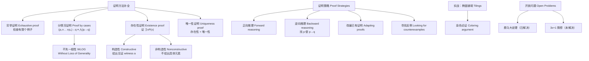
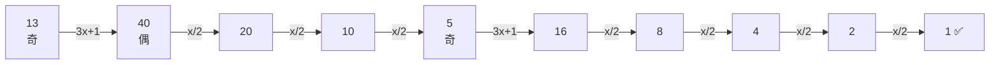

# C1.8 证明方法与策略 Proof Methods and Strategy

> [!abstract] 本节地位
> §1.7 给了四种基本证明方法；这一节把武器库补齐：**穷举证明、分情况证明、WLOG、存在性证明（构造性/非构造性）、唯一性证明**，然后讲**怎么找到证明**（正向/逆向推理、改编已有证明、找反例），最后用**棋盘铺砌**完整演示一次数学发现的全过程，并介绍**开放问题**。
> **这一节的重点不是新知识点，而是"遇到一道不会的证明题该怎么办"。**

> [!warning] 📚 课堂进度：**本节整节尚未讲授**
> 截至 **2026-09-16**，任课教师的课件已讲到教材 **§1.7 的前半部分**（直接证明、逆否证明，见 [[C1.7 证明导论 Introduction to Proofs]] 的课件补充），
> **§1.8 的全部内容（穷举证明、分情况证明、WLOG、存在性证明、唯一性证明、证明策略、棋盘铺砌与染色论证）课堂上都还没有开讲。**
>
> 按全库约定，**整节未讲时不逐条标注「拓展」**（否则整篇都是标记，没有信息量）。
> 拿到本节课件后需要回来：① 合并课件独有的内容；② 对课堂跳过的部分补「（拓展）」标注；③ 删掉这条进度说明。
> 标注约定见 [[C1 基础：逻辑与证明 MOC]]。


## 本节结构总览



---

## 1. 穷举证明与分情况证明 Exhaustive Proof and Proof by Cases

> [!important] 分情况证明的推理规则
> 有时无法用一个对所有情形都成立的论证来证明定理。这时可以**分别考虑不同的情形**。
> 要证明形如
> $$(p_1 \vee p_2 \vee \cdots \vee p_n) \to q$$
> 的条件语句，可以使用永真式
> $$\big[(p_1 \vee p_2 \vee \cdots \vee p_n) \to q\big] \leftrightarrow \big[(p_1 \to q) \wedge (p_2 \to q) \wedge \cdots \wedge (p_n \to q)\big]$$
> 作为推理规则。
>
> 这说明：**前提是若干命题析取的条件语句，可以通过分别证明 $n$ 个条件语句 $p_i \to q$（$i = 1, \dots, n$）来证明。** 这样的论证称为**分情况证明 (proof by cases)**。
>
> 有时为了证明 $p \to q$，把 $p$ 换成一个与之等价的析取式 $p_1 \vee p_2 \vee \cdots \vee p_n$ 作为前提会更方便。

> [!note] 这条规则的来源
> 这正是 §1.3 Table 7 中的等价式 $(p \to r) \wedge (q \to r) \equiv (p \vee q) \to r$ 的推广（见 §1.3 习题 23）。**分情况证明的合法性完全来自这条等价律。**

### 1.1 穷举证明 Exhaustive Proof

> [!important] 定义
> 有些定理可以通过检查**相对少量的例子**来证明。这类证明称为**穷举证明 (exhaustive proofs)** 或**竭尽证明 (proofs by exhaustion)**，因为它们通过**穷尽所有可能性**来进行。
> **穷举证明是分情况证明的一种特殊类型，其中每种情形只涉及检查单个例子。**

**例 1**：证明：若 $n$ 是正整数且 $n \le 4$，则 $(n+1)^3 \ge 3^n$。

**证明（穷举）**：只需验证 $n = 1, 2, 3, 4$ 四种情形。

| $n$ | $(n+1)^3$ | $3^n$ | $(n+1)^3 \ge 3^n$ ? |
|:-:|:-:|:-:|:-:|
| 1 | $2^3 = 8$ | $3^1 = 3$ | $8 \ge 3$ ✓ |
| 2 | $3^3 = 27$ | $3^2 = 9$ | $27 \ge 9$ ✓ |
| 3 | $4^3 = 64$ | $3^3 = 27$ | $64 \ge 27$ ✓ |
| 4 | $5^3 = 125$ | $3^4 = 81$ | $125 \ge 81$ ✓ |

四种情形都成立。∎

> [!note] 顺带观察
> $n = 5$ 时 $(n+1)^3 = 216$，$3^5 = 243$，**不等式反向了**。所以定理中的条件 $n \le 4$ 不能去掉——**这再次说明"指数最终会碾压多项式"**（§1.6 例 14）。

**例 2**：证明：不超过 100 的**连续**正整数中，唯一一对都是**完全幂**的是 8 和 9。
（整数是**完全幂 (perfect power)**，如果它等于 $n^a$，其中 $a$ 是大于 1 的整数。）

**证明（穷举）**：列出不超过 100 的所有完全幂，再看哪个的下一个整数也是完全幂。
- **平方数**：$1, 4, 9, 16, 25, 36, 49, 64, 81, 100$
- **立方数**：$1, 8, 27, 64$
- **四次方**：$1, 16, 81$
- **五次方**：$1, 32$
- **六次方**：$1, 64$
- 更高次幂中不超过 100 的除 1 外没有其他。

汇总所有不超过 100 的完全幂：$\{1, 4, 8, 9, 16, 25, 27, 32, 36, 49, 64, 81, 100\}$。

逐个检查 $n$ 与 $n+1$ 是否都在这个集合里：
- $n = 8$：$8 = 2^3$ ✓，$9 = 3^2$ ✓ ⇒ **找到一对！**
- 其余的 $n$（$1\to2$、$4\to5$、$9\to10$、$16\to17$、$25\to26$、$27\to28$、$32\to33$、$36\to37$、$49\to50$、$64\to65$、$81\to82$、$100\to101$）都不成立。

因此 $2^3 = 8$ 与 $3^2 = 9$ 是不超过 100 的唯一一对连续完全幂。∎

> [!note] 背景（老师可能提的深水区）
> 这道题实际上是 **卡塔兰猜想 (Catalan's Conjecture)** 的一个片段：**$8$ 和 $9$ 是全体正整数中唯一一对连续的完全幂**（即 $x^a - y^b = 1$ 在 $x,y,a,b > 1$ 时只有 $3^2 - 2^3 = 1$ 这一组解）。
> 这个猜想 1844 年提出，直到 **2002 年才被 Preda Mihăilescu 证明**，现称 **Mihăilescu 定理**。
> **课本的例 2 只在 100 以内穷举，这不是证明了猜想——穷举只能证明"有限范围内"的命题。这个区别是本节强调的重点。**

> [!warning] 课本页边的提醒
> "**Proofs by exhaustion can tire out people and computers when the number of cases challenges the available processing power!**"
> （当情形数量挑战可用算力时，穷举证明会把人和计算机都累垮。）
>
> 课本正文也指出：**人在需要检查相对少量实例时可以做穷举证明。计算机被要求检查多得多的实例时不会抱怨，但它们仍有局限。注意，当无法列出所有要检查的实例时，即使计算机也无法检查所有实例。**（例如"对所有正整数成立"这类命题，实例有无穷多个。）

### 1.2 分情况证明 Proof by Cases

> [!important] 关键要求
> **分情况证明必须覆盖定理中出现的所有可能情形。**
> 课本反复提醒："In each example, you should check that all possible cases are covered."
> 页边警告："**In a proof by cases be sure not to omit any cases and check that you have proved all cases correctly!**"（分情况证明时务必不要遗漏任何情形，并检查每种情形都证对了！）

**例 3**：证明：若 $n$ 是整数，则 $n^2 \ge n$。

**证明（分三种情形：$n=0$、$n \ge 1$、$n \le -1$）**：
> 之所以分成这三种，是因为**分别处理零、正整数、负整数**来证明这个结果最为直接。

- **情形 (i)：$n = 0$。** 因为 $0^2 = 0$，有 $0^2 \ge 0$。故 $n^2 \ge n$ 在此情形成立。
- **情形 (ii)：$n \ge 1$。** 把不等式 $n \ge 1$ 两边乘以**正整数** $n$，得 $n \cdot n \ge n \cdot 1$，即 $n^2 \ge n$。
- **情形 (iii)：$n \le -1$。** 此时 $n < 0$，而 $n^2 \ge 0$。故 $n^2 \ge 0 > n$，即 $n^2 \ge n$。

因为不等式在三种情形下都成立，可断定：若 $n$ 是整数，则 $n^2 \ge n$。∎

> [!warning] 情形 (ii) 中"乘以正数"这一步不能省
> **不等式两边乘以正数不变号，乘以负数要变号。** 这正是为什么必须把 $n \ge 1$ 与 $n \le -1$ 分开处理。
> 顺带对照 §1.4 例 13：$\forall x(x^2 \ge x)$ 在**整数**论域为真（就是本例），在**实数**论域为假（$x = 1/2$）。**本例的分情形之所以够用，正是因为整数中不存在 $0 < n < 1$。**

**例 4**：用分情况证明说明 $|xy| = |x||y|$，其中 $x, y$ 是实数。
（回顾：$|a|$ 在 $a \ge 0$ 时等于 $a$，在 $a \le 0$ 时等于 $-a$。）

**证明**：因为公式中同时出现 $|x|$ 和 $|y|$，需要**四种情形**：
(i) $x, y$ 都非负；(ii) $x$ 非负、$y$ 负；(iii) $x$ 负、$y$ 非负；(iv) $x, y$ 都负。
分别记这四个假设为 $p_1, p_2, p_3, p_4$。
（注意：在每种情形中通过适当选择符号，就可以去掉绝对值号。）

- **情形 (i)**：$x \ge 0$ 且 $y \ge 0$ ⇒ $xy \ge 0$，故 $|xy| = xy = |x||y|$。✓
- **情形 (ii)**：$x \ge 0$ 且 $y < 0$ ⇒ $xy \le 0$，故
  $$|xy| = -xy = x(-y) = |x||y|$$
  （因为 $y < 0$，有 $|y| = -y$。）✓
- **情形 (iii)**：$x < 0$ 且 $y \ge 0$ ⇒ 与情形 (ii) **推理相同，只是 $x$ 与 $y$ 的角色互换**。✓
- **情形 (iv)**：$x < 0$ 且 $y < 0$ ⇒ $xy > 0$，故
  $$|xy| = xy = (-x)(-y) = |x||y|$$ ✓

因为 $|xy| = |x||y|$ 在四种情形下都成立，而这四种情形穷尽了所有可能，可断定对任意实数 $x, y$ 都有 $|xy| = |x||y|$。∎

### 1.3 何时使用分情况证明 Leveraging Proof by Cases

> [!important] 课本给的判断标准
> **当无法同时考虑证明的所有情形时，就应该考虑分情况证明。**
> 一般来说：**当没有明显的方式开始一个证明，但每种情形中的额外信息能帮助推进证明时，就找分情况证明。**

**例 5**（**发现 + 证明的完整示范**）：对一个整数的平方的**末位十进制数字**提出猜想并证明。

**解**：
**第一步：观察数据。** 最小的一些完全平方数是
$$1, 4, 9, 16, 25, 36, 49, 64, 81, 100, 121, 144, 169, 196, 225, \dots$$
注意到出现在平方数末位的数字是 **0, 1, 4, 5, 6, 9**，而 **2, 3, 7, 8 从不出现**。

**第二步：提出猜想。**
> **猜想：完全平方数的末位十进制数字是 0, 1, 4, 5, 6 或 9。**

**第三步：证明。**
把整数 $n$ 写成
$$n = 10a + b$$
其中 $a, b$ 是正整数，$b \in \{0,1,\dots,9\}$。（$a$ 是把 $n$ 的末位数字减掉后再除以 10 得到的整数。）
注意
$$(10a+b)^2 = 100a^2 + 20ab + b^2 = 10(10a^2 + 2ab) + b^2$$
所以 **$n^2$ 的末位数字与 $b^2$ 的末位数字相同**。
进一步注意到 $b^2$ 的末位数字与 $(10-b)^2 = 100 - 20b + b^2$ 的末位数字**相同**。
因此可以把证明**归约到六种情形**（把 $b$ 与 $10 - b$ 配对：$\{1,9\}, \{2,8\}, \{3,7\}, \{4,6\}, \{5\}, \{0\}$）：

| 情形 | $n$ 的末位 | 计算 | $n^2$ 的末位 |
|:-:|:-:|:-:|:-:|
| (i) | 1 或 9 | $1^2 = 1$，$9^2 = 81$ | **1** |
| (ii) | 2 或 8 | $2^2 = 4$，$8^2 = 64$ | **4** |
| (iii) | 3 或 7 | $3^2 = 9$，$7^2 = 49$ | **9** |
| (iv) | 4 或 6 | $4^2 = 16$，$6^2 = 36$ | **6** |
| (v) | 5 | $5^2 = 25$ | **5** |
| (vi) | 0 | $0^2 = 0$ | **0** |

六种情形已考虑完毕，故整数 $n$ 的平方 $n^2$ 的末位十进制数字是 **0, 1, 4, 5, 6 或 9**。∎

> [!important] 这个例子的方法论价值（**本节最该学会的东西**）
> **数学发现的完整流程：观察数据 → 发现模式 → 提出猜想 → 寻找证明。**
> 其中"$b^2$ 与 $(10-b)^2$ 末位相同"这个观察**把 10 种情形减到 6 种**——**好的观察能大幅减少工作量**。这就是"寻找关键洞察"。
>
> **数论视角**：这题的本质是模运算——$n^2 \bmod 10$ 只取决于 $n \bmod 10$，而 $(10-b) \equiv -b \pmod{10}$ 故 $(10-b)^2 \equiv b^2$。**第 4 章会把这套语言正式化，届时这题一行就能写完。**

**例 6**：证明 $x^2 + 3y^2 = 8$ 在整数 $x, y$ 中**无解**。

**证明**：先**缩小搜索范围**：
- 当 $|x| \ge 3$ 时 $x^2 \ge 9 > 8$；
- 当 $|y| \ge 2$ 时 $3y^2 \ge 12 > 8$。

因此只剩下 $x \in \{-2,-1,0,1,2\}$ 且 $y \in \{-1,0,1\}$ 的情形，可以用**穷举证明**收尾。
更简洁地：$x^2$ 的可能取值只有 $\{0, 1, 4\}$，$3y^2$ 的可能取值只有 $\{0, 3\}$。
两者之和的**最大可能值**是 $4 + 3 = \mathbf{7} < 8$。
所以 $x^2 + 3y^2 = 8$ 在整数范围内**不可能成立**。∎

> [!important] 这题的通用套路
> **"用不等式把无穷的搜索范围压缩成有限的，再穷举。"**
> 这是解决"某个丢番图方程无解"类问题的标准第一招。**看到这种题，先估界。**

### 1.4 不失一般性 Without Loss of Generality (WLOG)

> [!important] 定义
> 在例 4 的证明中，我们**略过了情形 (iii)**（$x < 0$ 且 $y \ge 0$），因为它与情形 (ii)（$x \ge 0$ 且 $y < 0$）**只是 $x$ 与 $y$ 角色互换**。
> 为缩短证明，本可以把情形 (ii) 和 (iii) 合并，**不失一般性地 (without loss of generality)** 假设 $x \ge 0$ 且 $y < 0$。这句话隐含的意思是：**$x < 0$ 且 $y \ge 0$ 的情形可以用同样的论证完成，只需做显然的改动。**
>
> 一般地，当证明中使用短语 "**without loss of generality**"（常缩写为 **WLOG**）时，我们断言：**通过证明定理的某一种情形，不需要额外论证就能证明其他指定的情形**——即其他情形可以通过对论证做直截了当的改动、或补上某个直截了当的初始步骤而得到。
>
> **使用 WLOG 可以让分情况证明高效得多。**

> [!warning] ⚠️ 课本的严厉警告（考试和写论文都要注意）
> **"Of course, incorrect use of this principle can lead to unfortunate errors."**
> 有时人们做出的假设**其实导致了一般性的损失 (loss of generality)**——这类假设**没有考虑到某一种情形可能与其他情形本质上不同**，从而导致**不完整、甚至无法挽救的证明**。
> **事实上，许多著名定理的错误证明，其根源正是用 "WLOG" 来处理那些无法从更简单情形快速推出的情况。**
>
> **自查方法**：说 WLOG 之前，问自己 "**我能明确说出把另一种情形转化成这一种的那个具体变换吗？**"（例 4 中就是"交换 $x$ 与 $y$"）。说不出来，就不能用 WLOG。

**例 7**（**WLOG + 逆否 + 分情况的综合示范**）：证明：若 $x$ 和 $y$ 是整数，且 $xy$ 与 $x + y$ 都是偶数，则 $x$ 与 $y$ 都是偶数。

**证明（逆否 + WLOG + 分情况）**：
用**逆否证明**：假设 $x$ 与 $y$ **不都是偶数**，即 $x$ 是奇数或 $y$ 是奇数（或两者都是）。
**不失一般性**，假设 **$x$ 是奇数**，即 $x = 2m+1$（某个整数 $m$）。
（**WLOG 的理由**：若是 $y$ 为奇数，只需在下面的证明中把 $x$ 与 $y$ 的角色互换即可。）

要完成证明，需要说明 **$xy$ 是奇数 或 $x+y$ 是奇数**。考虑两种情形：

- **情形 (i)：$y$ 是偶数。** 设 $y = 2n$，则
  $$x + y = (2m+1) + 2n = 2(m+n) + 1$$
  是**奇数**。✓
- **情形 (ii)：$y$ 是奇数。** 设 $y = 2n+1$，则
  $$xy = (2m+1)(2n+1) = 4mn + 2m + 2n + 1 = 2(2mn + m + n) + 1$$
  是**奇数**。✓

两种情形下都得到"$xy$ 奇 或 $x+y$ 奇"，即结论的否定蕴涵前提的否定。逆否证明完成。∎

---

## 2. 穷举证明与分情况证明中的常见错误

> [!important] 错误一：从例子得出错误结论
> **一个常见的推理错误是从例子得出不正确的结论。**
> **无论考察了多少个单独的例子，除非每一种可能的情形都被覆盖，否则定理没有被证明。**
>
> 课本给的类比：**证明定理的问题类似于说明一个计算机程序总是产生期望的输出。无论测试了多少输入值，除非所有输入值都被测过，否则不能断定程序总是产生正确输出。**

**例 8**：是否每个正整数都是 18 个整数的四次方之和？

**解**：整数的四次方是 $0, 1, 16, 81, \dots$。要判断正整数 $n$ 能否写成 18 个四次方之和，可以先检查最小的一些正整数。
可以证明：**所有不超过 78 的正整数都能写成 18 个四次方之和**（细节留给读者）。
**但如果我们据此认为"检查得够多了"，就会得到错误结论。**
事实上，**并非每个正整数都是 18 个四次方之和——79 就不是**（读者可以验证）。∎

> [!note] 数论背景（华林问题 Waring's Problem）
> $79 = 4 \times 2^4 + 15 \times 1^4$，需要 **19** 个四次方（$4 \times 16 = 64$，再加 15 个 1）。
> 这正是**华林问题 (Waring's problem)** 中 $g(4) = 19$ 的最小例外。§1.8 提到的 G. H. Hardy 正是研究华林问题的主力之一。
> **教训：$78$ 个例子全对，第 $79$ 个就错了。经验归纳不是证明。**

> [!important] 错误二：情形没有覆盖完全
> 另一类常见错误是**做出没有根据的假设，导致情形没有全部考虑到的错误分情况证明**。

**例 9**：以下"证明"错在哪里？
> **"定理"**：若 $x$ 是实数，则 $x^2$ 是正实数。
> **"证明"**：设 $p_1$ 为 "$x$ 是正的"，$p_2$ 为 "$x$ 是负的"，$q$ 为 "$x^2$ 是正的"。
> 要证明 $p_1 \to q$：$x$ 为正时，$x^2$ 是两个正数 $x$ 与 $x$ 之积，故为正。
> 要证明 $p_2 \to q$：$x$ 为负时，$x^2$ 是两个负数 $x$ 与 $x$ 之积，故为正。
> 证毕。

**解**：这个"证明"的问题是**漏掉了 $x = 0$ 的情形**。
当 $x = 0$ 时 $x^2 = 0$ **不是正的**，所以这个所谓的"定理"**是假的**。
若 $p$ 是 "$x$ 是实数"，正确的做法是分**三种情形** $p_1, p_2, p_3$，其中 $p_1$ = "$x$ 是正的"，$p_2$ = "$x$ 是负的"，$p_3$ = "$x = 0$"——因为等价式
$$p \leftrightarrow p_1 \vee p_2 \vee p_3$$
才成立。∎

> [!warning] 自查清单（**分情况证明的必查项**）
> 写完分情况证明后，**必须验证 $p \leftrightarrow p_1 \vee p_2 \vee \cdots \vee p_n$**，即：
> 1. **完备性**：每一种可能都落在某个情形里（**别漏掉 0、空集、边界值、相等的情形**）；
> 2. 每个情形的论证本身都正确。
>
> **实数的三分：正 / 负 / 零。整数的二分：奇 / 偶。这两组划分要下意识地用对。**

---

## 3. 存在性证明 Existence Proofs

> [!important] 定义
> 许多定理断言**某类对象存在**。这类定理是形如 $\exists x P(x)$ 的命题，其中 $P$ 是谓词。形如 $\exists x P(x)$ 的命题的证明称为**存在性证明 (existence proof)**。
>
> 有几种方式：
> - **构造性 (constructive)**：找到一个元素 $a$（称为**见证 witness**）使 $P(a)$ 为真。
> - **非构造性 (nonconstructive)**：**不**找出使 $P(a)$ 为真的元素 $a$，而是用其他方式证明 $\exists x P(x)$ 为真。
>   **给出非构造性存在性证明的一个常用方法是使用反证法**：证明存在量化的否定会导致矛盾。

### 例 10（构造性存在性证明）

证明：**存在一个正整数，它能以两种不同方式写成正整数立方之和。**

**证明（构造性）**：经过相当多的计算（例如计算机搜索）我们发现
$$\boxed{1729 = 10^3 + 9^3 = 12^3 + 1^3}$$
**验证**：$10^3 + 9^3 = 1000 + 729 = 1729$；$12^3 + 1^3 = 1728 + 1 = 1729$。✓
因为我们展示了一个能以两种不同方式写成立方和的正整数，证毕。∎

> [!note] 一个著名的故事（课本原文，老师一定会讲）
> 英国数学家 **G. H. Hardy** 去医院探望病中的印度天才 **Ramanujan** 时，随口说他乘坐的出租车号码 **1729** "相当无趣 (rather dull)"。
> Ramanujan 回答："**不，这是一个非常有趣的数字；它是能以两种不同方式表示为立方和的最小的数。**"
>
> 后人把这类数称为 **出租车数 (taxicab numbers)**，记作 $\mathrm{Ta}(n)$：$\mathrm{Ta}(2) = 1729$。

> [!note] 两位人物（课本 Links 栏）
> **G. H. Hardy（1877–1947）**：生于英国 Surrey 的 Cranleigh。1896 年入剑桥三一学院，1899 年毕业。1906–1919 年任三一学院数学讲师；因剑桥解雇罗素（反战活动）而不满，1919 年赴牛津任 Sadleirian 几何教席；1931 年回剑桥任纯数学 Sadleirian 教授直至 1942 年退休。
> 他是**纯数学家**，持有精英主义的数学观，**希望自己的研究永远不会被应用**。讽刺的是，他最广为人知的成果可能是**哈代—温伯格定律 (Hardy–Weinberg law)**——预测遗传模式的定律。他主要研究**数论与函数论**（黎曼 zeta 函数、傅里叶级数、素数分布），在**华林问题**和"奇整数表为三个素数之和"上贡献重大。与 **J. E. Littlewood** 合写 100 多篇论文，当时流传一个笑话说"英国只有三位重要数学家：Hardy、Littlewood 和 Hardy–Littlewood"。他有智慧从 Ramanujan 寄来的非常规但极富创造力的手稿中**识别出其天才**，并把他带到剑桥合作，在整数分拆数上取得重要成果。著有 *A Course of Pure Mathematics*（深刻影响 20 世纪上半叶的本科数学教学）和 ***A Mathematician's Apology***（《一个数学家的辩白》，回答"把一生献给数学是否值得"）。他是狂热的板球迷；一个古怪之处是**不喜欢被拍照**（只有五张快照存世）**也讨厌镜子**，进旅馆房间会立即用毛巾把镜子盖住。
>
> **Srinivasa Ramanujan（1887–1920）**：生于印度南部马德拉斯（今金奈）附近。父亲是布店职员，母亲在当地寺庙唱歌补贴家用。**13 岁掌握了大学生用的教科书**；15 岁时一位大学生借给他一本 *Synopsis of Pure Mathematics*，他决定把书中 6000 多条**只有结论没有证明**的结果**全部自己推导出来**，写在活页纸上装订成笔记本。1904 年高中毕业获马德拉斯大学奖学金，但因只专注数学而忽略其他科目**丢掉了奖学金**，1904–1907 年**四次考试不及格**。没有大学学位很难找工作，靠朋友接济和当家教为生。1909 年包办婚姻娶了小他九岁的妻子，为养家迁往马德拉斯，1912 年经 Presidency College 一位教授赏识，谋得会计文员的差事。1910 年在印度期刊发表第一篇论文。他意识到自己的工作超出印度数学家的水平，开始给英国顶尖数学家写信；前几位都拒绝了他，**1913 年 1 月他写信给 Hardy**——Hardy 本也想拒绝，但信中那些**没有证明的数学陈述让他困惑**，遂与 Littlewood 仔细研究，断定 Ramanujan 很可能是天才，因为他的陈述"**只可能出自最高等级的数学家之手；它们必定是真的，因为如果不真，没有人有那样的想象力去发明它们**"。Hardy 为他安排奖学金，1914 年把他接到英国，亲自辅导数学分析，合作五年，在整数分拆数上证明了重要定理。Ramanujan 在数论、连分数、无穷级数、椭圆函数上贡献巨大；他对某些函数与级数有惊人的洞察，但**关于素数的所谓定理常常是错的**，说明他对"什么算正确的证明"概念模糊。他是**当选皇家学会院士 (FRS) 最年轻的成员之一**。1917 年病重，当时认为是结核病，现在认为是**维生素缺乏**（严格素食加战时英国的物资短缺所致）。1919 年回印度，卧床仍继续做数学。他笃信宗教，认为自己的数学才能来自家族神祇 Namagiri，认为数学与宗教相连，说过"**一个方程对我毫无意义，除非它表达了神的一个念头**"。**1920 年 4 月去世，年仅 32 岁**。他留下若干本未发表结果的笔记本，字迹潦草但充满洞见，**若干数学家花了许多年来解释和证明其中的结果**。

### 例 11（**非构造性存在性证明的经典例子**）

证明：**存在无理数 $x$ 和 $y$，使得 $x^y$ 是有理数。**

**证明（非构造性）**：
由 §1.7 例 10 我们知道 **$\sqrt2$ 是无理数**。考虑数
$$\sqrt2^{\sqrt2}$$
**情形一：若 $\sqrt2^{\sqrt2}$ 是有理数**，则取 $x = \sqrt2$，$y = \sqrt2$——两个无理数，且 $x^y$ 有理。✓

**情形二：若 $\sqrt2^{\sqrt2}$ 是无理数**，则取
$$x = \sqrt2^{\sqrt2},\qquad y = \sqrt2$$
两者都是无理数，且
$$x^y = \left(\sqrt2^{\sqrt2}\right)^{\sqrt2} = \sqrt2^{(\sqrt2 \cdot \sqrt2)} = \sqrt2^{\,2} = 2$$
是有理数。✓

两种情形必有一种成立，故所求的 $x, y$ 存在。∎

> [!important] 为什么这是"非构造性"的
> **我们并没有找出满足条件的具体无理数 $x$ 和 $y$！**
> 我们只是证明了"**$x = \sqrt2, y = \sqrt2$ 这一对**"或"**$x = \sqrt2^{\sqrt2}, y = \sqrt2$ 这一对**"中**至少有一对**满足要求——**但我们不知道是哪一对！**
>
> **这就是构造性与非构造性的分水岭。**
> （补充：后来由 **Gelfond–Schneider 定理**（1934）可知 $\sqrt2^{\sqrt2}$ 确实是**无理数**（甚至是超越数），所以实际上是第二对。但**这个证明本身不需要那个定理**——它靠的纯粹是排中律。）
>
> **哲学注记**：这个证明用到了**排中律**（"要么有理，要么无理，二者必居其一"）。**直觉主义 (intuitionism) / 构造主义数学**拒绝这样的论证，要求所有存在性证明都必须给出构造。这个分歧在计算机科学中很实在——**构造性证明可以直接抽取出算法，非构造性证明不能**（这就是 Curry–Howard 对应与依赖类型编程语言 Coq/Agda 的思想背景）。

### 例 12（Chomp 游戏：更微妙的非构造性存在性证明）

> [!important] Chomp 游戏规则
> **Chomp** 是两人游戏。饼干排列在一个矩形网格上，**左上角那块饼干有毒**（见 FIGURE 1(a)）。两名玩家轮流走棋；每一步，玩家必须吃掉一块剩余的饼干，**连同它右边和/或下边的所有饼干**（见 FIGURE 1(b) 的三种可能走法）。**被迫吃掉毒饼干的玩家输**。
>
> 问题：两名玩家中是否有一方拥有**必胜策略 (winning strategy)**？即某一方能否总是走出保证获胜的棋？

![[C1-图5-Chomp游戏与三种走法.png]]

**解（非构造性存在性证明）**：我们将给出**先手必胜策略存在**的非构造性证明，即证明先手总有必胜策略，但**不明确描述这个策略的走法**。

**第一步：游戏必然结束，且不可能平局。**
因为每一步至少吃掉一块饼干，所以在**至多 $m \times n$ 步**之后游戏结束（初始网格为 $m \times n$）。

**第二步：策略窃取论证 (strategy stealing)。**
假设先手第一步**只吃掉右下角那一块饼干**。有两种可能：
- **可能一**：这一步是先手某个必胜策略的第一步 ⇒ **先手有必胜策略**。✓
- **可能二**：这一步之后，后手能走出一步，它是**后手某个必胜策略的第一步**。
  但这种情形下，**先手本可以在第一步就走后手所走的那一步**（然后继续沿着那个必胜策略走下去）。
  为什么可以？因为"吃右下角一块"这一步**几乎不改变棋盘**——任何后手能走的走法，先手在开局时也能走。
  这就保证了**先手获胜**。✓

两种可能下先手都有必胜策略。∎

> [!important] 这个证明为什么是非构造性的
> **我们证明了必胜策略存在，但没有指出实际的必胜策略。**
> 课本明确指出：**事实上，至今没有人能描述出适用于所有矩形网格的 Chomp 先手必胜策略的具体走法。** 不过某些特殊情形下的必胜策略是已知的，例如**网格是正方形**时、以及**网格只有两行饼干**时（见 §5.2 习题 15、16）。
>
> **"策略窃取论证 (strategy-stealing argument)"** 是组合博弈论中的标准手法：**如果后手有必胜策略，先手可以"偷"过来用**，因为多走一步不会有害（这一点对 Chomp 成立，因为吃饼干只会让局面对对手更不利）。
> 同样的论证证明了**五子棋 (Gomoku)、Hex 等游戏先手不败**——但同样**不给出怎么走**。

---

## 4. 唯一性证明 Uniqueness Proofs

> [!important] 定义
> 有些定理断言**具有特定性质的元素唯一存在**，即**恰好有一个**元素具有该性质。
> **唯一性证明 (uniqueness proof)** 由两部分组成：
> - **存在性 Existence**：说明具有所需性质的元素 $x$ **存在**；
> - **唯一性 Uniqueness**：说明**若 $y \ne x$，则 $y$ 不具有该性质**。
>
> **等价地**：可以说明**若 $x$ 和 $y$ 都具有该性质，则 $x = y$**。

> [!note] Remark（课本原文）
> 说明"存在唯一的 $x$ 使 $P(x)$"，等同于证明命题
> $$\exists x\Big(P(x) \wedge \forall y\big(y \ne x \to \neg P(y)\big)\Big)$$
> $$\exists x\big(P(x)\land \forall y(P(y)\to y=x)\big)$$
> （这正是 §1.4 / §1.5 中 $\exists! x\, P(x)$ 的展开式。）


### 例 13

证明：**若 $a, b$ 是实数且 $a \ne 0$，则存在唯一的实数 $r$ 使 $ar + b = 0$。**

**证明**：
**① 存在性**：注意实数
$$r = -\frac{b}{a}$$
是 $ar + b = 0$ 的一个解，因为
$$a\left(-\frac{b}{a}\right) + b = -b + b = 0$$
（这里用到 $a \ne 0$，除法才有意义。）故存在实数 $r$ 使 $ar + b = 0$。**这是证明的存在性部分。**

**② 唯一性**：设 $s$ 是另一个满足 $as + b = 0$ 的实数。则
$$ar + b = as + b$$
（其中 $r = -b/a$）。两边减去 $b$：
$$ar = as$$
两边除以 $a$（**$a$ 非零，故可以除**）：
$$r = s$$
这意味着：**若 $s \ne r$，则 $as + b \ne 0$。这就确立了唯一性部分。** ∎

> [!important] 唯一性证明的书写模板（**背下来**）
> ```
> 证明：
> 【存在性】取 x = ……（给出构造），验证 P(x) 成立。
> 【唯一性】设 y 也满足 P(y)。……推导……因此 y = x。
> 综上，存在唯一的 x 使 P(x)。∎
> ```
> **两部分缺一不可。** 只证存在不证唯一，或反之，都是不完整的证明。
> **注意 ② 中"两边除以 $a$"必须再次说明 $a \ne 0$**（§1.7 例 15 的教训）。

---

## 5. 证明策略 Proof Strategies

> [!important] 课本给的总策略
> 找证明是件有挑战的事。**当你面对一个要证明的陈述时：**
> 1. **首先把术语替换成它们的定义**；
> 2. **仔细分析前提和结论的含义**；
> 3. 然后尝试用某种可用的证明方法来证明结果。
>
> **一般来说，如果陈述是条件语句：**
> - **先试直接证明**；
> - 若失败，**试间接证明（逆否）**；
> - 若两者都不行，**试反证法**。

### 5.1 正向推理与逆向推理 Forward and Backward Reasoning

> [!important] 定义
> 无论选哪种方法，你都需要一个**起点**。
> - **正向推理 (forward reasoning)**：从前提出发，结合公理构造一串步骤，导向结论。这是证明相对简单结果时**最常用**的推理类型。
>   （类似地，间接推理可以从结论的否定出发，经一串步骤得到前提的否定。）
> - **逆向推理 (backward reasoning)**：**正向推理常常难以用来证明更复杂的结果**，因为到达期望结论所需的推理可能远非显然。这时使用逆向推理会有帮助。
>   **要逆向推理证明陈述 $q$，我们寻找一个能够证明的陈述 $p$，使得 $p \to q$。**

> [!warning] ⚠️ 逆向推理的方向绝不能搞反
> 课本明确警告：**"Note that it is not helpful to find a statement $r$ that you can prove such that $q \to r$, because it is the fallacy of begging the question to conclude from $q \to r$ and $r$ that $q$ is true."**
> （找一个能证明的 $r$ 使 $q \to r$ **没有用**，因为从 $q \to r$ 和 $r$ 推出 $q$ 是**窃取论题的谬误**。）
>
> **正确**：找 $p$ 使 $p \to q$，且 $p$ 可证 ⇒ 得 $q$。（modus ponens ✓）
> **错误**：找 $r$ 使 $q \to r$，且 $r$ 可证 ⇒ 得 $q$。（**肯定后件谬误** ❌）
>
> **实践中的做法**：草稿上从 $q$ 倒推到某个已知为真的 $p$，**但誊写答案时必须把整条链倒过来写成正向推理**，并检查每一步都是可逆的（$\iff$）或至少方向正确（$p \Rightarrow q$）。

### 例 14（**逆向推理的范例：AM-GM 不等式**）

给定两个正实数 $x$ 和 $y$，它们的**算术平均 (arithmetic mean)** 是 $(x+y)/2$，**几何平均 (geometric mean)** 是 $\sqrt{xy}$。
比较不同的**相异**正实数对的算术平均与几何平均，发现**算术平均总是大于几何平均**。
（例如 $x=4, y=6$ 时 $5 = (4+6)/2 > \sqrt{4 \cdot 6} = \sqrt{24} \approx 4.899$。）
能否证明这个不等式总是成立？

**解（逆向推理）**：
要证 $x, y$ 是相异正实数时 $(x+y)/2 > \sqrt{xy}$，我们**逆向工作**，构造一串**等价**的不等式：

$$
\begin{aligned}
&(x+y)/2 > \sqrt{xy}\\
\iff\ &(x+y)^2/4 > xy\\
\iff\ &(x+y)^2 > 4xy\\
\iff\ &x^2 + 2xy + y^2 > 4xy\\
\iff\ &x^2 - 2xy + y^2 > 0\\
\iff\ &(x-y)^2 > 0
\end{aligned}
$$

因为 $x \ne y$ 时 $(x-y)^2 > 0$，最后一个不等式为真。**因为所有这些不等式都是等价的**，故 $x \ne y$ 时 $(x+y)/2 > \sqrt{xy}$。

**做完逆向推理后，可以轻松地把步骤倒过来，用正向推理写出证明。下面给出这个证明：**

> **证明**：设 $x, y$ 是相异的正实数。则 $(x-y)^2 > 0$（非零实数的平方为正，见附录 1）。
> 因为 $(x-y)^2 = x^2 - 2xy + y^2$，这蕴涵 $x^2 - 2xy + y^2 > 0$。
> 两边加 $4xy$，得 $x^2 + 2xy + y^2 > 4xy$。
> 因为 $x^2 + 2xy + y^2 = (x+y)^2$，这意味着 $(x+y)^2 > 4xy$。
> 两边除以 4，得 $(x+y)^2/4 > xy$。
> 最后，两边取平方根（**因为两边都是正的，不等号得以保持**）得
> $$(x+y)/2 > \sqrt{xy}$$
> 结论：若 $x$ 与 $y$ 是相异的正实数，则它们的算术平均 $(x+y)/2$ 大于它们的几何平均 $\sqrt{xy}$。∎

> [!important] 这个例子该学到的两件事
> 1. **逆向推理用来"找"证明，正向推理用来"写"证明。** 草稿倒着推，答卷正着写。
> 2. **每一步都要检查是否等价**。这里从 $(x+y)/2 > \sqrt{xy}$ 到 $(x+y)^2/4 > xy$ 用了平方，**只有在两边都为正时才是等价变形**——所以正着写时特意注明了"因为两边都是正的"。
>
> **AM–GM 不等式的一般形式**（后面很多课会用到）：
> $$\frac{a_1 + a_2 + \cdots + a_n}{n} \ge \sqrt[n]{a_1 a_2 \cdots a_n}$$
> 等号成立当且仅当 $a_1 = a_2 = \cdots = a_n$。

### 例 15（**逆向推理解博弈问题**）

两人轮流从一堆石子中取走 1 颗、2 颗或 3 颗，这堆石子开始有 **15 颗**。取走**最后一颗石子的人获胜**。证明：**无论后手怎么走，先手都能获胜。**

**解（逆向推理）**：**从最后一步倒着想。**
- **最后一步**：如果轮到先手时堆里剩 **1、2 或 3 颗**，先手可以一次取完，获胜。
- 因此，**如果轮到后手时堆里剩 4 颗**，后手取 1、2 或 3 颗后，必然给先手留下 1、2 或 3 颗 ⇒ 先手获胜。
  **所以先手的一个取胜办法是：在倒数第二步给后手留下 4 颗。**
- 先手要能留下 4 颗，轮到他时堆里必须剩 **5、6 或 7 颗**——而这发生在**后手面对 8 颗**并取走 1~3 颗之后。
- 因此，先手应该在**倒数第三步给后手留下 8 颗**，这意味着轮到先手时堆里有 **9、10 或 11 颗**。
- 同理，先手第一步就应该给后手**留下 12 颗**。

**把这个论证反过来**（正向）：初始 15 颗，先手**第一步取 3 颗**，留下 12 颗。此后，**无论后手取 $k$ 颗（$k \in \{1,2,3\}$），先手就取 $4 - k$ 颗**，这样每一轮总共取走 4 颗。于是先手依次给后手留下 **12、8、4** 颗，最后后手面对 4 颗，无论怎么取都会给先手留下 1~3 颗，先手一次取完获胜。∎

> [!important] 这类"取石子"博弈的通法（**Nim 类游戏**）
> **必败位置 (P-position)**：$4 \mid n$（即 $n \equiv 0 \pmod 4$）时，**先走的人必败**。
> **一般化**：每次可取 $1 \sim m$ 颗，则必败位置是 $n \equiv 0 \pmod{m+1}$，策略是"**保持每轮总取 $m+1$ 颗**"。
> **这就是"从终局倒推 (backward induction)"**——博弈论中求解有限完全信息博弈的标准算法，也是极小化极大 (minimax) 搜索、AlphaGo 的价值网络所逼近的东西。

### 5.2 改编已有的证明 Adapting Existing Proofs

> [!important] 策略
> **寻找证明思路的一个极好办法，是利用类似结果的已有证明。** 常常一个已有的证明可以被改编来证明其他事实。即使不能直接改编，**已有证明中的一些想法也可能有帮助**。
> **因为已有的证明为新证明提供线索，你应当阅读并理解学习中遇到的每一个证明。**

**例 16**：在 §1.7 例 10 中我们证明了 $\sqrt2$ 是无理数。现在猜想 $\sqrt3$ 也是无理数。能否改编那个证明？

**解**：**照着 $\sqrt2$ 的证明走，把 $\sqrt2$ 换成 $\sqrt3$。**
首先，假设 $\sqrt3 = d/c$，其中分数 $d/c$ 是**最简形式**。两边平方得
$$3 = \frac{d^2}{c^2},\qquad\text{即}\qquad 3c^2 = d^2$$
**能否像用 $2b^2 = a^2$ 推出"2 是 $a$ 和 $b$ 的因子"那样，用这个方程推出"3 是 $c$ 和 $d$ 的因子"？**
（回顾：整数 $s$ 是整数 $t$ 的**因子 (factor)**，如果 $t/s$ 是整数。整数 $n$ 是偶数当且仅当 2 是 $n$ 的因子。）

**结论是可以，但需要一些来自数论的弹药，将在第 4 章发展。** 课本先勾勒证明的其余部分，把这些步骤的严格论证留到第 4 章：
- 因为 **3 是 $d^2$ 的因子**（由 $d^2 = 3c^2$），它必然**也是 $d$ 的因子**。
- 进一步，因为 3 是 $d$ 的因子，**9 是 $d^2$ 的因子**，这意味着 **9 是 $3c^2$ 的因子**。
- 这蕴涵 **3 是 $c^2$ 的因子**，从而 **3 是 $c$ 的因子**。
- 于是 **3 同时是 $c$ 和 $d$ 的因子**，与"$d/c$ 是最简分数"的假设矛盾。∎

补上这些步骤的理由之后，我们就通过改编 $\sqrt2$ 无理的证明，证明了 $\sqrt3$ 是无理数。
**注意这个证明可以推广到：只要 $n$ 是正整数且不是完全平方数，$\sqrt n$ 就是无理数**（细节留到第 4 章）。

> [!warning] 改编时必须警惕的地方
> **$\sqrt2$ 的证明里"$a^2$ 偶 ⇒ $a$ 偶"这一步，换成 3 之后变成"3 | $d^2$ ⇒ 3 | $d$"——这一步对素数成立，对合数不成立！**
> 反例：$4 \mid 6^2 = 36$，但 $4 \nmid 6$。
> 所以"$\sqrt4$ 无理"这个论证会在这一步崩掉——**恰好正确，因为 $\sqrt4 = 2$ 确实是有理数**。
> **教训：改编证明时，必须逐条检查原证明中每个引理在新设定下是否仍然成立。** 这就是课本说"需要来自数论的弹药"（即**欧几里得引理**：$p$ 为素数且 $p \mid ab$ ⇒ $p \mid a$ 或 $p \mid b$）的原因。

> [!note] 课本的建议
> "**A good tip is to look for existing proofs that you might adapt when you are confronted with proving a new theorem, particularly when the new theorem seems similar to one you have already proved.**"
> （面对新定理时，一个好办法是寻找可以改编的已有证明，尤其当新定理看起来与你已证过的某个定理相似时。）

### 5.3 寻找反例 Looking for Counterexamples

> [!important] 策略
> 面对一个猜想，**你可以先尝试证明它；如果尝试不成功，就试着找反例**——**先从最简单、最小的例子看起**。
> **如果找不到反例，就再回头尝试证明这个陈述。**
> 无论如何，**寻找反例是一项极其重要的活动，往往能带来对问题的洞察。**

**例 17**：§1.7 例 14 已经证明"每个正整数都是**两个**整数的平方和"为假（反例 3）。那么"每个正整数都是**三个**整数的平方和"是真是假？

**解**：既然不是每个正整数都能写成两个平方和，我们**一开始就该对三个平方的说法保持怀疑**。所以先找反例。
试着把连续的正整数写成三个平方和：
$$1 = 0^2 + 0^2 + 1^2,\quad 2 = 0^2 + 1^2 + 1^2,\quad 3 = 1^2 + 1^2 + 1^2$$
$$4 = 0^2 + 0^2 + 2^2,\quad 5 = 0^2 + 1^2 + 2^2,\quad 6 = 1^2 + 1^2 + 2^2$$
**但找不到把 7 写成三个平方和的方法。**
**验证**：不超过 7 的平方数只有 $0, 1, 4$。三个这样的数相加，没有任何组合等于 7：
$$0+0+0=0,\ 0+0+1=1,\ 0+1+1=2,\ 1+1+1=3,\ 0+0+4=4,\ 0+1+4=5,\ 1+1+4=6,\ 0+4+4=8,\ 1+4+4=9,\ 4+4+4=12$$
因此 **7 是反例**，"每个正整数是三个整数的平方和"**为假**。

**继续追问**：那么"每个正整数是**四个**整数的平方和"呢？做一些实验会提供支持的证据：
$$7 = 1^2+1^2+1^2+2^2,\qquad 25 = 4^2+2^2+2^2+1^2,\qquad 87 = 9^2+2^2+1^2+1^2$$
事实上，猜想"**每个正整数是四个整数的平方和**"**是真的**（证明见 [Ro10]）。∎

> [!note] 这就是拉格朗日四平方和定理
> **Lagrange's four-square theorem（1770）**：每个正整数都可以表示为四个整数的平方之和。
> **数学发现的完整弧线：2 个不够（反例 3）→ 3 个不够（反例 7）→ 4 个够了（定理）。**
> 课本用这一个问题串起了"提出猜想 → 找反例 → 修正猜想 → 得到定理"的全过程。**这才是数学真实的样子。**

---

## 6. 证明策略实战 Proof Strategy in Action

> [!important] 课本的一段"元评论"（值得反复读）
> **数学通常被教得好像数学事实是刻在石头上的。** 数学教材（包括本书的大部分）**形式化地呈现定理和它们的证明**。**这样的呈现没有传达数学中的发现过程。**
>
> 这个过程始于**探索概念和例子、提出问题、形成猜想、试图用证明或反例来解决这些猜想**。**这些是数学家日常的活动。**
> **信不信由你，教科书里教的材料，最初就是这样发展出来的。**
>
> 人们基于各种可能的证据形成猜想：
> - **考察特殊情形**可以导向猜想；
> - **识别可能的模式**也可以；
> - **改动已知定理的前提和结论**也能导向可信的猜想；
> - 有时猜想基于**直觉**或"某个结果应该成立"的信念。
>
> 无论猜想怎么来的，**一旦形成，目标就是证明或推翻它**。
> 当数学家相信一个猜想可能为真时，**他们试图找到证明**；找不到证明时，**他们可能去找反例**；找不到反例时，**他们可能换挡再次尝试证明**。
> **虽然许多猜想很快被解决，少数猜想抵抗攻击数百年，并导致数学新分支的发展。**

---

## 7. 铺砌 Tilings（**本节的实战演练**）

> [!important] 术语定义
> - **棋盘 (checkerboard)**：一个矩形，被水平和垂直线分成同样大小的方格。
> - **标准棋盘 (standard checkerboard)**：跳棋游戏所用的 **8 行 8 列**的棋盘（FIGURE 2）。
> - 本节中 **board（板）** 一词泛指任意矩形大小的棋盘，以及**去掉一个或多个方格后**得到的棋盘部分。
> - **多米诺骨牌 (domino)**：**一格宽两格长**的矩形块（FIGURE 3）。
> - 当一个板的所有方格都被覆盖、**没有骨牌重叠、没有骨牌悬出板外**时，称该板被骨牌**铺砌 (tiled)**。

![[C1-图6-标准棋盘.png]]

![[C1-图7-两块多米诺骨牌.png]]

> [!note] 为什么用铺砌来讲证明策略
> 课本说：**"Looking at tilings of checkerboards is a fruitful way to quickly discover many different results and construct their proofs using a variety of proof methods."**
> 也就是说，铺砌问题**能让人在不需要预先建立理论的情况下，快速提出猜想并证明定理**——是练习证明策略的理想素材。

### 例 18（构造性存在性证明）

**能否用多米诺骨牌铺砌标准棋盘？**

**解**：**能**。例如把 **32 块骨牌水平放置**即可（FIGURE 4）。
**一个这样的铺砌的存在，就完成了一个构造性存在性证明。**
当然还有许多其他方式：可以把 32 块骨牌全部竖放，也可以有的竖放有的横放。但**构造性存在性证明只需要找到一个铺砌**。∎

![[C1-图8-用多米诺骨牌覆盖标准棋盘.png]]

### 例 19（反证法 + 奇偶性）

**能否铺砌"去掉标准棋盘四个角之一"后得到的板？**

**解**：标准棋盘有 **64 个方格**，去掉一个方格后板上有 **63 个方格**。
假设我们能用骨牌铺砌这块板。**因为每块骨牌覆盖两个方格，且没有两块骨牌重叠、没有骨牌悬出板外，所以板上的方格数必须是偶数。**
但 63 是**奇数**，矛盾。
因此，**去掉一个方格的标准棋盘不能用多米诺骨牌铺砌**（反证法）。∎

> [!important] 这个论证的核心：**不变量 (invariant)**
> "**被覆盖的方格数必为偶数**"是骨牌铺砌的一个不变量。**找到一个铺砌保持的不变量，再说明目标板违反它——这是所有"不可能铺砌"证明的统一套路。**

### 例 20（**染色论证：本节的高光时刻**）

**能否铺砌"去掉标准棋盘左上角和右下角"后得到的板（FIGURE 5）？**

![[C1-图9-去掉左上和右下角的棋盘.png]]

**解**：
**第一步：奇偶性不够用。**
去掉两个方格后板上有 $64 - 2 = \mathbf{62}$ 个方格。**因为 62 是偶数，我们无法像例 19 那样快速排除铺砌的存在。**

**第二步：尝试构造，失败。**
试着依次放置骨牌来构造铺砌（读者应当自己试试）。**但无论怎么努力，都找不到这样的铺砌。因为努力没有产生铺砌，我们被引导去猜想：不存在铺砌。**

**第三步：考虑穷举证明——不可行。**
我们也许可以通过说明"无论怎样依次放置骨牌都会走进死胡同"来证明不存在铺砌。要构造这样的证明，就必须考虑依次放置骨牌的所有可能选择所产生的所有情形。
例如，覆盖第一行第二列的方格（紧邻被去掉的左上角）有**两种选择**：横放或竖放。**每种选择又导向更多选择，如此下去。**
**不难看出，这对人来说不是一个有效的攻击方案**——尽管计算机可以用穷举完成这样的证明。（**习题 45** 要求你为 $4 \times 4$ 棋盘去掉对角两角的情形提供这样的证明。）

**第四步：换一个思路——染色！**
**我们需要另一种方法。也许有更简单的办法证明不存在铺砌。像许多证明一样，一个关键的观察能帮上忙。**

> **关键观察**：把棋盘的方格用**黑白交替**染色（如 FIGURE 2）。
> **在这样的板的铺砌中，每一块骨牌恰好覆盖一个白格和一个黑格。**
> 其次注意到，**这块板的白格数与黑格数不相等**。

**证明（反证 + 染色）**：
假设我们能用骨牌铺砌"去掉对角两角的标准棋盘"。
- 该板含 $64 - 2 = 62$ 个方格，铺砌将使用 $62/2 = \mathbf{31}$ 块骨牌。
- 注意每块骨牌覆盖一个白格和一个黑格，因此这 31 块骨牌总共覆盖 **31 个白格和 31 个黑格**。
- **然而**，去掉两个**对角**的方格时，**剩下的方格中要么 32 个白 30 个黑，要么 30 个白 32 个黑**（因为对角两个方格**同色**）。

这与"必须是 31 白 31 黑"矛盾，证毕。∎

> [!important] ⭐ 染色论证 (coloring argument) 是组合数学的核心技巧
> **骨牌覆盖"一白一黑"是一个不变量；对角两角同色使白黑数目失衡，破坏了这个不变量。**
> **一般方法**：
> 1. 给格子染色，使得**每一块拼图无论怎么放，覆盖的各色格子数都固定**；
> 2. 计算目标板上各色格子的数量；
> 3. 若数量与"块数 × 每块覆盖数"不符 ⇒ **不可能铺砌**。
>
> 这个方法在**组合数学、算法（棋盘问题、多米诺覆盖 = 二分图完美匹配）、竞赛数学**中反复出现。
> **图论视角**：把棋盘看成图（格子为顶点，相邻格子连边），棋盘图是**二分图**，两部分正是黑格和白格；多米诺铺砌 = **完美匹配 (perfect matching)**；两部分大小不等 ⇒ 无完美匹配。**这是第 10 章的内容，本节已经埋好了种子。**

### 例 21 & 22（推广到三格骨牌 Triominoes）

> [!important] 术语
> 除骨牌外还可以用其他类型的拼块。**多联骨牌 (polyominoes)** 是由若干**全等方格沿边连接**而成的形状相同的拼块。这个词由数学家 **Solomon Golomb** 在 **1953 年**创造，他写过一本关于它们的有趣的书 [Go94]。
> 两个方格数相同的多联骨牌，若可以通过**旋转和/或翻转**互相得到，则视为**相同**。
> **三格骨牌 (triominoes)** 是由三个方格沿边连接而成的多联骨牌，有**两种类型**（FIGURE 6）：
> - **直线三格骨牌 (straight triomino)**：三个水平相连的方格；
> - **直角三格骨牌 (right triomino)**：形似字母 **L**（可翻转和/或旋转）。
>
> 本节研究**直线三格骨牌**的铺砌；**直角三格骨牌**的铺砌将在 **§5.1** 用数学归纳法研究。

![[C1-图10-直角三格骨牌与直线三格骨牌.png]]

**例 21**：能否用直线三格骨牌铺砌标准棋盘？

**解**：标准棋盘含 **64 个方格**，每块三格骨牌覆盖 **3 个**方格。因此若三格骨牌能铺砌一个板，则该板的方格数必须是 **3 的倍数**。
因为 **64 不是 3 的倍数**（$64 = 3 \times 21 + 1$），三格骨牌**不能**覆盖 $8 \times 8$ 棋盘。∎

**例 22**（**三色染色论证**）：能否用直线三格骨牌铺砌"去掉四个角之一"的标准棋盘？

**解**：$8 \times 8$ 棋盘去掉一个角含 $64 - 1 = \mathbf{63}$ 个方格。任何用直线三格骨牌对这四种板之一的铺砌都要用 $63/3 = \mathbf{21}$ 块三格骨牌。
**然而实验发现找不到这样的铺砌。穷举证明看起来没有希望。能否改编例 20 的证明？**

**染色**：因为用的是直线三格骨牌而不是骨牌，我们用**三种颜色**而不是两种来染色（FIGURE 7）。

![[C1-图11-用三种颜色染色的标准棋盘.png]]

- 注意在这种染色下，棋盘有 **21 个蓝格、21 个黑格、22 个白格**。
- **关键观察**：当一块直线三格骨牌覆盖棋盘的三个方格时，**它恰好覆盖一个蓝格、一个黑格和一个白格**。
- 注意**三种颜色在角上都出现过**。因此**不失一般性 (WLOG)**，可以假设我们已经旋转了染色，使得**被去掉的那个角是蓝色的**。
- 于是剩下的板含 **20 个蓝格、21 个黑格、22 个白格**。

**证明（反证）**：若能用直线三格骨牌铺砌这块板，则要用 $63/3 = 21$ 块。这 21 块骨牌会覆盖 **21 个蓝格、21 个黑格、21 个白格**。
**这与"该板含 20 个蓝格、21 个黑格、22 个白格"矛盾。**
因此**不能**用直线三格骨牌铺砌这块板。∎

> [!important] 从例 20 到例 22 的方法迁移
> | | 例 20（骨牌） | 例 22（直线三格骨牌） |
> |---|---|---|
> | 拼块覆盖 | 2 格 | 3 格 |
> | 用几种颜色 | **2 色** | **3 色** |
> | 每块覆盖 | 各色各 1 格 | 各色各 1 格 |
> | 矛盾来源 | 白黑数不等（32:30） | 三色数不等（20:21:22） |
>
> **染色的颜色数 = 拼块覆盖的格子数。这就是改编的核心洞察。**
> 顺带注意例 22 里 **WLOG 的使用是合法的**——因为"三种颜色在四个角上都出现"，可以通过旋转染色方案把被去掉的角变成任意指定颜色；这个变换是**明确可写出的**，符合 §1.4 对 WLOG 的要求。

---

## 8. 开放问题的作用 The Role of Open Problems

> [!important] 课本的观点
> **数学上的许多进展是由试图解决著名未解问题的人做出的。**
> 在过去 20 年里，许多未解问题终于被解决，例如一个 300 多年前提出的数论猜想的证明。这个猜想断言的就是**费马大定理**。

> [!important] 定理 1（费马大定理 Fermat's Last Theorem）
> 方程
> $$x^n + y^n = z^n$$
> 当 $n$ 是大于 2 的整数时，**在整数 $x, y, z$ 中没有满足 $xyz \ne 0$ 的解**。

> [!note] Remark
> 方程 $x^2 + y^2 = z^2$ 在整数 $x, y, z$ 中有**无穷多组解**；这些解称为**勾股数组 (Pythagorean triples)**，对应于边长为整数的直角三角形的三边（见习题 32）。

**费马大定理的历史**（课本原文的要点）：
- **17 世纪**，费马在他的丢番图著作副本的**页边**上写下：他有一个"**绝妙的证明 (wondrous proof)**"，说明当 $n$ 是大于 2 的整数且 $xyz \ne 0$ 时 $x^n + y^n = z^n$ 没有整数解。
- **然而他从未发表证明**（费马几乎什么都没发表），他去世后留下的文稿中也找不到证明。
- 数学家寻找证明**三个世纪而未果**，尽管许多人确信可以找到一个相对简单的证明。
- **特殊情形的证明被找到**：$n = 3$ 的情形由 **Euler** 证明，$n = 4$ 的情形由**费马本人**证明。
- 多年来，若干知名数学家曾认为自己证明了这个定理。**19 世纪，其中一次失败的尝试导致了数论中一个分支——代数数论 (algebraic number theory) 的发展。**
- **正确的证明直到 1990 年代才被找到**，需要**数百页的高等数学**：**Andrew Wiles** 使用了数论中一个精深的理论——**椭圆曲线理论 (theory of elliptic curves)** 中新近发展的思想证明了费马大定理。
- Wiles 寻找证明的历程被公共电视台 *Nova* 系列节目报道，**耗时近十年**！而且他的证明建立在许多数学家的重大贡献之上。

### 例 23（**一个至今未解的开放问题：$3x+1$ 猜想**）

> [!important] $3x + 1$ 猜想 The $3x+1$ Conjecture
> 设 $T$ 是这样的变换：把**偶整数** $x$ 送到 $x/2$，把**奇整数** $x$ 送到 $3x + 1$。
> **猜想**：对所有正整数 $x$，反复施加变换 $T$，最终总会到达整数 **1**。

**例子**：从 $x = 13$ 开始：
$$T(13) = 3 \cdot 13 + 1 = 40,\quad T(40) = 20,\quad T(20) = 10,\quad T(10) = 5,$$
$$T(5) = 3 \cdot 5 + 1 = 16,\quad T(16) = 8,\quad T(8) = 4,\quad T(4) = 2,\quad T(2) = 1$$

用 mermaid 表示这条轨迹：



**验证状况**：$3x+1$ 猜想已用计算机对**所有不超过 $5.6 \times 10^{13}$ 的整数 $x$** 验证通过。

> [!note] 历史与别名（课本原文）
> $3x+1$ 猜想有着有趣的历史，自 **1950 年代**以来吸引了数学家的注意。这个猜想被多次提出，有许多别名：
> **Collatz 问题 (Collatz problem)、Hasse 算法 (Hasse's algorithm)、Ulam 问题 (Ulam's problem)、Syracuse 问题 (the Syracuse problem)、角谷问题 (Kakutani's problem)**。
> 许多数学家**被它从自己的工作中转移了注意力**，花时间攻击这个猜想。**这导致了一个玩笑：这个问题是拖慢美国数学研究的一个阴谋的一部分。**
> 详见 Jeffrey Lagarias 的文章 [La10]，其中对这个问题以及数学家攻击它得到的结果有精彩讨论。
>
> 课本页边警告："**Watch out! Working on the $3x+1$ problem can be addictive.**"（小心！研究 $3x+1$ 问题可能上瘾。）

> [!note] 为什么它这么难（老师会补的直觉）
> 表面上极简单，但轨迹**毫无规律**：$27$ 要经过 **111 步**、峰值达到 **9232** 才回到 1。
> 已知的部分结果：**几乎所有**（在自然密度意义下）正整数的轨迹最终会降到低于起点（Terence Tao, 2019 的近似结果）。但完整证明仍然遥不可及。
> **与计算理论的联系**：Conway 证明了 Collatz 型问题的**自然推广是不可判定的**——这暗示这类问题的困难可能是本质性的。

> [!note] 关于素数的更多开放问题
> **第 4 章会描述关于素数的更多开放问题。**（如孪生素数猜想、哥德巴赫猜想。）已经熟悉素数基本概念的学生可以先探索 **§4.3**。

---

## 9. 更多的证明方法 Additional Proof Methods

> [!important] 课本对全书的路线图
> 本章介绍了证明中使用的基本方法，也描述了如何运用这些方法证明各种结果。**这些证明方法将在后续所有章节中使用：**
> - **第 2、3、4 章**：证明关于**集合、函数、算法、数论**的结果；
> - **第 9、10、11 章**：证明**图论**中的结果；
> - 我们将证明的定理中包括著名的**停机问题 (halting problem)** 定理——它表明**存在一个无法用任何算法解决的问题**。
>
> **除已覆盖的方法外，还有许多重要的证明方法**，将在本书后面介绍：
> - **§5.1 数学归纳法 (mathematical induction)**：证明形如 $\forall n P(n)$ 的陈述（论域为全体正整数）的极其有用的方法；
> - **§5.3 结构归纳法 (structural induction)**：证明关于**递归定义集合**的结果；
> - **§2.5 康托尔对角线法 (Cantor diagonalization)**：证明关于**无限集合大小**的结果；
> - **第 6 章 组合证明 (combinatorial proofs)**：用**计数论证**证明结果。
>
> 读者应当注意：**已有整本整本的书专门讨论本节所讨论的这些活动**，包括 **George Pólya（波利亚）** 的许多杰作 [Po61]、[Po71]、[Po90]。

> [!important] ⭐ 课本最后一句话（意味深长，值得抄下来）
> "**Finally, note that we have not given a procedure that can be used for proving theorems in mathematics. It is a deep theorem of mathematical logic that there is no such procedure.**"
>
> （最后请注意，**我们并没有给出一个可以用来证明数学定理的"程序"。数理逻辑中一个深刻的定理告诉我们：这样的程序不存在。**）
>
> **这指的是**：
> - **哥德尔不完备性定理 (Gödel's Incompleteness Theorems, 1931)**：任何包含算术的相容形式系统中，都存在既不能被证明也不能被证伪的命题。
> - **丘奇—图灵定理 (Church–Turing, 1936)**：一阶逻辑的**可判定性问题 (Entscheidungsproblem) 是不可解的**——不存在算法能判定任意一阶公式是否为定理。
>
> **所以"找证明"永远是一门需要创造力的艺术，而不是可以机械执行的流程。** 这与 §1.3 中"SAT 是 NP-完全"、§1.4 中 Smullyan 推广哥德尔结论、以及本章开头的自指悖论，构成了完整的呼应。
> **对 AI 方向的你**：这正是"自动定理证明"始终无法完全取代数学家的根本原因，也是 AlphaProof / Lean 这类工具做的是"辅助"而非"取代"的理论依据。

---

## 精选习题与详解 Selected Exercises with Solutions

> [!example] 习题 1｜穷举证明
> 证明：当 $n$ 是满足 $1 \le n \le 4$ 的正整数时，$n^2 + 1 \ge 2^n$。
>
> **解（穷举）**：
> | $n$ | $n^2+1$ | $2^n$ | 结论 |
> |:-:|:-:|:-:|:-:|
> | 1 | 2 | 2 | $2 \ge 2$ ✓ |
> | 2 | 5 | 4 | $5 \ge 4$ ✓ |
> | 3 | 10 | 8 | $10 \ge 8$ ✓ |
> | 4 | 17 | 16 | $17 \ge 16$ ✓ |
> 四种情形都成立。∎
> **注**：$n = 5$ 时 $26 < 32$，不等式反向——与例 1 一样，条件 $n \le 4$ 不能去掉。

> [!example] 习题 3｜$\max + \min = x + y$（分情况证明）
> 证明：若 $x, y$ 是实数，则 $\max(x,y) + \min(x,y) = x + y$。
>
> **解（分两种情形）**：
> - **情形 (i)：$x \ge y$。** 则 $\max(x,y) = x$，$\min(x,y) = y$，故
>   $$\max(x,y) + \min(x,y) = x + y \ \checkmark$$
> - **情形 (ii)：$x < y$。** 则 $\max(x,y) = y$，$\min(x,y) = x$，故
>   $$\max(x,y) + \min(x,y) = y + x = x + y \ \checkmark$$
>
> 两种情形穷尽所有可能，等式成立。∎
> **要点**：情形划分必须**完备**——$x \ge y$ 与 $x < y$ 覆盖了所有实数对（**注意把 $x = y$ 划入第一种情形，不能两边都用严格不等号，否则漏掉 $x=y$**）。

> [!example] 习题 5｜用 WLOG 证明 min/max 的公式
> 证明：对任意实数 $x, y$，
> $$\min(x,y) = \frac{x + y - |x-y|}{2},\qquad \max(x,y) = \frac{x + y + |x-y|}{2}$$
>
> **解（WLOG）**：**不失一般性，假设 $x \ge y$**（若 $x < y$，只需交换 $x$ 与 $y$ 的角色；注意两个公式关于 $x, y$ 都是**对称**的——因为 $|x-y| = |y-x|$——所以交换后公式形式不变，WLOG 合法）。
>
> 由 $x \ge y$ 得 $x - y \ge 0$，故 $|x - y| = x - y$。于是
> $$\frac{x+y-|x-y|}{2} = \frac{x+y-(x-y)}{2} = \frac{2y}{2} = y = \min(x,y) \ \checkmark$$
> $$\frac{x+y+|x-y|}{2} = \frac{x+y+(x-y)}{2} = \frac{2x}{2} = x = \max(x,y) \ \checkmark$$
> ∎
>
> **要点**：**使用 WLOG 时必须说明理由**——这里的理由是"两个公式对 $x, y$ 对称"。**不说理由的 WLOG 会被扣分。**

> [!example] 习题 6｜WLOG + 奇偶性
> 证明：当 $x, y$ 是**奇偶性相反**的整数时，$5x + 5y$ 是奇整数。
>
> **解（WLOG）**：不失一般性，设 **$x$ 是偶数、$y$ 是奇数**（另一种情形只需交换 $x, y$ 的角色；因为 $5x + 5y = 5y + 5x$ 关于 $x,y$ 对称，WLOG 合法）。
> 设 $x = 2m$，$y = 2n+1$。则
> $$5x + 5y = 10m + 10n + 5 = 2(5m + 5n + 2) + 1$$
> 因为 $5m + 5n + 2$ 是整数，$5x+5y$ 是奇数。∎

> [!example] 习题 7｜三角不等式（分情况证明）
> 证明**三角不等式 (triangle inequality)**：若 $x, y$ 是实数，则 $|x| + |y| \ge |x + y|$。
>
> **解（分情况）**：
> - **情形 (i)：$x \ge 0$ 且 $y \ge 0$。** 则 $x + y \ge 0$，
>   $$|x| + |y| = x + y = |x+y| \ \checkmark（取等号）$$
> - **情形 (ii)：$x < 0$ 且 $y < 0$。** 则 $x + y < 0$，
>   $$|x| + |y| = (-x) + (-y) = -(x+y) = |x+y| \ \checkmark（取等号）$$
> - **情形 (iii)：$x \ge 0$ 且 $y < 0$（WLOG，另一种对称情形同理）。**
>   此时 $|x| + |y| = x - y$。
>   - 若 $x + y \ge 0$：$|x+y| = x + y$。因为 $y < 0$，有 $-y > y$，故 $x - y > x + y$，即 $|x|+|y| > |x+y|$ ✓
>   - 若 $x + y < 0$：$|x+y| = -(x+y) = -x - y$。因为 $x \ge 0$，有 $x \ge -x$，故 $x - y \ge -x - y$，即 $|x|+|y| \ge |x+y|$ ✓
>
> 所有情形下 $|x| + |y| \ge |x+y|$ 都成立。∎
>
> **要点**：**等号成立当且仅当 $x$ 与 $y$ 同号（或有一个为 0）**——即情形 (i)(ii)。这个不等式是**度量空间**定义中的第三条公理，也是范数、距离、损失函数的基本性质，**在机器学习中随处可见**（如 $L_1$ 范数的性质、三角不等式在最近邻搜索剪枝中的应用）。

> [!example] 习题 8｜构造性 vs 非构造性
> 证明：存在一个正整数，它等于**不超过它的正整数之和**。你的证明是构造性的还是非构造性的？
>
> **解（构造性）**：取 $n = 1$。不超过 1 的正整数只有 1，其和为 1 = $n$。✓
> **这是构造性证明**（给出了具体见证 $n = 1$）。
>
> **补充讨论**：一般地，不超过 $n$ 的正整数之和是 $\dfrac{n(n+1)}{2}$。要求
> $$n = \frac{n(n+1)}{2} \iff 2n = n^2 + n \iff n^2 = n \iff n = 1\ (n>0)$$
> 所以 $n = 1$ 是**唯一**的解。

> [!example] 习题 9｜100 个连续的非完全平方数（构造性）
> 证明：存在 100 个连续的正整数都不是完全平方数。你的证明是构造性的还是非构造性的？
>
> **解（构造性）**：考虑区间
> $$\big[\,101^2 + 1,\ 101^2 + 100\,\big] = [10202,\ 10301]$$
> 因为 $101^2 = 10201$ 而 $102^2 = 10404$，这 100 个连续整数**全部严格位于两个相邻完全平方数之间**，因此都不是完全平方数。✓
> **这是构造性证明。**
>
> **要点**：一般地，相邻平方数之间的间隔是 $(n+1)^2 - n^2 = 2n+1$。要装下 100 个非平方数，只需 $2n + 1 > 100$，即 $n \ge 50$。所以取 $n = 50$ 就够了：$50^2 = 2500$，$51^2 = 2601$，中间有 $2601 - 2500 - 1 = 100$ 个整数（$2501 \sim 2600$）——**恰好 100 个**。这是更"紧"的构造。

> [!example] 习题 10｜非构造性存在性证明（**经典**）
> 证明：$2 \cdot 10^{500} + 15$ 与 $2 \cdot 10^{500} + 16$ 中**至少有一个不是完全平方数**。你的证明是构造性的还是非构造性的？
>
> **解（非构造性，反证）**：假设两者**都是**完全平方数，设
> $$2 \cdot 10^{500} + 15 = a^2,\qquad 2 \cdot 10^{500} + 16 = b^2$$
> 其中 $a, b$ 是正整数且 $b > a$。两式相减：
> $$b^2 - a^2 = 1 \quad\Longrightarrow\quad (b-a)(b+a) = 1$$
> 因为 $a, b$ 是正整数且 $b > a$，必有 $b - a \ge 1$ 且 $b + a \ge 3$，故 $(b-a)(b+a) \ge 3 > 1$，矛盾。
> （更直接地：**两个不同的完全平方数之差至少为 3**，因为最小的相邻平方数之差是 $1 - 0 = 1$ 和 $4-1 = 3$；对正整数 $a \ge 1$，$(a+1)^2 - a^2 = 2a+1 \ge 3$。）
> 因此两者至少有一个不是完全平方数。∎
>
> **这是非构造性证明**——我们**没有指出到底是哪一个**不是完全平方数！

> [!example] 习题 11｜相邻整数一个是平方数一个是立方数
> 证明：存在一对连续整数，其中一个是完全平方数，另一个是完全立方数。
>
> **解（构造性）**：取 **8 和 9**：
> $$8 = 2^3\ (\text{完全立方数}),\qquad 9 = 3^2\ (\text{完全平方数})$$
> 它们是连续整数。✓
> **另一组更平凡的**：$0 = 0^2 = 0^3$ 与 $1 = 1^2 = 1^3$（若允许 0）。
>
> **要点**：这就是例 2 里那对数。由 **Mihăilescu 定理**（原卡塔兰猜想），**$8, 9$ 是唯一一对相邻的完全幂**。

> [!example] 习题 12｜三个巨数中两个之积非负（**非构造性的漂亮例子**）
> 证明：三个数
> $$A = 65^{1000} - 8^{2001} + 3^{177},\quad B = 79^{1212} - 9^{2399} + 2^{2001},\quad C = 24^{4493} - 5^{8192} + 7^{1777}$$
> 中**有两个的乘积是非负的**。你的证明是构造性的还是非构造性的？（**提示：不要试图计算这些数！**）
>
> **解（非构造性，鸽巢原理）**：
> 每个数的符号只有三种可能：**正、负、零**。
> - 若其中**有一个为 0**，则它与任意另一个数的乘积为 0，非负。✓
> - 否则三个数都非零，每个要么正要么负。**三个数、两个符号类别** ⇒ 由**鸽巢原理**，**至少有两个数同号**。
> - 两个同号的数（同正或同负）之积为**正**，从而非负。✓
>
> **这是非构造性证明**——我们**完全不知道是哪两个数**（因为没有计算它们的符号）。∎
>
> **要点**：这题把**鸽巢原理 + 非构造性存在性证明**结合得非常漂亮，是本节最能体现"证明策略"威力的一题。**关键是意识到"不需要知道具体的数，只需要知道符号只有有限种可能"。**

> [!example] 习题 13 & 14｜"证明或反驳"（有理/无理的幂）
> **13. 存在有理数 $x$ 和无理数 $y$ 使 $x^y$ 是无理数？**
> **解**：**真的。** 构造：取 $x = 2$（有理），$y = \sqrt2$（无理）。
> 则 $x^y = 2^{\sqrt2}$。由 **Gelfond–Schneider 定理**（代数数 $a \ne 0,1$ 与无理代数数 $b$，则 $a^b$ 是超越数），$2^{\sqrt2}$ 是超越数，因而是无理数。✓
> **更初等的构造**：取 $x = 2$，$y = \log_2 3 \cdot \sqrt2 / \sqrt2$……较麻烦。**最简洁的初等做法**：取 $x = 2$，$y = \log_2 3$（$\log_2 3$ 是无理数，可用类似 $\sqrt2$ 的反证法证明），则 $x^y = 3$ 是**有理**的——这个反而证不出无理。所以本题用 Gelfond–Schneider 最直接。
>
> **14. 若 $a, b$ 是有理数，则 $a^b$ 也是有理数？**
> **解**：**假的。** 反例：$a = 2$（有理），$b = 1/2$（有理），则
> $$a^b = 2^{1/2} = \sqrt2$$
> 是**无理数**（§1.7 例 10）。∎
>
> **要点**：14 的反例极简单——**做 "prove or disprove" 题永远先花两分钟找反例，找不到再去证。**

> [!example] 习题 15｜"唯一存在"的三种等价写法
> 证明以下每个陈述都可以用来表示"存在唯一的 $x$ 使 $P(x)$ 为真"（即 $\exists! x P(x)$）：
> a) $\exists x \forall y\big(P(y) \leftrightarrow x = y\big)$
> b) $\exists x\, P(x) \wedge \forall x \forall y\big((P(x) \wedge P(y)) \to x = y\big)$
> c) $\exists x\big(P(x) \wedge \forall y(P(y) \to x = y)\big)$
>
> **解**：
> - **c) 是标准形式**：$\exists x$ 部分给出存在性，内层 $\forall y(P(y) \to x = y)$ 给出唯一性。
> - **a)**：$\forall y(P(y) \leftrightarrow x = y)$ 说的是"$P$ 恰好对 $y = x$ 成立"。
>   - 取 $y = x$ 得 $P(x) \leftrightarrow x = x$，即 $P(x)$ 为真（存在性）；
>   - 对任意 $y$，$P(y) \to y = x$（唯一性）。
>   故 a) $\equiv$ c)。✓
> - **b)**：第一个合取项 $\exists x P(x)$ 直接给出**存在性**；第二个合取项 $\forall x\forall y((P(x)\wedge P(y)) \to x=y)$ 给出**至多一个**（唯一性）。**存在 + 至多一个 = 恰好一个**。故 b) $\equiv$ c)。✓
>
> **要点**：**b) 的写法是数学写作中最常见的**——"存在性"和"唯一性"分开写成两个独立的合取项，正好对应唯一性证明的两个部分。**注意 b) 中第二项的两个变量都用 $\forall$，且是"至多一个"的标准写法。**

> [!example] 习题 16｜唯一性证明
> 证明：若 $a, b, c$ 是实数且 $a \ne 0$，则方程 $ax + b = c$ 有唯一解。
>
> **解**：
> **【存在性】** 取 $x = \dfrac{c - b}{a}$（$a \ne 0$ 故有意义）。验证：
> $$a \cdot \frac{c-b}{a} + b = (c - b) + b = c \ \checkmark$$
> **【唯一性】** 设 $x_1, x_2$ 都满足 $ax_i + b = c$。则
> $$ax_1 + b = ax_2 + b \implies ax_1 = ax_2 \implies x_1 = x_2$$
> （最后一步两边除以 $a$，**合法因为 $a \ne 0$**。）
> 综上，方程有唯一解 $x = (c-b)/a$。∎
>
> **要点**：与例 13 完全同构。**唯一性证明的两段式结构要形成肌肉记忆。**

> [!example] 习题 22｜正向推理
> 用正向推理证明：若 $x$ 是非零实数，则 $x^2 + \dfrac{1}{x^2} \ge 2$。
> （**提示：从对所有非零实数 $x$ 都成立的不等式 $\left(x - \dfrac1x\right)^2 \ge 0$ 开始。**）
>
> **解（正向）**：设 $x$ 是非零实数。则
> $$\left(x - \frac{1}{x}\right)^2 \ge 0$$
> （实数的平方非负）。展开左边：
> $$x^2 - 2 \cdot x \cdot \frac1x + \frac{1}{x^2} = x^2 - 2 + \frac{1}{x^2} \ge 0$$
> 两边加 2：
> $$x^2 + \frac{1}{x^2} \ge 2$$
> ∎
> **等号成立条件**：$x - 1/x = 0$，即 $x = \pm 1$。
>
> **要点**：这题给了提示所以是正向推理；**如果没给提示，就要逆向推理**——从 $x^2 + 1/x^2 \ge 2$ 倒推：$\iff x^4 + 1 \ge 2x^2$（两边乘 $x^2 > 0$）$\iff x^4 - 2x^2 + 1 \ge 0 \iff (x^2-1)^2 \ge 0$ ✓。**逆向找到路，正向写答案。**

> [!example] 习题 23｜提出猜想并证明（调和平均 vs 几何平均）
> 两实数 $x, y$ 的**调和平均 (harmonic mean)** 是 $\dfrac{2xy}{x+y}$。通过计算若干对正实数的调和平均与几何平均，提出关于它们相对大小的猜想并证明。
>
> **解**：
> **第一步：实验。**
> | $x$ | $y$ | 调和平均 $\frac{2xy}{x+y}$ | 几何平均 $\sqrt{xy}$ |
> |:-:|:-:|:-:|:-:|
> | 1 | 4 | $\frac{8}{5} = 1.6$ | $2$ |
> | 2 | 8 | $\frac{32}{10} = 3.2$ | $4$ |
> | 3 | 3 | $3$ | $3$（相等） |
> | 1 | 9 | $\frac{18}{10} = 1.8$ | $3$ |
>
> **第二步：猜想。**
> > **猜想：对相异的正实数 $x, y$，$\dfrac{2xy}{x+y} < \sqrt{xy}$；$x = y$ 时取等号。**
>
> **第三步：证明（逆向推理找路，正向写）。**
> 逆向：
> $$\frac{2xy}{x+y} < \sqrt{xy} \iff 2xy < \sqrt{xy}\,(x+y) \iff 2\sqrt{xy}\cdot\sqrt{xy} < \sqrt{xy}(x+y) \iff 2\sqrt{xy} < x + y$$
> 最后一式正是 **AM–GM 不等式**（例 14 已证：$x \ne y$ 时 $(x+y)/2 > \sqrt{xy}$）。
>
> **正向证明**：设 $x, y$ 是相异正实数。由例 14，$\dfrac{x+y}{2} > \sqrt{xy}$，即 $x + y > 2\sqrt{xy}$。
> 两边同乘正数 $\sqrt{xy}$：$\sqrt{xy}\,(x+y) > 2xy$。
> 两边同除以正数 $x + y$：$\sqrt{xy} > \dfrac{2xy}{x+y}$。∎
>
> **要点**：**三个平均数的大小关系（$x \ne y$ 时严格）**：
> $$\underbrace{\frac{2xy}{x+y}}_{\text{调和 HM}} < \underbrace{\sqrt{xy}}_{\text{几何 GM}} < \underbrace{\frac{x+y}{2}}_{\text{算术 AM}} < \underbrace{\sqrt{\frac{x^2+y^2}{2}}}_{\text{平方 QM，习题 24}}$$
> 简记 **HM ≤ GM ≤ AM ≤ QM**，**这是必须记住的不等式链**。（习题 24 就是证最后一个。）
> **应用**：调和平均用于求平均速率、F1-score（精确率与召回率的调和平均）；平方平均用于 RMS（均方根）、标准差。

> [!example] 习题 27｜猜想四次方的末位数字（分情况证明）
> 提出关于整数的**四次方**末位十进制数字的猜想，并用分情况证明。
>
> **解**：
> **第一步：实验。** $0^4=0$，$1^4=1$，$2^4=16$，$3^4=81$，$4^4=256$，$5^4=625$，$6^4=1296$，$7^4=2401$，$8^4=4096$，$9^4=6561$。
> 末位数字依次是：**0, 1, 6, 1, 6, 5, 6, 1, 6, 1**。
>
> **第二步：猜想。**
> > **猜想：整数四次方的末位十进制数字只能是 0, 1, 5 或 6。**
>
> **第三步：证明（分情况）。**
> 与例 5 同理，$n^4$ 的末位数字只取决于 $n$ 的末位数字 $b \in \{0,1,\dots,9\}$。逐一验证上表：
> - $b \in \{0\}$ ⇒ 末位 **0**
> - $b \in \{1, 3, 7, 9\}$ ⇒ 末位 **1**
> - $b \in \{2, 4, 6, 8\}$ ⇒ 末位 **6**
> - $b \in \{5\}$ ⇒ 末位 **5**
>
> 十种情形穷尽，猜想成立。∎
>
> **要点**：注意 $b$ 与 $10-b$ 的四次方末位也相同（$b^4 \equiv (-b)^4$），可以像例 5 一样把 10 种情形压缩成 6 种。
> **数论视角**：$b \in \{1,3,7,9\}$ 正是与 10 互素的剩余类，由**欧拉定理**，$b^{\varphi(10)} = b^4 \equiv 1 \pmod{10}$——**这解释了为什么它们的四次方末位都是 1**。第 4 章会讲。

> [!example] 习题 29 & 30 & 31｜证明方程无解（估界 + 穷举）
> **29. 证明不存在正整数 $n$ 使 $n^2 + n^3 = 100$。**
> **解**：$n^2 + n^3 = n^2(1+n)$ 关于正整数 $n$ **严格递增**。
> - $n = 4$：$16 + 64 = 80 < 100$
> - $n = 5$：$25 + 125 = 150 > 100$
> 因为函数递增，$n \le 4$ 时值 $\le 80$，$n \ge 5$ 时值 $\ge 150$，**没有 $n$ 使其等于 100**。∎
>
> **30. 证明 $2x^2 + 5y^2 = 14$ 在整数中无解。**
> **解（估界 + 穷举）**：
> - $|x| \ge 3$ ⇒ $2x^2 \ge 18 > 14$，故 $x \in \{0, \pm1, \pm2\}$，$2x^2 \in \{0, 2, 8\}$。
> - $|y| \ge 2$ ⇒ $5y^2 \ge 20 > 14$，故 $y \in \{0, \pm1\}$，$5y^2 \in \{0, 5\}$。
> - 所有可能的和：$0+0=0$，$0+5=5$，$2+0=2$，$2+5=7$，$8+0=8$，$8+5=13$。
> - **没有一个等于 14。** ∎
>
> **31. 证明 $x^4 + y^4 = 625$ 在正整数中无解。**
> **解（估界 + 穷举）**：$x, y \ge 1$，且 $x^4 < 625$ ⇒ $x \le 4$（$5^4 = 625$，但那样 $y^4 = 0$，$y$ 不是正整数）。同理 $y \le 4$。
> 四次方值：$1^4=1$，$2^4=16$，$3^4=81$，$4^4=256$。
> 所有两两之和（可相同）：$1+1=2$，$1+16=17$，$1+81=82$，$1+256=257$，$16+16=32$，$16+81=97$，$16+256=272$，$81+81=162$，$81+256=337$，$256+256=512$。
> **没有一个等于 625。** ∎
>
> **要点**：**三题同一个套路——先用不等式把无穷范围压成有限，再穷举。** 这是解丢番图方程"无解"类题目的标准第一招（与例 6 完全相同）。

> [!example] 习题 32｜勾股数组有无穷多组（构造性）
> 证明：$x^2 + y^2 = z^2$ 在正整数 $x, y, z$ 中有**无穷多组解**。
> （**提示：令 $x = m^2 - n^2$，$y = 2mn$，$z = m^2 + n^2$，其中 $m, n$ 是整数。**）
>
> **解（构造性）**：设 $m > n \ge 1$ 是整数，令
> $$x = m^2 - n^2,\qquad y = 2mn,\qquad z = m^2 + n^2$$
> 则 $x, y, z$ 都是正整数（$m > n$ 保证 $x > 0$）。验证：
> $$
> \begin{aligned}
> x^2 + y^2 &= (m^2-n^2)^2 + (2mn)^2\\
> &= m^4 - 2m^2n^2 + n^4 + 4m^2n^2\\
> &= m^4 + 2m^2n^2 + n^4\\
> &= (m^2 + n^2)^2 = z^2 \ \checkmark
> \end{aligned}
> $$
> 因为 $m$ 可以取**无穷多个**值（如固定 $n = 1$，令 $m = 2, 3, 4, \dots$），且不同的 $m$ 给出不同的 $z = m^2 + 1$，所以得到**无穷多组不同的解**。∎
>
> **具体例子**：
> | $m$ | $n$ | $x = m^2-n^2$ | $y = 2mn$ | $z = m^2+n^2$ | 验证 |
> |:-:|:-:|:-:|:-:|:-:|---|
> | 2 | 1 | 3 | 4 | 5 | $9+16=25$ ✓ |
> | 3 | 1 | 8 | 6 | 10 | $64+36=100$ ✓ |
> | 3 | 2 | 5 | 12 | 13 | $25+144=169$ ✓ |
> | 4 | 1 | 15 | 8 | 17 | $225+64=289$ ✓ |
>
> **要点**：这个参数化叫 **Euclid 公式**，当 $\gcd(m,n)=1$ 且 $m, n$ 奇偶性相反时给出**所有本原勾股数组 (primitive Pythagorean triples)**。
> **与费马大定理的对照**：$n = 2$ 时有无穷多组解，$n > 2$ 时一组都没有——**这个巨大的反差正是费马大定理令人着迷的原因。**

> [!example] 习题 45（正文提到）｜$4\times4$ 棋盘去掉对角两角
> 用穷举法证明：去掉对角两角的 $4 \times 4$ 棋盘**不能**用多米诺骨牌铺砌。
>
> **解（染色法，比穷举优雅得多）**：
> $4 \times 4$ 棋盘黑白交替染色，有 8 白 8 黑。**对角两角同色**（设都是白色），去掉后剩 **6 白 8 黑**，共 14 格。
> 铺砌需要 $14/2 = 7$ 块骨牌，每块覆盖 1 白 1 黑，共覆盖 **7 白 7 黑**。
> 与实际的 6 白 8 黑矛盾。**不能铺砌。** ∎
>
> **要点**：**染色论证与棋盘大小无关**——对任意 $2n \times 2n$ 棋盘去掉对角两角都成立。这正是"好证明"胜过"穷举"的地方：**穷举只解决一个实例，染色解决一整类问题。**

---

## 本节自测 Self-Test

> [!question] 1. 分情况证明依据的永真式是什么？
> **答**：$\big[(p_1 \vee \cdots \vee p_n) \to q\big] \leftrightarrow \big[(p_1 \to q) \wedge \cdots \wedge (p_n \to q)\big]$。

> [!question] 2. 穷举证明与分情况证明是什么关系？
> **答**：穷举证明是分情况证明的特例——每种情形只需检查单个例子。

> [!question] 3. 分情况证明最容易犯的错误是什么？举一个例子。
> **答**：**情形没有覆盖完全**。例 9 中"$x$ 正 / $x$ 负"漏掉了 $x = 0$，导致"证明"了一个假定理。实数要三分（正/负/零），整数常用二分（奇/偶）。

> [!question] 4. 什么是 WLOG？使用它的合法条件是什么？
> **答**：不失一般性 (without loss of generality)——断言证明了某一种情形后，其他情形可以通过直截了当的改动得到。**合法条件是能明确说出把其他情形转化为这一情形的具体变换**（如交换 $x$ 与 $y$）。说不出变换就不能用。

> [!question] 5. 构造性存在性证明与非构造性存在性证明有什么区别？各举一例。
> **答**：构造性给出具体见证（例 10 的 $1729$）；非构造性证明存在但不指出具体元素（例 11 的 $x^y$ 有理，不知道是哪一对；例 12 的 Chomp 必胜策略）。

> [!question] 6. 唯一性证明包含哪两部分？
> **答**：**存在性**（存在具有该性质的 $x$）+ **唯一性**（若 $y \ne x$ 则 $y$ 不具有该性质，或等价地：若 $x, y$ 都具有该性质则 $x = y$）。

> [!question] 7. ⭐ 逆向推理的正确方向是什么？搞反了会犯什么谬误？
> **答**：找一个**可证的 $p$ 使 $p \to q$**，再由 modus ponens 得 $q$。**搞反了**（找 $r$ 使 $q \to r$ 且 $r$ 可证）就是**窃取论题 / 肯定后件谬误**。

> [!question] 8. 例 14 的 AM–GM 证明中，哪一步需要额外说明理由？
> **答**：两边取平方根那一步——**因为两边都是正的，不等号才得以保持**。以及从 $(x+y)/2 > \sqrt{xy}$ 平方到 $(x+y)^2/4 > xy$ 也需要两边为正。

> [!question] 9. 写出 HM、GM、AM、QM 的大小关系。
> **答**：$\dfrac{2xy}{x+y} \le \sqrt{xy} \le \dfrac{x+y}{2} \le \sqrt{\dfrac{x^2+y^2}{2}}$，等号当且仅当 $x = y$。

> [!question] 10. ⭐ 染色论证的一般方法是什么？例 20 和例 22 各用几种颜色，为什么？
> **答**：给格子染色使每块拼图无论怎么放，覆盖的各色格数固定；再比较目标板的各色格数与"块数 × 每块覆盖数"。**颜色数 = 每块拼图覆盖的格子数**：多米诺覆盖 2 格用 2 色（例 20），直线三格骨牌覆盖 3 格用 3 色（例 22）。

> [!question] 11. 为什么"去掉一个角的棋盘不能铺砌"用奇偶性就够，而"去掉对角两角"必须用染色？
> **答**：去掉一个角剩 63 格是**奇数**，直接与"骨牌覆盖偶数格"矛盾。去掉两角剩 62 格是**偶数**，奇偶性不再产生矛盾，必须换用更精细的不变量——黑白格数的平衡。

> [!question] 12. 费马大定理是什么？谁在何时证明的？
> **答**：$x^n + y^n = z^n$ 在 $n > 2$ 时没有 $xyz \ne 0$ 的整数解。费马 17 世纪提出（自称有证明但未发表），**Andrew Wiles 在 1990 年代**用椭圆曲线理论证明，耗时近十年、篇幅数百页。

> [!question] 13. $3x+1$ 猜想是什么？现状如何？
> **答**：变换 $T$ 把偶数 $x$ 送到 $x/2$、奇数 $x$ 送到 $3x+1$；猜想是对所有正整数反复施加 $T$ 最终必到 1。**至今未解决**，已用计算机验证到 $5.6 \times 10^{13}$。别名：Collatz 问题、Ulam 问题、Syracuse 问题、角谷问题、Hasse 算法。

> [!question] 14. ⭐ 课本最后一句话说了什么？它指的是哪些定理？
> **答**："我们并没有给出一个可以用来证明数学定理的程序；数理逻辑中一个深刻的定理告诉我们这样的程序不存在。" 指的是**哥德尔不完备性定理**和**丘奇—图灵关于一阶逻辑不可判定性的结果**。

---

## 关联

- 上一节：[[C1.7 证明导论 Introduction to Proofs]]
- 章索引：[[C1 基础：逻辑与证明 MOC]]
- 分情况证明的合法性来自 [[C1.3 命题等价 Propositional Equivalences]] 的 $(p \to r) \wedge (q \to r) \equiv (p \vee q) \to r$
- 存在性证明对应 [[C1.6 推理规则 Rules of Inference]] 的**存在推广 EG**；唯一性证明的形式化见 [[C1.5 嵌套量词 Nested Quantifiers]] 的 $\exists!$ 展开式
- 逆向推理的方向错误就是 [[C1.6 推理规则 Rules of Inference]] 的**肯定后件谬误**与 [[C1.7 证明导论 Introduction to Proofs]] 的**窃取论题**
- 例 11 的 $\sqrt2^{\sqrt2}$ 建立在 [[C1.7 证明导论 Introduction to Proofs]] 例 10（$\sqrt2$ 无理）之上
- 染色论证在第 10 章**图论（二分图完美匹配）**、第 6 章**组合计数**中继续发展
- 直角三格骨牌的铺砌用 §5.1 **数学归纳法**；鸽巢原理（习题 12）见 §6.2
