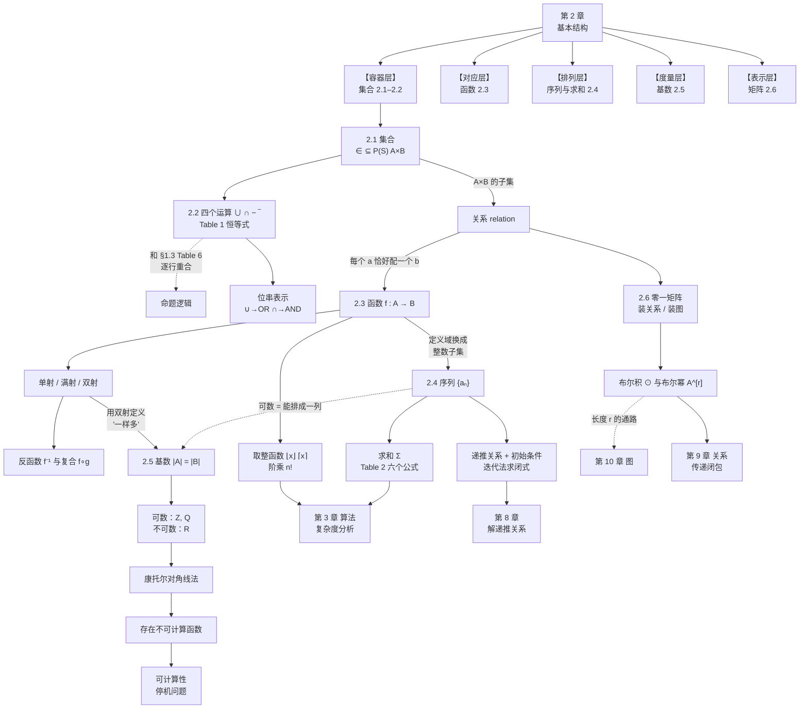
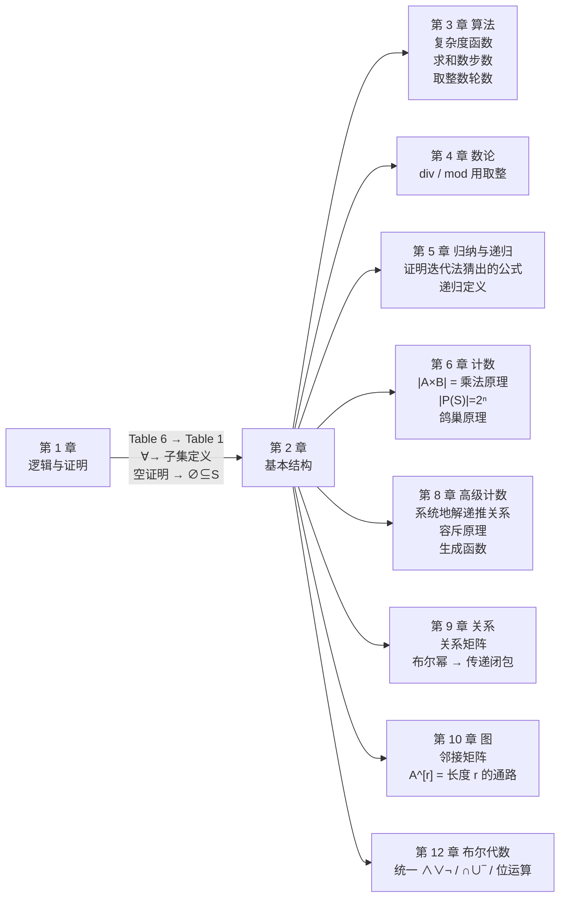

# C2 基本结构：集合、函数、序列、求和与矩阵 MOC

> [!abstract] 本章总纲（课本章首语）
> **离散数学的很大一部分致力于研究离散结构 (discrete structures)**，它们被用来表示离散对象。许多重要的离散结构都是用**集合**搭建的——集合就是对象的汇集。由集合构建的离散结构包括：**组合 combinations**（计数中大量使用的无序汇集）、**关系 relations**（表示对象之间关系的有序对之集）、**图 graphs**（顶点之集与连接顶点的边之集）、以及**有限状态机 finite state machines**（用来给计算机器建模）。这些都是后续章节的主题。
>
> **函数的概念在离散数学中极其重要。** 函数把第一个集合的每个元素指派到第二个集合的恰好一个元素（两个集合不必不同）。函数被用来**表示算法的计算复杂度、研究集合的大小、对对象计数**，以及无数其他用途。像**序列**和**字符串**这样有用的结构，都是特殊类型的函数。
>
> 在离散数学的学习中，我们常常要把一个数列中连续的若干项相加，为此发展了专门的**求和记号**，并会推导若干类型求和的公式——例如在分析排序算法所用步数时就会遇到。
>
> 通过引入**基数 cardinality** 的概念，可以研究无限集的相对大小。一个集合若是有限的、或与正整数集同样大，就称为**可数的**。本章将确立一个令人惊讶的结果：**有理数集可数，而实数集不可数**；并且据此说明**存在无法用任何编程语言的计算机程序计算出来的函数**。
>
> **矩阵**在离散数学中被用来表示各种离散结构。我们将复习表示关系和图所需的矩阵及矩阵算术的基本材料。

---

## 章节导航

| 节 | 笔记 | 核心内容 | 必背要点 |
|---|---|---|---|
| 2.1 | [[C2.1 集合 Sets]] | 集合定义、列举法/描述法、常用数集、相等、空集、文氏图、子集/真子集、基数、幂集、笛卡尔积、关系、真值集、罗素悖论 | $A\subseteq B \equiv \forall x(x\in A\to x\in B)$；$\varnothing\ne\{\varnothing\}$；$\lvert P(S)\rvert = 2^{\lvert S\rvert}$；$\lvert A\times B\rvert = \lvert A\rvert\lvert B\rvert$ |
| 2.2 | [[C2.2 集合运算 Set Operations]] | 并/交/差/补、不相交、容斥、Table 1 集合恒等式、三种证明方法、隶属表、广义并交、对称差、位串表示、多重集、模糊集 | **Table 1 ≡ §1.3 Table 6**；德摩根律；$A-B = A\cap\overline B$；$\lvert A\cup B\rvert = \lvert A\rvert+\lvert B\rvert-\lvert A\cap B\rvert$ |
| 2.3 | [[C2.3 函数 Functions]] | 函数三件套、像与原像、单射/满射/双射、单调性、反函数、复合、图像、**取整函数 Table 1**、阶乘与 Stirling、部分函数 | **值域 ⊆ 陪域**；四条证明模板；$f\circ g$ 先做 $g$；$\lfloor -x\rfloor = -\lceil x\rceil$ |
| 2.4 | [[C2.4 序列与求和 Sequences and Summations]] | 序列=函数、等差/等比、字符串、递推关系、初始条件、斐波那契/卢卡斯、迭代法、猜序列、$\Sigma$ 记号与换元、双重求和、**Table 2 求和公式** | 递推定形状、初值定身份；几何级数“乘 $r$ 相减”；$\sum k = \frac{n(n+1)}2$ 等六式 |
| 2.5 | [[C2.5 集合的基数 Cardinality of Sets]] | 基数定义、可数/不可数、$\aleph_0$、希尔伯特饭店、$\mathbf Z$ 与 $\mathbf Q$ 可数、**康托尔对角线法**、Schröder–Bernstein、不可计算函数、连续统假设 | 可数 = 能排成一列；有理数按 $p+q$ 分层；**实数不可数**；程序可数⟹存在不可计算函数 |
| 2.6 | [[C2.6 矩阵 Matrices]] | 矩阵与记号、加法、乘法、单位矩阵与幂、转置、对称矩阵、逆矩阵、零一矩阵、join/meet、**布尔积与布尔幂** | 乘法“中间对上、外面留下”；$\mathbf{AB}\ne\mathbf{BA}$；$(\mathbf{AB})^t = \mathbf B^t\mathbf A^t$；布尔积 = $+\to\vee$，$\times\to\wedge$ |

---

## 📚 课堂进度说明

> [!warning] 本章笔记依据教材编写
> 截至 **2026-09-16**，任课教师的课件已发布到 **Ch1.6 Part3**（内容为教材 §1.7 的前半：直接证明与逆否证明）。
> **第一章还剩 §1.7 的后半与 §1.8 未讲，第二章尚未开讲**，也**没有第二章的课堂语音转写稿**。
>
> 因此本章六篇笔记**完全依据课本（Rosen §2.1–2.6，pp.115–190）编写**，包含教材的全部定义、定理、例题、表格与典型习题，并补充了课堂上通常会讲到的动机、推导与易错点。
>
> **拿到第二章课件或转写稿后**，需要做三件事：
> 1. 按转写稿对笔记做**增量合并**（知识只增不减）；
> 2. 若课堂**跳过**了某些内容（本章的高危候选：**§2.5 的 Schröder–Bernstein 定理、连续统假设、不可计算函数**，以及 §2.2 的模糊集与多重集），把它们标注为**（拓展）**；
> 3. 更新本节的进度说明与下方的“课件对照表”。
>
> **在此之前，本章不做任何「拓展」标注**——因为整章都还没讲，逐条标注没有信息量。

| 课件文件 | 覆盖内容 | 状态 |
|---|---|---|
| （待补充） | §2.1–2.6 | **尚未收到** |
| `Ch1.6_Part3.pdf`（2026-09-16） | 教材 §1.7 前半 | 已并入 [[C1.7 证明导论 Introduction to Proofs]] |

> [!note] 第一章的标注状态
> 第一章各篇已按「课件上没有的内容标（拓展）」完成标注，约定与各篇覆盖情况见 [[C1 基础：逻辑与证明 MOC]] 的「🏷️ 全库「拓展」标注约定」。

---

## 全章知识地图

---

## 四张必背的表

### TABLE A｜集合恒等式（§2.2 Table 1）—— 与 §1.3 Table 6 逐行对应

| 集合恒等式 | 名称 | 对应的逻辑等价 |
|---|---|---|
| $A\cap U = A$；$A\cup\varnothing = A$ | 同一律 | $p\wedge\mathbf T\equiv p$；$p\vee\mathbf F\equiv p$ |
| $A\cup U = U$；$A\cap\varnothing = \varnothing$ | 支配律 | $p\vee\mathbf T\equiv\mathbf T$；$p\wedge\mathbf F\equiv\mathbf F$ |
| $A\cup A = A$；$A\cap A = A$ | 幂等律 | $p\vee p\equiv p$；$p\wedge p\equiv p$ |
| $\overline{(\overline A)} = A$ | 双重补律 | $\neg(\neg p)\equiv p$ |
| $A\cup B = B\cup A$；$A\cap B = B\cap A$ | 交换律 | $p\vee q\equiv q\vee p$ 等 |
| $A\cup(B\cup C) = (A\cup B)\cup C$ 等 | 结合律 | 同形 |
| $A\cup(B\cap C) = (A\cup B)\cap(A\cup C)$ 等 | 分配律 | 同形 |
| $\overline{A\cap B} = \overline A\cup\overline B$；$\overline{A\cup B} = \overline A\cap\overline B$ | ⭐ **德摩根律** | $\neg(p\wedge q)\equiv\neg p\vee\neg q$ 等 |
| $A\cup(A\cap B) = A$；$A\cap(A\cup B) = A$ | 吸收律 | 同形 |
| $A\cup\overline A = U$；$A\cap\overline A = \varnothing$ | 补律 | $p\vee\neg p\equiv\mathbf T$；$p\wedge\neg p\equiv\mathbf F$ |

**替换字典**：$\cap\leftrightarrow\wedge$，$\cup\leftrightarrow\vee$，$\overline{A}\leftrightarrow\neg p$，$U\leftrightarrow\mathbf T$，$\varnothing\leftrightarrow\mathbf F$。
**同一套定律在本书中出现四次**：命题逻辑（§1.3）→ 集合（§2.2）→ 位串（§2.2 / §1.1）→ 布尔矩阵（§2.6），第 12 章统一为**布尔代数**。

### TABLE B｜取整函数的性质（§2.3 Table 1）

| 编号 | 性质 |
|:-:|---|
| (1a) | $\lfloor x\rfloor = n \iff n\le x<n+1$ |
| (1b) | $\lceil x\rceil = n \iff n-1<x\le n$ |
| (1c) | $\lfloor x\rfloor = n \iff x-1<n\le x$ |
| (1d) | $\lceil x\rceil = n \iff x\le n<x+1$ |
| (2) | $x-1<\lfloor x\rfloor\le x\le\lceil x\rceil<x+1$ |
| (3a) | ⭐ $\lfloor -x\rfloor = -\lceil x\rceil$ |
| (3b) | ⭐ $\lceil -x\rceil = -\lfloor x\rfloor$ |
| (4a) | ⭐ $\lfloor x+n\rfloor = \lfloor x\rfloor+n$（$n$ 为**整数**） |
| (4b) | ⭐ $\lceil x+n\rceil = \lceil x\rceil+n$（$n$ 为**整数**） |

⚠️ **除了 (4a)(4b) 这种“加整数”，取整一律不能拆开**：$\lceil x+y\rceil\ne\lceil x\rceil+\lceil y\rceil$（反例 $x=y=\tfrac12$）。

### TABLE C｜求和公式（§2.4 Table 2）

| 求和式 | 闭式 | 备注 |
|---|---|---|
| $\displaystyle\sum_{k=0}^{n}ar^k\ (r\ne0)$ | $\dfrac{ar^{n+1}-a}{r-1}\ (r\ne1)$；$r=1$ 时为 $(n+1)a$ | 几何级数，定理 1 |
| $\displaystyle\sum_{k=1}^{n}k$ | $\dfrac{n(n+1)}2$ | 高斯配对 |
| $\displaystyle\sum_{k=1}^{n}k^2$ | $\dfrac{n(n+1)(2n+1)}6$ | 验算：$n=2$ 得 5 |
| $\displaystyle\sum_{k=1}^{n}k^3$ | $\dfrac{n^2(n+1)^2}4 = \left(\sum k\right)^2$ | ⭐ 立方和 = 和的平方 |
| $\displaystyle\sum_{k=0}^{\infty}x^k\ (\lvert x\rvert<1)$ | $\dfrac1{1-x}$ | 需微积分 |
| $\displaystyle\sum_{k=1}^{\infty}kx^{k-1}\ (\lvert x\rvert<1)$ | $\dfrac1{(1-x)^2}$ | 上式求导 |

### TABLE D｜常用整数序列（§2.4 Table 1）

| 第 $n$ 项 | 前 10 项 |
|:-:|---|
| $n^2$ | 1, 4, 9, 16, 25, 36, 49, 64, 81, 100 |
| $n^3$ | 1, 8, 27, 64, 125, 216, 343, 512, 729, 1000 |
| $n^4$ | 1, 16, 81, 256, 625, 1296, 2401, 4096, 6561, 10000 |
| $2^n$ | 2, 4, 8, 16, 32, 64, 128, 256, 512, 1024 |
| $3^n$ | 3, 9, 27, 81, 243, 729, 2187, 6561, 19683, 59049 |
| $n!$ | 1, 2, 6, 24, 120, 720, 5040, 40320, 362880, 3628800 |
| $f_n$ | 1, 1, 2, 3, 5, 8, 13, 21, 34, 55, 89 |

---

## 关键术语表 Key Terms（课本章末原文术语，附中文对照）

> [!note] 使用说明
> 这是课本章末 "Key Terms and Results" 的完整翻译对照，**一个都没省略**。名词解释题直接从这里出。

### §2.1–2.2 集合与集合运算

| 英文术语 | 中文 | 定义 |
|---|---|---|
| **set** | 集合 | 互不相同的对象的汇集 |
| **axiom** | 公理 | 理论的基本假设 |
| **paradox** | 悖论 | 一个逻辑上的不一致 |
| **element, member of a set** | 元素、集合的成员 | 集合中的一个对象 |
| **roster method** | 列举法 | 通过列出元素来描述集合的方法 |
| **set builder notation** | 描述法 | 通过陈述元素必须具有的性质来描述集合的记号 |
| **$\varnothing$ (empty set, null set)** | 空集 | 没有成员的集合 |
| **universal set** | 全集 | 包含当前考虑的所有对象的集合 |
| **Venn diagram** | 文氏图 | 集合的一种图形表示 |
| **$S = T$ (set equality)** | 集合相等 | $S$ 与 $T$ 有相同的元素 |
| **$S\subseteq T$** | $S$ 是 $T$ 的子集 | $S$ 的每个元素也是 $T$ 的元素 |
| **$S\subset T$** | $S$ 是 $T$ 的真子集 | $S$ 是 $T$ 的子集且 $S\ne T$ |
| **finite set** | 有限集 | 有 $n$ 个元素的集合（$n$ 为非负整数） |
| **infinite set** | 无限集 | 不是有限集的集合 |
| **$\lvert S\rvert$ (cardinality of $S$)** | $S$ 的基数 | $S$ 中元素的个数 |
| **$P(S)$ (power set of $S$)** | $S$ 的幂集 | $S$ 的全部子集构成的集合 |
| **$A\cup B$ (union)** | 并集 | 至少属于 $A$、$B$ 之一的元素构成的集合 |
| **$A\cap B$ (intersection)** | 交集 | 同时属于 $A$ 和 $B$ 的元素构成的集合 |
| **$A-B$ (difference)** | 差集 | 属于 $A$ 但不属于 $B$ 的元素构成的集合 |
| **$\overline A$ (complement)** | 补集 | 全集中不属于 $A$ 的元素构成的集合 |
| **$A\oplus B$ (symmetric difference)** | 对称差 | 恰好属于 $A$、$B$ 之一的元素构成的集合 |
| **membership table** | 隶属表 | 显示元素在各集合中归属情况的表 |

### §2.3 函数

| 英文术语 | 中文 | 定义 |
|---|---|---|
| **function from $A$ to $B$** | 从 $A$ 到 $B$ 的函数 | 把 $B$ 的恰好一个元素指派给 $A$ 的每个元素 |
| **domain of $f$** | $f$ 的定义域 | 集合 $A$ |
| **codomain of $f$** | $f$ 的陪域 | 集合 $B$ |
| **$b$ is the image of $a$ under $f$** | $b$ 是 $a$ 的像 | $b = f(a)$ |
| **$a$ is a pre-image of $b$ under $f$** | $a$ 是 $b$ 的一个原像 | $f(a) = b$ |
| **range of $f$** | $f$ 的值域 | $f$ 的全部像构成的集合 |
| **onto function, surjection** | 满射 | 从 $A$ 到 $B$ 的函数，使 $B$ 的每个元素都是 $A$ 中某元素的像 |
| **one-to-one function, injection** | 单射 | 定义域中不同元素的像互不相同的函数 |
| **one-to-one correspondence, bijection** | 双射、一一对应 | 既单又满的函数 |
| **inverse of $f$** | $f$ 的反函数 | 把 $f$ 给出的对应反过来的函数（$f$ 为双射时） |
| **$f\circ g$ (composition)** | $f$ 与 $g$ 的复合 | 把 $f(g(x))$ 指派给 $x$ 的函数 |
| **$\lfloor x\rfloor$ (floor function)** | 下取整函数 | 不超过 $x$ 的最大整数 |
| **$\lceil x\rceil$ (ceiling function)** | 上取整函数 | 大于等于 $x$ 的最小整数 |
| **partial function** | 部分函数 | 把陪域中唯一元素指派给定义域的一个子集中每个元素 |

### §2.4 序列与求和

| 英文术语 | 中文 | 定义 |
|---|---|---|
| **sequence** | 序列 | 定义域是整数集子集的函数 |
| **geometric progression** | 等比数列 | 形如 $a, ar, ar^2,\ldots$ 的序列 |
| **arithmetic progression** | 等差数列 | 形如 $a, a+d, a+2d,\ldots$ 的序列 |
| **string** | 字符串 | 有限序列 |
| **empty string** | 空串 | 长度为零的串 |
| **recurrence relation** | 递推关系 | 把序列第 $n$ 项 $a_n$ 用前面若干项表示出来的等式（对大于某个整数的一切 $n$ 成立） |
| **$\sum_{i=1}^{n}a_i$** | 求和 | $a_1+a_2+\cdots+a_n$ |
| **$\prod_{i=1}^{n}a_i$** | 求积 | $a_1a_2\cdots a_n$ |

### §2.5 基数

| 英文术语 | 中文 | 定义 |
|---|---|---|
| **cardinality** | 基数 | 若存在从 $A$ 到 $B$ 的一一对应，则 $A$ 与 $B$ 有相同的基数 |
| **countable set** | 可数集 | 有限的、或可与正整数集建立一一对应的集合 |
| **uncountable set** | 不可数集 | 不可数的集合 |
| **$\aleph_0$ (aleph null)** | 阿列夫零 | 可数集的基数 |
| **$\mathfrak c$** | 连续统的基数 | 实数集的基数 |
| **Cantor diagonalization argument** | 康托尔对角线法 | 用来证明实数集不可数的一种证明技术 |
| **computable function** | 可计算函数 | 存在某种编程语言的程序能求出其值的函数 |
| **uncomputable function** | 不可计算函数 | 不存在任何编程语言的程序能求出其值的函数 |
| **continuum hypothesis** | 连续统假设 | 不存在集合 $A$ 使 $\aleph_0<\lvert A\rvert<\mathfrak c$ 的断言 |

### §2.6 矩阵

| 英文术语 | 中文 | 定义 |
|---|---|---|
| **matrix** | 矩阵 | 数的矩形阵列 |
| **matrix addition** | 矩阵加法 | 见课本 p.178 |
| **matrix multiplication** | 矩阵乘法 | 见课本 p.179 |
| **$\mathbf I_n$ (identity matrix of order $n$)** | $n$ 阶单位矩阵 | 对角线上为 1、其余为 0 的 $n\times n$ 矩阵 |
| **$\mathbf A^t$ (transpose of $\mathbf A$)** | $\mathbf A$ 的转置 | 由 $\mathbf A$ 交换行与列得到的矩阵 |
| **symmetric matrix** | 对称矩阵 | 等于自身转置的矩阵 |
| **zero–one matrix** | 零一矩阵 | 每个元素非 0 即 1 的矩阵 |
| **$\mathbf A\vee\mathbf B$ (join)** | 并 | 见课本 p.181 |
| **$\mathbf A\wedge\mathbf B$ (meet)** | 交 | 见课本 p.181 |
| **$\mathbf A\odot\mathbf B$ (Boolean product)** | 布尔积 | 见课本 p.182 |

### 关键结果 RESULTS（课本原文）

1. **§2.2 Table 1 中给出的集合恒等式。**
2. **§2.4 Table 2 中的求和公式。**
3. **有理数集是可数的。**
4. **实数集是不可数的。**

---

## 章末复习题速答 Review Questions

> [!question] 1. 一个集合是另一个集合的子集是什么意思？如何证明一个集合是另一个集合的子集？
> > [!success]- 答案
> > **答**：$A\subseteq B$ 表示 $A$ 的每个元素都是 $B$ 的元素，即 $\forall x(x\in A\to x\in B)$。
> > **证法**：任取 $x\in A$，推出 $x\in B$。（**否证**：找一个 $x\in A$ 而 $x\notin B$ 的反例。）

> [!question] 2. 什么是空集？证明空集是任何集合的子集。
> > [!success]- 答案
> > **答**：空集 $\varnothing$ 是不含任何元素的集合。
> > **证明**：要证 $\forall x(x\in\varnothing\to x\in S)$。因 $x\in\varnothing$ 恒假，前件为假的条件语句恒真，故该全称命题为真。∎（这是一个**空证明** vacuous proof。）

> [!question] 3. (a) 定义 $\lvert S\rvert$。(b) 给出 $\lvert A\cup B\rvert$ 的公式。
> > [!success]- 答案
> > **答**：(a) 若 $S$ 恰有 $n$ 个互异元素（$n$ 非负整数），则 $S$ 有限且 $\lvert S\rvert = n$。
> > (b) $\lvert A\cup B\rvert = \lvert A\rvert+\lvert B\rvert-\lvert A\cap B\rvert$（容斥）。

> [!question] 4. (a) 定义幂集。(b) 空集何时在 $P(S)$ 中？(c) $\lvert S\rvert = n$ 时 $\lvert P(S)\rvert = ?$
> > [!success]- 答案
> > **答**：(a) $P(S)$ 是 $S$ 的全部子集构成的集合。
> > (b) **永远在**——因为 $\varnothing\subseteq S$ 对任何 $S$ 成立（定理 1）。
> > (c) $2^n$。

> [!question] 5. (a) 定义并、交、差、对称差。(b) 求正整数集与奇整数集的这四个运算结果。
> > [!success]- 答案
> > **答**：(a) 见 [[C2.2 集合运算 Set Operations]] 定义 1–4 与第 5 节。
> > (b) 设 $A = \mathbf Z^+$（正整数），$B$ = 全体奇整数（含负奇数）：
> > - $A\cup B$ = 全体正整数与全体奇整数之并 = $\mathbf Z^+\cup\{\text{负奇数}\}$；
> > - $A\cap B$ = **正奇数集** $\{1,3,5,\ldots\}$；
> > - $A - B$ = **正偶数集** $\{2,4,6,\ldots\}$；
> > - $A\oplus B$ = 正偶数集 $\cup$ 负奇数集（**恰在其一**）。

> [!question] 6. (a) 两个集合相等是什么意思？(b) 有哪些证明相等的方法？(c) 用至少两种方法证明 $A-(B\cap C) = (A-B)\cup(A-C)$。
> > [!success]- 答案
> > **答**：(a) $A=B \iff \forall x(x\in A\leftrightarrow x\in B)$。
> > (b) ① **双向包含**；② **描述法 + 逻辑等价链式变形**；③ **隶属表**；④ 用已证的恒等式做代数推导。
> >
> > **方法一（链式变形）**：
> > $$\begin{aligned}A-(B\cap C) &= A\cap\overline{(B\cap C)} = A\cap(\overline B\cup\overline C) && \text{德摩根律}\\ &= (A\cap\overline B)\cup(A\cap\overline C) && \text{分配律}\\ &= (A-B)\cup(A-C)\end{aligned}$$
> >
> > **方法二（隶属表，8 行）**：
> > | $A$ | $B$ | $C$ | $B\cap C$ | $A-(B\cap C)$ | $A-B$ | $A-C$ | $(A{-}B)\cup(A{-}C)$ |
> > |:-:|:-:|:-:|:-:|:-:|:-:|:-:|:-:|
> > | 1 | 1 | 1 | 1 | **0** | 0 | 0 | **0** |
> > | 1 | 1 | 0 | 0 | **1** | 0 | 1 | **1** |
> > | 1 | 0 | 1 | 0 | **1** | 1 | 0 | **1** |
> > | 1 | 0 | 0 | 0 | **1** | 1 | 1 | **1** |
> > | 0 | 1 | 1 | 1 | **0** | 0 | 0 | **0** |
> > | 0 | 1 | 0 | 0 | **0** | 0 | 0 | **0** |
> > | 0 | 0 | 1 | 0 | **0** | 0 | 0 | **0** |
> > | 0 | 0 | 0 | 0 | **0** | 0 | 0 | **0** |
> >
> > 两列完全相同 ✓

> [!question] 7. 解释逻辑等价与集合恒等式之间的关系。
> > [!success]- 答案
> > **答**：**每条集合恒等式都对应一条逻辑等价**，对应字典是 $\cap\leftrightarrow\wedge$、$\cup\leftrightarrow\vee$、$\overline{\ }\leftrightarrow\neg$、$U\leftrightarrow\mathbf T$、$\varnothing\leftrightarrow\mathbf F$。
> > **原因**：集合运算在定义里就是用联结词写的（$A\cap B = \{x\mid x\in A\wedge x\in B\}$ 等），所以它们必然继承联结词的全部性质。两者都是**布尔代数**（第 12 章）恒等式的特例。

> [!question] 8. (a) 定义函数的定义域、陪域、值域。(b) 对 $f(n)=n^2+1$（$\mathbf Z\to\mathbf Z$）分别是什么？
> > [!success]- 答案
> > **答**：(a) 见 [[C2.3 函数 Functions]] 定义 2。
> > (b) 定义域 $=\mathbf Z$；陪域 $=\mathbf Z$；**值域 $=\{n^2+1\mid n\in\mathbf Z\} = \{1,2,5,10,17,26,\ldots\}$**（比陪域小得多）。

> [!question] 9. (a)(b) 定义 $\mathbf Z^+\to\mathbf Z^+$ 的单射与满射。(c)–(f) 各举一例。
> > [!success]- 答案
> > **答**：(a) 单射：$f(a)=f(b)\Rightarrow a=b$。(b) 满射：每个正整数都是某个正整数的像。
> > **(c) 双射（非恒等）**：$f(n) = \begin{cases}n+1,& n\text{ 奇}\\ n-1,& n\text{ 偶}\end{cases}$（把 $1\leftrightarrow2$、$3\leftrightarrow4$…… 对调）。
> > **(d) 单而不满**：$f(n) = n+1$（1 没有原像）。
> > **(e) 满而不单**：$f(n) = \lceil n/2\rceil$（$f(1)=f(2)=1$；任取 $k$ 有 $f(2k)=k$）。
> > **(f) 都不是**：$f(n) = 1$（常函数）。

> [!question] 10. (a) 定义反函数。(b) 函数何时有反函数？(c) $f(n) = 10-n$（$\mathbf Z\to\mathbf Z$）有反函数吗？
> > [!success]- 答案
> > **答**：(a) 见 [[C2.3 函数 Functions]] 定义 9。
> > (b) **当且仅当 $f$ 是一一对应（双射）时**。
> > (c) **有**。$f$ 是双射：单（$10-n = 10-m\Rightarrow n=m$）、满（任取 $y$，取 $n = 10-y$）。
> > 令 $y = 10-n$ 解得 $n = 10-y$，故 $f^{-1}(y) = 10-y$——**$f$ 是自己的反函数**（对合 involution）。

> [!question] 11. (a) 定义取整与上取整函数。(b) 对哪些实数 $x$ 有 $\lfloor x\rfloor = \lceil x\rceil$？
> > [!success]- 答案
> > **答**：(a) 见 [[C2.3 函数 Functions]] 定义 12。
> > (b) **当且仅当 $x$ 是整数**。因为 $x$ 非整数时 $\lceil x\rceil = \lfloor x\rfloor+1$。

> [!question] 12. 猜一个公式：$8, 14, 32, 86, 248,\ldots$，并求接下来三项。
> > [!success]- 答案
> > **答**：相邻比值趋近 3，与 $3^n$（$3,9,27,81,243$）逐项相比**各大 5**，故
> > $$a_n = 3^n+5\quad(n\ge1)$$
> > 验证：$3{+}5=8$、$9{+}5=14$、$27{+}5=32$、$81{+}5=86$、$243{+}5=248$ ✓
> > **接下来三项**：$734,\ 2192,\ 6566$。

> [!question] 13. 设 $a_n = a_{n-1}-5$（$n=1,2,\ldots$），求 $a_n$ 的公式。
> > [!success]- 答案
> > **答**：等差数列，公差 $-5$：$a_n = a_0 - 5n$。

> [!question] 14. 等比数列 $a+ar+\cdots+ar^n$（$r\ne1$）之和是多少？
> > [!success]- 答案
> > **答**：$\displaystyle\sum_{j=0}^{n}ar^j = \frac{ar^{n+1}-a}{r-1}$。

> [!question] 15. 证明奇整数集是可数的。
> > [!success]- 答案
> > **答**：把全体奇整数排成一列：$1,-1,3,-3,5,-5,\ldots$，每个奇整数恰出现一次，故可数。
> > （或给出双射 $f:\mathbf Z^+\to\{\text{奇整数}\}$：$f(n) = \begin{cases}n,& n\text{ 奇}\\ 1-n,& n\text{ 偶}\end{cases}$，给出 $1,-1,3,-3,\ldots$）

> [!question] 16. 举一个不可数集的例子。
> > [!success]- 答案
> > **答**：**实数集 $\mathbf R$**（或任意实数区间如 $(0,1)$，或 $P(\mathbf Z^+)$，或无理数集）。由**康托尔对角线法**证明。

> [!question] 17. 定义两个矩阵 $\mathbf A$ 与 $\mathbf B$ 的乘积。何时这个乘积有定义？
> > [!success]- 答案
> > **答**：$\mathbf A$ 是 $m\times k$、$\mathbf B$ 是 $k\times n$ 时乘积有定义（**$\mathbf A$ 的列数 = $\mathbf B$ 的行数**），结果是 $m\times n$ 矩阵，$(i,j)$ 元素为 $c_{ij} = \sum_{l=1}^{k}a_{il}b_{lj}$。

> [!question] 18. 说明矩阵乘法不满足交换律。
> > [!success]- 答案
> > **答**：取 $\mathbf A = \begin{bmatrix}1&1\\2&1\end{bmatrix}$，$\mathbf B = \begin{bmatrix}2&1\\1&1\end{bmatrix}$。
> > 则 $\mathbf{AB} = \begin{bmatrix}3&2\\5&3\end{bmatrix}$，$\mathbf{BA} = \begin{bmatrix}4&3\\3&2\end{bmatrix}$，两者不等。
> > 更强的例子：$\mathbf A$ 是 $2\times3$、$\mathbf B$ 是 $3\times4$ 时，$\mathbf{AB}$ 有定义而 $\mathbf{BA}$ **根本没有定义**。

---

## 补充习题精选 Supplementary Exercises

> [!example] 补充习题 1｜用集合运算表达英语（§2.1–2.2 综合）
> $A$ = 含字母 x 的英文单词，$B$ = 含字母 q 的英文单词。
>
> **题目**：用 $A,B$ 与集合运算表示下列各类单词构成的集合。
> ① 不含 x 的单词　② 同时含 x 和 q　③ 含 x 但不含 q　④ 既不含 x 也不含 q　⑤ 含 x 或 q 但不同时含
>
> > [!success]- 参考答案
> > | 描述 | 表达式 |
> > |---|---|
> > | 不含 x 的单词 | $\overline A$ |
> > | 同时含 x 和 q | $A\cap B$ |
> > | 含 x 但不含 q | $A - B$ |
> > | 既不含 x 也不含 q | $\overline A\cap\overline B = \overline{A\cup B}$（德摩根） |
> > | 含 x 或 q 但不同时含 | $A\oplus B$ |
> >
> > **要点**：“都不”用**德摩根律**转换，“但不同时”用**对称差**。这两个是翻译题的固定考点。

> [!example] 补充习题 4｜偶数、奇数与整数
> $E$ = 偶整数，$O$ = 奇整数，$\mathbf Z$ = 全体整数。
>
> **题目**：求 $E\cup O$、$E\cap O$、$\mathbf Z-E$、$\mathbf Z-O$。
>
> > [!success]- 参考答案
> > - $E\cup O = \mathbf Z$（每个整数非奇即偶）
> > - $E\cap O = \varnothing$（**不相交**）
> > - $\mathbf Z - E = O$
> > - $\mathbf Z - O = E$
> >
> > **要点**：$\{E, O\}$ 构成 $\mathbf Z$ 的一个**划分 partition**（不相交且并为全体）——这个概念在第 9 章等价关系里是核心。

> [!example] 补充习题 5、6｜两条常用恒等式
> **题目**：证明下列两条恒等式。
> 5. $A-(A-B) = A\cap B$　　6. $A\subseteq B \iff A\cap B = A$
>
> > [!success]- 参考答案
> > **5. $A - (A-B) = A\cap B$**
> > $$A-(A-B) = A\cap\overline{(A\cap\overline B)} = A\cap(\overline A\cup B) = (A\cap\overline A)\cup(A\cap B) = \varnothing\cup(A\cap B) = A\cap B$$
> >
> > **6. $A\subseteq B \iff A\cap B = A$**
> > **(⟹)** 若 $A\subseteq B$，则 $A$ 的元素都在 $B$ 里，故 $A\cap B$ 含 $A$ 的全部元素，即 $A\cap B = A$。
> > **(⟸)** 若 $A\cap B = A$，任取 $x\in A$，则 $x\in A\cap B$，故 $x\in B$，即 $A\subseteq B$。∎
> >
> > **要点**：习题 6 与 $A\cup B = B\iff A\subseteq B$ 是一对，**化简题里常用作跳板**。

> [!example] 补充习题 7、8｜差集的括号位置很要紧
> **题目**：
> 7. $(A-B)-C$ 与 $A-(B-C)$ 一定相等吗？若不一定，给出反例。
> 8. $(A-B)-C = (A-C)-B$ 成立吗？说明理由。
>
> > [!success]- 参考答案
> > **7. $(A-B)-C$ 未必等于 $A-(B-C)$。**
> > **反例**：$A = B = C = \{1\}$。
> > - $(A-B)-C = \varnothing-\{1\} = \varnothing$
> > - $A-(B-C) = \{1\}-\varnothing = \{1\}$
> >
> > **8. $(A-B)-C = (A-C)-B$ 成立吗？——成立。**
> > $$(A-B)-C = A\cap\overline B\cap\overline C = A\cap\overline C\cap\overline B = (A-C)-B$$
> > **要点**：连续做差可以**交换减数的顺序**（因为都化成了 $\cap$），但**不能改变括号的嵌套结构**（习题 7）。

> [!example] 补充习题 11｜按大小排序
> 设 $A, B$ 是有限全集 $U$ 的子集。
>
> **题目**：把下列各组数按从小到大排序。
> a) $\lvert\varnothing\rvert,\ \lvert A\rvert,\ \lvert A\cap B\rvert,\ \lvert A\cup B\rvert,\ \lvert U\rvert$
> b) $\lvert\varnothing\rvert,\ \lvert A-B\rvert,\ \lvert A\oplus B\rvert,\ \lvert A\cup B\rvert,\ \lvert A\rvert+\lvert B\rvert$
>
> > [!success]- 参考答案
> > **a)** $\lvert\varnothing\rvert \le \lvert A\cap B\rvert\le\lvert A\rvert\le\lvert A\cup B\rvert\le\lvert U\rvert$
> > **b)** $\lvert\varnothing\rvert\le\lvert A-B\rvert\le\lvert A\oplus B\rvert\le\lvert A\cup B\rvert\le\lvert A\rvert+\lvert B\rvert$
> >
> > **理由**：
> > - a) $A\cap B\subseteq A\subseteq A\cup B\subseteq U$，子集关系直接给出基数不减；
> > - b) $A-B\subseteq A\oplus B\subseteq A\cup B$（对称差是两个差的并）；最后一个不等号来自容斥：$\lvert A\cup B\rvert = \lvert A\rvert+\lvert B\rvert-\lvert A\cap B\rvert\le\lvert A\rvert+\lvert B\rvert$。

> [!example] 补充习题 18｜$n = \lfloor n/2\rfloor+\lceil n/2\rceil$
> **题目**：证明：对一切整数 $n$，$n=\lfloor n/2\rfloor+\lceil n/2\rceil$。
>
> > [!success]- 参考答案
> > **证明**：分两种情形。
> > **$n$ 为偶数**，设 $n = 2k$：$\lfloor n/2\rfloor = \lceil n/2\rceil = k$，和为 $2k = n$ ✓
> > **$n$ 为奇数**，设 $n = 2k+1$：$n/2 = k+\tfrac12$，故 $\lfloor n/2\rfloor = k$，$\lceil n/2\rceil = k+1$，和为 $2k+1 = n$ ✓ ∎
> >
> > **要点**：**取整的证明题，第一反应是按整数的奇偶（或小数部分与 $\tfrac12$ 的关系）分情形。**
> > **应用**：这就是归并排序把数组分成两半 $\lfloor n/2\rfloor$ 和 $\lceil n/2\rceil$ 时“不丢元素”的保证。

> [!example] 补充习题 19–21｜取整何时可以拆开
> **题目**：分别求使下列等式成立的所有实数 $x,y$。
> 19. $\lfloor x+y\rfloor = \lfloor x\rfloor+\lfloor y\rfloor$
> 20. $\lceil x+y\rceil = \lceil x\rceil+\lceil y\rceil$
> 21. $\lceil x+y\rceil = \lfloor x\rfloor+\lceil y\rceil$
>
> > [!success]- 参考答案
> > **19. $\lfloor x+y\rfloor = \lfloor x\rfloor+\lfloor y\rfloor$ 对哪些 $x,y$ 成立？**
> > 记 $x = m+\alpha$、$y = n+\beta$（$m,n$ 整数，$0\le\alpha,\beta<1$）。则
> > $$\lfloor x+y\rfloor = m+n+\lfloor\alpha+\beta\rfloor$$
> > 故等式成立 $\iff \lfloor\alpha+\beta\rfloor = 0 \iff \boxed{\alpha+\beta<1}$（两数的**小数部分之和小于 1**）。
> >
> > **20. $\lceil x+y\rceil = \lceil x\rceil+\lceil y\rceil$**：类似地，成立 $\iff$ $x,y$ 中至少一个是整数，或两者的小数部分之和 $>1$。
> >
> > **21. $\lceil x+y\rceil = \lfloor x\rfloor+\lceil y\rceil$**：成立 $\iff$ $x$ 是整数，或 $y$ 是整数且 $x$ 的小数部分……（按上面的拆法逐情形讨论即可）。
> >
> > **要点**：**这三题的通法完全一样——把 $x,y$ 拆成“整数 + 小数部分”，问题就变成对小数部分的初等讨论。** 见 [[C2.3 函数 Functions]] 第 8.5 节。

> [!example] 补充习题 22｜$\lfloor n/2\rfloor\lceil n/2\rceil = \lfloor n^2/4\rfloor$
> **题目**：证明：对一切整数 $n$，$\lfloor n/2\rfloor\lceil n/2\rceil=\lfloor n^2/4\rfloor$。
>
> > [!success]- 参考答案
> > **证明**：分情形。
> > **$n = 2k$（偶）**：左 $= k\cdot k = k^2$；右 $= \lfloor 4k^2/4\rfloor = k^2$ ✓
> > **$n = 2k+1$（奇）**：左 $= k(k+1) = k^2+k$；
> > 右 $= \left\lfloor\dfrac{(2k+1)^2}{4}\right\rfloor = \left\lfloor\dfrac{4k^2+4k+1}{4}\right\rfloor = \left\lfloor k^2+k+\tfrac14\right\rfloor = k^2+k$ ✓ ∎
> >
> > **验算**：$n=5$：左 $=2\cdot3=6$，右 $=\lfloor25/4\rfloor = 6$ ✓

> [!example] 补充习题 28｜Ulam 数（★）
> **定义**：$u_1 = 1$，$u_2 = 2$；此后 $n$ 是 Ulam 数当且仅当 $n$ **能唯一地**写成两个**不同的**较小 Ulam 数之和。
> 课本给出 $u_3 = 3,\ u_4 = 4,\ u_5 = 6,\ u_6 = 8$。
>
> **题目**：求前 20 个 Ulam 数。
>
> > [!success]- 参考答案
> > **逐项推演**：
> > - $3 = 1+2$ ✓ 唯一 → $u_3 = 3$
> > - $4 = 1+3$ ✓ 唯一（$2+2$ 不算，要求两数**不同**）→ $u_4 = 4$
> > - $5 = 1+4 = 2+3$ ✗ **两种写法**，不唯一 → 跳过
> > - $6 = 2+4$ ✓ 唯一（$1+5$ 中 5 不是 Ulam 数）→ $u_5 = 6$
> > - $7 = 1+6 = 3+4$ ✗ 不唯一 → 跳过
> > - $8 = 2+6$ ✓ 唯一 → $u_6 = 8$
> >
> > **前 20 个 Ulam 数**：$1, 2, 3, 4, 6, 8, 11, 13, 16, 18, 26, 28, 36, 38, 47, 48, 53, 57, 62, 69$
> >
> > **要点**：这题的价值在于**读懂“唯一地写成两个不同的较小项之和”这个条件有多严**——5 和 7 被刷掉正是因为**写法太多**。这是“按定义逐项筛”这类题的典型。

> [!example] 补充习题 29｜$\prod_{k=1}^{100}\frac{k+1}{k}$
> **题目**：求 $\prod_{k=1}^{100}\dfrac{k+1}{k}$。
>
> > [!success]- 参考答案
> > **解（望远镜乘积 telescoping）**：
> > $$\prod_{k=1}^{100}\frac{k+1}{k} = \frac21\cdot\frac32\cdot\frac43\cdots\frac{101}{100}$$
> > 每个分子和下一项的分母**逐个约掉**，只剩首尾：
> > $$= \frac{101}{1} = \boxed{101}$$
> > **要点**：见到形如 $\frac{f(k+1)}{f(k)}$ 的连乘（或 $g(k+1)-g(k)$ 的连加），**先想“能不能一路约掉”**。这就是 [[C2.4 序列与求和 Sequences and Summations]] 里几何级数证明用的同一个思想。

> [!example] 补充习题 32｜无理数集不可数
> **题目**：证明：无理数集是不可数的。
>
> > [!success]- 参考答案
> > **证明（反证）**：设无理数集 $I$ 可数。由 §2.5 例 4，$\mathbf Q$ 可数。由定理 1（两个可数集的并可数），$\mathbf Q\cup I = \mathbf R$ 可数——与 §2.5 例 5 矛盾。故 $I$ 不可数。∎
> > **推论**：**无理数比有理数“多得多”**（$\mathfrak c$ vs $\aleph_0$）。

> [!example] 补充习题 37｜求 $\mathbf A^n$，其中 $\mathbf A = \begin{bmatrix}0&1\\-1&0\end{bmatrix}$
> **题目**：求 $\mathbf A^n$（$n$ 为正整数）。
>
> > [!success]- 参考答案
> > **算前几个**：
> > $$\mathbf A^2 = \begin{bmatrix}-1&0\\0&-1\end{bmatrix} = -\mathbf I,\qquad \mathbf A^3 = -\mathbf A = \begin{bmatrix}0&-1\\1&0\end{bmatrix},\qquad \mathbf A^4 = \mathbf I$$
> > **发现周期为 4**：
> > $$\mathbf A^n = \begin{cases}\mathbf I, & n\equiv0\pmod 4\\ \mathbf A, & n\equiv1\\ -\mathbf I, & n\equiv2\\ -\mathbf A, & n\equiv3\end{cases}$$
> > **要点**：$\mathbf A$ 是平面上**旋转 90°** 的矩阵，转四次回到原位，所以周期是 4——**看出几何意义，答案立刻就有了**。
> > （这也正是复数 $i$ 的矩阵表示：$i^2 = -1$、$i^4 = 1$，完全同构。）

---

## 全章自测 Chapter Self-Test（30 题快速过关）

> [!question] 集合与集合运算（2.1–2.2）
> 1. $A\subseteq B$ 的量词形式？
> 2. $\varnothing$ 与 $\{\varnothing\}$ 分别有几个元素？
> 3. $\lvert P(S)\rvert$ 等于什么？
> 4. $\lvert A\times B\rvert$ 等于什么？$A\times B = B\times A$ 何时成立？
> 5. $A\times B\times C$ 与 $(A\times B)\times C$ 一样吗？
> 6. 什么是关系？
> 7. 证明 $A = B$ 的标准方法？
> 8. 写出两条集合德摩根律。
> 9. $A - B$ 用 $\cap$ 怎么写？
> 10. $\lvert A\cup B\rvert = ?$
> 11. 隶属表有几行？
> 12. 位串表示下，$\cup$、$\cap$、$\oplus$ 分别是什么位运算？
>
> > [!success]- 答案
> > 1. $\forall x(x\in A\to x\in B)$（**$\forall$ 配 $\to$**）
> > 2. **0 个 / 1 个**
> > 3. $2^{\lvert S\rvert}$；且 $P(S)$ **永不为空**
> > 4. $\lvert A\rvert\lvert B\rvert$；$A=\varnothing$ 或 $B=\varnothing$ 或 $A=B$
> > 5. **不一样**（三元组 vs 嵌套有序对）
> > 6. $A\times B$ 的**子集**
> > 7. 证 $A\subseteq B$ **且** $B\subseteq A$
> > 8. $\overline{A\cap B}=\overline A\cup\overline B$；$\overline{A\cup B}=\overline A\cap\overline B$
> > 9. $A\cap\overline B$
> > 10. $\lvert A\rvert+\lvert B\rvert-\lvert A\cap B\rvert$
> > 11. $2^n$（$n$ = 集合个数）
> > 12. **OR / AND / XOR**

> [!question] 函数（2.3）
> 13. 值域与陪域的关系？
> 14. 单射的定义式？
> 15. 怎么否证满射？
> 16. 什么函数有反函数？
> 17. $f\circ g$ 先做谁？
> 18. 有限集到自身时单射与满射的关系？
> 19. $\lfloor -2.5\rfloor = ?$ $\lceil -2.5\rceil = ?$
> 20. “至少要几个”用哪个取整？
> 21. $\lfloor x+n\rfloor = \lfloor x\rfloor+n$ 对什么样的 $n$ 成立？
>
> > [!success]- 答案
> > 13. 值域 $\subseteq$ 陪域；**相等 ⟺ 满射**
> > 14. $f(a)=f(b)\Rightarrow a=b$
> > 15. 举一个**没有原像**的 $y$
> > 16. **只有双射**
> > 17. **先做 $g$**
> > 18. **等价**（无限集则不然）
> > 19. $-3$ / $-2$
> > 20. **上取整** $\lceil\ \rceil$
> > 21. **$n$ 为整数**

> [!question] 序列与求和（2.4）
> 22. 序列的正式定义？
> 23. 递推关系需要几个初始条件？
> 24. 斐波那契与卢卡斯数列差在哪？
> 25. $\sum_{k=1}^{n}k$、$\sum_{k=1}^n k^2$、$\sum_{k=1}^n k^3$ 各等于？
> 26. $\sum_{j=0}^{n}$ 有几项？
> 27. $\sum_{k=m}^{n}$ 怎么用“从 1 开始”的公式算？
>
> > [!success]- 答案
> > 22. **定义域为整数子集的函数**
> > 23. 与它**回看的项数**相同
> > 24. **只差初始条件**
> > 25. $\frac{n(n+1)}2$、$\frac{n(n+1)(2n+1)}6$、$\left(\frac{n(n+1)}2\right)^2$
> > 26. **$n+1$ 项**（差一错误高危）
> > 27. $\sum_{k=1}^{n} - \sum_{k=1}^{\boxed{m-1}}$

> [!question] 基数与矩阵（2.5–2.6）
> 28. “可数”的可操作判据？
> 29. 证明有理数可数的关键排法？
> 30. 实数不可数用什么证？结论有什么推论？
> 31. $\mathbf{AB}$ 有定义的条件？结果尺寸？
> 32. $(\mathbf{AB})^t = ?$
> 33. 布尔积和普通乘积差在哪？
> 34. $\mathbf A^{[r]}$ 的 $(i,j)$ 位为 1 意味着什么？
>
> > [!success]- 答案
> > 28. **能把元素排成一个序列**
> > 29. 按 **$p+q$ 分层**斜着走（**不能逐行扫**）
> > 30. **康托尔对角线法**；推出**存在不可计算函数**
> > 31. $\mathbf A$ 的列数 = $\mathbf B$ 的行数；$m\times n$（外面两个数）
> > 32. $\mathbf B^t\mathbf A^t$（**顺序倒过来**）
> > 33. $+\to\vee$，$\times\to\wedge$
> > 34. 从 $i$ 到 $j$ 存在**长度为 $r$ 的通路**（第 10 章）

---

## 与前后章节的连接

| 本章内容 | 在哪里继续 |
|---|---|
| Table 1 集合恒等式 | 第 12 章**布尔代数**（与 §1.3 Table 6 一同被统一） |
| 容斥 $\lvert A\cup B\rvert$ | 第 6、8 章**容斥原理** |
| $\lvert P(S)\rvert = 2^n$、$\lvert A\times B\rvert = mn$ | 第 6 章**乘法原理与组合计数** |
| 关系（$A\times B$ 的子集） | 第 9 章**关系**、数据库理论 |
| 单射/满射/双射 | 第 6 章**计数**（数函数个数）、§2.5 基数 |
| 取整函数 | 第 3 章**算法分析**、第 4 章 **div/mod** |
| 递推关系与迭代法 | 第 5 章**数学归纳法**（证明猜想）、第 8 章**系统解法** |
| Table 2 求和公式 | 第 3 章**复杂度分析**、第 5 章**归纳法证明** |
| 斐波那契数列 | 第 5 章（恒等式）、第 8 章（**Binet 公式、兔子模型**） |
| 阶乘与 Stirling 公式 | 第 6 章**排列组合**、排序下界 $\Omega(n\log n)$ |
| 可数/不可数、对角线法 | **停机问题**、可计算性理论 |
| 矩阵、转置、对称 | 第 9 章**关系矩阵**（对称矩阵 ⟺ 对称关系） |
| 布尔积与布尔幂 | 第 9 章**传递闭包 / Warshall 算法**、第 10 章**图的通路** |

---

## 复习路线建议

> [!important] 按考试权重排序的复习顺序
> **第一梯队（必须滚瓜烂熟，占分最多）**
> 1. **§2.3 单射 / 满射 / 双射的判定与证明** —— 证明大题的主力
> 2. **§2.2 Table 1 + 三种证明方法** —— 恒等式证明题的全部工具
> 3. **§2.4 Table 2 求和公式 + 递推关系的迭代法** —— 计算题的主要来源
> 4. **§2.1 $\in$ / $\subseteq$ 辨析、幂集、笛卡尔积计数** —— 概念选择题与判断题
> 5. **§2.3 取整函数 Table 1 与应用题** —— 计算题 + 证明题
>
> **第二梯队（要会做，套路固定）**
> 6. **§2.5 可数性证明（排成一列）+ 康托尔对角线法** —— 概念大题
> 7. **§2.6 矩阵乘法、转置、布尔积与布尔幂** —— 计算题
>
> **第三梯队（理解即可，偶尔考概念）**
> 8. §2.2 多重集、模糊集；§2.5 Schröder–Bernstein、连续统假设
> 9. §2.1 罗素悖论；§2.4 OEIS 与整数序列背景

> [!question] 一句话概括整章
> **第 1 章教你“怎么说话、怎么推理”，第 2 章给你“拿什么来说”**——集合装对象、函数建对应、序列排顺序、求和做累加、基数比大小、矩阵进电脑。
> 这六件工具是后面**每一章**的公共底座：第 3 章用函数和求和分析算法，第 6 章用笛卡尔积和幂集计数，第 9、10 章用矩阵表示关系和图。
> **本章唯一的思想高峰在 §2.5**：用“能不能配对”重新定义“一样多”，然后用对角线法证明**有些无限比另一些无限更大**，并由此推出**计算机能力的原理性上界**。

---

## 附：本章所有插图索引

| 图 | 出处 | 内容 | 笔记位置 |
|---|---|---|---|
| ![[C2-图1-元音集合的文氏图.png\|60]] | §2.1 FIGURE 1 | 元音集合 $V$ 的文氏图 | [[C2.1 集合 Sets]] |
| ![[C2-图2-A是B的子集.png\|60]] | §2.1 FIGURE 2 | $A\subseteq B$ 的文氏图 | [[C2.1 集合 Sets]] |
| ![[C2-图3-集合运算的文氏图-并交差补.png\|60]] | §2.2 FIGURE 1–4 | 并、交、差、补四张文氏图 | [[C2.2 集合运算 Set Operations]] |
| ![[C2-图4-三个集合的并与交.png\|60]] | §2.2 FIGURE 5 | $A\cup B\cup C$ 与 $A\cap B\cap C$ | [[C2.2 集合运算 Set Operations]] |
| ![[C2-图5-对称差的文氏图.png\|60]] | §2.2 习题 34 | 对称差 $A\oplus B$ | [[C2.2 集合运算 Set Operations]] |
| ![[C2-图6-整数集上两个函数的图像.png\|60]] | §2.3 FIGURE 8–9 | $f(n)=2n+1$ 与 $f(x)=x^2$ 在 $\mathbf Z$ 上的图像 | [[C2.3 函数 Functions]] |
| ![[C2-图7-取整函数的图像-下取整与上取整.png\|60]] | §2.3 FIGURE 10 | $y=\lfloor x\rfloor$ 与 $y=\lceil x\rceil$ | [[C2.3 函数 Functions]] |
| ![[C2-图8-正有理数可数的排列路径.png\|60]] | §2.5 FIGURE 3 | 正有理数按 $p+q$ 分层排列 | [[C2.5 集合的基数 Cardinality of Sets]] |

> [!note] 关于插图
> 课本第 2 章的插图基本都是**矢量线条图**（文氏图、函数箭头图、坐标图），所以本章笔记里：
> - **文氏图与坐标图用 Python 重绘**（比原扫描图清晰，且负数端点的空心/实心标注更明确）；
> - **函数箭头图（FIGURE 1–7）全部用 mermaid 复现**，直接嵌在 [[C2.3 函数 Functions]] 正文里，无需图片；
> - **矩阵乘法示意图（§2.6 FIGURE 1）与对称矩阵示意（FIGURE 2）**用 LaTeX 排版直接写在正文中。

---

**上一章** ← [[C1 基础：逻辑与证明 MOC]]
**本章各节** → [[C2.1 集合 Sets]]｜[[C2.2 集合运算 Set Operations]]｜[[C2.3 函数 Functions]]｜[[C2.4 序列与求和 Sequences and Summations]]｜[[C2.5 集合的基数 Cardinality of Sets]]｜[[C2.6 矩阵 Matrices]]
