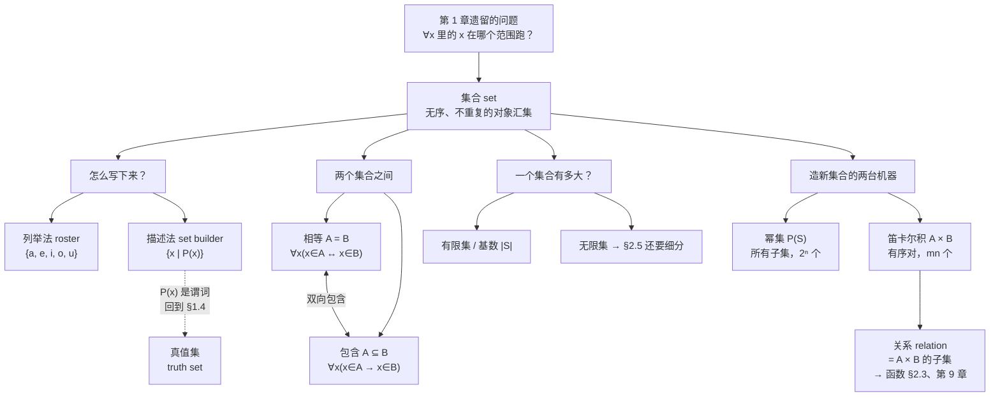

# C2.1 集合 Sets

> [!abstract] 这一讲的任务
> 第 1 章我们学会了把句子写成符号、把推理写成步骤。但那一整章里，我们其实一直在偷偷用一个没定义过的东西：**“论域”**——$\forall x$ 里的 $x$ 到底在哪个范围里跑？
> 这一讲把这个“范围”本身变成研究对象，它就是**集合 set**。集合是离散数学里**最底层的那块砖**：后面的关系、图、函数、序列、字符串、有限状态机，全都是用集合搭起来的。
> 这一讲要做三件事：① 说清楚什么是集合、怎么把它写下来；② 建立集合之间的两种关系（**相等**、**包含**）以及证明它们的标准套路；③ 造出两台“从旧集合生产新集合”的机器——**幂集**和**笛卡尔积**。

> [!info] 怎么读这份讲义
> 按顺序读即可，每一节的概念都只依赖前面的内容。
> 第 6 节（子集）和第 9 节（笛卡尔积）是本讲考试权重最高的两处；第 11 节罗素悖论是背景知识，读一遍有个印象就行。
> 需要第 1 章的地方我都写了双链，忘了随时点回去。



---

## 0. 开场：一个你写过的 bug

你在给社团写一个报名系统。需求很简单：**记录这学期报名了“离散数学答疑班”的人**。

你第一反应是开一个数组：

```python
members = ["Adams", "Chou", "Goodfriend"]
```

然后问题就来了。同学 Chou 手滑点了两次报名，数组变成：

```python
members = ["Adams", "Chou", "Goodfriend", "Chou"]
```

你打印人数：4 人。但实际上只有 **3 个人**。

接着另一个同学问：“名单是按报名先后排的吗？” 你才发现，**这个顺序根本没有意义**——谁先报名不影响“他是不是成员”这件事。你甚至可以把数组打乱，成员还是那三个人。

> [!question] 停一下，先自己想想
> 你手上这个“东西”，和数组比起来，少了哪两个性质？
>
> 想清楚了再往下看。

少的是这两条：

1. **顺序不算数**——`["Adams","Chou"]` 和 `["Chou","Adams"]` 描述的是同一批人。
2. **重复不算数**——写两遍 Chou，成员还是那些。

剩下的只有**一件事**：给你任何一个人，你能回答“他在不在里面”。

**你刚才做的，就是一次完整的“集合”建模。** 集合就是这样一种结构：它只关心“谁在里面”，不关心顺序，也不关心你写了几遍。

---

## 1. 什么是集合

> [!important] 定义 1（课本 DEFINITION 1）
> **集合 set** 是一个**无序的对象汇集 (unordered collection of objects)**，其中的对象称为该集合的**元素 element** 或**成员 member**。我们说集合**包含 contain** 它的元素。
> - 记 $a \in A$ 表示 “$a$ 是集合 $A$ 的一个元素”；
> - 记 $a \notin A$ 表示 “$a$ 不是集合 $A$ 的元素”。

> [!note] 前置知识补课：这是“直觉定义”，不是形式定义
> 注意课本自己也承认：这个定义**不属于任何形式集合论**，它只是把“集合”说成“对象的汇集”，而“对象”是什么又没定义。
> 这样做是有代价的——第 11 节会看到它直接导致了一个**逻辑矛盾**（罗素悖论）。但对本书（以及本课程）里出现的所有集合，这个直觉定义都够用，所以我们就用它。

**记号约定**（贯穿全章，务必养成习惯）：

- **大写字母**表示集合：$A,\ B,\ S,\ V$；
- **小写字母**表示元素：$a,\ b,\ x$。

> [!warning] 易错点：$\in$ 和 $\subseteq$ 不是一回事
> 现在还没讲 $\subseteq$，但先埋个雷：$\in$ 连接的是 **“元素—集合”**，$\subseteq$ 连接的是 **“集合—集合”**。第 6 节我们会专门回来拆这个坑，那里有一整组判断题。

---

## 2. 把集合写下来：两种方法

### 2.1 列举法 roster method

把所有成员列在一对花括号里。

**例 1**：英文字母表中全部元音构成的集合
$$V = \{a, e, i, o, u\}$$

**例 2**：小于 10 的正奇数集合
$$O = \{1, 3, 5, 7, 9\}$$

**例 3**（一个容易被忽略的点）：集合里的元素**不必有任何共同性质**。
$$\{a,\ 2,\ \text{Fred},\ \text{New Jersey}\}$$
是一个含四个元素的完全合法的集合。我们通常把“性质相似”的东西放进一个集合，但那是习惯，不是规定。

**例 4**：元素太多时可以用省略号，只要**模式明显**：
$$\{1, 2, 3, \ldots, 99\}$$
表示小于 100 的全体正整数。

> [!warning] 易错点：省略号的“明显”是要求，不是借口
> $\{2, 4, 8, \ldots\}$ 到底是 $2^n$ 还是“2、4、8、然后随便”？写省略号之前先确认模式唯一。答题时如果模式不够明显，**老老实实用描述法**。

### 2.2 描述法 set builder notation

不列元素，而是写出**成为元素所需满足的性质**：

$$O = \{x \mid x \text{ 是小于 10 的正奇数}\}$$

竖线 $\mid$ 读作“满足”。更严谨一点，可以把“论域”也写进去：

$$O = \{x \in \mathbf{Z}^+ \mid x \text{ 是奇数且 } x < 10\}$$

这在元素无法一一列出时是**唯一可行的写法**。例如全体正有理数：

$$\mathbf{Q}^+ = \left\{ x \in \mathbf{R} \ \middle|\ x = \frac{p}{q},\ p,q \text{ 是正整数} \right\}$$

> [!note] 前置知识补课：描述法就是 §1.4 的谓词
> 竖线后面那句话 “$x$ 是小于 10 的正奇数”，正是 [[C1.4 谓词与量词 Predicates and Quantifiers]] 里的**命题函数 $P(x)$**。
> 所以 $\{x \mid P(x)\}$ 的意思是“把论域里所有让 $P(x)$ 为真的 $x$ 收集起来”。第 10 节会正式给这个东西起名叫**真值集**。
> **一句话**：描述法 = 谓词逻辑的集合版写法。这两章是接着讲的，不是巧合。

### 2.3 必须背下来的几个数集

这几个用**黑体字母**表示的集合，全书都会用：

| 记号 | 名称 | 内容 |
|:-:|---|---|
| $\mathbf{N}$ | 自然数集 natural numbers | $\{0, 1, 2, 3, \ldots\}$ |
| $\mathbf{Z}$ | 整数集 integers | $\{\ldots, -2, -1, 0, 1, 2, \ldots\}$ |
| $\mathbf{Z}^+$ | 正整数集 | $\{1, 2, 3, \ldots\}$ |
| $\mathbf{Q}$ | 有理数集 rational numbers | $\{p/q \mid p \in \mathbf{Z},\ q \in \mathbf{Z},\ q \neq 0\}$ |
| $\mathbf{R}$ | 实数集 real numbers | —— |
| $\mathbf{R}^+$ | 正实数集 | —— |
| $\mathbf{C}$ | 复数集 complex numbers | —— |

> [!warning] ⚠️ 0 到底算不算自然数？
> **课本明确表态：算。** 课本原文（页边注）：“数学家们对 0 是否是自然数有分歧。我们认为它相当自然（quite natural）。”
> 正文里又补了一句提醒：**有些书不把 0 算作自然数，读其他书时一定要先确认该书的约定**。
> **考试以本课程使用的教材约定为准，即 $0 \in \mathbf{N}$。** 这是一个纯约定问题，不是对错问题，但答题时写错会丢分。

### 2.4 区间记号（顺带复习）

$a, b$ 是实数且 $a < b$：

$$[a,b] = \{x \mid a \le x \le b\} \qquad [a,b) = \{x \mid a \le x < b\}$$
$$(a,b] = \{x \mid a < x \le b\} \qquad (a,b) = \{x \mid a < x < b\}$$

$[a,b]$ 叫**闭区间 closed interval**，$(a,b)$ 叫**开区间 open interval**。

> [!warning] 易错点：$(a,b)$ 有两种完全不同的含义
> 在第 9 节，$(a,b)$ 会表示**有序对 ordered pair**。**同一个符号，区间和有序对**——只能靠上下文区分。课本从头到尾都这么用，不要慌，看清楚 $a,b$ 是实数（区间）还是任意对象（有序对）即可。

### 2.5 集合可以装集合

**例 5**：$\{\mathbf{N}, \mathbf{Z}, \mathbf{Q}, \mathbf{R}\}$ 是一个**含 4 个元素**的集合，它的每个元素本身都是一个集合。

这一点在后面（幂集、$\{\varnothing\}$）会反复咬人，现在先记住：**集合里放什么都行，包括集合。**

> [!note] 专业关联：集合就是“类型”
> 课本 Remark 指出：计算机科学里的**数据类型 (datatype / type)** 概念就建立在集合之上。
> 一个数据类型 = **一个集合的名字** + **可以对该集合的对象施行的一组运算**。
> 例如 `boolean` 就是集合 $\{0,1\}$ 配上 AND、OR、NOT 这些运算符。
> 你写 Python 的 `set`、C++ 的 `std::set`、以及任何类型系统里的 `int`，背后都是这一节的东西。

---

## 3. 两个集合什么时候相等

我们经常需要说“这两种不同的描述方式，说的是同一个集合”。要说这句话，得先定义“相等”。

> [!important] 定义 2（课本 DEFINITION 2）
> 两个集合**相等 equal**，当且仅当它们有完全相同的元素。即对集合 $A, B$：
> $$A = B \iff \forall x\,(x \in A \leftrightarrow x \in B)$$

注意这个定义是**用双条件写的**——正是 [[C1.1 命题逻辑 Propositional Logic]] 的 $\leftrightarrow$。

**例 6**：$\{1,3,5\}$ 和 $\{3,5,1\}$ **相等**，因为元素相同。
更进一步，$\{1,3,3,3,5,5,5,5\}$ 和 $\{1,3,5\}$ 也**相等**。

这就是开场那个 bug 的正式答案：**顺序不影响集合，重复也不影响集合。**

> [!question] 课堂追问
> 既然 $\{1,3,3,5\} = \{1,3,5\}$，那我们能不能说“集合里不许写重复元素”？
>
> > [!success]- 答案
> > 不能说“不许写”，只能说“**写了也没用**”。定义 2 只管“有没有相同的元素”，不管你写了几遍。
> > 但**在答题和写代码时请务必去重**，否则下一步数基数 $|S|$ 时你会数错。
> > （如果你真的需要“重复次数有意义”的结构，那叫**多重集 multiset**，见 [[C2.2 集合运算 Set Operations]] 的补充一节。）

---

## 4. 空集：和一个经典陷阱

**空集 empty set / null set** 是**没有任何元素**的那个集合，记作 $\varnothing$，也可以写成 $\{\ \}$。

很多看起来很正常的描述，结果都是空集。例如：

> “所有比自己的平方大的正整数构成的集合” = $\varnothing$
> （因为对任何正整数 $n$，都有 $n \le n^2$。）

只含一个元素的集合叫**单元素集 singleton set**。

> [!warning] ⭐ 最经典的陷阱：$\varnothing$ 与 $\{\varnothing\}$
> **这两个不是一回事。**
> - $\varnothing$ 是空集，有 **0** 个元素；
> - $\{\varnothing\}$ 是一个**单元素集**，有 **1** 个元素，而这个唯一的元素恰好是空集本身。
>
> 课本页边注的原话：**“$\{\varnothing\}$ 比 $\varnothing$ 多一个元素。”**
>
> **课本给的记忆类比（非常好用）**：想象电脑里的文件夹。
> - $\varnothing$ = 一个**空文件夹**；
> - $\{\varnothing\}$ = 一个**里面装着一个空文件夹的文件夹**。
>
> 后者显然不空——它里面有东西，那个东西正好是个空文件夹。

> [!example] 手算：把陷阱走一遍
> 判断真假（这是本节最高频的题型）：
> 
> | 命题 | 真假 | 理由 |
> |---|:-:|---|
> | $0 \in \varnothing$ | **假** | 空集没有任何元素 |
> | $\varnothing \in \{0\}$ | **假** | $\{0\}$ 的唯一元素是数 $0$，不是空集 |
> | $\varnothing \in \{\varnothing\}$ | **真** | $\{\varnothing\}$ 的唯一元素就是 $\varnothing$ |
> | $\varnothing \in \{\varnothing, \{\varnothing\}\}$ | **真** | 它是列出来的第一个元素 |
> | $\{\varnothing\} \in \{\varnothing\}$ | **假** | $\{\varnothing\}$ 的唯一元素是 $\varnothing$，不是 $\{\varnothing\}$ |
> | $\{\varnothing\} \in \{\{\varnothing\}\}$ | **真** | 外层集合的唯一元素正是 $\{\varnothing\}$ |
> 
> **通法**：把最外层的花括号剥掉，看逗号分隔出来的**那几个东西**里，有没有一个和 $\in$ 左边**一模一样**。

> [!info] $\subseteq$（子集）与 $\in$（属于）是两种不同的关系，不要混淆
> - **$\subseteq$**：问的是“$A$ 的每个成员是否都在 $B$ 里”，即 $\forall x(x\in A\to x\in B)$
> - **$\in$**：问的是“某个具体对象，是否被列为对方花括号里的一个元素”
>
> 这两者互不影响，一个为真/假不代表另一个也是。

> [!success] 空集是任意集合的子集（恒真）
> - $\varnothing\subseteq B$ 对任何集合 $B$ 都成立，包括 $B=\varnothing$ 本身
> - 原因：$\varnothing\subseteq B$ 展开是 $\forall x(x\in\varnothing\to x\in B)$，而 $x\in\varnothing$ 对任何 $x$ 恒为假，蕴含式前提为假则整句自动为真（vacuously true）
> - 这条规律跟 $\in$ 无关，不受 $\varnothing$ 是否被具体列为某集合的元素影响

---

## 5. 文氏图 Venn Diagram

集合可以画出来。这种画法由英国数学家 **John Venn** 于 1881 年引入。

画法规矩：

- **矩形**表示**全集 universal set $U$**——当前讨论涉及的全部对象。（注意：全集**随讨论对象而变**，不是一个固定的东西。）
- 矩形内的**圆圈（或其他图形）**表示各个集合。
- 有时用**点**表示具体元素。

**例 7**：画出英文字母表中元音集合 $V$ 的文氏图。

**解**：画矩形代表 $U$（26 个英文字母），矩形内画一个圆代表 $V$，圆内用点标出 $a,e,i,o,u$。

![[C2-图1-元音集合的文氏图.png]]

> [!warning] 易错点：全集不是“所有东西的集合”
> 学生最容易把 $U$ 理解成“宇宙里的一切”。**不是。** $U$ 是**你这次讨论所限定的范围**：讨论字母时 $U$ 是 26 个字母，讨论学生时 $U$ 是全校学生。
> 这一点在下一讲定义**补集** $\overline{A} = U - A$ 时至关重要——**不指定 $U$，补集根本没有意义**。

---

## 6. 子集：本讲的重头戏

### 6.1 从“新问题”开始

经常出现这种情况：一个集合的元素，**同时也是**另一个集合的元素。比如“我们班的学生” ⊂ “全校的学生”。怎么把这句话精确写下来？

> [!important] 定义 3（课本 DEFINITION 3）
> 集合 $A$ 是集合 $B$ 的**子集 subset**，当且仅当 $A$ 的每个元素都是 $B$ 的元素。记作 $A \subseteq B$。

用量词写出来（**这是本节最该背的一行**）：

$$A \subseteq B \iff \forall x\,(x \in A \to x \in B)$$

> [!note] 停一下，我们刚才干了什么
> 注意这个式子的形状：**$\forall$ 配 $\to$**。
> 这正是 [[C1.4 谓词与量词 Predicates and Quantifiers]] 里反复强调的那条铁律。子集的定义不是新东西，它就是“受限全称量化”在集合上的一次应用。
> 同样地，回头看定义 2 的 $A = B \iff \forall x(x\in A \leftrightarrow x \in B)$——**$\subseteq$ 用 $\to$，$=$ 用 $\leftrightarrow$**，一个箭头一个双箭头，差别一目了然。

### 6.2 怎么证 / 怎么否证（答题模板）

> [!important] 课本给的两条标准作业流程
> **证 $A \subseteq B$**：说明“若 $x$ 属于 $A$，则 $x$ 也属于 $B$”。
> （即：任取 $x \in A$，推出 $x \in B$。这是 [[C1.7 证明导论 Introduction to Proofs]] 的**直接证明**。）
>
> **证 $A \nsubseteq B$**：**找出一个** $x \in A$ 使得 $x \notin B$。
> （即：给一个**反例 counterexample**。这是 [[C1.7 证明导论 Introduction to Proofs]] 里“否定全称命题靠反例”的直接应用。）

**例 8（都是子集）**：

- 小于 10 的正奇数集 $\subseteq$ 小于 10 的正整数集；
- 有理数集 $\subseteq$ 实数集；
- 你们学校的计算机专业学生 $\subseteq$ 你们学校的全体学生；
- **中国所有人的集合 $\subseteq$ 中国所有人的集合**（也就是说，**任何集合是它自己的子集**）。

**例 9（不是子集）**：

- “平方小于 100 的整数集” $\nsubseteq$ “非负整数集”，因为 $-1$ 在前者里（$(-1)^2 = 1 < 100$），但不在后者里。**$-1$ 就是那个反例。**
- “修过离散数学的学生” $\nsubseteq$ “计算机专业学生”，只要有**至少一个**修过离散但不是计算机专业的学生即可。

![[C2-图2-A是B的子集.png]]

### 6.3 每个集合都有的两个子集

> [!important] 定理 1（课本 THEOREM 1）
> 对任意集合 $S$：
> **(i)** $\varnothing \subseteq S$ ； **(ii)** $S \subseteq S$。

**证明 (i)**（课本原证明，**这是本章第一个正式证明，值得逐字读**）：

要证 $\varnothing \subseteq S$，就要证 $\forall x(x \in \varnothing \to x \in S)$ 为真。

因为空集不含任何元素，所以 **$x \in \varnothing$ 永远为假**。而“前件为假的条件语句恒为真”（[[C1.1 命题逻辑 Propositional Logic]] 的真值表），所以 $x \in \varnothing \to x \in S$ 恒真，故 $\forall x(\cdots)$ 为真。$\blacksquare$

> [!note] 停一下，我们刚才干了什么
> 课本在证明末尾特意点了一句：**“注意这是一个空证明 (vacuous proof) 的例子。”**
> 还记得 [[C1.7 证明导论 Introduction to Proofs]] 里那个“看起来像耍赖”的空证明吗？当时你可能觉得“这有什么用”。**这就是它的第一个真实用途**：证明空集是一切集合的子集。
> 这是本章反复出现的模式——**第 1 章的抽象工具，在第 2 章变成干活的工具。**

(ii) 的证明留作习题（提示：$x \in S \to x \in S$ 显然恒真）。

### 6.4 真子集 proper subset

当我们想强调 $A \subseteq B$ **而且** $A \ne B$ 时，写 $A \subset B$，称 $A$ 是 $B$ 的**真子集 proper subset**。

形式化：

$$A \subset B \iff \forall x(x\in A \to x \in B) \ \wedge\ \exists x(x \in B \wedge x \notin A)$$

**左半边**：$A$ 的元素都在 $B$ 里；**右半边**：$B$ 里至少有一个元素不在 $A$ 里。

> [!warning] 易错点：$\subseteq$ 与 $\subset$ 的符号混乱
> 不同教材对这两个符号的用法**不一致**：有的书用 $\subset$ 表示一般子集（允许相等），有的书（包括本书）用 $\subset$ 专指真子集。
> **本课程按课本约定**：$\subseteq$ 允许相等，$\subset$ 不允许相等。看别的资料时先确认约定。

### 6.5 ⭐ 证明两个集合相等的标准套路

> [!important] 课本高亮的方法（**全章使用频率最高的一条**）
> **要证 $A = B$，就证 $A \subseteq B$ 且 $B \subseteq A$。**

为什么这样就够了？因为

$$A \subseteq B \ \wedge\ B \subseteq A \iff \forall x(x\in A \to x\in B) \wedge \forall x(x \in B \to x \in A) \iff \forall x(x \in A \leftrightarrow x \in B)$$

最后一步用的是 [[C1.3 命题等价 Propositional Equivalences]] 里的 $p \leftrightarrow q \equiv (p\to q)\wedge(q\to p)$，而这正是定义 2 的集合相等。

> [!note] 伏笔：先记着
> 这条方法在 [[C2.2 集合运算 Set Operations]] 里会被用来证明**德摩根律**和**分配律**，是那一讲的三大证明方法之一。到时候你会发现，全部技术含量都在“任取 $x$，跟着定义走”这一步。

### 6.6 $\in$ 和 $\subseteq$ 的终极辨析

课本给了一个非常精巧的例子：

$$A = \{\varnothing, \{a\}, \{b\}, \{a,b\}\} \qquad B = \{x \mid x \text{ 是 } \{a,b\} \text{ 的子集}\}$$

这两个集合**相等**（$A = B$）——$\{a,b\}$ 恰好有这 4 个子集。

但请注意课本紧接着的一句话：

$$\{a\} \in A \quad \text{但} \quad a \notin A$$

> [!question] 停一下，先自己想想
> 为什么 $\{a\} \in A$ 成立，$a \in A$ 却不成立？
>
> > [!success]- 答案
> > 把 $A$ 最外层花括号剥掉，它的**元素清单**是：$\varnothing$、$\{a\}$、$\{b\}$、$\{a,b\}$ 这**四样东西**。
> > 清单里有 $\{a\}$（含 $a$ 的那个集合），所以 $\{a\} \in A$ ✓。
> > 清单里**没有** $a$ 本身（$a$ 只是躲在 $\{a\}$ 里面），所以 $a \notin A$ ✓。
> >
> > **判断 $\in$ 只看一层，不往里钻。** 这是所有 $\in$/$\subseteq$ 判断题的通法。

> [!example] 手算：$\in$ / $\subseteq$ 混合判断（课本习题 11 型）
> 设 $x$ 是任意对象，判断下列命题真假：
>
> | 命题 | 真假 | 一句话理由 |
> |---|:-:|---|
> | $x \in \{x\}$ | **真** | $\{x\}$ 的元素清单就是 $x$ |
> | $\{x\} \subseteq \{x\}$ | **真** | 任何集合是自己的子集（定理 1(ii)） |
> | $\{x\} \in \{x\}$ | **假** | $\{x\}$ 的元素是 $x$，不是 $\{x\}$ |
> | $\{x\} \in \{\{x\}\}$ | **真** | 外层集合的元素清单就是 $\{x\}$ |
> | $\varnothing \subseteq \{x\}$ | **真** | 定理 1(i) |
> | $\varnothing \in \{x\}$ | **假** | $\{x\}$ 的元素是 $x$，不是 $\varnothing$ |
>
> **速判窍门**：看到 $\in$ 就剥一层花括号对清单；看到 $\subseteq$ 就逐个检查左边的元素是否都在右边的清单里。

---

## 7. 集合有多大：基数

> [!important] 定义 4（课本 DEFINITION 4）
> 设 $S$ 是集合。如果 $S$ 中恰有 $n$ 个**互不相同**的元素（$n$ 为非负整数），就说 $S$ 是**有限集 finite set**，并称 $n$ 为 $S$ 的**基数 cardinality**，记作 $|S|$。

> [!note] 术语来源
> 课本 Remark：**cardinality**（基数）一词来自日常用语中的 **cardinal number**（基数词：一、二、三……），指有限集的大小。

**例 10**：$A$ = 小于 10 的正奇数集 $\Rightarrow |A| = 5$。
**例 11**：$S$ = 英文字母集 $\Rightarrow |S| = 26$。
**例 12**：$|\varnothing| = 0$。

> [!important] 定义 5（课本 DEFINITION 5）
> 不是有限集的集合称为**无限集 infinite set**。

**例 13**：正整数集是无限集。

> [!note] 伏笔：无限也分大小
> 课本在这里留了一句：“我们将在 **§2.5** 把基数的概念推广到无限集——**一个充满惊人结果的挑战性话题**。”
> 到时候你会看到：整数和有理数**一样多**，但实数**严格更多**。现在只需记住“无限集”这个名字，以及**它不是一个统一的东西**。见 [[C2.5 集合的基数 Cardinality of Sets]]。

---

## 8. 幂集：第一台造集合的机器

很多问题需要“检查一个集合的**所有元素组合**”。为此我们造一个新集合，它的成员是原集合的**全部子集**。

> [!important] 定义 6（课本 DEFINITION 6）
> 给定集合 $S$，$S$ 的**幂集 power set** 是 $S$ 的全部子集构成的集合，记作 $P(S)$。

**例 14**：$P(\{0,1,2\})$ 是什么？

**解**：把 $\{0,1,2\}$ 的所有子集列出来——

$$P(\{0,1,2\}) = \bigl\{\varnothing,\ \{0\},\ \{1\},\ \{2\},\ \{0,1\},\ \{0,2\},\ \{1,2\},\ \{0,1,2\}\bigr\}$$

**注意空集和 $S$ 自身都在里面**（这正是定理 1 保证的）。

**例 15**：$P(\varnothing)$ 和 $P(\{\varnothing\})$ 各是什么？

**解**：
- 空集恰好有**一个**子集，就是它自己，所以 $P(\varnothing) = \{\varnothing\}$。
- $\{\varnothing\}$ 恰好有**两个**子集：$\varnothing$ 和 $\{\varnothing\}$ 自己，所以 $P(\{\varnothing\}) = \{\varnothing, \{\varnothing\}\}$。

> [!warning] ⭐ 注意 $P(\varnothing) = \{\varnothing\} \ne \varnothing$
> **幂集永远不是空集**——因为任何集合至少有 $\varnothing$ 这一个子集，所以 $\varnothing \in P(S)$ 恒成立。
> 于是 $|P(S)| \ge 1$ 永远成立。如果你算出某个幂集是空集，一定算错了。

### 8.1 大小规律：$|P(S)| = 2^{|S|}$

> [!important] 课本结论
> 若集合有 $n$ 个元素，则它的幂集有 $2^n$ 个元素。

课本说“我们将在后续章节中用**几种不同的方式**证明这个事实”。这里先给一个**能立刻说服你**的想法：

> [!example] 为什么是 $2^n$：一个逐元素的决策过程
> 构造 $S = \{a_1, a_2, \ldots, a_n\}$ 的一个子集，等价于对每个元素做一次**二选一**的独立决定：
> $$a_1: \text{要 / 不要} \quad a_2: \text{要 / 不要} \quad \cdots \quad a_n: \text{要 / 不要}$$
> 每个元素 2 种选择、共 $n$ 个元素、彼此独立，总共 $2 \times 2 \times \cdots \times 2 = 2^n$ 种选法，**每一种选法恰好对应一个不同的子集**。
>
> 验证：$n = 3$ 时 $2^3 = 8$，正是例 14 里的 8 个子集。✓
> $n = 0$ 时 $2^0 = 1$，正是 $P(\varnothing) = \{\varnothing\}$ 这一个元素。✓

> [!note] 专业关联：幂集 = 所有位串
> 上面这个“每个元素要/不要”的决策，如果把“要”记作 1、“不要”记作 0，一个子集就变成了一个**长度为 $n$ 的位串**。
> 这正是 [[C2.2 集合运算 Set Operations]] 最后一节“**集合的计算机表示**”的核心思想：用一个 $n$ 位的整数表示一个子集，求交集就是按位与，求并集就是按位或。写状态压缩 DP 时你用的就是这个。

> [!example] 手算：嵌套幂集（课本习题 23 型）
> **a)** $|P(\{a, b, \{a,b\}\})|$ = ？
> 内层集合有 **3** 个元素（$a$、$b$、以及集合 $\{a,b\}$ 本身），故 $2^3 = \boxed{8}$。
>
> **b)** $|P(\{\varnothing, a, \{a\}, \{\{a\}\}\})|$ = ？
> 元素清单是 $\varnothing,\ a,\ \{a\},\ \{\{a\}\}$，共 **4** 个互不相同的元素，故 $2^4 = \boxed{16}$。
>
> **c)** $|P(P(\varnothing))|$ = ？
> 由例 15，$P(\varnothing) = \{\varnothing\}$，它有 **1** 个元素，故 $|P(P(\varnothing))| = 2^1 = \boxed{2}$。
>
> **要点**：先**数清最内层集合有几个元素**（把每个元素当成一个不可分的整体），再上 $2^n$。数错元素个数是这类题唯一的失分点。

---

## 9. 笛卡尔积：第二台造集合的机器

### 9.1 先制造需求

集合是**无序**的。但现实中大量东西是**有序**的：“张三选了离散数学”和“离散数学选了张三”显然不是一回事。

集合本身表达不了顺序，所以我们需要一个新结构。

> [!important] 定义 7（课本 DEFINITION 7）
> **有序 $n$ 元组 ordered $n$-tuple** $(a_1, a_2, \ldots, a_n)$ 是这样一个有序汇集：它以 $a_1$ 为第一个元素，$a_2$ 为第二个元素，……，$a_n$ 为第 $n$ 个元素。

**相等规则**：
$$(a_1,\ldots,a_n) = (b_1,\ldots,b_n) \iff a_i = b_i \text{ 对所有 } i = 1,\ldots,n$$

$n = 2$ 时叫**有序对 ordered pair**。于是 $(a,b) = (c,d) \iff a = c \wedge b = d$。

**注意**：$(a,b)$ 与 $(b,a)$ **不相等**，除非 $a = b$。——这正是集合做不到的事。
元组中的元素是可重复的。

> [!warning] 易错点：花括号 vs 圆括号
> $$\{a, b\} = \{b, a\} \quad \text{（集合，无序）} \qquad (a,b) \ne (b,a) \quad \text{（有序对，有序）}$$
> **括号形状就是有序与否的全部信息。** 抄题时抄错括号，答案必然错。

### 9.2 笛卡尔积

> [!important] 定义 8（课本 DEFINITION 8）
> 设 $A, B$ 是集合。$A$ 与 $B$ 的**笛卡尔积 Cartesian product**，记作 $A \times B$，是所有形如 $(a,b)$ 的有序对构成的集合，其中 $a \in A$，$b \in B$：
> $$A \times B = \{(a,b) \mid a \in A \wedge b \in B\}$$

（名字来自法国数学家 **René Descartes 笛卡尔**，就是解析几何那位；平面直角坐标系 $\mathbf{R} \times \mathbf{R}$ 正是最著名的笛卡尔积。）

**例 16**：$A$ = 全校学生，$B$ = 全校课程，则 $A \times B$ 是所有 (学生, 课程) 对——**可以用来表示“所有可能的选课记录”**。

**例 17**：$A = \{1,2\}$，$B = \{a,b,c\}$：
$$A \times B = \{(1,a), (1,b), (1,c), (2,a), (2,b), (2,c)\}$$

**例 18**：同样的 $A, B$，
$$B \times A = \{(a,1), (a,2), (b,1), (b,2), (c,1), (c,2)\}$$

**$A \times B \ne B \times A$。**

> [!important] ⭐ $A \times B = B \times A$ 的充要条件
> 课本明确指出：$A \times B$ 与 $B \times A$ **不相等**，除非
> - $A = \varnothing$ 或 $B = \varnothing$（此时两边结果都是 $\varnothing$），**或者**
> - $A = B$。
>
> 也就是说：**笛卡尔积不满足交换律**（除去这两种平凡情形）。

> [!question] 课堂追问：为什么 $A = \varnothing$ 会让两边都空？
> > [!success]- 答案
> > $A \times B$ 的元素是 $(a,b)$，需要**同时**从 $A$ 里取一个 $a$、从 $B$ 里取一个 $b$。$A$ 是空的，取不出 $a$，所以一个有序对都造不出来，$A \times B = \varnothing$。同理 $B \times A = \varnothing$。
> > 这就是课本习题 31：$\varnothing \times A = A \times \varnothing = \varnothing$。
> > **口诀：笛卡尔积里只要有一个因子是空集，结果就是空集**——和乘法里的 $0$ 完全一样，这也是它叫“积”的原因之一。

### 9.3 多个集合的笛卡尔积

> [!important] 定义 9（课本 DEFINITION 9）
> $$A_1 \times A_2 \times \cdots \times A_n = \{(a_1, a_2, \ldots, a_n) \mid a_i \in A_i,\ i = 1,2,\ldots,n\}$$

**例 19**：$A = \{0,1\}$，$B = \{1,2\}$，$C = \{0,1,2\}$，则 $A \times B \times C$ 含 $2 \times 2 \times 3 = 12$ 个三元组：

$$\begin{aligned}
A\times B\times C = \{&(0,1,0),(0,1,1),(0,1,2),(0,2,0),(0,2,1),(0,2,2),\\
&(1,1,0),(1,1,1),(1,1,2),(1,2,0),(1,2,1),(1,2,2)\}
\end{aligned}$$

> [!warning] ⭐ 易错点：$A \times B \times C \ne (A \times B) \times C$
> 课本 Remark 专门点出这一条（习题 39）。区别在**元素的形状**：
> - $A \times B \times C$ 的元素是**三元组** $(a, b, c)$；
> - $(A\times B) \times C$ 的元素是**有序对** $\bigl((a,b),\ c\bigr)$——第一个分量本身是一个有序对。
>
> 两者**元素个数相同**，但**元素本身不是同一种对象**，所以集合不相等。
> 同理（习题 40）$(A\times B)\times(C\times D)$ 与 $A \times (B\times C) \times D$ 也不相同。
> **速判窍门：数括号的嵌套层数。**

**幂记号**：$A^2 = A \times A$，$A^3 = A\times A\times A$，一般地
$$A^n = \{(a_1,\ldots,a_n) \mid a_i \in A,\ i = 1,\ldots,n\}$$

**例 20**：$A = \{1,2\}$：
$$A^2 = \{(1,1),(1,2),(2,1),(2,2)\}$$
$$A^3 = \{(1,1,1),(1,1,2),(1,2,1),(1,2,2),(2,1,1),(2,1,2),(2,2,1),(2,2,2)\}$$

> [!example] 计数规律（课本习题 35–37）
> | 问 | 答 |
> |---|---|
> | $\|A\| = m$，$\|B\| = n$，则 $\|A\times B\| = ?$ | $mn$ |
> | $\|A\|=m, \|B\|=n, \|C\|=p$，则 $\|A\times B\times C\| = ?$ | $mnp$ |
> | $\|A\| = m$，则 $\|A^n\| = ?$ | $m^n$ |
>
> **理由**：每个分量独立地选，选法相乘（乘法原理，第 6 章会正式讲）。
> 验证例 19：$2\cdot 2\cdot 3 = 12$ ✓；验证例 20：$2^2 = 4$、$2^3 = 8$ ✓。

### 9.4 关系：笛卡尔积的第一个大用途

> [!important] 定义（课本正文）
> $A \times B$ 的**任意一个子集** $R$，称为**从 $A$ 到 $B$ 的关系 relation**。
> 从 $A$ 到 $A$ 自身的关系，称为**$A$ 上的关系 relation on $A$**。

例如 $R = \{(a,0),(a,1),(a,3),(b,1),(b,2),(c,0),(c,3)\}$ 是从 $\{a,b,c\}$ 到 $\{0,1,2,3\}$ 的一个关系。

**例 21**：集合 $\{0,1,2,3\}$ 上的“小于等于”关系（包含 $(a,b)$ 当且仅当 $a \le b$）含哪些有序对？

**解**：
$$(0,0),(0,1),(0,2),(0,3),(1,1),(1,2),(1,3),(2,2),(2,3),(3,3)$$
共 **10** 个。

> [!note] 停一下，我们刚才干了什么
> 我们只用“子集”和“笛卡尔积”两个词，就把**“关系”**这个听起来很抽象的东西定义出来了。
> 这条线往下会一直走：
> - **[[C2.3 函数 Functions]]**：函数 = 一种特殊的关系（每个 $a$ 恰好配一个 $b$）；
> - **第 9 章**：关系的性质（自反、对称、传递）、等价关系、偏序；
> - **数据库理论**：一张二维表就是一个 $n$ 元关系，“关系型数据库”这个名字就是从这里来的。
>
> 所以这一小节虽然只有半页纸，但它是后面**两三章的入口**。

---

## 10. 把集合记号接回谓词逻辑

### 10.1 受限量词的集合写法

$$\forall x \in S\ (P(x)) \quad \text{是} \quad \forall x\,(x \in S \to P(x)) \quad \text{的简写}$$
$$\exists x \in S\ (P(x)) \quad \text{是} \quad \exists x\,(x \in S \wedge P(x)) \quad \text{的简写}$$

> [!warning] ⭐ 又是 “$\forall$ 配 $\to$，$\exists$ 配 $\wedge$”
> 这条 [[C1.4 谓词与量词 Predicates and Quantifiers]] 的铁律在这里第三次出现了。**它不会变。** 配反了整个式子的真值就错了。

**例 22**：
- $\forall x \in \mathbf{R}\,(x^2 \ge 0)$：读作“每个实数的平方都非负”。**真**。
- $\exists x \in \mathbf{Z}\,(x^2 = 1)$：读作“存在一个整数其平方为 1”。**真**（$x = 1$，或 $x=-1$）。

### 10.2 真值集 truth set

> [!important] 定义（课本正文）
> 给定谓词 $P$ 和论域 $D$，$P$ 的**真值集 truth set** 是 $D$ 中使 $P(x)$ 为真的全部元素构成的集合，记作
> $$\{x \in D \mid P(x)\}$$

**例 23**：论域为整数集，求下列谓词的真值集。

| 谓词 | 真值集 | 说明 |
|---|---|---|
| $P(x)$: $\lvert x\rvert = 1$ | $\{-1, 1\}$ | 只有 $\pm 1$ |
| $Q(x)$: $x^2 = 2$ | $\varnothing$ | 没有整数的平方是 2 |
| $R(x)$: $\lvert x \rvert = x$ | $\mathbf{N}$ | $\lvert x\rvert = x \iff x \ge 0$ |

> [!important] ⭐ 量词与真值集的对应（课本结论）
> 设论域为 $U$：
> - $\forall x P(x)$ 为真 $\iff$ **$P$ 的真值集就是 $U$**（一个不漏）
> - $\exists x P(x)$ 为真 $\iff$ **$P$ 的真值集非空**（至少一个）
>
> 这两行把**谓词逻辑**和**集合论**正式焊在了一起：
> **量词的真假 = 真值集的大小问题。**
> 后面判断量化命题真假时，“求真值集”往往比“逐个代入”快得多。

---

## 11. 朴素集合论与罗素悖论（补充）

定义 1 用了“对象”这个词，却没说对象是什么。这个基于直觉的定义由德国数学家 **Georg Cantor 康托尔**于 1895 年首次提出。

由此得到的理论叫**朴素集合论 naive set theory**。它加上一条看起来无害的直觉——

> **对任何性质，都存在一个恰好由具有该性质的对象构成的集合**

——会导致**悖论 paradox**（逻辑矛盾）。这是英国哲学家 **Bertrand Russell 罗素**在 1902 年指出的。

> [!example] 罗素悖论 Russell's Paradox（课本习题 46）
> 设 $S$ 是“所有不属于自己的集合”构成的集合：
> $$S = \{x \mid x \notin x\}$$
> 现在问：**$S$ 属于 $S$ 吗？**
>
> **a) 假设 $S \in S$**：由 $S$ 的定义，能进 $S$ 的必须满足 $x \notin x$，所以 $S \notin S$。**矛盾。**
> **b) 假设 $S \notin S$**：那么 $S$ 满足“不属于自己”这条性质，按定义它就该被收进 $S$，即 $S \in S$。**矛盾。**
>
> 两条路都矛盾，所以**这个 $S$ 根本不能这样定义**。
>
> **通俗版（理发师悖论）**：村里的理发师宣称“我给且只给village里所有不给自己刮胡子的人刮胡子”。那么——**他给自己刮胡子吗？**

> [!note] 这个问题后来怎么解决的
> 办法是**限制集合能装什么**，也就是从**公理**出发重建集合论（**公理化集合论 axiomatic set theory**，最常用的是 **Zermelo–Fraenkel 公理系统**，见 [[C2.5 集合的基数 Cardinality of Sets]] 末尾）。
> 但课本明确说：**本书用康托尔原始的朴素集合论**，因为本书出现的所有集合在朴素理论下都能一致地处理。
> 课本还提醒：熟悉朴素集合论对以后学公理化集合论有帮助，但公理化集合论**比本书的内容抽象得多**。

> [!note] 人物卡（课本传记栏，考纲外但值得看一眼）
> - **Georg Cantor（1845–1918）**：生于圣彼得堡，**集合论的创立者**。最重要的发现之一是**实数集不可数**（[[C2.5 集合的基数 Cardinality of Sets]] 的主角）。他想去柏林大学谋一个待遇更好的职位，却被不认同其集合论观点的 **Kronecker** 阻挠；晚年长期受精神疾病困扰。
> - **Bertrand Russell（1872–1970）**：与 Whitehead 合著《数学原理 Principia Mathematica》，试图用一组原始公理推出全部数学。1950 年获**诺贝尔文学奖**；因反战和反核抗议两次入狱（第二次时已 89 岁）。
> - **John Venn（1834–1923）**：剑桥 Caius 学院研究员，其著作《符号逻辑 Symbolic Logic》系统发展了今天所称的**文氏图**。
> - **René Descartes（1596–1650）**：笛卡尔积以他命名。他因体弱获准睡到日上三竿，并认为**清晨赖在床上是他思维最高产的时段**；晚年应瑞典女王邀请赴瑞典授课，因不适应严寒患肺炎去世。

---

## 这一讲的三句话

1. **集合只回答一个问题：“它在不在里面？”**——顺序和重复都不算数，所以 $\{1,3,3,5\} = \{5,3,1\}$。
2. **集合之间只有两种基本关系，而且都是量词写的**：$A \subseteq B$ 是 $\forall x(x\in A \to x\in B)$，$A = B$ 是 $\forall x(x \in A \leftrightarrow x \in B)$；**证相等的标准动作是证双向包含**。
3. **两台造集合的机器**：幂集 $P(S)$ 把 $n$ 个元素变成 $2^n$ 个子集；笛卡尔积 $A\times B$ 把无序的集合变成有序对，而它的子集就是**关系**——函数、图、数据库全从这里长出来。

### 速查表

| 概念 | 记号 | 定义/公式 | 关键提醒 |
|---|:-:|---|---|
| 属于 | $a \in A$ | —— | 只看**一层**元素清单 |
| 子集 | $A \subseteq B$ | $\forall x(x\in A \to x \in B)$ | $\forall$ 配 $\to$ |
| 真子集 | $A \subset B$ | $A\subseteq B \wedge \exists x(x\in B \wedge x\notin A)$ | 本书 $\subset$ **专指**真子集 |
| 相等 | $A = B$ | $\forall x(x\in A \leftrightarrow x\in B)$ | 证法 = 双向包含 |
| 空集 | $\varnothing$ | 无元素 | $\varnothing \ne \{\varnothing\}$；$\varnothing \subseteq S$ 恒真 |
| 基数 | $\lvert S\rvert$ | 互异元素个数 | $\lvert\varnothing\rvert = 0$ |
| 幂集 | $P(S)$ | 全部子集之集 | $\lvert P(S)\rvert = 2^{\lvert S\rvert}$；$P(S)$ 永不为空 |
| 笛卡尔积 | $A\times B$ | $\{(a,b)\mid a\in A \wedge b\in B\}$ | $\lvert A\times B\rvert = \lvert A\rvert\cdot\lvert B\rvert$；不交换 |
| 关系 | $R \subseteq A\times B$ | —— | 通往 §2.3 与第 9 章 |
| 真值集 | $\{x\in D \mid P(x)\}$ | 使 $P(x)$ 真的元素 | $\forall$ 真 ⟺ 真值集 $=U$ |

### 下一讲预告

现在我们手上有一堆集合，却**还不能把它们组合起来**——“既报了名又交了钱的人”这个集合，用现有工具根本写不出来。
[[C2.2 集合运算 Set Operations]] 要补上这块：并、交、差、补四个运算，以及一张和 [[C1.3 命题等价 Propositional Equivalences]] 的 Table 6 **长得一模一样**的恒等式表。
到时候你会发现一件有点惊人的事：**你已经把那张表背过了。**

---

## 本节自测 Self-Test

> [!question] 1. $\{1, 2, 2, 3\}$ 和 $\{3, 2, 1\}$ 相等吗？为什么？
> > [!success]- 答案
> > **相等。** 由定义 2，集合相等只要求元素相同。顺序不影响（无序），重复不影响（只看“在不在”）。两者的元素都恰好是 $1, 2, 3$。

> [!question] 2. 判断真假：(a) $\varnothing \in \{\varnothing\}$ (b) $\{\varnothing\} \subseteq \{\varnothing, \{\varnothing\}\}$ (c) $\{\{\varnothing\}\} \subset \{\varnothing,\{\varnothing\}\}$
> > [!success]- 答案
> > **(a) 真**：$\{\varnothing\}$ 的元素清单只有一项，就是 $\varnothing$。
> > **(b) 真**：左边唯一的元素是 $\varnothing$，它确实出现在右边的清单里。
> > **(c) 真**：左边唯一的元素是 $\{\varnothing\}$，它是右边清单的第二项，故 $\subseteq$ 成立；又右边含有 $\varnothing$ 而左边没有，故不相等，是**真**子集。

> [!question] 3. 用定义证明：若 $A \subseteq B$ 且 $B \subseteq C$，则 $A \subseteq C$。（课本习题 17）
> > [!success]- 答案
> > **证明**：任取 $x \in A$。
> > 由 $A \subseteq B$ 的定义 $\forall x(x\in A \to x \in B)$，得 $x \in B$。
> > 再由 $B \subseteq C$ 的定义 $\forall x(x \in B \to x \in C)$，得 $x \in C$。
> > 因为 $x$ 是 $A$ 中任意元素，故 $\forall x(x \in A \to x \in C)$，即 $A \subseteq C$。$\blacksquare$
> >
> > **注**：这一步用了两次 **modus ponens**，再加一次 **UG**（全称推广，$x$ 任取）——正是 [[C1.6 推理规则 Rules of Inference]] 的内容。也可以直接说这是**假言三段论**。

> [!question] 4. 求 $\lvert P(\{a, \{a\}, \{a, \{a\}\}\})\rvert$。
> > [!success]- 答案
> > 先数元素：清单是 $a$、$\{a\}$、$\{a,\{a\}\}$，**三个互不相同的对象**。
> > 故 $\lvert P(\cdot)\rvert = 2^3 = \boxed{8}$。
> > **陷阱**：不要被嵌套吓到，$\{a,\{a\}\}$ 整体只算 **1** 个元素。

> [!question] 5. 设 $A = \{a,b,c\}$，$B = \{x,y\}$，$C = \{0,1\}$。求 $\lvert A\times B\times C\rvert$，并写出 $C\times B \times A$ 的前 4 个元素。
> > [!success]- 答案
> > $\lvert A\times B\times C\rvert = 3\times 2\times 2 = \boxed{12}$。
> > $C\times B\times A$ 的元素形如 $(c, b, a)$，按字典序前 4 个是：
> > $$(0,x,a),\ (0,x,b),\ (0,x,c),\ (0,y,a)$$
> > **注意**：$C\times B\times A$ 与 $A\times B\times C$ **元素个数相同（都是 12）但集合不相等**——三元组的分量顺序不同。

> [!question] 6. 论域为整数集，求 $P(x)$: $x^2 < 3$ 与 $Q(x)$: $x^2 > x$ 的真值集。（课本习题 43）
> > [!success]- 答案
> > **$P$**：$x^2 < 3$ 即 $\lvert x\rvert < \sqrt3 \approx 1.732$。整数解为 $x = -1, 0, 1$，故真值集 $= \{-1, 0, 1\}$。
> > **$Q$**：$x^2 > x \iff x(x-1) > 0 \iff x < 0$ 或 $x > 1$。
> > 故真值集 $= \{x \in \mathbf{Z} \mid x \le -1 \text{ 或 } x \ge 2\} = \mathbf{Z} - \{0, 1\}$。
> > **验算**：$x=0$ 时 $0 > 0$ 假 ✓；$x=1$ 时 $1>1$ 假 ✓；$x=2$ 时 $4>2$ 真 ✓；$x=-1$ 时 $1 > -1$ 真 ✓。

> [!question] 7. 若 $A \times B = \varnothing$，能得出什么结论？（课本习题 30）
> > [!success]- 答案
> > **$A = \varnothing$ 或 $B = \varnothing$**（至少一个为空）。
> > **理由**：若两者都非空，就能取到 $a \in A$ 和 $b \in B$，于是 $(a,b) \in A\times B$，与 $A\times B = \varnothing$ 矛盾。（这是**反证法**。）

> [!question] 8. 说明 $\{a\} \in A$ 与 $\{a\} \subseteq A$ 的区别，并各举一个使其中一个成立而另一个不成立的 $A$。
> > [!success]- 答案
> > - $\{a\} \in A$：集合 $\{a\}$ **作为一个整体**出现在 $A$ 的元素清单里。
> > - $\{a\} \subseteq A$：$\{a\}$ 的每个元素（也就是 $a$ 本身）都在 $A$ 里，等价于 $a \in A$。
> >
> > **只有 $\in$ 成立**：$A = \{\{a\}\}$。清单里有 $\{a\}$ ✓，但 $a \notin A$，故 $\{a\} \nsubseteq A$。
> > **只有 $\subseteq$ 成立**：$A = \{a\}$。$a \in A$ 故 $\{a\}\subseteq A$ ✓；但清单里只有 $a$，没有 $\{a\}$，故 $\{a\}\notin A$。

---

**上一章** ← [[C1.8 证明方法与策略 Proof Methods and Strategy]]
**下一节** → [[C2.2 集合运算 Set Operations]]
**本章索引** → [[C2 基本结构：集合、函数、序列、求和与矩阵 MOC]]
