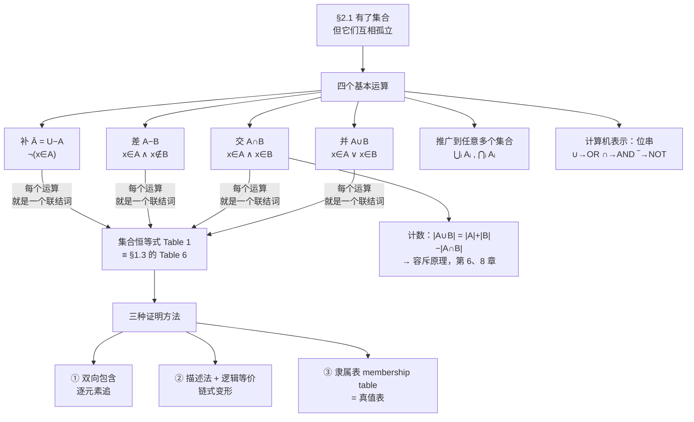

# C2.2 集合运算 Set Operations

> [!abstract] 这一讲的任务
> [[C2.1 集合 Sets]] 造出了集合，但它们现在还是**互相孤立的**。这一讲给集合装上四个运算——**并 $\cup$、交 $\cap$、差 $-$、补 $\overline{\ \ }$**——于是"既选了数学又选了计算机的学生"这种集合终于写得出来了。
> 然后会发生一件让人愉快的事：这些运算满足的**恒等式表（Table 1）**，和 [[C1.3 命题等价 Propositional Equivalences]] 里的 **Table 6** 长得**一模一样**，只是把 $\wedge$ 换成 $\cap$、$\vee$ 换成 $\cup$、$\neg$ 换成补。**你不需要再背一遍。**
> 最后一节把集合搬进计算机：用**位串**表示集合，三个集合运算直接变成**按位与/或/非**——这是你写状态压缩时每天在用的东西。

> [!info] 怎么读这份讲义
> 第 3 节（三种证明方法）是本讲的技术核心，**三种方法都要会**，因为考试会指定用哪一种。
> 第 2 节的 Table 1 建议对照 [[C1.3 命题等价 Propositional Equivalences]] 的 Table 6 一起看，**逐行对应**地记，比单独背省一半力气。
> 第 6 节（位串表示）如果你写过竞赛题，会读得很快。

---

## 0. 开场：三份名单

你手上有三份 Excel：**报名表 $A$**、**缴费表 $B$**、**住宿表 $C$**。辅导员连着问你四个问题：

1. 一共涉及多少人？
2. 谁既报了名又交了钱？
3. 谁报了名但还没交钱？
4. 谁没报名？

> [!question] 停一下，先自己想想
> 这四个问题，你分别要对两份名单做什么操作？先用大白话说一遍。

答案是：**至少在一份里**（问题 1）、**两份里都有**（问题 2）、**在前一份里而不在后一份里**（问题 3）、**不在这份里**（问题 4）。

再看一眼这四句话的措辞：**"或"、"且"、"而不"、"不"**。

**你刚才做的，就是把命题逻辑的四个联结词搬到了集合上。** 这一讲剩下的内容，基本上就是把这个直觉写成定义、再看看它能推出什么。

---

## 1. 四个基本运算

### 1.1 并集 union

> [!important] 定义 1（课本 DEFINITION 1）
> 集合 $A$ 与 $B$ 的**并集 union**，记作 $A \cup B$，是由那些**在 $A$ 中、或在 $B$ 中、或两者都在**的元素构成的集合。
> $$A \cup B = \{x \mid x \in A \vee x \in B\}$$

注意这里的"或"是 [[C1.1 命题逻辑 Propositional Logic]] 的**相容或 $\vee$**（可以都成立），不是异或。

**例 1**：$\{1,3,5\} \cup \{1,2,3\} = \{1,2,3,5\}$。
（注意 $1$ 和 $3$ 各只出现一次——集合不计重复。）

**例 2**：全体计算机专业学生 $\cup$ 全体数学专业学生 = 主修数学**或**计算机（**或两者都修**）的学生。

### 1.2 交集 intersection

> [!important] 定义 2（课本 DEFINITION 2）
> $A$ 与 $B$ 的**交集 intersection**，记作 $A \cap B$，是那些**同时属于 $A$ 和 $B$** 的元素构成的集合。
> $$A \cap B = \{x \mid x \in A \wedge x \in B\}$$

**例 3**：$\{1,3,5\} \cap \{1,2,3\} = \{1,3\}$。
**例 4**：计算机专业 $\cap$ 数学专业 = **双学位**（两个专业都主修）的学生。

> [!important] 定义 3（课本 DEFINITION 3）
> 若两个集合的交集是空集，则称它们**不相交 disjoint**。

**例 5**：$A = \{1,3,5,7,9\}$，$B = \{2,4,6,8,10\}$，$A \cap B = \varnothing$，故 $A, B$ 不相交。

### 1.3 差集 difference

> [!important] 定义 4（课本 DEFINITION 4）
> $A$ 与 $B$ 的**差集 difference**，记作 $A - B$，是那些**在 $A$ 中但不在 $B$ 中**的元素构成的集合。差集也称为 **$B$ 相对于 $A$ 的补集**。
> $$A - B = \{x \mid x \in A \wedge x \notin B\}$$

**记号 Remark**：差集有时也写作 $A \backslash B$。

**例 6**：$\{1,3,5\} - \{1,2,3\} = \{5\}$；而 $\{1,2,3\} - \{1,3,5\} = \{2\}$。
**两者不同——差集不满足交换律。**

**例 7**：计算机专业 $-$ 数学专业 = 主修计算机**但不**主修数学的学生。

### 1.4 补集 complement

> [!important] 定义 5（课本 DEFINITION 5）
> 设 $U$ 是全集。集合 $A$ 的**补集 complement**，记作 $\overline{A}$，是 $A$ 相对于 $U$ 的补集，即 $\overline{A} = U - A$。
> $$\overline{A} = \{x \in U \mid x \notin A\}$$

> [!warning] ⭐ 补集离开全集就没有意义
> "不是元音的字母"——这句话只有在你说清楚"字母"这个范围之后才成立。
> **每次写 $\overline{A}$ 之前先问自己：$U$ 是什么？** 这是本讲最常见的失分点。

**例 8**：$A = \{a,e,i,o,u\}$，$U$ = 26 个英文字母，则
$$\overline{A} = \{b,c,d,f,g,h,j,k,l,m,n,p,q,r,s,t,v,w,x,y,z\}$$

**例 9**：$A$ = 大于 10 的正整数，$U$ = 全体正整数，则 $\overline{A} = \{1,2,3,4,5,6,7,8,9,10\}$。

### 1.5 四张文氏图

![[C2-图3-集合运算的文氏图-并交差补.png]]

> [!important] 图表读法（初学者最容易卡的地方）
> 四张图**用的是同一套骨架**：外面的矩形永远是 $U$，两个圆永远是 $A$ 和 $B$。**唯一的区别是哪块区域被涂了色**。
> 两个圆把矩形切成 **4 块**：只在 $A$ 里、只在 $B$ 里、两者都在、两者都不在。四个运算不过是这 4 块的不同组合：
>
> | 运算 | 涂色的区块 |
> |---|---|
> | $A\cup B$ | 只在 $A$ + 只在 $B$ + 都在 |
> | $A \cap B$ | 只有"都在"那一块 |
> | $A - B$ | 只有"只在 $A$"那一块 |
> | $\overline{A}$ | 只在 $B$ + 都不在（**圆 $A$ 之外的全部**） |
>
> **画文氏图答题的通法**：先把 4 块（三个集合时是 8 块）编号，再判断每一块该不该涂。这样绝不会漏区域。

### 1.6 差集可以用补集表示

课本留作习题 19，但结论非常常用：

> [!important] $A - B = A \cap \overline{B}$
> **口语版**："在 $A$ 里而不在 $B$ 里" = "在 $A$ 里 **且** 在 $\overline B$ 里"。
> **形式版**：$x \in A \wedge x \notin B \iff x\in A \wedge x \in \overline B$。
>
> **实用价值**：有了它，**差集就不是一个独立运算**了。化简含 $-$ 的式子时，**第一步通常就是把所有的 $-$ 换成 $\cap\overline{\ }$**，接下来就只剩 $\cup, \cap, \overline{\ }$，可以直接套 Table 1。

---

## 2. 顺带解决的计数问题：$\lvert A \cup B\rvert$

并集有多大？第一反应是 $|A| + |B|$。

> [!question] 停一下，先自己想想
> $A = \{1,3,5\}$，$B = \{1,2,3\}$。$|A| = 3$，$|B| = 3$，但 $|A\cup B| = |\{1,2,3,5\}| = 4 \ne 6$。差在哪？

差在**同时属于两边的元素被数了两遍**。课本原话是一句页边警告：**"Be careful not to overcount!"（小心别数重了！）**

- 只在 $A$ 里或只在 $B$ 里的元素：在 $|A|+|B|$ 中被数了 **1** 次 ✓
- 在 $A\cap B$ 里的元素：被数了 **2** 次 ✗（多数了一次）

把多数的那一次减掉：

> [!important] ⭐ 两集合的容斥公式
> $$\lvert A\cup B\rvert = \lvert A\rvert + \lvert B\rvert - \lvert A\cap B\rvert$$

**验证**：$3 + 3 - |\{1,3\}| = 3+3-2 = 4$ ✓

> [!note] 前后联系：这是容斥原理的第一格
> 课本指出：把这个结果推广到任意多个集合，就叫**容斥原理 principle of inclusion–exclusion**，是**计数**中的重要技术，将在**第 6 章和第 8 章**详细讨论。
>
> 三个集合的版本（课本习题 46）是：
> $$\lvert A\cup B\cup C\rvert = \lvert A\rvert+\lvert B\rvert+\lvert C\rvert-\lvert A\cap B\rvert-\lvert A\cap C\rvert-\lvert B\cap C\rvert+\lvert A\cap B\cap C\rvert$$
> **记忆规律：奇数个集合的交取 $+$，偶数个取 $-$**（单个是 1 个，取 $+$；两两是 2 个，取 $-$；三个一起是 3 个，取 $+$）。

---

## 3. 集合恒等式：一张你已经背过的表

### 3.1 先看表，再看它为什么眼熟

> [!important] TABLE 1 集合恒等式 Set Identities（**必背**）
>
> | 恒等式 | 名称 |
> |---|---|
> | $A \cap U = A$ ；$A\cup\varnothing = A$ | **同一律 Identity laws** |
> | $A \cup U = U$ ；$A \cap \varnothing = \varnothing$ | **支配律 Domination laws** |
> | $A\cup A = A$ ；$A \cap A = A$ | **幂等律 Idempotent laws** |
> | $\overline{(\overline{A})} = A$ | **双重补律 Complementation law** |
> | $A\cup B = B\cup A$ ；$A\cap B = B\cap A$ | **交换律 Commutative laws** |
> | $A\cup(B\cup C) = (A\cup B)\cup C$ ；$A\cap(B\cap C) = (A\cap B)\cap C$ | **结合律 Associative laws** |
> | $A\cup(B\cap C) = (A\cup B)\cap(A\cup C)$ ；$A\cap(B\cup C)=(A\cap B)\cup(A\cap C)$ | **分配律 Distributive laws** |
> | $\overline{A\cap B} = \overline A \cup \overline B$ ；$\overline{A\cup B} = \overline A \cap \overline B$ | ⭐ **德摩根律 De Morgan's laws** |
> | $A\cup(A\cap B) = A$ ；$A\cap(A\cup B) = A$ | **吸收律 Absorption laws** |
> | $A \cup \overline A = U$ ；$A\cap\overline A = \varnothing$ | **补律 Complement laws** |

### 3.2 ⭐ 为什么你不用重新背

> [!important] 逐行对照 [[C1.3 命题等价 Propositional Equivalences]] 的 Table 6
> 只要做这三个替换：
> $$\cap \longleftrightarrow \wedge \qquad \cup \longleftrightarrow \vee \qquad \overline{A} \longleftrightarrow \neg p \qquad U \longleftrightarrow \mathbf{T} \qquad \varnothing \longleftrightarrow \mathbf{F}$$
> 两张表**逐行重合**。举三个例子：
>
> | 命题逻辑（Table 6） | 集合（Table 1） |
> |---|---|
> | $p \wedge \mathbf T \equiv p$ | $A \cap U = A$ |
> | $\neg(p\wedge q) \equiv \neg p \vee \neg q$ | $\overline{A\cap B} = \overline A\cup\overline B$ |
> | $p \wedge (q \vee r) \equiv (p\wedge q)\vee(p\wedge r)$ | $A\cap(B\cup C) = (A\cap B)\cup(A\cap C)$ |

这不是巧合。课本的页边注把原因写得很清楚：

> **"集合恒等式与命题等价，都只是布尔代数 (Boolean algebra) 恒等式的特例。"**

而且课本正文进一步说：**这些集合恒等式可以直接从对应的逻辑等价证出来**——第 3.4 节就是干这个的。

> [!note] 前后联系：这条线还会再出现一次
> $$\text{布尔代数（第 12 章）} \begin{cases} \text{命题逻辑 §1.3} & \wedge, \vee, \neg\\ \text{集合运算 §2.2} & \cap,\cup,\overline{\ \ }\\ \text{位运算 §1.1 / 本节第 6 部分} & \texttt{AND, OR, NOT}\\ \text{布尔矩阵 §2.6} & \wedge,\vee\ \text{作用在 0-1 上}\end{cases}$$
> **四套记号，一套定律。** 学到第 12 章时你会发现它们被统一成了一个代数结构。

### 3.3 方法一：双向包含（逐元素追）

这是 [[C2.1 集合 Sets]] 第 6.5 节那条标准套路的第一次实战。

**例 10（课本 EXAMPLE 10）**：证明第一德摩根律 $\overline{A\cap B} = \overline A \cup \overline B$。

**证明**：分两个方向。

**方向一：$\overline{A\cap B} \subseteq \overline A\cup\overline B$。**
设 $x \in \overline{A\cap B}$。

| 步骤 | 依据 |
|---|---|
| $x \notin A\cap B$ | 补集的定义 |
| $\neg\bigl((x\in A) \wedge (x\in B)\bigr)$ 为真 | 交集的定义 |
| $\neg(x\in A)$ 或 $\neg(x\in B)$ | **命题的德摩根律**（§1.3） |
| $x\notin A$ 或 $x \notin B$ | 否定的定义 |
| $x \in \overline A$ 或 $x\in\overline B$ | 补集的定义 |
| $x \in \overline A \cup \overline B$ | 并集的定义 |

**方向二：$\overline A\cup\overline B \subseteq \overline{A\cap B}$。**
设 $x \in \overline A\cup\overline B$，由并集定义得 $x\in\overline A$ 或 $x\in\overline B$，即 $\neg(x\in A) \vee \neg(x\in B)$ 为真。
再用命题的德摩根律得 $\neg\bigl((x\in A)\wedge(x\in B)\bigr)$ 为真，由交集定义得 $\neg(x \in A\cap B)$，由补集定义得 $x \in \overline{A\cap B}$。

两个方向都成立，故两集合相等。$\blacksquare$

> [!note] 停一下，我们刚才干了什么
> 通篇只做了一件事：**把集合符号翻译成逻辑符号，用逻辑定律变形，再翻译回来。**
> 每一行的"依据"要么是某个集合运算的定义，要么是第 1 章的某条等价律。
> **这就是为什么两张表长得一样**——集合运算在定义里就是用联结词写的，它当然继承联结词的全部性质。

### 3.4 方法二：描述法 + 逻辑等价（链式变形）

方法一啰嗦。同样的推理可以写得非常紧凑。

**例 11（课本 EXAMPLE 11）**：用描述法证明 $\overline{A\cap B} = \overline A\cup\overline B$。

$$\begin{aligned}
\overline{A\cap B} &= \{x \mid x \notin A\cap B\} && \text{补集的定义}\\
&= \{x \mid \neg(x \in A\cap B)\} && \text{$\notin$ 记号的定义}\\
&= \{x \mid \neg(x\in A \wedge x\in B)\} && \text{交集的定义}\\
&= \{x \mid \neg(x\in A)\vee\neg(x\in B)\} && \text{命题的德摩根律}\\
&= \{x \mid x\notin A \vee x\notin B\} && \text{$\notin$ 记号的定义}\\
&= \{x \mid x\in\overline A \vee x\in\overline B\} && \text{补集的定义}\\
&= \{x \mid x \in \overline A\cup\overline B\} && \text{并集的定义}\\
&= \overline A\cup\overline B && \text{描述法的含义}
\end{aligned}$$

> [!warning] 课本的一个小提醒
> 课本在例 11 末尾特意指出：这个证明用的是**第二**德摩根律（$\neg(p\wedge q)\equiv\neg p\vee\neg q$ 在课本 Table 6 里的编号），尽管我们证的是**第一**条集合德摩根律。
> **别被编号绕晕**——写证明时写清楚你用的是哪一条的**内容**就够了。

**这是三种方法里最推荐的一种**：步骤短、每步有据、不容易漏情形。

**例 12（课本 EXAMPLE 12）**：证明第二分配律 $A\cap(B\cup C) = (A\cap B)\cup(A\cap C)$。

**证明（双向包含）**：

**（⊆）** 设 $x\in A\cap(B\cup C)$。则 $x\in A$ 且 $x\in B\cup C$，即 $x \in A$，并且 $x\in B$ 或 $x\in C$（或两者）。换句话说，复合命题
$$(x\in A)\wedge\bigl((x\in B)\vee(x\in C)\bigr)$$
为真。由**合取对析取的分配律**（§1.3），得
$$\bigl((x\in A)\wedge(x\in B)\bigr)\vee\bigl((x\in A)\wedge(x\in C)\bigr)$$
即 $x\in A\cap B$ 或 $x\in A\cap C$，故 $x\in(A\cap B)\cup(A\cap C)$。

**（⊇）** 设 $x\in(A\cap B)\cup(A\cap C)$，则 $x\in A\cap B$ 或 $x\in A\cap C$，即"$x\in A$ 且 $x \in B$"或"$x\in A$ 且 $x\in C$"。两种情形下都有 $x \in A$，且 $x\in B$ 或 $x\in C$，即 $x\in A$ 且 $x\in B\cup C$，故 $x\in A\cap(B\cup C)$。$\blacksquare$

> [!warning] 易错点：三个集合时要当心"情形"
> 课本在例 12 前特意说：涉及**两个以上集合**的恒等式，用双向包含法证时**往往要追踪不同的情形**。
> 上面 (⊇) 方向就出现了两种情形（来自 $A\cap B$ 还是来自 $A\cap C$），必须**两种都验证**，漏一种就不完整。
> 这也是推荐方法二（链式变形）的另一个理由——它把"分情形"交给逻辑分配律自动处理了。

### 3.5 方法三：隶属表 membership table

> [!important] 隶属表是什么
> 和真值表完全同构：**逐行枚举一个元素可能落在哪些集合里**，然后验证等式两边的归属情况是否列列相同。
> - **1** 表示元素**在**该集合中；
> - **0** 表示元素**不在**该集合中。
> - $n$ 个集合 $\Rightarrow$ **$2^n$ 行**（和 $n$ 个命题变元的真值表一样）。

**例 13（课本 EXAMPLE 13）**：用隶属表证明 $A\cap(B\cup C) = (A\cap B)\cup(A\cap C)$。

> [!important] TABLE 2 分配律的隶属表（课本原表）
>
> | $A$ | $B$ | $C$ | $B\cup C$ | $A\cap(B\cup C)$ | $A\cap B$ | $A\cap C$ | $(A\cap B)\cup(A\cap C)$ |
> |:-:|:-:|:-:|:-:|:-:|:-:|:-:|:-:|
> | 1 | 1 | 1 | 1 | **1** | 1 | 1 | **1** |
> | 1 | 1 | 0 | 1 | **1** | 1 | 0 | **1** |
> | 1 | 0 | 1 | 1 | **1** | 0 | 1 | **1** |
> | 1 | 0 | 0 | 0 | **0** | 0 | 0 | **0** |
> | 0 | 1 | 1 | 1 | **0** | 0 | 0 | **0** |
> | 0 | 1 | 0 | 1 | **0** | 0 | 0 | **0** |
> | 0 | 0 | 1 | 1 | **0** | 0 | 0 | **0** |
> | 0 | 0 | 0 | 0 | **0** | 0 | 0 | **0** |
>
> 第 5 列与第 8 列**完全相同**，故恒等式成立。$\blacksquare$

> [!warning] 隶属表的适用边界
> **优点**：机械、不用动脑、绝不会漏情形。
> **缺点**：行数是 $2^n$。**4 个集合就要 16 行，5 个就要 32 行**——考场上写不完。
> **策略**：2–3 个集合的题用隶属表最稳；4 个以上一律用方法二（链式变形）。

### 3.6 方法四（组合拳）：用已证的恒等式推新的

**例 14（课本 EXAMPLE 14）**：证明 $\overline{A\cup(B\cap C)} = (\overline C\cup\overline B)\cap\overline A$。

$$\begin{aligned}
\overline{A\cup(B\cap C)} &= \overline A\cap\overline{(B\cap C)} && \text{第一德摩根律}\\
&= \overline A\cap(\overline B\cup\overline C) && \text{第二德摩根律}\\
&= (\overline B\cup\overline C)\cap\overline A && \text{交的交换律}\\
&= (\overline C\cup\overline B)\cap\overline A && \text{并的交换律}
\end{aligned}$$

$\blacksquare$

> [!note] 停一下，我们刚才干了什么
> 这一步没有回到元素层面，**全程只在操作恒等式**——就像中学做代数化简一样。
> 一旦 Table 1 背熟，这是最快的方法。它和 [[C1.3 命题等价 Propositional Equivalences]] 里用等价律做链式变形是**同一个技能**。

> [!example] 手算：常见化简题（课本习题 24 型）
> 证明 $(A - B) - C = (A - C) - (B - C)$。
>
> **第一步：所有差集换成 $\cap$ 和补**（第 1.6 节的实用价值）：
> $$\text{左} = (A\cap\overline B)\cap\overline C = A\cap\overline B\cap\overline C$$
> $$\text{右} = (A\cap\overline C)\cap\overline{(B\cap\overline C)}$$
> **第二步：对右边用德摩根律和双重补律**：
> $$\overline{(B\cap\overline C)} = \overline B\cup\overline{\overline C} = \overline B\cup C$$
> $$\text{右} = (A\cap\overline C)\cap(\overline B\cup C) = (A\cap\overline C\cap\overline B)\cup(A\cap\overline C\cap C)$$
> **第三步：用补律 $\overline C\cap C = \varnothing$ 和支配律**：
> $$A\cap\overline C\cap C = A\cap\varnothing = \varnothing$$
> $$\text{右} = (A\cap\overline B\cap\overline C)\cup\varnothing = A\cap\overline B\cap\overline C = \text{左} \quad\blacksquare$$
>
> **要点**：这是本节化简题的标准三步——**去差集 → 德摩根 → 用补律把矛盾项消成 $\varnothing$**。

---

## 4. 推广：任意多个集合的并与交

### 4.1 三个集合

因为并和交满足**结合律**，写 $A\cup B\cup C$ 和 $A\cap B\cap C$ **不需要加括号**，含义无歧义：

- $A\cup B\cup C$：在 $A,B,C$ **至少一个**里的元素；
- $A\cap B\cap C$：在 $A,B,C$ **全部**里的元素。

![[C2-图4-三个集合的并与交.png]]

**例 15**：$A=\{0,2,4,6,8\}$，$B=\{0,1,2,3,4\}$，$C=\{0,3,6,9\}$：

$$A\cup B\cup C = \{0,1,2,3,4,6,8,9\} \qquad A\cap B\cap C = \{0\}$$

（验算：$5,7$ 谁都不在，故不出现；只有 $0$ 同时出现在三个集合里。）

### 4.2 有限个集合

> [!important] 定义 6 与 定义 7（课本 DEFINITION 6, 7）
> 一族集合的**并**：含**至少一个**集合中的元素。
> 一族集合的**交**：含**所有**集合中都有的元素。
>
> 记号：
> $$A_1\cup A_2\cup\cdots\cup A_n = \bigcup_{i=1}^{n} A_i \qquad A_1\cap A_2\cap\cdots\cap A_n = \bigcap_{i=1}^{n} A_i$$

**例 16**：设 $A_i = \{i, i+1, i+2, \ldots\}$（$i = 1,2,\ldots$）。求 $\bigcup_{i=1}^n A_i$ 和 $\bigcap_{i=1}^n A_i$。

**解**：注意这族集合是**递减嵌套**的：$A_1 \supseteq A_2 \supseteq A_3 \supseteq\cdots$（$A_2$ 比 $A_1$ 少了元素 1，依此类推）。

- **并**：最大的那个吞掉其余的，$\bigcup_{i=1}^n A_i = A_1 = \{1,2,3,\ldots\}$；
- **交**：最小的那个是限制，$\bigcap_{i=1}^n A_i = A_n = \{n, n+1, n+2,\ldots\}$。

> [!important] ⭐ 嵌套集合族的速判窍门
> 若 $A_1\supseteq A_2\supseteq\cdots$（**递减**）：并 $=$ **第一个**，交 $=$ **最后一个**。
> 若 $A_1\subseteq A_2\subseteq\cdots$（**递增**）：并 $=$ **最后一个**，交 $=$ **第一个**。
> 这类题在习题里出现得极其频繁，**先判断嵌套方向，答案立刻出来**，不用逐元素想。

### 4.3 无限个集合

$$\bigcup_{i=1}^{\infty} A_i \qquad \bigcap_{i=1}^{\infty} A_i$$

更一般地，当 $I$ 是任意一个**指标集 index set** 时：

$$\bigcup_{i\in I} A_i = \{x \mid \exists i\in I\,(x\in A_i)\} \qquad \bigcap_{i\in I} A_i = \{x \mid \forall i\in I\,(x\in A_i)\}$$

> [!important] ⭐ 又是 "$\exists$ 配并，$\forall$ 配交"
> **并对应 $\exists$**（至少一个），**交对应 $\forall$**（全部）。这和 $\cup \leftrightarrow \vee$、$\cap\leftrightarrow\wedge$ 是同一件事的推广版——因为 $\exists$ 就是"大析取"、$\forall$ 就是"大合取"（[[C1.4 谓词与量词 Predicates and Quantifiers]]）。

**例 17**：$A_i = \{1,2,3,\ldots,i\}$（$i=1,2,3,\ldots$）。

这次是**递增嵌套**（$A_1\subseteq A_2\subseteq\cdots$），所以

$$\bigcup_{i=1}^{\infty} A_i = \{1,2,3,\ldots\} = \mathbf Z^+ \qquad \bigcap_{i=1}^{\infty} A_i = \{1\}$$

**课本的论证**：
- **并**：每个正整数 $n$ 至少属于一个集合（它属于 $A_n = \{1,\ldots,n\}$），且并里的元素都是正整数，故并 $=\mathbf Z^+$。
- **交**：$A_1 = \{1\}$，而 $1 \in A_i$ 对一切 $i$ 成立，故交 $=\{1\}$。

> [!example] 手算：无限族的几个典型（课本习题 50–51）
> | 集合族 | $\bigcup_{i=1}^\infty A_i$ | $\bigcap_{i=1}^\infty A_i$ |
> |---|---|---|
> | $A_i = \{i, i+1, i+2,\ldots\}$ | $\mathbf Z^+$（递减，取第一个 $A_1$） | $\varnothing$（任何固定的 $n$ 都会被 $A_{n+1}$ 排除） |
> | $A_i = \{0, i\}$ | $\mathbf N$ | $\{0\}$（只有 0 在每个里） |
> | $A_i = (0, i)$ 开区间 | $(0,\infty)$ | $(0,1)$（递增，取第一个） |
> | $A_i = (i,\infty)$ | $(1,\infty)$（递减，取 $A_1$） | $\varnothing$（任何 $x$ 都被 $A_{\lceil x\rceil}$ 排除） |
>
> **易错点**：第一行的交是 $\varnothing$ 而不是"最后一个"——**无限递减时没有"最后一个"**，必须逐元素论证。这是有限情形（例 16）与无限情形的关键差别，很容易套错公式。

---

## 5. 对称差（课本习题中定义，常考）

> [!important] 定义（课本习题 32 前的说明）
> $A$ 与 $B$ 的**对称差 symmetric difference**，记作 $A\oplus B$，是那些**恰好属于 $A$ 和 $B$ 之一**的元素构成的集合。

**这就是集合版的异或。** 回忆 [[C1.1 命题逻辑 Propositional Logic]]：$p\oplus q$ 在 $p,q$ 恰好一真时为真。符号都用同一个 $\oplus$，不是巧合。

![[C2-图5-对称差的文氏图.png]]

**两个等价表达式**（课本习题 35、36）：

$$A\oplus B = (A\cup B) - (A\cap B) \qquad A\oplus B = (A - B)\cup(B - A)$$

> [!example] 手算：验证两个表达式（习题 32）
> $A = \{1,3,5\}$，$B=\{1,2,3\}$。
> - 法一：$(A\cup B)-(A\cap B) = \{1,2,3,5\} - \{1,3\} = \boxed{\{2,5\}}$
> - 法二：$(A-B)\cup(B-A) = \{5\}\cup\{2\} = \boxed{\{2,5\}}$ ✓ 一致。

> [!important] 对称差的四条性质（课本习题 37–38）
> | 性质 | 结论 | 对照的异或性质 |
> |---|---|---|
> | $A\oplus A$ | $\varnothing$ | $p\oplus p \equiv \mathbf F$ |
> | $A\oplus\varnothing$ | $A$ | $p\oplus \mathbf F\equiv p$ |
> | $A\oplus U$ | $\overline A$ | $p\oplus\mathbf T\equiv\neg p$ |
> | $A\oplus\overline A$ | $U$ | $p\oplus\neg p\equiv \mathbf T$ |
> | 交换律 | $A\oplus B = B\oplus A$ | ✓ |
> | **自反消去** | $(A\oplus B)\oplus B = A$ | ⭐ |
>
> **最后一条是重点**：异或两次等于没做。这正是**异或加密**和竞赛里"异或前缀和"的原理。

---

## 6. 集合的计算机表示：位串

### 6.1 先看朴素做法为什么不行

最直接的想法是把元素**无序地存起来**（比如一个链表）。但课本指出问题：这样一来，求并、交、差都要**大量搜索**，非常慢——每次判断一个元素在不在另一个集合里，都得扫一遍。

### 6.2 位串表示法

> [!important] 课本给的方法
> 假设全集 $U$ **有限**（且大小不超过内存）。
> 1. 给 $U$ 的元素**规定一个任意但固定的顺序** $a_1, a_2,\ldots,a_n$；
> 2. 子集 $A\subseteq U$ 用一个**长度为 $n$ 的位串**表示：**第 $i$ 位是 1 当且仅当 $a_i\in A$**，否则是 0。

**例 18**：$U = \{1,2,\ldots,10\}$，按递增序（即 $a_i = i$）。

| 子集 | 位串 |
|---|---|
| 全体奇数 $\{1,3,5,7,9\}$ | `10 1010 1010` |
| 全体偶数 $\{2,4,6,8,10\}$ | `01 0101 0101` |
| 不超过 5 的整数 $\{1,2,3,4,5\}$ | `11 1110 0000` |

（课本把 10 位串按 2+4+4 分块书写，纯粹为了好读。）

### 6.3 三个运算变成三条位运算

> [!important] ⭐ 对应关系（**本节最该带走的一张表**）
> | 集合运算 | 位串运算 | 理由 |
> |---|---|---|
> | 补 $\overline A$ | **按位取反**（1↔0） | $x\in\overline A \iff x\notin A$ |
> | 并 $A\cup B$ | **按位或 OR（$\vee$）** | 至少一个为 1 则为 1 |
> | 交 $A\cap B$ | **按位与 AND（$\wedge$）** | 两个都为 1 才为 1 |
> | 差 $A-B$ | $A \wedge \overline B$（按位与非） | 因为 $A-B = A\cap\overline B$ |
> | 对称差 $A\oplus B$ | **按位异或 XOR** | 恰好一个为 1 |
>
> 最后两行是课本习题 55、56 的答案。

**例 19**：$\{1,3,5,7,9\}$ 的位串是 `10 1010 1010`，取反得 `01 0101 0101`，对应 $\{2,4,6,8,10\}$ ✓（确实是它在 $U$ 中的补集）。

**例 20**：用位串求 $\{1,2,3,4,5\}$ 与 $\{1,3,5,7,9\}$ 的并与交。

$$\texttt{11 1110 0000} \vee \texttt{10 1010 1010} = \texttt{11 1110 1010} \Rightarrow \{1,2,3,4,5,7,9\}$$
$$\texttt{11 1110 0000} \wedge \texttt{10 1010 1010} = \texttt{10 1010 0000} \Rightarrow \{1,3,5\}$$

> [!note] 专业关联：你早就在用它了
> - **状态压缩 DP / 位运算枚举子集**：用一个 `int` 表示 $\{0,\ldots,31\}$ 的子集，`a|b`、`a&b`、`a^b` 就是并、交、对称差；
> - **Python 的 `set`**：`|` `&` `-` `^` 这四个运算符就是并、交、差、对称差，符号选得和这里完全一致；
> - **C++ 的 `std::bitset`**、**Numpy 的布尔掩码**、**数据库的位图索引 (bitmap index)**；
> - **机器学习的 one-hot 编码**：把"属于哪个类别"变成位串，正是同一个思路。
>
> 位串表示的代价是 $|U|$ 必须有限且不太大；好处是**所有集合运算都变成 $O(n/64)$ 的机器指令**，比逐元素搜索快几十倍。

---

## 7. 两个扩展结构（课本习题中的补充内容）

### 7.1 多重集 multiset（补充）

有时**元素出现的次数是有意义的**（这正是开场那个"Chou 报名两次"的场景真正需要的结构）。

**记号**：$\{m_1\cdot a_1,\ m_2\cdot a_2,\ \ldots,\ m_r\cdot a_r\}$ 表示 $a_1$ 出现 $m_1$ 次、$a_2$ 出现 $m_2$ 次……，$m_i$ 称为 $a_i$ 的**重数 multiplicity**。

**运算规则**（课本习题 61 前的定义）：

| 运算 | 元素重数取 |
|---|---|
| 并 $P\cup Q$ | 两者重数的**最大值 max** |
| 交 $P\cap Q$ | 两者重数的**最小值 min** |
| 差 $P-Q$ | $P$ 的重数减 $Q$ 的重数，**若为负则取 0** |
| 和 $P+Q$ | 两者重数**相加** |

> [!example] 手算（课本习题 61）
> $A = \{3\cdot a,\ 2\cdot b,\ 1\cdot c\}$，$B = \{2\cdot a,\ 3\cdot b,\ 4\cdot d\}$。
>
> | 运算 | 结果 | 逐元素算 |
> |---|---|---|
> | $A\cup B$ | $\{3\cdot a, 3\cdot b, 1\cdot c, 4\cdot d\}$ | $a$: max(3,2)=3；$b$: max(2,3)=3；$c$: max(1,0)=1；$d$: max(0,4)=4 |
> | $A\cap B$ | $\{2\cdot a, 2\cdot b\}$ | $a$: min(3,2)=2；$b$: min(2,3)=2；$c$: min(1,0)=0；$d$: min(0,4)=0 |
> | $A - B$ | $\{1\cdot a,\ 1\cdot c\}$ | $a$: 3−2=1；$b$: 2−3<0→0；$c$: 1−0=1；$d$: 0−4<0→0 |
> | $B - A$ | $\{1\cdot b,\ 4\cdot d\}$ | $a$: 2−3<0→0；$b$: 3−2=1；$d$: 4−0=4 |
> | $A + B$ | $\{5\cdot a, 5\cdot b, 1\cdot c, 4\cdot d\}$ | 直接相加 |
>
> **易错点**：重数为 0 的元素**不写出来**；差集的负数**截断为 0**，不是保留负数。

**现实应用（课本习题 62）**：两个院系各自需要的设备清单就是多重集——"需要 107 台电脑、44 个路由器、6 台服务器"。学校该买多少？
- **共用设备**：买 $A\cup B$（各取较大者，够两边轮流用）；
- **不共用设备**：买 $A + B$（相加，各配各的）。

### 7.2 模糊集 fuzzy set（补充，AI 方向相关）

课本原话：**模糊集用于人工智能。**

全集 $U$ 中每个元素对模糊集 $S$ 有一个**隶属度 degree of membership**，是 $[0,1]$ 中的实数。记法是把元素连同隶属度列出（隶属度为 0 的不列）。

**课本的例子**：
$$F = \{0.6\ \text{Alice},\ 0.9\ \text{Brian},\ 0.4\ \text{Fred},\ 0.1\ \text{Oscar},\ 0.5\ \text{Rita}\}\quad(\text{"名人"})$$
$$R = \{0.4\ \text{Alice},\ 0.8\ \text{Brian},\ 0.2\ \text{Fred},\ 0.9\ \text{Oscar},\ 0.7\ \text{Rita}\}\quad(\text{"富人"})$$

**运算规则**（习题 63–65）：

| 运算 | 隶属度 |
|---|---|
| 补 $\overline S$ | $1 - $ 原隶属度 |
| 并 $S\cup T$ | 两者的 **max** |
| 交 $S\cap T$ | 两者的 **min** |

> [!example] 手算（课本习题 63–65）
> **$\overline F$（不出名的人）**：$\{0.4\ \text{Alice}, 0.1\ \text{Brian}, 0.6\ \text{Fred}, 0.9\ \text{Oscar}, 0.5\ \text{Rita}\}$
> **$\overline R$（不富的人）**：$\{0.6\ \text{Alice}, 0.2\ \text{Brian}, 0.8\ \text{Fred}, 0.1\ \text{Oscar}, 0.3\ \text{Rita}\}$
> **$F\cup R$（富**或**名）**：逐个取 max $= \{0.6\ \text{Alice}, 0.9\ \text{Brian}, 0.4\ \text{Fred}, 0.9\ \text{Oscar}, 0.7\ \text{Rita}\}$
> **$F\cap R$（既富**又**名）**：逐个取 min $= \{0.4\ \text{Alice}, 0.8\ \text{Brian}, 0.2\ \text{Fred}, 0.1\ \text{Oscar}, 0.5\ \text{Rita}\}$

> [!note] 专业关联：为什么 AI 关心模糊集
> 普通集合的隶属度只有 0 和 1——"要么是要么不是"。但很多现实概念没有硬边界："高个子"、"快"、"像猫"。
> **模糊集 = 把隶属函数的值域从 $\{0,1\}$ 放宽到 $[0,1]$。** 注意它和普通集合完全兼容：隶属度只取 0/1 时，max/min 恰好退化成 $\cup$/$\cap$。
> 这条思路你其实很熟：**神经网络分类器最后一层输出的就是"隶属度"**（softmax 概率），argmax 之前它是模糊的，argmax 之后才变成确定的集合归属。模糊控制（空调、洗衣机）用的也是这套 max/min 规则。

---

## 这一讲的三句话

1. **四个集合运算就是四个联结词的集合版**：$\cup\leftrightarrow\vee$、$\cap\leftrightarrow\wedge$、$\overline{\ }\leftrightarrow\neg$、$-\leftrightarrow\wedge\neg$；补集**必须先指定全集**。
2. **Table 1 = Table 6 换了衣服**，所以证明集合恒等式的三种方法本质上都是"翻译成逻辑 → 用逻辑定律 → 翻译回来"；**首选链式变形，2–3 个集合可用隶属表，4 个以上别用**。
3. **计数与实现**：$|A\cup B| = |A|+|B|-|A\cap B|$（容斥的起点）；把子集写成位串后，并交补直接变成 **OR / AND / NOT**。

### 速查表

| 运算 | 定义 | 逻辑对应 | 位运算 |
|:-:|---|:-:|:-:|
| $A\cup B$ | $\{x\mid x\in A \vee x\in B\}$ | $\vee$ | OR |
| $A\cap B$ | $\{x\mid x\in A\wedge x\in B\}$ | $\wedge$ | AND |
| $A - B$ | $\{x\mid x\in A\wedge x\notin B\}$ | $\wedge\neg$ | AND NOT |
| $\overline A$ | $\{x\in U\mid x\notin A\}$ | $\neg$ | NOT |
| $A\oplus B$ | 恰在其一 | $\oplus$ | XOR |

**必背三条**：
$$\overline{A\cap B} = \overline A\cup\overline B \qquad \overline{A\cup B} = \overline A\cap\overline B \qquad A - B = A\cap\overline B$$

### 下一讲预告

到现在为止，集合都是**静止**的——我们只会把它们拼在一起、拆开。
但 [[C2.1 集合 Sets]] 结尾埋了一个钩子：$A\times B$ 的子集叫**关系**。如果给这种关系加一个限制——**"$A$ 的每个元素恰好配到 $B$ 的一个元素"**——会得到什么？
答案是**函数**，离散数学里使用频率最高的一个结构。而且到时候你会看到一件反直觉的事：**在无限集上，"一一对应"能把一个集合和它的真子集配起来**。这会直接引出 [[C2.5 集合的基数 Cardinality of Sets]] 的全部麻烦。
下一讲：[[C2.3 函数 Functions]]。

---

## 本节自测 Self-Test

> [!question] 1. $A = \{1,2,3,4,5\}$，$B = \{0,3,6\}$。求 $A\cup B$、$A\cap B$、$A-B$、$B-A$。
> > [!success]- 答案
> > $A\cup B = \{0,1,2,3,4,5,6\}$
> > $A\cap B = \{3\}$
> > $A - B = \{1,2,4,5\}$
> > $B - A = \{0,6\}$
> > **验算容斥**：$|A\cup B| = 5 + 3 - 1 = 7$ ✓（确实 7 个元素）。

> [!question] 2. 用**隶属表**证明 $\overline{A\cup B} = \overline A\cap\overline B$（第二德摩根律）。
> > [!success]- 答案
> > 两个集合，$2^2 = 4$ 行：
> >
> > | $A$ | $B$ | $A\cup B$ | $\overline{A\cup B}$ | $\overline A$ | $\overline B$ | $\overline A\cap\overline B$ |
> > |:-:|:-:|:-:|:-:|:-:|:-:|:-:|
> > | 1 | 1 | 1 | **0** | 0 | 0 | **0** |
> > | 1 | 0 | 1 | **0** | 0 | 1 | **0** |
> > | 0 | 1 | 1 | **0** | 1 | 0 | **0** |
> > | 0 | 0 | 0 | **1** | 1 | 1 | **1** |
> >
> > 第 4 列与第 7 列相同，故等式成立。$\blacksquare$

> [!question] 3. 若已知 $A\cup B = A$，能得出 $A$ 与 $B$ 的什么关系？$A\cap B = A$ 呢？$A - B = A$ 呢？（课本习题 29）
> > [!success]- 答案
> > - $A\cup B = A \iff \boxed{B\subseteq A}$。（并集没变大，说明 $B$ 没带来新元素。）
> > - $A\cap B = A \iff \boxed{A\subseteq B}$。（交集就是 $A$ 全体，说明 $A$ 的元素都在 $B$ 里。）
> > - $A - B = A \iff \boxed{A\cap B = \varnothing}$（$A$ 与 $B$ **不相交**）。（减掉 $B$ 什么都没减少，说明本来就没有公共元素。）
> >
> > **这三条是化简题的常用跳板，建议直接记住。**

> [!question] 4. 设 $A_i = \{-i, -i+1,\ldots,-1,0,1,\ldots,i-1,i\}$。求 $\bigcup_{i=1}^\infty A_i$ 和 $\bigcap_{i=1}^\infty A_i$。（课本习题 51a）
> > [!success]- 答案
> > 这族集合是**递增嵌套**的：$A_1 = \{-1,0,1\}\subseteq A_2 = \{-2,\ldots,2\}\subseteq\cdots$
> > - **并**：任何整数 $n$ 都属于 $A_{|n|}$，故 $\bigcup = \boxed{\mathbf Z}$。
> > - **交**：递增族的交 = 最小的那个 $= A_1 = \boxed{\{-1,0,1\}}$。

> [!question] 5. 用位串计算：$U = \{1,\ldots,10\}$，$A = \{3,4,5\}$，$B=\{1,3,6,10\}$。求 $A\cup B$、$A\cap B$、$\overline A$、$A\oplus B$。（课本习题 52 型）
> > [!success]- 答案
> > 先写位串（第 $i$ 位对应元素 $i$）：
> > $A = $ `0011100000`，$B = $ `1010010001`
> >
> > | 运算 | 位串 | 集合 |
> > |---|---|---|
> > | $A\cup B$（OR） | `1011110001` | $\{1,3,4,5,6,10\}$ |
> > | $A\cap B$（AND） | `0010000000` | $\{3\}$ |
> > | $\overline A$（NOT） | `1100011111` | $\{1,2,6,7,8,9,10\}$ |
> > | $A\oplus B$（XOR） | `1001110001` | $\{1,4,5,6,10\}$ |
> >
> > **验算**：$A\oplus B = (A\cup B)-(A\cap B) = \{1,3,4,5,6,10\}-\{3\} = \{1,4,5,6,10\}$ ✓

> [!question] 6. 证明 $A\cup(B - A) = A\cup B$。（课本习题 16e）
> > [!success]- 答案
> > **链式变形**：
> > $$\begin{aligned}A\cup(B-A) &= A\cup(B\cap\overline A) && \text{差集换写法}\\ &= (A\cup B)\cap(A\cup\overline A) && \text{分配律}\\ &= (A\cup B)\cap U && \text{补律 } A\cup\overline A = U\\ &= A\cup B && \text{同一律}\end{aligned}$$
> > $\blacksquare$
> > **直观解释**：$B-A$ 是"$B$ 里 $A$ 没有的部分"，把它并回 $A$，正好补齐成 $A\cup B$。

> [!question] 7. 若 $A\oplus C = B\oplus C$，能否断定 $A = B$？（课本习题 41）
> > [!success]- 答案
> > **能。** 两边同时与 $C$ 作对称差：
> > $$(A\oplus C)\oplus C = (B\oplus C)\oplus C$$
> > 由对称差的**结合律**与**自反消去** $(X\oplus C)\oplus C = X$（习题 38b），得 $A = B$。$\blacksquare$
> > **注**：这正是异或的"可逆性"。对比一下：$A\cup C = B\cup C$ **推不出** $A = B$（习题 30a），因为并集不可逆——取 $A=\{1\},B=\{2\},C=\{1,2\}$ 即为反例。

> [!question] 8. 集合的"后继 successor"定义为 $A\cup\{A\}$。求 $\varnothing$、$\{\varnothing\}$ 的后继；含 $n$ 个元素的集合的后继有几个元素？（课本习题 59–60）
> > [!success]- 答案
> > - $\varnothing$ 的后继 $=\varnothing\cup\{\varnothing\} = \boxed{\{\varnothing\}}$
> > - $\{\varnothing\}$ 的后继 $=\{\varnothing\}\cup\{\{\varnothing\}\} = \boxed{\{\varnothing,\{\varnothing\}\}}$
> > - $\{1,2,3\}$ 的后继 $=\boxed{\{1,2,3,\{1,2,3\}\}}$
> > - 含 $n$ 个元素的集合，后继含 $\boxed{n+1}$ 个元素。（因为 $A \notin A$，新加的 $\{A\}$ 带来一个全新的元素。）
> >
> > **补充**：这正是**冯·诺依曼自然数构造**——用 $\varnothing$ 当 0，不断取后继得到 $0,1,2,\ldots$：
> > $$0=\varnothing,\quad 1=\{\varnothing\},\quad 2=\{\varnothing,\{\varnothing\}\},\quad\ldots$$
> > 每个自然数 $n$ 恰好是"前 $n$ 个自然数构成的集合"，所以 $|n| = n$。**整个数系可以只用集合造出来**。

---

**上一节** ← [[C2.1 集合 Sets]]
**下一节** → [[C2.3 函数 Functions]]
**本章索引** → [[C2 基本结构：集合、函数、序列、求和与矩阵 MOC]]
