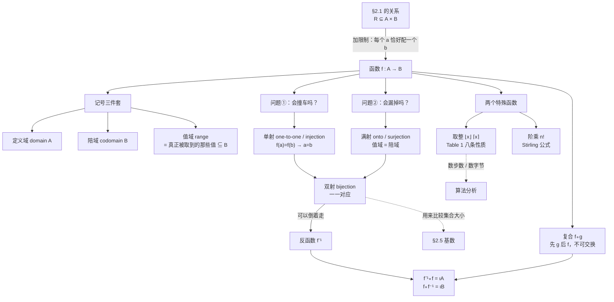
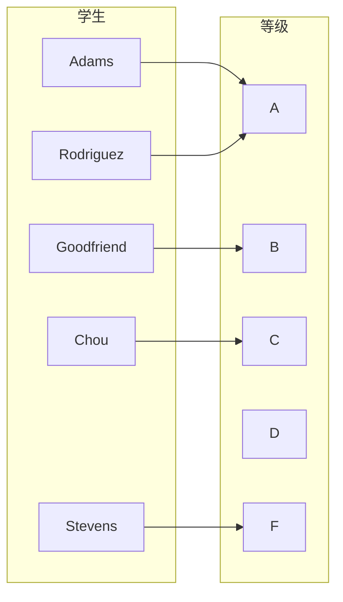
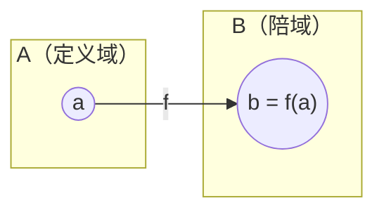
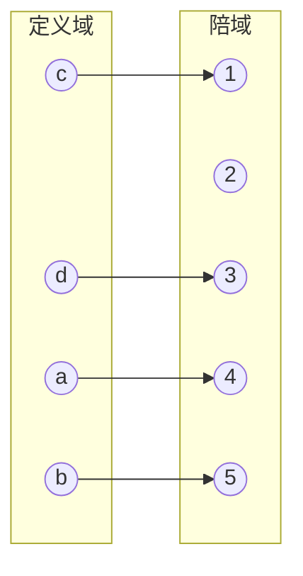
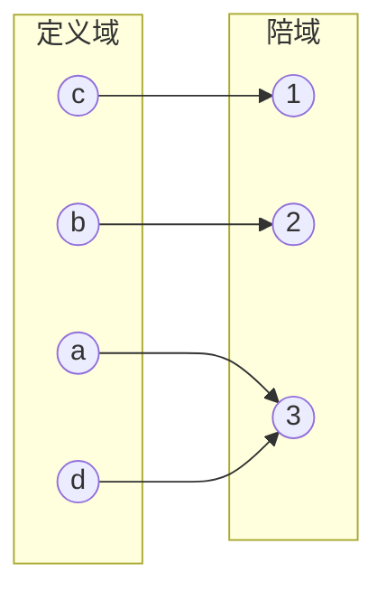
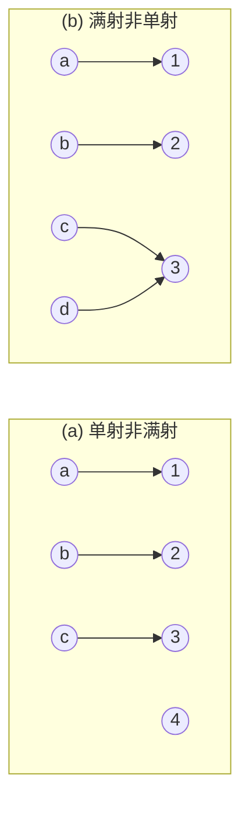
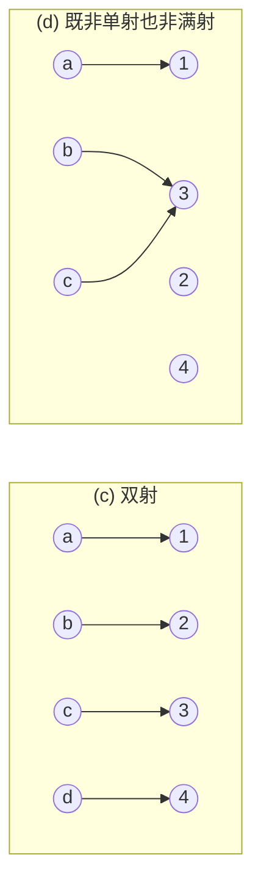
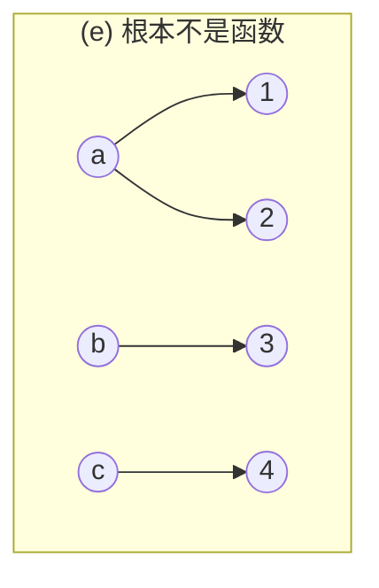
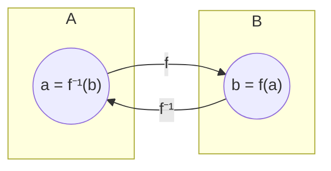
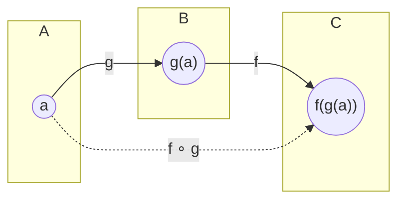

# C2.3 函数 Functions

> [!abstract] 这一讲的任务
> [[C2.1 集合 Sets]] 最后留了一个钩子：$A\times B$ 的子集叫**关系**。这一讲给关系加一条限制——**“$A$ 里每个元素恰好配到 $B$ 里一个元素”**——得到的就是**函数 function**。
> 你在中学学过函数，但这一讲的重点**完全不在“算函数值”**，而在三个新问题：
> ① **有没有撞车**（单射）、② **有没有漏掉**（满射）、③ **能不能倒着走**（反函数）。
> 这三个问题是后面一切的基础：[[C2.5 集合的基数 Cardinality of Sets]] 用“能不能一一对应”来比较无限集的大小，第 6 章用它来数东西，算法复杂度分析用**取整函数**（本讲第 8 节）来数步数。

> [!info] 怎么读这份讲义
> 本讲最长，但结构很清楚：**第 1–3 节是定义与记号**（快读），**第 4–5 节是单射/满射/双射**（本讲权重最高，慢读），**第 6 节反函数与复合**（紧接第 5 节），**第 8 节取整函数**（计算题的主要来源，Table 1 要背）。
> 第 9 节（阶乘与 Stirling 公式）、第 10 节（部分函数）是收尾，读一遍即可。



---

## 0. 开场：期末登分

期末了，你帮老师往教务系统里录成绩。名单和成绩是这样的：

| 学生 | 成绩 |
|---|---|
| Adams | A |
| Chou | C |
| Goodfriend | B |
| Rodriguez | A |
| Stevens | F |



系统提交时报了两个错，你觉得都很合理：

- **“Chou 有两条成绩记录”** → 不行，一个学生只能有**一个**最终等级。
- **“Zhang 没有成绩”** → 也不行，名单上的每个学生都**必须**有一个等级。

> [!question] 停一下，先自己想想
> 把这两条规矩合起来，用一句话描述这张表满足的性质。

合起来就是：**左边每个人，恰好对应右边一个等级。**（“恰好一个” = 不多不少：不能没有，也不能有两个。）

**你刚才做的，就是一次完整的函数建模。** 注意两件事：

1. **右边的 D 没有人拿到**——这完全合法。“每个学生有成绩”不要求“每个等级有人拿”。这个不对称后面会变成**满射**这个概念。
2. **A 被两个人拿到**——这也合法。“每个学生一个成绩”不要求“不同学生成绩不同”。这个不对称后面会变成**单射**这个概念。

这一讲剩下的内容，基本上就是把这两句“不要求”变成两个正式的定义，然后看看**要求了**会发生什么。

---

## 1. 函数的定义与三件套记号

> [!important] 定义 1（课本 DEFINITION 1）
> 设 $A, B$ 是**非空**集合。从 $A$ 到 $B$ 的一个**函数 function** $f$，是把 $B$ 中**恰好一个**元素指派给 $A$ 中每个元素的一种指派方式。
> 若 $f$ 把 $A$ 的元素 $a$ 指派给 $B$ 的唯一元素 $b$，就写 $f(a) = b$。
> 记 $f : A\to B$。

**Remark**：函数也叫**映射 mapping** 或**变换 transformation**。

**函数可以怎么给出来**：① 显式列出指派（如开场那张表）；② 给公式，如 $f(x) = x+1$；③ 给一段计算机程序。

### 1.1 函数就是一种特殊的关系

> [!important] 用关系定义函数（课本正文）
> 回忆 [[C2.1 集合 Sets]]：从 $A$ 到 $B$ 的关系就是 $A\times B（笛卡尔积）$ 的子集。
> 一个关系 $R\subseteq A\times B$，如果对**每个** $a\in A$ 都**恰好含有一个**有序对 $(a,b)$，它就定义了一个函数 $f$：令 $f(a)=b$，其中 $(a,b)$ 是以 $a$ 为第一分量的那个唯一有序对。

**这是“函数”最干净的定义**——不需要说“指派”这种含糊的话，只需要集合。

> [!warning] ⭐ “恰好一个”是两条要求，考试爱拆开考
> | 违反 | 现象 | 例子 |
> |---|---|---|
> | **少于一个**（有 $a$ 没配到） | 函数**没定义** | $f(x)=1/x$ 从 $\mathbf R$ 到 $\mathbf R$：$x=0$ 没有值 |
> | **多于一个**（有 $a$ 配了俩） | **不是函数**（一对多） | $f(x)=\pm\sqrt{x^2+1}$：一个 $x$ 出两个值 |
>
> 课本习题 1 就是这三个反例：$1/x$（0 处无定义）、$\sqrt x$（负数无定义）、$\pm\sqrt{x^2+1}$（一对多）。
> **记住：函数的两大罪是“漏配”和“多配”。**

### 1.2 三件套：定义域、陪域、值域

> [!important] 定义 2（课本 DEFINITION 2）
> 设 $f$ 是从 $A$ 到 $B$ 的函数。
> - $A$ 称为 $f$ 的**定义域 domain**；
> - $B$ 称为 $f$ 的**陪域 codomain**；
> - 若 $f(a) = b$，则 $b$ 称为 $a$ 的**像 image**，$a$ 称为 $b$ 的**一个原像 preimage**；
> - $f$ 的**值域 range**（也叫 image）是 $A$ 中所有元素的像构成的集合。
> - 也说 $f$ 把 $A$ **映到 maps** $B$。



> [!warning] ⭐⭐ 值域 range vs 陪域 codomain——本讲第一大易错点
> - **陪域**是你**声明**的目标集合，由你（或题目）**指定**；
> - **值域**是**实际被取到**的那些值，由函数本身**决定**；
> - 永远有 **值域 $\subseteq$ 陪域**，但**未必相等**。
>
> 回到开场：陪域是 $\{A,B,C,D,F\}$（五个等级），值域是 $\{A,B,C,F\}$（D 没人拿到）。
>
> **“值域 = 陪域”这件事，恰好就是第 5 节的满射。** 所以这个区分不是学究气，它是整讲的支点。

> [!important] 两个函数什么时候相等（课本正文）
> 两个函数相等，当且仅当它们
> ① **定义域相同**，② **陪域相同**，③ **把公共定义域中每个元素映到公共陪域中的同一个元素**。
>
> 也就是说：**改了定义域，或者改了陪域，就是另一个函数了**——即使公式一模一样。

> [!question] 课堂追问
> $f(x)=x^2$ 从 $\mathbf Z$ 到 $\mathbf Z$，与 $g(x)=x^2$ 从 $\mathbf Z$ 到 $\mathbf N$，是同一个函数吗？
>
> > [!success]- 答案
> > **不是。** 公式相同、定义域相同，但**陪域不同**（$\mathbf Z$ vs $\mathbf N$），按上面的规则它们是两个不同的函数。
> > 而且它们的性质也不同：$f$ 不是满射（负数取不到），但如果把陪域进一步缩成“全体完全平方数”，它就变成满射了。
> > **这说明：满射与否不是函数“内在”的性质，而取决于你声明的陪域。** 单射则不然，单射只跟定义域和映射规则有关。

### 1.3 五个例子

**例 1**：开场的成绩函数 $G$。定义域 $=\{$Adams, Chou, Goodfriend, Rodriguez, Stevens$\}$，陪域 $=\{A,B,C,D,F\}$，**值域 $=\{A,B,C,F\}$**（D 未被取到）。

**例 2**：关系 $R = \{(\text{Abdul},22),(\text{Brenda},24),(\text{Carla},21),(\text{Desire},22),(\text{Eddie},24),(\text{Felicia},22)\}$（学生与年龄）确定的函数 $f$：$f(\text{Abdul})=22$，等等。
定义域 = 这 6 个学生；陪域可取“小于 100 的正整数”（因为学生几乎不可能 100 岁以上）；**值域 $=\{21,22,24\}$**。

> [!note] 课本在这里教了一个实用技巧
> 陪域**怎么选**？课本说：可以选“全体正整数”或“10 到 90 之间的整数”，**但那就变成不同的函数了**。选“小于 100 的正整数”的好处是——**以后加进新同学的姓名和年龄时，这个函数还能用**。
> **工程直觉**：陪域就是你声明的返回值类型。声明得太紧，以后扩展要改类型；声明得太松，类型检查帮不上忙。这跟你写 Python type hint 时的取舍完全一致。

**例 3**：$f$ 把长度 $\ge 2$ 的位串映到它的**最后两位**，例如 $f(11010)=10$。
定义域 = 全体长度 $\ge 2$ 的位串；**陪域和值域都是** $\{00,01,10,11\}$。

**例 4**：$f:\mathbf Z\to\mathbf Z$，$f(x)=x^2$。定义域 $=\mathbf Z$，陪域 $=\mathbf Z$，**值域 $=\{0,1,4,9,\ldots\}$**（全体完全平方数）。

**例 5**：编程语言里的函数签名**直接声明了定义域和陪域**：

```java
int floor(float real){...}      // Java
```
```cpp
int function(float x){...}      // C++
```

两者都告诉我们：**定义域是实数集**（用浮点数表示），**陪域是整数集**。

### 1.4 函数的加法和乘法

**实值函数 real-valued**：陪域是 $\mathbf R$；**整值函数 integer-valued**：陪域是 $\mathbf Z$。
同定义域的两个实值（或整值）函数可以相加、相乘。

> [!important] 定义 3（课本 DEFINITION 3）
> 设 $f_1, f_2: A\to\mathbf R$。则 $f_1+f_2$ 与 $f_1f_2$ 也是 $A\to\mathbf R$ 的函数，对一切 $x\in A$：
> $$(f_1+f_2)(x) = f_1(x)+f_2(x) \qquad (f_1f_2)(x) = f_1(x)f_2(x)$$

**例 6**：$f_1(x)=x^2$，$f_2(x)=x-x^2$，则
$$(f_1+f_2)(x) = x^2 + (x-x^2) = x \qquad (f_1f_2)(x) = x^2(x-x^2) = x^3-x^4$$

> [!note] 注意这个定义的写法
> 课本强调：“$f_1+f_2$ 和 $f_1f_2$ 是通过**指定它们在 $x$ 处的值**来定义的。”
> 这是抽象代数里的标准动作：**要定义一个新函数，就说清楚它在每一点取什么值**。

### 1.5 子集的像

> [!important] 定义 4（课本 DEFINITION 4）
> 设 $f: A\to B$，$S\subseteq A$。$S$ 在 $f$ 下的**像 image**，记作 $f(S)$，是 $S$ 中元素的像构成的 $B$ 的子集：
> $$f(S) = \{t \mid \exists s\in S\,(t = f(s))\}$$
> 也可简写为 $\{f(s)\mid s\in S\}$。

> [!warning] 课本亲自点出的记号歧义
> **“记号 $f(S)$ 有潜在的歧义。”** 这里 $f(S)$ 表示**一个集合**，而**不是**函数 $f$ 在“集合 $S$”这个对象上的取值。
> 靠**参数是元素还是集合**来区分：$f(a)$ 是元素，$f(S)$ 是集合。

**例 7**：$A=\{a,b,c,d,e\}$，$B=\{1,2,3,4\}$，$f(a)=2,f(b)=1,f(c)=4,f(d)=1,f(e)=1$。
子集 $S=\{b,c,d\}$ 的像是 $f(S) = \{f(b),f(c),f(d)\} = \{1,4,1\} = \{1,4\}$。

（注意 $f(b)=f(d)=1$ 只算一次——**结果是集合**。）

> [!example] 手算（课本习题 30）
> $S=\{-1,0,2,4,7\}$，求 $f(S)$：
> - $f(x)=1$（常函数）：$f(S) = \{1\}$——**只有一个元素**。
> - $f(x)=2x+1$：$f(S)=\{-1,1,5,9,15\}$。
> - $f(x)=\lceil x/5\rceil$：逐个算 $\lceil -0.2\rceil=0,\ \lceil 0\rceil=0,\ \lceil 0.4\rceil = 1,\ \lceil 0.8\rceil=1,\ \lceil 1.4\rceil=2$，故 $f(S)=\{0,1,2\}$。
> - $f(x)=\lfloor (x^2+1)/3\rfloor$：$\lfloor 2/3\rfloor=0,\ \lfloor 1/3\rfloor = 0,\ \lfloor 5/3\rfloor=1,\ \lfloor 17/3\rfloor=5,\ \lfloor 50/3\rfloor=16$，故 $f(S)=\{0,1,5,16\}$。
>
> **易错点**：算完一定**去重**并**按集合写**，别写成列表。

> [!important] 一条有用的不等式（课本补充习题 14–15）
> 对有限集总有 $\lvert f(S)\rvert \le \lvert S\rvert$——**像不可能比原来多**（多个元素可能撞到同一个像上）。
> 而且：**对 $A$ 的一切子集 $S$ 都有 $\lvert f(S)\rvert = \lvert S\rvert$，当且仅当 $f$ 是单射**（下一节的内容）。

---

## 2. 问题①：会撞车吗——单射

### 2.1 从需求出发

回到开场。Adams 和 Rodriguez 都拿了 A，这在成绩表里很正常。但换个场景就不行了：

> 给每个学生分配一个**学号**。

这时候**绝不允许两个学生拿到同一个号**。这种“不同的输入必然给出不同的输出”的函数，就是单射。

> [!important] 定义 5（课本 DEFINITION 5）
> 函数 $f$ 称为**单射 one-to-one**（也叫 **injection**），当且仅当对定义域中一切 $a,b$：
> $$f(a) = f(b) \implies a = b$$
> 称 $f$ 是 **injective（单的）**。

**逆否形式**（课本正文指出，这是“取定义中蕴涵式的逆否”）：

$$a \ne b \implies f(a)\ne f(b)$$

**量词形式**（论域为 $f$ 的定义域）：

$$\forall a\forall b\bigl(f(a)=f(b)\to a=b\bigr) \quad\text{或等价地}\quad \forall a\forall b\bigl(a\ne b\to f(a)\ne f(b)\bigr)$$

> [!note] 停一下：为什么定义要写成“像相同 ⟹ 原相同”
> 直觉上“不同的输入给不同的输出”更好懂（那是逆否式），但**证明时第一种形式好用得多**：
> 你可以**假设 $f(a)=f(b)$，然后解方程推出 $a=b$**——这是一条能走的路。
> 而从"$a\ne b$"出发推"$f(a)\ne f(b)$"，起点是个不等式，很难往下解。
> 这正是 [[C1.7 证明导论 Introduction to Proofs]] 里“逆否命题有时比原命题好证”的一个反向应用：**这次是原命题更好证，所以定义就写成原命题的样子。**


*一个单射：四个箭头指向四个不同的目标（元素 2 没被指到，所以它不是满射）。*

### 2.2 例子

**例 8**：$f$ 从 $\{a,b,c,d\}$ 到 $\{1,2,3,4,5\}$，$f(a)=4,f(b)=5,f(c)=1,f(d)=3$。
**是单射**——四个值互不相同。（即上图。）

**例 9**：$f(x)=x^2$ 从 $\mathbf Z$ 到 $\mathbf Z$。
**不是单射**——$f(1)=f(-1)=1$，但 $1\ne -1$。

但课本补了一句关键的话：**把定义域限制到 $\mathbf Z^+$，$f(x)=x^2$ 就是单射了。**

> [!warning] 课本对“限制定义域”的技术性说明
> 课本 Remark：严格地说，限制定义域会得到**一个新函数**，它在被保留的那些点上和原函数取值相同，**在原定义域中被去掉的点上则没有定义**。
> 所以“$x^2$ 在正整数上是单射”这句话，更准确的说法是“$x^2$ 在 $\mathbf Z^+$ 上的**限制**是单射”。答题时写清楚定义域即可。

**例 10**：$f(x)=x+1$ 从 $\mathbf R$ 到 $\mathbf R$。**是单射**——$x\ne y \Rightarrow x+1\ne y+1$。

**例 11**：给一组员工每人分配一份工作，每份工作只由一个人做。则“员工 $\to$ 工作”的函数**是单射**——两个不同的员工必然被分到不同的工作。

### 2.3 一个判定单射的充分条件：严格单调

> [!important] 定义 6（课本 DEFINITION 6）
> 设 $f$ 的定义域和陪域都是 $\mathbf R$ 的子集。当 $x<y$（$x,y$ 在定义域中）时：
> - $f(x)\le f(y)$ 恒成立 $\Rightarrow$ $f$ **递增 increasing**；
> - $f(x) < f(y)$ 恒成立 $\Rightarrow$ $f$ **严格递增 strictly increasing**；
> - $f(x)\ge f(y)$ 恒成立 $\Rightarrow$ $f$ **递减 decreasing**；
> - $f(x) > f(y)$ 恒成立 $\Rightarrow$ $f$ **严格递减 strictly decreasing**。
>
> 量词形式：$\forall x\forall y\bigl(x<y\to f(x)\le f(y)\bigr)$ 等等。

> [!important] ⭐ 结论（课本习题 26、27）
> **严格递增或严格递减的函数，一定是单射。**
> **但递增而非严格递增（或递减而非严格递减）的函数，不是单射。**

> [!question] 停一下，先自己想想
> 为什么“严格”这两个字不能去掉？
>
> > [!success]- 答案
> > 因为 $\le$ 允许**相等**。一个“递增但不严格”的函数可以在一段区间上**保持水平**，那一整段上的点全部映到同一个值——直接撞车。
> > **反例**：$f(x)=\lfloor x\rfloor$（第 8 节的下取整函数）是递增的，但 $f(1.2)=f(1.8)=1$，不是单射。
> > 它的图像就是一段一段的水平台阶——**每一级台阶就是一次撞车**。

---

## 3. 问题②：会漏掉吗——满射

> [!important] 定义 7（课本 DEFINITION 7）
> 函数 $f: A\to B$ 称为**满射 onto**（也叫 **surjection**），当且仅当对**每个** $b\in B$，都存在 $a\in A$ 使 $f(a)=b$。称 $f$ 是 **surjective（满的）**。

**量词形式**（$x$ 的论域是定义域，$y$ 的论域是**陪域**）：

$$\forall y\,\exists x\,\bigl(f(x)=y\bigr)$$

> [!important] ⭐ 满射的等价说法（最好用的一句）
> **$f$ 是满射 $\iff$ 值域 $=$ 陪域**（一个都不剩）。
> 所以第 1.2 节那个“值域 vs 陪域”的区分，在这里得到了全部意义。


*一个满射：1、2、3 全被指到（但 a 和 d 都指向 3，所以它不是单射）。*

**例 12**：$f$ 从 $\{a,b,c,d\}$ 到 $\{1,2,3\}$，$f(a)=3,f(b)=2,f(c)=1,f(d)=3$。
**是满射**——陪域的三个元素都有原像。
课本补充：**如果把陪域改成 $\{1,2,3,4\}$，它就不是满射了**（4 没有原像）。再次印证“满射依赖陪域”。

**例 13**：$f(x)=x^2$ 从 $\mathbf Z$ 到 $\mathbf Z$。**不是满射**——没有整数 $x$ 满足 $x^2=-1$。

**例 14**：$f(x)=x+1$ 从 $\mathbf Z$ 到 $\mathbf Z$。**是满射**——对任意整数 $y$，取 $x=y-1$ 即可（因为 $f(x)=y \iff x+1=y \iff x=y-1$）。

**例 15**：工作分配的例子。$f$ 是满射 $\iff$ **每份工作都有人干**；只要有一份工作没人认领，就不是满射。

---

## 4. 两者都要：双射

> [!important] 定义 8（课本 DEFINITION 8）
> 若 $f$ 既是单射又是满射，则称 $f$ 是**一一对应 one-to-one correspondence**，或**双射 bijection**，称 $f$ 是 **bijective**。

**例 16**：$f$ 从 $\{a,b,c,d\}$ 到 $\{1,2,3,4\}$，$f(a)=4,f(b)=2,f(c)=1,f(d)=3$。
**是双射**：值两两不同（单），四个目标全被取到（满）。

### 4.1 ⭐ 五张图，一次看清全部区别







> [!important] 图表读法（对应课本 FIGURE 5）
> 五张图的差别**全在箭头的分布**上，逐图核对两件事：
>
> | 图 | 有没有两个箭头撞到同一个点？ | 右边有没有点没被箭头指到？ | 结论 |
> |:-:|:-:|:-:|---|
> | (a) | 没有 → **单** | 有（4） → **不满** | 单射非满射 |
> | (b) | 有（c,d 都指 3） → **不单** | 没有 → **满** | 满射非单射 |
> | (c) | 没有 → **单** | 没有 → **满** | **双射** |
> | (d) | 有（b,c 都指 3） | 有（2、4） | 都不是 |
> | (e) | —— | —— | **不是函数**（$a$ 射出两个箭头，违反“恰好一个”） |
>
> **答题速判两步**：① **看箭头尾巴**——有没有一个左边元素射出 0 个或 2 个箭头？（不是函数）② **看箭头尖**——右边有没有点被指了 2 次（非单）或 0 次（非满）？

### 4.2 有限集上的一个重要事实

> [!important] 课本正文的结论
> 设 $f$ 是从集合 $A$ **到 $A$ 自身**的函数。
> **若 $A$ 有限**，则 $f$ 是单射 $\iff$ $f$ 是满射。
> **若 $A$ 无限**，这就不一定成立了。

> [!question] 课堂追问：有限的时候为什么两者等价？
> > [!success]- 答案
> > **鸽巢原理**（[[C1.7 证明导论 Introduction to Proofs]] 例 9，第 6.2 节会正式讲）：
> > 设 $|A| = n$。
> > - **单 ⟹ 满**：$n$ 个不同的输入给出 $n$ 个不同的输出，而陪域也只有 $n$ 个位置，所以位置被填满了，没有漏的。
> > - **满 ⟹ 单**：要盖住 $n$ 个位置至少需要 $n$ 个不同的输出，而输入只有 $n$ 个，所以它们的输出必须两两不同。

> [!warning] ⭐ 无限集上这条铁律会崩掉——而这正是 §2.5 的全部麻烦
> 反例：$f:\mathbf Z^+\to\mathbf Z^+$，$f(n) = n+1$。
> - **是单射**：$n+1 = m+1 \Rightarrow n=m$ ✓
> - **不是满射**：没有正整数 $n$ 使 $n+1 = 1$ ✗
>
> 一个集合可以**和自己的真子集一一对应**——这在有限世界里绝不可能。
> 课本在这里明说“这将在 **§2.5** 中说明”。到时候这个反例会变成**希尔伯特大饭店**的故事：住满了还能再住进一位客人。见 [[C2.5 集合的基数 Cardinality of Sets]]。

### 4.3 恒等函数

**例 17**：集合 $A$ 上的**恒等函数 identity function** 是
$$\iota_A: A\to A,\qquad \iota_A(x) = x$$
（$\iota$ 是希腊字母 **iota**。）它把每个元素映到自己，**既单又满，是双射**。

（有些书写作 $\mathrm{id}_A$ 或 $I_A$，含义相同。）

### 4.4 ⭐ 证明模板（课本高亮，答题直接照抄结构）

> [!important] 设 $f: A\to B$。
> **证 $f$ 是单射**：任取 $x, y\in A$ 且 $x \ne y$，从 $f(x)=f(y)$ 出发，推出 $x=y$。
> **证 $f$ 不是单射**：**举出具体的** $x,y\in A$，使 $x\ne y$ 而 $f(x)=f(y)$。
> **证 $f$ 是满射**：任取 $y\in B$，**构造出**一个 $x\in A$ 使 $f(x)=y$。
> **证 $f$ 不是满射**：**举出具体的** $y\in B$，使对一切 $x\in A$ 都有 $f(x)\ne y$。

> [!note] 停一下，看看这四条的结构
> 注意**正面用“任取 + 推导”，反面用“举一个反例”**——这正是 [[C1.4 谓词与量词 Predicates and Quantifiers]] 里 $\neg\forall x P(x)\equiv\exists x\neg P(x)$ 的直接后果：
> - 单射是 $\forall$ 命题 $\Rightarrow$ 否定它要给 $\exists$（一对反例）；
> - 满射是 $\forall y\exists x$ 命题 $\Rightarrow$ 否定它是 $\exists y\forall x$（一个 $y$，对所有 $x$ 都够不着）。
>
> **“证明的形状由量词的形状决定”**——这是第 1 章教给我们、第 2 章反复兑现的东西。

> [!example] 手算：完整判定一个函数（课本习题 22、23 型）
> **判断 $f:\mathbf R\to\mathbf R$，$f(x) = -3x+4$ 是否为双射。**
>
> **单射**：设 $f(x)=f(y)$，即 $-3x+4 = -3y+4$。两边减 4 得 $-3x=-3y$，除以 $-3$ 得 $x=y$。✓ 是单射。
> **满射**：任取 $y\in\mathbf R$，欲求 $x$ 使 $-3x+4=y$，解得 $x = \dfrac{4-y}{3}$，这是一个实数，确实在定义域里。✓ 是满射。
> **结论**：$f$ 是**双射**。
>
> ---
> **判断 $f:\mathbf R\to\mathbf R$，$f(x)=-3x^2+7$。**
> **不是单射**：$f(1) = 4 = f(-1)$，但 $1\ne -1$。✗
> **不是满射**：因为 $-3x^2\le 0$，所以 $f(x)\le 7$ 恒成立。取 $y=8$，对一切 $x$ 都有 $f(x)\ne 8$。✗
> **结论**：既非单射也非满射。
>
> **要点**：偶次幂 $\Rightarrow$ 优先怀疑“$\pm$ 一对撞车”（非单）和“有上/下界”（非满），两刀下去通常都中。

---

## 5. 问题③：能不能倒着走——反函数

### 5.1 为什么偏偏要双射

设 $f: A\to B$ 是双射。

- 因为 $f$ **满**，$B$ 的每个元素**至少**有一个原像；
- 因为 $f$ **单**，$B$ 的每个元素**至多**有一个原像。

合起来：**$B$ 的每个元素恰好有一个原像**。于是“反过来配”本身就是一个合法的函数。

> [!important] 定义 9（课本 DEFINITION 9）
> 设 $f$ 是从 $A$ 到 $B$ 的一一对应。$f$ 的**反函数 inverse function** 是这样一个从 $B$ 到 $A$ 的函数：它把 $b\in B$ 映到使 $f(a)=b$ 的那个**唯一**的 $a\in A$。记作 $f^{-1}$。
> $$f^{-1}(b) = a \iff f(a) = b$$



> [!warning] ⭐ 别把 $f^{-1}$ 和 $1/f$ 搞混
> 课本专门给了 Remark：$f^{-1}$ 是**反函数**，而 $1/f$ 是把每个 $x$ 映到 $1/f(x)$ 的那个函数。
> 后者**只在 $f(x)$ 是非零实数时才有意义**，两者毫无关系。
> $-1$ 在这里是“逆运算”的记号，**不是指数**。

### 5.2 不是双射就没有反函数

课本把两种失败情形讲得很细：

| $f$ 的缺陷 | 后果 |
|---|---|
| **不是单射** | 某个 $b$ 是**多个** $a$ 的像 $\Rightarrow$ $f^{-1}(b)$ 该等于哪一个？**说不清** |
| **不是满射** | 某个 $b$ **没有**原像 $\Rightarrow$ $f^{-1}(b)$ **没有值** |

无论哪种，$f^{-1}$ 都不是合法的函数。

**术语**：一一对应称为**可逆的 invertible**；不是一一对应的函数**不可逆 not invertible**。

**例 18**：$f$ 从 $\{a,b,c\}$ 到 $\{1,2,3\}$，$f(a)=2,f(b)=3,f(c)=1$。**可逆**（双射），且
$$f^{-1}(1)=c,\quad f^{-1}(2)=a,\quad f^{-1}(3)=b$$

**例 19**：$f:\mathbf Z\to\mathbf Z$，$f(x)=x+1$。由例 10（单）与例 14（满）知它是双射，故可逆。
求法：设 $y=x+1$，解出 $x=y-1$，故 $f^{-1}(y) = y-1$。

**例 20**：$f:\mathbf R\to\mathbf R$，$f(x)=x^2$。**不可逆**——$f(-2)=f(2)=4$，$f^{-1}(4)$ 得同时等于 $-2$ 和 $2$，不行。（也可以说它不是满射，同样不可逆。）

### 5.3 限制定义域/陪域来“抢救”一个函数

**例 21**：把 $f(x)=x^2$ 限制成**从非负实数集到非负实数集**，则它可逆。

**课本的完整论证**：

**单射**：设 $f(x)=f(y)$，即 $x^2=y^2$，故 $x^2-y^2 = (x+y)(x-y) = 0$，于是 $x+y=0$ 或 $x-y=0$，即 $x=-y$ 或 $x=y$。**因为 $x,y$ 都非负**，只能有 $x=y$。✓

**满射**：任取非负实数 $y$，存在非负实数 $x=\sqrt y$ 使 $x^2 = y$。✓

因此可逆，且 $f^{-1}(y) = \sqrt y$。

> [!note] 停一下，我们刚才干了什么
> 这个技巧非常通用：**一个函数不可逆时，通过缩小定义域（治单射）或缩小陪域（治满射）把它变可逆。**
> 这正是中学“反三角函数”的来路——$\sin x$ 在 $\mathbf R$ 上根本不可逆（周期性导致大量撞车），把定义域限制到 $[-\pi/2,\pi/2]$、陪域限制到 $[-1,1]$，才有了 $\arcsin$。
> 课本习题 28、29 也是这个套路：$e^x$ 把陪域限制到正实数就可逆；$|x|$ 把定义域限制到非负实数就可逆。

---

## 6. 复合函数

> [!important] 定义 10（课本 DEFINITION 10）
> 设 $g: A\to B$，$f: B\to C$。$f$ 与 $g$ 的**复合 composition**，记作 $f\circ g$，对一切 $a\in A$ 定义为
> $$(f\circ g)(a) = f(g(a))$$

**执行顺序**：先用 $g$ 作用于 $a$ 得 $g(a)$，再用 $f$ 作用于 $g(a)$。

> [!warning] ⭐⭐ $f\circ g$ 是“**先 $g$ 后 $f$**”
> 写的顺序和**做的顺序相反**。这是本节最高频的失分点。
> **记忆法**：把 $(f\circ g)(a) = f(g(a))$ 的右边从**里往外**读——**离 $a$ 最近的先做**。

> [!important] 什么时候复合有定义
> 课本明确：**除非 $g$ 的值域是 $f$ 的定义域的子集，否则 $f\circ g$ 没有定义。**
> （否则 $g(a)$ 可能跑到 $f$ 管不着的地方去。）



**例 22**：$g$ 从 $\{a,b,c\}$ 到自身：$g(a)=b,g(b)=c,g(c)=a$；$f$ 从 $\{a,b,c\}$ 到 $\{1,2,3\}$：$f(a)=3,f(b)=2,f(c)=1$。

$$(f\circ g)(a) = f(g(a)) = f(b) = 2$$
$$(f\circ g)(b) = f(g(b)) = f(c) = 1$$
$$(f\circ g)(c) = f(g(c)) = f(a) = 3$$

而 **$g\circ f$ 没有定义**——$f$ 的值域是 $\{1,2,3\}$，不是 $g$ 的定义域 $\{a,b,c\}$ 的子集。

**例 23**：$f,g:\mathbf Z\to\mathbf Z$，$f(x)=2x+3$，$g(x)=3x+2$。

$$(f\circ g)(x) = f(g(x)) = f(3x+2) = 2(3x+2)+3 = 6x+7$$
$$(g\circ f)(x) = g(f(x)) = g(2x+3) = 3(2x+3)+2 = 6x+11$$

> [!important] ⭐ 复合不满足交换律
> 课本 Remark：即使 $f\circ g$ 和 $g\circ f$ **都有定义**，两者**也不相等**。
> 上例中 $6x+7\ne 6x+11$。**“复合的交换律不成立。”**

### 6.1 函数与其反函数复合 = 恒等函数

设 $f: A\to B$ 是双射。由 $f^{-1}(b)=a \iff f(a)=b$，有

$$(f^{-1}\circ f)(a) = f^{-1}(f(a)) = f^{-1}(b) = a$$
$$(f\circ f^{-1})(b) = f(f^{-1}(b)) = f(a) = b$$

> [!important] ⭐ 结论
> $$f^{-1}\circ f = \iota_A \qquad f\circ f^{-1} = \iota_B \qquad (f^{-1})^{-1} = f$$
> 也就是说：**先做再撤销 = 什么都没做**；**反函数的反函数就是原函数**。

> [!warning] 注意两个恒等函数不是同一个
> $f^{-1}\circ f$ 是 $A$ 上的恒等函数 $\iota_A$，$f\circ f^{-1}$ 是 $B$ 上的恒等函数 $\iota_B$。
> $A$ 和 $B$ 可以是完全不同的集合，所以**两个 $\iota$ 不能混写**。

---

## 7. 函数的图像

> [!important] 定义 11（课本 DEFINITION 11）
> 设 $f: A\to B$。$f$ 的**图像 graph** 是有序对的集合
> $$\{(a,b)\mid a\in A \text{ 且 } f(a)=b\}$$

也就是说，**图像是 $A\times B$ 的一个子集**——而这恰好就是第 1.1 节说的“由 $f$ 确定的那个关系”。

> [!note] 停一下：三个名字，同一个东西
> $$\text{函数 } f \quad=\quad \text{它的图像} \quad=\quad \text{它对应的关系 } R\subseteq A\times B$$
> 课本在定义 11 后特意点明了这一点。所以中学画的“函数图像”和这一讲说的“函数是特殊的关系”，说的是**同一件事**。

**例 24**：$f(n)=2n+1$ 从 $\mathbf Z$ 到 $\mathbf Z$，图像是全体 $(n, 2n+1)$。
**例 25**：$f(x)=x^2$ 从 $\mathbf Z$ 到 $\mathbf Z$，图像是全体 $(x, x^2)$。

![[C2-图6-整数集上两个函数的图像.png]]

> [!warning] 图表读法：为什么是**离散的点**而不是连续曲线
> 定义域是 $\mathbf Z$，所以图像里**只有整数横坐标处的点**，中间是空的。
> 如果定义域改成 $\mathbf R$，同样的公式画出来才是一条直线和一条抛物线。
> **“同样的公式 + 不同的定义域 = 不同的函数”**——第 1.2 节那条规则在图上看得最清楚。

---

## 8. 两个重要函数之一：取整函数

### 8.1 定义

> [!important] 定义 12（课本 DEFINITION 12）
> **下取整函数 floor function** 把实数 $x$ 映到**小于等于 $x$ 的最大整数**，记作 $\lfloor x\rfloor$。
> **上取整函数 ceiling function** 把实数 $x$ 映到**大于等于 $x$ 的最小整数**，记作 $\lceil x\rceil$。

**Remark**：下取整函数常被称为**最大整数函数 greatest integer function**，有时记作 $[x]$。

**例 26**（课本给的 8 个值，**尤其注意负数**）：

$$\left\lfloor\tfrac12\right\rfloor = 0,\quad \left\lceil\tfrac12\right\rceil = 1,\quad \left\lfloor-\tfrac12\right\rfloor = -1,\quad \left\lceil-\tfrac12\right\rceil = 0$$
$$\lfloor 3.1\rfloor = 3,\quad \lceil 3.1\rceil = 4,\quad \lfloor 7\rfloor = 7,\quad \lceil 7\rceil = 7$$

> [!warning] ⭐⭐ 负数上取整/下取整是**最高频**的计算错误
> $\lfloor -0.5\rfloor$ **不是** $0$，是 $-1$——因为要找的是**小于等于 $-0.5$ 的最大整数**，$0 > -0.5$ 不合格。
> **万能做法：画一条数轴。** $\lfloor x\rfloor$ 是“**往左**走到最近的整数”（往负方向），$\lceil x\rceil$ 是“**往右**走到最近的整数”（往正方向）。
> 恰好落在整数上时，两者都等于 $x$ 本身（不动）。
> **不要**把 $\lfloor\ \rfloor$ 理解成“去尾”或“四舍五入”——对正数碰巧一样，**对负数全错**。

### 8.2 图像

![[C2-图7-取整函数的图像-下取整与上取整.png]]

> [!important] 图表读法：实心点和空心点在说什么
> 课本正文写得很明白：
> - $\lfloor x\rfloor$ 在区间 $[n, n+1)$ 上**恒等于 $n$**，到 $x=n+1$ 时**跳到** $n+1$。
>   所以每条水平线段**左端实心**（含端点）、**右端空心**（不含）。
> - $\lceil x\rceil$ 在区间 $(n, n+1]$ 上**恒等于 $n+1$**，$x$ 刚超过 $n+1$ 时跳到 $n+2$。
>   所以每条水平线段**左端空心**、**右端实心**。
>
> **左右两张图的坐标系完全相同**，唯一的差别是**台阶相对于整数点的位置**（floor 的台阶“压”在整数点右侧，ceiling 的“挂”在左侧）。这是初学者最容易看糊涂的地方，对着 $x=1$ 这一列上下比一比就清楚了。
>
> 顺带印证第 2.3 节：这两个函数都是**递增但不严格递增**（有水平段），所以**都不是单射**。

### 8.3 两个典型应用（数据存储与传输）

**例 27**：编码 100 比特数据需要多少字节（1 字节 = 8 比特）？

**解**：需要**至少和 $100/8$ 一样大的最小整数**——这正是上取整。
$$\lceil 100/8\rceil = \lceil 12.5\rceil = \boxed{13}\ \text{字节}$$

**例 28**：ATM（异步传输模式，骨干网通信协议）把数据组织成 **53 字节**的信元 cell。一条 **500 kbit/s** 的连接 1 分钟能传多少个 ATM 信元？

**解**：
- 1 分钟传输的比特数：$500{,}000 \times 60 = 30{,}000{,}000$ 比特；
- 每个信元：$53\times 8 = 424$ 比特；
- 要求**不超过商的最大整数**——下取整：
$$\left\lfloor \frac{30{,}000{,}000}{424}\right\rfloor = \lfloor 70754.72\ldots\rfloor = \boxed{70{,}754}\ \text{个信元}$$

> [!important] ⭐ 什么时候用 $\lceil\ \rceil$，什么时候用 $\lfloor\ \rfloor$——速判窍门
> | 问题的形状 | 用哪个 | 例 |
> |---|:-:|---|
> | **需要多少个容器才装得下**（不能装一半） | $\lceil\ \rceil$ | 13 个字节、几辆车、几页纸 |
> | **最多能装下多少个**（装不满的不算） | $\lfloor\ \rfloor$ | 70754 个信元、能买几个 |
>
> **一句话**：**“至少要”用上取整，“最多能”用下取整。** 应用题只要问清楚是哪一种，就不会选错。

### 8.4 Table 1：八条必备性质

> [!important] TABLE 1 取整函数的有用性质（课本原表，$n$ 是整数，$x$ 是实数）
>
> | 编号 | 性质 |
> |:-:|---|
> | (1a) | $\lfloor x\rfloor = n \iff n \le x < n+1$ |
> | (1b) | $\lceil x\rceil = n \iff n-1 < x \le n$ |
> | (1c) | $\lfloor x\rfloor = n \iff x-1 < n \le x$ |
> | (1d) | $\lceil x\rceil = n \iff x \le n < x+1$ |
> | (2) | $x - 1 < \lfloor x\rfloor \le x \le \lceil x\rceil < x+1$ |
> | (3a) | $\lfloor -x\rfloor = -\lceil x\rceil$ |
> | (3b) | $\lceil -x\rceil = -\lfloor x\rfloor$ |
> | (4a) | $\lfloor x+n\rfloor = \lfloor x\rfloor + n$ |
> | (4b) | $\lceil x+n\rceil = \lceil x\rceil + n$ |

> [!important] 怎么记这张表（别硬背 9 行）
> - **(1a)–(1d)** 都是**定义的改写**，不必单独记。(1a) 说的就是“$n$ 是不超过 $x$ 的最大整数”。
> - **(2)** 是一条**夹逼链**，最有用：$\lfloor x\rfloor\le x\le\lceil x\rceil$（取整不会离原值太远，误差 $<1$）。
> - **(3a)(3b)**：**取负号时 floor 和 ceiling 互换**。这就是为什么 $\lfloor -0.5\rfloor = -\lceil 0.5\rceil = -1$。**记住这一条，负数就再也不会错。**
> - **(4a)(4b)**：**加整数可以直接提出来**。注意 $n$ **必须是整数**——这是下面例 30 反例的关键。

**课本证明 (4a)**（直接证明）：

设 $\lfloor x\rfloor = m$（$m$ 为整数）。由 (1a)，$m \le x < m+1$。
三边同加 $n$：$m+n \le x+n < m+n+1$。
再用一次 (1a)：$\lfloor x+n\rfloor = m+n = \lfloor x\rfloor + n$。$\blacksquare$

### 8.5 处理取整式子的万能技巧

> [!important] ⭐ 课本给的标准手法（**证明题必备**）
> **讨论 floor 时**：令 $x = n + \varepsilon$，其中 $n = \lfloor x\rfloor$ 是整数，$\varepsilon$ 是**小数部分**，满足 $0\le\varepsilon<1$。
> **讨论 ceiling 时**：令 $x = n - \varepsilon$，其中 $n = \lceil x\rceil$ 是整数，$0\le\varepsilon<1$。
>
> 把 $x$ 拆成“整数部分 + 小数部分”之后，取整就变成了**对 $\varepsilon$ 的讨论**，而 $\varepsilon$ 的范围是已知的。

**例 29（课本 EXAMPLE 29）**：证明对任意实数 $x$，
$$\lfloor 2x\rfloor = \lfloor x\rfloor + \left\lfloor x+\tfrac12\right\rfloor$$

**证明**：令 $x = n+\varepsilon$，$n$ 整数，$0\le\varepsilon<1$。按 $\varepsilon$ 与 $\tfrac12$ 的大小分两种情形（**课本说“为什么这样分情形，证明过程中会看清楚”**）。

**情形一：$0\le\varepsilon<\tfrac12$。**
- $2x = 2n+2\varepsilon$，而 $0\le 2\varepsilon<1$，故 $\lfloor 2x\rfloor = 2n$。
- $x+\tfrac12 = n+(\tfrac12+\varepsilon)$，而 $0<\tfrac12+\varepsilon<1$，故 $\lfloor x+\tfrac12\rfloor = n$。
- 于是右边 $= \lfloor x\rfloor + \lfloor x+\tfrac12\rfloor = n+n = 2n =$ 左边。✓

**情形二：$\tfrac12\le\varepsilon<1$。**
- $2x = 2n+2\varepsilon = (2n+1)+(2\varepsilon-1)$，而 $0\le 2\varepsilon-1<1$，故 $\lfloor 2x\rfloor = 2n+1$。
- $x+\tfrac12 = n+(\tfrac12+\varepsilon) = (n+1)+(\varepsilon-\tfrac12)$，而 $0\le\varepsilon-\tfrac12<1$，故 $\lfloor x+\tfrac12\rfloor = n+1$。
- 于是右边 $= n+(n+1) = 2n+1 =$ 左边。✓

两种情形都成立。$\blacksquare$

> [!note] 停一下：为什么恰好在 $\varepsilon = \tfrac12$ 处分界
> 因为 $2\varepsilon$ 在 $\varepsilon$ 跨过 $\tfrac12$ 时**跨过 1**，$\lfloor 2x\rfloor$ 正是在这一刻多跳一格。
> **分情形的分界点，永远选在“某个取整发生跳变”的地方。** 这个直觉能帮你在任何取整证明里正确地切分情形。

**例 30（课本 EXAMPLE 30）**：判断 $\lceil x+y\rceil = \lceil x\rceil + \lceil y\rceil$ 对一切实数是否成立。

**解**：**不成立。** 反例：$x = y = \tfrac12$。
$$\lceil x+y\rceil = \lceil 1\rceil = 1 \qquad \lceil x\rceil+\lceil y\rceil = 1+1 = 2$$
$1\ne 2$。$\blacksquare$

> [!warning] ⭐ 易错点：取整**不能**随意拆开
> $$\lfloor x+y\rfloor \ne \lfloor x\rfloor+\lfloor y\rfloor \qquad \lceil x+y\rceil\ne\lceil x\rceil+\lceil y\rceil \qquad \lfloor xy\rfloor\ne\lfloor x\rfloor\lfloor y\rfloor$$
> 只有 **(4a)(4b)**（加**整数**）那一种拆法是对的。
> 课本的提醒很直白：**“还有许多关于这些函数的陈述看上去像是对的，实际上并不对。”**
> **答题策略：看到“证明或否证”的取整命题，先花 10 秒代 $x=y=\tfrac12$ 或 $x=y=\tfrac13$ 试试**，一半的题当场就被反例干掉了。

---

## 9. 两个重要函数之二：阶乘

> [!important] 定义（课本正文）
> **阶乘函数 factorial function** $f:\mathbf N\to\mathbf Z^+$，记作 $f(n) = n!$，等于前 $n$ 个正整数的乘积：
> $$n! = 1\cdot 2\cdots(n-1)\cdot n, \qquad 0! = 1$$

**例 31**：
$$1! = 1,\qquad 2! = 2,\qquad 6! = 720$$
$$20! = 2{,}432{,}902{,}008{,}176{,}640{,}000$$

（已用程序验算：$20! = 2432902008176640000$ ✓）

> [!important] 对数约定（课本正文顺带交代，全书通用）
> - **$\log x$ 在本书中一律表示以 2 为底的对数**（因为离散数学最常用 2 为底）；
> - 以 $b$ 为底写作 $\log_b x$；
> - 自然对数写作 $\ln x$。
>
> **这条约定务必记住**——看到 $\log n$ 就想 $\log_2 n$，否则复杂度分析全会算错。

### 9.1 Stirling 公式：阶乘长得有多快

例 31 已经说明阶乘增长极快。**Stirling 公式**把这件事量化了：

$$n! \sim \sqrt{2\pi n}\left(\frac{n}{e}\right)^{n}$$

其中 $f(n)\sim g(n)$ 表示 $\displaystyle\lim_{n\to\infty}\frac{f(n)}{g(n)} = 1$，符号 $\sim$ 读作 **“渐近于 is asymptotic to”**。

> [!example] 验算一下这个公式有多准
> $n=20$：
> - 真值 $20! = 2.4329\times10^{18}$
> - Stirling 估计 $\sqrt{2\pi\cdot 20}\,(20/e)^{20} = 2.4228\times10^{18}$
> - **相对误差约 0.4%**——已经相当准，而且 $n$ 越大越准。

> [!note] 专业关联：为什么算法课离不开它
> 比较排序的下界证明要算 $\log_2(n!)$。直接算不好办，用 Stirling：
> $$\log_2(n!) \approx n\log_2 n - n\log_2 e + \tfrac12\log_2(2\pi n) = \Theta(n\log n)$$
> **这就是“任何基于比较的排序算法至少需要 $\Omega(n\log n)$ 次比较”的来源**。
> 同样地，机器学习里的组合数估计、统计物理的配分函数、信息论的熵计算，都会在某一步用到它。

> [!note] 人物卡：James Stirling（1692–1770）
> 苏格兰数学家。因家族支持 Jacobite（斯图亚特王朝复辟）立场，他拒绝向英王宣誓效忠而**失去牛津的奖学金**，甚至被控“诅咒乔治国王”（后被判无罪），因政治原因**始终未能从牛津毕业**。
> 后赴威尼斯，据说因为**打听到意大利玻璃工业的秘密**、被玻璃工匠追杀而仓皇逃离意大利。
> 1730 年出版《微分方法 Methodus Differentialis》，$n!$ 的渐近公式就在这本书里。晚年任苏格兰一家矿业公司经理，还发表过一篇关于**矿井通风**的论文；因勘测克莱德河（为修建船闸使其可通航），1752 年格拉斯哥市民赠他一把**银茶壶**作为答谢。

---

## 10. 部分函数（补充）

有时函数**只对定义域的一部分有定义**。课本举的现实例子很有意思：

- 数学上的 $1/x$、$\sqrt x$、$\arcsin x$；
- **“最小的孩子”**这个函数——对没有孩子的夫妇没有定义；
- **“日出时间”**——在北极圈以北的某些日子里没有定义；
- **程序**算某些输入时会陷入死循环或溢出，算不出正确值。

> [!important] 定义 13（课本 DEFINITION 13）
> 从集合 $A$ 到集合 $B$ 的**部分函数 partial function** $f$，是把 $B$ 中唯一元素 $b$ 指派给 $A$ 的**某个子集**（称为 $f$ 的**定义域 domain of definition**）中每个元素 $a$ 的一种指派。
> $A$ 和 $B$ 分别称为 $f$ 的定义域和陪域。对 $A$ 中不在定义域内的元素，说 $f$ **无定义 undefined**。
> 当定义域等于整个 $A$ 时，称 $f$ 是**全函数 total function**。

**Remark**：部分函数也写 $f: A\to B$，**和普通函数记号相同**，靠上下文区分。

**例 32**：$f:\mathbf Z\to\mathbf R$，$f(n)=\sqrt n$，是从 $\mathbf Z$ 到 $\mathbf R$ 的部分函数，定义域是**非负整数集**；对负整数无定义。

> [!note] 专业关联：部分函数是可计算性理论的核心概念
> 一个程序可能对某些输入**永不停机**——它算的就是一个**部分函数**。
> 到 [[C2.5 集合的基数 Cardinality of Sets]] 讨论**不可计算函数**、以及后续章节的**停机问题**时，“部分函数”是必须的语言。

---

## 这一讲的三句话

1. **函数就是“每个输入恰好一个输出”的关系**；说清一个函数要说清**三件套**：定义域、陪域、映射规则——**改任何一件都是另一个函数**，而**值域 $\subseteq$ 陪域**且未必相等。
2. **单射管“不撞车”，满射管“不漏掉”，两个都要才是双射**；只有双射才有反函数；**有限集到自身时单 $\iff$ 满，无限集上则不然**——这一条崩塌正是 §2.5 的起点。
3. **取整函数是算法分析的计数工具**：“至少要”用 $\lceil\ \rceil$、“最多能”用 $\lfloor\ \rfloor$；负数时用 $\lfloor -x\rfloor = -\lceil x\rceil$ 换算；**除了加整数，取整一律不能拆开**。

### 速查表

| 概念 | 定义 | 证明模板 |
|---|---|---|
| 函数 $f:A\to B$ | 每个 $a$ 恰好配一个 $b$ | 检查“漏配”和“多配” |
| 单射 injective | $f(a)=f(b)\Rightarrow a=b$ | 设 $f(x)=f(y)$，解出 $x=y$ |
| 非单射 | $\exists a\ne b,\ f(a)=f(b)$ | 举一对具体反例 |
| 满射 surjective | $\forall y\in B\ \exists x,\ f(x)=y$ | 任取 $y$，构造出 $x$ |
| 非满射 | $\exists y\in B,\ \forall x,\ f(x)\ne y$ | 举一个够不着的 $y$ |
| 双射 bijective | 单 + 满 | 两条都证 |
| 反函数 $f^{-1}$ | $f^{-1}(b)=a\iff f(a)=b$ | 解方程 $y=f(x)$ 得 $x$ |
| 复合 $f\circ g$ | $f(g(a))$，**先 $g$ 后 $f$** | 需 $g$ 的值域 $\subseteq f$ 的定义域 |

**必背的四个等式**：
$$f^{-1}\circ f = \iota_A,\quad f\circ f^{-1} = \iota_B,\quad \lfloor -x\rfloor = -\lceil x\rceil,\quad \lfloor x+n\rfloor = \lfloor x\rfloor+n\ (n\in\mathbf Z)$$

### 下一讲预告

定义 1 说“函数是一种指派”。现在把定义域换成**整数的一个子集**（比如 $\{1,2,3,\ldots\}$），会得到什么？
$$a_1,\ a_2,\ a_3,\ \ldots$$
——一个**有序的列表**。这就是**序列**，而它的正式定义就是“定义域为整数子集的函数”。
[[C2.4 序列与求和 Sequences and Summations]] 会讲怎么用**递推关系**定义序列、怎么从前几项**猜**出通项，以及怎么把一长串项加起来——那里有一张**求和公式表**，是后面算法复杂度分析每天都要用的东西。

---

## 本节自测 Self-Test

> [!question] 1. 为什么 $f(x)=1/x$ 不是从 $\mathbf R$ 到 $\mathbf R$ 的函数？$f(x)=\pm\sqrt{x^2+1}$ 呢？（课本习题 1）
> > [!success]- 答案
> > - $1/x$：**在 $x=0$ 处没有值**——违反“每个元素都要配到”。（它是从 $\mathbf R$ 到 $\mathbf R$ 的**部分函数**。）
> > - $\pm\sqrt{x^2+1}$：**一个 $x$ 给出两个值**（正负各一，且因 $x^2+1>0$ 两者恒不相等）——违反“恰好一个”。

> [!question] 2. 求 $\lfloor 1.1\rfloor$、$\lceil 1.1\rceil$、$\lfloor -0.1\rfloor$、$\lceil -0.1\rceil$、$\lfloor\tfrac12+\lceil\tfrac12\rceil\rfloor$。（课本习题 8）
> > [!success]- 答案
> > $\lfloor 1.1\rfloor = 1$；$\lceil 1.1\rceil = 2$
> > $\lfloor -0.1\rfloor = \boxed{-1}$（往左走！）；$\lceil -0.1\rceil = \boxed{0}$
> > 最后一个**从内往外算**：$\lceil\tfrac12\rceil = 1$，故 $\lfloor \tfrac12 + 1\rfloor = \lfloor 1.5\rfloor = 1$。
> > **验算 (3a)**：$\lfloor -0.1\rfloor = -\lceil 0.1\rceil = -1$ ✓

> [!question] 3. 判断 $f:\mathbf Z\to\mathbf Z$，$f(n)=n^2+1$ 是否单射、是否满射。
> > [!success]- 答案
> > **不是单射**：$f(1)=2=f(-1)$，但 $1\ne -1$。
> > **不是满射**：$n^2\ge 0$ 故 $f(n)\ge 1$ 恒成立，取 $y=0$（或任何 $\le 0$ 的整数），对一切 $n$ 都有 $f(n)\ne 0$。
> > （顺带：它的**值域**是 $\{1,2,5,10,17,\ldots\} = \{n^2+1\mid n\in\mathbf Z\}$，比陪域 $\mathbf Z$ 小得多。）

> [!question] 4. $f:\mathbf Z\times\mathbf Z\to\mathbf Z$，$f(m,n)=m+n$ 是满射吗？$f(m,n)=m^2+n^2$ 呢？（课本习题 15）
> > [!success]- 答案
> > - $f(m,n)=m+n$：**是满射**。任取 $k\in\mathbf Z$，取 $(m,n) = (k, 0)$ 即得 $f(m,n)=k$。
> > - $f(m,n)=m^2+n^2$：**不是满射**。平方和恒非负，取 $k=-1$，对一切 $(m,n)$ 都有 $f(m,n)\ne -1$。
> >
> > **通法**：证满射就**构造**一个原像（越简单越好）；否证满射就找一个**明显够不着**的目标（用正负、奇偶、上下界来卡）。

> [!question] 5. $f(x)=2x+1$，$g(x)=3x-2$，均为 $\mathbf R\to\mathbf R$。求 $f\circ g$ 与 $g\circ f$，并求 $f^{-1}$。
> > [!success]- 答案
> > $(f\circ g)(x) = f(3x-2) = 2(3x-2)+1 = \boxed{6x-3}$
> > $(g\circ f)(x) = g(2x+1) = 3(2x+1)-2 = \boxed{6x+1}$
> > **两者不等**，再次印证复合不交换。
> > $f^{-1}$：令 $y = 2x+1$，解得 $x = \dfrac{y-1}{2}$，故 $f^{-1}(y) = \boxed{\dfrac{y-1}{2}}$。
> > **验算**：$(f^{-1}\circ f)(x) = \dfrac{(2x+1)-1}{2} = x$ ✓ 确实是恒等函数。

> [!question] 6. 给出一个从 $\mathbf N$ 到 $\mathbf N$ 的函数，使它 (a) 单而不满 (b) 满而不单 (c) 既单又满但不是恒等函数 (d) 既不单也不满。（课本习题 20）
> > [!success]- 答案
> > **(a) 单而不满**：$f(n) = n+1$。单（$n+1=m+1\Rightarrow n=m$）；不满（$0$ 没有原像）。
> > **(b) 满而不单**：$f(n) = \lfloor n/2\rfloor$。满（任取 $k$，$f(2k)=k$）；不单（$f(0)=f(1)=0$）。
> > **(c) 双射但非恒等**：$f(n) = \begin{cases} n+1 & n\text{ 为偶}\\ n-1 & n\text{ 为奇}\end{cases}$——把 $0\leftrightarrow1$、$2\leftrightarrow3$…… 两两对调。显然双射，且不是恒等函数。
> > **(d) 都不是**：$f(n) = \lfloor n/2\rfloor \cdot 2$（只取偶数值）。不单（$f(0)=f(1)=0$）；不满（奇数取不到）。

> [!question] 7. 证明或否证：$\lfloor x/2\rfloor$ 与 $\lfloor x\rfloor/2$ 相等。
> > [!success]- 答案
> > **不相等。** 反例：$x = 3$。
> > $\lfloor 3/2\rfloor = \lfloor 1.5\rfloor = 1$，而 $\lfloor 3\rfloor/2 = 3/2 = 1.5$。$1 \ne 1.5$。
> > **注意**：后者甚至不是整数，所以这两个函数连陪域都不同。
> > **对比一条真命题**（课本补充习题 24）：$\lfloor \lfloor x/2\rfloor/2\rfloor = \lfloor x/4\rfloor$——**嵌套的下取整可以合并**，但下取整不能拿出来除。

> [!question] 8. 证明：若 $f: A\to B$ 与 $g: B\to C$ 都是单射，则 $g\circ f$ 也是单射。
> > [!success]- 答案
> > **证明**：设 $(g\circ f)(x) = (g\circ f)(y)$，即 $g(f(x)) = g(f(y))$。
> > 因为 $g$ 是单射，由 $g(f(x))=g(f(y))$ 得 $f(x) = f(y)$。
> > 又因为 $f$ 是单射，由 $f(x)=f(y)$ 得 $x = y$。
> > 故 $g\circ f$ 是单射。$\blacksquare$
> >
> > **注**：同理，两个满射的复合也是满射，两个双射的复合也是双射。
> > **直观**：单射就是“不丢信息”，两次不丢信息连起来还是不丢信息。

---

**上一节** ← [[C2.2 集合运算 Set Operations]]
**下一节** → [[C2.4 序列与求和 Sequences and Summations]]
**本章索引** → [[C2 基本结构：集合、函数、序列、求和与矩阵 MOC]]
