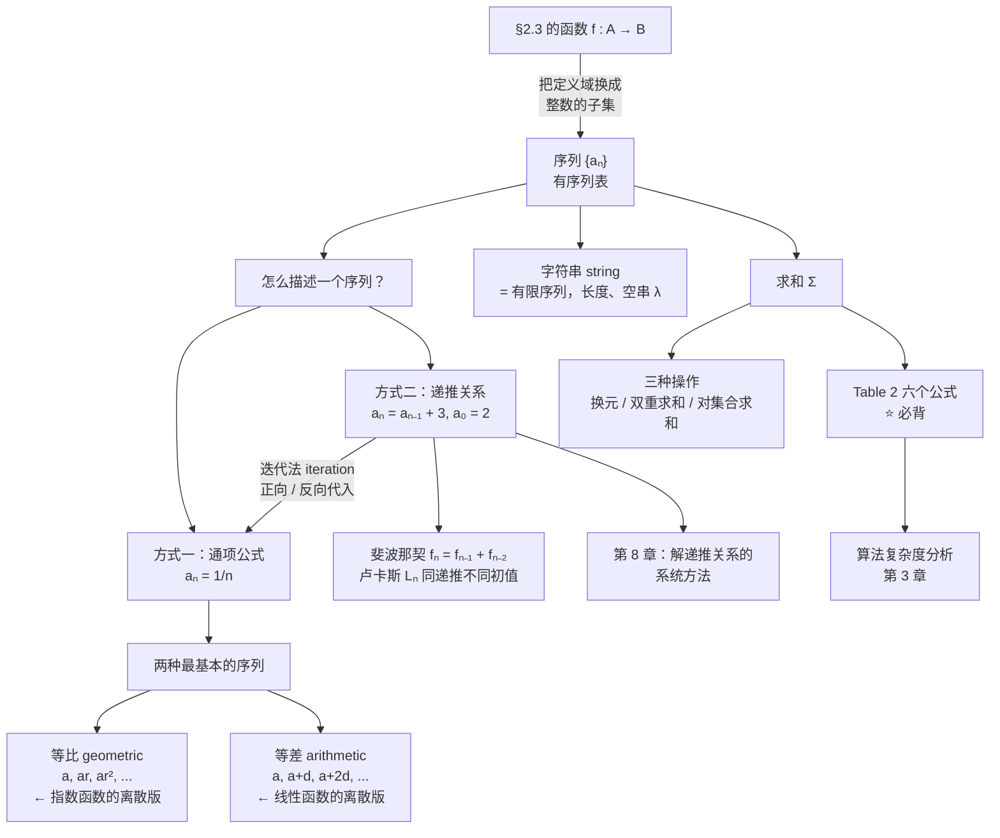

# C2.4 序列与求和 Sequences and Summations

> [!abstract] 这一讲的任务
> [[C2.3 函数 Functions]] 的定义 1 说"函数是一种指派"。这一讲把定义域换成**整数的一个子集**，得到的东西叫**序列 sequence**——也就是**有序列表**。
> 要做四件事：① 用**通项公式**和**递推关系**两种方式描述序列，并学会从递推关系**解出**通项（迭代法）；② 面对"前几项是 1,3,4,7,11,…"这种题，学会**猜**出规律；③ 掌握 $\sum$ 记号的全部操作（换元、双重求和、对集合求和）；④ 背熟 **Table 2 的六个求和公式**——这是算法复杂度分析里天天用的东西。

> [!info] 怎么读这份讲义
> 第 2 节（递推关系 + 迭代法）和第 5 节（求和公式表）是核心，其余可以读快一点。
> 第 3 节"猜序列"看似技巧性强，其实**课本给了一份固定的提问清单**，照着问一遍基本都能猜出来。
> 第 5.4 节的几何级数求和定理**证明过程本身是考点**（"错位相减"那一招）。



---

## 0. 开场：银行给你算利息

你往银行存 **10,000 元**，年利率 **11%**，**按年复利**。三十年后你有多少钱？

> [!question] 停一下，先自己想想
> 先别急着套公式。你只知道一件事：**每年年末的余额 = 上一年年末的余额 + 那一年的利息**。
> 把这句话写成式子。

写出来是：

$$P_n = P_{n-1} + 0.11\,P_{n-1} = 1.11\,P_{n-1}$$

配上起点 $P_0 = 10000$。

注意你写出来的**不是一个公式**，而是**一条"从上一项算下一项"的规则**。这种描述方式，就是这一讲的主角之一——**递推关系 recurrence relation**。

它足够算出答案吗？够——但你得算 30 次。有没有办法一步到位？有，这就是第 2.3 节要讲的**迭代法**。（剧透：答案是 $P_{30} = 1.11^{30}\times 10000 = \$228{,}922.97$，比本金翻了 22 倍。）

**你刚才做的，就是一次完整的序列建模**：把"随时间演化的量"写成一列数 $P_0, P_1, P_2,\ldots$，再用一条规则把相邻项连起来。

---

## 1. 序列是什么

> [!important] 定义 1（课本 DEFINITION 1）
> **序列 sequence** 是从**整数集的一个子集**（通常是 $\{0,1,2,\ldots\}$ 或 $\{1,2,3,\ldots\}$）到集合 $S$ 的**函数**。
> 用 $a_n$ 表示整数 $n$ 的像，称 $a_n$ 为序列的一个**项 term**。

**记号**：用 $\{a_n\}$ 表示整个序列。

> [!warning] ⭐ 记号冲突：$\{a_n\}$ 既像序列又像集合
> 课本明确提醒："序列记号 $\{a_n\}$ 与集合记号冲突。" 但**上下文总能区分**。
> 另外注意：**$a_n$ 是某一项，$\{a_n\}$ 是整个序列**，两者不要混用。
> 字母 $a$ 也只是习惯，用 $b, c, f, L, P$ 都行。

> [!note] 停一下：为什么把序列定义成函数
> 这不是故弄玄虚。把序列看成函数，立刻有三个好处：
> 1. **"第 $n$ 项"就是"函数在 $n$ 处的值"**——$a_n$ 和 $a(n)$ 是同一件事；
> 2. [[C2.3 函数 Functions]] 的全部语言可以直接用（定义域、值域、单射……）；
> 3. [[C2.5 集合的基数 Cardinality of Sets]] 会用到一条关键事实：**"能把一个集合的元素排成序列" = "存在从 $\mathbf Z^+$ 到它的一一对应" = 这个集合可数**。

**例 1**：$a_n = \dfrac1n$，从 $a_1$ 开始列出：
$$1,\ \tfrac12,\ \tfrac13,\ \tfrac14,\ \ldots$$

### 1.1 两种最基本的序列

> [!important] 定义 2（课本 DEFINITION 2）
> **等比数列 geometric progression** 是形如
> $$a,\ ar,\ ar^2,\ \ldots,\ ar^n,\ \ldots$$
> 的序列，其中**首项 initial term** $a$ 与**公比 common ratio** $r$ 是实数。

**Remark**：等比数列是**指数函数 $f(x)=ar^x$ 的离散版本**。

**例 2**（从 $n=0$ 开始）：

| 序列 | 通项 | 首项 $a$ | 公比 $r$ | 前几项 |
|---|---|:-:|:-:|---|
| $\{b_n\}$ | $b_n = (-1)^n$ | 1 | $-1$ | $1,-1,1,-1,1,\ldots$ |
| $\{c_n\}$ | $c_n = 2\cdot 5^n$ | 2 | 5 | $2,10,50,250,1250,\ldots$ |
| $\{d_n\}$ | $d_n = 6\cdot(1/3)^n$ | 6 | $1/3$ | $6,2,\tfrac23,\tfrac29,\tfrac2{27},\ldots$ |

> [!important] 定义 3（课本 DEFINITION 3）
> **等差数列 arithmetic progression** 是形如
> $$a,\ a+d,\ a+2d,\ \ldots,\ a+nd,\ \ldots$$
> 的序列，其中**首项** $a$ 与**公差 common difference** $d$ 是实数。

**Remark**：等差数列是**线性函数 $f(x) = dx+a$ 的离散版本**。

**例 3**（从 $n=0$ 开始）：

| 序列 | 通项 | 首项 | 公差 | 前几项 |
|---|---|:-:|:-:|---|
| $\{s_n\}$ | $s_n = -1+4n$ | $-1$ | $4$ | $-1,3,7,11,\ldots$ |
| $\{t_n\}$ | $t_n = 7-3n$ | $7$ | $-3$ | $7,4,1,-2,\ldots$ |

> [!important] ⭐ 速判窍门：拿到一串数先做两件事
> 1. **算相邻两项的差**——差恒定 $\Rightarrow$ 等差，$d$ 就是那个差；
> 2. **算相邻两项的比**——比恒定 $\Rightarrow$ 等比，$r$ 就是那个比。
>
> 这是第 3 节"猜序列"的第一招，也是命中率最高的一招。

### 1.2 字符串

> [!important] 课本正文
> 形如 $a_1, a_2,\ldots,a_n$ 的**有限序列**在计算机科学中称为**字符串 string**，也写作 $a_1a_2\ldots a_n$。
> 字符串的**长度 length** 是它的项数。**空串 empty string** 记作 $\lambda$，长度为零。

（[[C1.1 命题逻辑 Propositional Logic]] 里的**位串 bit string** 就是取值在 $\{0,1\}$ 的有限序列。）

**例 4**：`abcd` 是一个长度为 4 的字符串。

---

## 2. 递推关系：用"上一项"定义"这一项"

### 2.1 定义

> [!important] 定义 4（课本 DEFINITION 4）
> 序列 $\{a_n\}$ 的**递推关系 recurrence relation** 是一个把 $a_n$ 用**前面若干项** $a_0,a_1,\ldots,a_{n-1}$ 表示出来的等式，对一切 $n\ge n_0$ 成立（$n_0$ 是某个非负整数）。
> 若一个序列的各项满足该递推关系，就称它是该递推关系的一个**解 solution**。
> （递推关系也说成**递归地定义 recursively define** 一个序列，这个说法在第 5 章解释。）

**例 5**：$a_n = a_{n-1}+3$（$n\ge1$），$a_0 = 2$。求 $a_1,a_2,a_3$。
**解**：$a_1 = 2+3 = 5$，$a_2 = 5+3=8$，$a_3 = 8+3 = 11$。

**例 6**：$a_n = a_{n-1}-a_{n-2}$（$n\ge2$），$a_0=3, a_1=5$。求 $a_2, a_3$。
**解**：$a_2 = 5-3 = 2$，$a_3 = 2-5 = -3$。

> [!important] 初始条件 initial conditions
> **初始条件**是那些"递推关系还管不到"的项——即递推关系生效之前的项。
> 例 5 的初始条件是 $a_0=2$（**一个**，因为递推只回看一项）；
> 例 6 的初始条件是 $a_0=3, a_1=5$（**两个**，因为递推要回看两项）。
>
> 课本给了一个关键保证：**用数学归纳法（第 5 章）可以证明，递推关系连同它的初始条件唯一确定一个解。**

> [!warning] ⭐ 易错点：初始条件的个数必须配得上递推的"回看深度"
> 回看 $k$ 项的递推关系，就需要 **$k$ 个**初始条件。少一个，序列就定不下来；多一个，可能自相矛盾。
> **答题时先数递推式里出现了几个下标不同的"前项"**，再去数题目给了几个初值，两者不一致就要警惕。

### 2.2 斐波那契数列

> [!important] 定义 5（课本 DEFINITION 5）
> **斐波那契数列 Fibonacci sequence** $f_0, f_1, f_2,\ldots$ 由初始条件
> $$f_0 = 0,\qquad f_1 = 1$$
> 和递推关系
> $$f_n = f_{n-1}+f_{n-2}\qquad (n\ge 2)$$
> 定义。

**例 7**：
$$f_2 = 1+0 = 1,\quad f_3 = 1+1 = 2,\quad f_4 = 2+1 = 3,\quad f_5 = 3+2 = 5,\quad f_6 = 5+3 = 8$$

> [!note] 前后联系：斐波那契会再出现三次
> 课本页边注："**跳到第 8 章**去学怎么求斐波那契数的公式。"
> - **第 5 章**：用数学归纳法证明斐波那契数的各种恒等式，并给出斐波那契其人的传记；
> - **第 8 章**：用**特征方程法**解出通项（Binet 公式，含黄金比例 $\varphi = \frac{1+\sqrt5}2$），并用它建模**兔子种群增长**；
> - **算法课**：递归实现 $O(\varphi^n)$ vs 记忆化/迭代 $O(n)$，是讲"重叠子问题"的标准例子。

**例 8**：阶乘也可以写成递推。因为
$$n! = n\bigl((n-1)(n-2)\cdots2\cdot1\bigr) = n\cdot(n-1)! = n\,a_{n-1}$$
所以 $\{n!\}$ 满足 $a_n = n\,a_{n-1}$，初始条件 $a_1 = 1$。

### 2.3 验证一个序列是不是解

**例 9**：判断 $a_n = 3n$、$a_n = 2^n$、$a_n = 5$ 分别是否为递推关系 $a_n = 2a_{n-1}-a_{n-2}$（$n\ge2$）的解。

**解**（**做法就是代进去验**）：

- **$a_n = 3n$**：对 $n\ge2$，
 $$2a_{n-1}-a_{n-2} = 2\cdot3(n-1) - 3(n-2) = 6n-6-3n+6 = 3n = a_n$$
 ✓ **是解**。
- **$a_n = 2^n$**：$a_0=1, a_1=2, a_2=4$。而 $2a_1 - a_0 = 2\cdot2-1 = 3 \ne 4 = a_2$。
 ✗ **不是解**。
- **$a_n = 5$**（常数列）：$2a_{n-1}-a_{n-2} = 2\cdot5-5 = 5 = a_n$。
 ✓ **是解**。

> [!note] 停一下：为什么一个递推关系有多个解
> 因为**没给初始条件**。$a_n=3n$ 和 $a_n=5$ 都满足同一条递推关系，只是起点不同。
> **递推关系本身决定"形状"，初始条件决定"具体是哪一个"**——这和微分方程里"通解 vs 特解"是完全一样的结构。第 8 章会把这条类比讲透。

### 2.4 ⭐ 迭代法：把递推关系解成通项

当我们找到序列各项的**显式公式**（称为**闭式 closed formula**）时，就说我们**解出**了这个递推关系连同初始条件。

课本这里介绍一个直接的方法：**迭代 iteration**。它有两个方向。

**例 10**：解例 5 的递推关系（$a_n = a_{n-1}+3$，$a_1 = 2$）。

**方法一：正向代入 forward substitution**（从初值往上爬）

$$\begin{aligned}
a_2 &= 2+3\\
a_3 &= (2+3)+3 = 2+3\cdot2\\
a_4 &= (2+2\cdot3)+3 = 2+3\cdot3\\
&\ \vdots\\
a_n &= a_{n-1}+3 = \bigl(2+3(n-2)\bigr)+3 = 2+3(n-1)
\end{aligned}$$

**方法二：反向代入 backward substitution**（从 $a_n$ 往下退到初值）

$$\begin{aligned}
a_n &= a_{n-1}+3\\
&= (a_{n-2}+3)+3 = a_{n-2}+3\cdot2\\
&= (a_{n-3}+3)+3\cdot2 = a_{n-3}+3\cdot3\\
&\ \vdots\\
&= a_2+3(n-2) = (a_1+3)+3(n-2) = 2+3(n-1)
\end{aligned}$$

**两条路给出同一个闭式**：
$$\boxed{a_n = 2+3(n-1)}$$

**课本的直观解释**：每迭代一次加 3，从 $a_1$ 走到 $a_n$ 要迭代 $n-1$ 次，所以总共加了 $3(n-1)$。注意这个结果**正是一个等差数列**（首项 2，公差 3）。

> [!warning] ⭐ 课本亲自点出的严谨性问题
> **"注意，使用迭代法时我们本质上是在**猜**一个通项公式。要证明猜测正确，需要用数学归纳法"**（第 5 章的技术）。
> 也就是说，迭代法**推出**公式，归纳法**证明**公式。考试中如果题目只要求"求通项"，迭代法就够；如果要求"证明"，必须补归纳法这一步。

**例 11（开场的复利问题）**：$P_n = 1.11\,P_{n-1}$，$P_0 = 10000$。

$$\begin{aligned}
P_1 &= 1.11\,P_0\\
P_2 &= 1.11\,P_1 = (1.11)^2P_0\\
P_3 &= (1.11)^3P_0\\
&\ \vdots\\
P_n &= (1.11)^nP_0
\end{aligned}$$

代入 $P_0 = 10000$ 得 $P_n = (1.11)^n\cdot10000$，于是

$$P_{30} = (1.11)^{30}\cdot10000 = \boxed{\$228{,}922.97}$$

（已用程序验算：$1.11^{30}\times10000 = 228922.97$ ✓）

> [!important] 两种迭代模式（**这是最值得带走的一条规律**）
> | 递推形状 | 迭代后 | 结果类型 |
> |---|---|---|
> | $a_n = a_{n-1} + d$（**每次加**） | 加了 $n$ 次 $d$ | **等差**：$a_n = a_0+nd$ |
> | $a_n = r\,a_{n-1}$（**每次乘**） | 乘了 $n$ 次 $r$ | **等比**：$a_n = a_0r^n$ |
>
> 复利、人口增长、放射性衰变、二分查找的区间长度，全都是第二种。

---

## 3. 从前几项猜出规律

离散数学里一个常见的任务是：只给出序列的前几项，要你找出闭式、递推关系或某种构造规则。

> [!warning] 先说清楚这件事的逻辑地位
> 课本说得很明确："**序列的前几项并不能决定整个序列**（毕竟有无穷多个序列以任何给定的有限个初始项开头）。"
> 所以这类题严格来说**不是"推出"而是"作出一个有根据的猜想 educated conjecture**"，然后再设法验证。
> **答题时写"一个可能的公式是……"比写"该序列的公式是……"更准确。**

### 3.1 ⭐ 课本给的提问清单

> [!important] 拿到一串数，按顺序问这五个问题
> 1. **有没有连续重复的值？**（同一个值连着出现很多次）
> 2. **每一项是不是由前一项加上某个量得到的？**（那个量是常数，还是依赖于位置？）
> 3. **每一项是不是由前一项乘以某个量得到的？**
> 4. **每一项是不是由前面若干项以某种方式组合得到的？**
> 5. **项之间有没有周期循环？**

**例 12**：求下列序列的公式。

| 前五项 | 观察 | 公式 | 类型 |
|---|---|---|---|
| $1,\tfrac12,\tfrac14,\tfrac18,\tfrac1{16}$ | 分母是 2 的幂 | $a_n = 1/2^n$（$n\ge0$） | 等比，$a=1,r=\tfrac12$ |
| $1,3,5,7,9$ | 每项加 2 | $a_n = 2n+1$（$n\ge0$） | 等差，$a=1,d=2$ |
| $1,-1,1,-1,1$ | 正负交替 | $a_n = (-1)^n$（$n\ge0$） | 等比，$a=1,r=-1$ |

**例 13**：前 10 项是 $1,2,2,3,3,3,4,4,4,4$。
**解**：**整数 $n$ 恰好出现 $n$ 次**（问题 1 命中）。所以接下来是五个 5、六个 6，依此类推。

**例 14**：前 10 项是 $5,11,17,23,29,35,41,47,53,59$。
**解**：相邻差恒为 6（问题 2 命中）。从 5 开始加 $n-1$ 次 6：
$$a_n = 5+6(n-1) = \boxed{6n-1}$$
（等差数列，$a=5$，$d=6$。）

**例 15**：前 10 项是 $1,3,4,7,11,18,29,47,76,123$。
**解**：从第三项起，每项是前两项之和（问题 4 命中）：$4=3+1$，$7=4+3$，$11=7+4$……
$$L_n = L_{n-1}+L_{n-2},\qquad L_1 = 1,\ L_2 = 3$$
这叫 **卢卡斯数列 Lucas sequence**，以法国数学家 **François Édouard Lucas** 命名。他在 19 世纪研究了这个数列和斐波那契数列。

> [!warning] ⭐ 斐波那契 vs 卢卡斯：同一条递推，不同的初值
> $$f_n = f_{n-1}+f_{n-2},\quad f_0=0,f_1=1 \qquad L_n = L_{n-1}+L_{n-2},\quad L_1=1,L_2=3$$
> **递推关系完全相同，只有初始条件不同。** 这再一次说明第 2.3 节的话：递推定形状，初值定身份。

（已验算：$L$ 从 $1,3$ 出发确实给出 $1,3,4,7,11,18,29,47,76,123$ ✓）

### 3.2 和已知序列对照

另一个技巧是**拿手上的序列去和常见整数序列比对**。

> [!important] TABLE 1 一些有用的序列（课本原表，建议看熟前 10 项的量级）
>
| 第 $n$ 项 | 前 10 项 |
|:-:|---|
| $n^2$ | 1, 4, 9, 16, 25, 36, 49, 64, 81, 100, … |
| $n^3$ | 1, 8, 27, 64, 125, 216, 343, 512, 729, 1000, … |
| $n^4$ | 1, 16, 81, 256, 625, 1296, 2401, 4096, 6561, 10000, … |
| $2^n$ | 2, 4, 8, 16, 32, 64, 128, 256, 512, 1024, … |
| $3^n$ | 3, 9, 27, 81, 243, 729, 2187, 6561, 19683, 59049, … |
| $n!$ | 1, 2, 6, 24, 120, 720, 5040, 40320, 362880, 3628800, … |
| $f_n$ | 1, 1, 2, 3, 5, 8, 13, 21, 34, 55, 89, … |

**例 16**：前 10 项是 $1,7,25,79,241,727,2185,6559,19681,59047$，猜一个简单公式。

**课本的思路（很值得学）**：
1. 先看**差**——看不出规律；
2. 再看**比**——虽然不是常数，但**接近 3**；
3. 于是怀疑公式里含 $3^n$；
4. 和 Table 1 里 $3^n$ 那一行逐项比对：$3,9,27,81,243,\ldots$——**每一项恰好比它小 2**！
5. 猜测 $a_n = 3^n - 2$，并验证 $1\le n\le 10$ 全部吻合。

（已验算：$3^n-2$ 对 $n=1..10$ 给出 $1,7,25,79,241,727,2185,6559,19681,59047$ ✓）

> [!important] ⭐ 这个"三步法"值得背下来
> **① 看差 → ② 看比 → ③ 和标准序列做加减**。
> 差不行看比，比接近某个数就往指数上想，然后**逐项相减看差多少**。大部分这类题都在这三步内解决。

> [!note] 实用工具：OEIS
> 课本推荐：**On-Line Encyclopedia of Integer Sequences (OEIS)**，由 **Neil Sloane** 于 1960 年代创建的整数序列数据库，收录**超过 20 万条**序列（课本注：最后一版纸质书出版于 1995 年；按当前规模印出来要超过 **750 卷**，且每年有一万多条新提交）。
> 网站上有程序：**输入前几项，它帮你找出匹配的序列**。做题卡住时可以查，但**考试要靠上面的三步法**。
>
> 课本还提到：整数序列出现在生物、工程、化学、物理乃至益智题里，远不止离散数学。

> [!note] 人物卡：Neil Sloane（1939–）
> 在澳大利亚墨尔本大学读数学和电子工程，学费来自州电话公司的奖学金，暑假打工内容包括**架电线杆**。后赴康奈尔大学，博士论文做的是今天所说的**神经网络**。1969 年进入贝尔实验室，研究网络设计、**编码理论**和**球堆积**。
> 他最喜欢的问题之一是他自己起名的 **kissing problem（接触数问题）**：$n$ 维空间里最多能有多少个等大的球同时接触中心的那个球？（二维是 6——六枚硬币围住中间一枚；三维是 12。）他与 Odlyzko 证明了 8 维和 24 维的最优接触数分别是 **240** 和 **196,560**。
> 他还写过一本**新泽西攀岩指南**，收录 50 多处攀岩点。

---

## 4. 求和记号

### 4.1 记号与术语

对序列 $\{a_n\}$ 中的 $a_m, a_{m+1},\ldots,a_n$ 求和，记作

$$\sum_{j=m}^{n} a_j \qquad\text{或}\qquad \sum_{j\,=\,m}^{n} a_j \qquad\text{或}\qquad \sum_{m\le j\le n} a_j$$

读作"**从 $j=m$ 到 $j=n$ 对 $a_j$ 求和**"，表示 $a_m + a_{m+1}+\cdots+a_n$。

**术语**：
- $j$ 称为**求和指标 index of summation**，用哪个字母**完全任意**：
 $$\sum_{j=m}^{n}a_j = \sum_{i=m}^{n}a_i = \sum_{k=m}^{n}a_k$$
- $m$ 是**下限 lower limit**，$n$ 是**上限 upper limit**；
- 大写希腊字母 $\Sigma$（sigma）表示求和。

> [!important] 求和的线性性质（课本正文）
> $$\sum_{j=1}^{n}(a x_j + b y_j) = a\sum_{j=1}^{n}x_j + b\sum_{j=1}^{n}y_j$$
> 其中 $a,b$ 是实数。
> **课本说明**：这里不给形式证明；严格证明要用数学归纳法（第 5 章），并用到加法的交换律、结合律以及乘法对加法的分配律。
>
> **实用含义**：**常数可以提到 $\Sigma$ 外面，和可以拆开**。这是化简求和式的第一招。

**例 17**：用求和记号表示 $\{a_j\}$（$a_j = 1/j$）前 100 项之和：
$$\sum_{j=1}^{100}\frac1j$$

**例 18**：$\displaystyle\sum_{j=1}^{5}j^2 = 1+4+9+16+25 = 55$

**例 19**：$\displaystyle\sum_{k=4}^{8}(-1)^k = (-1)^4+(-1)^5+(-1)^6+(-1)^7+(-1)^8 = 1-1+1-1+1 = 1$

### 4.2 换元（平移求和指标）

有时需要**改变求和指标的范围**（常见于两个求和式的指标对不齐、要合并的时候）。

> [!warning] 换元的铁律
> **改了指标，就必须同步改被加项 summand。** 这是唯一的易错点。

**例 20**：把 $\displaystyle\sum_{j=1}^{5}j^2$ 改成指标从 0 到 4。

**解**：令 $k = j-1$。
- **新范围**：$j=1$ 时 $k=0$；$j=5$ 时 $k=4$。故 $k: 0\to4$。
- **新被加项**：$j = k+1$，故 $j^2$ 变成 $(k+1)^2$。

$$\sum_{j=1}^{5}j^2 = \sum_{k=0}^{4}(k+1)^2$$

**验证**：两边都是 $1+4+9+16+25 = 55$ ✓

> [!important] 换元三步法
> 1. 写出**代换关系**（如 $k=j-1$，即 $j = k+1$）；
> 2. **换范围**：把上下限代进代换关系；
> 3. **换被加项**：把 $j$ 全部替换成 $k$ 的表达式。
>
> **做完一定代 1–2 项验算**，这一步花 10 秒能救一整道题。

### 4.3 双重求和

课本说：**双重求和在很多场合出现（比如分析计算机程序里的嵌套循环）**。

**例 21**：计算 $\displaystyle\sum_{i=1}^{4}\sum_{j=1}^{3}ij$。

**解**：**先展开内层，再算外层**。

$$\begin{aligned}
\sum_{i=1}^{4}\sum_{j=1}^{3}ij &= \sum_{i=1}^{4}(i + 2i + 3i)\\
&= \sum_{i=1}^{4}6i\\
&= 6+12+18+24 = \boxed{60}
\end{aligned}$$

> [!note] 专业关联：双重求和 = 二重循环的步数
> ```python
> for i in range(1, 5):
>     for j in range(1, 4):
>         total += i * j      # 执行了 4 × 3 = 12 次
> ```
> **算法复杂度分析本质上就是在算双重（多重）求和**。
> 比如冒泡排序的比较次数是 $\displaystyle\sum_{i=1}^{n-1}\sum_{j=1}^{n-i}1 = \sum_{i=1}^{n-1}(n-i) = \frac{n(n-1)}2$——用的正是下面 Table 2 的第二个公式。

### 4.4 对集合求和

也可以让指标跑遍一个**集合**的全部元素：

$$\sum_{s\in S} f(s)$$

表示 $f(s)$ 对 $S$ 的所有成员 $s$ 求和。

**例 22**：$\displaystyle\sum_{s\in\{0,2,4\}} s = 0+2+4 = 6$

### 4.5 连乘记号

与求和平行，**乘积**有自己的记号：

$$\prod_{j=m}^{n} a_j = a_m\,a_{m+1}\cdots a_n$$

读作"从 $j=m$ 到 $j=n$ 对 $a_j$ 求积"。

**用连乘表示阶乘**（课本习题 44）：
$$n! = \prod_{j=1}^{n} j$$

> [!example] 手算（课本习题 43）
> $\displaystyle\prod_{i=0}^{10} i = 0$ ——**注意第一项就是 0**，整个乘积为 0。（这是个陷阱题。）
> $\displaystyle\prod_{i=5}^{8} i = 5\cdot6\cdot7\cdot8 = 1680$
> $\displaystyle\prod_{j=0}^{4} j! = 0!\cdot1!\cdot2!\cdot3!\cdot4! = 1\cdot1\cdot2\cdot6\cdot24 = 288$（课本习题 46）

---

## 5. 求和公式：本讲最该背的东西

### 5.1 几何级数求和定理

> [!important] 定理 1（课本 THEOREM 1）
> 若 $a, r$ 是实数且 $r\ne 0$，则
> $$\sum_{j=0}^{n} ar^j = \begin{cases}\dfrac{ar^{n+1}-a}{r-1}, & r\ne1\\[2mm] (n+1)a, & r = 1\end{cases}$$

> [!important] ⭐ 证明（"错位相减"，**过程本身是考点**）
> 记 $S_n = \displaystyle\sum_{j=0}^{n}ar^j$。两边同乘 $r$：
>
> $$\begin{aligned}
> rS_n &= r\sum_{j=0}^{n}ar^j && \text{代入 } S_n \text{ 的表达式}\\
> &= \sum_{j=0}^{n}ar^{j+1} && \text{分配律（把 }r\text{ 乘进去）}\\
> &= \sum_{k=1}^{n+1}ar^{k} && \textbf{换元 } k=j+1\\
> &= \left(\sum_{k=0}^{n}ar^k\right) + (ar^{n+1}-a) && \text{去掉 }k=n{+}1\text{ 项、补上 }k=0\text{ 项}\\
> &= S_n + (ar^{n+1}-a)
> \end{aligned}$$
>
> 于是 $rS_n = S_n + (ar^{n+1}-a)$，即 $(r-1)S_n = ar^{n+1}-a$。
> 当 $r\ne1$ 时两边除以 $r-1$：
> $$S_n = \frac{ar^{n+1}-a}{r-1}$$
> 当 $r=1$ 时，$S_n = \displaystyle\sum_{j=0}^{n}a = (n+1)a$。$\blacksquare$

> [!note] 停一下，这个证明的精髓在哪
> 精髓在**第三步的换元**：乘以 $r$ 之后每一项的指数都升了 1，**换元让它变回原来的样子，只是范围平移了一格**。
> 于是 $rS_n$ 和 $S_n$ **只差首尾两项**，一减就把中间的无穷麻烦全消掉了。
> 这招在数学里叫**望远镜求和 telescoping**（第 8 章还会大量使用），也是"生成函数"的雏形。**务必自己动手推一遍。**

> [!warning] 易错点：项数是 $n+1$ 不是 $n$
> $\sum_{j=0}^{n}$ 从 $j=0$ 开始，一共有 **$n+1$ 项**。所以 $r=1$ 时结果是 $(n+1)a$ 而不是 $na$。
> **上下限含端点，项数 = 上限 − 下限 + 1**。这个"差一错误 off-by-one"是本讲最常见的失分点。

### 5.2 ⭐ TABLE 2 常用求和公式（必背）

> [!important] TABLE 2 Some Useful Summation Formulae（课本原表）
>
> | 求和式 | 闭式 |
> |---|---|
> | $\displaystyle\sum_{k=0}^{n}ar^k \quad (r\ne0)$ | $\dfrac{ar^{n+1}-a}{r-1},\quad r\ne1$ |
> | $\displaystyle\sum_{k=1}^{n}k$ | $\dfrac{n(n+1)}{2}$ |
> | $\displaystyle\sum_{k=1}^{n}k^2$ | $\dfrac{n(n+1)(2n+1)}{6}$ |
> | $\displaystyle\sum_{k=1}^{n}k^3$ | $\dfrac{n^2(n+1)^2}{4}$ |
> | $\displaystyle\sum_{k=0}^{\infty}x^k \quad (\lvert x\rvert<1)$ | $\dfrac{1}{1-x}$ |
> | $\displaystyle\sum_{k=1}^{\infty}kx^{k-1}\quad(\lvert x\rvert<1)$ | $\dfrac{1}{(1-x)^2}$ |

课本说明：第一个公式就是定理 1；接下来三个是前 $n$ 个正整数的和、平方和、立方和，可以用多种方法推出（习题 37、38），而且**一旦知道结论，用数学归纳法（§5.1）很容易证明**；最后两个涉及无穷级数，马上讨论。

> [!important] 记忆辅助
> - $\sum k = \dfrac{n(n+1)}2$：高斯的"首尾配对"——$n$ 项，每对和为 $n+1$，共 $n/2$ 对。
> - $\sum k^3 = \left(\dfrac{n(n+1)}2\right)^2 = \left(\sum k\right)^2$ ⭐ **立方和等于和的平方**，这个漂亮的巧合很好记。
> - $\sum k^2$ 只能硬记 $\dfrac{n(n+1)(2n+1)}6$。**检验法**：$n=1$ 时应得 1（$\frac{1\cdot2\cdot3}6 = 1$ ✓），$n=2$ 时应得 5（$\frac{2\cdot3\cdot5}6=5$ ✓）。
>
> **每次用公式前花 5 秒代 $n=1$ 或 $n=2$ 验一下**，能挡住绝大多数记忆偏差。

### 5.3 用公式做题：区间求和的拆分

**例 23**：求 $\displaystyle\sum_{k=50}^{100}k^2$。

**解**：**关键一步**——公式只覆盖"从 1 开始"的求和，所以先补齐再相减：

$$\sum_{k=1}^{100}k^2 = \sum_{k=1}^{49}k^2 + \sum_{k=50}^{100}k^2 \implies \sum_{k=50}^{100}k^2 = \sum_{k=1}^{100}k^2 - \sum_{k=1}^{49}k^2$$

代入公式：
$$= \frac{100\cdot101\cdot201}{6} - \frac{49\cdot50\cdot99}{6} = 338{,}350 - 40{,}425 = \boxed{297{,}925}$$

（已用程序验算：$\sum_{k=50}^{100}k^2 = 297925$ ✓）

> [!warning] ⭐⭐ 上限是 **49** 不是 50
> 要减掉的是 $k=1,\ldots,49$ 这些项，**$k=50$ 那一项是要保留的**。写成 $\sum_{k=1}^{50}$ 就把它误删了。
> **口诀：减到"下限减 1"。** 这是本讲第二大失分点（第一大是项数的差一错误）。

### 5.4 两个无穷级数

**例 24（需要微积分）**：设 $\lvert x\rvert<1$，求 $\displaystyle\sum_{n=0}^{\infty}x^n$。

**解**：由定理 1（取 $a=1$，$r=x$），部分和为
$$\sum_{n=0}^{k}x^n = \frac{x^{k+1}-1}{x-1}$$
因为 $\lvert x\rvert<1$，当 $k\to\infty$ 时 $x^{k+1}\to0$，故
$$\sum_{n=0}^{\infty}x^n = \lim_{k\to\infty}\frac{x^{k+1}-1}{x-1} = \frac{0-1}{x-1} = \boxed{\frac{1}{1-x}}$$

**例 25（需要微积分）**：对例 24 的等式**两边求导**：

$$\frac{d}{dx}\sum_{k=0}^{\infty}x^k = \frac{d}{dx}\frac{1}{1-x} \implies \sum_{k=1}^{\infty}kx^{k-1} = \boxed{\frac{1}{(1-x)^2}}$$

（课本注：由无穷级数的一个定理，当 $\lvert x\rvert<1$ 时这样逐项求导是合法的。）

> [!important] 课本给的方法论
> **"我们可以通过对已有的求和公式求导或积分，来产生新的求和公式。"**
> 这是**生成函数 generating function** 方法的雏形——第 8 章会把它发展成解递推关系和计数问题的强力工具。
> 现在只要记住：$\frac1{1-x}$ 和 $\frac1{(1-x)^2}$ 是一对，后者是前者求导来的。

---

## 这一讲的三句话

1. **序列就是定义域为整数子集的函数**；描述它有两条路——**通项公式**（直接）和**递推关系 + 初始条件**（间接），**迭代法**负责把后者变成前者，但严格证明要靠第 5 章的数学归纳法。
2. **猜序列有固定套路**：先看差（等差）、再看比（等比）、再和 $n^2,n^3,2^n,3^n,n!,f_n$ 这些标准序列做加减；**递推关系定形状，初始条件定身份**（斐波那契与卢卡斯就差在初值上）。
3. **Table 2 的六个公式必须背熟**，用时注意两个坑：**项数的差一错误**（$\sum_{j=0}^n$ 有 $n+1$ 项）和**区间求和要减到下限减 1**；几何级数的"乘 $r$ 再相减"是后面反复要用的技术。

### 速查表

| 对象 | 形式 | 通项/闭式 |
|---|---|---|
| 等差数列 | $a_n = a_{n-1}+d$ | $a_n = a_0+nd$ |
| 等比数列 | $a_n = r\,a_{n-1}$ | $a_n = a_0r^n$ |
| 斐波那契 | $f_n=f_{n-1}+f_{n-2}$，$f_0=0,f_1=1$ | 0,1,1,2,3,5,8,13,… |
| 卢卡斯 | $L_n=L_{n-1}+L_{n-2}$，$L_1=1,L_2=3$ | 1,3,4,7,11,18,29,… |
| 几何级数 | $\sum_{k=0}^n ar^k$ | $\dfrac{ar^{n+1}-a}{r-1}$（$r\ne1$） |
| 自然数和 | $\sum_{k=1}^n k$ | $\dfrac{n(n+1)}2$ |
| 平方和 | $\sum_{k=1}^n k^2$ | $\dfrac{n(n+1)(2n+1)}6$ |
| 立方和 | $\sum_{k=1}^n k^3$ | $\left(\dfrac{n(n+1)}2\right)^2$ |
| 无穷几何 | $\sum_{k=0}^\infty x^k$（$\lvert x\rvert<1$） | $\dfrac1{1-x}$ |
| 其导数 | $\sum_{k=1}^\infty kx^{k-1}$ | $\dfrac1{(1-x)^2}$ |

### 下一讲预告

本讲第 1 节说过：**"能把一个集合的元素排成序列"**，是一件很强的性质。
下一讲要问一个听起来很疯狂的问题：**整数和正整数，哪个多？有理数和正整数呢？实数呢？**
答案会颠覆直觉——前两个问题的答案都是"**一样多**"，但最后一个是"**实数严格更多**"。而且 [[C2.3 函数 Functions]] 第 4.2 节埋的那个雷（无限集上"单射 $\ne$ 满射"）会在那里彻底引爆。
下一讲：[[C2.5 集合的基数 Cardinality of Sets]]。

---

## 本节自测 Self-Test

> [!question] 1. 设 $a_n = a_{n-1}-5$（$n\ge1$），$a_0 = 3$。求 $a_n$ 的闭式。（课本复习题 13 型）
> > [!success]- 答案
> > 每次减 5，从 $a_0$ 到 $a_n$ 迭代 $n$ 次：
> > $$a_n = 3 - 5n$$
> > **验算**：$a_0 = 3$ ✓，$a_1 = -2 = 3-5$ ✓，$a_2 = -7$ ✓。
> > （这是首项 3、公差 $-5$ 的等差数列。）

> [!question] 2. 判断 $a_n = 3\cdot2^n$ 是否为递推关系 $a_n = 3a_{n-1}-2a_{n-2}$ 的解。
> > [!success]- 答案
> > 代入右边：
> > $$3a_{n-1}-2a_{n-2} = 3\cdot3\cdot2^{n-1} - 2\cdot3\cdot2^{n-2} = 9\cdot2^{n-1} - 3\cdot2^{n-1} = 6\cdot 2^{n-1} = 3\cdot2^n = a_n$$
> > ✓ **是解**。
> > （注意化简时把 $2\cdot 2^{n-2} = 2^{n-1}$，统一成 $2^{n-1}$ 再合并。）

> [!question] 3. 求 $\displaystyle\sum_{k=1}^{n}(2k-1)$（前 $n$ 个正奇数之和），并说明结果的几何意义。
> > [!success]- 答案
> > $$\sum_{k=1}^{n}(2k-1) = 2\sum_{k=1}^{n}k - \sum_{k=1}^n 1 = 2\cdot\frac{n(n+1)}2 - n = n^2+n-n = \boxed{n^2}$$
> > **验算**：$n=3$：$1+3+5 = 9 = 3^2$ ✓
> > **几何意义**：$n\times n$ 的正方形可以被拆成 $n$ 个"L 形"，第 $k$ 个 L 形含 $2k-1$ 个小方格。**前 $n$ 个奇数之和 = 第 $n$ 个完全平方数。**

> [!question] 4. 求 $\displaystyle\sum_{j=0}^{8}3\cdot2^j$。
> > [!success]- 答案
> > 几何级数，$a=3$，$r=2$，$n=8$：
> > $$\sum_{j=0}^{8}3\cdot2^j = \frac{3\cdot2^{9}-3}{2-1} = 3\cdot512 - 3 = \boxed{1533}$$
> > **验算**：$3(1+2+4+\cdots+256) = 3\cdot511 = 1533$ ✓（$2^9-1 = 511$）
> > **注意**：$j$ 从 0 到 8 共 **9 项**，所以指数是 $n+1 = 9$。

> [!question] 5. 把 $\displaystyle\sum_{k=3}^{10}(k-2)^2$ 改写成从 $j=1$ 开始的求和，并求值。
> > [!success]- 答案
> > **换元**：令 $j = k-2$。$k=3\Rightarrow j=1$；$k=10\Rightarrow j=8$；被加项 $(k-2)^2 = j^2$。
> > $$\sum_{k=3}^{10}(k-2)^2 = \sum_{j=1}^{8}j^2 = \frac{8\cdot9\cdot17}{6} = \boxed{204}$$
> > **验算**：$1+4+9+16+25+36+49+64 = 204$ ✓

> [!question] 6. 求 $\displaystyle\sum_{i=1}^{3}\sum_{j=1}^{2}(i+j)$。
> > [!success]- 答案
> > **先内后外**：
> > $$\sum_{j=1}^{2}(i+j) = (i+1)+(i+2) = 2i+3$$
> > $$\sum_{i=1}^{3}(2i+3) = 5+7+9 = \boxed{21}$$
> > **验算（直接展开 6 项）**：$(1{+}1)+(1{+}2)+(2{+}1)+(2{+}2)+(3{+}1)+(3{+}2) = 2+3+3+4+4+5 = 21$ ✓

> [!question] 7. 猜一个公式：$8, 14, 32, 86, 248, \ldots$，并求接下来三项。（课本复习题 12）
> > [!success]- 答案
> > **看差**：$6, 18, 54, 162$——差本身是等比的（公比 3）！
> > **看比**：$14/8 = 1.75$，$32/14\approx2.29$，$86/32\approx2.69$，$248/86\approx2.88$——**越来越接近 3**。
> > 于是怀疑含 $3^n$，和 $3^n$ 比对：$3,9,27,81,243$，发现每项比它大 5：
> > $$a_n = 3^n + 5\qquad (n\ge1)$$
> > **验算**：$3+5=8$ ✓，$9+5=14$ ✓，$27+5=32$ ✓，$81+5=86$ ✓，$243+5=248$ ✓
> > **接下来三项**：$3^6+5 = \boxed{734}$，$3^7+5 = \boxed{2192}$，$3^8+5=\boxed{6566}$。

> [!question] 8. 一名员工起薪 50,000 美元，此后每年年末加薪 1000 美元加上上一年薪水的 5%。$n$ 年后的薪水递推关系是什么？（课本习题 54 型）
> > [!success]- 答案
> > 设 $S_n$ 为第 $n$ 年的薪水：
> > $$S_n = S_{n-1} + 0.05\,S_{n-1} + 1000 = 1.05\,S_{n-1}+1000,\qquad S_0 = 50000$$
> > **这是"乘 + 加"混合型的递推**（既不是纯等差也不是纯等比）。
> > 迭代一下看看形状：
> > $$S_n = 1.05^n\cdot50000 + 1000(1.05^{n-1}+1.05^{n-2}+\cdots+1)$$
> > 后半部分是**几何级数**，用定理 1：
> > $$S_n = 1.05^n\cdot50000 + 1000\cdot\frac{1.05^n-1}{0.05} = 1.05^n\cdot50000+20000(1.05^n-1)$$
> > $$= \boxed{70000\cdot1.05^n - 20000}$$
> > **验算** $n=0$：$70000-20000 = 50000$ ✓；$n=1$：$70000\cdot1.05-20000 = 73500-20000 = 53500$，而直接算 $50000\cdot1.05+1000 = 53500$ ✓
> > **要点**：$a_n = ra_{n-1}+c$ 这种"线性非齐次"递推，迭代后一定会出现一个几何级数——**这是第 8 章系统方法的引子**。

---

**上一节** ← [[C2.3 函数 Functions]]
**下一节** → [[C2.5 集合的基数 Cardinality of Sets]]
**本章索引** → [[C2 基本结构：集合、函数、序列、求和与矩阵 MOC]]
