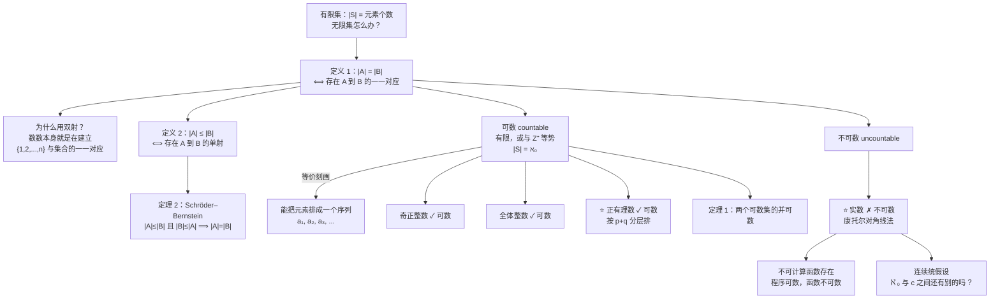

# C2.5 集合的基数 Cardinality of Sets

> [!abstract] 这一讲的任务
> [[C2.1 集合 Sets]] 定义了有限集的基数 $|S|$，然后留了一句"无限集留到 §2.5"。现在到了。
> 这一讲要回答一个听起来不该有答案的问题：**两个无限集，能比大小吗？**
> 答案是能，而且结论**非常反直觉**：整数和正整数**一样多**；有理数和正整数也**一样多**（尽管有理数在数轴上稠密得到处都是）；但**实数严格更多**。
> 更厉害的是，这套工具还能推出一个计算机科学的硬结论：**存在任何程序都算不出来的函数**。这是本讲真正的高潮。

> [!info] 怎么读这份讲义
> 这一讲**页数最少但思想密度最高**。第 2 节（希尔伯特饭店）是直觉，第 3 节（有理数可数）和第 4 节（对角线法）是两个必须完全掌握的证明，第 6 节（不可计算函数）是应用。
> 第 7 节连续统假设属于"知道有这回事"的层次，理解不了不影响做题。
> 建议**第 4 节的对角线法自己在纸上重做一遍**——它是整个理论计算机科学最常用的证明技术。

---

## 0. 开场：幼儿园老师怎么数数

一个三岁小孩还不会背"1,2,3,4,5"，但老师可以让他判断**糖果和小朋友哪个多**：

> 每个小朋友发一颗糖。
> - 糖发完了还有小朋友空手 → **小朋友多**；
> - 小朋友都拿到了还剩糖 → **糖多**；
> - 正好一人一颗、不多不少 → **一样多**。

注意：**全程没有数数。**

> [!question] 停一下，先自己想想
> "正好一人一颗、不多不少"——用 [[C2.3 函数 Functions]] 的语言，这句话说的是什么？

说的是：从小朋友集合到糖果集合的这个函数，**既是单射**（不同小朋友拿不同的糖，没重复发）**又是满射**（每颗糖都被拿走，没剩）——也就是**一一对应（双射）**。

**这就是本讲的全部基础**。"一样多"这个概念，本来就不需要先会数数；它只需要**能不能配对**。

而配对这件事，**对无限集同样做得到**。于是我们就有办法比较两个无限集的大小了——哪怕永远数不完。

---

## 1. 定义：用双射定义"一样大"

> [!important] 定义 1（课本 DEFINITION 1）
> 集合 $A$ 与 $B$ 有**相同的基数 same cardinality**，当且仅当存在从 $A$ 到 $B$ 的**一一对应（双射）**。此时记 $\lvert A\rvert = \lvert B\rvert$。

> [!note] 课本对这个定义的重要说明
> **"对无限集而言，基数的定义提供的是两个集合大小的**相对**度量，而不是某一个集合大小的度量。"**
> 也就是说，$\lvert A\rvert = \lvert B\rvert$ 是一个**关系**，不是说 $\lvert A\rvert$ 单独等于某个数。
> 这个定义对有限集也成立——[[C2.3 函数 Functions]] 习题 79 说明：**元素个数相同的两个有限集之间必有一一对应**。所以定义 1 是对有限情形的**推广**，不是另起炉灶。

> [!important] 定义 2（课本 DEFINITION 2）
> 若存在从 $A$ 到 $B$ 的**单射**，则说 $A$ 的基数**小于等于** $B$ 的基数，记 $\lvert A\rvert \le \lvert B\rvert$。
> 若 $\lvert A\rvert\le\lvert B\rvert$ 且两者基数**不同**，则说 $A$ 的基数**小于** $B$ 的基数，记 $\lvert A\rvert<\lvert B\rvert$。

> [!note] 为什么 $\le$ 用单射
> 单射的意思是"$A$ 能被**塞进** $B$ 里而不发生碰撞"——$B$ 里有足够的位置安置 $A$ 的每个元素。
> 这正是"$A$ 不比 $B$ 大"的含义。对照开场：单射 = 每个小朋友都拿到了一颗**独有的**糖（可能还剩糖）。

---

## 2. 可数集

> [!important] 定义 3（课本 DEFINITION 3）
> 一个集合若**是有限集**，或**与正整数集有相同的基数**，就称为**可数的 countable**。
> 不可数的集合称为**不可数的 uncountable**。
> 当一个**无限**集 $S$ 可数时，记它的基数为 $\aleph_0$（$\aleph$ 是希伯来字母 **aleph**），写 $\lvert S\rvert = \aleph_0$，读作 "$S$ 的基数是 **aleph null（阿列夫零）**"。

**例 1**：证明全体正奇数构成的集合可数。

**证明**：构造 $f:\mathbf Z^+\to\{\text{正奇数}\}$，
$$f(n) = 2n-1$$
- **单射**：设 $f(n)=f(m)$，则 $2n-1 = 2m-1$，故 $n=m$。✓
- **满射**：任取正奇数 $t$。$t$ 比某个偶数 $2k$ 小 1（$k$ 是自然数），故 $t = 2k-1 = f(k)$。✓

因此 $f$ 是一一对应，正奇数集可数。$\blacksquare$

| $n$ | 1 | 2 | 3 | 4 | 5 | 6 | 7 | 8 | 9 | 10 | … |
|---|:-:|:-:|:-:|:-:|:-:|:-:|:-:|:-:|:-:|:-:|:-:|
| $f(n) = 2n-1$ | 1 | 3 | 5 | 7 | 9 | 11 | 13 | 15 | 17 | 19 | … |

*（对应课本 FIGURE 1：上下两行元素一一配对，谁也不剩。）*

### 2.1 ⭐ 可数的实用判据

> [!important] 课本正文的等价刻画（**做题时几乎只用这一条**）
> **一个无限集是可数的，当且仅当能把它的元素排成一个序列**（用正整数编号）。
>
> **理由**：从 $\mathbf Z^+$ 到 $S$ 的一一对应 $f$，正好可以写成序列
> $$a_1 = f(1),\ a_2 = f(2),\ \ldots,\ a_n = f(n),\ \ldots$$
> 反过来，一个把 $S$ 的元素不重不漏列一遍的序列，就给出了这样一个双射。

> [!note] 停一下：这就是 [[C2.4 序列与求和 Sequences and Summations]] 的入场券
> 上一讲把序列定义成"定义域为整数子集的函数"。现在这个定义派上了大用场：
> **"可数" = "能排成一列" = "存在这样一个序列"。**
> 所以后面证明一个集合可数，**标准动作就是给出一个把它的元素排完的排法**——不用真的写出双射公式。

### 2.2 希尔伯特大饭店

课本在这里插入了一个著名的悖论，由数学家 **David Hilbert** 提出。

> [!example] Hilbert's Grand Hotel
> 一家饭店有**可数无穷多个房间**（编号 1, 2, 3, …），而且**全部住满了**。
>
> 在**有限**间房的饭店里，"住满了"就意味着"再来客人只能赶走一位老客人"。
> **但在大饭店里不是这样。**
>
> **例 2：来了一位新客人，怎么安排？**
> **解**：让 1 号房的客人搬到 2 号房，2 号房的搬到 3 号房，一般地——
> $$\text{住 } n \text{ 号房的客人搬到 } n+1 \text{ 号房}\quad(\forall n\in\mathbf Z^+)$$
> 于是 **1 号房空了出来**，给新客人；而**所有老客人都还有房间**（原来住 $n$ 号的现在住 $n+1$ 号）。

> [!important] 这个悖论的解释（课本原话）
> **"房间有限时，'所有房间都住满了'等价于'不能再接待新客人'。但房间有无限多时，这个等价关系不再成立。"**
>
> 换句话说：**无限集可以和自己的真子集一一对应**——这正是 [[C2.3 函数 Functions]] 第 4.2 节埋下的那个雷。
> $\{2,3,4,\ldots\}$ 是 $\{1,2,3,\ldots\}$ 的真子集，却和它一样大。

> [!example] 大饭店的三道进阶题（课本习题 5–9）
> | 情形 | 安排方法 |
> |---|---|
> | 来了 **$k$ 位**新客人（习题 5） | 住 $n$ 号的搬到 $n+k$ 号，腾出 $1\ldots k$ 号 |
> | 关掉全部**偶数号房**维修（习题 6） | 住 $n$ 号的搬到 $2n-1$ 号，全体挤进奇数房 |
> | 饭店扩建出**第二栋楼**（同样可数无穷间），要住满两栋（习题 7） | 原住 $n$ 号的：$n$ 为奇数则去甲楼 $\frac{n+1}2$ 号，$n$ 为偶数则去乙楼 $\frac n2$ 号 |
> | 又来了**可数无穷多位**新客人（习题 8） | 住 $n$ 号的搬到 $2n$ 号（全体挤进偶数房），腾出全部**奇数房**给新客人 |
> | 来了**可数无穷辆车，每辆载可数无穷位客人**（习题 9，★难） | 用第 3 节"有理数可数"的**对角线排法**给 (车号, 座号) 编号 |
>
> **通用套路**：**把老客人往"更稀疏的位置"搬**（$n\to n+k$ 腾出有限个，$n\to2n$ 腾出无限个），腾出的位置给新客人。

### 2.3 整数集可数

**例 3**：证明全体整数构成的集合可数。

**解（课本给了两条路）**：

**路线一（排成序列，推荐）**：正负交替地列出来——
$$0,\ 1,\ -1,\ 2,\ -2,\ 3,\ -3,\ \ldots$$
每个整数**恰好出现一次**，所以这是一个把 $\mathbf Z$ 排完的序列，故 $\mathbf Z$ 可数。

**路线二（写出显式双射）**：
$$f(n) = \begin{cases} n/2, & n \text{ 为偶数}\\ -(n-1)/2, & n\text{ 为奇数}\end{cases}$$

**验证一下前几项**：

| $n$ | 1 | 2 | 3 | 4 | 5 | 6 | 7 |
|:-:|:-:|:-:|:-:|:-:|:-:|:-:|:-:|
| $f(n)$ | 0 | 1 | $-1$ | 2 | $-2$ | 3 | $-3$ |

正是路线一的那个序列。$\blacksquare$

> [!note] 停一下，我们刚才干了什么
> **$\mathbf Z$ 看起来"比 $\mathbf Z^+$ 多一倍还多"**（负数、零、正数），但它们**基数相同**。
> 这不是诡辩，而是定义 1 的直接后果：能配对就是一样多。
> **教训：对无限集，"直观上更多"完全不可靠。** 唯一可靠的是"能不能造出双射"。

---

## 3. ⭐ 有理数可数（本讲第一个重头戏）

课本说：整数可数不太意外，**但很多人惊讶于有理数也可数**。

毕竟有理数在数轴上**稠密**——任何两个实数之间都有无穷多个有理数（[[C1.8 证明方法与策略 Proof Methods and Strategy]] 补充习题 35 证过）。这样"密密麻麻"的集合，居然能排成一列？

**例 4**：证明正有理数集可数。

**课本的构造**：

**第一步**：注意每个正有理数都是两个正整数之商 $p/q$。把它们摆成一张**二维表**：分母 $q=1$ 的放第一行，$q=2$ 的放第二行，依此类推。

**第二步**（**关键**）：**按 $p+q$ 的值分层来排**。
- 先排 $p+q=2$ 的（只有 $1/1$）；
- 再排 $p+q=3$ 的（$1/2$、$2/1$）；
- 再排 $p+q=4$ 的（$1/3$、$3/1$，$2/2$ 跳过）；
- 依此类推。

**第三步**：**遇到已经列过的数就跳过**。比如走到 $2/2$ 时不列，因为 $1/1 = 1$ 已经列过了。

![[C2-图8-正有理数可数的排列路径.png]]

按这个走法，列出来的序列开头是：

$$1,\ \tfrac12,\ 2,\ 3,\ \tfrac13,\ \tfrac14,\ \tfrac23,\ \tfrac32,\ 4,\ 5,\ \ldots$$

**因为每个正有理数都恰好被列出一次，所以正有理数集可数。** $\blacksquare$

> [!important] ⭐ 为什么必须按 $p+q$ 分层，不能"先排第一行再排第二行"
> 这是本讲最关键的技术点。
>
> 如果你说"先把 $q=1$ 那一行排完，再排 $q=2$ 那一行"——**永远排不到第二行**，因为第一行本身就是无穷的。这样得到的"序列"漏掉了绝大部分有理数，**不构成双射**。
>
> 而按 $p+q$ 分层，**每一层只有有限多个数**（$p+q=s$ 那一层最多 $s-1$ 个），有限层排完就能进入下一层。**于是每个 $p/q$ 都会在第 $p+q$ 层被排到，有确定的位置。**
>
> **口诀：无限维度不能逐行扫，要斜着走。**（$p+q$ 是常数的那条线，正是图上的一条斜线。）

> [!note] 前后联系：这一招后面到处都是
> 这个"斜着走"的技巧（也叫**对角线枚举 diagonal enumeration** 或 **Cantor 配对**）在下面几处直接复用：
> - **$\mathbf Z^+\times\mathbf Z^+$ 可数**（习题 28、31，甚至有多项式公式 $f(m,n) = \frac{(m+n-2)(m+n-1)}2+m$）；
> - **可数个可数集的并可数**（习题 27）；
> - 希尔伯特饭店的"可数辆车 × 可数位乘客"（习题 9）；
> - 证明**全体有限位串可数**（习题 29）、**全体程序可数**（习题 37，第 6 节要用）。
>
> **本质**：二维的可数 × 可数，仍然是可数。

---

## 4. ⭐⭐ 实数不可数：康托尔对角线法

现在找一个真正更大的集合。第一个该看的地方就是实数集。

**例 5（课本 EXAMPLE 5）**：证明实数集**不可数**。

> [!important] 证明（**反证法 + 对角线构造**，课本原证，务必逐行读懂）
>
> **假设**实数集可数。
>
> **第一步：缩小到 $(0,1)$。** 若 $\mathbf R$ 可数，则 $0$ 到 $1$ 之间的实数构成的子集也可数（**可数集的子集仍可数**，习题 16）。于是这些实数可以排成一列：
> $$r_1, r_2, r_3, \ldots$$
>
> **第二步：写出它们的小数展开。**
> $$\begin{aligned}
> r_1 &= 0.d_{11}d_{12}d_{13}d_{14}\ldots\\
> r_2 &= 0.d_{21}d_{22}d_{23}d_{24}\ldots\\
> r_3 &= 0.d_{31}d_{32}d_{33}d_{34}\ldots\\
> r_4 &= 0.d_{41}d_{42}d_{43}d_{44}\ldots\\
> &\ \vdots
> \end{aligned}$$
> 其中每个 $d_{ij}\in\{0,1,\ldots,9\}$。
> （例如若 $r_1 = 0.23794102\ldots$，则 $d_{11}=2,\ d_{12}=3,\ d_{13}=7,\ldots$）
>
> **第三步：造一个"处处不同"的新数。** 令 $r = 0.d_1d_2d_3d_4\ldots$，其中
> $$d_i = \begin{cases}4, & d_{ii}\ne4\\ 5, & d_{ii} = 4\end{cases}$$
>
> **第四步：$r$ 不在表里。** 因为 $r$ 的**第 $i$ 位小数**按构造就与 $r_i$ 的第 $i$ 位小数不同，所以 $r \ne r_i$ **对每个 $i$ 都成立**。
> （这里要用到：**每个实数有唯一的小数展开**——只要排除"末尾全是 9"那种表示。见下面的说明。）
>
> **第五步：矛盾。** 我们造出了一个 $0$ 与 $1$ 之间的实数 $r$ 不在那张表里，与"表已经列出了全部"矛盾。
> 故 $(0,1)$ 中的实数**不可数**。又因为**含有不可数子集的集合必不可数**（习题 15），所以 $\mathbf R$ 不可数。$\blacksquare$

**课本给的具体演示**：设
$$r_1 = 0.\underline{2}3794102\ldots,\quad r_2 = 0.4\underline{4}590138\ldots,\quad r_3 = 0.09\underline{1}18764\ldots,\quad r_4 = 0.805\underline{5}3900\ldots$$
（下划线标出的是对角线上的数字 $d_{11},d_{22},d_{33},d_{44}$）

则 $r = 0.d_1d_2d_3d_4\ldots = 0.4544\ldots$，因为
- $d_{11}=2\ne4 \Rightarrow d_1 = 4$
- $d_{22}=4 \Rightarrow d_2 = 5$
- $d_{33}=1\ne4 \Rightarrow d_3 = 4$
- $d_{44}=5\ne4 \Rightarrow d_4 = 4$

> [!warning] 为什么要排除"末尾全是 9"的展开
> 课本页边注：**小数展开有限的数还有第二种展开，即末尾接无穷多个 9，因为 $1 = 0.999\ldots$**
> 例如 $0.5 = 0.4999\ldots$。若不排除这种表示，"每个实数有唯一小数展开"就不成立，第四步的推理会出漏洞。
>
> **而且这正是为什么构造里选 4 和 5 而不是 0 和 9**——选 0/9 会造出末尾全 0 或全 9 的数，可能和表里某个数**表示不同但数值相同**。选 4/5 就完全避开了这个坑。**这个细节很能体现构造的精心程度。**

> [!important] ⭐ 对角线法的精髓（一句话）
> **"你给我一张号称完整的清单，我就沿着它的对角线造一个和清单上每一行都至少差一位的东西。"**
>
> 它的结构永远是：
> 1. 反设"全部列得出来"；
> 2. 沿**对角线**逐位取反（或改一个值）；
> 3. 得到的对象与清单第 $i$ 行在第 $i$ 位不同，故**不在清单里**；
> 4. 矛盾。

> [!note] 专业关联：对角线法是理论计算机科学的万能钥匙
> 课本原话：**"这个证明方法在数理逻辑和计算理论中被广泛使用。"** 具体地：
> - **停机问题不可判定**（图灵，1936）：假设有一个判停机的程序，就用对角线法造一个"它判错"的程序；
> - **罗素悖论**（[[C2.1 集合 Sets]] 第 11 节）：$S=\{x\mid x\notin x\}$ 本质上是对角线；
> - **哥德尔不完备定理**：构造"本命题不可证"的自指语句；
> - **康托尔定理** $\lvert S\rvert<\lvert P(S)\rvert$（习题 40）：令 $T = \{s\in S\mid s\notin f(s)\}$——又是对角线；
> - **时间/空间层级定理**：证明"更多时间确实能算更多东西"。
>
> **读懂这一个证明，等于拿到了后面一整条技术线的钥匙。**

---

## 5. 关于基数的两个定理

### 5.1 可数集的并仍可数

> [!important] 定理 1（课本 THEOREM 1）
> 若 $A$ 与 $B$ 都是可数集，则 $A\cup B$ 也是可数集。

**证明**（课本原证，页边注特意标出：**这个证明用到了 WLOG 和分情形**）：

**预处理（两次 WLOG）**：
1. 不妨设 $A$ 与 $B$ **不相交**。（若不然，把 $B$ 换成 $B-A$；因为 $A\cap(B-A)=\varnothing$ 且 $A\cup(B-A) = A\cup B$。）
2. 若两者一个可数无穷、一个有限，不妨设**有限的那个是 $B$**。

**分三种情形**：

**情形 (i)：$A,B$ 都有限。** 则 $A\cup B$ 有限，因而可数。

**情形 (ii)：$A$ 无限，$B$ 有限。** 把 $A$ 的元素列成无穷序列 $a_1,a_2,a_3,\ldots$，$B$ 的元素列成 $b_1,\ldots,b_m$。则 $A\cup B$ 可列成
$$b_1, b_2,\ldots,b_m,\ a_1,a_2,a_3,\ldots$$
（**有限的放前面**，无限的接在后面。）故可数无穷。

**情形 (iii)：$A,B$ 都可数无穷。** 分别列成 $a_1,a_2,\ldots$ 与 $b_1,b_2,\ldots$，则 $A\cup B$ 可列成
$$a_1, b_1, a_2, b_2, a_3, b_3,\ldots$$
（**交替取**。）故可数无穷。

三种情形都得到可数，证毕。$\blacksquare$

> [!warning] ⭐ 情形 (iii) 为什么必须"交替取"而不能"先排完 $A$ 再排 $B$"
> 和第 3 节同一个道理：$A$ 本身就排不完，**接在它后面的 $B$ 永远轮不到**。
> **口诀：两个无限的东西要合并，必须交替（或斜着）取，不能接龙。**

> [!note] 这条结论的推广
> 课本习题 27：**可数个可数集的并仍然可数**（用第 3 节的斜线枚举）。
> **但注意：不可数个可数集的并可以不可数**——例如 $\mathbf R = \bigcup_{x\in\mathbf R}\{x\}$，每个单点集都可数，但并起来不可数。

### 5.2 Schröder–Bernstein 定理

> [!important] 定理 2（课本 THEOREM 2）：**SCHRÖDER–BERNSTEIN 定理**
> 若集合 $A,B$ 满足 $\lvert A\rvert\le\lvert B\rvert$ 且 $\lvert B\rvert\le\lvert A\rvert$，则 $\lvert A\rvert = \lvert B\rvert$。
> 换句话说：**若存在从 $A$ 到 $B$ 的单射 $f$ 和从 $B$ 到 $A$ 的单射 $g$，则存在 $A$ 与 $B$ 之间的一一对应。**

> [!note] 课本对证明的说明
> **"因为定理 2 看起来相当直白，我们可能期待它有一个简单的证明。然而，尽管它不用高等数学也能证，但**没有一个已知的证明是容易讲清楚的**。"**
> 所以课本**略去证明**，只给了参考文献。**本课程也只要求会用，不要求会证。**
>
> **历史**：定理以 **Ernst Schröder**（1898 年发表了一个**有缺陷**的证明）和 **Felix Bernstein**（康托尔的学生，1897 年给出证明）命名。但实际上 **Richard Dedekind** 1887 年的笔记中已经有一个证明。

> [!important] ⭐ 为什么这个定理这么好用
> 它把"**构造一个双射**"（常常很难）**替换成"构造两个单射**"（通常很容易）。
> 这是本节做题的主力工具。

**例 6**：证明 $\lvert(0,1)\rvert = \lvert(0,1]\rvert$。

**解**：课本坦白说："**直接找 $(0,1)$ 与 $(0,1]$ 之间的一一对应根本不明显。**" 用 Schröder–Bernstein 就轻松了。

- **从 $(0,1)$ 到 $(0,1]$ 的单射**：因为 $(0,1)\subset(0,1]$，取 $f(x)=x$ 即可（**包含关系天然给出单射**）。
- **从 $(0,1]$ 到 $(0,1)$ 的单射**：取 $g(x) = x/2$。它把 $(0,1]$ 映到 $(0,1/2]\subset(0,1)$，显然是单射。

两个单射都有了，由定理 2 得 $\lvert(0,1)\rvert = \lvert(0,1]\rvert$。$\blacksquare$

> [!example] 手算：再用两次这个套路（课本习题 33、34）
> **① $\lvert(0,1)\rvert = \lvert[0,1]\rvert$**
> - $(0,1)\to[0,1]$：$f(x) = x$（因为 $(0,1)\subset[0,1]$）✓
> - $[0,1]\to(0,1)$：$g(x) = \dfrac{x+1}{3}$，把 $[0,1]$ 映到 $[\tfrac13,\tfrac23]\subset(0,1)$，是单射 ✓
>
> **② $\lvert(0,1)\rvert = \lvert\mathbf R\rvert$**
> - $(0,1)\to\mathbf R$：$f(x)=x$ ✓（或用 $\tan$）
> - $\mathbf R\to(0,1)$：$g(x) = \dfrac{1}{1+e^{-x}}$（**sigmoid 函数**！），严格递增故单射，值域落在 $(0,1)$ 内 ✓
>
> **要点**：造单射的两个万能招数是 **① 利用子集关系取恒等映射；② 用一个严格单调函数把一个区间"压"进另一个区间**。
>
> （**②的结论很重要**：$\lvert\mathbf R\rvert = \lvert(0,1)\rvert$——**整条数轴和一小段开区间一样大**。这也是 AI 里 sigmoid 能把无界的 logit 压成 $(0,1)$ 概率而不丢信息的根本原因。）

---

## 6. ⭐ 应用：存在不可计算的函数

课本称这是"**本节概念在计算机科学中的一个重要应用**"。

> [!important] 定义 4（课本 DEFINITION 4）
> 一个函数称为**可计算的 computable**，如果存在某种编程语言写成的计算机程序能求出这个函数的值。
> 不可计算的函数称为**不可计算的 uncomputable**。

> [!important] ⭐ 三步论证（课本给出的证明框架）
>
> **第一步：全体程序构成的集合是可数的。**（习题 37）
> **理由**：一个程序不过是**有限字母表上的一个有限字符串**。而全体有限字符串可数（习题 25、29——用第 3 节的分层枚举：先列长度 1 的，再列长度 2 的……**每层有限**）。
>
> **第二步：从某个可数无穷集到自身的函数有不可数多个。**（习题 38）
> **理由**：考虑从 $\mathbf Z^+$ 到 $\{0,1,\ldots,9\}$ 的函数。把函数 $f$ 对应到实数 $0.f(1)f(2)f(3)\ldots$，就得到了这些函数与 $(0,1)$ 中实数之间的对应。由例 5，后者**不可数**，故这些函数也**不可数**。
>
> **第三步：数量对不上。**（习题 39）
> 程序只有 $\aleph_0$ 个，函数有不可数多个。
> **一个程序至多算一个函数，所以必然有函数没有任何程序与之对应。**
> $$\boxed{\textbf{存在不可计算的函数。}}$$

> [!note] 停一下，我们刚才干了什么
> **我们没有写出任何一个具体的不可计算函数，却证明了它们存在**——而且**绝大多数**函数都不可计算（可数 vs 不可数，后者压倒性地多）。
> 这正是 [[C1.8 证明方法与策略 Proof Methods and Strategy]] 讲的**非构造性存在性证明 nonconstructive existence proof**。
>
> **这个结论的份量**：它说明计算机的能力有**原理上的**天花板，不是"现在的机器不够快"或"算法还没想出来"。
> 后续的**停机问题**会给出一个**具体的**不可计算函数（那里就要用构造性的对角线法了）。

---

## 7. 连续统假设（背景知识）

由习题 38 可以证明：$\mathbf Z^+$ 的**幂集**与实数集有相同的基数。记实数集的基数为 $\mathfrak{c}$（课本页边注：**$\mathfrak c$ 是小写的 Fraktur 体 c**）：

$$\lvert P(\mathbf Z^+)\rvert = \lvert\mathbf R\rvert = \mathfrak c$$

> [!important] 康托尔定理（课本习题 40）
> **任何集合的基数都严格小于其幂集的基数**：$\lvert S\rvert<\lvert P(S)\rvert$。
>
> （证明提示：假设存在从 $S$ 到 $P(S)$ 的满射 $f$，令 $T = \{s\in S\mid s\notin f(s)\}$，证明没有 $s$ 能使 $f(s)=T$。——**又一次对角线法。**）

于是 $\lvert\mathbf Z^+\rvert<\lvert P(\mathbf Z^+)\rvert$，用 $2^{\lvert S\rvert}$ 表示 $S$ 的幂集的基数，可以写成

$$\aleph_0 < 2^{\aleph_0} \qquad\text{以及}\qquad 2^{\aleph_0} = \mathfrak c$$

> [!important] 连续统假设 Continuum Hypothesis
> **在 $\aleph_0$ 与 $\mathfrak c$ 之间不存在其他基数。**
> 即：不存在集合 $A$ 使得 $\aleph_0 < \lvert A\rvert<\mathfrak c$。
>
> 可以证明最小的那些无限基数构成一个无穷序列 $\aleph_0<\aleph_1<\aleph_2<\cdots$。**若连续统假设成立**，则 $\mathfrak c = \aleph_1$，即 $2^{\aleph_0} = \aleph_1$。

> [!note] 这个问题的结局（课本原文）
> - 1877 年由**康托尔**提出。他**拼命想证明它却始终没成功，为此极度沮丧**。
> - 到 1900 年，解决连续统假设被认为是数学中**最重要的未解问题之一**——它是 **Hilbert 1900 年著名问题列表中的第一题**。
> - **现状**：它**既不能被证明也不能被证伪**（在现代数学标准的 **Zermelo–Fraenkel 公理系统 ZF** 下）。
> - ZF 公理系统当初就是为了避开朴素集合论的悖论（如罗素悖论，见 [[C2.1 集合 Sets]]）而设计的，**但关于是否该用别的公理系统取代它，仍有很大争议**。
> - 课本说：连续统假设**至今仍是开放问题，是活跃的研究领域**。

> [!note] 人物卡：David Hilbert（1862–1943）
> 生于哥尼斯堡（就是"七桥问题"那座城，见第 10 章），父亲是法官。1892–1930 年任教于哥廷根大学。
> 他的工作方式很特别：**几乎总是一次只攻一个数学领域，做出重要贡献后就转向新领域**。涉足的领域包括变分法、几何、代数、数论、逻辑和数学物理。
> 除大量原创工作外，他最为人所知的是 **1900 年国际数学家大会上提出的 23 个问题**，作为给 20 世纪数学家的挑战。这些问题激发了海量研究；虽然许多已被解决，**仍有若干悬而未决，包括黎曼猜想（第 8 问题的一部分）**。

---

## 这一讲的三句话

1. **"一样多"不需要会数数，只需要能配对**：$\lvert A\rvert=\lvert B\rvert$ 定义为存在双射，$\lvert A\rvert\le\lvert B\rvert$ 定义为存在单射；由此**无限集可以和自己的真子集一样大**（希尔伯特饭店）。
2. **可数 = 能排成一列**。整数可数（正负交替）、有理数可数（**按 $p+q$ 分层斜着走，不能逐行扫**）、可数个可数集的并仍可数——但**实数不可数**，证据是**康托尔对角线法**：给我清单，我就造一个和每一行都差一位的数。
3. **数量对不上就能证明存在性**：程序只有 $\aleph_0$ 个而函数有不可数多个，所以**必然存在不可计算的函数**——这是一个非构造性证明，也是计算机能力天花板的第一条数学证据。

### 速查表

| 集合 | 可数？ | 理由 |
|---|:-:|---|
| 任何有限集 | ✓ | 定义 |
| $\mathbf Z^+$、正奇数、$5$ 的倍数 | ✓ | $f(n)=2n-1$ 一类的简单双射 |
| $\mathbf Z$ | ✓ | $0,1,-1,2,-2,\ldots$ |
| $\mathbf Q$、$\mathbf Q^+$ | ✓ | 按 $p+q$ 分层枚举 |
| $\mathbf Z^+\times\mathbf Z^+$ | ✓ | 同上（斜线） |
| 全体有限位串 / 全体程序 | ✓ | 按长度分层，每层有限 |
| 可数集的子集、可数个可数集的并 | ✓ | 定理 1 及其推广 |
| $\mathbf R$、$(0,1)$、任意区间 | ✗ | **对角线法** |
| 无理数集 | ✗ | 若可数则 $\mathbf R = \mathbf Q\cup$ 无理数可数，矛盾 |
| $P(\mathbf Z^+)$ | ✗ | 与 $\mathbf R$ 等势；康托尔定理 |
| 从 $\mathbf Z^+$ 到 $\{0,\ldots,9\}$ 的全体函数 | ✗ | 与 $(0,1)$ 中实数对应 |

**三个必记的量**：$\aleph_0 = \lvert\mathbf Z^+\rvert$，$\mathfrak c = \lvert\mathbf R\rvert$，$2^{\aleph_0} = \mathfrak c$。

### 下一讲预告

本章还剩最后一件工具要装备：**矩阵**。
它看起来和前面五节没关系，但课本的用意很清楚——**矩阵是表示离散结构的标准容器**。第 9 章用 0-1 矩阵表示**关系**（本章第 1 节定义的那个"关系"），第 10 章用它表示**图**，而"两点之间有没有路径"这种问题会变成**布尔矩阵乘法**。
[[C2.6 矩阵 Matrices]] 会复习矩阵的基本运算，并引入一套你可能没见过的东西：**把加法换成 $\vee$、乘法换成 $\wedge$ 的布尔矩阵运算**。

---

## 本节自测 Self-Test

> [!question] 1. 判断下列集合是有限、可数无穷还是不可数；可数无穷的给出与 $\mathbf Z^+$ 的一一对应。(a) 负整数 (b) 偶整数 (c) 小于 100 的整数 (d) $0$ 与 $\tfrac12$ 之间的实数 (e) 7 的倍数（课本习题 1）
> > [!success]- 答案
> > **(a) 可数无穷**：$f(n) = -n$。
> > **(b) 可数无穷**：$f(n) = \begin{cases}n-1,& n\text{ 奇}\\ -n,& n\text{ 偶}\end{cases}$ 给出 $0,-2,2,-4,4,\ldots$；或直接说能排成 $0,2,-2,4,-4,\ldots$。
> > **(c) 可数无穷**：小于 100 的整数是 $\ldots,97,98,99$，往负方向无穷。排法：$99,98,97,\ldots$，即 $f(n) = 100-n$。
> > **(d) 不可数**：$(0,\tfrac12)$ 是 $\mathbf R$ 的区间，和 $(0,1)$ 等势（$g(x)=2x$ 是双射），由例 5 不可数。
> > **(e) 可数无穷**：7 的倍数是 $0,\pm7,\pm14,\ldots$，按 $0,7,-7,14,-14,\ldots$ 排列。
> >
> > **通法**：**能排成一列就可数；是实数区间就不可数。**

> [!question] 2. 用自己的话复述康托尔对角线法的四个步骤。
> > [!success]- 答案
> > ① **反设**：假设 $(0,1)$ 中的实数全部能排成一列 $r_1,r_2,r_3,\ldots$；
> > ② **造数**：新数 $r$ 的第 $i$ 位取成和 $r_i$ 的第 $i$ 位**不同**（课本取：对角线数字是 4 就写 5，否则写 4）；
> > ③ **说明它不在表里**：$r$ 与 $r_i$ 在**第 $i$ 位**不同，故 $r\ne r_i$ 对一切 $i$ 成立；
> > ④ **矛盾**：$r$ 确实是 $(0,1)$ 中的实数却不在"完整清单"上，故清单不可能完整，$(0,1)$ 不可数；含不可数子集的集合不可数，故 $\mathbf R$ 不可数。
> >
> > **补充**：选 4/5 是为了避开"末尾全 9 / 全 0"导致的小数展开不唯一问题。

> [!question] 3. 证明可数集的**子集**仍然可数。（课本习题 16 思路）
> > [!success]- 答案
> > 设 $A$ 可数，$B\subseteq A$。
> > 若 $A$ 有限，则 $B$ 有限，可数。
> > 若 $A$ 可数无穷，把 $A$ 的元素排成序列 $a_1,a_2,a_3,\ldots$。**沿这个序列走一遍，遇到属于 $B$ 的就记下来，不属于的就跳过**，得到的（有限或无限）序列恰好把 $B$ 的元素不重不漏列了一遍。
> > 故 $B$ 可数。$\blacksquare$
> >
> > **要点**：**"可数"的可操作含义就是"能排成一列"**，所以证子集可数只需说明"能从母序列里筛出一个子序列"。

> [!question] 4. 用 Schröder–Bernstein 定理证明 $\lvert[0,1]\rvert = \lvert[0,2]\rvert$。
> > [!success]- 答案
> > - $[0,1]\to[0,2]$ 的单射：$f(x) = x$（因为 $[0,1]\subseteq[0,2]$）。
> > - $[0,2]\to[0,1]$ 的单射：$g(x) = x/2$（把 $[0,2]$ 严格单调地映成 $[0,1]$）。
> >
> > 两个单射都存在，故 $\lvert[0,1]\rvert=\lvert[0,2]\rvert$。$\blacksquare$
> > （这里其实 $g$ 本身就是双射，不用定理也行；但**遇到两端都不好直接构造双射时，这个套路是万能的**。）

> [!question] 5. 举两个不可数集 $A, B$，使 $A-B$ 分别是 (a) 有限 (b) 可数无穷 (c) 不可数。（课本习题 10）
> > [!success]- 答案
> > **(a) 有限**：$A = [0,1]$，$B = (0,1)$。则 $A-B = \{0,1\}$，**2 个元素**。
> > **(b) 可数无穷**：$A = \mathbf R$，$B = \mathbf R-\mathbf Z$（去掉所有整数）。则 $A-B = \mathbf Z$，可数无穷。
> > **(c) 不可数**：$A = \mathbf R$，$B = [0,1]$。则 $A-B = (-\infty,0)\cup(1,\infty)$，仍不可数。
> >
> > **要点**：两个不可数集的差**什么情况都可能**——不可数性对差集运算不封闭。

> [!question] 6. 证明无理数集不可数。（课本补充习题 32）
> > [!success]- 答案
> > **反证法**：假设无理数集 $I$ 可数。
> > 由例 4，有理数集 $\mathbf Q$ 可数。
> > 由**定理 1**（两个可数集的并可数），$\mathbf Q\cup I = \mathbf R$ 可数。
> > 这与例 5（$\mathbf R$ 不可数）矛盾。
> > 故 $I$ 不可数。$\blacksquare$
> >
> > **推论（很有冲击力）**：**无理数比有理数"多得多"**——有理数只有 $\aleph_0$ 个，无理数有 $\mathfrak c$ 个。
> > 换句话说，**在数轴上随机取一个数，它是有理数的"概率"是 0**。

> [!question] 7. 为什么"存在不可计算的函数"这个结论不能靠"我想不出怎么算它"来证明？
> > [!success]- 答案
> > 因为"我想不出"只说明**我的能力有限**，不能说明**不存在任何程序**。这是 [[C1.7 证明导论 Introduction to Proofs]] 反复强调的：**举不出例子 ≠ 不存在**。
> > 本节的证明完全不依赖任何人的智力：它比较的是**两个集合的基数**——程序集是可数的（$\aleph_0$），函数集是不可数的，而"每个程序至多算一个函数"给出一个从程序到函数的映射，可数的定义域**不可能**覆盖不可数的陪域。
> > **这就是非构造性存在性证明的力量：不用找到任何一个，也能证明它们存在——而且多到压倒性。**

> [!question] 8. 希尔伯特饭店住满了，现在来了**可数无穷多位**新客人。怎么安排？（课本习题 8）
> > [!success]- 答案
> > **让住 $n$ 号房的客人搬到 $2n$ 号房。**
> > - 老客人：原 1 号→2 号，2 号→4 号，3 号→6 号……全体住进**偶数号房**，每人一间，没人被赶走 ✓
> > - 腾出的是**全部奇数号房** $1,3,5,7,\ldots$，这是可数无穷多间 ✓
> > - 新客人按顺序编号 $g_1,g_2,g_3,\ldots$，让 $g_k$ 住 $2k-1$ 号房 ✓
> >
> > **要点**：$n\to n+k$ 只能腾出**有限**间；要腾出**无限**间必须用 $n\to2n$ 这种"把老客人摊稀"的办法。

---

**上一节** ← [[C2.4 序列与求和 Sequences and Summations]]
**下一节** → [[C2.6 矩阵 Matrices]]
**本章索引** → [[C2 基本结构：集合、函数、序列、求和与矩阵 MOC]]
