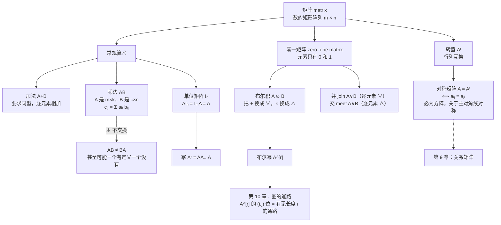

# C2.6 矩阵 Matrices

> [!abstract] 这一讲的任务
> 本章最后一件工具。矩阵你在线性代数里大概见过，但**这一讲的目的完全不同**：课本开篇就说明白了——
> **“矩阵在离散数学中被用来表达集合中元素之间的关系。”**
> 也就是说，矩阵在这里是**离散结构的容器**：第 9 章用它装[[C2.1 集合 Sets]]定义的**关系**，第 10 章用它装**图**，然后“两点之间有没有通路”这类问题会变成一次**矩阵乘法**。
> 所以本讲分两半：**前半**快速复习矩阵的常规运算（加法、乘法、转置、对称），**后半**引入一套你多半没见过的东西——把加法换成 $\vee$、乘法换成 $\wedge$ 的**布尔矩阵运算**。后半才是离散数学特有的部分。

> [!info] 怎么读这份讲义
> 若你已经学过线性代数，第 1–4 节可以快速扫过，**但不要跳过第 3.2 节（乘法不交换）和第 4.2 节（对称矩阵）**，它们在第 9 章会被反复用到。
> **第 5 节（零一矩阵）是本讲重点**，布尔积与布尔幂的定义和手算要熟练。

---

## 0. 开场：把“谁认识谁”存进电脑

你要给一个 5 人小组做一个“互相认识”的记录。最朴素的做法是列一张清单：

> Alice–Bob，Alice–Carol，Bob–Dave，……

但一旦要回答“**Alice 和 Eve 之间能不能通过中间人搭上线**”，这张清单就很难用了——你得反复搜索。

换一种存法：画一张 $5\times5$ 的表格，第 $i$ 行第 $j$ 列填 **1** 表示第 $i$ 人认识第 $j$ 人，填 **0** 表示不认识。

$$\begin{bmatrix} 0&1&1&0&0\\ 1&0&0&1&0\\ 1&0&0&0&1\\ 0&1&0&0&1\\ 0&0&1&1&0 \end{bmatrix}$$

> [!question] 停一下，先自己想想
> 用这张表，怎么判断“Alice（第 1 人）能不能通过**恰好一个**中间人认识 Eve（第 5 人）”？

答案是：**存在某个 $k$，使得第 1 行第 $k$ 列是 1（Alice 认识 $k$），并且第 $k$ 行第 5 列也是 1（$k$ 认识 Eve）**。

写成式子：
$$\bigl(a_{11}\wedge a_{15}\bigr)\vee\bigl(a_{12}\wedge a_{25}\bigr)\vee\cdots\vee\bigl(a_{15}\wedge a_{55}\bigr)$$

**盯住这个式子的形状**：它和矩阵乘法 $c_{ij} = a_{i1}b_{1j}+a_{i2}b_{2j}+\cdots$ **一模一样**，只是把 $+$ 换成了 $\vee$、把 $\times$ 换成了 $\wedge$。

**你刚才做的，就是一次布尔矩阵乘法**——本讲第 5 节的主角，也是第 10 章判断图中通路的标准方法。

---

## 1. 矩阵是什么

> [!important] 定义 1（课本 DEFINITION 1）
> **矩阵 matrix** 是数的**矩形阵列**。有 $m$ 行 $n$ 列的矩阵称为 **$m\times n$ 矩阵**。（matrix 的复数是 **matrices**。）
> 行数与列数相同的矩阵称为**方阵 square**。
> 两个矩阵**相等**，当且仅当它们**行数相同、列数相同，且每个对应位置上的元素都相等**。

**例 1**：$\begin{bmatrix}1&1\\0&2\\1&3\end{bmatrix}$ 是一个 $3\times2$ 矩阵。

> [!warning] 易错点：$m\times n$ 是“行 × 列”
> **先行后列**，永远如此。$3\times2$ 是**三行两列**，不是三列两行。
> 记忆法：读矩阵和读书一样，**先横着数有几行**。

**记号约定**：用**粗体大写字母**表示矩阵。

> [!important] 定义 2（课本 DEFINITION 2）
> 设
> $$\mathbf A = \begin{bmatrix} a_{11}&a_{12}&\cdots&a_{1n}\\ a_{21}&a_{22}&\cdots&a_{2n}\\ \vdots&\vdots&&\vdots\\ a_{m1}&a_{m2}&\cdots&a_{mn}\end{bmatrix}$$
> - $\mathbf A$ 的**第 $i$ 行**是 $1\times n$ 矩阵 $[a_{i1}, a_{i2},\ldots,a_{in}]$；
> - $\mathbf A$ 的**第 $j$ 列**是 $m\times 1$ 矩阵 $\begin{bmatrix}a_{1j}\\a_{2j}\\\vdots\\a_{mj}\end{bmatrix}$；
> - $\mathbf A$ 的 **$(i,j)$ 元素 element / entry** 是 $a_{ij}$，即第 $i$ 行第 $j$ 列的那个数。
> - 简记：$\mathbf A = [a_{ij}]$。

> [!important] ⭐ 下标顺序：$a_{ij}$ 中 **$i$ 是行、$j$ 是列**
> 这个约定贯穿全书，**记反了后面所有的转置、对称、布尔积都会错**。
> 记忆法：**“行”（row）在前，和 $m\times n$ 的顺序一致**。

---

## 2. 矩阵加法

> [!important] 定义 3（课本 DEFINITION 3）
> 设 $\mathbf A = [a_{ij}]$，$\mathbf B = [b_{ij}]$ 都是 $m\times n$ 矩阵。它们的**和 sum**，记作 $\mathbf A+\mathbf B$，是以 $a_{ij}+b_{ij}$ 为 $(i,j)$ 元素的 $m\times n$ 矩阵：
> $$\mathbf A+\mathbf B = [a_{ij}+b_{ij}]$$

**关键限制**：**只有同型（行数列数都相同）的矩阵才能相加**，因为和是逐位置定义的。

**例 2**：
$$\begin{bmatrix}1&0&-1\\2&2&-3\\3&4&0\end{bmatrix}+\begin{bmatrix}3&4&-1\\1&-3&0\\-1&1&2\end{bmatrix} = \begin{bmatrix}4&4&-2\\3&-1&-3\\2&5&2\end{bmatrix}$$

（已用程序验算 ✓）

> [!note] 加法的性质（课本习题 7–9）
> - **交换律**：$\mathbf A+\mathbf B = \mathbf B+\mathbf A$
> - **结合律**：$(\mathbf A+\mathbf B)+\mathbf C = \mathbf A+(\mathbf B+\mathbf C)$
> - **零元**：$\mathbf A+\mathbf 0 = \mathbf 0+\mathbf A = \mathbf A$（$\mathbf 0$ 是全零矩阵）
>
> **理由都一样**：加法是**逐元素**做的，而实数加法本来就有这些性质。**矩阵加法完全继承了实数加法的全部好性质**——麻烦全在乘法上。

---

## 3. 矩阵乘法

> [!important] 定义 4（课本 DEFINITION 4）
> 设 $\mathbf A$ 是 $m\times k$ 矩阵，$\mathbf B$ 是 $k\times n$ 矩阵。它们的**积 product**，记作 $\mathbf{AB}$，是 $m\times n$ 矩阵，其 $(i,j)$ 元素等于 **$\mathbf A$ 的第 $i$ 行与 $\mathbf B$ 的第 $j$ 列对应元素乘积之和**。即若 $\mathbf{AB} = [c_{ij}]$，则
> $$c_{ij} = a_{i1}b_{1j}+a_{i2}b_{2j}+\cdots+a_{ik}b_{kj} = \sum_{l=1}^{k}a_{il}b_{lj}$$

> [!important] ⭐ 什么时候有定义：中间那个数必须对上
> $$\underbrace{\mathbf A}_{m\times \boxed{k}}\ \underbrace{\mathbf B}_{\boxed{k}\times n} = \underbrace{\mathbf{AB}}_{m\times n}$$
> **$\mathbf A$ 的列数必须等于 $\mathbf B$ 的行数**，否则乘积**没有定义**。
> 结果的尺寸是“**外面那两个数**”。
>
> **答题第一步永远是写出两个矩阵的尺寸，把中间两个数对一下。** 这一步能挡掉大部分错误。

**例 3**：
$$\mathbf A = \begin{bmatrix}1&0&4\\2&1&1\\3&1&0\\0&2&2\end{bmatrix}_{4\times3}\qquad \mathbf B = \begin{bmatrix}2&4\\1&1\\3&0\end{bmatrix}_{3\times2}$$

**解**：$\mathbf A$ 是 $4\times3$、$\mathbf B$ 是 $3\times2$，中间的 3 对上了，故 $\mathbf{AB}$ 有定义，是 $4\times2$ 矩阵。

**课本示范的单个元素算法**：$(3,1)$ 位置 = $\mathbf A$ 第 3 行 $\cdot$ $\mathbf B$ 第 1 列 $= 3\cdot2+1\cdot1+0\cdot3 = 7$。

全部算完：
$$\mathbf{AB} = \begin{bmatrix}14&4\\8&9\\7&13\\8&2\end{bmatrix}$$

（已用程序验算 ✓）

> [!important] 手算口诀：**左行乘右列**
> 求 $(i,j)$ 位置 → 用左矩阵的**第 $i$ 行**去点乘右矩阵的**第 $j$ 列**。
> **一只手横着划行，一只手竖着划列**，边划边乘边加。这是最不容易出错的手算姿势。

### 3.1 图示（课本 FIGURE 1）

$$\begin{bmatrix} \vdots&\vdots&&\vdots\\ \boxed{a_{i1}}&\boxed{a_{i2}}&\cdots&\boxed{a_{ik}}\\ \vdots&\vdots&&\vdots \end{bmatrix} \begin{bmatrix} \cdots&\boxed{b_{1j}}&\cdots\\ \cdots&\boxed{b_{2j}}&\cdots\\ &\vdots&\\ \cdots&\boxed{b_{kj}}&\cdots \end{bmatrix} = \begin{bmatrix} &\vdots&\\ \cdots&\boxed{c_{ij}}&\cdots\\ &\vdots& \end{bmatrix}$$

> [!important] 图表读法
> 课本 FIGURE 1 用**着色**标出了 $\mathbf A$ 的一整行和 $\mathbf B$ 的一整列，它们共同决定结果中**一个**元素 $c_{ij}$。
> **注意行和列的长度都是 $k$**——这正是“中间那个数必须对上”的几何含义：行要和列**一样长**才能配对相乘。

### 3.2 ⭐⭐ 矩阵乘法不满足交换律

> [!important] 课本讲得非常细，值得完整记下
> 设 $\mathbf A$ 是 $m\times n$，$\mathbf B$ 是 $r\times s$。
> - $\mathbf{AB}$ 有定义 $\iff n = r$；
> - $\mathbf{BA}$ 有定义 $\iff s = m$。
>
> 三级递进：
> 1. **可能只有一个有定义**：$\mathbf A$ 是 $2\times3$、$\mathbf B$ 是 $3\times4$，则 $\mathbf{AB}$ 是 $2\times4$，但 $\mathbf{BA}$ **根本没定义**（$3\times4$ 乘 $2\times3$，中间 $4\ne2$）。
> 2. **即使都有定义，尺寸也可能不同**：除非 $m=n=r=s$。所以**若 $\mathbf{AB}$ 与 $\mathbf{BA}$ 都有定义且同型，则 $\mathbf A,\mathbf B$ 必须都是同阶方阵**。
> 3. **即使都是 $n\times n$ 方阵，两者仍可能不等**。

**例 4**：
$$\mathbf A = \begin{bmatrix}1&1\\2&1\end{bmatrix},\qquad \mathbf B = \begin{bmatrix}2&1\\1&1\end{bmatrix}$$
$$\mathbf{AB} = \begin{bmatrix}3&2\\5&3\end{bmatrix}\qquad \mathbf{BA} = \begin{bmatrix}4&3\\3&2\end{bmatrix}$$

**$\mathbf{AB}\ne\mathbf{BA}$。**（已用程序验算 ✓）

> [!note] 停一下：这是本章第几次遇到“不交换”了？
> 数一数：
> - [[C2.1 集合 Sets]]：**笛卡尔积不交换**（$A\times B\ne B\times A$）；
> - [[C2.2 集合运算 Set Operations]]：**差集不交换**（$A-B\ne B-A$）；
> - [[C2.3 函数 Functions]]：**函数复合不交换**（$f\circ g\ne g\circ f$）；
> - 本节：**矩阵乘法不交换**。
>
> 这四个不是巧合——**它们全都在描述“有方向的操作”**。事实上函数复合和矩阵乘法是**同一件事**（矩阵就是线性映射，矩阵乘法就是映射复合），所以它们不交换的理由也完全相同：**先做 A 再做 B，和先做 B 再做 A，本来就不一样。**

---

## 4. 单位矩阵、幂与转置

### 4.1 单位矩阵与幂

> [!important] 定义 5（课本 DEFINITION 5）
> **$n$ 阶单位矩阵 identity matrix of order $n$** 是 $n\times n$ 矩阵 $\mathbf I_n = [\delta_{ij}]$，其中
> $$\delta_{ij} = \begin{cases}1,& i=j\\ 0,& i\ne j\end{cases}$$
> 即
> $$\mathbf I_n = \begin{bmatrix}1&0&\cdots&0\\0&1&\cdots&0\\ \vdots&\vdots&\ddots&\vdots\\ 0&0&\cdots&1\end{bmatrix}$$

（$\delta_{ij}$ 叫 **Kronecker delta 克罗内克 $\delta$**，是一个很常用的记号。）

> [!important] 单位矩阵的作用（课本正文）
> 对 $m\times n$ 矩阵 $\mathbf A$：
> $$\mathbf{AI}_n = \mathbf I_m\mathbf A = \mathbf A$$
> **乘单位矩阵什么都不改变**——它在矩阵乘法里的地位相当于数的 1、函数里的恒等函数 $\iota_A$。

**方阵的幂**：当 $\mathbf A$ 是 $n\times n$ 矩阵时
$$\mathbf A^0 = \mathbf I_n,\qquad \mathbf A^r = \underbrace{\mathbf{AAA}\cdots\mathbf A}_{r\ \text{个}}$$

> [!example] 手算（课本习题 15）
> 设 $\mathbf A = \begin{bmatrix}1&1\\0&1\end{bmatrix}$，求 $\mathbf A^n$ 的公式。
>
> **算前几个找规律**：
> $$\mathbf A^2 = \begin{bmatrix}1&1\\0&1\end{bmatrix}\begin{bmatrix}1&1\\0&1\end{bmatrix} = \begin{bmatrix}1&2\\0&1\end{bmatrix},\qquad \mathbf A^3 = \begin{bmatrix}1&3\\0&1\end{bmatrix}$$
> **猜测**：
> $$\mathbf A^n = \begin{bmatrix}1&n\\0&1\end{bmatrix}$$
> **验证（归纳步）**：
> $$\mathbf A^{n}\mathbf A = \begin{bmatrix}1&n\\0&1\end{bmatrix}\begin{bmatrix}1&1\\0&1\end{bmatrix} = \begin{bmatrix}1\cdot1+n\cdot0 & 1\cdot1+n\cdot1\\ 0+0 & 0+1\end{bmatrix} = \begin{bmatrix}1&n+1\\0&1\end{bmatrix}$$ ✓
>
> **要点**：这类题的通法就是 [[C2.4 序列与求和 Sequences and Summations]] 第 3 节的“**算前几项 → 猜 → 验**”，只是这次项是矩阵。严格证明用数学归纳法（第 5 章）。

### 4.2 转置与对称矩阵

> [!important] 定义 6（课本 DEFINITION 6）
> 设 $\mathbf A = [a_{ij}]$ 是 $m\times n$ 矩阵。$\mathbf A$ 的**转置 transpose**，记作 $\mathbf A^t$，是把 $\mathbf A$ 的**行和列互换**得到的 $n\times m$ 矩阵。即若 $\mathbf A^t = [b_{ij}]$，则
> $$b_{ij} = a_{ji}$$

**例 5**：
$$\begin{bmatrix}1&2&3\\4&5&6\end{bmatrix}^{t} = \begin{bmatrix}1&4\\2&5\\3&6\end{bmatrix}$$

**注意尺寸变了**：$2\times3 \to 3\times2$。

> [!important] 定义 7（课本 DEFINITION 7）
> 方阵 $\mathbf A$ 称为**对称的 symmetric**，若 $\mathbf A = \mathbf A^t$。
> 即 $\mathbf A = [a_{ij}]$ 对称 $\iff$ **$a_{ij} = a_{ji}$ 对一切 $1\le i,j\le n$ 成立**。

**课本的几何解释**：一个矩阵是对称的，**当且仅当它是方阵，并且关于主对角线对称**（主对角线由那些行号与列号相同的元素 $a_{ii}$ 构成）。

$$\begin{matrix} & & \nwarrow & & a_{ji}\\ & \ddots & & &\\ a_{ij} & & \searrow & & \end{matrix}$$

*（对应课本 FIGURE 2：$a_{ij}$ 与 $a_{ji}$ 关于主对角线互为镜像。）*

**例 6**：$\begin{bmatrix}1&1&0\\1&0&1\\0&1&0\end{bmatrix}$ 是对称的。

**检验**：$a_{12}=1=a_{21}$ ✓，$a_{13}=0=a_{31}$ ✓，$a_{23}=1=a_{32}$ ✓。

> [!important] 转置的三条性质（课本习题 16、17）
> $$(\mathbf A^t)^t = \mathbf A \qquad (\mathbf A+\mathbf B)^t = \mathbf A^t+\mathbf B^t \qquad \boxed{(\mathbf{AB})^t = \mathbf B^t\mathbf A^t}$$
> **第三条要特别注意：转置会把乘积的顺序颠倒过来。**
> 这和 [[C2.3 函数 Functions]] 里 $(f\circ g)^{-1} = g^{-1}\circ f^{-1}$ 是同一个模式——**撤销一串操作时，顺序要倒过来**（先脱鞋再脱袜子的逆过程是先穿袜子再穿鞋）。
>
> 另外（课本习题 14）：**对任意方阵 $\mathbf A$，$\mathbf A+\mathbf A^t$ 总是对称的**。
> 证明：$(\mathbf A+\mathbf A^t)^t = \mathbf A^t + (\mathbf A^t)^t = \mathbf A^t+\mathbf A = \mathbf A+\mathbf A^t$ ✓

> [!note] 前后联系：对称矩阵在第 9 章意味着什么
> 用矩阵表示关系时，$a_{ij}=1$ 表示“$i$ 与 $j$ 有关系”。
> 于是 **矩阵对称 $\iff$ 关系是对称的**（$i$ 关系到 $j$ 就必然有 $j$ 关系到 $i$）。
> 开场那个“互相认识”的矩阵就是对称的——因为“认识”是相互的。而“是……的粉丝”就不对称。
> 类似地，**主对角线全为 1 $\iff$ 关系是自反的**。第 9 章会把关系的每一条性质都翻译成矩阵的一条特征。

### 4.3 逆矩阵（课本习题中引入）

> [!important] 定义（课本习题 18 前的说明）
> 若 $n\times n$ 矩阵 $\mathbf A,\mathbf B$ 满足 $\mathbf{AB} = \mathbf{BA} = \mathbf I_n$，则称 $\mathbf B$ 是 $\mathbf A$ 的**逆矩阵 inverse**（这样的 $\mathbf B$ 是**唯一**的，所以这个说法是恰当的），并称 $\mathbf A$ 是**可逆的 invertible**。记 $\mathbf B = \mathbf A^{-1}$。

> [!note] 和 [[C2.3 函数 Functions]] 的反函数对照
> | 函数 | 矩阵 |
> |---|---|
> | $f^{-1}\circ f = \iota_A$，$f\circ f^{-1}=\iota_B$ | $\mathbf A^{-1}\mathbf A = \mathbf{AA}^{-1} = \mathbf I$ |
> | 只有双射才可逆 | 只有非奇异方阵才可逆 |
> | $(f\circ g)^{-1} = g^{-1}\circ f^{-1}$ | $(\mathbf{AB})^{-1} = \mathbf B^{-1}\mathbf A^{-1}$（习题 40） |
>
> **完全平行**——因为矩阵就是线性映射，两者本来就是一回事。

**应用（课本习题 24–25）**：线性方程组
$$\begin{cases}a_{11}x_1+\cdots+a_{1n}x_n = b_1\\ \qquad\quad\vdots\\ a_{n1}x_1+\cdots+a_{nn}x_n = b_n\end{cases}$$
可以写成 $\mathbf{AX} = \mathbf B$；若 $\mathbf A$ 可逆，则解为
$$\mathbf X = \mathbf A^{-1}\mathbf B$$

---

## 5. ⭐ 零一矩阵与布尔运算（离散数学特有）

> [!important] 定义（课本正文）
> 所有元素**非 0 即 1** 的矩阵称为**零一矩阵 zero–one matrix**。

课本说明它的用途：**零一矩阵常被用来表示离散结构（见第 9、10 章）；使用这些结构的算法基于零一矩阵上的布尔算术。**

布尔算术基于两个作用在位上的运算：

$$b_1\wedge b_2 = \begin{cases}1,& b_1 = b_2 = 1\\ 0,& \text{其他情形}\end{cases} \qquad b_1\vee b_2 = \begin{cases}1,& b_1 = 1\text{ 或 }b_2=1\\ 0,&\text{其他情形}\end{cases}$$

（这正是 [[C1.1 命题逻辑 Propositional Logic]] 的合取与析取，1 当真、0 当假。）

### 5.1 并（join）与交（meet）

> [!important] 定义 8（课本 DEFINITION 8）
> 设 $\mathbf A = [a_{ij}]$、$\mathbf B = [b_{ij}]$ 都是 $m\times n$ 零一矩阵。
> - $\mathbf A$ 与 $\mathbf B$ 的**并 join**，记作 $\mathbf A\vee\mathbf B$，是以 $a_{ij}\vee b_{ij}$ 为 $(i,j)$ 元素的零一矩阵；
> - $\mathbf A$ 与 $\mathbf B$ 的**交 meet**，记作 $\mathbf A\wedge\mathbf B$，是以 $a_{ij}\wedge b_{ij}$ 为 $(i,j)$ 元素的零一矩阵。

**这两个都是逐元素运算**，和矩阵加法一样简单（要求同型）。

**例 7**：
$$\mathbf A = \begin{bmatrix}1&0&1\\0&1&0\end{bmatrix},\qquad \mathbf B = \begin{bmatrix}0&1&0\\1&1&0\end{bmatrix}$$

$$\mathbf A\vee\mathbf B = \begin{bmatrix}1\vee0&0\vee1&1\vee0\\ 0\vee1&1\vee1&0\vee0\end{bmatrix} = \begin{bmatrix}1&1&1\\1&1&0\end{bmatrix}$$

$$\mathbf A\wedge\mathbf B = \begin{bmatrix}1\wedge0&0\wedge1&1\wedge0\\0\wedge1&1\wedge1&0\wedge0\end{bmatrix} = \begin{bmatrix}0&0&0\\0&1&0\end{bmatrix}$$

> [!note] 这就是 [[C2.2 集合运算 Set Operations]] 的位串表示，升了一维
> 上一讲：**一个**集合 ↔ **一个**位串，并集 = 按位或。
> 这一讲：一个**关系** ↔ 一个**位矩阵**，关系的并 = 按位或。
> **同一件事，从一维推广到二维。** 所以 join/meet 满足的定律（交换、结合、分配，习题 30–33）和 Table 1 完全一致。

### 5.2 ⭐ 布尔积

> [!important] 定义 9（课本 DEFINITION 9）
> 设 $\mathbf A=[a_{ij}]$ 是 $m\times k$ 零一矩阵，$\mathbf B = [b_{ij}]$ 是 $k\times n$ 零一矩阵。它们的**布尔积 Boolean product**，记作 $\mathbf A\odot\mathbf B$，是 $m\times n$ 矩阵，其 $(i,j)$ 元素 $c_{ij}$ 为
> $$c_{ij} = (a_{i1}\wedge b_{1j})\vee(a_{i2}\wedge b_{2j})\vee\cdots\vee(a_{ik}\wedge b_{kj})$$

> [!important] ⭐ 一句话记住布尔积
> **布尔积 = 普通矩阵乘法，把 $+$ 换成 $\vee$、把 $\times$ 换成 $\wedge$。**
> 尺寸规则完全相同（中间那个 $k$ 要对上），手算姿势也完全相同（左行乘右列），只是“乘”变成 $\wedge$、“加”变成 $\vee$。
>
> **实际效果**：$c_{ij} = 1$ **当且仅当存在某个 $l$ 使 $a_{il} = b_{lj} = 1$**。
> 翻译成开场的语言：**第 $i$ 人能通过某个中间人 $l$ 连到第 $j$ 人。**

**例 8**：求
$$\mathbf A = \begin{bmatrix}1&0\\0&1\\1&0\end{bmatrix},\qquad \mathbf B = \begin{bmatrix}1&1&0\\0&1&1\end{bmatrix}$$
的布尔积。

**解**：$\mathbf A$ 是 $3\times2$，$\mathbf B$ 是 $2\times3$，中间的 2 对上，结果是 $3\times3$。

$$\mathbf A\odot\mathbf B = \begin{bmatrix}
(1\wedge1)\vee(0\wedge0) & (1\wedge1)\vee(0\wedge1) & (1\wedge0)\vee(0\wedge1)\\
(0\wedge1)\vee(1\wedge0) & (0\wedge1)\vee(1\wedge1) & (0\wedge0)\vee(1\wedge1)\\
(1\wedge1)\vee(0\wedge0) & (1\wedge1)\vee(0\wedge1) & (1\wedge0)\vee(0\wedge1)
\end{bmatrix}$$

$$= \begin{bmatrix}1\vee0&1\vee0&0\vee0\\ 0\vee0&0\vee1&0\vee1\\ 1\vee0&1\vee0&0\vee0\end{bmatrix} = \begin{bmatrix}1&1&0\\0&1&1\\1&1&0\end{bmatrix}$$

> [!important] 速算窍门：**先看有没有“1 碰 1”**
> 算 $c_{ij}$ 时不必逐项写 $\wedge$ 和 $\vee$：**沿着左边第 $i$ 行和右边第 $j$ 列同时扫，只要发现某个位置上两边都是 1，立刻填 1 收工；全程没碰上就填 0。**
> 这比普通矩阵乘法还快，因为**不用做加法，找到一个就能提前结束**。

### 5.3 布尔幂

> [!important] 定义 10（课本 DEFINITION 10）
> 设 $\mathbf A$ 是方零一矩阵，$r$ 是正整数。$\mathbf A$ 的**第 $r$ 次布尔幂 Boolean power**，记作 $\mathbf A^{[r]}$，是 $r$ 个 $\mathbf A$ 的布尔积：
> $$\mathbf A^{[r]} = \underbrace{\mathbf A\odot\mathbf A\odot\cdots\odot\mathbf A}_{r\ \text{个}}$$
> （这是良定义的，因为**布尔积满足结合律**，习题 35。）并规定 $\mathbf A^{[0]} = \mathbf I_n$。

**例 9**：设
$$\mathbf A = \begin{bmatrix}0&0&1\\1&0&0\\1&1&0\end{bmatrix}$$
求一切正整数 $n$ 的 $\mathbf A^{[n]}$。

**解**（逐次布尔积）：

$$\mathbf A^{[2]} = \mathbf A\odot\mathbf A = \begin{bmatrix}1&1&0\\0&0&1\\1&0&1\end{bmatrix}$$

$$\mathbf A^{[3]} = \mathbf A^{[2]}\odot\mathbf A = \begin{bmatrix}1&0&1\\1&1&0\\1&1&1\end{bmatrix},\qquad \mathbf A^{[4]} = \mathbf A^{[3]}\odot\mathbf A = \begin{bmatrix}1&1&1\\1&0&1\\1&1&1\end{bmatrix}$$

$$\mathbf A^{[5]} = \begin{bmatrix}1&1&1\\1&1&1\\1&1&1\end{bmatrix}$$

再往下算会发现：**对一切 $n\ge5$，$\mathbf A^{[n]} = \mathbf A^{[5]}$（全 1 矩阵）。**

（已用程序逐次验算 $\mathbf A^{[2]}$ 到 $\mathbf A^{[6]}$，与课本完全一致 ✓）

> [!question] 停一下：为什么算到全 1 之后就不再变了？
> > [!success]- 答案
> > 因为**全 1 矩阵 $\odot$ 任何每行每列都至少有一个 1 的矩阵 = 全 1 矩阵**——布尔积只有 0/1 两种值，**一旦全部填满 1，就没有位置可以再变了**（布尔运算“只增不减”：$\vee$ 不会把 1 变回 0）。
> > 更一般地，布尔幂序列 $\mathbf A^{[1]},\mathbf A^{[2]},\ldots$ **最终必定进入周期**，因为 $n\times n$ 零一矩阵只有有限多个（$2^{n^2}$ 个）。

> [!note] 前后联系：布尔幂 = 图中的通路（第 10 章）
> 若 $\mathbf A$ 是一张图的**邻接矩阵**（$a_{ij}=1$ 表示 $i$ 到 $j$ 有一条边），那么：
> $$\mathbf A^{[r]} \text{ 的 } (i,j) \text{ 元素} = 1 \iff \text{从 } i \text{ 到 } j \text{ 存在长度恰为 } r \text{ 的通路}$$
> 例 9 里 $\mathbf A^{[5]}$ 全是 1，意思是**这张 3 个点的图上，任意两点之间都存在长度为 5 的通路**（图是强连通的）。
> 把 $\mathbf A\vee\mathbf A^{[2]}\vee\cdots\vee\mathbf A^{[n]}$ 求出来，就得到**可达性矩阵 (transitive closure)**——这正是习题 29c 让你算的东西，也是 **Warshall 算法**（第 9 章）解决的问题。
>
> **所以本讲最后这一小节，是通往图论算法的正门。**

### 5.4 布尔运算的性质（课本习题 30–35）

| 性质 | 结论 |
|---|---|
| 幂等 | $\mathbf A\vee\mathbf A = \mathbf A$；$\mathbf A\wedge\mathbf A = \mathbf A$ |
| 交换 | $\mathbf A\vee\mathbf B = \mathbf B\vee\mathbf A$；$\mathbf A\wedge\mathbf B = \mathbf B\wedge\mathbf A$ |
| 结合 | $(\mathbf A\vee\mathbf B)\vee\mathbf C = \mathbf A\vee(\mathbf B\vee\mathbf C)$，$\wedge$ 同理 |
| 分配 | $\mathbf A\vee(\mathbf B\wedge\mathbf C) = (\mathbf A\vee\mathbf B)\wedge(\mathbf A\vee\mathbf C)$，对偶式亦成立 |
| 单位元 | $\mathbf A\odot\mathbf I = \mathbf I\odot\mathbf A = \mathbf A$ |
| 零元 | $\mathbf A\odot\mathbf 0 = \mathbf 0\odot\mathbf A = \mathbf 0$；$\mathbf A\vee\mathbf 0 = \mathbf A$；$\mathbf A\wedge\mathbf 0 = \mathbf 0$ |
| 布尔积结合律 | $\mathbf A\odot(\mathbf B\odot\mathbf C) = (\mathbf A\odot\mathbf B)\odot\mathbf C$ |

> [!important] 全部对应回 Table 1
> 把 $\vee$ 看成 $\cup$、$\wedge$ 看成 $\cap$、$\mathbf 0$ 看成 $\varnothing$，这张表**又是** [[C2.2 集合运算 Set Operations]] 的 Table 1。
> 这已经是同一套定律在本书中的第**四**副面孔了：
> $$\text{命题逻辑（§1.3）}\ \to\ \text{集合（§2.2）}\ \to\ \text{位串（§2.2）}\ \to\ \text{布尔矩阵（§2.6）}$$
> 第 12 章会把它们统一成**布尔代数**。**这条线是全书最重要的一条结构性线索。**

> [!warning] ⭐ 布尔积**也不**满足交换律
> 和普通矩阵乘法一样，$\mathbf A\odot\mathbf B\ne\mathbf B\odot\mathbf A$。
> 虽然 $\vee$ 和 $\wedge$ 各自都交换，但“左行乘右列”这个结构本身是**有方向**的——参见第 3.2 节的讨论。

---

## 这一讲的三句话

1. **矩阵在离散数学中是“离散结构的容器”**：加法逐元素（要求同型），乘法“**左行乘右列**”（要求**中间的维度对上**，结果尺寸取外面两个数），而**乘法不交换**——这和笛卡尔积、差集、函数复合的不交换是同一回事。
2. **转置是行列互换**，$\mathbf A = \mathbf A^t$ 就是对称矩阵（关于主对角线镜像）；注意 $(\mathbf{AB})^t = \mathbf B^t\mathbf A^t$ **顺序要倒过来**。对称性在第 9 章直接对应“关系是对称的”。
3. **布尔矩阵运算 = 把 $+$ 换成 $\vee$、$\times$ 换成 $\wedge$**；布尔幂 $\mathbf A^{[r]}$ 的 $(i,j)$ 位回答“有没有长度为 $r$ 的通路”，这是第 10 章图论算法的入口。

### 速查表

| 运算 | 记号 | 要求 | 规则 |
|---|:-:|---|---|
| 加法 | $\mathbf A+\mathbf B$ | 同型 | $a_{ij}+b_{ij}$ |
| 乘法 | $\mathbf{AB}$ | $m\times \boxed k$ 与 $\boxed k\times n$ | $c_{ij} = \sum_l a_{il}b_{lj}$ |
| 转置 | $\mathbf A^t$ | 无 | $b_{ij} = a_{ji}$ |
| 对称 | $\mathbf A = \mathbf A^t$ | 方阵 | $a_{ij}=a_{ji}$ |
| 并 | $\mathbf A\vee\mathbf B$ | 同型、0-1 | $a_{ij}\vee b_{ij}$ |
| 交 | $\mathbf A\wedge\mathbf B$ | 同型、0-1 | $a_{ij}\wedge b_{ij}$ |
| 布尔积 | $\mathbf A\odot\mathbf B$ | $m\times k$、$k\times n$、0-1 | $c_{ij} = \bigvee_l (a_{il}\wedge b_{lj})$ |
| 布尔幂 | $\mathbf A^{[r]}$ | 方阵、0-1 | $r$ 个 $\mathbf A$ 的布尔积，$\mathbf A^{[0]}=\mathbf I$ |

### 本章到此结束

这就是第 2 章的全部：**集合**（对象的汇集）→ **集合运算**（怎么组合）→ **函数**（怎么对应）→ **序列与求和**（怎么排列与累加）→ **基数**（怎么比大小）→ **矩阵**（怎么装进电脑）。
六件工具全部装备完毕之后，第 3 章开始讲**算法**——而算法分析要用到本章的**函数**（复杂度函数）、**求和**（数步数）、**取整**（数轮数），[[C2.5 集合的基数 Cardinality of Sets]] 的可数性还会在讨论“什么问题算不出来”时再次出现。
完整的知识地图见 [[C2 基本结构：集合、函数、序列、求和与矩阵 MOC]]。

---

## 本节自测 Self-Test

> [!question] 1. 设 $\mathbf A = \begin{bmatrix}1&1&1&3\\2&0&4&6\\1&1&3&7\end{bmatrix}$。(a) $\mathbf A$ 是几阶的？(b) 第三列是什么？(c) 第二行是什么？(d) $(3,2)$ 位置的元素是什么？（课本习题 1）
> > [!success]- 答案
> > **(a)** $3\times4$（三行四列）。
> > **(b)** 第三列 $= \begin{bmatrix}1\\4\\3\end{bmatrix}$。
> > **(c)** 第二行 $= [2\ \ 0\ \ 4\ \ 6]$。
> > **(d)** $a_{32} = 1$（第 3 行第 2 列）。
> > **(e)** $\mathbf A^t = \begin{bmatrix}1&2&1\\1&0&1\\1&4&3\\3&6&7\end{bmatrix}$（$4\times3$）。

> [!question] 2. 求 $\mathbf{AB}$，其中 $\mathbf A = \begin{bmatrix}2&1\\3&2\end{bmatrix}$，$\mathbf B = \begin{bmatrix}0&4\\1&3\end{bmatrix}$。再求 $\mathbf{BA}$，两者相等吗？（课本习题 3a）
> > [!success]- 答案
> > $$\mathbf{AB} = \begin{bmatrix}2\cdot0+1\cdot1 & 2\cdot4+1\cdot3\\ 3\cdot0+2\cdot1 & 3\cdot4+2\cdot3\end{bmatrix} = \begin{bmatrix}1&11\\2&18\end{bmatrix}$$
> > $$\mathbf{BA} = \begin{bmatrix}0\cdot2+4\cdot3 & 0\cdot1+4\cdot2\\ 1\cdot2+3\cdot3 & 1\cdot1+3\cdot2\end{bmatrix} = \begin{bmatrix}12&8\\11&7\end{bmatrix}$$
> > **不相等** ✓ 再次印证矩阵乘法不交换。

> [!question] 3. $\mathbf A$ 是 $2\times3$，$\mathbf B$ 是 $3\times4$，$\mathbf C$ 是 $4\times2$。下列哪些有定义？尺寸分别是多少？(a) $\mathbf{AB}$ (b) $\mathbf{BA}$ (c) $\mathbf{ABC}$ (d) $\mathbf{CAB}$ (e) $\mathbf A^t\mathbf A$
> > [!success]- 答案
> > **(a) $\mathbf{AB}$**：$2\times\boxed3$ 与 $\boxed3\times4$ → 有定义，$2\times4$ ✓
> > **(b) $\mathbf{BA}$**：$3\times\boxed4$ 与 $\boxed2\times3$，$4\ne2$ → **无定义** ✗
> > **(c) $\mathbf{ABC}$**：$\mathbf{AB}$ 是 $2\times\boxed4$，$\mathbf C$ 是 $\boxed4\times2$ → 有定义，$2\times2$ ✓
> > **(d) $\mathbf{CAB}$**：$\mathbf{CA}$ 是 $4\times\boxed2$ 与 $\boxed2\times3$ → $4\times3$；再乘 $\mathbf B$（$3\times4$）→ 有定义，$4\times4$ ✓
> > **(e) $\mathbf A^t\mathbf A$**：$\mathbf A^t$ 是 $3\times\boxed2$，$\mathbf A$ 是 $\boxed2\times3$ → 有定义，$3\times3$ ✓
> >
> > **通法**：把尺寸依次写出来，**相邻的两个数必须相等，消掉之后剩下首尾两个数就是结果尺寸**。

> [!question] 4. 求 $\mathbf A\vee\mathbf B$、$\mathbf A\wedge\mathbf B$、$\mathbf A\odot\mathbf B$，其中 $\mathbf A = \begin{bmatrix}1&1\\0&1\end{bmatrix}$，$\mathbf B = \begin{bmatrix}0&1\\1&0\end{bmatrix}$。（课本习题 26）
> > [!success]- 答案
> > $$\mathbf A\vee\mathbf B = \begin{bmatrix}1\vee0&1\vee1\\0\vee1&1\vee0\end{bmatrix} = \begin{bmatrix}1&1\\1&1\end{bmatrix}$$
> > $$\mathbf A\wedge\mathbf B = \begin{bmatrix}1\wedge0&1\wedge1\\0\wedge1&1\wedge0\end{bmatrix} = \begin{bmatrix}0&1\\0&0\end{bmatrix}$$
> > $$\mathbf A\odot\mathbf B = \begin{bmatrix}(1\wedge0)\vee(1\wedge1) & (1\wedge1)\vee(1\wedge0)\\ (0\wedge0)\vee(1\wedge1) & (0\wedge1)\vee(1\wedge0)\end{bmatrix} = \begin{bmatrix}1&1\\1&0\end{bmatrix}$$

> [!question] 5. 设 $\mathbf A = \begin{bmatrix}1&0&0\\1&0&1\\0&1&0\end{bmatrix}$，求 $\mathbf A^{[2]}$ 和 $\mathbf A^{[3]}$。（课本习题 29）
> > [!success]- 答案
> > $$\mathbf A^{[2]} = \mathbf A\odot\mathbf A = \begin{bmatrix}1&0&0\\1&1&0\\1&0&1\end{bmatrix}$$
> > **逐个核对**：$(2,2)$ 位：第 2 行 $(1,0,1)$ 与第 2 列 $(0,0,1)$——第 3 个位置两边都是 1，故为 1 ✓
> > $$\mathbf A^{[3]} = \mathbf A^{[2]}\odot\mathbf A = \begin{bmatrix}1&0&0\\1&0&1\\1&1&0\end{bmatrix}$$
> > **要点**：用“沿行与列同时扫，碰到 1 碰 1 就填 1”的速算法，不必逐项写 $\wedge\vee$。

> [!question] 6. 证明：对任意 $n\times n$ 矩阵 $\mathbf A$，$\mathbf A + \mathbf A^t$ 是对称矩阵。（课本习题 14）
> > [!success]- 答案
> > **证明**：记 $\mathbf S = \mathbf A+\mathbf A^t$。则
> > $$\mathbf S^t = (\mathbf A+\mathbf A^t)^t = \mathbf A^t + (\mathbf A^t)^t = \mathbf A^t+\mathbf A = \mathbf A+\mathbf A^t = \mathbf S$$
> > 用到了 $(\mathbf A+\mathbf B)^t = \mathbf A^t+\mathbf B^t$、$(\mathbf A^t)^t = \mathbf A$ 和矩阵加法的交换律。故 $\mathbf S$ 对称。$\blacksquare$
> >
> > **逐元素验证**：$s_{ij} = a_{ij}+a_{ji}$，$s_{ji} = a_{ji}+a_{ij}$，两者相等 ✓

> [!question] 7. 若 $\mathbf A = c\mathbf I$（$c$ 是实数，$\mathbf I$ 是 $n$ 阶单位阵），证明对一切 $n\times n$ 矩阵 $\mathbf B$ 都有 $\mathbf{AB} = \mathbf{BA}$。（课本补充习题 38）
> > [!success]- 答案
> > **证明**：
> > $$\mathbf{AB} = (c\mathbf I)\mathbf B = c(\mathbf{IB}) = c\mathbf B$$
> > $$\mathbf{BA} = \mathbf B(c\mathbf I) = c(\mathbf{BI}) = c\mathbf B$$
> > 两者都等于 $c\mathbf B$，故相等。$\blacksquare$
> >
> > **注**：习题 39 说明**反过来也成立**——若一个 $2\times2$ 矩阵与所有 $2\times2$ 矩阵都可交换，它必须形如 $c\mathbf I$。
> > **也就是说：数量矩阵（scalar matrix）是唯一“和谁都能交换”的矩阵。** 这在抽象代数里叫矩阵环的**中心 center**。

> [!question] 8. 例 9 中为什么 $\mathbf A^{[n]}$ 从 $n=5$ 起就不变了？给出一个一般性的理由。
> > [!success]- 答案
> > **直接原因**：$\mathbf A^{[5]}$ 已经是全 1 矩阵。布尔运算中 $\vee$ **只会把 0 变成 1，不会把 1 变回 0**，而全 1 矩阵已经“满了”，再乘只要每行每列还有 1 就保持全 1。
> > **一般性理由**：$n\times n$ 零一矩阵只有 $2^{n^2}$ 个（**有限多个**），所以序列 $\mathbf A^{[1]},\mathbf A^{[2]},\mathbf A^{[3]},\ldots$ **必然在有限步内重复**，从而进入周期。
> > **图论含义**：在 $n$ 个顶点的图中，若两点之间有通路，则**必有长度不超过 $n$ 的通路**（否则通路上会重复经过某个顶点，可以把中间的圈去掉）。所以求可达性只需算到 $\mathbf A^{[n]}$，这正是第 9 章“传递闭包”算法的基础。

---

**上一节** ← [[C2.5 集合的基数 Cardinality of Sets]]
**下一章** → 第 3 章 算法
**本章索引** → [[C2 基本结构：集合、函数、序列、求和与矩阵 MOC]]
