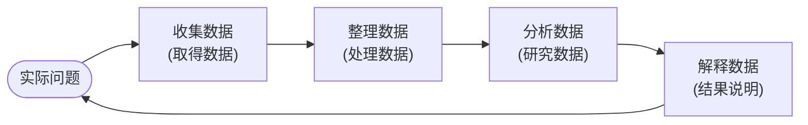
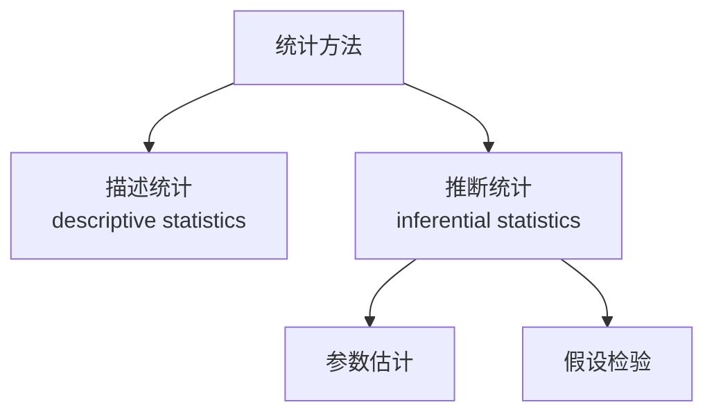
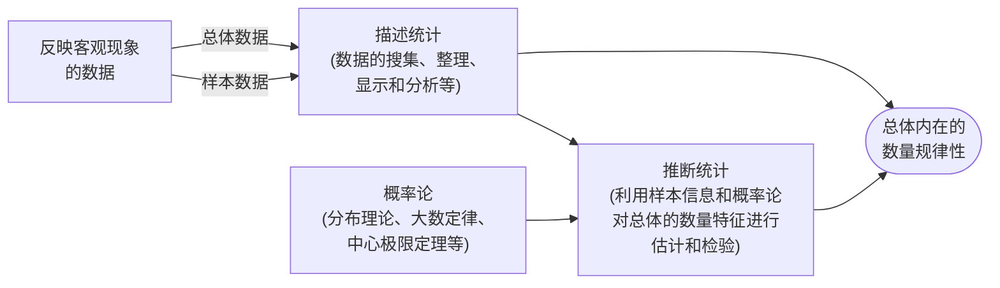
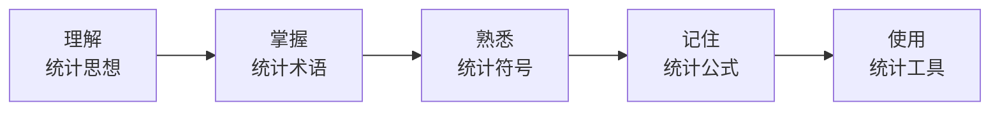

# C1.2 统计学是什么、怎么分科、怎么学

> [!abstract] 这一节讲了什么
> 上一节用一堆案例说明"数据里有信息"。这一节回到源头：把统计学的定义、它的词源和历史、它怎么分成描述统计和推断统计、以及"怎么才算学好了"这五条要求，一次讲清楚。最后交代课程大纲和成绩构成。

---

## 从"数据不等于信息"讲起

上一节最后那句话是这一节的起点：

> 大数据的战略意义，**不在于掌握了多少数据，而在于能从中提炼出什么信息**。

数据当然是第一步，但更重要的是**你如何在数据里获得信息**。那么，专门研究"怎么从数据里获得信息"的这门学问，就是统计学。

> [!important] 统计学的定义
> **Statistics is the methodological science of collecting, organizing, analyzing and interpreting data.**
> 统计学是一门**收集、整理、分析和解释数据**的**方法论科学**。
>
> 它要做的事情是：**找出大量数据背后的逻辑规律性。**

拆成四步看（课件 p37）：

- **数据收集**：取得数据
- **数据整理**：加工、处理、展示数据
- **数据分析**：分析数据
- **数据解释**：结果的说明

《不列颠百科全书》（Encyclopaedia Britannica）的说法是一样的：

> statistics: the science of collecting, analyzing, presenting, and interpreting data.

### 统计研究的过程

这四步不是一条直线，而是一个**从实际问题出发、最后回到实际问题**的闭环：

注意最后那根箭头：**解释数据之后要回到实际问题**。统计不是为了算数字，是为了回答一开始那个问题。

---

## "人工智能其实就是统计"

课件引了一位诺贝尔奖获得者在 2018 年世界科技创新论坛上的话：

> [!quote]
> **Artificial intelligence is actually statistics, but in a very gorgeous phrase.** Many formulas are very old, but all artificial intelligence uses statistics to solve problems.
> 人工智能其实就是统计，只不过用了一个非常华丽的辞藻。很多公式都很老了，但所有的人工智能都在用统计去解决问题。

而且**十大最常用的机器学习算法里，有一半是基于统计方法的**——比如贝叶斯法则、贝叶斯机器学习。

### 贝叶斯为什么能成为"机器学习"

贝叶斯法则大家在概率论/数理统计里都学过。但它凭什么能实现"学习"？课堂上用了一个当场就能懂的例子。

把贝叶斯公式的三块对应成认知的三块：

| 贝叶斯里的名字 | 对应的东西 |
|---|---|
| **先验概率**（prior） | 初始认知 |
| **似然**（likelihood） | 新数据 + 方法 |
| **后验概率**（posterior） | 更新后的新认知 |

现在套到今天这堂课上：

1. 上课之前，你们对周老师有一个**初始认知**——刚见到的时候那个印象。这是**先验概率**。
2. 这堂课的内容是**新数据**；你们这十八到二十年形成的**思维逻辑方式**就是**方法**。两者合起来是**似然**。
3. 上完这堂课，你对周老师有了一个**新的认知**。这是**后验概率**。

关键在下一步：

4. **下一堂课的时候，把今天得到的后验概率当作新的先验概率**，再加上下一堂课的内容（新数据）和你自己的思维逻辑，又得到一个新的后验概率。
5. 再下一次，又把这个后验当先验……

> [!important] 这就是机器学习
> **用机器去模仿人"不断用新数据更新已有认知"的过程**，这就是一种机器学习的方法。
> 回到上一节那个公式：**统计学 = 数据 + 方法 + 概率**，目的是让**误差越来越小、预测越来越准**。

### 所以统计学的应用面有多宽

只要你需要用现实生活中的数据去解决问题，就要用到统计学。所以**几乎每个学科都有统计学的应用面**。

课件列了两页学科名单（p23–24），从精算、农业、动物学、人类学、考古学、审计学、晶体学、人口统计学、牙医学、生态学，一直到水文学、工业、语言学、文学、劳动力计划、管理科学、市场营销学、医学诊断、气象学……

在商科各个方向上的对应关系（课件 p22）也很清楚：

| 领域 | 用到统计的地方 | 对应章节 |
|---|---|---|
| 市场 | 价格策略、促销策略、消费者行为 | Chapter 2–6 |
| 生产 | 质量控制（质量控制图） | Chapter 12 |
| 财务 | 利用统计信息指导投资建议 | Chapter 5–11 |
| 会计 | 审计时的统计抽样 | Chapter 5–8 |
| 经济 | 提供预测信息（用 PPI、失业率、产能利用率等预测通胀） | Chapter 10 |

---

## 统计学这个词是从哪来的

"Statistics" 来自好几种语言：

- 拉丁语 **Status**
- 希腊语 **State**
- 意大利语 **Stato**

它们有一个共同的含义：**国家（country）与地位（status）**。

也就是说，**统计学是在国家出现以后，才越来越重要的**。

还有一个很有用的小规律：

> [!important] 单数和复数不是一个意思
> - **statistics（单数）** → 指**统计学**
> - **statistics（复数）** → 指**统计数据、统计资料**
>
> 所以统计学天然就和数据关系极为紧密——它就是**基于统计数据和统计资料**建立起来的一门方法论科学。

### 统计活动很早，统计学很晚

**统计行为**在原始社会就开始了。我们国家古书上讲的**"大事大结其绳，小事小结其绳"**——用绳结的大小多少来记事物的多寡，这就是最早的统计记录。

但**统计学作为一门系统的科学，距今只有三百多年的历史**，而且是**从西方引入中国**的。

（课件 p29 给的脉络是：原始社会后期统计萌芽于计数活动 → 奴隶制国家产生使统计日显重要 → 封建社会统计已具规模 → 资本主义兴起后统计扩展到社会经济各方面。）

---

## 统计学怎么分科

课件给了两种分法（p40）：

- **从统计方法的构成**分：描述统计学 / 推断统计学
- **从统计方法的研究和应用**分：理论统计学 / 应用统计学

我们这门课关心的是第一种：

### 描述统计（descriptive statistics）

> [!important] 描述统计
> **Descriptive statistics utilize numerical and graphic methods to explore data** — to look for patterns in a data set, to summarize the information revealed in a data set, and to present the information in a convenient form.
>
> **内容**：搜集数据 → 整理数据 → 展示数据 → 描述性分析
> **目的**：描述数据特征，找出数据的基本规律

课件 p42 配的图就是一个季度柱状图，下面标着 $\bar{x}=30$、$s^2=105$——也就是画出图、再算出几个概括性的数字。

上一节的圆点图和五数概括，做的正是这件事。

### 推断统计（inferential statistics）

> [!important] 推断统计
> **Inferential statistics utilize sample data to make estimates, decisions, predictions, or other generalizations about a larger set of data.**
>
> **内容**：参数估计、假设检验
> **目的**：对**总体**特征作出推断

用一句话概括推断统计在干什么：**以少见多，以现在见将来。**

你手上只有样本，却要对整个总体下判断；你只有过去和现在的数据，却要说未来。凭什么能这么推？**这正是后面几章要回答的问题。**

> [!note] 两者的难度不一样
> 描述统计相对容易理解；推断统计会让不少人觉得抽象——**这门课能帮上你最多的地方，就在推断统计这一段。**

### 两者是什么关系

这张图要看懂三件事：

1. **描述统计既可以处理样本数据，也可以处理总体数据**；
2. **推断统计一定要借助概率论**——分布理论、大数定律、中心极限定理，都是推断的地基；
3. 两条路的终点是同一个：**认识总体内在的数量规律性**。

### 统计学和其他学科的关系

- **和数学**：关系密切，但**有本质区别**。
- **和其他学科**：几乎所有学科都要研究和分析数据，统计方法可以帮助它们**探索本学科内在的数量规律性**。

---

## 怎么才算学好了统计学：五条

这是这门课对你的五条要求（课件 p46）：

### 一、理解统计思想（understanding statistical thinking）

**这是最重要的一条。**

每一种方法，你都要知道：**为什么要用这个方法？如果换成是你，你会怎么用这个方法？**

对你们尤其重要——你们是人工智能和大数据方向的，更需要知道**"所以然"**，而不只是知其然。

### 二、掌握统计术语（grasp statistical terms）

统计术语很多，而且经常长得很像。举几个课堂上现场问的：

- **average 和 mean 有什么区别？**——都是"平均"，但是不同意义上的平均。
- 什么是 **population**？什么是 **$\sigma$**？什么是 **$\sigma^2$**？

这些都是统计学里专门的术语，不能凭日常语感理解。

### 三、熟悉统计符号（be familiar with statistical symbols）

统计学有一套专用符号，而且**总体和样本用的是两套不同的字母系统**：

| 含义 | 总体（用希腊字母） | 样本（用小写英文字母） |
|---|---|---|
| 均值 | $\mu$ | $\bar{x}$ |
| 标准差 | $\sigma$ | $s$ |
| 比例 | $\pi$ | $p$ |

这条规律下一节还会再用到，先记住：**希腊字母管总体，小写英文字母管样本。**

### 四、记住统计公式（remember statistical formulas）

> [!important] 不需要死记硬背
> 统计公式里有些很复杂，**不要求你把所有公式都背下来**。
> 要求是：**记住基本公式、理解公式的含义，并且在未来需要用的时候知道去哪里找。**

### 五、使用统计工具（use statistical software）

这一条值得单独说几句。

**在人工智能时代之前，统计学之所以那么有用，很大程度上就是因为有统计软件。** 有了软件，再复杂的方法，得到结果也就是点几下鼠标的事。剩下的，就看你怎么理解这个结果、怎么用它去判断事物。

课件列了六款常用软件（p53）：

| 软件 | 特点 |
|---|---|
| **Excel** | 几乎每台电脑都装了；函数丰富、图形好、交互式命令。专门针对统计学的函数有 **80 个**，针对不同统计方法的工具有 **13 个** |
| **Stata** | 老师自己最喜欢用的 |
| **Statdisk** | |
| **Minitab** | |
| **SPSS** | 非常专业，但占用内存太多，不那么方便 |
| **R / Python** | 都是**开源**的，所以在美国发展极快；大量专业人士为 Python 写了软件包，它的统计功能也不小 |

> [!note] 这门课会用什么
> **本课程里大部分方法都可以用 Excel 解决**；需要深入一点的时候用专业软件。课堂上用得比较多的是 **Excel 和 Stata**。

### 另外：在日常生活中培养统计意识

时常留意报纸、电视、网站上的统计信息。课件给的网址（p47）：

- http://www.statistics.com/
- http://www.census.com/
- http://www.stats.gov.cn/ （国家统计局）
- http://www.cei.gov.cn/ （中国经济信息网）
- http://www.drcnet.com.cn/ （国务院发展研究中心）
- http://cemc.drc.gov.cn/
- http://www.bjinfobank.com/ （中国资讯行）

参考书方面，课件推荐了 *Statistics for Business and Economics*（8th edition, David R. Anderson），以及《统计研究》《统计与决策》《数量经济技术经济研究》《中国经济时报》《21 世纪经济报道》等杂志报刊。

---

## 课程安排与成绩

课程大纲（syllabus）课堂上过了一遍，同学自己也能找到。成绩构成再重复一次：

| 项目 | 占比 | 说明 |
|---|---|---|
| 考勤、课堂互动与参与度 | **20%** | 积极参与课堂讨论、提问、表达观点 |
| 平时作业 | **10%** | |
| 期末考试 | **70%** | 占比最大的一块 |

---

## 承上启下

到这里，"统计学是什么"已经回答完了：它是一门**收集、整理、分析、解释数据**，用来**找出大量数据背后规律性**的方法论科学；它分成**描述统计**和**推断统计**两块；学好它要做到理解思想、掌握术语、熟悉符号、记住公式、会用工具这五条。

但要真正开始动手，得先把**语言**统一——什么叫总体，什么叫样本，什么叫参数，什么叫统计量，什么叫变量。这些词在日常生活里也用，但在统计学里**各有各的严格含义，而且互相不能混**。

下一节就把这套基本概念定下来。

---

**上一节** → [[C1.1 为什么要学统计学]]
**下一节** → [[C1.3 统计中的几个基本概念]]
**返回** → [[统计学 MOC]]
