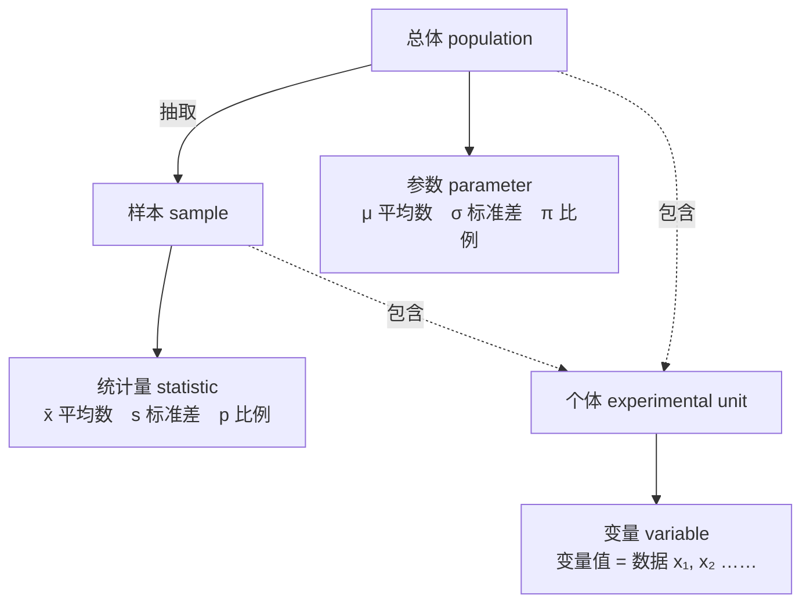

# C1.3 统计中的几个基本概念

> [!abstract] 这一节讲了什么
> 把这门课后面一直要用的几个词定下来：**总体、个体、样本**，**参数与统计量**，**变量与变量值**。这几个词日常也说，但在统计学里含义严格，而且**层级分明**——描述总体的叫参数，描述样本的叫统计量，描述个体的叫变量。搞混了后面全乱。

---

## 一、总体、个体与样本

> [!important] 三个定义
> - **总体（population）**：包含所研究的**全部个体**的集合。
>   *A set of units — usually people, objects, transactions or events — that we are interested in studying.*
> - **个体（elements / experimental unit）**：组成总体的**每一个基本单位**。
>   *The object upon which we collect data.*
> - **样本（sample）**：从总体中**抽取的一部分元素**的集合。

课件在"总体"旁边特意标了两个字：**实体**。这两个字是这一段的关键，下面用一个例子把它讲透。

### 一个容易答错的例子

假设我要做这样一项研究：**中国所有私募股权基金去年的绩效。**

> [!question] 先自己答
> 这项研究的**总体**是什么？**个体**是什么？**样本**是什么？

课堂上的第一反应是：总体是"所有私募股权基金的**绩效**"，个体是"一只基金的**绩效**"。

**这个答案不对。**

问题出在：个体到底是**一个东西本身**，还是**这个东西的某一个属性**？

> [!important] 个体是"实体"，不是属性
> 我们一般认为个体就是**一个一个的实体**。所以在这个例子里：
> - **总体**：中国所有的私募股权基金
> - **个体**：每一只基金
> - **样本**：从中选中的那一部分基金
>
> 而"绩效"**不是个体**，它是我们要研究的那个**属性**。

为什么必须这样？因为**我们研究绩效，通常不能"就绩效研究绩效"**。

想一想：我要研究绩效，怎么研究？我肯定要问**什么东西会影响绩效**——这只基金的**经验**如何、**规模**多大、**基金管理人**是谁、**被投对象**所处的时间段和行业是什么……这些都可能影响绩效。

如果我把"绩效"本身当成个体，那我手上就只有绩效这一个数，什么也分析不了。**所以收集数据的时候，我们一般以实体作为个体。**

### 总体的特性和分类

**总体的特性**（课件 p59）：

- **大量性**
- **差异性**
- **同质性**

**总体的分类**：按其所包含的个体数目**是否可数**，分为

- **有限总体**
- **无限总体**

> [!note] 课件上的一处标注
> 课件 p59 在这里画了一个气泡，写着**"判断每次抽样是否独立"**——有限总体还是无限总体，会影响到后面判断抽样的独立性。这一点在抽样那几章才会真正用到。

---

## 二、参数与统计量

这是这一节最容易考、也最容易混的一对。

> [!important] 参数（parameter）
> **对总体特征的描述**，是研究者想要了解的**总体的某种特征值**。
> *A summary measure that is computed to describe a characteristic of a **population**.*
>
> 常关心的参数：
> - 总体均值 $\mu$
> - 总体标准差 $\sigma$
> - 总体比例 $\pi$
>
> **总体参数通常用希腊字母表示。**

> [!important] 统计量（statistic）
> **对样本特征的描述**，是根据**样本数据**计算出来的一个量。
> *A summary measure that is computed to describe a characteristic of the **sample**.*
>
> 常关心的统计量：
> - 样本均值 $\bar{x}$
> - 样本标准差 $s$
> - 样本比例 $p$
>
> **样本统计量通常用小写英文字母表示。**

### 一个不用死记的记忆法

课堂上给了一个很好用的对应关系：

> [!tip] p 配 p，s 配 s
> - **p**arameter ↔ **p**opulation：**参数**配**总体**
> - **s**tatistic ↔ **s**ample：**统计量**配**样本**
>
> 顺带注意：**statistics（加 s，复数）是统计学；statistic（不加 s）是统计量**——这两个词只差一个字母，别看错。

再配上符号规律，整套东西就闭合了：

| | 总体 population | 样本 sample |
|---|---|---|
| 叫什么 | **参数** parameter | **统计量** statistic |
| 用什么字母 | 希腊字母 | 小写英文字母 |
| 均值 | $\mu$ | $\bar{x}$ |
| 标准差 | $\sigma$ | $s$ |
| 比例 | $\pi$ | $p$ |

> [!important] 最简判别法
> **只要是从抽取出来的样本算出来的值，就是统计量；只要是从总体中算出来的值，就是参数。**
> 后面还会学到很多不同的统计量，但判别标准始终是这一条。

### 课堂例题

> [!example] 例 1
> 当林肯第一次当选总统，他赢得了 **1865908 张选票的 39.82%**。
> 问：39.82% 是参数还是统计量？

先问自己：这个 39.82% 描述的是**总体**还是**样本**？

它是**全部** 1865908 张选票里的比例——是**总体比例**。

**答：参数（parameter）。**

> [!example] 例 2
> 在一个有 **877 名被调查者**的样本中，发现其中的 **45%** 不会雇佣求职申请上有印刷错误的求职者。
> 问：45% 是参数还是统计量？

这个 45% 是从 877 人的**样本**里算出来的，是**样本比例**。

**答：统计量（statistic）。**

---

## 三、变量（Variable）

前面两个概念分别描述总体和样本，那描述**个体**的呢？

> [!important] 变量
> **变量是对个体（experimental unit）特征的描述**——个体的某种令人感兴趣的**属性**。
> *A variable is a characteristic of an individual experimental unit.*
>
> 例如：商品销售额、受教育程度、产品的质量等级。
>
> **变量的具体表现称为变量值，也就是"数据"。**
> *The result of the variable is called the variable value, that is, the data.*

用两个例子把"变量"和"变量值"分清楚：

| 变量（variable） | 变量值 = 数据（data） |
|---|---|
| 销售额 | 具体卖了多少钱 |
| 性别（gender） | 男 / 女（male / female） |

所以"性别"是**变量**，"男、女"是**变量值**，也就是**数据**。

### 变量的分类

课件 p62 给出的分类是：

- **分类变量（categorical variable）**：说明事物**类别**的一个名称。其变量值对应于**分类数据**。
- **顺序变量（rank variable）**：说明事物**有序类别**的一个名称。其变量值对应于**顺序数据**。
- **数值型变量（metric variable）**：说明事物**数字特征**的一个名称。其变量值对应于**数值数据**。数值型变量又分：
  - **离散变量**：取有限个值。可能取值一般都以**整数**形式出现，并可以**一一列举**。例如特定范围的人口数、汽车数量、企业数量、林木株数、畜禽数量。**取值不需要用工具度量，用计数的方式即可。**
  - **连续变量**：在一个区间内**可以连续不断取值**，可以取无穷多个值。例如人的身高、体重、年龄，产品的产量（重量、体积、面积等），产值、销售额等价值量。**需要使用度量工具取值。**

课件 p64 用身高举了个例子：165 和 166 之间，还有 165.1、165.2……可以一直细分下去，这就是"连续"。

---

## 把这三层串起来

这一节的三个概念其实是**同一个结构的三层**：

> [!important] 一句话记住
> **总体 → 参数；样本 → 统计量；个体 → 变量。**
> 变量的取值就是**数据**，而所有的参数和统计量，最终都是从这些数据算出来的。

---

## 四、统计数据（这一讲只开了个头）

概念讲完，课堂转向了**统计数据本身**。

> [!important] 统计数据的特点（课件 p66）
> 1. 是**对现象进行计量的结果**；
> 2. **不是指单个的数字**，而是由多个数据构成的**数据集**；
> 3. **不仅仅是指数字**，它可以是数字的，也可以是文字的。

然后开始讲数据类型，讲到的是第一类：

> [!important] 品质数据（qualitative data）
> **Qualitative data are measurements that cannot be measured on a natural numerical scale; they can only be classified into one of a group of categories.**
> 品质数据就是**只能说明类别**、无法在自然数值尺度上度量的数据。
>
> 品质数据可以进一步分为两类：
> - **nominal**：**分类数据**（也叫品质数据）
> - **ordinal**：**顺序数据**

**第一讲讲到这里为止。** 统计数据按计量尺度、按收集方法、按时间状况的完整分类，留到下一讲。

---

**上一节** → [[C1.2 统计学是什么、怎么分科、怎么学]]
**返回** → [[统计学 MOC]]
