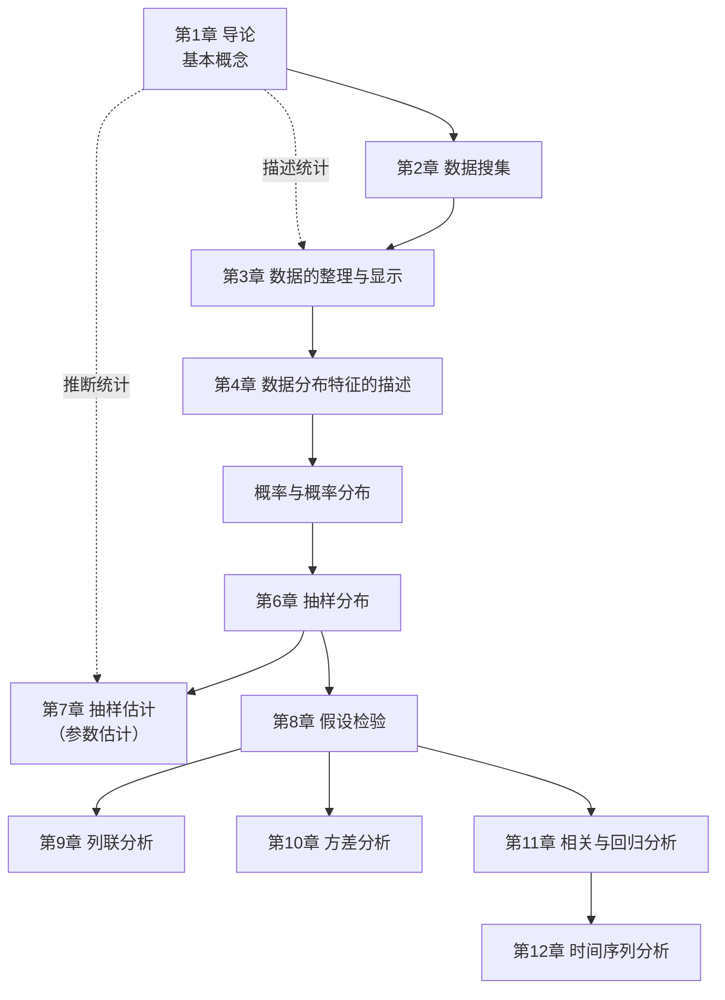

# 统计学原理 · 课程地图

## 课程信息

| 项目 | 内容 |
|---|---|
| 课程 | 统计学原理 |
| 课内学时 / 学分 | 48 / 3 |
| 主讲教师 | 周育红 副教授（华南理工大学经济与金融学院；课件封面印旧称"经济与贸易学院"） |
| 联系方式 | 18666022286 ／ yhzhou@scut.edu.cn |
| 教材 | 《统计学》，贾俊平等编著，中国人民大学出版社 |
| 参考书 | *Statistics for Business and Economics*（8th ed., David R. Anderson）；见讲义 |

**成绩构成（以课堂宣布为准）**：考勤 + 课堂互动 **20%**｜平时作业 **10%**｜期末考试 **70%**
（课件 p56 印的旧版为 10% / 20% / 10% / 60%，已作废。）

> [!warning] 考试结束后成绩即为最终成绩，不接受事后改分，每次要求可能倒扣 5 分。

---

## 第一章 导论

| 笔记 | 对应课件页 | 核心内容 |
|---|---|---|
| [[C1.1 为什么要学统计学]] | p1–26 | 课程交代；三个"想不通的问题"与本科四年；统计学 = 数据 + 方法 + 概率；七八个案例：开车速度与五数概括、彩票与小概率事件、毒胶囊与崔永元、电视调查 vs 随机抽样、啤酒与尿布、顶刊上的星号、纸牌屋与人体第二套基因组 |
| [[C1.2 统计学是什么、怎么分科、怎么学]] | p27–56 | 数据 ≠ 信息；统计学的定义与研究过程；AI 就是统计、贝叶斯如何成为机器学习；词源与三百年历史；描述统计 vs 推断统计；学好统计学的五条；统计软件；课程与成绩 |
| [[C1.3 统计中的几个基本概念]] | p57–68 | 总体 / 个体 / 样本；参数 vs 统计量（p↔population、s↔sample）；变量与变量值；品质数据初步 |

---

## 课程内容地图

---

## 第一讲各案例指向的章节

| 案例 | 指向 |
|---|---|
| 谁开车更快（圆点图、五数概括） | 第 2–3 章 |
| 买彩票（中奖率、返还率、期望、小概率事件） | 第 5–8 章 |
| 媒体报导（毒胶囊、崔永元、电视调查 vs 随机抽样） | 第 2 章 |
| 啤酒与尿布 | 第 2 章（数据收集）、第 11 章（相关分析） |
| 顶刊上的星号（显著性水平） | 第 5–7 章、第 9–12 章 |

---

## 符号速查（跨章累积）

| 含义 | 总体（参数，希腊字母） | 样本（统计量，小写英文字母） |
|---|---|---|
| 均值 | $\mu$ | $\bar{x}$ |
| 标准差 | $\sigma$ | $s$ |
| 方差 | $\sigma^2$ | $s^2$ |
| 比例 | $\pi$ | $p$ |

记忆法：**p**arameter ↔ **p**opulation，**s**tatistic ↔ **s**ample。
注意 **statistics（复数/加s）= 统计学或统计数据**，**statistic = 统计量**。

---

## 公式速查（跨章累积）

$$\text{中奖率}=\frac{\text{中奖彩票数}}{\text{发行总量}}\qquad \text{返还率}=\frac{\text{返还奖金总额}}{\text{彩票总价值}}$$

$$\text{期望回报}=\text{投入金额}\times\text{返还率}$$

**五数概括**：$\text{Min},\ Q_1,\ Q_2(\text{Median}),\ Q_3,\ \text{Max}$ —— 三个四分位数把数据等分为四份。

---

## 授课进度

- **第一讲**（转写稿 `transcript/1.txt`）：讲完第一章的导论案例、统计学定义与分科、学法与课程安排、总体/样本/参数/统计量/变量，最后讲到**"品质数据分为 nominal 分类数据与 ordinal 顺序数据"**为止。
- **尚未讲授**：统计数据按计量尺度（分类 / 顺序 / 间隔 / 比率）、按收集方法（观察 / 试验）、按时间状况（截面 / 时序）的完整分类（课件 p67–91），以及课件里未讲的 Case Study 3（眼镜质量）、Case Study 5（降价与市场份额）、统计学发展史的各学派与人物（课件 p29–35）。

> [!note] 本笔记的收录范围
> 这套笔记**只收录课堂上实际讲授的内容**，按课堂讲授的顺序组织，不做课外拓展。课件上这一讲没有讲到的部分暂不收录，等对应的课堂转写稿到位后再补写。

---

## 附件

- `attachments/C1-圆点图-男女开车最快时速.png` —— 课件 p7 圆点图（裁切自课件）
